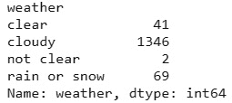
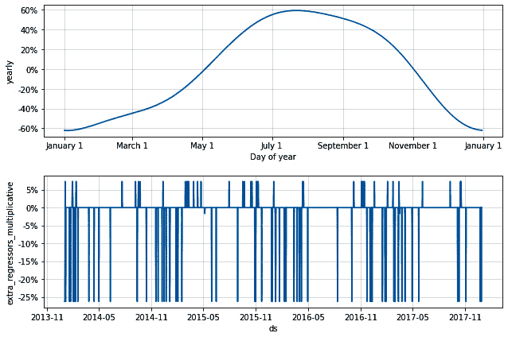
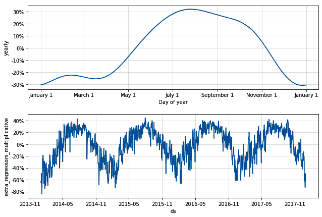
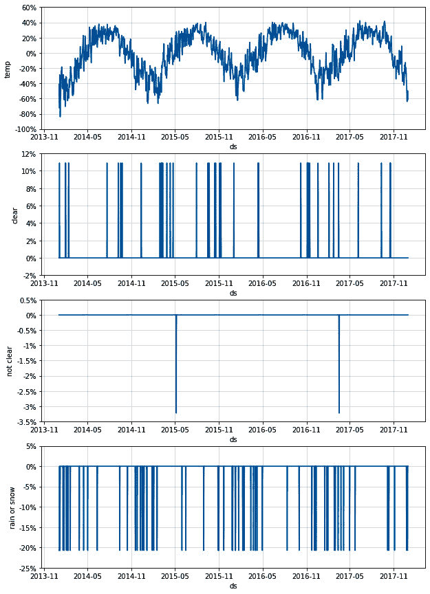

# 包含额外回归因子

在你的第一个模型中，*第二章*，*使用 Prophet 入门*，你仅使用日期（但没有其他信息）来预测未来的二氧化碳水平。后来，在*第六章*，*预测节假日影响*中，你学习了如何将节假日作为附加信息添加，以进一步细化你在芝加哥 Divvy 自行车共享网络中对自行车骑行量的预测。

在 Prophet 中实现节假日的方式实际上是添加二元回归因子的一个特殊情况。实际上，Prophet 包括了一种通用的方法来添加任何额外的回归因子，包括二元和连续的。

在本章中，你将通过将其作为额外回归因子包括进来，用天气信息丰富你的 Divvy 数据集。首先，你将添加二元天气条件来描述阳光、云或雨的存在或不存在，然后你将引入连续的温度测量。使用额外的回归因子可以使你包含更多信息来告知你的模型，这会导致更强的预测能力。在本章中，你将学习以下主题：

+   添加二元回归因子

+   添加连续回归因子

+   解释回归系数

# 技术要求

本章中示例的数据文件和代码可以在[`github.com/PacktPublishing/Forecasting-Time-Series-Data-with-Prophet-Second-Edition`](https://github.com/PacktPublishing/Forecasting-Time-Series-Data-with-Prophet-Second-Edition)找到。

# 添加二元回归因子

在考虑**额外回归因子**时，无论是二元还是连续的，首先需要考虑的是你必须知道整个预测期间的未来值。这并不是节假日的问题，因为我们确切地知道每个未来节假日的具体时间。所有未来值必须已知，就像节假日一样，或者必须单独进行预测。然而，当使用已经被预测的数据构建预测时，你必须小心：第一次预测的错误会累积到第二次预测中，错误会持续累积。

然而，如果一个变量的预测比另一个变量容易得多，那么这可能是这些堆叠预测有意义的案例。**分层时间序列**是一个可能有用的情况的例子：你可能通过预测一个时间序列更可靠的日值，例如，并使用这些值来预测另一个更难预测的时间序列的小时值。

在本章的例子中，我们将使用天气预报来丰富我们的 Divvy 预测。这种额外的回归器是可能的，因为我们通常确实有一周左右的相当可靠的天气预报可用。在这本书的其他例子中，当我们使用 Divvy 数据时，我们经常预测整整一年。然而，在本章中，我们只会预测两周。让我们对芝加哥的天气预报员慷慨一些，并假设他们将在这一时间段内提供准确的预报。

首先，让我们导入必要的包并加载数据：

```py
import pandas as pd
import matplotlib.pyplot as plt
from prophet import Prophet
df = pd.read_csv('divvy_daily.csv')
```

请参考*第五章*中的*图 5.6*，*处理季节性*，以查看此数据中每天骑行的图表。*第五章*中的*图 5.7*显示了此文件中包含的数据的摘录。到目前为止，在这本书中，我们总是排除了此数据集中关于天气和温度的两个列，但这次我们将使用它们。对于我们的第一个例子，让我们考虑天气条件。通过计算每个条件在数据集中出现的次数，我们可以看到它们的频率：

```py
print(df.groupby('weather')['weather'].count())
```

前面的`print`语句的输出如下：



图 9.1 – Divvy 数据集中天气条件的计数

通过按天气分组数据并按计数聚合，我们可以看到每种条件报告的天数。晴朗的天气出现了`41`天，而多云的天气远远是最常见的，有`1346`次出现。`Not clear`只报告了两次，而`rain or snow`出现了`69`次。

既然我们已经了解了我们正在处理的数据，让我们将其加载到我们的 DataFrame 中。我们还将加载`temperature`列，尽管我们直到下一个例子查看**连续**列（其值可能存在于连续体上）时才会使用它。

要加载`weather`列，我们将使用 pandas 的`get_dummies`方法将其转换为四个`1`或`0` – 实际上，这是一个标志，表示条件是否存在：

```py
df['date'] = pd.to_datetime(df['date'])
df.columns = ['ds', 'y', 'temp', 'weather']
df = pd.get_dummies(df, columns=['weather'], prefix='',
                    prefix_sep='')
```

我们现在可以显示 DataFrame 的前五行，以查看前面的代码做了什么：

```py
df.head()
```

`head`语句的输出应该如下所示：


图 9.2 – 带有虚拟天气列的 DataFrame

现在，你可以看到`weather`列中的每个唯一值都已转换为一个新的列。现在让我们实例化我们的模型，将季节性模式设置为乘法，并将年季节性设置为具有`4`个傅里叶阶数，就像我们在前面的章节中所做的那样。

我们还将使用`add_regressor`方法添加额外的回归器。作为此方法的参数，您必须传递回归器的名称，这是 DataFrame 中相应列的名称。您还可以使用`prior_scale`参数来正则化回归器，就像您对假日、季节性和趋势变化点所做的那样。如果没有指定先验尺度，则将使用`holidays_prior_scale`，默认值为`10`。

您还可以指定回归器应该是加法还是乘法。如果没有指定，则回归器将采用`seasonality_mode`中声明的值。最后，该方法有一个`standardize`参数，默认情况下取`'auto'`字符串。这意味着如果列不是二元的，则将对列进行标准化。您可以通过将其设置为`True`或`False`来显式设置标准化。在这个例子中，所有默认值都将很好地工作。

为了使其清晰，我将在第一个`add_regressor`调用中明确声明所有参数，而对于其余的，我们只将声明回归器的名称，并接受所有默认值。

我们必须为每个额外的回归器调用一次`add_regressor`，但请注意，我们省略了`cloudy`回归器。为了 Prophet 能够得到准确的预测结果，这并不是严格必要的。然而，由于包含所有四个二元列将引入**多重共线性**，这使得解释每个条件的个体效应变得困难，因此我们将排除其中一个。但是，Prophet 对额外回归器中的多重共线性相当稳健，所以它不应该对您的最终结果产生重大影响。

当我们之前调用`pd.get_dummies`时，我们可以指定`drop_first=True`参数来排除一个条件，但我决定不这样做，这样我们就可以自己选择要排除的列。`cloudy`条件是最频繁的，因此，通过排除它，我们实际上是在声明`cloudy`是*默认*天气条件，其他条件将作为对其的偏差来陈述：

```py
model = Prophet(seasonality_mode='multiplicative',
                yearly_seasonality=4)
model.add_regressor(name='clear',
                    prior_scale=10,
                    standardize='auto',
                    mode='multiplicative')
model.add_regressor('not clear')
model.add_regressor('rain or snow')
```

记住我们需要为我们的额外回归器提供未来数据，而我们只预测两周，我们需要人为地将我们的训练数据减少两周，以模拟有两个未来周的天气数据但没有乘客数据。为此，我们需要从 Python 的内置`datetime`包中导入`timedelta`。

使用 pandas 中的布尔索引，我们将通过选择所有小于最终日期（`df['ds'].max()`）减去两周（`timedelta(weeks=2)`）的日期来创建一个新的训练数据 DataFrame，称为`train`：

```py
from datetime import timedelta
# Remove final 2 weeks of training data
train = df[df['ds'] < df['ds'].max() - timedelta(weeks=2)]
```

到目前为止，我们实际上是在说我们的数据不是在 2017 年 12 月 31 日结束（正如我们的`df` DataFrame 所做的那样），而是在 2017 年 12 月 16 日结束，并且我们有这两周缺失的天气预报。我们现在在这个`train`数据上拟合我们的模型，并创建一个包含 14 天的`future` DataFrame。

在这一点上，我们需要将这些附加回归器列添加到我们的`future` DataFrame 中。因为我们创建的是`train` DataFrame 而不是直接修改我们的原始`df` DataFrame，所以这些天气值存储在`df`中，我们可以将它们用于我们的`future` DataFrame。最后，我们将对未来进行预测。

预测图将类似于我们之前的 Divvy 预测，所以我们就跳过它，直接看`components`图：

```py
model.fit(train)
future = model.make_future_dataframe(periods=14)
future['clear'] = df['clear']
future['not clear'] = df['not clear']
future['rain or snow'] = df['rain or snow']
forecast = model.predict(future)
fig2 = model.plot_components(forecast)
plt.show()
```

这次，您将看到一个新的子图与其它组件一起显示。以下图像是完整`components`图的裁剪，只显示了年度季节性和这个新组件：



图 9.3 – 二元附加回归器的裁剪组件图

被裁剪的趋势、每周季节性和年度季节性看起来与我们之前在这个数据集中看到的基本相同。然而，我们在`components`图中增加了一个新元素，称为`extra_regressors_multiplicative`。如果我们指定了一些回归器为`additive`，我们在这里将看到第二个子图，称为`extra_regressors_additive`。

在值为 0%的日期上，这些是我们的*基准*日期，当时天气多云，我们将其排除在附加回归器之外。其他日期是那些天气偏离多云的日期，我们将其包括在内。我们将在稍后更深入地探讨这个问题。但首先，让我们将温度纳入我们的模型，并添加一个**连续回归器**。

# 添加连续回归器

在这个例子中，我们将从上一个例子中取出所有内容，并简单地添加一个温度回归器。让我们首先查看温度数据：


图 9.4 – 时间上的芝加哥温度

前面的图表并没有什么令人惊讶的地方；夏季气温上升，冬季气温下降。它看起来很像*第五章*中的*图 5.6*，*处理季节性*，但没有那个上升趋势。显然，Divvy 的骑行量和气温的升降是一致的。

添加温度，一个连续变量，与添加二元变量没有区别。我们只需在 Prophet 实例中添加另一个`add_regressor`调用，指定名称为`'temp'`，并将温度预测包含在我们的`future` DataFrame 中。像之前一样，我们在我们创建的`train` DataFrame 上拟合我们的模型，该 DataFrame 排除了最后两周的数据。最后，我们绘制组件图以查看结果：

```py
model = Prophet(seasonality_mode='multiplicative',
                yearly_seasonality=4)
model.add_regressor('temp')
model.add_regressor('clear')
model.add_regressor('not clear')
model.add_regressor('rain or snow')
model.fit(train)
future = model.make_future_dataframe(periods=14)
future['temp'] = df['temp']
future['clear'] = df['clear']
future['not clear'] = df['not clear']
future['rain or snow'] = df['rain or snow']
forecast = model.predict(future)
fig2 = model.plot_components(forecast)
plt.show()
```

现在，`extra_regressors_multiplicative`图显示了与我们的`temperature`图相同的波动：



图 9.5 – 二元和连续附加回归器的裁剪组件图

还要注意，在*图 9*.*3*中，`yearly`图达到了 60%的效果幅度峰值。然而，现在我们可以看到温度占了一些效果。*图 9*.*5*中的`yearly`图显示了一个 30%的峰值效果，而`extra_regressors_multiplicative`图显示在某些夏日日期上增加了 40%，而在某些冬日日期上乘客量大幅下降了 80%。为了进一步分析，我们现在需要讨论如何解释这些数据。

# 解释回归器系数

现在我们来看看如何检查这些额外回归器的影响。Prophet 包括一个名为`utilities`的包，其中有一个在这里非常有用的函数，称为`regressor_coefficients`。现在让我们导入它：

```py
from prophet.utilities import regressor_coefficients
```

使用它很简单。只需将模型作为参数传递，它将输出一个 DataFrame，其中包含关于模型中包含的额外回归器的某些有用信息：

```py
regressor_coefficients(model)
```

让我们看看这个 DataFrame：


图 9.6 – 回归器系数 DataFrame

它为模型中的每个额外回归器提供一行。在这种情况下，我们有一个用于温度的，还有三个用于我们包含的天气条件。`regressor_mode`列自然会有`additive`或`multiplicative`的字符串，这取决于每个特定回归器对`'y'`的影响。预标准化回归器的平均值（即原始输入数据）保存在`center`列中。如果回归器没有标准化，那么该值将为零。

`coef`列是你真正需要关注的。它表示系数的预期值 – 即，回归器增加一个单位对`'y'`的预期影响。在前面的 DataFrame 中，`temp`的`coef`是`0.012282`。这个系数告诉我们，对于比`center`（在本例中为`53.4`）高出的每一度，对乘客量的预期影响将是`0.012282`，即增加 1.2%。

对于`雨或雪`行，这是一个二元回归器，它告诉我们，在那些雨天或雪天，乘客量将比多云天气低 20.6%，因为这是我们留下的回归器。如果我们包括了所有四种天气条件，为了解释这个值，你会说乘客量将比如果不包括天气条件预测的同一天的值低 20.6%。

最后，`coef_lower`和`coef_upper`列分别表示围绕系数的不确定性区间的下限和上限。只有当`mcmc_samples`设置为大于零的值时，它们才有意义。`mcmc_samples`保留默认值，在这些例子中，`coef_lower`和`coef_upper`将等于`coef`。

现在，为了总结，我们可以使用我们最初在*第六章*，“预测假日效应”中使用的`plot_forecast_component`函数单独绘制这些额外回归变量。在从 Prophet 的`plot`包中导入它之后，我们将遍历`regressor_coefficients` DataFrame 中的每个回归变量来绘制它：

```py
from prophet.plot import plot_forecast_component
fig, axes = plt.subplots(
                        len(regressor_coefficients(model)),
                        figsize=(10, 15))
for i, regressor in enumerate(
    regressor_coefficients(model)['regressor']):
    plot_forecast_component(model,
                            forecast,
                            regressor,
                            axes[i])
plt.show()
```

我们将这些数据作为子图绘制在一个图中，结果如下所示：



图 9.7 – Divvy 额外回归变量图

最后，我们可以单独可视化这些回归变量的影响。这些图的幅度应该与使用`regressor_coefficients`函数在*图 9**.6*中创建的 DataFrame 中的`coef`值相匹配。

关于 Prophet 中的额外回归变量还有一个最后的注意事项：它们总是被建模为线性关系。这意味着，例如，我们发现温度这个额外回归变量每增加一度，乘客量就会增加 1.2%，这是在建模一个将持续到无限的趋势。也就是说，如果温度突然升高到华氏 120 度，我们无法改变线性关系并告知 Prophet，由于天气变得非常热，乘客量可能会减少。

虽然这在目前 Prophet 的设计中是一个限制，但在实际应用中，这通常并不是一个大问题。线性关系通常很好地代表了实际关系，尤其是在数据范围较小的情况下，并且会给你的模型添加很多额外的信息来丰富你的预测。

# 摘要

在本章中，你学习了一种通用的方法来添加任何额外的回归变量，这些变量是在之前学习的。你了解到添加二元回归变量（如天气条件）和连续回归变量（如温度）都使用相同的`add_regressor`方法。你还学习了如何使用 Prophet 的`utilities`包中的`regressor_coefficients`函数来检查你的额外回归变量的影响。

尽管你现在可能想要向你的预测中添加各种额外的回归变量，但你同时也了解到 Prophet 要求所有额外的回归变量在未来的定义值，否则就没有信息来告知预测。这就是为什么我们使用天气数据时只预测了 2 周。

在下一章中，我们将探讨 Prophet 如何处理异常值，以及你如何可以自己更多地控制这个过程。
