# 第十章：考虑异常值和特殊事件

**异常值**是指任何在一条或多条不同轴上显著偏离其他数据点的数据点。异常值可能是由于传感器校准不当产生无效数据，或者在数据输入时键盘上的手指滑动造成的错误数据，或者它们可能是准确记录的数据，但由于各种原因（例如，龙卷风经过风速传感器）意外地与历史趋势相差甚远。

这些不寻常的测量值会动摇任何统计或机器学习模型，因此纠正异常值是数据科学和统计学中的一个挑战。幸运的是，Prophet 通常在处理轻微异常值方面很稳健。然而，对于极端异常值，Prophet 可能会遇到两个问题——一个与季节性有关，另一个与不确定性区间有关。

在本章中，您将看到这两种问题的示例，并学习如何减轻它们对您预测的影响。您还将学习一些自动化异常值检测的技术，最后，您将应用在*第八章*中学习到的经验，即*影响趋势变化点*，以在模型中保留异常值，但指示 Prophet 不要修改趋势或季节性以适应它们。

本章将涵盖以下主题：

+   纠正导致季节性波动的异常值

+   纠正导致宽不确定性区间的异常值

+   自动检测异常值

+   将异常值建模为特殊事件

+   建模冲击，例如 COVID-19 封锁

# 技术要求

本章中示例的数据文件和代码可以在[`github.com/PacktPublishing/Forecasting-Time-Series-Data-with-Prophet-Second-Edition`](https://github.com/PacktPublishing/Forecasting-Time-Series-Data-with-Prophet-Second-Edition)找到。

# 纠正导致季节性波动的异常值

本章我们将使用一个新的数据集来查看异常值——国家地理 Instagram 账户`@NatGeo`上每天帖子平均点赞数，这些数据是在 2019 年 11 月 21 日收集的。

我选择这个数据集是因为它显示了几个显著的异常值，这些异常值在以下图中标记：


图 10.1 – 国家地理 Instagram 账户上的异常值

每条虚线垂直线都表示时间序列发生了显著偏差的时刻。从左数第二条线表示**2015 年**夏季发生了根本性的趋势变化，但其他四条线表示异常值，最后两个异常值跨越了较宽的时间范围。我们将特别关注发生在**2016 年**中期的线条，具体来说是 8 月份。这代表了最极端的异常值。**2014 年**的异常值可以安全忽略，因为它们对预测的影响不大。**2017 年**和**2019 年**的异常值看起来可能是季节性影响，所以我们将让年度季节性来捕捉它们。

事实上，在 2016 年 9 月，国家地理杂志（National Geographic）出版了一本书，[*NatGeo: 最受欢迎的 Instagram 照片*](https://example.org)。似乎在这之前的一个月，国家地理杂志进行了一些营销活动，从而提高了其 Instagram 账号的点赞数。

正如我们在*第八章*中看到的，*影响趋势变化点*，詹姆斯·罗德里格斯（James Rodríguez）的账号在他的世界杯亮相期间也看到了点赞数的增加。然而，在他的情况下，这些事件在其结束时都伴随着更高的点赞基数——发生了显著的趋势变化。相比之下，国家地理杂志在 8 月份的营销工作并没有产生持久性的趋势变化，尽管它确实增加了点赞数。

峰值代表了先知（Prophet）中异常值可能引起的第一种问题——它们可以主导季节性曲线。让我通过绘制先知预测图来展示我的意思。让我们导入必要的库，加载数据，并绘制预测图。我们将使用乘法季节性并将年度季节性的傅里叶阶数降低到`6`：

```py
import pandas as pd
import matplotlib.pyplot as plt
from prophet import Prophet
from prophet.plot import add_changepoints_to_plot
df = pd.read_csv('instagram_natgeo.csv')
df['Date'] = pd.to_datetime(df['Date'])
df.columns = ['ds', 'y']
model = Prophet(seasonality_mode='multiplicative',
                yearly_seasonality=6)
model.fit(df)
future = model.make_future_dataframe(periods=365 * 2)
forecast = model.predict(future)
fig = model.plot(forecast)
plt.show()
```

这些异常值导致 Prophet 模型在每年的 8 月份出现点赞数的峰值：

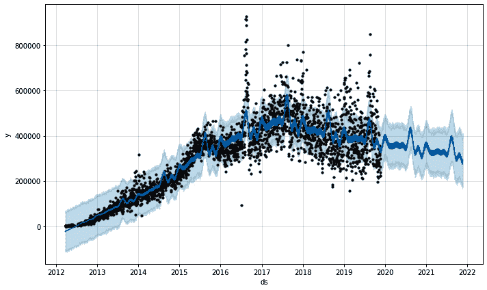

图 10.2 – 带有异常值的国家地理（NatGeo）预测

确实，在**2013 年**、**2015 年**、**2017 年**和**2019 年**的 8 月份也看到了点赞数的增加期，但偶数年份并没有。虽然可以预期会有一些季节性变化，但不会这么多。更糟糕的是，这种影响将永远影响未来。你可以通过查看年度季节性图来了解这种影响的显著性：

```py
from prophet.plot import plot_yearly
plot_yearly(model, figsize=(10.5, 3.25))
plt.show()
```

在这里，你可以清楚地看到 8 月的峰值：

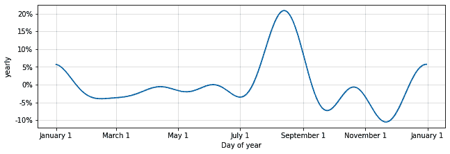

图 10.3 – 先知（Prophet）的年度季节性及异常值

在尝试将年度季节性拟合到**2016 年**的这些异常值时，Prophet 允许**8 月**对预期点赞数的增加贡献超过 20%。我们看到那些频繁的 8 月增加，所以我们确实希望 Prophet 能够模拟它们，但**2016 年**的异常值占主导地位。

解决方案很简单，就是移除这些点。Prophet 处理缺失数据非常出色，因此引入一个小间隔不会造成任何问题。在*第四章*《处理非每日数据》中，你学习了如何通过从`future` DataFrame 中移除这些间隔来处理常规间隔。然而，在这种情况下，只要我们有其他年份的**八月**数据，我们就不需要采取这种预防措施。

看起来第一个主要异常是在 7 月 29 日，最后一个是在 9 月 1 日，所以我们将使用`pandas`的布尔索引排除这些日期之间的数据：

```py
df2 = df[(df['ds'] < '2016-07-29') |
         (df['ds'] > '2016-09-01')]
```

这个新的`df2`与我们的原始`df`完全相同，只是排除了那些异常值。让我们像之前一样构建相同的 Prophet 模型，但只是将之前的 DataFrame `df`替换为这个新的`df2`：

```py
model = Prophet(seasonality_mode='multiplicative',
                yearly_seasonality=6)
model.fit(df2)
future = model.make_future_dataframe(periods=365 * 2)
forecast = model.predict(future)
fig = model.plot(forecast)
plt.show()
```

你可以从这张图中看到 2016 年八月的月度间隔。预报简单地穿过它：

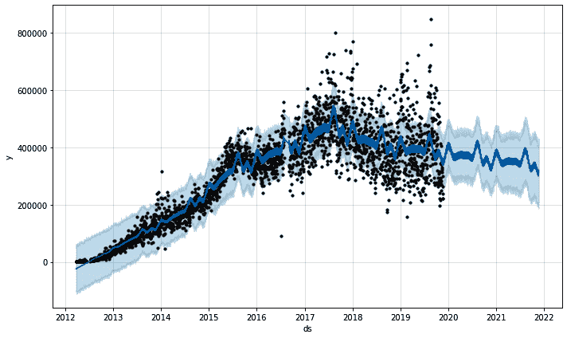

图 10.4 – 移除异常值后的 NatGeo 预报

这个新的预报也显示出显著的季节性，但我们确实预料到这一点，因为 NatGeo 的点赞在夏季通常更高。为了量化这个预报与之前的差异，我们还绘制了年季节性：

```py
plot_yearly(model, figsize=(10.5, 3.25))
plt.show()
```

它的形状与*图 10.3*非常相似，但八月的峰值不那么夸张：

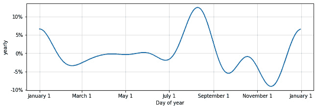

图 10.5 – 移除异常值后的 Prophet 年季节性

现在，八月的峰值几乎减半；它只是增加了 10%以上。这更接近于在没有外部（且非重复）营销推动下发布国家地理书籍之前预期的结果。

现在，让我们看看第二种异常问题。

# 纠正导致不确定性区间过宽的异常值

在我们之前查看的第一种异常类型中，问题是季节性受到影响，并且永远改变了预报中的`yhat`（如果你还记得从*第二章*《使用 Prophet 入门》中，`yhat`是 Prophet 的`forecast` DataFrame 中包含的未来日期的预测值）。在这个第二个问题中，`yhat`的影响最小，但不确定性区间显著扩大。

为了模拟这个问题，我们需要稍微修改一下我们的 NatGeo 数据。假设 Instagram 在其代码中引入了一个错误，将每篇帖子的点赞上限设置为 100,000。这个错误在一年后才被发现并修复，但不幸的是，所有超过 100,000 的点赞都丢失了。这样的错误看起来是这样的：

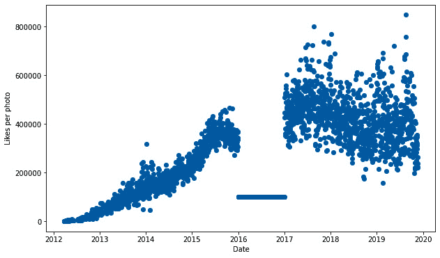

图 10.6 – 国家地理 Instagram 账号上的点赞上限

你可以使用以下代码自己模拟这个新的数据集：

```py
df3 = df.copy()
df3.loc[df3['ds'].dt.year == 2016, 'y'] = 100000
```

这将 2016 年所有帖子的点赞都设置为 100,000。为了看看这会造成什么问题，我们再次构建与之前相同的模型：

```py
model = Prophet(seasonality_mode='multiplicative',
                yearly_seasonality=6)
model.fit(df3)
future = model.make_future_dataframe(periods=365 * 2)
forecast = model.predict(future)
fig = model.plot(forecast)
add_changepoints_to_plot(fig.gca(), model, forecast)
plt.show()
```

在这个例子中，我们将变化点添加到图表中，因为这就是引入错误的地方，如下面的图表所示：


图 10.7 – 包含异常值的 NatGeo 预测

随着时间的推移，未来的不确定性急剧增加。在之前的例子中，Prophet 使用季节性来模拟异常值，向年度季节性组件添加极端数据。然而，在这个例子中，Prophet 使用趋势变化点来模拟异常值。季节性不受影响。

我们将在*第十一章*“管理不确定性区间”中全面讨论不确定性，但简而言之，Prophet 所做的是查看历史变化点的频率和幅度，并预测未来的不确定性，假设未来的变化点可能以相同的频率和幅度发生。因此，如您在*图 10.7*中看到的戏剧性历史变化点将导致戏剧性的未来不确定性，因为 Prophet 不确定它们是否会再次发生。

幸运的是，解决方案与之前的情况相同——简单地移除不良数据。在之前的例子中，我们移除了包含不良数据的 DataFrame 中的行，但在这个例子中，我们将`'y'`值设置为`None`：

```py
df3.loc[df3['ds'].dt.year == 2016, 'y'] = None
```

这对我们趋势或季节性没有影响。它产生影响的方面是，现在，我们不再跳过`forecast` DataFrame 中的那些日期，而是在这些日期上预测值。您可以在即将出现的*图 10.8*中看到这一点。与直接穿过缺失数据的预测线不同，它遵循季节性。

让我们再次重建我们的模型，使用`df3` DataFrame：

```py
model = Prophet(seasonality_mode='multiplicative',
                yearly_seasonality=6)
model.fit(df3)
future = model.make_future_dataframe(periods=365 * 2)
forecast = model.predict(future)
fig = model.plot(forecast)
add_changepoints_to_plot(fig.gca(), model, forecast)
plt.show()
```

与*图 10.7*相比，我们现在已经驯服了预测的不确定性，如下面的图表所示：

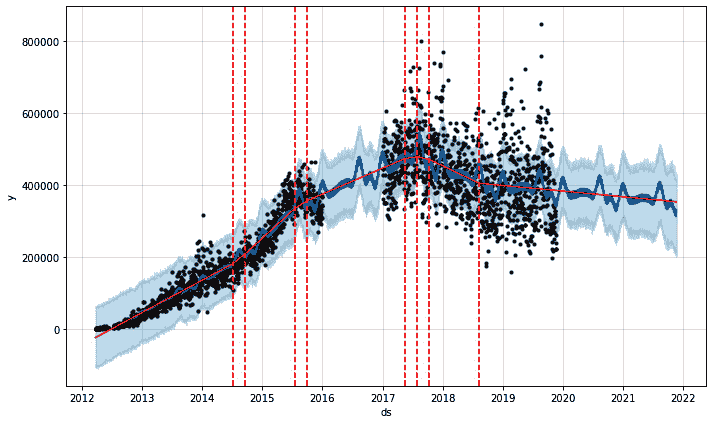

图 10.8 – 移除异常值的 NatGeo 预测

如前所述，我们在 2016 年有缺失数据，但 Prophet 仍然做出了预测并绘制了预测值。这是将那些缺失值设置为`None`而不是删除它们的结果。将*图 10.8*与*图 10.4*进行比较，其中缺失数据没有预测值，图表直接穿过它们形成一条直线。

从数学上讲，这对您的未来预测没有影响；它只是将预测值应用于那些缺失的值。是否希望这些缺失值在`future` DataFrame 中被预测或忽略，完全取决于您。

# 自动检测异常值

在到目前为止的这些例子中，我们通过简单的数据可视化检测到异常值，并应用常识。在一个完全自动化的环境中，定义我们作为人类直观行为的相关逻辑规则可能很困难。异常值检测是分析师时间的好用途，因为我们人类能够比计算机使用更多的直觉、领域知识和经验。但是，由于 Prophet 是为了减少分析师的工作量并尽可能实现自动化而开发的，我们将探讨一些自动识别异常值的技术。

## Winsorizing

第一种技术被称为**Winsorization**，以统计学家查尔斯·P·Winsor 的名字命名。有时它也被称为**截尾**。Winsorization 是一种钝工具，通常不适用于非平稳趋势。Winsorization 要求分析师指定一个百分位数；所有高于或低于该百分位数的数值都被迫保持在百分位数的值上。

**Trimming**是一种类似的技术，不同之处在于移除了极端值。这些技术之间的差异可以通过这个简单的例子看到，在这个例子中，异常值是三个图表每侧最极端的两个点：


图 10.9 – Winsorization 与 Trimming 的比较

小贴士

在统计学中，单词*stationary*意味着均值、方差和自相关结构不会随时间变化。在具有*平稳趋势*的时间序列中，均值不会随时间变化，因此满足了一个（以及可能每个）平稳性的要求。对于平稳数据，异常值通常可以用均值来替换；然而，由于平稳性的要求，这种技术通常不适用于缺乏平稳趋势的时间序列。

为了举一个具体的例子，请参考*第 2.2 节*中的*图 2.2*，即*第二章*，“Prophet 入门”，并查看莫纳罗亚山二氧化碳水平的 Keeling 曲线，想象用全数据集的均值替换其中一个最终值——比如说，2015 年的值。这将导致 2015 年一个荒谬的低值，大约为 360，这是 20 年来未见过的。

让我们看看如何将 Winsorization 应用于我们的国家地理数据。`stats`包有一个 Winsorization 工具，所以我们将使用它。请注意，我们正在丢弃所有空值，因为这些值不适用于此函数。我们将下限设置为`0`，因此下限不受影响，并将上限设置为`.05`，因此影响的是第五个百分位数：

```py
from scipy import stats
df4 = df.copy().dropna()
df4['y'] = stats.mstats.winsorize(df4['y'],
                                  limits=(0, .05), axis=0)
```

Winsorized 国家地理数据看起来是这样的，受影响的数据点用**x**标记：

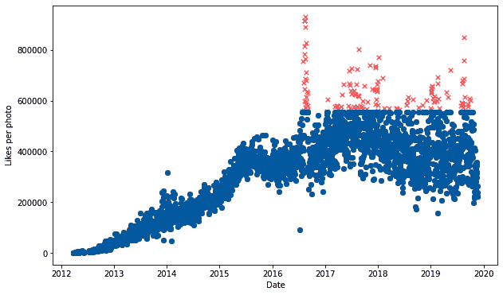

图 10.10 – Winsorized 数据

## 标准差

由于 Winsorization 的限制是通过百分位数设置的，因此没有考虑到数据的自然方差——也就是说，一些数据集非常紧密地围绕平均值分布，而另一些则非常分散。设置百分位数限制不会考虑这一点。因此，有时使用标准差比使用百分位数更有意义。这与 Winsorization 非常相似，如果设置限制得当，可以产生相同的效果。

在上一节中我们进行 Winsorization 时，迫使异常值采用上限的值。在这种情况下，我们将简单地移除异常值。我们正在使用 SciPy `stats` 包中的 `zscore` 函数来消除那些比平均值高 `1.65` 个标准差的数据点；在正态分布中，这个上限值将划分 95% 的数据，这是我们之前设置的相同限制：

```py
df5 = df.copy().dropna()
df5 = df5[(stats.zscore(df5['y']) < 1.65)]
```

在这种情况下，这两种技术几乎具有相同的结果，只是在这里，我们正在修剪数据：


图 10.11 – 使用标准差修剪的数据

当数据具有趋势时，这种方法也是一个不良的拟合。显然，在具有上升趋势的时间序列中，位于后面的点比位于前面的点更有可能被修剪。下一项技术将考虑这一点。

## 移动平均

我们刚刚查看的是从整个数据集的平均值向外扩展的标准差数量，并看到了为什么在存在趋势时它失败的原因。在这个方法中，我们将使用移动平均，这样我们实际上是在本地化我们的平均值和标准差计算，只将这些计算应用于时间上彼此接近的数据点。

在这个例子中，我们将再次使用标准差 `1.65` 的值来修剪数据的上下限。分析师还需要决定窗口大小。这是用于计算时收集的周围数据点的数量。设置得太小，一组异常值将不会被移除。设置得太大，我们将接近之前忽略趋势的技术。

我们在这里使用 `300`。我们将使用 pandas 的 `rolling` 方法来使用滚动窗口找到平均值和标准差。然后，我们使用这些值计算上下限，并使用这些界限过滤我们的 DataFrame：

```py
df6 = df.copy().dropna()
df6['moving_average'] = df6.rolling(window=300,
                                    min_periods=1,
                                    center=True,
                                    on='ds')['y'].mean()
df6['std_dev'] = df6.rolling(window=300,
                             min_periods=1,
                             center=True,
                             on='ds')['y'].std()
df6['lower'] = df6['moving_average'] - 1.65 * \
               df6['std_dev']
df6['upper'] = df6['moving_average'] + 1.65 * \
               df6['std_dev']
df6 = df6[(df6['y'] < df6['upper']) & \
          (df6['y'] > df6['lower'])]
```

现在我们正在获得更精细的异常值移除，如下面的图表所示：


图 10.12 – 使用移动平均修剪的数据

这种方法的强大优势是它考虑到了趋势。

## 错误标准差

我们将考虑的最终方法是最精确的。让我们回到定义异常值的问题——它是一个你不期望的值。直观上，当我们通过视觉检查数据并移除点时，我们就知道了这一点。那么，你如何告诉计算机期望什么？当然，你构建一个预测。

Prophet 的 `forecast` DataFrame 在 `yhat` 列中进行预测，但它还包括 `yhat_upper` 和 `yhat_lower` 列。这些不确定性区间默认设置为 80%，但您将在 *第十一章*，*管理不确定性区间* 中学习如何修改它们。如果我们接受不确定性区间内包含的任何误差，我们可以将超出这些界限的任何异常值宣布为异常值，因为它是不预期的。

事实上，移动平均是一种粗略的预测技术；前一种方法确实基于误差项的偏差来去除异常值。通过使用 Prophet 来识别误差，我们允许季节性和其他效应包含在我们的预期结果中。

作为最精确的方法，这不幸也是最容易过度拟合的方法。如果您确实希望使用这种方法，请确保在使用新数据集时谨慎行事，并在完全自动化之前确保您喜欢结果。话虽如此，让我们看看如何编写代码。

我们的方法将是首先去除空值，以避免在将我们的 `forecast` DataFrame 与原始 DataFrame 进行比较时出现下游问题：

```py
df7 = df.copy().dropna().reset_index()
```

接下来，我们在这些数据上构建一个 Prophet 模型，包括强大的正则化以确保我们不会过度拟合。请注意，没有必要预测未来。我们在这里包含 `interval_width` 参数是为了增加不确定性区间，以便更好地与之前的示例对齐；我们将在下一章中介绍这个参数：

```py
model = Prophet(seasonality_mode='multiplicative',
                yearly_seasonality=6,
                seasonality_prior_scale=.01,
                changepoint_prior_scale=.01,
                interval_width=.90)
model.fit(df7)
forecast = model.predict()
```

最后，我们创建一个 DataFrame，排除了那些 `y` 值大于 `yhat_upper` 或小于 `yhat_lower` 的值。这些将是我们的异常值：

```py
df8 = df7[(df7['y'] > forecast['yhat_lower']) &
          (df7['y'] < forecast['yhat_upper'])]
```

最终的 DataFrame 将用于构建一个新的 Prophet 模型，无需担心异常值。这就是我们现在的数据看起来像这样：

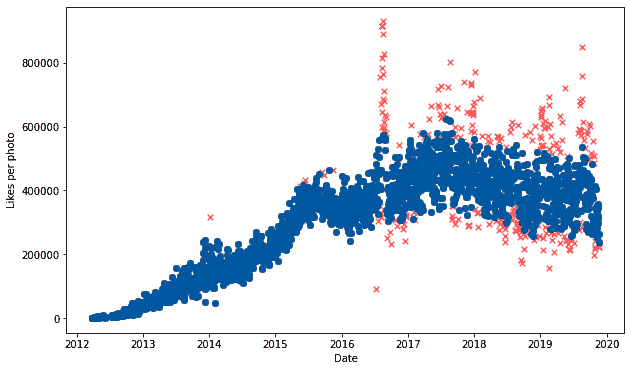

图 10.13 – 从预测中去除误差的数据

我们确实去除了可能被认为是异常值的部分。如果我们使用了 Prophet 的默认不确定性区间，那么在这种情况下异常值去除可能过于激进。如果您将 *图 10*.*13* 与我们其他方法的图表进行比较，这个方法看起来最为精确 – 例如，它允许我们预期在夏季的高值，但去除那些不寻常的高值。

使用这种方法隐含地假设数据是平稳的并且具有恒定的方差，这在整个国家地理数据集中似乎是一个较差的假设，但在仅考虑 2016 年之后的数据时是一个合理的假设。随着时间的推移，完整的数据变得更加分散。这就是为什么在较晚的日期比早期日期删除了更多的数据点 – 这是在使用此方法时需要考虑的又一件事。

在本章中，我们已经从我们的数据中移除了异常值。然而，如果你认为这些异常值在你的模型中提供了一些有价值的信号，但你想控制其影响，你可以使用一种技术来保留这些异常值。这个技术使用 Prophet 的节假日功能。让我们看看如何操作。

# 将异常值建模为特殊事件

在 Prophet 中处理异常值还有最后一种方法；这是一种我们在*第八章*中使用的技巧，*影响趋势变化点* – 我们可以将异常值声明为特殊事件，本质上是一个假期。通过将异常值放入`holidays` DataFrame 中，我们实际上指示 Prophet 将趋势和季节性应用于数据点，就像它们不是异常值一样，并在节假日项中捕捉趋势和季节性之外的额外变化。

如果你知道极端观测值是由于一些你预料不到的外部因素造成的，这将是有用的。这些外部因素可能是世界杯或大型营销活动，但也可能是神秘和未知的。你可以在模型中保留这些数据，但基本上可以忽略它们。一个额外的优点是，你可以模拟如果事件重复会发生什么。

我们将再次使用国家地理数据，但这次，将 2016 年 8 月的异常值系列标记为假期。如果这些额外的点赞是由于围绕他们书籍发布的营销活动，我们可以预测如果他们在稍后的日期重复类似的营销活动会发生什么。

我们在*第六章*中介绍了自定义假期的创建，*预测节假日效应*，因此这一步应该是一个复习。我们只是为 2016 年 8 月的营销活动创建两个假期，以及一个相同的、假设的 2020 年 6 月的营销活动。

注意，这两个事件具有相同的名称，`'Promo event'`，所以 Prophet 知道将相同的效果应用于每个。它们持续的天数相同，尽管不必如此 – 假设事件每一天的节假日效应将与测量事件每一天的效应相匹配。

如果假设事件较短，效应将提前结束。如果假设事件较长，则效应将在测量事件的长度达到时结束。

我们首先以定义假期的相同方式定义促销活动：

```py
promo = pd.DataFrame({'holiday': 'Promo event',
                      'ds': pd.to_datetime(['2016-07-29']),
                      'lower_window': 0,
                      'upper_window': 34})
future_promo = pd.DataFrame({'holiday': 'Promo event',
                      'ds': pd.to_datetime(['2020-06-01']),
                      'lower_window': 0,
                      'upper_window': 34})
promos = pd.concat([promo, future_promo])
```

接下来，我们使用本章中相同的参数构建我们的模型，除了将第一个`promo` DataFrame 发送到`holidays`参数：

```py
model = Prophet(seasonality_mode='multiplicative',
                holidays=promo,
                yearly_seasonality=6)
model.fit(df)
future = model.make_future_dataframe(periods=365 * 2)
forecast = model.predict(future)
fig = model.plot(forecast)
plt.show()
```

我们的预测完美地模拟了异常值的峰值，既没有让季节性失控（我们在本章中首先考虑的问题）或未来不确定性爆炸（第二个问题）：

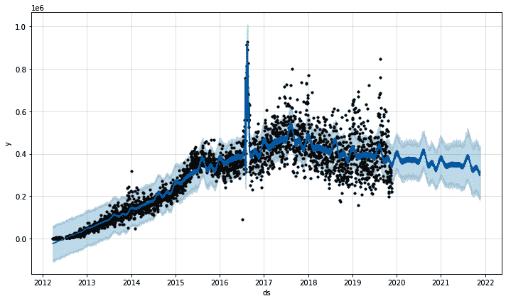

图 10.14 – 将异常值建模为特殊事件的 NatGeo 预测

为了结束这个例子，让我们再尝试一个模型，但这次包括那个假设的促销活动：

```py
model = Prophet(seasonality_mode='multiplicative',
                holidays=promos,
                yearly_seasonality=6)
model.fit(df)
future = model.make_future_dataframe(periods=365 * 2)
forecast = model.predict(future)
fig = model.plot(forecast)
plt.show()
```

如果国家地理频道在 2020 年复制了这些促销活动，他们可以预期的未来预测如下：


图 10.15 – 假设促销活动下的 NatGeo 预测

仅用一个假期的实例进行训练，Prophet 已经完美地将假期效应与数据匹配，这可能是过度拟合的好方法。如果国家地理频道有几次类似的营销活动，他们可以将所有这些活动都建模为同一个假期，这样就可以平均化效应。

将异常值建模为特殊事件的技术甚至可以用来建模对整个时间序列的巨大冲击。在下一节中，我们将看到如何应用这些原则来建模 COVID-19 封锁对行人活动的影响。

# 建模如 COVID-19 封锁这样的冲击

到 2020 年中旬，世界各地的预测者对于未来几个月和几年的预测都感到迷茫。COVID-19 大流行彻底改变了全球的生活，以及许多时间序列。在线购物在 2020 年初的预测之外急剧飙升；Netflix 和 YouTube 等媒体的消费量急剧增加，而现场活动的人数急剧减少。

虽然 Prophet 在预测方面非常出色，但它并不能简单地预测未来。在疫情期间，Prophet 在预测疫情何时结束以及时间序列在封锁期间和封锁之后如何表现方面，会与预测专家一样感到困难。然而，我们可以在事后对系统中的这种冲击进行建模，以了解它们的影响。就像我们在上一节中建模的 NatGeo 促销活动一样，我们可以预测假设这种冲击重复发生的结果。在本节中，我们将使用一个新的数据集，即澳大利亚墨尔本 Bourke Street Mall 的行人数量。

自 2009 年以来，墨尔本市通过自动化传感器在全市多个地点统计行人数量。数据在城市的网站上共享，每月更新，包含每个传感器的每小时行人计数。为了使我们的分析更简单，本例中我们将使用的数据已经预先汇总为每日计数，我们只使用一个传感器的数据——最南端的 Bourke Street Mall 传感器。

Bourke Street 是墨尔本的主要街道之一，传统上是城市的娱乐中心。它是一个受欢迎的旅游目的地，拥有许多餐厅和主要零售店。由于大流行封锁对旅游业、餐厅和面对面零售的影响最为强烈，这个位置似乎是一个观察封锁影响的理想地点。此外，维多利亚州政府宣布了四个不同长度的官方封锁期。我们可能预计这些将标志着行为发生的明显而突然的变化。让我们加载数据集并查看它：

```py
df = pd.read_csv('pedestrian_counts.csv')
df['Date'] = pd.to_datetime(df['Date'])
plt.figure(figsize=(10, 6))
plt.scatter(x=df['Date'],
            y=df['Daily_Counts'],
            c='#0072B2')
plt.xlabel('Date')
plt.ylabel('Pedestrians per day')
plt.show()
```

数据显示一个适度平坦的趋势，有明显的季节性影响，当然，从 2020 年开始的一个严重异常持续存在：


图 10.16 – Bourke Street Mall 的每日行人计数

数据集包含一些对我们这次分析不感兴趣的列，因此在我们能够看到 Prophet 如何处理预测之前，我们需要提取仅包含`Date`和`Daily_Counts`列，并在 Prophet 的格式中重命名它们：

```py
df = df[['Date', 'Daily_Counts']]
df.columns = ['ds', 'y']
```

现在，让我们构建一个基本的预测，展望整整一年：

```py
model = Prophet(seasonality_mode='multiplicative')
model.fit(df)
future = model.make_future_dataframe(periods=365)
forecast = model.predict(future)
fig = model.plot(forecast)
plt.show()
```

预测似乎在努力适应 COVID 冲击的趋势：


图 10.17 – 未考虑冲击的预测

此模型并未为我们提供关于我们可以归因于封锁的具体影响的洞察。为了模拟这种封锁冲击，我们将创建假期来代表封锁的日子，并将冲击处理方式与我们在上一节中处理 NatGeo 促销的方式相似。为此，我们首先需要定义我们的封锁假期（有点讽刺的矛盾！）。

在*第六章*“预测假期影响”中，你学习了如何使用`lower_window`和`upper_window`创建多日假期。我们在这里将再次这样做，为每个四个官方封锁定义一个开始日期，并使用`upper_window`来设置封锁的长度：

```py
lockdowns = pd.DataFrame([
    {'holiday':'lockdown1',
     'ds': pd.to_datetime('2020-03-21'),
     'lower_window': 0,
     'upper_window': 77},
    {'holiday':'lockdown2',
     'ds': pd.to_datetime('2020-07-09'),
     'lower_window': 0,
     'upper_window': 110},
    {'holiday':'lockdown3',
     'ds': pd.to_datetime('2021-02-13'),
     'lower_window': 0,
     'upper_window': 4},
    {'holiday':'lockdown4',
     'ds': pd.to_datetime('2021-05-28'),
     'lower_window': 0,
     'upper_window': 13}])
```

我们没有指定任何未来的日期，因此 Prophet 不会在未来任何时刻尝试重复这些封锁。当我们创建下一个模型时，我们将这个`lockdown` DataFrame 传递给`holidays`参数：

```py
model = Prophet(seasonality_mode='multiplicative',
                holidays=lockdowns)
model.fit(df)
future = model.make_future_dataframe(periods=365)
forecast = model.predict(future)
fig = model.plot(forecast)
plt.show()
```

我们得到的预测看起来与*图 10.17*中的预测非常相似：

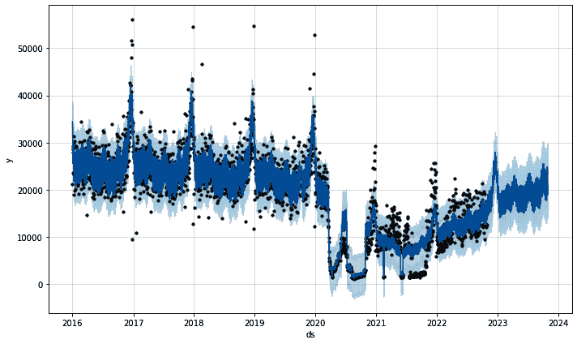

图 10.18 – 将封锁建模为假期的预测

现在，然而，当我们查看“组成部分”图时，我们将看到那些封锁的具体影响：

```py
fig2 = model.plot_components(forecast)
plt.show()
```

我们在“假期”图中看到行人数量减少了大约 100%！

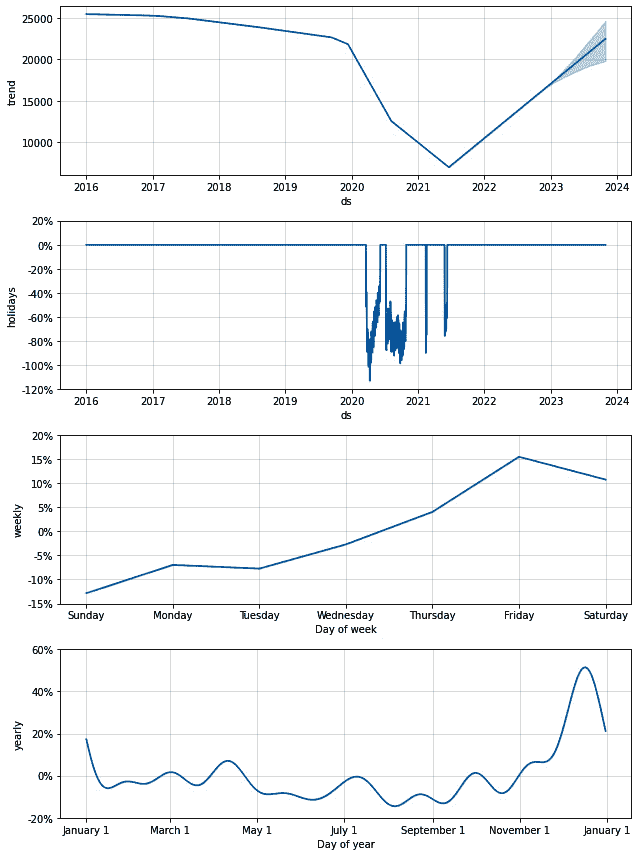

图 10.19 – 展示 COVID-19 封锁影响的组成部分图

*图 10.19*中节假日的分布图展示了封锁如何有效地使行人交通几乎停滞。封锁的另一个可能甚至更持久的影响是远程工作的转变。全世界的许多工人现在能够在家中履行工作职责，不再像以前那样严格地遵循周一至周五，9:00 至 17:00 的日程安排。我们可以假设这可能会在一定程度上改变每周的季节性。*图 10.19*中显示的每周高峰表明周五是 Bourke Street 上最受欢迎的一天，其次是周六。这种模式在 COVID-19 之后是否仍然成立？

你在*第五章*“处理季节性”中学习了如何创建条件季节性；现在让我们用同样的原则来创建 COVID-19 之前的每周季节性和 COVID-19 之后的每周季节性。我们将为第一个封锁开始之前的所有日期定义一个`pre_covid`季节性，为最终封锁结束之后的所有日期定义一个`post_covid`季节性。我们还可以为两者之间的日期创建一个`during_covid`季节性，但由于行人流量几乎停滞且没有数据可用，从这种季节性中获得的任何见解至多是无意义的，甚至可能具有误导性：

```py
df['pre_covid'] = df['ds'] < '2020-03-21'
df['post_covid'] = df['ds'] > '2021-06-10'
```

现在，我们将对此数据进行第三次预测，但这次我们将关闭默认的每周季节性，并添加我们的两个条件每周季节性。记住，我们必须将这些条件添加到`future`数据框中！

```py
model = Prophet(seasonality_mode='multiplicative',
                weekly_seasonality=False,
                holidays=lockdowns)
model.add_seasonality(
    name='weekly_pre_covid',
    period=7,
    fourier_order=3,
    condition_name='pre_covid',
)
model.add_seasonality(
    name='weekly_post_covid',
    period=7,
    fourier_order=3,
    condition_name='post_covid',
)
model.fit(df)
future = model.make_future_dataframe(periods=365)
future['pre_covid'] = future['ds'] < '2020-03-21'
future['post_covid'] = future['ds'] > '2021-06-10'
forecast = model.predict(future)
fig = model.plot(forecast)
plt.show()
```

运行此代码将生成以下图表：


图 10.20 – 带有条件每周季节性的预测

最后，让我们看一下`components`图，看看封锁产生了哪些持久影响：

```py
fig2 = model.plot_components(forecast)
plt.show()
```

趋势、节假日和年度季节性与*图 10.19*中的几乎相同，因此它们已被裁剪出以下图表，该图表仅显示 COVID-19 之前和之后的封锁的两种每周季节性：

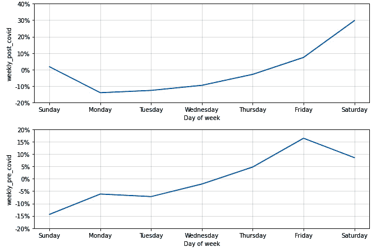

图 10.21 – 一个显示条件季节性的裁剪成分图

正如我们在*图 10.19*中提到的，COVID-19 之前周五是 Bourke Street 上最受欢迎的一天。然而，COVID-19 之后，似乎周六是最受欢迎的一天。随着越来越多的人在家工作，周五可能的工作后欢乐时光似乎减少了，取而代之的是人们选择待在家里！也许 Netflix 在其消费数据中看到了相反的模式……

# 摘要

异常值是任何数据分析的事实，但它们并不总是需要引起头痛。Prophet 在处理大多数异常值时非常稳健，无需任何特殊考虑，但有时可能会出现问题。在本章中，你学习了 Prophet 中与异常值最常见的问题——不受控制的季节性和爆炸性的不确定性区间。

在这两种情况下，简单地删除数据是解决问题的最佳方法。只要在那些删除数据的位置，季节性周期中的其他时期存在数据，Prophet 就没有问题找到良好的拟合。

你还学习了多种自动异常值检测技术，从基本的 Winsorization 和 trimming 技术，这些技术通常对表现出趋势的时间序列效果不佳，到更高级的堆叠预测技术，使用第一个模型中的误差来为第二个模型移除异常值。

最后，你学习了如何将异常值和重大的、持久的冲击，如 COVID-19 封锁，作为特殊事件进行建模，这具有与删除数据同时保留该异常值信息相同的效果。这种技术的好处是允许你模拟未来时间序列中发生的类似冲击。

在下一章中，我们将探讨与异常值相关的一个概念——不确定性区间。
