# 第十一章：管理不确定性区间

预测本质上是对未来的预测，任何预测都会有特定的不确定性。量化这种不确定性可以帮助分析师了解他们的预测有多可靠，并为他们的经理提供在决策上投入大量资本的信心。

Prophet 从一开始就是为了考虑不确定性建模而设计的。虽然你可以使用**Python**或**R**与之交互，但其底层模型是用**Stan**编程语言构建的，这是一种概率语言，允许 Prophet 以高效的方式执行**贝叶斯抽样**，从而更深入地理解模型中的不确定性，以及预测的业务风险。

有三个不确定性来源会影响到你的 Prophet 模型中的总不确定性：

+   趋势中的不确定性

+   季节性、节假日以及额外回归因子中的不确定性

+   数据噪声引起的不确定性

其中最后一个是不管你使用什么数据都固有的属性，但前两个是可以进行建模和检验的。在本章中，你将学习到 Prophet 如何建模不确定性，如何在你的模型中控制它，以及如何使用这些不确定性估计来量化风险。具体来说，本章将涵盖以下主题：

+   对趋势中的不确定性进行建模

+   对季节性中的不确定性进行建模

# 技术要求

本章中示例的数据文件和代码可以在[`github.com/PacktPublishing/Forecasting-Time-Series-Data-with-Prophet-Second-Edition`](https://github.com/PacktPublishing/Forecasting-Time-Series-Data-with-Prophet-Second-Edition)找到。

# 对趋势中的不确定性进行建模

你可能已经注意到在这本书的不同组件图中，趋势显示了不确定性界限，而季节性曲线则没有。默认情况下，Prophet 只估计趋势中的不确定性，以及数据中随机噪声引起的不确定性。噪声被建模为围绕趋势的正态分布，而趋势不确定性则使用**最大后验估计**（**MAP**）**估计**。

MAP 估计是一个优化问题，它通过**蒙特卡洛模拟**来解决。以摩纳哥著名的赌场命名，蒙特卡洛方法使用重复的随机抽样来估计一个未知值，通常在封闭形式的方程不存在或计算困难时使用。

在*第六章*“预测节假日效应”中，我们讨论了`model.fit(df)`调用。

让我们看看一些可以用来控制趋势不确定性的 Prophet 参数。在本章中，我们将使用一个新的数据集，涵盖从 2011 年到 2019 年巴尔的摩警察局每天报告的犯罪数量。让我们从导入和加载数据开始：

```py
import pandas as pd
import matplotlib.pyplot as plt
from prophet import Prophet
from prophet.plot import add_changepoints_to_plot
import numpy as np
np.random.seed(42)
df = pd.read_csv('baltimore_crime.csv')
df.columns = ['ds', 'y']
```

如果你绘制数据，你会看到它有一个相对平坦的趋势、季节性和几个异常值。特别是，我在以下图表中画了一条虚线，其水平为每天 250 起犯罪。在这条线以上的有两个数据点：

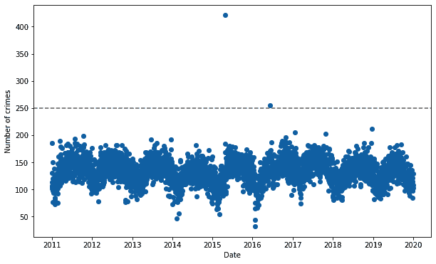

图 11.1 – 巴尔的摩犯罪数据

虽然这些点可能不会像我们在第十章中查看的 National Geographic 数据中的异常值那样影响我们的预测，但让我们将它们移除，并避免任何潜在的问题，如下所示：

```py
df.loc[df['y'] > 250, 'y'] = None
```

重要提示

注意，我们导入了 NumPy 并设置了随机种子。在 Prophet 中，MAP 估计是一种确定性计算，所以你将始终得到相同或几乎相同的结果（由于不同机器处理浮点数的方式略有不同，因此可能略有差异）。然而，不确定性区间是随机生成的。通过 1,000 次迭代，它们在重复实验中应该非常相似，但如果未设置随机种子，那么你的图表可能不会与本书中的图表匹配。此外，**马尔可夫链蒙特卡洛**（**MCMC**）采样，当需要季节性不确定性估计时使用，将在本章后面讨论，它确实为趋势计算添加了随机性。设置随机种子将确保你得到与本书相同的结果。

Prophet 预测中的最大不确定性来源是未来趋势变化的潜在可能性。在训练模型时，Prophet 会对未来进行许多蒙特卡洛模拟，假设未来趋势变化点将以与历史变化点相同的频率和幅度发生。因此，具有历史变化点幅度大的时间序列将看到非常宽的趋势不确定性；我们在第十章的*图 10.7*中看到了这一点，该图来自*第十章*，*处理异常值和特殊事件*。

Prophet 运行的蒙特卡洛模拟次数是通过在模型实例化时设置`uncertainty_samples`参数来确定的。默认情况下，它设置为`1000`，因此 Prophet 模拟了 1,000 条不同的未来趋势线，并使用这些线来估计不确定性。

让我们明确地构建我们的第一个模型，通过在实例化模型时设置`uncertainty_samples=1000`来指定这个默认值。然后我们将拟合模型，创建一个五年的预测，并带有变化点的图表。对于这个巴尔的摩犯罪数据，我们可以在模型实例化期间保持所有其他默认设置：

```py
model = Prophet(uncertainty_samples=1000)
model.fit(df)
future = model.make_future_dataframe(periods=365 * 5)
forecast = model.predict(future)
fig = model.plot(forecast)
add_changepoints_to_plot(fig.gca(), model, forecast)
plt.show()
```

从数据集的开始，看起来 2011 年巴尔的摩的犯罪率上升，在接下来的几年里略有下降，然后再次上升，最后又下降。Prophet 将继续这一趋势，并延伸到未来：

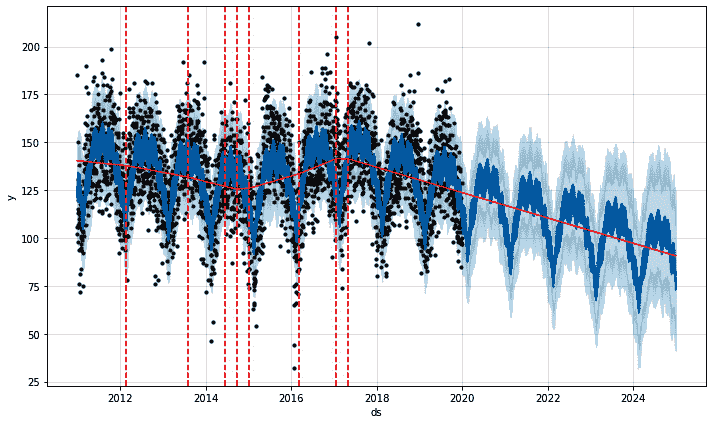

图 11.2 – 使用 1,000 个不确定性样本的巴尔的摩犯罪预测

不确定性（图中较浅的阴影区域）存在于历史和未来的所有点。现在，让我们绘制成分：

```py
fig2 = model.plot_components(forecast)
plt.show()
```

趋势不确定性仅存在于预测的未来中；历史数据中没有任何不确定性：

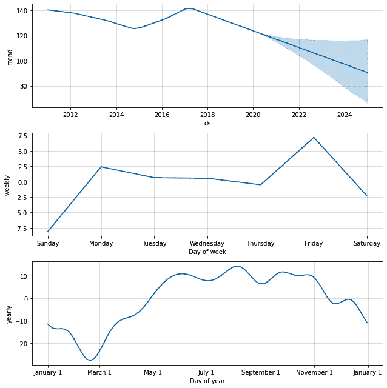

图 11.3 – 使用 1,000 个不确定性样本的巴尔的摩犯罪成分图

这是因为所有历史不确定性都归因于噪声。正如我之前所说，噪声被建模为围绕预测的正态分布。由于趋势不确定性是由于未来趋势变化点的不确定性，因此趋势不确定性仅存在于未来。在*图 11**.2*中看到的总不确定性是噪声不确定性和趋势不确定性之和。此外，Prophet 团队指出，他们关于未来趋势变化永远不会比先前趋势变化更大的假设是一个非常限制性的假设，因此你不应该期望在不确定性区间上获得极端精确的覆盖。

当 Prophet 运行 1,000 次迭代以估计未来的趋势变化时，它将每个结果保存在模型的`predictive_samples`属性中。这是一个键为`'yhat'`和`'trend'`的字典，分别存储每个迭代的总预测估计值和仅趋势的预测估计值：

```py
samples = model.predictive_samples(future)
```

通过将`samples['trend']`与`future['ds']`绘制在一起，对于每个样本，你可以看到 Prophet 的 1,000 个潜在趋势模拟中的每一个：

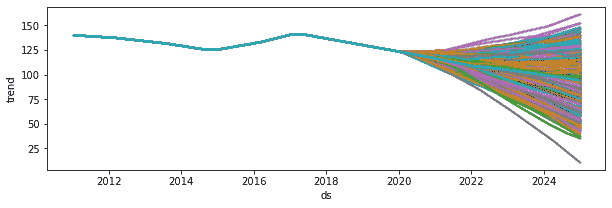

图 11.4 – 使用 1,000 个不确定性样本的巴尔的摩犯罪趋势

默认情况下，Prophet 的不确定性区间为 80%。在 80%的置信水平内，那 1,000 条可能的趋势线是等可能的。因为未来的不确定性是从未来的潜在变化点估计的，而这些变化点又是从先前的变化点估计的，通过使用`changepoint_prior_scale`来增加或减少先前变化点的数量将对不确定性界限产生匹配的影响。

通常没有必要将不确定性样本的数量更改为默认值以外的任何值。增加它将给你更好的不确定性估计，但会以计算时间为代价；但 1,000 个样本通常足以得到一个好的估计。将参数设置为`uncertainty_samples=0`或`uncertainty_samples=False`是一个特殊情况，这会禁用不确定性估计并显著加快计算速度。

通过`interval_width`参数可以控制不确定性水平。如果你想对自己的不确定性水平更有信心，你可能想增加这个值；减小它将给你更紧的界限，但信心会降低。让我们将宽度增加到`0.99`，以达到 99%的置信水平：

```py
model = Prophet(interval_width=0.99)
model.fit(df)
future = model.make_future_dataframe(periods=365 * 5)
forecast = model.predict(future)
```

我只会绘制趋势图，因为这是这种变化影响最明显的地方：

```py
from prophet.plot import plot_forecast_component
plot_forecast_component(model,
                        forecast,
                        ‹trend›,
                        figsize=(10.5, 3.25))
plt.show()
```

将以下图表与图 *11.3* 中的趋势组件进行比较：

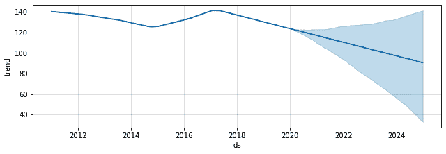

图 11.5 – 巴尔的摩犯罪趋势图，包含 99% 的不确定性区间宽度

在这个图表中，不确定性的宽度要大得多。因为我们希望有更高的信心保证边界包含真实趋势，所以我们不得不扩大边界以提供这种更高的确定性。

你在这本书中一直在建模趋势不确定性。但现在你希望看到季节性中的不确定性边界。在下一节中，你将学习如何实现这一点。

# 对季节性进行不确定性建模

MAP 估计非常快，这就是为什么它是 Prophet 的默认模式，但它不适用于季节性，因此需要不同的方法。为了对季节性不确定性进行建模，Prophet 需要使用 MCMC 方法。**马尔可夫链**是一个描述一系列事件的模型，每个事件发生的概率取决于前一个事件的状态。Prophet 使用这个连锁序列来建模季节性不确定性，并使用在上一节开头描述的蒙特卡洛方法重复序列多次。

缺点是 MCMC 样本采样速度慢；在 macOS 或 Linux 机器上，你应该预计拟合时间为几分钟而不是几秒钟。不幸的是，在 Windows 机器上，与 Prophet 的 Stan 语言模型接口的 PyStan API 存在上游问题，这意味着 MCMC 样本采样非常慢。根据数据点的数量，在 Windows 机器上拟合模型有时可能需要几个小时。

Prophet 团队建议 Windows 机器上的用户使用 R 或在 Linux 虚拟机中使用 Python 与 Prophet 一起工作。另一种选择是使用 Google 的 Colab 笔记本，它们类似于云托管的 Jupyter 笔记本。它们是免费使用的，并且内置在 Linux 中，因此它们不会遇到 Windows 面临的 PyStan 问题。您可以通过 [`colab.research.google.com/`](https://colab.research.google.com/) 访问它们。

在排除这些注意事项之后，让我们看看如何对季节性进行不确定性建模。我们将保留迄今为止使用的默认 `1000` 不确定性样本，并为 `mcmc_samples` 添加不同的参数。如果你将此参数设置为 `0`，Prophet 将回退到 MAP 估计，并且只提供趋势组件的不确定性，回退到本章前面示例中创建的模型。我们将使用 300 个 MCMC 样本：

```py
model = Prophet(mcmc_samples=300)
model.fit(df)
future = model.make_future_dataframe(periods=365 * 5)
forecast = model.predict(future)
fig = model.plot(forecast)
add_changepoints_to_plot(fig.gca(), model, forecast)
plt.show()
```

在拟合和预测之后，我们绘制了预测图。你可能会首先注意到变化点的数量，如下面的图表所示：


图 11.6 – 巴尔的摩犯罪预测图，包含 300 个 MCMC 样本

我们将在稍后处理那个变化点问题。现在，让我们看看成分图：

```py
fig2 = model.plot_components(forecast)
plt.show()
```

你现在应该看到`weekly`和`yearly`季节性的不确定性区间如下：

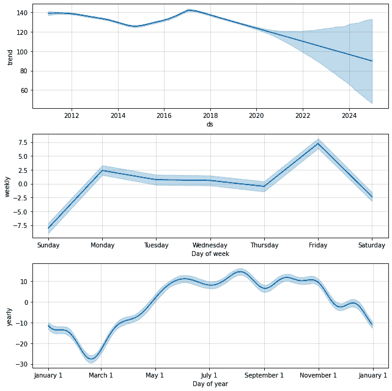

图 11.7 – 巴尔的摩犯罪成分图，包含 300 个 MCMC 样本

如果我们添加了假日或任何其他回归因子，你也会在那里看到不确定性区间。现在就试试吧，使用第九章中的 Divvy 示例，即*包括*其他回归因子。

在这个模型中，我们接受了默认的`uncertainty_samples=1000`参数，并设置了`mcmc_samples=300`。当 Prophet 运行其 MCMC 方法时，它总共使用四个链（尽管这个值可以通过`fit`调用中的`chains`关键字参数来更改）。`mcmc_samples`参数是每个链生成的总样本数。这与`uncertainty_samples`参数不同，后者是生成总趋势线样本数的总数。

当`mcmc_samples=0`时，Prophet 将生成与`uncertainty_samples`参数中定义的潜在趋势线数量完全一致的数量。然而，当`mcmc_samples`大于零的任何值时，Prophet 将生成至少与`uncertainty_samples`参数中定义的潜在趋势线数量一样多的趋势线，但可能更多，因为它需要每个链有相同数量的迭代。这可能会有些令人困惑，但这只是一个小的技术细节。你可能注意到的唯一实际影响是`model.predictive_samples(future)`可能比你在`uncertainty_samples`中指定的行数多出几分之一。

现在，让我们回到那些变化点。为什么在执行 MCMC 采样时会有这么多变化点？如果你还记得第八章中的内容，即*影响趋势变化点*，Prophet 设置了一个较高的潜在变化点数量，并尝试将它们的幅度设置得尽可能低。这对于 MAP 估计来说效果很好。然而，在贝叶斯分析中，正如 MCMC 采样中那样，有一个众所周知的现象会导致参数不会以相同的方式收缩。

这是我们第一个模型的变化点幅度图，如图*图 11.2*所示，以及我们最新的模型，如图*图 11.6*所示：

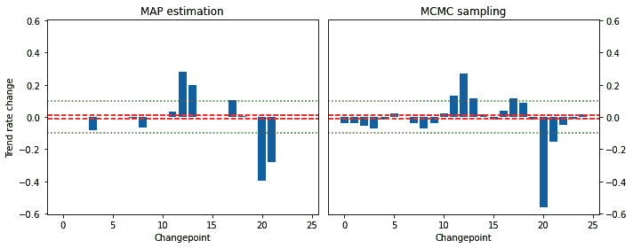

图 11.8 – 不同不确定性估计导致的变化点幅度

我们遇到的问题不是模型本身的问题，而是可视化的问题。前图中两条虚线显示了`add_changepoints_to_plot`函数中绘制变化点幅度的默认`0.01`阈值（虚线表示提高了阈值的`0.1`）。

超出此线的改变点在*图 11.2*中进行了绘制。*图 11.6*中绘制的模型有更多超出此线的改变点，因此也进行了绘制。然而，额外的改变点相互抵消。它们先是负的，然后是正的。整体效果是，*图 11.2*和*图 11.6*的趋势几乎相同：

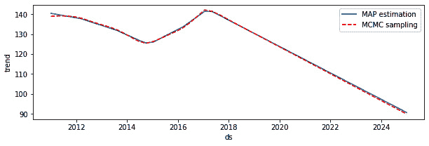

图 11.9 – 不同变化点不确定性估计的结果趋势线

从这个例子中我们得到的教训不是过分担心它。如果你想在你图表上得到一个更合理的数量变化点，当添加变化点时，你可以自由地更改`threshold`参数。在这里，我们将其更改为`0.1`，这是*图 11.8*中用虚线标记的水平：

```py
fig = model.plot(forecast)
add_changepoints_to_plot(fig.gca(), model, forecast,
                         threshold=0.1)
plt.show()
```

现在我们看到以下类似的改变点数量：

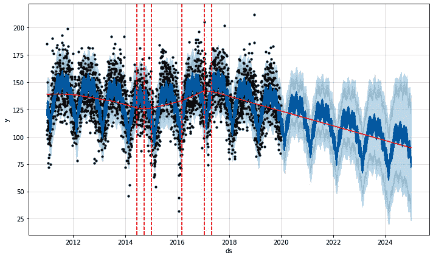

图 11.10 – 增加变化点阈值的巴尔的摩犯罪预测

它们是不同的变化点，但请记住，这只是可视化中出现的问题。两个模型最终的趋势非常相似。出现的小差异是由于不同的统计抽样技术；这两种技术都没有一种是比另一种更正确的 – 它们都是数据估计。

但这并不总是如此。有时你会看到 MCMC 采样中趋势变化的太多。如果发生这种情况，你可以简单地降低你的`changepoint_prior_scale`值，并稍微控制一下变化点的大小。例如，让我们将其从我们一直在使用的`0.05`默认值降低到`0.03`：

```py
model = Prophet(changepoint_prior_scale=0.03,
                mcmc_samples=300)
model.fit(df)
future = model.make_future_dataframe(periods=365 * 5)
forecast = model.predict(future)
fig = model.plot(forecast)
add_changepoints_to_plot(fig.gca(), model, forecast,
                         threshold=0.1)
plt.show()
```

在这个层面上，我们比*图 11.6*中的变化点更少，如下面的图表所示：

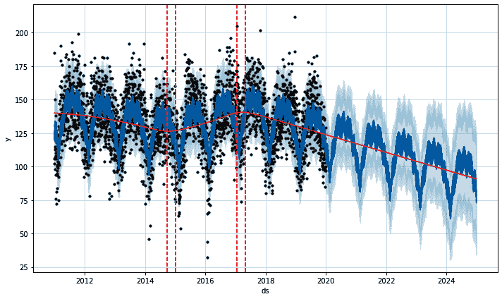

图 11.11 – 增加变化点正则化的巴尔的摩犯罪预测

如果我们比较趋势线，我们会看到这条正则化线与原始 MAP 估计非常吻合：

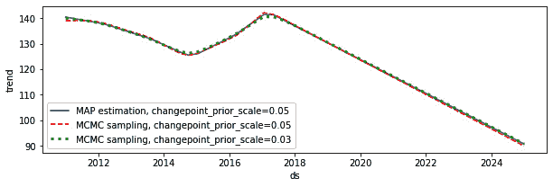

图 11.12 – 不同变化点先验尺度的结果趋势线

如果你使用 MCMC 抽样，只需确保注意增加的变化点数量。如果你的趋势线看起来过度拟合，你可以简单地减少变化点先验尺度来控制它。

# 摘要

不确定性区间是理解你的预测的重要工具。对未来没有任何预测能够带有绝对的信心。通过明确地说明你模型中的置信水平，你为你的观众提供了对模型预测中涉及的风险的理解，以便更好地指导他们的决策。

在本章中，你了解到之前章节中构建的所有模型都使用了 MAP 估计来创建置信水平。这种方法比替代方法 MCMC 采样计算时间更短，但只能对趋势成分中的不确定性进行建模。通常，这已经足够了。然而，在那些你还需要对季节性、假日或额外回归器的不确定性进行说明的时候，你也学会了如何在 Prophet 中应用 MCMC 采样来构建一个更全面的不确定性模型。

最后，你学习了 MCMC 采样在趋势变化点应用正则化方面的固有弱点。在使用 MCMC 采样构建的 Prophet 模型中，你通常会看到比使用 MAP 估计构建的模型中更多的显著变化点。正因为如此，你学会了在使用 MCMC 采样时密切注意趋势过拟合，并相应地调整变化点先验尺度。

在下一章中，你将学习 Prophet 中的交叉验证。你可能对其他机器学习应用中的 k 折交叉验证很熟悉；k 折交叉验证在时间序列中是失败的。我们将介绍一种不同的方法，称为前向链式。

# 第三部分：诊断与评估

本节的最后部分将关于模型评估和下一步操作。你将学习如何使用 Prophet 内置的性能指标以统计稳健的方式比较不同的模型，以及如何可视化它们的性能。最后，本节将以一些 Prophet 的附加功能结束，这些功能可以在将 Prophet 部署到现实世界的用例中使用，在这些用例中，更新模型和共享结果可能是频繁发生的。

本节包括以下章节：

+   *第十二章*，*执行交叉验证*

+   *第十三章*，*评估性能指标*

+   *第十四章*，*将 Prophet 投入生产*
