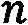

# 评估性能指标

任何真实世界现象的模型都不是完美的。关于基础数据做出了无数统计假设，测量中存在噪声，还有未知和未建模的因素会影响输出。尽管如此，一个好的模型仍然是信息丰富且宝贵的。那么，您如何知道您是否拥有这样一个好的模型？您如何确保您的未来预测是可信的？**交叉验证**通过提供一种比较无偏预测与实际值的技术，使我们前进了一步。本章全部关于如何比较不同的模型。

Prophet 提供了几个不同的指标，用于比较您的实际值与预测值，因此您可以量化模型的性能。这告诉您模型实际上有多好，您是否可以信任预测，并帮助您比较不同模型的性能，以便您选择最好的一个。

本章将教授您以下内容：

+   理解 Prophet 的指标

+   创建 Prophet 性能指标 DataFrame

+   处理不规则截止点

+   使用网格搜索调整超参数

# 技术要求

本章示例的数据文件和代码可以在[`github.com/PacktPublishing/Forecasting-Time-Series-Data-with-Prophet-Second-Edition`](https://github.com/PacktPublishing/Forecasting-Time-Series-Data-with-Prophet-Second-Edition)找到。

# 理解 Prophet 的指标

Prophet 的`diagnostics`包提供了六个不同的指标，您可以使用这些指标来评估您的模型。这些指标包括均方误差、均方根误差、平均绝对误差、平均绝对百分比误差、中位数绝对百分比误差和覆盖率。我们将依次讨论这些指标。

## 均方根误差

**均方误差**（**MSE**）是每个预测值与实际值之间平方差的和，如下公式所示：

|  |  | (1) |
| --- | --- | --- |

前面的方程式中，样本数量由表示，其中是实际值，是预测值。

MSE 可能是最常用的性能指标，但它确实有其缺点。因为它没有缩放到数据，其值不易解释——MSE 的单位是`y`单位的平方。它也容易受到异常值的影响，尽管这可能是所希望的也可能是所不希望的，这取决于您的数据和解释。

然而，它仍然很受欢迎，因为它可以证明均方误差等于偏差平方加方差，因此最小化这个指标可以减少偏差和方差。均方误差永远不会是负数，它越接近零，模型就越好。

## 均方根误差

如果您通过取平方根将 MSE 缩放到与数据相同的单位，您将得到**均方根****误差**（**RMSE**）：

|  |  | (2) |
| --- | --- | --- |

RMSE 与 MSE 具有相同的优缺点，尽管其单位更具可解释性。与 MSE 一样，它对误差大的点的重视程度高于误差小的点。

## 均值绝对误差

**均值绝对误差**（**MAE**）与 MSE 相似，但它取误差的绝对值而不是平方：

|  |  | (3) |
| --- | --- | --- |

与 MSE 和 RMSE 不同，MAE 对每个误差的权重相同；它不对异常值或误差异常高的点给予更多重视。尽管如此，MAE 与 MSE 一样，并没有根据数据来缩放。因此，如果你发现你的模型报告的 MAE 为 10，那么这是好是坏？如果你的数据集的平均值为 1,000，那么 10 的误差仅占 1%。然而，如果你的数据平均值为 1，那么 10 的 MAE 意味着你的预测误差为 1,000%！

为了将 MAE 缩放到数据，它通常会被除以数据的平均值，从而得到一个百分比：

|  |  | (4) |
| --- | --- | --- |

这种格式的 MAE 在 Prophet 中不受支持，尽管你可以自己创建它。

## 均值绝对百分比误差

**均值绝对百分比误差**（**MAPE**）尽管其表示模型性能的能力较差，但仍然是一个非常常见的指标。不要与将总 MAE 除以平均值混淆，MAPE 将每个误差除以该误差处的数据点值：

|  |  | (5) |
| --- | --- | --- |

这使得该指标偏向于过度表示数据值较低时发生的误差。因此，MAPE 被认为是不对称的——它对负误差（预测值高于实际结果）的惩罚比对正误差的惩罚更重。优化 MAPE 通常会使得你的模型未能达到目标值。此外，由于你正在除以每个值，如果其中任何一个为零，则计算将产生除以零的错误。非常小的值也会导致浮点计算问题。Prophet 将检测是否有任何值在或接近零，如果发现，它将简单地跳过 MAPE 计算并继续进行其他指标。然而，MAPE 的优点是它具有自然的可解释性——它很容易直观理解。

## 中值绝对百分比误差

**中值绝对百分比误差**（**MdAPE**）与 MAPE 相同，只是它使用中位数而不是平均值。当 MAPE 可能是首选指标但存在太多异常值时，它可能很有用。例如，重要的节假日可能会在数据中产生大的峰值，而中位数能够平滑出 MAPE 可能遇到的问题。

## 对称均值绝对百分比误差

**对称均值绝对百分比误差**（**SMAPE**）试图克服之前描述的 MAPE 的不对称缺陷。

|  |  | (6) |
| --- | --- | --- |

SMAPE 以百分比的形式表示，这使得它可以比较不同规模数据集之间的性能。然而，SMAPE 的一个缺点是，当实际值和预测值都接近零时，它会变得不稳定。方程式的上限是 200%，这在直观上可能感觉有点奇怪。因此，一些方程式的公式在分母中省略了除以 2 的操作。

## 覆盖率

最终的 Prophet 指标是**覆盖率**。覆盖率简单地表示实际值位于预测的上限和下限不确定性界限之间的百分比。默认情况下，不确定性界限覆盖 80%的数据，因此您的覆盖率值应该是 0.8。

如果您发现覆盖率值不等于在模型实例化期间设置的`interval_width`，这意味着您的模型没有很好地校准到不确定性。在实践中，这仅仅意味着您可能无法信任未来预测部分中声明的不确定性区间，并可能希望根据覆盖率值进行调整。

当然，交叉验证 DataFrame 包含您所有的实际值和您模型的预测值，因此您可以计算出任何其他指标来比较这些值，并自行计算和使用。

## 选择最佳指标

决定使用哪个性能指标来优化您的模型不是一个简单的选择。它会对您的最终模型产生重大影响，具体取决于数据的特征。从数学上分析，可以证明优化您的模型以 MSE 为目标将创建一个预测值接近数据平均值的模型，而优化以 MAE 为目标将创建预测值接近中值。优化以 MAPE 为目标往往会产生异常低的预测，因为它在数据低点发生的错误上施加了如此高的权重。

那么，在 MSE（或 RMSE）和 MAE 之间，哪个更好？RMSE 旨在对平均数据点正确，而 MAE 旨在尽可能多地超过实际值，同时也尽可能少地低于实际值。这种差异只有在您的数据平均值和中位数不同时才会显现出来——在高度偏斜的数据中。由于中位数在偏斜数据中比平均值更远离尾部，MAE 将倾向于对数据的大部分产生偏差，而远离尾部。偏差模型是 MAE 的最大缺点。

MSE 的缺点是对异常值敏感。想象一下，一个时间序列总体上很平坦，除了几个极端的异常值。MSE 将真正关注这些异常值的预测误差，因此它往往会比 MAE 更频繁地偏离目标。一般来说，中位数比平均值更能抵抗异常值。

那么，我们应该将异常值的鲁棒性视为好事吗？不一定。如果你的时间序列是间歇性的——也就是说，如果大多数日期的  值为 0 ——你不想针对中位数值，而是均值。中位数将是 0！在这种情况下，你将希望 MSE（均方误差）精确地因为它是敏感于异常值的。

很遗憾，没有简单的答案来确定哪个指标是最好的。分析师必须注意偏差、偏斜度和异常值，以确定哪个指标将工作得最好。而且，你完全可以用多个指标尝试，看看哪个预测对你来说看起来最合理！

# 创建 Prophet 性能指标 DataFrame

现在你已经了解了 Prophet 中性能指标的不同选项，让我们开始编码，看看如何访问它们。我们将使用与我们在 *第十二章* 中使用的相同的在线零售销售数据，*执行交叉验证*。除了我们通常的导入之外，我们还将添加来自 Prophet 的 `diagnostics` 包中的 `performance_metrics` 函数和来自 `plot` 包的 `plot_cross_validation_metric` 函数：

```py
import pandas as pd
import matplotlib.pyplot as plt
from prophet import Prophet
from prophet.plot import add_changepoints_to_plot
from prophet.diagnostics import cross_validation
from prophet.diagnostics import performance_metrics
from prophet.plot import plot_cross_validation_metric
```

接下来，让我们加载数据，创建我们的预测，并绘制结果：

```py
df = pd.read_csv('online_retail.csv')
df.columns = ['ds', 'y']
model = Prophet(yearly_seasonality=4)
model.fit(df)
forecast = model.predict()
fig = model.plot(forecast)
add_changepoints_to_plot(fig.gca(), model, forecast)
plt.show()
```

因为我们对任何未来的预测不感兴趣，所以我们不需要创建 `future` DataFrame。我们只需关注我们拥有的 3 年数据：


图 13.1 – 在线零售销售预测

`performance_metrics` 函数需要一个交叉验证 DataFrame 作为输入，所以我们将以你学习在 *第十二章* 中相同的方式创建一个。我们将 `horizon` 设置为 `90 天`，因此交叉验证中的每个折叠将是 `90 天`。`period` 的 `30 天` 是开始一个新折叠的频率，而 `initial` 被设置为 `730 天`是我们的第一个两年训练期，未受到验证的影响：

```py
df_cv = cross_validation(model,
                         horizon='90 days',
                         period='30 days',
                         initial='730 days',
                         parallel='processes')
```

接下来，我们将 `df_cv` 发送到 `performance_metrics` 函数。默认情况下，此函数将计算五个可用的指标中的每一个。你可以通过传递一个指标名称列表到 `metrics` 参数来指定这些指标的一个子集。让我们包括所有五个，并显示结果 DataFrame 的前几行：

```py
df_p = performance_metrics(df_cv)
df_p.head()
```

输出的 DataFrame 以 `horizon` 中的天数为索引，因此每一行代表当模型被要求预测这么多天时的这些指标值。这只是前五行（由于优化算法中的随机性，你的结果可能会有所不同）：


图 13.2 – 性能指标 DataFrame

你可能想知道为什么`horizon`列的第一行是`9 days`。DataFrame 中的每个指标值都是其计算到指定日期的滚动平均值。`performance_metrics`函数接受一个`rolling_window`参数，你可以更改窗口大小，但默认值是`0.1`。这个数字是窗口中包含`horizon`的分数。在我们的 90 天`horizon`中，10%是 9 天，这是 DataFrame 的第一行。

你可以使用这个 DataFrame 单独使用，或者使用 Prophet 的`plot_cross_validation_metric`函数来可视化它。这个函数实际上会调用`performance_metrics`函数本身，所以你不需要首先创建一个`df_p`，只需要一个`df_cv`。在这里，我们将通过将`'mae'`传递给`metric`参数来绘制 MAE：

```py
fig = plot_cross_validation_metric(df_cv, metric='mae')
plt.show()
```

生成的图显示了沿预测范围的每个 MAE 测量值及其滚动平均值：


图 13.3 – 交叉验证图

我们的交叉验证设置是 `horizon='90 days', period='30 days', initial='730 days'`，这对于初始训练期后剩余的 1 年数据，总共产生了十个 90 天的预测。因此，对于我们预测范围中的每一天，前一个图将会有 10 个 MAE 测量值。如果你数一下那个图上的所有点，应该是 900 个。实线是滚动平均值，窗口大小与`performance_metrics` DataFrame 中的默认值相同，即`0.1`。

你可以通过在`plot_cross_validation_metric`函数中使用相同的`rolling_window`参数来指定这一点。为了非常清楚地说明这个窗口大小如何影响图，让我们比较两个 RMSE 图，一个窗口大小为 1%，另一个为 10%：

```py
fig = plt.figure(figsize=(10, 6))
ax = fig.add_subplot(111)
plot_cross_validation_metric(df_cv,
                             metric='rmse',
                             rolling_window=.01,
                             ax=ax)
plot_cross_validation_metric(df_cv,
                             metric='rmse',
                             rolling_window=.1,
                             ax=ax)
plt.show()
```

我们使用`ax`参数在同一张图上绘制两条线：


图 13.4 – 比较不同的窗口大小

线条更平滑的是窗口大小更宽的那个，即默认窗口大小。因为窗口不是居中的，而是设置在右边，所以在使用 10%的预测范围时，前 8 天不会显示滚动平均值线。将窗口设置为 1%将包括所有数据，但代价是噪声更大。

现在你已经学会了如何使用交叉验证图，让我们用它来看看当让 Prophet 自动选择每个交叉验证折的截止日期时可能出现的问题。

# 处理不规则截止点

在这个例子中，我们将使用一个新的数据集。**世界粮食计划署**（**WFP**）是联合国专注于饥饿和粮食安全的部门。WFP 跟踪的发展中国家粮食安全问题的一个最大的影响因素是降雨，因为它会影响农业生产。因此，预测降雨对于规划援助的分配至关重要。

这份数据代表 WFP 监测的一个地区 30 年内接收到的降雨量。这个数据集的独特之处在于 WFP 每月记录了三次累积降雨量，分别在 1 日、11 日和 21 日。从 1 日到 11 日的累积是一个 10 天的周期。从 11 日到 21 日也是如此。但一个月的 21 日到下一个月的 1 日的周期会根据月份的不同而变化。在正常的二月，将是 8 天。在闰年，是 9 天。30 天和 31 天的月份将分别有 10 天和 11 天的周期。

让我们按照你之前学到的进行交叉验证，看看这会有什么效果。首先，我们需要在数据上训练一个 Prophet 模型。如果你是从上一个例子继续的，你应该已经导入了所有内容：

```py
df = pd.read_csv('rainfall.csv')
df.columns = ['ds', 'y']
model = Prophet(yearly_seasonality=4)
model.fit(df)
future = model.make_future_dataframe(periods=365 * 5)
future = future[future['ds'].dt.day.isin([1, 11, 21])]
forecast = model.predict(future)
fig = model.plot(forecast)
a = add_changepoints_to_plot(fig.gca(), model, forecast)
plt.show()
```

如果你记得，交叉验证并不关心任何未来的、未知的时间段。因此，构建一个 `future` DataFrame 并对其预测是不必要的。我在这个例子中这样做只是为了提醒你，在 *第四章* *处理非每日数据* 中我们使用有规律间隔的数据时学到的第一个潜在陷阱。我们需要调整我们的 `future` DataFrame 以避免无约束的预测，我们在这里再次通过仅将未来日期限制在每月的 1 日、11 日和 21 日来做到这一点。以下是预测的结果：


图 13.5 – 降雨量预测

它有一个几乎平坦的趋势，略微上升直到 2010 年，然后转向下降。正如你可能预料的那样，模型主要由年度季节性主导，12 月（南半球的夏季）降雨量几乎为零，而在 6 月降雨量达到最大。

现在我们来构建一个交叉验证图。我们将预测 `90 天`（horizon），并且每 `30 天`（period）创建一个新的折叠。我们的初始训练周期将是 `1826 天`，即 5 年。最后，让我们绘制 RMSE 图：

```py
df_cv = cross_validation(model,
                         horizon='90 days',
                         period='30 days',
                         initial='1826 days',
                         parallel='processes')
df_p = performance_metrics(df_cv)
fig = plot_cross_validation_metric(df_cv, metric='rmse')
plt.show()
```

Prophet 使用 `horizon`、`period` 和 `initial` 来计算一组均匀分布的截止点。然后 `horizon` 再次用来设置每个折叠预测的长度，但 `period` 和 `initial` 在选择截止点后不再需要。

让 Prophet 自动设置截止点的影响是，它们与我们的数据相比位置不太方便。我们每月只有 3 天的数据，而且这 3 天并不是均匀分布的。这意味着在我们的交叉验证中，每个折叠实际上是从数据中的某个随机位置开始的，产生了一个似乎表明每个天都有数据的图：


图 13.6 – 带自动截止点的交叉验证

`cross_validation` 函数将接受一个 `cutoffs` 参数，它接受一个用户指定的截止日期列表来使用。这也意味着 `initial` 和 `period` 不再是必要的。此代码块将使用列表推导式遍历每年的每个月，然后是每个月的 1 日、11 日或 21 日，并创建一个包含 pandas `Timestamp` 的列表：

```py
cutoffs = [pd.Timestamp('{}-{}-{}'.format(year, month,
                                          day))
           for year in range(2005, 2019)
           for month in range(1, 13)
           for day in [1, 11, 21]]
```

现在，如果我们重新绘制交叉验证，但发送这个截止日期列表，我们会看到一些显著不同的结果：

```py
df_cv = cross_validation(model,
                         horizon='90 days',
                         parallel='processes',
                         cutoffs=cutoffs)
df_p = performance_metrics(df_cv)
fig = plot_cross_validation_metric(df_cv, metric='rmse')
plt.show()
```

现在，每个折叠都是从我们有数据的那一天开始的。接下来有数据的那一天将在 8、9、10 或 11 天后。因此，图表显示了 `horizon` 中发生预测的 4 个离散天数：


图 13.7 – 使用自定义截止点的交叉验证

*图 13.6* 和 *图 13.7* 都显示了略高于 20 的平均 RMSE，所以结果非常相似。区别仅仅是解释的简便性和一致性。如果你的数据是按月或任何月份增量记录的，你可能会经常遇到这种情况，因为它们的持续时间不一致。

# 使用网格搜索调整超参数

在本章的最后部分，我们将探讨网格搜索并通过一个例子来操作，继续使用这些降雨数据。如果你不熟悉网格搜索的概念，它是一种彻底检查所有合理的超参数组合与性能指标的方法，并选择最佳的组合来训练你的最终模型。使用 Prophet，你可能会决定选择以下超参数和值：


图 13.8 – Prophet 网格搜索参数

使用这些参数，网格搜索将遍历每个唯一组合，使用交叉验证来计算和保存性能指标，然后输出导致最佳性能的参数值集。

Prophet 没有像 `sklearn` 那样的网格搜索方法。不过，在 Python 中自己构建一个也很容易，所以让我们看看如何设置它。第一步是定义我们的参数网格。我们将使用 *图 13.8* 中显示的网格，但我们不包括假日在我们的模型中（天气不会定期查看日历并在发现假日时调整降雨量！），所以我们将省略这一点：

```py
param_grid = {'changepoint_prior_scale': [0.5, 0.1, 0.01,
                                          0.001],
              'seasonality_prior_scale': [10.0, 1.0, 0.1,
                                          0.01],
              'seasonality_mode': ['additive',
                                   'multiplicative']}
```

接下来，我们将使用 Python 的 `itertools` 包来遍历该网格并创建每个唯一组合的列表。我们首先需要导入 `itertools`；同时，让我们也导入 `numpy`，因为我们稍后会用到它。我们还将创建一个空列表来保存所有的 RMSE 值，假设这是我们选择的性能指标：

```py
import numpy as np
import itertools
all_params = [dict(zip(param_grid.keys(), value))
              for value in itertools.product(
                                  *param_grid.values())]
rmse_values= []
```

我们可以允许 Prophet 定义我们的截止期，但由于我们使用的是这些降雨数据，让我们自己设置 `cutoffs`：

```py
cutoffs = [pd.Timestamp('{}-{}-{}'.format(year, month,
                                          day))
           for year in range(2010, 2019)
           for month in range(1, 13)
           for day in [1, 11, 21]]
```

在评估结果之前，运行我们的网格搜索的最终一步是遍历我们在`all_params`列表中保存的每个组合，并构建一个模型、一个交叉验证数据框和一个性能指标数据框。

假设我们知道我们想要`yearly_seasonality=4`以保持曲线平滑，我们将使用该迭代的参数组合来完成模型实例化。在`performance_metrics`函数中，我们使用`rolling_window=1`。这意味着我们正在计算该折叠中 100%的数据的平均值来计算指标，因此我们只得到一个值，而不是一系列值：

```py
for params in all_params:
    model = Prophet(yearly_seasonality=4, **params).fit(df)
    df_cv = cross_validation(model,
                             cutoffs=cutoffs,
                             horizon='30 days',
                             parallel='processes')
    df_p = performance_metrics(df_cv, rolling_window=1)
    rmse_values.append(df_p['rmse'].values[0])
```

那段代码将需要很长时间才能运行。毕竟，我们的`all_params`列表的长度是 32，这意味着你将训练和交叉验证 32 个总模型。我确实说过网格搜索是详尽的！（在典型的笔记本电脑上，你完成它可能需要大约 8-12 小时；为了加快示例，你可能考虑减少`param_grid`字典中的参数数量，例如，例如，`param_grid = {'changepoint_prior_scale': [0.1, 0.01]`, `'seasonality_prior_scale': [1.0, 0.1]}`，这将只训练和交叉验证四个总模型。确保在更改`param_grid`后重新创建你的`all_params`字典。）为了检查结果，我们将构建一个包含参数组合及其相关 RMSE 的数据框，然后显示其中的一部分：

```py
results = pd.DataFrame(all_params)
results['rmse'] = rmse_values
results.head()
```

完整的数据框有 32 行，每行对应一组参数，但在这里我们看到前五行：


图 13.9 – 网格搜索数据框

最后，让我们使用 NumPy 找到具有最低 RMSE 值的参数，然后打印它们：

```py
best_params = all_params[np.argmin(rmse_values)]
print(best_params)
```

打印`best_params`应该显示以下输出：

```py
'changepoint_prior_scale': 0.01,
'seasonality_prior_scale': 1.0,
'seasonality_mode': 'additive'}
```

与通过网格搜索找到的最佳参数和之前我们使用的参数之间最大的区别是，变化点正则化应该设置得更加严格。使用较低的先验尺度，变化点的幅度会更小，趋势曲线会更平坦。直观上看，这似乎是合适的；尤其是对于更长期的预测，允许更大的趋势变化将会导致对未来远期的不切实际的降雨量预测。

可能最关键的参数调整是`changepoint_prior_scale`。如果这个值太小，趋势将无法很好地拟合方差。本应与趋势一起建模的方差将转而由噪声项建模。如果先验尺度太大，趋势将表现出过多的灵活性，并可能开始捕捉到一些年度季节性。在大多数情况下，`0.5`到`0.001`的范围将适用。

`seasonality_prior_scale`参数可能是影响第二大的参数。典型的范围通常是`10`，基本上没有正则化，直到`0.01`。任何更小的值，季节性可能被正则化到可以忽略不计的效果。你也可以选择将每个季节性设置为`False`，并使用`add_seasonality`来单独选择先验尺度，但这会导致你的网格搜索计算时间呈指数级增加。

你还可能想将`fourier_order`添加到你的网格搜索中，但我发现使用默认值构建快速模型、检查组件并选择符合直觉的四阶傅里叶顺序效果很好。在完全自动化的设置中，保持傅里叶阶数在默认值可能就足够了。

`holidays_prior_scale`也是一个可调整的参数，具有与`seasonality_prior_scale`许多相同的特性。只需记住，许多模型可能没有节假日，因此不需要包含此参数。

最后，应该始终考虑的关键参数之一是`seasonality_mode`。在这本书中，你已经学到了一些经验法则来帮助决定使用哪种模式，但往往并不清楚。最好的做法是简单地检查你的时间序列图，看看季节性波动的幅度是否随着趋势增长或保持不变。如果你无法判断，就继续将`seasonality_mode`添加到网格中。

通常，`changepoint_range`的默认值 80%将很好。它提供了一个很好的平衡，允许趋势在适当的地方改变，但不会允许它在最后 20%的数据中过度拟合，因为错误无法纠正。如果你是分析师并且密切关注，很容易看出默认范围是否不合适。但在完全自动化的设置中，可能最好是保守一些，将其保持在 80%。

剩余的参数最好不包含在网格搜索中。对于`'growth'`，可以是`'linear'`、`'logistic'`或`'flat'`，你应该作为分析师来选择。将其设置为`'logistic'`将需要设置`'cap'`和`'floor'`。许多剩余的参数，如`n_changepoints`和年度、周度和日季节性，最好通过搜索中已包含的参数来控制：对于变化点，是`changepoint_prior_scale`，对于季节性，是`seasonality_prior_scale`。

最后的参数，`mcmc_samples`、`interval_width`和`uncertainty_samples`，不会以任何方式影响你的`yhat`，因此不会影响你的性能指标。它们只控制不确定性区间。

在网格搜索中使用常识——这是一个非常漫长的过程，所以不要将每个参数和每个可能的值都包含在你的超参数网格中。通常，分析师可以采取的最佳方法是为这个过程提供直觉和人性化的触感，并让计算机进行数值计算。

# 摘要

在本章中，你学习了如何使用 Prophet 的性能指标来扩展交叉验证的有用性。你了解了 Prophet 自带六个指标，即 MSE、RMSE、MAE、MAPE、MdAPE 和覆盖率。你还了解了这些指标的优势和劣势，以及你可能想要使用或避免其中任何一个指标的情况。

接下来，你学习了如何创建 Prophet 的性能指标 DataFrame，并使用它来创建你偏好的交叉验证指标的图表，以便能够评估你的模型在一系列预测时间范围内的未见数据上的性能。然后，你使用这个图表和 WFP 的降雨数据来观察 Prophet 自动选择截止日期的情况并不理想，以及如何创建自定义截止日期。

最后，你通过全面搜索 Prophet 的超参数来整合所有这些内容。这个过程使你能够使用数据驱动技术来微调你的模型，并优化它以适应你选择的指标。

在下一章，这本书的最后一章，你将了解 Prophet 中的一些更多技巧，以帮助将你的模型投入生产环境。
