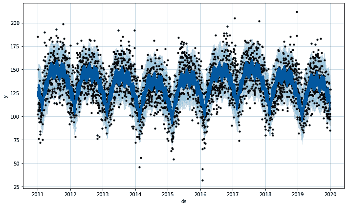
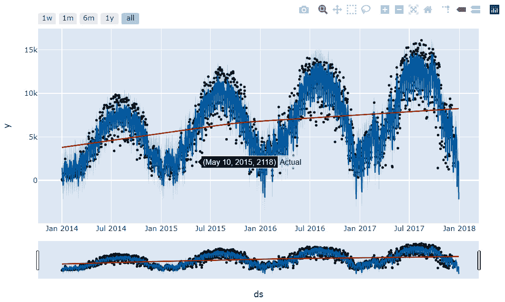
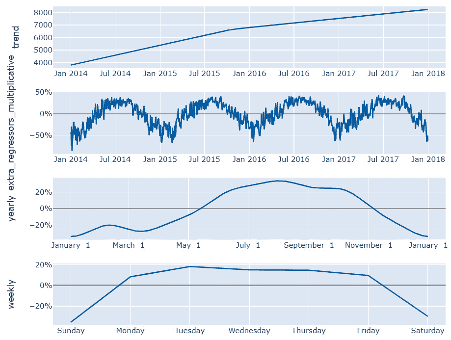
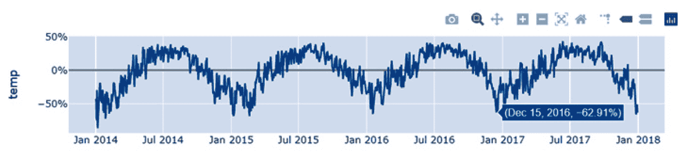
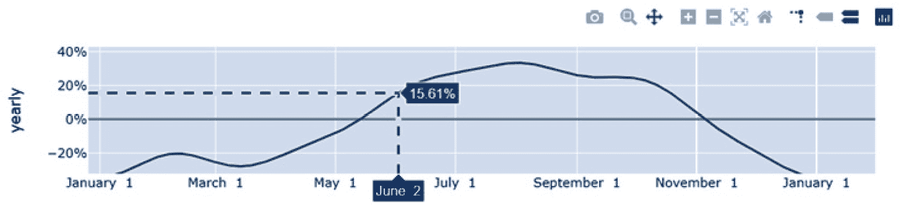

# 将 Prophet 产品化

如果您已经读完了这本书的所有章节，恭喜您！您已经为处理 Prophet 可以处理的任何预测任务做好了充分的准备。最后一章将介绍一些在生产环境中可能很有用的附加功能。

在本章中，您将学习如何保存训练好的模型以便稍后重用，您还将了解当新数据可用时如何加快模型拟合的速度。为了结束本章，您将发现一系列新的交互式图表，这些图表可以用于网络仪表板，以便与更广泛的受众分享您的工作。本章涵盖的主题如下：

+   保存模型

+   更新拟合模型

+   使用 Plotly 制作交互式图表

# 技术要求

本章中示例的数据文件和代码可以在 [`github.com/PacktPublishing/Forecasting-Time-Series-Data-with-Prophet-Second-Edition`](https://github.com/PacktPublishing/Forecasting-Time-Series-Data-with-Prophet-Second-Edition) 找到。

# 保存模型

在 *第十一章* *管理不确定性区间* 中，您使用 **马尔可夫链蒙特卡洛**（**MCMC**）抽样预测了巴尔的摩市每天的犯罪数量。这是一个计算量很大的过程，而你只使用了每日数据。如果你使用的是 Divvy 每小时数据，一个比每日数据大 10 倍的数据集，计算量将会更大。而且这两个数据集肯定比你在现实世界中遇到的大多数数据集都要小。如果 Prophet 没有提供保存您工作的方法，每次您训练一个模型时，您都必须将模型留在您的计算机内存中，直到您想要使用它为止。

也许您熟悉 Python 中的 `pickle` 模块——这对于在 `sklearn` 中保存训练好的模型来说效果很好。然而，Prophet 在后端使用 Stan 来构建其模型，这些 Stan 对象并不适合 pickle。幸运的是，Prophet 包含了一些将您的模型序列化为 JSON 并稍后重新打开的函数。因此，一旦您的模型训练完成，您就可以将其存放在一边，并在需要预测未来日期时再取出来。

我们将再次使用巴尔的摩犯罪数据来查看如何保存您的模型。我们需要导入 pandas 来读取 `.csv` 文件；当然，导入 Prophet 来构建我们的模型；我们还需要导入 `json` 来保存和重新打开文件。将模型对象转换为 JSON 并再次转换的函数是从 Prophet 的 `serialize` 包中导入的：

```py
import pandas as pd
from prophet import Prophet
import json
from prophet.serialize import model_to_json, \
model_from_json
```

现在，我们将熟悉的过程运行一遍，打开我们的数据和训练一个模型。我们也在像在第十一章 *管理不确定性区间* 中做的那样，丢弃数据中的异常值：

```py
df = pd.read_csv('baltimore_crime.csv')
df.columns = ['ds', 'y']
df.loc[df['y'] > 250, 'y'] = None
model = Prophet()
model.fit(df)
```

我们现在有了我们的训练模型。以前，你需要保持你的 Python 内核运行，并将模型保存在内存中，直到你想访问它为止。在一天结束时，你想要保存它，关闭你的机器，然后回家过夜，但你将失去所有这些工作。

在下面的代码中，你将使用`with`语句创建一个上下文管理器，这样你就可以打开一个 JSON 文件，Python 会在你完成后自动关闭它。以下语句中使用的`'w'`和`'r'`参数仅代表*写入*和*读取*。此代码块使用 Prophet 的`model_to_json`函数将`模型`对象转换为 JSON 文件，并将其保存到你的硬盘上：

```py
with open('baltimore_crime_model.json', 'w') as file_out:
    json.dump(model_to_json(model), file_out)
```

现在文件已保存，你可以安全地关闭 Python。要将 JSON 文件转换回`模型`对象，只需使用`json_to_model`函数：

```py
with open('baltimore_crime_model.json', 'r') as file_in:
    model = model_from_json(json.load(file_in))
```

重新加载模型后，你可以像使用任何拟合模型一样使用它；例如，你可以绘制一个预测图：

```py
forecast = model.predict()
fig = model.plot(forecast)
```

没有创建`未来`，这只是一个拟合模型：



图 14.1 – 巴尔的摩犯罪预测

保存并重新打开你的工作当然很有帮助，但真正的价值在于你保留了一个模型，并且每天用新数据更新它，正如我们接下来将要做的。

# 更新拟合模型

预测在预测模型中是独特的，因为数据的价值在于其新鲜度，每一刻的过去都会产生一组新的、有价值的数据来使用。对于预测模型来说，一个常见的情况是需要随着数据的增加而重新拟合模型。例如，巴尔的摩市可能会使用犯罪模型来预测他们可能期望明天发生的犯罪数量，以便提前更好地部署他们的警官。一旦明天到来，他们可以记录实际数据，重新训练他们的模型，并为第二天进行预测。

Prophet 无法处理在线数据，这意味着它不能添加单个新的数据观察值并快速更新模型。Prophet 必须离线训练——新的观察值将被添加到现有数据中，并且模型将完全重新训练。但不必从头开始完全重新训练，以下技术将在重新训练时节省大量时间。

Prophet 本质上是一个优化问题。在代码深处有一些设置，用于选择一组初始参数，Prophet 认为这些参数将接近实际参数，这些参数是建模预测曲线所需的。然后它创建其曲线，用现有数据点测量误差，更新参数以减少误差，并重复。

当 Prophet 试图越来越接近最佳参数集时，可能会发生数百或数千次迭代。你可以通过使用昨天模型的已经优化的参数来大大加快这个优化问题，将它们作为今天模型的更好初始化。假设今天的观测点不会显著改变整体模型，这通常是一个非常好的假设。让我们看看这个技术是如何工作的。

我们将首先创建一个包含最终观测值的 Baltimore 犯罪数据的 DataFrame。这是**昨天的**数据：

```py
df_yesterday = df[df['ds'] < df['ds'].max()]
```

现在，我们将在这个数据上拟合`model1`：

```py
model1 = Prophet().fit(df_yesterday)
```

巴尔的摩市可以使用这个模型来预测第二天活动的预测，例如。现在，假设第二天已经到来；我们记录当天的犯罪水平，并希望用`df`，**今天的**数据更新我们的模型，该数据包含最终的数据点。让我们首先从头开始，并使用 IPython 的`timeit`魔法函数来查看它需要多长时间：

```py
%timeit model2 = Prophet().fit(df)
```

在我写这篇文章的时候，在我的当前机器上，这个过程根据输出大约花费了 865 毫秒：

```py
865 ms ± 183 ms per loop (mean ± std. dev. of 7 runs, \
                          1 loop each)
```

现在，让我们再次尝试，但这次不是从头开始，我们将通过传递昨天的模型参数来为 Prophet 提供一个**预热启动**。我们首先需要定义一个类来正确格式化这些参数：

```py
import numpy as np
class StanInit:
    def __init__(self, model):
        self.params = {
            'k': np.mean(model.params['k']),
            'm': np.mean(model.params['m']),
            'sigma_obs': \
             np.mean(model.params['sigma_obs']),
            'delta': np.mean(model.params['delta'],
                             axis=0),
            'beta': np.mean(model.params['beta'], axis=0)
        }
    def __call__(self):
        return self.params
```

这个类只是打开`model.params`字典，并将相关值保存到一个新字典中，该字典格式符合 Stan 后端的要求。我们现在使用这个类从`model1`中提取参数，并将这个初始化传递给`fit`方法，再次计时这个过程：

```py
%timeit model2 = Prophet().fit(
     df,
     inits=StanInit(model1)())
```

当我运行那个命令时，我看到了训练速度超过 4 倍的提升：

```py
195 ms ± 90 ms per loop (mean ± std. dev. of 7 runs, \
                         1 loop each)
```

0.195 秒与 0.865 秒相比是一个显著的改进。节省的时间取决于许多因素，并且即使你再次重复实验，也可能会发生变化。

尽管这种方法有一个注意事项：如果变化点的位置发生变化，更新后的模型实际上可能需要**更长**的时间来拟合，而不是从头开始拟合。因此，当相对于现有数据添加非常少量的新数据时，这种方法效果最好，正如我们在这里通过添加一天的数据到几年的数据中所做的那样。

使用 MAP 估计，正如我们在上一个例子中所做的那样，每次迭代都是一个优化问题。这意味着更好的初始化将大大加快速度。然而，在使用 MCMC 采样时，每次迭代必须完全运行通过马尔可夫链中的每个链接（回顾*第十一章*，*管理不确定性区间*，以了解 MAP 估计与 MCMC 采样的区别）。

这意味着预热将显著加快 MAP 估计的速度，但不会加快 MCMC 样本的速度。然而，预热会增加每个马尔可夫链迭代的品质。所以，如果你使用 MCMC 样本进行预热，你可能会在结果质量显著降低的情况下减少 `mcmc_samples` 的数量。

减少 `mcmc_samples` 的数量为加快任何新模型的 MCMC 样本速度创造了机会。想法是使用 MAP 估计训练一个初始模型，然后使用该模型以 MCMC 样本预热一个模型，但使用的 `mcmc_samples` 比你通常选择的要少：

```py
model1 = Prophet().fit(df)
model2 =
Prophet(mcmc_samples=200).fit(
    df,
    inits=StanInit(model1)())
```

在前面的代码块中，我们使用 MAP 估计和所有数据创建了一个初始 `model1`。然后，我们使用 `model1` 的参数预热 `model2`，它使用 MCMC 样本，但只有 `mcmc_samples=200`，而不是我们在 *第十一章* 中选择的 `300`，*管理不确定性区间*。这将导致一个具有与之前相似性能的 MCMC 样本模型，但训练时间缩短了三分之二。

总结来说，使用 MAP 估计预热（即当 `mcmc_samples=0` 时）将加快你的模型训练速度。但是，当 `mcmc_samples` 大于 0 时，预热不会加快模型的速度，但在此情况下，你可以快速使用 MAP 估计训练一个模型，然后将你的模型预热到 `mcmc_samples` 设置为降低的值，而不会损失太多质量。现在，让我们学习如何使用 Prophet 制作交互式图表。

# 使用 Plotly 制作交互式图表

在本节的最后，我们将使用 Plotly 库构建一些交互式图表。**Plotly** 是一个完全独立的可视化包，与我们在本书中使用的 **Matplotlib** 包不同。使用 Plotly 制作的图表具有丰富的交互性，允许鼠标悬停时显示工具提示，可以放大和缩小图表，以及所有 sorts 的其他交互性。

如果你熟悉 Tableau 或 Power BI，Plotly 将类似的交互性带到了 Python 中。此外，Plotly 团队还构建了 **Dash**，这是一个用于创建基于网页的仪表板的库。创建此类仪表板的全教程超出了本书的范围，但我鼓励你学习这个有价值的工具，如果你希望与更广泛的受众分享你的 Prophet 预测。

Prophet 不会自动安装 Plotly 作为依赖项，所以在我们开始之前，你需要在你的机器上安装它。这是一个简单的过程，可以通过 `conda` 或 `pip` 完成。以下是 `conda` 安装命令：

```py
conda install -c plotly plotly=5.11.0
```

如果你还没有安装 Anaconda 或 Miniconda，你将不得不使用 `pip`：

```py
pip install plotly==5.11.0
```

如果你倾向于在 Jupyter Notebook 或 JupyterLab 中工作，你还需要安装一些支持包。这可以通过 `conda` 完成，如下所示：

```py
# Jupyter Notebook support
conda install "notebook>=5.3" "ipywidgets>=7.5"
# JupyterLab support
conda install "jupyterlab>=3" "ipywidgets>=7.6"
# JupyterLab renderer support
jupyter labextension install jupyterlab-plotly@5.11.0
# OPTIONAL: Jupyter widgets extension
jupyter labextension install @jupyter-widgets/jupyterlab-\
manager plotlywidget@5.11.0
```

如果你没有 `conda`，你也可以使用 `pip`：

```py
# Jupyter Notebook support
pip install "notebook>=5.3" "ipywidgets>=7.5"
# JupyterLab support
pip install "jupyterlab>=3" "ipywidgets>=7.6"
# JupyterLab renderer support
jupyter labextension install jupyterlab-plotly@5.11.0
# OPTIONAL: Jupyter widgets extension
jupyter labextension install @jupyter-widgets/jupyterlab-\
manager plotlywidget@5.11.0
```

如果你遇到这些命令中的任何问题，最好的资源是 Plotly 自己的文档：[`plotly.com/python/getting-started/`](https://plotly.com/python/getting-started/)。

你已经在本书的例子中学习了 Prophet 的`plot`包中的许多绘图函数。还有四个我们还没有涉及到的函数；这些函数与你已经学习过的 Matplotlib 对应函数具有许多相同的参数，但输出的是 Plotly 图表。

重要提示

这本书将包含 Plotly 图表的静态图像，但如果你在 Jupyter 笔记本中运行示例代码，你将能够在丰富交互的环境中操作图像。

为了演示这些工具，让我们再次使用 Divvy 数据，并使用温度作为额外的回归器。在这个部分中我们根本不会使用 Matplotlib，所以不需要导入它。我们已经从前面的部分中导入了 pandas 和 Prophet，但在这里我们还需要进行一些额外的导入。

如果你还记得从*第九章*中的*包括额外的回归器*，我们人为地减少了我们的训练数据两周，这样我们就可以在同时使用天气条件作为额外回归器的情况下预测两周。我们在这里也会这样做，因此我们需要导入`timedelta`来帮忙。但最重要的是，我们将导入`plotly.offline`并初始化笔记本模式：

```py
from datetime import timedelta
import plotly.offline as py
py.init_notebook_mode()
```

现在，让我们读取我们的数据并将其放入一个数据框中。在这个例子中，我们只会使用一个额外的回归器，即`temperature`：

```py
df = pd.read_csv('divvy_daily.csv')
df = df[['date', 'rides', 'temperature']]
df['date'] = pd.to_datetime(df['date'])
df.columns = ['ds', 'y', 'temp']
```

最后，我们就像以前一样构建我们的模型。我们创建一个温度回归器，然后在数据上拟合模型，同时排除最后两周。接下来，我们使用`future`数据框中的未拟合的 2 周`temperature`数据进行两周的未来预测：

```py
model = Prophet(seasonality_mode='multiplicative',
                yearly_seasonality=6)
model.add_regressor('temp')
model.fit(df[df['ds'] < df['ds'].max() - \
          timedelta(weeks=2)])
future = model.make_future_dataframe(periods=14)
future['temp'] = df['temp']
forecast = model.predict(future)
```

到目前为止，这些都应该是复习内容（除了导入和初始化 Plotly）。但现在，我们将从`plot`包中导入那四个最终函数：

```py
from prophet.plot import (
    plot_plotly,
    plot_components_plotly,
    plot_forecast_component_plotly,
    plot_seasonality_plotly
)
```

让我们逐一运行这些函数。

## Plotly 预测图表

首先是`plot_plotly`函数。要使用此函数，你只需传入模型和预测。我还包括`trend=True`参数以在图表中包含趋势线。你也可以添加`changepoints=True`，这将完全模仿 Matplotlib 的`add_changepoints_to_plot`函数。`py.iplot(fig)`行与 Matplotlib 的`plt.show()`类似：

```py
fig = plot_plotly(model, forecast, trend=True)
py.iplot(fig)
```

此截图还显示了在悬停在**2015 年 5 月 10 日**的点上的工具提示：



图 14.2 – Plotly 图表

## Plotly 组件图表

接下来，我们将查看 Plotly 组件图表。这与 Matplotlib 版本非常相似，但它还包括交互性。我还包括`figsize`参数来稍微减小这个图表的大小：

```py
fig = plot_components_plotly(model, forecast ,
                             figsize=(800, 175))
py.iplot(fig)
```

此图表显示了与`plot_components`相同的子图：



图 14.3 – Plotly 组件图表

## Plotly 单个组件图表

我想使用这些 Divvy 数据，这样我们就可以使用额外的温度回归器。我们可以使用这个下一个函数在 *图 14.3* 中的任何子图上绘制，但所有这些都可以用其他函数处理，除了额外的回归器。仅绘制这些回归器需要使用 `plot_forecast_components_plotly` 函数。在这里，我们传递了 `'temp'` 组件：

```py
fig = plot_forecast_component_plotly(model, forecast,
                                     'temp')
py.iplot(fig)
```

与本节中的其他图表一样，静态图像并不能完全展示它们的魅力。Plotly 是为了在交互式环境中使用；这些图表迫切需要放置在仪表板上，而不是打印在书中。在这里，我再次展示了悬停工具提示：



图 14.4 – Plotly 温度图

## Plotly 季节性图

在最终的 Plotly 函数中，我们将使用 `plot_seasonality_plotly` 函数绘制年度季节性：

```py
fig = plot_seasonality_plotly(model, 'yearly')
py.iplot(fig)
```

为了节省空间，Plotly 工具栏被省略在组件图中，但包含在其他所有图表中；您可以在 *图 14.2*、*14.4* 和 *14.5* 的右上角看到它。在下面的季节性图中，我使用了工具栏中的 **切换峰值线** 和 **比较数据** 按钮来向悬停工具提示添加更多信息，如下所示：



图 14.5 – Plotly 季节性图

我强烈建议您在 Jupyter 笔记本中探索这些图表，如果您觉得它们很有用，可以考虑使用 Dash 将它们组合到一个仪表板中。网上有很多相关的教程。

# 摘要

这本书的最后一章是所有章节中最可选的，但对于那些经常在生产环境中工作的人来说，这些工具将非常有价值。

在本章中，您学习了如何使用 JSON 序列化将模型保存到您的硬盘上，这样您就可以在以后无需重新训练模型的情况下分享或打开它。您还学习了如何更新已经拟合好的模型，这是另一种旨在节省您时间的程序。最后，您考察了一种新的图表格式，这是一个令人印象深刻的工具，可以使您的图表在浏览器中交互式显示，希望您已经看到了将这些信息打包到仪表板中的潜力。

本章所学的内容将帮助您随着时间的推移和新数据的到来更新您的模型，并通过基于网络的交互式仪表板共享该模型。
