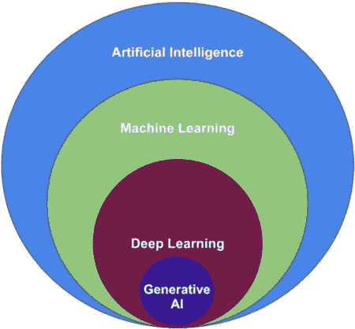
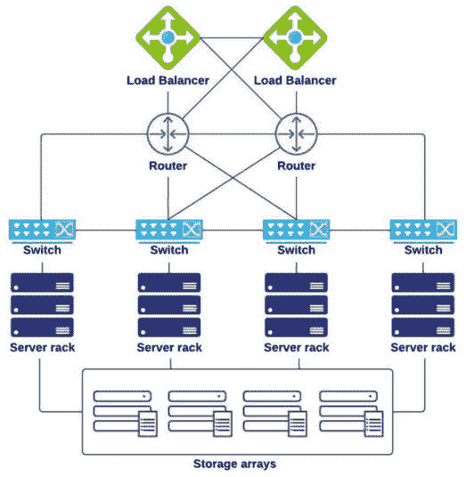
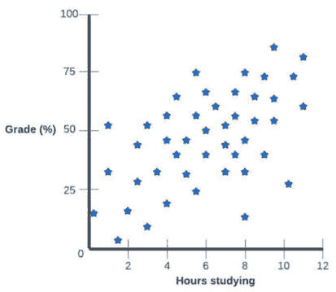
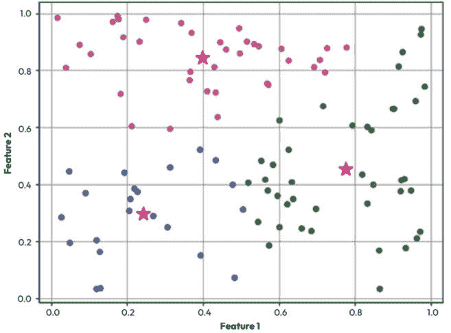
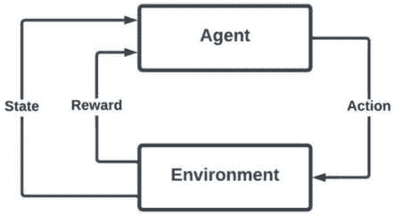
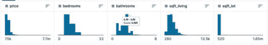
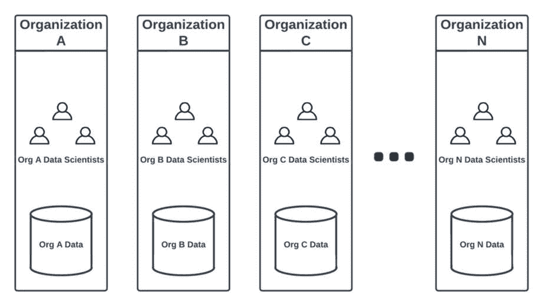

# 第一章：人工智能/机器学习概念、实际应用和挑战

本章将介绍将在本书其余部分更详细探讨的基本概念。我们理解本书的读者可能处于他们**人工智能/机器学习**（**AI/ML**）旅程的不同阶段，其中一些读者可能已经是熟悉运行 AI/ML 工作负载的高级从业者，而其他人可能对 AI/ML 总体上较为陌生。因此，我们将根据需要简要描述本书中的重要基本概念，以确保所有读者都有一个共同的起点，以便构建他们对所讨论主题的理解。对于 AI/ML 的新手来说，学习重要的基础概念比在没有基础背景的情况下直接深入每个主题更有益，而对于高级从业者来说，这些概念应该是有用的知识更新。

在本章中，我们将涵盖以下主要主题：

+   术语——人工智能（AI）、机器学习（ML）、**深度学习**（**DL**）和**生成式人工智能**（**GenAI**）

+   人工智能/机器学习（AI/ML）简史

+   机器学习方法与用例

+   对机器学习基本概念的简要讨论

+   开发机器学习应用中的常见挑战

在本章结束时，您将了解常见的 AI/ML 方法及其实际应用，以及 AI/ML 概念发展的一些历史背景。最后，您将了解公司在开始实施 AI/ML 工作负载时可能遇到的一些常见挑战和陷阱。这部分在本书中尤为重要，特别是对于解决方案架构师角色，它提供了在学术课程中找不到的实战见解；这些见解来自在多个公司进行大规模 AI/ML 项目多年的经验。

# 术语——AI、ML、DL 和 GenAI

在这里，我们描述了术语*AI*和*ML*之间的关系。需要注意的是，这些术语通常可以互换使用，以及缩写术语*AI/ML*，它作为一个总括术语，用于包含人工智能和机器学习。我们还描述了术语*DL*和*GenAI*如何在 AI/ML 的范畴下定位。

我们将首先简要介绍官方认可的*AI*和*ML*的定义。我们选择包含来自*柯林斯英语词典*的定义，其中 AI 被定义为“*一种关注使机器以类似人类大脑工作方式工作的计算机技术*”，而 ML 被定义为“*人工智能的一个分支，其中计算机根据输入的原始数据生成规则。*”术语*DL*尚未被正式列为词典术语，但*柯林斯英语词典*将其列为新词建议，建议定义为“*一种关注人工神经网络的高级模式识别的机器学习类型*。”我们理解官方词典定义并不总是完全解释概念，但包含它们作为参考是很重要的，随着我们继续阅读本书，我们将更详细地介绍这些概念。所有这些术语构成了我们现在开始称之为“传统 AI”的内容，以区别于 GenAI，后者是一个更新且截然不同的概念。本书将有一个专门章节介绍 GenAI，因此这种区别将变得更加清晰。

一般而言，DL 被视为 ML 的一个子领域，ML 被视为 AI 的一个子领域。GenAI 可以被视为 DL 中的一个子领域，因为它在其应用中使用了深度神经网络和自然语言处理的概念。你经常在文献中看到它们以同心圆的形式图形化表示，其中 AI 是最广泛的领域，ML 作为 AI 中的一个子领域嵌套，DL 作为 ML 中的一个子领域嵌套。我在这个概念表示中增加了 GenAI 在 DL 领域的位置，尽管这更多是一种关联而非严格的子类别：



图 1.1：描述 AI、ML、DL 和 GenAI 之间的关系

现在我们已经介绍了一些关于 AI/ML 的基本术语，让我们简要地讨论一下其历史，并了解 AI/ML 行业至今的发展情况。

# AI/ML 的简要历史

如果我们只回到几年前——回到 2015 年——并将当时的人工智能/机器学习行业的状况与今天相比，我们会发现当时相对很少有公司已经商业化了大规模的人工智能/机器学习用例。尽管我们会发现在这个领域进行的学术研究，但我们不会经常在主流媒体中听到关于人工智能/机器学习的讨论，而成功的商业或工业应用主要只由世界上一些最大的、行业领先的技术或细分市场公司实现。再向前推进两年，我们发现到 2017 年底，科技行业正充斥着关于人工智能/机器学习的讨论，这似乎是每个人心中——至少是主要话题之一。

基于我们的时间旅行冒险，人们可能会认为人工智能/机器学习是一个全新的术语，仅在过去的几年中突然出现。然而，实际上，这些概念已经发展了几十年。作为我们时间旅行之旅的下一步，我们进一步回到 20 世纪 50 年代。1955 年，约翰·麦卡锡教授首次使用“人工智能”这个术语（麦卡锡等，1955 年），在 20 世纪 50 年代还发生了一系列对这一科学领域有重大贡献的重要发展，例如艾伦·图灵 1950 年的论文《计算机与智能》，在其中他提出了问题，“*机器能思考吗？*”（图灵，1950），以及弗兰克·罗森布拉特对“感知器”的研究（罗森布拉特，1957），我们将在本书的后续部分更详细地探讨这一点。

作为我们时间旅行旅程的延伸，应该注意的是，今天的人工智能/机器学习算法使用的是几个世纪或几千年前最初发现和制定的数学概念。例如，本书中将要探讨的许多算法都使用了线性代数和微积分的概念，这些概念已经使用了几个世纪，当我们学习关于成本函数、训练和评估时，我们将使用欧几里得几何的概念，例如勾股定理，其历史可以追溯到几千年以前。有趣的是，尽管人们认为毕达哥拉斯生活在约 2500 年前，但有一些证据表明，在毕达哥拉斯出生前 1000 多年，美索不达米亚的巴比伦人等之前的文明已经理解和使用了“勾股定理”的概念（Götze，1945，37-38）。多么令人着迷啊，我们今天一些最前沿的深度学习算法使用了与青铜时代古老文明相同的数学结构！在 20 世纪 60 年代和 70 年代，使用计算机对数据进行统计分析建模的做法开始显著增长，并出现了专门用于这些目的的软件，如**统计分析系统**（**SAS**）和**社会科学统计软件包**（**SPSS**）。这些工具通常用于**内存内**处理，这意味着使用这些工具的所有数据都将加载到单个计算机的内存中。在下一节中，你将看到为什么这一点很重要。

接下来，我们穿越到现代，心中浮现的一个问题是这样的：如果这一切始于 20 世纪 50 年代，为什么感觉上人工智能和机器学习是最近几年突然让每个人都热情高涨的概念？为什么在此之前我们没有看到人工智能/机器学习实施如此广泛的应用和成功？许多因素导致了这些概念最初开始研究时和它们在过去几年中在行业中开始获得公众明显关注之间的时间差距（例如，参见“人工智能寒冬”）。正如我们在本书的后续章节中将会看到的，其中一个因素是 AI/ML 用例通常需要大量的数据和广泛的计算资源。这也是为什么——直到最近——AI/ML 研究通常只由能够负担得起积累这些所需资源的实体进行，例如大型科技公司、成熟的科研机构和政府部门。

近年来，是什么改变了，帮助 AI/ML 突破大型企业和研究机构的专属领域？小型公司，甚至业余爱好者，是如何突然获得训练、托管和评估 ML 模型以及实验如何将 AI/ML 应用于日益增多的有趣新用例所需资源的？这一突然革命的主要贡献者之一是“云计算”，以及构建和运行 AI/ML 工作负载的迭代工具开发，以及深度学习方法的进步。

## AI/ML 和云计算

为了更详细地了解云计算是如何突然革命化 AI/ML 研究和实际应用的，让我们考虑训练、托管、评估和管理 ML 模型所需的资源类型。虽然我们可以使用笔记本电脑或家用电脑在小型数据集上训练和评估一个相对简单的模型，但当我们想要扩展我们的研究和用例时，我们会很快发现我们个人电脑上的计算资源不足以训练更大的模型，而我们个人电脑的硬盘空间也不足以存储所需的数据集。这些也是我们在上一节中提到的统计建模工具（如 SAS 和 SPSS）所遇到的限制，这些工具在单台机器上“内存中”处理数据。

为了说明这个概念，我们将分步骤扩大我们的用例。如果我们仅仅稍微超出市场上最强大的个人电脑的资源，我们就需要在硬件“服务器”上运行我们的工作负载，这个服务器包含更强大的计算资源，并且我们可以将多个大容量硬盘连接到这个服务器上，可能是一个**独立磁盘冗余阵列**（**RAID**）数组（以前称为**廉价磁盘冗余阵列**）。这仍然是一个个人可以在家中完成的事情，但强大的服务器——尤其是市场上“最新和最优秀”的服务器——购买起来可能相当昂贵，并且设置服务器和配置 RAID 数组需要更多的技术知识。在这个阶段，我们已经开始超出除了最热衷的业余爱好者之外的所有领域。

超出市场上最强大的硬件服务器的资源范围，将需要我们创建一个服务器集群。除了购买多个服务器及其连接的硬盘的额外费用外，这还需要更多的技术知识来构建和配置一个将服务器适当连接在一起的网络。这对大多数业余爱好者来说可能不是一个经济可行的方案，但对于小型公司来说可能仍然是有意义的。

接下来，让我们将范围扩展到今天一些最先进的深度学习（DL）用例，这些用例的训练可能需要数周或数月，并且需要在数百台高性能且非常昂贵的服务器上进行。如果我们想完全自行运行这些类型的工作负载，我们需要建立一个数据中心，雇佣专家团队来安装数百台服务器，构建和配置一个复杂的网络来将它们适当连接在一起，并执行多项其他支持活动以设置我们的基础设施。让我们暂时想象一下，我们想要创建一家初创公司，该公司将使用深度学习（DL）来实现我们设计的新突破性想法。仅仅建立一个数据中心就可能需要几年时间，并且可能花费数百万美元，在我们能够开始实验我们的想法之前。这显然不是一个可行的选择。

然而，借助云计算，我们只需简单地编写一个脚本或在云计算提供商的网站上点击一些链接和按钮，就可以在几分钟内启动我们需要的所有服务器。然后我们可以进行实验——迭代训练和评估我们的模型——并在我们的工作完成后简单地关闭服务器。正如您所想象的那样，这比试图建立和管理我们自己的数据中心要容易、便宜得多，并且更容易实现。现在，这为小型公司和资金有限的研究人员或爱好者提供了访问计算能力和资源的途径，这些资源以前仅限于非常大型组织。

注意，不仅更容易创建和访问所需的硬件基础设施帮助革命化了人工智能/机器学习（AI/ML）行业，相关的软件工具和框架也在随着时间的推移而发展，以及可用数据的数量。虽然 20 世纪 60 年代和 70 年代开发的 SAS 和 SPSS 等工具足以在单个机器的内存中执行数据集的统计建模，但互联网的快速普及导致公司可以收集和产生的数据量急剧增加。与此并行，开发了 Python 等语言的库，这使得数据处理、分析和建模等活动变得更加容易。我可以自信地说，使用 scikit-learn、PyTorch 和 Keras 等库进行许多类型的建模用例，比使用上面提到的早期工具要容易得多。尽管如此，许多今天的机器学习算法可以被视为传统统计建模技术的演变，这些技术得到了增强，以处理更大和更复杂的用例。此外，Apache Hadoop 和 Apache Spark 等工具（我将在本书的后面部分更详细地讨论），使得实现可以跨越单机限制的用例成为可能，因此可以处理更大的数据集。

到目前为止，在我们的扩展用例讨论中，我们主要关注的是模型训练和评估，但这些活动只是创建实际用于现实世界的机器学习应用程序所需活动的一个子集。在本书中，我们将经常使用“在生产中”这个术语来指代创建、托管和提供在现实世界（实验室测试环境之外）使用的 AI/ML 应用程序的概念。

即使是大型、成熟的组织，拥有经验丰富的数据科学家团队，也常常发现成功托管生产中的机器学习应用程序可能比模型训练和评估过程更复杂、更具挑战性。现在，让我们看看云计算如何能够提供额外的价值，以解决这些挑战，而不仅仅是启动所需的计算和存储资源。在本书的后续章节中，我们将详细讨论典型机器学习项目中的所有步骤，但在此，让我们从高层次上考虑，如果不存在云计算，托管生产中的机器学习模型需要哪些资源和基础设施。

除了模型训练和评估所需的各项活动，例如构建数据中心、安装服务器、构建和配置复杂网络以及随着时间的推移维护所有硬件之外，我们还需要执行许多其他活动，以实际托管和为生产使用提供机器学习模型。例如，我们需要创建一个接口，以便将我们的模型暴露给最终用户或其他系统。最可能的方法是使用基于网络的界面，在这种情况下，我们需要构建一个由多个网络服务器组成的集群，并持续配置和管理这些服务器。我们需要在这些网络服务器上开发和构建一个应用程序，以便将我们的模型暴露给网络客户端，然后安装和配置负载均衡器，并在我们的网络服务器之间分配负载。当然，所有这些基础设施都需要得到适当的保护。*图 1.2*展示了你可能需要设置的此类基础设施的示例；请记住，你可能需要为你的解决方案中的每一层复制该基础设施——例如，你可能需要多次复制该基础设施以用于你的网络服务器层、应用程序服务器层和模型托管层。图中显示了两个负载均衡器和路由器，以实现冗余，以防其中任何一个组件出现故障：



图 1.2：模型托管示例基础设施

不幸的是，大多数数据科学家并不是同时还是网络专家、网络服务器配置专家和安全专家，所以即使我们有一支由最佳数据科学家组成的团队，他们已经创建了一个突破性的模型，我们仍然需要许多其他专门专家团队来构建和维护将这个模型向客户展示所需的基础设施。另一方面，如果我们想使用像谷歌云上的 Vertex AI 这样的服务，它将自动为我们构建和管理所有这些基础设施，我们可以在几分钟内从实验室测试过渡到生产托管。

需要注意的是，如果没有云计算，公司不仅会发现构建他们的 AI/ML 工作负载不太方便，而且这也会变得难以承受——也就是说，除非大公司事先确信他们的应用程序将会成功，否则他们不会投资建设所需的基础设施，而这是非常难以预测的。较小的公司如果没有在基础设施费用上进行重大前期投资，就无法开始，而大多数公司都无法获得这些资金。因此，没有云计算，人工智能/机器学习的研究、实验以及在现实世界中的最终实施将会远不如现在普遍和可行。

当谈到在现实世界中实施人工智能/机器学习时，让我们来看看不同的人工智能/机器学习方法和它们的一些实际应用案例。

# 机器学习方法和应用案例

人工智能/机器学习应用程序通常旨在根据输入数据做出某种预测，也许除了生成式人工智能之外，因为生成式人工智能旨在生成内容，而不仅仅是做出预测。为了做出预测，机器学习模型首先需要被**训练**，而它们的训练方式取决于所采用的方法。虽然机器学习是一个广泛的概念，涵盖了众多不同的研究领域，并且几乎每天都有无数新的应用案例被创造出来，但该行业通常将机器学习方法分为三个高级类别：

+   **监督学习**（**SL**）

+   **无监督学习**（**UL**）

+   **强化学习**（**RL**）

## **监督学习**（**SL**）

监督学习是工业界最常用的机器学习类型，也许也是最容易描述的。术语“监督”表明我们在训练过程中向机器学习模型告知正确答案。例如，让我们想象我们想要训练一个模型能够识别猫的照片。在这种情况下，我们会使用数千或数百万张照片作为我们的训练集，并告诉模型哪些照片包含猫，哪些不包含。我们通过一个称为**标记**的过程来完成这项工作，我们将在后面的章节中更详细地描述它。如果训练得当，我们的模型将学会如何区分每张照片中识别猫的特征。如果我们向模型展示它以前从未见过的照片（即，那些没有包含在训练集中的照片），我们的模型将能够识别这些照片是否包含猫。更具体地说，对于每张照片，我们的模型将能够根据照片中的观察特征预测它包含猫的概率。

监督学习（SL）有两个子类别：分类和回归。

### 分类

我们之前描述的猫识别模型是一个分类用例的例子，其中我们的模型可以判断我们的照片是否包含猫。分类进一步细分为二分类或多分类。二分类提供“是”或“否”的预测。例如，在这种情况下，我们会问模型，“这张照片包含猫吗？”，而模型会回答“是”或“否”。如果我们训练我们的模型来识别许多不同类型的对象，那么它将能够执行多分类，我们可以提出更广泛的问题，例如，“你在这张照片中看到了什么？”在这种情况下，模型可以回答多个不同的对象分类，包括“猫”（如果它在照片中看到了猫），以及其他它预测存在于照片中的对象（参见*图 1**.3*）：


图 1.3：照片中猫和花的分类

#### 分类在实际中的应用

当然，分类可以用于比识别猫的图片更为重要的用例。一个重要的实际分类用例是医疗诊断，其中机器学习模型可以根据输入数据（如身体症状或放射学图像）预测患者是否存在某种医疗状况。

### 回归

当我们的问题有离散答案时，分类是有用的，而当我们要处理“连续变量”时，则使用回归。在这种情况下，我们问题的答案可以是连续体中的任何值，例如 0.1、2.3、9894.6、105 或 0.00000487。为了引入一些术语，我们提供给模型的输入被称为“输入变量”，而我们希望预测的变量被称为“目标变量”或“因变量”。

注意

当我们在这里使用术语 *回归* 时，我们指的是线性回归。这不要与逻辑回归混淆，逻辑回归实际上是一种分类，我们将在本书的后面部分介绍。

线性回归的目标是定义一个线性函数，将输入变量映射到输出目标变量。例如，我们可能想根据学生花费的学习时间预测他们在考试中能获得的分数，基于我们有关以前学生成绩和学习时间的数据。我们可以将数据绘制如下（参见 *图 1**.4*），其中星号代表数据集中的每个学生；也就是说，它们代表每个学生的成绩和他们花费的学习时间：



图 1.4：学生成绩与学习时间

如图中所示，成绩与学习时间之间似乎存在某种关系或相关性；也就是说，学习时间较长的学生通常能获得更高的成绩。

在这个数据集上训练的线性回归模型将试图找到最能代表这种关系的函数或直线。你可能还记得，从学校里学到的简单直线函数通常表示为公式 *y = ax + b*，其中 *a* 是 *x* 的倍数，而 *b* 是直线与 *y* 轴的交点。为了找到最准确的功能，线性回归过程试图定义一条线，该线与每个数据点（星号）之间的距离最小化，这可能看起来像 *图 1**.5*。线与一些数据点之间的距离用红色表示以供参考。在后面的章节中，我们将更详细地讨论这些距离是如何计算的：


图 1.5：线性回归函数

使用这个函数，我们现在可以根据学生花费的学习时间来估计或预测未来的学生成绩。例如，如果一个学生花费了 10 个小时学习，根据我们在 *图 1**.6* 中看到的情况，我们会预测他们能获得大约 70%的成绩：


图 1.6：应用线性回归函数

#### 线性回归的实际应用

回归是机器学习中最广泛使用的一种类型，它适用于许多不同的商业用例。它是“预测未来”的典范，通常归功于机器学习的力量。商业领导者通常希望预测与业务绩效相关的数字，例如根据历史销售和其他市场数据预测下一季度的销售额。每当你有可以追踪的数值指标，并且有足够的历史特征与这些指标相关联时，你就可以尝试预测或“预测”这些指标的未来的值，从股市价格和房价到各种医疗场景中的血压测量。

## UL

在使用 UL 时，我们不是在标注了正确答案的数据集上训练模型。相反，我们要求模型在数据中寻找未知或非预定的模式。我们可以用这样一个类比来说明：在 SL 中，我们是在教模型关于数据中存在什么，而在 UL 中，模型是在教我们关于数据中存在什么，比如数据集中各种数据点之间的潜在趋势。

最常见的 UL 类型是所谓的“聚类”，其中数据点根据模型观察到的某些相似性被分组在一起。*图 1.7*提供了这个概念的可视化表示，显示了左侧的输入数据和右侧的结果数据簇：



图 1.7：簇类

### UL 的现实世界应用

簇类算法在现实世界中的应用实例之一就是将具有相似购买偏好的客户群体进行分类。你可能已经注意到，当你在线购买商品时，会看到一些推荐其他可能感兴趣的商品，并伴随有诸如“购买此商品的用户也购买了这些其他商品”之类的信息。

另一个重要的现实世界用例是欺诈检测，在这种情况下，一个簇可能代表合法交易，另一个簇可能代表异常或潜在的欺诈交易，或者任何不符合合法交易特征的东西都可能被标记为潜在的欺诈。随着新交易的进行，模型可以根据它们的输入特征相应地将它们分组，如果交易看起来是欺诈性的，则可能触发警告响应。你有没有在假期第一天在新地点使用信用卡时收到过银行的通知或询问？这是因为银行的机器学习模型确定交易的某些特征异常；在这种情况下，是来自你通常不使用信用卡的地方的交易。

注意

簇类实际上可以被视为一种无监督分类。

## RL

在强化学习中，训练模型的机制与之前两种方法截然不同。为了介绍一些术语，我们说模型使用一个**代理**，该代理有一个它想要实现的整体目标（即期望的模型输出）。代理通过向环境发送**动作**与它的**环境**进行交互。环境评估这些动作，并以**奖励**信号的形式提供反馈，该信号指示动作是否有助于实现整体目标，以及**观察**，它描述了环境的当前状态。参见 *图 1*.*8* 对此过程的视觉表示。做一个非常广泛的类比，这类似于我们训练某些动物，例如狗。例如，如果狗执行了一个期望的动作，那么训练者会奖励它美味的食物。相反，如果狗做了某些不期望的事情，训练者可能会以某种方式责备它。在强化学习的情况下，模型在其环境中随机尝试不同的动作。如果一个动作或一系列动作被认为有助于实现整体目标，那么环境会向代理提供积极的奖励作为反馈，而如果动作被认为对实现整体目标有害，那么环境会向代理提供消极的奖励作为反馈。在这种情况下，奖励通常只是一个数值，例如 0.5 或 -0.2，而不是美味的食物，因为不幸的是，对于机器学习模型来说，它们还不够复杂，无法享受美味的食物：



图 1.8：强化学习

模型的环境是存在目标和所有可能动作的空间，观察是环境的特征。这可以是一个物理环境，例如当机器人在一个物理空间中移动时，或者基于模型试图解决的问题的某种抽象。例如，你可以创建一个模型，使其成为国际象棋或电子游戏等游戏的专家。模型将首先尝试所有种类的随机动作，其中大多数一开始可能看起来很愚蠢或奇怪，但基于环境的反馈，模型的动作将逐渐变得更加相关，并可能最终在该任务中超越人类专家的动作。

强化学习实际上可以被认为是一种**监督学习**（SL），因为当模型做出预测时，会提供反馈给模型，模型根据这些反馈进行学习和改进。然而，它与之前描述的标准监督学习概念不同，因为我们没有在训练过程中提供标记的正确答案。相反，模型被提供了一些信号，帮助它理解它应该执行哪些类型的动作，以便朝着实现所需的目标前进。

### 强化学习的实际应用

强化学习（RL）在工业界的应用还没有像“传统”的监督学习（SL）和无监督学习（UL）那样广泛，但一些有趣的应用正在出现。除了前一段提到的游戏用例之外，强化学习最显著的应用之一是在机器人导航和自动驾驶汽车中。在这个应用中，汽车可以被看作是模型代理，它执行诸如加速、制动和转向车轮等动作。汽车上的传感器，如摄像头和激光雷达传感器，提供关于环境状态的信息。如果汽车执行的动作帮助它实现目标，例如导航路线或自动泊车而不撞到任何障碍物，那么它会收到正面的奖励；而如果它撞到障碍物，则会收到负面的奖励。随着时间的推移，它可能学会导航路线或自动泊车并避开障碍物。

强化学习在医疗保健领域的另一个重要实际应用是，它在医疗影像诊断（周等，2021，1-39）以及根据患者状况确定哪些类型的医疗治疗对他们有效等方面显示出有希望的结果，这些是通过诸如**动态治疗方案**（DTRs）等机制实现的。

现在我们已经讨论了不同类型的机器学习方法和它们的实际应用案例，让我们来看看构成这些机器学习实现基础的一些基本概念。

# 机器学习基本概念的简要讨论

数学是机器学习（ML）背后的隐藏魔法，几乎所有机器学习算法都是通过使用数学来在数据中找到关系和模式来工作的。本书侧重于在谷歌云上实现人工智能/机器学习的实际应用；它不是理论学术课程，因此我们不会深入探讨机器学习模型所依赖的数学方程式，但我们会根据需要包含数学公式作为参考，并在本书中介绍一些在人工智能/机器学习算法中广泛使用的基本概念。关于这些概念的详细学习，有大量的学术材料可供参考。作为一个架构师，理解数学概念可以被视为课外学分而不是必需品；你通常不需要深入研究机器学习算法的数学细节来完成日常工作，但如果你想更好地理解某些算法的工作原理，你可以更详细地审查这些概念。

## 线性代数

在机器学习（ML）中，我们经常使用向量和矩阵来存储和表示信息。为了简要介绍一些定义，*柯林斯词典*将向量定义为“*具有大小和方向的变量量，例如力*”，将矩阵定义为“*一种用于解决数学问题的数字、符号或字母的行列排列*”。让我们看看这究竟意味着什么。如果我们使用表格数据作为例子，矩阵中信息的表示就最容易演示了。考虑*表 1.1*中的信息，它代表了华盛顿州金县的销售房屋（摘自 Kaggle 数据集：[`www.kaggle.com/datasets/harlfoxem/housesalesprediction`](https://www.kaggle.com/datasets/harlfoxem/housesalesprediction))：


表 1.1：金县房屋销售

*表 1.1*中所示的数据集有 7 行（不包括标题行）和 13 列，其中每一行代表一个单独的房屋销售，我们将其视为数据集中的数据点或观察值，每一列代表数据点的单个特征。我们可以将每一行和每一列视为向量。请注意，向量也可以被视为只有一行或一列的矩阵（即一维向量）。因此，对于数据集中每个单独的房屋购买，我们都有一个包含该房屋所有特征的向量。让我们想象一下，如果我们想根据每栋房屋的特征（除了价格）来预测房价。我们希望找到描述价格与其他所有特征之间关系的最佳函数，线性回归就是实现这一目标的一种方法。在这种情况下，我们希望找到一组值，通过这些值乘以每个特征，然后将所有乘法的结果相加，以正确估计每栋房屋的价格。这意味着每个特征都有一个相应的乘数（或“系数”）。为了有效地计算特征和系数的乘积并将所有结果相加，我们可以将所有系数也表示为一个向量，并计算特征向量和系数向量的点积。我们在这里花一点时间来澄清计算点积的含义。如果我们有两个向量*A*和*B*，其中*A* = [a b c]*，*B* = [d e f]*，点积的计算如下：

*a*d + b*e + c*f*

为了说明，让我们以*表 1.1*的第一行（不包括价格）作为特征向量；它看起来是这样的：

```py
[3 1 1180 5650 1 0 0 3 7 1955 0]
```

现在，让我们创建一个初始的随机系数向量（我们最初可以创建随机系数，然后在模型训练过程中改进我们的猜测），它需要与前面的特征向量具有相同数量的元素：

```py
[1 5 0.3 0.001 2 7 2.5 108.67 14.234 0.103 8]
```

注意

在计算点积时，有一些关于每个向量形状的规则，但为了简单起见，我们在这里省略了这些细节。我们将在后面的章节中深入探讨这些细节。

我们的特征向量和系数向量的点积在此处显示：

```py
3*1 + 1*5 + 1180*0.3 + 5650*0.001 + 1*2 + 0*7 + 0*2.5 + 3*108.67 + 7*14.234 + 1955*0.103 + 0*8 = 996.663
```

从我们对系数应该是什么的第一个猜测开始，我们估计*表 1.1*中第 1 行的房价将是$996.663。然而，我们可以从*表 1.1*中看到，那所房子的实际价格是$221,900。现在我们可以计算由于我们的猜测而产生的误差，如下所示：

```py
221900 – 996.663 = 220903
```

我们通常将这称为线性函数的**损失**或**成本**，它类似于之前*图 1.5*中用红色线条表示的内容，其中这个值代表“距离”正确答案；也就是说，我们的猜测与正确答案有多远。这是学习过程的第一步，在后面的章节中，我们将希望找到使这个误差最小化的系数。

## 微积分

微积分在机器学习中的一个常见用途是之前提到的误差最小化过程。在后面的章节中，我们将定义一个称为**损失函数**（或**成本函数**）的概念，我们将使用“梯度下降”（稍后描述）等机制来最小化该损失函数。在这种情况下，我们将使用微积分推导出表示损失函数的曲线上的各个点的斜率，并利用这些信息来努力最小化成本函数（参见*图 1.9*）：


图 1.9：函数曲线上某点的斜率（来源：https://commons.wikimedia.org/wiki/File:Parabola_tangent.png）

## 统计与概率

机器学习模型不提供确定的答案。相反，机器学习模型的结果通常以近似值、概率或推断的形式提供。我们通常将机器学习模型调用的结果称为 **推断**。以本章前面提到的猫分类模型为例，我们用来识别照片中猫的模型通常会告诉我们照片中存在猫的概率。例如，模型可能会告诉我们它有 97.3% 的把握认为照片中有一只猫。机器学习的主要目标之一是确保这些概率尽可能准确。如果模型说它有 100% 的把握看到猫，但实际上照片中没有猫，那么这个模型将不会有效。在二元分类的情况下，响应要么为真要么为假，通常会有一个阈值，高于该阈值我们认为概率响应为真，低于该阈值我们认为为假。例如，我们可以确定任何超过 72.3% 概率的都被认为是正面的，而低于该阈值的被认为是负面的。阈值值会根据用例而变化，并且在构建此类模型时需要确定的一个参数。

如果我们将这个过程进一步分解，以猫分类模型为例，它已经观察到了照片中的某些特征，并且基于之前训练中它看到的那些类型的特征（或与那些特征相似的特征），它估计照片中存在猫的概率。

在本书的后续内容中，我们还将看到，统计分析在机器学习项目的早期阶段起着重要作用，当时数据科学家正在探索如何使用数据集来解决业务问题。在这些数据探索活动中，数据科学家通常会分析数据集中每个变量或特征的值统计分布。例如，在探索数据集时，数据科学家通常会想查看有关数据中每个数值变量的统计信息，例如均值、中位数、众数以及值的最大和最小范围；参见 *图 1**.10*，其中展示了我们的房屋销售数据集中一些特征的统计分布：



图 1.10：数据集特征的统计分布

## 指标

注意

在这里，我们还引入了术语 *数据科学*。虽然数据科学是一个广泛的科学领域，但为了本书的目的，我们使用术语 *数据科学* 来涵盖创建机器学习模型所需的所有步骤，包括所有数据准备和处理步骤。

数据科学和机器学习是我们在模型准确性、训练和执行速度，以及计算能力使用上不断追求改进的领域。有一句众所周知的话，“*未衡量的无法改进*”（这实际上是彼得·德鲁克和开尔文勋爵不同观察的近似），这句话蕴含着很多真理；为了有系统地改进某事物，你需要能够衡量该事物的某些属性。因此，度量标准是任何机器学习项目的必要组成部分，选择正确的度量标准进行监控可以对机器学习实施的成败产生重大影响。

除了操作指标，例如测量你的机器学习模型响应的延迟，还有各种用于衡量机器学习模型推断准确性的指标。

例如，在线性回归中，通常测量**平均绝对误差**（**MAE**）、**均方误差**（**MSE**）或**均方根误差**（**RMSE**），而对于分类用例，我们通常使用准确率和精确度等指标。我们将在后面的章节中探讨所有这些指标以及许多其他指标。

在讨论了机器学习中使用的某些基本理论和数学概念之后，让我们再次将讨论带回现实世界，并看看公司在尝试实施机器学习工作负载时存在哪些挑战。

# 开发机器学习应用中的常见挑战

当公司开始 AI/ML 开发之旅时，通常会遇到常见的挑战类型，而理解特定问题空间中的常见挑战通常是架构师角色的关键要求。作为一名架构师，如果你不了解挑战以及如何解决它们，那么你不太可能设计出合适的解决方案。在本节中，我们将从高层次介绍最常遇到的一些挑战和陷阱，并在本书的后续章节中讨论解决或减轻这些 AI/ML 发展障碍的方法。

## 收集、处理和标注数据

数据是机器学习的关键成分，因为通常情况下，机器学习模型没有数据就无法运行。有一个经常引用的谚语说，数据科学家在开始使用数据进行分析或数据科学目的之前，可能要花费高达 80%的时间来寻找、清理和处理数据。这是一个重要的概念，也就是说，数据科学家不仅要找到相关的数据，尽管这本身就是一个困难的任务；他们还需要将数据转换成可以被机器学习算法高效使用的状态。数据在原始格式下可能对许多类型的机器学习模型来说无法使用，数据科学家可能还需要将来自许多不同来源的数据结合起来，每个来源都有不同的格式和不同的问题需要解决，才能使原始数据被机器学习模型使用。此外，可用的数据可能不足以做出我们希望从机器学习模型中获得的那种预测，数据科学家通常需要通过巧妙地使用现有数据源中的数据来发明生成新数据的方法。我们将在本书后面讨论一个称为“特征工程”的实践时更详细地介绍这一点。

### 数据质量对模型性能的影响

数据科学家在执行上述任务时的有效性可以对最终生成的机器学习模型的表现产生极大的影响，因为输入到机器学习模型中的数据通常会对模型的输出准确性产生直接影响。请记住，对于某些商业应用来说，机器学习模型准确性的微小差异可能会导致企业主收入差异数百万美元。另一个很好地描述这一过程的常见表达是“垃圾输入，垃圾输出”。这个概念相当简单；如果你输入到模型中的数据不能准确代表你试图预测的内容，那么模型将无法做出准确的预测。

不仅模型的输出会受到数据质量或内容的影响。大型机器学习模型训练起来可能既昂贵又耗时，而准备不足的数据可能会增加模型训练所需的时间和费用。作为一个架构师或数据科学家，这些因素在我们设计工作负载时起着根本的作用，因为架构师的目的不仅仅是设计解决技术挑战的方案，而且通常实施解决方案的成本同样甚至可能更为重要。如果我们设计了一个实施起来过于昂贵的解决方案，那么项目可能无法获得继续进行的批准，或者公司可能会因为实施该解决方案而亏损。

### 偏差与公平性

在本书中我们将更详细地探讨的另一个重要概念是偏差和公平性的概念。在这方面，我们的目标和挑战是确保我们用于训练和评估机器学习模型的训练数据代表了所有相关类别的公平分布。例如，如果我们的模型将做出影响人们生活的预测，例如批准贷款或信用卡申请，我们需要确保用于训练模型的训练数据公平地代表了所有相关的社会群体，并且不会无意中偏向任何特定的社会群体。

### 数据标注

除了之前描述的挑战之外，对于**监督机器学习**（**SML**）应用还存在另一个具体的重大挑战。正如我们在本章前面讨论的那样，SML 模型从数据中的标签中学习，这些标签为每个数据条目提供了“正确”的答案。参见*图 1.11*的示例，其中数据集包含描述学生是否通过考试的标签，以及有关这些考试的其它细节，例如获得的分数和花费的学习时间。然而，通常，这些数据集和相关标签需要以某种方式生成或创建，考虑到某些数据集可能包含数百万个数据点，准确标注所有数据可能很困难、耗时且容易出错： 


图 1.11：数据集中标签（绿色突出显示）的示例

### 数据治理和合规性

控制数据在公司内部存储和处理的方式以及谁有权访问数据非常重要。在敏感数据方面必须格外小心——例如，包含客户个人详细信息的数据，如他们的地址、出生日期或信用卡号码。在这方面有一些具体的法规需要遵守，例如**加利福尼亚消费者隐私法案**（**CCPA**）、**儿童在线隐私保护法案**（**COPPA**）、**通用数据保护条例**（**GDPR**）和**健康保险可携带性和问责法案**（**HIPAA**），这些法规详细说明了特定类型的数据必须如何处理。对于在国际上运营的公司来说，遵守不同国家的所有不同法规可能相当复杂。当数据科学家收集、存储、探索、处理和标记数据时，他们需要牢记这些安全要求，并且作为人工智能/机器学习解决方案架构师，你需要确保数据存储和处理基础设施能够促进遵守这些法规和其他重要的信息安全实践。本书将涵盖 Google Cloud 的相关数据存储和处理基础设施选项，并在适当的地方提供关于数据治理概念的其他指导。

### 数据和模型血缘关系

数据科学包含“科学”这个词是有原因的。与大多数科学领域一样，它涉及迭代实验。当数据科学家创建新的模型时，他们通常需要经历一个复杂的过程，在这个过程中，他们需要尝试不同的数据集、数据集上的不同转换、不同的算法和参数，以及其他支持活动和资源。一个数据科学团队在创建所需的模型之前可能需要尝试数百种不同的步骤组合，并且每个步骤都有输入和输出。如果一个数据科学家有突破性的发现并创建了一个杀手级的新模型，然后他们离开公司或发生了一些事情，除非他们详细记录了创建该模型所采取的所有步骤，包括每个步骤使用和创建的所有输入和输出工件，否则我们无法重新创建他们的工作。

在实验过程中，这同样很重要，数据科学家可能希望与团队中的其他科学家或其他团队中的科学家合作。如果一个数据科学家从实验中获得了一些有希望的结果，他们可以与同事分享这些细节，同事可以验证这些结果或通过结合他们进行的其他实验的输出在它们之上构建。这种合作对于许多类型的科学研究是基本的，并且对于取得重大进展通常是必需的。

数据和模型血缘关系指的是跟踪创建模型所需的所有步骤及其相关的输入和输出这一过程。这不仅对协作和进步很重要，而且对治理目的和人工智能/机器学习发展的公平性也很重要；了解模型是如何创建的，以及沿途使用了哪些数据工件、算法和参数也很重要。

随着公司开始进行人工智能/机器学习研究，它们往往没有建立稳健的血缘跟踪机制，因此大规模的协作可能会受到影响。更糟糕的是，公司有时发现自己使用的是没有人真正了解其工作原理或创建方式的模型。如果你想要更新这些模型或需要审计以符合规定，这并不是一个好的位置。在本书的后面部分，我们将看到 Google Cloud 的 Vertex AI 平台如何帮助确保数据模型血缘关系得到适当的跟踪。

## 组织挑战

大多数大型公司随着时间的推移而发展，通常由多个相互松散连接的组织组成。当大型公司开始尝试人工智能/机器学习时，研究通常在每个组织内部自发进行，而公司不同部分之间没有协调。当这种情况发生时，知识和数据往往在公司内部没有得到充分共享——或者根本就没有共享——这导致每个组织内部形成孤岛，进而为公司的整体成功在人工智能/机器学习解决方案开发方面设置障碍。作为一名人工智能/机器学习解决方案架构师，你需要向公司领导建议如何构建他们的组织和公司政策，以使他们的人工智能/机器学习之旅尽可能成功。

让我们设想我们拥有一家大型公司，公司内部的一个组织——让我们称它为“组织 A”——在过去的一年里一直在收集、清洗和实验一个大型数据集，他们最终在训练一个提供有希望结果的机器学习模型上取得了一些成功。让我们再设想一下——类似于大多数公司——构成我们业务的其他组织主要相互独立运作，除非作为常规业务运营的一部分，否则它们之间很少有沟通。现在，我们公司中的另一个组织，名为“组织 B”，开始探索人工智能/机器学习，并且他们有与组织 A 相似的使用案例。由于组织独立运作并且不经常相互沟通，组织 B 将从头开始，将在接下来的一年里浪费时间做已经在公司其他地方完成的工作。

现在，让我们假设我们的公司由 20 个大型组织组成，每个组织都有数百个产品开发团队。考虑一下，如果其中只有 20%的产品开发团队在没有相互沟通的情况下开始创建 AI/ML 工作负载，将会浪费多少时间。这可能很难相信，但这就是大多数大型公司在开始尝试 AI/ML 时是如何运作的。

在之前描述的场景中，主要存在四种不同类型的孤岛，它们与以下四个主题相关：

+   知识

+   数据

+   AI/ML 模型

+   工具和开发

### 知识孤岛

这一点相当直接：如果组织之间没有有效地共享知识，公司各个团队将浪费时间一次又一次地从头开始解决类似的问题。

### 数据孤岛

我们已经讨论了获取数据的重要性及其难度；特别是获取干净、处理过的数据，这些数据已准备好用于训练 ML 模型。在大多数公司中，每个组织（以及可能每个团队）都会构建自己的数据集。如果组织 B 中的团队想要获取由组织 A 构建的数据集，他们首先需要了解该数据集的存在（这需要一些知识共享的发生）。然后，他们需要请求访问数据，这通常需要通过上级管理层的数月升级才能获得所需的批准。接下来，需要执行一个多个月的项目，以便实际上在组织 A 和组织 B 的系统之间建立集成。在一个 AI/ML 用例和机会发展如此迅速的行业中，这些都是阻碍公司在这个领域快速创新的障碍和流程。*图 1.12*展示了公司中数据孤岛的例子。你将很快了解在组织之间有效和安全地共享数据集的方法，以打破数据孤岛：



图 1.12：数据孤岛的例子

### 模型孤岛

这是对知识和数据孤岛概念的扩展。正如知识和数据集一样，一旦开发出来，某些类型的模型就可以被重复使用。如果一个团队在组织 A 中创建了一个有用的模型，并且该模型可以被公司中的其他团队重复使用，那么我们应该确保这种共享不仅通过我们的企业结构、文化和政策，而且通过我们的 AI/ML 开发基础设施来实现。为了更详细地了解这一点，你将学习如何共享模型，这需要哪些类型的需求，以及我们的 AI/ML 开发工具和基础设施如何帮助或阻碍这一过程。

### 工具和开发孤岛

在大型公司中，不同的开发团队可能会使用不同的工具和方法来构建他们的 AI/ML 工作负载。这些工具和方法的选择通常基于一些任意因素，例如员工在之前公司使用过哪些工具。每个组织或团队中的员工都会在自己的机器上安装他们选择的工具，并以一种临时的方式开始开发。例如，B 组织中的员工 A 将安装并使用名为`scikit-learn`的工具进行开发，并使用 MySQL 数据库存储他们的应用程序数据，而 B 组织中的员工 B 将安装并使用 PyTorch 进行开发，并使用 Oracle 数据库存储他们的应用程序数据。接下来，如果员工 A 离开公司，新员工 C 将被雇佣，他们可能会更倾向于使用 TensorFlow 和某些其他类型的数据库。这种“野性西部”的方法使得员工和团队在公司范围内进行协作和共享工件变得非常困难。

在后面的章节中，我们将详细介绍如何防止、修复和设计这些陷阱，但到目前为止，强调标准化的重要性是至关重要的。随着公司开始构建他们的数据科学战略，他们应该尽可能地标准化。标准化用于 AI/ML 开发的工具集以及将使用的数据系统和格式类型。建立公司实践，鼓励知识共享，并以安全的方式简化团队和组织之间的数据和模型共享。没有这些策略，将难以快速进行大规模的协作和创新。一个注意事项是，您需要在标准化和灵活性之间找到平衡。缺乏标准化会导致之前提到的问题，但如果您的标准化策略过于僵化，可能会阻碍开发者的生产力。例如，强迫所有开发者只使用一种类型的数据库和一种特定的编程语言或框架将会过于僵化。不同的工具最适合不同的用例，您的公司应该为员工提供指南，说明哪些工具适用于哪些用例。

## AI/ML 模型的实施和持续管理

到现在为止，希望已经很清楚，AI/ML 模型开发可能很复杂且具有挑战性。然而，即使你已经成功创建了一个能够做出有用预测的模型，你的工作仍未完成。公司往往发现，即使模型在实验室中表现良好，也很难将其带入现实世界。我们已经讨论了一些需要执行的基础设施和后勤活动，以便托管模型，但增加复杂性的是，大多数模型需要随着时间的推移而演变，因为它们运行的 环境几乎不可避免地会随着时间的推移而演变和变化。这与常规软件开发类似，我们需要更新我们的应用程序以提供新功能或对我们的客户如何使用我们的产品做出反应。

另一个重要因素是了解何时我们需要更新我们的模型。当我们的模型在现实世界中运行时，我们需要持续监控它们，以确定它们是否继续满足它们被创建来解决的业务需求。

在这本书中，你将了解监控和更新 AI/ML 模型的独特要求，以及传统的软件 DevOps 机制本身不足以满足这些目的，但我们如何在此基础上构建机制以适应 AI/ML 工作负载的需求。

## 边缘情况

在这里，“边缘情况”一词被用作双关语，具有双重含义。在传统的软件开发中，边缘情况是可能导致异常行为的异常或极端用例。然而，在这种情况下，我们还指的是边缘计算的概念，这是云计算的一个子领域，它专注于为具有低延迟要求的客户尽可能提供计算资源（见*图 1*.13）。我们将这些计算资源的位置称为“边缘位置”，因为它们存在于核心云计算基础设施位置之外，并且与核心云计算基础设施位置相比，它们通常资源有限。

ML 模型通常需要强大的计算资源才能运行，而这可能给边缘计算用例带来挑战，因为边缘位置的资源有限。

然而，一些 ML 模型需要在或接近“边缘”处运行。例如，考虑一辆自动驾驶汽车，它需要在其环境中执行操作以导航。在每个动作之前和之后，它需要咨询 ML 模型以确定下一步的最佳操作。在这种情况下，它不能使用托管在遥远数据中心中的模型，因为它不能等待 API 请求通过互联网到达云中的服务器，然后再等待服务器提供响应，然后它才能决定下一步做什么。相反，它需要在毫秒内做出决定并对环境做出反应。这是一个边缘计算的明确用例。

在后续章节中，我们将探讨这些场景的一些需求和解决方案以及如何应对人工智能/机器学习工作负载：


图 1.13：边缘计算

# 摘要

在本章中，我们介绍了与人工智能/机器学习相关的基本术语以及人工智能/机器学习随时间发展的一些背景信息。我们还探讨了目前存在的不同人工智能/机器学习方法和它们在现实世界中的应用。最后，也许是最重要的，我们总结了公司在开始实施人工智能/机器学习工作负载时通常会遇到的常见挑战和陷阱。

在接下来的章节中，我们将更深入地探讨模型开发过程。
