# 第二章：理解机器学习模型开发生命周期

在本章中，我们将探讨典型 AI/ML 项目中存在的不同步骤。这些信息是 AI/ML 解决方案架构师角色的重要基础，因为您需要向公司建议如何高效地实施这些步骤。它也是本书其余内容的基础，因为在后面的章节中，您将创建自己的机器学习项目，了解过程中的步骤非常重要。我们还将探讨本书中的 MLOps 概念以及 ML 模型开发生命周期如何作为 MLOps 范式的基石。

本章涵盖了以下主题：

+   机器学习模型开发生命周期概述

+   机器学习模型开发生命周期中遇到的常见挑战

+   克服常见挑战的最佳实践

# 机器学习模型开发生命周期概述

您可能熟悉**软件开发生命周期**（**SDLC**）的概念，这是在世界各地的计算机科学课程中教授的内容。SDLC 概念始于 20 世纪 60 年代和 70 年代初，到目前为止，它已经成为一个确立且被广泛理解的过程，被几乎每家开发软件的公司以各种格式使用。如果没有正式化的流程供人们在开发软件时遵循，公司就难以高效地生产高质量的软件，软件开发行业将会非常混乱。事实上，这就是软件开发行业在早期的情况，目前对于大多数公司来说，机器学习行业也是如此。只有在过去几年里，行业才开始围绕公司如何开发 ML 模型及其相关应用建立一些结构。

在本节中，我们提供了一个 ML 模型开发生命周期的概述，概述了您在大多数机器学习项目中会遇到的所有步骤。让我们先快速回顾一下 SDLC。在相关的地方，我们将引用这个更成熟的过程集。

注意

术语**MDLC**，代表**模型开发生命周期**，最初是由我的一个朋友和同事费元提出的。在“MLOps”一词在业界开始使用之前，他和我在亚马逊构建了一个 MLOps 流程。这并不是说我们是我们唯一试图自动化数据科学项目步骤的人。例如，这本书的技术审稿人告诉我，他和一些同事在 2000 年代初使用 SAS 和一个名为 CRISP-DM 的流程模型实现了 MLOps 类型的工作负载，CRISP-DM 代表跨行业标准数据挖掘流程。您可以在以下网址了解更多关于 CRISP-DM 的信息：[`www.datascience-pm.com/crisp-dm-2/`](https://www.datascience-pm.com/crisp-dm-2/)。幸运的是，近年来，MLOps 已成为机器学习模型开发中的一个重要且流行的概念，现在有许多 MLOps 工具可供使用，我们将在本书的后续部分介绍。

## SDLC——快速回顾

SDLC 的一个最早和最简单的版本被称为瀑布模型，因为该流程中的活动流程是顺序的，其中每个活动的交付成果作为下一个活动在流程中的依赖项。*图 2.1*显示了 1970 年温斯顿·罗伊斯（Winston Royce）在论文《管理大型软件开发》中展示的原始瀑布图。

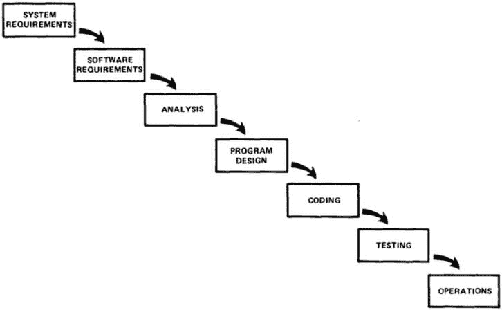

图 2.1：SDLC 瀑布模型

如我们所见，该流程从收集和分析系统需要满足的需求开始，然后设计、编码和测试软件，最后部署使用。在部署后的软件之后，您需要通过持续运营活动来管理它。该模型后来更新，包括各个阶段之间的反馈循环。例如，测试的反馈可能导致更新的编码步骤，这反过来又可能导致更新的程序设计步骤，依此类推。

瀑布模型的一个众所周知的问题是，该流程不促进今天快速发展的软件开发行业所需的快速创新或灵活性，因为在开发、测试和部署阶段，新需求经常出现。软件设计需要频繁更新，流程的各个阶段更具有循环性，以便更灵活地进行更新（参见*图 2.2*）。因此，像敏捷这样的新开发方法出现了。尽管如此，从收集需求到设计、编码、测试、部署和监控软件的方法论事件序列仍然以各种形式存在于系统设计项目中，这扩展到了机器学习和项目。

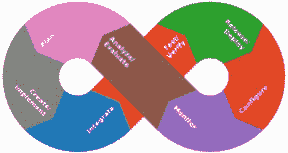

图 2.2：软件开发的一种循环方法，通常被称为 DevOps（来源：https://openclipart.org/download/313185/1546764098.svg）

## 典型的机器学习项目阶段

有趣的是，将传统软件开发行业的经验应用到机器学习模型开发上花费了一些时间。在过去几年中，随着机器学习开发突然受到巨大的人气提升，许多公司在没有正式流程的情况下跳入了这场竞赛，结果，公司在没有太多能力在整个行业标准化的情况下遇到了自己随机意外的问题。幸运的是，从这一过程中的早期先驱者那里学到了经验教训，并出现了标准化的项目活动。以下是在大多数机器学习开发项目中可以预期采取的步骤：

1.  收集、分析和理解模型将开发的业务需求。

1.  寻找并收集相关数据。

1.  探索和理解数据的内容。

1.  对数据进行转换或操作以用于机器学习模型训练，这可能包括特征工程和存储特征以供后续步骤使用。这一步骤通常也与*步骤 6*紧密相关，因为选定的算法可能对数据如何呈现有特定的要求。

1.  对于监督学习模型，如果数据集中尚未存在所需的标签，则对数据进行标记。

1.  选择一个适合业务案例要求的算法。

1.  训练一个模型。

1.  配置和调整超参数。

1.  部署模型。

1.  部署模型后监控模型。

*图 2*.*3*展示了这些步骤的视觉表示，我们将在接下来的章节中详细探讨这些步骤：

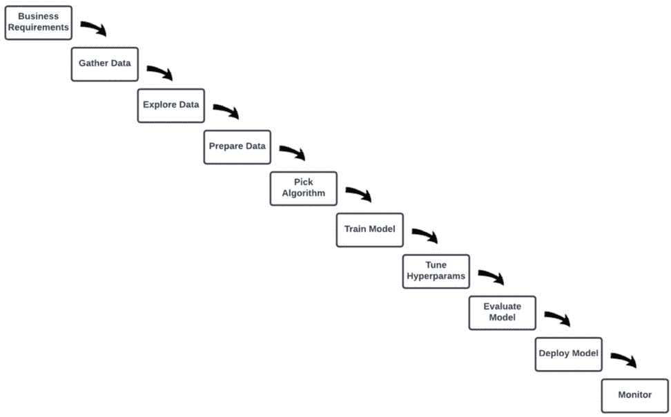

图 2.3：典型的机器学习项目阶段

如您所见，机器学习模型开发过程与传统软件开发生命周期（SDLC）之间有一些相似之处，但也存在一些独特的差异。最值得注意的是，数据被纳入了过程。我们现在需要将数据的操作纳入整体过程，这增加了许多复杂性，正如我们在更详细地通过每个过程步骤时将会看到的。需要注意的是，生命周期中的每个步骤通常是循环性质的，其中数据科学团队可能需要多次执行每个任务或任务组合，使用试错法，直到找到每个步骤的最佳使用方法。

### 收集、分析和理解业务需求

这个步骤通常被省略在机器学习生命周期图中，因为这样的图通常关注后续技术步骤，而这些步骤在我们项目中的后续阶段。这可以被视为零步骤，因为通常需要在我们的项目中的任何技术步骤开始之前发生。就像在传统的软件开发中一样，整个过程必须从收集和理解模型将要解决的业务需求开始。例如，我们项目产生的模型将用于预测下一年的销售收入，还是我们正在着手构建一个将监控人们的健康数据并根据这些数据提供健康相关建议的应用程序？业务需求会影响我们在项目后续步骤中做出的决策，例如我们需要收集哪些类型的数据，我们将使用哪些机器学习算法来训练我们的模型，以及我们将如何衡量与模型性能相关的指标。

在人工智能/机器学习项目的这个部分，解决方案架构师将与业务领导合作，了解他们从业务角度想要实现的目标，然后将与技术人员合作，将业务需求转化为技术需求。定义技术需求是定义满足业务领导概述的业务目标的整体策略的第一步之一。这包括确定可能存在的任何限制，例如与数据科学家合作确定需要哪些类型的数据来解决业务目标，以及这些数据是否可以收集、生成或从某处采购。

### 寻找和收集相关数据

我们在*第一章*中简要提到了这个话题。数据是机器学习模型学习的基础，所以没有数据就没有机器学习。如果项目团队——包括数据科学家和数据工程师（我们将在后面更详细地解释这些角色）——无法想出如何获取满足业务目标所需的数据，那么项目可能从一开始就难以启动，因此这是过程中的一个关键步骤。数据来源根据项目类型而异，但以下是一些可用于各种人工智能/机器学习用例的数据示例：

+   包含客户信用卡交易和/或银行交易详细信息的歷史数据

+   与客户在线购买相关的数据

+   特定地区的住房销售数据

+   包含技术系统操作事件详细信息的日志条目数据

+   由可穿戴设备（如手表或健身追踪器）追踪的健康数据

+   从填写表格或调查问卷的人那里收集的数据

+   来自**物联网（IoT**）设备（如工厂输送带或建筑车辆车队）的数据流

如您所见，有不同类型的数据可以用于许多不同的目的。数据科学团队的首要任务是定义和定位项目所需使用的数据。这不是一个原子活动，因为它不需要在项目开始时一次性完成。通常，科学团队会先对所需数据有一个大致的想法，然后根据项目后期测试和反馈来细化数据需求。

### 探索和理解数据

当数据科学团队收集了他们认为可以用于满足业务需求的数据时，他们通常不会直接在该数据上训练机器学习模型。相反，他们通常需要检查数据，以评估其是否真的能够满足项目的需求。原始数据往往不适合某些机器学习算法使用。让我们从我们的潜在数据源列表中举几个例子。如果我们使用的是人们填写表格或调查表收集的数据，人们可能会输入错误的信息。他们可能会留空某些字段或在输入时拼写错误。作为另一个例子，如果我们使用的是来自可穿戴健康追踪器或其他物联网设备（如机械设备传感器）的数据，这些传感器可能会出现故障并记录损坏的数据。因此，数据科学家通常需要检查数据，寻找错误、异常或潜在损坏的数据。在第一章中，我们也提到数据科学家可能希望获取有关数据的统计细节，例如数据中特定变量的值范围或其他统计分布细节。在本书的后续实践活动中，我们将使用数据可视化工具和其他数据检查工具来探索和理解数据集的内容。

### 对数据进行转换或操作以用于机器学习模型训练

缺失或损坏的数据在训练机器学习模型时可能会引起问题。一些需要操作数值数据的算法在遇到非数值值（包括空值和乱码/损坏的字符）时会产生错误。即使对于可以优雅处理这些值的算法，这些值也可能以意想不到的方式扭曲学习过程，从而影响最终模型的表现。

当数据科学家发现某个数据集不适合用于训练机器学习模型时，他们通常不会放弃，而是尝试对数据进行修改，使其更接近理想状态。我们称这个过程为**特征工程**。

注意

一些文献出版物仅用“特征工程”一词来指代从现有特征（例如我们每平方英尺的价格示例）创建新特征的过程，而其他文献则用同一术语来描述与操纵我们数据集中特征相关的所有活动，包括替换缺失值。

这可能包括数据清洗（或净化）技术，例如用更有意义的东西替换缺失数据。例如，让我们假设某种医疗状况更可能在一个人变老时发生，我们希望构建一个预测这种状况发生可能性的模型。在这种情况下，一个人的年龄将是我们数据集中的重要输入特征。在我们的数据探索活动中，如果我们发现数据集中的一些记录缺失年龄值，我们可以计算数据集中所有人的平均年龄，并用平均年龄值替换每个缺失的年龄值。或者，我们可以用众数（即最频繁出现的值）替换每个值。这两种情况至少比在训练过程中数据集中有缺失或损坏的值要好。

此外，针对特定业务需求的最佳变量和值可能在我们能访问的任何原始数据中都不易获得。相反，数据科学家通常需要结合来自不同来源的数据，并想出巧妙的方法从现有数据中推导出新的数据。一个非常简单的例子是，如果我们特别需要一个年龄作为输入变量，但数据集只包含他们的出生日期。在这种情况下，数据科学家可以在数据集中添加另一个特征，即年龄，并从当前日期中减去出生日期以计算该人的年龄。一个稍微复杂一点的例子是，如果我们想预测房价，并确定每平方英尺的价格将是我们模型的重要输入特征，但我们的数据集只包含每所房子的总价格和每所房子的总面积（以平方英尺为单位）。在这种情况下，为了创建每所房子的每平方英尺输入特征，我们可以将每所房子的总成本除以该房子的总面积，然后将这个值作为数据集中的特征添加。

重要的是要理解，当数据科学家创建了训练模型所需的重要特征后，他们通常会希望将这些特征存储在某个地方以备后用，而不是需要一次又一次地重新创建它们。在本书的后面部分，我们将探讨为这一目的开发的工具。

### 数据标注

正如我们在*第一章*中讨论的那样，监督学习算法在训练过程中依赖于数据集中的标签，这些标签告诉模型模型试图学习的各种数据关系类型的正确答案。*图 2.4*展示了我们的标记数据集示例。

图 2.4：数据集中标签的示例（绿色突出显示）

如果你很幸运，你将找到一个可以用来解决你的业务需求并且已经包含你想要预测的变量的必要标签或“正确答案”的数据集。如果没有，你将需要将标签添加到数据集中。再次强调，考虑到你的数据集可能包含数百万个数据点，这可能是一项非常复杂且耗时的任务。而且，就像你数据集中的其他任何特征一样，你标签的质量直接影响到你模型预测的可靠性。因此，你需要能够准确标记你的数据集的劳动力，以及其他有助于标记的工具。

另一个用于监督学习算法的数据准备步骤是将数据集分成三个不同的子集，分别用于模型的训练、验证和测试。我们将在本章后面的模型训练部分描述这些子集的使用。

在这里需要强调的一个重要概念是**数据泄露**，它指的是使用训练数据集之外的信息来创建模型的情况。这可能导致模型在训练数据上表现良好（因为它拥有在现实世界场景中不会拥有的信息），但在生产中由于这些无意中的提示而表现不佳。

数据泄露的原因有很多，比如在我们进行数据科学项目时如何以及何时分割我们的数据集，或者我们如何标记我们的数据。例如，在数据准备活动，如标记或特征工程中，我们可能会意外地包含在现实世界应用中模型无法获得的知识。考虑这样一个场景，我们正在使用历史数据来训练我们的模型。我们可能会意外地包含在数据集中表示的事件实际发生之后才变得可用的信息。虽然这些数据可能相关并且可能有助于影响结果，但如果这些信息在模型需要做出预测的现实世界场景中不可用，那么它将损害我们的模型性能。

### 选择算法和模型架构

有许多不同类型的机器学习算法，可以用于各种目的，并且新的算法和模型架构模式经常出现。在某些情况下，选择你的方法是一个简单的决定，因为有一些算法和模型架构特别适合特定的用例。例如，如果你想实现一个计算机视觉用例，那么像卷积神经网络架构这样的东西将是一个好的起点。另一方面，选择用于特定问题的机器学习算法和实现可能是一项困难的任务，这通常取决于数据科学团队的经验。例如，经验丰富的数据科学家团队可能已经参与了多个不同的项目，并形成了对不同情况下哪些算法效果最好的实际理解，而经验较少的数据科学团队可能需要对各种算法和模型架构进行更多的实验。

除了直接的业务需求，例如“我们需要一个计算机视觉模型来识别制造缺陷”，所选择的算法还可以依赖于不那么具体的企业需求，例如“模型需要在有限的计算资源上运行”或“在这个用例中，模型的可解释性非常重要。”上述每个要求都对数据科学团队为特定用例选择算法的类型施加了不同的约束。

与整体 AI/ML 项目生命周期中的大多数步骤一样，选择最佳的算法和模型架构可能需要数据科学团队实施一个循环的试错方法，他们可能会尝试不同的算法、架构、输入/输出，直到找到最佳的实施方案。我们将在本书后面的实践活动中探讨各种算法及其独特的特性，但总体来说，最好从一个简单的基线模型开始，这样我们就有了一个比较指标和了解基础数据集的起点。然后，我们可以测试更复杂的模型，并评估它们是否表现更好。

### 训练模型

这可能是 AI/ML 项目生命周期中最知名的活动。这是模型真正从数据中学习的地方。对于无监督算法，这可能就是它们形成我们在*第一章*中提到的那些聚类的时刻，例如。对于监督算法，这是我们的训练、验证和测试数据集进入场景的地方。在*第一章*中，我们简要地讨论了线性代数和微积分在机器学习中的应用。如果我们以线性回归为例，这正是那些概念会发挥作用的地方。我们的模型首先会尝试找到特征和标记的目标输出之间的关系。也就是说，它会尝试找到每个特征的系数，当这些系数组合使用（例如，通过将它们全部相加）时，会产生标记的目标输出。它试图计算适用于数据集中所有数据点的系数，为此，它需要扫描训练数据集中的所有项目。

模型通常从这个过程开始时进行随机猜测，因此它不可避免地在第一次尝试时是错误的。然而，然后它会计算错误并调整以通过数据集的后续迭代来最小化这些错误。有几种不同的方法和算法可以用来最小化错误，但一个非常流行的方法是称为梯度下降。我们在*第一章*中简要提到了梯度下降，但在这里我们将更详细地讨论它。在梯度下降中，算法致力于找到我们所说的损失函数的最小值，损失函数是我们模型试图猜测数据集中每个数据点产生标记输出的特征系数时产生的错误的表示。"方程式 2.1"展示了计算线性回归损失函数的**均方误差**（MSE）的方程式示例：

![<mml:math xmlns:mml="http://www.w3.org/1998/Math/MathML" xmlns:m="http://schemas.openxmlformats.org/officeDocument/2006/math" display="block"><mml:mi>M</mml:mi><mml:mi>S</mml:mi><mml:mi>E</mml:mi><mml:mo>=</mml:mo><mml:mfrac><mml:mrow><mml:mn>1</mml:mn></mml:mrow><mml:mrow><mml:mi>n</mml:mi></mml:mrow></mml:mfrac><mml:mrow><mml:munderover><mml:mo stretchy="false">∑</mml:mo><mml:mrow><mml:mi>i</mml:mi><mml:mo>=</mml:mo><mml:mn>1</mml:mn></mml:mrow><mml:mrow><mml:mi>n</mml:mi></mml:mrow></mml:munderover><mml:mrow><mml:msup><mml:mrow><mml:mo>(</mml:mo><mml:msub><mml:mrow><mml:mi>y</mml:mi></mml:mrow><mml:mrow><mml:mi>i</mml:mi></mml:mrow></mml:msub><mml:mo>-</mml:mo><mml:msub><mml:mrow><mml:mover accent="true"><mml:mrow><mml:mi>y</mml:mi></mml:mrow><mml:mo>^</mml:mo></mml:mover></mml:mrow><mml:mrow><mml:mi>i</mml:mi></mml:mrow></mml:msub><mml:mo>)</mml:mo></mml:mrow><mml:mrow><mml:mn>2</mml:mn></mml:mrow></mml:msup></mml:mrow></mml:mrow></mml:math>](img/1.png)

方程式 2.1：均方误差公式

在 *方程式 2.1* 中，*n* 代表数据集中数据点的数量。

要理解这个公式所表达的意思，让我们从括号内的部分开始：

 代表每个数据点的模型预测目标变量，而  代表每个数据点的真实目标变量的值。

在 *方程式 2.1* 的括号内，我们通过从模型预测值中减去真实值来计算模型预测的错误，这与我们在 *第一章* 中描述的类似，然后对结果进行平方。在这种情况下，我们计算的是所谓的 **欧几里得距离**，即在二维空间中预测值与真实值之间的距离。对结果进行平方也起到了消除减法结果中负值的作用。

方程中的求和符号*Σ*（西格玛）代表将训练数据集中所有数据点的计算误差加起来。然后，我们将最终结果——即所有预测的总误差——除以数据集中的数据点数量，以计算所有预测的平均误差（或均值）。

记住，我们希望通过找到这个损失函数（也称为**目标函数**）的最小点来最小化每次训练迭代中的误差。为了理解在损失函数中找到最小点意味着什么，如果我们能够绘制出函数的图形，那会有所帮助。图 2.5 展示了均方误差（MSE）的二维损失函数图的例子：

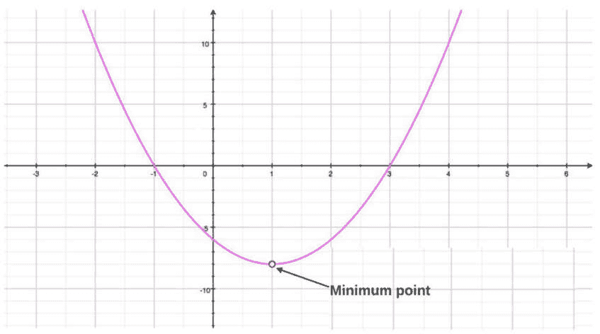

图 2.5：展示最小点的均方误差损失函数图

每次算法从每次训练迭代中计算出损失时，那个损失值可以表示为图上的一个点。考虑到我们想要移动到最小点以最小化损失，我们希望在图上向下迈一步。无论何时我们想要从一个点移动到另一个点（即使在我们现实生活中移动身体），我们需要确定运动的两个方面：方向和大小，即我们想要朝哪个方向移动以及移动多远？这就是梯度下降发挥作用的地方。它帮助我们确定应该朝哪个方向移动以向最小点前进。让我们更详细地看看它是如何工作的。

想象一下图 2.5 是一个山谷，我们站在代表最近一次训练迭代中计算出的损失的那个点上。那个点位于山谷的侧面，例如图 2.6 中所示的位置。

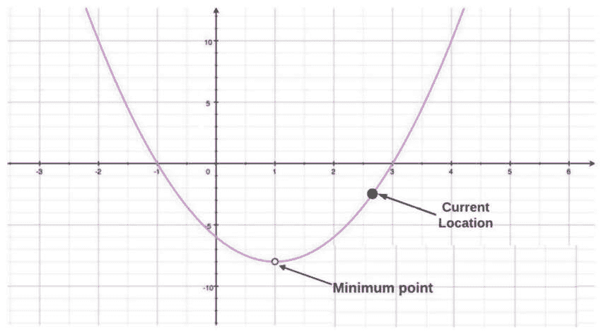

图 2.6：展示当前位置的均方误差损失函数图

对于人类来说，下山行走有一定的本能，因为我们有感觉输入告诉我们哪个方向是下坡。例如，我们的脚可以感觉到当前位置的山坡斜度，我们可以感觉到向下的重力拉扯，我们也许还能够看到我们的周围环境，因此可以看到哪个方向是下坡。然而，我们的梯度下降算法没有这些感觉输入，它只能通过数学来找出哪个方向是下坡。然后，它需要使用程序方法来定义在那个方向上迈步的含义。我们的算法知道图上的当前位置，并且可以计算函数的导数（来自微分学的概念）以确定当前位置的图形斜率。图 2.7 展示了图上某一点处直线斜率的例子，这代表了该点处函数的导数。

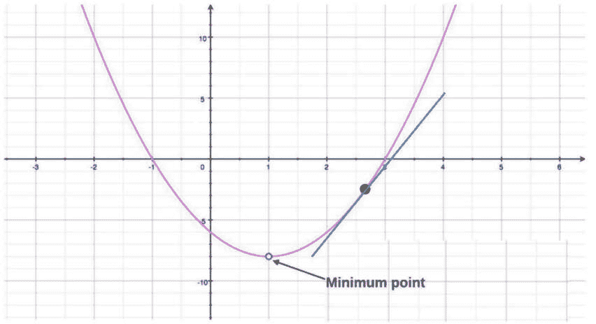

图 2.7：特定点的损失函数导数

当导数被计算出来后，这个信息可以被我们的算法用来朝着最小点迈出一步。*方程 2.2*展示了在线性回归的背景下，如何计算每个后续步骤的梯度下降：

![<math xmlns="http://www.w3.org/1998/Math/MathML" display="block"><mrow><mrow><msub><mi>θ</mi><mi>j</mi></msub><mo>=</mo><msub><mi>θ</mi><mi>j</mi></msub><mo>−</mo><mi>α</mi><mfrac><mn>1</mn><mi>m</mi></mfrac><mrow><munderover><mo>∑</mo><mrow><mi>i</mi><mo>=</mo><mn>1</mn></mrow><mi>m</mi></munderover><mrow><mo>(</mo><msub><mi>h</mi><mi>θ</mi></msub><mfenced open="(" close=")"><msup><mi>x</mi><mfenced open="(" close=")"><mi>i</mi></mfenced></msup></mfenced><mo>−</mo><msup><mi>y</mi><mrow><mo>(</mo><mi>i</mi><mo>)</mo></mrow></msup><mo>)</mo><msubsup><mi>x</mi><mi>j</mi><mrow><mo>(</mo><mi>i</mi><mo>)</mo></mrow></msubsup></mrow></mrow></mrow></mrow></math>](img/5.png)

方程 2.2：线性回归的梯度下降

在*方程 2.2*中，代表图上的位置，而θ代表我们数据集中每个数据点特征的系数向量。记住，我们正在尝试找到一组系数，使得我们的模型预测与数据点目标变量的真实值之间的误差最小：

+   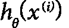表示每个数据点的预测目标变量

+   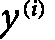表示每个数据点的真实目标值

如我们所见，在更广泛的一组括号中，我们再次从每个数据点的预测目标变量值中减去真实目标值。这是因为*方程 2.2*是从*方程 2.1*（这里省略了该推导的数学证明以简化）推导出来的。

*m*代表我们数据集中每个数据点的特征数量。

就是我们所说的**学习率**。它是我们算法的其中一个超参数，它决定了我们应该采取的步长大小；即，我们在所选方向上移动的幅度。

总的来说，![<math xmlns="http://www.w3.org/1998/Math/MathML"><mrow><mrow><mstyle scriptlevel="+1"><mfrac><mn>1</mn><mi>m</mi></mfrac></mstyle><mrow><msubsup><mo>∑</mo><mrow><mi>i</mi><mo>=</mo><mn>1</mn></mrow><mi>m</mi></msubsup><mrow><mo>(</mo><msub><mi>h</mi><mi>θ</mi></msub><mfenced open="(" close=")"><msup><mi>x</mi><mfenced open="(" close=")"><mi>i</mi></mfenced></msup></mfenced><mo>−</mo><msup><mi>y</mi><mrow><mo>(</mo><mi>i</mi><mo>)</mo></mrow></msup><mo>)</mo><msubsup><mi>x</mi><mi>j</mi><mrow><mo>(</mo><mi>i</mi><mo>)</mo></mrow></msubsup></mrow></mrow></mrow></mrow></math>](img/10.png)代表了在图上当前位置损失函数的导数。因此，*公式 2.2*表明我们的下一个位置将等于当前位置减去在图上当前位置损失函数的导数乘以学习率。这样就会朝着最小值点迈出一步，其中损失函数的导数决定了方向，而与学习率的组合则定义了幅度。

非常重要的是要注意，*公式 2.2*仅仅代表了梯度下降过程中的一个步骤。我们多次迭代这个过程，在每次迭代中，我们遍历数据集，输入我们的估计系数，计算误差/损失，然后通过梯度下降朝着损失函数的最小值点迈进来减少损失。我们可能永远无法精确地达到最小值点，但即使我们能够非常接近，我们的模型估计和预测也可能是可接受的准确。

我们应该注意，梯度下降有不同的配置。在批量梯度下降中，我们会在每次迭代中遍历整个训练集。或者，我们可以实现小批量梯度下降，在这种情况下，每次迭代会处理训练数据集的子集。这种方法不如全面，但可能更有效率。一种流行的实现方式被称为随机梯度下降（“随机”一词意味着“随机”）。在随机梯度下降中，我们每次迭代从数据集中抽取一个随机样本子集，这可能是每个样本中只有一个数据点。关键在于，因为我们每次迭代都抽取一个随机子集，所以我们每次都是从特征空间的不同点开始。起初，这似乎有些无序，因为我们会在特征空间的不同点跳跃。然而，这种方法已被证明在最小化整体损失函数方面非常有效。它还可以帮助避免所谓的**局部最小值**，这指的是某些损失函数并不像我们在*图 2.5*中展示的那样简单。它们可能有多个峰值和谷底，在这种情况下，任何谷底的底部都可以被视为一种最小点，但局部最小值可能不是函数的整体最小值，这被称为**全局最小值**。*图 2.8*展示了多个最小值和最大值的例子：

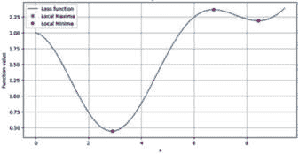

图 2.8：局部和全局最小值及最大值

尽管我们在这个部分关注了二维损失函数，但损失函数可以超过两个维度，同样的概念也适用于更高维的空间。

注意

在本节中，我们选择了一个特定的算法（线性回归）和一种数据集类型（表格）来展示模型训练过程的例子。当然，还有其他算法和数据类型适用于不同的用例，那些用例的训练过程会有它们自己独特的实现。然而，整体模型训练过程通常涉及处理输入数据，试图找到某种有用的模式或关系，然后以重复的方式逐步提高该模式或关系的准确性，直到达到某个确定的准确度阈值或直到训练被认为无效（如果模型未能有效地学习任何有用的模式或关系）并因此终止。

### 配置和调整超参数

超参数是定义模型训练作业运行方面的参数。它们不是模型从数据集中学习的参数，而是与模型训练过程执行相关的外部配置选项。以一个简单的例子开始：我们讨论过，训练作业通常需要多次遍历训练数据集，以便学习数据中的模式。您可能为模型训练作业配置的一个超参数可能是指定它应该遍历数据集的次数。这通常被称为**epoch**的数量，其中 epoch 代表一次遍历训练数据集。

为您的超参数选择最佳值是另一种通常需要大量试错尝试的活动，在这个过程中，您可能需要尝试不同的超参数值组合，以找到最大化模型训练性能的最佳设置。让我们继续我们的简单例子，即配置训练作业应该处理训练数据集的次数。考虑到模型每次遍历数据集时可能学习到更多信息，我们最初可能会认为决定 epoch 的数量将是一个简单的选择，即我们只需将此值设置得非常高，以便模型从数据中学习到更多信息。然而，在现实中，这通常不是最佳选择，因为模型每次处理数据集时并不总是能学习到更多有用的信息。机器学习中存在一些称为**欠拟合**和**过拟合**的概念，我们将在本章的*挑战*部分进行探讨。它们与继续在现有数据集上训练将无法产生预期结果的问题相关。

即使在模型每次处理数据集时都能学习到有用信息的情况下，它通常也会达到一个点，即它学习新信息的速率会放缓或达到平台期。当这种情况发生时，再次反复遍历数据集将是不高效的。请记住，在大型数据集上训练模型可能非常昂贵，因此当模型的学习达到平台期时，您不希望继续处理数据。我们可以通过生成**学习曲线**图来衡量学习速率，该图显示了训练过程中的训练错误。*图 2.9*显示了学习曲线的一个示例：

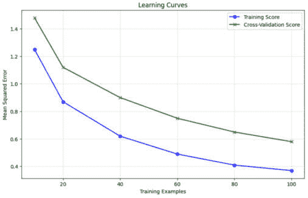

图 2.9：学习曲线图

在**图 2.9**中，蓝色和红色线之间的差距代表我们的模型在训练数据集和测试数据集上的预测误差。当图表显示蓝色和红色线之间的差距没有显著减少时，我们知道继续训练不会使我们的模型显著更准确，这可能是一个停止训练过程的良好时机。

一个类比是，如果我们有一个学生已经读过一本书很多次，以至于记住了每个单词并彻底理解了书中的每个概念。在那个时刻，继续指导学生反复阅读这本书就变得没有必要了，因为他们将不再从这本书中学到任何新东西。现在让我们也想象一下，我们需要每次学生阅读这本书时都付给他们报酬，这类似于为在数据集上训练模型所需的计算资源付费。

配置训练轮数（epochs）是尝试为特定超参数找到最佳配置的一个例子。不同类型的算法有不同的超参数类型，尝试测试所有超参数值的组合对于数据科学家来说可能是一个痛苦且耗时的工作。幸运的是，Google Cloud 有一个工具可以自动执行这项任务，我们将在本书的后面部分探讨。

### 部署模型

终于！我们已经找到了合适的数据、算法和超参数值的组合，并且我们的模型已经准备好在现实世界中使用了，我们称之为**托管**或**服务**我们的模型。达到这个阶段需要大量的工作。我们可能已经训练了数百个不同版本的模型，以便将其部署到生产环境中。我们的数据科学团队可能不得不尝试许多不同的数据集版本和转换，以及许多不同的算法和超参数值，才能最终获得一些有意义的成果或见解。直到大约五年前，执行所有这些步骤并跟踪其结果仍然是一个非常缓慢、手动且痛苦的过程。尽管如此，现在至少有工具可以自动化许多这些步骤，并且可以更快地完成，可能只需要几周而不是几个月。在这本书的后面部分，我们将讨论一种称为 AutoML 的技术，它可以将整个流程简化为几个简短的命令，只需几分钟或几小时即可完成！

部署我们的模型可能就像将其打包成 Docker 容器并在服务器上部署容器一样简单，尽管我们通常会希望创建某种基于 Web 的 API，以方便应用程序访问模型。我们将在后续的动手活动中这样做。此外，当我们介绍 MLOps 时，我们将看到为什么对我们来说创建管道来自动化模型的部署是有意义的，这与我们使用 CI/CD 管道构建和部署常规软件应用的方式非常相似。

### 部署后监控模型

你可能会认为一旦你成功测试并部署了模型到生产环境，你的工作就完成了。然而，乐趣并没有停止！就像常规软件一样，你需要持续监控你的模型性能。这包括传统的监控，例如跟踪你的模型在给定时间段内（例如每秒）服务了多少请求，模型响应请求需要多长时间（延迟），以及这些指标是否随时间变化。然而，机器学习模型还有额外的监控需求，例如像在*第一章*中提到的机器学习特定指标（MAE、MSE、准确率、精确度等）。这些指标帮助我们了解我们的模型从推理角度的表现，因此我们需要监控它们，并确保它们继续满足我们的业务需求。

注意

在本节中你学到的机器学习模型开发生命周期中的各个阶段是理解 MLOps 和 AutoML 的基础。我们在这本书中用整整一章来介绍 Google Cloud 上的机器学习工程和 MLOps，但到目前为止，从高层次来看，你可以认为 MLOps 和 AutoML 的目标是自动化机器学习模型开发生命周期的所有步骤。你将在 MLOps 章节中看到，我们可以使用工具来创建管道，自动化所有概述的步骤。我们可以在管道中拥有复杂的管道组合，这将自动化从准备和转换输入数据到训练和部署模型，监控生产中的模型，以及如果我们检测到我们的模型停止提供期望的结果，我们希望重新训练模型在更新的数据上，自动重新启动整个过程的全部工作。这将提供一个自我修复的模型生态系统，有助于持续保持我们的模型更新。

## AI/ML 项目中的角色和人物

在整本书中，我们提到了各种角色，如数据科学家、数据工程师和机器学习工程师。我们还提到了更多传统的角色，如软件工程师、项目经理、利益相关者和业务领导者。这些传统角色在行业中已经定义了几十年，所以我们在这里不会定义它们，但对于特定于 AI/ML 项目的较新角色，常常存在混淆，因此我们将在这里简要描述它们。在小型团队中，需要注意的是，一个人可能需要执行所有这些角色：

+   **数据工程师**：数据工程师通常参与数据科学项目的早期阶段——具体来说是数据收集、探索和转换阶段。数据工程师通常负责找到相关数据并将其清理干净，以便在项目的后期阶段使用。

+   **数据科学家**：数据科学家通常是实际训练机器学习模型的角色。他们在迭代各种模型训练实验的过程中，通常会执行数据收集、探索和转换等活动。在某些情况下，数据科学家将是项目中的资深成员，他们可能会为数据工程师和机器学习工程师提供指导。他们通常负责创建的机器学习模型，尽管这些模型是在数据工程师和机器学习工程师的帮助下创建和部署的。

+   **机器学习工程师**：机器学习工程师角色通常指的是具有机器学习或数据科学专长的软件工程师。他们理解机器学习概念，并且是模型开发生命周期各个阶段的专家。他们通常是连接 DevOps 专长到机器学习项目的桥梁，以便创建 MLOps 工作负载。当数据科学家创建他们认为可以用于生产的模型时，他们可能会与机器学习工程师合作，在 MLOps 管道中部署模型到生产环境中所需的全部机制。

现在我们已经涵盖了典型 AI/ML 项目中发现的重大步骤和概念，让我们来看看公司在尝试实施此类项目时通常会遇到的陷阱。

# 在机器学习模型开发生命周期中遇到的常见挑战

对于机器学习模型开发生命周期中的某些阶段，我们已经讨论了你在这些阶段可能会遇到的各种挑战。然而，在本节中，我们特别指出了一些作为与实施 AI/ML 工作负载的公司互动的 AI/ML 解决方案架构师需要了解的主要挑战。在本章后面的“克服常见挑战的最佳实践”部分，我们将探讨克服许多这些挑战的方法。

## 寻找和收集相关数据

我们面临的第一大挑战之一是找到为解决我们的模型构建的业务问题所需的相关数据。我们在上一节中提供了一些潜在数据源的示例，在某些情况下，您可能已经可以轻松获得所需的数据，但找到相关数据对于数据科学家和数据工程师来说并不总是直接的。以下是在寻找和访问正确数据方面的一些常见挑战：

+   如果您在一家大公司工作，数据可能存在于您公司内的另一个团队或组织中，但您可能不知道它或不知道如何找到它。

+   数据可能需要从散布在公司各个部门的不同数据源中创建，这些数据源由不同的组织拥有。

+   数据可能包含敏感信息，因此可能受到有关其存储和访问方式的法规和限制。

+   您可能需要咨询专家以找到、验证和理解数据，例如，财务数据、医疗数据、大气数据或与特定专业领域相关的其他数据。

+   数据可能存储在仅限于生产事务操作使用的数据库中。

+   您可能不知道您是否可以信任数据的内含内容。例如，它是否准确？

+   数据可能包含固有的偏差或其他未知挑战。

## 选择算法和模型架构

当涉及到选择要使用的算法或模型架构时，最初的最大的挑战之一可能是仅仅确定从哪里开始。您不希望花费数月时间仅在不同选项上进行实验，直到找到有用的实现或永远找不到有用的实现。

## 数据标注

数据标注可能是一项非常手动的工作，需要人类通过大量数据并为每个数据点添加标签。近年来已经开发了一些工具来自动化一些标注任务或使任务对人类来说更容易执行，但仍然需要在标注数据集时有人类参与。因此，公司可能面临的一个主要挑战是寻找和雇佣一支强大的数据标注团队。请记住，某些数据标注任务可能需要特定的专业知识。例如，考虑一个由医学图像组成的数据集。图像中的特定特征可能表明存在某种特定的医疗状况。通常需要特殊培训才能阅读医学图像并识别所讨论的具体特征，因此这不是可以雇佣任何随机人员的任务。正如我们之前讨论的，如果您的标签不准确，那么您的模型也不会准确，在本例中，对于被委托诊断危及生命医疗状况的医疗设施来说，这可能具有重大影响。

## 训练模型

关于模型训练的两个经典挑战是**欠拟合**和**过拟合**问题。这些挑战与你的模型如何学习数据中的关系或模式有关。

在监督学习的情况下，我们通常将数据集分为前面提到的三个子集：训练集、验证集和测试集。验证集通常用于超参数调整，训练数据集是模型训练所用的数据，测试数据集是我们评估训练模型的方式。我们根据为该模型定义的指标来评估模型，例如准确率、精确度或均方误差。在这种情况下，测试数据集是模型在训练过程中未见过的新的数据，我们希望确定当模型看到这些新数据时，其预测是否准确——即，我们希望确定模型对新数据的**泛化能力**。如果一个模型在训练数据集上提供非常准确的预测，但在测试数据集上提供不准确或不太准确的预测，那么我们就说该模型是过拟合的。这意味着它过于紧密地拟合了训练数据，当它接触到新数据时无法表现良好。

另一方面，如果我们发现模型在任一数据集（训练或测试）上表现不佳，那么我们就说它是欠拟合的。

*图 2.10*展示了试图确定蓝色和红色数据点之间差异的分类模型的拟合、过拟合和欠拟合的示例。黑色边界线代表过拟合，因为它与数据集拟合得过于精确，紫色线代表欠拟合，因为它没有很好地捕捉蓝色和红色点之间的差异。绿色线很好地分离了蓝色和红色点；它并不完全完美，但可能是一个泛化能力良好的可接受的模型。

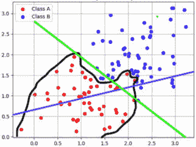

图 2.10：拟合、过拟合和欠拟合的示例

除了前面提到的经典训练挑战之外，还有其他挑战与作为更广泛 AI/ML 项目一部分的训练整体过程有关，例如我们提到的*第一章*中的谱系跟踪。在大型的 AI/ML 项目中，可能有多个数据科学家团队进行实验和训练数百个模型。在大型项目中跟踪他们的结果并与他们分享可能非常具有挑战性。

## 配置和调整超参数

寻找最佳的超参数值集合可能几乎与制作一个可用的数据集或选择正确的算法一样具有挑战性。考虑到超参数会影响我们的模型训练作业的运行方式，每个作业可能需要很长时间才能运行，并且可能存在数千种超参数值的组合需要探索，手动进行这项工作可能非常具有挑战性和耗时。

## 评估模型

虽然我们在训练和超参数调整过程中通常进行一些验证和测试，但在将模型部署到生产环境中之前，我们应该彻底评估我们的模型。在第一章“开发机器学习应用中的常见挑战”部分中，我们讨论了从数据科学项目中实现商业价值所面临的挑战。*第一章*中，我们强调了数据科学家与业务利益相关者合作，彻底理解目标人工智能/机器学习系统旨在解决的业务需求的重要性。在我们数据科学项目中，评估步骤就是检查我们创建的模型和解决方案是否充分满足了这些业务需求，这是基于我们定义的成功度量标准。除了数据科学团队评估模型外，在此阶段与业务利益相关者审查结果，以确保它们符合预期，也可能是相关的。如果我们发现结果不满意，我们通常需要从数据科学生命周期的早期重新尝试这个过程，可能使用新的或不同的数据、不同的算法和/或不同的超参数值。我们可能需要在交互式过程中重复这些步骤，直到我们适当地满足业务需求。

## 部署模型

在部署我们的模型时，我们需要选择足够的计算资源来充分服务我们的模型。根据模型架构，我们可能需要包括 GPU/TPU，通常也结合 CPU，当然还有 RAM。在这个项目阶段的一个非常重要的活动是“正确配置”这些组件。为此，我们需要估计每种类型的组件需要多少才能尽可能准确地服务我们的模型，考虑到我们期望接收的每秒请求数量。为什么这如此重要呢？嗯，模型托管通常被公司报告为它们在 AI/ML 方面的最大成本。它可能占公司 AI/ML 成本的 90%。因此，如果我们配置的服务器比我们需要的资源更多，这将增加成本。另一方面，如果我们没有配置足够的资源，我们将无法处理来自客户的请求数量，从而导致我们的模型服务中断。幸运的是，像 Vertex 这样的云 AI/ML 服务可以自动扩展我们的模型托管基础设施以满足增加的需求，但我们需要尽可能准确地确定每台服务器的规模，以便控制成本。

在部署我们的模型时，我们还需要考虑我们的应用程序需要多快地对推理请求做出响应。在构建我们的模型托管基础设施时，我们需要记住这一点。

## 部署后监控模型

除了监控与我们的模型相关的各种指标外，在此阶段需要强调的一个重要概念是所谓的**漂移**，它可以以各种格式表示，如模型漂移、数据漂移或概念漂移。为了解释漂移的概念，我们首先需要深入探讨模型训练过程与模型在生产中运行之间的关系。

注意，在模型训练期间，模型接触到了特定格式和特定约束的数据，这就是它学习的方式。让我们将输入数据的状态称为其**形状**，它指的是数据的格式和约束。当我们将我们的模型部署到生产环境中，并暴露给新数据以从模型中获得预测时，我们希望确保新数据的形状尽可能匹配训练数据的形状。我们不是指数据的内涵，而是数据如何表示给模型。

在我们的训练过程中，我们可能对原始数据进行了转换，使其更适合模型训练。如果是这样，我们需要对任何我们发送给模型进行预测的新数据进行相同的转换。然而，在现实世界中，数据会随着时间的推移而变化，因此数据的形状也会随着时间的推移而变化。我们称这种现象为漂移，即自我们训练模型以来，现实世界中的原始数据在某种程度上发生了根本性的变化。让我们看看几个漂移的例子，以便阐明这一点：

**示例一**：

我们使用从在线填写表格的客户那里收集的数据来训练我们的模型。我们的模型试图预测这些客户是否可能对一项特定的营销活动做出良好反应，该活动将向他们发送带有鞋类折扣的目标电子邮件。最近，一位管理员决定他们想要从客户那里获取一些额外的信息，并且一些之前收集的数据不再相关，因此他们在表格中添加了一些字段并删除了一些其他字段。现在，当新客户填写表格并将这些数据发送到我们的模型时，输入中将有模型以前从未见过的额外字段，而模型期望看到的其他字段将不再存在。这可能会影响模型有效解释和使用输入数据的能力，导致错误或预测不正确。

**示例二**：

我们构建了一个模型，用于估算我们向客户交付产品所需的速度。该模型使用来自多个不同来源的输入。其中一个来源是一个包含过去交付中向客户交付产品所需时间的历史数据的数据库。我们每天都会收到该数据库的更新，其中包含前一天交付的所有订单的详细信息。该数据库中的一个关键特征是交付时间，以天为单位衡量。这个数据库是由我们公司中另一个组织拥有的系统创建的，因此我们无法控制该数据库。最近，我们的交付流程变得更加高效，一些产品现在可以在同一天交付，因此交付时间现在已更新为以小时为单位而不是以天为单位。然而，没有人通知我们的数据科学团队关于这一变化。现在，我们的模型查看交付时间特征，由于度量单位已更改，其对新交付时间的预测是不正确的。

另一个有趣的例子是我们都多少有些熟悉的。许多大型零售商使用 AI/ML 模型根据与客户购买相关的数据来预测他们库存中应该存放什么，他们试图寻找新兴趋势以识别消费者行为的改变。在 COVID-19 大流行的前几周，人们对购买什么的需求发生了巨大而突然的变化。模型可能惊讶地发现，突然之间，每个人都对某一特定事物非常感兴趣，在此之前，这一事物通常以非常可预测的速度销售。模型预测的，突然之间每个人都对什么特别感兴趣的东西是什么？卫生纸！

图 2.11：商店中空空的卫生纸货架（来源：https://commons.wikimedia.org/wiki/File:COVID-19_-_Toilet_Paper_Shortage_%2849740588227%29.jpg）

随着时间的推移，我们的数据也可能发生许多更微妙的变化。我们之前已经讨论了数据科学家在训练模型之前通常想要检查数据，他们经常想要检查的一个方面是每个特征（均值、众数、最大值、最小值等）的统计分布。这些细节很重要，因为它们让我们了解我们的特征通常预期包含哪些类型的值。在检查过程中，这可以帮助我们识别出可能表明错误数据或可能让我们了解我们之前未意识到的数据其他特征的异常值。我们还可以将这种知识应用于生产中的预测。我们可以分析发送到我们的模型进行推理的数据，如果我们看到统计分布以一致的方式发生变化，那么这可能会提醒我们潜在的数据损坏或数据确实发生了变化，这可能会表明我们需要通过在新数据上训练来更新我们的模型，这些新数据与我们在现实世界中观察到的更新形状相匹配。

正如我们所见，漂移可能导致我们的模型变得不准确或提供错误的结果，因此我们需要通过检查我们在生产中观察到的数据以及监控我们模型的预期指标来特别关注这一点。如果我们看到我们模型的指标随着时间的推移或突然下降，这可能是模型训练的数据类型与它在生产中观察到的数据类型之间漂移的迹象。

# 克服常见挑战的最佳实践

本节包含公司随着时间的推移开发出的指针和最佳实践，以解决上一节中讨论的许多挑战。

## 寻找和收集相关数据

我们讨论了数据孤岛是大型公司中常见的挑战，以及关于数据存储和访问的限制，特别是可能受到各种法规和合规要求约束的敏感数据。克服这些挑战的关键是通过创建集中的数据湖和数据发现机制来打破孤岛，例如包含描述我们数据湖中各种数据集元数据的可搜索数据目录。为了确保我们的数据存储和访问安全，我们需要实施强大的加密和基于权限的访问机制。我们将在后面的章节中更详细地探讨这些主题，并执行一些关于检测和解决数据集中偏差和其他问题的动手活动。

在我们的数据存在于专门为交易性业务操作限制的数据库中时，我们可以实施一个**变更数据捕获**（**CDC**）解决方案，将我们的数据复制到可以用于数据分析和 AI/ML 工作负载的数据湖。

考虑到数据收集过程发生在我们的 AI/ML 工作负载的最初阶段，我们必须在这个阶段实施数据质量检查，以防止工作负载后期出现问题。例如，我们知道在损坏的数据上训练我们的模型会导致错误或模型输出不准确。请记住，在大多数 ML 用例中，我们定期在来自某个来源的更新数据上训练我们的模型，这个来源可能是由另一个团队或组织拥有和运营的系统。因此，如果我们在这个数据进入工作负载时创建数据质量检查，并且检测到数据质量问题，我们应该实施机制来防止我们的流程中的后续步骤继续进行。否则，执行我们流程中的下游步骤，如数据转换和模型训练，将是时间和金钱的浪费，并可能导致生产中出现更糟糕的后果，如模型故障。

## 数据标注

如果您的公司在寻找执行标注任务的工作团队方面遇到困难，谷歌云的数据标注服务可以帮助您适当地标注数据。

## 选择算法和模型架构

在选择算法时，我们应该从哪里开始？这是一个常见的挑战，因此数据科学家一直在构建解决方案，试图使这个过程更容易。在本节中，我们将描述一个分层框架，用于在此背景下处理新的 AI/ML 项目：

+   **一级**：您可以查看是否已经存在针对您业务问题的打包解决方案。例如，谷歌云已经为许多不同类型的用例创建了打包解决方案，如计算机视觉、自然语言处理和预测。我们将在接下来的章节中更详细地介绍这些解决方案。

+   **第二级**：如果您想创建和部署自己的模型而不做任何相关工作，请查看 Google Cloud 的 AutoML 功能，看看它是否符合您的需求。我们也会在本书的后续章节中通过实际操作活动来探讨这一点。

+   **第三级**：如果您想使用别人训练好的模型开始，存在许多数据科学家共享他们创建的模型的数据中心“模型动物园”。类似于传统软件开发中的软件库，这些是由其他数据科学家为特定目的创建的资产，您可以重用它们而不是从头开始实现相同的功能。例如，您可以在 Google Cloud 的 AI Hub（https://cloud.google.com/ai-hub/docs/introduction）中找到各种用例的预训练模型。

+   **第四级**：如果前面的选项不能满足您的特定需求，您可以创建自己的自定义模型。在这种情况下，Google Cloud Vertex AI 提供了用于常见用例的内置算法，例如线性回归、图像分类、目标检测等等，或者您可以将自己的自定义模型安装到 Vertex AI 上运行。Vertex AI 为 AI/ML 项目生命周期的每个步骤都提供了许多工具，我们将在本书中探讨其中大部分。

## 训练模型

有一些已建立的方法来解决过拟合和欠拟合问题。过拟合的一个原因可能是模型没有获得足够多的不同数据点来学习适当的模式。让我们来看一个非常极端的例子，假设我们的数据集中只有一个数据点，并且我们的模型反复处理这个数据点，直到找到一组系数，它可以用来将输入特征准确关联到该数据点的目标输出。现在，每当它看到相同的数据点时，它可以轻松准确地预测目标变量。然而，如果我们向它展示一个具有相似结构的新数据点——即相同数量和类型的特征，但特征值不同——那么我们的模型很可能无法准确预测新数据点的输出，因为它在训练过程中只学习了单个数据点的特定特征。这是一个过拟合的例子，其中模型在训练数据点上表现非常好，但不能对其他数据点做出准确预测。

一种可以帮助解决这种过拟合问题的方法是在训练我们的模型时提供更多的数据点。如果我们的算法在训练过程中看到了成千上万的数据点，那么它更有可能构建一个更通用的模型，该模型对特征空间以及特征与目标变量之间的关系有更广泛的理解。因此，当它看到新的数据点时，它可能能够对新的数据点的目标变量做出更准确的预测。

在这个背景下，我们需要注意一个权衡：虽然我们的训练过程很可能会随着我们提供越来越多的数据点而构建一个更通用的模型，但我们还需要记住，在大数据集上训练模型可能会很昂贵。我们可能会发现，当模型已经看到了数百万个数据点后，每次新的训练迭代只使模型的泛化指标略有增加。例如，如果我们的模型目前的准确率为 99.67%，每次训练迭代只将其准确率提高 0.0001%，但这样做可能需要花费数千美元，那么从财务角度来看，继续在越来越多的数据点上训练模型可能就没有意义了，尤其是如果我们认为 99.5%的准确率已经足够满足业务需求的话。这一点很重要——训练成本与准确率增加之间的权衡取决于业务需求。如果我们正在构建一个用于医疗诊断用例的模型或一个预测准确率错误可能导致公司损失数百万美元的模型，那么继续在更多数据点上训练模型可能是值得的。在任何情况下，你通常需要做的是定义一个阈值，在这个阈值下，业务认为模型的指标已经足够，并测量随着模型在更多数据点上训练而该指标的增量。如果你看到该指标在达到一定数量的数据点后开始趋于平稳，那么可能就是停止训练过程的时候了。

应该注意的是，增加更多数据点并不总是可行的，因为你可能一开始就只有有限的数据集，并且可能很难为你的特定用例收集更多真实世界的数据。在这些情况下，你可能能够生成具有与你的真实世界数据相似特征的人工合成数据，或者使用机制在训练过程中优化现有数据集的使用，例如通过交叉验证来最大化训练数据集，我们将在本书后面的动手活动中探讨这一点。

另一个可能导致过度拟合的潜在原因是模型过于“复杂”，这里的“复杂”意味着训练数据集中每个数据点可能使用了过多的特征。再次以极端的例子来说明，如果每个数据点都有数千个特征，模型将学习到特征与训练数据集之间非常具体的关系，这些关系可能无法很好地推广到其他数据点。在这种情况下，一个解决方案可能是删除那些被认为对于确定特征与目标变量之间最佳关系的非关键特征。选择相关特征本身就是一个挑战，我们将探讨如**主成分分析**（**PCA**）等机制来帮助选择最相关的特征。

那么，过拟合的对立面是欠拟合，欠拟合的一个潜在原因是模型过于简单，在这种情况下，数据集中每个数据点可能没有足够多的特征，使得模型无法确定特征与目标变量之间的有意义关系。当然，在这种情况下，我们希望找到或生成额外的特征，以帮助我们的模型学习到这些特征与目标变量之间更有意义的关系。

为了解决在大规模机器学习项目中跟踪实验及其结果所带来的挑战，我们将使用 Vertex ML 元数据，它为我们跟踪所有实验及其输入和输出（即我们数据和机器学习模型工件的历史记录）。

## 配置和调整超参数

有一些系统性的方法可以探索我们所说的“超参数空间”，这意味着所有可能的超参数值。以下是一些流行的方法：

+   **随机搜索**：随机搜索方法使用一种子采样技术，为每个训练作业实验随机选择超参数值。这不会导致测试每个超参数的所有可能值，但它通常是一种非常有效的方法，可以找到一组有效的超参数值。

+   **网格搜索**：超参数调优的网格搜索方法是最全面的，因为它会尝试每个超参数的所有可能值的组合。这意味着它通常比随机搜索方法花费更多的时间。此外，请记住，每个训练作业都会产生费用，所以如果你有一个很大的超参数空间，这可能会非常昂贵，甚至不可行。

+   **贝叶斯优化**：在本章的早期，我们讨论了使用梯度下降通过找到函数的最小点来优化函数。贝叶斯优化是另一种优化技术。这是一个相当复杂的过程，通常比之前提到的其他方法更有效。幸运的是，Google Cloud 的 Vertex AI Vizier 服务将为你执行贝叶斯优化，所以如果你使用该工具，你就不需要自己实现了。

    如果你对深入了解贝叶斯优化的内部工作原理感兴趣，我建议参考以下论文：[`arxiv.org/abs/1807.02811`](https://arxiv.org/abs/1807.02811)

Google Cloud 的 Vertex AI Vizier 服务将为你运行大量的训练作业实验，尝试每个实验中许多不同的超参数值组合，并找到运行你的机器学习训练作业的最优超参数值。

关键提示

为了在超参数优化过程中节省大量繁琐的工作和时间，请使用专为该目的构建的云服务，例如 Google Cloud 的 Vertex AI Vizier 服务。

## 部署模型

延迟通常是我们的模型部署中的一个关键因素，我们需要确保我们的模型托管基础设施满足客户端应用程序预期的延迟要求。

在这个背景下，一个需要考虑的决定点是，我们是否有批量或在线使用场景。在在线使用场景中，客户端将一块输入数据发送到我们的模型，并等待接收推理响应。这通常发生在我们的客户端应用程序需要快速得到答案时，例如当客户在我们的网站上执行交易时，我们想查看交易是否看起来是欺诈性的。这是一个实时使用场景，因此延迟通常需要非常低；可能只有几毫秒。你通常需要与业务领导者合作，以定义可接受的延迟。

在批量使用场景中，我们的模型可以一次处理大量数据。例如，在推理时间作为我们模型的输入，我们可能提供一个包含数千或数百万数据点的文件，我们希望我们的模型对这些数据进行预测，我们的模型可能需要数小时来处理这些输入，并将所有推理结果保存为另一个文件中的输出，我们可以在以后参考。

小贴士

批量使用场景通常与不需要低延迟的场景相关联。然而，具有讽刺意味的是，也存在一种场景，批量使用场景实际上可以帮助在推理时间提供更低的延迟。考虑这样一个场景，我们正在运行一个零售网站，我们想从用户的购买历史中获取洞察，以便向客户推荐他们可能在访问我们的网站时感兴趣购买的产品。根据我们拥有的历史数据量，处理这些数据可能需要很长时间。因此，我们不想在客户访问我们的网站时实时进行这项操作。相反，我们可以在每晚定期运行一个批量推理作业，并将我们的结果存储在文件或键值数据库中。然后，当客户访问我们的网站时，我们可以从我们的文件或数据库中检索预先计算的推理结果。在这种情况下，从文件或数据库中检索一个值通常会比实时在线推理快得多。请注意，这仅适用于某些用例。例如，它不适用于交易性欺诈评估用例，因为我们需要从该场景的持续交易中获得实时特征。因此，作为数据科学家或 AI/ML 解决方案架构师，您需要确定哪种推理方法最适合您的每个用例。

## 部署后监控模型

如果你检测到生产中出现了漂移，这表明你可能需要更新你的模型。我们建议在检测到漂移时，建立机制来自动化使用更新数据重新训练你的模型，尤其是如果你正在管理大量模型时。我曾与那些在生产中同时运行数百个模型的组织合作过，手动监控、整理和持续重新训练所有这些模型是不可行的。在这种情况下，我们实施了 MLOps 框架，该框架会在模型的指标持续低于我们认为是可接受的预配置阈值时，在更新数据上重新训练模型。然后，MLOps 框架会对新模型进行测试，如果新模型的指标在生产中优于当前模型的指标，它就会用新模型替换生产模型。

当涉及到定义和监控生产中模型的操作指标时，你可以使用 Google Cloud Monitoring 来完成这个目的。

# 摘要

在本章中，我们快速回顾了传统的 SDLC（软件开发生命周期），并介绍了 ML 模型开发生命周期的概念。我们讨论了在大多数 AI/ML 项目中通常遇到的每个步骤，然后深入探讨了每个步骤中普遍存在的具体挑战。最后，我们介绍了公司随着时间的推移学到的方法和最佳实践，以帮助他们解决一些常见的挑战。

在下一章中，我们将开始探索 Google Cloud 中可以用来实现 AI/ML 工作负载的各种不同服务。
