# 第三章：AI/ML 工具和 Google Cloud AI/ML 生态系统

在本章中，我们将探讨 Google Cloud 中可用于实现 AI/ML 工作负载的各种工具。我们首先快速概述一些作为 Google Cloud 上几乎所有工作负载基石的基本 Google Cloud 服务。然后，我们进一步探讨专门用于数据科学和 AI/ML 工作负载的更高级服务。这是本书“基础知识”部分的最后一章，就像前两章一样，它提供了我们在整本书中构建的基础信息。如果您已经了解 Google Cloud 的服务，本章可能有助于巩固这些知识。如果您是 Google Cloud 的新手，本章是您学习过程中的一个重要部分，因为它介绍了本书其他部分假定已知的概念。

为了描述每个工具在数据科学项目中的应用，我们将参考第二章中概述的 ML 模型生命周期步骤。[图 3.1]*显示了一个简化了的 ML 模型生命周期图。实际上，这些步骤的组合可以在模型生命周期中循环重复，但为了简化，我们在此省略这些细节。我们的简化工作流程示例假设每个步骤的输出都是令人满意的，我们可以继续到下一个步骤。它还包括在**训练模型**步骤中的超参数优化。

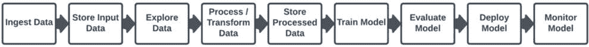

图 3.1：简化 ML 模型生命周期

本章将涵盖以下主题：

+   为什么选择 Google Cloud？

+   使用 Google Cloud 工具的先决条件

+   Google Cloud 服务概述

+   Google Cloud 数据处理工具

+   Google Cloud VertexAI

+   Google Cloud 上的标准行业工具

+   选择合适的工具

让我们从讨论为什么我们最初想要使用 Google Cloud 进行数据科学和 AI/ML 应用场景开始。

# 为什么选择 Google Cloud？

Google 在 AI/ML 领域已经是一个长期知名领导者。他们通过无数的研究论文、出版物以及向开源社区捐赠 AI/ML 库（如 TensorFlow，有史以来最广泛使用的 ML 库之一）等方式，为 AI/ML 行业做出了大量贡献。他们的搜索和广告算法多年来一直引领着各自的行业，他们的同行组织，如 DeepMind，将他们的全部存在都致力于纯 AI/ML 研究。

Google 还一直在引领诸如**道德 AI**等倡议，倡导公平性和可解释性的概念，以确保 AI 负有责任，并且仅用于对人类有益的目的。AI/ML 不是 Google 试图利用的东西，而是 Google 商业的核心原则。

Google Cloud 在这个领域的领导地位的一个显著证明是，Gartner 正式将其认定为 2022 年 Gartner® 魔力四边形™ 云 AI 开发服务领域的领导者。Google Cloud 提供了一系列服务和工具，用于实施 AI/ML 用例，并拥抱开源和第三方解决方案，以便为顾客提供尽可能广泛的选择。通过使用 Google Cloud 进行 AI/ML 工作负载，您可以受益于 Google 在这个领域数十年的 AI/ML 研究和积累的专业知识。

# 使用 Google Cloud 工具和服务的先决条件

这一节将会相当简单，因为 Google Cloud 让尝试其服务变得非常容易。如果您有 Gmail 账户，那么您基本上已经拥有了在 Google Cloud 上开始所需的一切。作为一项慷慨的额外奖励，Google Cloud 向新客户提供 300 美元的信用额度，以及验证其商业电子邮件地址的新客户将获得额外的免费信用额度。您可以使用这些免费信用额度来探索和评估 Google Cloud 的各种服务。此外，Google Cloud 的许多服务提供 **免费层**，允许您免费使用这些服务，直到达到指定的免费使用限制，具体详情您可以在 Google Cloud 文档中找到（[`cloud.google.com/free/docs/free-cloud-features`](https://cloud.google.com/free/docs/free-cloud-features)）。

如果您需要创建新的 Google Cloud 账户，您可以在 [`console.cloud.google.com/freetrial`](https://console.cloud.google.com/freetrial) 注册，当您需要超出免费使用范围时，您可以升级到付费的 Cloud Billing 账户。

在您创建并登录账户后，您就可以开始使用本书中将要使用的 Google Cloud 服务以及更多服务。当您第一次尝试使用 Google Cloud 服务时，您可能需要启用该服务的 API。这是一个简单的单次点击操作，您只需在每个 Google Cloud 项目中执行一次。*图 3.2* 展示了您第一次尝试使用 Google Filestore 服务时显示的页面（我们将在本章后面更详细地介绍 Filestore）。您只需点击 **启用** 按钮即可启用 API。

定义

Google Cloud 项目组织了您所有的 Google Cloud 资源。它包括一组用户；一组 API；以及这些 API 的计费、身份验证和监控设置。所有 Google Cloud 资源，以及访问它们的用户权限，都位于一个项目中。

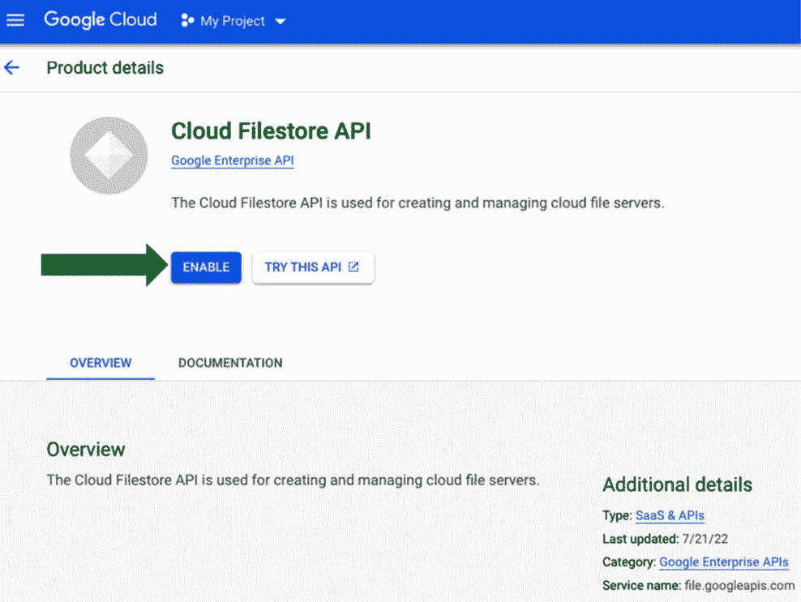

图 3.2：首次使用时启用 Google Cloud API

## 安全、隐私和合规性

当我们创建了我们的谷歌云账户后，首先需要考虑的是安全性。这同样也涉及到隐私和合规性，这些是目前数据分析和人工智能/机器学习行业的热门话题，因为您的客户希望知道他们的数据正在被安全地处理。幸运的是，这些话题是谷歌云的主要优先事项，因此，谷歌云提供了一系列默认控制和专用服务来促进和维持这些优先事项。我们将在本文简要介绍一些重要概念和相关服务，并在本书的后续章节中深入探讨这些话题。

### 谁有权访问什么？

在安全、隐私和合规性的背景下，首先需要讨论的主题是身份和访问管理；也就是说，识别和控制谁有权访问您的谷歌云环境中的哪些资源。谷歌云为此提供了**身份和访问管理**（**IAM**）服务。此服务使您能够定义用户和用户组等身份，以及关于访问谷歌云资源的权限。对于在谷歌云上进行的每一次尝试操作，无论是从存储中读取对象还是作为云函数运行一段代码，谷歌云 IAM 都会评估与此操作相关的权限、操作将作用其上的资源以及调用身份，并且只有当所有相关身份和资源都应用了正确的权限组合时，操作才会被允许。为了提供额外的便利，您可以将谷歌云 IAM 与外部**身份提供者**（**IdPs**）和目录，如 Active Directory 集成。

### 数据安全

谷歌云默认对所有静态数据进行加密。您可以通过使用**客户管理加密密钥**（**CMEKs**）来控制用于加密数据的密钥，或者您可以让谷歌云为您管理所有这些功能。至于传输中的数据，谷歌已经建立了具有严格安全控制的全球网络，并使用 TLS 加密来保护在这些全球网络中传输的数据。谷歌云还通过使用基于硬件的**可信执行环境**（**TEE**）的保密计算，使您能够在数据积极使用时对其进行加密。TEE 是安全且隔离的环境，在数据使用期间防止未经授权的访问或修改应用程序和数据。

### 基础设施安全

除了 Google Cloud 先进的云基础设施安全控制之外，Google Cloud 还提供工具来帮助防止和检测潜在的安全威胁和漏洞。例如，您可以使用 Cloud Firewall 和 Cloud Armor 来防止 **分布式拒绝服务**（**DDoS**）和常见的 OWASP 威胁。您可以使用 Chronicle、Security Command Center 和 Mandiant 进行 **安全事件和事故监控**（**SIEM**）、**安全编排自动化和响应**（**SOAR**）、入侵检测和威胁情报。除了所有这些 Google Cloud 服务之外，您还可以使用 Google Cloud 上的第三方可观察性和报告服务，如 Splunk。

### 合规性

Google Cloud 提供审计数据，跟踪在您的环境中对资源执行的操作，这对于合规性原因非常重要。Google Cloud 参与正式的合规性计划，如 FedRamp、SOC2 和 SOC3，并支持如 **支付卡行业数据安全标准**（**PCI DSS**）和多个 ISO/IEC 国际标准等合规性标准。您可以在 [`cloud.google.com/security/compliance`](https://cloud.google.com/security/compliance) 查看有关 Google Cloud 合规性计划参与的更多详细信息。

### 与 Google Cloud 服务交互

您可以通过多种方式与 Google Cloud 服务进行交互。从高层次来看，您可以使用 **图形用户界面**（**GUI**）、**命令行界面**（**CLI**）或 API。我们将在本节中更详细地探讨这些选项。

### 控制台

与 Google Cloud 服务交互的最直接方式之一是通过 Google Cloud 控制台，它提供了一个 GUI。您可以通过 [`console.cloud.google.com/`](https://console.cloud.google.com/) 访问控制台。

控制台允许您通过在浏览器中的基于网页的界面中点击来执行 Google Cloud 的操作。例如，您可以通过在产品菜单中点击 **Compute Engine** 来创建 **虚拟机**（**VM**），然后转到虚拟机实例页面并点击 **创建实例**来指定 VM 的所需属性，如图 *图 3**.3* 所示。

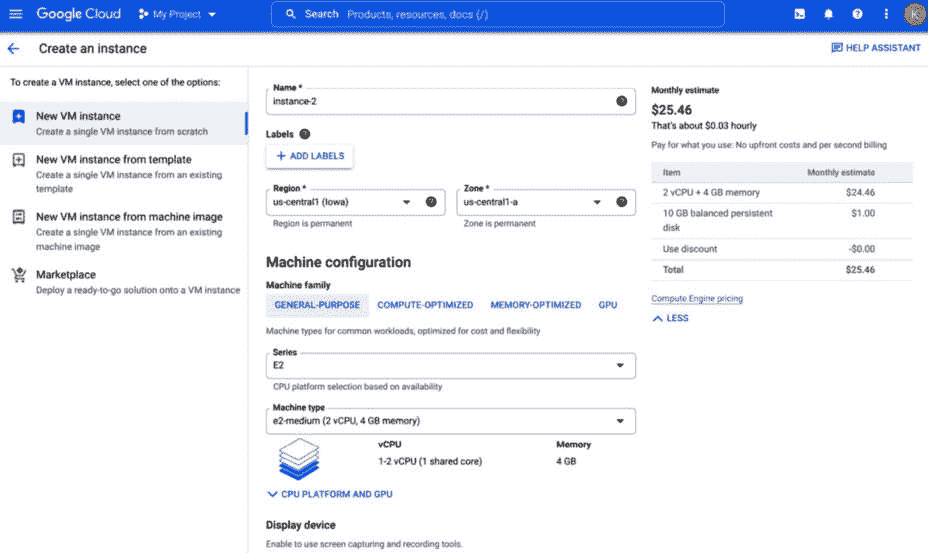

图 3.3：在 Google Cloud 控制台中创建虚拟机

### gcloud CLI

如果你更喜欢使用 CLI，Google Cloud 已经构建了一个名为 **gcloud** 的工具，它允许你通过执行基于文本的命令与 Google Cloud 服务交互。这在你希望通过编写包含多个命令的脚本来自动化一系列 Google Cloud 服务 API 操作时特别有用。例如，你可以创建一个包含多个命令的 Bash 脚本，并且你可以手动执行该脚本，或者如果它包含需要频繁重复执行的操作，你可以按周期性计划执行该脚本。这种方法适用于只需少量努力即可实现的临时自动化。在后面的章节中，我们将探讨在 Google Cloud 上自动化更复杂操作序列的其他方法。

以下是一个 `gcloud` 命令的示例。此命令将启用 `SERVICE_NAME` 的 API，其中 `SERVICE_NAME` 是我们想要交互的 Google Cloud 服务的名称占位符：

```py
gcloud services enable SERVICE_NAME
```

例如，要启用 Filestore API，而不是点击 `gcloud` CLI 命令：

```py
gcloud services enable file.googleapis.com
```

在这种情况下，`file` 是 Google Cloud Filestore 服务的命令行名称（完整服务名称为 `file.googleapis.com`）。

要使用 gcloud CLI，你可以在任何你希望运行它的机器上安装它，因为它支持许多不同的操作系统，如 Linux、macOS 和 Windows，或者你可以使用下一节中描述的 Google Cloud Shell。

#### Google Cloud Shell

Google Cloud Shell 是使用 gcloud CLI 和与 Google Cloud APIs 交互的一种非常方便的方式。这是一个提供基于 Linux 环境的工具，你可以在此环境中向 Google Cloud 服务 API 发送命令。

你可以通过点击 Google Cloud 控制台屏幕右上角的  图标来打开 Cloud Shell，如图 3.4 所示：

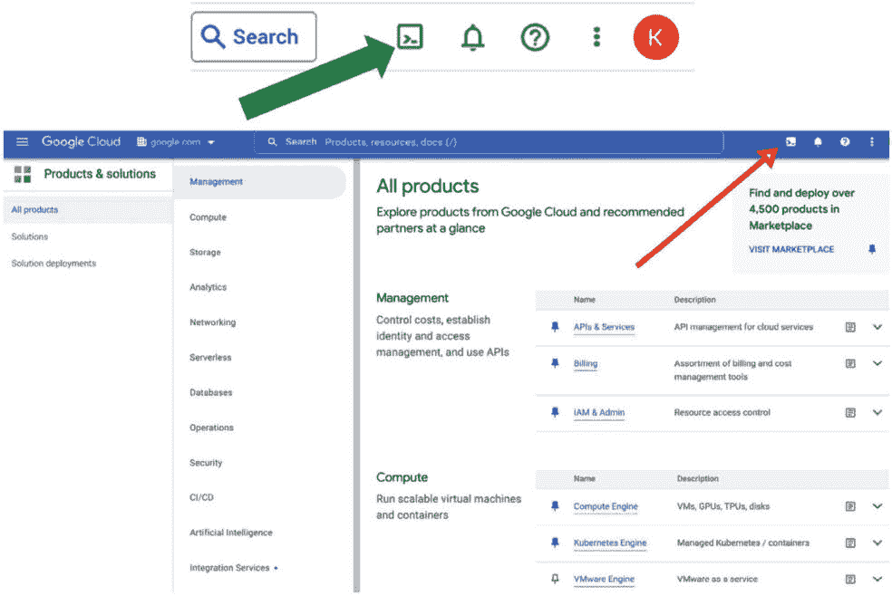

图 3.4：激活 Google Cloud Shell

然后，终端将出现在屏幕底部，如图 3.5 所示：

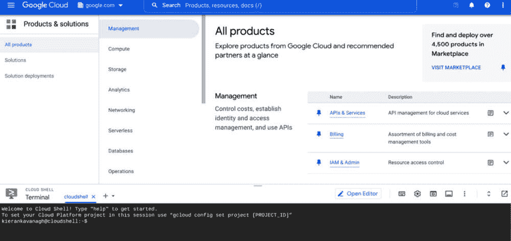

图 3.5：Google Cloud Shell

当你第一次尝试使用 Cloud Shell 时，你需要授权它与 Google Cloud 服务 API 交互，如图 3.6 所示。

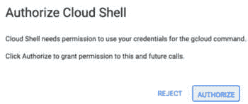

图 3.6：授权 Google Cloud Shell

### API 访问

与 Google Cloud 服务交互的最底层方法是程序化直接调用它们的 API。这种方法与 GUI 和 CLI 访问不同，因为它不是旨在直接与人类交互，而是适合更高级的使用案例，例如通过您的应用程序软件与 Google Cloud 服务交互。作为一个例子，让我们考虑一个将用户照片保存在云中的应用程序。当新用户注册时，我们可能希望创建一个新的 Google Cloud Storage 存储桶来存储他们的照片，以及其他与注册相关的活动（我们将在本章后面描述 Google Cloud Storage 服务）。为了这个目的，我们可以创建以下 REST API 请求：

```py
curl -X POST --data-binary @JSON_FILE_NAME \
     -H "Authorization: Bearer OAUTH2_TOKEN" \
     -H «Content-Type: application/json» \
     https://storage.googleapis.com/storage/v1/b?project=PROJECT_IDENTIFIER
```

让我们分解一下：

+   `JSON_FILE_NAME` 是指定存储桶详细信息的所需 JSON 文件的名称

+   `OAUTH2_TOKEN` 是调用 API 所需的访问令牌

+   `PROJECT_IDENTIFIER` 是与我们的存储桶相关联的项目 ID 或编号，例如，`my-project`

所需的 JSON 文件结构如下：

```py
{
  "name": "BUCKET_NAME",
  "location": "BUCKET_LOCATION",
  "storageClass": "STORAGE_CLASS",
  "iamConfiguration": {
    "uniformBucketLevelAccess": {
      "enabled": true
    },
  }
}
```

这里的分解如下：

+   `BUCKET_NAME` 是我们想要给我们的存储桶的名称。

+   `BUCKET_LOCATION` 是您想要存储您的存储桶对象数据的位置。有关 Google Cloud 位置的更多信息，请参阅以下 Google Cloud 文档：[`cloud.google.com/compute/docs/regions-zones`](https://cloud.google.com/compute/docs/regions-zones)。

+   `STORAGE_CLASS` 是您存储桶的默认存储类别。有关 Google Cloud 存储类别的更多信息，请参阅以下 Google Cloud 文档：[`cloud.google.com/storage/docs/storage-classes`](https://cloud.google.com/storage/docs/storage-classes)。

在实践中，最常见的是使用 Google Cloud 的客户端 **软件开发工具包**（**SDK**s）来程序化地创建这样的 API 调用。例如，在下面的 Python 代码中，我们导入 Google Cloud Storage 客户端库，然后定义一个函数来创建一个新的存储桶，指定存储桶名称、位置和存储类别：

```py
# import the GCS client library
from google.cloud import storage
def create_bucket_class_location(bucket_name):
    """
    Create a new bucket in the US region with the coldline storage
    class
    """
    # bucket_name = "your-new-bucket-name"
    storage_client = storage.Client()
    bucket = storage_client.bucket(bucket_name)
    bucket.storage_class = "COLDLINE"
    new_bucket = storage_client.create_bucket(bucket, location="us")
    return new_bucket
```

现在我们已经介绍了一些如何与 Google Cloud 服务交互的基础知识，让我们讨论一下本书中将使用的 Google Cloud 服务类型。

# Google Cloud 服务概述

在介绍了如何设置 Google Cloud 账户以及如何启用和交互各种服务的基础知识之后，我们现在将介绍本书中将要使用的服务，以创建 AI/ML 工作负载。我们将首先介绍几乎所有工作负载都基于的基本云服务，然后我们将介绍与数据科学和 AI/ML 相关的更高级服务。

## Google Cloud 计算服务

考虑到单词 *computing* 直接包含在术语 **云计算** 中，以及计算服务构成了所有其他云服务的基础，我们将从这个部分开始，简要概述 Google Cloud 的计算服务。

### Google 计算引擎（GCE）

几年前，云计算这个术语几乎与虚拟化这个术语同义。传统上，公司在自己的场所拥有物理服务器，然后与之形成对比的是在云中创建虚拟服务器，无论是公共的还是私有的。因此，在云计算中，最容易理解的概念可能是虚拟化，我们通过在硬件和我们的服务器操作系统之间引入一个称为虚拟机的抽象层，简单地创建一个虚拟服务器而不是物理服务器，如图*3**.7*所示。对于大多数公司来说，如果他们已经在运行物理服务器，那么他们进入云计算世界的第一步通常是通过使用虚拟机来实现的，因为这是从物理范式过渡到云范式最简单的一步。**Google 计算引擎**（**GCE**）是 Google 云在云中运行虚拟机的服务。它提供了一些有用的功能，例如基于需求的自动扩展，这是云计算已确立的众多好处之一。

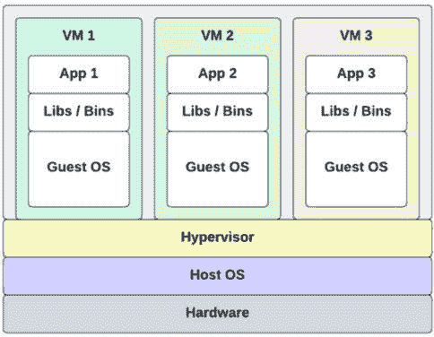

图 3.7：示例虚拟机实现

### Google Kubernetes 引擎（GKE）

在 2000 年代，通过使用 Linux **cgroups** 和 **Namespaces** 来隔离运行操作系统中特定进程的计算资源，如 CPU、RAM 和存储资源，创建了一种新型的虚拟化技术。随着容器化的出现，抽象层在堆栈中的位置上升，存在于操作系统和我们的应用程序之间，如图*3**.8*所示。

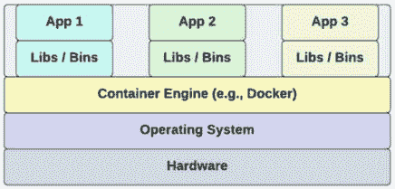

图 3.8：示例容器实现

这为我们带来了比基于虚拟机的虚拟化所提供的更多有趣的好处。例如，容器通常比虚拟机小得多，更**轻量级**，这意味着它们包含的软件组件要少得多。虚拟机必须在启动整个操作系统和大量软件应用程序之后才能变得可用，这可能需要几分钟的时间，而容器通常只包含你的应用程序代码和任何所需的依赖项，因此可以在几秒钟内加载。这在自动扩展和自动修复基于云的软件工作负载时产生了重大差异。与突然增加的流量相关的新虚拟机的启动可能不够快，你可能会在虚拟机启动并加载你的应用程序时丢失一些请求。同样，由于某种问题重新启动虚拟机也是如此。在这两种情况下，容器通常会启动得更快。包含更少的组件也意味着容器可以部署得更快，这使得它们成为具有 DevOps CI/CD 管道的微服务的完美环境。容器还有许多其他好处，例如可移植性和易于管理。

然而，容器化带来的挑战之一也源于它们的轻量级特性。因为它们通常比虚拟机小，所以在单个应用程序部署中拥有更多的容器是很常见的。管理大量的微型容器可能具有挑战性，尤其是在应用程序生命周期管理和编排方面；也就是说，确定如何以及在哪里运行您的负载，并分配足够的计算资源给它们。这正是 Kubernetes 发挥作用的地方。以下是对 Kubernetes 以及特别针对**Google Kubernetes Engine**（**GKE**）的官方定义。

Kubernetes，也称为**K8s**，是一个开源系统，用于自动化容器化应用程序的部署、扩展和管理。它将构成应用程序的容器组合成逻辑单元，以便于管理和发现。GKE 提供了一个使用 Google 基础设施部署、管理和扩展容器化应用程序的托管环境。

*图 3.9*展示了 Kubernetes 如何组织和编排应用程序的示例。它将您的应用程序部署为 Pod，Pod 是由具有相似功能的容器组成的组，并在您的硬件服务器或宿主操作系统上部署代理，以跟踪资源利用率并将该信息反馈给 Kubernetes 主节点，Kubernetes 主节点使用这些信息来管理 Pod 部署。

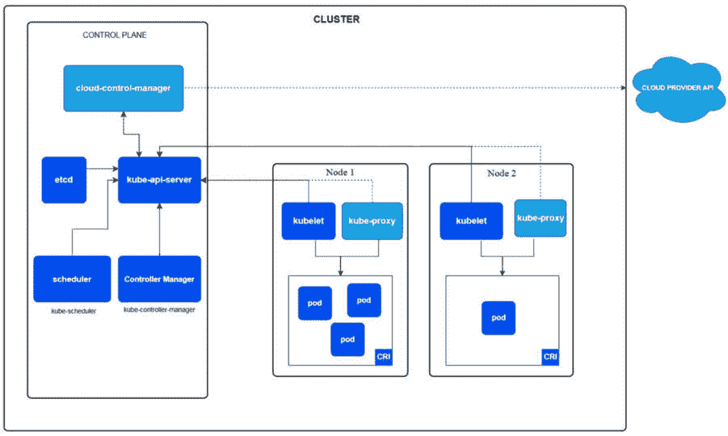

图 3.9：示例 GKE 实现（来源：https://kubernetes.io/docs/concepts/architecture/)

### Google Cloud 无服务器计算

在云计算的上下文中，**无服务器**一词指的是在云提供商的基础设施上运行您的代码，而不需要管理任何用于运行您的代码的服务器。实际上，仍然有服务器在幕后被使用，但云提供商代表您创建和管理这些服务器，这样您就不需要执行这些操作。Google Cloud 有两个与无服务器计算相关的核心服务，分别命名为**云函数**和**云运行**。另一个名为**App Engine**的 Google Cloud 服务也经常被归类在无服务器范畴之下，我们将在本节稍后描述该服务，以及它与云函数和云运行的区别。

注意

许多其他 Google Cloud 服务也以无服务器的方式运行，即它们代表您执行的操作在后台管理的服务器上运行，您无需管理这些服务器。然而，云函数和云运行是两个与**无服务器计算**相关的 Google Cloud 服务，这特别指的是运行您的代码而不需要明确管理服务器。

#### 云函数

使用云函数，您只需编写小段代码——例如，一个单独的函数——谷歌云将根据您指定的触发器运行该代码。您不需要管理任何容器、服务器或您的代码执行的任何基础设施，并且您可以配置许多类型的触发器。例如，每当文件上传到您的谷歌云存储桶时，这可能会触发您的代码片段执行。然后，您的代码可以以某种方式处理该文件，将其输入到另一个谷歌云服务进行处理，或者简单地发送通知告知某人文件已上传。

这个概念被称为**函数即服务**（**FaaS**），因为它通常用于为每个事件触发执行单个函数。这种方法适用于您只想简单地编写和运行响应您环境中发生的事件的小代码片段时。您还可以使用云函数连接到其他谷歌云或第三方云服务，以简化复杂的编排问题。

除了让您免于管理服务器的麻烦之外，使用云函数的另一个优点是，当您的环境中没有事件发生时，您不需要为服务器付费。

#### Cloud Run

Cloud Run 是一种更适合长时间运行的应用程序进程的无服务器计算服务。虽然云函数旨在响应特定事件运行小段代码，但 Cloud Run 可以运行更复杂的应用程序。这也意味着它提供了更多关于代码执行方面的灵活性和控制。例如，它将在容器中运行您的代码，并且您对这些容器中执行的内容有更多的控制。如果您的应用程序需要自定义软件包依赖项，例如，您可以将这些依赖项配置为在容器中可用。

Cloud Run 通过自动从零几乎瞬间扩展和缩减，根据流量进行管理，并且只对您使用的确切资源收费，从而抽象化了所有基础设施管理。

### App Engine

虽然 App Engine 也可以被视为一种无服务器服务，因为它为您管理底层基础设施，但其用例与 Cloud Functions 和 Cloud Run 不同。App Engine 有两个服务级别，称为 **标准** 和 **灵活**。在标准环境中，您的应用程序在一个沙盒内的轻量级服务器上运行。这个沙盒限制了您的应用程序可以执行的操作。例如，沙盒只允许您的应用程序使用有限的一组软件二进制库，并且您的应用程序不能写入永久磁盘。标准环境还限制了应用程序可用的 CPU 和内存选项。由于这些限制，大多数 App Engine 标准应用程序通常是无状态的 Web 应用程序，能够快速响应 HTTP 请求。相比之下，灵活环境在 Google Compute Engine 虚拟机上运行您的应用程序，这些虚拟机具有较少的限制。

此外，请注意，标准环境可以从零实例快速扩展到数千个实例，但灵活环境必须至少运行一个实例，并且可能需要更长的时间来响应突增的流量。

App Engine 通常适用于大型网络应用程序。其灵活的环境可以比 Cloud Run 更具可定制性。然而，如果您想部署一个无需管理底层基础设施的长期运行的网络应用程序，我建议首先评估 Cloud Run 是否能满足您的应用程序需求，并比较在 Cloud Run 上运行应用程序与在 App Engine 上运行的成本。

### Google Cloud 批处理

一些工作流程旨在长时间运行，无需人工交互。这类工作负载的例子包括媒体转码、计算流体动力学、蒙特卡洛模拟、基因组处理和药物发现等。这类工作负载通常需要大量的计算能力，可以通过并行运行任务来优化。自行创建和运行这些作业可能会产生一些开销，例如管理服务器、排队机制、并行化和故障逻辑。幸运的是，Google Cloud 批处理服务已经构建好以管理您所需的所有这些活动。作为一个完全管理的作业调度器，它自动调整运行批处理作业所需的基础设施规模，并处理您在执行过程中配置的并行化和重试逻辑，以防出现任何错误。

现在我们已经介绍了 Google Cloud 上的主要计算服务，让我们回顾一下您可以使用它们在 Google Cloud 之间进行集成的服务。

## Google Cloud 集成服务

除了计算和存储等 Google Cloud 基础设施服务之外，我们通常还需要实现服务之间的集成，以便创建复杂的工作负载。Google Cloud 为此目的创建了专门的工具，我们将在本节中简要讨论一些相关的工具。

### Pub/Sub

Google Cloud Pub/Sub 是一种消息服务，可用于在系统架构的组件之间传递数据，无论这些组件是其他 Google Cloud 服务、第三方服务还是您自己构建的组件。这是一个极其灵活的服务，可用于广泛的系统集成用例，例如解耦微服务或将数据流式传输到数据湖。

Pub/Sub 与发布和订阅的系统架构概念相关，其中一个系统可以向共享空间或**主题**发布一条消息或数据，然后其他系统可以通过订阅该主题来接收该数据。消息可以通过**推送**或**拉取**机制进行传递。在推送方法的情况下，Pub/Sub 服务与订阅者系统建立通信，并将消息发送到这些系统。在拉取模型的情况下，订阅者系统与 Pub/Sub 服务建立通信，然后从 Pub/Sub 服务请求或拉取信息。

Pub/Sub 还满足了一些细微的消息需求，例如按顺序发布消息（如果需要）和重试失败的消息传输。Google Cloud 还提供了一种名为 Pub/Sub Lite 的产品，它是一种比常规 Pub/Sub 产品功能更少、成本更低的选项。

### Google Cloud Tasks

与 Pub/Sub 类似，Google Cloud Tasks 是一种可用于实现消息传递和异步系统集成的服务。在 Pub/Sub 中，发布者和订阅者是完全解耦的，它们对彼此的实现没有控制权。另一方面，在 Cloud Tasks 中，发布者（或**任务生产者**）完全控制工作负载的整体执行。它可以专门用于任务生产者需要控制特定 webhook 或远程过程调用执行时间的情况。Cloud Tasks 包含在本节中是为了完整性，因为它是 Pub/Sub 在某些用例中的替代方案，但我们在本书中不会使用 Cloud Tasks。

### Eventarc

Eventarc 是一种 Google Cloud 服务，使您能够构建**事件驱动**的工作负载。这是希望其工作负载在环境中的事件发生时执行的公司常用的模式。当我们介绍 Cloud Functions 时，我们简要地提到了这个话题。Cloud Functions 可以由某些事件源直接触发，但 Eventarc 提供了更多的灵活性和控制，以实现复杂的事件驱动架构，与 Cloud Functions 和其他 Google Cloud 服务以及一些第三方应用程序一起使用。

Eventarc 使用 Pub/Sub 将来自 **事件提供者** 的消息路由到 **事件目的地**。正如其名称所暗示的，事件提供者将事件发送到 Eventarc，Eventarc 将事件发送到事件目的地。它提供了一种标准化您的事件处理架构的方法，而不是在您的各种系统组件之间构建随机、临时的基于事件的实现。

### 工作流程

虽然 Eventarc 提供了一种标准化事件驱动工作负载的机制，但 Google Cloud Workflows，正如其名称所暗示的，是一种专门构建来编排复杂工作流程的服务，在这些工作流程中，需要按照特定顺序实现不同系统之间活动的协调。考虑到这一点，当一起使用时，Google Cloud Workflows 和 Eventarc 是实现复杂、事件驱动工作负载的绝佳组合。工作流程可以由事件触发，或者您可以创建可以以不同方式触发的批量工作流程。

工作流程可以在各种微服务和自定义或第三方 API 之间协调活动。工作流程服务在执行过程中维护您工作负载中每个步骤的状态，这意味着它跟踪每个步骤的输入和输出，并且知道哪些步骤已经完成，哪些步骤正在执行，以及哪些步骤需要在工作流程中调用。它允许您可视化工作流程的所有步骤及其依赖关系，如果在过程中任何步骤失败，您可以使用工作流程服务来确定是哪个步骤，并确定下一步要做什么。*图 3.10* 展示了在线零售系统的工作流程示例，其中客户购买了一件商品。工作流程中的每个软件服务都使用各种 Google Cloud 计算产品运行，每个步骤的协调都由工作流程服务管理。虽然这是一个简单的订单处理工作流程示例，但请注意，大多数大型零售公司都与由极其复杂的互联系统和合作伙伴组成的供应链合作。

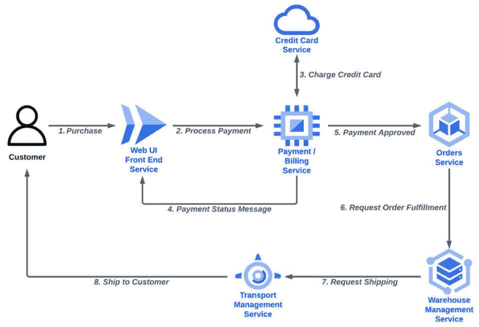

图 3.10：在线零售系统的工作流程示例

工作流程服务最适合在服务之间编排活动。如果您想实现数据工程的工作流程编排，那么 Google Cloud Composer 可能更合适。我们将在本章后面讨论 Google Cloud Composer。

### 调度器

Google Cloud Scheduler 是一种相对简单但非常有用的服务，可以用于根据计划执行工作负载。例如，如果您希望一个进程每天、每小时或每月在同一时间运行，您可以使用 Cloud Scheduler 定义并启动这些执行。任何熟悉基于 Unix 的操作系统的您可能会看到与 cron 服务的相似之处。

Google Cloud Scheduler 可以与我们在本节中描述的许多集成服务一起使用。例如，你可以安排每 15 分钟向 Pub/Sub 主题发送一条消息，然后可以将其发送到 Eventarc 并用于调用云函数。

## 网络和连接

几乎没有工作负载不需要设置某种形式的网络连接。例如，即使你只有一个服务器，你也通常需要以某种方式连接到它，才能对其执行任何操作。当你扩展到单个服务器之外时，那些服务器通常需要相互通信。在本节中，我们将讨论构建本书后续章节中工作负载的基础网络和连接概念。

### 虚拟专用云（VPC）

本节中我们首先介绍的概念是**虚拟专用云**（**VPC**）概念。VPC 是一个可以跨越所有谷歌云区域的虚拟网络。之所以称为虚拟专用云，是因为它定义了你的网络基础设施的边界，因此你在谷歌云中运行工作负载的位置。然而，你可以与其他 VPC 进行对等或共享连接，以便跨 VPC 边界进行通信。

### 混合网络

如果你为一家拥有自己的本地服务器和网络的公同工作，并且你想将它们连接到云端，这被称为**混合连接性**。这对于许多公司来说是一个常见需求，因此，谷歌云已经创建了特定的解决方案来促进这种连接，这些解决方案包括以下服务。

#### 专用互连

专用互连为你的本地网络和谷歌的网络之间提供直接的物理连接。它提供 99.99%的保证正常运行时间，并且可以连接一个或两个链路，每个链路都可以支持高达 100 **千兆比特每秒**（**Gbps**）的带宽。它需要在特定的专用互连位置设置硬件连接，因此可能需要相当大的努力来设置。此选项适用于需要在其场所和谷歌云之间进行长期连接的高带宽网络的公司。

#### 合作伙伴互连

如果你没有在专用互连位置之一建立自己的基础设施，那么有一些谷歌云合作伙伴提供高达 99.99%可用性的连接服务，即合作伙伴互连。此选项也需要与合作伙伴合作以设置它，但它不需要与专用互连相同的投资。一种权衡是，合作伙伴通常将连接共享给许多客户，因此带宽低于专用互连。

#### 本地部署的私有谷歌访问（PGA）

这是一个基本的连接选项，它从你的本地位置直接提供对谷歌服务（如云存储和 BigQuery）的访问。

#### 虚拟专用网络（VPN）

将您的本地资源连接到 Google Cloud VPC 可能最简单的方式是通过**虚拟专用网络**（**VPN**），它使用**IP 安全**（**IPsec**）机制提供了一种低成本选项，通过加密的公共互联网连接提供 1.5 – 3.0 Gbps 的吞吐量。与之前提到的 Interconnect 服务不同，此选项不需要在任何特定位置进行任何特殊、与硬件相关的网络连接。

现在我们已经介绍了支撑我们在本书中构建的工作负载的基本 Google Cloud 服务，现在是时候深入探讨我们将直接用于创建我们的数据处理工作负载以准备我们的 AI/ML 用例的服务了。

# Google Cloud 数据存储和处理工具

由于收集数据是 AI/ML 项目中的第一个主要步骤（在确定项目的业务目标之后），我们首先通过回顾存储和处理数据的工具来探索 Google Cloud 的 AI/ML 相关服务。*图 3.2*显示了与摄取、存储和处理数据相关的生命周期步骤。需要注意的是，**训练模型**、**评估模型**和**监控模型**步骤通常也会创建需要存储的输出。

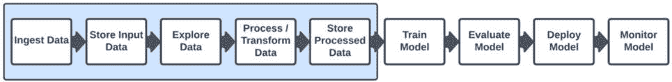

图 3.11：数据摄取、存储、探索和处理

如*图 3.11*所示，并且正如我们之前讨论的，与数据打交道是任何 AI/ML 项目的一个非常突出的部分。

## 数据摄取

在我们能够在 Google Cloud 中对数据进行任何操作之前，我们需要获取数据，并且我们通常希望将数据摄取到 Google Cloud 上的某种存储服务中。在本节中，我们将讨论 Google Cloud 上用于摄取数据的某些工具，在下一节中，我们将介绍摄取服务所摄取数据的 Google Cloud 存储系统。在本章中，我们不会关注 Google Cloud 的数据库服务，也不会涉及相关的**数据库迁移服务**（**DMS**），因为在机器学习的目的下，我们通常会从数据库中提取数据并将其放置在本节描述的某个存储系统中。对此的一个例外可能是 Google Cloud Bigtable，但我们将单独在稍后的章节中讨论该服务。

### gsutil

将数据传输到**Google Cloud Storage**（**GCS**）或 GCS 存储桶之间可能最简单的方式是通过 gsutil 命令行工具，它可以用来通过简单的命令传输高达 1 TB 的数据。

### 数据传输服务

如果您要传输超过 1 TB 的数据，可以使用数据传输服务，该服务可以从本地系统或其他公共云提供商快速且安全地传输数据。对于可能需要运行多个数据传输作业的大型数据迁移项目，它允许您集中管理作业以监控每个作业的状态。您可以通过高达数十 Gbps 的带宽传输包含数十亿文件的 PB 级数据，数据传输服务将优化您的网络带宽以加速传输。您可以将数据导入 GCS，然后让其他 Google Cloud 服务从那里访问它。

### BigQuery 数据传输服务

BigQuery 数据传输服务自动化了数据在 BigQuery 中的特定移动，以计划和管理为基础。您可以通过 Google Cloud 控制台、**bq** 命令行工具或 BigQuery 数据传输服务 API 访问 BigQuery 数据传输服务。它支持许多数据源，例如 GCS、Google Ads、YouTube、Amazon S3、Amazon Redshift、Teradata 以及更多。

## 数据存储

在 Google Cloud 中存储数据有许多不同的方式，您选择的数据存储工具和服务类型将取决于您的用例和您试图实现的目标。在本节中，我们将探讨 Google Cloud 在数据存储领域提供的不同产品和服务的类型，以及它们最适合的工作负载。

### 概念 - 数据仓库、数据湖和湖屋

在深入了解每个主要的 Google Cloud 数据存储服务之前，讨论数据仓库、数据湖和湖屋的概念非常重要，这些术语在近年来在业界变得相当流行。

**数据仓库**通常包含针对分析目的优化的结构化数据格式，例如 **Parquet** 或 **优化行列存储**（**ORC**）。这是因为数据分析查询通常在数据库列上而不是行上操作。例如，我们可能运行一个查询来找出购买我们产品的客户的平均年龄，因此这个查询将专注于我们客户数据库表中的 **年龄** 列。列式数据格式将每个列的所有元素在物理存储磁盘上彼此靠近存储，因此操作数据库列的查询运行得更高效。

如其名所示，**数据湖**是一个可以以各种格式存储大量数据的存储库，包括结构化和非结构化数据。由于没有关于查询优化的具体要求，数据湖通常可以存储比数据仓库多得多的数据。数据湖是打破我们在 *第二章* 中描述的问题数据孤岛的关键组成部分，并且可以作为您数据管理策略的基础。

术语**数据湖屋**指的是最近出现的模式，其中公司利用数据仓库和数据湖的组合，以获得两者的最佳效果，并支持更广泛的用例，如实时分析、批量数据处理、机器学习和可视化，所有这些都可以从同一来源进行。

### Google Cloud Storage (GCS)

除了 Google Compute Engine 之外，**Google Cloud Storage**（**GCS**）是 Google Cloud 中最基础的服务之一。它支持所谓的**对象**存储，可能是 Google Cloud 中所有存储服务中最灵活的，因为您几乎可以在 GCS 中存储任何类型的数据，并且可以直接从处理数据的几乎所有 Google Cloud 服务中访问它。它特别适合大量数据，并且可以用作构建企业数据湖的基础。

GCS 提供不同的存储类别，根据成本和访问频率优化您的使用。对于您不经常访问的对象，您可以将其放入成本更低的存储类别，甚至可以配置 GCS 根据每个对象的年龄等标准自动在存储类别之间移动您的对象。有关每个不同存储类别的更多信息以及哪个最适合不同的用例，请参考[`cloud.google.com/storage/docs/storage-classes`](https://cloud.google.com/storage/docs/storage-classes)中的表格。

### Filestore

Google Cloud Filestore 服务是一种高性能、完全管理的文件存储服务，用于需要结构化文件系统的作业。这是**网络附加存储**的概念，其中您的虚拟机和容器可以*挂载*共享文件系统，并可以访问和操作共享目录结构中的文件。它使用**网络文件系统版本 3**（**NFSv3**）协议，并支持任何 NFSv3 兼容客户端。

Filestore 提供三种不同的格式：

+   Filestore Basic，最适合文件共享、软件开发和网站托管

+   Filestore Enterprise，最适合关键应用，如 SAP 工作负载

+   Filestore High Scale，最适合高性能计算，包括基因组测序、金融服务交易分析和其他高性能工作负载

对共享文件系统的访问取决于您配置的权限以及您使用本章“网络和连接”部分中讨论的产品设置的联网连接性。

### 持久磁盘

到目前为止，我们已经介绍了对象存储和文件存储。另一种存储类型被称为块存储。这种存储类型可能最为熟悉，因为它是由直接连接到计算机的磁盘使用的传统存储类型；也就是说，**直接附加存储**（**DAS**）。例如，您的笔记本电脑中的硬盘驱动器使用这种类型的存储。在公司自己的本地数据中心中，许多服务器可能连接到称为**存储区域网络**（**SAN**）的共享块存储设备，使用我们在*第一章*中简要讨论的共享 RAID 数组配置类型。在任一情况下，这些块存储设备都似乎在我们的服务器操作系统中被视为直接附加的磁盘，并且它们被我们的服务器或容器中的应用程序用作此类磁盘。

SANs 可能需要大量的设置和维护工作，但使用 Google Cloud Persistent Disk 时，您只需简单地定义您想要的磁盘存储类型和所需容量，所有底层基础设施都由 Google 为您管理。

在高层次上，Persistent Disk 提供两种不同的存储类型，即**硬盘驱动器**（**HDDs**）和**固态驱动器**（**SSDs**）。当大量吞吐量是首要考虑时，HDDs 提供低成本存储。SSDs 提供高性能和速度，适用于随机访问工作负载和大量吞吐量。这两种类型都可以扩展到 64 TB。

### BigQuery

Google Cloud BigQuery 是一个无服务器数据仓库，这意味着您可以在不配置或管理任何服务器的情况下使用它。作为一个数据仓库，它跨越存储和处理。它可以以优化数据分析工作负载的格式存储您的数据，并提供允许您在该数据上运行 SQL 查询的工具。您还可以使用它来对其他存储系统（如 GCS、Cloud SQL、Cloud Spanner、Cloud Bigtable）以及 AWS 或 Azure 上的存储系统运行查询。此外，它还提供了内置的机器学习功能，允许您通过 SQL 查询从数据中获得机器学习推断，而无需使用其他服务。另一方面，如果您明确想要使用其他服务，例如我们将在本章后面描述的 Vertex AI，它可以轻松地与其他许多 Google Cloud 服务集成。

它支持地理空间分析，因此您可以通过添加位置数据来增强您的分析工作流程，并且当您将流式处理解决方案（如 Dataflow）与 BigQuery BI Engine 集成时，它还支持对流数据的实时分析。BI Engine 还与 Looker Studio 原生集成，并支持许多商业智能工具。BigQuery 是 Google Cloud 上极受欢迎的服务，您将在本书中学习如何使用其许多功能。

在您将数据存储在谷歌云之后，您通常会希望对其进行组织和管理工作，以便它可以轻松被发现并有效利用。在下一节中，我们将讨论谷歌云的数据管理工具。

## 数据管理

我们在本节中描述的服务使您能够组织您的数据，并使您的数据更容易被组织内的用户发现和访问，从而打破或预防数据孤岛。这些工具作为我们之前章节中讨论的数据存储服务和支持层之间的一个支持层，以及我们将在本章后续部分讨论的数据处理服务。

### BigLake

BigLake 是一种存储引擎，通过允许 BigQuery 和如 Spark 等开源框架以细粒度访问控制访问数据，统一了数据仓库和数据湖。例如，您可以将数据存储在 GCS 中，并将其作为 BigLake 表提供，然后您可以从 BigQuery 或 Spark 访问这些数据。细粒度访问控制意味着您可以在表、行和列级别控制对数据的访问。例如，您可以确保您的数据科学家可以看到除信用卡信息列之外的所有列，或者您可以确保特定地理位置的销售部门只能看到与该地理位置相关的行，而无法看到与任何其他地理位置相关的数据。

BigLake 允许您在数据存储的任何位置和方式上执行分析，无论使用的是您偏好的分析工具——开源或云原生——都可以在单一份数据副本上操作。这一点很重要，因为它意味着您不需要在您的数据湖和数据仓库之间移动数据，这通常既费时又昂贵。BigLake 还支持如 Apache Spark、Presto 和 Trino 等开源引擎，以及 Parquet、Avro、ORC、CSV 和 JSON 等开放格式，通过 Apache Arrow 为多个计算引擎提供服务。您可以在一个地方集中管理数据安全策略，并确保它们在多个查询引擎以及使用 BigQuery Omni 时在多个云中一致执行。它还可以与我们将要描述的谷歌云 Dataplex 集成，以增强这一功能并提供大规模的统一数据治理和管理。

### Dataplex

Google 将 Dataplex 称为“*一种智能数据布料，它使组织能够集中发现、管理、监控和治理其跨数据湖、数据仓库和数据集市的数据，并具有一致的控制*。”这关系到打破数据孤岛的概念。在 *第二章* 中，我们讨论了数据孤岛是公司在执行数据科学任务时遇到的常见挑战，以及当你拥有多个由公司内不同组织拥有的数据集时，管理谁可以安全访问数据的复杂性。Dataplex 通过启用数据发现，提供一个跨数据孤岛的数据管理单一视角，以及集中式安全和治理来帮助克服这些挑战。这意味着你可以在 Dataplex 中定义安全和治理策略，并以一致的方式应用于由其他系统存储和访问的数据。它集成了其他 Google Cloud 数据管理服务，如 BigQuery、Cloud Storage 和 Vertex AI。

使用 Dataplex 的理念是创建一个 *数据网格*，在这个网格中，你的各种数据存储和数据处理系统之间存在逻辑连接，而不是孤立的数据孤岛。它还利用 Google 的 AI/ML 能力提供额外的功能，例如自动数据生命周期管理、数据质量执行和血缘跟踪（你可能还记得，在 *第二章* 中，我们也讨论了血缘跟踪是公司在实施数据科学工作负载时面临的困难且常见的挑战）。

Google Cloud 最初有一个名为 Data Catalog 的独立服务，可以用来存储关于你各种数据集的元数据，因此通过允许你查看和搜索元数据来提供可发现性，以了解哪些数据集可用。这项服务现在包含在 Dataplex 中，甚至可以自动化数据发现、分类和元数据丰富。然后，它可以使用 Dataplex 湖和数据区域的概念，将存在于多个存储服务中的数据进行逻辑组织，进入业务特定的领域。

Dataplex 还通过其 *无服务器数据探索工作台* 提供一些数据处理功能，该工作台提供一键访问 Spark SQL 脚本和 Jupyter 笔记本，允许你交互式地查询你的数据集。工作台还允许团队发布、共享和搜索数据集，从而实现跨团队的发现性和协作。

谈到数据处理，我们下一节将介绍一些在 Google Cloud 上处理数据的初级工具和服务。

## 数据处理

当你使用我们在上一节中讨论的一些服务来存储、组织和管理工作负载时，你可能还希望以某种方式处理这些数据。幸运的是，Google Cloud 中有许多工具和服务可以用于此目的，我们将在下面探讨它们。

### Dataproc

Dataproc 是一个完全托管且高度可扩展的服务，用于运行 Apache Hadoop、Apache Spark、Apache Flink、Presto 以及 30 多个开源工具和框架。因此，它在 Google Cloud 上非常受欢迎，尤其是在偏好开源工具的数据处理工作负载中；你可以自己管理处理你数据的服务器，或者 Dataproc 也提供无服务器选项，在这种情况下，Google 将为你管理所有服务器。人们有时会想自己管理服务器，如果他们想使用自定义配置或自定义工具的话。Dataproc 还集成了其他 Google 工具，如 BigQuery 和 Vertex AI，以满足灵活的数据管理需求和数据科学项目，并且你可以使用 Dataproc、BigLake 和 Dataplex 强制执行细粒度的行和列级访问控制。你也可以使用现有的 Kerberos 和 Apache Ranger 策略来管理和强制执行用户授权和身份验证，并且它提供了内置的 Dataproc Metastore，从而消除了运行自己的 Hive Metastore 或目录服务的需要。

管理你自己的本地 Hadoop 或 Spark 集群可能需要大量工作。Dataproc 的一个优点是你可以轻松地按需启动集群以运行数据处理工作负载，然后在你不再使用它们时自动关闭它们，并且集群可以自动扩展和缩减以满足你的需求，这有助于节省成本。你也可以使用 Google Compute Engine Spot 实例进一步节省可以容忍中断的工作负载的成本。你可以在虚拟机或容器中运行你的工作负载，并且它还支持 GPU，如果你需要在数据处理工作负载中使用它们的话。

### Dataprep

Trifacta 的 Dataprep 是一个用于可视化探索、清理和准备结构化和非结构化数据以供分析、报告和机器学习的工具。它是无服务器的，因此无需部署或管理任何基础设施。它是数据科学项目数据探索阶段的一个非常有用的工具，使您能够通过可视化的数据分布来探索和理解数据，并自动检测模式、数据类型、可能的连接以及缺失值、异常值和重复值等异常。然后，您可以定义一系列转换来清理和准备您的数据，以便训练机器学习模型。您可以通过可视化操作完成所有这些操作，无需编写任何代码，并且它甚至建议您可能希望实施的各种转换类型，例如聚合、转置、非转置、连接、并集、提取、计算、比较、条件、合并、正则表达式等等。您还可以应用数据质量规则以确保您的数据满足质量要求，并允许团队通过共享或按需复制数据集来协作。

### 数据流

为了讨论 Google Cloud Dataflow，我们首先花一分钟介绍 Apache Beam。在本书的前几节和章节中，我们提到了*批处理*数据，其中大量数据通过长时间运行的工作进行处理，以及*流处理*数据，其中小数据块被非常快速地处理，通常是在实时或接近实时。通常，每种处理类型都有不同的工具。例如，您可能使用 Hadoop 进行批处理，而您可能使用 Apache Flink 进行流处理。Apache Beam 提供了一个统一的模型，可以用于批处理和流式工作负载。用 Apache Beam 项目管理委员会的话说，这允许您“*一次编写，到处运行*。”这非常有用，因为它使您的数据工程师能够通过使用这个统一的模型来简化他们编码数据处理工作负载的方式，而不是为他们的批处理和流式用例使用完全不同的工具和代码。

Google Cloud Dataflow 是一个完全托管、无服务器的服务，用于执行 Apache Beam 管道。一旦您将数据处理步骤定义为 Apache Beam 管道，然后您可以使用您首选的数据处理引擎，例如 Spark、Flink 或 Google Cloud Dataflow 来执行管道步骤。作为一个完全托管的服务，Dataflow 可以自动配置和扩展运行数据处理步骤所需的资源，并且它与 BigQuery 等工具和服务集成，使您能够使用 SQL 访问您的数据，以及 Vertex AI 笔记本用于机器学习模型训练用例。

### Looker

Looker 是谷歌云的企业智能平台，具有嵌入式分析功能。其主要优势之一是 LookML，这是一种基于 SQL 的强大建模语言。您可以使用 LookML 作为版本控制的数据模型集中定义和管理业务规则和定义，然后 LookML 可以代表您创建高效的 SQL 查询。作为一个企业智能工具，Looker 提供了一个用户界面，您可以在其中以图表、图表和仪表板的形式可视化您的数据。

它提供几种不同的服务级别，提供不同层次的企业智能功能。谷歌最初有一个名为数据工作室的企业智能工具，而 Looker 是由另一家公司创建的，但谷歌收购了那家公司，并将 Looker 整合到其云服务组合中。他们还将原始的数据工作室产品整合到 Looker 中，创建了 Looker Studio，并增加了一个企业版工具，名为 Looker Studio Pro，它提供了额外的功能以及客户支持。

### 数据融合

为了讨论数据融合，让我们首先谈谈**ETL**和**ELT**的概念，分别代表**提取、转换、加载**和**提取、加载、转换**。ETL 概念自 20 世纪 70 年代以来一直存在，它是数据科学和数据工程中在需要对数据进行转换时使用的一种常见模式。在这种情况下使用的模式是从数据源存储位置提取数据，以某种方式对其进行转换，然后将其加载到所需的存储位置。转换的例子可能包括将数据格式从 CSV 转换为 JSON，或者删除包含缺失信息的所有行。复杂的数据工程项目可能需要创建定义多个转换步骤的 ETL 管道。另一方面，ELT 近年来在云基础数据处理工作负载中获得了流行，特别是在与云基础数据处理工作负载相关的情况下。ELT 的想法是，您可以从源位置提取数据并将其加载到数据湖或数据仓库中，然后根据项目需求执行不同的转换。这通常也被称为*数据集成*。使用这种方法可以使分析师能够使用 SQL 从数据中获得洞察和价值，而无需数据工程师创建复杂的 ETL 管道。

考虑到这一点，数据融合是谷歌云的无服务器产品，允许您运行 ETL/ELT 工作负载，而无需管理任何服务器或基础设施。它提供了一个可视化界面，使您能够在不编写代码的情况下定义数据转换步骤，这使得非技术分析师处理数据变得容易，并且它甚至跟踪我们讨论过的非常重要的数据血缘，即*第二章*，随着您的数据通过每个转换步骤。

数据融合与 Google Cloud 的其他服务集成，例如 BigQuery、Dataflow、Dataproc、Datastore、Cloud Storage 和 Pub/Sub，这使得在这些服务之间执行数据处理工作流程变得容易。

### Google Cloud Composer

Composer 是基于开源 Apache Airflow 项目构建的 Google Cloud 编排服务，它特别适用于数据集成或数据处理工作负载。与数据融合类似，它集成了其他 Google Cloud 服务，如 BigQuery、Dataflow、Dataproc、Datastore、Cloud Storage 和 Pub/Sub，这使得在这些服务之间编排数据处理工作流程变得容易。

它具有高度的可扩展性，并且可以用于在多个云提供商和本地位置实施工作负载。它通过使用**有向无环图**（**DAGs**）来编排工作流程，这些图表示工作流程需要执行的任务，以及它们之间所有的关系和依赖。

与 Google Cloud Workflows 类似，Composer 监控工作负载中任务的执行情况，并跟踪每个步骤是否正确完成或是否发生了任何问题。*图 3.12*展示了 Google Cloud Composer 编排的一个工作流程示例，其中客户订单数据定期从 Cloud Bigtable 导入到 Cloud Dataproc，并使用第三方提供商提供的关于更广泛零售趋势的数据进行丰富，这些数据通过 Google Cloud Storage 提供。然后，输出存储在 BigQuery 中以供分析。这些数据可以用来在 Looker 中构建业务智能仪表板，或者例如在 Vertex AI 中训练机器学习模型。

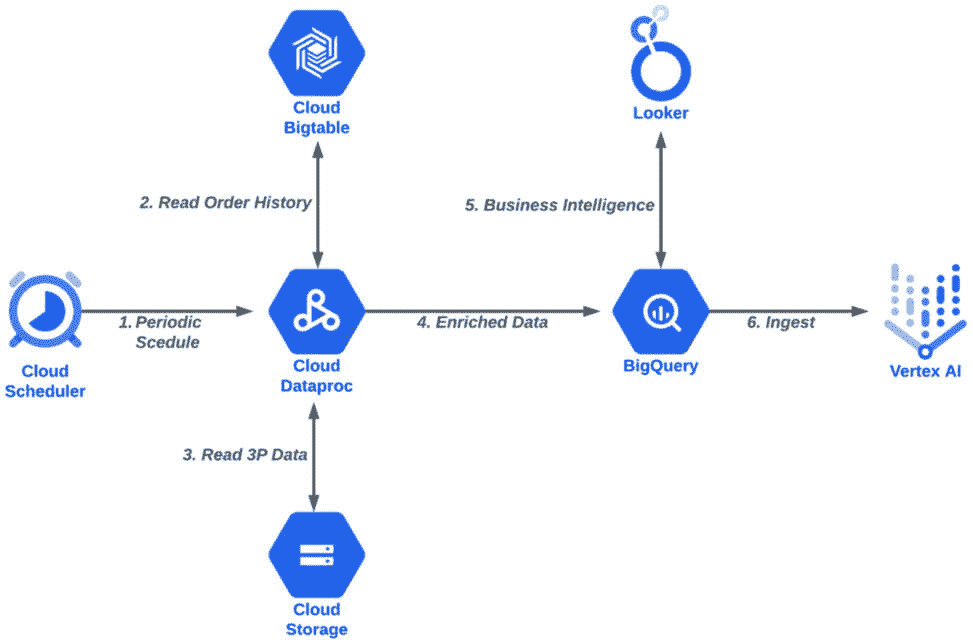

图 3.12：数据处理工作流程

如*图 3.12*所示，当我们处理和存储我们的数据后，我们可能想使用它来训练一个机器学习模型。在我们开始训练自己的模型之前，让我们探索一些我们可以在 Google Cloud 上使用的 AI/ML 能力，这些能力提供了由 Google 训练的模型。

# Google Cloud AI 工具和 AutoML

在本节中，我们将介绍 Google Cloud 的 AI 工具，这些工具可以用于实现 AI 用例，而无需了解底层机器学习概念。使用这些服务，您只需向 API 发送请求，就可以从由 Google 创建和维护的 ML 模型中获得响应。无需手动预处理数据，训练或超调机器学习模型，或管理任何基础设施。

我们将这些服务分为以下几类：**自然语言处理**（**NLP**）、**计算机视觉**和**发现**。

注意

在撰写本文时，即 2023 年 1 月，Google 还宣布了一个名为 **Timeseries Insights API** 的服务的预览版，该服务可以用于实时分析您的时序数据集并获取洞察，适用于时序预测或检测数据在发生时的异常和趋势。这是一个有趣的新服务，因为对数十亿个时序数据点进行预测和异常检测工作负载是计算密集型的，而大多数现有系统将这些工作负载作为批量作业实现，这限制了您在线可以执行的分析类型，例如根据数据值的突然增加或减少来决定是否发出警报。

## NLP

在人工智能的背景下，自然语言处理（NLP）是指使用计算机来理解和处理自然的人类语言。它可以进一步细分为 **自然语言理解**（**NLU**）和 **自然语言生成**（**NLG**）。NLU 关注于理解人类如何理解单词和句子的内容和意义。NLG 则更进一步，试图以人类可以理解的方式创建或生成单词和句子。在本节中，我们将讨论一些 Google Cloud 的与 NLP 相关的服务。

## 自然语言 API

您可以使用 Google Cloud Natural Language API 来理解文本输入的内容。这可以用于情感分析、实体分析、内容分类和语法分析等目的。通过情感分析，它可以告诉您内容中暗示了哪些类型的情感。例如，您可以将所有产品评论输入到这个 API 中，并了解人们是否对您的产品做出积极反应，或者他们可能因为产品的某些方面而感到沮丧。实体分析可以识别文本中存在的内容类型，例如人名、地名、地点、地址和电话号码。如果您有大量文本数据，并且希望根据内容对其进行组织和分类，内容分类功能将非常有用。

### 文本转语音

这个服务的名称在一定程度上是自我解释的。该服务将接受您提供的文本输入，并将其转换为可听说的语音输出。这对于可访问性用例非常有用，如果某人视力受损且无法阅读文本内容，它可以将文本自动读给他们听。它提供了使用许多不同声音来个性化用户体验的选项，您甚至可以使用自己的录音创建自定义声音。截至 2023 年 1 月，它支持超过 40 种语言和变体。它还支持 **语音合成标记语言**（**SSML**），这使您能够更控制地处理单词和短语的发音。

### 语音转文本

此项服务基本上与之前的服务相反。在这种情况下，您可以提供音频输入，该服务将任何口语语言转录成文本输出。这对于语音输入、辅助功能用例如字幕，以及其他用例如质量控制等非常有用。例如，您可以提供客户服务通话的录音，并将其转换为文本。然后，您可以将该文本输入到自然语言 API 中，以了解您的客户对所收到的服务是否感到沮丧或满意。截至 2023 年 1 月，该服务支持令人印象深刻的 125 种语言和变体。

### 翻译人工智能

另一项名为“自解释”的服务，这项服务可用于将一种语言翻译成另一种语言。它可以帮助您国际化您的产品，并通过本地化内容与客户互动。它可以检测超过 100 种语言，您可以使用行业或领域特定的术语自定义翻译。它提供**翻译中心**，允许您大规模管理翻译工作负载，以及媒体翻译 API，可以将实时音频翻译直接发送到您的应用程序。

### 联系中心人工智能（CCAI）

**联系中心人工智能**（**CCAI**）提供类似人类的 AI 驱动的联系中心体验。它由多个不同的组件组成，例如 Dialogflow，可用于创建能够与客户进行智能、类似人类的对话的聊天机器人。

您是否曾经遇到过在公司的客户服务热线上等待一个小时才有人帮助您解决您的问题的情况？当然，这种情况发生在客户服务中心电话过多时。使用聊天机器人可以处理大量简单问题的案例，从而让人类能够专注于更复杂的客户互动。

当人类确实需要介入时，CCAI 还有一个名为“代理助手”的功能，在人类代理处理客户互动时提供支持。它可以推荐准备发送给客户的响应，从集中式知识库中提供客户问题的答案，并实时转录通话。

CCAI 还包括 CCAI 洞察，它使用 NLP 来识别客户情绪和通话原因，这有助于联系中心经理了解客户互动以改善通话结果。

您还可以选择使用 CCAI 平台，该平台提供**联系中心即服务**（**CCaaS**）解决方案。

### 文档人工智能

文档 AI 不仅理解文本输入的内容，还结合了结构。它提供用于数据提取的预训练模型，或者您可以使用文档 AI 工作台创建自定义模型，您还可以使用文档 AI 仓库搜索和存储文档。例如，如果您通过表格收集信息，文档 AI 可以用于从这些表格中提取数据并将其存储在数据库中，或者将其发送到另一个数据处理系统以某种方式处理数据，或者将其提供给另一个 ML 模型以执行其他任务。它还可以根据其内容对文档进行分类和组织。一些公司每年处理数百万份表格和合同，在这些类型的 AI 系统存在之前，所有这些文档都必须由人工处理，这导致了极其繁重且易出错的劳动。有了文档 AI，您可以自动化这项工作，您还可以使用 Google **企业知识图谱** (**EKG**) 来丰富数据，或者您可以通过使用其 **人机交互** (**HITL**) AI 功能来增强文档 AI 的功能。使用 HITL AI，专家可以验证文档 AI 的输出，并在需要时提供更正。您可以使用自己的专家团队来完成这项工作，或者如果您没有雇佣这样的专家，您可以使用 Google 的 HITL 工作团队。

文档 AI 的 **光学字符识别** (**OCR**) 功能扩展到了计算机视觉领域，我们将在下一节中讨论。

## 计算机视觉

您可以使用 Google Cloud Vision AI 来创建自己的计算机视觉应用程序，或者通过预训练的 API、AutoML 或自定义模型从图像和视频中获取洞察。它使您能够在几分钟内启动视频和图像分析应用程序，用于诸如检测对象、读取手写内容或创建图像元数据等用例。它由三个主要组件组成：Vertex AI Vision、Vision API 和自定义 ML 模型。Vertex AI Vision 包括 **Streams** 用于摄取实时视频数据，**Applications** 允许您通过组合各种组件来创建应用程序，以及 **Vision Warehouse** 用于存储模型输出和流数据。Vision API 提供预训练的 ML 模型，您可以通过 REST 和 RPC API 访问它们，允许您为图像分配标签并将它们分类到数百万个预定义的类别中。如果您需要开发更专业的模型，您可以使用 AutoML 或构建自己的自定义模型。

视觉 AI 可以用于实现有趣的应用场景，例如图像搜索，您可以使用 Vision API 和 AutoML Vision 根据图像中检测到的主题和场景使图像可搜索，或者产品搜索，您可以使用 Vision API 允许客户在图像中找到感兴趣的产品，并使用视觉搜索产品目录。

在计算机视觉领域，还有 Google Cloud Video AI，它可以分析视频内容，用于内容发现等用例。视频 AI 可以识别视频中的 20,000 多个物体、地点和动作，它可以在视频、镜头或帧级别提取元数据，您甚至可以使用 AutoML Video Intelligence 创建自己的自定义实体标签。它由两个主要组件组成：Video Intelligence API，它提供预训练的 ML 模型，以及 Vertex AI for AutoML 视频，它提供了一个图形界面来训练您自己的自定义模型，以在视频中分类和跟踪对象，无需 ML 经验。Vertex AI for AutoML 视频可用于需要自定义标签的项目，这些标签超出了预训练的 Video Intelligence API 的范围。

### Discovery AI

Google Cloud Discovery AI 包括搜索和推荐引擎等服务。这类功能对于当今的在线业务至关重要，确保您的客户能够尽可能快、尽可能容易地在您的网站上找到他们想要的东西非常重要。如果这种情况没有发生，他们就会去竞争对手的网站。想象一下，如果您的公司能够将其网站集成 Google 质量的搜索功能，这将包括图像产品搜索等功能，正如我们在上一节中讨论的那样，这将使客户能够通过使用物体识别来提供实时结果，从而更容易地通过图像搜索产品。

除了客户通过直接搜索产品来找到产品外，公司还发现，推荐引擎可以基于客户的先前购买行为为产品做出个性化推荐，这推动了大量的业务。我自己作为一个消费者也多次经历过这种情况，我在网站上购买某样东西时，会看到一些我可能感兴趣的推荐，我想“*实际上，我也想买一个*”，然后我就在结账前将它添加到购物车中。这类个性化体验有助于保持客户忠诚度，这在当今的在线商业世界中也非常重要。

将这两个概念结合起来——即搜索和个人化——非常有意义，因为不仅搜索结果会智能地匹配客户搜索的内容，而且结果排名可以根据特定客户更可能认为与其偏好相关的结果进行定制。

Discovery AI 的第三个组件是浏览 AI，它将搜索功能扩展到除了文本查询外，还能在分类页面上工作。如果没有这个功能，零售商在分类和导航页面上主要会根据历史畅销品来排序产品。这种排序方式并不适应新产品添加、产品可用性变化和销售情况。有了浏览 AI，零售商可以按个人用户定制的产品顺序对这些页面上的产品进行排序，而不是基于历史畅销品。这种排序可以快速适应新产品、产品缺货和价格变化，无需等待回顾性的畅销品列表来更新。

现在我们已经了解了 Google Cloud 上的高级 AI 服务，您可以通过调用 API 来获取由 Google 训练和维护的 ML 模型的推断，接下来让我们讨论如何在 Google Cloud 上开始训练自己的模型，从 AutoML 开始。

# AutoML

我们在前几节讨论的一些服务使用的是完全预训练的模型，而另一些服务则允许您将自己的数据带来训练或*升级训练*基于您数据的模型。预训练模型是在由 Google 或其他来源提供的数据集上训练的，而“升级训练”一词指的是用额外数据增强预训练模型。如果您想创建比高级 API 服务支持的更多定制用例，您可能需要训练自己的模型。我们将在本章后面描述的 Vertex AI 提供了大量的工具来实现模型开发过程中的每一步。然而，在我们达到定制过程中每一步的程度之前，您可以通过使用 AutoML 来轻松地从在 Google Cloud 上训练的 ML 模型中获取推断，AutoML 使具有有限 ML 专长的开发者能够在几分钟或几小时内训练针对其业务需求的特定模型。实际所需时间取决于所使用的算法、用于训练的数据量以及一些其他因素，但无论如何，AutoML 都能为您节省大量工作和时间，考虑到在不使用 AutoML 的情况下，数据科学家可能需要花费数周时间来完成这些任务。查看我们的 ML 模型开发生命周期图*图 3.13*，AutoML 会自动执行过程中的所有步骤，如蓝色框内所示的一切。

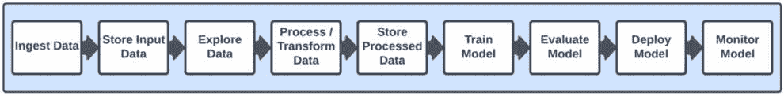

图 3.13：由 AutoML 管理的 ML 模型生命周期

AutoML 是如何工作的？如果我们回顾一下我们在*第二章*中讨论的典型数据科学项目的所有步骤，你可能还记得每个步骤——尤其是在项目的早期阶段——都需要大量的试错。例如，你可能尝试了多种不同的数据转换技术，然后在训练期间尝试了几种不同的算法，以及这些算法的超参数值的多种组合。在找到好的候选模型（即我们认为可能满足我们的业务目标和指标）之前，这些步骤可能需要花费许多天或几周的时间。AutoML 自动快速运行许多试错作业——通常比人类能够做到的更快——并评估结果是否符合期望的指标阈值。不符合期望标准的结果不会被选为候选模型，AutoML 将继续尝试其他选项，直到找到合适的候选模型，或者达到某些其他阈值，例如所有选项都已耗尽。

如何开始使用 AutoML？在本章前面部分讨论的一些 AI 服务已经使用 AutoML 来训练通过这些 API 访问的模型。例如，AutoML 图像，你可以从目标检测和图像分类中获得见解；AutoML 视频用于流视频分析；AutoML 文本用于理解文本的结构、意义和情感；AutoML 翻译用于在不同语言之间进行翻译；以及 AutoML 预测，它基于时间序列数据提供预测。

另一个我们尚未探索的 AutoML 用例是针对表格数据的 AutoML（存储在表中的结构化数据）。这是存储业务数据的一种非常常见的格式，因为它提供了一种组织信息的方式，便于人类阅读和理解。AutoML Tabular 支持多种使用表格数据的 ML 用例，例如二分类、多分类、回归和预测。

我们可以使用 AutoML 来自动化许多试错步骤并开发候选模型，然后如果我们愿意，我们可以从那个点开始进一步定制。例如，我们可以使用 Vertex AI Tabular Workflows，它创建一个由*玻璃箱*管理的 AutoML 管道，让我们能够看到并解释模型构建和部署过程中的每一步。然后我们可以根据需要调整过程中的任何步骤，并通过 MLOps 管道自动化任何更新。我们将在本书的后续章节中精确执行这些活动。

接下来，我们将更深入地探讨 ML 模型定制，并将更详细地探讨 Vertex AI，因为它可以用于定制数据科学项目中的每个步骤。

# Google Cloud Vertex AI

这是我们开始进入专家级 AI/ML 的地方。回想一下我们在本书中迄今为止所涵盖的所有数据科学概念；所有不同类型的 ML 方法、算法、用例和任务。Vertex AI 是你可以完成所有这些的地方，以及我们将在本书中进一步探索的许多其他内容。你可以将 Vertex AI 作为你执行所有 AI/ML 相关活动的中央指挥中心。我们的 ML 模型生命周期图*图 3.14*以图形方式说明了这一点。传统上，我们会期望一个 AI/ML 平台主要关注训练、评估、部署和监控模型。这由*图 3.14*右侧的蓝色框表示，所有这些活动当然都由 Vertex AI 支持。然而，通过额外的功能，如笔记本和 MLOps 管道，Vertex 不仅超越了传统的 ML 活动，还使我们能够执行生命周期中的所有任务，包括数据探索和处理，正如以下图中左侧的浅蓝色虚线框所示：

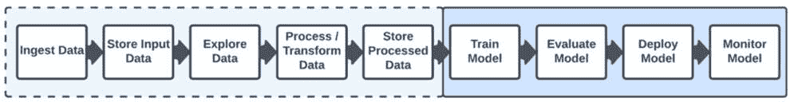

图 3.14：使用 Vertex AI 的 ML 模型生命周期

让我们更详细地了解一下 Vertex AI 的功能。从基础开始，我们可以使用 Vertex AI 的深度学习 VM 镜像在 Compute Engine 实例上实例化包含最流行 AI 框架的 VM 镜像，或者我们可以使用 Vertex AI 深度学习容器在可移植和一致的容器化环境中快速构建和部署模型。

虚拟机和容器镜像为我们提供了构建块，基于这些构建块我们可以开发定制的 ML 工作负载，但我们也可以以其他方式使用 Vertex AI 来执行和管理模型开发生命周期中的所有步骤。我们可以使用 Jupyter 笔记本来探索数据并实验过程中每个步骤，而 Vertex AI Data Labeling 则使我们能够从人工标注者那里获得高度准确的标签，以创建更好的监督式 ML 模型，Vertex AI Feature Store 则提供了一个完全管理的特征存储库，用于服务、共享和重用 ML 特征。Vertex AI Training 提供了预构建的算法，并允许用户将自定义代码带入完全管理的训练服务中，以实现更大的灵活性和定制化，或者对于在本地或另一个云环境中运行训练的用户。Vertex AI Vizier 为我们自动化所有超参数调优任务，为我们找到最优的超参数值集，从而节省我们大量繁琐的手动工作！优化的超参数值可以导致更准确和更高效的模型。

当我们需要部署我们的模型时，我们可以使用 Vertex AI Predictions，它将在由 Google 管理的基础设施上托管我们的模型，该基础设施会自动扩展以满足我们模型的流量需求。它可以托管我们的模型用于批量或在线用例，并提供一个统一的框架来部署基于任何框架（如 TensorFlow、PyTorch、scikit-learn 或 XGB）的定制模型，以及 BigQuery ML 和 AutoML 模型，并在广泛的机器类型和 GPU 上运行。部署后，我们可以使用 Vertex AI 模型监控来提供针对数据漂移、概念漂移或其他可能需要监督的模型性能事件的自动警报。然后，我们可以通过使用 Vertex Pipelines 自动化整个过程，作为 MLOps 管道，它允许我们在需要时触发模型的重新训练，并以版本控制的方式管理我们模型的更新。我们还可以使用 Vertex AI TensorBoard 来可视化 ML 实验结果，并比较模型和模型版本，以轻松识别性能最佳的模型。这个用于 ML 实验的视觉化和跟踪工具包括显示图像、文本和音频数据的模型图。

真正令人兴奋的是，我们可以从 Vertex AI Workbench 中执行和管理所有这些活动，这是一个基于 Jupyter 的完全托管、可扩展、企业级计算基础设施，具有安全控制和用户管理功能。在此过程中，我们的模型在每一步进展中的谱系细节都可以通过 Vertex Experiments 和 Vertex ML 元数据服务进行跟踪，这两个服务为 ML 工作流程提供易于使用的 Python SDK，以实现工件、谱系和执行跟踪。

Vertex AI 提供了比我们之前提到的所有功能更多的功能，例如 Vertex AI 匹配引擎，这是一个大规模可扩展、低延迟且成本效益高的向量相似度匹配服务。Vertex AI 神经架构搜索使我们能够针对特定应用需求构建新的模型架构，并在自动化的服务中优化我们现有的模型架构以降低延迟、内存和功耗，我们还可以使用 Vertex 可解释 AI 来理解并建立对模型预测的信任，通过 Vertex AI 预测、AutoML 表格和 Vertex AI Workbench 中的可操作解释来实现。可解释 AI 提供详细的模型评估指标和特征归因，表明每个输入特征对我们预测的重要性。

# Google Cloud 上的标准行业工具

除了在本章中我们已经描述的 Google Cloud 自家的数据科学工具之外，您还可以使用其他数据科学工具，例如开源框架或其他流行的行业解决方案。有许多优秀的库可以轻松完成模型开发生命周期中的各种任务。例如，在数据探索和处理方面，备受喜爱的 pandas 库是任何机器学习和数据分析课程的必备工具。您可以使用它来处理缺失数据、切片、子集、重塑、合并和连接数据集。Matplotlib 在数据探索方面与 pandas 不相上下，因为它允许您通过可定制的交互式图表和图形来可视化数据，这些图表和图形可以导出为各种文件格式。NumPy 允许您轻松地操作和玩转我们在许多机器学习实现中发现的*n*-维数组和向量。学习 NumPy 也为您使用 scikit-Learn、TensorFlow 和 PyTorch 等框架奠定了基础。

说到 scikit-learn，它在任何机器学习课程中的地位与 pandas 不相上下。如果您参加机器学习课程，您在学习过程中几乎肯定会用到 scikit-learn，这是有充分理由的；它是一个易于使用和理解的框架，包含大量内置算法和数据集，您可以使用它们来实施机器学习工作负载。而且，它不仅仅是一个用于学习的简单框架；许多公司也使用 scikit-learn 来处理他们的生产机器学习工作负载。

虽然我们还在讨论通用机器学习框架的话题，但接下来我们将讨论的是广受欢迎的 TensorFlow，它最初是由 Google 创建的，在开源之前，因此在 Google Cloud 上得到了非常好的支持。TensorFlow 可以用于从数据处理到自然语言处理和计算机视觉的各个方面。您可以使用它来训练、部署和提供模型，并且通过**TensorFlow Extended**（**TFX**），您可以实现端到端的 MLOps 管道来自动化所有这些步骤。我们当然会在本书中更详细地探讨 TensorFlow，以及 Keras，这是一个通过 Python 接口提供对 TensorFlow 访问的 API，因其易用性而受到欢迎，并自称是“*为人类设计的 API，* *而不是为机器*。”

我们将使用 PyTorch 来结束对通用机器学习框架的讨论，PyTorch 最初由 Facebook（Meta AI）开发，现在在 Linux 基金会下开源。PyTorch 近年来迅速获得人气，尤其是在 Python 开发者中，它已经成为除了 TensorFlow 之外一个非常广泛使用的框架。在这本书中，我们不会涉及哪个框架更好的争论。每个阵营都有坚定的支持者，如果你在 Google 上搜索“TensorFlow 与 PyTorch”，你会找到许多网站和论坛强调其中一个在特定类型的用例中比另一个更好。我们还将在这本书的后续章节中使用 PyTorch。

从通用机器学习框架转向更专业的框架，你可能希望使用像 OpenCV 这样的工具来处理计算机视觉工作负载，或者使用 SpaCy 来处理自然语言处理。OpenCV 提供了广泛的选择，可以将机器学习和深度学习应用于图像和视频内容，以执行我们在本章前面讨论的许多任务，例如物体识别，以及通过视频帧跟踪物体和动作。SpaCy 拥有大量的预训练词嵌入和多种语言的流水线，它还支持使用 TensorFlow 和 PyTorch 编写的自定义模型，以及大量的 Python NLP 包。

好消息是，我们在这个部分讨论的所有工具和框架都可以轻松地在 Google Cloud 上使用。除了开源工具之外，还有许多流行的第三方数据科学解决方案可以在 Google Cloud 上使用，为人们提供灵活性，让他们可以使用他们偏好的工具来实现他们想要达到的目标。我们已经讨论了通过 Dataproc 和 Vertex AI 等服务在 Google Cloud 上使用 Spark，你也可以通过 Google Cloud Marketplace 使用第三方 Spark 产品，如 Databricks。市场允许你找到在 Google Cloud 上运行的数千种解决方案，包括来自 Hugging Face 等公司的深度学习解决方案。

在拥有所有这些工具以及 Google Cloud 提供的服务的情况下，你可能想知道如何为你的数据科学工作负载选择合适的工具。让我们在下一节更详细地探讨这个问题。

# 选择合适工具的工作

你选择的数据处理工具将主要取决于你需要完成哪种数据处理任务。如果你有一大堆需要批量转换的原始数据，就像 ETL/ELT 任务一样，那么数据融合将是开始评估的好地方；而如果你想要使用 SQL 语法执行相对简单的转换，那么从 BigQuery 开始；如果你想要通过易于使用的 GUI 可视化并转换数据，那么选择 Dataprep。如果你更喜欢使用开源工具，那么你可能想使用像 pandas 或 Spark 这样的工具。我们讨论了 pandas 对于刚开始学习数据探索和预处理的人来说是一个很好的起点，以及它不仅仅是一个教育工具。pandas 对于初始数据探索和中等规模的数据处理来说非常好。然而，对于大规模数据处理项目，Spark 高度并行化的功能将更加高效，如果你不想自己管理基础设施，那么你可以在 Dataproc 上运行它。Dataflow 是推荐用于流数据的选项，并且它还有一个额外的好处，就是它的统一编程模型也适用于批量数据处理。

当涉及到为 AI/ML 工作负载选择工具时，决策可能更为直接。如果你或你的公司对某个特定第三方（如 Hugging Face）有先前的偏好，那么你可能会被引导到那个方向。一般最佳实践是，你应该从你可用的高级抽象级别开始，因为这样你就不必花费大量时间和精力去构建和维护那些已经作为服务可供你使用的东西。如果这不能满足你的任何需求，比如需要一定程度的定制化的特定业务需求，那么就转向一个提供更多控制工作负载实施方式的解决方案。例如，如果你正在构建一个需要包含某种 NLP 功能的应用程序，那么首先评估 Google Cloud NLP API。如果出于任何原因，你无法通过该解决方案实现你的预期目标，那么就转向评估使用 AutoML 来自动化在特定数据上训练模型。如果你的目标仍然没有通过该过程中创建的模型得到满足，那么是时候提高你的定制化水平，并可能使用 Vertex AI 来构建一个完全定制的模型。

在你的决策过程中，另一个非常重要的因素是你的预算。为你做更多工作的服务（如高级 AI 服务）可能比低级服务成本更高，但非常重要的一点是要考虑你支付给员工多少来管理基础设施和执行那些可以由高级服务代表你执行的任务。

# 摘要

在本章中，我们涵盖了所有可用于在谷歌云上实施 AI/ML 工作负载的基础和主要服务。我们首先介绍了基本服务，如谷歌计算引擎和谷歌云网络服务，所有其他服务都是基于这些服务构建的。然后，我们探讨了如何使用这些服务与谷歌云之外的系统建立连接。接下来，我们讨论了可用于将数据导入或传输到谷歌云的服务以及可用于在云中存储数据的各种存储系统。在介绍了主要的存储系统之后，我们转而讨论谷歌云的数据管理和数据处理服务。我们旅程的最后一站是了解谷歌云中存在的所有不同的 AI/ML 服务。

到目前为止，你已经学到了很多，凭借这些知识，你现在可以就 AI/ML 和谷歌云进行有见地的讨论。这是一个重大的成就，因为人们花费了很长时间来学习 AI/ML，也花费了很长时间来学习谷歌云。现在，你比很多人知道的都多，你应该感到自豪，并为走这么远而给自己鼓掌。

这标志着我们书籍的“基础知识”部分的结束，你在前几章中获得的所有知识将成为你在这本书剩余部分所学内容的基础。在下一章以及之后，我们将开始进行动手活动，更深入地了解我们迄今为止所涵盖的服务和概念，并开始在谷歌云上构建数据科学工作负载！
