# 第四章：利用 Google Cloud 的高级 AI 服务

现在您已经拥有了关于 AI/ML 和 Google Cloud 的信息武器库，您已经准备好开始深入研究和在云中实施 AI/ML 工作负载了——这正是本章将要做的！您将从使用 Google Cloud 的高级 AI/ML API 开始，例如自然语言 API 和视觉 API，这些 API 使您能够使用由 Google 训练和维护的模型来实现 AI/ML 功能。然后，您将使用 Vertex AI AutoML 训练您自己的 ML 模型，而无需任何 AI/ML 专业知识。

本章将涵盖以下主题：

+   使用文档 AI 从文档中提取信息

+   使用 Google Cloud 自然语言 API 从文本输入中获取情感分析洞察

+   使用 Vertex AI AutoML

# 本章的先决条件

首先，我们需要执行一些设置步骤，为我们在本章中要执行的活动打下基础。

## 将本书的 GitHub 仓库克隆到您的本地机器

在本书的剩余部分，我们将进行许多需要使用代码、数据和其他文件等资源的动手活动。许多这些资源存储在本书的 GitHub 仓库中，因此访问它们的最简单方法是将仓库克隆到您的本地机器（即您的笔记本电脑/PC）。具体操作方式将根据您使用的操作系统而有所不同，但通常是在您的系统上打开命令终端，导航到您选择的目录，并运行以下命令：

```py
git init
git clone https://github.com/PacktPublishing/Google-Machine-Learning-for-Solutions-Architects
```

## Google Cloud 控制台

在 *第三章* 的“使用 Google Cloud 工具和服务的先决条件”部分，我们讨论了您需要创建一个 Google Cloud 账户才能与大多数 Google Cloud 服务进行交互。我们将使用 Google Cloud 控制台来完成本章中的许多活动。一旦您创建了 Google Cloud 账户，您可以通过导航到 [`console.cloud.google.com`](https://console.cloud.google.com) 来登录控制台。

在本书中，您将需要在 Google Cloud 控制台中导航到不同的服务。每次您需要这样做时，您都可以点击屏幕左上角 Google Cloud 标志旁边的三个横线符号来查看 Google Cloud 服务或产品的菜单（在此上下文中，我们将在本书中交替使用“服务”和“产品”这两个术语）。参见图 *4.1* 以获取参考：


图 4.1：访问 Google Cloud 服务菜单

您可以滚动查看服务列表并选择相关的服务。一些菜单项下有嵌套的子菜单，如图 *4.2* 所示：

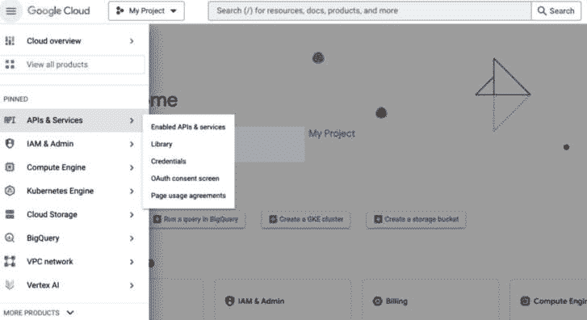

图 4.2：Google Cloud 服务子菜单

在本书中，我们有时会使用缩写符号来表示通过服务菜单和子菜单的导航路径。例如，要导航到 **凭证** 子菜单项，我们将表示为 **Google Cloud 服务** 菜单 → **APIs & Services** → **Credentials**。

现在我们已经了解了如何访问 Google Cloud 控制台，让我们确保我们有一个 Google Cloud 项目用于本书的活动。

## Google Cloud 项目

一个 Google Cloud 项目是一个包含您在 Google Cloud 中创建的所有资源的环境。资源包括虚拟机、网络配置、数据库、存储桶、身份和访问控制等几乎所有您在 Google Cloud 中创建的内容。

默认情况下，当您创建 Google Cloud 账户并首次登录控制台时，Google Cloud 会自动为您创建第一个项目，项目名称为 **我的第一个项目**。如果由于任何原因，这还没有发生，您需要按照以下步骤创建一个：

1.  在 Google Cloud 控制台中，导航到 **Google Cloud 服务** 菜单 → **IAM & Admin** → **创建** **项目**。

1.  在 **项目名称** 文本框中为您的项目输入一个名称。

    您也可以编辑 **项目 ID** 值，如果您想的话，但更常见的是将其保留为生成的值，除非您想实施特定的命名约定。请注意，项目创建后不能更改。

1.  在 **位置** 字段中，点击 **浏览** 以显示您项目的潜在位置。然后，点击 **选择**。

1.  点击 **创建**。控制台将导航到 **仪表板** 页面，您的项目将在几分钟内创建完成。

现在我们已经设置了我们的 Google Cloud 项目，让我们确保我们的计费详细信息已设置好以使用 Google Cloud。

## Google Cloud 计费

一个 Google Cloud 计费账户包含所有使 Google Cloud 能够对您使用其服务进行计费的相关详细信息。

如果您还没有 Google Cloud 计费账户，那么您需要按照以下步骤创建一个：

1.  在 Google Cloud 控制台中，导航到 **Google Cloud 服务** 菜单→ **计费**。

1.  在出现的页面上，选择 **管理计费账户**，然后 **添加** **计费账户**。

1.  点击 **创建账户**。

1.  为云计费账户输入一个名称。

1.  根据您的配置，您还需要选择以下选项之一：

    +   **组织**：如果您看到一个 **组织** 下拉菜单，那么在您继续之前必须选择一个组织

    +   **国家**：如果您被提示选择一个 **国家**，请选择与您的计费邮寄地址相对应的国家

1.  点击 **继续**。

1.  然后，您需要填写所有您的计费详细信息。

1.  当你已输入所有详细信息后，点击**提交并启用计费**。要了解更多关于 Google Cloud 计费账户和概念的信息，请访问[`cloud.google.com/billing/docs/how-to/create-billing-account`](https://cloud.google.com/billing/docs/how-to/create-billing-account)。

现在我们已经设置了 Google Cloud 项目和计费账户，我们就可以开始在我们的项目中使用 Google Cloud 产品了。

## Google Cloud Shell

我们将使用 Google Cloud Shell 来完成本章的一些活动。

打开 Cloud Shell，如*第三章*中“与 Google Cloud 服务交互”部分所述。提醒一下，您可以通过点击屏幕右上角的**Cloud Shell**符号来访问它，如图*图 4**.3*所示：


图 4.3：Cloud Shell 符号

现在我们已经打开了 Cloud Shell，我们将执行一些基本的设置步骤来准备我们的 Cloud Shell 环境。

## 认证

当以某种方式调用 Google Cloud 服务时，它通常想知道谁或什么（身份）在调用它。这有多种原因，例如计费和检查调用者是否有权执行所请求的操作。这种识别过程被称为“认证”。有无数种不同的方式可以通过 Google Cloud API 进行认证。例如，当您登录 Google Cloud 控制台时，您正在与控制台进行认证。然后，当您在控制台中导航和执行操作时，您的认证详细信息将用于控制您可以执行的操作类型。其中一种最简单的认证机制被称为**API 密钥**。我们将接下来探讨这一点。

### Google Cloud API 密钥

API 密钥是某些 Google Cloud API 支持的一种非常基本的认证类型。API 密钥不会向被调用的 API 提供任何标识或授权信息；它们通常仅用于计费目的（通过链接到 Google Cloud 项目）或用于跟踪对 Google Cloud 配额的使用情况。

在本章中，我们将使用它们来访问 Google Cloud 自然语言 API。

#### 创建 API 密钥

虽然我们将使用 Cloud Shell 来完成本章中的许多步骤，但 Google Cloud 目前仅支持在 Google Cloud 控制台中创建 API 密钥。要创建我们的 API 密钥，请执行以下步骤：

1.  在 Google Cloud 控制台中，导航到**Google Cloud 服务**菜单 → **APIs & Services** → **Credentials**。

1.  选择**创建凭据**，然后**API 密钥**。

1.  复制生成的 API 密钥并点击**关闭**。

1.  您将在后续步骤中需要粘贴此 API 密钥。如果您需要再次查看或复制密钥，您可以在控制台的**API Keys**部分中选择**显示密钥**（即您当前所在的区域）。

1.  这样，我们就创建了一个可以在本章后续活动中使用的 API 密钥。

## 启用相关 Google Cloud API

正如我们在 *第三章* 中讨论的那样，在您可以使用 Google Cloud 服务 API 之前，您需要启用它。由于我们已经在 Cloud Shell 中登录，我们可以直接使用 `gcloud` 命令轻松完成此操作。我们将启用 Google Cloud Natural Language API、Vision API、Document AI API 和 Google Cloud Storage API，因为在本章中我们将使用所有这些 API。为此，请在 Cloud Shell 中运行以下命令：

```py
gcloud services enable language.googleapis.com
gcloud services enable vision.googleapis.com
gcloud services enable documentai.googleapis.com
gcloud services enable storage.googleapis.com
```

响应应类似于以下内容：

```py
Operation "operations/..." finished successfully.
```

现在我们已经启用了所需的 API，我们只需再完成几个步骤就可以开始使用了。

## 在环境变量中存储认证凭据

我们将在本章的许多命令中引用我们的认证凭据——即我们之前创建的 API 密钥。为了便于引用凭据，我们将它们存储在 Cloud Shell 的 Linux 环境变量中。

要存储 API 密钥，请运行以下命令，但将 `<YOUR_API_KEY>` 替换为您之前创建并复制的 API 密钥：

```py
export API_KEY=<YOUR_API_KEY>
```

现在，我们几乎完成了环境设置步骤。接下来，我们将克隆我们的 GitHub 仓库，之后我们就可以开始使用 Google Cloud 的高级 AI 服务了。

## 创建目录并克隆我们的 GitHub 仓库

您已经将我们的仓库克隆到了您的本地机器上。在本节中，您也将将其克隆到您的 Cloud Shell 环境中。为此，请在 Cloud Shell 中执行以下步骤：

1.  创建一个目录：

    ```py
    mkdir packt-ml-sa
    ```

1.  将位置更改为该目录：

    ```py
    cd packt-ml-sa
    ```

1.  将目录初始化为本地 `git` 仓库：

    ```py
    git init
    ```

1.  克隆包含我们将在此章节的文档 AI 部分使用的代码的 `git` 仓库：

    ```py
    git clone https://github.com/PacktPublishing/Google-Machine-Learning-for-Solutions-Architects
    ```

现在我们已经将所有必需的代码复制到我们的 Cloud Shell 环境中，是时候开始执行它了！

# 使用 Cloud Vision API 在图像中检测文本

我们将从一个非常简单的例子开始，向您展示开始使用 Google Cloud 上的 AI/ML 服务是多么容易。只需几个简单的步骤，您就能从图像中提取文本和相关元数据，并将该文本保存到文件中。这个过程被称为 **光学字符** **识别** (**OCR**)。

要开始此过程，请将以下图像下载到您的计算机上（该图像也可以在您上面创建的 git 仓库的 `Chapter04/images` 文件夹中找到）：[`github.com/PacktPublishing/Google-Machine-Learning-for-Solutions-Architects/blob/main/Chapter-04/images/poem.png`](https://github.com/PacktPublishing/Google-Machine-Learning-for-Solutions-Architects/blob/main/Chapter-04/images/poem.png)。

图像显示在 **图 4.4** 中：


图 4.4：用于 OCR 的签名

继续执行剩余步骤，将此图像上传到您的 Cloud Shell 环境中：

1.  点击云 Shell 区域右上角的带三个点的符号（位于你的 Google Cloud 控制台屏幕底部），然后选择**上传**。参见*图 4**.5*以供参考：

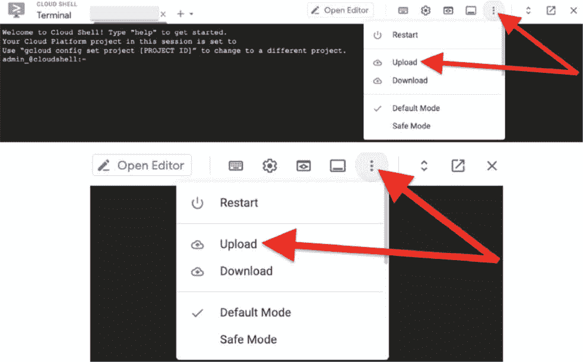

图 4.5：云 Shell 上传

1.  你将看到一个文件上传对话框（参见*图 4**.6*以供参考）。选择**选择文件**并浏览你之前下载的文件：


图 4.6：云 Shell 上传提示

1.  现在，使用以下命令调用云视觉 API 提取文本并将其保存到以下文件中（在这种情况下，我们使用的图像文件名为`poem.png`）。结果存储在名为`vision-ocr.json`的文件中：

    ```py
    gcloud ml vision detect-text poem.png> vision-ocr.json
    ```

1.  检查文件内容：

    ```py
    cat vision-ocr.json
    ```

注意

由于文件不适合在书中打印，所以我们在此不显示它。

如你所见，每个提取的单词都存储了一些相关的元数据，例如包含该单词的图像中边界框的*X*和*Y*坐标。这些元数据帮助我们了解每个单词在图像中的位置，这对于开发者来说可能是有用的信息。

1.  如果你只想查看检测到的文本，而不需要其他元数据，可以使用以下命令：

    ```py
    cat vision-ocr.json | grep description
    ```

    你将在第一个描述中看到检测到的整个文本正文，然后在随后的描述中看到单个单词。输出将类似于以下内容（此处截断以节省空间）：

    ```py
    "description": "\"All the summer long I stood\nIn the silence of the wood.\nTall and tapering I grew;\nWhat might happen well I knew;\nFor one day a little bird.\nSang, and in the song I heard\nMany things quite strange to me",
              "description": "\""
              "description": "All"
              "description": "the"
              "description": "summer"
              "description": "long"
              "description": "I"
              "description": "stood"
    ```

恭喜你——你已经在 Google Cloud 上实现了你的第一个 AI/ML 工作负载！这真的非常简单！接下来，我们将开始探讨一些稍微复杂一些的应用案例。

# 使用文档 AI 从文档中提取信息

如你所回忆，我们在*第三章*中详细讨论了文档 AI。我们讨论了它如何超越理解文本输入的内容，并且还结合了结构。在本节中，我们将探讨文档 AI 是如何做到这一点的，并将在一些实际应用案例中看到它的实际应用。我们将从介绍一些重要的文档 AI 概念开始。

## 文档 AI 概念

文档 AI 使用“处理器”的概念来处理文档。你可以使用以下三种主要类型的处理器：

+   通用处理器

+   专用处理器

+   自定义处理器

通用处理器和专用处理器使用由 Google 预先训练的模型，因此你可以使用它们而无需训练自己的模型，也不需要任何 AI/ML 专业知识。然而，为了提供额外的灵活性，Google Cloud 允许你使用自己的数据进一步训练专用处理器，以提高它们针对特定业务用例的准确性。这个过程被称为“再训练”。

通用处理器包括对文本文档和表格图像执行 OCR 的处理器。虽然我们在上一节中使用了云视觉 API 进行 OCR，但文档 AI 提供了额外的功能，例如识别输入文档中的结构化信息。这包括理解输入表单中的键值对，这对于自动化数据录入用例非常有用。

注意

在解决方案架构师的角色中，这是一个重要的考虑因素；通常有多个不同的服务可以实现类似的企业目标，解决方案架构师的工作是根据特定的业务需求创建或选择最合适的解决方案。在比较云视觉 API 和文档 AI 用于 OCR 用例时，请记住，云视觉 API 通常使用起来需要更少的初始努力，但它提供的功能比文档 AI 要少。因此，如果你有一个非常简单的用例，可以用云视觉 API 满足，那么你可以选择该选项，而对于更复杂的用例，则应引导你使用文档 AI。

专用处理器为处理特定类型的文档提供模型，例如美国联邦政府表格、身份证件和发票。专用处理器目前分为四种不同类型：

+   采购

+   身份

+   借款

+   合同

在撰写本文时（2023 年 3 月），谷歌云最近宣布了文档 AI 新功能的通用可用性，即文档 AI 工作台。文档 AI 工作台允许你为特定的用例创建完全新的、定制的处理器类型，这超出了谷歌云提供的内容。

让我们看看一些文档 AI 处理器是如何工作的。

## 使用文档 AI 进行 OCR

我们将使用最简单的用例 OCR 进行演示，这还将使我们能够直接对比这种功能与我们在上一节中使用云视觉 API 进行 OCR 的方式。

### 创建文档 AI OCR 处理器

在我们能够处理任何文档之前，我们需要创建一个处理器。我们将在这个谷歌云控制台中执行此操作：

1.  在谷歌云控制台中，导航到**谷歌云服务**菜单 → **文档 AI** → **处理器库**。

1.  在**文档 OCR**下点击**创建处理器**。参见*图 4**.7*以获取参考：

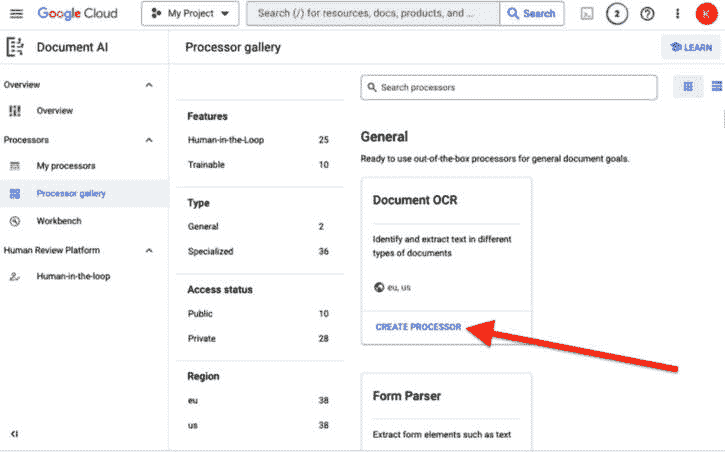

图 4.7：创建处理器

1.  将**OCR-Processor**作为名称输入，选择离你最近的地域，然后点击**创建**。

关于地域和区域的说明

对于本书，每次您需要选择一个区域时，我们建议每次都选择相同的区域，因为我们将在这本书的整个过程中构建资源，这些资源可能需要与其他章节中创建的其他资源一起使用。通常，当您需要使用一些云资源与其他云资源一起使用时，如果这些资源在同一个区域，通常会更简单。有时，可能很难或不可能在没有构建定制解决方案的情况下，让一个区域内的资源引用另一个区域内的资源。

在本书的一些活动中，您还可以选择在区域内选择一个特定的区域。这个决定对于本书中的活动通常不太重要，因为在一个区域内跨区域访问资源通常相当容易。在生产环境中，如果您有特定的业务需求，例如需要非常紧密协作的计算实例集群，您可能希望将资源保留在同一个区域。

如果您没有这样的特定要求，那么最佳实践是将您的资源分布在多个区域以提高工作负载的弹性和可用性。您可以在以下 URL 的文档中了解更多关于 Google Cloud 区域和区域的信息：[`cloud.google.com/compute/docs/regions-zones`](https://cloud.google.com/compute/docs/regions-zones)。

1.  当您的处理器创建时，您应该自动重定向到 **处理器详细信息** 页面。如果不是，您可以通过在屏幕左侧菜单中选择 **我的处理器** 然后选择您新创建的处理器来查看详细信息。处理器详细信息显示在 *图 4**.8* 中：

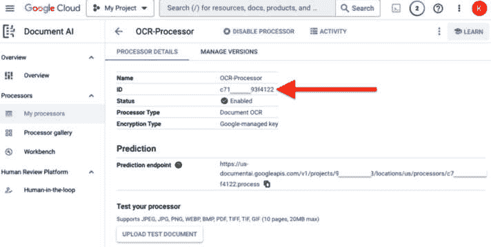

图 4.8：OCR 处理器详细信息

记下您的处理器 ID（由图 4**.8** 中的红色箭头突出显示），您将在下一节中使用的代码中引用它。

### 调用 OCR 处理器

现在我们已经创建了我们的处理器，我们可以开始使用它了。在本节中，我们将运行一段简单的 Python 代码，该代码使用 Document AI Python 客户端库处理文件并提取必要的信息。我们将使用本章前面与 Cloud Vision API 一起使用的相同文件。

在 Cloud Shell 中执行以下步骤：

1.  安装 Document AI 客户端包的最新版本：

    ```py
    python -m venv env
    source env/bin/activate 
    pip install --upgrade google-cloud-documentai
    ```

1.  记下您的项目 ID，因为您将在与 Document AI 交互的 Python 代码中引用它。您可以使用以下命令查看它：

    ```py
    echo $DEVSHELL_PROJECT_ID
    ```

1.  确保您在您的家目录中：

    ```py
    cd ~
    ```

1.  将 `docai-ocr.py` 文件从我们之前创建的 `git` 目录复制到您的家目录。我们将在这个分支之外编辑这个文件，因为我们不需要将更新合并回主分支：

    ```py
    cp ~/packt-ml-sa/Google-Machine-Learning-for-Solutions-Architects/Chapter-04/docai-ocr.py ~
    ```

在这个 Python 文件中，我们将首先导入所需的库。然后，我们将定义一些变量（我们需要用上一节中创建的处理器的值来替换这些变量的值）。

然后，我们将定义一个函数，该函数创建一个 Document AI 客户端，读取输入文件，根据文件内容创建一个请求对象，并将此请求发送给 Document AI 服务进行处理。

最后，函数将打印生成的文档文本。

要执行这些操作，请执行以下步骤：

1.  使用`nano`打开文件进行编辑：

    ```py
    nano docai-ocr.py
    ```

1.  将变量定义替换为在 Google Cloud 控制台中创建处理器后保存的值：

    1.  将`project_id`的值替换为您之前在`$DEVSHELL_PROJECT_ID`环境变量中查看的项目 ID。

    1.  根据您使用的区域指定`'us'`或`'eu'`作为位置。

    1.  将`processor_id`的值替换为您可以在包含我们想要处理的文件路径的`file_path`值中查看的处理器 ID。我们使用的 Cloud Shell 上传功能通常将文件存储在您的 Cloud Shell 主目录中，通常是`/home/admin_`。

    1.  在这种情况下，`mime_type`的值是`'image/png'`。您可以在[`cloud.google.com/document-ai/docs/file-types`](https://cloud.google.com/document-ai/docs/file-types)查看支持的 MIME 类型列表。

1.  当您完成所有编辑后，按*Ctrl* + *X*退出`nano`，然后按*Y*保存文件，最后按*Enter*确认。

1.  现在，我们准备执行 OCR！以下命令将运行我们的 Python 函数，并将结果保存到名为`docai-ocr.txt`的文件中：

    ```py
    python docai-ocr.py > docai-ocr.txt
    ```

1.  检查文件内容：

    ```py
    cat docai-ocr.txt
    ```

    响应应如下所示：

    ```py
    All the summer long I stood
    In the silence of the wood.
    Tall and tapering I grew;
    What might happen well I knew;
    For one day a little bird.
    Sang, and in the song I heard
    Many things quite strange to me
    ```

注意输出格式与使用 Cloud Vision API 时收到的结果不同。这进一步证明了我们可以使用不同的服务来实现类似的结果。然而，这些服务之间存在细微的差异，我们需要根据业务需求选择最佳选项。Cloud Vision API 的使用初始工作量较小，但请记住，Document AI 具有更强大的功能，例如自动化文档处理和针对特定用例的定制模型。

让我们来看看 Document AI 的一些附加功能。

### Document AI 的响应

在我们的 OCR 示例中，我们关注了响应中的`document.txt`对象。然而，返回的完整响应包含更多信息，我们可以以各种方式使用这些信息，例如文档中的页数、段落和行数，以及许多其他类型的元数据。当使用表单解析器或专用处理器时，甚至可以突出显示结构化数据类型，如表格和键值对。

还应注意的是，在先前的例子中，我们执行了一个在线推理请求，其中我们为单个文档实时获得了响应。如果需要一次性处理大量文档，Document AI 也允许我们执行批量推理请求。

### 环境中的 AI（HITL）

在先前的用例中，模型能够识别图像中的所有单词。然而，在现实中，我们图像的来源可能并不总是清晰可辨。例如，我们可能需要从可能磨损的地方的公路标志图片中读取信息。在考虑你需要的结果有多准确时，这是需要考虑的事情。Document AI 提供了一个 **HITL**（人机交互）功能，允许你通过人工审查并在必要时进行更新来提高结果准确性。

# 使用 Google Cloud Natural Language API 从文本输入中获取情感分析洞察

**自然语言处理**（**NLP**）和**自然语言理解**（**NLU**）在我们的日常生活中变得越来越突出，研究人员几乎每天都在发现有趣的新用例。在本章中，我们将通过使用 Google Cloud Natural Language API 探索在 Google Cloud 上获得强大的 NLP/NLU 功能的最简单方法。在后面的章节中，我们将构建和使用更多复杂的语言用例。

## 使用自然语言 API 进行情感分析

情感分析使我们能够了解文本的主要情感基调。这对于许多商业用例来说很重要，尤其是在与客户建立联系和理解客户方面。例如，如果你想了解客户对你发布的新产品的看法，你可以分析各种客户互动渠道，如评论、社交媒体反应和客户服务中心日志，以了解人们对新产品的反应。这使你能够回答以下问题：

+   他们对此满意吗？

+   是否有关于特定功能的投诉模式出现？

如果你有成千上万的评论、社交媒体反应和服务中心日志要处理，手动进行此类分析将是不可能的。

幸运的是，你可以通过向 Google Cloud Natural Language API 发起简单的 API 调用来对一段文本进行情感分析。

要这样做，请在 Cloud Shell 中执行以下步骤：

1.  创建一个包含我们想要分析的文本片段的 JSON 文件。就像我们讨论 Document AI 时一样，我们可以使用 `nano` 命令来完成这个任务，这将创建并打开文件以供编辑：

    ```py
    nano request.json
    ```

    将以下文本粘贴到 `request.json` 文件中：

    ```py
    {
      "document":{
        "type":"PLAIN_TEXT",
        "content":"This is the best soap I've ever used! It smells great, my skin feels amazing after using it, and my partner loves it too!"
      },
      "encodingType":"UTF8"
    }
    ```

1.  按 *Ctrl* + *X* 退出 `nano`。

1.  按 *Y* 保存文件。

1.  按 *Enter* 确认此操作。

1.  现在，我们可以向自然语言 API 的`analyzeSentiment`端点发送请求。为此，我们将使用以下`curl`命令。请注意，我们正在使用本章早期创建的`API_KEY`环境变量。这将用于验证我们的请求：

    ```py
    curl -X POST -s -H "Content-Type: application/json" --data-binary @request.json "https://language.googleapis.com/v1/documents:analyzeSentiment?key=${API_KEY}"
    ```

    你的回复应该看起来像这样：

    ```py
    {"documentSentiment": {
     { "magnitude": 1.9, "score": 0.9
      }, "language": "en",
      "sentences": [
        {"text": {"content": "This is the best soap I've ever used!", "beginOffset": 0},
          "sentiment": {"magnitude": 0.9,"score": 0.9 }},
        {"text": {"content": "It smells great, my skin feels amazing after using it, and my partner loves it too!", "beginOffset": 38 },
          "sentiment": {"magnitude": 0.9,"score": 0.9}
        }]}
    ```

我们在输出中首先可以看到的是整个文档的评分，这是整个文本体的评分。之后，我们可以看到检测到的单个句子的评分。情感评分的范围在-1.0（负面）到 1.0（正面）之间，幅度表示给定文本中情感的整体强度（包括正面和负面）。您可以在[`cloud.google.com/natural-language/docs/basics#sentiment_analysis_response_fields`](https://cloud.google.com/natural-language/docs/basics#sentiment_analysis_response_fields)了解更多关于响应字段和评分的信息。

在这种情况下，这两句话都构成了一条正面评价，因此它们都获得了高分，因此整个文档的评分也因此很高。

注意

如果你的评分与输出中的评分略有不同，那是因为服务这些请求的模型正在不断用新数据更新。

在本节中重试所有之前的步骤，但在审查的末尾添加以下两句：“唯一不好的是它太贵了，这真的很糟糕。非常烦人！”

整个评价将如下所示：

“*这是我用过的最好的肥皂！它闻起来很棒，用后我的皮肤感觉非常好，我的伴侣也喜欢它！唯一不好的是它太贵了，这真的很糟糕。* *非常烦人!*”

当你提交更新后的请求时，输出将如下所示：

```py
{ "documentSentiment": { "magnitude": 3.4,"score": 0.1
  }, "language": "en",
  "sentences": [
    {"text": {"content": "This is the best soap I've ever used!","beginOffset": 0},
      "sentiment": {"magnitude": 0.9,"score": 0.9}},
    {"text": {"content": "It smells great, my skin feels amazing after using it, and my pertner loves it too!",
        "beginOffset": 38},
      "sentiment": {"magnitude": 0.9,"score": 0.9}},
    {"text": {"content": "The only bad thing is that it's just too expensive, and that really sucks.",
        "beginOffset": 122},
      "sentiment": {"magnitude": 0.5,"score": -0.5}},
    {"text": {"content": "Very annoying!",
        "beginOffset": 197},
      "sentiment": {"magnitude": 0.8,"score": -0.8}
    }]}
```

在输出中，请注意，结尾的负面句子得分要低得多，因此这降低了整个评价的整体评分。这很有道理，因为评价的整体情感是挫败感，尽管它以积极的情感开始。

自然语言 API 还提供其他类型的功能，如下所示：

+   **实体分析**：这涉及到识别文本中存在哪些类型的实体（例如，人物、地点等）。支持的实体列表可在[`cloud.google.com/natural-language/docs/reference/rest/v1/Entity#type`](https://cloud.google.com/natural-language/docs/reference/rest/v1/Entity#type)找到。

+   **实体情感分析**：实体分析和情感分析的结合。

+   **句法分析**：这涉及到检查给定文本的语言结构。

+   **内容分类**：这涉及到对文档或文本内容进行分类。

要更详细地探索自然语言 API，让我们看看它的另一个功能内容分类。

## 使用自然语言 API 进行内容分类

让我们假设我们想要构建一个可以用于搜索大量文档和内容对象的搜索引擎。我们首先需要做的事情之一是将我们的文档和内容对象分类到不同的类别中。在数百万个对象上手动进行此操作是不可能的，或者至少是非常费时费力且容易出错的。这就是自然语言 API 的内容分类功能可以发挥作用的地方。

为了演示，我们将使用本章节前一部分中我们的 Document AI OCR 处理器生成的文本。这还将展示一个重要的概念，即你可以结合多个 AI 服务来创建更复杂的用例以满足你的业务需求。在这种情况下，我们不仅可以对常规文本输入进行分类，还可以检测图像中的文本，然后对文本内容进行分类。

在 Cloud Shell 中执行以下步骤：

1.  创建一个 JSON 文件，我们将用它向 API 发送请求。这个文件将包含来自我们的 OCR 处理器的文本：

    ```py
    nano classify-request.json
    ```

1.  将以下文本粘贴到 `classify-request.json` 文件中：

    ```py
    {
      "document":{
        "type":"PLAIN_TEXT",
        "content":""All the summer long I stood
    In the silence of the wood.
    Tall and tapering I grew;
    What might happen well I knew;
    For one day a little bird.
    Sang, and in the song I heard
    Many things quite strange to me "
      },
      "classificationModelOptions":{
        "v2Model":{
          "contentCategoriesVersion":"V2"
        }
      }
    }
    ```

1.  按 *Ctrl* + *X* 退出 `nano`。

1.  按 *Y* 键保存文件。

1.  按下 *Enter* 键以确认此操作。

1.  现在，我们可以向自然语言 API 的 `classifyText` 端点发送请求。为此，我们将使用以下 `curl` 命令。请注意，我们正在使用本章早期创建的 `API_KEY` 环境变量。这将用于验证我们的请求：

    ```py
    curl "https://language.googleapis.com/v1/documents:classifyText?key=${API_KEY}"   -s -X POST -H "Content-Type: application/json" --data-binary @classify-request.json
    ```

    你的响应应该看起来像这样：

    ```py
    {
      "categories": [
        {
          "name": "/Books & Literature/Poetry",
          "confidence": 0.45689428
        },
        {
          "name": "/Arts & Entertainment/Music & Audio/Music Reference",
          "confidence": 0.22331826
        },
        {
          "name": "/Arts & Entertainment/Music & Audio/Rock Music",
          "confidence": 0.109513044
        }
      ]
    }
    ```

看起来更接近了！请注意，响应包含多个潜在类别的条目，每个类别都有不同的置信度级别。这展示了针对解决方案架构师角色的两个重要现实：

+   虽然我们希望通过 AI/ML 尽可能地自动化一切，但通常需要有人类审查模型输出并在必要时进行更正的机制。

+   AI/ML 工作负载通常由多个步骤组成，其中数据从一个步骤传递到下一个步骤，因此在过程中的每个阶段实施数据质量检查是很重要的。

注意

当使用 HITL 审查时，我们不需要对每个数据点都进行人工审查（这不太实际，并且会抵消 AI/ML 的好处），但我们应该有机制来定义在特定用例中我们期望看到哪些类型的值，如果可能的话，或者如果我们的模型在某些数据点的置信度低于指定的阈值，则标记我们的输出以供人工审查。

现在，我们已经探讨了如何使用 Google 提供的预训练模型，接下来我们将探讨在 Google Cloud 上实现 AI/ML 工作负载的下一级复杂性，即以管理方式使用 AutoML 训练我们自己的模型。

# 使用 Vertex AI AutoML

如我们在 *第三章* 中所讨论的，我们可以使用 AutoML 来自动化模型训练和评估过程中的所有步骤。在本节中，我们将使用 Vertex AI 构建一个 AutoML 模型。

注意

在遵循本节中的说明之前，请参考以下链接了解 Vertex AutoML 定价：[`cloud.google.com/vertex-ai/pricing`](https://cloud.google.com/vertex-ai/pricing).

## 用例 – 预测

我们将关注此工作负载的用例是预测。毕竟，预测是几乎所有企业都必须以某种形式执行的最基本业务流程之一。例如，无论您是一家全球在线零售公司还是一个小镇上的单个商店，您都需要根据对那些商品的预期客户需求来估算每个月或每天应该购买多少产品。而且，预测不仅限于实物商品。例如，如果您拥有一家咨询或服务公司，您将需要估算在未来的几个月内需要雇佣多少人以满足客户预期的需求。能够预测未来是一种相当重要的超级能力，在我们的案例中，我们将直接跳过预测股市表现的“快速致富”用例。

您准备好训练您的第一个 ML 模型了吗？让我们开始吧！

### 准备工作 – 为我们的预测输出创建 BigQuery 数据集

BigQuery 是一个用于查看和执行预测输出上的分析查询的有用工具。因此，我们将创建一个 BigQuery 数据集来存储我们的 AutoML 测试输出。要在 BigQuery 中创建数据集，请执行以下步骤：

1.  在 Google Cloud 控制台中，导航到**Google Cloud 服务**菜单 → **BigQuery**。

1.  在屏幕的左上角，您将看到您项目的名称。点击项目名称右侧的三个垂直点（参见*图 4.9*以获取参考）：


图 4.9：BigQuery 项目菜单

1.  在显示的菜单中，选择**创建数据集**。

1.  给您的数据集命名，例如`forecast_test_dataset`（参见*图 4.10*）。

1.  选择您首选的区域，然后选择**创建数据集**：

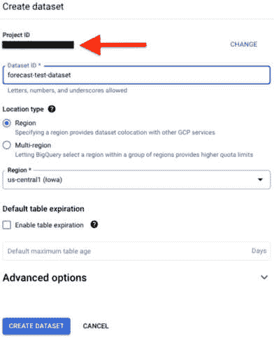

图 4.10：创建 BigQuery 数据集

1.  就这样 – 目前在 BigQuery 中我们不需要做任何事情。

### 创建 AutoML 工作负载

现在，是时候定义将要自动化我们数据科学项目中所有步骤的 AutoML 作业了。作为提醒，模型生命周期的步骤在*图 4.11*中显示：


图 4.11：由 AutoML 管理的 ML 模型生命周期

如我们所见，该过程的第一个步骤是摄取一些数据。我们需要为此创建一个数据集。我们将使用 Kaggle 的一个公共数据集，这是一个练习 ML 概念的宝贵资源。预测用例通常需要**时间序列**数据，这是一种按时间间隔按时间顺序排列的数据序列。因此，我们的数据集将需要包含一个时间戳字段。我们将在本书的后面部分深入了解模型训练和部署的工作原理，但现在，我们将专注于 Vertex AI AutoML 如何使我们能够轻松地训练预测模型，而无需太多或任何 AI/ML 专业知识。请注意，Vertex AI AutoML 也可以用于分类和回归用例。

在我们的示例中，我们将使用*道琼斯工业平均指数 30 种股票时间序列*数据集的一个子集，该数据集可在[`www.kaggle.com/datasets/szrlee/stock-time-series-20050101-to-20171231`](https://www.kaggle.com/datasets/szrlee/stock-time-series-20050101-to-20171231)找到。

为了参考，数据包含以下字段：

+   `Date`: yy-mm-dd 格式

+   `Open`: 市场开盘时的股价（这是 NYSE 数据，因此所有数据均为美元）

+   `High`: 当日达到的最高价

+   `Low Close`: 当日达到的最低价

+   `Volume`: 交易的股票数量

+   `Name`: 股票的股票代码

在您在本章早期在本地上创建的 GitHub 仓库的副本中，您将在名为`data`的目录中找到该文件的修改版本，该目录位于名为`Chapter``0``4`的目录中。修改后的文件名为`automl-forecast-train-1002.csv`。

因此，您应该在您的本地机器上的以下路径中找到文件（如果您使用的是 Microsoft Windows，则斜杠将被反转）：`[您克隆我们的 GitHub 仓库的位置]/``Chapter-04``/data/automl-forecast-train-1002.csv`。

要在 Google Cloud 中创建我们的数据集，请执行以下步骤：

1.  在 Google Cloud 控制台中，导航到**Google Cloud 服务**菜单 → **Vertex AI** → **数据集**。

1.  选择`my-forecasting-dataset`。

1.  您还将被要求选择数据类型和目标。选择**表格**，然后选择**预测**。您的选择应类似于*图 4**.12*所示。

1.  选择您首选的区域，然后选择**创建**（请注意，这必须与您在上一节中创建 BigQuery 数据集的区域相同）：

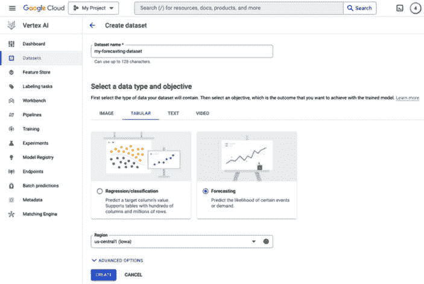

图 4.12：创建数据集

1.  接下来，我们需要向数据集中添加数据。选择**从您的计算机上传 CSV 文件**，然后点击**选择文件**。参见*图 4**.13*以获取参考：

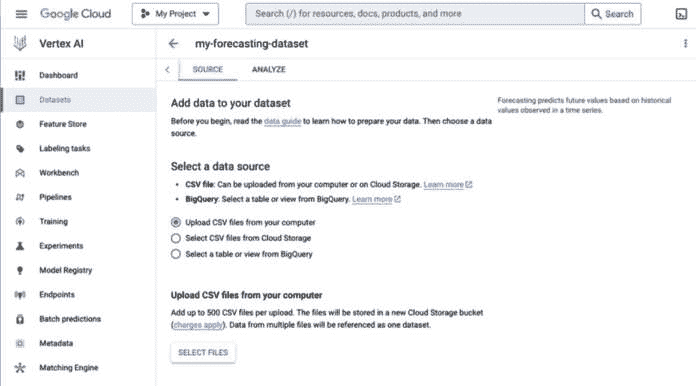

图 4.13：将数据添加到您的数据集中

1.  从以下路径选择文件（如果您使用的是 Microsoft Windows，则斜杠将被反转）：

    ```py
    [Location in which you cloned our GitHub repository]/Chapter-04/data/automl-forecast-train-1002.csv
    ```

1.  在**云存储路径**输入字段中，选择**浏览**。

1.  我们将为此用例创建一个新的 Cloud Storage 存储桶。为此，点击右上角看起来像带有加号的存储桶符号()。

1.  为存储桶提供一个唯一的名称并选择**创建**（你可以保留所有存储桶配置选项的默认值）。

1.  如果你被提示防止公开访问，请选择**确认**。这将防止你的存储桶中的任何项目被公开，这是一个最佳实践，除非你特别想创建公开可访问的内容。在这个例子中，我们不需要创建公开可访问的内容。

1.  当你的存储桶创建完成后，点击屏幕底部的**选择**。这样，你的存储桶现在是我们训练数据的存储位置。结果屏幕应类似于*图 4.14*中所示：

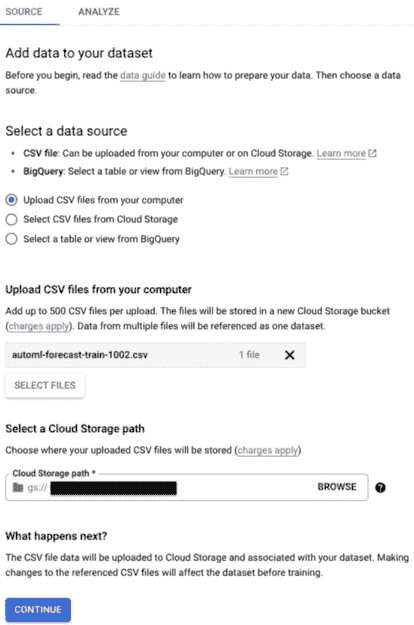

图 4.14：向数据集添加数据

1.  选择**继续**。

1.  当文件上传完成后，你应该会看到一个消息说上传已完成。现在，我们准备开始训练我们的模型！

1.  在你的数据集详情屏幕上，选择标有**训练** **新模型**的按钮。

1.  在出现的下一个屏幕上，选择**AutoML（默认）**。

1.  接下来，按照以下方式输入 AutoML 工作负载的详细信息（参见*图 4.15*中的最终配置详细信息）：

    1.  数据集名称将自动作为工作负载的名称。你可以保留默认值，或者根据需要更改名称。

    1.  我们将尝试预测每个日期公司股票的销量，因此选择 `[project_name].[dataset_name].[table_name]`，其中我们有以下内容：

        1.  `project_name`是你的 Google Cloud 项目的名称（提示：记得在创建 BigQuery 数据集时在 BigQuery 控制台中看到过）。

        1.  `dataset_name`是你创建的 BigQuery 数据集的名称；例如，`table_name`是用于存储测试输出的表的名称。你可以在这里输入任何名称，该名称将被分配给创建的表。*需要注意的是，此表将由我们的 AutoML 作业创建，因此在此点之前不得手动在 BigQuery 中创建。只需创建数据集即可；不是数据集内的表。*

        1.  当你输入了数据集详细信息后，点击**选择**。数据集路径将出现在**BigQuery 路径**输入字段中：

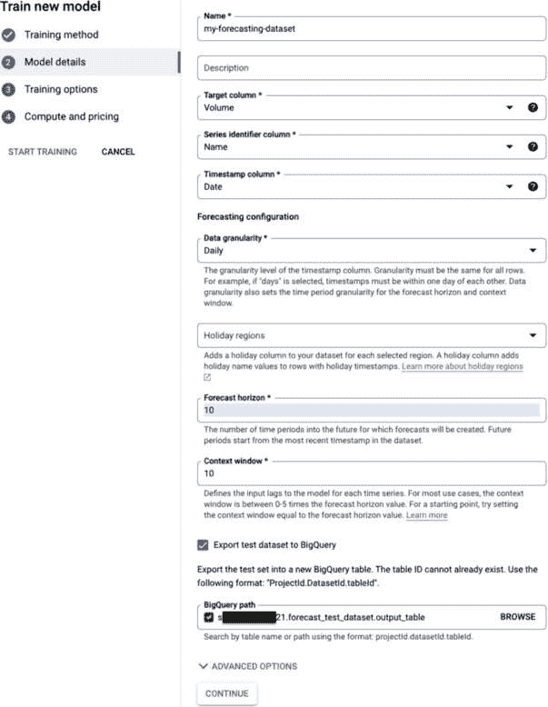

图 4.15：模型详情

1.  选择**继续**。

1.  在出现的**训练选项**屏幕上，选择**关闭**、**高**、**低**和**开盘**列旁边的复选框。

1.  当你这样做时，屏幕顶部附近将出现四个蓝色文本菜单（参见 *图 4**.16* 以获取参考）。点击 **特征类型** 菜单并选择 **协变量**。这是一个必填步骤，它表示训练数据集中的这些列包含随时间变化的值：

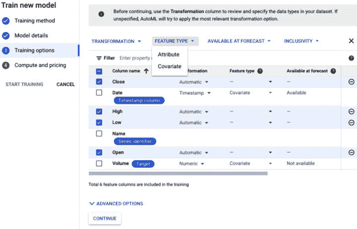

图 4.16：训练选项

1.  选择 **继续**。

1.  在输入字段中的 `1` 上（参见 *图 4**.17* 以获取参考）：

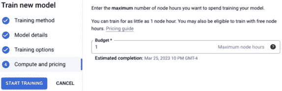

图 4.17：计算和定价预算

1.  选择 **开始训练**。

1.  要监控我们的训练作业，我们可以从屏幕左侧的菜单中选择 **训练**。

1.  当我们的作业状态变为 **完成** 时，我们的模型已经训练完成，我们可以开始使用它来获取预测。

注意

由于 AutoML 流程中的各种步骤以及“节点小时”的概念，作业可能运行超过 1 小时。

恭喜！您已在 Google Cloud 上训练了您的第一个机器学习模型。让我们看看有关我们模型的一些细节。

### 查看模型详情

当我们的模型训练作业状态变为 **完成** 时，我们可以点击训练作业的名称并查看有关我们模型的大量有用细节（参见 *图 4**.18* 以获取参考）。在屏幕顶部，我们可以看到各种性能指标，例如 **平均绝对误差**（**MAE**）、**平均绝对百分比误差**（**MAPE**）以及其他指标。您可以在每个旁边的问号符号上点击以了解更多信息。我们还会在本书的后续章节中更详细地讨论这些指标。

另一个有用的信息是 **特征重要性**，它显示每个输入特征似乎对模型输出的影响程度。这对于理解我们的模型如何工作非常重要。

你能想到这些功能中的每一个如何可能影响股票预测销量吗？例如，当股票价格低时，人们会购买更多该股票吗？如果这是真的，那么表示每天股票最低价点的 **低** 特征在预测某一天会卖出多少该股票时很重要，这有意义吗？

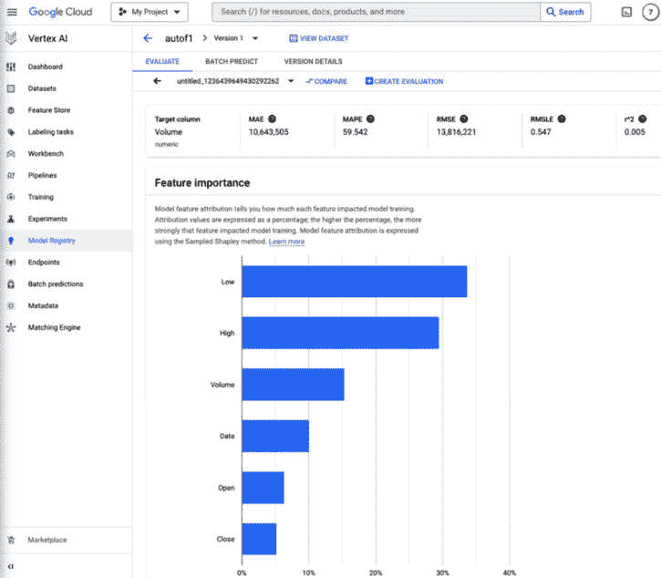

图 4.18：模型指标

除了我们模型的表现指标外，让我们看看我们模型在 AutoML 工作负载执行过程中的测试过程中做出的某些预测。

### 查看模型预测

要查看由我们的 AutoML 作业生成的某些模型输出，我们需要查看我们创建的用于存储这些输出的 BigQuery 表。为此，执行以下步骤：

1.  在 Google Cloud 控制台中，导航到 **Google Cloud 服务** 菜单 → **BigQuery**。

1.  在屏幕左上角，点击您的项目名称，然后点击您的数据集名称，然后点击表的名称。

1.  您将看到表的架构。

1.  点击 **预览** 选项卡；将显示输出数据的预览。

1.  向右滚动；您将看到名为 **predicted_Volume.value** 和 **predicted_on_Date** 的列。这些列显示了我们的模型预测输出。

重要的是要注意，我们只允许我们的作业运行了 1 个节点小时，因此我们的预测值可能在此点不准确。一个 AutoML 作业通常需要运行更长的时间来找到最佳模型。这是从成本角度需要考虑的事情。如果您的预算允许，尝试运行 AutoML 作业更长时间，看看它如何影响模型性能。

# 摘要

在本章中，您学习了如何使用 Google Cloud 的高级 AI/ML API，通过使用由 Google 训练和维护的模型来实现 AI/ML 功能。然后，您继续使用 Vertex AI AutoML 训练自己的 ML 模型。所有这些都是在 Google Cloud 的完全托管服务帮助下完成的。在下一章以及之后，我们将更深入地探讨，您将从头开始构建自己的模型，以便更详细地了解模型开发生命周期中的每个步骤是如何工作的。
