# 5

# 在 Google Cloud 上构建自定义 ML 模型

在上一章中，我们通过让谷歌为我们完成所有工作来实现 AI/ML 工作负载。现在，我们将通过在 Google Cloud 上从头开始构建自己的模型来提升我们的知识和技能到专家水平。

我们将使用在数据科学项目中常用的流行软件库，并将开始实现我们在前几章中讨论的一些概念，例如**无监督机器学习**（**UML**）和**监督机器学习**（**SML**），包括聚类、回归和分类。

本章涵盖以下主题：

+   背景信息 – 库

+   在 Vertex AI 上使用 scikit-learn 实现 UML

+   在 Vertex AI 上使用 scikit-learn 实现回归模型

+   在 Vertex AI 上使用 XGBoost 实现分类模型

# 背景信息 – 库

在我们深入探讨并开始构建自己的模型之前，让我们花一点时间讨论一下本章中我们将使用的软件库。

定义

软件库是一组代码和数据，包括用于特定类型编程任务的实用函数和工具。当在某个行业中识别出常见的编程任务类型，例如数据处理或实现复杂的数学方程式时，通常有人最终会创建一个包含执行这些任务所需的代码和其他资源的库。然后，其他人可以轻松地使用这个库来完成相同的任务，并可能随着时间的推移扩展以添加更多功能，而不是每个人都需要反复编写执行这些常见任务的代码。没有库，程序员将不得不每次从头开始构建一切，并将浪费大量时间在基础编程任务上。在本章中，我们将使用 scikit-learn、Matplotlib 和 XGBoost 等库。在本书的后期，我们将使用其他库，如 TensorFlow 和 PyTorch，并在各自的章节中更详细地描述这些库。

## scikit-learn

scikit-learn，也称为`sklearn`，是一个内置了许多有用的数据科学工具和实践数据集的开源 Python 库。它就像是数据科学的“瑞士军刀”，对于初涉数据科学领域的从业者来说，它是开始机器学习项目的热门起点，因为它相对容易上手，正如你将在本章中看到的。

## Matplotlib

在*第二章*中，我们讨论了几乎存在于所有数据科学项目中的典型阶段，以及其中有一个阶段专注于数据探索。我们还讨论了“可视化”通常是数据探索阶段的一个重要部分，在这个阶段，数据科学家和工程师使用工具来创建其数据集特性的视觉表示。这些视觉表示，如图表，可以帮助数据科学家和工程师更好地理解数据集，以及这些数据集如何受到在数据科学项目中执行的各种实验和转换的影响。数据科学家和工程师还经常希望构建表示其数据科学项目活动其他方面的可视化，例如帮助确定模型性能的指标的增加或减少。用 Matplotlib 的开发者的话说，“*Matplotlib 是一个用于在 Python 中创建静态、动画和交互式可视化的综合性库。*”因此，Matplotlib 是创建数据视觉表示的常用库。

## pandas

pandas 是一个用于数据操作和分析的 Python 库。它用于数据探索以及执行数据转换。例如，使用 pandas，我们可以从文件或其他数据源读取数据，预览数据的一个子集以了解其内容，并对数据集进行统计分析。然后，我们还可以使用 pandas 对数据进行更改，以准备训练机器学习模型。

## XGBoost

在*第一章*中，我们讨论了梯度下降的概念在机器学习模型训练过程中的常用性。XGBoost 是一个基于**梯度提升**概念的流行机器学习库，它使用**集成**方法，结合了许多小型模型（通常被称为**弱学习器**）来创建一个更好的整体预测模型。在梯度提升的情况下，训练过程中的每一迭代都会训练一个小型模型。几乎在每一个模型训练过程中，产生的模型都会做出一些错误的预测。在梯度提升过程中的下一迭代将基于前一个模型所犯的**残差误差**来训练模型。这有助于在后续的每一迭代中“提升”训练过程，目的是创建一个更强的预测模型。XGBoost，代表极端梯度提升，克服了先前梯度提升算法的顺序限制，并且可以并行训练数千个弱学习器。我们将在本章后面更详细地描述 XGBoost 的工作原理。

注意

通常，“集成”模型训练的概念指的是将许多弱模型组合起来以创建更好的或“更强”的整体预测机制，通常被称为“元模型”。提升只是集成方法的一个例子。其他例子包括“Bagging”（或“Bootstrap Aggregation”），它在数据的子集上训练许多弱学习器，以及“Stacking”，它可以用来结合使用完全不同算法训练的模型。在每个情况下，目的是构建比任何单个模型单独实现更有用的预测机制。

根据集成方法的实现，集成中每个模型的预测可以以不同的方式组合，例如求和或平均，或者在分类用例中，可能实现投票机制以确定最终的最佳预测。

# 本章的先决条件

就像在前一章中一样，我们将在开始本章的主要活动之前执行一些初始活动。

Google Cloud 使得开始使用我们在前几节中描述的数据科学库变得更加容易，因为我们可以使用已经安装了这些库的 Vertex AI Workbench 笔记本。如果您想在 Vertex AI 之外使用这些库，您需要自行安装它们。

考虑到我们将使用 Vertex AI 笔记本，并且不需要显式安装库，因此本书中不会包含如何安装的细节。如果您想在其他环境中安装库，包括**Google Compute Engine**（**GCE**）或**Google Kubernetes Engine**（**GKE**），您可以在每个库的相应网站上找到安装说明，例如：

+   [`scikit-learn.org/stable/install.xhtml`](https://scikit-learn.org/stable/install.xhtml)

+   [`matplotlib.org/stable/users/installing/index.xhtml`](https://matplotlib.org/stable/users/installing/index.xhtml)

+   [`pandas.pydata.org/docs/getting_started/install.xhtml`](https://pandas.pydata.org/docs/getting_started/install.xhtml)

+   [`xgboost.readthedocs.io/en/stable/install.xhtml`](https://xgboost.readthedocs.io/en/stable/install.xhtml)

接下来，我们将更详细地讨论 Vertex AI Workbench 笔记本，以及如何创建一个笔记本。

注意

在本章的后面部分，您将看到导入这些库的代码片段。这并不等同于安装。这些库已经安装在我们的 Vertex AI Workbench 笔记本中，但我们只需要将它们导入到笔记本上下文中才能使用。

## Vertex AI Workbench

Vertex AI Workbench 是 Google Cloud 中的一个开发环境，它使您能够在 Vertex AI 内管理所有 AI/ML 开发需求。它基于 Jupyter 笔记本，提供了编写和运行代码的交互式界面。这使得笔记本非常灵活，因为您不仅可以与更广泛的 Vertex AI 生态系统进行编码交互，还可以与其他 Google Cloud 服务 API 进行交互。

### Vertex AI Workbench 笔记本

在 Vertex AI Workbench 中，您可以使用以下三种类型的笔记本：

+   管理笔记本，正如其名所示，由 Google 为您管理。这些对于许多用例来说是一个很好的默认选项，因为它们内置了许多有用的工具，并且已经准备好在 Google Cloud 上使用。它们在 JupyterLab 环境中运行，这是一个基于网页的交互式开发环境，用于笔记本。

+   用户管理笔记本，正如其名所示，由您管理。如果需要对我们环境进行重大定制，则这些笔记本是合适的。它们是 Google Cloud 深度学习 VM 的可定制实例，这些 VM 是包含用于实现 **深度学习**（**DL**）工作负载的工具的 **虚拟机**（**VM**）镜像。然而，这些笔记本不仅可以用于深度学习用例。

+   Vertex AI Workbench **实例**，这是 Google Cloud 在 2023 年晚些时候发布的新选项。这些可以被视为前两种选项的混合体，并且可能会随着时间的推移成为主要选项。在撰写本文的 2023 年 9 月，此选项目前仅以预览模式提供，因此我们现在将继续使用 *选项 1* 和 *2*。

Google 还提供了一种名为 Colab 的服务，这是一个非常流行的服务，允许您通过公共互联网运行免费的笔记本。在 2023 年晚些时候，Google Cloud 还发布了一个名为 Colab Enterprise 的选项，使客户能够在自己的 Google Cloud 环境中使用 Colab。在撰写本文时，Colab Enterprise 也仅以预览模式提供。

管理笔记本和用户管理笔记本正在被弃用，因此在这本书中，我们将主要使用最新的选项：Vertex AI Workbench 实例。让我们现在就创建一个。

## 创建 Vertex AI Workbench 实例

要创建 Vertex AI Workbench 实例，请执行以下步骤：

注意

对于这些说明中没有明确提到的配置参数，请将这些参数保留在默认值。

1.  在 Google Cloud 控制台中，导航到 Google Cloud 服务菜单 → **Vertex AI** → **Workbench**。

1.  选择 **实例** 选项卡并点击 **创建新实例**。

1.  在出现的侧面板中（参见 *图 5**.1* 以获取参考），为您的笔记本输入一个名称。或者，您可以使用该输入字段中自动生成的默认名称：

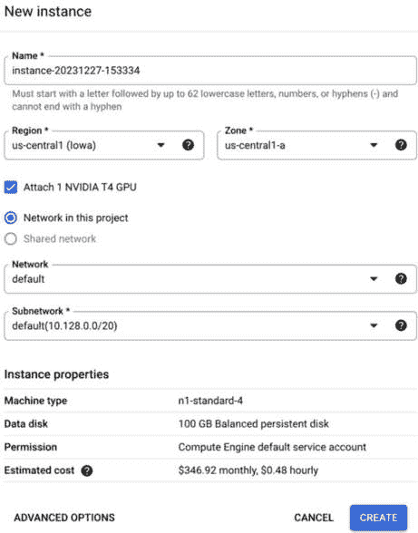

图 5.1：新建实例对话框

1.  选择您首选的区域。

1.  选择附加 GPU 的选项（在撰写本文时，您应该选择标有**附加 1 个 NVIDIA T4 GPU**的框）。参见*图 5**.1*以获取参考。

1.  目前请将网络配置细节保留为默认值。

1.  在侧面板的底部，点击**高级选项**。

1.  在随后出现的屏幕上（参见*图 5**.2*以获取参考），确保选中**启用 Dataproc**的选项并点击**继续**（您可能需要向下滚动以看到**继续**按钮）：

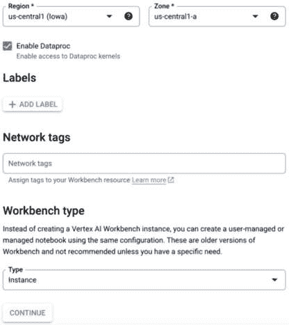

图 5.2：新实例对话框（继续）

1.  在随后出现的屏幕上（即环境配置屏幕），选择**使用最新版本**并点击**继续**。

1.  在随后出现的屏幕上，您可以使用所有默认值（除非您有更改任何内容的偏好）并点击**继续**。

1.  您可以点击两次**继续**按钮（即接受下一两个屏幕上的默认值，除非您有更改的偏好）直到达到**网络**配置屏幕。

1.  在**网络配置**屏幕上，确保选中**分配外部 IP 地址**的选项。

1.  除非您有特定的网络配置需求，否则您可以直接使用项目中默认的网络。

1.  点击**继续**。

1.  在随后出现的屏幕上（即**IAM & 安全**屏幕），确保**安全选项**部分中的所有选项都已选中。

1.  选择屏幕底部的**创建**，并等待几分钟以创建笔记本。

    当笔记本运行起来时，笔记本名称左侧将出现一个绿色的勾选标记。

1.  最后，点击**打开 JupyterLab**。

在此阶段，我想强调一组重要的集成和功能，这是 Google Cloud 在 Vertex AI Notebooks 的 JupyterLab 界面中添加的。

## Vertex AI Notebook JupyterLab 集成

在您的 Vertex AI Notebook 实例的 JupyterLab 界面中，您会在屏幕的左侧注意到一组图标，如图*图 5**.3*所示：

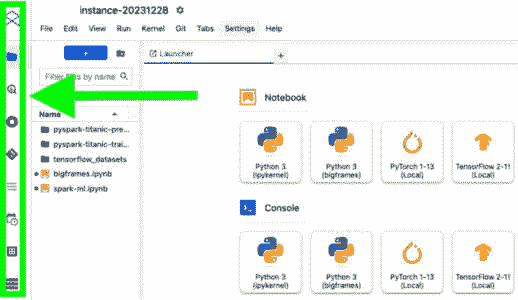

图 5.3：Google Cloud JupyterLab 集成

这些图标代表我们可以在 Vertex AI 的 JupyterLab Notebook 实例中直接使用的集成。例如，如果我们点击 BigQuery 图标，我们可以看到我们的 BigQuery 数据集，我们甚至可以使用集成的 SQL 编辑器直接从 JupyterLab Notebook 界面运行 SQL 查询。

我建议点击各种图标来了解更多关于它们的功能。其他有用的功能包括与 Google Cloud Storage 集成的能力以及一个允许我们安排笔记本执行选项。后者对于需要定期自动重复的工作负载非常有用，这在数据科学中是一个常见需求（例如，每天对新数据进行重新训练、评估和部署模型）。

现在笔记本实例已经创建，我们将克隆我们的 GitHub 仓库，以便我们可以访问我们的笔记本代码并跟随本章的活动。

## 克隆 GitHub 仓库

克隆我们的 GitHub 仓库是将本章动手活动的所有资源快速导入到 Google Cloud Vertex AI 笔记本实例中的最简单方法。要将我们的仓库克隆到笔记本中，请执行以下步骤：

1.  点击屏幕左侧菜单中的**Git**符号。符号看起来像*图 5.4*中所示：


图 5.4：Git 符号

1.  选择**克隆仓库**。

1.  输入我们的仓库 URL：[`github.com/PacktPublishing/Google-Machine-Learning-for-Solutions-Architects`](https://github.com/PacktPublishing/Google-Machine-Learning-for-Solutions-Architects).

1.  如果有任何选项显示，请保留它们的默认值。

1.  选择**克隆**。

1.  你应该会在笔记本中看到一个新文件夹出现，命名为`Google-Machine-Learning-for-Solutions-Architects`。

现在，我们已经准备好开始使用我们的笔记本实例了！让我们继续到下一节，我们将进行一些无监督训练。

# 在 Vertex AI 上使用 scikit-learn 进行 UML

在本节中，我们将开始使用我们的 Vertex AI Workbench 笔记本来训练模型。我们将从一个相对简单的用例开始，我们将创建一个无监督模型来发现数据中的聚类模式。在我们深入代码之前，我们将先花一分钟讨论我们将在本节中使用的聚类算法，它被称为 K-means。

## K-means

你可能还记得我们在*第一章*中讨论了**无监督学习**（**UL**）机制，例如聚类。记住，在聚类中，数据点根据模型观察到的特征或特征之间的相似性被分组在一起。*图 5.5*提供了这个概念的可视化表示，显示了左侧的输入数据和右侧的结果数据聚类：

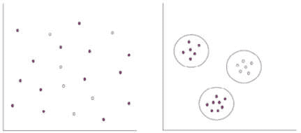

图 5.5：聚类

K-means 是聚类算法的一个例子，它被归类为中心点聚类算法。这意味着它选择一个**中心点**，这是一个代表我们每个簇中心的点。每个簇的成员是我们数据集中的数据点，它们在每个簇中的成员资格将取决于它们与每个中心点距离的数学评估。从每个中心点的这种邻近度或距离通常用欧几里得距离来计算，如方程 5.1 所示：


方程 5.1：欧几里得距离

别担心——我们将会更详细地讨论这个问题。图 5.5 中显示的图表代表所谓的特征空间，并且显示了我们的每个数据点在特征空间中的位置。在上述图表的情况下，它们代表一个二维特征空间，每个数据点都有一个 *x* 和 *y* 坐标，这些坐标代表了数据点在特征空间中的位置。也就是说，*x* 和 *y* 坐标是每个数据点的特征。如果我们从图表上取任意两点，欧几里得距离就是这两点之间直线距离，这个距离是通过将 *x* 和 *y* 坐标（即每个数据点的特征）代入图 5.1 中所示的方程来计算的。

数据点可以作为其特征具有比 *x* 和 *y* 坐标更多的坐标，这个概念也适用于更高维度的特征空间。

让我们用一个比 *x* 和 *y* 坐标更具体的例子来说明。我们的数据集可能包括有关零售公司客户的详细信息，每个客户的特征可能包括他们的年龄、他们居住的城市以及他们在公司商店最近一次访问中购买的商品。聚类算法如 K-means 可以通过寻找他们特征与每个组中心点之间的相似性来将这些客户分组。

讨论 K-means 时经常出现的一个问题是：如何选择质心？例如，算法如何知道使用多少个质心，以及在哪里放置它们在特征空间中？让我们首先解决质心的数量问题。这被指定为算法的“超参数”。这意味着你可以告诉算法使用多少个质心（因此形成多少个簇）。实际上，这反映在名称“K-means”中，其中 K 代表质心或簇的数量。你通常会尝试不同的质心数量，直到找到一个值，该值最大化获得的信息量并最小化每个簇中的方差。用于找到 K 的最佳值的机制通常被称为“肘部方法”。使用肘部方法，我们在不同 K 值的范围内对数据集运行 K-means 聚类（例如 1-10）。然后，对于每个 K 值，计算所有簇的平均得分。默认计算的得分称为**畸变**。畸变表示每个点与其分配的簇中质心的平方距离之和，这再次与*方程 5.1*相关。如果你将 K 值与每次运行中的畸变得分进行绘图，你通常会注意到畸变得分随着 K 值的增加而下降。畸变得分通常会开始急剧下降，最终开始以更小的增量下降。当添加新的簇（即增加 K 值）不再显著减少畸变得分时，你通常可以认为已经找到了 K 的最佳值。

现在，让我们讨论算法如何在特征空间中放置质心的位置。它首先在特征空间中随机放置它们，并将数据点随机分配给每个质心。然后，它重复以下步骤，直到每个簇中没有新的数据点被添加，此时认为已经计算出了最佳的聚类位置：

1.  计算哪些数据点最接近质心，并将它们分配给该质心。

1.  计算这些点的平均值（均值）。

1.  移动质心。

现在我们已经涵盖了 K-means 聚类的理论，让我们继续到有趣的部分，即实际实现算法。

## 在 Vertex AI 中实现 UML 工作负载

我们将在 scikit-learn 中使用 K-means 算法来开始实现我们的 Vertex AI 中的 UML 工作负载。在 scikit-learn 中使用 K-means 的一个典型的聚类示例是使用所谓的鸢尾花数据集，以找到数据中的聚类模式。正如其名所示，鸢尾花数据集包含了各种鸢尾花的数据。

商业案例

我们的公司 *BigFlowers.com* 最近收购了一家较小的花店，在这个过程中，我们获得了他们所有的数字资产，包括包含他们花卉库存的数据集。不幸的是，他们没有很好地记录他们的数据集，所以我们不清楚他们的库存中有什么。

我们的任务是尽可能多地了解花卉库存的内容，因此我们将使用一些数据分析工具和机器学习模型来了解更多关于数据集的信息。我们将要做的第一件事是尝试找到任何模式，例如逻辑分组，这可能有助于我们了解数据集中是否存在不同的对象类别，以及额外的信息，例如存在多少不同的类别。

*注意*：在撰写本文时，公司 *BigFlowers.com* 并不存在，我们在这里的练习仅用于示例目的。

要开始这项任务，请导航到您在上一节中创建的 Vertex AI 笔记本中的 `Google-Machine-Learning-for-Solutions-Architects` 文件夹。然后，导航到 `Chapter-05` 文件夹，双击 `Chapter-5.ipynb` 文件（如果提示，请选择 `Python` 内核），并执行以下步骤。

1.  在我们的笔记本中，我们首先需要导入所需的资源，例如 scikit-learn 的 K-means 类，以及 pandas 和 Matplotlib 库。我们还将导入一个从 scikit-learn 加载 iris 数据集的函数。要执行这些操作，请将以下代码输入到笔记本中的交互式提示（或使用您从 GitHub 克隆的笔记本）中。笔记本中的以下代码执行了这些步骤：

    ```py
    from sklearn.cluster import KMeans
    from sklearn.datasets import load_iris
    import pandas as pd # for exploring our data
    import matplotlib.pyplot as plt # for plotting our clusters
    from mpl_toolkits.mplot3d import Axes3D # Specifically for creating a 3-D graph
    ```

1.  要执行代码，请按住键盘上的 *Shift* 键，然后按 *Enter* 键。考虑到代码只是导入库，除非发生错误，否则您不会在屏幕上看到任何输出。

注意

从现在开始，当我们进行 Vertex AI Workbench 笔记本中的活动时，我们将只为每个步骤提供代码示例，这表示您需要将此代码输入到笔记本中下一个可用的空单元格中（除非您正在使用已包含代码的克隆笔记本），然后执行单元格，就像您之前处理那段代码一样。

注意

在 Jupyter 笔记本中每个单元格的左侧，有一个看起来像这样的方括号符号：**[ ]**

这可以用来了解单元格的状态，指标如下：

**[ ]**（空）：该单元格尚未执行。

**[*]**（星号）：该单元格正在执行。

**[1]**（任何数字）：该单元格已执行完成。

1.  接下来，我们将读取 iris 数据集：

    ```py
    # Load the iris dataset:
    iris = load_iris()
    # Assign the data to a variable so we can start to use it:
    iris_data = iris.data
    ```

1.  让我们使用 pandas 获取有关我们数据集的一些信息：

    ```py
    # Convert the dataset to a pandas data frame for analysis:
    iris_df = pd.DataFrame(iris_data)
    # Use the info() function to get some information about the dataset
    iris_df.info()
    ```

    输出应类似于 *图 5.6* 中所示：

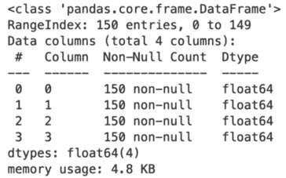

图 5.6：pandas.DataFrame.info() 输出

1.  `info()` 函数的输出显示我们的数据集包含什么类型的数据。在这种情况下，我们可以看到它包含 150 行（从 0 到 149 索引）和 4 列（从 0 到 3 索引），并且每个单元格中的数据值是浮点数。我们的数据集中的每一行都是一个数据点，它代表一朵特定的鸢尾花，每一列是数据集中的一个特征。如果我们查看 scikit-learn 文档中关于鸢尾花数据集的描述，该描述可以在 [`scikit-learn.org/stable/datasets/toy_dataset.xhtml#iris-dataset`](https://scikit-learn.org/stable/datasets/toy_dataset.xhtml#iris-dataset) 找到，我们可以看到特征是：

    1.  萼片长度（厘米）

    1.  萼片宽度（厘米）

    1.  花瓣长度（厘米）

    1.  花瓣宽度（厘米）

    从这个例子中，我们可以理解我们数据集中每个单元格中的浮点数是测量每朵花四个方面的值。

1.  我们还可以预览数据的一个子集，以查看每个单元格的实际值，如下所示：

    ```py
    iris_df.head()
    ```

    输出应类似于 *图 5.7* 中所示：

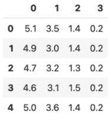

图 5.7：pandas.DataFrame.head() 输出

1.  现在，我们将使用 K-means 根据数据集的特征将相似的数据点分组在一起。首先，我们创建了一个 K-means 模型的实例，并指定它将有三簇，因为在这种情况下，数据集文档告诉我们我们的数据集中有三种不同的鸢尾花类别。如果我们不知道需要使用多少簇，那么我们可以尝试不同的簇数，并使用肘部方法找到最佳数量：

    ```py
    kmeans_model = KMeans(n_clusters=3)
    ```

1.  在这一点上，我们已经定义了我们的模型，但它还没有从我们的数据中学习到任何东西。接下来，我们指示模型“拟合”到我们的数据集。术语 *fit* 被许多算法用来指代训练过程，因为在训练过程中，这正是算法试图做的事情；它试图创建一个尽可能精确地（不发生过拟合）拟合给定数据集的模型：

    ```py
    kmeans_model.fit(iris_data)
    ```

1.  当我们的模型完成训练过程后，我们现在可以使其对数据进行聚类。我们将原始数据集输入到模型中，根据它在训练期间学习的模式，它将根据定义的每个簇放置数据点：

    ```py
    kmeans_model.predict(iris_data)
    ```

1.  最后，我们将模型的标签存储在一个变量中，这样我们就可以在下一个单元中可视化簇：

    ```py
    labels = kmeans_model.labels_
    ```

1.  接下来，我们将可视化 K-means 创建的簇：

    ```py
    # Create a figure object:
    fig = plt.figure()
    # Define the axes (note: the auto_add_to_figure option will default to False from mpl3.5 onwards):
    axes = Axes3D(fig, auto_add_to_figure=False)
    # Add the axes to the figure:
    fig.add_axes(axes)
    # Create the scatter plot to graph the outputs from our K-means model:
    axes.scatter(iris_data[:, 2], iris_data[:, 3], iris_data[:, 1],
        c=labels.astype(float))
    # Set the labels for the X, Y, and Z axes:
    axes.set_xlabel("Petal length")
    axes.set_ylabel("Petal width")
    axes.set_zlabel("Sepal width")
    ```

1.  生成的图表应类似于 *图 5.8* 中所示的图表。注意我们如何在图表中看到三个不同的数据点簇，每个不同的簇都按紫色、绿色或黄色进行着色编码：

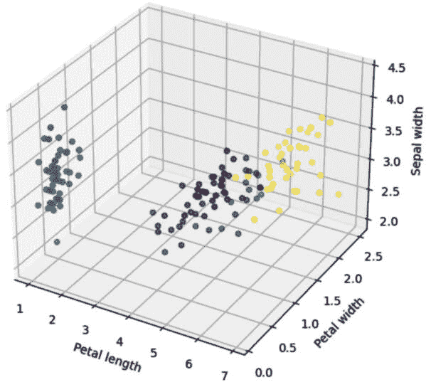

图 5.8：K-means 聚类图

这为我们提供了一些有用的信息。我们可以看到数据集中的三个不同的数据点类别或聚类，其中数据点与其同一聚类中的其他点具有相似的特征，但与其他聚类中的数据点不同。我们无需对数据集进行标记就能获得这些见解，考虑到标记是一个耗时且容易出错的任务，这非常有用。

注意

尽管我们的数据集包含四个特征（也称为“维度”），但人类只能看到/可视化三维的东西。因此，我们只使用了四个特征中的三个来创建我们的图表。以下是我们定义用于图表中的特征的行，其中数字代表要使用的特征：

**axes.scatter(iris_data[:, 2], iris_data[:, 3], iris_data[:,** **1], c=labels.astype(float))**

你可以尝试通过将每个数字更改为 0 到 3 之间的任何值来玩转这个图表，只要每个条目都是唯一的值（也就是说，在代码中不要重复任何数字）。

每次你进行更改时，都可以再次执行单元格以更新图表。

现在我们已经看到了在 Vertex AI 中实现 UML 工作负载需要什么，接下来让我们继续学习如何在下一节中实现 SML 工作负载。

# 在 Vertex AI 上使用 scikit-learn 实现回归模型

我们将在 Vertex AI 工作台中构建的第一个 SML 模型是一个线性回归模型。你可能还记得我们在 *第一章* 中描述了线性回归。

商业案例

我们在 *BigFlowers.com* 的老板在工作场所举办了一场有趣的竞赛。员工被要求预测当给出与该花朵相关的其他测量值时，鸢尾花花瓣的长度，例如萼片长度、萼片宽度和花瓣宽度。预测最准确的人将获得一份大奖，员工可以使用技术来帮助他们进行预测，因此我们将构建一个机器学习模型来帮助我们做出这些预测。

在上一节中，我们使用了 scikit-learn 中的 K-means 算法。在本节中，我们将使用 scikit-learn 中的线性回归算法。因此，我们需要将 `LinearRegression` 类导入我们的笔记本上下文中。我们还将导入一个函数，该函数将计算 **均方误差**（**MSE**）指标，我们在 *第二章* 中描述了该指标，它通常用于评估线性回归模型。

我们可以使用相同的花瓣数据集来构建我们的线性回归模型，因此我们不需要重复之前的任何数据集导入步骤，因为它已经加载到我们的笔记本上下文中。这是一个需要注意的重要概念；我们可以根据业务用例和期望的结果，在相同的数据上使用不同类型的模型。然而，正如我们在*第二章*中讨论的，SML 模型训练引入了一些关于数据集使用方面的额外要求，我们将在下面进行描述。

记住

在**监督学习**（SL）用例中，我们需要定义数据集中哪一列被指定为“目标”特征。这是我们试图根据数据集中的其他特征进行预测的特征。在训练过程中，该列的一些元素被用作标签，代表模型学习的已知、正确的答案。

数据集中其他特征的值用作输入。在预测过程中，模型使用它所学习到的所有输入特征与目标特征之间的关系，根据输入特征的值来预测目标特征的值。

此外，请记住，在 SL 用例中，我们通常将数据集分为训练、验证和测试等子集。训练数据集，正如其名所示，是模型训练所用的数据。测试数据集是我们评估训练好的模型的方式（基于为该模型定义的指标），而验证集通常用于超参数调整。

*注意*：

我们将在后面的章节中探讨超参数调整。在我们当前的章节中，我们将训练一个单一的回归模型，然后直接对其进行测试，因此我们不需要从我们的数据中分离出一个验证子集。因此，我们将仅将数据集分为训练集和测试集。

要开始构建我们的线性回归模型，请执行以下步骤：

1.  从 scikit-learn 导入`LinearRegression`类，并导入一个将使我们能够将数据集分割成训练集和测试集的函数，以及一个将计算我们稍后用于评估模型性能的 MSE 指标的函数：

    ```py
    from sklearn.linear_model import LinearRegression
    from sklearn.metrics import mean_squared_error
    from sklearn.model_selection import train_test_split
    ```

1.  定义我们数据集中哪一列是我们想要用作预测目标特征的列：

    ```py
    target = iris_df[[2]]
    ```

记住：

在本章的前一节中，我们查阅了 iris 数据集的文档，并看到数据集中的列如下：花萼长度（厘米），花萼宽度（厘米），花瓣长度（厘米），花瓣宽度（厘米）。这些列从 0 到 3 索引。考虑到我们想要预测花瓣长度，我们已选择**iris_df**数据框的列 2 作为我们的目标列。

1.  接下来，定义我们的输入特征。在这种情况下，我们使用除了列 2 之外的所有特征列（因为我们已定义列 2 是我们的目标列）：

    ```py
    input_feats = iris_df[[0, 1, 3]]
    ```

1.  将我们的数据集分割成单独的训练集和测试集：

    ```py
    input_train, input_test, target_train, target_test = \
        train_test_split(input_feats,target,test_size=0.2)
    ```

注意

将**test_size**变量的值设为 0.2 意味着原始数据集的 20%将被分离出来以创建测试数据集。剩下的 80%形成训练数据集。**input_train**和**input_test**数据集包含训练过程中使用的输入特征以及将用于测试训练模型的输入特征。**target_train**和**target_test**数据集包含训练和测试数据集的相应标签（即“正确答案”）。

1.  现在，让我们使用训练数据集来训练我们的线性回归模型，然后使用测试数据集来生成模型预测：

    ```py
    # Create an instance of a LinearRegression model
    lreg_model = LinearRegression()
    # Train the model by fitting it to the training data
    lreg_model.fit(input_train,target_train)
    # Use the test set to generate predictions
    target_predictions = lreg_model.predict(input_test)
    ```

记住

为了测试训练模型，我们将**input_test**特征发送给它，并要求它根据**input_test**特征的值预测相应的目标特征值。然后我们可以将模型的预测与**target_test**值（即已知的、正确的答案）进行比较，以查看其预测与正确、预期的值有多接近。

1.  最后，是时候看看我们的模型基于`input_test`数据做出了哪些预测了！

    ```py
    pred_df = pd.DataFrame(target_predictions[0:5])
    pred_df.head()
    ```

    输出结果应类似于*图 5.9*所示，尽管数字可能不同（预测值位于右侧列，忽略顶部的数字 0，它是列标题）：

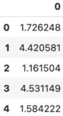

图 5.9：线性回归模型预测

1.  现在，让我们看一下`target_test`数据集中相应的已知、正确值：

    ```py
    target_test.head()
    ```

    输出结果应类似于*图 5.10*所示，尽管数字可能不同（数值位于右侧列，忽略顶部的数字 2，它是列标题）：

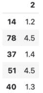

图 5.10：来自 target_test 数据集的已知、正确值

1.  如我们所见，在某些情况下数字非常接近。然而，让我们使用指标来评估模型的整体性能。为此，我们使用`mean_squared_error()`函数将预测与`target_test`数据集中的正确值进行比较，并生成 MSE 指标值：

    ```py
    mean_squared_error(target_test,target_predictions)
    ```

1.  值应类似于 0.08871798773326277。

    这是一个相当不错的数值，因为误差相当低，这意味着我们的模型在预测目标值方面做得很好。在这个阶段，我认为我们可能在预测鸢尾花花瓣长度的比赛中赢得那个大奖！

深入探讨前一小节中提到的各种数据集

我们在动手活动中的**train_test_split**函数从源数据集中创建了以下子集：

**input_train**：训练过程中使用的输入特征。

**input_test**：将用于测试训练模型的输入特征。

**target_train**: 在训练过程中使用的目标标签。在训练过程中，模型使用这些值作为它试图预测的已知、正确答案。这些是训练过程中的关键，因为在训练过程中，模型试图学习输入特征之间的关系，以帮助它尽可能准确地预测这些答案。

**target_test**: 在测试过程中使用的目标标签。这些是从原始数据集中分离出来的已知、正确答案，因此它们没有被包含在训练过程中。因此，模型在训练过程中从未见过这些值。然后我们使用这些值来测试训练后模型的性能。

现在我们已经看到了线性回归的实际应用，让我们继续进行我们的第一个 SL 分类任务。

# 在 Vertex AI 上使用 XGBoost 实现分类模型

到现在为止，你已经开始熟悉许多在数据科学项目中常用的流行库。在本节中，我们将开始使用另一个非常流行的库，XGBoost，它可以用于分类或回归用例。

尽管我们在本章开头简要介绍了 XGBoost，但在这里我们将更深入地探讨其工作原理，从决策树的概念开始。

## 决策树

在本章前面讨论梯度提升主题时，我们提到梯度提升的一个组成部分是弱学习者的概念。决策树是弱学习者的一个例子。让我们从一个简单的决策树例子开始。参考图 5.11，它显示了一个用于估计银行客户是否可能购买房屋的决策树，基于他们的年龄组和收入：

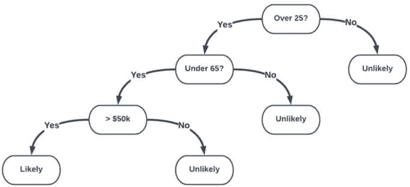

图 5.11：决策树

决策树由一系列决策组成。过程从所谓的**根节点**开始，在树的每个点上都会做出一个决策，然后引导我们采取下一步。因此，决策序列导致通过树的一条路径，直到我们达到一个不再包含进一步决策的最终点。这样的点被称为**叶节点**。按照图 5.11 中的步骤，它确定如果银行客户年龄在 25 岁到 65 岁之间，并且年收入超过 50,000 美元，他们很可能购买房屋。决策树中的所有其他因素都表明，他们不太可能购买房屋。

尽管图 5.11 中的例子相当简单，但这种过程可以在机器学习应用中算法化使用，其中每个点的决策基于某种阈值。例如，如果值小于或大于某个阈值，则继续评估特征 A；否则，评估特征 B 或停止评估特征。在使用决策树时，一个目标就是找到数据集中哪些特征可以帮助做出最佳决策，以及需要做出多少决策，这被称为**树深度**，以便得到最佳预测。

决策树过程中的两个关键概念是**熵**和**信息增益**。在这个上下文中，熵是给定实体分组中不纯度的度量。例如，完美捕捉同一组中相同实体的分组将具有零熵，而具有大量实体之间差异的分组将具有高熵。在这个上下文中，信息增益可以看作是我们决策树中每个决策减少熵的程度。在我们的图 5.11 中的银行客户例子中，初始客户集（在做出任何决策之前）包括我们所有的客户，这个集合将具有很多熵，因为它将包括所有年龄段和各种经济状况以及其他特征的人。

现在，当我们试图找出哪些客户特征可以帮助我们的算法决定他们是否可能购买房屋时，我们发现一个模式表明，一定年龄组（比如说，25 至 65 岁之间）的人，并且每年收入超过一定数额（比如说，超过 50,000 美元）的人，比其他客户更有可能购买房屋。因此，在这种情况下，客户的年龄和收入是帮助最大化信息增益并减少熵的例子，因此它们将是我们决策树中良好的决策点特征。另一方面，诸如他们的名字或音乐偏好等特征不太可能与他们购买房屋的概率有任何相关性，因此这些特征不会在我们的决策树中的决策点产生显著的信息增益，决策树模型在训练过程中可能会学会忽略这些特征。

决策树算法对于某些用例可能非常有效，尽管它们有一些局限性，例如容易过拟合。这就是集成概念发挥作用的地方，因为将许多树结合起来可以创建一个更强大的预测模型——而且比单个树本身更不可能过拟合。这可以通过使用 Bagging 方法，例如随机森林算法（参见*图 5.12*以供参考）来实现，该算法在集成中的每个树都使用从训练特征空间中随机子样本（带替换）进行训练，或者可以通过使用 Boosting 方法，正如我们在梯度提升案例中描述的那样：

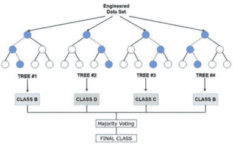

图 5.12：随机森林

当我们使用决策树进行梯度提升时，我们将其称为**梯度提升树**。简单梯度提升树实现的一个固有挑战是算法的顺序性，即一个训练迭代中树的误差需要在下一个迭代中使用来训练集成中的下一个树。然而，正如我们在本章前面提到的，XGBoost 克服了这一限制，并且可以并行训练数千棵树，这大大加快了整体训练时间。

在了解这些背景信息的基础上，让我们看看如何使用 XGBoost 在 Vertex AI 中构建分类模型。这里的业务案例不需要专门的突出显示部分，因为它相当直接：我们的模型将需要根据每朵鸢尾花的花瓣和萼片测量值来预测其类别。

注意

鸢尾花数据集包含关于适合三个类别之一的鸢尾花的详细信息：

- **Iris-Setosa**

- **Iris-Versicolour**

- **Iris-Virginica**

在本章前一部分的线性回归示例中，我们决定使用**花瓣长度**特征作为我们试图预测的目标。然而，在本节中，我们将尝试根据数据集中所有其他特征来预测每朵鸢尾花的类别（或分类）。因为存在多个类别，这将是一个多类别分类任务。

本节中我们将介绍一个新的特征——鸢尾花数据集的分类特征，我们尚未与这个特征进行交互。接下来，我们将讨论如何访问这个特征。

scikit-learn 中的鸢尾花数据集包含多个对象。其中之一是**数据**对象，这是我们本章到目前为止一直在使用的。

数据集中另一个对象是**目标**对象，它包含**类别**特征列。**类别**特征列表示类别如下：

**0 =** **Iris-Setosa**

**1 =** **Iris-Versicolour**

**2 =** **Iris-Virginica**

记住本章前面提到的以下两行代码：

**iris =** **load_iris()**

**iris_data =** **iris.data**

那些代码行将 iris 数据集加载进来，并将该数据集的**data**对象特别分配给**iris_data**变量。当时我们没有引用**target**对象，因为我们不需要这样做。

我们将在本节中开始使用**target**对象，为此，我们将将其分配给一个名为**iris_classes**的变量。

要训练分类模型，请在您的 Vertex AI Workbench 笔记本中执行以下步骤：

1.  就像我们在上一节中使用的库一样，在开始使用之前，我们需要导入 XGBoost 库。更具体地说，我们将从`XGBoost`库中导入`XGBClassifier`类：

    ```py
    from xgboost import XGBClassifier
    ```

1.  考虑到我们将用它来进行分类用例，我们还将导入一个函数，该函数将计算一个可以用于评估分类模型的指标，称为`accuracy`：

    ```py
    from sklearn.metrics import accuracy_score
    ```

1.  将 iris 数据集的`target`对象分配给`iris_classes`变量，以便我们可以开始引用它：

    ```py
    iris_classes = iris.target
    ```

1.  创建我们的训练和测试数据集拆分，就像我们在上一节中的回归示例中所做的那样：

    ```py
    xgb_input_train,xgb_input_test,xgb_target_train,xgb_target_test=
        train_test_split(iris_data, iris_classes, test_size=.2)
    ```

1.  创建一个模型实例并指定超参数：

    ```py
    xgbc = XGBClassifier(n_estimators=2, max_depth=2, 
        learning_rate=1, objective='multi:softmax')
    ```

深入了解

在前面的代码片段中指定的超参数代表以下内容：

**n_estimators**：在集成中使用的决策树数量。

**max_depth**：每个树的最大决策点（或最大深度）数。

**learning_rate**：在成本函数优化期间使用的学习率。

**objective**：我们希望模型执行的预测类型。在这种情况下，我们希望它使用**softmax**函数进行多类分类。

1.  让我们训练我们的模型：

    ```py
    xgbc.fit(xgb_input_train, xgb_target_train)
    ```

    你将看到类似于*图 5.13*的输出，该图总结了模型参数的值（包括默认值）：

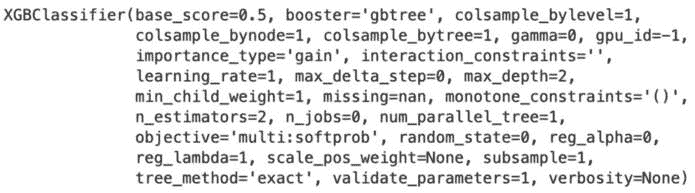

图 5.13：XGBoost 参数

1.  现在，是时候使用`xgb_input_test`数据集从我们的模型中获取预测了：

    ```py
    xgb_predictions = xgbc.predict(xgb_input_test)
    ```

1.  让我们看看它对`xgb_input_test`数据集中的每个项目做出了什么预测：

    ```py
    xgb_predictions
    ```

    输出应该是一个预测类别的数组，这些类别由 0、1 或 2 表示，类似于*图 5.14*中显示的输出，尽管你得到的值可能不同：

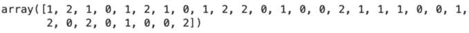

图 5.14：XGBoost iris 分类预测

1.  我们的模型做对了没有？为了找出答案，我们可以检查已知的正确答案：

    ```py
    xgb_target_test
    ```

    这段代码的输出也应该是一个类别的数组，这些类别由 0、1 或 2 表示，类似于*图 5.15*中显示的输出，尽管你得到的值可能不同：

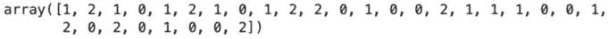

图 5.15：已知、正确的答案

1.  它们看起来很相似，但为了确保，让我们通过将我们的预测与已知的正确答案进行比较来测试准确性：

    ```py
    accuracy_score(xgb_target_test,xgb_predictions)
    ```

    分数将以表示准确百分比的浮点数形式呈现。如果结果是 1.0，这意味着我们的预测是 100%准确的！

深入探讨

准确度指标量化了我们的模型在所有预测中正确预测的比例，如下公式所示：

*准确度 = 正确预测数 / 总预测数*

评估模型预测性能有许多其他指标，scikit-learn 内置了计算这些指标的功能。作为额外的学习，我们建议你查阅以下链接的 scikit-learn 指标文档：[`scikit-learn.org/stable/modules/classes.xhtml#module-sklearn.metrics`](https://scikit-learn.org/stable/modules/classes.xhtml#module-sklearn.metrics)。

干得好！你已经在 Google Cloud Vertex AI 上正式训练了多个自己的模型！让我们回顾一下本章所学的内容。

# 摘要

在本章中，我们从第一章和第二章中提取了许多机器学习概念并将其付诸实践。我们使用聚类以无监督方式在我们的数据中找到模式，并且你特别学习了更多关于 K-means 在聚类中的应用及其工作原理。

然后，我们深入探讨了 SL，你探索了 scikit-learn 中的线性回归类，并学习了如何使用指标来衡量回归模型的性能。

接下来，你学习了如何使用 XGBoost 构建分类模型，并根据特征对鸢尾花数据集中的项目进行分类。

不仅你将所有这些重要概念付诸实践，而且你还学会了如何创建和使用 Vertex AI Workbench 管理的笔记本。

此外，你还学习了机器学习行业中的其他重要概念，例如决策树的工作原理、梯度提升的工作原理以及 XGBoost 如何增强该功能以实现行业中最有效的机器学习算法之一。

在这一章中，你需要学习很多东西，你应该为自己的技能和知识在当今商业世界中需求很高的领域得到显著提升而感到自豪。

在下一章中，你将学习另一组极其重要的技能，因为我们将会关注机器学习工作负载的数据分析和数据转换。
