# 6

# 深入探讨 – 在 Google Cloud 上为 AI/ML 工作负载准备和处理数据

在上一章中，我们通过查看与我们的数据集相关的一些细节，使用诸如`pandas.DataFrame.info()`和`pandas.DataFrame.head()`等函数，进行了一些非常基础的数据探索。在本章中，我们将更深入地探讨数据探索和准备领域，这在本章中由数据科学生命周期图中用蓝色突出显示的部分所代表。1*：

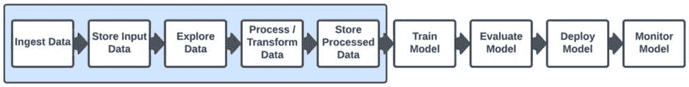

图 6.1：数据探索和处理

在典型数据科学项目的早期阶段，您可能会在 Jupyter 笔记本中执行许多数据探索和准备步骤，正如我们所看到的，这对于实验小数据集是有用的。然而，当您将工作负载投入生产时，您可能会使用更大的数据集，在这种情况下，您通常会需要使用不同的工具来处理您的数据。在大型规模数据处理、分析和 AI/ML 方面，Google 被视为行业领导者。例如，Google Cloud BigQuery 已成为行业中最受欢迎的数据仓库服务之一，Google Cloud 还拥有许多其他行业领先的数据处理和分析工作负载服务。

在本章中，我们将学习如何使用 Vertex AI、BigQuery、Dataproc 和 Cloud Composer 等工具探索、可视化和准备数据以供 ML 用例使用。此外，我们将深入了解实时处理流数据的 Dataflow，并介绍数据管道的基本原理。到本章结束时，您将能够创建、构建和运行 Google Cloud 上的数据管道，为您在当今快节奏、数据驱动的世界中承担复杂数据处理任务提供必要的技能。

本章涵盖了以下主题：

+   先决条件和基本概念

+   将数据导入 Google Cloud

+   探索和可视化数据

+   清洗和准备数据以供 ML 工作负载使用

+   数据管道简介

+   处理批量和流数据

+   在 Google Cloud 上构建和运行数据管道

让我们先来讨论本章的先决条件。

# 本章的先决条件

在我们可以开始执行本章的主要活动之前，本节中的活动需要完成。

## 启用 API

除了我们在前几章中讨论的用于启用 Google Cloud API 的方法，例如 Google Cloud Shell 或 Google Cloud 控制台中被提示，您还可以主动搜索一个 API 以在控制台中启用它。为此，您需要执行以下步骤，其中*[服务/API 名称]*是您希望启用的服务/API 的名称：

1.  在 Google Cloud 控制台中，导航到**Google Cloud 服务**菜单 → **APIs & Services** → **Library**。

1.  在搜索框中搜索*[服务名称]*。

1.  从结果列表中选择 API。

1.  在显示 API 信息的页面上，点击**启用**。

为以下每个服务/API 名称执行前面的步骤：

+   Compute Engine API

+   Cloud Scheduler API

+   Dataflow API

+   数据管道 API

+   Cloud Dataproc API

+   Cloud Composer API

+   Cloud Pub/Sub API

在您启用所需的 API 之后，我们就可以继续下一节了。

## IAM 权限

在本节中，我们将设置启用本章后续活动所需的**身份和访问管理**（**IAM**）权限。

### 服务帐户

在前面的章节中，我提到过有多种方式可以与 Google Cloud 服务进行身份验证，您在*第四章*中使用的 API 密钥是最简单的身份验证方法。现在，随着我们向更复杂的使用案例迈进，我们将开始使用一种更高级的身份验证形式，称为服务帐户。

Google Cloud 服务帐户是 Google Cloud 服务、应用程序和**虚拟机**（**VM**）用于与其他 Google Cloud 资源交互和验证的特殊帐户。它们是一个有趣的概念，因为除了是资源外，它们还被认为是有身份或主体，就像人一样，就像人一样，它们有自己的电子邮件地址和与它们相关的权限。然而，这些电子邮件地址和权限适用于使用它们的机器和应用程序，而不是人。服务帐户提供了一种方式，让机器和应用程序在系统想要执行需要通过 Google Cloud API 和资源进行身份验证的活动时拥有身份。

我们将创建一个服务帐户，用于在本章中执行的活动所需的权限。

#### 数据处理服务帐户

考虑到在本章中我们将使用多个 Google Cloud 服务以不同的方式处理数据，我们将创建一个具有主要与 Google Cloud 数据处理服务相关的权限的服务帐户，例如 BigQuery、Cloud Composer、Dataflow、Dataproc、**Google Cloud Storage**（**GCS**）和 Pub/Sub。

执行以下步骤以创建所需的服务帐户：

1.  在 Google Cloud 控制台中，导航到**Google Cloud 服务**菜单→ **IAM & Admin** → **服务帐户**。

1.  选择**创建** **服务帐户**。

1.  对于服务帐户名称，输入`data-processing-sa`。

1.  在标题为**授予此服务帐户访问项目**的章节中，添加*图 6**.2 中显示的角色：

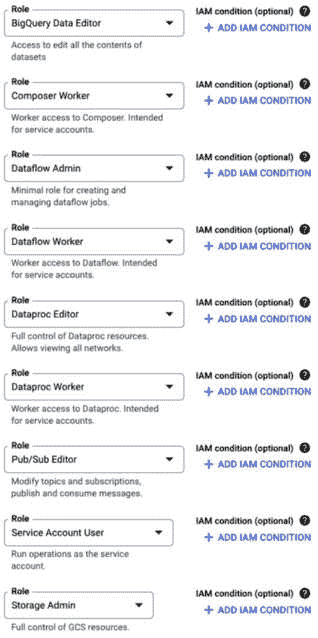

图 6.2：Dataflow 工作服务帐户权限

1.  选择**完成**。

我们的服务帐户现在已准备好在本章的后续部分使用。

注意

在我们刚刚创建的服务账户中，我们还添加了**服务账户用户**权限。这是因为，在我们将要实施的某些用例中，我们的服务账户也需要暂时代表或“充当”其他服务账户或身份。有关代表服务账户的概念的更多信息，请参阅以下文档：[`cloud.google.com/iam/docs/service-account-permissions#directly-impersonate`](https://cloud.google.com/iam/docs/service-account-permissions#directly-impersonate)。

## 云存储桶文件夹

我们将使用云存储桶来存储本章后面活动所需的数据。我们已经在*第四章*中创建了一个桶，因此我们可以简单地向桶中添加一些文件夹来存储我们的数据。执行以下步骤以创建文件夹：

1.  在 Google Cloud 控制台中，导航到**Google Cloud 服务**菜单→**云存储**→**桶**。

1.  点击*第四章*中创建的桶的名称。

1.  选择**创建文件夹**。

1.  将其命名为`data`。

1.  选择**创建**。

重复前面的步骤，使用以下额外的文件夹名称：

+   `code`

+   `dataflow`

+   `pyspark-airbnb`

我们的数据文件夹现在已准备好存储数据。

## 上传数据

我们将使用名为`AB_NYC_2019.csv`的文件作为本章某些活动的数据集。在*第四章*中您在本地机器上创建的 GitHub 仓库克隆副本中，您将在名为`data`的目录中找到该文件，该目录位于名为`Chapter-06`的目录内。

因此，您应该在您的本地机器上找到以下路径处的文件（如果您使用的是 Microsoft Windows，斜杠将被反转）：

`[您克隆我们的 GitHub 仓库的位置]/``Chapter-06``/data/AB_NYC_2019.csv`

为了上传此文件，请执行以下步骤：

1.  导航到上一节中在 GCS 中创建的`data`文件夹。

1.  点击**上传文件**。

1.  现在，通过导航到您在本地机器上创建的 GitHub 仓库克隆副本中的`Chapter-06/data`目录，选择`AB_NYC_2019.csv`文件。

现在我们已经完成了先决条件，让我们讨论一些重要的行业概念，我们将在本章中深入探讨。

# 本章的基本概念

在本书中，我们的目标是为您提供有关如何使用相关 Google Cloud 服务来处理各种工作负载的知识，同时也提供与每个相关技术相关的重要行业概念。在本节中，我们简要介绍了为本章的学习活动提供额外背景的概念。

## 将数据摄入 Google Cloud

在前面的章节中，您已经执行了上传数据到 GCS 和谷歌云大数据查询（BigQuery）的步骤。除了对 GCS 和 BigQuery 执行批量上传外，还可以将这些服务中的数据流式传输。您将在本章中看到这一过程的具体操作。

本节提供了对谷歌云数据摄取选项的更全面概述。在这里，我们只涵盖谷歌云的服务，但您还可以在谷歌云上运行无数第三方数据库和数据管理服务，例如 MongoDB、Cassandra、Neo4j 以及通过谷歌云市场提供的许多其他服务。

对于流式数据处理用例，我们将在本章后面更详细地描述，您可以使用 Cloud Pub/Sub 从物联网设备或网站点击流源摄取数据。Dataflow 也可以用于从各种来源摄取数据，对其进行转换，并将其写入其他谷歌云服务，如 BigQuery、Bigtable 或云存储。正如我们将在本章后面讨论的，Dataflow 还支持批量数据处理用例。

谷歌云 Dataproc 可用于从兼容**Hadoop 分布式文件系统**（**HDFS**）的源或其他分布式存储系统摄取数据，谷歌云数据融合也可以用于从各种来源摄取数据，对其进行转换，并将其写入大多数谷歌云存储和数据库服务。

对于关系型数据库数据，您可以使用谷歌云**数据库迁移服务**（**DMS**）将数据摄取到谷歌云 SQL 中，这是一个为 MySQL、PostgreSQL 和 SQL Server 提供的完全托管的关系型数据库服务。您还可以使用标准 SQL 客户端、导入/导出工具和第三方数据库迁移工具将数据摄取到云 SQL 实例中。

对于非关系型数据库数据，有多种选择，包括以下内容：

+   谷歌云 Bigtable，这是一个为大规模、低延迟工作负载提供的完全托管、可扩展的 NoSQL 数据库。您可以使用 Bigtable HBase API 或 Cloud Bigtable 客户端库将数据摄取到 Bigtable 中。

+   谷歌云 Firestore，这是一个为 Web 和移动应用提供的完全托管、无服务器的 NoSQL 文档数据库。Firestore 提供了客户端库、REST API 或 gRPC API 来摄取数据。

+   一些您可能也熟悉谷歌云数据存储（Google Cloud Datastore），它曾经是独立的谷歌云非关系型数据库服务，但已经与谷歌云 Firestore 有所合并。要了解更多关于这些数据库选项之间如何相互关联的详细信息，请参阅以下链接的谷歌云文档：[`cloud.google.com/datastore/docs/firestore-or-datastore`](https://cloud.google.com/datastore/docs/firestore-or-datastore)。

现在我们已经介绍了将数据导入 Google Cloud 的许多选项，让我们讨论在导入数据后我们可能想要对数据进行哪些操作，从数据转换方法开始，例如**提取、转换、加载**（**ETL**）和**提取、加载、转换**（**ELT**）。

## ETL 和 ELT

ETL 和 ELT 是数据集成、处理和存储的两种方法。在 ETL 中，数据首先从源系统中提取出来，然后转换成另一种格式。这些转换可能包括清洗、丰富、聚合或去重。这些转换通常在一个中间处理引擎或暂存区域中进行。一旦数据被转换，它就被加载到目标系统中，这通常是数据仓库或数据湖。ETL 是一种传统方法，非常适合数据一致性和质量至关重要的环境。然而，由于在数据加载之前发生处理步骤，它可能既耗时又消耗资源。

另一方面，ELT 颠倒了最后两个步骤的顺序。数据首先从源系统中提取出来，然后直接加载到目标系统中，例如现代数据仓库或数据湖。转换步骤在目标系统内部执行，使用目标系统的处理能力。近年来，由于现代基于云的数据仓库的可扩展性和处理能力的提高，ELT 因其能够更快地加载并允许用户按需执行复杂转换而越来越受欢迎。

在 ETL 和 ELT 之间进行选择取决于数据处理环境的具体要求、数据质量需求以及目标系统的能力。

## 批量和流数据处理

从高层次来看，我们可以以两种主要方式处理数据：批量处理和流处理。在本节中，我们将解释这些方法，这将为我们提供本章后续活动中所需的知识。

### 批量数据处理

批量数据处理通常指的是以批量方式对大量数据集进行一系列转换。这类管道适用于需要在一小时或甚至几天内并行处理大量数据的用例。例如，想象一下您的公司在不同的地理区域运行在线零售业务，例如在北美有一个*www.example.com*网站，在英国有一个*www.example.co.uk*网站，在中国有一个*www.example.cn*网站。每个晚上，您可能希望运行一个工作负载，该工作负载将当天每个区域所有客户购买的所有商品汇总起来，将数据跨区域合并，然后将这些数据输入到机器学习模型中。这将是批量工作负载的一个例子。其他批量数据处理用例的例子包括以下内容：

+   处理每日销售交易以生成业务决策报告

+   分析来自 Web 服务器的日志文件以了解特定时间窗口内的用户行为（例如，一天或一周）

+   运行大规模数据转换作业，例如将原始数据转换为下游数据系统所需的结构化格式

除了需要定期执行的数据处理任务之外，公司可能还需要实时或接近实时地处理数据，这使我们来到了流数据处理的主题。

### 流数据处理

流数据处理，正如其名所示，涉及对持续流入系统的数据流进行工作，通常是在持续的基础上。而不是将庞大的数据集作为一个单独的作业进行处理，流数据处理用例中的数据通常由在飞行中的小数据块组成。流数据处理的例子包括以下内容：

+   分析社交媒体流以识别趋势或检测事件（例如，**情感分析**（SA），标签跟踪）

+   实时监控和分析物联网传感器数据以检测异常、触发警报或优化流程

+   实时处理金融交易以进行欺诈检测和预防

现在我们已经讨论了数据处理的两个主要高级用例类别，让我们开始深入了解我们如何实际实现这些用例。

## 数据管道

数据管道是我们自动化的概念，例如大规模 ETL/ELT 或流数据转换。对于处理大量数据或需要复杂数据处理工作负载的组织来说，数据管道是必不可少的，因为它们有助于在规模上简化数据管理。如果没有这样的自动化管道，员工将花费大量时间进行枯燥且重复但复杂且易出错的数据处理活动。Google Cloud 提供了多种服务，可用于批处理和流数据管道，你将在本章中学习如何使用这些服务。

现在我们已经介绍了一些基本概念，是时候开始深入了解一些实际的数据处理活动了。

然而，在我们开始构建自动化的数据处理管道之前，我们首先需要探索我们的数据，以便我们了解我们希望在管道中实施哪些类型的转换。

注意

在之前的章节中，我们将代码直接包含在本书的页面中，但现在我们正在转向更复杂的使用案例，这些使用案例需要大量不适合直接包含在本书页面中的代码。请查阅 GitHub 仓库中与本章节相关的代码工件，以了解我们用于实现这些步骤的代码：[`github.com/PacktPublishing/Google-Machine-Learning-for-Solutions-Architects`](https://github.com/PacktPublishing/Google-Machine-Learning-for-Solutions-Architects)。

在本书的其余部分，我将继续在适当的地方直接包含代码。

# 探索、可视化和准备数据

*用例*：我们计划去纽约市旅行，并想了解最佳的住宿选项。我们不会逐个浏览和评估大量的 Airbnb 帖子，而是会下载大量的评论，并进行批量数据分析和数据处理，以获得一些见解。

我们可以使用在*第五章*中创建的 Vertex AI Workbench 笔记本来完成这个目的。请打开该笔记本实例上的 JupyterLab。在屏幕左侧的目录浏览器中，导航到`Chapter-6`目录并打开`Chapter-6-Airbnb.ipynb`笔记本。您可以选择**Python (Local)**作为内核。正如您在*第五章*中所做的那样，通过选择单元格并在键盘上按*Shift* + *Enter*来运行笔记本中的每个单元格。

在笔记本中，我们使用 Markdown 单元格详细描述每个步骤，以便您理解过程中的每个步骤。我们使用`pandas`、`matplotlib`和`seaborn`等库来总结和可视化数据集的内容，然后我们执行数据清理和准备活动，例如填充缺失值、移除异常值以及移除对训练预测住宿价格的回归模型可能不实用的特征。*图 6**.3*展示了我们数据可视化图表的一个示例，其中我们查看数据集中列表价格的范围和分布：

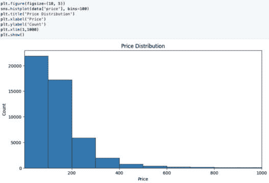

图 6.3：数据集中价格分布

如我们所见，大多数住宿选项每晚的费用低于 200 美元，但也有一些数据点（尽管不多）每晚在 600 至 1000 美元之间。这些可能是非常昂贵的住宿选项，或者它们可能是数据中的潜在异常值/错误。您可以在笔记本中查看更多的数据可视化图表。

关于数据清理活动，例如，为了清理潜在的价格异常值，我们使用以下代码片段来设置 800 美元的限制（尽管仍然很高）并移除任何超过该每晚价格的列表：

```py
price_range = (data_cleaned['price'] >= 10) & (
    data_cleaned['price'] <= 800)
data_cleaned = data_cleaned.loc[price_range]
```

为了移除对训练预测住宿价格的回归模型可能不实用的特征，我们使用以下代码片段：

```py
columns_to_drop = ['id', 'name', 'host_name', 'last_review', 
    'reviews_per_month']
data_cleaned = data.drop(columns=columns_to_drop)
```

这些只是我们在笔记本中执行的数据准备步骤的几个示例。

当您完成笔记本中所有活动的执行后，我们将继续探讨如何将这些活动转化为生产环境中的自动化流程。我们将首先实现批量数据处理流程。

# 批量数据处理流程

现在我们已经使用我们的 Jupyter 笔记本来探索我们的数据，并确定我们想在数据集上执行哪些类型的转换，让我们设想一下，我们想要将这个转换成一个可以自动在非常大的文件上运行的生产工作负载，而不需要任何进一步的人工努力。正如我之前提到的，这对于任何实施大规模数据分析和 AI/ML 工作负载的公司来说都是至关重要的。让某个人每次都手动执行这些转换是不切实际的，而对于非常大的数据量，这些转换无法在笔记本实例上执行。例如，想象一下，我们每天都会收到数千条新的帖子，我们想要自动为 ML 模型准备这些数据。我们可以通过创建一个自动化的管道来每晚（或我们希望的时间间隔）执行数据转换来实现这一点。

## 批量数据处理管道的概念和工具

在我们开始深入构建我们的批量数据处理管道之前，让我们首先介绍这个领域的一些重要概念和工具。

### Apache Spark

Apache Spark 是一个非常流行的开发和执行框架，可以用于实现非常大的数据处理工作负载以及其他类型的大规模计算用例，如 ML。它的力量既在于其内存处理能力，也在于其能够并行实现多个大型计算和数据处理任务的能力。

虽然 Spark 可以用于批处理和流式（或微批处理）数据处理工作负载，但我们在本章中将使用它来执行我们的批量数据转换。

### Google Cloud Dataproc

正如我们在 *第三章* 中讨论的那样，Google Cloud Dataproc 是一个完全托管、快速且易于使用的服务，可以在 GCP 上运行 Apache Spark 和 Apache Hadoop 集群。在本章中，我们将使用它来执行我们的 Spark 处理作业。

### Apache Airflow

Apache Airflow 是一个开源平台，用于编排复杂的数据工作流。它由 Airbnb 创建，后来贡献给了 **Apache 软件基金会**（**ASF**）。Airflow 设计用于帮助开发人员和数据工程师创建、安排、监控和管理工作流，使得处理相互依赖的任务变得更加容易。它通常用于数据工程和数据科学项目中的任务，如 ETL、ML 管道和数据分析，并且被各个行业的组织广泛使用，使其成为管理复杂数据工作流的热门选择。

#### 有向无环图

Airflow 将工作流表示为 **有向无环图**（**DAGs**），它由任务及其依赖关系组成。工作流中的每个任务都表示为一个节点，任务之间的依赖关系由有向边表示。这种结构确保了任务按照特定的顺序执行，不会创建循环，如图 *6**.4* 所示：

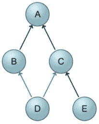

图 6.4：一个简单的 DAG（来源：https://www.flickr.com/photos/dullhunk/4647369097）

在*图 6.4*中，我们可以看到任务*b*、*c*、*d*和*e*都依赖于任务*a*。同样，任务*d*也依赖于任务*b*和*c*，任务*e*也依赖于任务*c*和*d*。

在 Airflow 中，DAG 通过 Python 脚本定义，它将任务及其依赖关系表示为代码。

### Google Cloud Composer

**Google Cloud Composer**（**GCC**）是基于 Apache Airflow 构建的完全托管的工作流程编排服务。它允许您在多个 Google Cloud 服务、本地或多云环境中创建、安排和监控数据工作流。

云作曲家通过提供易于使用的界面并自动化基础设施管理来简化设置和管理 Apache Airflow 的过程。这允许您专注于创建和维护您的流程，而 Google 则负责底层基础设施、扩展和更新。

现在我们已经涵盖了实现批量数据管道的重要概念，让我们开始构建我们的管道。

# 构建我们的批量数据管道

在本节中，我们将创建我们的 Spark 作业并在 Google Cloud Dataproc 上运行它，并将使用 GCC 来编排我们的作业。这意味着我们可以让 GCC 每天自动运行我们的作业。每次运行作业时，它将创建一个 Dataproc 集群，执行我们的 Spark 作业，然后在我们的作业完成后删除 Dataproc 集群。这是公司用来节省资金的标准最佳实践，因为当你不使用计算资源时，你不应该有它们在运行。我们 Google Cloud 上的管道架构在*图 6.5*中显示：

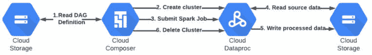

图 6.5：批量数据管道架构

让我们从设置云作曲家开始。

## 云作曲家

在本节中，我们将设置云作曲家以安排和运行我们的批量数据处理管道。

### 云作曲家环境

在云作曲家中，我们做的所有事情都在云作曲家环境中进行。要设置我们的云作曲家环境，请执行以下步骤：

1.  在 Google Cloud 控制台中，导航到**Google Cloud 服务**菜单→**作曲家**→**环境**。

1.  选择**创建环境**。

1.  如果需要，选择**作曲家 2**。

1.  在出现的屏幕上，输入您的 Composer 环境名称。参见*图 6.6*以获取参考：

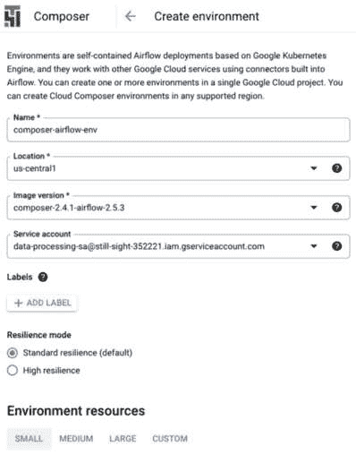

图 6.6：创建 Composer 环境

1.  选择您首选的区域。（记住，如果可能的话，在整个本书中为每个活动使用相同的区域会更好。）

1.  选择最新的镜像版本。参见*图 6.6*以获取参考。

1.  *重要提示*：选择您在本章中创建的服务帐户（如果您使用了建议的名称，那么名称中将包含 `data-processing-sa`）。

1.  在**环境资源**部分，选择一个小型环境。

1.  将所有其他选项保留在默认值并选择**创建**。

1.  环境启动可能需要 25 分钟。

在等待环境启动的同时，让我们继续下一节。

### Cloud Composer Python 代码

在本节中，我们将审查和准备用于我们的 Cloud Composer Spark 工作负载的 Python 代码。我们将使用两个代码资源与 Cloud Composer 一起，这些资源可以在我们的 GitHub 仓库中找到（[`github.com/PacktPublishing/Google-Machine-Learning-for-Solutions-Architects/tree/main/`](https://github.com/PacktPublishing/Google-Machine-Learning-for-Solutions-Architects/tree/main/Chapter-6)Chapter-06）：

+   `composer-dag.py`，其中包含定义我们的 Cloud Composer Airflow DAG 的 Python 代码

+   `chapter-6-pyspark.py`，其中包含定义我们的 Spark 作业的 PySpark 代码

执行以下步骤以开始准备这些文件用于与 Cloud Composer 一起使用：

1.  在您在本地机器上创建的我们的 GitHub 仓库的克隆中找到这些文件，并打开它们进行编辑。

1.  在 `chapter-6-pyspark.py` 文件中，您只需更新源和目标数据集的存储位置。为此，在文件中搜索 `GCS-BUCKET-NAME` 字符串，并将其替换为您之前创建的自己的 GCS 存储桶名称。

重要

**GCS-BUCKET-NAME** 字符串在文件中有两个位置（一次在开头附近，一次在结尾附近）。一个位置指定源数据集，另一个位置指定 Spark 作业将保存处理后的数据的目标位置。将字符串的所有出现替换为您自己的 GCS 存储桶名称。

1.  在 `composer-dag.py` 文件中，您将在文件开头附近看到以下变量块：

    ```py
    PROJECT_ID = "YOUR PROJECT ID"
    REGION = "us-central1"
    ZONE = "us-central1-a"
    SERVICE_ACCOUNT_EMAIL = "data-processing-sa@YOUR-PROJECT-ID.iam.gserviceaccount.com"
    PYSPARK_URI = "gs://GCS-BUCKET-NAME/code/chapter-6-pyspark.py"
    ```

    所有这些变量都需要使用您 GCP 项目中的特定值进行更新。文件中的注释提供了关于替换的额外细节。

1.  除了做出上述更改外，请审查代码内容，以了解 Cloud Composer 将如何执行我们的作业。代码中包含注释，描述了每个部分正在做什么，以便您了解其工作原理。

1.  当您完成前面的步骤后，我们就可以上传 Cloud Composer 将要使用的资源了。

1.  Cloud Composer 需要将前面的代码资源存储在 GCS 中，但需要在两个不同的位置：

    +   对于`chapter-6-pyspark.py`：将此文件上传到您之前在 GCS 中创建的`code`文件夹中。为此，导航到您创建的`code`文件夹，选择`chapter-6-pyspark.py`。`composer-dag.py`：此文件将被上传到 Cloud Composer 为您创建的特定文件夹。当您的 Cloud Composer 环境完全创建后，在 Cloud Composer 控制台中点击您新创建的环境名称，您的环境详细信息屏幕将打开。在屏幕顶部附近，从您在本地机器上创建的 GitHub 仓库克隆中（即您在之前步骤中编辑的文件）选择`composer-dag.py`文件。

就这样！一旦`composer-dag.py`文件上传完毕，Cloud Composer 将为您完全自动化一切。这可能需要几分钟，但 Cloud Composer 将创建您的 DAG，您将在 Cloud Composer 控制台中看到它出现。然后它将执行 DAG，这意味着它将创建一个 Dataproc 集群，执行 Spark 作业以执行我们指定的数据转换，并在作业完成后删除 Dataproc 集群。

您可以在 Composer 和 Dataproc 控制台中看到正在进行的各种任务（每种情况都给一些时间），最终的测试将是验证处理后的数据是否出现在 PySpark 代码中指定的 GCS 目标中。

当您完成所有上述步骤并且不再需要您的 Composer 环境时，您可以删除该环境。

### 删除 Cloud Composer 环境

执行以下步骤以删除 Composer 环境：

1.  在 Google Cloud 控制台中，导航到**Google Cloud 服务**菜单→**Composer**→**环境**。

1.  选择您环境名称旁边的复选框。

1.  在屏幕顶部选择**删除**。参见*图 6.7*以获取参考：

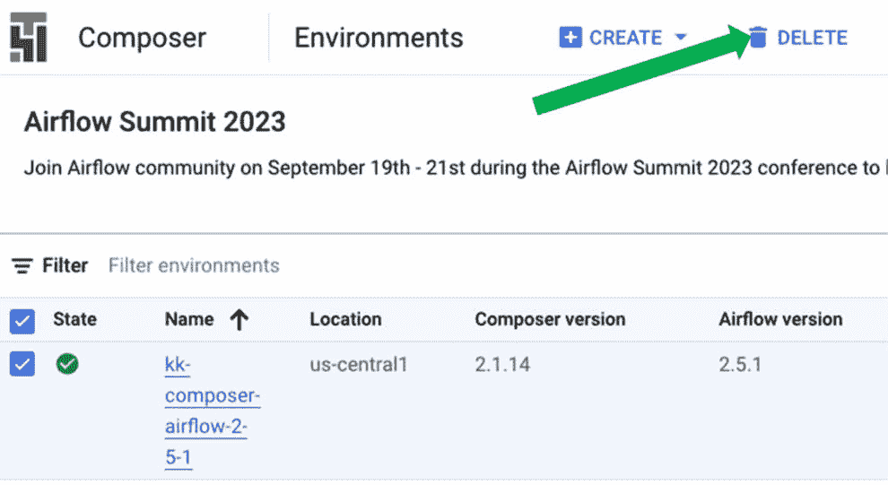

图 6.7：删除 Composer 环境

1.  在出现的确认屏幕中选择**删除**。

环境删除可能需要几分钟，之后它将从您的环境列表中消失。

太棒了！您已经在 Google Cloud 上正式创建了您的第一个数据处理管道！

注意，本章中我们使用的方法是使用多个 Google Cloud 服务实现数据管道（一个非常流行的）模式的一个示例。Google Cloud 还提供其他产品，可用于实现类似的结果，例如 Google Cloud Data Fusion，它允许您使用可视化用户界面创建管道。我们将在本书的后续章节中探索其他服务，而 Google Cloud 在 2023 年推出的另一个重要服务是无服务器 Spark，我们将在下一节中简要讨论。

## Google Cloud 无服务器 Spark

Google Cloud 无服务器 Spark 是一个完全托管的无服务器 Apache Spark 服务，它使得在不配置或管理任何基础设施的情况下运行 Spark 作业变得简单。它还会根据需求自动扩展您的作业，因此您只需为使用的资源付费，这使得它是一种成本效益高的运行 Spark 作业的方式，即使是对于短期或间歇性工作负载也是如此。

它还与 Google Cloud 的其他服务集成，例如 BigQuery、Dataflow、Dataproc 和 Vertex AI，以及流行的开源工具如 Zeppelin 和 Jupyter Notebook，这使得使用这些服务直接探索和分析数据以及构建和运行 **端到端**（**E2E**）数据管道变得容易。

例如，在 Dataproc 上的无服务器 Spark 中，您可以从预制的模板中选择，轻松执行常见任务，如将数据在 **Java 数据库连接**（**JDBC**）或 Apache Hive 数据存储与 GCS 或 BigQuery 之间移动和转换，或者您可以为无服务器 Spark 构建自己的 Docker 容器，以便实现自定义数据处理工作负载。有关如何开发此类自定义容器的更多信息，请参阅以下 Google Cloud 文档：[`cloud.google.com/dataproc-serverless/docs/guides/custom-containers`](https://cloud.google.com/dataproc-serverless/docs/guides/custom-containers)。

现在我们已经学会了如何构建批量数据处理管道，我们将继续实施流式数据处理管道。

# 流式数据处理管道

在本节中，我们将处理不同类型的数据源，并了解实时数据处理与我们在前几节中使用的面向批量的方法的差异。

## 流式数据处理管道的概念和工具

同样，在我们开始构建流式数据处理管道之前，有一些重要的概念和工具我们需要介绍和理解。

### Apache Beam

Apache Beam 是一个开源的、统一的编程模型，用于批处理和流处理模式下的大规模数据处理。它最初由 Google 开发，作为其内部数据处理工具的一部分，后来捐赠给了 ASF。Beam 提供了一种统一的方式来编写可以在各种分布式处理后端上执行的数据处理管道，例如 Apache Flink、Apache Samza、Apache Spark、Google Cloud Dataflow 等。它支持多种编程语言，包括 Java、Python 和 Go，并允许开发者使用单个 API 编写批处理和流数据处理管道，从而简化了开发过程并实现了批处理和流处理模式之间的无缝切换。它还提供了一套丰富的内置 I/O 连接器，用于各种数据源和接收器，包括 Kafka、Hadoop、Google Cloud Pub/Sub、BigQuery 等。此外，如果需要，开发者可以构建自己的自定义连接器。在本章中，我们将使用 Apache Beam 在 Google Cloud Dataflow 上创建一个管道，以实时处理数据。

#### Apache Beam 概念

在本节中，我们讨论了 Apache Beam 编程模型的一些基本概念，包括以下内容：

+   **Pipelines**：就像我们在本章前面使用的 Apache Airflow 中的管道概念一样，Apache Beam 管道是一个 DAG，它表示 Apache Beam 工作负载中的数据处理步骤序列或整体数据处理工作流程。

+   **PCollections**：**并行集合**（**PCollection**）是一个不可变的分布式数据集，表示数据元素集合。它是 Apache Beam 管道中用于存储和操作数据的主要数据结构。

+   **PTransforms**：**并行转换**（**PTransform**）是一个用户定义的操作，它接受一个或多个 PCollections 作为输入，处理数据，并产生一个或多个 PCollections 作为输出。PTransforms 是管道的构建块，并定义了数据处理逻辑。

+   **Windowing**：窗口化是一种机制，允许根据时间戳或其他标准对 PCollection 中的数据元素进行分组。这个概念对于处理流应用程序中的无界数据集特别有用，在这些应用程序中，数据元素需要以有限窗口进行处理。

+   **Watermarks**：水印是估计流处理管道中时间进度的一种方式，并有助于确定何时可以安全地发出特定窗口的结果。

+   **触发器**：触发器根据某些因素（如到达一定数量的数据元素、经过一定的时间或水印的推进）确定何时聚合每个窗口的结果。

+   **Runners**：运行器是负责在特定执行引擎或分布式处理平台上执行 Beam 管道的组件。

Beam 模型将管道定义与底层执行引擎解耦，使用户能够为他们的用例选择最合适的平台。

### Google Cloud Dataflow

我们在 *第三章* 中介绍了 Dataflow，现在我们将更深入地探讨它。Dataflow 是一个 Google Cloud 服务，你可以在其上运行 Apache Beam。换句话说，它提供了 Apache Beam 工作负载可以运行的执行环境或运行器之一。

Dataflow 为各种类型的用例提供了多个功能，在本节中，我们将简要讨论各种选项及其应用。

#### Dataflow 数据管道和 Dataflow 作业

人们经常对 Dataflow 数据管道和 Dataflow 作业之间的区别感到困惑。最好的看待方式是，Dataflow 数据管道指的是数据管道的定义，这可以定期执行，而 Dataflow 作业则指单个数据管道的执行。这种混淆的原因是，你可以在 Dataflow 作业控制台或 Dataflow 数据管道控制台中创建新的管道定义。

在任何情况下，当创建管道定义时，我们都有使用预定义模板的选项，这些模板涵盖了人们经常希望使用 Dataflow 完成的常见任务类型，例如将数据从 BigQuery 转移到 Bigtable，或从 Cloud Spanner 转移到 Pub/Sub，而且有大量的不同模板可供选择，覆盖了广泛的数据源和目的地。这些模板使我们能够非常容易地实现数据传输工作负载，而无需我们进行很多或任何开发工作。或者，如果我们有更复杂的数据处理需求，而这些需求不包括在任何标准模板中，那么我们可以创建自己的自定义管道定义。我们将在本章后面探讨这两种选项。

#### Dataflow Workbench 笔记本

我们可以通过使用 Dataflow Workbench 笔本来开发自定义数据处理管道。这可能听起来有些熟悉，因为你可能还记得在 *第五章* 中创建和使用 Vertex AI Workbench 笔记本。在 Dataflow Workbench 控制台中，我们可以创建已经预装 Apache Beam 的笔记本。我们将在本章后面创建一个笔记本。

#### Dataflow 快照

Dataflow 快照保存了流管道的状态，这使得你可以在不丢失状态的情况下启动 Dataflow 作业的新版本。这对于备份和恢复、测试以及回滚流管道的更新非常有用。

#### SQL 工作区

Dataflow 控制台还包括一个内置的 SQL 工作区，它允许你直接从控制台运行 SQL 查询，并将结果发送到 BigQuery 或 Pub/Sub。这对于你只想简单地运行一个 SQL 查询以从给定源获取信息并将结果存储在支持的某个目的地的情况非常有用。

现在我们已经涵盖了实现流数据管道的重要概念，让我们开始构建我们的管道。

# 构建我们的流数据管道

坚持我们计划去纽约市的主题，本章前几节的活动让我们对可用的住宿选项有了很好的了解，现在我们想要评估我们的交通选项；具体来说，我们想知道在纽约市乘坐出租车旅行的费用可能多少。

我们的流数据管道将从 Google Cloud Pub/Sub 获取输入数据，在 Dataflow 中进行一些处理，并将输出放入 BigQuery 以进行分析。我们的管道在 Google Cloud 上的架构如 *图 6.8* 所示：

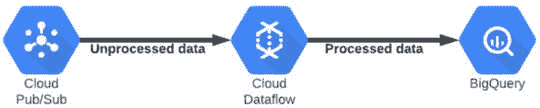

图 6.8：流数据管道

Google Cloud 提供了一个公共数据流，可以用于测试这些类型的流处理工作负载，其中包含与纽约市出租车行程相关的信息，我们将在本节的示例中使用它。让我们首先为我们的流数据创建一个目的地，也称为我们的管道的 **汇**。

## 创建 BigQuery 数据集

我们将使用 Google Cloud BigQuery 作为我们的数据存储系统。要开始，我们首先需要在 BigQuery 中定义一个数据集，我们将将其用作我们的管道目的地。为此，执行以下步骤：

1.  在 Google Cloud 控制台中，导航到 **Google Cloud 服务** 菜单→ **BigQuery**。

1.  在屏幕的左上角，你会看到你的项目名称。点击项目名称右侧的三个垂直点符号（参见 *图 6.9* 以获取参考）：

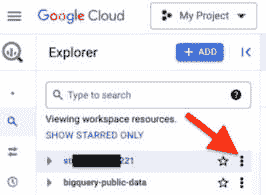

图 6.9：BigQuery 项目菜单

1.  在显示的菜单中，选择 **创建数据集**。

1.  给你的数据集起个名字：`taxirides`。

1.  选择你首选的区域，并选择 **创建数据集**。

现在我们已经创建了数据集，我们需要在该数据集中创建一个表。

## 创建 BigQuery 表

一个 BigQuery 数据集通常包含一个或多个包含实际数据的表。让我们创建一个我们将数据流到其中的表。为此，执行以下步骤：

1.  在 BigQuery 编辑器中，点击你刚刚创建的 `taxirides` 数据集，并选择 **创建表**。

1.  将表名设置为 `realtime`。

1.  在 **模式** 部分中，点击加号（**+**）添加一个新字段。我们的第一个字段具有以下属性（将每个字段的其余选项保留为其默认值）：

| **字段名称** | **类型** | **模式** |
| --- | --- | --- |
| `ride_id` | `STRING` | `NULLABLE` |

表 6.1：BigQuery 表中第一个字段的属性

4. 重复*步骤 3*以添加更多字段，直到架构看起来像*图 6.10*中所示：

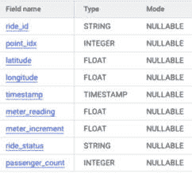

图 6.10：表架构

5. 选择**创建表**。

现在我们的表已经准备好接收数据流，让我们继续创建我们的数据流管道。

## 从模板创建 Dataflow 作业

我们将使用 Dataflow 模板来创建我们的第一个数据流管道。为此，请执行以下步骤：

1.  在 Google Cloud 控制台中，导航到**Google Cloud 服务**菜单→**Dataflow**→**作业**。

1.  选择**从模板创建作业**。

1.  对于`taxi-data-raw`。

1.  选择您首选的区域。

1.  在**Dataflow 模板**下拉菜单中，选择**Pub/Sub 到****BigQuery**模板。

注意

Pub/Sub 还发布了与 BigQuery 的直接集成，但考虑到我们想要说明如何使用 Dataflow 模板，我们本章使用 Dataflow 连接方法。

1.  接下来，在**输入 Pub/Sub 主题**字段中，选择**手动输入主题**。

1.  输入以下主题：

    ```py
    projects/pubsub-public-data/topics/taxirides-realtime
    ```

1.  在上一节中创建的`realtime`表中。

1.  在屏幕底部单击**选择**。

1.  在**临时位置**字段中，输入以下格式的所需存储位置路径（将[BUCKET-NAME]替换为您的桶名称）：gs://[BUCKET-NAME]/dataflow。

1.  展开**可选参数**部分，并向下滚动，直到找到**服务帐户****电子邮件**字段。

1.  在该字段中，选择您在本章中较早创建的服务帐户（如果您使用了建议的名称，名称中将包含`data-processing-sa`）。

1.  将所有其他选项保留在默认值。

1.  选择**运行作业**。

1.  几分钟后，您将看到作业详情出现，一个类似于*图 6.11*所示的图形：

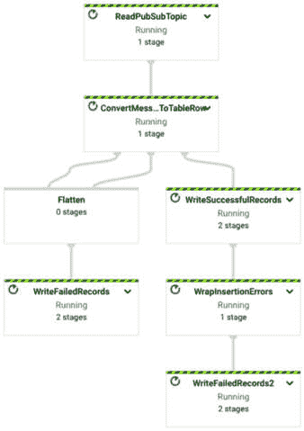

图 6.11：Dataflow 执行图

1.  尝试在图中每个步骤和子步骤上点击，以更好地了解每个步骤的作用。

经过一段时间后，您可以前往 BigQuery 控制台并验证数据是否正在流入表中。继续下一节以执行此操作。但是，请不要关闭 Dataflow 控制台，因为您将在验证 BigQuery 中的数据后返回这里。

## 验证 BigQuery 中的数据

为了验证 BigQuery 中的数据，请执行以下步骤：

1.  在 Google Cloud 控制台中，导航到**Google Cloud 服务**菜单→**BigQuery**。

1.  在屏幕的左上角，您将看到您的项目名称。单击项目名称左侧的箭头符号以展开它（参见*图 6.12*以供参考）。

1.  然后，单击数据集名称（`taxirides`）左侧的箭头符号以展开它。

1.  选择您的`realtime`表。

1.  选择**预览**选项卡。

1.  然后，你应该会看到一个类似于*图 6.12*所示的屏幕：

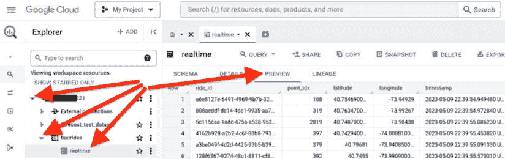

图 6.12：BigQuery 数据

1.  当您在 BigQuery 中验证了数据后，您可以返回 Dataflow 控制台，通过点击屏幕顶部的**停止**来停止 Dataflow 作业。

现在您已经看到了从模板设置 Dataflow 作业是多么容易，让我们继续探讨更复杂的 Dataflow 使用案例。

## 创建数据流笔记本

因为我们想使用定制的 Apache Beam 笔记本，所以我们将创建一个在 Dataflow Workbench 控制台中的笔记本。按照以下步骤创建笔记本：

1.  在 Google Cloud 控制台中，导航到**Google Cloud 服务**菜单→**Dataflow**→**Workbench**。

1.  在屏幕顶部，选择**实例**标签。

1.  现在，在屏幕顶部，选择**创建新**。

1.  在出现的屏幕中（参见*图 6.13*以获取参考），您可以选择接受默认的笔记本名称或创建您偏好的名称：

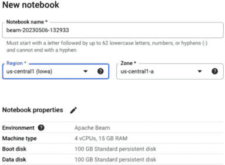

图 6.13：创建用户管理的笔记本

1.  选择您首选的区域和区域。在这种情况下，区域选择并不重要，但我建议选择您在此书之前活动中一直使用的相同区域。

1.  选择**继续**，然后再次**继续**。

1.  选择 E2 作为计算实例类型。

1.  您还可以配置一个空闲超时周期，在此周期后，如果机器空闲这么长时间，它将自动关闭。这有助于节省成本。

1.  选择**继续**多次，直到达到**IAM**和**安全**屏幕

1.  在**IAM 和安全**屏幕中，选择**单用户**选项。参见*图 6.14*以获取参考：

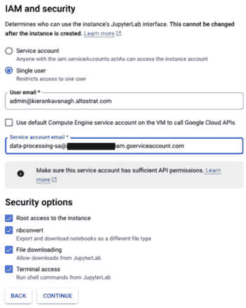

图 6.14：数据流笔记本 – IAM 和安全

注意

您可能记得在*第五章*中创建我们的托管笔记本时执行了类似的步骤（即选择**单用户身份验证**选项）。这允许我们直接使用笔记本，而无需事先将其作为服务账户进行身份验证。

1.  出现的**用户电子邮件**框应自动填充您的登录电子邮件地址。如果不是，请输入您用于登录 Google Cloud 控制台的电子邮件地址。

1.  此外，我们希望我们的笔记本实例使用我们在本章早期创建的服务账户，所以**取消选中**表示**在 VM 上使用默认 Compute Engine 服务账户调用 Google Cloud API**的选项。

1.  在`data`中，你应该会在可用的服务账户列表中看到您在本章早期创建的服务账户的名称（假设您将其命名为`data-processing-sa`，如该部分中建议的）。

1.  在列表中选择该服务账户。

1.  此外，请注意屏幕右上角的**定价摘要**选项。这是如果您整个月都保持笔记本运行，它将花费的估计金额。幸运的是，您在本章中只会使用很短的时间。如果您在创建笔记本时没有配置空闲关闭时间段，请记住在您完成使用后关闭它。

1.  您可以将所有其他选项保留在默认值，并在屏幕底部选择**创建**。

1.  创建笔记本实例需要几分钟。当实例创建完成后，您将在用户管理的笔记本列表中看到它，并且将出现一个打开 JupyterLab 的选项。

1.  选择**打开 Jupyterlab**。

1.  当 JupyterLab 屏幕打开时，是时候将我们的仓库克隆到您的笔记本中了。这个过程与您在*第五章*中执行的过程类似，但您在本章中创建了一个单独的笔记本实例，因此我们需要将仓库克隆到这个实例中。克隆仓库的步骤如下。

1.  点击屏幕左侧菜单中的**Git**符号。该符号看起来就像*图 6**.15*中所示的那样：

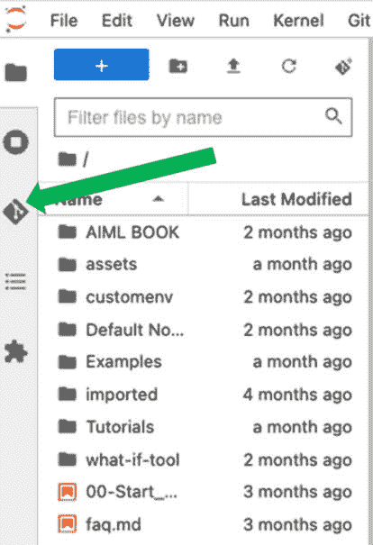

图 6.15：Git 符号

1.  选择**克隆仓库**。

1.  输入我们的仓库 URL：[`github.com/PacktPublishing/Google-Machine-Learning-for-Solutions-Architects`](https://github.com/PacktPublishing/Google-Machine-Learning-for-Solutions-Architects).

1.  如果显示任何选项，请保留它们的默认值。

1.  选择**克隆**。

1.  您应该会在您的笔记本中看到一个名为 `Google-Machine-Learning-for-Solutions-Architects` 的新文件夹。

1.  双击该文件夹，然后双击其中的 `Chapter-06` 文件夹，最后双击 `Streaming_NYC_Taxi_Data.ipynb` 文件以打开它。

1.  在出现的**选择内核**屏幕中，选择 Apache Beam 的最新版本。在撰写本文时，启动器中可用的最新选项是 Apache Beam 2.4.6（参见*图 6**.16*以获取参考）：

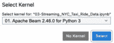

图 6.16：选择笔记本内核

1.  我们打开的笔记本包含大量的 Apache Beam Python 代码，我们可以使用这些代码来处理从公共 Pub/Sub 主题流进的数据。

1.  运行笔记本中的每个单元格，并阅读 markdown 和注释中的说明，以了解我们在做什么。我们正在使用 Apache Beam 定义一个将在 Google Cloud Dataflow 中运行的数据流处理管道。

当你完成笔记本中单元格的运行后，你可以转到 Dataflow 作业控制台，你将看到你的新管道在那里运行。给管道启动和数据处理一些时间，就像之前一样，我建议你点击管道执行图的各种部分，以便更好地理解管道的结构。接下来，让我们在 BigQuery 中验证这个新管道的数据，但同样，不要关闭 Dataflow 控制台，因为你在验证 BigQuery 中的数据后将会回到这里。

## 验证 BigQuery 中的数据

要验证 BigQuery 中的数据，请打开 BigQuery 控制台，在`taxirides`数据集下，你会看到一个由我们的自定义 Dataflow 管道创建的新表，称为`run_rates`。点击由我们的管道计算出的`run_rates`值。

当你在 BigQuery 中验证了数据后，你可以回到 Dataflow 控制台，通过点击屏幕顶部的**停止**来停止 Dataflow 作业。

现在我们已经完成了本节的活动，你可以通过以下步骤关闭你的用户管理的笔记本：

1.  在 Google Cloud 控制台中，导航到**Google Cloud 服务**菜单 → **Dataflow** → **工作台**。

1.  在屏幕顶部，选择**用户管理**的**笔记本**标签。

1.  选择你的笔记本名称旁边的复选框，并在屏幕顶部（在**用户管理**的**笔记本**标签上方）点击**停止**。

笔记本将在几分钟后关闭。

如果一切按预期进行，你现在已经成功创建了一个自定义管道，该管道可以处理和转换飞行中的流数据！

# 摘要

在本章中，你学习了如何从各种来源将数据导入 Google Cloud，并且你发现了在 Google Cloud 中处理数据的重要概念。

你随后学习了如何使用 Vertex AI 和 BigQuery 探索和可视化数据。接下来，你学习了如何使用 Jupyter 笔记本清理和准备数据以供 ML 工作负载使用，然后是如何在 Google Cloud Dataproc 上使用 Apache Spark 以批量方法创建自动数据管道，以在生产规模上执行相同的转换，以及如何使用 Apache Airflow 在 GCC 中自动编排整个流程。

我们随后介绍了与处理流数据相关的重要概念和工具，而你最终使用 Apache Beam 在 Google Cloud Dataflow 上构建了自己的流数据处理管道。

在下一章中，我们将花更多的时间在数据处理和准备上，特别关注特征工程的概念。
