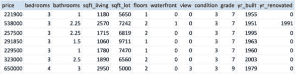
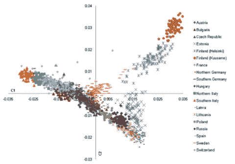
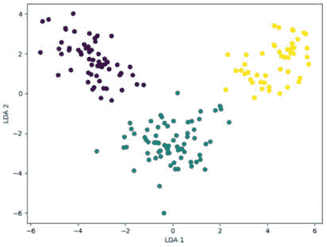
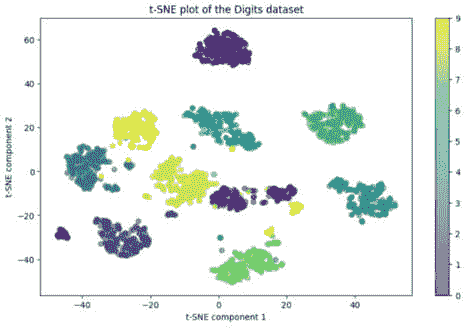
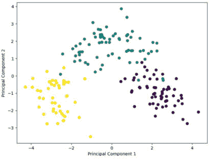
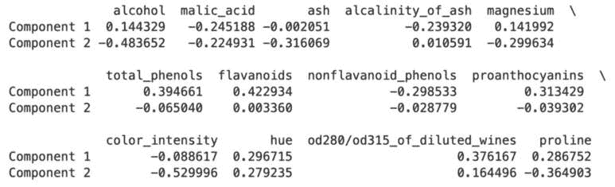
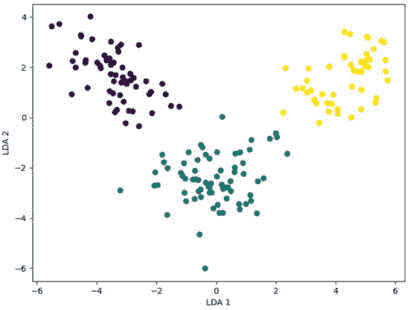
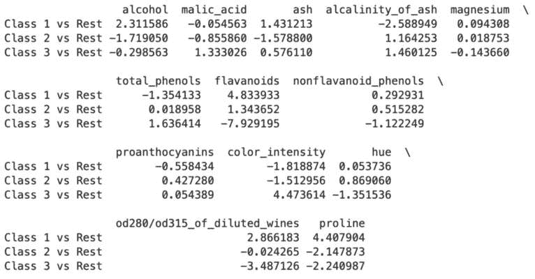
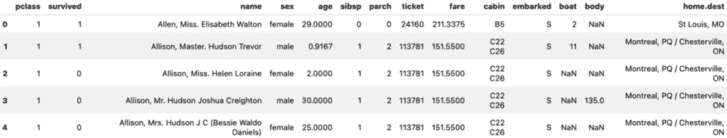
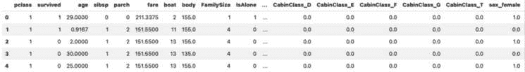

# 7

# 特征工程和降维

在本章中，我们将逐步深入探讨许多数据科学项目中常见的数据处理步骤，以及如何使用 Google Cloud 中的 Vertex AI 来执行这些步骤。我们将从更详细地查看特征在机器学习工作负载中的使用方式以及与特征使用相关的常见挑战开始本章。

然后，我们将讨论如何解决这些挑战，以及如何在 Google Cloud 中有效地使用我们的机器学习特征。

本章涵盖了以下主题：

+   与机器学习中的维度或特征相关的基本概念

+   维度灾难的介绍

+   降维

+   特征工程

+   Vertex AI 特征存储

# 本章的基本概念

在本节中，我们将简要介绍为本章的学习活动提供额外背景的概念。

## 维度和特征

我们在*第一章*中介绍了特征的概念，并使用金县房屋销售数据集作为示例描述了特征。为了简要回顾，特征是我们数据集中观察到的单个、可度量的属性或特征。它们是我们数据集的方面，机器学习算法从中学习以创建模型。换句话说，模型可以被视为算法从我们数据集中的特征中学习到的模式的表示。

例如，房屋的特征包括诸如房间数量、建造年份、位置以及其他描述房屋的因素等信息，如*表 7.1*所示：



表 7.1：金县房屋销售特征

当我们处理表格数据时，特征通常以数据集中的列的形式表示，每一行代表一个单独的数据点或观察结果，有时也被称为**实例**。

特征也被称为变量、属性或维度。因此，当我们谈论数据集的维度时，它与我们数据集中有多少个特征或维度有关，以及这如何影响我们的机器学习工作负载有关。

## 过拟合、欠拟合和正则化

我们在*第二章*中简要讨论了过拟合和欠拟合的概念，由于这些概念对于机器学习过程至关重要，因此在本书中我们将继续更详细地回顾这些主题。在本节中，我们将讨论数据集中特征的数量如何影响我们的算法从数据中学习的方式。一个需要记住的关键概念是，过拟合和欠拟合可以受到我们数据集中观察到的数量以及每个观察到的特征数量的强烈影响。

我们通常需要在数据集的这两个方面之间找到合适的平衡。例如，如果我们对每个观察到的数据点有非常少的观测值和很多特征，那么我们的模型很可能会过度拟合数据集，因为它为这些观测值及其特征学习到了非常具体的模式，但它无法很好地泛化到新的观测值。相反，如果我们有大量的观测值，但每个观测值只有很少的信息（即特征），那么我们的模型可能无法学习到任何有价值的模式，这意味着它将欠拟合我们的数据集。正因为如此，减少特征的数量可以帮助减少过度拟合，但只能到一定程度——去除过多的特征可能会导致欠拟合。此外，我们不想去除那些对模型学习有用的信息，因此，我们可以在保持许多特征的同时，通过使用一种称为正则化的机制来解决过度拟合问题。我们也在*第二章*中简要提到了这一点，我们将在这里更详细地讨论它。

### 正则化

要开始我们关于正则化的讨论，我们需要再次提及机器学习中的损失函数的概念，这是我们已经在*第一章*中介绍过的。记住，许多机器学习算法通过尝试找到每个特征的最好系数（或权重），以实现对目标特征的最近似来工作。因此，过度拟合受到特征与其系数之间的数学关系的影响。如果我们发现模型对特定特征过度拟合，我们可以使用正则化来减少这些特征及其系数对模型的影响。

由于过度拟合通常发生在模型过于复杂的情况下，例如相对于观测值的数量有太多的特征，正则化通过向损失函数中添加惩罚来解决这一问题，这会阻止模型对任何特征赋予过多的重视。这有助于提高模型的泛化能力。

在机器学习中实现正则化的方法有很多，但我会解释两种最常见类型——即**L1**和**L2**正则化——以及这两种方法的组合，称为**弹性网络**。

#### L1 正则化

这种类型的正则化也称为**Lasso**正则化，它通过以下公式通过添加与成本函数中系数或权重的 L1 范数（或绝对值）相等的惩罚来实现：

成本函数 + λ * |权重|

在这里，λ是正则化参数，它控制惩罚的强度，可以被认为是一个超参数，其最佳值可能因问题而异。请注意，如果惩罚太强，可能会导致欠拟合，因此在这方面找到合适的平衡很重要。

L1 正则化的作用是将模型的一些系数缩小到正好为零，从而有效地排除相应的特征，这使得 L1 正则化在处理高维数据时对于特征选择（我们将在稍后更详细地介绍）非常有用。

#### L2 正则化

这种正则化也称为 **岭** 正则化。这种方法通过以下公式在成本函数中添加一个相当于 L2 范数（或平方）的惩罚：

成本函数 + λ * (权重²)

与 L1 正则化不同，L2 正则化不会导致特征的排除，而是将系数推向零附近，在特征之间均匀分配权重。当我们处理相关特征时，这可能是有益的，因为它允许模型考虑所有这些特征。

#### 弹性网络

弹性网络作为 L1 和 L2 正则化的组合，旨在在这两种方法之间提供折衷方案，结合两者的优点。与 L1 和 L2 正则化一样，弹性网络向损失函数添加惩罚，但它不是添加 L1 惩罚或 L2 惩罚，而是通过以下公式添加两者的加权总和：

成本函数 + λ1 * |权重| + λ2 * (权重²)

在这里，λ1 和 λ2 是控制 L1 和 L2 惩罚强度的超参数。如果 λ1 为零，弹性网络回归将退化为岭回归，而如果 λ2 为零，则退化为 Lasso 回归。

弹性网络具有 L1 正则化的特征选择能力（因为它可以将系数缩小到零），以及 L2 正则化的正则化强度（因为它可以在相关特征之间均匀分配权重）。与弹性网络相关的权衡是，它有两个超参数需要调整，而不是 Lasso 或岭回归中只有一个，这可能会使模型更复杂，训练起来计算量更大。

现在我们已经更详细地介绍了正则化这个重要话题，让我们深入探讨特征选择和特征工程。

## 特征选择和特征工程

在本书的前几章中，我们简要地讨论了特征工程，但在这里我们将更详细地探讨这些概念。在*第二章*中，我们通过将每栋房子的总成本除以该房子的总面积（平方英尺）来创建一个新的特征 `price-per-square-foot`，作为我们的住房数据示例。在本章中，我们将探讨许多额外的特征工程示例。

然而，从现有特征中创建新特征并不是我们在为训练机器学习模型准备数据集时需要在特征上进行的唯一活动。我们还需要选择我们认为对实现我们希望模型完成的任务（例如预测房价）最重要的特征。正如我们在*第六章*中看到的，我们可能还需要对特征进行转换，例如确保它们都表示在共同的、标准化的尺度上。

在选择和构建特征时的目标是，以最易于消化的格式为我们模型提供最相关的信息，以便它可以从数据中有效地学习。

## 维度诅咒

高维数据集包含许多维度或特征，每个数据点都有很多。我们可能会假设，我们为每个数据点包含的特征越多，我们的模型学到的信息就越多，因此，我们的模型就越准确。然而，请注意，并非所有特征都同等有用。一些可能对我们的模型几乎没有或没有有用的信息，其他可能包含冗余信息，甚至可能对模型学习的能力有害。机器学习艺术和科学的一部分就是确定使用哪些特征以及如何准备它们，以便模型能够发挥最佳性能。

此外，请记住，我们数据集中包含的信息越多，我们的模型需要处理的信息就越多。这直接导致我们的机器学习算法处理数据集时需要更多的计算资源，这反过来又直接导致模型训练时间更长，成本增加。数据集中过多的无关数据或**噪声**也可能使算法更难识别（即学习）数据中的模式。因此，理想的情况是找到提供最大有用信息的最小特征数量。例如，如果我们可以用三个特征或十个特征达到相同的结果，那么通常选择使用三个特征会更好。“最大有用信息”可以通过**方差**来衡量，其中具有高相对方差的特征对我们的模型结果影响最为显著，而相对方差小的特征在训练模型识别模式时通常不太有用。

“维度诅咒”是数据科学行业用来描述处理包含更多维度的数据集时出现的挑战的术语。让我们看看这些挑战中的一些。在随后的章节中，我们将讨论解决这些挑战的机制。

### 数据探索挑战

这是我们可以引入数据集中的“维度”与物理空间维度之间联系的重要点。众所周知，正如本书前面提到的，人类只能感知到最多三个维度的物理世界（宽度、高度和深度），而“时间”被视为我们物理现实的第四维度。对于具有两个或三个维度的数据集，我们可以轻松创建表示那些数据集各个方面的可视化，但我们无法创建更高维数据集的图表或其他视觉表示。在这种情况下，如果我们能尝试找到其他方法来视觉解释这些数据集，比如将它们投影到低维表示中，这会很有帮助，我们将在稍后更详细地探讨这一点。

### 特征稀疏性

在高维空间中，数据集中的点（即实例或样本）往往彼此相距甚远，导致稀疏性。一般来说，随着特征数量相对于数据集中观察值的数量的增加，特征空间变得越来越稀疏，这种稀疏性使得算法从数据中学习变得更加困难，因为它们在任意给定点的附近有更少的例子可以学习。

例如，让我们假设我们的数据集包含有关公司客户的信息，在这种情况下，数据集中的每个实例代表一个人，每个特征代表一个人的某种特征。如果我们的数据集存储了数百甚至数千个特征，那么不太可能每个特征都会被填充。因此，我们数据集的整体特征空间将是稀疏的。另一方面，如果我们有较少的特征，这种情况发生的可能性较小。

### 距离测量

在前面的章节中，我们讨论了欧几里得距离在许多机器学习算法中的应用，用于寻找数据集中数据点之间潜在的关联或差异。我们已经探讨的这种概念的最直接例子之一是 K-means 聚类算法。在高维空间中，距离有时可能变得不那么有意义，因为最大可能距离和最小可能距离之间的差异变得越来越小。这意味着传统的距离度量，如欧几里得距离，也变得不那么有意义，这可能会特别影响依赖于距离的算法，例如**k 近邻**（**kNN**）或聚类算法。

### 过度拟合和增加的数据需求

回顾我们之前关于过拟合或欠拟合如何受数据集中观察值与特征比例影响的讨论，高维数据集更容易过拟合，除非我们有大量的观察值来帮助我们的模型泛化。记住我们在本章前面提到的关于算法处理数据量与训练模型成本之间关系的内容。具有大量观察值和大量特征的数据集将更昂贵且更难训练和管理。

### 可解释性和可解释性

可解释性和可解释性指的是我们理解和解释我们的机器学习模型如何工作的能力。这有多个原因，我们将在下面简要讨论。首先，对我们模型工作原理的不理解阻碍了我们改进这些模型的能力。然而，更重要的是，我们需要确保我们的模型尽可能公平和无偏见，这就是可解释性发挥关键作用的地方。如果我们不能解释我们的模型为何产生特定的结果，那么我们就无法充分评估其公平性。一般来说，我们的数据集维度越高，我们的模型往往越复杂，这会直接影响（即减少）可解释性和可解释性。

现在我们已经回顾了一些与高维数据集相关联的常见挑战，让我们来看看一些解决这些挑战的机制。

## 维度降低

如你所想，解决维度过多挑战的第一种方法就是减少维度数量，为此我们可以使用两种主要的技术：特征选择和特征投影。

### 特征选择

这涉及到从原始特征中选择一个子集。特征选择有几种策略，包括以下几种：

+   过滤方法，这些方法根据统计指标对特征进行排序，并选择排名最高的特征子集

+   包装方法，这些方法使用不同的输入特征子集评估多个模型，并选择导致最高模型性能的子集

+   嵌入方法，这些方法使用具有内置特征选择方法的机器学习算法（例如 Lasso 正则化）

同样重要的是要理解，我们将讨论的特征投影方法可以用来帮助我们选择数据集中最重要的特征子集，因此这些概念之间有一些重叠。

### 特征投影

在特征投影中，我们使用数学变换将特征投影到低维空间。在本节中，我们将介绍三种流行的特征投影技术：**主成分分析**（**PCA**）、**线性判别分析**（**LDA**）和**t-分布随机邻域嵌入**（**t-SNE**）。

#### PCA

主成分分析（PCA）是一种**无监督**算法，旨在在尽可能保持原始数据方差的同时，降低我们的特征空间的维度。在高维数据空间中，PCA 识别出数据变化最大的轴（主成分）。这些主成分是正交的，意味着在这个多维空间中它们彼此之间成直角。**第一个主成分**（**PC1**）捕捉数据中最大方差的方向。**第二个主成分**（**PC2**）在正交于 PC1 的同时，捕捉剩余的最大方差，依此类推。PCA 的过程通常包括以下步骤：

1.  如果特征具有不同的尺度，则对数据进行标准化。这是很重要的，因为 PCA 对特征尺度很敏感，尺度较大的特征可能会被错误地认为是更占主导地位的。

1.  计算协方差矩阵以了解不同特征是如何一起变化的。协方差矩阵是一个方阵，包含了每对特征之间的协方差。两个特征之间的协方差衡量了这些特征是如何一起变化的：正协方差表示特征一起增加或减少，而负协方差表示一个特征增加而另一个减少。

1.  计算协方差矩阵的**特征值**和**特征向量**。特征向量代表新空间的方向或成分，特征值代表每个成分的大小或解释方差。特征向量通常被称为数据的**主成分**，它们构成了新特征空间的一个基。

1.  对特征值及其对应的特征向量进行排序。在计算了特征值及其相关的特征向量之后，下一步是对特征值按降序排序。具有最高对应特征值的特征向量是 PC1。具有第二高对应特征值的特征向量是 PC2，依此类推。这种排序的原因是每个特征向量的重要性由其特征值的大小给出。

1.  选择主成分的子集。PCA 创建与原始数据集中变量数量一样多的主成分。然而，由于 PCA 的目标是降维，我们通常选择主成分的子集，称为**前 k 个**主成分，这些主成分捕捉了数据中的最大方差。这一步是降低维度的原因，因为较小的特征值及其向量被丢弃。

1.  转换原始数据。PCA 的最后一步是将原始数据转换成由所选主成分定义的降维子空间，这是通过将原始数据矩阵乘以前*k*个特征向量的矩阵来实现的。

转换后的数据现在可以用于进一步的分析和可视化（如图*图 7.1*所示），或者作为机器学习算法的输入。重要的是，这个减少的数据集尽可能地保留了原始数据中的方差（考虑到减少的维度数）：



图 7.1：欧洲遗传结构的 PCA 可视化（来源：https://commons.wikimedia.org/wiki/File:PCA_plot_of_European_individuals.png）

PCA 是一种强大的技术，用途广泛，但它也有局限性。例如，它假设主成分是原始特征的线性组合。如果这不是这种情况（即，如果数据中的潜在结构是非线性的），那么 PCA 可能不是最佳降维技术。还值得注意的是，主成分比原始特征更难以解释——它们在原始特征方面没有直观的意义。

#### LDA

LDA 是一种**监督**算法，旨在找到最佳分离对象类别的特征线性组合。然后可以使用这个组合进行降维。它涉及以下步骤：

1.  计算类均值。对于数据集中的每个类别，计算均值向量，这仅仅是该类别中所有向量的平均值。

1.  计算类内协方差矩阵，它衡量各个类别如何围绕各自的均值分散。

1.  计算类间协方差矩阵，它衡量类别均值在数据总体均值周围如何分散。

1.  计算线性判别方向，这些方向是特征空间中类别最佳分离的方向。

1.  对线性判别方向进行排序。就像在 PCA 中一样，特征向量按照它们对应的特征值降序排列。特征值表示每个判别所解释的数据方差量。前几个线性判别方向，对应于最大的特征值，是解释最大方差的方向。

1.  最后，数据被投影到由前几个线性判别方向张成的空间中。

这导致数据在低维表示中类别最大化分离。我们可以如下可视化：



图 7.2：葡萄酒品种的 LDA 图

重要的是要注意，LDA 的主要假设是类别具有相同的协方差矩阵。如果这个假设不成立，LDA 可能表现不佳。

## t-SNE

这种方法可能拥有所有方法中最酷的名字。它是一个**无监督**的非线性降维算法，特别适合将高维数据嵌入到二维或三维空间中，同时旨在使相似实例靠近，不同实例分离。它是通过将高维数据映射到低维空间，以保留点之间的大部分相对距离来实现这一点的。它包括以下步骤：

1.  **在高维空间中计算相似性**：t-SNE 首先计算高维空间中数据点对相似的概率。彼此靠近的点有更高的被选中概率，而彼此远离的点有更低的被选中概率。

1.  **在低维空间中计算相似性**：t-SNE 随后计算低维表示中点对相似性的概率。

1.  **优化**：最后，t-SNE 使用梯度下降来最小化高维和低维空间中概率的差异。目标是使相似对象由低维空间中的邻近点表示，不同对象由低维空间中的远点表示。

t-SNE 的结果是一张地图，以人类更容易理解的方式揭示了高维数据的结构。

应该注意的是，虽然 t-SNE 在可视化方面非常出色，可以揭示数据中的簇和结构（如图*图 7.3*所示），但它并不像 PCA 那样提供关于数据中特征重要性或含义的明确信息。它更多的是一种探索性工具，可以帮助进行降维，而不是一种正式的降维技术：



图 7.3：数字数据集的 t-SNE 可视化

现在我们已经介绍了一些最受欢迎的特征投影技术，让我们再讨论一组关于我们数据集中的特征如何影响模型训练的重要概念。

# 使用 PCA 和 LDA 进行降维

我们将在本章中通过使用 PCA 和 LDA 进行降维来开始我们的动手活动。我们可以使用 scikit-learn 中的葡萄酒数据集作为例子。我总是希望我能通过成为一个葡萄酒专家来给我的朋友们留下深刻印象，但我几乎无法区分 10 美元一瓶的酒和 500 美元一瓶的酒，所以，我将使用数据科学来发展令人印象深刻的知识。

葡萄酒数据集是一个多变量数据集的例子，它包含了在意大利同一地区种植但来自三种不同葡萄品种（称为`栽培品种`）的葡萄酒的化学分析结果。分析的重点是量化三种葡萄酒类型中发现的 13 种成分。

使用 PCA 处理这个数据集将帮助我们理解重要的特征。通过观察原始特征在主成分中的权重，我们可以看到哪些特征对葡萄酒数据集中的变异性贡献最大。

再次，我们可以使用在*第五章*中创建的相同的 Vertex AI Workbench 笔记本实例来完成此目的。请在笔记本实例上打开 JupyterLab 并执行以下步骤：

1.  在屏幕左侧的目录浏览器中，导航到`Chapter-07`目录并打开`dimensionality-reduction.ipynb`笔记本。

1.  选择**Python (Local**)作为内核。

1.  通过选择单元格并按键盘上的*Shift* + *Enter*来运行笔记本中的每个单元格。

笔记本中的代码执行以下活动：

1.  首先，它导入必要的库。

1.  然后，它加载数据集。

1.  接下来，它标准化了葡萄酒数据集的特征。它应用主成分分析（PCA）将维度降低到二维（即前两个主成分）。这是通过使用`fit_transform()`方法完成的，该方法将 PCA 模型拟合到数据上，然后转换数据。

1.  最后，它在两个主成分的空间中可视化数据，根据葡萄酒的类型对点进行着色：

    ```py
    from sklearn.datasets import load_wine
    from sklearn.preprocessing import StandardScaler
    from sklearn.decomposition import PCA
    import matplotlib.pyplot as plt
    import pandas as pd
    # Load dataset
    data = load_wine()
    df = pd.DataFrame(data.data, columns=data.feature_names)
    # Standardize the features
    scaler = StandardScaler()
    df = scaler.fit_transform(df)
    # Apply PCA
    pca = PCA(n_components=2)
    principalComponents = pca.fit_transform(df)
    principalDf = pd.DataFrame(data = principalComponents, 
        columns = ['principal component 1', 
            'principal component 2'])
    # Visualize 2D Projection
    plt.figure(figsize=(8,6))
    plt.scatter(principalDf['principal component 1'], principalDf['principal component 2'], c=data.target)
    plt.xlabel('Principal Component 1')
    plt.ylabel('Principal Component 2')
    plt.show()
    ```

    结果可视化应类似于*图 7**.4*所示：



图 7.4：葡萄酒数据集的 PCA 散点图

散点图应显示不同类型葡萄酒之间的清晰分离，这表明葡萄酒的类型与其化学成分密切相关。此外，PCA 对象（在我们的代码中命名为`pca`）存储了`components_`属性，其中包含每个特征与主成分的映射。通过检查这些，我们可以找出哪些特征在区分葡萄酒类型时最为重要。

可视化中的每个数据点代表我们数据集中的一个单独样本，但不是在原始的高维特征空间中绘制，而是在由主成分定义的较低维空间中绘制。

在葡萄酒数据集的上下文中，PCA 可视化中的每个数据点代表一个单独的葡萄酒样本。因为我们已经将原始的 13 个特征映射到两个 PCA 维度，所以每个点在*X*和*Y*轴上的位置对应于该葡萄酒样本的第一个和第二个主成分的值。

每个点的颜色代表葡萄酒样本的真实类别（来自三种不同的品种）。通过根据它们的真实类别着色点，你可以看到 PCA 转换在降维空间中如何将不同的类别分开。

记住，每个主成分是原始特征的线性组合，因此每个点的位置仍然由其原始特征值决定。这样，PCA 使我们能够可视化高维数据，并突出显示最大方差维度，这些维度通常是最具信息量的。

然后，我们可以访问拟合的 PCA 对象的`components_`属性来查看各个成分。该属性返回一个矩阵，其中每一行对应一个主成分，每一列对应一个原始特征。

因此，以下代码将打印一个表格，其中表格中的值代表每个成分中每个特征的权重：

```py
components_df = pd.DataFrame(pca.components_, 
    columns=data.feature_names, index=['Component 1', 'Component 2'])
print(components_df)
```

结果应该类似于*表 7.2*中所示：



表 7.2：葡萄酒数据集的 PCA 成分和特征

通过查看这些权重的绝对值，我们可以确定哪些特征对每个主成分最重要。大的绝对值对应于在捕捉该主成分变化中起重要作用的特征，权重的符号（正或负）可以告诉我们特征与主成分之间关系的方向。

接下来，让我们看看如何使用 LDA 来识别导致不同类型葡萄酒之间差异最大的成分。同样，我们首先导入必要的库并标准化数据。然后，我们将对标准化特征应用 LDA，指定`n_components=2`以获得二维投影，然后拟合 LDA 模型到数据并对前两个 LDA 成分进行数据转换。最后，我们将可视化转换后的数据：

```py
from sklearn.discriminant_analysis import LinearDiscriminantAnalysis as LDA
# Apply LDA
lda = LDA(n_components=2)
lda_components = lda.fit_transform(df, data.target)
lda_df = pd.DataFrame(data = lda_components, 
    columns = ['LDA 1', 'LDA 2'])
# Visualize 2D Projection
plt.figure(figsize=(8,6))
plt.scatter(lda_df['LDA 1'], lda_df['LDA 2'], c=data.target)
plt.xlabel('LDA 1')
plt.ylabel('LDA 2')
plt.show()
```

结果可视化应该类似于*图 7**.5*中所示：



图 7.5：葡萄酒数据集的 LDA 散点图

在这种情况下，散点图显示了第一二个 LDA 成分空间中的数据点，点再次根据葡萄酒类型着色。我们还应该看到不同类型葡萄酒之间的清晰分离，这表明它们具有不同的化学成分分布。

就像我们检查拟合的 PCA 对象的`components_`属性一样，我们可以查看拟合的 LDA 对象的`coef_`属性来查看最具判别性的特征，如下面的代码及其相应的输出所示：

```py
# Create and print a DataFrame with the LDA coefficients and feature names
coef_df = pd.DataFrame(lda.coef_, columns=data.feature_names, 
    index=['Class 1 vs Rest', 'Class 2 vs Rest', 'Class 3 vs Rest'])
print(coef_df)
```

结果应该类似于*表 7.3*中所示：



表 7.3：葡萄酒数据集的 LDA 类别和特征

在生成的表中，每一行对应一个类别（与其他类别相比），每一列对应一个原始特征。因此，表中的值代表线性判别分析中每个特征的系数。类似于我们的 PCA 评估，绝对值大的特征表示对区分类别有显著贡献的特征。

现在我们已经了解了如何降低数据集的维度，让我们假设我们已经确定了所需的特征，并开始探索我们如何进一步工程特征以确保我们有最佳可能的特征集来训练我们的模型。

# 特征工程

特征工程可以构成数据科学家活动的大部分内容，它对他们成功的重要性可能与其选择正确的机器学习算法一样重要，有时甚至更重要。在本节中，我们将更深入地探讨特征工程，这可以被视为一种艺术和科学。

我们将使用 OpenML 上可用的 *Titanic* 数据集（[`www.openml.org/search?type=data&sort=runs&id=40945`](https://www.openml.org/search?type=data&sort=runs&id=40945)）在本节中的示例。此数据集包含关于泰坦尼克号乘客的信息，包括人口统计数据、票务等级、票价以及他们是否在船沉没中幸存。

在您的 Vertex AI Workbench Notebook 实例的 JupyterLab 中的 `Chapter-07` 目录下，打开 `feature-eng-titanic.ipynb` 笔记本，并将内核选择为 **Python (Local)**。再次，通过选择单元格并在键盘上按下 *Shift* + *Enter* 来运行笔记本中的每个单元格。

在这个笔记本中，代码执行以下步骤：

1.  首先，它导入必要的库。

1.  然后，它加载数据集。

1.  然后，它执行一些初步探索，以查看我们的数据集看起来如何。

1.  最后，它工程新的特征。

让我们更详细地查看每个步骤，从导入所需的库、加载数据集和探索数据集开始。我们使用以下代码来完成这些任务：

```py
import pandas as pd
import numpy as np
from sklearn.impute import SimpleImputer
from sklearn.preprocessing import OneHotEncoder
# Load the data
titanic_raw = pd.read_csv('./data/titanic_train.csv')
titanic_raw.head()
```

`head()` 方法的输出结果应类似于 *表 7.4* 中所示：



表 7.4：Titanic 数据集 head() 输出

数据集中的字段如下：

+   `survived`：表示乘客是否幸存。这是一个二进制特征，其中 1 表示幸存，0 表示未幸存。

+   `pclass`（乘客等级）：表示乘客票的等级。它有三个类别：1 表示头等舱，2 表示二等舱，3 表示三等舱。这也可以表示乘客的社会经济状况。

+   `name`：乘客的名字。

+   `sex`：乘客的性别；男性或女性。

+   `age`：乘客的年龄。有些年龄是分数，对于年龄小于 1 岁的乘客，年龄估计为分数。

+   `sibsp`: 乘客在泰坦尼克号上的兄弟姐妹和配偶总数。

+   `parch`: 乘客在泰坦尼克号上的父母和子女总数。

+   `ticket`: 乘客的票号。

+   `fare`: 乘客票价——即票的成本。

+   `cabin`: 乘客所住的船舱号。一些条目是 NaN，表示数据中缺少船舱号。

+   `embarked`: 乘客登船的港口。C 代表瑟堡；Q 代表昆士敦；S 代表南安普顿。

+   `boat`: 乘客被分配到的救生艇（如果乘客幸存）。

+   `body`: 身体编号（如果乘客未幸存且其尸体被找回）。

+   `home.dest`: 乘客的家乡和目的地。

假设我们想要使用这个数据集来构建一个模型，该模型可以根据乘客记录的信息预测乘客生存的可能性，让我们看看我们是否可以使用一些领域知识来评估哪些特征可能是对生存或死亡结果影响最大的贡献者，以及我们是否可以使用任何数据操作技术来构建更有用的特征。

`Passenger Class` 是一个可能的重要特征，我们可以从它开始考虑，因为头等舱和二等舱乘客的船舱位于更高的船层，这些船舱更靠近救生艇。

乘客的名字不太可能影响结果，他们的票号或登船港口也是如此。然而，我们可以构建一个名为 `Title` 的新特征，该特征从乘客的名字中提取出来，并可能提供有关社会地位、职业、婚姻状况和年龄的有价值信息，这些信息可能不会立即从其他特征中明显看出。我们还可以通过合并类似头衔，如 `Miss` 和 `Ms`，并将高级头衔标识为 `Distinguished` 来清理这个新特征。执行此操作的代码如下：

```py
# We first define a function to extract titles from passenger names
def get_title(name):
    if '.' in name:
        return name.split(',')[1].split('.')[0].strip()
    else:
        return 'Unknown'
# Create a new "Title" feature
titanic['Title'] = titanic['Name'].apply(get_title)
# Simplify the titles, merge less common titles into the same category
titanic['Title'] = titanic['Title'].replace(['Lady', 'Countess', 
    'Capt', 'Col', 'Don', 'Dr', 'Major', 'Rev', 'Sir', 'Jonkheer', 
    'Dona'], 'Distinguished')
titanic['Title'] = titanic['Title'].replace('Mlle', 'Miss')
titanic['Title'] = titanic['Title'].replace('Ms', 'Miss')
titanic['Title'] = titanic['Title'].replace('Mme', 'Mrs')
```

接下来，让我们考虑 `Fare` 和 `Cabin` 特征。这些特征可能与阶级有些相关，但我们将更详细地探讨这些特征。对于 `Cabin` 特征，我们可以提取另一个名为 `CabinClass` 的新特征，它更清楚地表示与每个条目相关的阶级。例如，我们可以通过从船舱号中提取第一个字母，用它来表示船舱阶级（例如，A、B、C 等），并将其存储在新的 `CabinClass` 特征中。执行此操作的代码如下：

```py
# Create "CabinClass" feature
titanic['CabinClass'] = titanic['Cabin'].apply(lambda x: x[0])
```

让我们确保尽可能准确地表示票价，考虑到人们可能作为一家人一起旅行购买了票价。为此，我们可以创建一个名为 `FamilySize` 的新特征，它是 `SibSp` 和 `Parch` 特征的组合（为当前乘客添加一个额外的“1”），然后通过以下代码通过将 `Fare` 特征除以 `FamilySize` 特征来计算 `FarePerPerson`：

```py
titanic['FamilySize'] = titanic['SibSp'] + titanic['Parch'] + 1
# Create "FarePerPerson" feature
titanic['FarePerPerson'] = titanic['Fare'] / titanic['FamilySize']
```

一个人是独自旅行还是与家人同行也可能影响他们的生存机会。例如，家庭成员在试图到达救生艇时可以互相帮助。因此，让我们从 `FamilySize` 特征中创建一个特征，以确定乘客是否独自旅行：

```py
# Create new feature "IsAlone" from "FamilySize"
titanic['IsAlone'] = 0
titanic.loc[titanic['FamilySize'] == 1, 'IsAlone'] = 1
```

接下来，让我们考虑年龄如何影响生存的可能性。非常年轻或年长的人，不幸的是，如果没有他人的帮助，生存的可能性可能较小。然而，在考虑年龄的这种情况下，我们可能不需要按年或按分数年进行粒度划分，也许将人们分组到年龄组可能更有效。在这种情况下，我们可以使用以下代码创建一个名为 `AgeGroup` 的新特征，该特征将按十年分组，例如 0-9、10-19、20-29 等：

```py
# Create "AgeGroup" feature
bins = [0, 10, 20, 30, 40, 50, 60, 70, np.inf]
labels = ['0-9', '10-19', '20-29', '30-39', '40-49', '50-59', '60-69', 
    '70+']
titanic['AgeGroup'] = pd.cut(titanic['Age'], bins=bins, labels=labels)
```

我们还希望将分类特征转换为数值，使用独热编码，因为机器学习模型通常需要数值。我们可以这样做（我们需要为所有分类特征都这样做）：

```py
# Convert "Title" into numerical values using one-hot encoding
one_hot = OneHotEncoder()
title_encoded = one_hot.fit_transform(titanic[['Title']]).toarray()
title_encoded_df = pd.DataFrame(title_encoded, 
    columns=one_hot.get_feature_names_out(['Title']))
titanic = pd.concat([titanic, title_encoded_df], axis=1)
```

现在，让我们删除那些我们知道对预测生存可能性（以及我们编码的原始特征）没有价值的特征：

```py
titanic = titanic.drop(['name', 'ticket', 'Title', 'cabin', 'sex', 
    'embarked', 'AgeGroup', 'CabinClass', 'home.dest'], axis=1)
```

然后，我们可以快速查看我们的更新数据集看起来像什么：

```py
titanic.head()
```

`head()` 方法的输出结果应类似于 *表 7.5* 中所示：



表 7.5：更新数据集的 head() 方法输出

在这一点上，我们有一个增强的数据集，其中包含可用于训练模型的工程化特征。重要的是要记住，我们在源数据集上执行的任何特征工程步骤，在用我们的模型进行预测时也需要考虑。这种在机器学习中的常见需求促使 Google Cloud 开发了一个名为特征存储的服务。我们将在下一节中探讨这一点。

# Vertex AI 特征存储

在本章中，我们进行了大量的特征工程工作。请注意，我们执行了数据转换并创建了新的特征，因为我们有理由相信原始数据不足以训练一个适合我们业务案例的机器学习模型。这意味着模型在现实世界中看到的原始数据通常不会包含我们在训练期间对数据进行增强的部分。在完成所有这些工作之后，我们通常会保存我们已工程化的更新特征，以便模型在需要做出预测时可以引用它们。Vertex AI 特征存储就是为了这个目的而创建的。我们在 *第三章* 中简要提到了 Vertex AI 特征存储，在本节中，我们将更详细地探讨它是什么以及我们如何使用它来存储和提供训练和推理所需的特征。

## Vertex AI Feature Store 简介

这里是来自 Google Cloud 文档的官方定义：

Vertex AI Feature Store 是一个托管、云原生的特征存储服务，它是 Vertex AI 的核心组成部分。它通过允许你在 BigQuery 表或视图中管理你的特征数据，简化了你的机器学习特征管理和在线服务流程。然后，你可以直接从 BigQuery 数据源在线提供特征。Vertex AI Feature Store 提供资源，允许你通过指定你的特征数据源来设置在线服务。然后，它作为元数据层与 BigQuery 数据源接口，以低延迟直接从 BigQuery 为在线预测提供最新的特征值。

除了存储和提供我们的特征外，Vertex AI Feature Store 还与 Google Cloud Dataplex 集成，提供特征治理能力，包括跟踪特征元数据（如特征标签和版本）的能力。在*第十三章*中，我们将深入探讨数据治理的重要性，并讨论如何将 Dataplex 用作构建强大治理框架的重要组件。

到目前为止，重要的是要强调，Vertex AI Feature Store 在 2023 年推出了一个全新的版本。因此，现在在 Google Cloud 中我们可以选择两种不同的特征存储服务版本，先前版本被称为 Vertex AI Feature Store（Legacy），而新版本则简单地称为 Vertex AI Feature Store。我们将在本章中讨论这两种版本，以及它们之间的一些主要区别。为了为后续章节的内容提供背景，我将简要描述在线与离线特征服务的话题。

## 在线与离线特征服务

简而言之，**在线服务**指的是交互发生在实时的情况——也就是说，请求实体或客户端发送请求并同步等待响应。在这种情况下，需要尽可能减少延迟。另一方面是**离线服务**，它指的是请求实体或客户端不同步等待响应，操作允许在更长的时间内发生。在这种情况下，延迟通常不是主要关注的问题。这个概念与在线和离线推理的主题密切相关，我们将在*第十章*中详细讨论。

在离线特征服务的情况下，Vertex AI Feature Store 允许我们直接在 Google Cloud BigQuery 数据集中存储和提供特征。这是一个相当方便的选项，因为许多 Google Cloud 客户已经使用 BigQuery 来存储和分析大量数据。

在在线特征服务的情况下，现在有两种方式可以在 Vertex AI 特征存储中提供我们的特征。第一种选择使用 Google Cloud Bigtable 来提供我们的特征。Google Cloud Bigtable 是一个专为服务大量数据（数以兆字节计的数据）而设计的强大服务。

在线特征服务的第二种选择，被称为**优化在线服务**，作为 Vertex AI 特征存储新版本的一部分被添加，允许我们创建一个专门针对以极低延迟提供特征数据的在线商店。

选择哪种选项取决于你的用例需求，特别是你是否需要处理非常大的数据量，或者你是否需要以极低延迟提供你的特征。成本也是这个决定的一个考虑因素，考虑到 Bigtable 解决方案通常比优化在线服务解决方案成本低。

在本章和随附的 Jupyter Notebook 中，我们将主要关注优化在线服务方法。以下部分将更深入地探讨在 Vertex AI 特征存储中设置在线特征服务的过程。

### 在线特征服务

从高层次来看，以下步骤是使用 Vertex AI 特征存储设置在线服务所需的。我们将在后续章节中详细阐述这些步骤：

1.  在 BigQuery 中准备数据源。

    可选：通过创建特征组和特征在特征注册表中注册数据源。

1.  设置在线商店并展示资源以呈现特征数据源。

1.  从特征视图中提供最新的在线特征值。

让我们更详细地看看这些概念。

#### 特征注册

当使用优化的在线服务方法时，我们可以选择一个步骤来在我们的 Vertex AI 特征注册表中注册我们的特征，该注册表也已被添加为 Vertex AI 特征存储新版本的一个组件。

这涉及到创建称为**特征组**的资源的过程，这些特征组代表特征列的逻辑分组，并与特定的 BigQuery 源表或视图相关联。反过来，特征组包含称为**特征**的资源，这些特征代表特征组所表示的数据源中包含特征值的特定列。

即使我们不将我们的 BigQuery 数据源添加到特征注册表中，我们仍然可以在网上提供特征，但请注意，特征注册表提供了额外的功能，例如存储与你的特征相关的历史时间序列数据。因此，我们将在这个章节的实践练习中使用特征注册表。现在，让我们更详细地看看设置在线特征服务的过程。

#### 在线特征存储和特征视图

在我们设置好 BigQuery 中的特征数据后，并可选地在特征注册表中注册特征组和特征，我们需要设置两种主要类型的资源来启用在线特征服务：

+   一个**在线服务集群实例**，也称为**在线存储**。请记住，我们可以使用 Bigtable 进行在线特征服务或新发布的优化在线特征服务选项。

+   一个或多个**特征视图实例**，其中每个特征视图都与一个特征数据源相关联，例如在我们的特征注册表中的特征组（如果我们选择了在特征注册表中注册我们的特征选项），或者一个 BigQuery 源表或视图。

在创建特征视图后，我们可以配置同步设置，以确保我们的 BigQuery 中的特征数据与我们的特征视图同步。我们可以手动触发同步，但如果我们的源数据预计会随时间更新，我们还可以配置一个计划，定期从数据源刷新我们的特征视图内容。

现在我们已经涵盖了与 Vertex AI Feature Store 相关的许多重要概念，是时候深入其中，构建我们自己的特征存储库了！

## 构建我们的特征存储库

在本节中，我们将进行实际练习，以实现我们在前一节中学到的概念。

### 使用我们的 Vertex AI 笔记本构建特征存储库

在*第五章*中我们创建的 Vertex AI 笔记本实例中，我们可以执行以下步骤来构建特征存储库：

1.  选择**打开 JupyterLab**以打开我们在*第五章*中创建的 Vertex AI 笔记本实例。

1.  当 JupyterLab 打开时，您应该会在笔记本中看到一个名为 `Google-Machine-Learning-for-Solutions-Architects` 的文件夹。

1.  双击该文件夹，然后在该文件夹内双击 `Chapter-07` 文件夹，最后双击 `feature-store.ipynb` 文件以打开它。

1.  在出现的**选择内核**屏幕上，选择**Python (Local)**。

1.  按*Shift* + *Enter*运行笔记本中的每个单元格，并阅读 Markdown 和注释中的说明，以了解我们在做什么。

现在您已经按照笔记本中的步骤执行了特征选择和工程，构建了特征存储库，并使用了一些特征来训练模型，让我们看看这些特征在推理时间如何被使用。在后面的章节中，您将学习如何部署模型进行在线推理并向这些模型发送推理请求，但就目前而言，我将从概念层面解释这个过程。

## 特征在在线推理过程中的使用

在本节中，我将使用我们在配套的 Jupyter Notebook 中构建的出租车费用预测模型用例作为示例，来解释我们如何在推理过程中使用特征存储库中的特征。我们将查看过程中的每个步骤。

### 结合实时和预计算特征

例如，当前接车时间（`pickup_datetime`）、`pickup_location`和`passenger_count`等特征可以在每次出租车行程开始时实时获取。

我们的特征存储还包含预计算的特征，例如历史行程距离、每英里费用、接车时间和位置。这些特征可以根据当前行程的上下文从可用的实时特征中选择。

为了获取预计算的特征，处理出租车行程的应用程序可以向我们的特征存储发送请求，传递标识符，如当前时间和位置，之后特征存储可以返回这些标识符的相关特征值。

### 预测数据组装

在这一点上，我们可以将实时数据和获取到的特征组装成一个与模型期望格式匹配的特征向量，然后将组装好的特征向量传递给模型。模型随后处理这个向量，并输出一个费用预测，该预测随后可以在应用程序中显示。

干得好！你已经成功在 Google Cloud 上构建了一个特征存储。让我们总结一下本章中我们讨论的所有内容。

# 摘要

在本章中，我们讨论了我们的特征质量以及数据集中特征与观察值的比率如何影响我们的算法从数据中学习。我们讨论了当我们的数据集中包含许多特征时可能出现的挑战，以及如何通过使用诸如降维等机制来解决这些挑战。我们深入探讨了降维技术，如特征选择和特征投影，包括 PCA、LDA 和 t-SNE 等算法，并查看了一些使用这些算法的实例，通过实际操作活动来实现。

接下来，我们深入探讨了特征工程技术，其中我们增强了一个源数据集以创建包含原始数据集中不易获得的信息的新特征。最后，我们深入探讨了 Vertex AI 特征存储，了解我们如何使用该服务来存储和提供我们的工程特征集。

在下一章中，我们将把我们的关注点从模型所学习的数据集和参数转移到讨论影响模型学习方式的不同类型的参数。在那里，我们将探讨超参数和超参数优化的概念。
