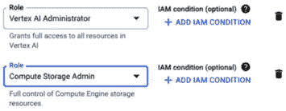
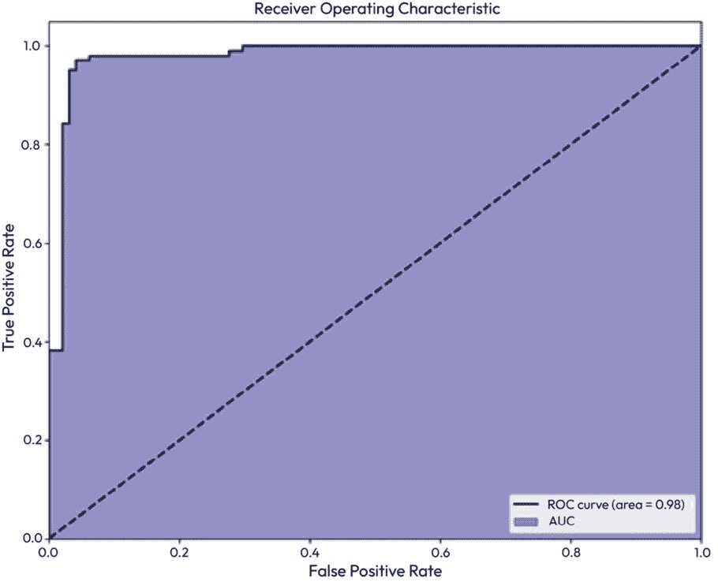
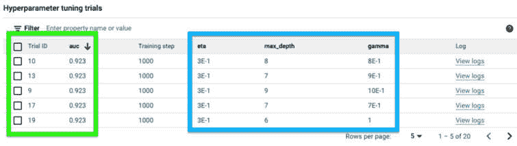

# 第八章：超参数和优化

我们在 *第二章* 中介绍了超参数和超参数优化（或调整）的概念。在本章中，我们将更详细地探讨这些概念，并使用 Google Cloud 产品，如 Vertex AI Vizier，来定义和运行超参数调整作业。

按照我们建立的模式，我们将首先介绍本章实践活动中所需的先决条件。然后，我们将介绍与本章内容相关的一些重要基本概念，最后，我们将进行实践操作，教您如何在现实场景中应用这些概念。

本章涵盖了以下主题：

+   先决条件和基本概念

+   什么是超参数？

+   超参数优化

+   实践：在 Vertex AI 中进行超参数调整

让我们首先回顾本章的先决条件。

# 先决条件

在本章中执行主要活动之前，需要完成本节中的步骤。

## 启用 Artifact Registry API

我们将创建 Docker 镜像，以便与 Google Cloud Vertex AI Vizier 服务一起运行我们的自定义代码。Google Cloud Artifact Registry 是一个完全管理的工件存储库，我们可以用它来存储我们的容器镜像。它可以被视为下一代 **Google Cloud Container Registry** (**GCR**)，可以用来存储诸如 Java JAR 文件、Node.js 模块、Python 轮子、Go 模块、Maven 工件和 npm 包（除了已经支持在 GCR 中的 Docker 镜像）等工件。

要启用 Artifact Registry API，请执行以下步骤：

1.  在 Google Cloud 控制台中，导航到 **Google Cloud 服务菜单** → **APIs & Services** → **Library**

1.  在搜索框中搜索 `Artifact Registry`。

1.  在结果列表中选择 API。

1.  在显示 API 信息的页面上，点击 **启用**。

接下来，让我们设置本章步骤所需的权限。

## 创建 AI/ML 服务账户

在 *第六章* 中，我们创建了一个服务账户来使用 Google Cloud 的数据处理服务。在本章中，我们将创建一个服务账户，该账户将用于在 Google Cloud Vertex AI 中管理资源时的超参数调整作业。

执行以下步骤以创建所需的服务账户：

1.  在 Google Cloud 控制台中，导航到 **Google Cloud 服务菜单** → **IAM & Admin** → **服务账户**。

1.  选择 **创建** **服务账户**。

1.  对于服务账户名称，输入 `ai-ml-sa`。

1.  点击 **创建** **并继续**。

1.  在标题为 **授予此服务账户访问项目** 的部分中，添加 *图 8**.1 中显示的角色。

图 8.1：AI/ML 服务账户权限

1.  选择 **完成**。

我们的服务账户现在已准备好在本章的后续部分使用。

现在我们已经涵盖了先决条件，让我们讨论一些在执行本章中的动手活动之前我们需要理解的概念。

# 概念

本节描述了支撑我们在本章中将要讨论的实践活动的概念。

## 本章中使用的模型评估指标

我们已经在之前的章节中讨论了模型评估指标的话题。我们首先在*第一章*中介绍了这个概念，其中我们简要讨论了如回归用例的**均方误差**（**MSE**）和分类用例的准确率等指标。在*第五章*中，我们使用了 scikit-learn 中的函数来计算我们创建的模型的一些这些指标，并在该章节的末尾建议将查找更多指标作为补充学习活动。

在本章中，我们将为分类用例训练模型，并介绍一些额外的指标来评估我们的模型。我们将使用的主要指标是称为**AUC ROC**的东西，它代表**接收者操作特征曲线下的面积**。听起来可能很多，但别担心，我们将在本节中更详细地解释这个指标。为了做到这一点，我们首先需要介绍一些概念和用于计算 AUC ROC 的更简单的指标。

注意，在二元分类用例中，模型需要预测数据集中每个数据点的两种可能结果之一，即真或假，也称为**积极**或**消极**。它们通常用 1 和 0 表示。

模型很少完美，所以它们有时会犯错误。让我们看看二元分类模型预测的可能结果。

### 真阳性、假阳性、真阴性和假阴性

二元分类模型的预测通常有四种可能的结果：

+   当我们的模型预测某事物为真（或积极）而实际上它是真（或积极）时，我们称之为**真阳性**（**TP**）

+   当我们的模型预测某事物为真（或积极）但实际上它是假的（或消极）时，我们称之为**假阳性**（**FP**）

+   当我们的模型预测某事物为假（或消极）而实际上它是假（或消极）时，我们称之为**真阴性**（**TN**）

+   当我们的模型预测某事物为假（或消极）但实际上它是真的（或积极）时，我们称之为**假阴性**（**FN**）

让我们更详细地看看这些结果是如何相互关联的。

### 混淆矩阵

前述概念可以通过称为混淆矩阵的视觉方式来表示，这在*表 8.1*中有演示。

|  | **预测为消极** | **预测为积极** |
| --- | --- | --- |
| 实际消极 | TN | FP |
| **实际积极** | FN | TP |

表 8.1：混淆矩阵

我们可以使用前面的概念来计算衡量模型在尝试准确识别数据集中的正或负数据点时表现如何的指标。我们将在下面定义这些指标。

### **真阳性率**

**真阳性率**（**TPR**）表示模型正确预测为正例的数据点总数与数据集中所有正例数据点的总数之比，包括模型错误地预测为负的数据点（即模型说它们是负的，尽管它们是正的，这意味着它是假阴性）。

计算 TPR 的公式是 TPR = TP / (TP + FN)

**TPR**也被称作**召回率**或**灵敏度**。

### **假阳性率**

**假阳性率**（**FPR**）是假阳性（模型错误地将负例预测为正例的数量）与假阳性加上真负例（模型正确预测为负例的数量）之和的比率。换句话说，它是实际负例中被错误地识别为正例的比例。

计算 FPR 的公式是 FPR = FP / (FP + TN)

**TPR**也被称作**漏报率**。

### **真阴性率**

**真阴性率**（**TNR**）的描述方式与 TPR 类似，只是将正负进行了交换。也就是说，TNR 表示模型正确预测为负的数据点总数与数据集中所有负例数据点的总数之比，包括模型错误地预测为正的数据点（即模型说它们是正的，尽管它们是负的，这意味着它是假阳性）。

计算 TNR 的公式是 TNR = TN / (TN + FP)

**TPR**也被称作**特异性**。

### **假阴性率**

**假阴性率**（**FNR**）的描述方式与 FPR 类似，只是将正负进行了交换。它是错误预测的负观察值与实际正例的比率。换句话说，它是实际正例中被错误地识别为负例的比例。

计算 FNR 的公式是 FNR = FN / (FN + TP)

### **精确度**

精确度是正确预测的正观察值与总预测正例的比率。换句话说，在模型预测为正的所有实例中，有多少实际上是正的？

计算 FNR 的公式是 P = TP / (TP + FP)

当我开始学习所有这些内容时，我 wonder 为什么有这么多不同的指标来衡量二元分类模型性能的略微不同的方面。

至少有以下几个原因：

+   **统计基础**：这些指标是二元分类用例中统计分析的自然结果

+   **试错法**：每个指标可能比其他指标更重要，这取决于用例的预期结果。

考虑以下第二个点的例子。如果你试图预测信用卡欺诈，你可能希望最大化你模型的敏感性，这将尽可能减少错误否定数，即使这最终导致更多的错误肯定。换句话说，即使交易并非欺诈，错误地将交易标记为欺诈也比错误地允许欺诈交易发生要好。

另一方面，如果你正在创建垃圾邮件过滤器，你可能更愿意允许一些垃圾邮件意外地进入你的收件箱（错误否定），而不是将有效邮件标记为垃圾邮件（错误肯定）。

前述指标通常过于简单，无法独立使用，因此你通常会想要找到一个更复杂的指标组合，以提供更平衡的结果。即使在信用卡欺诈用例中，太多的错误肯定也会对信用卡客户造成干扰和挫败。这种平衡取决于你指定的阈值（介于 0 和 1 之间），以确定某物是正还是负。例如，低阈值会导致更多的正例，而高阈值会导致更多的负例。这使我们转向更高级的指标，如 F1 分数和 AUC ROC，我们将在下面描述。

### F1 分数

F1 分数定义为精确率和召回率的**调和平均数**，其计算公式如下：

F1 = 2 * (精确率 * 召回率) / (精确率 + 召回率)

F1 分数特别有用，当你更关心正类，并且想要平衡精确率和召回率时。

### AUC ROC

要理解 AUC ROC，我们首先分解其名称。**接收者操作特征**（ROC）是一个相当复杂的名称，指的是通过在不同分类阈值设置下绘制 TPR 与 FPR 的曲线生成的曲线，如图*图 8.2*所示。

图 8.2：AUC ROC

**曲线下的面积**（AUC）是 ROC 曲线下从（0, 0）到（1, 1）的整个二维面积，如图*图 8.2*中的蓝色区域所示。AUC 提供了对所有可能的分类阈值的性能的汇总度量，目标是最大化曲线下的面积，因此，在最佳情况下，曲线会延伸到左上角，填满整个图表。

让我们更详细地看看如何解释 AUC ROC 分数值：

+   AUC ROC 分数为 1.0 表示模型能够完美地区分所有正负数据点，在这种情况下，它没有错误否定和错误肯定（即没有错误）。

+   AUC ROC 得分为 0.5 意味着模型无法准确区分正负数据点，其表现不如随机猜测。

+   AUC ROC 得分低于 0.5 意味着模型的表现不如随机猜测，将负样本预测为正样本，将正样本预测为负样本。

理解这些指标很重要，因为它们通常是我们的机器学习算法试图优化的目标。在下一节中，我们将讨论超参数和超参数调整，我们将看到这些目标指标构成了我们调整工作的基本目标。

# 什么是超参数？

正如我们在*第二章*中讨论的那样，超参数是定义我们的模型训练作业如何运行的参数。它们不是模型从数据集中学习的参数，而是与模型训练过程执行相关的外部配置选项。它们影响最终模型的性能，并代表模型的高级属性，如复杂性或它应该学习的速度。

以下是我们在这本书中已经讨论过的超参数的例子：

+   在我们*第二章*关于超参数的讨论中，我们介绍了学习率、训练轮数等例子。

+   在*第五章*中，我们将聚类数量作为 K-means 算法的超参数，并为基于树的模型配置了超参数，例如树的最大深度。

+   我们在*第七章*中讨论了正则化，正则化参数是超参数的另一个例子。

对于不同类型的算法，还有许多其他类型的超参数，随着我们阅读本书的进展，我们将遇到更多。

# 超参数优化

我们如何知道应该使用哪些类型的超参数以及它们的值是多少？超参数可以根据领域知识、经验或试错来选择，但为了最有效地选择最佳超参数，我们可以使用称为超参数优化或超参数调整的过程，这是一个可以通过不同的机制实现的系统过程，我们将在下一节中讨论。最终，超参数优化的目标是调整模型超参数，以实现最佳性能，这通过在验证集上运行模型来衡量，验证集是我们源数据集的一个子集。

## 优化超参数值的方法

在*第二章*中，我们描述了超参数调整机制，如网格搜索、随机搜索和贝叶斯优化，这里简要回顾一下：

+   **网格搜索**：这是对整个超参数空间（即尝试所有可能的超参数值组合）的穷举搜索。这通常是不切实际的，并且计算上过于昂贵。

+   **随机搜索**：随机搜索方法使用一种子采样技术，其中为每个训练作业实验随机选择超参数值。这不会导致测试每个超参数的所有可能值，但它通常是一种非常有效的方法来找到一组有效的超参数值。

+   **贝叶斯优化**：这使用一种优化算法，并且是 Google Cloud Vertex AI 提供的一项托管服务。

以下是一些在行业中存在的额外超参数调整机制：

+   **基于梯度的优化**：这种方法使用梯度下降，我们已经在本书的早期部分对其进行了深入探讨。这些方法通常用于训练神经网络。本书后面将提供单独的部分，详细描述如何训练神经网络。

+   **进化算法**：这些是**基于种群**的优化算法，其模型松散地基于自然选择的过程。术语“基于种群”指的是构建一个潜在候选者池（或种群）的做法。在这种情况下，种群中的每个候选者代表一组不同的超参数，候选者根据其验证性能进行评估。表现最好的候选者随后被选中以产生下一代的“后代”。这些算法也更有可能被用于高级用例，如神经网络，其中超参数搜索空间可能很大且复杂，评估单个解决方案的性能可能很昂贵。

+   **自动化机器学习**（**AutoML**）**系统**：我们在前面的章节中讨论了 AutoML 的过程。它可以用于自动化整个机器学习生命周期，包括超参数调整。

在任何情况下，一般的调整过程如下：

1.  将源数据集分为三个子集：

    1.  **训练数据集**：用于训练模型

    1.  **验证数据集**：用于在调整过程中评估每个超参数组合

    1.  **测试数据集**：用于测试最终模型

1.  选择我们想要创建的机器学习模型类型（例如，线性回归，决策树，神经网络）。这决定了哪些特定的超参数可以被调整。

1.  设置初始的超参数范围或网格及其值。这可以基于领域知识或研究，或者我们可以从随机广泛的范围开始，并在一段时间内对其进行细化。

1.  选择一种搜索模型超参数空间的方法（例如，随机搜索，贝叶斯优化）。

1.  对于每个超参数组合，将模型拟合到训练数据，并通过测试它来评估其性能，与验证数据比较，并测量所选模型类型的适当目标指标（例如，回归的 MSE，二分类的 AUC ROC）。

1.  一旦评估了所有组合，选择导致最佳模型性能的超参数值组合。

1.  使用这些超参数训练一个最终模型，并使用`test`数据集测试该模型，以确认模型对未见数据的泛化能力。

注意，找到最佳的超参数和值组合可能需要迭代数百次甚至数千次概述的步骤，这将非常耗时，或者可能无法手动执行。这就是为什么通常需要自动化步骤的超参数调优作业。

现在我们已经涵盖了与超参数调优相关的许多重要理论概念，是时候将我们的重点转移到这些概念的实际应用上了。

# 动手实践：在 Vertex AI 中进行超参数调优

考虑到 Google Cloud Vertex AI 提供了使我们能够轻松实现数据科学项目生命周期中每一步的工具，这为我们提供了一个完美的环境来将我们的知识付诸实践并开始实施超参数调优作业。实际上，正如我们之前提到的，Vertex AI 提供了一个名为 Vizier 的工具，专门用于自动化超参数调优作业，我们将在下一部分更详细地探讨。

## Vertex AI Vizier

Vertex AI Vizier 是 Google Cloud 中的一项服务，它自动化了我们在本章前一部分概述的超参数调优过程。在本节中，我们将讨论 Vertex AI Vizier 服务使用的某些术语，并描述其工作的一些细节。然后，我们将在我们的动手活动中实际使用它来实施超参数调优作业。

### Vertex AI Vizier 术语

Google Cloud 使用一些特定于 Vertex AI Vizier 服务的术语。我们在此简要描述一些重要术语，并将它们与我们本章早期讨论的通用概念联系起来。

#### 研究、研究配置和试验

在 Vertex AI Vizier 中，一个**研究**代表我们试图实现的总体目标以及实现该目标所涉及的所有步骤和其他细节。例如，如果我们查看本章“优化超参数值的方法”部分概述的一般调优过程步骤，一个研究封装了所有这些步骤。一个**研究配置**是包含我们研究所有细节的实际配置对象，例如我们希望研究优化的目标指标、要测试的参数以及要使用的参数搜索方法。

**试验**是我们研究中的一个单独实验，或者在调整过程中的单个迭代（即使用特定超参数值的单个训练和评估作业）。当朝着我们指定的目标努力时，研究将运行许多试验。

在您创建了一个研究之后，Vertex AI Vizier 将自动开始运行试验。在每次测试中，将使用不同的一组超参数。Vertex AI Vizier 将跟踪每次运行的成果，并利用这些知识来选择最佳的超参数集（它将在找到最佳的超参数集后自动停止运行试验）。Vizier 还将总结所有试验，并根据与目标指标相关的表现对它们进行排名。然后，我们可以使用排名最高的试验中的超参数来训练我们的机器学习模型。

既然我们已经了解了术语，让我们深入到实际操作活动中！

### 用例和数据集

在本节中，我们将使用 Kaggle 上可用的`信用卡欺诈检测`数据集（[`www.kaggle.com/datasets/mlg-ulb/creditcardfraud`](https://www.kaggle.com/datasets/mlg-ulb/creditcardfraud)）开发一个 XGBoost 模型来检测信用卡欺诈。

### 实现

我们将在本章的实际操作活动中使用 Jupyter Notebook，并将自定义笔记本的内容，因此我们将使用一个`用户管理`的笔记本实例。我们可以使用在*第七章*中创建的相同的 Vertex AI Workbench 用户管理笔记本实例。请在该笔记本实例上打开 JupyterLab。在屏幕左侧的目录浏览器中，导航到`Chapter-08`目录并打开`vizier-hpo.ipynb`笔记本。您可以选择`Python (Local)`作为内核。同样，您可以通过选择单元格并在键盘上按*Shift* + *Enter*来运行笔记本中的每个单元格。除了相关代码外，笔记本还包含 Markdown 文本，描述了代码的功能。

### 我们的超参数调整作业是如何工作的

使用 Vertex AI Vizier 进行超参数调整涉及在模型中实现的几个步骤。让我们看看这个过程中的关键步骤：

1.  首先，我们创建一个训练应用程序，它由一个 Python 脚本组成，该脚本使用给定的超参数训练我们的模型。此脚本还必须跟踪和报告在验证集上测试模型时的性能，以便 Vertex AI Vizier 可以使用这些性能指标来确定最佳的超参数。因此，我们在代码中使用`cloudml-hypertune` Python 库定期将超参数调整指标报告回 Vertex AI。

1.  接下来，我们为超参数调优作业创建一个配置对象，该对象指定了要调优的超参数及其可能值的范围，以及我们想要优化的目标指标（在我们的案例中，我们使用 AUC ROC，在代码中简单地称为`auc`）。在此阶段需要注意的一个重要事项是，我们包含的超参数越多，需要运行的试验组合就越多。这可能会导致我们的调优作业需要额外的时问和计算资源（因此成本也会增加）。因此，在可能的情况下，最好使用领域知识来确定我们希望调优作业关注的超参数。我们还可以使用超参数调优作业配置中的`maxTrials`变量来控制试验的数量。

    可以理解的是，并不总是可以使用领域知识来缩小参数搜索空间，我们通常需要在超参数调优作业输出的质量、运行它们所需的时间和成本之间找到一个平衡点。例如，长时间运行调优作业可能会让我们尽可能接近找到完美的超参数值集合，但缩短运行时间可能会得到满足我们用例需求的结果。

1.  我们超参数调优实现中的最后阶段是使用 Vertex AI Vizier 客户端库将超参数调优作业提交给 Vertex AI，然后 Vertex AI 使用不同的超参数值集合运行我们的训练应用程序，并找到最佳值。

### 使用我们的超参数调优作业的结果

当然，我们运行超参数调优作业并不是为了好玩（尽管这也是很有趣的！）！当我们的调优作业找到最佳的超参数集合时，我们将想要访问和审查它们，并且通常我们希望使用它们来训练我们模型的最终版本。

#### 通过 Google Cloud 控制台访问结果

当我们在笔记本中运行超参数调优作业时，我们的代码输出将显示一个链接，该链接将使我们能够查看 Google Cloud 控制台中调优作业的状态。在该链接中最重要的内容是调优作业执行的试验列表，它看起来类似于*图 8**.3*：

图 8.3：超参数调优试验

在 Google Cloud 控制台中我们的超参数调优试验列表中，我们可以看到每个试验的 AUC 指标，以及相关的试验 ID（如图 8.3 左边的框内所示），我们还可以看到每个试验使用的超参数值（如图 8.3 右边的框内所示）。我们可以点击`auc`列标题中的箭头符号来按升序或降序排序该列。在我们的情况下，我们希望按降序排序，因为我们希望最高分出现在顶部。这告诉我们哪个试验具有导致性能最佳模型的超参数。在图 8.3 中，您可能会注意到至少前五个试验都具有相同的 AUC 分数。这是常见的，因为可能有多个不同的超参数值组合可以产生相同的指标分数。您可以使用屏幕右下角的箭头浏览额外的试验页面，您将看到其他导致 AUC 分数较低的试验。

#### 编程访问结果

虽然在 Google Cloud 控制台中查看我们的超参数调优作业结果很有用且有趣，但我们可能不希望手动复制粘贴它们到最终的训练作业中，以创建我们的结果模型。

幸运的是，我们可以通过 Vertex API 编程访问所有这些细节，并且我们可以使用 Vertex 客户端库从我们的开发环境中完成这项操作。在我们的笔记本中，在调优作业完成后，我们可以继续进行笔记本中的其他活动，这将向您展示如何访问和使用调优作业产生的最佳超参数值集。然后我们使用这些超参数值在我们的笔记本中训练一个新的模型，然后我们最终将该模型与测试数据集进行测试，计算并显示最终的 AUC 分数。请注意，当我运行这个程序时，我得到了 0.9188 的 ROC-AUC 分数，这相当不错！

干得好，您现在已经学到了很多关于超参数调优主题的知识，您应该准备好将所学知识应用到其他类型的机器学习问题中。让我们总结一下本章我们学到了什么。

# 概述

在本章中，我们深入探讨了机器学习中重要的目标指标概念。我们详细介绍了用于评估二元分类模型的最受欢迎的许多指标，例如精确率、召回率、F1 分数和 ROC AUC。然后我们转向讨论超参数优化，包括该领域的一些重要理论信息，例如可以用来搜索最佳超参数集及其相关值的多种方法。这也提供了一些关于为什么由于可能需要大量试验，手动高效地进行超参数调优可能非常困难或甚至不可能的见解。

然后，我们深入了解了 Google Cloud Vertex AI Vizier 服务，该服务可以用来自动为我们进行超参数调优。我们在 Vertex AI 上的 Jupyter Notebook 中进行了实际操作，并使用 Vizier 自动找到用于训练信用卡欺诈检测模型的最佳超参数集。

接下来，我们使用超参数调优作业的输出训练了我们模型的最终版本，然后我们用测试数据集评估了该模型。

在下一章中，我们将开始探索比线性回归和决策树等更简单的机器学习算法更深入的内容，并深入到人工神经网络（ANNs）的领域。让我们继续前进，发现这个概念和技术类别中的迷人之处。
