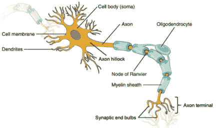
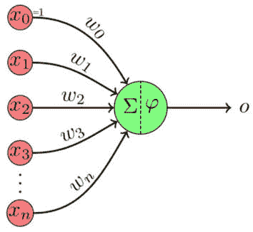
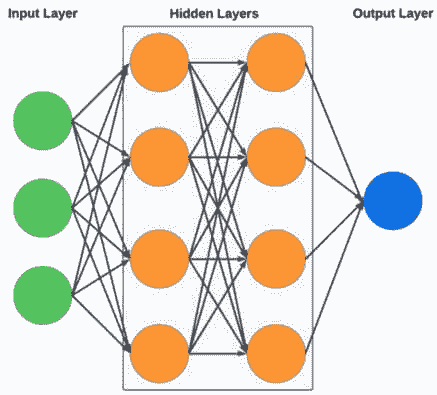
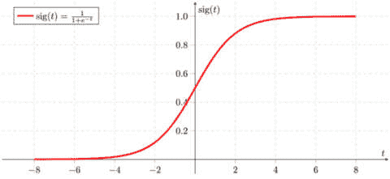
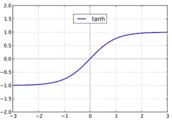
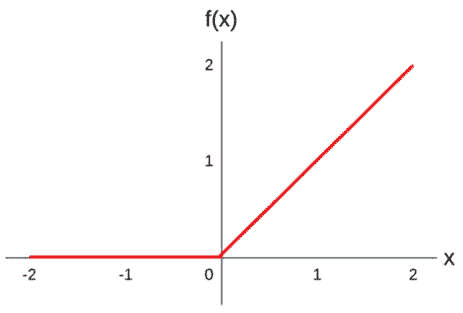
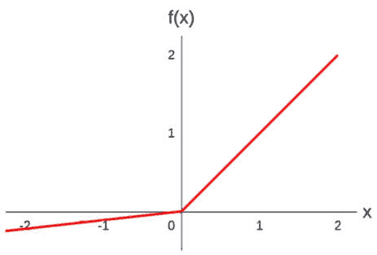
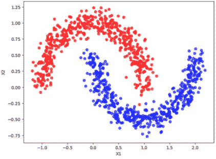
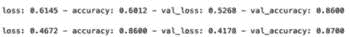

# 9

# 神经网络与深度学习

在本章中，我们将讨论**机器学习**（**ML**）中的**神经网络**（**NN**），通常被称为**人工神经网络**或**ANNs**。我们将介绍这个科学领域中的许多重要主题，包括导致人工神经网络发展的基本概念，以及它们应用的相应用例。在此阶段，重要的是要注意，术语**深度学习**（**DL**）指的是使用**深度神经网络**（**DNNs**）实现的机器学习。我们将在本章后面解释“DNN”这个术语。

我们还将介绍一些工具和框架，这些工具和框架使我们更容易创建神经网络，例如 TensorFlow 和 Keras，我们将在本章后面的动手活动中使用这些工具来构建神经网络。最后，我们将讨论不同类型的神经网络架构、神经网络实现中的常见挑战以及优化我们神经网络架构的一些实践。

作为一个旁注，我第一次开始学习关于人工神经网络（ANNs）是在大学期间，我记得我对这个概念非常着迷，因为我也有浓厚的兴趣了解人脑是如何工作的。尽管神经网络的概念确实是基于人类大脑理论运作的，但在本章中，我们将区分炒作和现实，并专注于这项技术的实际、数学描述。让我们首先覆盖这个领域的一些重要概念。

本章涵盖了以下主题：

+   神经网络和深度学习概念

+   库

+   在 TensorFlow 中实现**多层感知器**（**MLP**）

+   神经网络架构、挑战和优化

# 神经网络和深度学习概念

在本节中，我们讨论在神经网络和深度学习背景下理解的重要概念。我们首先讨论人工神经网络是如何与我们理解人脑相联系的。

## 神经元和感知器

虽然人工神经元和生物神经元（如人类大脑中发现的）之间的联系经常被过分强调，但它们之间存在一个概念上的联系，这有助于我们形成它们如何工作的心理模型。生物神经元通常由三个主要部分组成，如图*图 9.1*所示：

图 9.1：神经元（来源：https://www.flickr.com/photos/187096960@N06/51173238594）

细胞体是神经元的核心部分，其中包含细胞核和其他重要组件。树突（来自希腊语单词“dendron”，意为“树”）是从细胞体分支出来的结构。它们接收来自其他神经元的信息并将这些信息传输到细胞体。最后，轴突是从细胞体延伸出来的长管状结构，将信息发送到其他神经元的树突（通过称为突触的界面）。关于神经元的生物学，我们就讲到这里；我在这里简化了很多，因为我们只需要为与人工神经网络（ANNs）进行比较提供高级背景，但接下来我们需要了解的是它们是如何传输信息的，这在大体上如下（再次，为了相关背景简化）。

当一个神经元从另一个神经元接收信号时，这会导致神经元细胞膜（神经元内外电压差）中所谓的**电势**发生变化，从而触发所谓的**动作电位**，这是一种沿着轴突传播的电气脉冲。当它到达轴突的末端时，它会触发神经递质的释放，这些神经递质是化学信使。这些神经递质穿过所谓的**突触间隙**（神经元之间的微小空间）并绑定到下一个神经元的树突上的受体，这种结合可以触发或抑制第二个神经元中的新动作电位。

好的——在前两段中，我们刚刚介绍了很多生物学术语，但当我们想要将概念与人工神经网络（ANNs）进行比较时，这些概念是非常重要的。考虑到这一点，让我们继续前进，讨论人工神经网络是如何构建的，从它们最基本的概念，即感知器开始，我在*第一章*中简要提到了感知器，当时我总结了机器学习（ML）演变的各个里程碑。

感知器可以被视为最简单类型的人工神经网络之一，也是更大、更复杂网络的构建块。它在 20 世纪 50 年代末由弗兰克·罗森布拉特（Frank Rosenblatt）开发，基本上是一个二元分类器，它使用一组应用于输入特征的权重将输入 X（一个向量）映射到一个输出值 f(x)（一个单一的二元值）。

为了更详细地了解这个过程，让我们深入探讨感知器是如何工作的，这可以通过以下步骤来概括：

1.  感知器接收输入值，这些值可以是数据集中的特征或属性。

1.  每个输入都有一个与之相关的**权重**，它表示其重要性。权重通常在训练开始时随机给出，然后在训练过程中进行细化。我们将在稍后详细讨论这一点。

1.  **偏置单元**也被添加到感知器模型中，以增加模型的灵活性。这与我们在本书后续章节中讨论的公平性背景下的偏差主题无关；这仅仅是一个数学技巧，它为在尝试产生所需输出时改进我们模型性能提供了一个额外的控制机制。

1.  接下来，每个输入乘以其相应的权重，并将所有这些乘法的结果（以及偏置）相加（结果是一个**加权总和**），所以这仅仅是基于权重和偏置值的输入的**线性变换**。

1.  这个加权的总和随后通过一个**激活函数**，该函数产生一个二进制输出。我们将在稍后更详细地解释激活函数，但从高层次来看，对加权总和执行非线性变换，并将该变换的结果作为感知器的输出。对于单个感知器来说，一个简单的例子是，如果输入的加权总和大于一个阈值值，感知器将输出 1，或者如果加权总和小于或等于阈值，它将输出 0，所以这基本上是**逻辑回归**过程的实现。

    从数学上讲，这可以写成以下形式：

    +   如果 ∑ (权重 * 输入) + 偏置 > 0，输出 1

    +   如果 ∑ (权重 * 输入) + 偏置 ≤ 0，输出 0

*图 9.2*提供了感知器工作原理的视觉表示：

图 9.2：感知器（来源：https://commons.wikimedia.org/wiki/File:Perceptron-unit.svg#file）

在 *图 9.2* 中，图的最左侧的 *x* 值代表感知器的输入。*x*0 输入是偏置，而 *x*1 到 *x*n 代表来自我们数据集的输入特征。*w* 值代表权重，绿色圆圈内的希腊字符（sigma 和 phi）代表激活函数，而最右侧的希腊字符（omicron）代表输出。

需要理解的重要概念是，权重和偏置的值是我们感知器模型试图学习的。也就是说，我们的模型试图找出每个特征的最佳权重，从而在执行我们描述的线性和非线性变换（结合偏置）后，得到一个尽可能接近目标结果的模式。如果我们回想一下我们在前几章中创建的更传统的 ML 模型，例如线性回归，我们可能会记得我们的模型试图找出每个特征的系数的最优值，以实现预期的结果。在感知器和 ANN 中，权重（以及偏置）是我们模型试图优化的系数。

在理解了感知器的工作原理之后，让我们讨论如何使用它们来构建更复杂的 NN。

### MLPs 和 NNs

虽然感知器是一个简单而强大的算法，但它只能模拟线性可分函数。这意味着如果我们的数据不是线性可分的（也就是说，我们无法画一条直线来分离类别），感知器将无法准确地区分数据集中的类别。为了克服这一限制，可以通过层将多个感知器组合起来形成 MLP，它有可能解决非线性问题。MLP 是 NN 的一种形式，所以基本上，当我们以顺序方式（即某些感知器的输出成为其他感知器的输入）组合多个感知器时，我们形成了一种 ANN。

考虑到感知器可以被看作是一种人工神经元，从现在开始我们将“感知器”和“人工神经元”（有时简称“神经元”）这两个术语交替使用。

#### 总结与生物神经活动的比较

正如我们之前所讨论的，神经元从感觉器官或其他神经元接收输入，并且根据产生的电势，动作电位会导致神经元向其他神经元发送（或不发送）消息。

同样，感知器（或人工神经元）从我们的数据集接收输入，或者如果我们是在 NN 中将感知器串联起来，则从其他人工神经元接收输入。然后，根据这些输入及其权重和偏置的线性组合，激活函数将影响感知器的输出，该输出可以用作网络中另一个感知器的输入。

接下来，让我们更详细地探讨 NN 的典型结构，并介绍 NN 中重要的**层**概念。

#### NN 中的层

当人工神经元组合在一起形成 NN 时，它们不是随机连接的，而是使用层这一概念以结构化的方式进行连接，如图*图 9.3*所示：

图 9.3：NN 层

如*图 9**.3*所示，神经网络的层通常分为三种不同类型：

1.  **输入层**，正如其名称所暗示的，是我们输入进入神经网络的方式。它是网络中的第一层，当然是。

1.  **隐藏层**，位于输入层和输出层之间。它们的工作是将输入转换为输出层可以使用的东西。术语“隐藏”只是意味着它们不与外界接口（它们既不是网络的输入也不是输出）。我们通常无法控制或直接与它们交互；它们学会独立表示数据。隐藏层的数量以及每个隐藏层中的神经元数量定义了神经网络的复杂性和结构。

1.  **输出层**，正如其名称所暗示的，展示了我们的神经网络的输出，这通常是某种预测。

除了隐藏层的数量和每个隐藏层中的神经元数量外，层之间的确切连接方式取决于神经网络的架构。我们将在本章后面讨论不同类型的常见神经网络架构，但通常发生的情况是，我们的输入数据被输入到神经网络的输入层后，网络后续层中的每个神经元的行为类似于我们在本章前面描述的感知器。

例如，每个输入都被分配一个表示其重要性的权重。这些权重通常用随机值初始化，然后在学习过程中进行细化。输入乘以其相应的权重，并将结果相加，再加上一个偏差值。然后将总和作为后续层（即从第一个隐藏层开始）中神经元的激活函数的输入。重要的是要记住，每个神经元的权重和偏差将是不同的。因此，尽管每个神经元在第一个隐藏层看到的是完全相同的数据输入，但每个神经元对数据的反应将因各种权重和偏差的不同影响而有所不同。

需要理解的是，每一层的激活函数的输出将作为网络后续层中再次执行的过程的输入。因此，我们刚才描述的过程将在每一后续层中执行，但与我们的原始数据集在每一层作为输入不同，每一后续层将使用前一层的激活值作为输入。这意味着在信息通过我们的网络传递时，正在实施多个转换，这也是神经网络之所以强大的原因。

让我们确保我们对这个过程有清晰的理解。以第二个隐藏层为例，过程如下：

第一层的每个激活函数输出都被分配一个表示其重要性的权重。这些权重通常用随机值初始化，然后在学习过程中进行优化。激活函数的输出乘以相应的权重，并将结果相加，再加上偏差值。然后将这个总和作为下一层神经网络中神经元的激活函数的输入。这个过程在每个层中重复，直到我们到达网络的最终输出层。

注意

不同的神经网络架构可以使用不同的方式在网络中传播信息。在本章中，我们将更详细地讨论一些常见的神经网络架构类型，但我们之前描述的内容可以被认为是人工神经网络工作原理的基石。

你也可能听到“DNN”这个术语。传统上，任何至少有两个隐藏层的神经网络都被认为是深度神经网络（DNN）。

网络中某一层的神经元激活对下一层神经元激活的影响，使我们回到了与人类大脑的类比，其中某些神经元的放电可以引起其他神经元的放电，产生各种不同的交互组合，从而产生更复杂的高级功能。然而，我们必须对这个类比持保留态度，因为即使是最复杂的 ANN 也包含成千上万的神经元，而人类大脑有数十亿个神经元，每个神经元能够执行比人工神经元相对简单的数学变换更复杂的函数。

现在我们已经讨论了信息如何在人工神经网络（ANN）中传播，让我们更深入地探讨 ANN 是如何学习的，为此，我们必须引入**反向传播**的概念。

## 反向传播

我们在上一节中描述的内容可以被称为**前向传播**，其中信息在我们的神经网络（NN）中从一层传播到另一层。为了讨论反向传播，让我们回顾一下在这本书中我们之前学到的关于**监督机器学习（SML**）算法是如何工作的内容。记住，我们使用标签来描述数据集中每个数据点的特征。当我们训练一个模型时，模型试图学习数据集中特征之间的模式，这将帮助它准确地预测每个数据点的标签。然后我们使用损失函数来计算我们的模型预测与正确标签之间的差距；模型训练活动的首要目的是最小化损失函数（即最小化模型产生的错误），我们可以使用梯度下降等技术来最小化损失函数。

以在表格数据上训练的基本线性回归模型为例。你可能记得，在这种情况下，我们的数据集表中的每一行代表一个数据点或观察值，而表中的每一列代表一个特征。线性回归模型试图猜测它可以为每个特征使用的系数，这样将每个特征乘以其系数并将所有结果相加，可以得到尽可能接近目标标签的结果。

在线性回归的情况下，每次模型预测错误时，我们会使用损失函数来计算误差，然后计算损失函数相对于每个系数的梯度，然后使用梯度下降来确定如何相应地调整系数，这个过程会重复多次，直到模型改进或由于某种原因停止。

这就是神经网络比我们在本书前面实现的简单回归模型更复杂的地方。在神经网络的情况下，我们没有输入特征到系数的一对一映射。相反，我们的数据通过一个由多个层组成的复杂网络传播，每个层包含多个神经元，每个层的每个神经元都有不同的权重集（以及偏差值）。因此，当我们的模型做出预测并使用损失函数来计算误差时，它不再仅仅是计算损失函数相对于每个输入特征系数的梯度，然后更新每个特征的系数并再次尝试的情况。相反，我们必须为神经网络每一层的所有权重执行此过程。完成此过程的一种方法被称为“误差反向传播”或“反向传播”。

使用反向传播，我们从最后一层开始更新每一层的权重（即最接近我们的输出层的那一层，它代表我们的模型预测），然后逐层反向通过我们的网络。

由于我们的神经网络损失函数由几个嵌套函数组成（由于网络中的层），反向传播步骤中的梯度计算使用了一种称为**链式法则**的技术，这是微积分中计算损失函数相对于每一层权重的导数的技术。然后，这些结果用于确定如何在网络中的每一遍中更新权重。

我们将在本章后面回到反向传播和链式法则的话题，但首先，让我们更详细地探讨一下我们可以在每次训练过程中使用哪些算法来优化我们的成本函数。

### 成本函数优化算法

我们已经讨论了在模型训练期间使用梯度下降等机制来优化我们的成本函数。在本节中，我们将简要讨论一些我们可以使用的其他常见优化算法。

#### 动量

这可以被视为基本梯度下降算法的升级。当我们讨论成本函数优化中的梯度下降时，我们经常使用在山区下山（或至少到达山谷底部，这可能是“局部最小值”）的类比。在**随机梯度下降**（**SGD**）的情况下，类比更像是随机跳跃，在这种情况下，我们有时会向上跳一点（即，朝错误的方向），但总体上，我们通常最终会向下走（即，朝正确的方向）。这种在不同方向跳跃的情况被称为**振荡**。动量算法通过在正确的方向上导航更明显并减少错误方向上的振荡来加速 SGD。它是通过平均每一步的更新梯度来实现的，这导致沿着误差梯度的下降更加平滑，通常会导致更快地到达底部。在这种情况下使用的类比是一个球沿着山滚动，在这种情况下，运动比偶尔跳跃更平滑。请注意，球也可以获得动量，这有助于它在梯度斜率较小时（小梯度斜率会导致传统梯度下降的学习速度较慢）表现得更好。在实践中，动量几乎总是优于基本梯度下降。

#### 自适应梯度算法（Adagrad）

如其名所示，Adagrad 是一种自适应优化算法。也就是说，在每次优化周期中，Adagrad 会根据每个单独的参数调整学习率。对于梯度大的参数，它执行较小的更新；对于梯度小的参数，它执行较大的更新，这使得它在处理稀疏数据和具有数百万个参数的深度学习模型时特别有用。尽管它可能是一个有用的算法，但它可能导致学习率迅速变得过小，从而有效停止学习。这在长时间训练场景（如深度学习）中可能是一个问题，因为学习过程可能会过早停止。为了解决这个问题，最近开发了如**均方根传播**（**RMSProp**）和**自适应矩估计**（**Adam**）等更近期的变体，我们将在下一节讨论这些内容。

#### RMSProp

RMSProp 通过将学习率除以平方梯度的**移动平均**（**MA**）来解决 Adagrad 的学习率迅速减小的问题。基本上，它比 Adagrad 更快，通常也更好。

#### Adam

Adam 结合了动量和 RMSProp 的优点。它平均梯度（像动量一样）并使用平方梯度（像 RMSProp 一样）。它通常是优化器的最佳选择，尤其是在深度学习中。

除了本节中我们已介绍的那些优化算法之外，还有许多其他的优化算法，我们可能在后面的章节中使用其他优化器，但本章我们将使用 Adam，所以现在我们只是介绍 Adam 所基于的流行算法。

在我们开始动手活动之前，我们将更深入地探讨一个重要概念，即激活函数的概念。

## 激活函数

到目前为止，我们已经触及了激活函数及其在高级别上如何工作的主题。在本节中，我们将更深入地探讨这个主题，并讨论一些我们可以在我们的神经网络中使用的一些常见的激活函数类型。

### 线性（恒等）激活函数

这个激活函数简单地返回我们提供给它的任何输入，不改变，它通常用于简单任务，或者它经常用作回归用例的输出层。

它可以用数学公式表示为 f(x) = x。

这通常不是我们会用于我们网络中的隐藏层的，因为它不允许学习任何类型的复杂关系。

注意

在神经网络中明确指出非线性变换的重要性是很重要的，因为神经网络的主要力量在于它们能够组合多个非线性变换，以学习数据中的复杂关系。因此，非线性激活函数是复杂神经网络的一个重要组成部分。

即使我们将许多层组合到我们的网络中，如果它们都只是实现了线性变换，我们的整个网络也只会执行一个大的线性变换，这我们可以不使用神经网络来实现。

### Sigmoid 激活函数

Sigmoid 函数是逻辑回归的一种实现，它将任何输入映射到 0 和 1 之间的范围。

它可以用数学公式表示为 f(x) = 1 / (1 + exp(-x))。

见 *图 9.4* 以了解此函数的视觉表示：

图 9.4：Sigmoid 函数（来源：https://commons.wikimedia.org/wiki/File:Sigmoid-function-2.svg）

Sigmoid 函数是较简单的激活函数之一，它通常已被我们接下来将要讨论的新函数所取代。它的一个局限性是它容易受到一个称为梯度消失问题的困扰，我们将在本章后面描述这个问题。然而，在二分类问题的输出神经元中，它仍然可以是有用的，其中我们将输出解释为输入属于某一类或另一类的概率。

### 双曲正切（tanh）激活函数

tanh 函数类似于 sigmoid 函数，但它将任何输入映射到 -1 和 1 之间的值。

它可以用数学公式表示为 f(x) = (exp(x) - exp(-x)) / (exp(x) + exp(-x))。

见 *图 9.5* 以了解此函数的视觉表示：

图 9.5：tanh 函数（来源：https://commons.wikimedia.org/wiki/File:Mplwp_tanh.svg）

与 sigmoid 函数类似，tanh 也存在梯度消失问题，但在实际应用中仍然有用。

### 矩形线性单元（ReLU）激活函数

ReLU 函数在最近几年变得非常流行。简单来说，它将任何正数映射到自身，任何负数映射到零。

它可以用数学公式表示为 f(x) = max(0, x)。

见 *图 9**.6* 中该函数的直观表示：

图 9.6：ReLU 函数

ReLU 的一个主要优点是它计算效率高，因为该函数本质上只是检查输入是否大于零，如果大于零则直接返回输入，如果不大于零则返回零。这是一个简单的数学计算，这种简单性导致训练速度大大加快。

另一个主要优点是它不受梯度消失问题的影响。然而，它还受到另一个称为“死亡 ReLU”问题的困扰，这是一种神经元由于持续输出零而变得无用的现象。这是因为当输入为零或负数时，函数的梯度变为零。这意味着在反向传播过程中，当权重更新时，该神经元的权重将不会调整。这种情况导致神经元“卡住”，并持续输出零——实际上导致神经元“死亡”，在区分输入时不起任何作用。

### Leaky ReLU 激活函数

该函数试图通过在输入小于零时输出小的负值来解决“死亡 ReLU”问题。

它可以用数学公式表示为 f(x) = max(0.01x, x)。

在这种情况下，0.01 的值代表 x 的小的非零梯度，它是一个可以改变的超参数。

见 *图 9**.7* 中该函数的直观表示：

图 9.7：Leaky ReLU

如 *图 9**.7* 所示，Leaky ReLU 避免了输出变为零的问题，即使输入是负数。还有一个 Leaky ReLU 的扩展，称为 **参数 ReLU**（**PReLU**），它允许在训练过程中通过反向传播学习 x 的小的非零梯度，而不是通过超参数指定为静态数字。

### Softmax 激活函数

Softmax 函数通常用于多类分类用例中的神经网络输出层，它将网络的原始输出转换为概率向量（即为类别创建概率分布）。

它可以用数学公式表示为 f(xi) = exp(xi) / Σ(exp(xj))，其中 j 遍历输出层中的神经元集合。

它是 sigmoid 函数的扩展；sigmoid 函数可以用来提供输入属于某一类或另一类的概率（在两个类别之间的选择中），而 softmax 函数可以提供输入属于多个类别的概率范围。例如，如果我们的网络试图识别 1 到 10 之间的数字图像，那么有 10 个可能的类别可以选择。如果我们提供一个数字 1 的图像，并在网络的输出层使用 softmax，那么它可能会确定图像中的数字有很高的概率是 1，而其他潜在类别的概率较低（即 2 到 10）。

除了本节中提到的激活函数之外，还有更多的激活函数，但我们在这里提到的这些是最为知名和广泛使用的。我们选择的激活函数可以取决于特定的用例和其他因素。

现在我们已经覆盖了深度学习领域中的许多重要理论概念，让我们通过构建我们的第一个神经网络来将所学知识付诸实践。为此，我们将介绍一些重要的库。

# 库

在本节中，我们描述了我们将在本章中使用的库，例如 TensorFlow 和 Keras。

## TensorFlow

TensorFlow 是由 Google Brain 团队开发的用于机器学习和深度神经网络研究的开源软件库（**OSS**）。然而，它也可以在从移动设备到多 GPU 设置的广泛系统上运行，并且它可以在机器学习之外有众多应用。在本节中，我们将讨论其一些重要方面，例如以下内容：

+   张量是向量矩阵在多维度的推广（我们可以把它们想象成多维数组或列表）。它们是 TensorFlow 的基本构建块。

+   **数据流图**（**DFGs**），其中图中的节点代表数学运算，边代表在这些节点之间传输的数据（张量）。这种方法使得 TensorFlow 能够在多个设备上实现并行计算，使其适合训练大型神经网络。

+   模型部署有多种选择，例如 TensorFlow Serving 用于服务器端部署或 TensorFlow Lite 用于移动和物联网设备。

+   通过自动计算损失相对于模型权重的梯度来优化反向传播。

对机器学习和深度学习感兴趣的人应该熟悉 TensorFlow，因为它在业界得到了广泛的应用。

## Keras

Keras 是一个用 Python 编写的用于在 TensorFlow、Theano 和**认知工具包**（**CNTK**）等底层框架之上运行的神经网络高级 API。它是为了实现快速实验而开发的，并已成为 TensorFlow 的官方高级 API（截至 TensorFlow 2.0）。它的一些主要特性包括以下内容：

+   **用户友好性**：它有一个简单且一致的界面，针对常见用例进行了优化，并提供清晰的错误消息、有用的文档和开发者指南。

+   **模块化**：Keras 模型是通过连接可配置的构建块组装而成的。例如，我们可以通过堆叠多个层轻松构建神经网络。

+   **可扩展性**：我们可以编写自定义构建块来表达新的研究想法，并创建新的层、损失函数和模型。

Keras 的核心数据结构是模型，这是一种组织层的方式。主要模型类型是 Sequential 模型，它是一系列层的线性堆叠，但对于更复杂的架构，我们可以使用 Keras 功能 API，这允许我们构建自己的自定义层图。Keras 中的层是一个实现常见神经网络操作的类，Keras 包括一系列预定义的层，我们可以使用它们来构建模型。它还允许我们在训练阶段指定我们想要评估的损失函数和度量标准，并提供许多预定义的损失函数，如`mean_squared_error`和度量标准如`accuracy`。Keras 还包括许多优化算法，如 SGD。总的来说，它包括许多有用的工具，使我们能够轻松创建神经网络。

现在我们已经介绍了相关的库，让我们深入探讨并构建我们的第一个神经网络！

# 在 TensorFlow 中实现 MLP

在本节中，我们将使用 TensorFlow 构建一个 MLP。我们将使用 Keras 作为与 TensorFlow 交互的高级 API。我们可以使用在*第五章*中创建的相同的 Vertex AI Workbench 笔记本来完成此目的。在那个笔记本中，执行以下步骤：

1.  导航到名为`Google-Machine-Learning-for-Solutions-Architects`的文件夹。

1.  在其中双击`Chapter-09`文件夹，然后双击`Chapter-9-TF-Keras.ipynb`文件以打开它。

1.  当提示选择内核时，选择**TensorFlow**。

1.  我们打开的笔记本中包含一些 Python 代码，使用 Keras 和 TensorFlow 创建和测试了一个 MLP。

1.  通过点击每个单元格并在键盘上按*Shift* + *Enter*来运行笔记本中的每个单元格。如果您看到任何与 CUDA 相关的错误，请忽略它们，因为我们在这个笔记本中不使用 GPU。

笔记本的第一单元格中的代码导入必要的库和模块，使用`sklearn.datasets`中的`make_moons`函数加载数据集，然后使用`matplotlib`可视化数据。

在这种情况下，我们使用`moons`数据集，这是一个用于二分类的数学生成数据集，常被用作 ML 算法的简单测试案例，尤其是那些设计用于处理非线性数据（如 NNs）的算法。该数据集由两个特征的两维数组组成（通常在 X-Y 平面上可视化）以及每个样本的二元标签（0 或 1），样本生成的方式使得当绘制时形成两个新月形形状（因此得名`moons`），每个“月亮”对应一个类别。参见*图 9**.**8*以获取参考：

图 9.8：moons 数据集

注意，数据集的主要特征是其非线性（即，分隔两个类别的决策边界不是一条直线）。

我们 Jupyter 笔记本第二个单元格中的代码执行以下操作：

+   将数据集分为训练集和测试集

+   定义一个 Sequential 模型（这意味着层是堆叠在一起的）

+   添加一个输入层和第一个隐藏层，包含 32 个神经元和`relu`激活函数

+   添加一个第二个隐藏层，包含 32 个神经元和`relu`激活函数

+   添加一个输出层，包含一个神经元（用于二分类）和`sigmoid`激活函数

+   使用`adam`优化器和`binary_crossentropy`损失函数（适用于二分类）编译模型

+   对模型进行 50 个周期的训练

当代码运行时，你应该会看到每个周期的输出，如图*图 9**.10*所示：

图 9.9：训练周期输出

注意，随着训练的进行，`loss`和`val_loss`（验证损失）应该减少，而`accuracy`和`val_accuracy`（验证准确率）应该增加。

接下来，我们第三个单元格中的代码执行以下操作：

+   使用`model.evaluate`方法评估我们的模型，该方法在测试模式下返回模型的损失值和度量值（在这种情况下，`accuracy`）。

+   使用`model.predict`方法从我们的模型中获得一些预测，该方法输出每个输入样本属于正类的概率。

+   为了将其视为二分类用例，我们的代码随后将这些概率转换为基于 0.5 阈值的二元类别标签（即，任何概率超过 0.5 的东西都被认为是正类成员）。

+   最后，我们打印出前 10 个预测结果以进行快速检查。这些输出将以 0 和 1 的形式呈现，表示预测的类别标签。

就这样！你已经创建了一个神经网络！它可能没有人类那么聪明，但这在 TensorFlow 中使用 Keras 的 MLP（多层感知器）的基本示例。我们可以通过调整诸如层数、神经元类型、激活函数类型、优化器类型、损失函数以及训练配置（如 epoch 数量、批量大小等）等方式，将其扩展到更高级的深度学习用例。做得好！

接下来，我们将深入研究额外的深度学习概念，例如不同类型的神经网络架构、深度神经网络应用中的挑战，以及优化考虑。

# 神经网络架构、挑战和优化

到目前为止，本章我们已经主要介绍了神经网络的基础知识，在本节中，我们将扩展我们的讨论，包括不同类型的神经网络架构，这些架构可以用于不同类型的实际应用场景，以及训练它们时经常遇到的挑战。最后，我们将讨论如何优化我们的神经网络以解决这些挑战。

## 常见的神经网络架构

神经网络的“架构”指的是其结构，包括它包含的层数、每层的神经元数量，以及任何影响信息通过网络传播的特殊特性。在本章中我们描述的神经网络架构是 ANN（人工神经网络）的最简单形式，被称为**前馈神经网络**（FFNN）。这些网络中的信息仅沿一个方向传播，从输入层，通过隐藏层，到输出层。接下来，让我们看看一些其他常用的神经网络架构。在这里，我们将从高层次介绍它们，并在后面的章节中深入探讨更多细节。

注意

当我们在本节中谈论信息通过网络传播时，我们并不是指反向传播步骤，因为那是在迭代学习过程中实现的单独步骤。我们只是简单地指数据在每次训练遍历或推理时间通过我们的网络的方式。

### 卷积神经网络（CNN）

CNN 在**计算机视觉**（CV）中常用，用于诸如物体识别和图像分类等用例。考虑这样一个场景，我们希望训练我们的模型来识别猫的图像，同时考虑到这些图像可能以多种不同的形式出现，例如在不同的距离和视角下被捕捉。我们的模型需要建立一种对猫的视觉理解，例如它的面部形状、耳朵、身体和尾巴，以便在图像中正确识别猫。

卷积神经网络（CNNs）通过将图片分解成更小的组件或“特征”并分别学习每个特征来实现这一点。这样，网络学会在更大的图像中检测小细节，例如边缘或曲线，然后将这些细节组合成更大的特征，如单根胡须或猫耳朵的一部分，无论它们在图像中的位置如何，然后将这些特征组合起来以识别猫。卷积神经网络（CNNs）使用**卷积层**、**池化层**和**全连接（FC）层**的概念来完成这项工作。在这本书的后续章节中，我们将进一步探讨这些概念及其工作原理。

### 循环神经网络（RNNs）和长短期记忆（LSTM）网络

循环神经网络（RNNs）被设计用来在序列数据中寻找模式，如语言或时间序列。在 RNNs 中，网络包含循环，这使得信息可以从一步持续到下一步，这也是 RNNs 能够创建一种记忆的原因，与假设所有输入（和输出）都是相互独立的基本神经网络不同。通过这种方式，网络在每个步骤中将当前数据与早期阶段输入的数据混合，这对于语言理解等活动非常重要，在这些活动中，模型需要理解每个词与输入中其他词的关系（即，词不是完全独立的）。

然而，循环神经网络（RNNs）的一个问题是，由于我们将在后面讨论的原因，它们在处理长序列时会“忘记”先前的输入。为了解决这些问题，已经发明了诸如长短期记忆（LSTM）网络和**门控循环单元**（**GRU**）网络等变体，它们使用门和其他技术来保持记忆。

### 自编码器（AEs）

自编码器（AEs）用于学习未标记数据的有效编码，通常用于降低数据的维度。自编码器（AEs）的基本思想相当简单：它被训练来尝试复制其输入到输出。尽管这可能看起来像是一个简单（且冗余）的操作，但我们施加给网络的限制迫使它发现数据中的有趣方面。最常见的是，我们限制隐藏层中的节点数量，迫使网络学习数据的压缩视图。

自编码器（AEs）由一个编码器和一个解码器组成。编码器将输入数据编码为在低维空间中的压缩表示，解码器则尝试从低维表示中重建输入（即“解码”压缩表示）。在训练过程中的目标是创建一个重建输出，使其尽可能接近输入，以便网络能够学会从压缩表示中重建输入。

在现实世界中，自编码器（AEs）被用于异常检测和推荐系统等应用。自编码器（AEs）的一个特别流行的应用是在**生成式人工智能**（**GenAI**）模型中。在这种情况下，一旦自编码器被训练，解码器就可以生成新的数据，这些数据模仿了训练数据。

### 生成对抗网络（GANs）

GANs（生成对抗网络）的基本目标是创建与“真实”数据（由训练数据确定）非常接近的新伪造数据。GANs 由两个相互竞争的神经网络组成，一个称为生成器，另一个称为判别器。这两个网络通过一种**最小-最大**游戏协同训练，这是一种生成器试图欺骗判别器，而判别器试图可靠地区分真实数据和生成数据的游戏。在训练过程中，生成器在提供看似真实的数据方面变得越来越准确，而判别器在识别伪造方面变得越来越熟练。

### Transformer 网络

Transformer 网络是 Google 发明的一种模型架构，其突破性创新是使用**自注意力**机制或**多头注意力**，这使得模型在生成输出时能够考虑短语中各种词语的相对重要性。例如，在句子“the dog tried to jump over the pond, but it was too wide”中，“it”这个词可能指的是池塘或狗。对人类来说，这似乎非常明显，因为它指的是池塘，这是因为我们正在使用上下文意识来直观地判断什么最有意义。然而，这对机器学习模型来说并不明显，自注意力机制是允许模型更好地理解句子中每个词语的上下文意义的机制。Transformer 架构还包括编码器和解码器的概念，它们都由一系列相同的层组成。此外，由于自注意力机制本身并不考虑输入序列中词语的位置，因此 Transformer 设计还包含一个**位置编码**系统来跟踪词语的位置。我们将在后面的章节中更详细地探讨所有这些组件。

Transformer 模型提供的另一个优点是，它们可以并行处理所有输入，而不同于基于序列的模型，如 RNN 或 LSTM 网络，这可以显著加快训练和推理速度。

Transformer 网络已被证明在自然语言处理（NLP）任务中非常有用，包括情感分析（SA）、文本摘要和机器翻译，Transformer 架构是**生成预训练 Transformer**（GPT）、**双向编码器表示来自 Transformer**（BERT）和 T5 等模型的基础。如果您想了解更多关于这项突破性技术的信息，我建议阅读首次介绍 Transformer 概念的标志性研究论文（Vaswani, A. et al., 2017），该论文可以在以下网址找到：[`arxiv.org/abs/1706.03762`](https://arxiv.org/abs/1706.03762)。

除了本节中提到的神经网络架构之外，还有更多类型的架构，但我们在这里讨论的这些是其中最知名和最广泛使用的。研究人员不断创造和实验新的神经网络配置，网络配置的选择取决于我们试图解决的问题，因为每种网络类型都有其优势和劣势。

接下来，让我们讨论一些人们在训练和使用神经网络时遇到的一些常见挑战。

## 常见神经网络挑战

除了我们在前面章节中讨论的传统机器学习实现的所有挑战之外，DNNs 还引入了它们自己的一套挑战，例如可解释性、成本以及梯度消失或爆炸。

### 可解释性

可解释性指的是我们理解模型内部工作原理以及它们做出决策背后的原因的难易程度。例如，线性回归模型通常很容易理解和解释，因为它们的输出只是对模型提供的任何输入的简单数学变换。

然而，深度神经网络（DNNs）可能极其复杂，拥有数千个神经元和数十亿个参数，这些参数会影响它们的输出。此外，它们的输出通常不仅仅是输入的线性变换，而是本质上是非线性的。

在后面的章节中，我们将更详细地讨论可解释性的重要性，并介绍可以帮助我们更好地理解模型工作原理的机制。

### 成本

DNNs 在训练和托管时可能需要大量的计算资源，这可能导致货币支出。如果我们考虑具有数十亿参数的高度复杂模型，这些模型可能需要数周甚至数月的时间来训练，使用大量最新一代的尖端 GPU 的非常强大的服务器。这些资源并不便宜，因此我们需要确保我们的模型尽可能高效地使用计算资源。

### 梯度消失问题

我们在本章的前几节简要提到了这个话题，所以让我们更详细地探讨这个概念。当损失函数的梯度变得非常小，以至于几乎消失时，就会产生梯度消失问题，导致网络第一层的权重更新缓慢。记住，反向传播使用微分链式法则，这涉及到乘以一系列的导数（或梯度）。这意味着如果导数的值小于 1，我们在通过网络反向传播时，实际上是以指数方式将它们分成越来越小的值。正因为如此，早期层的学习速度比后期层慢得多。

当使用 sigmoid 或 tanh 等将输入压缩到小范围的激活函数时，这个问题变得更加明显。例如，sigmoid 函数将输入值压缩到零到一的范围，这意味着即使输入值很大（无论是正还是负），sigmoid 函数的输出也介于零和一之间，结果是梯度减少到极小的值，导致基于反向传播的学习速度显著减慢。

### 梯度爆炸问题

另一方面，当梯度变得过大时，会导致网络中的权重通过过大的增量更新，这会导致网络的性能剧烈波动，从而使模型训练过程失败。

梯度爆炸问题在 RNN 中更为常见，尤其是在长序列中，但它可以发生在任何类型的网络中。

### 防止梯度消失或梯度爆炸的优化

现在我们对梯度消失和梯度爆炸问题发生的方式有了更好的理解，以下考虑因素可以帮助降低它们发生的可能性。

#### 权重初始化

有效的权重初始化可以帮助减轻梯度消失和梯度爆炸的问题。例如，Xavier（Glorot）初始化和 He 初始化等技术可以帮助将初始权重设置为防止梯度在训练初期变得过小或过大的值。

#### 激活函数的选择

正如我们讨论的，使用压缩其输入的激活函数，如 sigmoid 或 tanh，会增加遇到梯度消失和梯度爆炸问题的可能性。因此，在容易遇到这些问题的场合最好避免使用这些激活函数。我们可以改用 Leaky ReLU 或 PReLU 等激活函数，因为这些函数不会压缩它们的输入。

#### 批标准化

使用这种技术，我们可以将层的输出归一化，以稳定每个层输入的均值和方差。这有助于控制梯度的规模，减轻梯度消失和梯度爆炸问题。

#### 梯度裁剪

这种技术对梯度设置了一个预定义的限制或阈值，以防止它们变得过大，这对于解决梯度爆炸问题特别有用。

#### 架构方法

在本节前面讨论 RNN 时，我们提到它们在处理长序列时会“忘记”先前的输入。梯度消失问题是导致这种情况的一个因素，这也是为什么某些架构，如 LSTM 和 GRU，被设计用来在 RNN 的上下文中通过在其结构中使用一种门控机制来解决这些问题的原因之一。因此，有时选择 NN 架构可以降低遇到梯度消失和梯度爆炸问题的可能性。

这些问题和它们的解决方案是理解深度学习模型如何工作以及如何有效地训练深度神经网络的主要因素。

本章我们介绍了许多新的概念和术语。让我们花点时间总结一下我们所学的所有内容。

# 摘要

在本章中，我们首先探讨了人工神经元（以感知器形式）与人类大脑中的生物神经元之间的比较。然后，我们将这一想法扩展到描述神经网络中多个神经元的活动，包括将多个感知器组合在一起以及我们大脑中的微小神经元如何协同工作以产生极其复杂的高级功能。

然后，我们更深入地探讨了人工神经网络的内幕和工作组件，包括诸如激活函数和反向传播等概念。我们讨论了许多不同类型的激活函数，包括它们的工作原理以及最适合它们的用例。

在反向传播的背景下，我们学习了各种常用的成本函数优化算法，例如动量法和 Adam 法，然后我们介绍了两个非常重要的深度学习库：TensorFlow 和 Keras。

接下来，我们使用这些库构建了我们第一个神经网络，并通过基于`moons`数据集成功获得预测来测试了这个网络，我们也在本章中对其进行了详细探讨。

在构建了我们第一个简单的神经网络之后，我们扩展了讨论范围，涵盖了更高级的神经网络架构及其用例，并探讨了人们在训练和使用神经网络时经常遇到的常见挑战，以及我们可以用来优化网络以减少遇到这些问题的可能性的方法。

这些是机器学习领域的一些更高级的概念，所以如果你已经理解了本章所涵盖的内容，那么你已经为我们在后续章节中对这些概念进行更深入探讨奠定了重要的基础。

在下一章中，让我们探讨如何将训练好的模型投入生产，以便为现实世界的用例提供服务。
