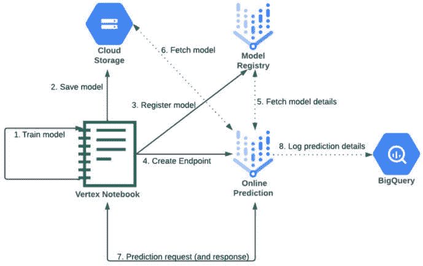
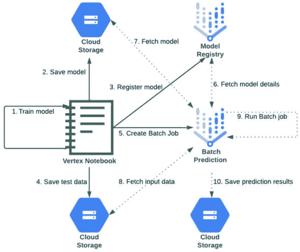
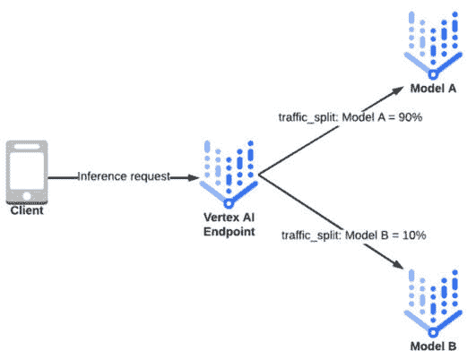
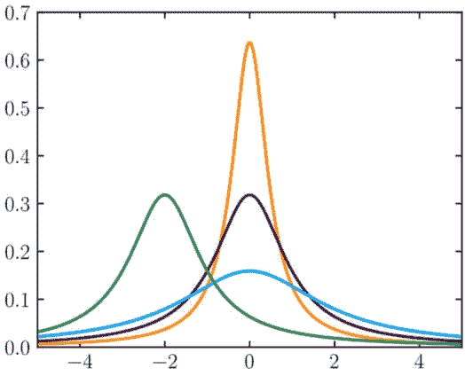
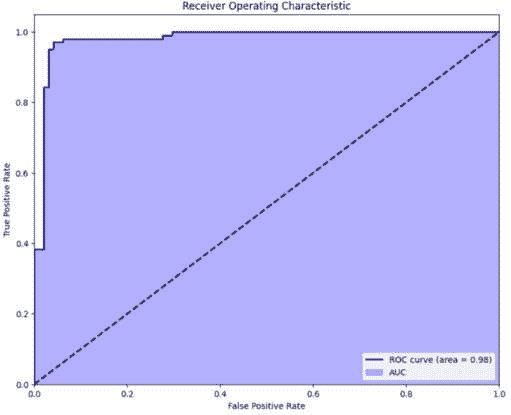
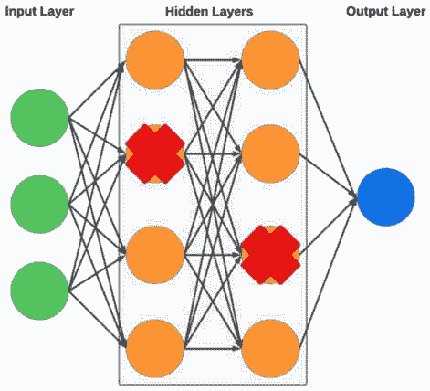

# 10

# 生产环境中的部署、监控和扩展

有些人可能会从头到尾阅读这本书，以尽可能多地了解 Google Cloud 在 AI/ML 领域的概念，而其他人可能会将其作为参考，当他们需要作为项目或客户合作的一部分处理特定主题时，他们会挑选并阅读某些章节。如果您从本书的开头就开始阅读，那么您已经走了很长的路，我们已经一起走过了**ML 模型开发生命周期**（**MDLC**）的大部分旅程。虽然模型训练通常是媒体关注的焦点——这也是许多魔法发生的地方——但现在您已经知道，训练只是整个生命周期的一部分。

当我们训练和测试了我们的模型，并且相信它们已经准备好向我们的客户展示时，我们需要找到一种方式来托管它们，以便它们可以被相应地使用。在本章中，我们将更详细地探讨这一过程的部分，包括在托管和管理模型以及持续监控它们以确保它们保持相关性并持续优化性能时存在的挑战。我们将从讨论我们如何托管我们的模型开始。

本章涵盖了以下主题：

+   我如何使我的模型可供我的应用程序使用？

+   服务的模型的基本概念

+   A/B 测试

+   生产环境中服务的模型常见挑战

+   监控生产环境中的模型

+   在边缘优化 AI/ML

# 我如何使我的模型可供我的应用程序使用？

我们在*第一章*中介绍了这个概念，并讨论了您需要执行的各种操作来在自己的服务器上托管模型，例如设置所有必需的基础设施，包括负载均衡器、路由器、交换机、电缆、服务器和存储等，然后持续管理这些基础设施。这需要您投入大量的时间和资源。

幸运的是，所有这些都在过去，您现在不再需要做任何这些事情。这是因为 Google Cloud 提供了 Vertex AI 预测服务，它使您能够在几分钟内使用由 Google 为您管理的基础设施在生产环境中托管模型。

为了完整性，我还会提到，如果您想在 Google Cloud 上托管模型而不使用 Vertex，还有许多其他 Google Cloud 服务可以用于此目的，例如**Google Compute Engine**（**GCE**）、**Google Kubernetes Engine**（**GKE**）、**Google App Engine**（**GAE**）、Cloud Run 和 Cloud Functions。我们在*第三章*中描述了所有这些服务，以及一些关于如何在这之间做出选择的提示。

记住，选择合适的平台来托管你的机器学习模型取决于你的具体用例和需求。可扩展性、延迟、成本、开发努力和运营管理都在选择最佳解决方案中发挥作用。你还可以根据你用来构建机器学习模型的框架做出某些决定。例如，如果你在 TensorFlow 中构建模型，你可能想使用 TensorFlow Serving；如果你在 PyTorch 中构建模型，你可能想使用 TorchServe。

在大多数情况下，我的建议是开始使用一个专门且针对当前任务进行优化的服务，在构建和托管机器学习模型的情况下，Vertex AI 就是这样的服务。在本章中，我们将使用 Vertex AI 部署我们的第一个模型，但在我们深入实际操作之前，我们将介绍一些重要概念。

# 模型服务的根本概念

在本节中，我们将介绍一些与我们如何托管模型以便我们的客户与之交互相关的重要主题。

## 在线与离线模型服务

在机器学习中，我们有两种从模型中提供预测的选项：**在线**服务（也称为**实时**服务）和**离线**服务（也称为**批量**服务）。与每种方法相关的高级用例分别是**在线（或实时）推理**和**离线（或批量）推理**。让我们花几分钟时间介绍这些方法并了解它们的用例。

### 在线/实时模型服务

正如其名所示，在实时模型服务的情况下，模型需要“实时”响应预测请求，这通常意味着客户端（可能是客户或某些其他系统）需要尽可能快地收到推理响应，并且可能正在同步等待模型的响应。一个这样的例子就是信用卡交易的反欺诈系统。正如你可以想象的那样，信用卡公司希望尽可能快地检测可能的欺诈交易——理想情况下是在交易过程中，这样他们就可以在可能的情况下阻止交易完全处理。在之后的某个任意时间点检查欺诈交易对他们来说可能就不那么有用。

考虑到在线推理请求通常需要尽快返回响应，确保低延迟、处理高请求量以及提供可靠且始终可用的服务是该领域的一些主要挑战。

在这个例子中，当我们提到低延迟时，我们指的是预测响应时间通常在毫秒级别，或者最多几秒钟。实际的响应时间要求将取决于业务用例。例如，一些用户可能可以接受等待几秒钟来批准或拒绝他们的信用卡交易，但另一个实时推理的例子是自动驾驶汽车中机器学习模型的使用，在这种情况下，例如，如果汽车需要突然采取某种行动，比如避开突然出现在其路径上的意外障碍物，它必须能够在毫秒级别对其环境做出反应。*图 10.1*展示了我们将在本章的实践练习中实施的批预测工作流程的示例。我们将详细解释图中展示的每个组件。在*图 10.1*中，实线代表我们在实践练习中明确执行的步骤，而虚线代表 Vertex AI 将代表我们自动执行的步骤：

图 10.1：在线预测

*图 10.1*中概述的步骤如下：

1.  在我们的笔记本中训练模型。

1.  将生成的模型工件保存到 Google Cloud Storage。

1.  在 Vertex AI 模型注册表中注册模型详细信息（在本章中更详细地解释）。

1.  创建一个端点来托管和提供我们的模型。

1.  Vertex AI 在线预测服务（在本章中更详细地解释）从 Vertex AI 模型注册表中检索我们模型的详细信息。

1.  Vertex AI 在线预测服务从 Google Cloud Storage 检索我们保存的模型。

1.  我们向我们的模型发送预测请求并接收响应。在这种情况下，我们是从我们的 Vertex AI Workbench 笔记本发送请求的，但重要的是要注意，当我们的模型托管在端点时，预测请求可以来自任何可以访问该端点的客户端应用程序。

1.  Vertex AI 在线预测服务将预测输入、输出和其他详细信息保存到 Google Cloud BigQuery。这是一个可选功能，我们可以启用它，以便我们可以对输入、输出以及与我们模型预测相关的其他细节执行分析查询。

还应注意的是，在在线模型服务的情况下，预测通常是按需进行的，通常针对单个实例或一小批实例。在这种情况下，您的模型及其服务基础设施需要能够快速应对推理流量量的突然——可能是意外的——变化。

### 离线/批处理模型服务

根据我们对在线模型服务的描述，可能已经很明显，离线服务意味着没有客户端在实时等待即时响应。实际上，而不是我们的模型从单个客户端接收按需推理请求，我们可以将许多输入观测值以大批次的形式输入到我们的模型中，它可以处理更长的时间；可能是几个小时甚至几天，具体取决于业务案例。我们的模型产生的预测可以随后存储并用于以后，而不是立即采取行动。批量推理用例的例子包括预测第二天股票价格或根据预测的偏好向用户发送定向电子邮件。*图 10**.2* 展示了我们将在本章的实践练习中实施的批量预测工作流程的示例。在 *图 10**.2* 中，实线表示我们将明确在实践练习中执行的步骤，而虚线表示 Vertex AI 将代表我们自动执行的步骤：

图 10.2：批量预测

*图 10**.2* 中概述的步骤如下：

1.  在我们的笔记本中训练模型。

1.  将生成的模型工件保存到 Google Cloud Storage。

1.  在 Vertex AI 模型注册表中注册模型详细信息。

1.  将测试数据保存到 Google Cloud Storage。这将在我们后续的批量预测作业中用作输入数据。

1.  创建一个批量预测作业。

1.  Vertex AI 批量预测服务（在本章中更详细地解释）从 Vertex AI 模型注册表中获取我们模型的详细信息。

1.  Vertex AI 批量预测服务从 Google Cloud Storage 获取我们保存的模型。

1.  Vertex AI 批量预测服务从 Google Cloud Storage 获取我们的输入数据。

1.  Vertex AI 批量预测运行一个批量预测作业，使用我们的模型和输入数据。

1.  Vertex AI 批量预测服务将预测输出保存到 Google Cloud Storage。

与优化低延迟不同，批量预测系统通常优化以一次性处理大量实例（即高吞吐量），因此通常属于大规模分布式计算用例，可以从并行执行中受益，并且可以安排定期自动执行（例如，每天一次），或者可以由事件触发（例如，当有新的数据批次可用时）。

重要的是要注意，在线和离线服务的决策并不总是严格二元的，你可能会发现在线和离线服务的组合最能满足你的需求。例如，你可能会使用离线服务生成大规模报告，同时使用在线服务在面向用户的应用中进行实时预测。在任一情况下，在线和离线服务都需要将模型部署在服务基础设施中。该基础设施负责加载模型、接收预测请求、使用模型进行预测，并返回预测结果。在 Google Cloud 中，有各种工具和平台可用于协助此任务，例如 TensorFlow Serving 和 Vertex AI 预测服务，我们将在本章后续部分详细讨论。然而，首先，让我们介绍另一个作为我们端到端模型开发生命周期一部分的重要工具。

## Vertex AI 模型注册库

在本书的早期部分，我们将传统的**软件开发生命周期**（**SDLC**）与 MDLC 进行了类比。为了更深入地探讨这个类比，让我们考虑 SDLC 过程中的几个重要工具：

+   **共享仓库**：作为 SDLC 过程的一部分，我们通常希望将我们的代码和相关工件存储在注册库或仓库中，以便多个需要协作进行特定开发项目的贡献者可以访问。这样的仓库通常包括帮助描述代码资产某些方面的元数据，以便人们可以轻松理解这些资产是如何开发的，以及它们是如何被使用的。

+   **版本控制**：当贡献者对特定项目中的代码资产进行更改时，我们希望确保我们正在跟踪这些更改和贡献，并且所有贡献者都可以轻松访问这些信息。这也使我们能够在发现软件新部署版本中的问题时回滚到之前的版本。

经验告诉我们，当我们想要高效地部署和管理机器学习模型时，需要类似的工具，尤其是在大规模部署时（记住，一些公司可能拥有成千上万的机器学习模型，由数百个不同的团队拥有）。

此外，请记住，数据科学项目通常高度实验性，数据科学团队可能会尝试许多不同的算法、数据集和超参数值，训练许多不同的模型，以查看哪些选项能产生最佳结果。这在数据科学项目的早期阶段尤其如此，但这种情况也常常持续存在，数据科学家即使在模型部署到生产环境之后，也会不断努力改进模型。他们这样做是为了跟上行业的新趋势，并产生更好的结果。

Google Cloud 的 Vertex AI 平台包括一个模型注册服务，它允许我们在一个集中的位置管理我们的机器学习模型，这使得我们能够更容易地跟踪模型的发展情况，即使有多个团队在贡献这些模型的发展。让我们来看看模型注册的一些重要功能：

+   **模型版本控制**：模型注册允许我们创建多个版本的模型，其中每个版本可以对应不同的训练参数集或不同的训练数据集。这有助于我们跟踪不同的实验或部署。

+   **模型元数据**：对于每个模型，我们可以记录元数据，例如模型的描述、输入和输出模式、标签（用于分类的有用信息）和指标（用于比较模型的有用信息）。对于每个版本，我们可以记录额外的元数据，例如描述、运行时版本（对应于 Vertex AI 平台服务的版本）、Python 版本、用于服务的机器类型以及服务设置。

+   **模型工件**：这些是用于生成模型的工件。它们可以存储在 Google Cloud Storage 中，并链接到注册表中的模型。

+   **访问控制**：我们可以通过 Google Cloud 的 **身份和访问管理**（**IAM**）系统来控制谁可以查看、编辑和部署注册表中的模型。

重要的是要理解模型注册与其他 Vertex AI 组件的良好集成。例如，我们可以使用 Vertex AI 训练服务来训练一个模型，然后自动将训练好的模型上传到注册表中，之后我们可以将模型部署到 Google Cloud Vertex AI 预测服务，我们将在下一节中描述。我们可以比较模型版本，并轻松更改部署到生产中的版本。我们还可以使用 Vertex AI Pipelines 自动化所有这些步骤，我们将在下一章中探讨这一点。

## Vertex AI 预测服务

Google Cloud Vertex AI 预测服务是 Vertex AI 生态系统中的一个服务，它使我们能够轻松托管机器学习模型并向我们的客户提供服务，从而支持批量模型服务和在线模型服务用例。这是一个托管服务，因此当我们用它来托管我们的模型时，我们不需要担心管理所需的服务器和基础设施；该服务将根据发送到我们模型的流量量自动扩展所需的基础设施和计算资源。

如我们在上一节中提到的，它集成了 Vertex AI 模型注册，使我们能够轻松控制哪些版本的模型被部署到生产中，并且它还集成了许多其他 Google Cloud 服务，例如 Vertex AI Pipelines，它允许我们自动化模型的开发和部署，以及 Google Cloud Operations Suite，它提供集成的日志记录和监控功能。

我们将在 Google Cloud 中使用 Vertex AI 模型注册和 Vertex AI 预测服务进行实际操作，以存储和提供模型，但首先，让我们再覆盖一个在模型部署和管理方面非常重要的概念：**A/B 测试**。

# A/B 测试

A/B 测试是通过测试一个模型（模型 A）与另一个模型（模型 B）的性能来比较哪个模型表现更好。虽然这个术语在技术上可以应用于测试和比较任何模型，但通常的场景是测试模型的新版本，以改善模型在业务目标方面的性能。

Vertex AI 允许我们将多个模型部署到单个端点，并通过使用 `traffic_split` 变量来控制每个模型所服务的流量量，如图 *图 10.3* 所示：

图 10.3：使用 Vertex AI 的 traffic_split 进行 A/B 配置

正如您在本章的实际练习中将会看到的，如果我们不对 `traffic_split` 变量设置任何值，默认行为是将所有流量都导向已经部署到我们端点的原始模型。这是一个安全机制，可以防止我们的模型在服务客户流量方面出现意外行为。`traffic_split` 配置使我们能够非常细致地控制我们希望发送到每个已部署模型或模型版本的流量量。例如，我们可以设置 `traffic_split` 配置，使其突然将所有流量发送到我们的新模型，通过将 100%的流量分配给该模型，从而有效地替换我们的模型。然而，我们可能希望在完全替换先前的模型版本之前，用我们生产流量的一小部分来测试我们的新模型版本，这在软件开发中相当于**金丝雀测试**的概念。

当我们确定我们的新模型表现符合预期时，我们可以逐渐（或根据业务需求突然）更改 `traffic_split` 变量，将更多（或全部）流量发送到新模型。

现在我们已经涵盖了与在生产环境中托管和提供模型相关的许多重要概念，让我们通过使用 Vertex AI 部署一个模型来看看这在现实世界中是如何工作的。

我们已经准备了一个 Vertex AI Workbench 笔记本，它会指导你完成所有必要的步骤。再次强调，我们可以使用我们在 *第五章* 中创建的相同的 Vertex AI Workbench 管理笔记本实例来完成这个任务。请在笔记本实例上打开 JupyterLab。在屏幕左侧的目录浏览器中，导航到 `Chapter-10` 目录并打开 `deployment-prediction.ipynb` 笔记本。你可以选择 TensorFlow 2 (Local) 作为内核。同样，你可以通过选择单元格并按键盘上的 *Shift* + *Enter* 来运行笔记本中的每个单元格。除了相关的代码外，笔记本还包含描述代码正在做什么的 Markdown 文本。我建议只执行模型训练和部署部分，以及 A/B 测试，然后在继续进行笔记本中的其他活动之前，阅读本章的一些更多主题。

我们还必须在笔记本中启用一个名为 `prediction-request-response-logging` 的功能，该功能将记录我们模型对收到的预测请求的响应。我们可以将这些响应保存到 Google Cloud BigQuery 表中，这样我们就可以对每个模型的预测响应进行分析，并查看它们的性能。

一旦你完成了笔记本中的模型训练和部署部分（或者如果你现在只想继续阅读），你就可以进入下一部分，我们将讨论公司在生产中部署、提供和管理模型时通常会遇到哪些挑战。

# 在生产中部署模型时的常见挑战

在生产中部署和托管机器学习模型通常伴随着许多挑战。如果你只是开发和提供单个模型，你可能会遇到一些这些挑战，但如果你正在开发和提供数十、数百或数千个模型，那么你很可能会遇到这些挑战和担忧的大多数。

## 部署基础设施

选择合适的托管机器学习模型的基础设施、设置和管理它可能很复杂，尤其是在混合或多云环境中。再次强调，Google Cloud Vertex AI 会自动为我们处理所有这些，但没有这样的云服务，许多公司发现这可能是有数据科学项目中最具挑战性的方面之一。

## 模型在生产和扩展中的可用性

这是部署基础设施管理的扩展。随着需求的增加，我们的模型需要提供更多的预测。根据需求进行服务扩展和缩减的能力至关重要，并且可能很难手动管理。Vertex AI 自动扩展功能使我们能够轻松地做到这一点。我们只需指定我们希望为每个模型运行的机器的最小和最大数量即可。

例如，如果我们知道我们始终需要至少运行三个节点来处理我们通常预期的流量，但有时流量会增加到正常水平的两倍，我们可以指定我们希望 Vertex AI 总是运行至少三台机器，并在需要时自动扩展到最多六台机器。

我们可以通过配置 `minReplicaCount` 和 `maxReplicaCount` 变量来指定我们的自动扩展偏好，这些变量是我们部署的模型机器规格的元素。我们已经在与本章相关的 Jupyter Notebook 中提供了如何操作的步骤。请注意，我们可以按模型指定这些细节，而不仅仅是按端点。这使我们能够独立扩展我们的每个模型，这为我们提供了灵活性，取决于我们的需求。

Vertex AI 也为我们提供了灵活性，可以选择将多个模型部署到同一个端点，或者为每个模型创建独立的、专门的端点。如果我们针对不同的用例有完全不同类型的模型，那么我们通常会把这些模型部署到独立的端点。在这个时候，你可能想知道为什么我们想要将多个模型部署到单个端点。这样做最常见的原因是我们想要实施 A/B 测试。同样，我们已经在伴随本章的 Jupyter Notebook 中介绍了实施 A/B 测试用例的步骤。

## 数据质量

通常，在生产环境中使用的数据可能包含错误，或者可能没有用于模型训练的数据那么干净，这可能导致预测不准确。因此，我们可能需要在生产中实施数据预处理步骤，在预测时“实时”准备和清理数据。一般来说，我们在准备训练数据时可能应用的任何数据转换技术也需要在推理时应用。

## 模型/数据/概念漂移

除了准备和清理我们的数据之外，如果你回想一下本书前几章中我们执行的一些数据探索活动，你可能记得我们数据的一个重要方面是数据集中变量的统计分布。例如，包括数据集中每个变量的平均值、每个变量的最小值和最大值之间的观察范围，或者每个变量的值类型，如离散或连续。总的来说，我们可以将这些特征称为我们数据的“形状”。*图 10.4* 展示了一些不同类型的数据分布的示例：

图 10.4：数据分布 (来源：https://commons.wikimedia.org/wiki/File:Cauchy_pdf.svg)

在一个理想的世界里，用于训练我们模型的 数据形状 应该与模型在生产中预期遇到的数据形状相同。因此，我们通常希望使用现实世界的数据（即，在生产中之前观察到的数据）来训练我们的模型。然而，随着时间的推移，生产中观察到的数据形状可能会开始偏离用于训练模型的数据形状。这种情况可能突然发生，例如，当全球大流行在短时间内急剧改变消费者的购买行为（例如，每个人都突然购买卫生纸和洗手液，而不是时尚和化妆品），或者季节性变化，或者它可能由于特定业务领域或市场的自然进化变化而逐渐发生。

在任何情况下，这种偏差通常被称为“漂移”，或者更具体地说，是**模型漂移**、**数据漂移**或**概念漂移**。模型漂移指的是模型目标性能随时间整体下降，它可能由数据漂移或概念漂移等因素引起。数据漂移是指生产中数据的统计分布与用于训练我们模型的数据的统计分布不同。另一方面，概念漂移是指模型试图预测的输入特征与目标变量之间的关系发生变化。这意味着即使输入数据保持不变，变量之间的潜在关系也可能随时间变化，这可能会影响我们模型的准确性。大流行期间消费者行为变化的例子是概念漂移的一个实例。

无论漂移的类型如何，它都可能导致模型性能下降。因此，我们需要持续评估我们模型的性能，以确保它们始终满足我们的业务需求。如果我们发现我们模型的性能正在下降，我们需要评估这是否是由于漂移造成的，如果我们检测到它是，我们需要相应地采取纠正措施。我们将在稍后更详细地讨论这些措施。

## 安全和隐私

确保我们模型使用的数据符合安全和隐私法规可能很复杂，尤其是在处理敏感数据的行业中。根据行业和用例，这可以被认为是模型开发和管理的最重要方面之一。

## 模型可解释性

通常，模型被视为“黑盒”实现，在这种情况下，我们无法深入了解模型内部的工作方式，这使得理解它们是如何进行预测的变得困难。这可能会引起问题，尤其是在需要解释的监管行业中。我们将在本书的稍后部分更详细地探讨这个话题。

## 跟踪机器学习模型元数据

正如我们之前提到的，机器学习模型开发通常涉及一些实验，数据科学家会评估他们数据集的不同版本，以及不同的算法、超参数值和其他开发过程组件。此外，开发过程通常涉及多个团队成员或多个独立团队之间的协作。考虑到一些公司开发和部署了数百甚至数千个机器学习模型，跟踪所有这些实验和开发迭代是很重要的。

例如，如果我们有一个在生产中部署的模型，并且观察到该模型正在做出不准确或不适当的预测，那么我们需要了解为什么该模型会这样表现。为了做到这一点，我们需要知道创建该特定模型版本所执行的所有步骤，以及与该模型开发相关的所有输入和输出，例如用于训练模型的输入数据集版本，以及训练过程中使用的算法和超参数值。我们将这些信息称为模型的元数据。没有这些信息，很难理解我们的模型为什么会这样表现。

这个概念与模型可解释性的主题有些关联，但也包括机器学习模型开发的其他方面。

## 与现有系统的集成

大多数公司都有各种软件系统，这些系统是在多年的时间里开发和采购的，将机器学习模型集成到这些系统中可能很复杂。

## 监控

如果你自己管理基础设施，为生产中的机器学习模型设置稳健的监控可能是一个挑战。我们需要持续监控模型的预测性能，以确保它仍然有效，并且随着时间的推移没有退化。

这是对模型管理的一个重要方面，因此我们将在本章的下一节专门讨论这个主题。

# 监控生产中的模型

我们在开发和部署模型后的工作还没有结束——我们需要随着时间的推移跟踪模型的表现和整体健康状况，并在观察到模型性能下降时进行调整。在本节中，我们将讨论我们通常需要监控的一些模型特征。

## 目标模型性能

毫不奇怪，我们需要监控的我们模型最突出的方面是它在其创建目标方面的表现。我们在本书的前几章讨论了目标指标，例如**均方误差**（**MSE**）、准确率、F1 分数和 AUC-ROC 等。AUC-ROC 的一个例子在*图 10.5*中展示，供参考：

图 10.5：AUC-ROC

目标指标告诉我们我们的模型在实现其主要目的方面表现如何，例如预测房价或识别照片中的猫。如果我们注意到这些指标在某个我们认为对业务需求可接受的阈值以上持续下降，那么我们通常需要采取纠正措施。

模型性能下降的常见原因是数据漂移，我们已在上一节中讨论过。如果我们发现发生了数据漂移，纠正措施通常是使用与模型在生产中当前观察到的数据形状或分布相匹配的更新数据重新训练我们的模型。这可能需要从我们的生产系统或其他适当的来源收集新鲜数据。

## 专门监测数据漂移

监测数据漂移涉及比较传入数据的统计属性与训练数据的统计属性。在这种情况下，我们分析数据中的每个特征或变量，并将传入数据的分布与训练数据的分布进行比较。除了比较简单的描述性统计量，如均值、中位数、众数和标准差之外，还有一些特定的统计检验我们可以评估，例如 Kullback-Leibler 散度、Kolmogorov-Smirnov 检验或卡方检验。我们将在本书的后面部分更详细地讨论这些机制。

Vertex AI 模型监控提供了自动测试，可以检测不同类型的漂移。具体来说，它可以检查**特征偏斜和漂移**以及**归因偏斜和漂移**，这两者我们将在下文中进行描述。它还提供了模型解释功能，我们将在本书的后面部分详细探讨。

偏斜也被称为**训练-服务偏斜**，它指的是生产环境中特征数据的分布与用于训练模型的特征数据分布不同的情况。为了检测这种偏斜，我们通常需要访问原始训练数据，因为 Vertex AI 模型监控会将训练数据的分布与发送到我们生产中模型的推理请求中看到的分布进行比较。

**预测漂移**指的是生产中的特征数据随时间变化的情况。在没有访问原始训练数据的情况下，我们仍然可以开启漂移检测来检查输入数据随时间的变化。

需要注意的是，一些程度的漂移和偏斜可能是可容忍的，但通常我们需要确定和配置阈值，超过这些阈值我们就需要采取纠正措施。这些阈值取决于我们特定用例的业务需求。

## 异常模型行为

异常可能包括预测请求的峰值、输入特征的异常值或异常的预测响应值。例如，如果一个用于欺诈检测的模型开始标记异常高数量的交易为欺诈，这可能是一个异常，需要进一步调查。异常也可能由于数据漂移或环境中的临时变化而发生。

## 资源利用率

这包括监控 CPU 使用率、内存使用率、网络 I/O 等方面，以确保模型的服务基础设施在其容量内运行。这些指标是确定何时根据当前发送到我们模型的流量量等因素增加或减少资源的重要指标。

## 模型偏差和公平性

我们需要确保我们的模型持续进行公平的预测。这可能包括跟踪公平性指标和检查模型预测中的偏差。我们将在下一章中更详细地探讨这个话题。

这些是我们需要监控的模型的主要方面。具体需要优先考虑的项目取决于我们的业务案例。

现在我们已经讨论了模型监控领域中最常见的许多话题，让我们讨论一下如果检测到我们的模型性能下降，我们应该怎么做。

## 解决模型性能下降问题

如果我们发现我们监控的模型指标值显示出性能下降，我们可以采取一些措施来纠正这种情况，并可能防止未来发生此类情况。本节讨论了一些相关的纠正措施。

确保我们的模型保持最新并表现最佳的最有效方法可能是实施一个健壮的 MLOps 管道。这包括机器学习模型的**持续集成和持续部署**（**CI/CD**），其主要组成部分是定期使用生产中看到的新数据训练我们的模型——这被称为**持续训练**。为此，我们需要实施一个机制来捕获生产中的数据，然后自动更新我们的模型。

我们可以定期更新我们的模型（例如，每晚或每月一次），或者根据 Vertex AI 模型监控作业的输出触发重新训练。例如，如果模型监控作业检测到漂移超出了可接受的阈值，可以发送自动通知，并自动启动一个管道来训练和部署我们模型的新版本。

下一章将完全致力于 MLOps 的话题，因此我们将更详细地探讨这些概念。

同时，如果您想从理论转向实践学习，现在执行本章附带的 Vertex AI Workbench 笔记本中的*模型监控*部分将是一个好时机。否则，让我们继续本章的其余部分，其中包括在边缘优化 AI/ML 用例。

# 在边缘优化 AI/ML

在边缘提供 ML 模型指的是直接在用户设备上运行您的模型，例如智能手机或物联网设备。术语“边缘”基于传统的网络架构术语，其中网络的核心位于网络所有者的数据中心，而网络的边缘是用户设备连接到网络的地方。在边缘运行模型和其他类型的系统可以提供诸如降低延迟、增加隐私和减少服务器成本等好处。然而，边缘设备通常计算能力有限，因此我们可能需要对模型进行一些调整，以便它们在这些设备上高效运行。我们可以做几件事情来优化我们的模型，以便它们在边缘运行，所有这些内容我们将在本节中讨论。

## 模型优化

让我们先讨论一下我们可以采取哪些措施来优化我们的模型，以便它们可以在边缘使用。

### 模型选择

首先，我们应该尝试选择轻量级的模型，这些模型仍然能在我们的目标上提供良好的性能。例如，决策树和线性模型通常比深度学习模型需要的内存和计算能力更少。当然，我们的模型选择过程也取决于我们的业务需求。有时，我们需要更大的模型来实现所需的目标。因此，这个关于在边缘优化 AI/ML 工作负载的建议只是一个初步的指导方针。我们将在下一节讨论更高级的策略。

### 模型剪枝

剪枝是一种通过移除对模型性能贡献最小的参数（例如，“权重剪枝”）或整个神经元（例如，“神经元剪枝”）来减小模型尺寸的技术。图 10.6 中展示了神经元剪枝的一个例子，其中每个隐藏层都移除了一个神经元（如图中覆盖每个被移除神经元的红色 X 所示）：

图 10.6：神经元剪枝

结果剪枝后的模型需要更少的内存和计算资源。如果我们移除太多的权重或神经元，那么可能会影响我们模型的准确性，因此，当然，我们的想法是找到一个平衡点，以最小化对准确性的影响，同时减少所需的计算资源。

### 模型量化

量化是一种降低模型权重数值精度的方法。例如，权重在训练期间可能以 32 位浮点数存储，但在推理时通常可以量化为 8 位整数，而不会显著降低性能。这减少了模型的内存需求和计算成本。这在**大型语言模型**（**LLMs**）的背景下尤其有用，这些模型可能拥有数百亿个权重。我们将在本书的“生成式 AI”部分详细讨论这一点。

### 知识蒸馏

这种技术涉及训练一个较小的模型，有时被称为“学生”模型，以模仿一个较大、被称为“教师”模型或模型集合的行为。较小的模型被训练以产生尽可能接近较大模型的输出，以便它能执行类似的任务，或许在模型精度上有所可接受的降低。再次强调，我们需要在模型尺寸减小和精度降低之间找到平衡。在 LLMs 的背景下，蒸馏技术尤其有用。

### 利用高效模型架构

一些模型架构被设计为在边缘设备上高效。例如，MobileNet 和 EfficientNet 是**卷积神经网络**（**CNNs**）的高效变体，适合移动设备。

现在我们已经讨论了一些我们可以对模型进行的修改，以优化它们在边缘用例上的性能，让我们看看我们还可以使用哪些其他类型的机制来实现这一目的。

## 模型技术之外的优化

所有的先前优化技术都涉及对我们的模型进行修改，使其在边缘设备上运行得更高效。我们还可以采取其他措施，例如将训练好的模型转换为针对边缘设备优化的其他格式，或者优化在边缘运行我们的模型的硬件。让我们更详细地讨论这些机制。

### 硬件特定优化

根据边缘设备上的特定硬件（例如，CPU、GPU、**张量处理单元**（**TPU**）等），可以使用不同的优化策略。例如，一些库提供了基于特定硬件优化计算图的工具。

### 专用库

如 TensorFlow Lite 和**开放神经网络交换**（**ONNX**）运行时之类的库可以将模型转换为针对边缘设备优化的格式，进一步减少模型的内存占用并提高其速度。我们将在本节中更详细地讨论这些库。

#### TensorFlow Lite

TensorFlow Lite 是 TensorFlow 提供的一套工具，帮助我们运行移动、嵌入式和物联网设备上的模型。它是通过将我们的 TensorFlow 模型转换为更高效的格式，以便在边缘设备上使用来实现的。它还包括优化模型大小和性能的工具，以及实现硬件加速的工具。我们已经使用 TensorFlow Lite 转换我们的模型；这可以在本章所附的 Jupyter Notebook 中找到。

#### Edge TPU Compiler

Google 的 Edge TPU Compiler 是一种用于将模型编译到 Google 的 Edge TPUs 上运行的工具，这些 Edge TPUs 是为在边缘设备上运行 TensorFlow Lite 模型而设计的。

#### ONNX Runtime

ONNX 是一种用于表示机器学习模型的开放格式，它使得模型能够在各种机器学习框架之间进行迁移。它还提供了一个跨平台的推理引擎，称为 ONNX Runtime，它包括对各种硬件加速器的支持，旨在提供快速的推理并降低机器学习模型对资源的需求。

#### TensorRT

TensorRT 是 NVIDIA 开发的一种深度学习模型优化器和运行时库，用于在 GPU 上部署神经网络模型，尤其是在 NVIDIA 的嵌入式平台 Jetson 上。

#### TVM

Apache TVM 是一个开源的机器学习编译器堆栈，旨在使机器学习模型在各种硬件平台上高效部署成为可能。TVM 支持从各种深度学习框架中获取模型输入，包括 TensorFlow、Keras、PyTorch、ONNX 以及其他框架。

这些只是优化机器学习模型以便在边缘运行的一些工具。随着新型技术设备的不断涌现，边缘优化是一个活跃的研究领域，新的工具和机制仍在不断开发中。

在本章所附的 Jupyter Notebook 的动手活动中，我们使用了 TensorFlow Lite 来优化我们的模型，之后我们将优化后的模型存储在 Google Cloud Storage 中。从那里，我们可以轻松地将我们的模型部署到任何支持 TensorFlow Lite 解释器的设备。TensorFlow Lite 文档中提供了一份支持平台列表，其中还包含大量关于 TensorFlow Lite 如何在更详细层面工作的有用信息：[`www.tensorflow.org/lite/guide/inference#supported_platforms`](https://www.tensorflow.org/lite/guide/inference#supported_platforms)。

到目前为止，我们已经涵盖了与模型部署相关的许多不同主题。让我们花些时间回顾一下我们学到了什么。

# 摘要

在本章中，我们讨论了各种用于托管机器学习模型的 Google Cloud 服务，例如 Vertex AI、Cloud Functions、GKE 和 Cloud Run。我们区分了在线和离线模型服务，其中在线服务用于实时预测，而离线服务用于批量预测。然后，我们探讨了部署机器学习模型时常见的挑战，例如数据/模型漂移、扩展、监控、性能以及保持模型更新。我们还介绍了 Vertex AI 的特定组件，这些组件使我们的模型部署和管理更加容易，例如 Vertex AI 模型注册表、Vertex AI 预测服务和 Vertex AI 模型监控。

具体来说，我们深入探讨了生产环境中监控模型，重点关注数据漂移和模型漂移。我们讨论了对抗这些漂移的机制，例如自动连续训练。

接下来，我们解释了 A/B 测试，用于比较模型的两个版本，并讨论了使用模型剪枝和量化等方法优化边缘部署的机器学习模型，以及用于优化我们的模型的库和工具，例如 TensorFlow Lite。

到目前为止，我们已经涵盖了 MDLC 中的所有主要步骤。我们接下来关注的主题将是如何使用 MLOps 自动化整个生命周期。请加入我们，在下一章中，你将继续你的旅程，成为一名专家 AI/ML 解决方案架构师，在这个过程中你已经走了很长的路，并且取得了巨大的进步！
