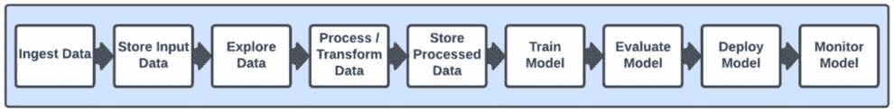
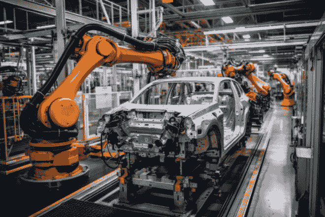
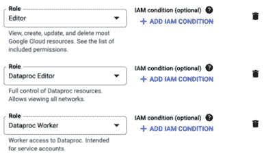
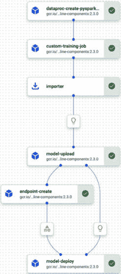
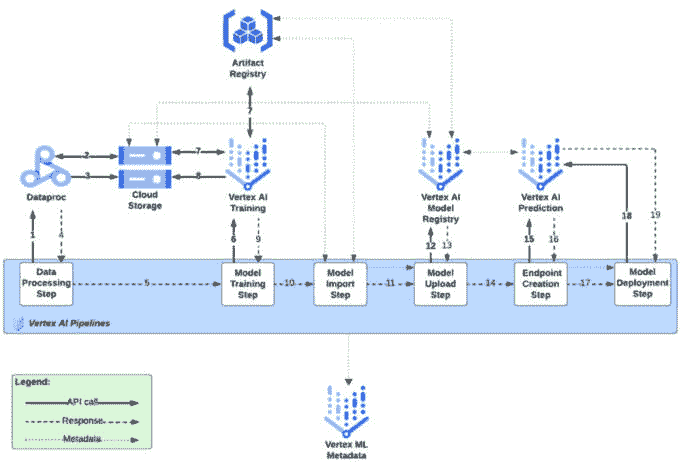

# 第十一章：使用 Google Cloud 进行机器学习工程和 MLOps

通常估计，几乎 90% 的数据科学项目从未进入生产阶段。数据科学家在实验室花费大量时间训练和实验模型，但往往无法成功地将这些工作负载带入现实世界。主要原因是我们已经在本书的前几章中讨论过，在模型开发生命周期中的每一步都存在困难挑战。继我们上一章的内容之后，我们现在将更详细地探讨部署概念和挑战，并描述 **机器学习运维**（**MLOps**）在解决这些针对大规模生产 AI/ML 工作负载的挑战中的重要性。

具体来说，本章将涵盖以下主题：

+   MLOps 简介

+   为什么需要 MLOps 来部署大规模机器学习工作负载

+   MLOps 工具

+   在 Google Cloud 上使用 Vertex AI Pipelines 实施 MLOps

尽管我们已经在本书的早期部分触及了一些这些概念，但我们将以对 MLOps 的更正式介绍开始本章。

# MLOps 简介

MLOps 是软件开发行业 DevOps 概念的扩展，但专注于管理和自动化机器学习模型和项目生命周期。它超越了创建机器学习模型所需的战术步骤，并解决了当公司需要以规模管理数据科学用例的整个生命周期时出现的需求。现在是一个反思我们在本书前几章中概述的机器学习模型生命周期阶段的好时机，如图 *图 11.1* 所示。

图 11.1：数据科学生命周期阶段

从高层次来看，MLOps 的目标是自动化机器学习模型生命周期的所有各种步骤，例如数据收集、数据清洗和预处理、模型训练、模型评估、模型部署和模型监控。因此，它可以被视为一种旨在统一机器学习系统开发和日常运营的工程文化。这包括在机器学习项目中所有相关利益相关者之间的协作和沟通实践，例如公司的数据科学家、机器学习工程师、数据工程师、业务分析师和运营人员，以帮助持续管理整个机器学习生命周期。

在这个背景下，管理机器学习生命周期包括定义、实施、测试、部署、监控和管理机器学习模型，以确保它们在生产环境中可靠且高效地运行。

与 DevOps 的另一个相似之处在于，MLOps 实践也涵盖了持续集成、持续交付和持续部署（CI/CD）的概念，但重点在于如何开发机器学习模型。这确保了模型的新更改被正确集成、彻底测试，并且可以以系统化、可靠和可重复的方式部署到生产环境中。在这方面，目标是确保机器学习生命周期的任何部分（如数据预处理、训练等）都可以在以后以相同的结果重复。正如在软件 DevOps 的 CI/CD 环境中一样，这包括自动化步骤，如验证检查和集成测试，但在机器学习模型开发的情况下，它还增加了额外的组件，例如数据质量检查和模型质量评估。

正如我们在前面的章节中讨论的那样，将模型部署到生产环境是一项巨大的成就，但工作并没有就此结束。一旦机器学习模型被部署到生产环境中，就需要持续监控它们，以确保由于底层数据或其他因素的变化，其性能不会随时间退化。如果检测到任何问题，模型需要更新或用更新的模型替换。MLOps 还包括自动化该过程的工具，例如自动重新训练（例如，使用新鲜数据）、验证和部署新的模型版本。

这其中的另一个重要组成部分是跟踪我们在数据科学项目各个阶段产生的各种工件版本（例如，数据、模型和超参数值）。这不仅使得在需要时可以轻松回滚到以前的版本，而且还提供了合规性审计跟踪，有助于模型的可解释性和透明度，以及适当的治理机制，有助于确保机器学习模型被负责任和道德地使用。

现在我们已经了解了 MLOps 是什么，让我们更深入地探讨为什么它在开发、部署和管理大规模模型时尤为重要。

注意

在本书的后续部分，我们将讨论生成式人工智能/机器学习。在生成式人工智能/机器学习中，有一些特定的机器学习模型被用于其中，被称为**大型语言模型**（**LLMs**）。这些模型还与一些额外的资源和工件相关联，并且行业中出现了一个新术语 LLMOps，用来指代这些工作负载的运营化。目前，我们将专注于传统的 MLOps。虽然许多这些概念也适用于 LLMOps 工作负载，但我们将在后面的章节中讨论 LLMOps 的额外考虑因素。

# 为什么需要 MLOps 来部署大规模机器学习工作负载

MLOps 最重要的方面是它帮助组织以更快、更高效和更可靠的方式开发机器学习模型，并允许数据科学团队在满足运营要求的同时进行实验和创新。

到现在为止，我们知道机器学习已经成为许多行业和部门的必要组成部分，提供了宝贵的见解和决策能力，但部署机器学习模型，尤其是在大规模上，面临着许多挑战。其中一些挑战只能通过 MLOps 来解决，我们将在本节中深入探讨这些挑战，并提供 MLOps 如何帮助解决这些挑战的例子。

在我们深入探讨之前，我要指出，本节中我们将讨论的这类挑战实际上适用于任何大规模生产产品的行业，无论这些产品是汽车、安全别针、玩具还是机器学习模型。

我将从一个汽车行业的类比入手，以突出大规模生产任何类型产品所需的概念。考虑在汽车发明之前，主要的交通工具可能是马车，而这种马车可能是在类似*图 11.2*中展示的工坊中制造的。

图 11.2：锻造车间（来源：https://www.hippopx.com/en/middle-ages-forge-workshop-old-castle-wagon-wheel-297217）

注意*图 11.2*中展示的生产环境的特征：

+   这是一个小环境，只能容纳少数人一起工作。

+   在这里工作的每个人周围都散落着许多随机工具，似乎并没有实施太多的标准化。

具有这些特征，任何类型的大规模协作都是不可能的，最多只能有三四个人一起工作来创造产品。在这种情况下，公司不可能每个月都生产大量产品（例如）。记住，大多数公司就是这样开始实施数据科学项目的，数据科学家在自己的电脑上执行各种实验并开发模型，使用基于个人偏好的任何随机工具，并试图以非标准化和非系统化的方式与同事分享学习和成果。

为了克服这些挑战，汽车行业发明了流水线的概念，一些最早的流水线可能看起来与*图 11.3*中展示的相似。

图 11.3：流水线（来源：https://pxhere.com/en/photo/798929）

注意*图 11.3*中展示的生产环境的特征：

+   环境可以容纳很多人一起工作。

+   工具和制造工艺已经标准化。

这种环境能够实现大规模协作，并且在任何给定的时间框架内可以生产出更多的产品。

随着汽车公司继续发展，它们继续将标准化和自动化应用于流程的每个步骤，从而提高了流程的效率和可重复性，直到今天的装配线看起来就像*图 11**.4*中所示的那样。

图 11.4：现代装配线（来源：https://www.rawpixel.com/image/12417375/photo-image-technology-factory-green）

正如我们在*图 11**.4*中可以看到的，生产过程已经变得高度自动化，并且在大规模操作上更加高效。带着这个类比，让我们看看这个想法如何映射到机器学习模型开发生命周期的概念和步骤。

## 模型管理和版本控制

随着组织扩大其机器学习努力，正在运行中的模型数量可以呈指数增长。管理这些模型、跟踪它们的版本以及知道何时更新或淘汰它们可能变得相当困难。如果没有适当的版本控制和管理系统，机器学习模型及其相应的数据集可能会变得混乱，这会导致模型开发过程中的混淆和错误。事实上，当我们想到许多大型公司有数百甚至数千个模型在生产中，并且不断开发这些模型的新版本以改进其性能时，没有专业工具管理所有这些模型基本上是不可能的。MLOps 工具提供了促进更轻松模型管理和版本控制的机制，使团队能够以有组织和高效的方式跟踪和控制他们的模型。

## 生产力和自动化

训练、测试、部署和重新训练模型通常涉及许多重复性任务，随着机器学习工作负载规模的增加，手动管理这些过程所需的时间和精力可能会变得难以承受。考虑到 MLOps 在机器学习生命周期的各个阶段引入了自动化，例如数据预处理、模型训练、测试、部署和监控，这使得数据科学团队能够专注于更有价值的任务。自动化的重要方面之一是它减少了人为错误的可能性，这有助于避免影响业务的错误，并提高生产力。

## 可重复性

可重现性可以说是任何大规模生产产品的行业中最重要的因素之一。想象一下，每次你尝试从一家公司购买相同的产品时，你都会收到一些略有不同的事物。很可能会失去对该公司的信任，并停止购买他们的产品。如果没有在生产过程中建立良好的可重现性，公司根本无法实现规模化。在机器学习的背景下，当我们拥有大量模型和数据集，以及不同类型的开发环境时，确保实验的可重现性可能是一个重大的挑战。由于数据、模型和代码缺乏版本控制，可能很难重现之前实验的精确条件。这可能导致结果不一致，并使基于先前工作的构建变得困难。MLOps 框架提供了维护所有实验记录的工具和实践，包括使用的数据、设置的参数、模型架构和结果。这使得实验可以轻松重复、比较和审计。

## 持续集成/持续部署（CI/CD）

我们应该注意的是，CI/CD 是 DevOps 的一个如此重要的组成部分，以至于这两个术语经常几乎可以互换使用。

更有趣的是，我们还可以在标准的 DevOps CI/CD 管道内管理 MLOps 管道。例如，当使用 Vertex AI Pipelines 时，我们可以使用代码定义我们的管道，并将该代码存储在代码仓库中，如 Google Cloud Source Repositories，然后通过 Google Cloud Build 中的 DevOps CI/CD 管道进行管理。这使得我们可以将 DevOps 的所有好处，如代码版本控制和自动化测试，应用于定义我们管道的代码，从而控制对管道定义的更新方式。

## 模型验证和测试

由于机器学习模型的概率性质，测试机器学习模型涉及独特的挑战，传统的 DevOps 软件测试技术可能不足以应对。MLOps 引入了专门用于自动化验证和测试 ML 模型的实践和方法，确保在部署到生产之前，它们的表现符合预期，并在部署后的整个生产生命周期中保持如此。此外，能够可靠地重现产品，在大规模开发产品时也要求能够随着时间的推移逐步改进产品。CI/CD 管道自动化了模型的测试和部署，确保新更改能够无缝、高效地集成和部署，并尽可能减少错误。这使得数据科学家能够快速、轻松、以符合公司要求标准的方式实验和尝试不同的更新。

## 监控和维护

正如我们讨论的，一旦 ML 模型部署，它们的性能需要持续监控，以确保它们始终提供准确的预测。我们也讨论了现实世界数据的变化如何导致模型性能随时间下降，因此，我们需要工具和流程来进行持续监控和警报，使团队能够快速响应任何性能下降，并在必要时重新训练模型。这是任何 MLOps 框架的重要组件。

## 协作与沟通

随着 ML 项目的扩展，它们通常需要跨各种团队和角色进行协作，包括数据科学家、ML 工程师、数据工程师、业务分析师和 IT 运维人员。在许多组织中，开发 ML 模型的数据科学家和在生产中部署和维护这些模型的 IT 运维团队之间存在差距。没有共同的平台和标准实践，不同的团队成员可能会使用不一致的方法、工具和数据，导致工作流程低效和潜在的错误。MLOps 促进了这些利益相关者之间的有效协作和沟通，使他们能够更有效地合作，避免误解或错位。

## 监管合规与治理

在医疗保健和金融等行业，ML 模型必须符合特定的监管要求。MLOps 提供了确保模型透明度、可解释性和可审计性的机制，因此有助于维护监管合规。此外，没有 MLOps，跨不同团队和业务单元管理多个模型可能会成为一个挑战。MLOps 允许集中式模型治理，这使得跟踪各种模型的表现、状态和所有者变得更加容易。

既然我们已经深入探讨了为什么 MLOps 是必要的，尤其是在管理大规模 ML 工作负载的背景下，让我们来看看行业内为实施这些概念而开发的一些流行工具。

# MLOps 工具

到目前为止，我们已经讨论了 MLOps 的目标和好处，但在现实世界中我们如何实现这些目标和好处呢？许多工具已经开发出来，以促进 MLOps 的各个方面，从数据版本化到模型部署和监控。在本节中，我们讨论使 MLOps 成为现实的具体工具。

## 管道编排工具

当我们想要标准化流程中的步骤并自动运行它们时，我们通常将它们配置为一系列顺序动作。这个顺序动作集通常被称为管道。然而，仅仅配置步骤的顺序是不够的；我们还需要某种类型的系统来“编排”（即执行和管理）管道，我们可以使用一些流行的流程编排工具来完成这个任务，例如 Kubeflow、Airflow 和**TensorFlow Extended**（**TFX**）。我们已经在*第六章*中介绍了 Airflow，但让我们更详细地看看 Kubeflow 和 TFX。

### Kubeflow

这是一个由谷歌创建的开源项目，现在由一个开源贡献者社区维护，旨在使在 Kubernetes 上运行机器学习工作流程更加容易。Kubeflow 的基本原则包括可移植性、可扩展性和可扩展性。可移植性指的是“一次编写，到处运行”的概念，这是基于容器化的核心原则，即您可以在不同的计算环境中以一致的方式运行您的作业。可扩展性指的是使用 Kubernetes 轻松扩展您的模型训练和预测工作负载的能力，而可扩展性意味着您可以通过添加与 Kubeflow 轻松集成的流行工具和库来实现定制化用例。在这种情况下，Kubeflow 不仅仅是一个工具，而是一个框架和生态系统，我们可以用它来编排和管理我们的机器学习工作流程。以下是 Kubeflow 生态系统的一些核心组件：

+   **Kubeflow Pipelines**（**KFP**）：用于定义、部署和管理机器学习工作流程

+   **Katib**：用于超参数调整

+   **KFServing**：用于以可扩展的方式提供模型

+   **TensorFlow 和 PyTorch 操作符**：用于运行 TensorFlow 和 PyTorch 作业

+   **训练操作符**：用于分布式训练

在本章相关的实践练习中，我们将特别深入探讨 Kubeflow Pipelines，我们将构建一个管道并在 Google Cloud Vertex AI 中执行它。除了 KFP 之外，Vertex AI 还支持使用 TFX 来构建和管理机器学习管道。让我们看看下一个。

### TensorFlow Extended（TFX）

TFX 是一个端到端平台，也是由谷歌创建的，用于管理和部署生产级机器学习流水线。正如其名所示，它被设计为 TensorFlow 的扩展，旨在使将训练好的模型投入生产变得更加容易。就像 KFP 一样，TFX 提供了实现机器学习生命周期每个阶段的组件，涵盖了从数据摄取和验证到模型训练、调优、服务以及监控的各个方面。同样，TFX 的核心原则包括可扩展性和当然的扩展性。TFX 的其他核心原则还包括可重复性和模块化。可重复性，正如我们在本章前面讨论的，是大规模生产几乎所有内容的关键要求。在这个上下文中，模块化指的是 TFX 的各个组件可以单独使用或组合使用，从而实现定制化。说到这里，TFX 的各个组件和职责包括以下内容：

+   ExampleGen，将数据导入 TFX 流水线

+   StatisticsGen，计算导入数据的统计信息，这对于理解数据和特征工程至关重要

+   SchemaGen，检查数据集统计信息并为数据集创建模式

+   ExampleValidator，用于识别和分析数据集中的异常值和缺失值

+   Transform，可用于在数据集上进行特征工程

+   Trainer，使用 TensorFlow 定义和训练模型

+   Tuner，可用于使用 Keras Tuner 优化超参数

+   InfraValidator，确保模型可以在生产环境中加载和提供服务

+   Evaluator，使用 TensorFlow 模型分析库评估训练模型的指标

+   BulkInferrer，对模型进行批量处理

+   祝福和部署：如果模型经过验证，它可以被“祝福”，然后使用如 TensorFlow Serving 之类的服务基础设施进行部署。

考虑到 TFX 和 KFP 都可以用于在 Google Cloud Vertex AI 中构建和运行流水线，选择使用哪一个可能会有些挑战。关于这个问题，官方的 Google Cloud 文档建议如下：

*“如果你在处理 TB 级结构化数据或文本数据的 ML 工作流中使用 TensorFlow，我们建议你使用 TFX 构建你的流水线……对于其他用例，我们建议你使用 Kubeflow 的 Pipelines SDK 构建你的流水线。”*

我们在本章中不会过多地关注 TFX 的细节，但如果你想了解如何构建 TFX 流水线，TensorFlow 文档中有一个有用的教程，链接如下：[`www.tensorflow.org/tfx/tutorials/tfx/gcp/vertex_pipelines_simple`](https://www.tensorflow.org/tfx/tutorials/tfx/gcp/vertex_pipelines_simple)。

此外，还有许多其他开源工具可用于实现 MLOps 流程，例如 MLFlow，它提供了跟踪实验、将代码打包成可重复运行以及共享和部署模型的接口。

虽然 KFP 和 TFX 可以用来编排您的整个 MLOps 流程，但也有专注于 ML 生命周期更具体组件的工具，并且可以与 KFP 和 TFX 集成，以便定制您的整体流程。接下来，让我们看看这些工具中的一些。

## 实验和谱系跟踪工具

正如我们在本章以及前几章中讨论的那样，在运行大规模 ML 工作负载时，跟踪每个模型的每个开发步骤非常重要，这样您就可以轻松理解任何给定模型是如何创建的。这对于可重复性、可解释性和合规性等特性是必需的。想象一下，如果您有数千个模型在生产中运行，合规监管机构要求您解释某个特定模型是如何创建的。如果没有一个良好的系统来跟踪每个模型的每个创建方面的详细信息，例如用于训练模型的数据集版本、使用了哪些类型的算法和超参数、初始评估指标是什么，以及谁将模型部署到生产中，这将是一项不可能完成的任务。这就是实验和谱系跟踪工具发挥作用的地方。让我们考虑一下在这方面我们有哪些工具可以利用。

### Vertex AI 实验服务

Vertex AI 实验服务是一个托管服务，帮助您跟踪、比较和分析您的机器学习实验。它提供了一个集中管理实验的地方，并使得比较不同的模型和超参数变得容易。一旦创建了一个实验（使用 Vertex AI SDK 或 Vertex AI 用户界面），您就可以开始跟踪您的训练运行，Vertex AI 实验服务将自动收集训练运行中的指标，如准确率、损失和训练时间。

一旦训练运行完成，您可以查看指标图和表格，并可以使用统计测试来确定哪个模型是最好的。您还可以使用实验仪表板来可视化您的结果，并可以使用实验 API 将结果导出到电子表格或笔记本中。

### TensorBoard

TensorBoard 是 TensorFlow 附带的一个基于网页的工具，旨在帮助可视化和理解机器学习模型，以及调试和优化它们。它为机器学习模型和训练过程的各个方面提供了一个交互式界面，并可以轻松创建如我们在前几章中介绍的 ROC 曲线等指标图。

## 模型部署和监控工具

在这个背景下，我们有 Vertex AI Prediction 和 Model Monitoring 等工具，我们在*第十章*中对其进行了详细审查。还有像**TensorFlow Serving**（简称**TFServing**）这样的开源工具，用于 TensorFlow 模型，以及 TorchServe。

## 模型可解释性和可解释性工具

如我们之前所讨论的，模型可解释性和可解释性是机器学习中的极其重要的概念。它们与可重复性、合规性和性能相关。例如，如果你对你的模型工作原理没有很好的理解，那么在系统性地持续改进它们时将会更加困难。这些概念也与公平性相关。也就是说，为了确保模型做出公平和道德的预测，你需要详细了解其工作原理。幸运的是，有一些工具可以帮助我们在这方面，我们在这里讨论这些工具。

Google Cloud Vertex AI 提供了诸如可解释 AI 和公平性指标等工具，这些工具可以帮助我们了解我们的机器学习模型是如何工作的，以及它们在不同条件下会如何表现。还有像**SHAP**（代表**SHapley Additive exPlanations**）这样的开源工具，它使用博弈论方法来解释任何机器学习模型的输出，以及**LIME**（代表**Local Interpretable Model-agnostic Explanations**），这是一个 Python 库，允许我们解释任何机器学习分类器的预测。

本书下一章将致力于介绍偏差、公平性、可解释性和谱系等概念，因此我们将更详细地探讨这些概念和工具。

现在我们已经介绍了许多可以用于实现 MLOps 工作负载的不同类型的工具，让我们深入探讨如何在 Google Cloud Vertex AI 上具体实现这一点。

# 使用 Vertex AI Pipelines 在 Google Cloud 上实现 MLOps

在本节中，我们将介绍在 Google Cloud 上使用 Vertex AI Pipelines 构建 MLOps 管道的步骤。

## 前提条件：IAM 权限

在本节中，我们将使用我们在*第五章*中创建的相同的 Vertex AI Workbench 笔记本实例。该用户管理的笔记本使用默认的 Compute Engine 服务账户，该账户默认被授予 IAM 基本编辑器角色。当我们在我们笔记本中构建和执行我们的管道时，我们决定让我们的管道继承笔记本使用的相同权限。这是通过不指定不同角色给我们的管道执行所做的决定。如果我们想的话，我们可以指定不同的角色，但为了简单起见，我们将采用让我们的管道使用默认 Compute Engine 服务账户的方法。默认情况下，编辑器角色（默认 Compute Engine 服务账户使用的角色）将允许我们在本章的 Vertex AI 中执行所有必需的活动，但我们的管道还需要在 Dataproc 上运行一些步骤。因此，我们将 Dataproc Worker 和 Dataproc 编辑器角色添加到默认 Compute Engine 服务账户中。为此，执行以下步骤：

1.  在 Google Cloud 控制台中，导航到**Google Cloud 服务** → **IAM & Admin** → **IAM**。

1.  在主体列表中，点击默认 Compute Engine 服务账户的铅笔符号（服务账户名称将具有格式`-[项目编号]-compute@developer.gserviceaccount.com`；参见*图 11**.5*以供参考）。

图 11.5：编辑服务账户

1.  在出现的屏幕上，选择`Dataproc`，并从角色列表中选择**Dataproc 编辑器**。

1.  重复步骤 3，并选择**Dataproc Worker**。

1.  更新后的角色将如图*图 11**.6*所示。

图 11.6：更新后的角色

1.  点击**保存**。

就这样——你已经成功添加了所需的角色。

## 实现

如前节所述，我们可以使用我们在*第五章*中创建的相同的 Vertex AI Workbench 笔记本实例来构建我们的 MLOps 管道。请在该笔记本实例上打开 JupyterLab。在屏幕左侧的目录浏览器中，导航到`Chapter-11`目录并打开`mlops.ipynb`笔记本。您可以选择**Python (Local)**作为内核。同样，您可以通过选择单元格并在键盘上按*Shift* + *Enter*来运行笔记本中的每个单元格。除了相关代码外，笔记本还包含描述代码正在做什么的 Markdown 文本。

在实际练习中，我们将构建并运行一个 MLOps 管道，该管道将执行我们在本书中迄今为止所涵盖的 ML 模型开发生命周期的所有阶段。我们的管道如图*图 11**.5*所示。

图 11.7：Vertex AI 管道

在高层次上，我们的管道将执行以下步骤：

1.  **数据采集**：首先，我们需要将我们的数据导入 Google Cloud 环境。我们使用 Google Cloud Storage 来存储我们的数据，当我们的流程启动数据处理和模型训练作业时，我们的数据将从那里读取。

1.  **预处理我们的数据**：Google Cloud 提供了多种数据预处理工具，包括 Dataflow、Dataprep 和 Dataproc，我们已在 *第六章* 中进行了探讨。最近，Google Cloud 还发布了一项名为 Serverless Spark 的服务，它使我们能够在不配置和管理所需的基础设施的情况下运行 Spark 作业。这就是我们在实际练习中在流程中实现数据预处理作业所使用的工具。

1.  **开发和训练我们的模型**：我们的流程在 Vertex AI 中使用前一步创建的已处理数据训练 TensorFlow 模型。

1.  在 Vertex AI 模型注册表中注册我们的模型。

1.  **部署我们的模型**：我们的流程进入下一步，即将我们的模型部署到生产环境中。在这种情况下，我们的流程创建一个 Vertex AI 端点，并在该端点上托管我们的模型。

让我们通过检查我们刚刚创建的解决方案架构来更详细地了解我们的流程正在做什么，如图 *图 11*.*6* 所示。

图 11.8：Vertex AI 中的 MLOps 流程

在 *图 11*.*6* 中，横跨整个图的水平矩形部分代表我们在 Vertex AI Pipelines 中运行的流程。流程中的每个步骤都进行了编号，编号代表以下操作：

1.  我们流程中的数据处理步骤向 Dataproc Serverless 提交一个 Spark 作业以执行我们的 PySpark 处理脚本。

1.  Dataproc 从 Google Cloud Storage 获取我们的 PySpark 脚本和原始数据，并执行 PySpark 脚本来处理原始数据。

1.  Dataproc 将处理后的数据存储在 Google Cloud Storage 中。

1.  数据处理作业状态已完成。

1.  流程中的下一步——模型训练步骤——被调用。

1.  Vertex AI Pipelines 向 Vertex AI 训练服务提交一个模型训练作业。

1.  为了执行我们的自定义训练作业，Vertex AI 训练服务从 Google Artifact Registry 获取我们的自定义 Docker 容器，并从 Google Cloud Storage 获取训练数据。这些数据就是我们的数据处理作业存储在 Google Cloud Storage 中的数据（即，这是由我们的数据处理作业创建的已处理数据）。

1.  当我们的模型训练完成后，训练好的模型工件被保存在 Google Cloud Storage 中。

1.  模型训练作业状态已完成。

1.  我们管道的下一步——模型导入步骤——被调用。这是一个中间步骤，为我们的管道的后续组件准备模型元数据。在这种情况下，相关的元数据包括模型工件在 Google Cloud Storage 中的位置以及用于提供我们模型的 Docker 容器镜像在 Google Artifact Registry 中的规范。

1.  我们管道的下一步——模型上传步骤——被调用。此步骤引用了模型导入步骤中的元数据。

1.  模型元数据用于在 Vertex AI 模型注册表中注册模型。这使得在 Vertex AI 中部署我们的模型以处理流量变得容易。

1.  模型上传作业状态已完成。

1.  我们管道的下一步——端点创建步骤——被调用。

1.  在 Vertex AI 预测服务中创建了一个端点。这个端点将用于托管我们的模型。

1.  端点创建作业状态已完成。

1.  我们管道的下一步——模型部署步骤——被调用。

1.  我们的模式已部署到 Vertex AI 预测服务中的端点。此步骤引用了由我们的管道刚刚创建的端点的元数据，以及 Vertex AI 模型注册表中我们的模型的元数据。

1.  模型部署作业状态已完成。

除了我们管道明确执行的上述所有步骤之外，Vertex AI Pipelines 服务还将在 Vertex ML Metadata 服务中注册与我们的管道执行相关的元数据。

我们的模式现在已准备好处理推理请求！是不是很令人印象深刻，所有这些跨越多个 Google Cloud 服务的活动和 API 调用都是由我们的管道自动编排的？在我们定义了管道之后，它可以在我们希望的时候自动运行，在整个过程中不需要任何人工交互，除非我们认为有必要让人类参与任何步骤。

如果你已经完成了笔记本中的活动，那么你现在正式成为 AI/ML 大师！说真的，你刚刚实现了一个端到端的 MLOps 管道。这是 ML 行业中的一个极其复杂和高级的任务。

在取得所有这些成功之后，让我们花些时间来反思我们在本章中学到了什么。

# 摘要

在本章中，我们从高层次介绍了 MLOps，这基本上是机器学习、DevOps 和数据工程的结合，其主要目标是自动化 ML 生命周期，从而改善工作流程和科学家与工程师之间的协作。我们讨论了 MLOps 如何使组织简化其 ML 操作，加快部署速度，并在生产中保持高质量模型，从而实现更高效、有效和可靠的 ML 工作流程，并最大限度地提高组织从其 ML 项目中获得的价值。

我们讨论了 MLOps 解决的各种痛点，包括但不限于与管理和版本控制模型、确保可重复性和一致性、监控和维护模型以及促进不同团队间协作相关的挑战。

然后，我们深入探讨了为什么 MLOps 对于部署大规模机器学习工作负载至关重要。它解决了机器学习系统中可能出现的一系列挑战，从管理和版本控制模型到确保实验的可重复性。它还促进了模型的持续集成、部署、监控和验证，并促进了团队间的更好协作。

然后，我们讨论了各种 MLOps 工具，如 Kubeflow Pipelines 和 TensorFlow Extended 等。这些工具中的每一个都提供独特的功能，满足 ML 生命周期不同阶段的需求，包括数据版本控制、实验跟踪和模型部署。

然后，我们使用 Google Cloud 上的 Vertex AI Pipelines 实现了 MLOps，这涉及多个步骤，包括管理数据集、预处理数据、训练模型和监控模型。

接下来，我们将探讨机器学习行业中的四个重要且相互关联的主题，即偏差、可解释性、公平性和溯源。让我们进入下一章，详细探讨这些概念。
