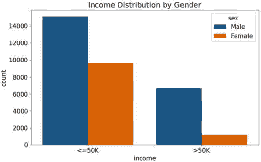
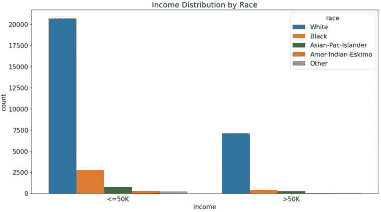
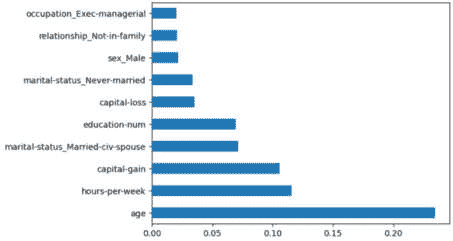
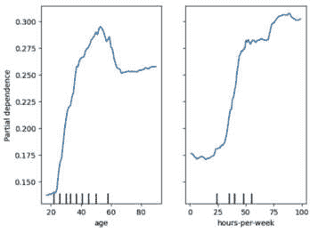
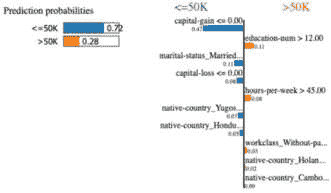
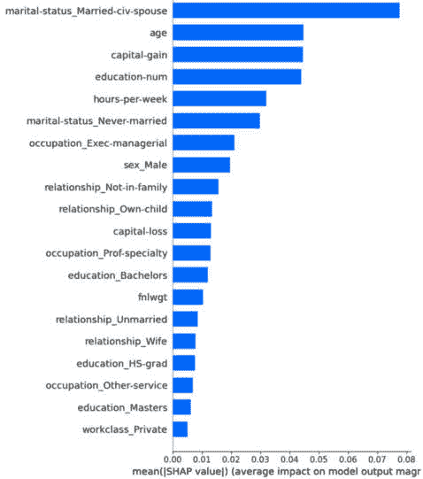
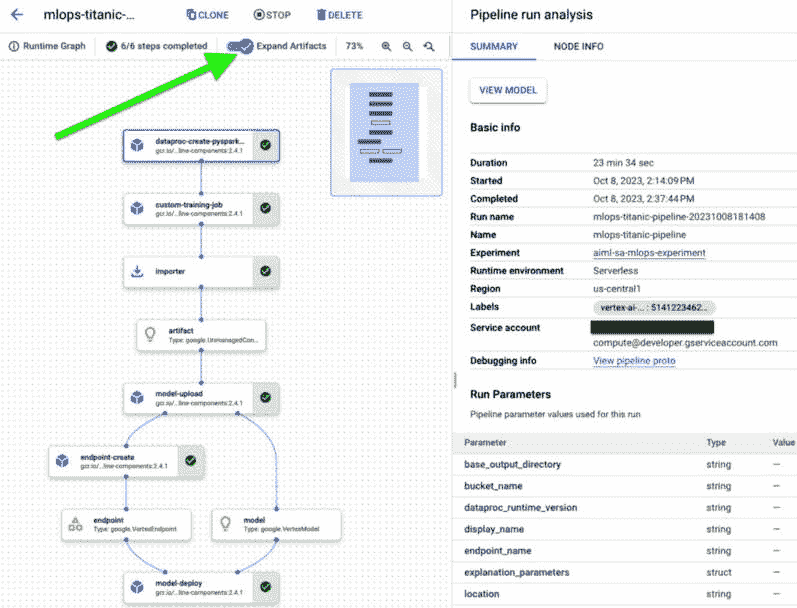
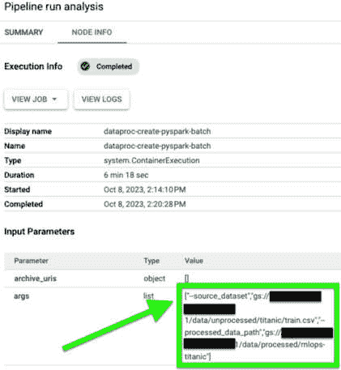
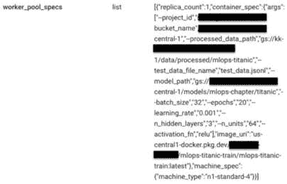
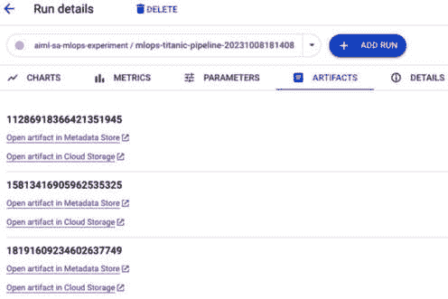

# 12

# 偏差、可解释性、公平性和血统

现在我们已经学习了在谷歌云中构建和部署模型以及自动化整个机器学习（ML）模型开发生命周期的所有步骤，现在是时候深入探讨更多对开发和维护高质量模型至关重要的高级概念了。

除了确保我们的模型为特定用例提供尽可能准确的预测外，我们还需要确保模型提供的预测尽可能公平，并且它们不会对任何个人或人口群体表现出偏见或歧视。

偏差、公平性和可解释性是当前机器学习研究的前沿话题。本章详细讨论了这些概念，并解释了如何有效地将这些概念融入我们的机器学习工作中。具体来说，本章将涵盖以下主题：

+   人工智能/机器学习（AI/ML）中偏差、公平性和可解释性的概述

+   如何检测和减轻数据集中的偏差

+   利用可解释性来理解机器学习模型并减少偏差

+   在机器学习模型开发中追踪血统的重要性

让我们从定义和描述相关概念开始。

# 人工智能/机器学习中的偏差、可解释性和公平性的概述

虽然“偏差”、“可解释性”和“公平性”这些术语并不特指机器学习（ML），在本节中，我们将探讨这些术语在机器学习模型开发和应用中的具体应用。

## 偏差

人工智能/机器学习中的偏差指的是数据和分析算法中的倾向或偏见，可能导致不公平的结果。机器学习模型开发中最常见的偏差来源之一是训练数据中存在偏差；例如，当训练数据中的数据点没有公平地代表模型预测将服务的现实或人群时，我们称之为**数据偏差**。例如，使用一个数据集，其中数据点主要代表只有一个特定的人口群体来训练模型，当模型需要根据代表其他人口群体的数据点进行预测时，可能会导致性能较差。更具体地说，这是一个被称为**抽样偏差**的例子。为了将这个概念与现实世界联系起来，让我们想象我们正在训练一个进行面部识别的模型。如果我们用来自一个特定人口群体的主要图像来训练这个模型，那么当模型后来遇到来自其他人口群体的图像时，它可能无法很好地执行面部识别任务。在开发和使用机器学习模型的过程中，我们可能会遇到多种不同的偏差，我们将在以下段落中概述。

### 收集或测量偏差

数据偏差的主要原因在于数据收集或测量的方式。有时，偏差可能由于我们测量或构建问题的方式而产生，这可能无法正确代表我们试图测量的基本概念。例如，让我们想象我们拥有一家小型公司，我们希望扩大我们的产品种类以吸引新客户。我们可能会决定使用调查来收集数据，以训练机器学习模型来预测我们应该提供哪些类型的新产品，基于这些新产品可能受欢迎的程度。我们可以以多种方式分发这份调查，例如通过电子邮件或通过实体邮件。在电子邮件的情况下，我们可能会决定将调查发送给所有当前客户，因为我们很可能已经在数据库中拥有他们的电子邮件地址。在实体邮件的情况下，我们可能会决定向公司所在邮政编码、城市、州或国家内的所有人发送。

不幸的是，这两种方法可能会意外地将偏差引入我们用于训练模型的训练数据集中。例如，也许我们过去传统上只吸引特定类型的客户。如果我们以当前客户群作为调查组，我们可能无法获得对吸引新客户群体有吸引力的产品的良好数据点。同样，如果我们向特定地理区域内的所有人发送调查问卷，例如邮政编码、城市、州，甚至国家，该区域居住的人可能不代表多样化的人口群体，这可能会无意中引入偏差到最终的数据集中。这种现象有时被称为**响应偏差**，在这种情况下，提供所需信息的人可能在某些方面存在偏见，因此可能会提供有偏见的回答。更复杂的是，我们在调查中提出问题的方式可能会无意中影响受访者的回答。

在这种情况下，我们还需要意识到**观察者偏差**或**主观性**，在这种情况下，进行调查的人可能在某些方面存在偏见。事实上，我们决定通过电子邮件向我们的当前客户发送，或向特定区域的人发送实体邮件的例子，是一种观察者偏差，其中我们根据当前可用的数据（例如，我们客户的电子邮件地址）或与我们公司位置的邻近性等因素决定调查特定的人群群体。

### 预先存在的偏差

这些通常是社会中已经存在的偏差。这种偏差可能源于文化、历史和社会规范等因素，包括根深蒂固的信念和实践，这些信念和实践塑造了个人看待世界的方式。

训练模型最常见的方法之一是使用已经记录的历史数据。然而，过去的数据可能受到那些时代固有的偏见的影响——我想我们都可以同意，20 世纪 50 年代或甚至 20 世纪 90 年代的社会规范与今天的标准有很大不同，特别是在不同人口群体之间的公平性方面。如果 AI/ML 模型在没有纠正的情况下使用这样的数据进行训练，它们很可能会持续这些偏见。重要的是要理解，未解决的预先存在的偏见不仅会持续，有时甚至还会放大刻板印象，导致不公平或歧视性的结果。例如，如果推荐系统在表现出这种偏见的历史数据上训练，它可能会倾向于向男性推荐更高薪酬的工作。

在这个背景下，另一种常见的偏见类型是**确认偏见**，其中人们可能无意识地倾向于选择和解释数据，以证实他们先前的信念。

如果数据收集过程没有检查预先存在的偏见，它们可能导致的数据并不能真正代表现实或它应该描绘的人群。在这样数据上训练的模型可能会在它们的预测或行动中学习并复制这些偏见。

### 算法偏见

这指的是由算法本身的设计引入的偏见，而不仅仅是它们训练的数据。考虑到算法在现代社会中用于实施越来越多的重要决策，如信用批准、招聘流程和医疗诊断，这是一个越来越重要的话题。

算法偏见可能更为微妙且难以检测。例如，这种偏见可能仅仅源于算法开发者本身。如果开发算法的团队缺乏多样性，可能无法预见或识别算法实施过程中的潜在偏见。我们还需要认识到在机器学习系统中意外开发有偏见的反馈循环的可能性。例如，在算法持续用新数据训练的系统，有偏见的输出可能会加强输入偏见，随着时间的推移，这可能导致结果越来越偏斜。

就像本节之前讨论的其他类型的偏见一样，未解决的算法偏见可能导致刻板印象、错误信息和不公平做法的持续。

需要注意的是，在本节中，我们只讨论了可能影响机器学习模型开发的一些最常见的偏见类型。这是一个活跃的研究领域，还存在一些我们可能没有明确意识到的其他类型的偏见，在我们开发和使用机器学习模型的过程中。

比喻来说，偏见的概念代表了一枚硬币的一面，而硬币的另一面是公平的概念，我们将在下一节中更详细地探讨。

## 公平性

在 AI 和机器学习（ML）中，公平性指的是以防止歧视和促进公平的方式开发算法。虽然公平性是一个相对直接的概念，例如平等对待所有人，但在实践中，它可能难以监控和维护。在本章稍后，我们将探讨监控和增强 ML 模型公平性的机制，但首先让我们在 ML 的背景下更详细地描述这一概念。正如前一个与偏差相关的部分，我们将讨论几种定义和衡量 ML 模型公平性的不同方法，这些方法将在以下小节中概述。

### 代表性公平性

这是防止 ML 模型开发中偏差的第一道防线，特别是在数据偏差方面。代表性公平性旨在确保用于模型训练和验证的数据包含了对结果模型预测将影响的各个不同人口群体的公平代表性；例如，确保性别和种族群体在数据集中得到公平的体现。

### 程序公平性

这涉及到确保数据收集、数据处理和算法开发的过程是公平的，不偏袒任何特定群体。在第十三章*中，我们将详细讨论治理的概念，特别是与数据治理相关的内容，以及它在帮助确保数据集中潜在的偏差得到解决或减轻的重要作用。许多企业雇佣了整个团队或组织来制定和执行治理要求。在程序公平性的情况下，重点不在于数据的内容，而在于导致 ML 模型开发、部署和运行的过程的公平性。程序公平性的几个关键组成部分由**TAIC**框架表示，该框架包括以下内容：

+   **透明度**，例如在整个模型生命周期中对方法、数据来源和做出的决策进行清晰的文档记录

+   **可问责性**，意味着应明确谁对模型开发的各个阶段、部署和监控负责

+   **公平性**，意味着程序不应偏袒或歧视任何个人或群体

+   **一致性**，意味着用于开发模型的过程应以一致的方式可重复

Google Cloud Vertex AI 提供了帮助审计程序公平性的机制，我们将在本章的后续部分以及伴随本章的实践活动中更详细地探讨。

### 结果公平性

当代表示性公平主要关注用于训练机器学习模型的输入（即训练数据的内容）时，程序性公平则关注用于开发和部署机器学习模型的程序，结果公平，正如其名所示，关注机器学习模型产生的结果。具体来说，它旨在确保模型产生的结果公平，不会不成比例地使任何群体受益或受损。当然，衡量这种公平性的方法之一是监控模型做出的预测，以确定是否存在任何偏见。在本章中，我们将探讨一些可用于此目的的机制和指标。

正如我在上一节讨论偏见时提到的，机器学习中的偏见和公平性概念仍然是研究非常活跃和不断发展的领域。这就是为什么在实践中，公平性可能是一个复杂的话题，并且重要的是要理解，实现一种类型的公平性有时可能导致另一种类型的公平性受到侵犯。此外，被认为“公平”的东西可能取决于具体情境，可能在不同的社区之间以及随时间推移而有所不同。

现在我们已经介绍了定义偏见和公平性两面性的概念，下一步将介绍一个与这两个概念固有联系的课题，这被称为**可解释性**。

## 可解释性

机器学习中的可解释性关注人类理解和解释机器学习模型输出产生的能力。这通常也被称为模型的**可解释性**。随着机器学习模型随着时间的推移变得越来越复杂，这些概念的重要性持续增长。例如，解释和解释简单线性回归模型的输出是如何产生的相对容易，因为我们有定义良好的数学公式来描述这个过程，例如 *y = a + bx*，其中 *y*（输出）是 *x*（输入）的线性变换。同样，对于决策树模型，我们可以逻辑上追踪通过树的决定路径。然而，当我们处理包含数百万甚至数十亿参数的大型**神经网络**（**NNs**），并采用不同类型的架构和激活函数时，我们需要一些额外的工具来帮助我们理解这些模型是如何做出决定的，我们将在本章中探讨这些工具。

当我们在上一节讨论程序性公平时，我们谈到了透明度的重要性。可解释性与透明度的概念紧密相连，因为它旨在确保人们可以理解从给定模型中产生预测的过程。例如，如果我们拥有一家银行，并且我们的某个模型负责批准或拒绝信贷申请，我们希望彻底了解它是如何做出这些决定的。

我们可以就可解释性从**全局可解释性**的角度进行讨论，其中我们试图理解模型在所有输入实例上应用的一般逻辑以做出预测，或者从**局部可解释性**的角度进行讨论，这涉及到解释模型为何对特定实例做出了特定决策（例如，理解为什么某个特定客户的信用申请被拒绝）。

总的来说，可解释性对于建立对 AI 系统的信任、遵守法律要求以及确保人类能够有效地干预决策过程至关重要。

现在我们已经介绍并解释了整体概念，让我们开始深入探讨。本章的第一个深入探讨将是关于数据集中偏差的话题。

# 如何检测和减轻数据集中的偏差

在本节中，我们探讨如何检测数据集中的偏差，并且我们可以使用各种工具和方法来达到这个目的。实际上，我们已经在本书的前几章中介绍了一些这些工具，例如数据探索和可视化。

## 数据探索和可视化

当我们使用可视化来探索我们的数据集时，例如，直方图和散点图等图表可以帮助可视化不同人口群体之间的数据分布差异。同样，我们已经探讨了描述性统计，如均值、中位数、众数和方差，以了解我们数据集的内容。如果这些统计量在不同子组之间存在显著差异，这可能表明数据集中存在偏差。

## 用于检测特征之间依赖关系的特定工具

我们还希望测试数据集中特征之间的潜在相关性或依赖性，以便了解某些特征的值是否受到其他特征值的显著影响。虽然这通常是我们作为常规数据探索和特征工程的一部分要做的事情（也就是说，我们需要尽可能多地了解我们数据中的潜在模式），但在偏差和公平性的背景下，这变得更加重要，特别是在目标变量与性别或种族等受保护属性之间潜在联系方面。

有一些特定的工具可以检测特征之间的依赖关系，例如**皮尔逊相关系数**，它衡量数值变量之间的线性关系，或者**卡方检验**，它可以用来确定两个分类变量之间是否存在显著的关联。

## 包含模型预测结果的机制

除了上述方法之外，我们还可以使用超越仅检查数据集的机制，同时考虑模型的输出，这可以帮助我们将任何观察到的偏见追溯到训练数据和过程。例如，我们可以使用**差异影响分析**（**DIA**）来比较不同组的有利结果比率，并衡量是否有任何特定组比其他组更有可能获得有利结果。让我们更详细地看看 DIA。

### DIA

在 DIA 的情况下，我们通常根据某些受保护特征（如性别或种族）来识别所谓的**特权组**和**无特权组**（也称为**受保护组**），并比较给定模型为这两个组提供的输出，以试图确定模型是否在针对这些组表现出偏向（正面或负面）。我们使用称为**差异影响比率**（**DIR**）的指标来衡量这种差异，该指标由以下公式定义：


这里，代表无特权组获得有利结果的可能性，而 P(FP)代表特权组获得有利结果的可能性。

DIR 值可以这样解释：

+   当 DIR 等于 1 时，表示完美的公平性，两组以相同的比率获得有利结果

+   当 DIR 大于 1 时，表示无特权组获得有利结果的可能性更高

+   当 DIR 小于 1 时，表示无特权组获得有利结果的可能性较低

一个普遍接受的阈值是 DIR 值在 0.8 到 1.25 之间；超出这个范围的值通常表明潜在的**差异****影响**（**DI**）。

注意，DIA 可以通过使用目标特征直接在数据集上执行，或者它可以使用输入特征和模型预测的组合。

在下一节中，我们将更详细地探讨机器学习中可解释性的概念，并探讨我们如何使用可解释性框架来检测和解决偏见。我们还将扩展本节中涉及的概念，并讨论它们与可解释性和公平性的关系。

# 使用可解释性来理解机器学习模型并减少偏见

在上一节中，我们以高层次介绍了可解释性的概念。本节将进一步探讨这个主题，介绍可用于在推理时深入了解机器学习模型工作的工具。

## 可解释性技术、方法和工具

让我们从探索一些流行的技术、方法和工具开始，这些工具可以帮助我们在机器学习中实现可解释性，我们将在以下小节中描述。

### 执行数据探索

到现在为止，希望已经清楚，理解用于训练我们模型的训练数据是解释模型如何做出决策的第一步之一，同时也是识别和对抗潜在偏差的第一道防线。

在本章相关的实际活动中，我们探讨了“成人人口普查收入”数据集([`archive.ics.uci.edu/dataset/2/adult`](https://archive.ics.uci.edu/dataset/2/adult))，该数据集已知在种族和性别方面存在不平衡。该数据集包含有关人们的信息，例如他们的种族、性别、所受教育和他们当前的年收入，年收入以“<=50K”（每年不超过 50,000 美元）或“>50K”（每年超过 50,000 美元）表示，当使用收入作为目标变量时，这创建了一个二元分类用例。

在探索这些数据时，我们可以提出以下问题：

1.  特征值，如种族和性别，是否在一定程度上均匀或不均匀地表示？

1.  是否存在某些特征值与该人收入之间的相关性？

我们可以通过使用数据可视化技术轻松地看到数据集中的不平衡。让我们看看一些例子。

#### 按性别划分的收入分布

以下代码将向我们展示数据集中每个性别在两种不同的收入类别（即每年收入不超过 50,000 美元或超过 50,000 美元的人）中的分布情况。如果您想跟随我们即将审查的代码示例，可以打开本章附带的 Jupyter 笔记本。我们可以再次使用在*第五章*中创建的相同的 Vertex AI Workbench-Notebook 实例来完成此目的。请在笔记本实例上打开 JupyterLab。在屏幕左侧的目录浏览器中，导航到`Chapter-12`目录并打开`bias-explainability.ipynb`笔记本。您可以选择**Python (Local)**作为内核。同样，您可以通过选择单元格并按键盘上的*Shift* + *Enter*来运行笔记本中的每个单元格。除了相关代码外，笔记本还包含描述代码正在做什么的 markdown 文本：

```py
plt.figure(figsize=(10, 6))
sns.countplot(x='income', hue='sex', data=adult_data)
plt.title('Income Distribution by Gender')
plt.show()
```

这将显示类似于*图 12.1*的图表：



图 12.1：按性别划分的收入分布

在*图 12.1*中，我们可以看到，总体而言，数据集中收入超过 50,000 美元的人比那些收入不超过 50,000 美元的人要多。我们还可以看到，每个组中的男性数量远超过女性数量。这也告诉我们整个数据集包含与男性相关的数据点比与女性相关的数据点要多。

#### 按种族划分的收入分布

以下代码将向我们展示数据集中每个种族关于收入的分布：

```py
plt.figure(figsize=(15, 8))
sns.countplot(x='income', hue='race', data=adult_data)
plt.title('Income Distribution by Race')
plt.show()
```

这将显示一个类似于*图 12.2*所示的图表：



图 12.2：按种族划分的收入分布

在*图 12.2*中，对于“<=50K”类别和“>50K”类别，我们可以看到，与任何其他种族相比，白人的数据点要多得多。这可以被视为数据集中的一种偏差。正如我们在本章前面所介绍的，这种偏差可能存在多个潜在原因，例如数据收集中的偏差，或者它可能由于地理位置等其他因素而发生。这个特定的数据集代表了特定地区的人口，这可以部分解释其明显倾向于特定种族的偏差。例如，如果数据是在亚洲收集的，那么它将包含比任何其他种族更多的亚洲人的数据点，或者如果它是在中非收集的，那么它将包含比任何其他种族更多的黑人的数据点。重要的是要注意数据中的任何不平衡，并确定它们可能如何影响机器学习模型的训练以及该模型旨在为谁服务。一般来说，如果数据集中的特征具有特定值的实例数量要高得多，那么机器学习模型的预测可能会以某种方式反映这一点。

在伴随本章的 Jupyter 笔记本中，我们还评估了数据中的其他类型分布，例如按性别划分的职业分布和按种族划分的教育分布。我鼓励您使用 Jupyter 笔记本来更详细地探索数据。现在，让我们继续并更详细地探讨实施 DIA。

### 实施 DIA

以下是我们用于在 Jupyter 笔记本中实施 DIA 的代码：

```py
pivot_gender_income = adult_data.pivot_table(index='sex', 
    columns='income', values='age', aggfunc='count')
pivot_gender_income['rate'] = pivot_gender_income['>50K'] / (
    pivot_gender_income['>50K'] + pivot_gender_income['<=50K'])
DI = pivot_gender_income.loc['Female', 'rate'] / (
    pivot_gender_income.loc['Male', 'rate'])
```

代码首先创建了一个`adult_data`数据框的交叉表，按性别和收入分组，每个组中的人数为值。然后，它向交叉表添加了一个名为`rate`的新列，这是每个组中收入超过 50,000 美元的人的比例。最后，它通过将女性的比率除以男性的比率来计算 DI。

这是一个在已知包含性别不平衡的数据集上实施 DIA 的非常简单的例子。DIA 可能更加复杂，并且可能需要一些领域专业知识才能有效实施，具体取决于数据集的内容以及在该数据上训练的机器学习模型的目的功能。

接下来，让我们讨论特征重要性的主题。

## 特征重要性

特征重要性评估了每个特征对模型预测的影响。为了探讨这个概念，让我们想象我们有一个包含关于人们信息的数据集，数据集中的特征包括身高、年龄、眼睛颜色以及他们是否喜欢咖啡。我们想使用这些数据来训练一个模型，以预测每个人成为成功篮球运动员的可能性。你认为我们数据集中的任何输入特征可能比其他特征在影响结果方面更重要吗？身高在决定一个人是否可能成为成功的篮球运动员方面可能比眼睛颜色更重要或更不重要吗？年龄是一个重要因素吗？在这种情况下，我们通过一个简单的例子来描述特征重要性的概念。在现实中，我们可能正在处理包含数千个特征的数据库，而这些特征可能并不总是代表像身高、年龄和眼睛颜色这样容易解释的概念。因此，我们可以使用工具来帮助我们获得这些见解。以下小节描述了我们可以用于此目的的工具。

### 常见机器学习库中内置的特征重要性工具

```py
feature_importances_ attribute to create a graph similar to that shown in *Figure 12**.3*:
```

```py
feat_importances = pd.Series(clf.feature_importances_, 
    index=X.columns)
feat_importances.nlargest(10).plot(kind='barh')
```



图 12.3：特征重要性

在**图 12**.3 中，我们可以看到诸如`年龄`、`每周小时数`和`资本收益`等特征似乎在预测收入方面非常重要。这些特征的影响是否对你来说直观易懂？

注意，特征重要性并不表示因果关系。仅仅因为一个特征被认为很重要，并不意味着它会导致目标变量发生变化；只是表示存在关联。

当我们在 Jupyter 笔记本中具体使用 scikit-learn 的`feature_importances_`属性时，其他流行的机器学习库也提供了类似的机制。例如，TensorFlow 的增强树（`tf.estimator.BoostedTreesClassifier`或`tf.estimator.BoostedTreesRegressor`）也提供了`feature_importances_`属性来获取每个特征的重要性。同样，LightGBM 和 CatBoost 分别提供了`feature_importances_`和`get_feature_importance()`，而 XGBoost 提供了`plot_importance()`函数用于可视化。

虽然`feature_importances_`和其他机器学习库中的类似机制非常有用，但我们还可以使用更高级的工具来评估特征重要性，我将在下文中描述。

#### 局部依赖性图

**部分依赖图**（**PDPs**）是用于理解输入特征（或一组输入特征）与模型预测结果之间关系的图形可视化。使用 PDPs，我们只改变一个特征的值，同时保持所有其他特征的值不变，以确定该特定特征的各个值如何影响预测。PDPs 也可以同时使用多个输入特征，这可以揭示多个特征之间的相互作用。还有 PDPs 的扩展形式，称为**个体条件期望（ICE）图**。虽然 PDPs 显示了特征对预测的平均影响，但 ICE 图显示了特征对单个实例预测的影响。

使用 PDPs，对于感兴趣特征的每个唯一值，都会执行以下高级步骤：

1.  将数据集中每个实例的感兴趣特征设置为该值。

1.  使用模型进行预测。

1.  平均预测值。

1.  将平均预测与特征的唯一值进行绘图。

以下代码使用 scikit-learn 的`PartialDependenceDisplay`属性创建并显示 PDP 图形：

```py
features = ['age', 'hours-per-week']
PartialDependenceDisplay.from_estimator(clf, X, features)
```

此代码将生成一个类似于*图 12.4*所示的图形：



图 12.4：PDP

在*图 12.4*所示的 PDP 中，模型似乎预测人们从大约 20 岁开始逐渐增加收入，直到他们达到大约 60 岁，之后他们的收入开始下降。这一点在一定程度上是直观的，因为 20 岁被认为是早期成年，人们通常在 60 多岁时退休。同样，模型预测每周工作更多小时可能会导致收入更高。

接下来，我们将讨论更高级的特征重要性和解释机制。

#### 局部可解释模型无关解释

如我在本章前面提到的，一些模型比其他模型更容易解释和理解（因此更容易解释）。提供的例子包括线性回归模型和决策树，与具有数千、数百万甚至数十亿参数的大型神经网络（可能很快就会达到万亿！）相比！**局部可解释模型无关解释**（**LIME**）利用这一事实，通过训练一个更简单、**代理**的模型，该模型比目标模型更容易解释。想法是，即使整体模型复杂且非线性，也可以通过一个更简单、可解释的模型很好地近似。

LIME 的内部工作原理相当复杂，如果您想深入了解该层面的细节，建议阅读原始论文(*arXiv:1602.04938*)。这类算法细节通常不是解决方案架构师活动所必需的，您只需了解 LIME 的用途，而不需要深入研究其内部工作的学术细节。那么，接下来，下面的代码提供了一个如何使用 LIME 的示例：

```py
explainer = lime_tabular.LimeTabularExplainer(
    X_train.values, training_labels=y_train,
    feature_names=X.columns.tolist(), 
    class_names=['<=50K', '>50K'], 
    mode='classification')
exp = explainer.explain_instance(
    X_test.values[0], clf.predict_proba, 
    num_features=10)
exp.show_in_notebook()
```

代码将生成与*图 12.5*中所示类似的可视化效果：



图 12.5：LIME 输出

在*图 12.5*的顶部，我们看到模型对输入实例的预测。在这种情况下，由于这是一个二元分类问题，它显示了模型预测的类别，以及与该预测相关的概率分数。我们还看到一个表示各种特征对预测影响的水平条形图。每个条形代表一个特征及其影响。条形的长度表示影响的重要性，其方向（左或右）表示影响的方向（例如，指向“<=50K”或“>50K”类别）。每个条形都标有特征名称和一个小描述符，这表明该特征是如何针对特定实例进行量化的。这提供了关于该特定实例的特征值如何影响预测的明确指示。

需要强调的是，LIME 的解释是局部的。它们专门针对特定实例进行定制，展示了模型如何为该实例做出预测，而不是针对所有数据的通用规则。接下来，我们将探讨一种可以帮助解释局部和全局模型机制的机制，这可能是行业中最受欢迎的特征重要性和解释机制之一。

#### SHapley Additive exPlanations

**Shapley Additive exPlanations** (**SHAP**)通过使用称为**Shapley 值**的概念来帮助解释机器学习模型的预测。这些值来自被称为**博弈论**的数学领域，或者更具体地说，是**合作博弈论**，它们最初在 20 世纪 50 年代由 Lloyd Shapley 提出。博弈论的研究关注竞争性情况（称为“游戏”），其中一位玩家的选择结果取决于其他玩家的行为。合作博弈论是一个子分支，它关注玩家可以与其他玩家结盟或**联盟**，并作为一个团队共同努力，使联盟整体受益，而不仅仅是关注自己的利益。

进一步深入，让我们想象一个赢家将获得 100 美元奖金的游戏。人们可以单独玩游戏，在这种情况下，如果他们赢了，个人将直接获得 100 美元，或者他们可以组成团队共同努力争取 100 美元的奖金。如果三个人组成一个团队并赢得奖金，实际上，他们可能会将奖金平均分成三份。然而，如果奖金应该根据每个人的贡献**公平**地分配，那会怎样？这就是 Shapley 值发挥作用的地方。

Shapley 值代表每个玩家在所有可能的联盟中以及他们可能进入每个联盟的所有可能顺序中的**平均边际贡献**。再次强调，关于这个主题的细节覆盖，我将不会在这里包括复杂的数学细节，但如果您想深入了解这些细节，可以阅读原始论文，其正式参考文献如下：

*Shapley, L.S. (1953). A Value for n-Person Games. In “Contributions to the Theory of Games volume II”, H.W. Kuhn and A.W. Tucker (eds.), Princeton* *University Press.*

在这里，我们将关注 Shapley 值在机器学习模型可解释性背景下的应用。我们首先从**平均预测**的概念开始，它代表我们的模型在整个数据集上做出的所有预测的平均值。对于回归模型，这仅仅是所有预测输出的平均值。对于分类模型，它是整个数据集上给定类别的平均预测概率。

当计算特定实例（即输入数据的一行）的 Shapley 值时，每个特征的贡献是通过它们如何将该实例的预测移动到平均预测来衡量的。然后，该特征的 Shapley 值捕捉了它在所有可能的特征组合中的平均边际贡献。例如，考虑一个二元分类模型，该模型预测银行贷款是否会违约。如果平均而言，该模型在整个数据集上预测违约概率为 5%，那么这个 5%就是“平均预测”。现在，对于特定的贷款申请，如果模型预测违约概率为 20%，Shapley 值有助于将这个平均预测的 15%偏差归因于输入中的每个特征（例如，申请人的收入、就业状况、信用评分等）。每个特征的 Shapley 值将表明该特征平均对预测偏差的贡献有多大。

以下代码提供了一个使用 SHAP 库获取特征重要性洞察的示例：

```py
shap_values = shap.TreeExplainer(clf).shap_values(X_test)
shap.summary_plot(shap_values[1], X_test, plot_type="bar")
```

在代码中，我们正在创建 SHAP 库中的 `TreeExplainer` 对象。这个特定的解释器针对基于树的模型进行了优化，例如决策树、随机森林和梯度提升树。我们传递给它的 `clf` 实例是我们训练的基于树的模型。一旦创建了解释器，我们就使用 `.shap_values()` 方法计算 `X_test` 数据集中每个样本的 SHAP 值。然后，我们通过使用条形图（条形越长，特征的重要性就越大）来可视化每个特征对模型预测的平均影响。代码将生成类似于 *图 12**.6* 中所示的图形：



图 12.6：SHAP 输出

如我们在 *图 12**.6 中所见，也许令人惊讶的是，一个人的婚姻状况似乎对模型的输出影响最大。考虑到一个特征的 SHAP 值是该特征值对每个可能预测的平均贡献（对所有实例进行平均），它考虑了与其他特征的复杂交互，以及特征本身的影响。

虽然我们可以将 SHAP 等工具导入我们的笔记本中，但我们也可以使用 Vertex AI API 直接从 Vertex AI 中托管的模型中获取解释。下一节将描述如何做到这一点。

### 从 Vertex AI 中部署的模型获取解释

便利的是，Vertex AI 提供了我们可以使用的 API 和 SDK，以便从我们的模型中获取解释。在本章所附的 Jupyter 笔记本中，我们使用 `projects.locations.endpoints.explain` API 从我们在上一章 MLOps 管道中部署的模型中获取解释。以下是我们用于此目的的代码片段：

```py
endpoint = aiplatform.Endpoint(endpoint_name)
response = endpoint.explain(instances=[instance_dict], parameters={})
    for explanation in response.explanations:
        print(" explanation")
        # Feature attributions.
        attributions = explanation.attributions
        for attribution in attributions:
            print("  attribution")
            print("   baseline_output_value:", 
                attribution.baseline_output_value)
            print("   instance_output_value:", 
                attribution.instance_output_value)
            # Convert feature_attributions to a dictionary and print
            feature_attributions_dict = dict(
                attribution.feature_attributions)
            print("   feature_attributions:", 
                feature_attributions_dict)
            print("   approximation_error:", 
                attribution.approximation_error)
            print("   output_name:", attribution.output_name)
```

代码将生成类似于以下内容的输出：

```py
   baseline_output_value: 0.7774810791015625
   instance_output_value: 0.09333677589893341
   feature_attributions: {'dense_input': [-0.1632179390639067, 0.0, -0.2642899513244629, 0.0, 0.174240517243743, 0.0, 0.0, -0.5113637685775757, 0.001784586161375046, 0.1180541321635246, -0.03459173887968063, -0.004760145395994187]}
   approximation_error: 0.007384564012290227
   output_name: dense_3
```

响应中的字段可以这样解释：

+   `baseline_output_value`: 这是模型对基线实例的输出值。基线是一个参考点（例如平均值或中性实例），我们将其与对我们感兴趣实例的预测进行比较。模型在感兴趣实例和基线之间的输出差异有助于我们理解每个特征的贡献。

+   `instance_output_value`: 这是模型为我们传入的解释实例的输出值。在二元分类器的上下文中，这可以解释为实例属于正类的概率。

+   `feature_attributions_dict`:

    +   `'dense_input'`: 这是模型输入张量的名称。

    +   这串数字表示了给定预测中每个对应特征在输入中的重要性或归因。此列表的长度与模型输入中的特征数量相匹配：

        +   每个数代表该特征对特定实例的模型预测的边际贡献，相对于基线。换句话说，这个特征将预测从平均/基线预测移动了多少？

        +   正值表示该特征推动了模型输出向正类方向。对于二分类，这通常意味着它使模型更有信心将实例分类为正类。

        +   负值表示该特征推动了模型输出向负类方向。

        +   零或接近零表示该特征对特定实例的预测没有产生显著影响。

+   `approximation_error`: 这是在计算归因值时使用的近似误差。解释方法通常使用近似来计算归因。近似误差给出了我们对归因值可以有多少信心（通常情况下，较小的误差表示更可靠的归因）。

+   `output_name`: 这是模型输出张量的名称。

恭喜！您已成功检索到发送到 Vertex AI 托管模型的输入的解释。要深入了解 Vertex 可解释 AI，您可以参考以下链接中的文档：[`cloud.google.com/vertex-ai/docs/explainable-ai/overview`](https://cloud.google.com/vertex-ai/docs/explainable-ai/overview)。

到目前为止，我们讨论了获取和使用解释来理解我们的模型。如果我们发现我们的模型的一些预测是不公平的，那会怎样？我们可以采取哪些行动来对抗这种情况？我们可以用于此目的的一种解释机制是**反事实解释**，我们将在下一部分探讨。

### 反事实解释

反事实解释围绕的问题是，“我的输入数据需要改变什么才能改变预测模型的决策？”它们描述了一个假设的替代方案，如果满足某些条件，就会发生观察到的结果。这可能是在输入特征中发生的最小变化，从而将预测改变为指定的输出。

回到我们的贷款批准的例子，假设一个申请人 John 因为他的收入、信用评分和就业历史等特征被拒绝贷款。一个反事实解释可能会告诉 John：“如果你的收入高出 10,000 美元，你将获得贷款批准。”

反事实解释有多个重要原因。它们帮助受模型预测影响的个人理解为什么做出了某个决定。它们帮助数据科学家了解如何根据各种标准增强他们的模型，并且对于合规性也很重要。

要找到一个反事实，我们需要在特征空间中定义一个距离度量。目标通常是找到与原始实例最接近的反事实实例，但结果却产生不同的预测。这通常被表述为一个优化问题，其目标是使原始实例与其反事实之间的距离最小化，同时仍然产生不同的预测。

请记住，对于某些模型，特别是**深度神经网络**（**DNNs**），找到反事实可能具有计算上的挑战。还重要的是要注意，反事实可能建议在现实生活中不可能或非常难以实现的变化，因此需要评估其现实世界的可行性。在本章附带的 Jupyter 笔记本中，我们执行了一些简单的反事实处理。请记住，反事实是一个在快速发展的领域中高度复杂的话题。

接下来，让我们看看一些减少偏差的额外机制。

## 减少偏差和增强公平性

在本节中，我们讨论了我们可以采取的主动措施，以在每个模型开发生命周期阶段减少数据集和机器学习模型中的偏差并增强公平性。

### 从数据开始

就像数据科学领域的任何事物一样，数据通常是开始的好地方。如果可能的话，我们应该收集更多的数据并确保数据尽可能平衡。在数据预处理期间，我们还可以通过使用重采样技术来调整训练数据中代表性不足的群体的表示，例如通过过采样少数群体或欠采样多数群体来减轻偏差。在特征工程期间，我们还可以创建或修改特征以减少其潜在的歧视性影响。

### 在模型训练期间

在模型训练过程中，我们可以引入**公平约束**，通过确保受保护群体和非受保护群体具有相等的正率和负率来确保平等机会。为此目的，有大量的公平性指标和约束，例如以下内容：

+   **人口统计学平等**或**统计平等**，要求不同群体中积极结果的概率应该相同

+   **平等机会**，要求不同群体中真实正率相等

+   **均衡机会**，通过要求真实正率和假正率在各个群体中相等来扩展平等机会

+   **治疗平等**，要求不同群体中假阴性率与假正率的比例相等

公平约束可以在模型训练期间作为正则化的一种类型来实现。甚至还有一些专门设计来处理公平问题的公平感知算法，例如**公平 k 均值**算法。

### 后处理

在后处理期间，我们还可以采取一些步骤，例如调整不同群体的决策阈值，以确保公平性指标，如平等机会或人口统计平衡，我们还可以调整模型预测，以确保它们在各个群体中都是公平的。

当然，持续监控现实世界预测中的公平性问题并在必要时重新训练模型也非常重要。在关键决策场景中，我们可以考虑让人类参与审计或覆盖模型决策。

注意，公平性增强方法可能会导致模型准确性的权衡。挑战通常在于找到公平性和准确性之间的平衡，这对于给定的应用来说是可接受的。了解哪个公平性指标与您具体问题最相关也非常关键，因为不同的公平性指标有时可能会相互冲突。

为了总结本节关于可解释性和公平性的内容，让我们简要地看看一些我们可以用来评估和实施这些概念的库。

## 其他库

幸运的是，有一个不断增长的库列表正在开发中，目的是评估和促进可解释性和公平性。本节描述了此类库的示例。

### What-if Tool

**What-if Tool**（**WIT**）最初由 Google 开发，是一个早期的可解释性工具，具有可视化界面，允许检查模型的预测、比较不同模型以及检查潜在的偏差。它相对容易使用，不需要太多编码，并且包括了对我们在本章中讨论的许多概念的支持，例如反事实和 PDPs。

### AI Fairness 360

IBM 的**AI Fairness 360**（**AIF360**）是一个开源库，包括一组用于数据集和模型的公平性指标以及减轻偏差的算法。它可以用来提供详细的解释，以理解公平性指标及其在特定环境中的含义，并使用户能够可视化地探索数据集和模型中的偏差。它还可以帮助识别训练好的模型是否产生了偏差的结果，并提供一些工具来帮助在每个模型开发生命周期阶段（如预处理、训练和后处理）减轻偏差。

### EthicalML/XAI

这是一个开源的 Python 库，旨在支持可解释的机器学习和负责任的 AI。它包括预处理、模型可解释性、偏差检测和可视化的工具，并支持我们在本章中讨论的概念，例如特征重要性、Shapley 值、LIME 和 DIA。

### Fairlearn

Fairlearn 是另一个基于 Python 的开源项目，旨在帮助数据科学家提高人工智能系统的公平性。它包括用于减轻分类和回归模型不公平性的算法，以及用于比较的公平性指标。其主要目标是帮助机器学习从业者通过理解指标和算法来减少预测中的不公平差异，并提供用于模型评估和比较的交互式用户界面体验，这包括公平性指标和评估仪表板。它再次支持在机器学习模型开发生命周期的各个阶段使用缓解技术，例如预处理、训练和后处理。

除了这里提到的之外，还有许多其他可解释性和公平性库，但这些是当前在行业中特别受欢迎的库。谷歌云最近推出了更具体的模型评估机制和公平性指标。在撰写本文的 2023 年 10 月时，这些机制仍处于预览模式，尚未普遍可用。您可以在以下链接的文档中了解更多关于这些功能的信息：[`cloud.google.com/vertex-ai/docs/evaluation/intro-evaluation-fairness`](https://cloud.google.com/vertex-ai/docs/evaluation/intro-evaluation-fairness)

关于生成式人工智能的说明

本书第十四章至第十七章专门介绍**生成式人工智能**（**GenAI**），这是 AI/ML 的一个相对较新的子集。在这些章节中，我们将探讨**大型语言模型**（**LLMs**）的概念以及它们与我们已在本书中介绍的其他类型机器学习模型的不同之处。LLMs 通常在极其庞大的数据集上训练，因此获得了可以应用于许多不同类型用例的大量知识。在这些后续章节中，我们将学习如何将 LLMs 用作自动评分员，为机器学习模型开辟新的评估技术，包括针对偏差、可解释性和公平性的特定评估。

本章最后要探讨的一个主题是谱系追踪的概念。在下一节中，我们将详细探讨这个主题，并评估其在可解释性和公平性背景下的重要性。

# 在机器学习模型开发中追踪谱系的重要性

我们在前面章节中提到了谱系追踪的概念，现在我们将更详细地探讨它。当我们谈论谱系追踪时，我们指的是追踪创建给定机器学习模型所使用的所有步骤和工件。这包括以下项目：

+   源数据集

+   对这些数据集执行的所有转换

+   创建的所有中间数据集

+   在结果数据上训练模型所使用的算法

+   在模型训练过程中使用了哪些超参数和值

+   在训练过程中使用了哪些平台和工具

+   如果使用了超参数调整作业，该作业的详细信息

+   对生成的模型执行的任何评估步骤的详细信息

+   如果模型正在为在线推理提供服务，则模型托管端点的详细信息

上述列表并不全面。我们通常希望追踪创建模型所使用的每个步骤以及每个步骤中的所有输入和输出。

我们为什么要这样做？血缘追踪对于许多原因都很重要。它补充了可解释性的概念。虽然血缘追踪本身不一定能解释为什么模型以特定方式表现，但对于研究人员了解模型是如何创建的非常重要。它对于可重复性和协作也很重要。我们已经讨论了一些公司在需要管理由许多不同团队创建的数千个机器学习模型时遇到的复杂性。如果一个模型表现有问题，了解其血缘将有助于故障排除。如果一个团队想要基于另一个团队已经完成的工作构建，例如他们已经训练的模型或他们创建的数据集，了解这些工件的血缘将帮助消费团队在这些努力中更加高效。此外，为了持续提升模型的表现，我们需要知道该模型是如何创建的。血缘对于治理和合规也很重要，有时是必需的。

幸运的是，Google Cloud 提供了帮助我们追踪血缘的工具。例如，Dataplex 可以用来追踪数据血缘，而 Vertex ML 元数据服务可以帮助我们追踪我们机器学习模型开发生命周期中的所有步骤和工件。接下来，我们将更详细地了解 Vertex ML 元数据；让我们首先从 Vertex ML 元数据服务使用的术语开始。

## 机器学习元数据服务术语

**执行**代表机器学习工作流中的步骤或操作，例如数据预处理、模型训练或评估。**工件**代表每个步骤的输入和输出，例如数据集、模型或评估指标。**事件**代表执行和工件之间的关系，例如“工件 X 由执行 Y 生成”或“工件 X 被执行 Y 作为输入使用。”事件通过将工件和执行相互关联，帮助我们建立血缘数据。**上下文**代表将相关工件和执行捆绑在一起的逻辑分组。一个上下文的例子可能是一个特定的管道运行或模型版本。

所有上述资源统称为**元数据资源**，并由**MetadataSchema**描述，该 Schema 描述了特定类型的元数据资源的模式。除了预定义的元数据资源外，我们还可以在 Vertex ML 元数据服务中存储自定义元数据。所有跟踪的元数据都存储在**MetadataStore**中，所有这些信息都可以用来创建**谱系图**，这是一个连接工件、执行和上下文，并显示它们之间关系和流的视觉表示。

注意，与大多数 Google Cloud 资源一样，可以通过 Google Cloud **身份和访问管理**（**IAM**）来控制对元数据资源的访问，这对于安全和合规性非常重要。

现在我们已经涵盖了主要术语和概念，让我们开始回顾一些 Vertex AI 中的元数据。

## Vertex AI 中的谱系跟踪

要探索 Vertex AI 中的谱系跟踪功能，我们将使用我们在*第十一章*中构建的 MLOps 管道作为示例。

在 Google Cloud 控制台中，执行以下步骤：

1.  导航到**Vertex AI** > **Pipelines**。

1.  点击在*第十一章*中创建的管道运行名称（除非在此期间你在该 Google Cloud 项目中运行了其他管道，否则它应该是最近的管道运行）。

1.  你将看到管道运行的执行图。

1.  在屏幕顶部，点击**展开工件**（**Expand Artifacts**）左侧的切换按钮（参见**图 12**.7 以获取参考）：



图 12.7：展开工件

1.  现在我们可以开始探索与管道中每个步骤和工件相关的元数据。

1.  你还会注意到，屏幕右侧的**管道运行分析**部分包含大量关于此管道运行的信息。**摘要**（**SUMMARY**）选项卡提供了有关管道运行本身的信息，包括用作输入的参数。这些是我们*第十一章*中管道定义中定义的参数。

1.  我们可以点击管道执行图中的元素，以查看与该特定元素相关的元数据。让我们从开始的地方开始。我们想知道哪个数据集被用作管道的初始输入。考虑到我们的管道中的第一步是数据预处理步骤，并且该步骤检索数据集，点击预处理步骤，其元数据将显示在屏幕右侧，如图**图 12**.8 所示：



图 12.8：预处理步骤详情

1.  在**图 12**.8 中，绿色的箭头指向`source_dataset`输入参数，它提供了源数据集的路径（为了隐藏我的存储桶名称，图像中的实际细节已被删除）。

1.  我们还可以看到`preprocessed_data_path`参数的值，它提供了预处理脚本将存储结果处理数据的文件夹路径。如果你向下滚动（截图未显示），你也会看到`main_python_file_uri`参数的值，它提供了我们用于管道预处理步骤的 PySpark 脚本的路径。实际上，如果我们点击**查看作业**按钮，我们可以查看用于在 Google Cloud Dataproc 上执行我们的脚本的实际无服务器 Spark 作业的详细信息，包括其执行日志。

1.  现在我们已经成功追踪了我们的源数据集、对数据集进行转换的脚本和作业，以及用于训练我们的模型的处理后的数据集，接下来让我们转向管道中的下一个步骤，即模型训练步骤。

1.  在我们的管道执行图中点击`custom-training-job`步骤。在右侧的信息面板中，可能最重要的参数是`worker_pool_specs`参数。如图*图 12.9*所示，该参数提供了关于我们的模型如何训练的大量信息，例如用于训练的数据集（这是前一个预处理步骤的输出），训练模型工件保存的位置，用于运行自定义训练代码的容器镜像，训练期间使用的超参数值，以及训练作业使用的机器类型和机器数量：



图 12.9：worker_pool_specs

1.  再次，如果我们点击屏幕顶部的**查看作业**按钮，我们可以看到在 Vertex AI 训练服务上运行的实际作业，以及该作业的执行日志。

1.  因为我们使用自定义脚本来训练我们的模型，并将工件简单地保存在 Google Cloud Storage 中，在这个管道阶段，我们的模型被称为`importer`作业，用于导入我们的模型工件。

1.  管道中的`model-upload`步骤是将我们的模型注册到 Vertex AI 模型注册表中的步骤。如果你在执行图中点击该步骤并查看其元数据，在**输出参数**部分，你会看到 Vertex AI 模型注册表中结果资源的 URI。

1.  剩余的步骤`endpoint-create`和`model-deploy`具有类似的格式。正如它们的名称所暗示的，`endpoint-create`步骤在 Vertex AI 预测服务中创建一个端点，而`model-deploy`步骤将我们的模型部署到该端点。它们的输出参数将显示由这些步骤创建的资源 URI。

1.  我想引起您的注意，在管道中`endpoint`和`model`工件。如果您点击这些工件，并在屏幕右侧的信息面板中点击出现的**查看谱系**按钮，它将直接带您到 Vertex AI 元数据服务控制台，并显示步骤和工件之间相互关系的另一种视图，如图*图 12.10*所示。再次强调，点击图中每个元素都会显示该元素的元数据：


图 12.10：Vertex AI 元数据服务控制台中的谱系图

除了通过 Google Cloud 控制台获取元数据洞察之外，我们还可以直接使用 Vertex AI SDK 和 API 以编程方式查询和管理元数据。例如，以下代码将列出我们 Google Cloud 项目中所有的工件：

```py
aiplatform.Artifact.list()
```

类似地，以下行将列出我们 Google Cloud 项目中的所有执行和上下文：

```py
aiplatform.Execution.list()
aiplatform.Context.list()
```

我们现在已经成功追踪了创建我们的模型所使用的每一个步骤和工件。接下来，让我们探索 Vertex AI 中的**实验**功能，该功能与谱系追踪紧密相关。

### Vertex ML 实验

当我们在*第十一章*中创建管道定义时，我们指定了一个实验名称来关联我们的管道运行。这为我们提供了另一种查看与我们的管道运行和它们创建的模型版本相关的步骤和工件的方式。此功能对于共享和协作以及比较不同的模型版本非常有用。要查看与我们的管道运行关联的实验，请执行以下步骤：

1.  在 Google Cloud 控制台中，导航到**Vertex AI** > **实验**。

1.  点击我们在 MLOps 章节中指定的实验名称（`aiml-sa-mlops-experiment`）。

1.  点击最近运行的名称，并探索如图*图 12.11*所示的**工件**标签页：



图 12.11：Vertex AI 实验 – 工件视图

1.  点击每个工件 ID 下显示的链接，以查看这些工件以及它们在 Vertex ML 元数据服务中的元数据（它将带您回到我们在上一节中已经探索过的屏幕；这只是访问相同元数据的另一种方式）。

我们在本章中涵盖了大量的信息——在我们继续下一章之前，让我们总结一下我们之前讨论的内容。

# 摘要

在本章中，我们探讨了偏差、可解释性、公平性和谱系的概念。我们首先检查了在机器学习模型开发生命周期中可能出现的常见偏差类型。这包括偏差的来源，如既存偏差、算法偏差以及收集或测量偏差，这些进一步包括子类别，如抽样偏差、响应偏差和观察者偏差。我们讨论了如何使用数据探索和 DIA 等技术来检查偏差。

接下来，我们深入探讨了可解释性技术的应用，以理解我们的模型在推理时如何做出决策，以及如何评估其公平性，特别是理解我们的数据集中的输入特征如何可能影响模型的预测。我们使用了 PDPs 和 SHAP 等工具来完成这些目的。然后，我们探讨了如何使用 Vertex AI 从托管在 Vertex AI 端点的模型中获取解释。在仅仅获取解释之外，我们还讨论了如何通过反事实分析来主动对抗偏差，提出诸如“为了改变预测模型的决策，我的输入数据需要做出哪些改变？”等问题。

最后，我们讨论了谱系跟踪的主题及其在可解释性方面的重要性，以及其他因素，如协作、故障排除和合规性。我们回顾了在前一章中创建的机器学习管道，并检查了管道每个组件相关的元数据，包括创建特定模型所使用的所有步骤和工件。

尽管前面的章节专注于构建和运行机器学习模型所需的一切，但本章则聚焦于更高级的主题，例如确保我们的模型是可解释和公平的。本书的下一章将继续这一趋势。我们不再仅仅关注构建和部署机器学习模型的机制，而是现在正在纳入更广泛的伦理和架构考量。在下一章中，我们将进一步深入探讨治理、合规和模型开发生命周期中的架构最佳实践。
