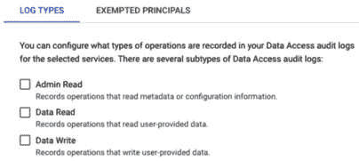
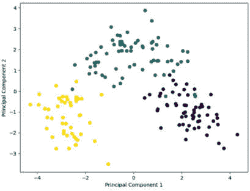
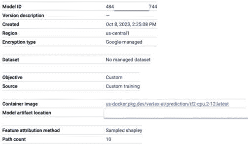
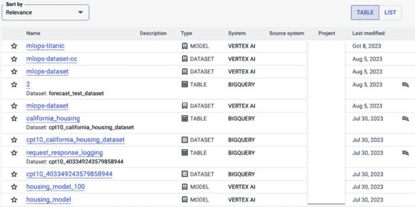
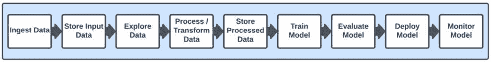

# 13

# 机器学习治理与谷歌云架构框架

作为技术人员，我们当然经常发现**机器学习**（**ML**）的技术方面是最有趣和最令人兴奋的部分，而法律和监管概念并不总是那么吸引我们。然而，这些概念对于在生产的规模上构建稳健的解决方案是必需的。它们帮助我们从业余爱好活动过渡到设计可靠系统，这对公司的成功至关重要，甚至可能影响数百万人的生活。

考虑到这一点，本章将涵盖以下主题：

+   机器学习治理

+   谷歌云架构框架概述

+   关于谷歌云架构框架中 AI/ML 工作负载的概念

让我们直接深入我们的第一个主题。

# 机器学习治理

机器学习治理指的是在组织内部管理机器学习模型所需的一切，贯穿整个模型开发生命周期。由于模型在关键决策过程中可以发挥重要作用，因此确保它们是透明的、可靠的、公平的和安全的至关重要，我们需要实施结构化的框架来实现这些目标。这些框架包括政策和最佳实践，确保数据和使用机器学习技术的负责任和道德使用。

在本章讨论机器学习治理时，我还会将数据治理纳入讨论范围，因为数据的使用在机器学习生命周期中是如此内在。让我们从这里开始。

## 数据治理

当涉及到管理机器学习生命周期中的数据时，我们需要考虑许多方面，例如数据质量、血缘、隐私、安全和保留。让我们更详细地看看这些方面。

### 数据安全、隐私和访问控制

在所有数据治理策略的方面中，数据安全可以说是最重要的。数据安全事件往往会成为头条新闻，而这些并不是你希望负责的新闻头条！

数据安全的基本概念是数据访问控制，正如其名称所暗示的，它关注的是谁可以访问数据以及他们如何访问数据。最坏的情况是，公司外部的人获得了敏感数据的访问权限，并将其公开泄露或用于勒索或破坏等恶意目的。

当谈到数据安全时，我最喜欢的术语是**深度防御**（**DiD**），它暗示了一个全面的数据安全策略包括使用许多不同的工具来保护数据和其它资源。在接下来的子章节中，我将概述我们可以采取的步骤来确保我们的数据安全。

#### 数据分类

在定义数据的安全策略之前，建立一个分类系统以了解哪些数据元素在保护方面需要更多关注是很重要的。例如，公开发布在你网站上的数据，如产品描述和价格，通常不被认为是绝密信息，而你的客户的信用卡详情则是高度敏感的。你可以根据以下层级对数据进行分类：

+   **零层**：高度敏感，例如客户密码和信用卡详情

+   **第一层**：敏感，例如客户购买或交易历史

+   **第二层**：有些敏感，例如客户地址和电话号码

+   **第三层**：非敏感，例如公开可查看的信息

这些只是示例；你需要与你的组织信息安全专家合作，以确定哪些类别对你的组织最有意义。

在对数据进行分类之后，让我们讨论如何保护它们。

#### 网络安全

我们可以将 DiD 方法看作是洋葱的层。在最外层，我们从网络安全开始。如果数据的不当用户没有访问数据的网络路径，那么这将是你的安全策略中的一个非常坚实的基础。网络安全实践包括设置诸如防火墙之类的设备来控制允许进入受保护网络的流量类型。Google Cloud 提供了这样的设备，以及其他网络安全结构，例如**虚拟专用云**（**VPC**），它允许你设置自己的私有网络并控制如何访问它们，以及**VPC 服务控制**（**VPC-SC**），它使你能够围绕你的资源创建安全边界以防止数据泄露。

#### 身份验证和授权

洋葱的下一层是身份验证和授权，以授予或拒绝访问资源的权限。即使有人获得了访问受保护网络的权限，下一步就是确定他们允许访问哪些资源以及他们可以在这些资源上执行哪些操作。你需要确保只有被授权的人员和系统才能访问数据，并且授权应基于业务关键性。换句话说，一个人或系统只有在他们需要这样的访问来执行所需的业务功能时才能访问某份数据。在任何时候，你都应能够轻松地确定谁（或什么）可以访问哪些数据，以及为什么。

Google Cloud **身份和访问管理**（**IAM**）可用于配置和强制执行此类权限，或者对于软件组件，还可以使用如**传输层安全性**（**TLS**）认证等额外机制。在本节稍后，我们还将介绍使用 Google Cloud Dataplex 进行数据编目。Dataplex 和 Google Cloud BigLake 可用于使公司更容易管理和强制执行对其数据资源的访问权限。Google Cloud BigQuery 提供额外的数据安全机制，如行级和列级访问控制，这意味着您不仅可以授予或限制对 BigQuery 中表的访问权限，还可以更细致地授予或限制对那些表中的特定行和/或列的访问权限。这为保护资源免受意外访问提供了额外的灵活性。例如，使用列级安全，您可以配置只有财务部门的人员可以查看包含客户信用卡详情的列，而其他员工和系统则不能。使用行级安全，您可以配置销售代表只能查看其区域客户的详细信息，而不能查看其他区域的客户。

#### 数据加密

在最内层是数据资源本身。最佳实践建议数据应加密作为进一步的安全措施。在这种情况下，即使恶意或非故意用户获得了对数据的访问权限，他们也需要解密密钥来解密数据。不言而喻，加密密钥应以高度安全的方式存储在独立的系统中，并实施所有安全层来保护它们。再次强调，Google Cloud 提供了实施所有这些安全机制的工具，包括使用 Google Cloud 密钥管理进行加密和密钥管理。

#### 记录和审计

除了所有这些机制之外，强大的数据安全策略应结合审计和日志实施来监控数据访问和修改，并支持审计和取证调查以检测或调查策略违规和数据泄露。Google Cloud 日志和审计日志可用于这些目的。*图 13.1*显示了 Google Cloud 审计日志可以跟踪哪些类型的日志：

图 13.1：Google Cloud 审计日志中的审计日志类型

如*图 13.1*所示，我们可以使用 Google Cloud 审计日志捕获三种类型的日志。

#### 数据隐私

虽然与数据安全内在相关，但数据隐私更具体地关注于**个人信息**（**PI**）的合法、道德和安全处理。这是数据安全最重要的方面之一，因为隐私侵犯可能会严重损害公司的声誉和客户信任。

不仅如此，他们还可能招致严重的法律后果。有许多国际标准和法规管理数据隐私和保护，例如欧盟的**通用数据保护条例**（**GDPR**），美国的**加州消费者隐私法案**（**CCPA**），以及全球许多其他法规。这些法规概述了数据处理规则，如收集、存储、处理和共享。遵守这些法规并确保系统处理数据的合规性可能相当具有挑战性。

跟踪散布在数据集各个部分中的敏感数据也可能是一项挑战。想象一家拥有来自许多不同来源的 PB 级数据的公司，例如商店中的信用卡读取器或面向客户的在线表单。很容易识别从信用卡机传输的数据需要受到保护，但对于其他数据接口来说，这可能并不那么明显。例如，也许客户不小心将信用卡详细信息输入到非此目的的在线表单字段中（例如，如果客户不小心将信用卡详细信息粘贴到未打算输入信用卡详细信息的字段中）。这些字段可能不被视为敏感，因此从安全角度没有得到任何特殊关注。现在集成了谷歌云**数据丢失预防**（**DLP**）工具的谷歌云**敏感数据保护**服务可以帮助识别和保护数据集中的敏感信息。如果发现敏感数据，可以使用敏感数据保护服务实施保护机制，如去标识化、掩码、令牌化和编辑。

在数据安全、隐私和访问控制方面，强调在谷歌云平台上的共同责任和共同命运的概念非常重要。为了避免在这里错误地表述法律术语，我建议阅读谷歌云关于此主题的官方政策，该政策可以在以下网址找到：

[`cloud.google.com/architecture/framework/security/shared-responsibility-shared-fate`](https://cloud.google.com/architecture/framework/security/shared-responsibility-shared-fate)

在我们继续讨论机器学习模型治理之前，我们将通过讨论数据质量、编目和血缘关系来结束本节。

### 数据质量、编目和血缘关系

考虑到数据对公司来说可能是一项宝贵的资源，因此建立确保数据准确性、一致性、可发现性以及（根据用例）及时性的实践至关重要。例如，考虑到数据通常用于做出重要的商业决策，不准确或过时的数据可能会对公司业务产生负面影响。这也适用于由机器学习模型自动化的商业决策。如果我们向机器学习模型输入不准确的数据，我们将得到不准确的预测。

一个有效的数据治理策略始于明确的数据政策、责任和标准，以确保数据质量。然后我们需要建立框架来衡量和监控数据质量因素。在此方面，最佳实践包括定期的数据清理过程，用于纠正数据错误、去重和填充缺失值，以及自动化机制，如定期的自动数据质量检查。

数据的可发现性也是一个重要因素。毕竟，即使你创建了精心策划的数据集，如果没有人知道它们的存在，它们也并不很有用。当公司建立了良好的数据管理实践时，数据生产者和消费者更容易确切地知道他们的数据在哪里以及数据的当前状态，在任何给定时间。在这样的公司中，一个强大的数据目录构成了公司数据基础设施的核心。多年来，我在各种咨询角色中与许多客户合作过，你会惊讶地发现有多少公司没有明确的数据管理策略。鉴于数据可能是组织的生命线，了解到许多公司并不完全清楚他们拥有哪些数据，这令人惊讶。公司内各种系统全天候都在产生和收集数据，但如果这些数据没有以某种方式编目，它们可能只是简单地坐在公司偏远、分散的部分的孤岛中，对大多数组织来说既不可用也不为人知。请记住，数据可以用于各种有趣的企业用例。如果你不知道你有什么数据可以访问，你可能会错失重大的商业机会。

实施数据血缘追踪同样重要，以便了解数据来源以及它在公司内部各种处理系统中如何被转换。如果我在我公司某个地方找到一些数据，我想知道它是如何到达那里的，以及它走过的每一步。它通过了哪些系统？这些系统对数据做了什么？在其他公司各个部分，那些其他系统是否创建了中间数据集？这不仅从业务运营的角度来看很重要，而且在合规性方面可能也是必需的。例如，如果您需要遵守数据主权法规，您最好始终知道您的数据在哪里。如果客户决定在受 GDPR 或其他相关法规约束的市场行使被遗忘的权利，如果您没有很好地掌握您的数据，您将很难遵守。同样，如果发生数据泄露，数据血缘可以帮助确定哪些数据被泄露，并了解潜在的 影响 和所需的恢复步骤。

幸运的是，Google Cloud 提供了众多工具来帮助完成上述各项活动，例如 Dataproc 和 Dataflow 用于数据清洗和处理，以及 Dataplex 用于目录管理、数据质量和数据血缘追踪。

接下来，我们将讨论机器学习模型治理。

## 机器学习模型治理

在本节中，我们讨论确保我们构建和部署的模型可靠、可扩展和安全的各个方面，以及它们持续满足这些要求的基础。为了实现这一目标，我们需要考虑许多因素，这些因素将在以下子节中进行讨论。

### 模型文档

从每个开发者最喜欢的主题：文档！虽然文档并不是开发者工作中最有乐趣的部分，但它对于构建和维护生产级系统至关重要。我曾与各种公司中的客户和团队合作，他们并不总是能很好地开发准确、高质量文档，而且你可以几乎肯定的是，缺乏这种文档将使你在需要随着时间的推移维护和改进系统时的工作变得更加困难。想象一下，你加入了一个新的团队，并被分配去提高一个特定应用程序的性能，该应用程序使用机器学习进行医学诊断，而你发现原始应用程序和底层模型是几年前由已经离开公司的人开发的，他们没有记录他们是如何实现该系统的。这并不是一个好的地方，而且你会惊讶地发现，这些类型的场景在行业中是多么普遍。也许在本章的背景下，最重要的是，模型文档对于合规性——有时甚至是法律要求——可能是至关重要的。

那么，高质量的模型文档是什么样的呢？通常，我们的文档应该详细记录模型设计、数据输入、转换、算法和超参数等因素。让我们更详细地看看这些内容。

#### 模型设计

关于模型设计的文档应明确定义模型的目的，例如模型打算实现的目标和模型需要运行的上下文。这包括潜在的使用案例和将与此模型交互的预期用户或系统。我们还需要提供模型架构的详细描述，例如其层、结构和模型不同组件之间的相互依赖关系。此外，我们还应包括有关模型设计理由的详细信息，例如选择这种特定的模型架构或设计的理由，包括与其他考虑的潜在设计进行比较，以及解释为什么它们没有被选择。

#### 数据输入

我们的模型文档应描述我们使用的数据收集过程，包括来源、收集方法以及数据收集的时间范围。我们应该列出模型使用的所有特征，包括它们的定义、类型（例如，分类和数值），对数据所做的任何假设，以及解释为什么每个特征与模型的预测相关。此外，我们还需要记录任何已知的数据质量问题，包括缺失值、异常值或不一致性，以及如何处理或缓解这些问题。

#### 转换

另一项最佳实践是详细说明用于清理和预处理数据的步骤，例如处理缺失数据、归一化、编码技术和特征工程，包括对任何用于特征选择或减少的方法的解释（例如，如图*图 13.2*所示的**主成分分析**（**PCA**）），以及使用这些方法的理由：

图 13.2：PCA

#### 算法

在我们的文档中，我们应该讨论为什么选择特定的机器学习算法，包括与其他考虑的算法的比较，以及解释该算法为何适合当前问题的理由，根据适当的相关文献或经验证据进行引用。同样重要的是详细说明算法的配置，包括针对项目的任何特定定制。

#### 超参数

我们应该包括模型使用的所有超参数的详细信息，为每个提供定义和范围，以及用于超参数调整的过程，例如网格搜索、随机搜索或贝叶斯优化。此外，我们还应包括每个超参数选择的最终值，并解释为什么选择这些特定的值，并支持调整过程的结果。

#### 额外因素

我们的文档还应解释如何评估模型的表现，包括使用的指标（**均方误差**（**MSE**），**ROC 曲线下面积**（**ROC-AUC**））以及这些评估的结果。我们应该记录模型已知的任何局限性，记录模型预测中的潜在偏差，并描述这些偏差如何影响不同的群体或个人。我们还需要详细说明与模型相关的任何监管标准或伦理指南，并讨论如何确保合规性。最后，我们需要概述在生产环境中持续监控模型表现和行为的计划，包括处理模型漂移、异常或性能下降的策略。

### 模型版本控制

就像在传统软件开发中的代码版本控制一样，在机器学习项目中进行模型版本控制对于确保团队能够追踪模型的演变过程、复制结果、在必要时回滚到先前版本，以及维护整个模型生命周期中所有变更的记录至关重要。这在大型或协作环境中尤为重要，因为在这样的环境中，随着时间的推移，可能由许多不同的人或团队开发出多个模型的多个迭代。对于调试、持续改进、审计和合规性目的来说，这也同样重要。*图 13.3*展示了 Vertex AI 模型注册表中模型版本元数据的一个示例：

图 13.3：Vertex AI 模型注册表中的模型版本元数据

当我提到模型版本控制时，我指的是不仅仅是模型工件，例如实际模型文件、权重和架构。我们应该为模型开发过程中使用的每个相关项目实施版本跟踪。这包括与模型相关的任何代码，无论是预处理、训练、评估还是部署，以及数据集，无论它们是原始数据、预处理数据还是特征工程数据。甚至超参数值和性能评估指标也应进行版本控制，这样我们就可以轻松理解哪些版本的这些元素与我们的模型版本相对应。

一个实施良好的模型版本控制工具，如 Vertex AI 模型注册表，也将使我们能够添加自定义元数据，以更全面地跟踪我们的各种模型版本。

### 模型监控

如我们在前几章所讨论的，在我们将模型部署到生产环境中之后，我们需要持续监控这些模型。目的是识别模型性能中的任何漂移、异常或退化，包括公平性和可解释性等重要指标。再次强调，这不仅对**业务连续性**（**BC**）至关重要，而且出于合规性的考虑。我们可能在部署前和部署期间已经证明我们的模型符合特定的法规，但如果不能定期持续监控，模型可能会偏离并失去合规性。如果我们已经设置了 MLOps 管道来自动化随时间持续改进模型的过程，那么这种监控应该扩展到我们管道的所有方面，例如确保我们在数据预处理步骤中进行数据质量监控，以及在新模型验证和其他过程中的其他重要步骤。

就像我们对于模型开发和管理的所有其他实施一样，我们希望我们的监控过程尽可能地自动化。我们应该设定阈值，超过这个阈值时，如果存在问题，则应自动启动某种纠正措施，或者通知值班支持工程师介入。例如，如果我们看到性能或公平性指标值的变化超过了指定的数量，那么就会启动纠正措施，这可能包括在更新后的数据上自动训练和评估新的模型版本，或者呼叫值班支持工程师进行干预。

正如我们在前几章所讨论的，Vertex AI 提供了内置工具，用于监控模型性能，无论是在部署后还是在模型开发过程中的每个相关步骤。

### 审计和合规

许多行业都有严格的法规（例如，GDPR、HIPAA 以及各种金融法规），这些法规要求对数据隐私、偏差、透明度等因素设定一定的标准。不遵守这些法规可能导致法律处罚和客户信任的丧失。如果我们有受监管标准约束的工作负载，那么我们需要建立审计流程，以确保我们的工作负载持续符合法规。

我们如何实施这些流程将主要取决于我们需要遵守的法规类型。这些流程可能包括常规的人工审查流程，或者，正如我们一直所做的那样，尽可能自动化审计流程，只有在出现似乎无法自动解决的问题时才通知人类。在人工审查流程的情况下，这是文档固有的重要性的地方，因为高质量的文档可以极大地简化审查过程，并在发现问题时更容易确定纠正措施。理想情况下，我们希望在模型性能、安全性或可靠性问题升级为更大问题之前就识别出潜在风险，并建立定期的审查流程可以帮助确保这一点发生。

对于某些类型的法规，可以使用建立良好的审计清单和**标准操作程序**（SOPs），这使得审计任务变得稍微容易一些。然而，请记住，机器学习的法规环境仍在不断发展，组织必须跟上变化以保持合规。

在上一章中，我们讨论了可解释性的概念。在合规监管的背景下，可解释性尤为重要。如果你不能轻松或充分地解释一个特定的模型或系统是如何工作的，那么你将很难确保合规性。

现在我们已经相当详细地覆盖了许多机器学习治理的重要因素，让我们再次放大视角，关注更大的图景。在接下来的章节中，我们将讨论如何实施机器学习治理，不同行业中机器学习治理的样子，以及如何跟上不断发展的机器学习治理格局。

## 机器学习治理的 operationalization

正如我在前几节中暗示的那样，我们通常希望尽可能自动化我们的机器学习治理实践和流程，并且有一些工具和平台可以帮助实现这一目标，例如数据目录、模型管理工具和审计工具，我将在以下子节中描述。

### 数据目录

我们在本章前面简要地讨论了数据编目。数据目录是一种元数据管理工具，帮助公司找到和管理其组织内部大量分布的数据，无论是在本地还是在云端。你可以将数据目录视为公司数据资产的庞大库存，旨在让用户发现、组织和理解他们的数据源。我们已经介绍了 Google Cloud Dataplex，谷歌将其描述为“*一种智能数据布料，使组织能够集中发现、管理、监控和治理其数据湖、数据仓库和数据集市，具有一致的控制*。”*图 13.4*展示了由 Google Cloud Dataplex 创建的目录示例：

图 13.4：Dataplex 目录

这种一致控制的观念在治理的背景下尤其相关。使用 Dataplex，你可以使用元数据来描述你公司所有的数据资产，并且你可以以统一的方式管理不同 Google Cloud 数据存储和处理工具的权限。这当然从治理的角度来看非常重要，而且 Dataplex 还提供了数据质量和数据血缘功能，这些在治理的背景下也同样重要。

### 模型管理平台

这些平台协助模型整个生命周期的各个方面，包括开发、部署、监控和维护。它们对于模型版本控制、实验跟踪和模型性能监控等活动至关重要。通过为管理机器学习模型提供一个结构化环境，这些平台有助于确保模型是可靠和可重复的，并且满足性能预期。它们还通过提供详细的模型开发和部署过程记录来促进合规性。当然，Vertex AI 是 Google Cloud 的原生模型管理生态系统，提供了上述所有功能。

到目前为止，我们一直关注的是许多行业共有的机器学习治理方面。在下一节中，让我们来看看机器学习治理是如何应用于特定行业的。

## 不同行业和地区的机器学习治理

什么可以使合规性监管变得更加复杂的是，不同的国家、州和行业都可以有不同的法规。因此，机器学习治理在不同行业和地理区域之间差异很大。在本节中，我们将讨论特定地区和部门（如医疗保健和金融）的治理因素，以及区域考虑因素。

### 医疗保健

我目前居住在美国，当我听到“合规性监管”和“医疗保健”这两个词在同一句话中时，我脑海中首先想到的是**健康保险可携带性和问责法案**（**HIPAA**），该法案赋予患者对其健康信息的某些权利，包括安全处理和保密性，并规定了违规和不合规的重大处罚。如果你在美国从事医疗保健工作，你几乎肯定需要了解并遵守 HIPAA 的要求。在设计实施该行业的机器学习系统时，你必须确保整个模型开发生命周期中的数据处理实践符合这些要求。其他国家和地区也有自己的监管要求，如果你在这些地区运营，你必须学习和理解这些要求。

### 金融

在金融行业，欺诈可能是最大的担忧或威胁之一，金融行业受到严格的监管以避免欺诈发生的可能性。例如，如果你的公司在美运营，那么你的公司的财务操作将需要遵守诸如**萨班斯-奥克斯利法案**（**SOX**）等法规，该法案主要旨在防止企业欺诈并提高企业披露的可靠性和准确性，以保护投资者。如果你的系统以任何方式处理信用卡数据，那么你很可能需要遵守**支付卡行业数据安全标准**（**PCI DSS**）的法规，这是一套与安全处理信用卡信息相关的安全标准。

### 地区特定的治理考虑因素

不同地区有不同的监管要求。例如，如果你在欧盟和**欧洲经济区**（**EEA**）运营，那么你将受到 GDPR 要求的影响，该要求保护这些地区个人的个人信息。

加利福尼亚州有 CCPA，该法案规定了全球企业如何处理加州居民的个人信息。

还有规定如何处理与儿童相关的数据，例如**儿童在线隐私保护法案**（**COPPA**），该法案旨在保护 13 岁以下儿童的隐私。

除了地区和行业特定的法规外，我们还必须确保我们遵守关于公平、透明度、可解释性、责任和伦理的义务。而且，我们不仅需要管理不同地区和行业的法规复杂性，而且这种复杂性还因法规可能随时间变化而进一步扩展。让我们在下一节中更详细地讨论这个话题。

## 跟进机器学习治理的演变趋势

我可以自信地说，机器学习行业是目前发展最快的行业之一。全球的公司、政府和研究机构都在这个行业中大量投资。因此，与这个行业相关的合规法规也在迅速演变。为了持续成功，坦白说，确保你不陷入麻烦，你的公司需要在这个不断变化的环境中保持最新。在本节中，我概述了该领域的重要概念和最佳实践。

### 持续教育和培训

您公司的员工需要持续教育，以跟上监管要求的进步。除了技术能力外，您的员工还必须了解与机器学习部署相关的伦理考虑和风险管理策略。信息充分且受过良好训练的个人不太可能犯下诸如违反数据隐私标准等代价高昂的错误。此外，由于这是一个不断发展的领域，新的类型偏见和伦理困境几乎每天都在出现。我强烈建议实施定期的培训课程、研讨会和教育资源，让员工了解最新的趋势、工具、伦理考虑和关于机器学习治理的最佳实践。

### 定期更新治理政策和实践

除了技术和伦理考虑之外，数据保护和隐私的法律环境也在不断演变。组织必须定期更新其治理政策，以符合新的和不断变化的法律和标准（GDPR、CCPA 或行业特定法规），并且随着新技术和方法的发展，治理政策必须适应以适当容纳和管理它们。对于简单的线性回归模型有效的方法可能不足以应对复杂的**深度学习**（**DL**）系统。不幸的是，随着新技术的出现，威胁环境也在不断发展，昨天还安全的事物明天可能就不再那么安全了。因此，我们需要定期审查和更新安全政策和实践，以保护敏感数据和机器学习系统免受新的漏洞和攻击策略的侵害。

此外，考虑到谷歌的**站点可靠性工程**（**SRE**）实践，尽管我们应该尽一切努力避免负面事件的发生，但如果此类事件确实发生，我们需要从该场景中学习。因此，我们应该对任何问题进行彻底的复盘，并利用这些见解来改进政策并防止未来发生。

另一套与 SRE 紧密相关的概念包含在谷歌云架构框架中，我将在下一节中讨论。

# 谷歌云架构框架概述

用谷歌自己的话说，“*谷歌云架构框架提供了建议并描述了最佳实践，以帮助架构师、开发人员、管理员和其他云实践者设计和运营一个安全、高效、弹性、高性能且成本效益的云拓扑结构*。”在本节中，我们将讨论框架的一些关键概念以及它们如何应用于谷歌云上的 AI/ML 工作负载，特别是在机器学习治理的背景下。

以下 URL 可以找到框架文档：

[`cloud.google.com/architecture/framework`](https://cloud.google.com/architecture/framework)

让我们从框架的基本概念概述开始，这些概念被称为 **基柱**。一种思考方式是，通过确保所有这些基柱都得到实施，我们可以构建一个坚固且持久的结构（系统）。

框架的分类如下：

+   系统设计

+   运营卓越

+   安全性、隐私和合规性

+   可靠性

+   成本优化

+   性能优化

在接下来的子章节中，我将描述每个类别代表的内容，从系统设计开始。

## 基柱 1 – 系统设计

有趣的是，Google Cloud 架构框架中的 *系统设计* 类别更类似于整体框架的基础，而不是一个基柱，因为一个设计良好的系统适当地融合了所有的基柱。*系统设计* 类别封装了四个核心原则：

+   记录一切

+   简化你的设计并使用完全托管的服务

+   解耦你的架构

+   使用无状态架构

让我们更详细地看看这些内容。

### 原则 1 – 记录一切

我们在本章的 *ML 模型治理* 部分对此原则进行了相当多的讨论。在更广泛的系统设计背景下，我们不仅指的是与我们的模型相关的文档，而是与我们的系统实施的各个方面相关的文档，包括架构图和维护手册等方面。在这种情况下，我总是问这样一个问题：如果一位新成员加入我们的团队，并且需要快速学习他们需要了解的所有内容以改进和维护我们构建的系统，他们需要审查的所有细节是什么？如果其中任何细节没有得到充分的记录，那么这就是我们需要通过开发必要的文档来解决的问题。这也帮助了我们需要与之协作的其他团队，或者需要以某种方式与我们的系统交互的团队，如果监管合规官员需要审计我们的系统，这也会使每个人的工作变得更简单。

### 原则 2 – 简化你的设计并使用完全托管的服务

自从我听说奥卡姆剃刀的概念以来，我就成了它的忠实粉丝。它有几种不同的总结方式，但其中一种相当常见的是：“如果对某个现象有两种可能的解释，使用更简单的那一个。”这可以进一步扩展为：不要使事情比必要的更复杂。与此相反的是鲁布·戈尔伯格机器的概念，它通过极其复杂的机制来实现一个简单的目标。虽然鲁布·戈尔伯格机器观看起来很有趣，但它们通常非常不实用，而且它们不是你希望在大型、低延迟、高度敏感的生产系统设计中实现的东西。

尽可能简化你的系统设计有许多好处，例如，使故障排除、维护和保障系统变得更加容易。当出现问题时，具有许多不同组件的高度复杂系统很难进行故障排除。同样，在安全方面，高度复杂的系统通常具有更大的 **攻击面**。我们将在本章后面更详细地介绍这个概念。

我们可以通过将责任外包给 **云服务提供商** (**CSP**) 来使我们的工作变得更简单。云计算的主要好处之一是 CSP 提供了旨在解决行业常见需求的平台和系统。当一家公司在自己的数据中心运行所有工作负载时，它要么需要完全自行构建解决方案和平台，要么安装和管理其他公司创建的软件。这两种选择都会产生大量的员工开销，并需要特定的培训来管理。

让我们以构建和维护一个平台为例，这个平台能够使数据科学家开发和部署机器学习模型。在前几章中，我们概述了模型开发生命周期中所需的各个步骤。如果我们所有的“本地”工作负载（即不在云中）运行，那么我们需要设计、构建和维护一个支持所有这些步骤的平台，或者像许多公司所做的那样，我们可以尝试拼凑一些东西，使用各种随机的第三方软件解决方案，这些解决方案都需要特定的培训，并且不一定能很好地协同工作。然而，在云中，我们只需使用云提供商提供的平台，让他们为我们做所有艰苦的工作，这样我们的团队能够专注于他们的核心能力和主要目标，而不是构建和维护基础设施。

类似的概念存在于其他类型的工作负载中。例如，在本地，我们可能为公司容器化工作负载构建和维护自己的 Kubernetes 环境。我们可能会花费大量时间维护这些系统，但在云中，我们可以使用如 **Google Kubernetes Engine** (**GKE**) 或 Cloud Run 这样的托管服务。在这种情况下，我们所说的将更多基础设施管理任务外包给云提供商的服务称为“向更高层栈发展”。在 GKE 和 Cloud Run 的情况下，Cloud Run 可以被视为“向更高层栈发展”，因为它比 GKE 的基本形式提供了更多的完全托管体验，尽管 GKE Autopilot 的最新推出也提供了一种非常少干预的方法，在这种方法中，更多的平台管理任务由 Google Cloud 实现。

### 原则 3 – 解耦你的架构

这在一定程度上与*原则 2*相关。它指的是将你的整体系统设计分解成更小的组件。一个典型的例子是将单体应用分解成微服务。原因是每个微服务比一个非常庞大且复杂的单体系统架构更容易管理。较小的组件可以独立开发和扩展，这可以提高你系统中新功能开发的速度。

### 原则 4 – 使用无状态架构

在无状态架构中，每个事务都是独立的。在处理请求时，服务器不会记住任何先前的请求或事务，客户端必须在每个请求中发送任何必要的数据以进行事务。相反，在有状态架构中，服务器维护客户端会话的状态。先前事务的上下文会被记住，未来的事务可能会受到过去发生的事情的影响。

我会在这个原则的标题中添加“尽可能”这个词，因为有时你的系统将需要维护状态，但尽可能，你想要做的是最小化需要维护的状态量，并将状态管理从你的应用程序卸载到单独的机制，如缓存层。

无状态架构通常更容易扩展，因为它们不需要维护客户端状态，允许请求由任何可用的服务器处理。有状态架构需要更复杂的基础设施来确保客户端与同一服务器交互或状态共享，这在大型环境中可能具有挑战性。有状态系统还使用更多资源来管理和存储会话数据，这可能会进一步影响可扩展性和系统复杂性。

## 柱石 2 – 运营卓越

*运营卓越*支柱关注于在 Google Cloud 上高效地运行、管理和监控系统。它包括自动化、可观测性和可扩展性等概念。

这个支柱讨论了使用**持续集成和持续部署**（**CI/CD**）来自动化系统部署，以及使用**基础设施即代码**（**IaC**）来管理你的基础设施。这是一个非常重要的概念，因为它提供了传统软件开发的所有好处，例如版本跟踪和增量更新。如果你使用版本跟踪机制来管理基础设施更新，那么你可以为审计目的保持强大的记录，并且如果任何更新引入了问题，那么你可以更容易地回滚到已知工作良好的先前版本。这通常被称为**GitOps**，而与之相反的是**ClickOps**。在 ClickOps 的情况下，基础设施更新是通过人们在用户界面中点击来完成的。如果你在你的技术组织中有一百多人，并且他们每天都在通过在用户界面中点击来更新你的基础设施，那么随着时间的推移，协调和跟踪这些更新可能会变得困难。Terraform 是实现在 Google Cloud 上实施 IaC 的流行工具。

**运营卓越**支柱还概述了在整个软件交付生命周期中融入测试的最佳实践。这包括单元测试、集成测试、系统测试以及其他类型的测试，如性能和安全测试。我们不应该在最后测试一切，而应该旨在在每个开发生命周期的每个步骤中都包含每种类型的测试。例如，单元测试可以作为我们的构建过程的一部分自动化。

在部署软件时，**运营卓越**支柱建议使用诸如通过蓝/绿部署和 A/B 或金丝雀测试进行不可变基础设施更新等方法。Google Cloud 提供了可用于实施这些策略的 CI/CD 工具。建议使用小而频繁的系统更新，这些更新比大而罕见的更改更容易管理和回滚。

在可观察性方面，这个支柱提供了关于有效地设置监控、警报和日志的建议，包括需要关注的常见指标，以及定义阈值，超过这些阈值应触发某种警报或纠正措施。它还讨论了设置审计跟踪以跟踪系统更改的重要性。对于出现问题的案例，它提供了建立支持和升级程序以及审查过程（如事后评估）的指南，以从任何失败中学习。

当然，确保你的基础设施能够适当地扩展以处理预期的流量量，并且实施计划以主动应对已知的峰值事件，这也是非常重要的。

最后，这一支柱涵盖了尽可能自动化您的大部分系统管理任务的重要性，以最大限度地减少您需要依赖可能存在错误的手动过程来有效运行系统。

## 第三支柱 – 安全、隐私和合规性

在 ML 治理的背景下，这可能是最相关的支柱之一，我们已经在本章前面讨论了这些主题，但在这里，我们将探讨这些概念如何在谷歌云架构框架中得到更正式的结构化。

除了我们之前讨论的 DiD 概念之外，谷歌推荐了实施**默认安全**的策略。这包括确保安全作为默认配置嵌入到您的系统架构中的最佳实践，包括诸如**最小权限原则**（**PoLP**）等概念，其中用户仅被授予执行其工作职能所需的最小权限，不再更多。这还涉及到在网络级别锁定访问。例如，如果您知道在正常操作情况下，您的系统应该只从一到两个其他系统访问，那么您可以设置网络规则，阻止来自除这些特定系统之外的任何来源的访问。谷歌云还提供了一种名为**保密计算**的服务，用于处理敏感数据。

我想借此机会强调，谷歌云架构框架的支柱通常是相互关联的。例如，我们在**运营卓越**支柱的背景下讨论了 GitOps 的概念。这种使用 IaC 来管理您如何部署到系统的概念是建立默认安全实践的高度推荐方式。例如，您可以创建经过严格安全评估流程的 Terraform 模块，以符合您的企业安全政策和行业最佳实践来设置基础设施。一旦这些“默认安全”模块获得批准，公司中的任何人都可以安全地使用它们来设置所需的基础设施。这使得您的员工在提供基础设施方面遵守安全政策变得更加容易。为了使您能够轻松提供符合安全最佳实践的基础设施资源，谷歌云提供了**安全基础蓝图**，您可以在以下 URL 中参考：

[`cloud.google.com/architecture/security-foundations`](https://cloud.google.com/architecture/security-foundations)

作为与*运营卓越*支柱之间的关联，用于部署资源的 CI/CD 管道应内置安全机制。例如，您可以使用自动化在创建工件时检查安全漏洞。谷歌云还提供了一种称为二进制授权的机制，以验证由 CI/CD 管道构建和部署的 Docker 容器的内容，以确保这些镜像正好包含您期望的内容，没有更多。它还可以验证特定的构建系统或管道创建了一个特定的容器镜像。如果在 CI/CD 管道的任何点上安全检查突出了任何潜在问题，则管道可以自动停止，以确保不会将潜在的安全威胁引入到您的部署中。同样，您可以使用谷歌云的工件分析功能自动扫描存储在工件注册表和容器注册表中的容器中的潜在漏洞。即使在部署之后，您也可以通过使用谷歌云的 Web 安全扫描器来持续扫描您的 Web 应用程序，以识别部署到计算引擎、App Engine 和 GKE 的应用程序中的漏洞。

此支柱还提供了主动识别和编制公司风险以及减轻常见风险的建议。谷歌云最近还推出了风险保护计划，其中包括风险管理器等工具，以帮助您管理风险。

当然，**IAM**是这个支柱的一个重要组成部分。谷歌云提供了许多帮助管理这一方面的工具，例如 IAM 和云审计日志，我们讨论过这些对于访问管理和审计是必不可少的。

这个支柱还强调了使用云资产管理工具，如云资产清单，来跟踪贵公司所有技术资产并监控是否符合合规政策的重要性。

除了本节中我们讨论的所有主题外，安全支柱还涵盖了网络安全、数据安全、隐私和法规遵从性等主题，这些内容我们在本章前面已经讨论过。它还提供了如何使用谷歌云保证工作负载来帮助您满足合规义务、如何监控合规性以及如何处理数据主权、数据驻留、软件主权和运营主权等细节。

## 第四支柱 – 可靠性

**可靠性**支柱关注诸如**高可用性**（**HA**）、可伸缩性、自动化变更管理和**灾难恢复**（**DR**）等概念。它涵盖了你们中的一些人可能从谷歌的 SRE 实践中了解到的主题，例如定义**服务级别指标**（**SLIs**）、**服务级别目标**（**SLOs**）、**服务级别协议**（**SLAs**）和错误预算。与**运营卓越**支柱的情况一样，**可靠性**支柱将可观察性作为一个主要组成部分。它还重申了**运营卓越**支柱中的一些其他概念，例如使用 CI/CD 管道自动化部署和增量更新，以及设置适当的可观察性和警报机制、**事件管理**（**IM**）和事后分析实践。

这个支柱讨论了在系统架构中创建冗余以提高可用性的方法，包括使用多个谷歌云区域和地区来减轻特定地点可能发生的任何潜在问题。除了这些类型的主动缓解技术之外，它还概述了建立 DR 策略的实践，例如将数据同步到其他地区，并在需要时建立故障转移至这些地区的操作手册。

最后，它详细介绍了特定谷歌云产品的最佳实践。这个支柱包含了大量的知识，并且比这里适当包含的更多关于许多特定谷歌云产品的详细信息。

## 第五支柱 – 成本优化

你们可以保证这对几乎每一位客户都非常重要。事实上，成本优化通常是吸引公司首先迁移到云的主要因素之一。当公司在自己的数据中心运行工作负载时，他们通常需要购买和安装足够的（甚至更多）基础设施来满足他们可能一年或两年才发生一次的最高峰值事件。而在一年中的其余时间，这些基础设施高度未被充分利用，这导致了大量的浪费。然而，在云中，公司可以根据他们的实际需求调整其基础设施的规模，因此不需要在过度配置的基础设施上浪费金钱。此外，正如本章前面讨论的那样，将基础设施管理外包给云服务提供商使公司能够将时间投资于创新和开发支持其核心业务的功能。

该支柱的第一个主要重点是财务操作或**FinOps**的概念，这是一个文化范式，包括一系列技术流程和业务最佳实践，以帮助组织更有效地优化和管理他们的云投资。在这种情况下，向组织中的每个技术团队提供对他们的云支出的可见性，并要求每个团队对其支出负责，这是非常重要的。要了解更多关于 FinOps 的信息，我建议阅读 Google Cloud FinOps 白皮书，该白皮书可以在以下 URL 找到：

[`cloud.google.com/resources/cloud-finops-whitepaper`](https://cloud.google.com/resources/cloud-finops-whitepaper)

记住，我们通常无法在没有监控的情况下优化或改进某事物。因此，“成本优化”支柱提供了关于监控成本、分析趋势和预测未来成本的推荐。如果你预测你将在下一年或未来三年内花费一定金额，你可以购买**承诺使用折扣**（**CUDs**）来节省那些工作负载的费用。你还可以使用标签对账单报告中的费用进行分类，例如将资源费用分配给特定的作业和环境。

“成本优化”支柱还提供了关于**优化**资源使用以降低成本的最佳实践，例如确保你根据当前和预期的需求（包括适当的情况下的一些缓冲）来配置你的基础设施，并且不要过度配置。这被称为**正确规模**，Google Cloud 甚至提供了一个正确规模推荐器，可以突出显示通过识别看似未充分利用（因此过度配置）的资源来改进规模的机会。你还应该使用自动扩展，这不仅确保你有足够的资源来服务所需的流量量，而且在不需要时可以缩减资源，从而节省资金。

在实施成本优化机制时，设置预算、警报和配额以控制支出是很重要的。例如，你可以指定一个特定的支出预算，并在接近达到该预算时收到警报。你还可以使用配额来设置资源使用的硬性限制，并可以设置 API 上限，以在达到一定阈值后限制 API 的使用。

与**可靠性**支柱一样，“成本优化”支柱为许多具体的 Google Cloud 产品提供了详细的最佳实践，例如优化**Google Cloud Storage**（**GCS**）中的存储层或优化 BigQuery 中的分区。

## 第六支柱 – 性能优化

性能优化可以与成本优化相关联，因此在这些概念方面存在一些重叠。例如，如果你的系统运行得最优，那么它们可能运行成本更低。实施良好的自动扩展策略是这一点的典型例子。**性能优化**支柱提供了如何定义性能要求、如何监控和分析性能以及当然如何优化性能的建议。

在监控和分析性能方面，这指的是可观察性的概念，我们需要实施和监控性能指标，如延迟和资源利用率。

就像**可靠性**和**成本优化**支柱一样，**性能优化**支柱也为特定的 Google Cloud 产品提供了许多深入的建议，这是超出这里适当包含的详细程度。

既然你已经了解了 Google Cloud 架构框架是什么以及它由什么组成，让我们看看我们如何在 Google Cloud 的 AI/ML 环境中应用其概念。

注意

在 Google Cloud 架构框架的所有类别中，最经常重复的主题是自动化。想法是尽可能自动化一切。经过验证、可重复且可自动运行的过程往往会使我们在所有支柱上的工作变得更简单。

# 关于 Google Cloud 上 AI/ML 工作负载的架构框架概念

在本节中，我们将评估如何使用 Google Cloud 架构框架来处理 Google Cloud 上的 AI/ML 工作负载。我们将使用模型开发生命周期中的步骤来构建我们的讨论框架。作为提醒，模型开发生命周期的步骤在*图 13.5*中进行了高层次的总结：

图 13.5：ML 模型开发生命周期

让我们从模型开发生命周期中的数据收集和准备活动开始，这些活动包括收集、摄取、存储和处理数据。

揭秘！

你会注意到，我们已经在整本书中使用了许多这些实践。在这里，我们明确指出这些实践，以便你了解它们如何应用于一般的工作负载。

## 数据收集和准备

数据管理可能是与 ML 治理相关的所有主题中最重要的。正如我们所知，你的数据质量直接影响你模型的质量。此外，从安全的角度来看，当恶意行为者试图访问你的系统时，他们通常是为了你的数据，因为数据是一种如此有价值的资源，数据泄露可能对你的公司产生灾难性的影响。让我们看看我们如何应用 Google Cloud 架构框架中关于数据处理的建议。在这种情况下，我们不会将系统设计作为一个单独的支柱来讨论，因为有效的系统设计封装了所有其他支柱。

### 数据收集和准备中的运营卓越

记住，运营卓越关注自动化、可观察性和可用性等概念。以下子章节将探讨这些概念在数据收集和准备中的具体应用。

#### 流程自动化和集成

在本书的前几章中，我谈到了构建数据管道以自动化我们的数据处理步骤的重要性。本质上，我们希望建立可重复的过程，然后实施机制来自动运行这些过程，无论是基于时间表（如每日、每周或每月）还是对某些事件（如新数据的可用性）的反应。因此，实施数据处理管道的概念是谷歌云架构框架中“运营卓越”支柱中概述的自动化建议的应用。谷歌云提供了许多我们可以集成在一起以设置数据处理管道的服务，例如 Dataproc、Dataflow、GCS、Pub/Sub 和 BigQuery。

#### 一致性和标准化

在 MLOps 章节中，我分享了与不同成熟度级别的各种组织合作的经验，这些组织在实施他们的机器学习工作负载操作方面有所不同。当公司没有建立良好的流程时，他们的团队往往会使用大量随机不同的工具，每个工具都有自己的学习曲线，并且他们在孤岛中维护他们的工件。这些做法不利于公司范围内的协作，并阻碍了公司机器学习操作的扩展性和效率。然后我谈到了在整个公司标准化工具和流程的重要性，以克服这些限制。这一切都与谷歌云架构框架的运营卓越支柱有关。在团队和项目之间保持工具、库和流程的一致性，可以减少复杂性和学习曲线，使管理和扩展操作变得更加容易。也许与机器学习操作最相关的例子是，为了满足我们所有模型开发和部署需求，使用 Vertex AI，因为它为模型开发和管理的生命周期中的每个步骤提供了一套标准工具。

#### 可观察性

所有常规的系统监控和日志记录要求也适用于 AI/ML 工作负载，并且 AI/ML 工作负载还有关于持续监控模型预测输出质量方面的额外要求，以确保它们不会随时间漂移。在早期章节中，我们讨论了用于监控的特定于 ML 的指标，例如线性回归用例的 MSE 或分类用例的 AUC-ROC 分数，以及公平性指标。谷歌云日志和谷歌云监控可用于在谷歌云上 ML 模型开发生命周期的所有点上实现可观察性，从评估训练验证指标到跟踪在 Vertex AI 预测端点部署的模型响应的延迟，以及 Vertex AI 模型监控可用于监视漂移。

### 数据收集和准备中的安全、隐私和合规性

到现在为止，我们应该已经充分理解，在几乎每家公司中，数据安全和隐私都是至关重要的。一种快速失去客户并损害公司声誉的方式就是成为数据泄露的受害者。我的观点是，安全地管理敏感数据是你可能能做的事情中最重要的；它比本章、这本书以及你公司的业务中的所有其他考虑都更重要。

在本章前面关于这一支柱的概述中，我们讨论了如何通过多层防御（DiD）来保护数据和系统，包括访问管理、加密和网络安全等因素。以下小节将探讨这些概念在数据收集和准备背景下的应用。

#### 数据访问控制

在谷歌云中收集和准备数据时，我们可以使用 IAM 来确保只有授权的个人和服务可以访问数据，并且我们可以根据角色和职责控制谁可以查看、修改或与数据交互。例如，数据科学家可能只有读取和分析数据的权限，但没有删除数据的权限，或者财务数据可能仅供财务部门访问。如果我们使用谷歌云 Dataplex 来构建数据目录，这会变得更加容易，因为 Dataplex 允许我们集中管理跨多个不同的 GCS 和处理服务的我们的数据资产权限。

#### 数据保护和加密

敏感数据应始终加密，无论是在存储（静止状态）时还是在服务或位置之间传输时（传输中）。谷歌云为其服务中存储的数据提供自动加密，我们可以使用 TLS 来保护传输中的数据。对于高度敏感的数据，我们甚至可以使用谷歌云 Confidential Computing 在处理过程中对其进行加密。此外，在数据准备阶段，敏感数据元素可以被屏蔽或标记化，以隐藏其实际值，从而在增强隐私的同时，仍然允许数据用于分析。

#### 数据分类和发现

我们可以使用 Google Cloud 敏感数据保护服务来发现、分类和屏蔽数据集中的敏感元素。在收集数据时，此服务可以帮助自动识别诸如**个人身份信息**（**PII**）或财务数据等信息，以便我们能够对其进行更高水平的保护。这是 Google Cloud Dataplex 可以提供帮助的另一个领域，因为在一个数据目录中跟踪所有我们的数据资产使得分类和发现变得容易。

#### 审计和监控

我们之前介绍了云审计日志。我们可以使用云审计日志来详细记录谁访问了数据以及他们执行了哪些操作，这对于问责和可追溯性非常重要。这在机器学习工作负载中尤其相关，因为了解谁引入了什么数据以及何时引入可能对于可解释性和故障排除是必需的。而且，你知道吗？！Google Cloud Dataplex 与云审计日志集成，以生成数据目录中执行的操作的审计日志。

#### 数据保留和删除

当使用 Google Cloud 时，我们可以根据数据性质和相关性建立数据保留政策。例如，在使用 GCS 时，可以指定保留策略以防止对象在保留策略指定的时间框架内被删除。这对于符合监管目的或遵守法律保留可能很重要。相反，可以使用对象生命周期管理在一段时间后自动删除数据（只要它不与数据保留策略冲突）。对于您希望永久删除的敏感数据，Google Cloud 提供机制以确保删除操作安全且不可恢复。

#### 合规框架和认证

Google Cloud 提供工具和文档，帮助业务符合 GDPR 和 HIPAA 等标准（以及许多其他标准），并且它接受独立第三方审计，以确保其服务符合常见的监管标准。

#### 防御威胁

云安全命令中心和事件威胁检测等服务允许对潜在威胁进行持续的数据和环境监控，提供洞察和可操作的推荐。定期扫描和评估数据收集和准备过程中涉及的系统，可以帮助确保数据不会暴露于潜在的违规风险。您还可以使用 VPC 网络安全和 VPC-SC 来控制对您的数据存储和处理系统的访问，以防止数据泄露。

我们在本节中讨论的所有项目对于确保数据安全处理和保护用户隐私都至关重要。道德考量也至关重要，以确保数据以公平、透明的方式收集和使用，不会传播偏见，尤其是在它将被用于训练可能影响个人生活的机器学习模型时。

### 数据收集和准备中的可靠性

记住，谷歌云架构框架中的**可靠性**支柱侧重于确保服务和应用程序在意外干扰或需求增加的情况下也能持续一致地运行，并满足预期的 SLOs。以下子部分讨论了如何在机器学习模型开发生命周期的数据收集和准备阶段应用**可靠性**支柱的概念。

#### 自动化数据摄取和处理

依赖于手动过程进行数据收集可能会出错，而自动数据摄取有助于确保数据可以一致地收集。我们还可以自动化数据验证步骤，以确保传入的数据符合预期的格式和值范围，这可以防止损坏或格式不正确的数据在我们的数据处理和机器学习管道中传播。对于数据转换脚本和配置，我们应该使用版本控制来确保如果更改引入了错误，我们可以轻松地回滚到先前的稳定版本。

#### 基础设施弹性

谷歌云的大多数数据存储和处理服务要么默认设计为高可用性，要么提供机制来帮助您将弹性构建到架构中，例如通过在多个区域和地区使用多台机器。

如果我们自行设计系统，我们应该确保数据存储和处理基础设施具有冗余组件。在发生故障的情况下，备份系统可以接管，确保数据收集和准备不间断。我们还应该实施备份和恢复机制，定期备份原始和经过处理的数据。我们可以将数据存储在多个区域或地区，以防止任何特定位置的潜在问题。这不仅保护了数据丢失，还允许在数据损坏或需要回顾早期数据版本时恢复到之前的状态。我们还可以为高速数据流的数据摄取服务实施负载均衡，以确保数据负载的均匀分布并防止系统过载。我们还应该设计我们的基础设施根据需求进行扩展（向上或向外），以确保在变化负载下的可靠性能，并可以实施排队机制来管理数据峰值。

#### 持续监控和警报

与**运营卓越**支柱一样，可观察性是这个支柱的关键组成部分。我们应该定期检查参与数据收集和准备的系统健康状况，并实施当检测到异常或故障时通知相关团队的警报机制。

### 数据收集和准备中的成本优化

在数据收集和准备阶段，由于可能涉及大量数据、复杂的预处理任务以及不断变化的基础设施需求，管理成本至关重要。以下子节将讨论我们如何在机器学习模型开发生命周期的数据收集和准备阶段应用来自*成本优化*支柱的概念。

#### 高效的数据存储

如 GCS 和 BigQuery 之类的存储系统提供了不同类别的存储，价格各不相同。从成本优化的角度来看，使用适合我们数据的适当存储类别非常重要。例如，频繁访问的数据可以存储在标准存储中，而很少访问的数据可以转移到近线或冷线存储。为了使我们更容易管理，我们可以实施策略以自动将数据过渡到更便宜的存储类别或在其不再需要时删除它。我们还可以通过删除重复数据并压缩数据来减少存储的数据量（因此减少我们的成本）。在特征存储方面，我们应该在数据准备阶段评估每个特征的需求。删除冗余或低重要性的特征可以显著降低存储和计算成本。

#### 优化的数据处理

我非常推崇尽可能使用无服务器解决方案。这不仅将管理基础设施的烦恼转移给了云服务提供商，而且使用 BigQuery 和 Dataflow 等无服务器解决方案，我们通常只需为使用的部分付费，无需担心过度配置（因此过度支付）基础设施。我们还可以选择可扩展的服务，如 GKE 或 Cloud Dataflow，这些服务可以处理数据处理负载的峰值，但在低需求时期可以缩减规模，对于非关键、容错的数据处理任务，我们可以使用预付费的**虚拟机**（**VMs**），这通常比常规实例便宜。

考虑我们的数据位置也很重要，我们通常应尽可能在数据所在位置附近处理数据，出于多种原因，包括成本和延迟。例如，如果我们把数据存储在`us-central1`区域，而我们的处理基础设施位于`us-east4`区域，从延迟的角度来看将是不理想的，并且会因数据跨区域传输而产生额外的网络出口成本。这同样适用于混合云基础设施的情况，其中一些资源位于云中，而其他资源位于您的自有设施上。在这种情况下，考虑您的本地资源连接到云的位置，以及数据存储位置和数据处理位置。我们已在*第三章*中讨论了将您的本地资源连接到 Google Cloud 的各种方法（例如 VPN 和“互连”），您还可以通过使用 VPC-SC 在数据传输和处理过程中建立可信边界来进一步增强此类混合配置的安全性。

此外，如果我们正在使用虚拟机（VMs），并且这些虚拟机需要协同工作来处理我们的数据，我们可以使用**Google Compute Engine**（**GCE**）的放置策略（特别是“紧凑放置策略”）来指定我们的虚拟机应彼此靠近，这对于**高性能计算**（**HPC**）工作负载尤为重要。

最后，如果不需要实时处理，我们可以累积数据并批量处理，这通常比流式传输更经济。

#### 成本监控和分析

我们可以使用诸如成本探索器或云监控中的自定义仪表板等工具来了解我们的支出模式，并设置账单警报以通知我们意外成本激增的情况，这样我们就可以及时采取相应措施。此外，我们还应定期分析我们的账单报告，以确定可以削减成本的区域，例如通过寻找未充分利用的资源或服务。

#### 成本治理

良好的做法是为项目或部门设置预算，并为特定服务实施配额，以防止意外超支。建立资源组织和成本归属策略也很重要。我们可以使用 Google Cloud 项目、文件夹和标签来组织和分配成本，这使得跟踪和优化特定任务或团队的支出变得更容易，我们还应该推广一种文化，让团队意识到他们数据处理和活动相关的成本，并鼓励节约成本的做法。

#### 定期审查

我们应该定期审查我们的数据收集和准备系统架构，因为随着时间的推移，可能会出现更新、更经济的解决方案。同样，我们也应该定期评估我们收集的数据的相关性，因为一些数据可能会随着时间的推移而变得不相关，与其收集、存储和处理相关的成本可以消除。

### 数据收集和准备中的性能优化

如我们在本章前面的概述部分所讨论的，性能优化和成本优化之间存在一些联系，因为表现最优的系统通常会更有效地使用资源。以下子部分将讨论我们如何将来自*性能优化*支柱的概念应用于机器学习模型开发生命周期的数据收集和准备阶段。

#### 高性能数据收集

为了优化我们的实时数据摄取过程，我们可以使用如 Cloud Pub/Sub 或 Cloud Dataflow 等服务，这些服务可以帮助实现最小延迟和高效的数据流。我们还可以通过使用分布式系统从多个来源并发获取数据，在我们的数据收集策略中使用并行处理，从而使我们的数据收集更加高效。

#### 高效数据存储

使用适当的数据结构，如列式格式（例如，Parquet）进行分析工作负载非常重要，这可以导致更快的查询。在高性能存储用例中，我们可以使用如 Cloud Bigtable 等存储解决方案，以低延迟、高吞吐量工作负载，这有助于确保在准备阶段快速访问数据。我们如何索引我们的数据集也可以提高检索和查询的速度，这在数据探索阶段对大型数据集尤为重要。

#### 加速数据处理

我们可以使用如 Cloud Dataflow 和 Cloud Dataproc 等平台，这些平台提供托管 Beam、Spark 和 Hadoop 集群，以在多个节点间分配数据处理任务。对于机器学习中的特征工程或数据增强任务等工作负载，使用如 GPU/TPU 加速器等硬件加速器可以显著提高性能。此外，在如 BigQuery 等平台上，我们可以编写优化的 SQL 查询以最小化计算开销并提高处理速度。

#### 网络优化

如果我们从本地系统向 Google Cloud 传输大量数据，专用互连提供高速、低延迟的连接。对于从全球来源收集数据，**内容分发网络**（**CDNs**）确保最佳数据传输速度，我们还可以使用如 Traffic Director 等工具来管理和优化网络流量，确保服务之间高效的数据流。

#### 资源分配和自动扩展

正如我们之前讨论的，确保服务根据需求自动扩展资源非常重要。例如，Cloud Dataflow 可以根据数据处理负载自动扩展工作实例。我们还应该根据数据收集和准备任务的具体需求调整虚拟机类型和配置（在内存和 CPU 资源方面）。

接下来，让我们讨论如何将 Google Cloud 架构框架应用于我们模型开发生命周期中的模型构建和训练步骤。

## 模型构建和训练

就像我们在上一节关于数据收集和准备中做的那样，我们将在这个模型开发生命周期阶段的背景下讨论每个支柱的概念。

### 模型构建和训练中的运营卓越

让我们从运营卓越开始，并探讨它如何应用于模型构建和训练。

#### 标准化和自动化工作流程

这里关键组件是 MLOps 管道、版本控制和 CI/CD 工具。我们可以使用 Vertex AI Pipelines 创建标准化的、端到端的 ML 管道，自动化我们的模型训练和评估步骤，包括超参数优化。我们可以使用 Google Cloud 的源代码管理工具来管理我们的管道定义代码，以及 Google Cloud 的 CI/CD 工具，如 Cloud Build 和 Cloud Deploy，将我们的管道定义构建和部署到 Vertex AI Pipelines。

#### 可观察性

在模型训练和构建阶段，我们需要实施两种主要的监控和日志记录类型。首先，我们需要在模型训练期间跟踪模型性能指标，如损失、准确性和验证分数。我们可以通过使用 Vertex AI 和 TensorBoard 等工具来实现这一点。第二是与系统资源监控相关，我们可以使用 Google Cloud Monitoring 来监控模型训练期间虚拟机、TPU 或 GPU 的资源消耗，这有助于实现最佳资源利用并及时检测可能出现的任何潜在瓶颈。

#### 管理基础设施

我们应该为我们模型训练和构建步骤使用管理基础设施。通过使用 Vertex AI 等管理基础设施，我们自动使用了 Google Cloud 架构框架中 *运营卓越* 桩柱概述的建议。

### 模型构建和训练中的安全、隐私和合规性

考虑到训练过程涉及数据处理，数据安全仍将是本节的一个主要关注点。以下子节将讨论我们如何在机器学习模型开发生命周期的模型构建和训练阶段应用来自 *安全、隐私和合规性* 桩柱的概念。

#### 数据安全

这里的机制与我们之前在*数据收集和准备*部分讨论的是相同的。我们应该确保用于模型构建和训练的数据在传输和静止状态下都进行了加密。当使用敏感数据进行训练时，我们可以使用数据掩码和标记化来掩码或标记特定字段，以防止暴露 PII 或其他敏感数据点。此外，我们可以使用 VPC-SC 等服务来限制可以访问我们数据的服务和资源，从而在用于训练的数据周围创建一个安全边界。

#### 环境安全

我们可以设置安全训练环境，以确保虚拟机和容器被安全配置、打补丁和加固，或者使用 Vertex AI 等托管环境，这些环境为我们处理许多这些活动，并且我们可以使用 VPC 和防火墙规则来保护与模型训练相关的网络流量。

#### 合规性监控

我们可以使用诸如云安全命令中心之类的工具来持续监控并确保训练环境符合合规标准，我们还应该定期审计训练数据源以确保遵守数据使用政策，尤其是如果从第三方获取数据时。

#### 隐私

如果处理敏感数据集，我们可以使用差分隐私等技术向数据中引入噪声，确保单个数据点不可识别。我们还可以使用数据去标识化来删除 PI，使其无法与特定个人关联。

除了上述所有内容之外，我们还可以使用 IAM 来控制对训练环境和工件访问的权限。

### 模型构建和训练的可靠性

以下子部分讨论了如何在机器学习模型开发生命周期的模型构建和训练阶段应用*可靠性*支柱中的概念。

#### 数据可靠性

正如我们在本书的早期章节中所做的那样，我们可以实施对传入数据的验证检查，以确保一致性、质量和完整性。我们还应该定期备份训练数据以防止数据丢失，并使用数据版本化以确保可重复性。

#### 训练基础设施可靠性

我们可以在区域或跨区域部署中配置冗余资源，以确保即使一个数据中心出现问题，训练也能继续进行。在基础设施可伸缩性方面，Vertex AI 可以根据训练工作负载自动扩展资源。当然，使用监控工具来关注资源利用率和健康状况是非常重要的。

#### 模型训练弹性

我们可以在训练过程中定期使用检查点来保存模型状态。在发生中断的情况下，训练可以从最新的检查点恢复，而不是从头开始。对于模型构建过程中的任何阶段的暂时性故障，我们应该实施重试策略，在引发错误之前自动尝试任务。

#### 依赖关系管理

Vertex AI 允许我们使用容器化来确保在训练运行中软件和库版本的一致性，防止“在我的机器上可行”的问题。这也带来了容器化所固有的所有其他好处，例如标准化和可扩展性。想想我们在 MLOps 章节中的实践练习中是如何使用容器的。我们将自定义数据处理和训练代码打包到容器中，然后我们可以在模型开发过程的后续阶段无缝使用它们，只需在实施于 Vertex AI 和 Dataproc 等系统上的各个步骤中指向容器位置即可。这种打包方式，有助于实现可重复执行的结果，对于自动化 MLOps 管道中的步骤以及根据其不同的资源需求自动扩展我们的训练和推理工作负载至关重要。这种自动化是 MLOps 实践的核心好处。此外，通过以这种方式为 MLOps 生命周期中的每个步骤使用独立的代码包，我们可以独立扩展每个步骤，根据 Google Cloud 架构框架中“运营卓越”和“可靠性”支柱中概述的最佳实践提供灵活性。

为了进一步减轻潜在的依赖性问题，如果我们依赖于外部系统，如数据提供者，我们应该确保它们有正常运行时间和回退机制。

#### DR

定期备份模型架构、配置、训练权重和其他关键组件对于在数据损坏或丢失的情况下快速恢复至关重要。我们应该建立明确的恢复备份协议，确保在发生中断时最小化停机时间并快速恢复到操作状态。以下这一点不容忽视：我们必须定期测试我们的恢复程序。公司往往只关注备份机制，而不测试恢复过程。我们希望确保我们的恢复程序是有效的（即，它们实际上可行）和高效的（即，它们尽可能快地工作）。

### 模型构建和训练中的成本优化

以下子部分讨论了如何在机器学习模型开发生命周期的模型构建和训练阶段应用“成本优化”支柱中的概念。

#### 资源效率

为了在模型构建和训练期间优化成本，我们应该确保用于训练的 VM、GPU 或 TPU 的大小适合工作负载。最初，这可能需要一些实验来找到最佳资源配置，但当我们把我们的训练过程标准化为 MLOps 管道时，我们应该对所需资源有一个很好的了解。使用 Vertex AI 和无服务器服务可以帮助我们优化成本，因为这些服务可以根据需求扩展我们的资源。我们还可以利用 CUDs 来节省计算成本。

对于可以处理中断的训练作业，我们可以使用可抢占的虚拟机，这可以提供实质性的节省。

还应注意的是，简单的模型架构可能比复杂的模型架构更容易、更快、更便宜地进行训练。在不使用时关闭所有资源也很重要，这样我们就不需要在它们空闲时支付费用。

#### 定期审查和优化

我们可以使用如 Google Cloud Cost Management 之类的工具定期审查和分析基础设施成本，并确定优化机会。一如既往，我们可以使用预算、配额和账单警报来帮助控制成本，我们还应该定期审查我们的机器学习基础设施、数据存储和相关流程，以识别和消除低效之处。

### 模型构建和训练中的性能优化

下面的子章节讨论了如何在机器学习模型开发生命周期中的模型构建和训练阶段应用来自**性能优化**支柱的概念。

#### 计算优化

为了优化性能，我们可以使用硬件加速和专门的硬件，如 GPU 和 TPU，这可以显著加速训练过程。

#### 分布式训练

我们可以将训练过程分布在多个节点上并行运行，以减少训练时间。此外，对于超参数调整，我们可以使用如 Vertex AI Vizier 之类的服务进行并发试验，显著减少寻找最佳模型参数所需的时间。

#### 数据 I/O 优化

我们应该使用高吞吐量的数据源和系统来处理高性能工作负载，以确保进入训练过程的数据不会成为瓶颈。

如本章其他部分所述，使用工具如 Google Cloud Monitoring 持续跟踪性能指标，如处理速度、内存使用和 I/O 吞吐量，并根据需要调整资源或配置，这一点非常重要。我们还可以使用分析来分析机器学习训练代码，识别性能瓶颈，然后优化耗时最长的部分。

接下来，让我们讨论 Google Cloud 架构框架如何将模型评估和部署步骤应用于我们的模型开发生命周期。

## 模型评估和部署

在本节中，我们将讨论模型开发生命周期中模型评估和部署阶段每个支柱的概念。请注意，在某些阶段，我们在模型开发生命周期的先前阶段已经讨论过的相同概念仍然适用。在本章剩余的部分，我将简要指出当相同的概念再次适用时。

### 模型评估和部署的运营卓越

让我们从运营卓越开始，以及它是如何应用于模型评估和部署的。

#### 自动化、可观测性和可扩展性

在机器学习模型开发生命周期的这个阶段，与 *运营卓越* 柱相关的相同概念，例如自动化工作流程、可观察性和可伸缩性，我们在模型构建和训练阶段已经讨论过，现在再次适用。基本上，我们可以设置 MLOps 管道，使用 Vertex AI Pipelines 自动化我们的模型评估和部署步骤，并可以使用 Google Cloud Monitoring 和日志工具跟踪与我们的模型评估和部署模型性能相关的指标。我们还可以使用负载均衡器和 Vertex AI 自动扩展基础设施，以确保我们的模型能够处理不同级别的需求。

#### A/B 测试和金丝雀部署

当部署新的模型版本时，我们可以使用 A/B 测试来逐步转移流量，并与之前的版本比较性能。当然，我们希望确保正在部署的新版本性能优于之前的版本，并且不会对用户体验产生负面影响。使用金丝雀部署，我们可以首先将新的模型版本部署给一小部分用户，密切监控性能，然后逐步扩展到更广泛的用户群体。我们还应该使用模型版本控制，以便在较新版本导致意外行为或错误时能够快速回滚。

### 模型评估和部署中的安全、隐私和合规性

再次强调，关于数据安全和隐私的相同概念也适用，以及访问控制、合规法规和审计。除此之外，我们还可以使用网络安全控制措施和 VPC-SC 来保护我们模型托管端点。

### 模型评估和部署中的可靠性

在这种情况下，基础设施弹性的相同概念，例如在多个区域或地区部署资源，同样适用，以及健康检查、负载均衡、自动扩展、灾难恢复（DR）、监控、警报和依赖关系管理。

### 模型评估和部署中的成本优化

在讨论模型评估和部署中的成本优化时，我们之前阶段的一些概念再次适用，例如合理配置资源、关闭闲置资源、使用 CUDs、设置预算和警报。还应注意，较小的、简单的模型需要较少的资源，因此比较大的、更复杂的模型运行成本更低。

### 模型评估和部署中的性能优化

在模型评估和部署的性能优化以及优化计算和存储资源、硬件加速的背景下，听到 *自动扩展* 和 *负载均衡* 这些术语并不令人惊讶。

我们还可以使用缓存机制来提高响应时间。例如，我们可以缓存频繁的预测结果，以便在不需要再次调用模型的情况下服务重复请求，并且我们可以将频繁访问的数据或中间模型评估结果存储在内存中，以便快速访问。

到现在为止，你已经成为了谷歌云架构框架以及它如何具体应用于机器学习模型开发生命周期的专家。让我们花一点时间来总结本章中我们涵盖的所有内容。

# 摘要

本章讨论了机器学习模型治理的各个方面，包括文档、版本控制、监控、审计、合规性、运营化和持续改进。然后我们探讨了行业特定和地区特定的法规，例如医疗保健行业的 HIPAA、金融行业的 SOX、欧盟的 GDPR 和加州的 CCPA。

接下来，我们专注于谷歌云架构框架及其支柱——*运营卓越*、*安全、隐私和合规性*、*可靠性*、*成本优化*和*性能效率*——如何应用于机器学习生命周期的各个阶段。我们深入探讨了每个支柱，详细说明了其在不同阶段的相关性，从数据收集和准备到模型评估和部署。这包括诸如成本效益模型部署、在整个模型生命周期中增强安全性以及保持高可靠性和性能标准等重要概念。总体而言，本章涵盖了与在谷歌云上部署和管理机器学习工作负载相关的许多因素，同时考虑了最佳实践和优化。

在下一章中，我们将探讨在谷歌云上使用一些其他流行的工具和框架——例如 Spark MLlib 和 PyTorch。
