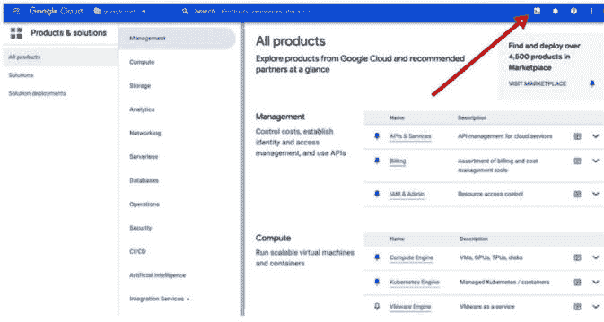
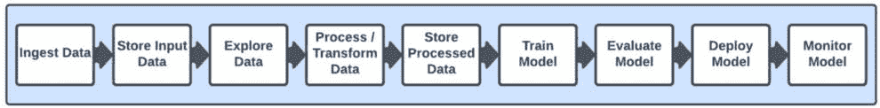
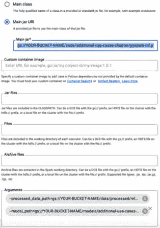
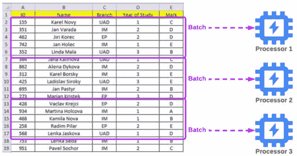
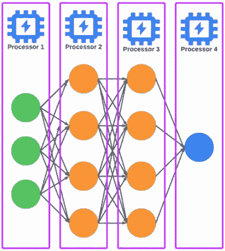
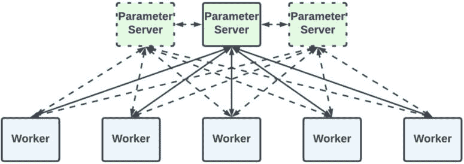
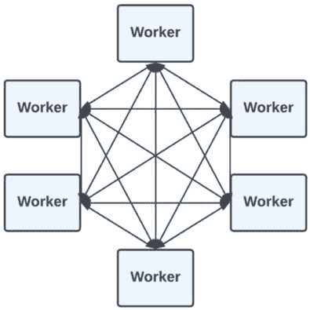
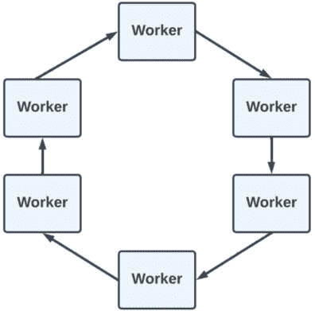
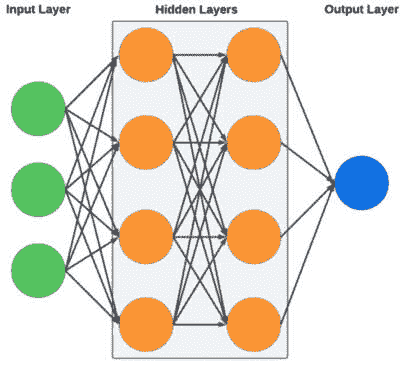
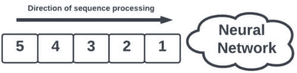

# 第十四章：额外的 AI/ML 工具、框架和考虑因素

到目前为止，我们已经涵盖了典型**机器学习**（**ML**）项目中所有的主要步骤和考虑因素。考虑到人工智能/机器学习是技术行业中发展最快的研究领域之一，每天都有新的工具、方法和框架出现。

在本章中，我们将讨论数据科学行业中流行的其他工具和框架，这些我们之前还没有涉及。这包括重要主题，如**BigQuery ML**（**BQML**）、我们可以用于 AI/ML 工作负载的各种硬件，以及使用 PyTorch、Ray 和 Spark MLlib 等开源库和框架。我们还将讨论一些关于如何在 Google Cloud 上实现大规模分布式训练的技巧。

在本章结束时，我将提供一些额外的背景信息，以帮助将本书剩余部分的重点转向生成式人工智能。这包括对我在本书前面以高层次描述的一些常用神经网络架构进行更深入的探讨。

例如，在*第九章*中，我们介绍了神经网络的基础知识，并介绍了常见的神经网络架构类型，如**卷积神经网络**（**CNNs**）、**循环神经网络**（**RNNs**）和转换器。在本章中，我们将更详细地探讨这些用例，为在剩余章节中讨论生成式人工智能建立一些基础知识。具体来说，本章包括以下主要主题：

+   自定义 Jupyter 内核

+   BQML

+   AI/ML 工作负载的硬件考虑

+   其他流行的开源工具和框架 - Spark MLlib、Ray 和 PyTorch 在 Google Cloud 上

+   大规模分布式模型训练

+   转向生成式人工智能

列表中的第一个主题也与一些我们需要覆盖的先决步骤相关，以便为本章中的实际活动设置我们的环境。这些将在下一节中描述。

# 先决主题和步骤

本节描述了设置我们的 Vertex AI 工作台环境的先决主题和步骤。

### 自定义 Jupyter 内核和包依赖管理

当我们在 Jupyter Notebook（例如 Vertex AI 工作台笔记本）中运行我们的代码时，我们的代码执行的运行环境被称为内核。Vertex AI 工作台实例已经预装了各种内核，用于流行的工具和框架，如 TensorFlow 和 PyTorch，我们将在本章中更深入地介绍这些内容。

然而，如果我们想定义具有特定已安装包的隔离环境，我们也可以创建自定义内核。当使用处于预览模式的包时，这是一个很好的做法，例如，因为它们可能有非常具体的依赖要求。我们将使用一个名为`bigframes`的库，我将在本章中详细描述。作为先决条件，我将概述如何创建自定义 Jupyter 内核，并解释与该过程相关的一些重要概念。让我们从虚拟环境的概念开始。

#### 虚拟环境

当我们的代码执行时，它在一个环境中运行，这个环境包含我们的代码所需的全部依赖项，这些依赖项通常是其他软件包。管理各种包的依赖项可能很复杂，特别是如果我们有两件或更多软件依赖于特定包的不同版本。例如，想象以下场景：

+   软件包 X 依赖于软件包 A 的版本 1.0.3

+   软件包 Y 依赖于软件包 A 的版本 2.2.1

如果我们在环境中安装了软件包 Y 及其所有依赖项，那么我们的环境将包含软件包 A 的版本 2.2.1。

现在，如果我们尝试在我们的环境中运行软件包 X，它可能会失败，因为它特别需要安装不同版本（即版本 1.0.3）的软件包 A。这个问题被称为**依赖冲突**。

虚拟环境可以帮助我们避免这个问题，因为正如其名所示，它们提供了一个虚拟执行环境，在其中我们可以运行我们的代码。当我们创建一个虚拟环境时，几乎就像创建了一个专门用于执行代码的机器，因为该环境以及其中的所有内容都与其他执行环境隔离，但这种隔离是虚拟的，因为它只是与其他可以在同一台机器上运行的环境的逻辑分离。

当我们使用 Vertex AI 笔记本实例时，我们可以创建两种主要的虚拟环境：

+   `venv`模块，因此它们是特定于 Python 包的。此选项使用`pip`进行包管理。

+   **Conda 环境**，它使用超越 Python 的 Conda 包和环境管理系统，可以管理各种其他语言的包，例如 R、Ruby 等。

在确定要使用哪个选项时，请记住，Python 虚拟环境更简单、更轻量级，但 Conda 提供了更多功能，并处理更复杂的场景（因此，Conda 环境可能比 Python 虚拟环境更大、设置速度更慢）。我们将使用 Conda 来处理我们的用例。我将在下面描述这一点。

#### 创建 Conda 虚拟环境和自定义 Jupyter 内核

执行以下步骤以创建我们将在此章后面部分使用的 Python 虚拟环境和自定义 Jupyter 内核：

1.  在您在 *第五章* 中创建的 Vertex AI Notebook 实例上打开 JupyterLab。

1.  选择 **文件** | **新建** | **终端**，并在终端屏幕上执行以下步骤。

1.  创建一个 Conda 环境：

    ```py
    conda create --name bigframes-env -y
    ```

1.  激活环境：

    ```py
    conda activate bigframes-env
    ```

1.  安装 `bigframes`（我们也可以安装我们想要的任何其他包，但现在我们将保持简单）：

    ```py
    conda install bigframes -y
    ```

1.  在新环境中安装 JupyterLab（这将使我们的新 Conda 环境通过 JupyterLab 的自动发现功能作为内核可用）：

    ```py
    conda install jupyterlab -y
    ```

1.  更改内核的显示名称（此更新可能需要几分钟才能在 Vertex AI Workbench JupyterLab 界面中显示）：

    ```py
    sed -i 's/"display_name": "Python 3 (ipykernel)"/"display_name": "Python 3 (bigframes)"/' /opt/conda/envs/bigframes-env/share/jupyter/kernels/python3/kernel.json
    ```

现在，我们的 Conda 环境和自定义 Jupyter 内核已经准备好用于本章的动手练习。在我们深入本章剩余主题之前，我们只需执行一个先决步骤，那就是为我们的无服务器 Spark MLlib 活动准备所需的文件。

## 为无服务器 Spark MLlib 活动准备文件

在本节中，我们将把一些文件存放在 Google Cloud Storage 中，以便在本章后面的无服务器 Spark MLlib 活动中使用。为此，请执行以下步骤：

1.  进入 Google Cloud 控制台，通过点击 **Cloud Shell** 图标打开 Cloud Shell，如图 *图 14* 所示。此图标看起来像是一个“大于”符号，后面跟着一个下划线——即 **>_**：



图 14.1：激活 Cloud Shell

1.  在 Cloud Shell 中运行以下命令以从我们的 GitHub 仓库下载所需的文件：

    ```py
    wget https://raw.githubusercontent.com/PacktPublishing/Google-Machine-Learning-for-Solutions-Architects/main/Chapter-14/data/data_processed_titanic_part.snappy.parquet
    wget https://raw.githubusercontent.com/PacktPublishing/Google-Machine-Learning-for-Solutions-Architects/main/Chapter-14/pyspark-ml.py
    ```

1.  在 Cloud Shell 中运行以下命令以将所需的文件上传到 Google Cloud Storage（**重要：请将 [YOUR-BUCKET-NAME] 替换为在** **早期章节** **中创建的存储桶名称**）：

    ```py
    gsutil cp pyspark-ml.py gs://[YOUR-BUCKET-NAME] /code/additional-use-cases-chapter/pyspark-ml.py
    gsutil cp *.parquet gs://[YOUR-BUCKET-NAME]/data/processed/mlops-titanic
    ```

现在，本章后面的动手练习准备工作已经完成。接下来，我们将深入探讨 BQML 的重要主题。

# BQML

我们在 *第三章* 中首先介绍了 BigQuery，并在本书的各个章节中使用了它进行数据管理和处理。然而，鉴于大规模数据处理与机器学习的紧密关系，Google Cloud 已经将机器学习功能直接集成到 BigQuery 中，以及与 Google Cloud Vertex AI 的原生集成。这个功能被称为 BQML，本节将详细介绍这项服务。

BQML 允许我们使用 BigQuery 中的标准 SQL 查询创建和执行机器学习模型。考虑到许多公司已经在 BigQuery 中存储了大量的数据，BQML 使得这些公司的数据科学家能够在大型数据集上训练模型，并在数据库系统中直接进行预测，而无需在不同存储系统之间移动数据。

它支持各种 ML 算法，包括线性回归、逻辑回归、k-means 聚类和深度神经网络，以及基于存储在 BigQuery 中的时间序列数据的预测用例。

除了训练和预测，我们还可以使用 BQML 执行模型开发生命周期中的许多步骤，例如特征工程、模型性能评估和超参数调整。考虑到所有这些都可以使用标准 SQL 完成，数据科学家可以轻松开始使用 BQML，而无需在工具方面经历陡峭的学习曲线。这被称为降低入门门槛，其中入门门槛代表人们开始进行一项活动有多容易或有多难。例如，入门门槛高的活动会带来很多初始困难。一个例子是，在某人能够有效使用该系统之前，需要对其进行大量培训或复杂的先决条件，例如提供基础设施。一些技术系统需要数月培训和努力，某人才能有效使用它们。另一方面，BQML 可以被任何理解标准 SQL 语法的人轻松使用，并且不需要任何复杂的设施配置。就像 Google Cloud 提供的其他托管服务一样，BigQuery（以及由此扩展的 BQML）为我们管理基础设施，并且可以根据需求自动扩展和缩减。

有了这个想法，让我们来看看如何使用 BQML 开发和使用 ML 模型。

## 使用 BQML

虽然本章附带的 Jupyter Notebook 提供了如何使用 BQML 进行各种 ML 任务的动手操作指南，但我将在这里总结一些主要功能。为了了解背景，让我们回顾一下我们的 ML 模型开发生命周期，如图 *14**.3* 所示：



图 14.2：ML 模型开发生命周期

以下小节将更详细地探讨每个步骤。

### 数据准备

我们将把 *图 14**.3* 中显示的以下步骤组合到本节中：

+   摄入数据

+   存储输入数据

+   探索数据

+   处理/转换数据

+   存储处理后的数据

从数据摄入和存储开始，我们有多种方式可以将数据导入 BigQuery。例如，我们可以直接通过 BigQuery 控制台 UI 或 CLI 上传文件。对于大型数据集，我们可以将它们存放在 Google Cloud Storage 中，然后从那里导入到 BigQuery。我们还可以使用 BigQuery 数据传输服务自动将数据移动到 BigQuery，无论是作为一次性传输还是按预定的时间表进行。我们可以通过与其他服务集成，如 Google Cloud Pub/Sub 和 Dataflow，将数据流式传输到 BigQuery。还有第三方 ETL 工具可以用于将数据传输到 BigQuery。

一旦我们将数据存储在 BigQuery 中，我们就可以使用各种工具来探索和转换数据，除了 BigQuery 控制台和标准 SQL 之外。我们在前面的章节中介绍了并使用了`pandas`库，我们知道它是一个在数据科学中非常广泛使用的库，尤其是在数据探索和处理方面。因此，许多数据科学家喜欢直接使用 pandas 与存储在 BigQuery 中的数据。幸运的是，有一些额外的库使得这样做变得容易：

+   BigQuery DataFrame Python API

+   `pandas_gbq`库

让我们更详细地看看这些内容。

#### BigQuery DataFrame Python API

BigQuery DataFrame Python API 使我们能够使用 Python 在 BigQuery 中分析和处理数据，并执行各种机器学习任务。这是一个相对较新的开源选项，由 Google Cloud 推出并维护，用于使用 DataFrame 与 BigQuery 交互（在撰写本文的 2023 年 12 月时，它目前处于预览状态）。我们可以通过使用`bigframes` Python 库来访问它，该库由两个主要部分组成：

+   `bigframes.pandas`，它在大查询（BigQuery）之上实现了类似 pandas 的 API

+   `bigframes.ml`，它在大查询机器学习（BigQuery ML）之上实现了类似`scikit-learn`的 API

伴随本章的 Jupyter Notebook 提供了如何更详细地使用`bigframes.pandas`的说明。我们将在稍后深入这些步骤，但首先，我将简要介绍`pandas_gbq`。

#### pandas_gbq

如果我几个月前写这一章，`pandas_gbq`库将是本节中包含的主要或唯一选项，因为在撰写本文时，它一直是使用 pandas 与 BigQuery 交互的主要选项。这是一个由 PyData 和志愿者维护的开源库，已经存在一段时间了（自 2017 年以来），因此它在行业中得到了广泛的应用。

实际上，它是对 BigQuery 客户端库（`google-cloud-bigquery`）的一个薄包装，提供了一个简单的接口来运行 SQL 查询并将 pandas DataFrame 上传到 BigQuery。这些查询的结果被解析成一个`pandas.DataFrame`对象，其形状和数据类型来自源表。

伴随本章的 Jupyter Notebook 也提供了如何更详细地使用此库的说明。现在是深入研究这些步骤的好时机。打开您在*第五章*中创建的 Vertex AI Workbench 实例上的 JupyterLab，并执行以下步骤：

1.  在屏幕左侧的导航面板中，导航到`Google-Machine-Learning-for-Solutions-Architects`文件夹内的`Chapter-14`目录。

1.  双击`pandas-gbq.ipynb`笔记本文件以打开它。当提示选择内核时，您可以使用默认的**Python 3 (****ipykernel**)内核。

1.  双击`bigframes.ipynb`笔记本文件以打开它。当提示选择内核时，您可以使用我们在本章的“先决主题和步骤”部分创建的默认**Python 3 (bigframes)**内核。

1.  在您打开的每个笔记本中，按*Shift* + *Enter*来执行每个单元格。

    笔记本中包含注释和 Markdown 文本，描述了每个单元格中代码的功能。

如您所见，在 Vertex AI 中有多种与 BigQuery 数据交互的选项。

由于`pandas_gbq`库在业界的广泛应用，以及谷歌已经推出了之前描述的官方 BigQuery DataFrames Python API，因此这两种选项很可能在数据科学家中继续流行。需要记住的关键一点是，`pandas-gbq`将数据下载到您的本地环境，而 BigQuery DataFrames Python API 用于在谷歌云分布式基础设施上运行您的数据操作。

接下来，让我们讨论如何使用 BQML 创建、使用和管理机器学习模型。本章附带的 Jupyter Notebook 文件可以用来实施以下步骤，但在深入到笔记本文件之前，让我们先讨论它们。

### 创建机器学习模型

我们可以使用 BigQuery 中的`CREATE MODEL`语句来定义和训练模型。例如，以下代码片段创建了一个名为`my_model_name`的线性回归模型，该模型在`my_dataset.my_table`中的数据上训练，使用`target_column`中的值作为标签：

```py
CREATE OR REPLACE MODEL `my_dataset.my_model_name`
OPTIONS(model_type = 'linear_reg', input_label_cols=['target_column']) AS
SELECT * FROM `my_dataset.my_table`;
```

正如我们已经讨论过的，BQML 支持许多常用的算法类型。我们还可以从/到 Google Cloud Storage 导入和导出我们的模型，以与其他工具和框架交互，甚至在模型开发过程中进行超参数调整。

### 评估机器学习模型

一旦我们的模型经过训练，我们可以使用如下 SQL 代码来评估其性能：

```py
SELECT * FROM ML.EVALUATE(MODEL `my_dataset.my_model_name`, 
TABLE `my_dataset.my_evaluation_table`);
```

这将返回评估指标，如准确率、精确率、召回率等，具体取决于模型类型。

### 生成预测

接下来，我们可以使用以下 SQL 代码之类的模型来生成预测：

```py
SELECT * FROM ML.PREDICT(MODEL `my_dataset.my_model_name`, 
TABLE `my_dataset.my_input_table`);
```

此语句将数据从`my_dataset.my_input_table`输入到我们的训练模型中，以生成预测。

现在，我们可以使用本章附带的 Jupyter Notebook 文件来实施这些步骤。为此，打开您在第五章中创建的 Vertex AI Workbench 实例上的 JupyterLab，并执行以下步骤：

1.  在屏幕左侧的导航面板中，导航到`Google-Machine-Learning-for-Solutions-Architects`文件夹内的`Chapter-14`目录。

1.  双击`BQML.ipynb`笔记本文件以打开它。当提示时，选择默认的**Python 3 (ipykernel)**内核。

1.  按*Shift* + *Enter*来执行每个单元格。

    笔记本中包含注释和 Markdown 文本，描述了每个单元格中代码的功能。

接下来，我们将讨论如何设置模型监控和持续训练。

### 模型监控和持续训练

为了实现持续模型监控和持续训练，我们可以设置计划任务来执行评估和训练查询。这是一个我们需要使用额外的 Google Cloud 服务来架构的解决方案，例如 Google Cloud Scheduler 和 Google Cloud Functions，其中我们可以使用 Google Cloud Scheduler 定期调用 Google Cloud Functions 来运行训练和评估查询。话虽如此，对于复杂的 MLOps 管道，Vertex AI 提供了更多用于定制的功能。这一点引出了我们的下一个话题，即确定何时使用 BQML 与其他 AI/ML 用例工具。

## 何时使用 BQML 与其他 AI/ML 用例工具

我们已经讨论过，BQML 对于希望使用熟悉的 SQL 语法在 BigQuery 中实现 ML 用例的数据分析师和数据科学家来说是一个很好的选择，并且简单性是其在此环境中的主要优势之一。请记住，简单性和定制性之间往往存在权衡。如果您需要构建高度先进和定制的模型，那么您可能会发现 SQL 的简单性无法提供使用 TensorFlow、PyTorch、Ray 和 Spark MLlib 等专用 AI/ML 框架时所能达到的相同级别的定制性。

您还可以通过与 Vertex AI 中托管模型交互来“兼得两者之优”，使用 **BigQuery 远程函数**，这些函数提供了与 Cloud Functions 和 Cloud Run 的集成。采用这种方法，您可以编写将在 Cloud Functions 或 Cloud Run 上执行代码，您可以从 BigQuery 中的查询调用该代码。该代码可以向在 Vertex AI 中训练和托管的模型发送推理请求，并将响应发送回 BigQuery。如果需要，您甚至可以在请求和响应中实现转换，以确保您的查询期望的数据类型与模型期望的数据类型之间的兼容性。您可以在以下链接的 Google Cloud 文档中了解更多关于 BigQuery 远程函数的信息，该链接描述了已知限制和最佳实践：[`cloud.google.com/bigquery/docs/remote-functions`](https://cloud.google.com/bigquery/docs/remote-functions)。

注意

虽然 BigQuery 是为大规模分析工作负载而设计的，但 Google Cloud Spanner 是 Google Cloud 中另一个高度可扩展的数据库服务。Spanner 是为分布式和强一致性事务性用例而设计的，并且也支持 SQL 语法。它最近增加了与 Vertex AI 的集成，提供与 BQML 类似的功能（即通过 SQL 接口访问 Vertex AI 上托管的 ML 模型），但旨在用于事务性工作负载，而不是分析性工作负载。

接下来，我将用简短的讨论结束本节，讨论 BigQuery Studio，这是一个方便管理我们所有 BigQuery 任务和工作负载的方式。

## BigQuery Studio

如其名所示，BigQuery Studio 提供了一种单窗口体验，使我们能够在 BigQuery 中执行许多不同类型的活动。它包括一个 SQL 编辑器界面，使我们能够直接在 Google Cloud 控制台中编写和运行查询，并通过与 Duet 集成获得智能代码开发辅助，Duet 是一个 Google Cloud 生成式 AI 实时代码助手，我们将在本书稍后部分更详细地介绍。BigQuery Studio 还使我们能够安排 SQL 查询以定期的时间间隔（例如，每天）运行，用于需要重复查询执行的场景，如生成每日报告。

通过 BigQuery Studio，我们可以访问 Dataform 来在 BigQuery 中定义和运行数据处理工作流程，并利用 BigQuery Studio 与 Dataplex 的集成进行数据发现、数据分析和数据质量管理。BigQuery Studio 还与 Colab Enterprise 集成，使我们能够直接在 BigQuery 控制台中使用 Jupyter Notebook。

我鼓励你访问 Google Cloud 控制台中的 BigQuery Studio 界面，并探索其各种功能和集成。

我们将在后面的章节中重新讨论 BigQuery，但就目前而言，让我们讨论一些 AI/ML 工作负载的硬件考虑因素。

# AI/ML 工作负载的硬件考虑因素

本书的大部分内容都集中在 Google Cloud 上可用的软件和服务级功能。高级实践者也会对存在的硬件能力感兴趣。如果你的用例需要极端性能，那么选择运行工作负载的正确硬件组件是一个重要的决定。底层硬件的选择和高效使用也会影响成本，当然，这也是你解决方案架构中的另一个重要因素。在本节中，我们将转换讨论焦点，重点关注在 Google Cloud 中运行 AI/ML 工作负载的一些硬件考虑因素，从对**中央处理器**（**CPU**）、**图形处理器**（**GPU**）和**张量处理器**（**TPU**）能力的概述开始。

## CPU、GPU 和 TPU

你可能已经熟悉 CPU 和 GPU，但 TPU 更是 Google Cloud 的专有技术。简要概述一下，CPU 是为大多数消费设备提供动力的，例如笔记本电脑和移动电话，以及数据中心中的通用服务器。它们在执行广泛任务的多任务处理中非常有效，但它们执行的处理是某种程度的顺序的。

另一方面，GPU 采用了一种优化并行（而不是顺序）处理的架构。如果你能将一个过程分解成可以并行运行的类似任务，那么你将能够在 GPU 上比在 CPU 上更快地完成该过程。尽管，正如其名称所暗示的，GPU 最初是为处理图形而设计的，这涉及到并行处理大量像素和顶点，但结果证明，许多 AI/ML 工作负载固有的矩阵操作任务也可以通过 GPU 的并行架构来加速。

Google Cloud 设计的 TPU 旨在加速 TensorFlow 操作，并且它们在训练和运行模型方面比 CPU 和 GPU 更高效，适用于某些类型的工作负载。尽管它们最初是为 TensorFlow 而创建的，但现在也可以通过使用如 PyTorch/XLA 之类的库来与其他框架一起使用，PyTorch/XLA 是一个 Python 包，它使用**加速线性代数**（**XLA**）深度学习编译器，使 PyTorch 能够连接到 TPU 并将 TPU 核心作为设备使用。

谷歌云提供了许多不同类型的硬件服务器，我们可以选择用于运行我们的 ML 工作负载，这些服务器提供各种数量的 CPU、GPU 和 TPU 功率。

在撰写本文的 2023 年 12 月时，谷歌云最近推出了其最强大的 TPU（**Cloud TPU v5p**），并与他们新的**AI 超级计算机**产品一起推出，为 AI/ML 工作负载提供高度优化的资源（即存储、计算、网络等）。

由于谷歌云提供了广泛的计算选项，我这里不会列出所有选项。谷歌云不断推出更多选项，因此我鼓励您查阅谷歌云文档以获取最新细节：[`cloud.google.com/compute/docs/machine-resource`](https://cloud.google.com/compute/docs/machine-resource)。

接下来，让我们将讨论切换回软件层面，并探索一些在谷歌云上得到支持的 ML 和数据科学行业的流行开源工具和框架。

# 其他开源工具和框架——Spark MLlib、Ray 和 PyTorch 在谷歌云上

在本节中，我将介绍其他开源工具和框架，例如 PyTorch、Ray 和 Spark **机器学习库**（**MLlib**），并演示如何使用它们在谷歌云上实现 AI/ML 工作负载。

## Spark MLlib

我们在之前的章节中介绍了 Apache Spark，并在*第六章*中使用它进行数据处理以执行特征工程。Apache Spark MLlib 是 Apache Spark 的一个组件，它提供了针对并行处理大数据集优化的 ML 工具和算法。除了特征工程外，我们还可以使用 MLlib 中的工具来实现我们 ML 模型开发生命周期中的各个阶段，例如模型训练、模型评估、超参数调整和预测，以及将这些阶段组装成可以端到端执行的管道。

正如我们在数据处理上下文中讨论的那样，Apache Spark（包括 MLlib）的一个主要优势是它执行大规模计算工作负载的能力。虽然像 scikit-learn 这样的库在单机上执行 ML 工作负载时表现良好，但 MLlib 可以将计算工作分布到多台机器上，这使得我们能够更有效地处理更大的数据集。

在本章伴随的实践活动中，我们将使用 Spark MLlib 通过 Vertex AI 中的无服务器 Spark 功能在 Google Cloud Dataproc 上训练一个模型。从解决方案架构的角度来看，这一点很重要：我们将在 Vertex AI 中执行步骤，但它将在后台在 Dataproc 上运行 Spark 作业。我们可以以多种方式实现这项工作负载，在我们的实践活动中，我们将介绍以下两种方法：

1.  使用与我们在*第十一章*中执行的活动类似的 MLOps 管道。

1.  使用 Vertex AI 中的无服务器 Spark 用户界面。

让我们从第一种方法开始：使用 MLOps 管道。

### 通过 Vertex AI 上的 Kubeflow Pipelines 实现的无服务器 Spark

在*第十一章*中，我们使用了 Kubeflow Pipelines 中的`DataprocPySparkBatchOp`操作符来自动化 MLOps 管道中无服务器 Spark 作业的执行。在本章中，我们将再次使用该操作符，但这次我们将使用它来运行使用 Spark MLlib 进行模型训练和评估的作业。为此，打开你在第五章中创建的 Vertex AI Workbench 实例上的 JupyterLab，并执行以下步骤：

1.  在屏幕左侧的导航面板中，导航到`Google-Machine-Learning-for-Solutions-Architects`文件夹中的`Chapter-14`目录。

1.  双击`spark-ml.ipynb`笔记本文件以打开它。当你被提示选择内核时，选择**Python 3 (****ipykernel)**内核。

1.  在你打开的每个笔记本中，按*Shift* + *Enter*来执行每个单元格。

    笔记本中包含注释和 Markdown 文本，描述了每个单元格中代码的功能。

如我们所见，将我们在*第十一章*中执行的活动扩展到使用 Kubeflow Pipelines 来自动化用于模型训练的无服务器 Spark 作业，Spark MLlib 非常简单。让我们看看运行我们的无服务器 Spark 作业的另一种选项，即通过 Vertex AI 的无服务器 Spark 用户界面直接运行。

### Vertex AI 中的无服务器 Spark 用户界面

要访问 Vertex AI 中的无服务器 Spark 用户界面，打开你在第五章中创建的 Vertex AI 工作台实例上的 JupyterLab，并执行以下步骤：

1.  从**文件**菜单中选择**新建启动器**。

1.  滚动到**Dataproc 作业和会话**部分，并选择**无服务器**。

1.  选择**创建批量**。

1.  在出现的屏幕上（参见*图 14.4*以供参考），输入以下详细信息：

    1.  `pyspark-ml.py`文件。它应该具有以下格式`gs://YOUR-BUCKET-NAME/code/additional-use-cases-chapter/pyspark-ml.py`。

    1.  `--``processed_data_path=gs://YOUR-BUCKET-NAME/data/processed/mlops-titanic`

    1.  `--``model_path=gs://YOUR-BUCKET-NAME/models/additional-use-cases-chapter/`

+   将所有其他字段保留在默认值，并在屏幕底部点击**提交**：

图 14.3：Vertex AI 中的无服务器 Spark 用户界面

点击**提交**按钮后，将出现一个屏幕，显示一系列无服务器 Spark 作业的列表；你新提交的作业将出现在列表的顶部（你可能需要刷新浏览器页面来更新列表）。等待直到作业状态显示为**成功**。

1.  如果作业因任何原因失败，点击作业名称以显示其详细信息，然后点击屏幕顶部的**查看云日志**。

1.  日志填充可能需要一些时间。你可以定期点击**运行查询**按钮来刷新日志。

1.  当作业执行完毕后，模型工件将被保存在两个目录中，分别命名为`metadata`和`stages`，位于你为`--model-path`参数指定的位置。通过在 Google Cloud 控制台中执行以下步骤来验证这些目录是否已创建并填充：

    1.  前往 Google Cloud 服务菜单，通过点击路径的每个后续组件来选择`--model-path`参数 – 例如，`YOUR-BUCKET-NAME/models/additional-use-cases-chapter/`。

干得好！你刚刚使用 Spark MLlib 实现了一个无服务器 Spark 工作负载，通过 Vertex AI 在 Dataproc 上训练模型。接下来，我们将简要讨论另一个在数据科学行业中越来越广泛使用的分布式计算框架：Ray。

## Ray

在这本书中，我不会花太多时间讨论 Ray，但我想为了完整性而提及它。Ray 的开发者将其描述为“*一个开源的统一计算框架，使扩展 AI 和 Python 工作负载变得容易。*”Ray 是另一种近年来越来越受欢迎的分布式执行框架，尤其是在 AI/ML 应用中。

与 Spark 类似，Ray 能够并行化代码并在机器集群中分配任务。它还包括可以帮助特定模型开发步骤的组件，例如用于超参数调整的 Ray Tune 和用于强化学习的 Ray RLlib。Google Cloud Vertex AI 现在通过允许我们创建 Ray 集群来直接支持 Ray。

## PyTorch

与 TensorFlow 和 Spark MLlib 类似，PyTorch 是一个开源框架，包括一套用于机器学习和深度学习用例的工具和库。它最初由 Facebook 的人工智能研究实验室开发，并从另一个名为 Torch 的 AI/ML 框架演变而来，该框架基于 Lua 编程语言。正如其名所示，PyTorch 具有 Pythonic 接口，近年来因其易用性和由其各种组件（如用于计算机视觉的 TorchVision、用于音频处理的 TorchAudio 和用于自然语言处理的 TorchText）提供的灵活性而受到欢迎。

PyTorch 使用动态（或“命令式”）计算图，称为**定义即运行**方法，其中图在执行操作时即时构建，这使得与某些其他框架中使用的静态图相比，模型开发更加直观和灵活。

注意

TensorFlow 过去只提供使用静态计算图的选择，但近年来，它引入了一个名为“即时模式”的选项，该选项提供了动态图功能。

同样，与 TensorFlow 一样，PyTorch 支持通过 NVIDIA 的 CUDA 框架进行张量计算的 GPU 加速，这显著加快了模型训练和推理的速度。

在加快模型训练的话题上，在计算中，通过在多个设备上并行执行操作以更快地完成更多工作是一种常见的做法。在下一节中，我们将讨论通过分布式训练实现这一目标的做法。

# 大规模分布式模型训练

想起我们在*第一章*的“AI/ML 和云计算”部分中进行的讨论，我在其中描述了将我们的模型扩展到更大尺寸的过程，从我们可以在笔记本电脑上训练的小型模型开始，逐步过渡到在强大、高端服务器上训练的大型模型，最终达到单台计算机（即使是市场上最强大的服务器）无法处理模型的大小或训练模型的数据集的规模。在本节中，我们将更详细地探讨训练这样的大型模型意味着什么。

我们在本书中详细介绍了模型训练过程，但为了知识复习，我将在下面简要总结这个过程，因为这些概念在讨论大规模分布式模型训练时很重要。对于这次讨论，我将专注于神经网络的监督训练。

监督训练过程在高级别上工作如下：

1.  我们的训练数据集的实例被输入到模型中。

1.  模型算法或网络处理训练实例，并且对于每个实例，它试图预测目标变量。在神经网络的情况下，这被称为前向传播。

1.  在做出预测后，模型使用损失函数（例如，回归中的**均方误差**（MSE）或分类中的交叉熵）计算错误或损失，该函数衡量模型预测与实际标签（真实值）之间的差异。

1.  然后开始反向传播过程，它将微积分中的链式法则应用于计算关于网络中每个权重的损失函数的梯度。

1.  优化算法，如梯度下降，利用在反向传播期间计算的梯度来更新网络中的权重。

训练通常通过在一系列的 epoch 中多次循环执行前面的过程来完成，其中 epoch 是整个训练数据集的一次完整遍历。然而，当使用大型数据集时，训练过程可以将整体数据集划分为更小的批次，并且每个批次的遍历被视为一个训练步骤。此外，一些框架，如 TensorFlow，允许我们指定每个 epoch 的训练步骤数。随着时间的推移，如果模型学习有效，那么在每个 epoch 之后，其预测将变得更加准确，损失将减少（希望达到可接受的阈值）。

注意

在这些讨论中，术语**处理器**指的是 CPU、GPU 和 TPU。此外，本节中我们将讨论的概念可以应用于单个机器上多个处理器或多个机器上的多个处理器上分布的训练工作负载。

在分布式训练用例中，处理器之间需要一些通信和数据共享。当使用单个机器时，处理器通常共享相同的系统内存（**RAM**），这简化了数据共享，但当使用多台机器时，通信需要在网络（包括路由器、交换机等）上发生，这可能会引入延迟和额外的复杂性。

我们在本书中已经多次实现了训练过程。接下来，我们将讨论当我们使用多个处理器时它是如何工作的。

## 数据并行性和模型并行性

通常有两个主要原因我们需要实现分布式训练工作负载：

+   我们希望使用一个非常大的数据集

+   我们希望训练一个非常大的模型

注意，这两种场景可能同时存在（也就是说，我们可能需要在非常大的数据集上训练一个非常大的模型）。在本节中，我将详细解释这些场景，从使用大型数据集的情况开始。

#### 数据并行

有时，我们需要在巨大的数据集上训练我们的模型，这些数据集仅在一个处理器上处理需要很长时间。为了使训练过程更高效，我们可以将数据集分成更小的子集或批次，并在多个处理器上并行处理它们。在这种情况下，我们可以在每个处理器上运行我们模型的副本，该副本处理加载到该处理器上的数据子集。一个简单的例子是，如果我们有一个包含 10,000 个数据点的数据集，并且我们运行了 10 个处理器，每个处理器处理数据集中的 1,000 个数据点。这种方法被称为**数据并行**，并在 *图 14.5* 中表示：



图 14.4：数据并行

在 *图 14.5* 中，每个紫色方块代表我们的数据的一个批次，每个批次都并行发送到单独的处理器。图中的每个批次只包含几个数据点，但在现实中，批次会大得多（此图旨在从高层次上说明概念）。接下来，我们将讨论我们可能需要实现分布式训练工作负载的另一个主要场景。这被称为模型并行。

#### 模型并行

有时，模型本身可能非常大，以至于无法在一个处理器上放入内存。在这些情况下，我们需要将模型分散到多个处理器上，每个处理器处理模型的不同部分或段。一个段可以是网络中的一层，或者在一些非常复杂的模型中是层的部分。*图 14.6* 展示了一个简单的模型并行示例，其中我们神经网络中的每一层都在一个单独的处理器上运行：



图 14.5：模型并行

我们可以使用不同的方法将我们的模型分解成段，我们通常希望选择一种方法，以最小化处理器之间的通信开销。这是因为这个过程可能会引入最大的延迟和复杂性，尤其是在我们使用多台机器，通信需要在物理网络上发生时。

除了优化处理器之间的通信外，我们还需要以最大化每个处理器利用率的方式设计我们的训练程序。记住，我们神经网络中某一层的输出成为我们网络中其他层的输入，因此层之间存在**顺序依赖性**。当我们的层分布在不同的处理器上时，一些处理器可能会空闲，等待从网络中前一层传播输入。这当然是对我们处理资源的低效使用，我们可以使用一种称为**流水线**的方法，通过将输入数据分成微批来提高训练效率。在这种情况下，每个段或阶段处理其微批，并将输出传递到下一阶段。然后，当下一阶段开始处理输出时，前一阶段可以开始处理下一个微批，依此类推。这样，数据以更流畅的方式在网络中流动，而不是后续层的处理器在等待早期层处理整个大型数据集时处于空闲状态。

到目前为止，我主要在谈论如何从模型处理输入的角度（即在训练过程中的前向传递）来并行化训练过程。记住，训练过程还包括一个反馈循环来检查模型的输出，计算与真实值的损失，然后计算损失的梯度并更新权重。接下来，我们将深入探讨这些步骤如何以分布式的方式进行实现。

## 分布式训练更新过程

在模型并行的情况下，数据仍然按顺序通过网络进行处理——也就是说，网络中的每一层（或段）都会产生输出，这些输出成为下一层的输入（即使这些层或段在不同的处理器上被处理）。因此，反向传播过程也可以按顺序进行，其中梯度是从最后一个段开始计算到第一个段，类似于在非分布式设置中的做法。每个段独立地根据计算出的梯度更新其模型权重的部分。

然而，在数据并行的情况下，训练数据的子集会在不同的处理器上并行处理，因此整体工作流程不是顺序的。每个处理器都有一个模型的相同副本，但每个副本处理不同的数据子集。因此，每个处理器上的模型副本对其他处理器正在做什么一无所知。因此，在计算损失、梯度和权重时需要额外的协调。

我们可以通过各种方式实现这种协调，但我们应该通常选择以下两种选项之一：

+   使用集中式的**参数服务器**进行协调

+   实现一个协议，允许单个训练服务器作为一个社区行动（我将将其称为“协作计算”）

让我们更详细地讨论这些方法，从参数服务器方法开始。

### 参数服务器方法

在参数服务器方法中，分布式系统中的一个或多个节点被指定为参数服务器，这些节点持有全局模型参数。这意味着它们对所有节点在分布式训练系统或集群中的所有模型副本的梯度参数具有全局视图。

在这种情况下，单个训练节点（让我们称它们为“工作节点”）处理不同的数据子集并计算各自的梯度，然后每个工作节点将其梯度发送到集中的参数服务器（们）。然后参数服务器（们）根据这些梯度更新全局模型参数，并将更新的参数发送回工作节点。这种方法的简化架构图如图**14.7**所示：



图 14.6：参数服务器方法

在**图 14.7**中，箭头表示工作节点和参数服务器（们）之间梯度和工作更新之间的交换。虚线和边框表示可能存在一个或多个参数服务器，因为单个参数服务器可能会成为解决方案的瓶颈。此外，在这个架构中还需要有一个协调实体来管理所有资源和它们的通信。这可以与参数服务器共址，也可以作为一个单独的服务器实现。

接下来，我们将讨论使用数据并行性实现模型训练的另一种选项，在这种选项中，不是使用集中式服务器来执行协调步骤，而是所有工作节点直接相互协作。

### 使用环全归约的协作计算方法

在协作计算方法中，没有中央服务器或一组服务器专门用于在训练集群中的独立工作节点之间执行协调。相反，使用分布式计算协议在节点之间进行协调。这意味着节点从彼此那里获取更新（在这种情况下，计算出的梯度）。存在许多用于分布式计算系统之间协调的通信协议，其中一种相当流行的协议被称为**全归约**。这类协议通常设计用于聚合分布式系统中的所有节点的数据，然后将结果返回给所有节点。这意味着，尽管每个节点可能处理我们数据集的不同子集，并且每个节点上的模型实例因此可能计算不同的梯度和权重，但每个节点最终都会得到一个梯度权重的聚合表示，该表示在所有节点上是一致的。

当使用全归约时，我们可以以各种方式连接处理器，例如通过实现完全连接的网格，如图*14.8*所示，环形架构，如图*图 14**.9*所示，或其他方法，例如树形和蝴蝶架构，我们在这里不会涉及：



图 14.7：完全连接的网格

如*图 14**.8*所示，完全连接的网格架构，其中所有节点都与其他所有节点相连，将需要所有节点之间进行大量的复杂协调。因此，更简单、更有效的环形架构通常被选择：



图 14.8：环形架构

在环形架构中，正如其名所示，节点在逻辑上排列成一个环。这个架构的一个重要方面，称为**环形全归约**，是每个节点只需将其计算出的梯度发送给其邻居之一。然后邻居将接收到的梯度与其自己的梯度合并（聚合），将聚合后的梯度传递给环形中的下一个节点，依此类推。这种聚合通常只是简单地将梯度相加。经过*N-1*步（其中*N*是节点数），每个节点都将拥有所有节点的聚合梯度的副本。然后它们可以简单地执行除法运算来计算平均梯度，并在优化步骤中使用这些值。

注意

更具体地说，环形全归约算法通常分为两个阶段，称为“归约-散射”阶段和“全收集”阶段，但这是理解本节所述的高层次过程工作原理时不需要的细节。

到目前为止，你可能想知道哪种方法更好——也就是说，使用集中式参数服务器或使用如环形全归约之类的协作方法。答案，正如许多解决方案架构决策的情况一样，是“这取决于。”让我们讨论一些影响这个决策的额外因素，例如我们是否想实现同步与异步数据并行。

### 同步与异步数据并行

在同步数据并行的案例中，所有节点需要同时更新其参数，或者至少以一种协调的方式进行。这种方法的一个好处是，它为所有节点的参数更新提供了一致性。然而，它可能导致瓶颈，从而减慢整体训练过程，因为所有节点必须等待最慢的那个节点。

相反，在异步数据并行的案例中，节点独立更新其参数，无需等待其他节点，这可以导致训练速度更快。然而，这有时会导致模型收敛和稳定性问题，因为如果程序没有正确实施，节点可能会失去同步。

异步实现也可以具有更高的容错性，因为节点之间不相互依赖，所以如果某个节点因某种原因停止服务，只要我们以容错方式设置了环境，集群的其余部分可以继续运行。

All-Reduce 通常以同步方式实现，因为节点需要共享它们的梯度，而参数服务器方法可以同步或异步实现，其中异步通常是更常见的选项。

接下来，我们将了解 Google Cloud Vertex AI 如何通过 Vertex AI Reduction Server 提供优化的 All-Reduce 机制。

### Vertex AI Reduction Server

虽然 Ring All-Reduce 方法在业界已经相当成熟且受欢迎，但它也有一些局限性。例如，在实践中，发现延迟往往与环中工作节点的数量成线性关系（也就是说，我们添加的工作节点越多，延迟就越大）。此外，由于每个工作节点都需要等待环中所有其他节点，单个慢速节点可能会减慢整个环的速度。此外，环架构可能存在单点故障，如果其中一个节点失败，可能会破坏整个环。

因此，谷歌创建了一个名为 Reduction Server 的产品，它提供了一个更快的 All-Reduce 算法。除了工作节点外，Vertex AI Reduction Server 还提供了 **reducer 节点**。工作节点托管和执行模型副本，计算梯度并应用优化步骤，而 reducers 执行相对简单的任务，即只是从工作节点中汇总梯度。*图 14**.10* 展示了 Reduction Server 架构的示例：


图 14.9：Reduction Server 实现

在 *图 14**.10* 中，你会注意到它与参数服务器架构的相似之处，但请记住，reducers 执行的任务比参数服务器少得多，这种简单性带来了一些好处。例如，reducers 只是轻量级的实例，可以使用 CPU，在这种情况下，可能比 GPU 显著便宜。此外，与环架构不同，随着我们添加更多的 reducer 节点，延迟不会线性增长，并且没有单点故障可以破坏整体架构。

基于 Vertex AI Reduction Server 架构提供的改进，我建议在 Vertex AI 上进行分布式训练时使用这种方法。

分布式训练作业通常需要使用大量资源，这可能会产生费用，因此我们不会在本章中为此主题进行动手实践。如果您想了解如何在 Vertex AI 上使用分布式训练实现机器学习项目（可选，包括 Reduction Server），我建议参考[`cloud.google.com/vertex-ai/docs/training/distributed-training`](https://cloud.google.com/vertex-ai/docs/training/distributed-training)的文档。

接下来，我们将探讨分布式训练的其他一些重要因素。

### 分布式训练的其他重要因素

在分布式训练中，过程中最复杂且容易出错的部分通常是管理节点间的通信。如果这部分没有高效实现，可能会导致瓶颈并影响训练性能。我们之前已经讨论了如何尽量减少节点间需要传输的数据量，幸运的是，有一些技巧可以帮助我们在这方面，例如在传输之前压缩梯度。

此外，考虑到分布式训练作业通常需要处理大量数据，它们可能需要运行很长时间，即使在多个节点上并行化工作负载时也是如此。因此，我们应该建立机制来帮助我们从训练过程中可能发生的故障中恢复。例如，如果我们的作业已经运行了几个小时，我们不想在作业完成前发生故障时不得不从头开始。为此目的，一个常见且重要的机制是**检查点**，在训练过程中我们定期保存模型的状态，以便在发生故障时可以从最近的状态继续。这就像在我们处理文档时定期保存我们的工作，以防笔记本电脑意外崩溃。

我们在本节中讨论的所有分布式训练概念都假设我们已经在我们的环境中某个地方存储了所有所需的数据，我们只需要将数据（或模型）分布到多个节点上。然而，还有一种流行的分布式模型训练类型被称为**联邦学习**，我将在下面简要描述。

## 联邦学习

在前面的章节中，我们讨论了将机器学习模型部署到边缘设备，如手机或物联网设备，通常是为了在这些设备上提供低延迟的推理。我们也讨论了这些边缘设备通常比服务器拥有更少的计算能力和数据存储资源。因此，我们在这些设备上训练模型的能力是有限的。

让我们想象一下，部署到设备上的模型可以通过更新从其本地环境（例如传感器）获得的数据来改进。如果我们想为这些设备的用户提供最佳体验，那么我们希望确保模型定期更新以适应新的数据。然而，在某些情况下，不断从边缘设备向集中位置发送数据以进行大型模型训练工作可能既低效又不可取。

联邦学习是一种技术，它使我们能够定期更新模型，而无需将这些设备上的数据发送回集中位置。相反，每个设备上的模型副本通过设备可用的数据进行本地训练。每个设备上的模型训练过程经过熟悉的步骤，包括计算损失和梯度，然后相应地更新模型参数或权重。让我们想象一下，这种训练正在数百万台设备上执行，每台设备根据其可用的少量数据进行模型更新。鉴于每台设备有限的训练能力，这个过程本身在长期内不会导致模型有太多改进。然而，在联邦学习的情况下，更新的权重可以被发送回集中位置以合并，创建一个更强大的模型，该模型可以从数百万台设备上的小型训练过程中学习。这意味着数百万台设备上的所有权重都可以平均（即聚合）形成一个更高级的模型。然后，这个更新后的模型（或其优化版本）可以被发送到每个设备，并且这个过程可以持续进行，以随着时间的推移不断提高模型。

这个过程的有效之处在于，只需要将模型权重发送回集中式基础设施，而设备上的实际数据根本不需要传输。这有两个主要原因：

+   权重（从数据大小方面来说）远小于训练数据，因此只发送权重比从设备发送训练数据到集中式基础设施要高效得多。

+   由于只有权重被传输（并且没有实际的用户数据），这有助于保护用户数据的安全并保护隐私。

当然，还有其他实现分布式模型训练的方法，但在这里我们已经介绍了很多更受欢迎的方案。

本书剩余部分将专注于生成式 AI，因此这是一个很好的时机，让我们回顾一下本书早期以高层次讨论的一些重要主题，这些主题将帮助我们理解导致生成式 AI 时代到来的各种发展。

# 转向生成式 AI

在我们开始深入探讨生成式 AI 之前，我将提供一些关于我们在这本书中早期讨论的一些重要神经网络架构的额外细节。例如，在*第九章*中，我们简要介绍了某些常见的神经网络架构，如 CNN、RNN、**长短期记忆**（**LSTM**）和转换器。在本节中，我们将深入探讨这些显著架构的工作原理，原因如下：

+   伴随这一章的实践练习包括构建一个用于计算机视觉用例的 CNN，因此详细描述 CNN 的内部工作原理是很重要的。

+   这里提到的其余神经网络架构可以被视为开发生成式 AI 技术的旅程中的里程碑。

让我们从对 CNN 和计算机视觉的深入探讨开始。

## CNN 和计算机视觉

正如我们在*第九章*中讨论的那样，CNN 通常用于计算机视觉用例，如物体识别和视觉分类，它们的技巧是将图片分解成更小的组件，或“特征”，并分别学习每个组件。通过这种方式，网络学习图片中的较小细节，然后将它们组合起来以分层识别更大的形状或对象。

### CNN 的架构

我们可能可以写一本关于 CNN 架构的整本书，但在这个书中我们不需要那么详细的程度。我将从高层次上介绍一些重要的概念，并且伴随这一章的 Jupyter Notebook 提供了如何构建一个相对简单的 CNN 用于计算机视觉用例的代码示例。

作为对*第九章*中我们讨论内容的简要回顾，如图*图 14.11*所示，最基本形式的神经网络被称为**前馈神经网络**（**FFNN**），其中被输入到网络中的信息随着它通过网络而遵循一个简单的正向方向：



图 14.10：一个简单的神经网络

另一方面，CNN 在架构中添加了一些特定的层，这些层有助于实现我们在本节引言中提到的分层处理。这些类型的层将在以下子节中从高层次上进行解释。

#### 卷积层

这些层执行一种称为**卷积**的数学运算，它涉及将一个滤波器（或核）在输入图像上滑动以生成一个特征图。滤波器是一个用于检测特定特征（如边缘、角或纹理）的小矩阵，每个滤波器在输入图像上**卷积**，计算滤波器和输入之间的点积，从而生成一个特征图。

因此，卷积层的输出是一组特征图，这些特征图代表了在输入图像的不同位置由过滤器检测到的特定特征。

#### 池化层

池化层主要用于通过下采样特征图和减少参数数量来进行降维。我们在*第七章*中详细介绍了降维的概念，并讨论了在训练和部署机器学习模型时，通常有必要实现降维以减少所需的计算量，以及降低过拟合训练数据的可能性。可以使用不同的池化方法，但最常见的方法称为“最大池化”，它从一个区域（由池大小定义）的像素集中取最大值。另一种方法，称为“平均池化”，简单地取一个区域内像素值的平均值。

#### 全连接层

将卷积层和池化层结合使用，可以得到从输入图像中提取的特征。在输入数据通过卷积层和池化层后，网络中的高级推理是通过使用全连接层来完成的。这些就是我们讨论前馈神经网络（FFNNs）时提到的层，其中每一层的神经元都与前一层的所有激活连接。正如 FFNNs 的情况一样，全连接层通常用于网络执行的最终分类或回归任务。

最终输出层通常使用 softmax 激活函数来输出模型试图识别的类别的概率分布。对于二分类，也可以使用 sigmoid 函数。

残差网络

残差网络，或称 ResNets，是一种为了解决梯度消失和梯度爆炸问题而开发的 CNN，我们曾在*第九章*中讨论过这个问题。它们通过引入“跳过连接”来实现这一点，这些跳过连接“跳过”网络中的某些层，并将一层输出直接连接到后续层的输入。

关于 CNN 内部工作原理的细节，我们就介绍到这里。许多研究论文都详细介绍了 CNN 的工作原理，但这超出了本书的范围。接下来，我们将深入探讨，并通过一些代码示例来构建我们第一个用于计算机视觉用例的 CNN！

在本章附带的 Jupyter Notebooks 中，我们将使用 Keras 构建一个简单的 CNN。这也是你开始学习如何使用 PyTorch 的地方，然后我们将使用 PyTorch 来完成相同的任务。

### 构建卷积神经网络（CNN）

要构建我们的 CNN，请在第五章中创建的 Vertex AI Workbench 实例上打开 JupyterLab，并执行以下步骤：

1.  在屏幕左侧的导航面板中，导航到`Google-Machine-Learning-for-Solutions-Architects`文件夹中的`Chapter-14`目录。

1.  双击`Keras-CV.ipynb`笔记本文件以打开它。当提示选择内核时，选择**TensorFlow**内核。

1.  双击`PyTorch-CV.ipynb`笔记本文件以打开它。当提示选择内核时，选择**PyTorch**内核。

1.  在你打开的每个笔记本中，按*Shift* + *Enter*执行每个单元格。

    笔记本中包含注释和 Markdown 文本，描述了每个单元格中的代码所执行的操作。

请花点时间品味一下这个事实：你刚刚已经使用了 Keras 和 PyTorch 在 Google Cloud Vertex AI 上为计算机视觉用例构建了 CNN。这是一些相当高级的内容！

接下来，我们将探讨一些通常用于序列数据和用例（如**自然语言处理**（NLP））的神经网络架构类型。

## RNNs，LSTMs 和 transformers

再次，我们已经在*第九章*中从高层次介绍了这些概念。在本节中，我们将对这些类型的架构进行更深入的探讨。我们不会在本章中构建这些网络，也不会过于详细地介绍；我在这里主要介绍这些主题，主要是为了历史背景，为我在本书生成式 AI 章节中将要介绍的概念和活动铺路。这是因为本节中所有的神经网络架构都可以看作是我们今天使用的生成式 AI 模型发展的垫脚石，顺序如*表 14.1:*所示：

| **开发** | **时间框架** | **参考文献** |
| --- | --- | --- |
| RNN | 1990 | Elman, J. L. (1990). *Finding structure in time*. Cognitive Science, 14(2), 179-211.https://doi.org/10.1207/s15516709cog1402_1. |
| LSTM | 1997 | Hochreiter, Sepp & Schmidhuber, Jürgen. (1997). *Long Short-term Memory*. Neural computation. 9\. 1735-80\. 10.1162/neco.1997.9.8.1735.https://doi.org/10.1162/neco.1997.9.8.1735. |
| Transformer | 2017 | Ashish Vaswani, Noam Shazeer, Niki Parmar, Jakob Uszkoreit, Llion Jones, Aidan N. Gomez, Lukasz Kaiser, and Illia Polosukhin. *Attention Is All You Need*. [2017, June 12]. arXiv preprint arXiv:1706.03762\. http://arxiv.org/abs/1706.03762. |

表 14.1：序列模型开发中的垫脚石

让我们从深入研究 RNNs 开始。

### RNNs

当你阅读这个句子中的每个单词时，你需要记住之前的单词，以便你可以理解整个句子的含义。这是**自然语言理解**（NLU）的应用，它是 NLP 的一个子领域。在更通用的意义上，这个句子代表了序列数据，因为句子中的数据点（在这种情况下，是单词）与句子中的其他单词相关，并且它们被处理的顺序很重要。*图 14.12*展示了序列数据被输入到神经网络中的例子：



图 14.11：序列数据被输入到神经网络中

在**图 14.12**中，我们可以看到数据点 1 将首先被神经网络处理，然后是数据点 2，依此类推，其中每个数据点都是一次由网络处理的。

在简单的 FFNNs（前馈神经网络）中，每个数据点独立地通过网络传递，因此网络不会将数据点与之前的数据点关联起来。正如我们在*第九章*中简要提到的，RNNs 将一种循环机制引入网络架构中，这种循环机制使得网络能够“记住”之前的数据点。让我们更详细地看看这意味着什么。

在 RNNs（循环神经网络）中，每个数据点被网络处理的概念被称为**时间步**。需要注意的是，在 RNNs 中，每个时间步中神经元的输出可以被保存以供将来参考。我们称这个为网络的**当前状态**；这通常被称为网络的**隐藏状态**，因为它通常不会对外暴露。

在每个时间步，网络中的神经元接收两组输入：

+   网络前一层神经元的输出（或者如果我们指的是网络中的第一个隐藏层，则是输入层的输入）。

+   从上一个时间步保存的相同神经元（即自身）的输出。这是隐藏状态。

观察我们的*图 14.12*中的图，在第一个时间步，当序列中的第一个数据点（即数据点 1）通过网络时，过程将非常类似于我们在*第九章*中描述的标准 FFNN，因为没有之前的状态需要记住。

然而，当数据点 2 通过网络处理时，每个神经元都可以将这个新数据与网络的“当前状态”结合起来（即处理数据点 1 后创建的状态）。这个过程对每个通过网络的新数据点重复进行，通过这样做，网络保持了对之前处理的数据点的某种记忆。

#### 时间反向传播（BPTT）

我们在*第九章*中讨论了神经网络学习中的反向传播过程。考虑到 RNN 使用时间步的概念，并组合了神经元随时间输出的结果，RNN 中的反向传播过程需要相应地进行修改。这种修改后的反向传播版本被称为**BPTT**。

它涉及到在时间上“展开”RNN，这意味着时间步被处理为深度神经网络的不同层。一旦网络展开，就应用标准的反向传播算法——也就是说，在每个时间步计算网络的误差，计算梯度，然后使用这些梯度来更新网络中的权重。

#### RNN 的局限性——梯度与短期记忆

在 RNN 中，作为 BPTT 过程一部分执行的展开可能导致处理长序列时非常深的网络。记住，梯度消失和爆炸是由于微积分中的链式法则。随着梯度通过与长序列相关的深层网络反向传播，这可能会使梯度消失和爆炸的问题更加突出。

这也影响了 RNN 的“记忆”。随着序列变长，反向传播更新早期时间步梯度的能力越来越小（在梯度消失的情况下）。这导致网络“忘记”较长序列中的早期时间步，这意味着 RNN 通常限于处理短序列。

梯度消失和爆炸问题以及短期记忆限制导致了更先进的 RNN 架构，如 LSTMs 的发展，这些架构可以解决这些问题。我们将在下一节中更详细地讨论。

### LSTMs

LSTM 是一种专门设计来克服传统 RNN 局限性的 RNN，尤其是在处理长序列时，如我们在上一节中讨论的梯度消失和爆炸问题。

除了我们在*RNN*部分描述的隐藏状态机制外，LSTMs 还引入了一个称为**细胞状态**的概念。这通常被比作一种贯穿整个 LSTM 网络链的传送带，这使得信息在处理过程中可以轻松地在多个步骤之间传输。隐藏状态仍然充当网络的短期记忆，而细胞状态充当长期记忆。

LSTMs 还引入了**门**的概念，这些门可以看作是传送带上的检查点，决定应该保留、丢弃还是添加哪些信息。通过这种方式，门调节了网络中信息的流动。通常有三种类型的门：

+   **输入门**，它使用新信息更新细胞状态

+   **输出门**，它使用细胞状态来确定下一个隐藏状态应该是什么

+   **遗忘门**，它决定从细胞状态中丢弃哪些信息

如果你想了解更多关于这些门控机制如何与隐藏状态和细胞状态结合使用的信息，我建议阅读原始论文（Hochreiter and Schmidhuber, 1997）[`direct.mit.edu/neco/article-abstract/9/8/1735/6109/Long-Short-Term-Memory`](https://direct.mit.edu/neco/article-abstract/9/8/1735/6109/Long-Short-Term-Memory)。

说到门控机制，最近引入了一种名为**门控循环单元**（**GRU**）的 LSTM 变体（Cho et al., 2014）。它将遗忘门和输入门合并为一个**更新门**，并合并了细胞状态和隐藏状态，从而产生了一个更简单、更高效的模型。

接下来，我们将讨论近年来 AI/ML 行业最重要的突破之一：Transformer 架构。

### Transformers

与大多数研究领域的情况一样，进步的速度通常以某种线性的速度进行，在时间线上偶尔会有变革性的突破。任何领域的线性进步代表了持续进行的逐步进步，而变革性的突破则代表了突然的、巨大的飞跃，完全改变了所有事物。当谷歌发明了 Transformer 架构（Vaswani, A., et al., 2017）时，这是 AI/ML 研究中的一次巨大飞跃，它构成了我们现在在世界范围内经历的生成式 AI 革命的基石。

从 RNNs 到 LSTMs 的进展是我认为的线性发展。然而，从 LSTMs 到 Transformer 架构的进展是 AI/ML 技术发展中的一个巨大飞跃。

首先，与 RNNs 和 LSTMs 不同，它们是逐步处理序列的，Transformer 可以同时处理整个序列（并行），这种并行处理使它们能够更有效地管理我们数据中的长距离依赖关系。这也使它们能够达到比以前模型架构更大的规模，从而产生了现在行业中最庞大、最强大的语言模型。然而，并行处理并不是 Transformer 架构最显著的特征。正如首次向世界介绍 Transformer 架构的论文标题所暗示的——“*Attention Is All You Need*”（arXiv:1706.03762 [cs.CL]）——Transformer 的主要创新是自注意力机制，它允许模型权衡输入数据不同部分的重要性。例如，如果我们将一个句子（或序列）输入到 Transformer 模型中，自注意力机制允许模型理解整个句子及其内部关系（例如，单词之间的关系）。

转换器在序列上并行运行多个自注意力**头**，这在论文中被称为**多头注意力**。希望你已经在我们链接到*第九章*时阅读了这篇论文，但如果没有，我强烈推荐阅读原始论文，以深入了解转换器如何工作的复杂细节，鉴于它们在人工智能/机器学习和生成式人工智能行业中的关键重要性。转换器是当前最先进的生成式人工智能模型的基础。

现在我们已经回顾了导致它们发展的进化步骤，我们准备进入下一章。但首先，让我们花点时间反思一下我们已经学到了什么。

# 摘要

在本章中，我们涵盖了通常由更高级的实践者使用的 AI/ML 重要概念，这些实践者对如何实现他们的 ML 工作负载有特定的需求或偏好，例如使用特定的框架，或者通过多个处理器并行化他们的工作负载。

我们首先讨论了 BQML，重点关注数据处理、数据分析与机器学习之间的紧密关系。我们学习了如何使用 BQML 训练和评估模型，以及如何使用 SQL 查询语法从该模型获取预测。

然后，我们讨论了我们可以用于我们的 AI/ML 工作负载的不同类型的硬件，以及我们在这本书中没有之前覆盖的流行工具和框架，例如 Spark MLlib、Ray 和 PyTorch。

接下来，我们深入探讨了卷积神经网络（CNNs）及其在计算机视觉中的应用，然后转向讨论特别适用于序列数据和使用案例（如自然语言处理 NLP）的神经网络架构，例如循环神经网络（RNNs）、长短期记忆网络（LSTMs）和转换器。我们深入研究了这些架构的内部工作原理，主要是为了理解导致生成式人工智能技术发展的进化步骤，这些技术将在本书剩余章节中概述。

最后，我们讨论了人工智能/机器学习中的分布式模型训练，包括为什么需要它，以及我们可以用来实现它的某些机制，例如数据并行和模型并行。我们还深入探讨了实现数据并行性的不同方法，例如使用集中式参数服务器，或者使用如环全归约这样的分布式协调机制。我们还探讨了联邦学习这一主题，以及它如何通过避免从设备传输数据的过程来帮助保护隐私。

接下来，我们将开始一段激动人心的旅程，我们将深入探索生成式人工智能的世界。请加入我，在下一章中开始吧！
