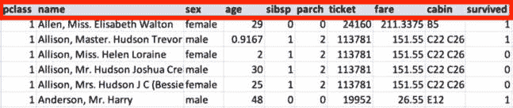
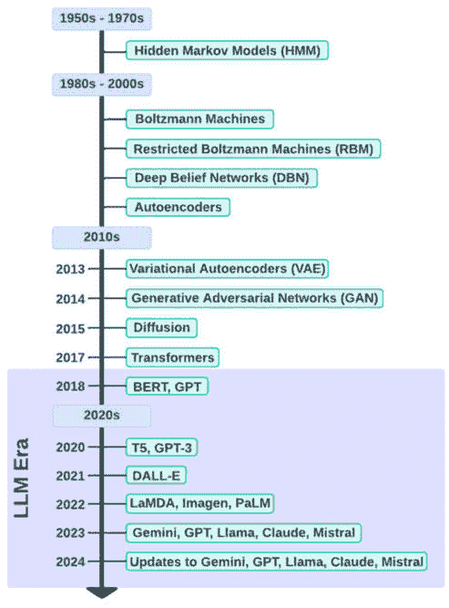
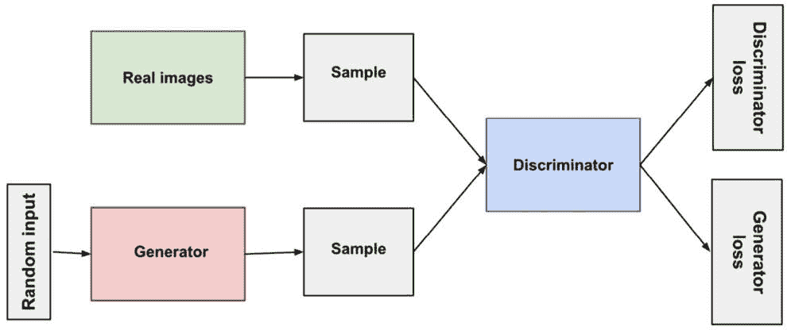
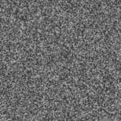
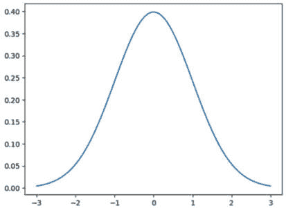
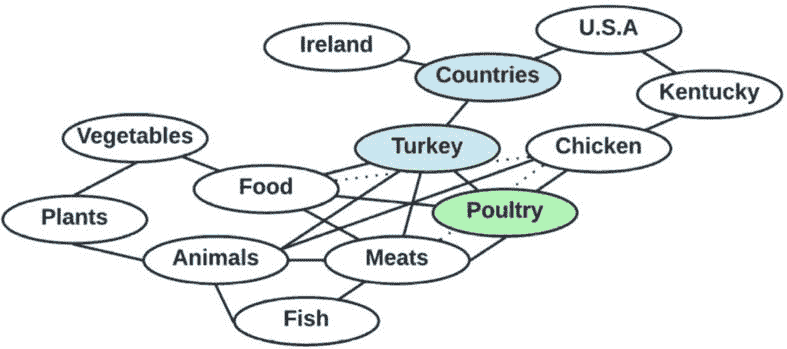

# 第十五章：生成式人工智能简介

**生成式人工智能**（**GenAI**）无疑是现在大家都在谈论的术语。如果你还没有机会“亲身体验”GenAI，那么你很快就会了解到为什么它目前正席卷全球，当我们深入探讨我们可以用这套相对较新的技术做些什么时。在本章中，我们将探讨支撑 GenAI 是什么以及它与其他**人工智能**（**AI**）/**机器学习**（**ML**）方法的区别的一些概念。我们还将涵盖一些导致其迅速崛起的主要历史发展，以及它今天是如何被使用的例子。

我们将首先介绍一些基本概念，然后进入更复杂的话题以及各种生成式人工智能（GenAI）方法的演变，例如**自编码器**（**AEs**）、**生成对抗网络**（**GANs**）、扩散和**大型语言模型**（**LLMs**）。鉴于这是一个入门章节，我们将主要为后续章节中更深入的探讨打下基础。具体来说，本章涵盖了以下主题：

+   GenAI 的基础知识

+   GenAI 技术和演变

+   LLMs

按照逻辑顺序，让我们从基础知识开始！

# GenAI 的基础知识

本节介绍了在讨论 GenAI 时我们需要理解的基本概念，从对 GenAI 的概述开始！

## 什么是 GenAI？

我将通过关注区分 GenAI 与其他我们已讨论过的 AI/ML 方法的特点来开始解释这个主题。想想这本书中我描述的所有各种算法和方法，更具体地说，想想每种方法追求的主要目标。无论是我们使用`scikit-learn`中的线性回归来根据特征预测某个目标变量的数值，还是在 XGBoost 中使用逻辑回归来实现二元分类模型，或者在 TensorFlow 中使用时间序列数据来预测未来，都有一个共同的主题，那就是我们试图**预测**或**估计**某事。

在这里要理解的关键概念是，我们各种复杂模型的输出通常是一个明确的数据点，要么是正确的，要么是错误的，或者至少尽可能接近正确。我们的模型通常基于模型在数据中学习（或估计）的关系产生一个单一、简单的答案。

即使是在像 K-means 聚类这样的**无监督学习**（**UL**）方法中，模型也只是在数据中找到数学关系，并根据这些关系将数据点分类到不同的组中。

通用人工智能的引入所带来的巨大飞跃是，模型现在可以超越简单的“是”/“否”答案或基于纯粹数学计算和模式识别的数值估计。有了通用人工智能，模型现在可以创建（或**生成**）新的数据。这就是最大的区别，而且这一点的意义相当巨大！

退一步来说：当我年轻的时候，我以为人工智能研究可以设计出像人类一样思考的机器，这让我着迷，所以我开始学习机器学习算法是如何工作的。我相当失望地发现，尽管一些模型可以在“理解”消费者行为和准确推荐某人可能喜欢购买的产品方面做得非常出色，或者甚至根据与患者相关的输入数据诊断潜在的疾病，但这一切都是基于将大量数据输入到“学习”在数据中检测模式的数学算法中。那里并没有真正的“智能”，尽管科学仍然令人着迷。

通用人工智能（GenAI）模型能够超越特定的数学答案并创造新内容，这是在人工智能追求过程中的一大飞跃。与任何最新的顶级通用人工智能模型进行一次对话，我毫不怀疑你将会非常震撼于它们能够做到令人惊叹的事情，比如创作音乐、描绘一个富有想象力的场景、写一首吸引人的诗，或者创建一个网络应用程序。你将在本书的后面部分学习如何利用通用人工智能来实现许多不同的用例，我相信你也会同意这是一项重大的技术进步。

然而，重要的是要理解，通用人工智能模型所完成的惊人壮举仍然依赖于我们在这本书中已经涵盖的许多人工智能/机器学习概念。在核心上，通用人工智能通过理解和复制其训练数据中的底层模式和结构来工作，它仍然使用算法和**神经网络**（**NNs**）来执行这些活动，尽管所使用的网络架构以及它们的使用方式都相当先进。在通用人工智能的情况下，目标不仅仅是解释数据，而是形成可以用来创造新事物的理解。让我们更深入地探讨这些主题，以更好地理解什么是使通用人工智能与其他人工智能方法不同的。

## 什么是非通用人工智能？

现在通用人工智能已经席卷全球，我们如何称呼它之前的所有人工智能/机器学习方法（即，本书中我们已经涵盖的大部分内容）？最流行的术语之一是“传统人工智能/机器学习”。你也可能听到它被称为“预测人工智能/机器学习”，因为目标通常是预测某事，或者在分类用例中被称为“判别人工智能/机器学习”。

## 深入探讨通用人工智能与非通用人工智能的区别

要理解生成式 AI（GenAI）与非生成式 AI 之间的基本区别，我们需要回顾一些支撑 AI/ML 的数学概念。别担心——我们只需覆盖到定义生成式 AI 与非生成式 AI 之间的区别所需的概念水平。

### 概率的角色

记住，数学概率是许多机器学习（ML）用例中的基本概念。例如，当我们要求一个模型将数据点分类到特定类别时，它很少会以 100%的确定性这样做。相反，它会计算数据点属于每个类别的概率。然后我们，或者模型本身，根据实现方式，可以选择概率最高的类别。

区分生成式 AI（GenAI）与传统 AI 的一个关键因素是概率在学习过程中的使用方式。让我们更详细地探讨这一点，从传统 AI 开始。

#### 传统 AI 和条件概率

在传统 AI 的情况下，模型试图根据数据集中预测变量（或特征）的值来估计目标变量`Y`包含特定值的概率。这被称为基于输入特征值的目标变量值的**条件概率**。条件概率是在另一个事件已经发生的情况下发生事件的概率，它由以下公式表示：

P(B|A) = P(A∩B) / P(A)

这里，以下规则适用：

+   P(B|A) 是在 A 的条件下 B 的条件概率。

+   P(A ∩ B) 是事件 A 和事件 B 同时发生的概率。这也被称为“联合概率”，我们将在稍后更详细地探讨。

+   P(A) 是事件 A 发生的概率。

要理解条件概率，可以想象一个游戏场景，其中有三根稻草隐藏在我们的视线之外。在这三根稻草中，两根是长稻草，一根是短稻草。我们将轮流抽稻草，抽到短稻草的人输。每次轮到我们抽稻草时，都有特定的概率我们会抽到短稻草。

初始时没有抽稻草，所以在第一轮，抽到短稻草的概率是 1/3（或大约 33.3%）。现在，让我们想象我们抽了一根稻草，结果是一根长稻草。这意味着还剩下两根稻草，由于我们抽到了长稻草，这意味着还剩下一根长稻草以及一根短稻草。在下一轮，抽到短稻草的概率因此是 1/2（或 50%）。

这里需要注意的重要一点是，因为我们已经选择了一根长吸管，它会影响整个场景的概率分布。这是一个非常简单的概念示例。在 ML 中，可能涉及许多因素（即特征），导致可能影响结果的因素组合数量非常大。这就是为什么 ML 模型通常需要处理大量数据来学习这些特征组合中的模式。

将这一点映射回 ML 用例，考虑*图 15.1*中所示的数据集，它展示了 OpenML 中泰坦尼克号数据集的简化版本（[`www.openml.org/search?type=data&id=40945`](https://www.openml.org/search?type=data&id=40945)）。目标变量由`survived`列表示，并用绿色框突出显示。这代表了我们前面方程中的*B*。所有其他列的组合构成了输入特征，它们代表我们前面方程中的*A*，如红色框所示。本质上，这描绘了当 ML 模型学习根据输入变量的值来预测目标变量的值时，它是在问：“在*A*（即输入变量）的值给定的情况下，*B*（即目标变量）的概率是多少？”换句话说：“在*A*的情况下，*B*的概率是多少？”：

图 15.1：目标变量与输入特征的分离

接下来，让我们看看概率如何在 GenAI 用例中以稍微不同的方式被使用。

#### GenAI 与联合概率

在 GenAI 的情况下，模型被设计来学习数据集的**联合概率分布**。正如我们在前面关于条件概率的方程中简要看到的，联合概率指的是两个或更多事件同时发生的概率。我们可以利用这一点来理解不同的变量或事件是如何相互关联以及它们是如何相互影响的。它表示如下：

P(A∩B) = P(A) × P(B)

这里，以下适用：

+   P(A)是事件 A 发生的概率

+   P(B)是事件 B 发生的概率

让我们再次用一个例子来更详细地描述这个概念。一个常见的类比是想象掷两个公平的六面骰子，并计算两个骰子同时显示某个数字的概率；例如：

+   **事件 A**：第一个骰子显示 3

+   **事件 B**：第二个骰子显示 5

这里，联合概率 P(A ∩ B)是当两个骰子静止时，第一个骰子显示 3 和第二个骰子显示 5 的概率。由于每次掷骰子都是独立的，每个面有 1/6 的概率出现，因此联合概率如下：

P(A∩B) = P(A) × P(B) = 1/6 x 1/6 = 1/36

这意味着两个骰子同时显示你预测的精确数字的概率是 1/36。这里要理解的关键点是事件是独立的，但有一个共享的概率分布来控制整体结果。

再次将此映射回机器学习用例，数据集中的联合概率分布包括目标变量以及输入变量，如图 15.2 中的红色方框所示。2*：

图 15.2：将目标变量与输入特征连接

这里一个主要的不同点是，虽然判别模型使用条件概率来预测给定输入变量值的目标变量的值，但生成模型试图学习数据集的整体联合概率分布，包括目标变量。

通过学习数据集的整体联合概率分布，模型可以理解数据集是如何构建的，以及所有特征是如何相互关联的，包括目标变量。通过这种方式，通过准确近似训练数据集的构建方式，它可以估计如何创建在数据集中尚未存在但具有相似结构和组成的相似数据点——也就是说，它可以生成新的、相似的内容。

除了联合概率分布之外，今天的生成模型通过使用我们在本书中多次引用的著名论文《Attention Is All You Need》（Vaswani 等人，2017 年）中概述的注意力机制来学习数据集中的隐藏关系和结构。在注意力机制开发之前，模型主要平等地对待所有输入。考虑到所有输入特征（和相关隐藏特征）都携带信息，平等对待所有输入会导致信号与噪声比低，从而限制了学习和预测过程的有效性。例如，当模型试图预测句子中的下一个单词时，句子中不是所有先前的单词都对预测下一个单词有同等贡献。相反，最可能的下一个单词可能更多地依赖于（或与）句子中特定其他单词的存在。例如，考虑句子：“我加了一撮盐和一点[空白]。”当现代生成模型试图预测该句子的下一个单词时，它可能会预测单词“胡椒”。虽然单词“胡椒”必须在句子的整体语境中有意义（即，它将与句子中的其他单词有不同程度的关系），但单词“盐”对预测的影响可能比其他单词，如“一撮”，更大，而注意力机制有助于模型学习这些重要关系。

虽然本节主要关注 GenAI 和“传统 AI”之间的区别，但我还想提到，这种界限并不总是如此清晰，有时界限可能会变得模糊。

### 界限模糊

重要的是要理解，非 GenAI 和 GenAI 之间的界限往往变得模糊，因为许多应用结合了这两种方法。例如，一个分析文本并生成摘要的模型或应用可能会同时使用判别性和生成性过程。

以聊天机器人为例。聊天机器人通常通过“即时”构建句子来生成响应。构建句子的一个流行方法是基于句子中的先前单词预测最合适的下一个单词。这是一个使用条件概率的例子。然而，如果应用或模型只做这件事，那么它的能力将非常有限。为了生成复杂且连贯的响应，并遵循**自然语言**（NL）结构，模型需要学习到它生成响应的语言结构的准确表示（即，联合概率分布）。

另一个有趣的场景是使用 GenAI 生成新的数据，这些数据随后可以用作传统 ML 模型的特征。我的同事杰里米·沃茨（Jeremy Wortz）建议的一个例子是要求一个生成模型根据客户画像对歌曲进行评分（比如说 1 到 5 分），然后根据评分和“思维链推理”过程（即让 LLM 详细阐述其思维过程）生成的特征制作播放列表。我将在稍后更详细地描述思维链的概念。

既然我们已经讨论了 GenAI 和“传统 AI”之间的区别，我们将探讨导致 GenAI 演化的技术发展。

# GenAI 技术和演化

正如我们之前讨论的，虽然 GenAI 和“传统 AI”之间有一些区别，但它们有着许多相同的历史。例如，在*第一章*中，我们讨论了 AI/ML 的简要历史，在*第九章*和*第十四章*中，我们学习了各种类型的 NN（如**循环神经网络**（RNNs））、**长短期记忆**（LSTM）网络和 Transformers 的演变。所有这些概念和里程碑也适用于 GenAI 的历史和演变。鉴于 GenAI 是相对较新的 AI 子集，我们可以将其演化时间线视为 AI 总体演化的延伸。因此，本节中的主题建立在之前我们已经覆盖的内容之上。

GenAI 的演变本身可以构成一本书，为了本书的目的，全面覆盖所有对 GenAI 演变做出重大贡献的主要里程碑和发展将是不必要的详细信息级别。相反，我将从高层次总结一些最突出的里程碑和贡献性发展，例如马尔可夫链和**隐马尔可夫模型**（HMMs）、**受限玻尔兹曼机**（RBMs）、**深度信念网络**（DBNs）、AEs 和 GANs。

还需要注意的是，一些最初主要为了判别性用例开发的机制可以被重新用于生成性用例。例如，虽然简单的朴素贝叶斯分类器通常用于根据数据集中的特征预测给定类别（即，判别性用例的条件下概率应用），但由于它应用贝叶斯定理时（天真地）假设每个特征是独立的，该算法在训练过程中也能够学习数据集联合概率分布的近似。（要了解更多关于朴素贝叶斯分类器的工作原理，我建议查阅以下 URL 的论文：[`doi.org/10.48550/arXiv.1404.0933`](https://doi.org/10.48550/arXiv.1404.0933)）。类似的重用也可以应用于更复杂的贝叶斯定理应用，如贝叶斯网络。

在深入探讨具体的 GenAI 方法之前，我想介绍两个重要的概念，这两个概念将构成本书余下部分讨论的许多主题的基础，被称为**嵌入**和**潜在空间**。

## 嵌入和潜在空间

在*第七章*中，我们讨论了降维的话题，并使用了如**主成分分析**（PCA）这样的机制将我们的数据集特征投影到低维特征空间。这些低维特征空间可以被称为“潜在空间”，而我们在潜在空间中的数据表示可以被称为“嵌入”。让我更详细地解释这些重要概念，从嵌入开始。

### 嵌入

嵌入是数据在低维空间（即潜在空间）中的数值表示。它们可以被视为捕获原始数据意义或特征的数值“指纹”。例如，词嵌入捕获单词的意义，如果“king”和“queen”有相似的嵌入，语言模型可以推断两者之间的关系。模型还可以嵌入其他类型的数据，如图像、音频和图。

接下来，让我们更详细地探讨潜在空间的概念。

### 潜在空间

我们使用“潜在空间”这个术语来定义一个抽象的特征空间，其中数据集的内在属性或特征被表示。这个空间捕捉了数据中可能在其原始形式中不明显的基本结构和模式（因此得名“潜在”）。

重要的是要理解潜在空间及其维度以某种方式映射到原始特征。这意味着原始特征之间的关系被捕获为潜在空间中投影特征之间的关系（即，语义上下文以某种方式表示）。这些表示和映射通常在训练过程中由模型学习，因此通常不容易被人类解释，但也有一些方法可以通过我们为数据集的内容显式创建嵌入，我将在*第十六章*中更详细地描述。现在，我将简要解释嵌入和潜在空间是如何使用的。

### 使用嵌入和潜在空间

当模型为我们创建嵌入时，这些潜在空间中的表示可以以有趣的方式使用。使用这些数据最有用的方式之一是测量潜在空间中嵌入之间的距离，使用熟悉的距离度量，如欧几里得距离或余弦相似度。考虑到潜在空间中的嵌入捕捉了它们所代表概念的精髓，我们可以识别出可能与原始空间相似或相关的概念。一个例子是零售网站产品目录中的产品。通过嵌入产品细节并识别在潜在空间中彼此靠近的产品，我们的模型可以了解哪些产品可能彼此相关。然后，推荐系统可以使用这些信息来显示诸如“购买此商品的客户还购买了这些其他商品”之类的见解。

你可能会问，“为什么不在原始空间中执行相同类型的操作？”嵌入编码的过程将对象转换为向量，提供了一种更有效的方式来表示概念。此外，与处理单词和图像相比，机器学习算法和模型更喜欢与向量一起工作，因此这些向量化的表示更适合机器学习用例。

另一个突出嵌入效率的例子是当我们使用机器学习模型进行图像处理用例时。考虑包含数百万像素的高清图像，其中每个像素都被视为一个特征。如果我们有一个包含数亿张图像的数据集，并且每张图像都有数百万个特征，这可能导致极其计算密集的训练和推理处理。相反，将特征映射到低维特征空间将显著优化处理效率。此外，单个像素通常不传达很多意义；相反，通常是像素之间的关系和模式定义了图像所代表的内容。

我们将在本书的其余部分多次回顾嵌入和潜在空间的概念，因为它们是 GenAI 中的基础概念。现在，我已经介绍了这些重要概念，我们将开始探索各种重要里程碑和途径，这些途径导致了 GenAI 的发展，如*图 15.3*所示的高层次概述：

图 15.3：通用人工智能（GenAI）演变的里程碑

当然，在过去几十年中，除了*图 15.3*中所示的那些之外，还开发并发布了许多额外的 GenAI 模型和方法。但在这里，我专注于对 GenAI 演变影响最显著的、高层次里程碑和发展。让我们开始深入探讨每一个，从马尔可夫链和 HMMs 开始。

### 马尔可夫链和 HMMs

马尔可夫链的概念是由安德烈·马尔可夫在 1906 年提出的，它们基于所谓的马尔可夫性质，即在一个序列或场景中的下一个或未来状态只取决于当前状态。它们可以用来预测（因此生成）序列中的下一个项目。HMMs 将这一概念扩展到包括在给定场景中无法直接观察到的隐藏状态。一个非常简单的例子就是当前天气条件和雨伞销售之间的潜在相关性。如果我们可以直接观察到天气，并且我们看到现在正在下雨，那么这就是我们可以用于马尔可夫链来预测雨伞销售增加的可观察状态。另一方面，如果我们由于某种原因无法观察到天气（例如，我们可能在商场地下层的商店工作），但我们注意到雨伞销售增加，那么我们可以推测外面现在正在下雨。在这种情况下，天气的状态是隐藏的，但我们可以根据雨伞销售增加的次级可观察状态来推测下雨的概率。这将是 HMM 中隐藏状态的非常简单的表示。

我接下来要简要介绍的概念是 RBMs。

### RBMs

**玻尔兹曼机**（**BMs**）是一种基于**能量模型**（**EBM**）的类型，它借鉴了一些物理学概念。“玻尔兹曼”指的是路德维希·玻尔兹曼，一位与统计力学相关的物理学家，统计力学使用统计学和概率论来模拟微观粒子的行为。玻尔兹曼概率分布（也称为吉布斯分布）根据系统的能量和温度提供系统处于特定状态的概率。这里的一个关键概念是，能量较低的状态比能量较高的状态更有可能发生。

将其映射到数据科学：与传统 AI 中描述的先验概率不同，EBMs 使用“能量函数”为每个变量的可能配置分配一个值，其中较低的“能量”值代表更可能或更理想的配置。

由于杰弗里·辛顿和鲁斯兰·萨拉胡丁诺夫的工作，玻尔兹曼机被精炼成 RBMs，这是一种由两层组成的**人工神经网络**（**ANN**）：

+   可见层，它代表输入数据（例如，图像中的像素或句子中的单词）。

+   隐藏层，它学会捕捉数据中的高级特征和依赖关系。这与我们之前介绍的“潜在空间”概念相关。

使用 RBMs，学习过程涉及调整可见层和隐藏层之间的权重，以最小化所谓的**重建误差**，这衡量了 RBM 能够多好地重现原始输入数据。通过这样做，RBM 学会模拟输入数据的概率分布。

在原始玻尔兹曼机中，所有层都是相互连接的，模型相当复杂，训练起来计算量很大。然而，在 RBMs 中，尽管可见层和隐藏层之间是完全连接的，但层内没有连接（因此得名“受限”），这使得它们在训练时计算量较小。

RBMs 通常用于 UL 用例，尤其是在特征提取和降维方面，它们也可以被视为**深度学习**（**DL**）的一种构建块，可以用来构建许多其他类型的模型，包括分类和回归。使用 RBMs 作为构建块的想法让我想到了下一个话题：DBNs。

### DBNs

DBNs 可以被视为由 RBMs 等简单无监督网络组成的组合，其中每个子网络的隐藏层作为下一个子网络的可见层。通过堆叠多个 RBMs，每一层都可以学习数据越来越抽象和复杂的表示。

训练 DBN 包括两个主要阶段：预训练和**微调**（**FT**）。在预训练期间，DBN 以无监督的方式逐层训练。每一层都被训练为一个限制性玻尔兹曼机（RBM），它学会表示从下层传递过来的特征。这种逐层预训练有助于以使后续的微调阶段更有效的方式初始化网络的权重。

在预训练之后，一个深度信念网络（DBN）可以从它所学习到的表示中采样生成与原始数据集相似的新数据。我们还可以使用**监督学习**（**SL**）方法来微调网络以适应更具体的应用。

我在本章中迄今为止概述的每个技术和算法都是我认为是基本里程碑和概念构建块，这些里程碑和构建块有助于推动我们今天看到的更高级的生成式人工智能（GenAI）应用的发展。接下来我将概述的两个方法在 GenAI 的演变中是重要的步骤。我将介绍的第一个概念是自动编码器（AEs）。

### 自动编码器

我们用于机器学习用例的大多数——如果不是所有——数据集都代表具有内在属性（或特征）的特定概念；例如，人、汽车、医学图像，甚至是更具体的概念，如登上泰坦尼克号的人或在公司网站上购买的商品。

在判别式机器学习（ML）用例的情况下，模型通常试图根据与所表示概念每个实例相关的特征值来预测某种输出。例如，根据他们之前的购买历史，哪些客户可能会购买某个特定的产品？

相反，在生成式人工智能（GenAI）的情况下，模型通常被期望生成代表训练数据集中原始概念的新数据点。例如，如果一个模型在许多不同概念（如猫和摩托车）的图像上进行了训练，那么可能会要求它绘制一张猫骑摩托车的卡通图像。为了做到这一点，模型需要“理解”这些概念是什么。

在本章的早期，我们介绍了嵌入和潜在空间的主题，其中定义了数据集中数据点的潜在表示。在潜在空间中创建嵌入的过程可以被称为**编码**，自动编码器（AEs）是一种用于对数据集的高效表示（编码）进行无监督学习（UL）的 ANN。从高层次来看，自动编码器接收输入数据，将其转换为更小、更密集的表示，该表示捕获数据的本质，然后尽可能从该表示中重建输入数据。让我们深入了解它们是如何工作的。

#### 自动编码器的工作原理

自动编码器通常由三个主要组件组成：**编码器**、潜在空间（也称为**瓶颈**）和**解码器**，如图*图 15**.4*所示：

图 15.4：AE 架构

在自动编码器（AE）的前向传递过程中，每个输入数据点都会通过网络中的编码器部分。这一部分网络将输入压缩成潜在空间（隐藏层）中更小、更密集的表示。然后，编码后的数据会通过网络中的解码器部分，解码器试图从压缩的表示中重建原始输入数据。这是自动编码器（AE）与传统、判别性模型之间有趣的不同之处——也就是说，传统模型通常试图根据输入（*X*）预测输出（*Y*），而自动编码器（AE）则试图预测（或生成）原始输入（*X*）。

就像我们在传统的神经网络中所做的那样，我们可以计算输出值与预期值（*X*）之间的差异，这被称为**重建误差**，然后我们可以使用反向传播来更新网络并继续常规的训练周期。重建的质量取决于自动编码器（AE）在潜在空间中学习表示数据的程度。

在这个训练过程中，编码器学习只保留数据中最相关的特征，有效地学习了一种在较小维度的空间中表示输入数据的新方法。潜在空间随后包含了网络学习到的关于数据的压缩知识——即数据的本质。再次引用我的同事 Jeremy Wortz 的描述，瓶颈特征的概念与嵌入的质量相关；由于我们通常在编码器和解码器之间“挤压”我们最关键的信息，因此特征的重要性被隐式优化。

然而，需要注意的是，尽管自动编码器（AE）可以学习重建原始数据集，从而学习如何执行降维以在低维空间中准确表示数据，但它们并不是为了生成新数据而设计的。为了实现这一功能，我们需要将概率分布引入图像中，这就是变分自动编码器（VAEs）发展的原因，我将在下面描述。

#### VAEs

VAE 通过引入概率方法扩展了自动编码器（AE）的概念，以生成与训练数据结构相似的新数据点。基于我们关于自动编码器（AE）如何工作的讨论，描述 VAE 的最简单方法就是强调它们与常规自动编码器之间的细微差别。

与传统的自动编码器（AE）一样，变分自动编码器（VAE）由编码器和解码器组成。然而，与常规的自动编码器不同，VAE 中的编码器将输入数据映射到潜在空间上的概率分布。这需要很多内容，所以让我们进一步澄清。

如我们在前一节所学，常规的 AE 将输入数据编码成一个包含表示原始输入的潜在特征的向量。然而，在 VAEs 的情况下，编码器不是为每个数据样本学习潜在空间中的单个点，而是学习概率分布。更准确地说，编码器不是在潜在空间中输出特定的特征值，而是输出描述潜在空间中特征概率分布的参数（如均值和标准差）。这个分布代表了编码器认为输入数据应该被编码的位置。这种方法在编码过程中引入了随机性或可变性，这对于可能生成与输入数据相似的新数据点至关重要，而不仅仅是原始数据的重建。

以下是在输入通过 VAE 时执行的高级步骤：

1.  编码器提供潜在空间内概率分布的参数。

1.  从这个学习到的分布中采样一个点。

1.  然后将这个采样点通过解码器，解码器试图从这个概率编码中重建输入数据。

目标，再次强调，是使原始输入与其重建之间的差异最小化，类似于常规的 AE。

然而，除了重建误差之外，VAEs 在其损失函数中还有一个额外的项，被称为**Kullback-Leibler**（**KL**）散度，它衡量了每个输入学习到的分布与标准正态分布偏离的程度。不深入数学细节，重要的是要理解 KL 散度正则化强制在潜在空间中保持平滑和连续性，这使得模型更加鲁棒，并有助于减少过拟合。

在本节中，我们讨论了一些复杂细节，但关键要点是 VAEs 引入了概率机制，使它们能够超越仅仅重建输入数据，并开始生成新的、类似的数据点。

我们现在已经深入到生成模型的领域，接下来我将概述 GANs 的方法。

### GANs

我们在*第九章*中简要介绍了 GAN，在本节中，我们将更详细地探讨它们。你可能熟悉“深度伪造”的概念，其中 AI 被用来创建逼真的图像或电影或音频轨道。通过“逼真”，我们指的是看起来像真实照片或视频的合成数据，而通过“音频逼真”，我们指的是听起来像真实音频录音的合成数据。GAN 是生成模仿真实世界数据的合成数据的一种流行机制。与任何技术一样，GAN 可能被用于恶意目的，例如未经同意生成真实人物的深度伪造，但它们有许多有用的应用，我们将在稍后介绍。然而，让我们首先深入了解 GAN 是什么以及它们是如何工作的。

#### 高级概念——生成器和判别器

“生成对抗网络”（Goodfellow et al., 2014）这个名字可能听起来有些抽象，但它完美地描述了这种用于生成式人工智能（GenAI）的方法中所使用的概念。简而言之，GAN 的实现包括两个神经网络，它们以对抗的方式工作（即，它们相互对抗），其中一个网络生成合成数据，而另一个网络试图确定数据是否真实。生成数据的网络被称为，不出所料，**生成器**，而试图确定数据真实性的网络被称为**判别器**。主要前提是生成器试图欺骗判别器，让它相信数据是真实的。

可以想象，拥有一个有效的生成器是 GAN 最重要的要求之一，但同样重要的是要有一个有效的判别器，因为判别器可以被视为生成数据的**质量控制**（**QC**）机制。如果你有一个无效的判别器，它很容易被不准确地模仿真实数据的数据所欺骗。你的判别器在识别伪造数据方面越有效，你的生成器就需要越努力地工作来创建逼真的数据。因此，为了使 GAN 能够创建高质量的数据，对抗伙伴的双方都需要得到有效的训练。

常用来描述这一过程的类比是想象一个想要伪造昂贵艺术品的人（即，一个伪造者）和另一个致力于识别艺术品是否为真或伪造的人（即，一个艺术专家）。一开始，伪造品可能是容易识别为赝品的业余尝试。然而，随着伪造者改进他们的作品并学会创造更令人信服的伪造品，艺术专家必须变得更加擅长识别区分真艺术品和伪造艺术品之间的细微差别。然后，这个周期就会重复，直到理想情况下，生成器创建的数据与真实数据无法区分。

#### 深入了解——GAN 训练过程

在 GAN 中，两个网络通常是**卷积神经网络**（**CNNs**）。判别器通常是一个二元分类器，它将数据分类为真实或伪造。这意味着其训练过程涉及许多我们在这本书的早期章节中已经熟悉的步骤，其中我们训练了分类器模型。

例如，让我们假设我们想要生成猫的图像。判别器可以通过在标记的数据集上进行训练来学习识别猫的图像。在这个数据集中，一些输入是真实的猫的图像，并且相应地进行了标记。

正如我们在*第九章*中简要提到的，生成器和判别器进行一种对抗游戏。在这场游戏中，判别器的目标是*最小化*分类猫图像的错误率（也就是说，它尽可能准确地识别猫的图像）。另一方面，生成器试图*最大化*判别器的错误率。由于游戏参与者的目标是对立的，其中一方希望最小化某个指标，而另一方希望最大化相同的指标，因此这被称为**最小-最大**游戏。

除了在标记的训练数据集上训练判别器外，判别器还会接收到生成器的输出，并被要求对这些输出进行分类，如图*15**.5*所示：

图 15.5：GAN（来源：https://developers.google.com/machine-learning/gan/gan_structure）

如果判别器认为一个数据点是真实的，而实际上它是被生成器创建的，这算作一个错误。因此，这会增加判别器的错误率，这对生成器来说是一个胜利。相反，如果判别器能够准确地将数据点分类为伪造的，那么它就会降低判别器的错误率（当然，这对判别器来说也是一个胜利）。

当判别器使用典型的机制，如梯度下降，从其错误中学习并最小化损失时，生成器也可以从判别器的错误中学习，并通过一个旨在增加判别器错误率的反向过程调整其权重。这是 GANs 使用的创新方法，在训练过程中，生成器不会直接接收到“好”或“坏”的直接标签，而是接收到关于判别器性能的反馈。如果判别器能够准确识别出伪造的，那么梯度就会发送回生成器，以便它能够更新其权重，在下一轮中创建一个更能欺骗判别器的输出。

在这个过程中，生成器学习真实数据的潜在概率分布，并变得更加擅长生成与该概率分布一致的新数据（即具有与真实数据相似属性的新数据）。同时，了解每个网络在训练过程中轮流进行也很重要。当生成器正在训练时，判别器的权重被冻结，反之亦然。

通过以这种方式让模型相互对抗，它们必须不断变得更好才能超越对方。随着判别器在识别伪造数据方面变得更好，生成器学会生成更逼真的数据来欺骗判别器，如此循环。

自从 2014 年由 Ian Goodfellow 和同事们首次创建以来，GANs 获得了极大的流行，出现了多种不同类型的 GAN 实现，例如 **条件 GANs**（**cGANs**）、CycleGANs、StyleGANs、**深度卷积 GANs**（**DCGANs**）和渐进式 GANs。对所有这些变体的全面讨论将超出本书所需的详细程度。如果您对这些变体有特别的兴趣，我鼓励您进一步研究。

重要提示 – 注意“模式崩溃”

除了在训练许多类型的神经网络架构时面临的典型挑战，如梯度爆炸和梯度消失，GANs 还经常遭受与它们的对抗训练过程相关的特定挑战。这个问题被称为“模式崩溃”，指的是生成器可能开始产生有限种类的输出，尤其是如果这些输出成功地欺骗了判别器。由于生成器的主要目标是欺骗判别器，它可能学会生成有效的模式来做到这一点，但这些模式并不能准确代表目标数据分布。这是一个持续的研究领域，其中正在引入新的机制来对抗这种现象。

接下来，让我们讨论一些 GANs 的常见应用。

#### GANs 的应用

除了生成逼真的图像和逼真的音频数据外，GANs 还可用于其他有趣的用例，例如风格迁移和图像到图像的翻译。例如，一些在线服务允许你上传一张照片，并将其转换为卡通或模仿梵高等著名艺术家的风格，使其看起来像油画。虽然这些应用很有趣，但 GANs 还被用于各种用例，如文本生成、新药发现以及其他类型的合成数据生成。

我们将在后面讨论高质量合成数据的重要性，但接下来，我想介绍另一种流行的 GenAI 方法，称为 **扩散**。

### 扩散

扩散被用于许多与 GANs 相同类型的用例，如图像和音频生成、图像到图像的翻译、风格迁移，甚至新的药物发现。然而，扩散使用不同的方法，并且对于某些用例通常提供更理想的结果。在本节中，我们将深入了解扩散模型和 GANs 之间的差异，但首先，像往常一样，让我们了解什么是扩散以及它是如何工作的。

#### 高层次概念——噪声和去噪

在高层次上，扩散主要由两个主要步骤组成：

1.  向图像添加噪声

1.  反转这个过程——即去除噪声以回到原始图像

我将更详细地描述这些概念，首先从阐明向图像添加噪声的含义开始。*图 15.6*显示了包含噪声的图像：

图 15.6：噪声图像（来源：https://commons.wikimedia.org/wiki/File:256x256_Dissolve_Noise_Texture.png）

如果你们中的一些人曾经看到过*图 15.6*所示的图像，那么你们可能对在电视屏幕上未调谐到提供图像信号的频道时显示的噪声很熟悉。这个图像纯粹由噪声组成，我们无法辨认出任何可辨别的形状。然而，如果我们向一张高质量的图像添加一些噪声，那么它就会变得有些模糊，但我们仍然可以辨认出图像中的内容，只要添加的噪声不是太多。我们添加的噪声越多，识别图像内容就越困难。

这个概念在训练扩散模型时的**噪声**过程中被使用。我们向图像添加少量噪声，使其逐渐难以识别图像中的内容。这也被称为**正向****扩散**过程。

然后，**反向扩散**或**去噪**过程试图从一个噪声图像中恢复，并逐步回到原始图像。这听起来可能有点没有意义——也就是说，为什么要费心向图像添加噪声，然后再训练一个模型来学习如何去除噪声以生成原始图像？好吧，正如 GANs 的情况一样，我们正在训练我们的模型来理解原始数据集的概率分布。更深入一点，我们的模型实际上学会了预测输入中的噪声。因此，过程的下一步就是简单地从输入中去除噪声，以便估计或生成所需的去噪输出。

这个被称为扩散的原因可能有些不言自明，但更具体地说，这个名字与非平衡热力学领域的一个概念有关。这听起来有点复杂，但不用担心——我们不会深入探讨物理概念，只是简要介绍为什么它被这样命名。

常常用来解释这个概念的类比是想象将一滴墨水添加到水桶中。当墨水被添加到水中时，最初，它在桶中一个特定的位置占据了一小片空间。然而，随着时间的推移，墨水会在整个水桶中扩散。很快，它就遍布了整个水桶，水桶中包含着水和墨水的混合物。水桶中内容的颜色可能与你添加墨水之前存在的颜色不同，但已无法确定墨水在水桶中的具体位置。这就是正向扩散过程，其中墨水在整个水桶中的水中扩散。

在物理世界中，这种扩散过程通常是不可能逆转的——也就是说，无论你尝试做什么，你都无法将墨水从水中分离出来，并将墨水滴重新凝结回最初添加到桶中的位置。

然而，在机器学习中的扩散过程中，我们试图逆转这个过程，回到原始输入状态。

#### 深入探讨

重要的是要理解噪声是以受控方式添加到数据中的。我们不仅仅添加完全随机的噪声，而是添加所谓的**高斯噪声**，这意味着噪声具有“正常”（或“高斯”）概率分布的特征。作为复习，高斯分布由熟悉的“钟形曲线”表示，如*图 15**.7*所示：

图 15.7：高斯分布

如我们在*图 15**.7*中看到的那样，高斯分布是对称的，其均值位于钟形曲线的中心。曲线的宽度代表分布的方差（或其平方根，即标准差）——也就是说，我们可能会看到与分布相符合的数据点距离均值有多远。在高斯分布中，最有可能发生的数据点出现在均值附近，而较少见的数据点则离均值更远。在*图 15**.7*中，均值为 0，标准差为 1，这是一种被称为**标准正态分布**的特殊类型的高斯分布。通过使用正态分布的噪声，我们可以通过调整分布的方差来轻松改变噪声的强度。

除了通过确保其符合正态分布来控制噪声外，我们还在训练过程中以可控的方式引入噪声，通过逐步向我们的源图像添加噪声，而不是一次性添加过多噪声。以这种方式添加噪声是根据一个**时间表**进行的，在这个过程中，在不同的时间间隔内添加更多的噪声。记住，正如我们在本章前面的部分所讨论的，在生成过程中随机化很重要，因为我们不仅想要从原始数据集中生成精确的图像，而是想要生成相似的图像。

为了在过程中引入一些可控的随机化，每一步中添加噪声的均值和方差是不同的，我们还在时间表的各个部分添加不同数量的噪声。每次添加噪声，我们就在马尔可夫链中形成一个步骤。如您在本章前面的部分所记得，马尔可夫链中的每一步只依赖于直接 preceding 它的步骤，这在反向扩散过程的上下文中非常重要。当我们每一步（在正向扩散过程中）添加噪声时，我们正在训练我们的模型来识别（或预测）已经添加的噪声。然后，在反向扩散过程中，我们从一个噪声图像开始，我们想要尝试生成马尔可夫链中前一步的图像，并以此方式逐步通过链，直到我们回到原始图像的近似。

为了更详细地描述这个过程，想象一下我们从一个猫的图像开始，我们逐步在每一步添加噪声，直到最终我们得到一个与*图 15**.6*相似的图像，该图像几乎完全是噪声。试图从如此极端的噪声图像跳回到猫的图像是非常困难的，所以我们相反地训练我们的模型，使其能够逐步反向通过马尔可夫链中的每一步，预测每一步中添加的小量噪声。随着我们的模型越来越好，它能够更清楚地区分噪声和原始数据集的潜在概率分布。这种对概率分布的理解使我们能够通过从纯噪声开始并迭代去噪，根据模型所学的知识来采样新的图像。

在本节的开始，我承诺要概述一些扩散与 GANs 之间的重要差异。让我们接下来看看这些差异。

#### 扩散与 GANs 的差异

我在 GANs 训练的上下文中提到了模式坍塌的概念，以及这如何可能引入训练过程中的不稳定性。扩散使用了一个更稳定的训练过程，但扩散模型需要许多步骤来生成数据，这可能会计算密集。一些最近的进展旨在减少所需的步骤和计算成本，但这仍然是扩散模型的一个显著考虑因素。

类似地，在推理时间，从扩散模型中生成样本可能计算成本很高，而 GANs 可以更快地生成样本，因为它们只需要通过生成网络的单次正向传递。

那么，哪种方法最好呢？好吧，这是一个根据特定用例的业务需求选择正确工具的问题。

接下来，是时候讨论可能是最近 GenAI 世界中的巅峰之作：LLMs 了。

# LLMs

这又是一个技术名称非常准确地描述了该技术是什么的例子；LLMs 是大型模型，特别适用于基于语言的使用案例，例如大量文本数据的摘要，或者能够与人类进行对话的聊天机器人。

在幕后，它们使用统计方法根据提供的上下文处理、预测和生成语言。它们在包含大量文本信息的多样化数据集上进行训练，从书籍和文章到网站和人类交互，使它们能够学习语言模式、语法和语义。

它们有多大呢？好吧，截至 2024 年 2 月撰写本文时的一些最新模型由数十亿甚至数万亿个参数组成。这相当巨大！二十年后，有人可能会读到这本书并嘲笑我们把这些大小视为巨大，但这些都是目前地球上最大的模型，并且与之前存在的任何模型相比，它们构成了巨大的进步。

在深入探讨 LLMs 是如何创建的细节之前，让我们先看看一些历史里程碑，这些里程碑导致了它们的演变。

## LLMs 的演变

语言模型的历史始于简单的基于规则的系统，这些系统使用手工编写的规则来解释和生成语言。事实证明，试图手工编写人类语言的所有复杂规则是非常不切实际的，但这一领域的研究必须从某个地方开始。

接下来，统计方法如 N-gram 模型使用概率来预测一系列单词的可能性。它们在大规模文本上进行了训练，能够比基于规则的系统捕捉到更多的语言细微差别，但它们在处理文本中的长期依赖关系方面仍然存在困难。

向前迈出的下一步是使用如 HMMs 和简单的 NNs 等模型进行语言任务，虽然这些模型通过学习数据中的更高级模式提供了更好的性能，但它们在复杂性方面仍然有限。

当科学家开始将**深度神经网络**（DNNs）应用于语言用例时，重大突破开始了。在*第九章*和*第十四章*中，我们讨论了 RNNs、LSTM 网络和 Transformers 的演变，以及它们如何各自使语言处理变得更加复杂。行业中的一个关键事件是谷歌发明了 Transformer 架构（Vaswani 等人，2017 年），这已成为今天行业中最庞大和最先进的 LLMs 的主要技术。

当我们在*第一章*中讨论人工智能/机器学习的整体演变时，我提到，不仅更复杂的机器学习算法的发展导致了我们在最近几十年看到的突破，而且计算能力的进步和可用于训练模型的数据的激增也起到了作用。这些因素共同形成了一种生态系统，我们在其中共同推进所有这些技术。

接下来，我们将深入了解 LLMs 是如何创建的。

## 构建大型语言模型（LLMs）

让我们一开始就澄清一件事；由于两个主要原因，你或我不太可能从头开始创建自己的 LLMs：

+   训练 LLMs 需要极其大量的数据。例如，你或我会与之交互的一些 LLMs 是在整个互联网上训练的。这就是它们如此强大和知识渊博的原因之一；它们不仅训练了人类所创建的所有公开可用的数据，还训练了一些由训练它们的公司拥有或获取的私有和专有数据集。

+   由于需要大量的计算能力，训练 LLMs 通常极其昂贵。我指的是使用数千个高性能加速器，如最新的 GPU 和 TPUs，连续数月来训练这些模型，而这些东西并不便宜！

因此，大多数人公司和公司将使用已经**预训练**的 LLMs，我将在下面进行描述。

### LLM 训练过程

虽然构建商业可用 LLMs 的公司几乎肯定在幕后使用了大量的秘密魔法，他们不太可能对外分享，但以下这些高级步骤通常涉及在 LLM 训练过程中：

+   无监督或半监督预训练

+   监督微调

让我们更详细地看看这些内容。

#### 无监督或半监督预训练

记得本书前面的活动中提到的，监督训练需要标记的数据集，这可能很麻烦，而且获取或创建成本高昂。考虑到 LLM 通常是在大量数据上训练的，比如整个互联网，标记所有这些数据是不可能的。相反，使用一个非常巧妙的技巧来训练 LLM，这样它们可以从这些大量的文本中学习，而不需要显式标记，这个技巧被称为**掩码语言模型**（**MLM**）。

MLM 实际上是一个非常简单但有效的概念；它本质上是一个“填空”游戏。你可能记得小时候玩过这个游戏，或者在考试场景中遇到过。简单来说，我们取一个句子，并掩盖（或掩盖）一个或多个单词，然后任务是猜测缺失的单词应该是什么。例如，考虑以下句子：

“你真的在最后那个评论中一针见血地指出了[空白]。”

你认为哪个词最适合用来填补那个句子的*[空白]*部分？如果你熟悉“一针见血”这个术语，那么你可能已经猜到“头”将是最佳选择，而且你的猜测是正确的。

这种方法在训练 LLM 时可以非常有效，因为我们可以向 LLM 提供数百万个句子，随机掩盖各种单词，并要求 LLM 预测正确的单词应该是什么。这种方法的优点是，掩盖的单词成为标签，所以我们不需要显式标记数据集。这就是为什么我们称这个过程为 UL 或**半监督学习**（**SSL**）。例如，在 LLM 预测了要使用的单词之后，我们可以揭示句子中实际包含在掩盖位置上的单词，然后模型可以从中学习。如果模型预测了不同的单词，它将被视为错误，损失函数将在训练期间相应地反映这一点。

需要注意的重要一点是，模型在训练过程中可以看到数十亿个不同的句子，通过这样做，它可以看到单词在各种语境中的使用。随着时间的推移，它建立起对每个单词含义的理解以及它通常与哪些其他单词一起出现。从概念上讲，它可以建立起一个图，展示各种单词之间的关系，如图*图 15.8*所示：

图 15.8：单词关联图

在*图 15.8*中，我们可以看到英语中各种单词之间的关系。注意有些单词可能是模糊的，比如单词“Turkey”，它可以指代国家、动物或食物。考虑以下句子：

+   “我真的很喜欢吃火鸡。”

+   “去年，我们去土耳其度假了。”

+   “我真的很喜欢土耳其的食物。”

假设 LLM 在训练过程中看到了所有这些句子。通过看到这些句子（以及数十亿个其他句子）并学习词汇在不同语境中的使用方式，LLM 形成了对词汇意义（或**语义上下文**）的概率理解。例如，它是如何知道“Turkey”这个词可能指一个国家，基于关于人们去那里度假的句子？嗯，通过在数百万或数十亿个句子中看到“vacation”这个词，它理解到人们去地方度假，所以在这个语境中，“Turkey”必须是一个地方。它也可能会看到包含“Turkey”和“immigration”这两个词的其他句子，并且会形成对移民不仅指地方，而且更具体地指国家的理解。它还会通过在许多其他语境中看到这些词来学习“country”这个词的含义以及它的复数形式是“countries”。同样，它学习到“eat”这个词指的是食物，所以在这个句子“我真的很喜欢吃火鸡”中，它理解到“turkey”必须是一种食物。

我在这里只展示了一小部分简单的句子，但我们已经可以看到不同潜在词汇组合的激增以及它们之间的关系。想象一下，当我们把互联网上的每一句话都纳入考虑范围时，组合的复杂性会有多大。这就是 LLM（大型语言模型）学习的内容：极其复杂的关联网络以及这些词汇所代表的概念的深层含义。这在智能方面是 LLM 为 AI 行业带来的巨大进步，而且这也是我们自己的大脑学习理解词汇的方式，这非常有趣。作为孩子，我们不仅学习单个词汇，而且学习词汇作为概念的代表，通常是通过形成关联图。例如，想象你是一个试图爬树的小孩子，你的父母说：“别爬那棵树，否则你可能会摔倒受伤。”你可能之前没有听过这些词汇，但通过听到这个句子，你可能会了解树、爬树、摔倒或受伤的概念，你也可能会直觉到摔倒和受伤是不希望发生的事情。

除了在句子中遮蔽单词之外，还有一种称为**下一句预测**（**NSP**）的方法也可以用来训练我们的 LLMs，使其不仅能够预测单词，正如其名称所暗示的，还能根据提供的上下文预测整个句子。在这种情况下，LLM 会看到句子对，有时这些句子有自然的顺序关系（例如，文章中的连续两行），或者在其他情况下，它们是不相关的句子。LLM 的任务是判断第二个句子是否逻辑上跟随第一个句子，通过这样做，它学会了区分逻辑上连贯和不连贯的句子序列。这促使 LLM 在多个句子之间推理上下文，这有助于它在更长的响应请求中生成连贯的文本。

重要的是要注意，LLMs 的学习中还有一个额外的抽象层。在本章的早期，我们讨论了嵌入和潜在空间。一般来说，我刚才概述的关联发生在潜在空间中。潜在空间是 LLM 对世界的表示以及它所学习的所有各种概念和关联。具有相似意义或语义上下文的概念可能在潜在空间中彼此更近。

在 LLM 通过我刚才描述的过程从可用数据中学习到它能学到的一切之后，预训练阶段就完成了。在这个时候，LLM 已经建立了它对世界的潜在空间表示，下一步是教它如何对人类或其他机器的请求做出有用的响应。可以用于此目的的不同过程有很多，但我会从常见的监督调优实践开始。

#### LLMs 的监督调优

如我们所知，监督训练意味着我们有一个包含标签的数据集，这些标签可以用来教导一个模型。例如，如果我们想让我们的模型执行情感分析，我们可以在数据集中对短语进行标记，以反映这些短语所表达的情感，例如积极、消极或中性。同样，对于摘要，我们可以向模型展示好的摘要示例，模型可以从这些示例中学习。

虽然在预训练阶段通常需要巨大的数据集，但 LLM 的监督式调整需要更小的数据集，这些数据集需要精心策划和标记，以适应特定任务。考虑到 LLM 通常包含大量来自预训练阶段的知识，仅从调整数据集中的少量（或可能只有几百个）示例中就可以获得令人惊讶的调整结果。再次强调，这与人类逐步学习新技能的方式相似。例如，想象有两个人，其中一个人从未学习过开车，另一个人已经开车 20 年了。现在，我们希望这两个人都能在下周学会开大型卡车。谁更有可能成功？那个已经开车 20 年的人已经对交通规则和如何操作车辆有了很多知识，因此与从未开过车的人相比，学习如何开大型卡车只需要相对较少的增量学习。

同样重要的是要理解，我们可以应用各种不同的调整方法或级别。例如，**少样本学习**（**FSL**）指的是一种实践，即我们只向 LLM 提供少量示例。我们甚至可以在我们的提示（即我们对 LLM 的请求）中提供这些示例，而不是需要提供专门的训练数据集。这对于某些任务可能是有效的，但当然，由于我们只提供了少量示例，所以这种方法相当有限。当示例与提示一起提供时，这是一个提示工程的例子，提示工程本身是一门新兴的科学，它专注于如何以产生最佳结果的方式向 LLM 提出请求。在这些情况下，底层 LLM 通常不会根据我们提供的示例进行重新训练。相反，LLM 只是使用提供的示例来调整其响应，使其与这些示例保持一致。

在光谱的另一端是**全 FT**（**FFT**）。这种级别的调整可能需要数千个示例，并且模型的参数会根据这些示例进行更新（即模型学习并将新数据纳入其核心结构）。

然后，还有介于两者之间的级别，例如**适配器调整**，在这种调整中，**适配器层**被插入到原始模型中，并且只有这些层被调整和更新，而原始模型的权重保持冻结。另一种调整可能只关注更新模型的输出层，而其余模型保持不变。

在一个稍微独立但相关的方面，我想简要介绍**从人类反馈中进行强化学习**（**RLHF**）这一主题。这种方法不是通过添加更多数据来更新 LLM，而是主要关注教会 LLM 以更符合人类的方式做出反应，例如与人类价值观保持一致。在这种方法中，LLM 可能会对一个提示提供多个响应，人类可以根据人类沟通和文化的细微差别（如语气、情感、道德考虑等许多因素）选择（并因此标记）哪个响应更受欢迎。我们在*第一章*中介绍了**强化学习**（**RL**）的概念。在 RLHF 调整 LLM 的情况下，人类反馈被用作奖励信号，教会 LLM 生成更符合人类偏好的输出，即使可能存在多种技术上“正确”的响应方式。

我们将在下一章更详细地探讨调整，但在我们进入下一章之前，让我们反思一下到目前为止我们已经学到了什么。

# 摘要

我们以介绍支撑 GenAI 的基本主题开始本章，包括诸如嵌入和潜在空间等概念。然后，我们描述了 GenAI 是什么，以及它与“传统 AI”的区别，传统 AI 通常试图根据历史数据预测特定答案，例如收入预测或识别图像中是否含有猫，但 GenAI 超越了这些任务，并创造了新的内容。

我们探讨了概率在 GenAI 和传统 AI 中的作用，并讨论了传统 AI 通常如何使用条件概率根据数据集中特征的值来预测目标变量的值。另一方面，GenAI 的方法通常试图学习特征和目标变量的联合概率分布。

接下来，我们探讨了 GenAI 的演变以及导致我们今天使用的各种模型的各种模型开发里程碑。我们通过介绍早期发展，如马尔可夫链、HMMs、RBMs 和 DBNs 开始了这一探索。然后，我们介绍了更近期的进展，如 AEs、GANs 和扩散。

最后，我们深入到了 LLMs 的世界。我们通过回顾之前章节中关于 RNNs、LSTM 网络和 Transformers 的学习内容，突出了它们发展过程中的主要里程碑。然后，我们讨论了 LLMs 的训练过程，包括预训练阶段使用的各种机制，如 MLM 和 NSP，以及如何使用 FFT 来进一步训练针对特定用例的模型。

虽然这是我们书中 GenAI 部分的介绍章节，但我们已经相当深入地覆盖了许多重要概念，这将为我们剩余的章节提供一个坚实的基础。

在此基础上，让我们继续我们的 GenAI 之旅。
