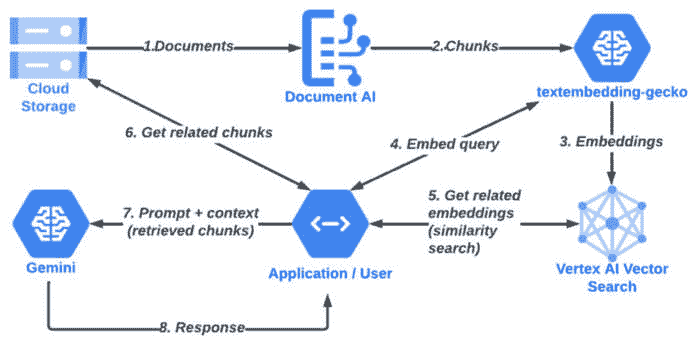
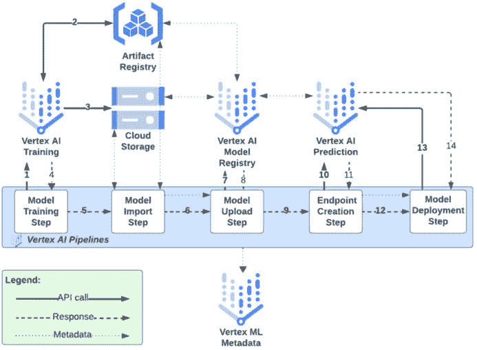
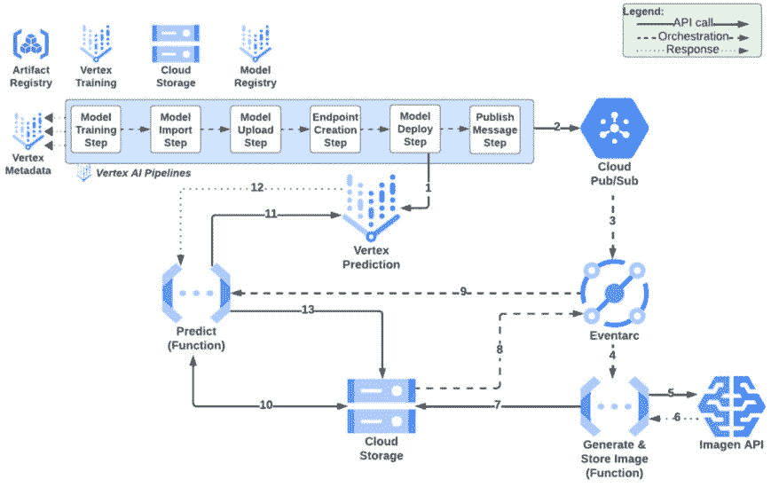

# 18

# 将一切整合：使用 Google Cloud 和 Vertex AI 构建机器学习解决方案

你终于做到了！这是我们书籍的最后一章。在本章中，我们将通过构建几个示例解决方案来整合本书中学到的主题，这些解决方案结合了我们在整本书中讨论的多个概念和 Google Cloud 服务。本章主要关注构建解决方案，因此文本内容将相对较少，主要活动将在章节附带的 Jupyter Notebook 文件中概述。

本章我们将构建两个解决方案：第一个将更深入地探讨**检索增强生成**（**RAG**），第二个将是一个端到端解决方案，它结合了传统的**机器学习**（**ML**）、MLOps 和生成式 AI。

本章的主题如下：

+   逐步构建 RAG 实现组件

+   一个示例商业用例和参考架构

+   构建和实施用例

+   回顾与下一步

在深入探讨架构细节之前，我们需要执行一个快速先决步骤，以在我们的 Google Cloud 项目中设置所需的环境设置。

# 先决条件

本节描述了我们需要执行的步骤，以便为本章后面的实施步骤设置我们的环境。

注意

在本书的*第四章*中，我们在 Cloud Shell 环境中创建了一个本地目录，并将我们的 GitHub 仓库克隆到该目录中。如果您没有执行这些步骤，请现在参考名为 *创建目录和克隆我们的 GitHub 仓库* 的*第四章*中的说明。

当您确保本书的 GitHub 仓库已克隆到您的 Cloud Shell 环境中的本地目录后，继续执行本节中的先决步骤。

## 使用 Google Cloud Shell

我们将使用 Google Cloud Shell 来执行本节的活动。您可以通过点击 Google Cloud 控制台屏幕右上角的 Cloud Shell 图标来访问它，如*图 18.1*所示。


图 18.1：激活 Cloud Shell

如*图 18.1*所示打开 Google Cloud Shell，并执行以下步骤：

1.  将目录更改为存储本章代码的位置：

    ```py
    cd ~/packt-ml-sa/Google-Machine-Learning-for-Solutions-Architects/Chapter-18/prereqs/
    ```

1.  运行 `chapter-18-prereqs.sh` 脚本：

    ```py
    bash chapter-18-prereqs.sh
    ```

1.  如果您被提示授权 Cloud Shell，请点击**授权**。

    该脚本代表我们执行以下步骤：

    1.  授予我们的项目默认 Compute Engine 服务帐户（我们的 Jupyter Notebook、Cloud Functions 和其他组件使用此服务帐户）**Eventarc 事件接收器** IAM 角色。如果您想使用除默认 Compute Engine 服务帐户之外的其他服务帐户，则需要将**Eventarc 事件接收器** IAM 角色授予该服务帐户。

    1.  授予我们的项目 Pub/Sub 服务代理的**服务账户令牌创建者** IAM 角色。这在我们在本章后面使用 Pub/Sub 时是必需的。

现在所有先决条件都已完成，我们可以继续本章的主要内容。我们将首先关注的是逐步构建一个 RAG 实现。

# 逐步构建 RAG 实现

在*第十七章*中，我们使用 Vertex AI Search 实现了一个 RAG 解决方案。我解释说，Vertex AI Search 使整个过程变得非常简单，因为它抽象掉了过程中的步骤，例如对内容进行块化和嵌入，并在幕后为我们执行所有这些步骤。还有一些流行的框架，如 LlamaIndex，有助于简化 RAG 实现，Vertex AI 还推出了一个基础服务（Vertex AI Grounding），您可以使用它将来自生成模型的响应与 Google 搜索的结果或您自己的数据（使用上述 Vertex AI Search 解决方案）进行关联。在本节中，我们将更深入地探讨这个过程，并逐步构建一个 RAG 解决方案。在我们深入解决方案架构之前，我们将介绍一些在*第十七章*中抽象掉的概念，特别是关于**标记**和**块**的概念。

## 标记和块

在本节中，我们将讨论标记和块的概念，从标记开始。

### 标记

LLMs 通常与标记而不是单词一起工作。例如，在处理文本时，标记通常表示单词的子部分，标记化可以以不同的方式进行，例如通过字符分割文本，或使用基于子词的标记化（例如，“unbelievable”这个词可以分解成子词如“un”，“believe”，“able”）。

标记的确切大小和定义会根据不同的标记化方法、模型、语言和其他因素而有所不同，但使用子词标记化器对英文文本进行标记时，平均每个标记大约有四个字符。

接下来，让我们讨论一下“块”的概念。

### 块

在创建嵌入时，我们通常将文档分解成块，然后为这些块创建嵌入。同样，这可以通过不同的方式完成，使用不同的工具。在本章附带的 Jupyter Notebook 文件中，我们使用 Google Cloud Document AI 将我们的文档分解成块。

为了这个目的，我们需要为我们的 Document AI 处理器指定的一个参数是使用的块大小，这在此情况下是通过每个块的标记数来衡量的。你可能需要尝试这个参数的值，以找到最适合你用例的块大小（例如，基于文档部分的长度和结构）。我们通常希望我们的块能够捕捉到一定程度的语义粒度，但在这种粒度方面存在权衡。例如，较小的块可以捕捉到更细粒度的语义上下文并提供更精确的搜索结果，但可能在处理上效率较低。我们还需要确保块大小在所使用的嵌入模型的输入长度限制内，以避免可能的截断。一个好的做法是从一个适中的块大小开始，并根据它如何满足我们的需求进行调整。

幸运的是，Document AI 可以自动根据布局处理块分割，即使你没有指定预配置的块大小，这在你不知道使用什么块大小时可能很有帮助。

现在我们已经涵盖了这些概念，让我们深入了解本章我们将构建的 RAG 实现的架构。

## 示例 RAG 解决方案架构

在本节中，我们将回顾我们示例 RAG 实现的架构。所提出的解决方案架构显示在*图 18.2*中。



图 18.2：在 Google Cloud 上逐步展示的 RAG 解决方案

你可以看到，在*图 18.2*中的一些步骤之间，**Google Cloud Storage**（**GCS**）被用来存储每个步骤的输入和输出，但这些中间过程被省略以使图表更易于阅读。此外，当我们在这个章节伴随的 Jupyter Notebook 中实现此解决方案时，笔记本是协调整个过程中每个步骤的应用程序/用户。

*图 18.2*中展示的解决方案步骤描述如下：

1.  我们存储在 GCS 中的文档被发送到 Google Cloud Document AI 进行块分割。正如其名所示，块分割过程将文档分割成块，这些块是文档的较小部分。这是为了创建标准大小的块，作为下一步嵌入过程的输入。块的大小在 Document AI 中是可配置的，关于此过程的更多细节将在稍后描述。

1.  这些块随后被发送到 Google Cloud 文本嵌入 LLM 以创建块的嵌入。生成的嵌入存储在 GCS 中，与各自的块一起（此步骤在图中省略）。

1.  我们创建一个 Vertex AI Vector Search 索引，并将嵌入从 GCS 摄入到 Vertex AI Vector Search 索引中（图中省略了 GCS 中间步骤）。

1.  然后，应用程序/用户提出一个问题，该问题与我们的文档内容相关。该问题作为查询发送到 Google Cloud 文本嵌入 LLM 进行嵌入/向量化。

1.  将向量化的查询用作请求 Vertex AI 向量搜索的输入，以搜索我们的索引以找到相似的嵌入。记住，嵌入代表语义意义的一个元素，因此相似的嵌入具有相似的意义。这就是我们如何执行语义搜索以找到与我们的查询相似的嵌入。

1.  接下来，我们从 Vertex AI 向量搜索查询返回的嵌入中找到与这些嵌入相关的 GCS 中的块（记住，我们解决方案中的**步骤 2**创建了一个块和嵌入的存储关联）。

1.  现在，终于到了向 Gemini 发送提示的时候了。从**步骤 6**检索到的文档块作为提示的上下文。这有助于 Gemini 根据我们文档中的相关内容来响应我们的提示，而不仅仅是基于其预训练的知识。

    Gemini 对提示做出响应。

既然我们已经走过了这个过程中的步骤，我们就来实施这个解决方案吧！

## 在 Google Cloud 上构建 RAG 实现

要构建我们的解决方案，请打开与本章一起提供的 Jupyter Notebook 文件，并执行该文件中描述的活动。我们可以使用在*第十四章*中创建的相同的 Vertex AI Workbench 实例来完成此目的。请在笔记本实例上打开 JupyterLab。在屏幕左侧的目录浏览器中，导航到 `Chapter-18` 目录并打开 `rag.ipynb` 笔记本文件。您可以选择 Python (local) 作为内核。同样，您可以通过选择单元格并在键盘上按 *Shift* + *Enter* 来运行笔记本中的每个单元格。除了相关代码外，笔记本文件还包含描述代码正在做什么的 markdown 文本。

当您完成笔记本中的步骤后，您将正式构建自己的 RAG 解决方案——干得好！

注意，在这种情况下，我们使用存储在 GCS 中的文档作为我们的真相来源，但我们也可以使用其他数据，例如存储在 BigQuery 中的数据。

文档引用

为了保持一致性和可比性，我们将使用我们在*第十七章*中 RAG 实现中使用的相同参考文档之一，如下所示：

*Hila Zelicha, Jieping Yang, Susanne M Henning, Jianjun Huang, Ru-Po Lee, Gail Thames, Edward H Livingston, David Heber, and Zhaoping Li, 2024\. Effect of cinnamon spice on continuously monitored glycemic response in adults with prediabetes: a 4-week randomized controlled crossover* *trial. DOI:https://doi.org/10.1016/j.ajcnut.2024.01.008*

接下来，我们将构建一个更广泛的解决方案，将本书中许多主题汇集在一起。我将首先解释用例。

# 一个示例商业用例和参考架构

我们将关注一个**计算机视觉**（**CV**）用例，用于识别图像中的对象。扩展我们在*第十五章*中实现的 CV 用例，我们将通过一个 MLOps 管道构建我们的 CV 模型，该管道结合了本书早期章节中的大多数主要主题，例如以下内容：

+   数据准备、清理和转换

+   模型训练、部署、推理和评估

我们在这里采用的新颖方法是利用生成式 AI 生成用于测试和评估我们模型的数据。在我们开始构建之前，我将介绍为什么我选择将这个用例作为示例的额外背景。

## 关于我们用例的额外背景

在整本书中，有一个主题比其他任何主题出现得更频繁：数据往往是训练高质量机器学习模型最重要的因素。没有足够的数据，你的机器学习项目将不会成功。我们讨论过获取足够的数据往往很困难，而且随着模型平均规模的增加，这个挑战正变得越来越普遍（今天的模型拥有万亿级别的参数，需要巨大的数据量）。我们还讨论过世界上数据是有限的，但一个可以帮助解决这个挑战的机制是创建合成数据和使用生成式 AI 模型来生成新数据。本节中我概述的使用案例结合了传统机器学习模型开发生命周期中的所有步骤，并将过程扩展到包括生成可用于测试我们模型的测试数据。在下一小节中，我将描述这个解决方案的架构。

## 参考架构

本节概述了我们将要构建的解决方案架构的组件。除了 Vertex AI 组件外，参考架构还将其他 Google Cloud 服务纳入范围，以构建整体解决方案，例如 Google Cloud Functions、Pub/Sub、Eventarc 和 Imagen。我们最初在本书的*第三章*中介绍了并描述了所有这些 Google Cloud 服务。如果您不熟悉它们，我建议您从那一章中复习相关知识。

我们解决方案的起点是一个 MLOps 管道，该管道将训练和部署我们的 CV 模型，我将在稍后详细描述。生成的模型随后被用于更广泛的架构中，以实现整体解决方案。我将首先概述 MLOps 管道。

关于数据集（CIFAR-10）的说明

在我们的模型训练和评估代码中，我们使用一个叫做**CIFAR-10**（**加拿大高级研究研究所，10 个类别**）的数据集，这是一个 CV 和图像分类中常用的基准数据集。它包含属于十个不同类别的 60,000 个彩色图像：飞机、汽车、鸟、猫、鹿、狗、青蛙、马、船和卡车。每个图像具有固定的 32x32 像素大小，图像存储在 RGB 颜色空间中，这意味着每个像素由三个值表示，分别对应红色、绿色和蓝色颜色通道。当我们想在推理时将生成数据发送到我们的模型时，这些细节非常重要。

CIFAR-10 数据集因其常用于 CV 模型的基准测试而被广泛使用，它包含在 Tensorflow/Keras 的内置数据集模块中。这意味着我们可以通过简单地导入该模块来使用它，而无需从外部源下载数据。

### 我们的 MLOps 流水线

本节将介绍我们 MLOps 流水线中实现的步骤，如图*图 18.3*所示。



图 18.3：CV 模型的 MLOps 流水线

在*图 18.3*中，过程如下所示：

1.  我们流水线中的第一步——模型训练步骤被调用。虽然我们为表格形式的 Titanic 数据集在*第十一章*中构建的 MLOps 流水线从使用 Serverless Spark 在 Dataproc 中的独立数据预处理步骤开始，但在本章的流水线中，数据摄取和准备步骤直接在我们的模型训练作业代码中处理。此外，正如所注，在这种情况下，我们使用 Tensorflow/Keras 内置的 CIFAR-10 图像数据集，而不是从外部源获取数据集。Vertex AI 流水线通过向 Vertex AI 训练服务提交模型训练作业来启动模型训练过程。

1.  为了执行我们的自定义训练作业，Vertex AI 训练服务从 Google Artifact Registry 获取我们的自定义 Docker 容器。

    当我们的模型训练完成后，训练好的模型工件将被保存在 GCS 中。

    模型训练作业状态已完成。

1.  我们流水线中的下一步——模型导入步骤被调用。这是一个中间步骤，它准备模型元数据，以便在流水线的后续组件中引用。在这种情况下，相关的元数据包括模型工件在 GCS 中的位置以及用于服务我们的模型的 Google Artifact Registry 中 Docker 容器镜像的规范。

1.  我们流水线中的下一步——模型上传步骤被调用。这一步骤引用了模型导入步骤中的元数据。

1.  模型元数据被用于在 Vertex AI 模型注册表中注册模型。这使得在 Vertex AI 中部署我们的模型以处理服务流量变得容易。

    模型上传作业状态已完成。

1.  我们流水线中的下一步——端点创建步骤被调用。

1.  在 Vertex AI 预测服务中创建了一个端点。这个端点将用于托管我们的模型。

    端点创建作业状态已完成。

1.  我们流程中的下一步——模型部署步骤被调用。

1.  我们的模型已部署到 Vertex AI 预测服务中的端点。这一步骤引用了我们流程刚刚创建的端点元数据，以及 Vertex AI 模型注册表中我们的模型元数据。

    模型部署作业状态已完成。

现在我们已经走过了模型训练和部署流程的步骤，我将开始概述本章中我们将构建的更广泛的解决方案架构，其中我们的 MLOps 流程只是其中的一部分。

### 端到端解决方案

我们将构建一个事件驱动架构，这是开发旨在自动响应事件或一系列事件的无服务器解决方案的流行模式。这是包含本书中我们讨论的大多数主题的端到端解决方案，如**图 18.4**所示。



图 18.4：端到端解决方案

在**图 18.4**中，我们的 MLOps 流程在图的上左角被简化。它仍然实现了我们在上一节中讨论的所有相同步骤，但图被简化了，这样我们就可以将讨论的重点放在更广泛的端到端解决方案上。在这种情况下，MLOps 流程在整体过程中被表示为一个单独的步骤。

注意，Eventarc 在我们的解决方案中占有一席之地，因为它是编排基于事件架构中步骤的主要机制。在伴随本章的 Jupyter Notebook 文件中，我将更详细地解释 Eventarc 在幕后是如何配置的。

以下步骤描述了*图 18.4*中实现的架构：

1.  我们的 MLOps 流程训练并部署我们的 CV 模型。

1.  当 MLOps 流程完成时，它将消息发布到我们为此目的创建的 Pub/Sub 主题。

1.  Eventarc 检测到已向 Pub/Sub 主题发布了一条消息。

1.  Eventarc 触发我们创建的用于生成图像的 Cloud Function。

1.  我们图像生成函数中的代码调用 Imagen API，并带有提示以生成包含模型训练以识别的一种对象类型的图像（CIFAR-10 数据集支持的对象类型）。

1.  Imagen 生成一个图像并将其返回到我们的函数中。

1.  我们的功能将新图像存储在 GCS 中。

1.  GCS 发出一个事件，指示已将新对象上传到我们的存储桶。Eventarc 检测到这个事件。

1.  Eventarc 调用我们的下一个 Cloud Function，并将 GCS 事件元数据传递给我们的函数。这些元数据包括诸如存储桶和对象的标识符等详细信息。

1.  我们的预测函数从事件元数据中获取有关存储桶和所涉及对象的详细信息，并使用这些详细信息来获取新创建的对象（即，从 Imagen 生成的新的图像）。

1.  我们预测函数随后对图像进行一些预处理，将其转换为模型期望的格式（即，类似于模型训练时所使用的 CIFAR-10 数据的格式）。然后，我们的函数将转换后的数据作为预测请求发送到托管我们模型的 Vertex AI 端点。

1.  我们的模型预测图像中包含的对象类型，并将预测响应发送到我们的 Cloud Function。

1.  我们的 Cloud Function 将预测响应保存到 GCS。

当过程完成后，您可以在 GCS 中查看生成的图像和模型的结果预测。

注意，解决方案中的所有步骤都是自动实现的，无需配置任何服务器。这是一个完全无服务器、事件驱动的解决方案架构。

这个解决方案的一个有趣的副作用是，尽管主要目的是在生成数据上测试我们新训练的模型，但此解决方案也可以应用于逆向用例。也就是说，如果我们对我们的模型已经有效训练并提供了持续准确的结果有信心，我们可以使用它来评估生成数据的质量。例如，如果我们的模型预测生成数据包含特定类型的对象，概率为 99.8%，我们可以将其解释为生成数据质量的反映。

既然我们已经讨论了过程中的各个步骤，让我们开始构建它！

# 在 Google Cloud 上构建和实施用例

要构建我们的解决方案，请打开本章附带的 Jupyter Notebook 文件，并执行该文件中描述的活动。我们可以使用在 *第十四章* 中创建的相同的 Vertex AI Workbench 实例来完成此目的。请在笔记本实例上打开 JupyterLab。在屏幕左侧的目录浏览器中，导航到 `Chapter-18` 目录并打开 `end-to-end-mlops-genai.ipynb` 笔记本文件。您可以选择 Python (local) 作为内核。同样，您可以通过选择单元格并在键盘上按 *Shift* + *Enter* 来运行笔记本中的每个单元格。除了相关代码外，笔记本文件还包含描述代码正在做什么的 Markdown 文本。

如果你已经遵循了所有实际步骤并成功构建了解决方案，那么是时候给自己一个热烈的掌声了。让我们花点时间反思一下你所做的事情。你成功构建并执行了一个 MLOps 管道，该管道训练和部署了一个实现 CV 用例的 Keras 卷积神经网络。然后，你使用多种 Google Cloud 服务构建了一个完全无服务器、事件驱动的解决方案架构。这绝对是一件值得骄傲的事情！

当我们接近本章和本书的结尾时，让我们总结一下我们学到了什么，并讨论如何在这个领域继续学习。

# 概述和下一步

在本章中，我们结合了本书中涵盖的大多数重要概念，并解释了它们是如何相互关联的。我们通过构建包含我们讨论的许多主题和 Google Cloud 产品的解决方案来实现这一点。

首先，你逐步构建了一个 RAG 实现，在这个过程中，你专注于结合各种生成式 AI 概念，例如使用 Google Cloud Document AI 将文档分割成块，同时保留原始文档的层次结构。这个解决方案还包括使用 Google Cloud 文本嵌入 LLM 为文档块创建嵌入，并使用 Vertex AI Vector Search 存储和索引这些嵌入。你使用这个解决方案来实现了一个与 Gemini 结合的问题回答用例，将答案基于文档内容。为此，你使用 Google Cloud 文本嵌入 LLM 创建提示问题的嵌入，并使用这些嵌入在 Vertex AI Vector Search 中执行语义相似度搜索，以找到与文档特定块相关的相似嵌入。然后，将这些块作为上下文提供，当向 Gemini 发送请求时。

接下来，你构建了一个结合了本书中许多主题的解决方案，包括传统模型开发生命周期的所有步骤，以及生成式 AI 和更广泛解决方案架构的概念。这导致了一个完全自动化、无服务器、事件驱动的解决方案，其中包含了多个 Google Cloud 服务，如 Google Cloud Functions、Pub/Sub、Eventarc 和 Imagen。

我们在这本书中确实涵盖了大量的主题，学习之旅永远不会结束。让我们通过讨论如何在 Google Cloud 解决方案架构、机器学习和生成式 AI 领域继续你的学习之旅来结束这一部分。

## 下一步

本书所讨论的技术领域正以越来越快的速度发展，每天都有新的框架和模式出现，其中生成式 AI 可以说是发展最快的领域之一。例如，除了本书中讨论的流行 LangChain 框架，它还可以在 Vertex AI 推理引擎中实现为托管体验之外，这些框架的扩展，如 LangGraph、LangSmith 以及许多其他扩展也不断涌现，为构建生成式 AI 解决方案和应用提供了额外的功能和灵活性。由于这一领域的发展速度不断加快，以及整体上的兴奋情绪，新的学习资源将持续出现。除了与本书相关的 GitHub 仓库之外，许多其他示例仓库提供了关于如何实现各种模式的宝贵教程。其中最有价值的当然是官方 Vertex AI 示例仓库，您可以通过以下链接访问：

[`github.com/GoogleCloudPlatform/vertex-ai-samples`](https://github.com/GoogleCloudPlatform/vertex-ai-samples)

我还发现[langchain.com](http://langchain.com)上提供的信息是一个有用的学习资源，我强烈推荐您参考 Google Cloud 解决方案中心中的示例架构用例，您可以通过以下链接访问：

[`solutions.cloud.google.com/`](https://solutions.cloud.google.com/)

在我们结束之前，请记住，本书中使用的实际练习和笔记本在 Google Cloud 上创建了资源，这可能会产生费用。因此，我建议您回顾本书中执行的所有实际步骤，并确保如果您不再计划使用它们，则删除所有资源。与本书相关的 GitHub 仓库包含删除模型、端点和数据存储等资源的方法。对于其他类型的资源，请参阅 Google Cloud 文档，以确保删除相关资源。

我在撰写这个最后一部分时，感到一种悲伤，因为我们共同的经历即将结束，我想感谢您与我一起踏上这段旅程。如果您已经阅读到本书的这一部分，那么您已经获得了 AI/ML、生成式 AI、Google Cloud 和解决方案架构的专家知识，并且您现在对这些主题的了解比世界上大多数人都多！恭喜您，做得好！我祝愿您在未来的 AI 冒险中一切顺利，并希望您能运用您的知识和技能取得美好的成就！
