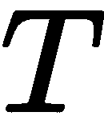

# 如何解决所有机器学习问题

欢迎阅读《Go Machine Learning Projects》这本书。

这是一本相当奇特的书。它不是一本关于**机器学习**（**ML**）如何工作的书。事实上，最初的决定是我们将假设读者熟悉我在这些章节中将要介绍的**机器学习**（**ML**）算法。这样做会得到一本相当空洞的书，我担心。如果读者知道 ML 算法，接下来要做的就是简单地将 ML 算法应用于问题的正确上下文中！这本书的 10 章左右的内容可以在不到 30 页内完成——任何为政府机构撰写过拨款报告的人都会有这样的写作经验。

那么，这本书将要讲述些什么呢？

这本书将要讲述的是在特定的问题上下文中应用 ML 算法。这些问题是具体的，由我一时兴起指定的。但是，为了探索 ML 算法应用于问题的途径，读者必须首先熟悉算法和问题！因此，这本书必须在理解问题和理解解决问题的具体算法之间找到一个非常微妙的平衡。

但在我们走得太远之前，什么是问题？当我提到*算法*时，我指的是什么？还有这个*机器学习*是怎么回事？

# 什么是问题？

在日常用语中，问题是要克服的事情。当人们说他们有金钱问题时，问题可能仅仅通过拥有更多的钱就能解决。当某人有一个数学问题时，问题可能通过数学就能解决。用来克服问题的东西或过程被称为**解决方案**。

到目前为止，我定义一个常见的词可能看起来有点奇怪。啊，但为了用机器学习解决问题，需要精确和清晰的思维。你必须精确地知道你到底在尝试解决什么。

问题可以被分解为子问题。但到了某个点，进一步分解这些问题就不再有意义了。我向读者提出，世界上有不同类型的问题。问题的类型如此之多，以至于不值得一一列举。尽管如此，问题的紧迫性应该被考虑。

如果你正在构建一个照片组织工具（也许你打算与谷歌照片或 Facebook 竞争），那么在照片中识别人脸的紧迫性不如知道照片存储在哪里以及如何检索照片。如果你不知道如何解决后者，那么解决前者所需的所有知识都将浪费。

我认为，尽管紧迫性具有主观性，但在考虑更大问题的子问题时，紧迫性是一个很好的衡量标准。使用一些更具体的例子，考虑三种都需要某种机器学习解决方案的场景，但所需的解决方案的紧迫性不同。这些例子明显是虚构的，与现实生活关系不大。它们全部的目的只是为了说明一个观点。

首先，考虑一个房地产智能业务。整个业务的生存依赖于能否正确预测即将出售的房屋价格，尽管也许他们还通过某种形式的二级市场赚钱。对他们来说，面临的机器学习问题是**紧迫**的。他们必须完全理解解决方案的来龙去脉，否则他们可能会面临倒闭的风险。在流行的紧迫性/重要性划分中，机器学习问题也可以被认为是**重要**且**紧迫**的。

其次，考虑一个在线超市。他们想知道哪些产品组合的销售最好，以便他们可以捆绑销售以更具竞争力。这并不是核心业务活动，因此他们面临的机器学习问题比前一个例子不那么紧迫。了解解决方案的工作原理是必要的。想象一下，他们的算法说他们应该将腹泻药物与他们的自有品牌食品产品捆绑销售。他们需要能够理解解决方案是如何得出这个结论的。

最后，考虑前面提到的照片应用程序。面部识别是一个很好的**额外**功能，但不是主要功能。因此，在三个问题中，机器学习问题最不紧迫。

不同的紧迫性会导致在解决问题时产生不同的需求。

# 什么是算法？

前一节在术语*算法*的使用上相当勤奋。在这本书中，这个术语被广泛使用，但总是谨慎使用。但什么是算法？

要回答这个问题，首先，我们必须先问，什么是程序？程序是一系列由计算机执行的步骤。算法是一套解决问题的规则。因此，机器学习算法是一套解决问题的规则。它们作为程序在计算机上实现。

对于我来说，真正深入理解算法究竟是什么的一个启发性的时刻是大约 15 年前的一次经历。我在一个朋友家过夜。我的朋友有一个七岁的孩子，朋友在试图让孩子学习编程时感到非常沮丧，因为孩子太固执，不愿意学习语法规则。我推测，根本原因在于孩子没有理解算法的概念。所以第二天早上，我们让孩子自己准备早餐。但他不是自己准备早餐。他需要写下一系列步骤，他的母亲必须严格按照这些步骤执行。

早餐很简单——一碗牛奶玉米片。然而，孩子尝试了十一次才得到一碗谷物食品。结果是泪水、大量的牛奶和谷物食品洒在台面上，但对孩子来说，这是一次很好的学习。

这可能看起来像是任意的儿童虐待，但这也对我大有裨益。特别是，孩子对他的母亲和我（用概括的方式）说：“但你已经知道如何制作谷物食品；为什么你需要指令来做这件事？”他的母亲回答：“把这看作是教我如何制作电脑游戏。”这里有一个关于算法的元概念。那个指导如何制作谷物食品的孩子正在教孩子如何编程；本身就是一个算法！

机器学习算法可以指被学习的算法，或者指教机器使用正确算法的算法。在这本书的大部分内容中，我们将指后者，但将前者视为一种精神锻炼也是很有用的。自从图灵以来，我们可以用机器来代替算法。

在阅读以下部分之后，花些时间通读这些句子。这有助于在第二次阅读时澄清我的意思。

# 什么是机器学习？

那么，什么是机器学习（ML）？正如这个词可能暗示的，它是做某事的机器学习。机器不能像人类那样学习，但它们确实可以模仿人类学习的一些部分。但它们应该学习什么呢？不同的算法学习不同的事情，但共同的主题是机器学习一个程序。或者用不那么具体的话来说，机器学习如何*做*正确的事情。

那么，什么是正确的事情？不想打开一个哲学的罐头，正确的事情是我们作为计算机的人类程序员定义的正确的事情。

机器学习系统有多种分类方案，但在最常见的分类方案中，是将机器学习分为两种类型：监督学习和无监督学习。在这本书的整个过程中，我们将看到这两种类型的例子，但在我看来，这种分类形式完全属于“知道好但操作上不重要”的大脑领域。我之所以这么说，是因为除了少数著名的算法之外，无监督学习仍然非常活跃地处于研究之中。监督学习算法也是如此，但它们在工业界的使用时间比无监督学习算法要长。这并不是说无监督学习没有价值——一些已经从学术象牙塔中走出来，并被证明非常有用。我们将在其中一章中探讨**K-means**和**k-最近邻**（**KNN**）。

让我们假设现在我们有一个机器学习算法。这个算法是一个黑盒——我们不知道里面发生了什么。我们给它一些数据。然后通过其内部机制，它产生一个输出。输出可能不正确。所以它会检查输出是否正确。如果输出不正确，它会改变其内部机制，并一次又一次地尝试，直到输出正确。这就是机器学习算法通常是如何工作的。这被称为**训练**。

当然，有关于“正确”含义的概念。在监督学习的情况下，我们人类向机器提供正确数据的示例。在无监督学习的情况下，正确性的概念依赖于其他指标，如值之间的距离。每个算法都有其特定的细节，但一般来说，机器学习算法正如描述的那样。

# 你需要机器学习吗？

可能最令人惊讶的问题是，你是否需要机器学习来解决你的问题。毕竟，这个章节的这一节是第四部分，有一个很好的理由——我们必须了解问题究竟是什么；在提出问题之前，我们必须了解算法是什么：你是否需要机器学习？

当然，首先要问的问题是：你有没有需要解决的问题？我假设答案是肯定的，因为我们生活在这个世界上，是这个世界的一部分。即使是苦行僧也有需要解决的问题。但也许问题应该更具体：你有没有可以用机器学习解决的问题？

我咨询过很多次，在我咨询的早期，我会毫不犹豫地接受大多数咨询请求。啊，年轻时无知所做的事情。问题往往在我答应之后出现。结果发现，许多这些咨询请求最好通过更深入地了解业务领域和更深入地了解计算机科学来解决。

经常带到我面前的一个常见问题需要信息检索解决方案，而不是机器学习解决方案。考虑以下几年前的请求：

Hi Xuanyi，

我是 XXXX。我们几个月前在 YYYY 聚会上见过面。我的公司目前正在构建一个提取实体之间关系的机器学习系统。想知道你是否愿意一起喝咖啡？

自然地，这激起了我的兴趣——关系抽取是机器学习中一个特别具有挑战性的任务。我那时年轻，对解决难题充满热情。所以我坐下来与公司一起工作，根据表面信息确定需要什么。我提出了几个模型，所有这些模型都受到了热情的欢迎。我们最终确定了一个基于 SVM 的模型。然后我开始着手工作。

任何机器学习项目的第一步是收集数据。所以我做了。令我惊讶的是，数据已经被整齐地分类，实体已经被识别。此外，实体之间有一种静态的、不变的关系。一种类型的实体将与另一种类型的实体保持永久的关系。那么机器学习问题是什么？

在收集了一个半月的数据之后，我提出了这个问题。发生了什么？我们有干净的数据，我们有干净的关系。所有新的数据都有干净的关系。机器学习的需求在哪里？

后来发现，数据来自手动数据输入，这在当时是法律要求的。实体关系被相当严格地定义。他们真正需要的数据要求只是一个清理过的数据库实体关系图。因为他们的数据库结构如此复杂，他们实际上看不到他们真正需要做的是定义一个外键关系来强制关系。当我要求数据时，数据是从单个 SQL 查询中获得的。根本不需要机器学习！

他们的数据库管理员（DBA）值得赞扬，他们的 DBA 一直在说。

这给了我一个教训：在花费时间工作之前，一定要弄清楚某人是否真的需要机器学习解决方案。

我已经确定了一种非常简单的方法来判断某人是否需要机器学习。这些是我的经验法则

1.  这个问题能否以这样的形式表达：“给定 X，我想预测 Y”

1.  一个“是什么”的问题通常是有问题的。一个“是什么”问题看起来像这样：“我想知道 XYZ 产品的转化率是多少”

# 一般的问题解决过程

只有当一般性的经验法则得到满足时，我才会进一步参与。对我来说，一般的问题解决过程如下：

1.  明确识别问题。

1.  将问题转化为更具体的状态。

1.  收集数据

1.  进行探索性数据分析

1.  确定正确的机器学习解决方案

1.  建立模型。

1.  训练模型。

1.  测试模型。

在本书的各章节中，将遵循上述模式。探索性数据分析部分将只在前几章中进行。这隐含着这些工作会在后面的章节中完成。

我试图在章节标题中清楚地说明我们试图解决什么问题，但写作是一项困难的任务，所以我可能遗漏了一些。

# 什么是模型？

**所有模型都是错误的；但有些是有用的**。

现在如果任何存在于现实世界中的系统能够被任何简单的模型**精确**地表示，那将是非常了不起的。然而，巧妙选择的简约模型通常确实提供了非常有用的近似。例如，通过常数 R 关联压力、体积和温度的“理想”气体的定律对于任何真实气体来说并不完全正确，但它经常提供有用的近似，而且它的结构是有启发性的，因为它源于对气体分子行为的物理观点。

对于这样的模型，没有必要问“模型是否正确？”如果“真理”是“全部真理”，那么答案必须是“不”。唯一有趣的问题是“模型是否具有启发性和实用性？”

- 乔治·博克斯（1978 年）

模型火车是一种相当常见的爱好，尽管像《生活大爆炸》这样的节目对其进行讽刺。模型火车不是真正的火车。首先，尺寸不同。模型火车的运作方式并不完全像真正的火车。模型火车有不同等级，每个等级都比前一个更接近实际火车。

在这个意义上，模型是现实的表示。我们用什么来表示它？总的来说，是数字。模型是一组描述现实的数字，还有更多。

每次我试图解释什么是模型时，我不可避免地会得到类似“你不能把我们简化为一堆数字！”这样的回应。那么我所说的“数字”是什么意思呢？

考虑以下直角三角形：


我们如何描述**所有**直角三角形？我们可能会这样说：


这意味着直角三角形中所有角度的总和为 180 度，并且存在一个 90 度的角度。这足以描述笛卡尔空间中的**所有**直角三角形。

但是，描述的是三角形本身吗？不是的。自从亚里士多德时代以来，这个问题一直困扰着哲学家。我们不会进入哲学讨论，因为这样的讨论只会延长本章的痛苦。

因此，在本章的用途中，我们将说，模型是描述现实的值，**以及**产生这些值的算法。这些值通常是数字，尽管它们也可能是其他类型。

# 什么是好的模型？

模型是一组描述世界的值，以及产生这些值的程序。这一点，我们从上一节中得出结论。现在我们必须对模型进行一些价值判断——模型是好是坏。

一个好的模型需要准确地描述世界。这是以最通用的方式表达的。这样描述，关于一个好的模型的说法涵盖了多个概念。我们必须使这个抽象的想法更加具体，以便继续前进。

机器学习算法是在大量数据上训练的。对机器来说，这堆数据就是世界。但对我们来说，我们为训练机器提供的数据并不是世界。对我们人类来说，世界比机器可能知道的要复杂得多。所以当我说“一个好的模型需要准确地描述世界”时，这里的“世界”有两个含义——机器所知道的世界，以及我们所知道的世界。

机器只看到了我们所知道的世界的一部分。有些世界的一部分机器没有看到。因此，当机器能够为它尚未看到的输入提供正确的输出时，它就是一个好的机器学习模型。

作为具体的例子，让我们再次假设我们有一个机器学习算法，该算法用于确定一张图片是否是热狗。我们向模型提供热狗和汉堡的图片。对机器来说，世界仅仅是热狗和汉堡的图片。当我们输入蔬菜的图片时会发生什么？一个好的模型能够**泛化**并说这不是热狗。一个差的模型会直接崩溃。

因此，通过这个类比，我们定义了一个好的模型，即能够很好地泛化到未知情况。

通常，作为构建机器学习系统过程的一部分，我们可能想要对这个概念进行测试。因此，我们必须将我们的数据集分成测试集和训练集。机器将在训练集上训练，为了测试模型在训练完成后有多好，我们将测试集输入到机器中。当然，假设机器从未见过测试集。因此，一个好的机器学习模型应该能够为测试集生成正确的输出，尽管它从未见过它。

# 关于写作和章节组织

关于本书的写作。正如你可能已经猜到的，我决定采用更口语化的语气。我发现这种语气对那些可能被机器算法吓到的读者来说更友好。如果你还没有注意到，我在写作中也很有自己的观点。我努力通过我的写作阐明什么是事实，什么是应该做的。应用休谟的划分标准由读者自行决定。但作为一个快速指南，当我们谈论算法及其工作原理时，它们是“是”的陈述。当我们谈论应该做什么，以及代码的组织时，它们是“应该”的陈述。

本书章节的设计中存在两种一般模式。首先，随着章节的进行，问题会变得越来越难。其次，有人可能希望将章节心理上分为三个不同的部分。第一部分——第二章，*线性回归 - 房价预测*，第三章，*分类 - 垃圾邮件检测*，第四章，*使用时间序列分析分解 CO2 趋势*，第七章，*卷积神经网络 - MNIST 手写识别*，第八章，*基本人脸检测*）对应于那些有紧急机器学习问题需求的读者。第二部分——第五章，*通过聚类推文清理个人 Twitter 时间线*，第九章，*热狗还是不是热狗 - 使用外部服务*，第六章，*神经网络；MNIST 手写识别*，第七章，*卷积神经网络 - MNIST 手写识别*，第八章，*基本人脸检测*）是为那些有类似第二个例子中机器学习问题的人准备的。第三部分，最后两章，是为那些机器学习问题不那么紧急但仍需要解决方案的人准备的。

到第八章，*基本人脸检测*，为止，对于每一章，通常会有一个或两个专门用于解释算法本身的章节。我坚信，如果不至少对所使用的算法有一个基本理解，就无法编写出任何有意义的程序。当然，你可以**使用**别人提供的算法，但如果没有恰当的理解，它就是**无意义的**。有时无意义的程序可能会产生结果，就像有时大象似乎知道如何做算术，或者宠物狗似乎能完成复杂的动作，比如说话。

这也意味着我可能听起来对某些想法相当轻视。例如，我对使用机器学习算法来预测股价持轻视态度。我不相信这样做将是一项富有成效的努力，因为我对生成股市价格的基本过程以及时间的影响有深刻的理解。

然而，时间会证明我是对还是错。也许有一天，有人会发明一个在动态系统上完美工作的机器学习算法，但现在还不是时候，就在这里。我们正处于计算新时代的黎明，我们必须尽力去理解事物。通常，你可以从历史中学到很多东西。因此，我也努力插入一些重要的历史轶事，说明某些事物是如何形成的。这些绝对不是全面的调查。事实上，这是没有多少规律性的。然而，我非常希望它能增加这本书的风味。

# 为什么选择 Go？

这本书是关于使用 Go 进行机器学习的书籍。Go 是一种相当有偏见的编程语言。有 Go 的方式，或者完全没有其他方式。这听起来可能有些法西斯主义，但它确实带来了一种非常愉快的编程体验。这也使得团队合作非常高效。

此外，与 Python 相比，Go 是一种相当高效的编程语言。我几乎完全转向使用 Go 来做我的机器学习和数据科学工作。

Go 还有一个好处，那就是它可以在跨平台上很好地工作。在工作时，开发者可能会选择在不同的操作系统上工作。Go 在所有这些操作系统上都能很好地工作。用 Go 编写的程序可以轻松地交叉编译到其他平台。这使得部署变得容易得多。无需使用 Docker 或 Kubernetes 进行不必要的混乱。

使用 Go 进行机器学习有缺点吗？仅作为库的作者。一般来说，**使用** Go 机器学习库是无痛的。但为了使其无痛，你必须放弃任何之前编程的方式。

# 快速开始

首先安装 Go，可以在[`golang.org`](https://golang.org)找到。它提供了关于 Go 的全面指南。现在，快速开始。

# 函数

函数是 Go 中计算任何事物的主要方式。

这是一个函数：

```py
func addInt(a, b int) int { return a + b }
```

我们调用 `func addInt(a, b int) int`，这是 **函数签名**。函数签名由函数名称、参数和返回类型组成。

函数的名称是 `addInt`。注意所使用的格式。函数名称使用驼峰式命名法——这是 Go 中名称的首选命名方式。任何名称的首字母大写，如 `AddInt`，表示它应该被导出。总的来说，在这本书中，我们不会担心导出或未导出的名称，因为我们主要会使用函数。但如果你正在编写一个包，那么这很重要。导出的名称可以在包外部访问。

接下来，请注意 `a` 和 `b` 是参数，并且它们都有 `int` 类型。我们稍后会讨论类型，但同一个函数也可以这样写：

```py
func addInt(a int, b int) int { return a + b }
```

接着，这就是函数返回的内容。这个名为 `addInt` 的函数返回一个 `int` 类型。这意味着当函数被正确调用时，就像这样：

```py
 z := addInt(1, 2) 
```

`z` 将有一个 `int` 类型。

在返回类型定义之后，`{...}` 表示函数体。当本书中提到 `"{...}"` 时，意味着函数体的内容对于当前讨论并不重要。书中可能包含一些函数体的片段，但它们没有 `func foo(...)` 的签名。再次强调，这些片段是讨论的片段。预期读者将根据书中的上下文拼凑出函数。

Go 函数可以返回多个结果。函数签名看起来可能像这样：

```py
 func divUint(a, b uint) (uint, error) { ... }
 func divUint(a, b uint) (retVal uint, err error) { ... }
```

再次强调，区别主要在于返回值的命名。在第二个例子中，返回值分别命名为 `retVal` 和 `err`。`retVal` 是 `uint` 类型，而 `err` 是 `error` 类型。

# 变量

这是一个变量声明：

```py
var a int
```

它说 `a` 是一个 `int`。这意味着 `a` 可以包含任何具有 `int` 类型的值。典型的 `int` 值可能是 `0`、`1`、`2` 等等。阅读上一句话可能看起来有些奇怪，但 “typically” 是正确使用的。所有 `int` 类型的值都是典型的 `int`。

这是一个变量声明，随后是将值放入变量中：

```py
s := "Hello World"
```

这里，我们说的是，将 `s` 定义为 `string` 类型，并让值为 `"Hello World"`。`:=` 语法只能在函数体内使用。这样做的主要原因不是让程序员不得不输入 `var s string = "Hello World"`。

关于变量使用的一个注意事项：在 Go 中，变量应该被视为带有名称的桶，它们持有值。名称的重要性在于它们向读者传达了它们应该持有的值。然而，名称并不一定需要跨越障碍。我经常用 `retVal` 命名返回值，但在其他地方会使用不同的名称。一个具体的例子如下：

```py
 func foo(...) (retVal int) { ... return retVal }
 func main() {
     something := foo()
     ...
 }
```

我已经教授编程和机器学习（ML）多年，我相信这是每个程序员都必须克服的一个障碍。学生或初级团队成员可能会对命名差异感到困惑。他们更愿意看到如下这样的东西：

```py
 func foo(...) (something int) { ... return something }
 func main() {
     something := foo()
     ...
 }
```

这是可以的。然而，严格从经验来说，这往往会削弱抽象思维能力，而抽象思维能力是一种有用的技能，尤其是在机器学习（ML）中。我的建议是，习惯于使用不同的名称，这会让你更加抽象地思考。

特别是，名称不会跨越我的朋友詹姆斯·科佩尔（James Koppel）所说的**抽象障碍**。什么是抽象障碍？函数是一个抽象障碍。函数体内发生的事情都在函数体内发生，并且不能被语言中的其他东西访问。因此，如果在函数体内命名一个值为 `fooBar`，则 `fooBar` 的含义仅在函数内部有效。

后续我们将看到另一种形式的抽象障碍——包。

# 值

值是程序处理的内容。如果你编写了一个计算器程序，那么程序中的值就是数字。如果你编写了一个文本搜索程序，那么值就是字符串。

我们现在作为程序员所处理的程序，比计算器要复杂得多。我们处理不同类型的值，从数字类型（`int`、`float64`等）到文本（字符串）。

变量持有值：

```py
var a int = 1
```

前一行表明`a`是一个持有`int`类型值为`1`的变量。我们之前已经看到了使用`"Hello World"`字符串的例子。

# 类型

就像所有主要的编程语言（是的，包括 Python 和 JavaScript）一样，Go 中的值是有类型的。然而，与 Python 或 JavaScript 不同的是，Go 的函数和变量也是有类型的，而且非常严格。这意味着以下代码将导致程序无法编译：

```py
var a int
a = "Hello World"
```

这种行为在学术界外被称为*强类型*。在学术界，*强类型*通常没有意义。

Go 也允许程序员定义他们自己的类型：

```py
 type email string
```

这里，我们定义了一个新的类型`email`。其底层数据类型是`string`。

你为什么要这样做呢？考虑这个函数：

```py
 func emailSomeone(address, person string) { ... }
```

如果两者都是`string`，就很容易出错——我们可能会不小心做些这样的事情：

```py
var address, person string
address = "John Smith"
person = "john@smith.com"
emailSomeone(address, person)
```

实际上，你甚至可以这样做：`emailSomeone(person, address)`，而程序仍然可以正确编译！

然而，想象一下如果`emailSomeone`是这样定义的：

```py
func emailSomeone(address email, person string) {...}
```

然后，以下代码将无法编译：

```py
var address email
var person string
person = "John Smith"
address = "john@smith.com"
emailSomeone(person, address)
```

这是一件好事——它防止了不好的事情发生。关于这个问题就不再多说了。

Go 也允许程序员定义他们自己的复杂类型：

```py
type Record struct {
     Name string
     Age int
 }
```

这里，我们定义了一个名为`Record`的新类型。它是一个包含两个值的`struct`：`Name`类型为`string`和`Age`类型为`int`。

什么是`struct`？简单来说，`struct`是一种数据结构。在`Record`中的`Name`和`Age`被称为`struct`的**字段**。

如果你来自 Python，`struct`相当于元组，但如果熟悉`NamedTuple`，它就像一个`NamedTuple`。在 JavaScript 中，最接近的等效物是一个对象。同样，在 Java 中，最接近的等效物是一个普通的 Java 对象。在 C#中，最接近的等效物是一个普通的 CLR 对象。在 C++中，等效物是普通的数据。

注意我谨慎使用“最接近的等效物”和“等效物”这两个词。我之所以推迟介绍`struct`，是因为在读者可能来自的大多数现代语言中，它可能有一些类似 Java 的对象导向形式。`struct`不是一个类。它只是 CPU 中数据排列的定义。因此，与 Python 的元组相比，而不是 Python 的类，甚至 Python 的新数据类相比。

给定一个类型为`Record`的值，可能需要提取其内部数据。这可以这样完成：

```py
 r := Record {
     Name: "John Smith",
     Age: 20,
 }
 r.Name
```

这里展示的代码片段展示了几个方面：

+   如何编写一个结构化值——简单写出类型的名称，然后填写字段。

+   如何读取结构体的字段——使用`.Name`语法。

在整本书中，我将使用 `.FIELDNAME` 作为获取特定数据结构字段名的符号。预期读者能够从上下文中理解我在谈论哪种数据结构。偶尔，我可能会使用全称，如 `r.Name`，以明确指出我在谈论哪些字段。

# 方法

假设我们编写了这些函数，并且我们已经像之前那样定义了 `email`：

```py
 type email string

 func check(a email) { ... }
 func send(a email, msg string) { ... }
```

注意到 `email` 总是函数参数中的第一个类型。

调用函数看起来像这样：

```py
e := "john@smith.com"
check(e)
send(e, "Hello World")
```

我们可能想要将这个变成 `email` 类型的方法。我们可以这样做：

```py
type email string

func (e email) check() { ... }
func (e email) send(msg string) { ... }
```

`(e email)` 被称为方法的**接收者**。

这样定义了方法之后，我们就可以继续调用它们：

```py
e := "john@smith.com"
e.check()
e.send("Hello World")
```

观察函数和方法之间的区别。`check(e)` 变为 `e.check()`。`send(e, "Hello World")` 变为 `e.send("Hello World")`。除了语法上的区别之外，还有什么区别？答案是，没有多少。

Go 中的方法与 Go 中的函数完全相同，方法的接收者作为函数的第一个参数。这与面向对象编程语言中类的方法定义不同。

那么为什么还要使用方法呢？一方面，它非常巧妙地解决了表达式问题。要了解如何做到这一点，我们将查看将一切联系在一起的 Go 的特性：接口。

# 接口

接口是一组方法。我们可以通过列出它预期支持的方法来定义一个接口。例如，考虑以下接口：

```py
var a interface {
     check()
 }
```

这里我们定义 `a` 为一个具有类型 `interface{ check() }` 的变量。这究竟是什么意思呢？

这意味着你可以将任何值放入 `a` 中，只要这个值具有名为 `check()` 的方法。

这有什么价值呢？当考虑执行类似操作的多种类型时，它很有价值。考虑以下情况：

```py
 type complicatedEmail struct {...}

 func (e complicatedEmail) check() {...}
 func (e complicatedEmail) send(a string) {...}

 type simpleEmail string

 func (e simpleEmail) check() {...}
 func (e simpleEmail) send(a string) {...}
```

现在我们想编写一个 `do` 函数，它做两件事：

+   检查电子邮件地址是否正确

+   向电子邮件发送 `"Hello World"`

你将需要两个 `do` 函数：

```py
func doC(a complicatedEmail) {
     a.check()
     a.send("Hello World")
 }

func doS(a simpleEmail) {
     a.check()
     a.send("Hello World")
 }
```

相反，如果函数体就这些，我们可能会选择这样做：

```py
func do(a interface{
     check()
     send(a string)
     }) {
         a.check()
         a.send("Hello World")
     }
```

这相当难以阅读。所以让我们给接口起个名字：

```py
type checkSender interface{
     check()
     send(a string)
 }
```

然后，我们可以简单地重新定义 `do` 为以下内容：

```py
func do(a checkSender) {
     a.check()
     a.send("Hello World")
 }
```

关于在 Go 中命名接口的注意事项。通常，接口会使用 `-er` 后缀命名。如果一个类型实现了 `check()`，那么接口名称应该是 `checker`。这鼓励接口保持小巧。接口应该只定义少量方法——较大的接口是程序设计不佳的迹象。

# 包和导入

最后，我们来到包和导入的概念。对于本书的大部分内容，描述的项目都存在于一个名为 `main` 的包中。`main` 包是一个特殊的包。编译 `main` 包将生成一个可执行文件，你可以运行它。

话虽如此，将代码组织成多个包也是一个很好的主意。包是一种抽象屏障，我们之前在讨论变量和名称时已经讨论过。导出的名称可以从包外部访问。结构体的导出字段也可以从包外部访问。

要导入一个包，你需要在文件顶部调用一个导入语句：

```py
package main
import "PACKAGE LOCATION"
```

在整本书中，我会明确指出需要导入的内容，特别是那些在 Go 标准库中找不到的外部库。我们将使用其中的一些库，因此我会明确指出。

Go 强制执行代码卫生。如果你导入了一个包但没有使用它，你的程序将无法编译。再次强调，这是一件好事，因为它可以减少你在以后某个时间点混淆自己的可能性。我个人使用一个名为 `goimports` 的工具来管理我的导入。在保存我的文件后，`goimports` 会为我添加导入语句，并从我的导入语句中删除任何未使用的包。

要安装 `goimports`，请在您的终端中运行以下命令：

```py
go get golang.org/x/tools/cmd/goimports
```

# 让我们开始吧！

在本章中，我们讨论了什么是问题以及如何将问题建模为机器学习问题。然后我们学习了使用 Go 的基础知识。在下一章中，我们将深入探讨我们的第一个问题：线性回归。

我强烈建议你在学习 Go 之前先练习一下。但如果你已经知道如何使用 Go，那么，让我们开始吧！
