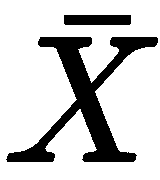

# 第二章：线性回归 - 房价预测

线性回归是世界上最早的机器学习概念之一。在 19 世纪初发明，它仍然是理解输入和输出之间关系的一种较为脆弱的方法。

线性回归背后的思想对我们来说都很熟悉。我们觉得有些事物彼此相关。有时它们在本质上具有因果关系。相关性和因果关系之间存在着一条非常细微的界限。例如，夏天冰淇淋和冷饮的销售量增加，而冬天热巧克力饮料和咖啡的销售量增加。我们可以这样说，季节本身导致了销售量的变化——它们在本质上具有因果关系。但它们真的是这样吗？

没有进一步的分析，我们所能说的最好的事情就是它们彼此相关。夏天的现象与一年中冷饮和冰淇淋销售量超过其他时间的现象相联系。冬天的现象，以某种方式，与一年中热饮料销售量超过其他时间的现象相联系。

理解事物之间的关系是线性回归的核心所在。线性回归可以从许多不同的角度来观察，但我们将从机器学习的角度来观察。也就是说，我们希望构建一个机器学习模型，能够根据一些输入准确预测结果。

使用相关性进行预测的愿望确实是线性回归最初被发明的原因。弗朗西斯·高尔顿（Francis Galton）偶然是查尔斯·达尔文（Charles Darwin）的表亲，来自一个上层社会家庭，家族中有医生。他在经历了一次神经崩溃后放弃了医学研究，开始作为地质学家周游世界——那是在地质学家是最酷的工作的时候（就像今天的数据科学家一样）——然而，据说高尔顿没有达尔文的勇气，不久他就放弃了周游世界的想法，对非洲的经历感到失望。在父亲去世后，高尔顿继承了财富，开始涉足所有能引起他兴趣的事物，包括生物学。

他表亲的巨著《物种起源》（*On the Origin of Species*）的出版使高尔顿加倍致力于生物学研究，最终转向优生学。高尔顿像孟德尔一样，偶然地在豌豆上进行实验。他想要预测后代植物的特征，而当时只有关于亲本植物特征的信息。他意识到后代植物的特征通常位于亲本植物特征之间。当高尔顿意识到他可以通过椭圆曲线拟合推导出一个表示遗传的数学方程时，他发明了回归。

回归背后的推理很简单：有一个驱动力——一种信号，它导致后代植物的特征趋向于他拟合的曲线。如果是这样，这意味着驱动力遵循某种数学定律。如果它确实遵循数学定律，那么它可以用于预测，高尔顿推理。为了进一步细化他的想法，他寻求数学家卡尔·皮尔逊的帮助。

高尔顿和皮尔逊需要尝试几次来细化概念并量化趋势。但最终，他们采用了最小二乘法来拟合曲线。

即使到现在，当提到线性回归时，可以安全地假设将使用最小二乘模型，这正是我们将要做的。

我们将执行探索性数据分析——这将使我们更好地理解数据。在这个过程中，我们将构建和使用机器学习项目所需的数据结构。我们将大量依赖 Gonum 的绘图库。之后，我们将运行线性回归，解释结果，并确定这种机器学习技术的优缺点。

# 项目

我们想要做的是创建一个房价模型。我们将使用这个开源房价数据集（[`www.kaggle.com/c/house-prices-advanced-regression-techniques/data`](https://www.kaggle.com/c/house-prices-advanced-regression-techniques/data)）来构建我们的线性回归模型。具体来说，数据集是马萨诸塞州阿默斯地区已售房屋的价格及其相关特征。

与任何机器学习项目一样，我们首先提出最基本的问题：我们想要预测什么？在这种情况下，我已经指出我们将预测房价，因此所有其他数据都将用作预测房价的信号。在统计学中，我们称房价为因变量，其他字段为自变量。

在接下来的章节中，我们将构建一个依赖逻辑条件的图表，然后以此作为计划，编写一个寻找线性回归模型的程序。

# 探索性数据分析

探索性数据分析是任何建模过程的组成部分。理解正在运行的算法也同样重要。鉴于本章围绕线性回归展开，探索数据以理解线性回归的角度可能是有益的。

但首先，让我们看看数据。我建议任何热衷于机器学习的初学者做的第一件事就是探索数据，或者数据的一个子集，以了解其感觉。我通常在电子表格应用程序，如 Excel 或 Google Sheets 中这样做。然后我尝试以人类的方式理解数据的含义。

该数据集附带字段描述，我无法在此全部列举。然而，本章后续讨论的一个快照将是有启发性的：

+   `SalePrice`：物业的售价（美元）。这是我们试图预测的依赖变量。

+   `MSSubClass`：建筑类别。

+   `MSZoning`：一般的分区分类。

+   `LotFrontage`：与物业相连的街道的线性英尺数。

+   `LotArea`：地块面积（平方英尺）。

理解线性回归的方式可能有多种。然而，我最喜欢的一种理解线性回归的方式与探索性数据分析直接相关。具体来说，我们感兴趣的是通过独立变量的**条件期望函数**（**CEFs**）来观察线性回归。

变量的条件期望函数简单地说就是变量的期望值，取决于另一个变量的值。这似乎是一个相当复杂的话题，所以我将提供三种不同观点的同一主题，以试图澄清：

+   **统计观点**：给定协变量向量的依赖变量的条件期望函数简单地是当固定为时的期望值（平均值）。

+   **伪 SQL 编程观点**：`select avg(Y) from dataset where X = 'Xi'`。当基于多个条件进行条件化时，它只是这样：`select avg(Y) from dataset where X1 = 'Xik' and X2 = 'Xjl'`。

+   **具体例子**：如果其中一个独立变量——比如说，MSZoning 是 RL，那么预期的房价是多少？预期的房价是人口平均值，这可以转化为：在波士顿的所有房屋中， zoning 类型为 RL 的房屋的平均售价是多少？

如此看来，这是对 CEF 的相当简化的版本——在 CEF 的定义中涉及一些细微之处，但这超出了本书的范围，所以我们将其留到以后。现在，对 CEF 的这种粗略理解足以让我们开始探索性数据分析。

伪 SQL 的编程观点是有用的，因为它告诉我们我们需要什么，以便我们可以快速计算数据的汇总。我们需要创建索引。由于我们的数据集很小，我们可以相对随意地选择用于索引数据的数据结构。

# 数据摄取和索引

可能最好的索引数据的方式是在摄取数据时进行。我们将使用`Go 标准库`中找到的`encoding/csv`包来摄取数据并建立索引。

在我们深入代码之前，让我们看看索引的概念以及它是如何构建的。虽然索引在数据库中非常常用，但它们也适用于任何生产系统。索引的目的是让我们能够快速访问数据。

我们想要构建一个索引，使我们能够随时知道哪些行具有某个值。在具有大量数据集的系统上，可能需要使用更复杂的索引结构（如 B-Tree）。然而，对于这个数据集，基于映射的索引就足够了。

这就是我们的索引看起来像什么：`[]map[string][]int`——它是一个映射切片。第一个切片按列索引——这意味着如果我们想获取列 `0`，我们只需获取 `index[0]`，然后返回 `map[string][]int`。映射告诉我们列中有什么值（映射的键），以及哪些行包含这些值（映射的值）。

现在，问题转向：你如何知道哪些变量与哪些列相关联？一个更传统的答案可能是使用类似 `map[string]int` 的结构，其中键代表变量名，值代表列号。虽然这是一个有效的策略，但我更喜欢使用 `[]string` 作为索引和列名之间的关联映射。搜索的时间复杂度是 O(N)，但大多数情况下，如果你有命名的变量，N 是很小的。在未来的章节中，我们将看到更大的 N 值。

因此，我们返回列名的索引作为 `[]string`，或者在读取 `CSV` 的情况下，它简单地是第一行，如下面的代码片段所示：

```py
// ingest is a function that ingests the file and outputs the header, data, and index.
func ingest(f io.Reader) (header []string, data [][]string, indices []map[string][]int, err error) {
  r := csv.NewReader(f)

  // handle header
  if header, err = r.Read(); err != nil {
    return
  }

  indices = make([]map[string][]int, len(header))
  var rowCount, colCount int = 0, len(header)
  for rec, err := r.Read(); err == nil; rec, err = r.Read() {
    if len(rec) != colCount {
      return nil, nil, nil, errors.Errorf("Expected Columns: %d. Got %d columns in row %d", colCount, len(rec), rowCount)
    }
    data = append(data, rec)
    for j, val := range rec {
      if indices[j] == nil {
        indices[j] = make(map[string][]int)
      }
      indices[j][val] = append(indices[j][val], rowCount)
    }
    rowCount++
  }
  return
}
```

阅读这段代码片段，一个优秀的程序员会在脑海中响起警钟。为什么一切都是字符串类型？答案很简单：我们稍后会转换类型。我们现在需要的只是进行一些基于计数的基本统计数据，以进行数据探索性分析。

关键在于函数返回的索引中。我们有一个列的唯一值计数。这是如何计数的：

```py
// cardinality counts the number of unique values in a column. 
// This assumes that the index i of indices represents a column.
func cardinality(indices []map[string][]int) []int {
  retVal := make([]int, len(indices))
  for i, m := range indices {
    retVal[i] = len(m)
  }
  return retVal
}
```

通过这个，我们可以分析每个单独列的基数——即有多少个不同的值。如果一个列中的不同值与行数相同，那么我们可以相当确信该列不是分类数据。或者，如果我们知道该列是分类数据，并且不同值与行数相同，那么我们可以确定该列不能用于线性回归。

我们的主函数现在看起来是这样的：

```py
func main() {
  f, err := os.Open("train.csv")
  mHandleErr(err)
  hdr, data, indices, err := ingest(f)
  mHandleErr(err)
  c := cardinality(indices)

  fmt.Printf("Original Data: \nRows: %d, Cols: %d\n========\n", len(data), len(hdr))
  c := cardinality(indices)
  for i, h := range hdr {
    fmt.Printf("%v: %v\n", h, c[i])
  }
  fmt.Println("")

}
```

为了完整性，这是 `mHandleError` 的定义：

```py
// mHandleErr is the error handler for the main function. 
// If an error happens within the main function, it is not 
// unexpected for a fatal error to be logged and for the program to immediately quit.
func mHandleErr(err error){
  if err != nil {
    log.Fatal(err)
  }
}
```

快速运行 `go run *.go` 可以得到这个结果（已被截断）：

```py
$ go run *.go
Rows: 1460
========
Id: 1460
MSSubClass: 15
MSZoning: 5
LotFrontage: 111
LotArea: 1073
SaleCondition: 6
SalePrice: 663
```

单独来看，这告诉我们很多有趣的事实，其中最显著的是，分类数据比连续数据要多得多。此外，对于一些本质上连续的列，可用的离散值只有少数。一个特定的例子是 `LowQualSF` 列——它是一个连续变量，但只有 24 个唯一的值。

我们想计算离散协变量的 CEF 以进行进一步分析。但在那之前，我们需要清理数据。在这个过程中，我们可能还想创建数据结构的逻辑分组。

# 清洁工作

数据科学工作的很大一部分集中在清理上。在生产化系统中，这些数据通常会直接从数据库中获取，已经相对干净（高质量的生产数据科学工作需要一个干净的数据库）。然而，我们目前还没有进入生产模式。我们仍然处于模型构建阶段。想象编写一个专门用于清理数据的程序会有所帮助。

让我们看看我们的需求：从我们的数据开始，每一列是一个变量——大多数是独立变量，除了最后一列，它是因变量。一些变量是分类的，一些是连续的。我们的任务是编写一个函数，将数据从当前的`[][]string`转换为`[][]float64`。

要做到这一点，我们需要将所有数据转换为`float64`。对于连续变量，这是一个简单的任务：只需将字符串解析为浮点数。有一些异常需要处理，希望你在打开文件到电子表格中时已经注意到了。但主要的问题在于将分类数据转换为`float64`。

幸运的是，比我们聪明得多的人早在几十年前就解决了这个问题。存在一种编码方案，允许分类数据与线性回归算法良好地配合。

# 编码分类数据

编码分类数据的技巧是将分类数据扩展为多个列，每列有一个 1 或 0，表示它是真还是假。这当然伴随着一些需要注意的警告和微妙的问题。在接下来的这个子节中，我将使用一个真实的分类变量来进一步解释。

考虑`LandSlope`变量。`LandSlope`有三个可能的值：

+   Gtl

+   Mod

+   Sev

这是一种可能的编码方案（这通常被称为独热编码）：

| **Slope** | **Slope_Gtl** | **Slope_Mod** | **Slope_Sev** |
| --- | --- | --- | --- |
| Gtl | 1 | 0 | 0 |
| Mod | 0 | 1 | 0 |
| Sev | 0 | 0 | 1 |

这将是一个糟糕的编码方案。要理解为什么，我们首先必须通过普通最小二乘法来理解线性回归。不过不深入细节，基于 OLS 的线性回归的核心是以下公式（我非常喜欢这个公式，以至于我有多件印有这个公式的 T 恤）：


这里，是一个(m x n)矩阵，而是一个(m x 1)向量。因此，这些乘法不是简单的乘法——它们是矩阵乘法。当使用独热编码进行线性回归时，得到的输入矩阵通常会是奇异的——换句话说，矩阵的行列式为 0。奇异矩阵的问题在于它们不能被求逆。

因此，我们采用以下编码方案：

| **斜率** | **斜率 _ 模** | **斜率 _ 严重程度** |
| --- | --- | --- |
| Gtl | 0 | 0 |
| 模式 | 1 | 0 |
| Sev | 0 | 1 |

在这里，我们看到 Go 谚语的应用，将零值变得有用，以便在数据科学环境中应用。确实，对分类变量进行巧妙的编码在处理先前未见过的数据时会产生略微更好的结果。

这个话题太广泛，无法在这里展开，但如果你的分类数据可以部分排序，那么当遇到未见过的数据时，只需将未见过的数据编码到最接近的有序变量值，结果将略好于编码到零值或使用随机编码。我们将在本章的后续部分更多地介绍这一点。

# 处理不良数据

另一部分的清洁工作就是处理不良数据。一个很好的例子是在`LotFrontage`变量中。从数据描述中，我们知道这应该是一个连续变量。因此，所有数字都应该可以直接转换为`float64`。然而，当我们查看数据时，我们发现并非如此——存在 NA 数据。

根据描述，`LotFrontage`是连接到财产的街道的线性英尺。NA 可能意味着两种情况之一：

+   我们没有关于是否有街道连接到该财产的信息

+   没有街道连接到该财产

在任何情况下，用 0 替换 NA 都是合理的。这是合理的，因为`LotFrontage`的第二低值是 21。当然，还有其他方法可以插补数据，而且通常插补会导致更好的模型。但就目前而言，我们将用 0 进行插补。

我们也可以用这个方法处理这个数据集中任何其他连续变量，因为当你用 0 替换 NA 时，它们是有意义的。一个技巧是在句子中使用它：这所房子有一个未知的`GarageArea`。如果是这种情况，那么最好的猜测是什么？嗯，假设这所房子没有车库，所以用 0 替换 NA 是合理的。

注意，在其他机器学习项目中可能并非如此。记住——人类的洞察力可能是有缺陷的，但通常它是解决数据中许多不规则性的最佳方案。如果你是一名房地产经纪人，并且拥有更多的领域知识，你可以在插补阶段注入这种领域知识——例如，你可以使用变量来计算和估计其他变量。

对于分类变量，我们大部分可以将 NA 视为变量的零值，所以如果有 NA，那里不会有变化。对于某些分类数据，NA 或 None 可能没有意义。这就是上述巧妙编码分类数据可能派上用场的地方。对于这些变量的情况，我们将使用最常见的值作为零值：

+   `MSZoning`

+   `BsmtFullBath`

+   `BsmtHalfBath`

+   `Utilities`

+   `Functional`

+   `Electrical`

+   `KitchenQual`

+   `SaleType`

+   `Exterior1st`

+   `Exterior2nd`

此外，还有一些变量是分类的，但数据是数值的。数据集中发现的一个例子是`MSSubclass`变量。它本质上是一个分类变量，但其数据是数值的。在编码这类分类数据时，按数值排序是有意义的，这样 0 值确实是最低值。

# 最终要求

尽管我们现在正在构建模型，但我们希望从未来的角度来构建。未来是一个生产就绪的机器学习系统，它执行线性回归。因此，我们编写的任何函数和方法都必须考虑到在生产环境中可能发生而在模型构建阶段可能不会发生的事情。

以下是需要考虑的事项：

+   **未见值**：我们必须编写一个函数，能够对之前未见过的值进行编码。

+   **未见变量**：在未来的某个时刻，我们可能会传递一个包含在模型构建时未知变量的数据的不同版本。我们必须处理这种情况。

+   **不同的插补策略**：不同的变量将需要不同的策略来猜测缺失数据。

# 编写代码

到目前为止，我们只是在头脑中进行了清理。我个人认为这是一种更有回报的练习：在实际清理之前，先在心理上清理数据。这并不是因为我非常自信我会处理所有数据的不规则性。相反，我喜欢这个过程，因为它阐明了需要做什么。而这反过来又指导了完成这项工作所需的数据结构。

但是，一旦思考完成，就是时候用代码来验证我们的思考了。

我们从清洁函数开始：

```py
// hints is a slice of bools indicating whether it's a categorical variable
func clean(hdr []string, data [][]string, indices []map[string][]int, hints []bool, ignored []string) (int, int, []float64, []float64, []string, []bool) {
  modes := mode(indices)
  var Xs, Ys []float64
  var newHints []bool
  var newHdr []string
  var cols int

  for i, row := range data {

    for j, col := range row {
      if hdr[j] == "Id" { // skip id
        continue
      }
      if hdr[j] == "SalePrice" { // we'll put SalePrice into Ys
        cxx, _ := convert(col, false, nil, hdr[j])
        Ys = append(Ys, cxx...)
        continue
      }

      if inList(hdr[j], ignored) {
        continue
      }

      if hints[j] {
        col = imputeCategorical(col, j, hdr, modes)
      }
      cxx, newHdrs := convert(col, hints[j], indices[j], hdr[j])
      Xs = append(Xs, cxx...)

      if i == 0 {
        h := make([]bool, len(cxx))
        for k := range h {
          h[k] = hints[j]
        }
        newHints = append(newHints, h...)
        newHdr = append(newHdr, newHdrs...)
      }
    }
    // add bias

    if i == 0 {
      cols = len(Xs)
    }
  }
  rows := len(data)
  if len(Ys) == 0 { // it's possible that there are no Ys (i.e. the test.csv file)
    Ys = make([]float64, len(data))
  }
  return rows, cols, Xs, Ys, newHdr, newHints
}
```

`clean`函数接收数据（以`[][]string`的形式），借助之前构建的索引，我们想要构建一个`Xs`（这将是一个`float64`矩阵）和`Ys`的矩阵。在 Go 语言中，这是一个简单的循环。我们将读取输入数据并尝试转换它。同时还会传递一个`hints`切片，以帮助我们确定一个变量是否应该被视为分类变量或连续变量。

特别是，对任何年份变量的处理存在争议。一些统计学家认为将年份变量视为离散的、非分类变量是可以的，而另一些统计学家则持不同意见。我个人认为这并不重要。如果将年份变量作为分类变量可以提高模型得分，那么无论如何都可以使用它。不过，这种情况不太可能发生。

上述代码的核心是将字符串转换为`[]float64`，这正是`convert`函数所做的事情。我们稍后会查看这个函数，但重要的是要注意，在转换之前必须先填充数据。这是因为 Go 的切片类型严格。`[]float64`只能包含`float64`。

虽然我们也可以用 NaN 替换任何未知数据，但这并不有帮助，尤其是在分类数据的情况下，NA 可能实际上具有语义意义。因此，我们在转换之前填充分类数据。这就是`imputeCategorical`的样子：

```py
// imputeCategorical replaces "NA" with the mode of categorical values
func imputeCategorical(a string, col int, hdr []string, modes []string) string {
  if a != "NA" || a != "" {
    return a
  }
  switch hdr[col] {
  case "MSZoning", "BsmtFullBath", "BsmtHalfBath", "Utilities", "Functional", "Electrical", "KitchenQual", "SaleType", "Exterior1st", "Exterior2nd":
    return modes[col]
  }
  return a
}
```

这个函数的意思是，如果值不是`NA`且值不是空字符串，那么它是一个有效值，因此我们可以提前返回。否则，我们得考虑是否将`NA`作为有效类别返回。

对于某些特定的类别，NA 不是有效的类别，它们被替换为最常出现的值。这是一件合乎逻辑的事情去做——一个位于荒野中、没有电力、没有天然气和没有浴室的棚屋是非常罕见的。有一些处理这种问题的技术（例如 LASSO 回归），但我们现在不会这么做。相反，我们将它们替换为众数。

模式是在`clean`函数中计算的。这是一个非常简单的定义，用于寻找众数；我们只是找到具有最大长度的值并返回该值：

```py
// mode finds the most common value for each variable
func mode(index []map[string][]int) []string {
  retVal := make([]string, len(index))
  for i, m := range index {
    var max int
    for k, v := range m {
      if len(v) > max {
        max = len(v)
        retVal[i] = k
      }
    }
  }
  return retVal
}
```

在填充了分类数据之后，我们将所有数据转换为`[]float`。对于数值数据，这将导致包含单个值的切片。但对于分类数据，它将导致包含 0 和 1 的切片。

为了本章的目的，任何在数值数据中发现的 NA 将被转换为 0.0。还有其他一些有效的策略可以略微提高模型的性能，但这些策略并不简短。

因此，转换代码看起来很简单：

```py
// convert converts a string into a slice of floats
func convert(a string, isCat bool, index map[string][]int, varName string) ([]float64, []string) {
  if isCat {
    return convertCategorical(a, index, varName)
  }
  // here we deliberately ignore errors, because the zero value of float64 is well, zero.
  f, _ := strconv.ParseFloat(a, 64)
  return []float64{f}, []string{varName}
}

// convertCategorical is a basic function that encodes a categorical variable as a slice of floats.
// There are no smarts involved at the moment.
// The encoder takes the first value of the map as the default value, encoding it as a []float{0,0,0,...}
func convertCategorical(a string, index map[string][]int, varName string) ([]float64, []string) {
  retVal := make([]float64, len(index)-1)

  // important: Go actually randomizes access to maps, so we actually need to sort the keys
  // optimization point: this function can be made stateful.
  tmp := make([]string, 0, len(index))
  for k := range index {
    tmp = append(tmp, k)
  }

  // numerical "categories" should be sorted numerically
  tmp = tryNumCat(a, index, tmp)

  // find NAs and swap with 0
  var naIndex int
  for i, v := range tmp {
    if v == "NA" {
      naIndex = i
      break
    }
  }
  tmp[0], tmp[naIndex] = tmp[naIndex], tmp[0]

  // build the encoding
  for i, v := range tmp[1:] {
    if v == a {
      retVal[i] = 1
      break
    }
  }
  for i, v := range tmp {
    tmp[i] = fmt.Sprintf("%v_%v", varName, v)
  }

  return retVal, tmp[1:]
}
```

我想引起您对`convertCategorical`函数的注意。代码中有些冗余，但冗余会消除魔法。因为 Go 随机访问映射，所以获取键的列表并对其进行排序很重要。这样，所有后续访问都将具有确定性。

该函数还留有优化的空间——将这个函数做成一个`有状态的`函数可以进一步优化它，但在这个项目中我们不会去麻烦。

这是我们到目前为止的主要函数：

```py
func main() {
 f, err := os.Open("train.csv")
 mHandleErr(err)
 hdr, data, indices, err := ingest(f)
 mHandleErr(err)
 fmt.Printf("Original Data: nRows: %d, Cols: %dn========n", len(data), len(hdr))
 c := cardinality(indices)
 for i, h := range hdr {
  fmt.Printf("%v: %vn", h, c[i])
 }
 fmt.Println("")
 fmt.Printf("Building into matricesn=============n")
 rows, cols, XsBack, YsBack, newHdr, _ := clean(hdr, data, indices, datahints, nil)
 Xs := tensor.New(tensor.WithShape(rows, cols), tensor.WithBacking(XsBack))
 Ys := tensor.New(tensor.WithShape(rows, 1), tensor.WithBacking(YsBack
 fmt.Printf("Xs:\n%+1.1snYs:\n%1.1sn", Xs, Ys)
 fmt.Println("")
}
```

代码的输出如下：

```py
Original Data:
Rows: 1460, Cols: 81
========
Id: 1460
MSSubClass: 15
MSZoning: 5
LotFrontage: 111
LotArea: 1073
Street: 2
 ⋮
Building into matrices
=============
Xs:
⎡ 0 0 ⋯ 1 0⎤
⎢ 0 0 ⋯ 1 0⎥
 ⋮
⎢ 0 0 ⋯ 1 0⎥
⎣ 0 0 ⋯ 1 0⎦
Ys:
C[2e+05 2e+05 ⋯ 1e+05 1e+05]
```

注意，虽然原始数据有 81 个变量，但在编码完成后，变量数量增加到 615 个。这是我们想要传递给回归分析的。在这个时候，经验丰富的数据科学家可能会注意到一些可能让她感到不舒服的事情。例如，变量的数量（615）与观测值的数量（1,460）过于接近，所以我们可能会遇到一些问题。我们将在稍后解决这些问题。

另一个需要注意的点是我们正在将数据转换为`*tensor.Dense`。你可以将`*tensor.Dense`数据结构视为一个矩阵。它是一个高效的数据结构，具有许多我们将在以后使用的优点。

# 进一步的探索工作

在这个阶段，我们可能会非常想直接使用这些矩阵进行回归分析。虽然这可能可行，但并不一定能产生最佳结果。

# 条件期望函数

相反，让我们做我们最初打算做的事情：探索变量的`CEF`。幸运的是，我们已经有必要的数据结构（换句话说，索引），因此编写查找`CEF`的函数相对容易。

下面的代码块：

```py
func CEF(Ys []float64, col int, index []map[string][]int) map[string]float64 {
  retVal := make(map[string]float64)
  for k, v := range index[col] {
    var mean float64
    for _, i := range v {
      mean += Ys[i]
    }
    mean /= float64(len(v))
    retVal[k]=mean
  }
  return retVal
}
```

这个函数在保持一个变量固定的情况下找到条件期望的房价。我们可以探索所有变量，但为了本章的目的，我将只分享对 yearBuilt 变量的探索作为例子。

现在，YearBuilt 是一个值得深入研究的变量。它是一个分类变量（1950.5 没有意义），但它也可以完全排序（1,945 小于 1,950）。YearBuilt 有很多值。因此，我们不应该打印出来，而应该用以下函数将其绘制出来：

```py
// plotCEF plots the CEF. This is a simple plot with only the CEF. 
// More advanced plots can be also drawn to expose more nuance in understanding the data.
func plotCEF(m map[string]float64) (*plot.Plot, error) {
  ordered := make([]string, 0, len(m))
  for k := range m {
    ordered = append(ordered, k)
  }
  sort.Strings(ordered)

  p, err := plot.New()
  if err != nil {
    return nil, err
  }

  points := make(plotter.XYs, len(ordered))
  for i, val := range ordered {
    // if val can be converted into a float, we'll use it
    // otherwise, we'll stick with using the index
    points[i].X = float64(i)
    if x, err := strconv.ParseFloat(val, 64); err == nil {
      points[i].X = x
    }

    points[i].Y = m[val]
  }
  if err := plotutil.AddLinePoints(p, "CEF", points); err != nil {
    return nil, err
  }
  return p, nil
}
```

我们不断增长的主函数现在附加了以下内容：

```py
ofInterest := 19 // variable of interest is in column 19
cef := CEF(YsBack, ofInterest, indices)
plt, err := plotCEF(cef)
mHandleErr(err)
plt.Title.Text = fmt.Sprintf("CEF for %v", hdr[ofInterest])
plt.X.Label.Text = hdr[ofInterest]
plt.Y.Label.Text = "Conditionally Expected House Price"
mHandleErr(plt.Save(25*vg.Centimeter, 25*vg.Centimeter, "CEF.png"))
```

运行程序会产生以下图表：


Yearbuilt 的条件期望函数

在检查图表后，我必须承认我有点惊讶。我对房地产并不特别熟悉，但我的直觉是老房子会更贵——在我的心目中，房子就像美酒一样，越老越贵。显然，情况并非如此。哦，好吧，活到老，学到老。

应尽可能多地探索变量。我在本书中只是为了简洁而省略了。

# 偏斜

现在我们来看看房价数据的分布情况：

```py
func hist(a []float64) (*plot.Plot, error){
  h, err := plotter.NewHist(plotter.Values(a), 10)
  if err != nil {
    return nil, err
  }
  p, err := plot.New()
  if err != nil {
    return nil, err
  }

  h.Normalize(1)
  p.Add(h)
  return p, nil
}
```

这个部分被添加到主函数中：

```py
hist, err := plotHist(YsBack)
mHandleErr(err)
hist.Title.Text = "Histogram of House Prices"
mHandleErr(hist.Save(25*vg.Centimeter, 25*vg.Centimeter, "hist.png"))
```

下面的图示是：


房价直方图

如所示，价格直方图略有偏斜。幸运的是，我们可以通过应用一个执行值对数运算并加 1 的函数来解决这个问题。标准库提供了一个这样的函数：`math.Log1p`。因此，我们在主函数中添加以下内容：

```py
for i := range YsBack {
 YsBack[i] = math.Log1p(YsBack[i])
 }
 hist2, err := plotHist(YsBack)
 mHandleErr(err)
 hist2.Title.Text = "Histogram of House Prices (Processed)"
 mHandleErr(hist2.Save(25*vg.Centimeter, 25*vg.Centimeter, "hist2.png"))
```

下面的图示是：


房价直方图（处理过）

哎！看起来好多了。我们为所有的`Ys`都做了这个。那么`Xs`中的任何变量呢？为了做到这一点，我们必须遍历`Xs`的每一列，找出它们是否偏斜，如果是的话，我们需要应用转换函数。

这是我们在主函数中添加的内容：

```py
  it, err := native.MatrixF64(Xs)
  mHandleErr(err)
  for i, isCat := range datahints {
    if isCat {
      continue
    }
    skewness := skew(it, i)
    if skewness > 0.75 {
      log1pCol(it, i)
    }
  }
```

`native.MatrixF64s`将一个`*tensor.Dense`转换成一个本地的 Go 迭代器。底层支持数据不会改变，因此如果有人要写入`it[0][0] = 1000`，实际的矩阵本身也会改变。这允许我们在不进行额外分配的情况下执行转换。对于这个话题，这可能不是那么重要；然而，对于更大的项目，这将会变得非常有用。

这也允许我们编写检查和修改矩阵的函数：

```py
// skew returns the skewness of a column/variable
func skew(it [][]float64, col int) float64 {
  a := make([]float64, 0, len(it[0]))
  for _, row := range it {
    for _, col := range row {
      a = append(a, col)
    }
  }
  return stat.Skew(a, nil)
}

// log1pCol applies the log1p transformation on a column
func log1pCol(it [][]float64, col int) {
  for i := range it {
    it[i][col] = math.Log1p(it[i][col])
  }
}
```

# 多重共线性

如本节开头几段所述，变量的数量有点多，不太舒服。当变量数量很多时，多重共线性增加的可能性也会增加。多重共线性是指两个或更多变量以某种方式相互关联。

从对数据的初步观察中，我们可以看出这是真的。一个简单的事情是 GarageArea 与 GarageCars 相关。在现实生活中，这是有道理的——一个可以停放两辆车的车库在面积上会比只能停放一辆车的车库大。同样，分区与社区高度相关。

考虑变量的一个好方法是它们包含的信息。有时，变量包含重叠的信息。例如，当 GarageArea 为 0 时，它与 GarageType 的 NA 重叠——毕竟，如果你没有车库，车库的面积就是零。

困难的部分是遍历变量列表，并决定保留哪些变量。这有点像一门艺术，需要算法的帮助。实际上，我们首先要做的是找出一个变量与另一个变量之间的相关性。我们通过计算相关矩阵，然后绘制热图来实现这一点。

要计算相关矩阵，我们只需使用 Gonum 中的函数，并使用以下代码片段：

```py
  m64, err := tensor.ToMat64(Xs, tensor.UseUnsafe())
  mHandleErr(err)
  corr := stat.CorrelationMatrix(nil, m64, nil)
  hm, err := plotHeatMap(corr, newHdr)
  mHandleErr(err)
  hm.Save(60*vg.Centimeter, 60*vg.Centimeter, "heatmap.png")
```

让我们逐行分析：

`m64, err := tensor.ToMat64(Xs, tensor.UseUnsafe())`将`*tensor.Dense`转换为`mat.Mat64`。因为我们不想分配额外的内存块，并且我们已经确定可以安全地重用矩阵中的数据，所以我们传递了一个`tensor.UseUnsafe()`函数选项，告诉 Gorgonia 重用 Gonum 矩阵中的底层内存。

`stat.CorrelationMatrix(nil, m64, nil)`计算相关矩阵。相关矩阵是一个三角形矩阵——Gonum 包提供的特别有用的数据结构。对于这个用例来说，这是一个非常巧妙的小数据结构，因为矩阵沿着对角线是镜像的。

接下来，我们使用以下代码片段绘制`heatmap`：

```py
type heatmap struct {
  x mat.Matrix
}

func (m heatmap) Dims() (c, r int) { r, c = m.x.Dims(); return c, r }
func (m heatmap) Z(c, r int) float64 { return m.x.At(r, c) }
func (m heatmap) X(c int) float64 { return float64(c) }
func (m heatmap) Y(r int) float64 { return float64(r) }

type ticks []string

func (t ticks) Ticks(min, max float64) []plot.Tick {
  var retVal []plot.Tick
  for i := math.Trunc(min); i <= max; i++ {
    retVal = append(retVal, plot.Tick{Value: i, Label: t[int(i)]})
  }
  return retVal
}

func plotHeatMap(corr mat.Matrix, labels []string) (p *plot.Plot, err error) {
  pal := palette.Heat(48, 1)
  m := heatmap{corr}
  hm := plotter.NewHeatMap(m, pal)
  if p, err = plot.New(); err != nil {
    return
  }
  hm.NaN = color.RGBA{0, 0, 0, 0} // black

  // add and adjust the prettiness of the chart
  p.Add(hm)
  p.X.Tick.Label.Rotation = 1.5
  p.Y.Tick.Label.Font.Size = 6
  p.X.Tick.Label.Font.Size = 6
  p.X.Tick.Label.XAlign = draw.XRight
  p.X.Tick.Marker = ticks(labels)
  p.Y.Tick.Marker = ticks(labels)

  // add legend
  l, err := plot.NewLegend()
  if err != nil {
    return p, err
  }

  thumbs := plotter.PaletteThumbnailers(pal)
  for i := len(thumbs) - 1; i >= 0; i-- {
    t := thumbs[i]
    if i != 0 && i != len(thumbs)-1 {
      l.Add("", t)
      continue
    }
    var val float64
    switch i {
    case 0:
      val = hm.Min
    case len(thumbs) - 1:
      val = hm.Max
    }
    l.Add(fmt.Sprintf("%.2g", val), t)
  }

  // this is a hack. I place the legends between the axis and the actual heatmap
  // because if the legend is on the right, we'd need to create a custom canvas to take
  // into account the additional width of the legend.
  //
  // So instead, we shrink the legend width to fit snugly within the margins of the plot and the axes.
  l.Left = true
  l.XOffs = -5
  l.ThumbnailWidth = 5
  l.Font.Size = 5

  p.Legend = l
  return
}
```

`plotter.NewHeatMap`函数期望一个接口，这就是为什么我将`mat.Mat`包装在热力图数据结构中，这为绘图器提供了绘制热力图的接口。这种模式将在接下来的章节中变得越来越常见——仅仅为了提供额外的接口而包装数据结构。它们既便宜又容易获得，应该最大限度地使用。

这段代码的大部分涉及对标签的 hack。Gonum 绘图的方式是，当计算画布大小时，标签被认为是位于绘图内的。为了能够在绘图外绘制标签，需要编写大量的额外代码。因此，我缩小了标签以适应轴和绘图本身之间的空白区域，以避免覆盖到绘图的重要区域：


热力图

在这个热力图中，特别值得注意的是白色条纹。我们期望一个变量与其自身完全相关。但如果你注意到，有一些白色线条区域与对角线白色线条平行。这些是总相关。我们需要移除它们。

热力图看起来很漂亮，但相当愚蠢。人眼并不擅长区分色调。因此，我们还将报告数字。变量之间的相关系数在-1 和 1 之间。我们特别关注接近两端的相关系数。

这个片段打印了结果：

```py
  // heatmaps are nice to look at, but are quite ridiculous.
  var tba []struct {
    h1, h2 string
    corr float64
  }
  for i, h1 := range newHdr {
    for j, h2 := range newHdr {
      if c := corr.At(i, j); math.Abs(c) >= 0.5 && h1 != h2 {
        tba = append(tba, struct {
          h1, h2 string
          corr float64
        }{h1: h1, h2: h2, corr: c})
      }
    }
  }
  fmt.Println("High Correlations:")
  for _, a := range tba {
    fmt.Printf("\t%v-%v: %v\n", a.h1, a.h2, a.corr)
  }
```

在这里，我使用匿名结构体，而不是命名结构体，因为我们不会重用数据——它仅用于打印。一个匿名元组就足够了。在大多数情况下，这并不是最佳实践。

这个相关图只显示了自变量的相关系数。要真正理解多重共线性，我们需要找到每个变量与其他变量以及因变量的相关系数。这将被留给读者作为练习。

如果你绘制相关矩阵，它看起来会和我们这里的一样，但会多出一个行和列用于因变量。

最终，多重共线性只能在运行回归后检测到。相关图只是指导变量包含和排除的简写方式。消除多重共线性的实际过程是一个迭代过程，通常还会使用其他统计量，如方差膨胀因子，来帮助决定包含哪些变量以及排除哪些变量。

为了本章的目的，我已确定多个要包含的变量——大多数变量都被排除。这可以在`const.go`文件中找到。在忽略列表中被注释掉的行是最终模型中包含的内容。

如本节开头段落所述，这实际上是一种艺术，由算法辅助。

# 标准化

作为最后的转换，我们需要标准化我们的输入数据。这允许我们比较模型，看看一个模型是否比另一个模型更好。为此，我编写了两种不同的缩放算法：

```py
func scale(a [][]float64, j int) {
  l, m, h := iqr(a, 0.25, 0.75, j)
  s := h - l
  if s == 0 {
    s = 1
  }

  for _, row := range a {
    row[j] = (row[j] - m) / s
  }
}

func scaleStd(a [][]float64, j int) {
  var mean, variance, n float64
  for _, row := range a {
    mean += row[j]
    n++
  }
  mean /= n
  for _, row := range a {
    variance += (row[j] - mean) * (row[j] - mean)
  }
  variance /= (n-1)

  for _, row := range a {
    row[j] = (row[j] - mean) / variance
  }
}
```

如果你来自数据科学的 Python 世界，第一个缩放函数本质上就是 scikits-learn 的`RobustScaler`所做的那样。第二个函数本质上与`StdScaler`相同，但将方差调整为适用于样本数据。

此函数将给定列（`j`）中的值缩放到所有值都约束在某个值之内的方式。此外，请注意，两个缩放函数的输入都是`[][]float64`。这就是`tensor`包的好处所在。一个`*tensor.Dense`可以转换为`[][]float64`而不需要任何额外的分配。一个额外的有益副作用是，你可以修改`a`，而张量值也会随之改变。本质上，`[][]float64`将作为底层张量数据的迭代器。

我们现在的转换函数看起来是这样的：

```py
func transform(it [][]float64, hdr []string, hints []bool) []int {
  var transformed []int
  for i, isCat := range hints {
    if isCat {
      continue
    }
    skewness := skew(it, i)
    if skewness > 0.75 {
      transformed = append(transformed, i)
      log1pCol(it, i)
    }
  }
  for i, h := range hints {
    if !h {
      scale(it, i)
    }
  }
  return transformed
}
```

注意，我们只想缩放数值变量。分类变量也可以缩放，但差别并不大。

# 线性回归

现在所有这些都完成了，让我们来做一些线性回归！但首先，让我们清理一下我们的代码。我们将到目前为止的探索工作移动到一个名为`exploration()`的函数中。然后我们将重新读取文件，将数据集分为训练集和测试集，并在最终运行回归之前执行所有转换。为此，我们将使用`github.com/sajari/regression`并应用回归。

第一部分看起来是这样的：

```py
func main() {
  // exploratory() // commented out because we're done with exploratory work.

  f, err := os.Open("train.csv")
  mHandleErr(err)
  defer f.Close()
  hdr, data, indices, err := ingest(f)
  rows, cols, XsBack, YsBack, newHdr, newHints := clean(hdr, data, indices, datahints, ignored)
  Xs := tensor.New(tensor.WithShape(rows, cols), tensor.WithBacking(XsBack))
  it, err := native.MatrixF64(Xs)
  mHandleErr(err)

  // transform the Ys
  for i := range YsBack {
    YsBack[i] = math.Log1p(YsBack[i])
  }
  // transform the Xs
  transform(it, newHdr, newHints)

  // partition the data
  shuffle(it, YsBack)
  testingRows := int(float64(rows) * 0.2)
  trainingRows := rows - testingRows
  testingSet := it[trainingRows:]
  testingYs := YsBack[trainingRows:]
  it = it[:trainingRows]
  YsBack = YsBack[:trainingRows]
  log.Printf("len(it): %d || %d", len(it), len(YsBack))
...
```

我们首先摄入和清理数据，然后为`Xs`的矩阵创建一个迭代器，以便更容易访问。然后我们转换`Xs`和`Ys`。最后，我们洗牌`Xs`，并将它们划分为训练集和测试集。

回想一下第一章中关于判断模型好坏的内容。一个好的模型必须能够泛化到之前未见过的值组合。为了防止过拟合，我们必须交叉验证我们的模型。

为了实现这一点，我们必须只在数据的一个有限子集上训练，然后使用模型在测试数据集上进行预测。然后我们可以得到一个分数，表明它在测试集上运行得有多好。

理想情况下，这应该在将数据解析到`Xs`和`Ys`之前完成。但我们想重用我们之前写的函数，所以不会这么做。然而，单独的摄入和清理函数允许你这样做。如果你访问 GitHub 上的仓库，你会发现所有这样的操作都可以轻松完成。

现在，我们简单地取出数据集的 20%，并将其放在一边。使用洗牌来重新采样行，这样我们就不需要在每次训练时都使用相同的 80%。

此外，请注意，现在`clean`函数接受`ignored`，而在探索模式中，它接受`nil`。这与洗牌一起，对于后续的交叉验证非常重要。

# 回归

因此，现在我们准备好构建回归模型了。请记住，在实际生活中，这一部分是非常迭代的。我将描述迭代过程，但只会分享我选择确定的模型。

`github.com/sajari/regression`包做得很好。但我们需要扩展这个包，以便能够比较模型和参数的系数。所以我写了这个函数：

```py
func runRegression(Xs [][]float64, Ys []float64, hdr []string) (r *regression.Regression, stdErr []float64) {
  r = new(regression.Regression)
  dp := make(regression.DataPoints, 0, len(Xs))
  for i, h := range hdr {
    r.SetVar(i, h)
  }
  for i, row := range Xs {
    if i < 3 {
      log.Printf("Y %v Row %v", Ys[i], row)
    }
    dp = append(dp, regression.DataPoint(Ys[i], row))
  }
  r.Train(dp...)
  r.Run()

  // calculate StdErr
  var sseY float64
  sseX := make([]float64, len(hdr)+1)
  meanX := make([]float64, len(hdr)+1)
  for i, row := range Xs {
    pred, _ := r.Predict(row)
    sseY += (Ys[i] - pred) * (Ys[i] - pred)
    for j, c := range row {
      meanX[j+1] += c
    }
  }
  sseY /= float64(len(Xs) - len(hdr) - 1) // n - df ; df = len(hdr) + 1
  vecf64.ScaleInv(meanX, float64(len(Xs)))
  sseX[0] = 1
  for _, row := range Xs {
    for j, c := range row {
      sseX[j+1] += (c - meanX[j+1]) * (c - meanX[j+1])
    }
  }
  sseY = math.Sqrt(sseY)
  vecf64.Sqrt(sseX)
  vecf64.ScaleInvR(sseX, sseY)

  return r, sseX
}
```

`runRegression`将执行回归分析，并打印系数标准误差的输出。这是系数标准差的估计——想象这个模型被运行很多次：每次系数可能略有不同。标准误差简单地报告系数的变化量。

标准误差是通过`gorgonia.org/vecf64`包计算的，该包对向量执行原地操作。可选地，你可以选择用循环来编写它们。

这个函数还向我们介绍了`github.com/sajari/regression`包的 API——要预测，只需使用`r.Predict(vars)`。这在需要将此模型用于生产的情况下将非常有用。

目前，让我们专注于主函数的另一部分：

```py
  // do the regessions
  r, stdErr := runRegression(it, YsBack, newHdr)
  tdist := distuv.StudentsT{Mu: 0, Sigma: 1, Nu: float64(len(it) - len(newHdr) - 1), Src: rand.New(rand.NewSource(uint64(time.Now().UnixNano())))}
  fmt.Printf("R²: %1.3f\n", r.R2)
  fmt.Printf("\tVariable \tCoefficient \tStdErr \tt-stat\tp-value\n")
  fmt.Printf("\tIntercept: \t%1.5f \t%1.5f \t%1.5f \t%1.5f\n", r.Coeff(0), stdErr[0], r.Coeff(0)/stdErr[0], tdist.Prob(r.Coeff(0)/stdErr[0]))
  for i, h := range newHdr {
    b := r.Coeff(i + 1)
    e := stdErr[i+1]
    t := b / e
    p := tdist.Prob(t)
    fmt.Printf("\t%v: \t%1.5f \t%1.5f \t%1.5f \t%1.5f\n", h, b, e, t, p)
  }
...
```

在这里，我们运行回归分析，然后打印结果。我们不仅想要输出回归系数，还想要输出标准误差、t 统计量和 P 值。这将给我们对估计系数的信心。

`tdist := distuv.StudentsT{Mu: 0, Sigma: 1, Nu: float64(len(it) - len(newHdr) - 1), Src: rand.New(rand.NewSource(uint64(time.Now().UnixNano())))}`创建了一个学生 t 分布，我们将将其与我们的数据进行比较。t 统计量非常简单地通过将系数除以标准误差来计算。

# 交叉验证

现在我们来到了最后一部分——为了比较模型，我们想要交叉验证模型。我们已经留出了一部分数据。现在，我们必须在留出的数据上测试模型，并计算一个分数。

我们将使用的是均方根误差。它被使用是因为它简单且易于理解：

```py
  // VERY simple cross validation
  var MSE float64
  for i, row := range testingSet {
    pred, err := r.Predict(row)
    mHandleErr(err)
    correct := testingYs[i]
    eStar := correct - pred
    e2 := eStar * eStar
    MSE += e2
  }
  MSE /= float64(len(testingSet))
  fmt.Printf("RMSE: %v\n", math.Sqrt(MSE))
```

现在，我们真正准备好运行回归分析了。

# 运行回归

简单地运行程序。如果程序运行时忽略列表为空，结果将显示为一系列 NaN。你还记得我们之前对一些变量之间相关性进行的关联分析吗？

我们将首先将它们添加到我们的忽略列表中，然后运行回归。一旦我们得到不再为 NaN 的分数，我们就可以开始比较模型了。

我打印的最终模型如下：

```py
R²: 0.871
 Variable Coefficient StdErr t-stat p-value
 Intercept: 12.38352 0.14768 83.85454 0.00000
 MSSubClass_30: -0.06466 0.02135 -3.02913 0.00412
 MSSubClass_40: -0.03771 0.08537 -0.44172 0.36175
 MSSubClass_45: -0.12998 0.04942 -2.63027 0.01264
 MSSubClass_50: -0.01901 0.01486 -1.27946 0.17590
 MSSubClass_60: -0.06634 0.01061 -6.25069 0.00000
 MSSubClass_70: 0.04089 0.02269 1.80156 0.07878
 MSSubClass_75: 0.04604 0.03838 1.19960 0.19420
 MSSubClass_80: -0.01971 0.02177 -0.90562 0.26462
 MSSubClass_85: -0.02167 0.03838 -0.56458 0.34005
 MSSubClass_90: -0.05748 0.02222 -2.58741 0.01413
 MSSubClass_120: -0.06537 0.01763 -3.70858 0.00043
 MSSubClass_160: -0.15650 0.02135 -7.33109 0.00000
 MSSubClass_180: -0.01552 0.05599 -0.27726 0.38380
 MSSubClass_190: -0.04344 0.02986 -1.45500 0.13840
 LotFrontage: -0.00015 0.00265 -0.05811 0.39818
 LotArea: 0.00799 0.00090 8.83264 0.00000
 Neighborhood_Blueste: 0.02080 0.10451 0.19903 0.39102
 Neighborhood_BrDale: -0.06919 0.04285 -1.61467 0.10835
 Neighborhood_BrkSide: -0.06680 0.02177 -3.06894 0.00365
 Neighborhood_ClearCr: -0.04217 0.03110 -1.35601 0.15904
 Neighborhood_CollgCr: -0.06036 0.01403 -4.30270 0.00004
 Neighborhood_Crawfor: 0.08813 0.02500 3.52515 0.00082
 Neighborhood_Edwards: -0.18718 0.01820 -10.28179 0.00000
 Neighborhood_Gilbert: -0.09673 0.01858 -5.20545 0.00000
 Neighborhood_IDOTRR: -0.18867 0.02825 -6.67878 0.00000
 Neighborhood_MeadowV: -0.24387 0.03971 -6.14163 0.00000
 Neighborhood_Mitchel: -0.15112 0.02348 -6.43650 0.00000
 Neighborhood_NAmes: -0.11880 0.01211 -9.81203 0.00000
 Neighborhood_NPkVill: -0.05093 0.05599 -0.90968 0.26364
 Neighborhood_NWAmes: -0.12200 0.01913 -6.37776 0.00000
 Neighborhood_NoRidge: 0.13126 0.02688 4.88253 0.00000
 Neighborhood_NridgHt: 0.16263 0.01899 8.56507 0.00000
 Neighborhood_OldTown: -0.15781 0.01588 -9.93456 0.00000
 Neighborhood_SWISU: -0.12722 0.03252 -3.91199 0.00020
 Neighborhood_Sawyer: -0.17758 0.02040 -8.70518 0.00000
 Neighborhood_SawyerW: -0.11027 0.02115 -5.21481 0.00000
 Neighborhood_Somerst: 0.05793 0.01845 3.13903 0.00294
 Neighborhood_StoneBr: 0.21206 0.03252 6.52102 0.00000
 Neighborhood_Timber: -0.00449 0.02825 -0.15891 0.39384
 Neighborhood_Veenker: 0.04530 0.04474 1.01249 0.23884
 HouseStyle_1.5Unf: 0.16961 0.04474 3.79130 0.00031
 HouseStyle_1Story: -0.03547 0.00864 -4.10428 0.00009
 HouseStyle_2.5Fin: 0.16478 0.05599 2.94334 0.00531
 HouseStyle_2.5Unf: 0.04816 0.04690 1.02676 0.23539
 HouseStyle_2Story: 0.03271 0.00937 3.49038 0.00093
 HouseStyle_SFoyer: 0.02498 0.02777 0.89968 0.26604
 HouseStyle_SLvl: -0.02233 0.02076 -1.07547 0.22364
 YearBuilt: 0.01403 0.00151 9.28853 0.00000
 YearRemodAdd: 5.06512 0.41586 12.17991 0.00000
 MasVnrArea: 0.00215 0.00164 1.30935 0.16923
 Foundation_CBlock: -0.01183 0.00873 -1.35570 0.15910
 Foundation_PConc: 0.01978 0.00869 2.27607 0.03003
 Foundation_Slab: 0.01795 0.03416 0.52548 0.34738
 Foundation_Stone: 0.03423 0.08537 0.40094 0.36802
 Foundation_Wood: -0.08163 0.08537 -0.95620 0.25245
 BsmtFinSF1: 0.01223 0.00145 8.44620 0.00000
 BsmtFinSF2: -0.00148 0.00236 -0.62695 0.32764
 BsmtUnfSF: -0.00737 0.00229 -3.21186 0.00234
 TotalBsmtSF: 0.02759 0.00375 7.36536 0.00000
 Heating_GasA: 0.02397 0.02825 0.84858 0.27820
 Heating_GasW: 0.06687 0.03838 1.74239 0.08747
 Heating_Grav: -0.15081 0.06044 -2.49506 0.01785
 Heating_OthW: -0.00467 0.10451 -0.04465 0.39845
 Heating_Wall: 0.06265 0.07397 0.84695 0.27858
 CentralAir_Y: 0.10319 0.01752 5.89008 0.00000
 1stFlrSF: 0.01854 0.00071 26.15440 0.00000
 2ndFlrSF: 0.01769 0.00131 13.46733 0.00000
 FullBath: 0.10586 0.01360 7.78368 0.00000
 HalfBath: 0.09048 0.01271 7.11693 0.00000
 Fireplaces: 0.07432 0.01096 6.77947 0.00000
 GarageType_Attchd: -0.37539 0.00884 -42.44613 0.00000
 GarageType_Basment: -0.47446 0.03718 -12.76278 0.00000
 GarageType_BuiltIn: -0.33740 0.01899 -17.76959 0.00000
 GarageType_CarPort: -0.60816 0.06044 -10.06143 0.00000
 GarageType_Detchd: -0.39468 0.00983 -40.16266 0.00000
 GarageType_2Types: -0.54960 0.06619 -8.30394 0.00000
 GarageArea: 0.07987 0.00301 26.56053 0.00000
 PavedDrive_P: 0.01773 0.03046 0.58214 0.33664
 PavedDrive_Y: 0.02663 0.01637 1.62690 0.10623
 WoodDeckSF: 0.00448 0.00166 2.69397 0.01068
 OpenPorchSF: 0.00640 0.00201 3.18224 0.00257
 PoolArea: -0.00075 0.00882 -0.08469 0.39742
 MoSold: 0.00839 0.01020 0.82262 0.28430
 YrSold: -4.27193 6.55001 -0.65220 0.32239
RMSE: 0.1428929042451045
```

交叉验证的结果（RMSE 为 0.143）是相当不错的——不是最好的，但也不是最差的。这是通过仔细消除变量来实现的。一位经验丰富的计量经济学家可能会进入这个模型，阅读结果，并决定进行进一步的特征工程。

事实上，看到这些结果，我脑海中立刻想到了其他几种可以进行的特征工程——从出售年份中减去翻修年份（翻修/翻新的时效性）。另一种特征工程的形式是对数据集进行 PCA 白化处理。

对于线性回归模型，我倾向于避免复杂的特征工程。这是因为线性回归的关键优势在于它可以用自然语言进行解释。

例如，我们可以这样说：对于地块面积每增加一个单位，如果其他所有因素保持不变，我们预计房价将增加 0.07103 倍。

从这个回归中得出的一个特别反直觉的结果是 `PoolArea` 变量。解释结果时，我们会说：对于游泳池面积每增加一个单位，在其他条件不变的情况下，我们预计价格将减少 0.00075 倍。当然，系数的 p 值为 0.397，这意味着这个系数可能是完全随机得到的。因此，我们必须非常小心地说这句话——在爱姆斯，马萨诸塞州，拥有游泳池会降低你的财产价值。

# 讨论和进一步工作

现在，这个模型已经准备好用于预测了。这是最好的模型吗？不，不是。寻找最佳模型是一个永无止境的追求。当然，有无数种方法可以改进这个模型。在使用变量之前，可以使用 LASSO 方法来确定变量的重要性。

模型不仅包括线性回归，还包括与之相关的数据清洗函数和导入函数。这导致了许多可调整的参数。也许如果你不喜欢我的数据插补方式，你总是可以编写自己的方法！

此外，本章中的代码还可以进一步优化。在清洁函数中返回如此多的值，不如创建一个新的元组类型来保存 X 和 Y 值——一种类似数据框的结构。实际上，这正是我们将在接下来的章节中构建的内容。通过使用状态持有结构体，可以使得几个函数更加高效。

如果你注意的话，Go 语言中像 Pandas 这样的统计包并不多。这并不是因为尝试得不够。Go 语言本身就是为了解决问题而设计的，而不是为了构建通用的包。Go 语言中确实有类似 data frame 的包，但根据我的经验，使用它们往往会让人忽视最明显和最有效率的解决方案。通常，最好是为手头的问题构建自己的数据结构。

在 Go 语言中，模型构建通常是一个迭代过程，而将模型投入生产则是在模型构建之后的过程。本章表明，通过一点笨拙，我们可以使用迭代过程构建一个模型，该模型可以直接转化为一个生产就绪的系统。

# 摘要

在本章中，我们学习了如何使用 Go 语言（虽然有些笨拙）来探索数据。我们绘制了一些图表，并将它们用作选择回归变量的指南。随后，我们实现了一个回归模型，该模型包含错误报告，使我们能够比较模型。最后，为了确保我们没有过度拟合，我们使用 RMSE 分数来交叉验证我们的模型，并得到了一个相当不错的分数。

这只是未来内容的预览。在接下来的章节中，抽象中的观点将被重复——我们将清理数据，然后编写机器学习模型，该模型将进行交叉验证。唯一的一般性区别将是数据，以及模型。

在下一章中，我们将学习一种简单的方法来判断一封电子邮件是否为垃圾邮件。
