# 第三章：分类 - 垃圾邮件检测

什么让你成为你？我有一头黑发，皮肤苍白，具有亚洲特征。我戴眼镜。我的面部结构略呈圆形，与同龄人相比，我的脸颊有更多的皮下脂肪。我所做的是描述我的面部特征。这些描述的每个特征都可以被视为概率连续体中的一个点。拥有黑发的概率是多少？在我的朋友们中，黑发是一个非常常见的特征，眼镜也是如此（一个引人注目的统计数据显示，在我 Facebook 页面上调查的大约 300 人中，有 281 人需要处方眼镜）。我的眼睑褶皱可能不太常见，脸颊上的额外皮下脂肪也是如此。

为什么我在关于垃圾邮件分类的章节中提到我的面部特征？这是因为原理是相同的。如果我给你一张人类面孔的照片，这张照片是我照片的概率是多少？我们可以这样说，照片是我面孔的概率是拥有黑发、拥有苍白皮肤、拥有眼睑褶皱等概率的组合。从朴素的角度来看，我们可以认为每个特征独立地贡献于照片是我面孔的概率——我眼睛上有眼睑褶皱这一事实与我的皮肤是黄色这一事实是独立的。但是，当然，随着遗传学最近的发展，这已经被证明是完全错误的。在现实生活中，这些特征是相互关联的。我们将在未来的章节中探讨这一点。

尽管在现实生活中概率是相互依赖的，我们仍然可以假设朴素立场，并将这些概率视为对照片是我面孔的概率的独立贡献。

在本章中，我们将使用朴素贝叶斯算法构建一个电子邮件垃圾邮件分类系统，该系统可以用于电子邮件垃圾邮件分类之外的应用。在这个过程中，我们将探讨自然语言处理的基础知识，以及概率如何与我们所使用的语言本质相连。通过引入**词频-逆文档频率**（**TF-IDF**），我们将从地面开始构建对语言的概率理解，并将其转化为贝叶斯概率，用于对电子邮件进行分类。

# 项目

我们想要做的是很简单：给定一封电子邮件，它是可接受的（我们称之为正常邮件），还是垃圾邮件？我们将使用`LingSpam`数据库。该数据库中的电子邮件有些过时——垃圾邮件发送者不断更新他们的技术和词汇。然而，我选择`LingSpam`语料库有一个很好的原因：它已经被很好地预处理了。本章最初的范围是介绍电子邮件的预处理；然而，自然语言预处理选项本身就是一个可以写成一整本书的主题，所以我们将使用已经预处理过的数据集。这使我们能够更多地关注非常优雅的算法的机制。

不要担心，因为我将实际介绍预处理的基本知识。但是，警告一下，复杂度将以非常陡峭的曲线上升，所以请准备好投入许多小时进行自然语言的预处理。在本章结束时，我还会推荐一些有用的库，这些库将有助于预处理。

# 探索性数据分析

让我们来看看数据。`LingSpam`语料库包含同一语料库的四个变体：`bare`、`lemm`、`lemm_stop`和`stop`。在每个变体中，都有十个部分，每个部分包含多个文件。每个文件代表一封电子邮件。文件名带有`spmsg`前缀的是垃圾邮件，其余的是正常邮件。以下是一个示例电子邮件（来自`bare`变体）：

```py
Subject: re : 2 . 882 s - > np np
> date : sun , 15 dec 91 02 : 25 : 02 est > from : michael < mmorse @ vm1 . yorku . ca > > subject : re : 2 . 864 queries > > wlodek zadrozny asks if there is " anything interesting " to be said > about the construction " s > np np " . . . second , > and very much related : might we consider the construction to be a form > of what has been discussed on this list of late as reduplication ? the > logical sense of " john mcnamara the name " is tautologous and thus , at > that level , indistinguishable from " well , well now , what have we here ? " . to say that ' john mcnamara the name ' is tautologous is to give support to those who say that a logic-based semantics is irrelevant to natural language . in what sense is it tautologous ? it supplies the value of an attribute followed by the attribute of which it is the value . if in fact the value of the name-attribute for the relevant entity were ' chaim shmendrik ' , ' john mcnamara the name ' would be false . no tautology , this . ( and no reduplication , either . )
```

关于这封特定的电子邮件，这里有一些需要注意的事项：

+   这是一封关于语言学的电子邮件——具体来说，是关于将自然句子解析成多个**名词短语**（**np**）。这与当前的项目几乎没有关系。然而，我认为通过这些主题进行探讨是个好主意，至少在手动操作时可以提供一个理智的检查。

+   这封电子邮件和一个人相关联——数据集并没有特别进行匿名化。这将对机器学习的未来产生一些影响，我将在本书的最后一章中探讨。

+   电子邮件被非常巧妙地分割成字段（即每个单词之间用空格分隔）。

+   电子邮件有一个`主题`行。

前两点尤其值得关注。有时，在机器学习中，主题内容实际上很重要。在我们的案例中，我们可以构建我们的算法使其具有盲点——它们可以通用于所有电子邮件。但有时，具有上下文敏感性将使您的机器学习算法达到新的高度。需要注意的是，第二个问题是匿名性。我们生活在一个软件缺陷往往是公司倒闭的时代。在非匿名数据集上进行机器学习往往充满偏见。我们应该尽可能地对数据进行匿名化。

# 词元化

当处理自然语言句子时，通常的第一步活动是对句子进行分词。给定一个如下的句子：`The child was learning a new word and was using it excessively. "Shan't!", she cried`。我们需要将句子拆分成构成句子的各个部分。我们将每个部分称为一个标记，因此这个过程被称为**分词**。这里有一个可能的分词方法，我们使用简单的`strings.Split(a, " ")`。

这里有一个简单的程序：

```py
func main() {
  a := "The child was learning a new word and was using it excessively. \"shan't!\", she cried"
  dict := make(map[string]struct{}) 
  words := strings.Split(a, " ")
  for _, word := range words{
    fmt.Println(word)
    dict[word] = struct{}{} // add the word to the set of words already seen before.
  }
}
```

这是我们将得到的结果：

```py
The
child
was
learning
a
new
word
and
was
using
it
excessively.
"shan't!",
she
cried
```

现在考虑在向字典添加单词以学习的情况下。假设我们想要使用同一组英语单词来形成一个新的句子：`she shan't be learning excessively.`（请原谅句子中的不良含义）。我们将其添加到我们的程序中，看看它是否出现在字典中：

```py
func main() {
  a := "The child was learning a new word and was using it excessively. \"shan't!\", she cried"
  dict := make(map[string]struct{}) 
  words := strings.Split(a, " ")
  for _, word := range words{
    dict[word] = struct{}{} // add the word to the set of words already seen before.
  }

  b := "she shan't be learning excessively."
  words = strings.Split(b, " ")
  for _, word := range words {
    _, ok := dict[word]
    fmt.Printf("Word: %v - %v\n", word, ok)
  }
}
```

这导致以下结果：

```py
Word: she - true
Word: shan't - false
Word: be - false
Word: learning - true
Word: excessively. - true
```

一个优秀的分词算法会产生如下结果：

```py
The
child
was
learning
a
new
word
and
was
using
it
excessively
.
"
sha
n't
!
"
,
she
cried
```

有一个特别需要注意的事项是，符号和标点现在被视为标记。另一个需要注意的事项是`shan't`现在被拆分为两个标记：`sha`和`n't`。单词`shan't`是*shall*和*not*的缩写；因此，它被分词成两个单词。这是一种独特的英语分词策略。英语的另一个独特之处在于单词之间由边界标记——谦逊的空格分隔。在像中文或日语这样的没有单词边界标记的语言中，分词过程变得显著更加复杂。再加上像越南语这样的语言，其中存在音节边界标记，但没有单词边界标记，你就有了一个非常复杂的分词器。

一个好的分词算法的细节相当复杂，分词本身值得一本书来专门讨论，所以我们在这里不涉及它。

`LingSpam`语料库的最好之处在于分词已经完成。一些注释，如复合词和缩写，没有被分词成不同的标记，例如`shan't`的例子。它们被视为一个单词。对于垃圾邮件分类器来说，这是可以的。然而，当处理不同类型的 NLP 项目时，读者可能需要考虑更好的分词策略。

关于分词策略的最后一项注意：英语不是一个特别规则的语言。尽管如此，正则表达式对于小数据集是有用的。对于这个项目，你可能可以用以下正则表达式来解决问题：

``const re = `([A-Z])(\.[A-Z])+\.?|\w+(-\w+)*|\$?\d+(\.\d+)?%?|\.\.\.|[][.,;"'?():-_` + "`]"`

# 规范化和词形还原

在上一节中，我提到第二个例子中的所有单词，即“她不应该过分学习”，在第一句话的字典中已经存在。细心的读者可能会注意到单词`be`实际上不在字典中。从语言学的角度来看，这并不一定错误。单词`be`是`is`的词根，而`was`是其过去式。在这里，有一个观点认为，我们不应该只是直接添加单词，而应该添加词根。这被称为**词形还原**。继续上一个例子，以下是从第一句话中词形还原的单词：

```py
the
child
be
learn
a
new
word
and
be
use
it
excessively
shall
not
she
cry
```

再次，我想指出一些观察者会立即注意到的不一致之处。特别是，单词`excessively`的词根是`excess`。那么为什么`excessively`被列出？再次，词形还原的任务并不完全是直接在字典中查找词根。在复杂的 NLP 相关任务中，单词通常需要根据它们所在的上下文进行词形还原。这超出了本章的范围，因为，就像之前一样，这是一个相当复杂的话题，可能需要整章的 NLP 预处理书籍来阐述。

因此，让我们回到向字典中添加单词的话题。另一件有用的事情是对单词进行规范化。在英语中，这通常意味着将文本转换为小写，替换 Unicode 组合字符等。在 Go 生态系统中有扩展的标准库包可以做到这一点：`golang.org/x/text/unicode/norm`。特别是，如果我们将要处理真实的数据集，我个人更喜欢 NFC 规范化方案。关于字符串规范化的好资源可以在 Go 博客文章中找到：[`blog.golang.org/normalization`](https://blog.golang.org/normalization)。内容并不仅限于 Go，而且是一般字符串规范化的良好指南。

`LingSpam`语料库包含经过规范化（通过小写化和 NFC）和词形还原的变体。它们可以在语料库的`lemm`和`lemm_stop`变体中找到。

# 停用词

通过阅读这篇文章，我会假设读者熟悉英语。你可能已经注意到，有些单词比其他单词使用得更频繁。例如，`the`、`there`、`from`等。判断一封电子邮件是垃圾邮件还是正常邮件的任务本质上是统计性的。当某些单词在文档（如电子邮件）中使用频率较高时，它更多地传达了该文档的主题。例如，我今天收到了一封关于猫的电子邮件（我是猫保护协会的赞助者）。单词`cat`或`cats`在约 120 个单词中出现了 11 次。可以假设这封电子邮件是关于猫的。

然而，单词`the`出现了 19 次。如果我们通过单词计数来分类电子邮件的主题，电子邮件将被分类在主题`the`下。像这样的连接词对于理解句子的特定上下文是有用的，但在朴素统计分析中，它们通常只会增加噪音。因此，我们必须删除它们。

停用词通常针对特定项目，我并不是特别喜欢直接删除它们。然而，`LingSpam`语料库有两个变体：`stop`和`lemm_stop`，其中包含了停用词列表，以及移除了停用词。

# 导入数据

现在，无需多言，让我们编写一些代码来导入数据。首先，我们需要一个训练示例的数据结构：

```py
// Example is a tuple representing a classification example
type Example struct {
    Document []string
    Class
}
```

这样做的目的是为了将我们的文件解析成`Example`列表。函数如下所示：

```py
func ingest(typ string) (examples []Example, err error) {
  switch typ {
  case "bare", "lemm", "lemm_stop", "stop":
  default:
    return nil, errors.Errorf("Expected only \"bare\", \"lemm\", \"lemm_stop\" or \"stop\"")
  }

  var errs errList
  start, end := 0, 11

  for i := start; i < end; i++ { // hold 30% for crossval
    matches, err := filepath.Glob(fmt.Sprintf("data/lingspam_public/%s/part%d/*.txt", typ, i))
    if err != nil {
      errs = append(errs, err)
      continue
    }

    for _, match := range matches {
      str, err := ingestOneFile(match)
      if err != nil {
        errs = append(errs, errors.WithMessage(err, match))
        continue
      }

      if strings.Contains(match, "spmsg") {
        // is spam
        examples = append(examples, Example{str, Spam})
      } else {
        // is ham
        examples = append(examples, Example{str, Ham})
      }
    }
  }
  if errs != nil {
    err = errs
  }
  return
}
```

在这里，我使用了`filepath.Glob`来找到特定目录内匹配模式的文件列表，这是硬编码的。在实际代码中，不一定需要硬编码路径，但硬编码路径可以使演示程序更简单。对于每个匹配的文件名，我们使用`ingestOneFile`函数解析文件。然后我们检查文件名是否以`spmsg`为前缀。如果是，我们创建一个具有`Spam`类的`Example`。否则，它将被标记为`Ham`。在本章的后续部分，我将介绍`Class`类型及其选择理由。现在，这里是`ingestOneFile`函数。请注意其简单性：

```py
func ingestOneFile(abspath string) ([]string, error) {
  bs, err := ioutil.ReadFile(abspath)
  if err != nil {
    return nil, err
  }
  return strings.Split(string(bs), " "), nil
}
```

# 处理错误

在某些编程语言理论中有一个中心论点，即大多数程序中的错误发生在边界。虽然对这个论点有许多解释（边界的什么？一些学者认为是在函数的边界；一些认为是在计算的边界），但从经验来看，确实是真的，I/O 的边界是最容易发生错误的地方。因此，我们在处理输入和输出时必须格外小心。

为了导入文件，我们定义了一个`errList`类型，如下所示：

```py
type errList []error

func (err errList) Error() string {
  var buf bytes.Buffer
  fmt.Fprintf(&buf, "Errors Found:\n")
  for _, e := range err {
    fmt.Fprintf(&buf, "\t%v\n", e)
  }
  return buf.String()
}
```

这样我们就可以继续进行，即使读取文件时发生错误。错误会一直冒泡到顶部，而不会引起任何恐慌。

# 分类器

在我们继续构建我们的分类器之前，让我们想象一下主函数将如下所示。它看起来将与以下类似：

```py
unc main() {
  examples, err := ingest("bare")
  log.Printf("Examples loaded: %d, Errors: %v", len(examples), err)
  shuffle(examples)

  if len(examples) == 0 {
    log.Fatal("Cannot proceed: no training examples")
  }

  // create new classifier
  c := New()

  // train new classifier
  c.Train(examples)

  // predict
  predicted := c.Predict(aDocument)
  fmt.Printf("Predicted %v", predicted)
}
```

使用`Train`和`Predict`作为导出方法是有用的，它可以指导我们接下来要构建什么。从前面的代码块中的草图来看，我们需要一个`Classifier`类型，它至少有`Train`和`Predict`。所以我们将从这里开始：

```py
type Classifier {}

func (c *Classifier) Train(examples []Example) {}

func (c *Classifier) Predict(document []string) Class { ... }
```

现在，这变成了一个关于分类器如何工作的问题。

# 简单贝叶斯

分类器是一个朴素贝叶斯分类器。为了解释清楚，朴素贝叶斯中的“朴素”意味着我们假设所有输入特征都是独立的。为了理解分类器的工作原理，首先需要引入一个额外的组件：**词频**-**逆文档频率**（**TF**-**IDF**）的统计对。

# TF-IDF

TF-IDF，正如其名称所示，由两个统计量组成：**词频**（**TF**）和**逆文档频率**（**IDF**）。

TF 的中心论点是，如果一个词（称为**术语**）在文档中多次出现，这意味着文档更多地围绕这个词展开。这是有道理的；看看你的电子邮件。关键词通常围绕一个中心主题。但 TF 比这简单得多。没有主题的概念。它只是计算一个词在文档中出现的次数。

相反，IDF 是一种统计量，用于确定一个术语对文档的重要性。在我们看到的例子中，请注意，带有大写`S`的单词`Subject`在两种类型的文档中（垃圾邮件和正常邮件）都只出现了一次。总的来说，IDF 的计算方法如下：

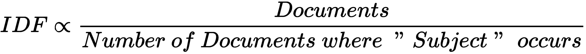.

精确的公式各不相同，每种变化都有细微差别，但所有公式都遵循将文档总数除以术语频率的概念。

在我们的项目中，我们将使用来自`go-nlp`的`tf-idf`库，这是一个 Go 语言的 NLP 相关库的存储库。要安装它，只需运行以下命令：

```py
go get -u github.com/go-nlp/tfidf
```

这是一个经过极好测试的库，测试覆盖率达到了 100%。

当一起使用时，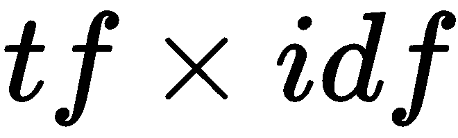代表了一种用于计算文档中词重要性的有用加权方案。它看起来很简单，但非常强大，尤其是在概率的背景下使用时。

请注意，TF-IDF 不能严格地解释为概率。当严格将 IDF 解释为概率时，会出现一些理论上的问题。因此，在本项目的背景下，我们将把 TF-IDF 视为一种概率的加权方案。

现在我们已经准备好讨论朴素贝叶斯算法的基本原理。但首先我想进一步强调贝叶斯定理的一些直觉。

# 条件概率

我们将从条件概率的概念开始。为了设定场景，我们将考虑几种水果类型：

+   苹果

+   鳄梨

+   香蕉

+   菠萝

+   油桃

+   芒果

+   草莓

对于每种水果类型，我们将有这些水果的几个实例——例如，我们可以在苹果类别中有绿色的 Granny Smith 和红色的 Red Delicious。同样，我们也可以有成熟和未成熟的水果——例如，芒果和香蕉可以是黄色的（成熟）或绿色的（未成熟）。最后，我们还可以根据水果的种类对这些水果进行分类——热带水果（鳄梨、香蕉、菠萝和芒果）与非热带水果：

| **水果** | **可以是绿色的** | **可以是黄色的** | **可以是红色的** | **是热带水果** |
| --- | --- | --- | --- | --- |
| **苹果** | 是 | 否 | 是 | 否 |
| **鳄梨** | 是 | 否 | 否 | 是 |
| **香蕉** | 是 | 是 | 否 | 是 |
| **荔枝** | 是 | 否 | 是 | 是 |
| **芒果** | 是 | 是 | 否 | 是 |
| **油桃** | 否 | 是 | 是 | 否 |
| **菠萝** | 是 | 是 | 否 | 是 |
| **草莓** | 是 | 否 | 是 | 否 |

我想让你现在想象你被蒙上了眼睛，你随机摘了一个水果。然后我会描述这个水果的一个特征，你将猜测这个水果是什么。

假设你摘的水果外面是黄色的。可能的水果有哪些？桃子、香蕉、菠萝和芒果都会出现在你的脑海中。如果你选择其中一个选项，你有四分之一的正确机会。我们称之为黄色的概率！[](img/dce6e753-bfdf-40ed-9684-1a0af16d0bad.png)。分子是“可以是黄色的”这一列中的“是”的数量，分母是总行数。

如果我给你另一个关于水果的特征，你可以提高你的胜算。比如说，我告诉你这个水果是热带的。现在你有三分之一的正确机会——油桃已经被排除在可能的选择之外了。

我们可以提出这样的问题：如果我们知道一个水果是热带水果，那么这个水果是黄色的概率是多少？答案是 3/5。从先前的表格中，我们可以看到有五种热带水果，其中三种是黄色的。这被称为**条件概率**。我们用公式来表示它（对于更倾向于数学的人来说，这是柯尔莫哥洛夫条件概率的定义）：

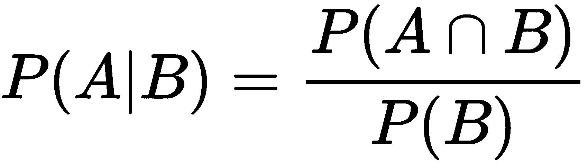

这样读取公式：已知 A 在 B 的条件下发生的概率，我们需要得到 A 和 B 同时发生的概率以及 B 本身发生的概率。

在已知水果是热带水果的条件下，水果是黄色的条件概率是五分之三；实际上有很多热带水果是黄色的——热带条件允许在水果生长过程中有更多的类胡萝卜素和维生素 C 的沉积。

通过查看表格结果可以更容易地理解条件概率。然而，必须注意的是，条件概率**可以**被计算。具体来说，要计算条件概率，这是公式：


水果既是黄色又是热带的概率是八分之三；在总共八种水果中，有三种是这样的水果。水果是热带的概率是八分之五；在列出的八种水果中，有五种是热带水果。

现在，我们终于准备好弄清楚我们是如何得到那个三分之一数字的。水果类别的概率是均匀的。如果你随机选择，你会在八分之一的时间里选对。我们可以将问题重新表述为：如果一个水果是黄色的并且是热带的，那么它是香蕉的概率是多少？

让我们将其重写为一个公式：

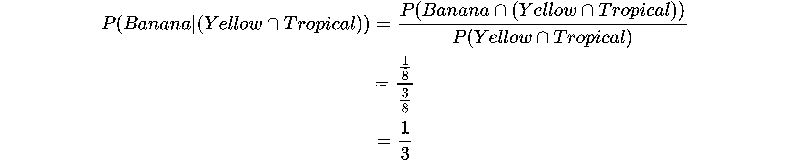

重要的是，我们依赖于一个特殊的技巧来分析前面的概率。具体来说，我们假设每个“是”代表一个存在的单一示例，而“否”表示没有示例，简而言之，这个表格：

| **水果** | **是绿色** | **是黄色** | **是红色** | **是热带** |
| --- | --- | --- | --- | --- |
| **苹果** | 1 | 0 | 1 | 0 |
| **鳄梨** | 1 | 0 | 0 | 1 |
| **香蕉** | 1 | 1 | 0 | 1 |
| **荔枝** | 1 | 0 | 1 | 1 |
| **芒果** | 1 | 1 | 0 | 1 |
| **桃子** | 0 | 1 | 1 | 0 |
| **菠萝** | 1 | 1 | 0 | 1 |
| **草莓** | 1 | 0 | 1 | 0 |

这对于垃圾邮件检测项目的分析非常重要。每个数字代表在数据集中出现的次数。

# 特征

从之前的例子中，我们已经看到，我们需要特征，比如水果是否可以是绿色、黄色或红色，或者它是否是热带的。我们现在专注于手头的项目。特征应该是什么？：

| **类别** | **???** | **???** | **???** |
| --- | --- | --- | --- |
| **垃圾邮件** |  |  |  |
| **火腿** |  |  |  |

一封电子邮件由什么组成？单词组成电子邮件。因此，考虑每个单词特征的出现情况是合适的。我们可以更进一步，利用我们之前开发的 TF-IDF 直觉，而不是简单地计数 1 表示存在，而是计数单词在文档类型中出现的总次数。

表格看起来可能如下所示：

| **类别** | **有 XXX** | **有站点** | **有免费** | **有语言学** | **...** |
| --- | --- | --- | --- | --- | --- |
| **垃圾邮件** | 200 | 189 | 70 | 2 | ... |
| **火腿** | 1 | 2 | 55 | 120 | ... |

这也意味着有很多特征。我们当然可以尝试列举所有可能的计算。但这样做会很繁琐，而且计算量很大。相反，我们可以尝试做得更聪明一些。具体来说，我们将使用条件概率的另一个定义来巧妙地减少需要进行的计算量。

# 贝叶斯定理

条件概率公式也可以写成贝叶斯定理：

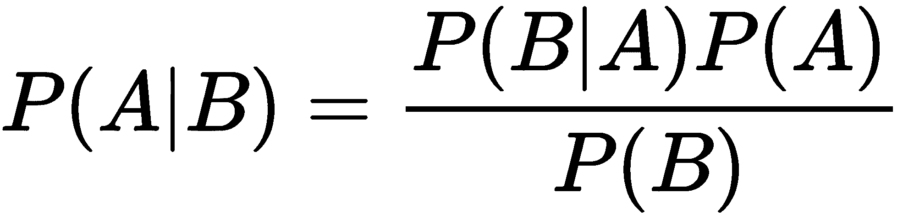

我们称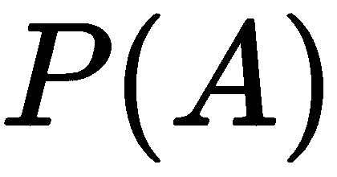为**先验概率**。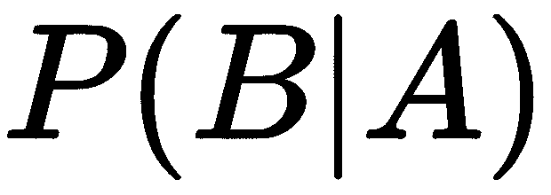被称为**似然**。这些是我们感兴趣的东西，因为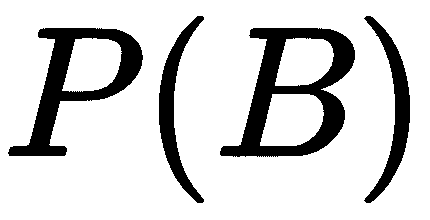本质上是一个常数。

到目前为止的理论有点枯燥。这与我们的项目有什么关系？

首先，我们可以将通用的贝叶斯定理重写为适合我们项目的形式：


这个公式完美地封装了我们的项目；给定一个由单词组成的文档，它是`Ham`或`Spam`的概率是多少？在下一节中，我将向您展示如何将这个公式翻译成一个功能强大的分类器，代码行数少于 100 行。

# 实现分类器

在本章的早期部分，我们草拟了一个什么也不做的`Classifier`类型。现在让我们让它做些事情：

```py
type Classifier struct {
  corpus *corpus.Corpus

  tfidfs [MAXCLASS]*tfidf.TFIDF
  totals [MAXCLASS]float64

  ready bool
  sync.Mutex
}
```

这里介绍了一些内容。让我们逐一了解：

+   我们将从`corpus.Corpus`类型开始。

+   这是一个从`corpus`包导入的类型，它是 Go 语言 NLP 库`lingo`的子包。

+   要安装`lingo`，只需运行`go get -u github.com/chewxy/lingo/...`.

+   要使用`corpus`包，只需像这样导入：`import "github.com/chewxy/lingo/corpus"`.

请记住，在不久的将来，这个包将更改为`github.com/go-nlp/lingo`。如果你在 2019 年 1 月之后阅读这篇文章，请使用新的地址。

`corpus.Corpus`对象简单地将单词映射到整数。这样做的原因有两个：

+   **它节省了内存**：`[]int`比`[]string`使用更少的内存。一旦语料库被转换为 ID，字符串的内存就可以释放。这样做是为了提供一个字符串池化的替代方案。

+   **字符串池化是变幻莫测的**：字符串池化是一种程序，在整个程序的内存中，只有一个字符串的副本。这比预期的要难得多。整数提供了一个更稳定的池化程序。

接下来，我们面临两个字段，它们是数组。具体来说，`tfidfs [MAXCLASS]*tfidf.TFIDF`和`totals [MAXCLASS]float64`。在这个时候，讨论`Class`类型可能是个好主意。

# 类别

当我们编写摄入代码时，我们接触到了`Class`类型。这是`Class`的定义：

```py
type Class byte

const (
  Ham Class = iota
  Spam
  MAXCLASS
)
```

换句话说，`Ham`是`0`，`Spam`是`1`，`MAXCLASS`是`2`。它们都是常量值，不能在运行时更改。

首先要谨慎注意的是，这种方法有一些局限性。特别是，这意味着在运行程序之前，你必须知道将有多少个类别。在我们的例子中，我们知道最多会有两个类别：`Spam`或`Ham`。如果我们知道有第三个类别，比如`Prosciutto`，那么我们可以在`MAXCLASS`之前将其编码为一个值。使用常量数值类型的`Class`有许多原因。其中两个主要原因是正确性和性能。

假设我们有一个以`Class`作为输入的函数：

```py
func ExportedFn(a Class) error {
  // does some decision making with a
}
```

使用这个函数的人可能会传入`3`作为类别：`ExportedFn(Class(3))`。如果我们有一个如下所示的有效性验证函数，我们可以立即判断值是否有效：

```py
func (c Class) isValid() bool { return c < MAXCLASS }
```

虽然这不如 Haskell 等其他语言那样优雅，在 Haskell 中你可以直接这样做：

```py
data Class = Ham 
            |Spam
```

并让编译器检查在调用点传入的值是否有效。我们仍然想要保证正确性，所以我们将检查推迟到运行时。`ExportedFn` 现在的读取方式如下：

```py
func ExportedFn(a Class) error {
  if !a.isValid() {
    return errors.New("Invalid class")
  }
  // does some decision making with a
  }
}
```

数据类型具有有效值范围的观念并不是一个革命性的观念。例如，Ada 自 1990 年代以来就有有界范围。而使用常量值作为 `MAXCLASS` 的范围的好处是，我们可以伪造范围检查并在运行时执行它们。在这方面，Go 大概与 Python、Java 或其他不安全语言相似。然而，真正闪耀的地方在于性能。

软件工程实践的一个小贴士是，在不牺牲理解或整洁性的情况下，尽可能让程序对人类来说是可知的。使用常量数值（或枚举）通常允许人类程序员理解值可以拥有的约束。在下一节中，我们将看到，使用常量字符串值会让程序员面临无约束的值。这就是通常发生错误的地方。

注意在 `Classifier` 结构体中，`tfidfs` 和 `totals` 都是数组。与切片不同，在 Go 中访问值时，数组不需要额外的间接层。这使得事情变得稍微快一点。但为了真正理解这种设计的权衡，我们需要查看 `Class` 的替代设计以及相应的 `tfidfs` 和 `totals` 字段的替代设计。

# 替代类设计

这里，我们想象 `Class` 的一个替代设计：

```py
type Class string

const (
  Ham Class = "Ham"
  Spam Class = "Spam"
)
```

由于这个变化，我们将不得不更新 `Classifier` 的定义：

```py
type Classifier struct {
  corpus *corpus.Corpus

  tfidfs map[Class]*tfidf.TFIDF
  totals map[Class]float64

  ready bool
  sync.Mutex
}
```

现在考虑获取 `Ham` 类总量的步骤：

1.  字符串必须进行哈希处理

1.  将使用哈希查找存储 `totals` 数据的桶

1.  对桶进行间接引用，并检索数据返回给用户

如果类设计是原始的，现在考虑获取 `Ham` 类总量的步骤：

+   由于 `Ham` 是一个数字，我们可以直接计算用于检索和返回给用户的 数据位置。

通过使用一个常量值和类型 `Class` 的数值定义，以及 `totals` 的数组类型，我们能够跳过两个步骤。这带来非常微小的性能提升。在这个项目中，直到数据达到一定规模，这些提升大多是可以忽略不计的。

本节关于 `Class` 设计的目的是培养一种机械同情感。如果你理解机器是如何工作的，你就可以设计非常快的机器学习算法。

说了这么多，有一个假设支撑着整个练习。这是一个`main`包。如果你正在设计一个将在不同数据集上重用的包，权衡考虑会有很大不同。在软件工程的背景下，过度泛化你的包往往会导致难以调试的抽象。最好是编写稍微更具体和特定的数据结构，这些结构是专门为特定目的构建的。

# 分类器第二部分

主要考虑之一是朴素贝叶斯分类器是一个非常简单的程序，而且很难出错。整个程序实际上少于 100 行。让我们进一步看看它。

我们已经概述了`Train`方法，该方法将在给定的一组输入上训练分类器。以下是它的样子：

```py
func (c *Classifier) Train(examples []Example) {
  for _, ex := range examples {
    c.trainOne(ex)
  }
}

func (c *Classifier) trainOne(example Example) {
  d := make(doc, len(example.Document))
  for i, word := range example.Document {
    id := c.corpus.Add(word)
    d[i] = id
  }
  c.tfidfs[example.Class].Add(d)
  c.totals[example.Class]++
}
```

因此，这里非常清楚，`Train`是一个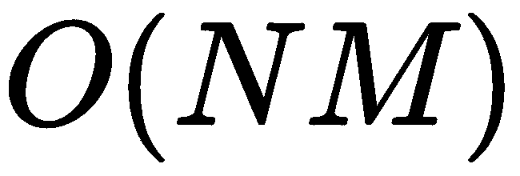操作。但是函数的结构使得并行调用`c.trainOne`变得非常简单。在这个项目的背景下，这并不是必要的，因为程序能在不到一秒内完成。然而，如果你正在为更大、更多样化的数据集修改这个程序，并行化调用可能会有所帮助。《Classifier》和`tfidf.TFIDF`结构中包含互斥锁，以允许这类扩展。

但更有趣的是`trainOne`示例。看看它，它似乎只是将每个单词添加到语料库中，获取其 ID，然后将 ID 添加到`doc`类型中。顺便说一句，`doc`被定义为如下：

```py
type doc []int

func (d doc) IDs() []int { return []int(d) }
```

这个定义是为了适应`tfidf.TFIDF.Add`接口所接受的格式。

让我们更仔细地看看`trainOne`方法。在创建`doc`之后，示例中的单词被添加到语料库中，而 ID 随后被放入`doc`中。然后，`doc`被添加到相关类的`tfidf.TFIDF`中。

初看之下，这里似乎没有太多训练过程；我们只是在增加 TF 统计量。

真正的魔法发生在`Predict`和`Score`方法中。

`Score`被定义为如下：

```py
func (c *Classifier) Score(sentence []string) (scores [MAXCLASS]float64) {
  if !c.ready {
    c.Postprocess()
  }

  d := make(doc, len(sentence))
  for i, word := range sentence {
    id := c.corpus.Add(word)
    d[i] = id
  }

  priors := c.priors()

  // score per class
  for i := range c.tfidfs {
    score := math.Log(priors[i])
    // likelihood
    for _, word := range sentence {
      prob := c.prob(word, Class(i))
      score += math.Log(prob)
    }

    scores[i] = score
  }
  return
}
```

给定一个分词句子，我们希望返回每个类的`scores`。这样我们就可以查看`scores`并找到得分最高的类：

```py
func (c *Classifier) Predict(sentence []string) Class {
  scores := c.Score(sentence)
  return argmax(scores)
}
```

`Score`函数值得深入探讨，因为所有的魔法都发生在这里。首先，我们检查分类器是否准备好评分。在线机器学习系统随着新数据的到来而学习。这种设计意味着分类器不能以在线方式使用。所有训练都需要在前面完成。一旦完成训练，分类器将被锁定，不再进行训练。任何新的数据都必须是不同运行的一部分。

`后处理`方法相当简单。记录了所有 TF 统计信息后，我们现在想要计算每个术语相对于文档的相对重要性。`tfidf`包附带了一个基于`Log`的 IDF 简单计算，但你也可以使用任何其他 IDF 计算函数，如下所示：

```py
func (c *Classifier) Postprocess() {
  c.Lock()
  if c.ready {
    c.Unlock()
    return
  }

  var docs int
  for _, t := range c.tfidfs {
    docs += t.Docs
  }
  for _, t := range c.tfidfs {
    t.Docs = docs
    // t.CalculateIDF()
    for k, v := range t.TF {
      t.IDF[k] = math.Log1p(float64(t.Docs) / v)
    }
  }
  c.ready = true
  c.Unlock()
}
```

重要的是要注意，每个类别的文档计数都有更新：`t.Docs = docs`到所有已看到的文档的总和。这是因为当我们向每个类别的词频添加时，`tfidf.TFIDF`结构不会意识到其他类别的文档。

我们想要计算 IDF 的原因是为了更好地控制这些值。

回想一下，条件概率可以写成贝叶斯定理的形式：

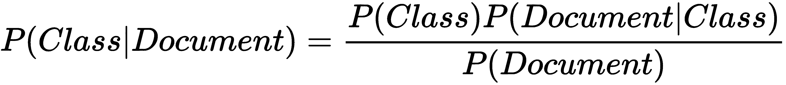

让我们再次熟悉一下公式，通过用英语重述它，首先熟悉一下术语：

+   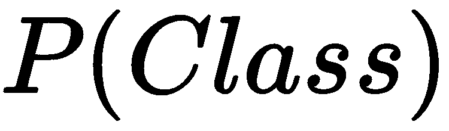: 这是指一个类的**先验概率**。如果我们有一批电子邮件消息，并且随机挑选一个，那么这封电子邮件是`Ham`或`Spam`的概率是多少？这很大程度上对应于我们拥有的数据集。从探索性分析中，我们知道`Ham`和`Spam`的比例大约是 80:20。

+   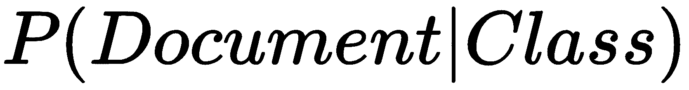: 这是指任何随机文档属于某一类的**可能性**。因为一个文档由单个单词组成，我们简单地做出一个朴素假设，即这些单词之间是相互独立的。因此，我们想要计算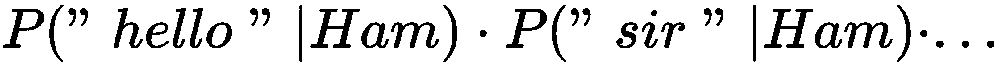的概率。假设单词是独立的，这使我们能够简单地乘以概率。

因此，用英语来说：

给定一个文档，该文档属于 Ham 类的条件概率是文档属于 Ham 的先验概率与文档是 Ham 的似然性的乘积。

注意到我没有解释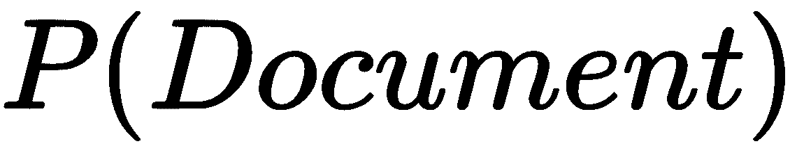的原因很简单。考虑文档的概率。它只是语料库中所有单词概率的乘积。它根本不与`Class`交互。它可能是一个常数。

此外，如果我们使用乘积的概率，我们还会遇到另一个问题。乘积的概率往往会得到越来越小的数字。计算机没有真正的有理数。`float64`是一种巧妙的方法来掩盖计算机的基本限制。当处理机器学习问题时，你经常会遇到数字变得太小或太大的边缘情况。

幸运的是，对于这个案例，我们有一个优雅的解决方案：我们可以选择在对数域中工作。我们不会考虑似然性，而是考虑对数似然性。在对数运算后，乘法变成了加法。这使得我们可以将其置于视线之外，并从脑海中排除。对于大多数情况，包括本项目，这是一个很好的选择。可能存在你希望归一化概率的情况。那么，忽略分母就不会有效。

让我们看看如何编写`priors`的代码：

```py
func (c *Classifier) priors() (priors []float64) {
  priors = make([]float64, MAXCLASS)
  var sum float64
  for i, total := range c.totals {
    priors[i] = total
    sum += total
  }
  for i := Ham; i < MAXCLASS; i++ {
    priors[int(i)] /= sum
  }
  return
}
```

先验概率基本上是`Ham`或`Spam`与所有文档总和的比例。这相当简单。为了计算似然性，让我们看看`Score`中的循环：

```py
  // likelihood
  for _, word := range sentence {
    prob := c.prob(word, Class(i))
    score += math.Log(prob)
  }
```

我们将似然函数纳入评分函数只是为了便于理解。但似然函数的重要启示是我们正在对给定类别的词的概率进行求和。你是如何计算 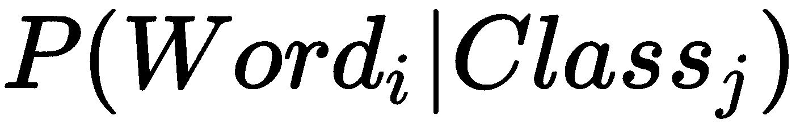 的？例如以下内容：

```py
func (c *Classifier) prob(word string, class Class) float64 {
  id, ok := c.corpus.Id(word)
  if !ok {
    return tiny
  }

  freq := c.tfidfs[class].TF[id]
  idf := c.tfidfs[class].IDF[id]
  // idf := 1.0

  // a word may not appear at all in a class.
  if freq == 0 {
    return tiny
  }

  return freq * idf / c.totals[class]
}
```

首先，我们检查单词是否已被看到。如果单词之前没有见过，那么我们返回一个默认值`tiny`——一个小的非零值，不会引起除以零错误。

一个词在某个类别中出现的概率简单地是其频率除以该类别看到的单词数。但我们要更进一步；我们想要控制频繁的单词在决定类别概率时不要成为过于重要的因素，所以我们将其乘以我们之前计算出的 IDF。这就是如何得到给定类别的词的概率。

在我们得到概率后，我们取其对数，然后将其加到分数上。

# 将它们全部组合起来

现在我们有了所有部件。让我们看看如何将它们组合在一起：

1.  我们首先`ingest`数据集，然后将数据分割成训练集和交叉验证集。数据集被分成十部分以进行 k 折交叉验证。我们不会这样做。相反，我们将通过保留 30%的数据进行交叉验证来执行单折交叉验证：

```py
  typ := "bare"
  examples, err := ingest(typ)
  log.Printf("errs %v", err)
  log.Printf("Examples loaded: %d", len(examples))
  shuffle(examples)
  cvStart := len(examples) - len(examples)/3
  cv := examples[cvStart:]
  examples = examples[:cvStart]
```

1.  我们首先训练分类器，然后检查分类器是否能够很好地预测其自己的数据集：

```py
  c := New()
  c.Train(examples)

  var corrects, totals float64
  for _, ex := range examples {
    // log.Printf("%v", c.Score(ham.Document))
    class := c.Predict(ex.Document)
    if class == ex.Class {
      corrects++
    }
    totals++
  }
  log.Printf("Corrects: %v, Totals: %v. Accuracy %v", corrects, totals, corrects/totals)
```

1.  训练分类器后，我们在数据上执行交叉验证：

```py
  log.Printf("Start Cross Validation (this classifier)")
  corrects, totals = 0, 0
  hams, spams := 0.0, 0.0
  var unseen, totalWords int
  for _, ex := range cv {
    totalWords += len(ex.Document)
    unseen += c.unseens(ex.Document)
    class := c.Predict(ex.Document)
    if class == ex.Class {
      corrects++
    }
    switch ex.Class {
    case Ham:
      hams++
    case Spam:
      spams++
    }
    totals++
  }
```

1.  在这里，我还添加了`unseen`和`totalWords`计数，作为一个简单的统计来查看分类器在遇到之前未见过的单词时如何泛化。

此外，因为我们事先知道数据集大约由 80%的`Ham`和 20%的`Spam`组成，所以我们有一个要击败的基线。简单来说，我们可以编写一个执行此操作的分类器：

```py
type Classifier struct{}
func (c Classifier) Predict(sentence []string) Class { return Ham }
```

假设我们有一个这样的分类器。那么它 80%的时候都是正确的！为了知道我们的分类器是好是坏，它必须击败一个基线。为了本章的目的，我们简单地打印出统计数据并相应地进行调整：

```py
  fmt.Printf("Dataset: %q. Corrects: %v, Totals: %v. Accuracy %v\n", typ, corrects, totals, corrects/totals)
  fmt.Printf("Hams: %v, Spams: %v. Ratio to beat: %v\n", hams, spams, hams/(hams+spams))
  fmt.Printf("Previously unseen %d. Total Words %d\n", unseen, totalWords)
```

因此，最终的`main`函数看起来如下所示：

```py
func main() {
  typ := "bare"
  examples, err := ingest(typ)
  if err != nil {
    log.Fatal(err)
  }

  fmt.Printf("Examples loaded: %d\n", len(examples))
  shuffle(examples)
  cvStart := len(examples) - len(examples)/3
  cv := examples[cvStart:]
  examples = examples[:cvStart]

  c := New()
  c.Train(examples)

  var corrects, totals float64
  for _, ex := range examples {
    // fmt.Printf("%v", c.Score(ham.Document))
    class := c.Predict(ex.Document)
    if class == ex.Class {
      corrects++
    }
    totals++
  }
  fmt.Printf("Dataset: %q. Corrects: %v, Totals: %v. Accuracy %v\n", typ, corrects, totals, corrects/totals)

  fmt.Println("Start Cross Validation (this classifier)")
  corrects, totals = 0, 0
  hams, spams := 0.0, 0.0
  var unseen, totalWords int
  for _, ex := range cv {
    totalWords += len(ex.Document)
    unseen += c.unseens(ex.Document)
    class := c.Predict(ex.Document)
    if class == ex.Class {
      corrects++
    }
    switch ex.Class {
    case Ham:
      hams++
    case Spam:
      spams++
    }
    totals++
  }

  fmt.Printf("Dataset: %q. Corrects: %v, Totals: %v. Accuracy %v\n", typ, corrects, totals, corrects/totals)
  fmt.Printf("Hams: %v, Spams: %v. Ratio to beat: %v\n", hams, spams, hams/(hams+spams))
  fmt.Printf("Previously unseen %d. Total Words %d\n", unseen, totalWords)
}
```

在`bare`上运行它，这是我得到的结果：

```py
Examples loaded: 2893
Dataset: "bare". Corrects: 1917, Totals: 1929\. Accuracy 0.9937791601866252
Start Cross Validation (this classifier)
Dataset: "bare". Corrects: 946, Totals: 964\. Accuracy 0.9813278008298755
Hams: 810, Spams: 154\. Ratio to beat: 0.8402489626556017
Previously unseen 17593\. Total Words 658105
```

要看到去除停用词和词形还原的影响，我们只需切换到使用`lemm_stop`数据集，这就是我得到的结果：

```py
Dataset: "lemm_stop". Corrects: 1920, Totals: 1929\. Accuracy 0.995334370139969
Start Cross Validation (this classifier)
Dataset: "lemm_stop". Corrects: 948, Totals: 964\. Accuracy 0.983402489626556
Hams: 810, Spams: 154\. Ratio to beat: 0.8402489626556017
Previously unseen 16361\. Total Words 489255
```

不论哪种方式，这个分类器都非常有效。

# 摘要

在本章中，我展示了朴素贝叶斯分类器的基本形态——一个用对统计学基本理解编写的分类器，在任何时候都会胜过任何公开可用的库。

分类器本身的代码行数不到 100 行，但它带来了巨大的力量。能够以 98%或更高的准确率进行分类可不是什么容易的事情。

关于 98%这个数字的说明：这并不是最先进的技术。最先进的技术在 99.xx%的高位。之所以有为了那最后 1%而进行的竞争，主要是因为规模问题。想象一下，你是谷歌，你在运行 Gmail。0.01%的错误意味着数百万封邮件被错误分类。这意味着许多不满意的客户。

在机器学习中，是否采用新且未经测试的方法在很大程度上取决于你问题的规模。根据我过去 10 年从事机器学习的经验，大多数公司并没有达到那么大的数据规模。因此，朴素的朴素贝叶斯分类器会非常适用。

在下一章中，我们将探讨人类面临的最棘手的问题之一：时间。
