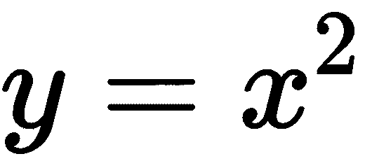

# 使用时间序列分析分解 CO2 趋势

如果你是在 2055 年阅读这本书——假设你仍然在使用基于公历的年份系统（一年是地球围绕太阳公转一次所需的时间）——恭喜你！你已经存活了下来。这本书是在 2018 年写的，而我们人类在物种生存方面有许多担忧。

总的来说，我们已经设法进入了一个相对稳定的和平时期，但作为整体，我们物种的未来面临着各种威胁。其中大部分威胁是由我们过去的行为引起的。我想强调一点：我并不是在责怪过去任何人造成这些威胁。我们的祖先正忙于优化不同的目标，而这些威胁通常是当时行动中不可预见/无法预见的外部效应。

另一个影响因素是，从生物学的角度来看，人类并不擅长思考未来。我们的大脑根本不把我们未来的自己视为当前自我的连续体[0],[1]。因此，我们常常把未来可能发生的事情看作是别人发生的事情，或者认为未来被夸大了。这导致了今天做出的决策没有考虑到未来的影响。这导致了我们物种过去行为引起的许多威胁。

其中一个威胁是失控的气候变化，这可能会摧毁我们整个的生活方式，并可能威胁到整个人类的灭绝。这是非常真实且不过分的。人为引起的气候变化是一个非常广泛的话题，有许多细分领域。人为引起气候变化的主要原因是在空气中释放二氧化碳（**CO[2]**）的速率增加。

在本章中，我们将对空气中的二氧化碳（CO[2]）进行时间序列分析。本章的主要目标是作为时间序列分析的入门介绍。在技术层面，你将学习使用**Gonum**进行细粒度绘图。此外，我们还将学习如何处理非常规数据格式。

# 探索性数据分析

空气中的二氧化碳含量是可以测量的。**国家海洋和大气管理局**（**NOAA**）部门自 20 世纪 50 年代初就开始收集空气中二氧化碳含量的数据。我们将使用的数据可以在[`www.esrl.noaa.gov/gmd/ccgg/trends/data.html`](https://www.esrl.noaa.gov/gmd/ccgg/trends/data.html)找到。我们将特别使用莫纳罗亚的月平均数据。

移除注释后的数据看起来大致如下：

```py
# decimal average interpolated trend #days
# date (season corr)
1958 3 1958.208 315.71 315.71 314.62 -1
1958 4 1958.292 317.45 317.45 315.29 -1
1958 5 1958.375 317.50 317.50 314.71 -1
1958 6 1958.458 -99.99 317.10 314.85 -1
1958 7 1958.542 315.86 315.86 314.98 -1
1958 8 1958.625 314.93 314.93 315.94 -1

```

尤其是我们对`插值`列感兴趣。

由于这是一个特别有趣的数据库，可能值得看看如何在 Go 中直接下载和预处理数据。

# 从非 HTTP 源下载

我们将首先编写一个下载数据的函数，如下所示：

```py
func download() io.Reader {
  client, err := ftp.Dial("aftp.cmdl.noaa.gov:21")
  dieIfErr(err)
  dieIfErr(client.Login("anonymous", "anonymous"))
  reader, err := client.Retr("products/trends/co2/co2_mm_mlo.txt")
  dieIfErr(err)
  return reader
}
```

NOAA 数据位于一个公开可访问的 FTP 服务器上：ftp://aftp.cmdl.noaa.gov/products/trends/co2/co2_mm_mlo.txt。如果你通过网页浏览器访问 URI，你会立即看到数据。以编程方式访问数据有点棘手，因为这不是一个典型的 HTTP URL。

为了处理 FTP 连接，我们将使用 `github.com/jlaffaye/ftp` 包。可以使用标准的 `go get` 方法安装该包：`go get -u github.com/jlaffaye/ftp`。该包的文档相对较少，并且需要你理解 FTP 标准。但不用担心，使用 FTP 获取文件相对简单。

首先，我们需要连接到服务器（如果你正在处理 HTTP 端点——`net/http` 仅抽象出连接过程，所以你不必一定看到后台发生的事情）。因为连接是一个相当低级的过程，我们需要提供端口号。就像 HTTP 的惯例是服务器监听端口 `80` 一样，FTP 服务器的惯例是监听端口 `21`，所以我们需要连接到一个指定要连接到端口 `21` 的服务器。

对于不习惯使用 FTP 的人来说，一个额外的奇怪之处在于 FTP 需要登录到服务器。对于具有匿名只读访问的服务器，通常的做法是使用 "anonymous" 作为用户名和密码。

成功登录后，我们检索请求的资源（我们想要的文件）并下载文件。位于 [github.com/jlaffaye/ftp](https://github.com/jlaffaye/ftp) 的 `fttp` 库返回 `io.Reader`。可以将其视为包含数据的文件。

# 处理非标准数据

仅使用标准库解析数据是一件轻而易举的事情：

```py
func parse(l loader) (dates []string, co2s []float64) {
  s := bufio.NewScanner(l())
  for s.Scan() {
    row := s.Text()
    if strings.HasPrefix(row, "#") {
      continue
    }
    fields := strings.Fields(row)
    dates = append(dates, fields[2])
    co2, err := strconv.ParseFloat(fields[4], 64)
    dieIfErr(err)
    co2s = append(co2s, co2)
  }
  return
}
```

解析函数接受一个 `loader`，当调用时返回一个 `io.Reader`。然后我们将 `io.Reader` 包装在 `bufio.Scanner` 中。回想一下，格式不是标准的。有些是我们想要的，有些我们不想。然而，数据格式相当一致——我们可以使用标准库函数来过滤我们想要的和不想的。

`s.Scan()` 方法扫描 `io.Reader` 直到遇到换行符。我们可以使用 `s.Text()` 获取字符串。如果字符串以 `#` 开头，我们跳过该行。

否则，我们使用 `strings.Fields` 将字符串拆分为字段。我们之所以使用 `strings.Fields` 而不是 `strings.Split`，是因为后者处理多个空格不好。

在将行拆分为字段之后，我们解析必要的内容：

```py
type loader func() io.Reader
```

为什么我们需要一个 `loader` 类型？

原因很简单：我们想成为好公民——在开发程序时，我们不应该反复从 FTP 服务器请求数据。相反，我们会缓存文件，并在开发模式下使用该单个文件。这样，我们就不必总是从互联网上下载。

从文件中读取的相应`loader`类型看起来如下，相当直观：

```py
func readFromFile() io.Reader {
  reader, err := os.Open("data.txt")
  dieIfErr(err)
  return reader
}
```

# 处理十进制日期

在这些数据中使用的更多有趣的自定义格式之一是日期。它是一种称为**十进制日期**的格式。它们看起来如下所示：

```py
2018.5
```

这意味着这个日期代表了 2018 年的中点。2018 年有 365 天。50%的标记将是 183 天：2018 年 7 月 3 日。

我们可以将这个逻辑转换为以下代码：

```py
// parseDecimalDate takes a string in format of a decimal date
// "2018.05" and converts it into a date.
//
func parseDecimalDate(a string, loc *time.Location) (time.Time, error) {
  split := strings.Split(a, ".")
  if len(split) != 2 {
    return time.Time{}, errors.Errorf("Unable to split %q into a year followed by a decimal", a)
  }
  year, err := strconv.Atoi(split[0])
  if err != nil {
    return time.Time{}, err
  }
  dec, err := strconv.ParseFloat("0."+split[1], 64) // bugs can happen if you forget to add "0."
  if err != nil {
    return time.Time{}, err
  }

  // handle leap years
  var days float64 = 365
  if year%400 == 0 || year%4 == 0 && year%100 != 0 {
    days = 366
  }

  start := time.Date(year, time.January, 1, 0, 0, 0, 0, loc)
  daysIntoYear := int(dec * days)
  retVal := start.AddDate(0, 0, daysIntoYear)
  return retVal, nil
}
```

第一步是将字符串拆分为年份和小数部分。年份被解析为`int`数据类型，而小数部分被解析为浮点数以确保我们可以进行数学运算。在这里，需要注意的是，如果不小心处理，可能会发生错误：在拆分字符串后，需要将`"0."`添加到字符串前面。

一个更简洁的替代方案是将字符串解析为`float64`，然后使用`math.Modf`将浮点数拆分为整数部分和小数部分。

无论哪种方式，一旦我们有了小数部分，我们就可以用它来确定一年中的天数。但首先，我们需要确定这一年是否是闰年。

我们可以通过将小数乘以一年中的天数来简单地计算年份中的天数。在此基础上，我们只需添加日期数，然后返回日期。

需要注意的一点是，我们传递了一个`*time.Location`——在这个特定的情况下，我们知道天文台位于夏威夷，因此我们将其设置为`"Pacific/Honolulu"`。尽管在这种情况下，我们可以将位置设置为世界上任何其他地方，这不会改变数据的结果。但这在这个项目中是独特的——在其他时间序列数据中，时区可能很重要，因为数据收集方法可能涉及来自不同时区的时数据。

# 绘图

现在我们已经完成了获取文件和解析文件的工作，让我们绘制数据。再次，就像在第二章中，*线性回归-房价预测*，我们将使用 Gonum 出色的绘图库。这一次，我们将更详细地探索它。我们将学习以下内容：

+   如何绘制时间序列图

+   如何将图表分解为其元素以及如何操作这些元素来设计图表

+   如何创建 Gonum 不提供的图表类型的绘图器

我们首先编写一个函数来绘制时间序列图：

```py
func newTSPlot(xs []time.Time, ys []float64, seriesName string) *plot.Plot {
  p, err := plot.New()
  dieIfErr(err)
  xys := make(plotter.XYs, len(ys))
  for i := range ys {
    xys[i].X = float64(xs[i].Unix())
    xys[i].Y = ys[i]
  }
  l, err := plotter.NewLine(xys)
  dieIfErr(err)
  l.LineStyle.Color = color.RGBA{A: 255} // black
  p.Add(l)
  p.Legend.Add(seriesName, l)
  p.Legend.TextStyle.Font = defaultFont

  // dieIfErr(plotutil.AddLines(p, seriesName, xys))
  p.X.Tick.Marker = plot.TimeTicks{Format: "2006-01-01"}
  p.Y.Label.TextStyle.Font = defaultFont
  p.X.Label.TextStyle.Font = defaultFont
  p.X.Tick.Label.Font = defaultFont
  p.Y.Tick.Label.Font = defaultFont
  p.Title.Font = defaultFont
  p.Title.Font.Size = 16

  return p
}
```

在这里，我们使用已经熟悉的`plotter.XYs`（你会在第一章中熟悉它）。这次，我们不会像上次那样使用`plotutil.AddLines`，而是手动操作，这使我们能够更好地控制线条的样式。

我们只需使用 `plotter.NewLine` 创建一个新的 `*Line` 对象。`*Line` 对象主要是 `plot.Plotter`，它是任何可以将其自身绘制到画布上的类型。在本章的后续部分，我们将探讨如何创建我们自己的 `plot.Plotter` 接口和其他相关类型来绘制自定义类型。

# 样式

但是，目前，能够访问 `*Line` 对象使我们能够对样式进行更多操作。为了与本章相当忧郁的性质相匹配，我选择了一条纯黑色线条（实际上，我已经相当喜欢纯黑色线条图表，并开始在日常图表中使用它们）。需要注意的是，我这样做：

```py
l.LineStyle.Color = color.RGBA{A: 255}
```

`l.LineStyle.Color` 接受 `color.Color`——`color.RGBA` 是标准库中 `color` 库中的一个结构体。它是一个包含四个字段的表示颜色的结构体，例如 `Red`、`Green`、`Blue` 和 `Alpha`。在这里，我利用了 Go 的默认值——0s。但是，`Alpha` 值为 `0` 意味着它是不可见的。因此，我只将 `A` 字段设置为 `255`——其余字段默认为 `0`，这使得它呈现为纯黑色。

在设置线条样式后，我们使用 `p.Add(l)` 将线条添加到图中。因为我们没有使用 `plotutil.AddLines`，它抽象了一些手动工作，所以我们可能会发现如果我们运行该函数，图中没有图例。没有图例的图通常是没有用的。因此，我们还需要使用 `p.Legend.Add(seriesName, l)` 添加图例。

除了颜色、宽度和类似之外，我还想为本章制作的图表添加一种更粗犷的感觉——毕竟，本章相当悲观。我觉得默认字体 Times New Roman 稍显人文主义。因此，我们需要更改字体。幸运的是，扩展的 Go 标准库附带了一个字体处理库。虽然通常我会选择使用粗衬线字体来实现粗犷的外观，但 Go 本身就附带了一个效果很好的字体——Go 字体家族。

我们如何在 `*plot.Plot` 中更改字体？`*plot.Plot` 的大多数组件都接受一个 `draw.TextStyle`，这是一个配置文本样式的数据结构，包括字体。因此，我们可以设置这些字段来表示我们想要使用我们选择的字体。

正如我提到的，在扩展的标准库中，Go 附带了字体和字体处理工具。我们在这里将使用它。首先，我们必须安装以下包：`go get -u golang.org/x/image/font/gofont/gomono` 和 `go get -u github.com/golang/freetype/truetype`。前者是 Go 字体家族的官方 **等宽字体**。后者是一个用于处理 TrueType 字体的库。

这里必须提到一个注意事项——虽然`draw.TextStyle`允许配置字体，但字体是`vg.Font`类型，它封装了一个`*truetype.Font`类型。如果我们使用`truetype.Parse(gomono.TTF)`，我们将得到`*truetype.Font`。`vg`包提供了一个创建这些字体的函数——`vg.MakeFont`。之所以需要这样做而不是仅仅使用`*truetype.Font`，是因为`vg`有很多后端——其中一些渲染字体可能需要字体大小信息。

因此，为了避免多次调用解析字体并创建`vg.Font`类型，我们可以安全地将它放在一个全局变量中，前提是我们已经提前决定所有字体都将采用相同的粗犷风格：

```py
var defaultFont vg.Font

func init() {
  font, err := truetype.Parse(gomono.TTF)
  if err != nil {
    panic(err)
  }
  vg.AddFont("gomono", font)
  defaultFont, err = vg.MakeFont("gomono", 12)
  if err != nil {
    panic(err)
  }
}
```

完成这些后，我们可以将所有`draw.TextStyle.Font`设置为`defaultFont`。然而，将默认字体大小设置为 12 并不意味着你将固定使用这个大小。因为`vg.Font`是一个结构体，而不是结构体的指针，一旦在一个对象中设置，你就可以自由地更改该特定字段的字体大小，就像我在以下两行中展示的那样：

```py
  p.Title.Font = defaultFont
  p.Title.Font.Size = 16
```

使用我们的`main`函数，我们可以执行以下代码：

```py
func main() {
  dateStrings, co2s := parse(readFromFile)
  dates := parseDates(dateStrings)
  plt := newTSPlot(dates, co2s, "CO2 Level")
  plt.X.Label.Text = "Time"
  plt.Y.Label.Text = "CO2 in the atmosphere (ppm)"
  plt.Title.Text = "CO2 in the atmosphere (ppm) over time\nTaken over the Mauna-Loa observatory"
  dieIfErr(plt.Save(25*vg.Centimeter, 25*vg.Centimeter, "Moana-Loa.png"))
}
```

结果非常明显，如下面的截图所示：


# 分解

关于前面的截图，有两点需要注意：

+   空气中的二氧化碳水平随着时间的推移稳步上升。

+   二氧化碳水平有起伏，但结果最终还是上升。这些起伏发生在有规律的图案中。

第一点是统计学家所熟知的**趋势**。你可能已经熟悉了来自 Microsoft Excel 的趋势线的概念。趋势是一种描述随时间逐渐变化的模式。在我们的例子中，很明显趋势是向上的。

第二点被称为**季节性**——非常恰当，因为它可能就是这样。季节性描述的是定期发生的方差模式。如果你仔细观察图表，通常在每年的 8 月到 10 月，二氧化碳水平降至全年的最低点。之后，它们又稳步上升，直到大约 5 月达到峰值。以下是一个关于为什么会发生这种情况的好提示：植物通过光合作用从空气中吸收二氧化碳。光合作用需要植物细胞中的一个称为叶绿体的细胞器，其中含有一种名为叶绿素的绿色色素。如果你生活在北半球，你一定会知道树木从春天到秋天都是绿色的。这很大程度上与 5 月到 10 月的时期相吻合。季节的变化导致大气二氧化碳水平的变化。你当然可以理解为什么“季节性”这个术语非常恰当。

一个值得提出的问题可能是这样的：我们能否将趋势与季节性分开，以便我们能够单独处理每个组成部分？答案是肯定的。事实上，在本节的剩余部分，我将展示如何做到这一点。

现在，至于为什么你想做那件事，嗯，在我们迄今为止的项目中，我们已经看到了受现实生活日历季节影响的季节性。想象一下，如果你在为一家西方国家的玩具公司做统计分析。你会在圣诞节期间看到年销售高峰。通常，季节性会给我们的分析增加噪声——很难判断销售增长是由于圣诞节还是实际的销售增长。此外，还有一些周期并不一定遵循日历年。如果你在主要面向中国/越南社区的销售中处理销售，你会在春节/越南新年之前看到销售高峰。这些并不遵循我们的日历年。同样，如果你在日期行业——你会在斋月期间看到销售高峰，因为穆斯林斋戒期间对日期的需求急剧增加。

虽然大多数时间序列都会有一些趋势和季节性成分，但我提到并非所有趋势和季节性都特别有用。你可能想将本章学到的知识应用到股票市场上，但请注意！分析复杂的市场与分析空气中 CO[2]的趋势或企业的销售情况是不同的。市场时间序列的基本属性有所不同——它是一个具有马尔可夫性质的进程，这最好描述为**过去的表现并不预示未来的表现**。相比之下，我们将看到，在这个项目中，过去与现在和未来有很好的相关性。

但回到我们的话题——分解。如果你阅读数据文件上的注释（我们跳过的导入行），以下内容被提及：

"首先，我们为每个月计算一个围绕每月值的 7 年窗口内的平均季节周期。这样，季节周期可以随着时间的推移缓慢变化。然后，通过去除季节周期，我们确定每个月的“趋势”值；这个结果在“趋势”列中显示。"

# STL

但如何计算季节周期呢？在本节中，我们将使用 1980 年代末发明的一种算法，称为由 Cleveland 等人发明的**季节和趋势分解**（**STL**）算法，它被称为 LOESS。我编写了一个实现该算法的库。你可以通过运行`go get -u github.com/chewxy/stl`来安装它。

这个库实际上非常小巧——只有一个需要调用的`main`函数（`stl.Dcompose`），并且库中包含了一系列辅助数据分解的功能。

尽管如此，我认为在使用它之前对 STL 算法有一个大致的了解是个好主意，因为使用它需要相关知识。

# LOESS

STL 的动力来源于局部回归的概念——LOESS 本身是一个糟糕的缩写，由 **LO**cal regr**ESS**ion 组成——不管统计学家在 20 世纪 90 年代吸了什么药，我愿意加入他们。我们已经从第一章，*如何解决所有机器学习问题*中熟悉了线性回归的概念。

回想一下，线性回归的作用是给定一个直线函数： 。我们想要估计  和 。与其试图一次性拟合整个数据集，为什么不将数据集分成许多小的**局部**组件，并对每个小数据集进行回归分析呢？以下是我想要表达的一个例子：

```py
| X | Y |
 |:--:|:--|
 | -1 | 1 |
 | -0.9 | 0.81 |
 | -0.8 | 0.64 |
 | -0.7 | 0.49 |
 | -0.6 | 0.36 |
 | -0.5 | 0.25 |
 | -0.4 | 0.16 |
 | -0.3 | 0.09 |
 | -0.2 | 0.04 |
 | -0.1 | 0.01 |
 | 0 | 0 |
 | 0.1 | 0.01 |
 | 0.2 | 0.04 |
 | 0.3 | 0.09 |
 | 0.4 | 0.16 |
 | 0.5 | 0.25 |
 | 0.6 | 0.36 |
 | 0.7 | 0.49 |
 | 0.8 | 0.64 |
 | 0.9 | 0.81 |
```

前面的表格是一个表示  的函数。在回归分析中，我们通常需要拉入整个数据集，但如果我们每三行进行一次运行回归分析会怎样呢？我们从第 2 行（x = -0.9）开始。考虑的数据点是它之前的`1`和它之后的`1`（*x = -1* 和 *x = -0.8*）。对于第 3 行，我们将使用第`2`、`3`、`4`行作为数据点进行线性回归。在这个阶段，我们并不特别关注局部回归的错误。我们只想估计梯度交叉。下面是得到的结果表：

```py
| X | Y | m | c
 |:--:|:--:|:--:|:--:|
 | -0.9 | 0.81 | -1.8 | -0.803333333333333 |
 | -0.8 | 0.64 | -1.6 | -0.633333333333334 |
 | -0.7 | 0.49 | -1.4 | -0.483333333333334 |
 | -0.6 | 0.36 | -1.2 | -0.353333333333333 |
 | -0.5 | 0.25 | -1 | -0.243333333333333 |
 | -0.4 | 0.16 | -0.8 | -0.153333333333333 |
 | -0.3 | 0.09 | -0.6 | -0.083333333333333 |
 | -0.2 | 0.04 | -0.4 | -0.033333333333333 |
 | -0.1 | 0.01 | -0.2 | -0.003333333333333 |
 | 0 | 0 | -2.71050543121376E-17 | 0.006666666666667 |
 | 0.1 | 0.01 | 0.2 | -0.003333333333333 |
 | 0.2 | 0.04 | 0.4 | -0.033333333333333 |
 | 0.3 | 0.09 | 0.6 | -0.083333333333333 |
 | 0.4 | 0.16 | 0.8 | -0.153333333333333 |
 | 0.5 | 0.25 | 1 | -0.243333333333333 |
 | 0.6 | 0.36 | 1.2 | -0.353333333333333 |
 | 0.7 | 0.49 | 1.4 | -0.483333333333334 |
 | 0.8 | 0.64 | 1.6 | -0.633333333333333 |
 | 0.9 | 0.81 | 1.8 | -0.803333333333333 |
```

实际上，我们可以证明，如果你单独绘制每条线，你会得到一个有点“弯曲”的形状。所以，这里有一个我编写的辅助程序来绘制这个图表：

```py
// +build sidenote

package main

import (
  "image/color"

  "github.com/golang/freetype/truetype"
  "golang.org/x/image/font/gofont/gomono"
  "gonum.org/v1/plot"
  "gonum.org/v1/plot/plotter"
  "gonum.org/v1/plot/vg"
  "gonum.org/v1/plot/vg/draw"
)

var defaultFont vg.Font

func init() {
  font, err := truetype.Parse(gomono.TTF)
  if err != nil {
    panic(err)
  }
  vg.AddFont("gomono", font)
  defaultFont, err = vg.MakeFont("gomono", 12)
  if err != nil {
    panic(err)
  }
}

var table = []struct {
  x, m, c float64
}{
  {-0.9, -1.8, -0.803333333333333},
  {-0.8, -1.6, -0.633333333333334},
  {-0.7, -1.4, -0.483333333333334},
  {-0.6, -1.2, -0.353333333333333},
  {-0.5, -1, -0.243333333333333},
  {-0.4, -0.8, -0.153333333333333},
  {-0.3, -0.6, -0.083333333333333},
  {-0.2, -0.4, -0.033333333333333},
  {-0.1, -0.2, -0.003333333333333},
  {0, -2.71050543121376E-17, 0.006666666666667},
  {0.1, 0.2, -0.003333333333333},
  {0.2, 0.4, -0.033333333333333},
  {0.3, 0.6, -0.083333333333333},
  {0.4, 0.8, -0.153333333333333},
  {0.5, 1, -0.243333333333333},
  {0.6, 1.2, -0.353333333333333},
  {0.7, 1.4, -0.483333333333334},
  {0.8, 1.6, -0.633333333333333},
  {0.9, 1.8, -0.803333333333333},
}

type estimates []struct{ x, m, c float64 }

func (es estimates) Plot(c draw.Canvas, p *plot.Plot) {
  trX, trY := p.Transforms(&c)
  lineStyle := plotter.DefaultLineStyle
  lineStyle.Dashes = []vg.Length{vg.Points(2), vg.Points(2)}
  lineStyle.Color = color.RGBA{A: 255}
  for i, e := range es {
    if i == 0 || i == len(es)-1 {
      continue
    }
    strokeStartX := es[i-1].x
    strokeStartY := e.m*strokeStartX + e.c
    strokeEndX := es[i+1].x
    strokeEndY := e.m*strokeEndX + e.c
    x1 := trX(strokeStartX)
    y1 := trY(strokeStartY)
    x2 := trX(strokeEndX)
    y2 := trY(strokeEndY)
    x := trX(e.x)
    y := trY(e.x*e.m + e.c)

    c.DrawGlyph(plotter.DefaultGlyphStyle, vg.Point{X: x, Y: y})
    c.StrokeLine2(lineStyle, x1, y1, x2, y2)
  }
}

func main() {
  p, err := plot.New()
  if err != nil {
    panic(err)
  }
  p.Title.Text = "X² Function and Its Estimates"
  p.X.Label.Text = "X"
  p.Y.Label.Text = "Y"
  p.X.Min = -1.1
  p.X.Max = 1.1
  p.Y.Min = -0.1
  p.Y.Max = 1.1
  p.Y.Label.TextStyle.Font = defaultFont
  p.X.Label.TextStyle.Font = defaultFont
  p.X.Tick.Label.Font = defaultFont
  p.Y.Tick.Label.Font = defaultFont
  p.Title.Font = defaultFont
  p.Title.Font.Size = 16
```

现在，我们将看到如何绘制原始函数：

```py
  // Original function
  original := plotter.NewFunction(func(x float64) float64 { return x * x })
  original.Color = color.RGBA{A: 16}
  original.Width = 10
  p.Add(original)

  // Plot estimates
  est := estimates(table)
  p.Add(est)

  if err := p.Save(25*vg.Centimeter, 25*vg.Centimeter, "functions.png"); err != nil {
    panic(err)
  }
}
```

前面的代码生成了一个图表，如下面的截图所示：


大部分代码将在本章的后半部分进行解释，但，现在让我们专注于这样一个事实：你确实可以在数据的“局部”子集上运行许多小的线性回归来绘制曲线。

LOESS 通过指出，如果你有一个值窗口（在玩具示例中，我们使用了`3`），那么这些值应该被加权。逻辑很简单：一个值离考虑的行越近，其权重就越高。如果我们使用了`5`的窗口大小，那么在考虑第`3`行时，`2`和`4`行会比`1`和`5`行有更高的权重。这个**宽度**，结果证明，对我们平滑处理很重要。

子包 `"github.com/chewxy/stl/loess"` 实现了 LOESS 作为平滑算法。如果你对了解更多细节感兴趣，请阅读代码。

# 算法

回想一下，我们的目标是把时间序列分解成季节性和趋势。显然，一旦我们移除了季节性和趋势，就会有一些剩余的部分。我们把这些称为**残差**。那么，我们该如何做呢？

算法有很多微调是为了提高鲁棒性。我将省略对各种鲁棒性优化进行的解释，但我认为了解算法在一般情况下是如何工作的有一个大致的概念是很重要的。

以下是对算法的简要概述：

1.  计算趋势（在第一次循环中，趋势全是 0）。

1.  从输入数据中减去趋势。这被称为**去趋势**。

1.  循环子序列平滑：数据被划分为`N`个子周期。每个子周期对应一个周期。然后使用 LOESS 对数据进行平滑处理。结果是临时的季节性数据集。

1.  对于每个临时的季节性数据集（每个周期一个），我们执行低通滤波——我们保留低频值。

1.  低通滤波后的值从临时季节性数据集中减去。这就是季节性数据。

1.  从输入数据中减去季节性数据。这就是新的趋势数据。

1.  迭代步骤 1 到步骤 6，直到达到所需的迭代次数。这通常是 1 或 2。

如您所见，算法是迭代的——每次迭代都会改进趋势，然后使用改进后的趋势来找到新的季节性数据，然后使用新的季节性数据来更新趋势，如此循环。但 STL 依赖于一个非常重要且容易被忽视的“魔法”。

因此，我们来到理解算法的第二个重要原因：**STL 依赖于数据集周期的定义**。

# 使用 STL

回顾一下，STL 算法有两个基本的重要部分：

+   用于平滑的**宽度**

+   数据集中的**周期数**

当我们查看 CO[2]数据集时，我们可以通过计数图表中的峰值来计算周期数。我数了 60 个峰值。这对应于观测站过去 60 年一直在收集数据的事实。

从这里，我们从统计学的硬科学领域转向了更软的解释领域。这在数据科学和机器学习中通常是正确的——我们经常需要依靠直觉来引导我们。

在这种情况下，我们有一个明确的起点：已经过去了 60 年，所以我们预计至少有 60 个周期。另一个起点可以在数据集本身的注释中找到：NOAA 使用 7 年窗口来计算季节性成分。我看不出不使用这些值的原因。所以，让我们将我们的时间序列分解为**趋势**、**季节性**和**残差**成分。

但在我们开始之前，还有一个额外的注意事项：我们希望将时间序列分解为三个组成部分，但这三个组成部分如何重新组合成整体呢？一般来说，有两种方法：加法或乘法。简单来说，我们可以将数据分解为以下方程之一：


这也可以表述如下：


`github.com/chewxy/stl`包支持这两种模型，甚至支持介于加性和乘性模型之间的自定义模型。

**何时使用加性模型**：当季节性不随时间序列的水平变化时使用加性模型。大多数标准商业案例时间序列都属于这一类。

**何时使用乘性模型**：当季节性或趋势随时间序列的水平变化时使用乘性模型。大多数计量经济学模型都属于这一类。

为了这个项目的目的，我们将使用一个加性模型。再次展示`main`函数：

```py
func main() {
  dateStrings, co2s := parse(readFromFile)
  dates := parseDates(dateStrings)
  plt := newTSPlot(dates, co2s, "CO2 Level")
  plt.X.Label.Text = "Time"
  plt.Y.Label.Text = "CO2 in the atmosphere (ppm)"
  plt.Title.Text = "CO2 in the atmosphere (ppm) over time\nTaken over the Mauna-Loa observatory"
  dieIfErr(plt.Save(25*vg.Centimeter, 25*vg.Centimeter, "Moana-Loa.png"))

  decomposed := stl.Decompose(co2s, 12, 84, stl.Additive(), stl.WithIter(1))
  dieIfErr(decomposed.Err)
  plts := plotDecomposed(dates, decomposed)
  writeToPng(plts, "decomposed.png", 25, 25)
}
```

让我们分解一下；特别是参数：

```py
decomposed := stl.Decompose(co2s, 12, 84, stl.Additive(), stl.WithIter(1))
```

看一下前面代码中的以下术语：

+   `12`：我们计算了 60 个周期。数据是月度数据；因此，一个周期为 12 个月，或者说我们知道的——一年。

+   `84`：我们使用 NOAA 指定的平滑窗口。七年是 84 个月。

+   `stl.Additive()`: 我们希望使用一个加性模型。

+   `stl.WithIter(1)`: STL 对迭代次数相当敏感。默认值是`2`。但是如果你运行次数太多，所有东西都会被迭代地“平滑”掉。所以，我们坚持使用`1`。

在接下来的几节中，我将展示误用的例子以及尽管如此，1 和 2 仍然相当好的迭代次数的原因。

你可能会注意到，我们不是指定周期的数量，而是指定了周期的长度。该包期望数据是均匀分布的——任意两行之间的距离应该是相同的。

运行这个操作会得到以下图表：


第一张图是原始数据，然后是提取的趋势和季节性，最后是残差。关于图表的开始部分还有一些奇怪的地方，但这只是一个事实，即`github.com/chewxy/stl`库不进行“回溯”。因此，始终至少从一个额外的周期开始是一个好主意。

如何解释这个图？嗯，由于这是一个加性模型，解释起来要简单得多——`Y`值表示每个组成部分对实际数据中空气中二氧化碳 ppm 的贡献，所以第一张图实际上是将底部图表相加的结果。

# 如何用统计数据撒谎

重要的是要注意，这些参数实际上控制了将大气中的 CO[2]归因于每个成分的程度。这些控制相当主观。`stl`包提供了大量关于如何分解时间序列的控制，我认为这取决于阅读这本书的数据科学家或统计学家（也就是你），要负责任地进行统计分析。

如果我们说一个周期是五年呢？保持一切不变，我们可以使用以下代码来找出：

```py
lies := stl.Decompose(co2s, 60, 84, stl.Additive(), stl.WithIter(1))
dieIfErr(lies.Err)
plts2 := plotDecomposed(dates, lies)
writeToPng(plts2, "CO2 in the atmosphere (ppm), decomposed (Liar Edition)", "lies.png", 25, 25)
```

以下图表是生成的：


然后，我们可以拿这张图展示前两部分，并说：“看！统计数据告诉我们，尽管数据看起来在上升，但实际上是在下降。#科学。”

你当然可以这样做。但我知道你不是个不诚实的人。相反，我希望你阅读这本书是出于拯救世界的良好意图。

但知道使用正确的参数是困难的。我有一个建议，那就是走极端，然后再回来。我的意思是——我们有一个大致的想法，STL 算法是如何工作的。一个已知的控制因素是迭代次数，默认为 2。以下是原始的正确版本，包含 1、2、5、10、20 和 100 次迭代：


迭代：


在迭代过程中，经过迭代平滑后，季节性失去了其锯齿状。尽管如此，趋势的形状保持不变。因此，在这种情况下，增加迭代次数只是将季节性贡献转移到趋势成分上。这表明趋势成分是更强的“信号”类型。

相比之下，如果我们运行“谎言”版本，我们会看到在两次迭代后，趋势的形状发生了变化，从第 10 次迭代开始，趋势的形状保持不变。这给我们提供了一个关于“真实”趋势的线索。

在 STL 中，我们真正控制的是季节性。我们告诉算法的是，我们相信周期是 12 个月；因此，请找到一个符合这个周期的季节性。如果我们告诉算法我们相信周期是五年（60 个月），算法将尽力找到一个符合这个模式的季节性和趋势。

我希望明确——每五年发生一次的季节性概念**并不错误**。事实上，在商业相关的预测中，在多个季节性层面上工作是很常见的。但知道运行多少次迭代，这需要经验和智慧。

检查单位！如果单位没有意义，就像在“谎言”图表中那样，那么它可能不是真实的。

# 更多绘图

本章除了时间序列分析之外的一个主要主题是绘图。你可能也注意到了`main`函数中的一些新函数。现在是我们回顾它们的时候了。

我们从`stl.Decompose`的输出开始。这是定义：

```py
type Result struct {
  Data []float64
  Trend []float64
  Seasonal []float64
  Resid []float64
  Err error
}
```

结果中没有时间的概念。假设当你将数据传递给`stl.Decompose`时，数据是按时间序列排序的。结果也遵循这个概念。

我们之前已经定义了`newTSPlot`，它对于数据、趋势和季节性来说工作得很好，但对于残差来说则不行。我们不希望将残差作为折线图绘制的原因是，如果做得正确，残差应该基本上是随机的。让一条折线穿过随机点将会相当混乱。

典型的残差图仅仅是残差的散点图。然而，当挤压到多图图像中时，这也相对难以解释。

相反，我们想要为每个残差值绘制一条垂直的直线。

回顾一下，这是我们想要做的事情：

1.  为`Data`、`Trend`和`Seasonal`中的每一个绘制时间序列图表。

1.  为`Resid`绘制残差图表。

1.  将所有前面的图表合并到一个图像中。

第一步很简单，因为我们只需使用之前解析的日期为每个组件调用`newTSPlot`。第二步稍微有些棘手。Gonum 默认并没有我们想要的残差图。

要绘制它，我们需要创建一个新的`plot.Plotter`接口。以下是定义：

```py
type residChart struct {
  plotter.XYs
  draw.LineStyle
}

func (r *residChart) Plot(c draw.Canvas, p *plot.Plot) {
  xmin, xmax, ymin, ymax := r.DataRange()
  p.Y.Min = ymin
  p.Y.Max = ymax
  p.X.Min = xmin
  p.X.Max = xmax

  trX, trY := p.Transforms(&c)
  zero := trY(0)
  lineStyle := r.LineStyle
  for _, xy := range r.XYs {
    x := trX(xy.X)
    y := trY(xy.Y)
    c.StrokeLine2(lineStyle, x, zero, x, y)
  }
}

func (r *residChart) DataRange() (xmin, xmax, ymin, ymax float64) {
  xmin = math.Inf(1)
  xmax = math.Inf(-1)
  ymin = math.Inf(1)
  ymax = math.Inf(-1)
  for _, xy := range r.XYs {
    xmin = math.Min(xmin, xy.X)
    xmax = math.Max(xmax, xy.X)
    ymin = math.Min(ymin, xy.Y)
    ymax = math.Max(ymax, xy.Y)
  }
  return
}
```

尽管 Gonum 没有我们想要的图表类型，但正如你所见，我们定义自己的图表类型并不需要很多代码。这是 Gonum 的`plot`库的一部分力量——它足够抽象，允许你编写自己的图表类型，同时它还提供了所有必要的辅助函数，以便用很少的代码使其工作。

# Gonum 绘图入门

在我们进一步深入之前，我认为了解 Gonum 的绘图库总体情况可能是有益的。到目前为止，我们一直在以相当随意的的方式使用 Gonum 的`plot`库。这是为了让你熟悉如何使用这个库。现在你已经有些熟悉了，是时候学习更多关于其内部结构的知识，以便未来能更好地进行绘图。

一个`*plot.Plot`对象包含图表的元数据。一个图表由以下特性组成：

+   一个标题

+   `X`和`Y`轴

+   一个图例

+   `plot.Plotter`列表

`plot.Plotter`接口简单地说就是任何可以接受一个`*plot.Plot`对象并将其绘制到`draw.Canvas`（如下定义）上的东西：

```py
type Plotter interface {
 Plot(draw.Canvas, *Plot)
}
```

通过将`plot`对象和绘图将要在其上绘制的画布的概念分开，这为 Gonum 的图表打开了各种不同的绘图后端选项。为了了解我所说的后端选项，我们需要更仔细地看看`draw.Canvas`。

`draw.Canvas`是一个`vg.Canvas`和`vg.Rectangle`的元组。那么`vg`究竟是什么呢？`vg`实际上代表**矢量图形**。在其中，`Canvas`类型被定义为一个具有许多方法的接口。这允许`vg`拥有丰富的后端选项：

+   `vg/vgimg`：这是我们迄今为止主要使用的包；它将数据写入图像文件。

+   `vg/vgpdf`：这个包将数据写入 PDF 文件。

+   `vg/vgsvg`：这个包将数据写入 SVG 文件。

+   `vg/vgeps`：这个包将数据写入 EPS 文件。

+   `vg/vgtex`：这个包将数据写入 TEX 文件。

这些画布实现中的每一个都有一个以 (0, 0) 为左下角的坐标系。

# 残差绘图器

在本章的后面部分将更深入地探讨画布系统。现在，让我们回到满足 `plot.Plotter` 接口的 `Plot` 方法。

最有趣的是以下几行：

```py
  trX, trY := p.Transforms(&c)
  zero := trY(0)
  lineStyle := r.LineStyle
  for _, xy := range r.XYs {
    x := trX(xy.X)
    y := trY(xy.Y)
    c.StrokeLine2(lineStyle, x, zero, x, y)
  }
```

`p.Transforms(&c)` 返回两个函数，这些函数将我们的数据点的坐标转换到后端的坐标。这样我们就不必担心每个点的绝对位置。相反，它将与最终图像中的绝对位置相关联。

获得变换函数后，我们遍历我们拥有的残差，并将每个转换到画布内的坐标（`x := trX(xy.X)` 和 `y := trY(xy.Y)`）。

最后，我们告诉画布在两个点之间画一条直线：（*x*，0）和（*x*，*y*）。这将在 `X` 轴上画一条直线向上或向下。

因此，我们创建了自己的 `plot.Plotter` 接口，现在我们可以将其添加到 `plot` 对象中。但是直接添加到 `*plot.Plot` 对象需要很多调整。所以，这里有一个函数可以很好地封装所有这些：

```py
func newResidPlot(xs []time.Time, ys []float64) *plot.Plot {
  p, err := plot.New()
  dieIfErr(err)
  xys := make(plotter.XYs, len(ys))
  for i := range ys {
    xys[i].X = float64(xs[i].Unix())
    xys[i].Y = ys[i]
  }
  r := &residChart{XYs: xys, LineStyle: plotter.DefaultLineStyle}
  r.LineStyle.Color = color.RGBA{A: 255}
  p.Add(r)
  p.Legend.Add("Residuals", r)

  p.Legend.TextStyle.Font = defaultFont
  p.X.Tick.Marker = plot.TimeTicks{Format: "2006-01-01"}
  p.Y.Label.TextStyle.Font = defaultFont
  p.X.Label.TextStyle.Font = defaultFont
  p.X.Tick.Label.Font = defaultFont
  p.Y.Tick.Label.Font = defaultFont
  p.Title.Font.Size = 16
  return p
}
```

这个函数让人联想到 `newTSPlot`——你提供 `X` 和 `Y` 的值，然后得到一个 `*plot.Plot` 对象，其中所有内容都经过适当的样式和格式化。

你可能会注意到我们还在添加绘图对象作为图例。为了不出现错误，`residChart` 类型需要实现 `plot.Thumbnailer`。这同样相当直接：

```py
func (r *residChart) Thumbnail(c *draw.Canvas) {
  y := c.Center().Y
  c.StrokeLine2(r.LineStyle, c.Min.X, y, c.Max.X, y)
}
```

到目前为止，你可能想知道 `canvas` 对象。如果我们要在画布的最小 `X` 和最大 `X` 之间画一条线，这不是就会在整个画布上画一条水平线吗？

答案其实并不是。回想一下，画布是在后端提供的，而 `draw.Canvas` 只是一个包含画布后端和矩形的元组？这个矩形实际上用于在绘制时对画布进行子集化和约束。

我们将看到它的实际应用。现在我们已经完成，我们可以将注意力转向下一节，它描述了将所有图表组合成一张图像。

# 结合图表

一个关键函数允许我们做到这一点的是 `plot.Align` 函数。为了让我们看到它的实际应用，我们需要编写一个函数，允许我们将任意数量的图表绘制到一个文件中，如下所示：

```py
func writeToPng(a interface{}, title, filename string, width, height vg.Length) {
  switch at := a.(type) {
  case *plot.Plot:
    dieIfErr(at.Save(width*vg.Centimeter, height*vg.Centimeter, filename))
    return
  case [][]*plot.Plot:
    rows := len(at)
    cols := len(at[0])
    t := draw.Tiles{
      Rows: rows,
      Cols: cols,
    }
    img := vgimg.New(width*vg.Centimeter, height*vg.Centimeter)
    dc := draw.New(img)

    if title != "" {
      at[0][0].Title.Text = title
    }

    canvases := plot.Align(at, t, dc)
    for i := 0; i < t.Rows; i++ {
      for j := 0; j < t.Cols; j++ {
        at[i][j].Draw(canvases[i][j])
      }
    }

    w, err := os.Create(filename)
    dieIfErr(err)

    png := vgimg.PngCanvas{Canvas: img}
    _, err = png.WriteTo(w)
    dieIfErr(err)
    return
  }
  panic("Unreachable")
}
```

我们将跳过如果 `a` 是 `plot.Plot`，我们只需调用 `.Save` 方法的部分。相反，我们将查看第二个案例，其中 `a` 是 `[][]*plot.Plot`。

起初这可能会显得有些奇怪——为什么我们要有一个图表的切片的切片，而我们只想快速连续地将它们结合起来。理解这个问题的关键在于，Gonum 支持图表的平铺，所以如果你想要以 2x2 的方式排列四个图表，这是可以实现的。一行中有四个图表只是 4x1 布局的特殊情况。

我们可以使用一个函数来安排布局，如下所示：

```py
func plotDecomposed(xs []time.Time, a stl.Result) [][]*plot.Plot {
  plots := make([][]*plot.Plot, 4)
  plots[0] = []*plot.Plot{newTSPlot(xs, a.Data, "Data")}
  plots[1] = []*plot.Plot{newTSPlot(xs, a.Trend, "Trend")}
  plots[2] = []*plot.Plot{newTSPlot(xs, a.Seasonal, "Seasonal")}
  plots[3] = []*plot.Plot{newResidPlot(xs, a.Resid, "Residuals")}

  return plots
}
```

在获得`[][]*plot.Plot`之后，我们需要告诉 Gonum 我们感兴趣的镶嵌格式，所以下面的代码片段定义了镶嵌格式：

```py
  t := draw.Tiles{
      Rows: rows,
      Cols: cols,
  }
```

如果你正在跟随代码，你会意识到`rows`是`3`，`cols`是`1`。

接下来，我们必须提供一个画布来绘制：

```py
    img := vgimg.New(width*vg.Centimeter, height*vg.Centimeter)
    dc := draw.New(img)
```

在这里，我们使用`vgimg`后端，因为我们想写入 PNG 图像。例如，如果你想设置图像的 DPI，你可以使用`vgimg.NewWith`，并传入 DPI 选项。

`dc`是从大画布`img`初始化的`draw.Canvas`。现在到了神奇的部分：`canvases := plot.Align(at, t, dc)`基本上将大画布(`img`)分割成各种更小的画布——它们仍然是大画布的一部分，但现在，每个`*plot.Plot`对象都分配到了画布的一个更小的部分，每个部分都有相对于大画布的自己的坐标系。

以下代码只是将图表绘制到各自的迷你画布上：

```py
    for i := 0; i < t.Rows; i++ {
      for j := 0; j < t.Cols; j++ {
        at[i][j].Draw(canvases[i][j])
      }
    }
```

自然地，这个过程可以递归地重复。在`*plot.Plot`中的`Legend`对象只是简单地得到画布的一个更小的部分，从最小`X`到最大`X`的直线绘制只是在整个小画布上画一条水平线。

这就是绘制图表的方法。

# 预测

我们在这里使用 STL 算法分解时间序列。还有其他分解时间序列的方法——你可能熟悉其中一种：离散傅里叶变换。如果你的数据是基于时间的信号（如电脉冲或音乐），傅里叶变换本质上允许你将时间序列分解成不同的部分。记住，它们不再是季节性和趋势，而是不同时间和频率域的分解。

这引发了一个问题：分解时间序列的目的是什么？

我们进行任何机器学习的主要原因之一是能够根据输入预测值。当在时间序列上执行时，这被称为**预测**。

想想这个问题：如果时间序列由多个组成部分组成，我们能否更好地按每个组成部分进行预测？如果我们能够通过 STL 或傅里叶变换将时间序列分解成其组成部分，那么如果我们按每个组成部分进行预测并在最后重新组合数据，我们会得到更好的结果。

由于我们在 STL 上工作，我们已经有分解好的序列。Holt 在 1957 年发明的一个非常简单的指数平滑算法允许我们使用趋势和季节成分，以及原始数据来进行预测。

# Holt-Winters

在本节中，我将解释 Holt-Winters 指数平滑算法的修改版，这对于预测非常有用。Holt-Winters 是一个相当简单的算法。下面是它的样子：

```py
func hw(a stl.Result, periodicity, forward int, alpha, beta, gamma float64) []float64 {
  level := make([]float64, len(a.Data))
  trend := make([]float64, len(a.Trend))
  seasonal := make([]float64, len(a.Seasonal))
  forecast := make([]float64, len(a.Data)+forward)
  copy(seasonal, a.Seasonal)

  for i := range a.Data {
    if i == 0 {
      continue
    }
    level[i] = alpha*a.Data[i] + (1-alpha)*(level[i-1]+trend[i-1])
    trend[i] = beta*(level[i]-level[i-1]) + (1-beta)*(trend[i-1])
    if i-periodicity < 0 {
      continue
    }
    seasonal[i] = gamma*(a.Data[i]-level[i-1]-trend[i-1]) + (1-gamma)*(seasonal[i-periodicity])
  }

  hplus := ((periodicity - 1) % forward) + 1
  for i := 0; i+forward < len(forecast); i++ {
    forecast[i+forward] = level[i] + float64(forward)*trend[i] + seasonal[i-periodicity+hplus]
  }
  copy(forecast, a.Data)

  return forecast
}
```

调用它相当简单。我们最终会得到一个包含额外周期的时序。因此，在调用`newTSPlot`之前，我们也需要扩展我们的日期范围。这同样是一个相当简单的问题：

```py
func forecastTime(dates []time.Time, forwards int) []time.Time {
  retVal := append(dates, make([]time.Time, forwards)...)
  lastDate := dates[len(dates)-1]
  for i := len(dates); i < len(retVal); i++ {
    retVal[i] = lastDate.AddDate(0, 1, 0)
    lastDate = retVal[i]
  }
  return retVal
}
```

理想情况下，我们还想绘制一个灰色背景，表示该区域内的值是预测值。将所有这些放在一起，看起来大致如下：

```py
  fwd := 120
  forecast := hw(decomposed, 12, fwd, 0.1, 0.05, 0.1)
  datesplus := forecastTime(dates, fwd)
  forecastPlot := newTSPlot(datesplus, forecast, "")
  maxY := math.Inf(-1)
  minY := math.Inf(1)
  for i := range forecast {
    if forecast[i] > maxY {
      maxY = forecast[i]
    }
    if forecast[i] < minY {
      minY = forecast[i]
    }
  }
  // extend the range a little
  minY--
  maxY++
  maxX := float64(datesplus[len(datesplus)-1].Unix())
  minX := float64(datesplus[len(dates)-1].Unix())

  shadePoly := plotter.XYs{
    {X: minX, Y: minY},
    {X: maxX, Y: minY},
    {X: maxX, Y: maxY},
    {X: minX, Y: maxY},
  }
  poly, err := plotter.NewPolygon(shadePoly)
  dieIfErr(err)
  poly.Color = color.RGBA{A: 16}
  poly.LineStyle.Color = color.RGBA{}
  forecastPlot.Add(poly)

  writeToPng(forecastPlot, "Forecasted CO2 levels\n(10 years)", "forecast.png", 25, 25)
```

这将产生以下图表：


如果一切照旧进行，我们预计在 10 年内将看到二氧化碳水平增加。当然，如果我们现在采取行动，它可能会下降。

# 摘要

这是一章相当难写的章节。主要主题，毫不夸张地说，是关于存在性威胁的。在科学领域使用的方法比我在这章中涵盖的要复杂得多。

我所涉及的技术是统计学一个大型领域——时间序列分析的一部分，而在这个写作技巧中，我们甚至还没有触及它的表面。

# 参考文献

以下是一些参考文献：

+   *[0] Hershfield, Hal. (2011). 未来自我连续性*: 如何对未来自我的概念改变跨时间选择。纽约科学院年鉴。1235 卷。30-43 页。10.1111/j.1749-6632.2011.06201.x.

+   *[1] Qin, P. and Northoff, G. (2011)*: 我们的自我与中线区域和默认模式网络有何关联？. 神经影像学，57(3)，第 1221-1233 页。
