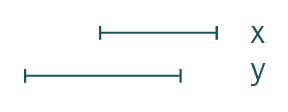
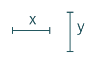
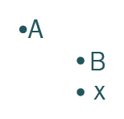
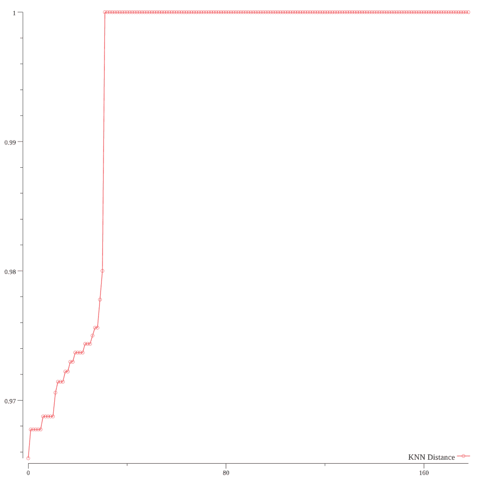
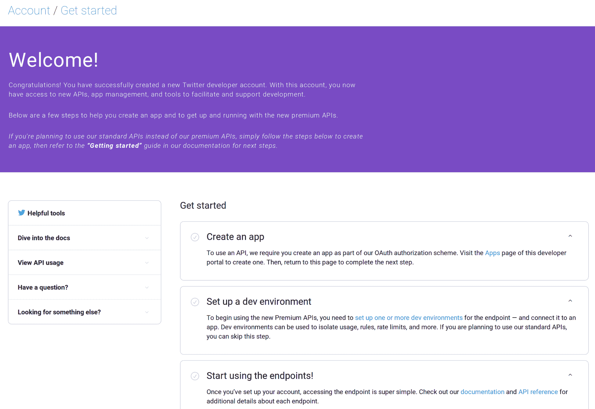
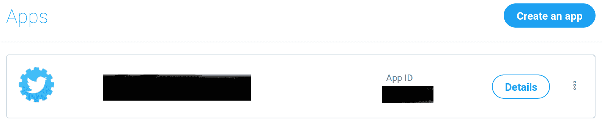
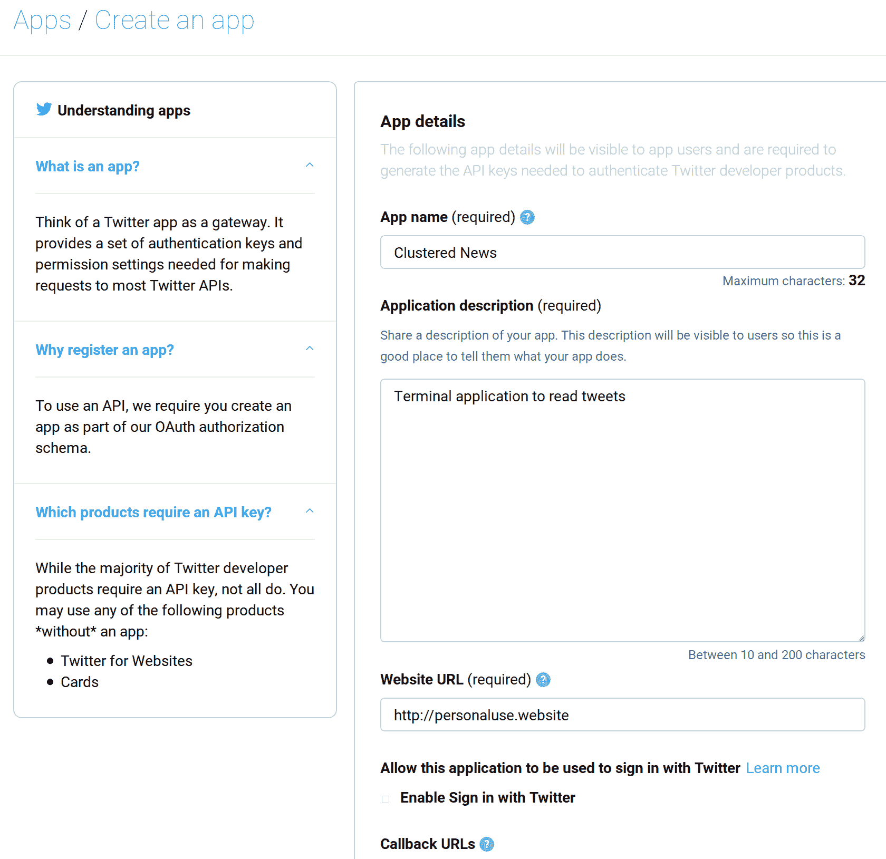
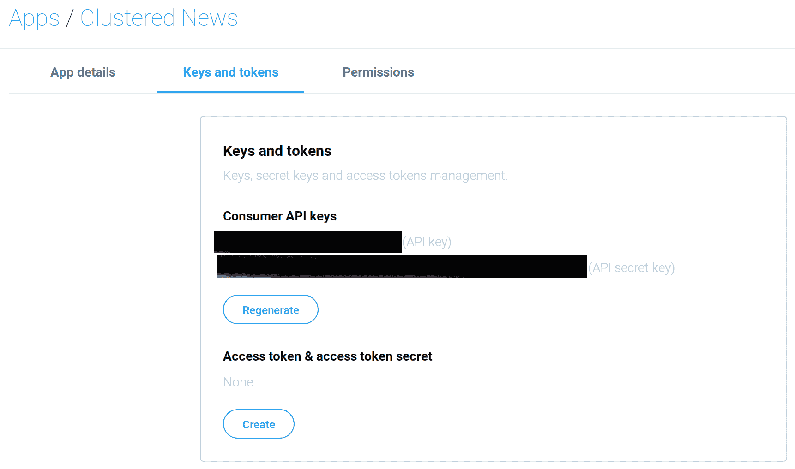

# 第五章：通过聚类推文清理您的个人 Twitter 时间线

这里有一点点八卦：这个标题的原始项目是关于检测社交媒体上外国对美国选举的影响。大约在同一时间，我还在申请美国的签证，去发表一系列演讲。后来发现，我根本不需要签证；ESTA 涵盖了我在美国想要做的所有事情。但在准备签证的过程中，一位律师严厉地告诫我不要写一本关于美国政治的书。一般的建议是——如果我不想与美国海关和边境巡逻队发生麻烦，我就不应该在社交媒体上写或说任何关于美国政治的事情，更不要说写一本书的章节。所以，我不得不匆忙重写这一章。这一章中使用的多数方法都可以用于原始目的，但内容要温和得多。

我大量使用 Twitter。我主要在空闲时间发推文和阅读 Twitter。我关注了许多有相似兴趣的人，包括机器学习、人工智能、围棋、语言学和编程语言。这些人不仅与我分享兴趣，彼此之间也分享兴趣。因此，有时可能会有多个人就同一主题发推文。

从我大量使用 Twitter 这一事实可能显而易见，我是一个新鲜事物爱好者。我喜欢新鲜事物。如果我对不同的观点感兴趣，那么多人就同一主题发推文是件好事，但我不那样使用 Twitter。我使用 Twitter 作为一种有趣话题的总结。X、Y、Z 事件发生了。知道它们发生了就足够了。对于大多数话题，深入学习和了解细节对我没有好处，而且 140 个字符对于细微差别来说也不算多。因此，一个浅显的概述就足以让我的一般知识跟上其他人。

因此，当多个人就同一主题发推文时，在我的新闻源中就是重复。这很烦人。如果我的新闻源中每个主题只出现一次，那会怎么样呢？

我认为我的 Twitter 阅读习惯是分批进行的。每次会话通常是五分钟。我实际上每次会话只阅读大约 100 条推文。如果在我阅读的 100 条推文中，我关注的 30%的人重叠在某个话题上，那么实际上我只阅读了 30 条真实内容的推文。这根本就不高效！效率意味着每次会话能够覆盖更多的话题。

那么，如何提高阅读推文的效率呢？当然，移除覆盖相同主题的推文！还有选择最好的一条总结该主题的推文的问题，但这将是另一天的主题。

# 项目

我们将要做的就是在 Twitter 上对推文进行聚类。我们将使用两种不同的聚类技术，K-means 和 DBSCAN。对于本章，我们将依赖我们在第二章中构建的一些技能，*线性回归 – 房价预测*。我们还将使用第二章中使用的相同库，*线性回归 – 房价预测*。除此之外，我们还将使用 mpraski 的聚类库。

到项目结束时，我们将能够清理 Twitter 上的任何推文集合，并将它们聚类成组。实现目标的主体代码非常简单，总共只有大约 150 行代码。其余的代码用于获取和预处理数据。

# K-means

**K-means**是一种数据聚类的方法。问题可以这样提出——给定一个包含 N 个项目的数据集，我们希望将数据划分为 K 组。你该如何做呢？

让我稍微偏离一下主题，探索一下坐标的奇妙世界。不，不，别跑！这非常直观。



哪条线更长？你怎么知道？



你知道哪条线更长，因为你可以从点 a、b、c 和 d 测量每条线。现在，让我们尝试一些不同的事情：



哪个点离 X 最近？你怎么知道？

你知道，因为你可以测量点之间的距离。现在，让我们进行最后的练习：


考虑以下距离：

+   **A** 和 **X**

+   **A** 和 **Y**

+   **A** 和 **Z**

+   **B** 和 **X**

+   **B** 和 **Y**

+   **B** 和 **Z**

+   **C** 和 **X**

+   **C** 和 **Y**

+   **C** 和 **Z**

**A** 和 **X**、**B** 和 **X**、**C** 和 **X**之间的平均距离是多少？**A** 和 **Y**、**B** 和 **Y**、**C** 和 **Y**之间的平均距离是多少？**A** 和 **Z**、**B** 和 **Z**、**C** 和 **Z**之间的平均距离是多少？

如果你必须在**X**、**Y**和**Z**之间选择一个点来代表**A**、**B**和**C**，你会选择哪一个？

恭喜！你刚刚完成了一个非常简单和简化的 K-means 聚类。具体来说，你做的是一个变体，其中*k = 1*。如果你必须在**X**、**Y**和**Z**之间选择两个点，那么那将是*k = 2*。因此，聚类是由使组内平均距离最小化的点集组成的。

这听起来很复杂，但回想一下你刚才做了什么。现在，你不再只有三个点**A**、**B**和**C**，而是有很多点。你没有给出**X**、**Y**或**Z**；你必须生成自己的**X**、**Y**和**Z**点。然后，你必须找到使每个可能的**X**、**Y**和**Z**点距离最小的组。

概而言之，这就是 K-means。它容易理解，但难以良好实现。结果证明 K-means 是 NP 难的；它可能无法在多项式时间内解决。

# DBSCAN

**DBSCAN**继承了数据可以表示为多维点的想法。再次，以二维为例，以下是 DBSCAN 大致的工作步骤：

1.  选择一个尚未访问的点。

1.  以点为中心画一个圆。圆的半径是 epsilon。

1.  计算有多少其他点落入圆内。如果有超过指定的阈值，我们将所有点标记为属于同一个簇。

1.  对这个簇中的每个点递归地执行相同的操作。这样做会扩大簇。

1.  重复这些步骤。

我强烈建议你们在点状纸上尝试自己画出这个图。首先，绘制随机点，然后用铅笔在纸上画圆。这将给你们一个关于 DBSCAN 如何工作的直观感受。图片显示了我增强对 DBSCAN 工作原理直觉的工作。我发现这种直觉非常有用。

# 数据获取

在早期的练习中，我要求你们观察点并计算出距离。这为我们如何思考数据提供了一些线索。我们需要将数据视为某个想象中的坐标系中的坐标。现在，我们的数据不会仅仅是二维的，因为它是文本的。相反，它将是多维的。这为我们提供了关于数据外观的线索——代表某个任意大的 N 维空间中坐标的数字切片。

但是，首先，我们需要获取数据。

为了获取推文，我们将使用 Aditya Mukherjee 的出色 Anaconda 库。要安装它，只需运行`go get -u github.com/ChimeraCoder/Anaconda`。

当然，不能随意从 Twitter 抓取数据。我们需要通过 Twitter API 获取数据。Twitter API 的文档是开始的好资源：[`developer.twitter.com/en/docs/basics/getting-started`](https://developer.twitter.com/en/docs/basics/getting-started)。

你们需要首先申请一个 Twitter 开发者账户（如果你们还没有的话）：[`developer.twitter.com/en/apply/user`](https://developer.twitter.com/en/apply/user)。这个过程相当漫长，需要人工批准开发者账户。尽管如此，你们不需要开发者访问权限来开发这个项目。我开始时以为我有访问 Twitter API 的权限，但结果证明我没有。好消息是，Twitter API 文档页面提供了足够的示例，可以帮助你们开始开发必要的数据结构。

我们感兴趣的具体终点是：[`developer.twitter.com/en/docs/tweets/timelines/api-reference/get-statuses-home_timeline.html`](https://developer.twitter.com/en/docs/tweets/timelines/api-reference/get-statuses-home_timeline.html)。

# 探索性数据分析

让我们看看从 Twitter API 端点获取的`JSON`。单个推文看起来可能像这样（来自 Twitter API 文档示例）：

```py
 {
 "coordinates": null,
 "truncated": false,
 "created_at": "Tue Aug 28 19:59:34 +0000 2012",
 "favorited": false,
 "id_str": "240539141056638977",
 "in_reply_to_user_id_str": null,
 "entities": {
 "urls": [
],
 "hashtags": 
],
 "user_mentions": [
]
 },
 "text": "You'd be right more often if you thought you were wrong.",
 "contributors": null,
 "id": 240539141056638977,
 "retweet_count": 1,
 "in_reply_to_status_id_str": null,
 "geo": null,
 "retweeted": false,
 "in_reply_to_user_id": null,
 "place": null,
 "source": "web",
 "user": {
 "name": "Taylor Singletary",
 "profile_sidebar_fill_color": "FBFBFB",
 "profile_background_tile": true,
 "profile_sidebar_border_color": "000000",
 "profile_image_url": "http://a0.twimg.com/profile_images/2546730059/f6a8zq58mg1hn0ha8vie_normal.jpeg",
 "created_at": "Wed Mar 07 22:23:19 +0000 2007",
 "location": "San Francisco, CA",
 "follow_request_sent": false,
 "id_str": "819797",
 "is_translator": false,
 "profile_link_color": "c71818",
 "entities": {
 "url": {
 "urls": [
 {
 "expanded_url": "http://www.rebelmouse.com/episod/",
 "url": "http://t.co/Lxw7upbN",
 "indices": [
 0,
 20
 ],
 "display_url": "rebelmouse.com/episod/"
 }
 ]
 },
 "description": {
 "urls": [
]
 }
 },
 "default_profile": false,
 "url": "http://t.co/Lxw7upbN",
 "contributors_enabled": false,
 "favourites_count": 15990,
 "utc_offset": -28800,
 "profile_image_url_https": "https://si0.twimg.com/profile_images/2546730059/f6a8zq58mg1hn0ha8vie_normal.jpeg",
 "id": 819797,
 "listed_count": 340,
 "profile_use_background_image": true,
 "profile_text_color": "D20909",
 "followers_count": 7126,
 "lang": "en",
 "protected": false,
 "geo_enabled": true,
 "notifications": false,
 "description": "Reality Technician, Twitter API team, synthesizer enthusiast; a most excellent adventure in timelines. I know it's hard to believe in something you can't see.",
 "profile_background_color": "000000",
 "verified": false,
 "time_zone": "Pacific Time (US & Canada)",
 "profile_background_image_url_https": "https://si0.twimg.com/profile_background_images/643655842/hzfv12wini4q60zzrthg.png",
 "statuses_count": 18076,
 "profile_background_image_url": "http://a0.twimg.com/profile_background_images/643655842/hzfv12wini4q60zzrthg.png",
 "default_profile_image": false,
 "friends_count": 5444,
 "following": true,
 "show_all_inline_media": true,
 "screen_name": "episod"
 },
 "in_reply_to_screen_name": null,
 "in_reply_to_status_id": null
 }
```

我们将用类似这样的数据结构来表示每个单独的推文：

```py
 type processedTweet struct {
 anaconda.Tweet
// post processed stuff
 ids []int // to implement Document
 textVec []float64
 normTextVec []float64
 location []float64
 isRT bool
 }
```

注意，我们嵌入`anaconda.Tweet`，这在 Anaconda 包中是这样给出的：

```py
 type Tweet struct {
 Contributors []int64 `json:"contributors"`
 Coordinates *Coordinates `json:"coordinates"`
 CreatedAt string `json:"created_at"`
 DisplayTextRange []int `json:"display_text_range"`
 Entities Entities `json:"entities"`
 ExtendedEntities Entities `json:"extended_entities"`
 ExtendedTweet ExtendedTweet `json:"extended_tweet"`
 FavoriteCount int `json:"favorite_count"`
 Favorited bool `json:"favorited"`
 FilterLevel string `json:"filter_level"`
 FullText string `json:"full_text"`
 HasExtendedProfile bool `json:"has_extended_profile"`
 Id int64 `json:"id"`
 IdStr string `json:"id_str"`
 InReplyToScreenName string `json:"in_reply_to_screen_name"`
 InReplyToStatusID int64 `json:"in_reply_to_status_id"`
 InReplyToStatusIdStr string `json:"in_reply_to_status_id_str"`
 InReplyToUserID int64 `json:"in_reply_to_user_id"`
 InReplyToUserIdStr string `json:"in_reply_to_user_id_str"`
 IsTranslationEnabled bool `json:"is_translation_enabled"`
 Lang string `json:"lang"`
 Place Place `json:"place"`
 QuotedStatusID int64 `json:"quoted_status_id"`
 QuotedStatusIdStr string `json:"quoted_status_id_str"`
 QuotedStatus *Tweet `json:"quoted_status"`
 PossiblySensitive bool `json:"possibly_sensitive"`
 PossiblySensitiveAppealable bool `json:"possibly_sensitive_appealable"`
 RetweetCount int `json:"retweet_count"`
 Retweeted bool `json:"retweeted"`
 RetweetedStatus *Tweet `json:"retweeted_status"`
 Source string `json:"source"`
 Scopes map[string]interface{} `json:"scopes"`
 Text string `json:"text"`
 User User `json:"user"`
 WithheldCopyright bool `json:"withheld_copyright"`
 WithheldInCountries []string `json:"withheld_in_countries"`
 WithheldScope string `json:"withheld_scope"`
 }
```

为了构建程序，我们将使用 Twitter 提供的示例推文。我将示例响应保存到一个名为`example.json`的文件中，然后创建了一个`mock`函数来模拟调用 API：

```py
 func mock() []*processedTweet {
 f, err := os.Open("example.json")
 dieIfErr(err)
 return load(f)
 }
 func load(r io.Reader) (retVal []*processedTweet) {
 dec := json.NewDecoder(r)
 dieIfErr(dec.Decode(&retVal))
 return retVal
 }
```

实用函数`dieIfErr`被定义为通常：

```py
 func dieIfErr(err error) {
 if err != nil {
 log.Fatal(err)
 }
 }
```

注意，在`mock`中，没有对 Twitter 进行 API 调用。将来，我们将创建一个具有类似 API 的函数，这样我们就可以用真实的版本替换这个函数的模拟版本，从 API 获取时间线。

目前，我们可以通过以下程序测试它是否工作：

```py
 func main(){
 tweets := mock()
 for _, tweet := range tweets {
 fmt.Printf("%q\n", tweet.FullText)
 }
 }
```

这是我的输出结果：

```py
 $ go run *.go
 "just another test"
 "lecturing at the \"analyzing big data with twitter\" class at @cal with @othman http://t.co/bfj7zkDJ"
 "You'd be right more often if you thought you were wrong."
```

# 数据整理

当我们测试数据结构是否合理时，我们打印了`FullText`字段。我们希望根据推文的内文进行聚类。对我们来说，重要的是内容。这可以在结构的`FullText`字段中找到。在章节的后面，我们将看到我们如何可能使用推文的元数据，例如位置，来帮助更好地聚类推文。

如前几节所述，每个单独的推文都需要在某个高维空间中表示为一个坐标。因此，我们的目标是获取时间线中的所有推文，并预处理它们，以便我们得到以下输出表：

```py
| Tweet ID | twitter | test | right | wrong |
 |:--------:|:------:|:----:|:----:|:---:|
 | 1 | 0 | 1 | 0 | 0 |
 | 2 | 1 | 0 | 0 | 0 |
 | 3 | 0 | 0 | 1 | 1 |
```

表中的每一行代表一个推文，通过推文 ID 进行索引。接下来的列是推文中存在的单词，通过其标题进行索引。因此，在第一行中，`test`出现在推文中，而`twitter`、`right`和`wrong`没有出现。第一行中的数字切片`[0 1 0 0]`是我们对聚类算法所需的输入。

当然，表示推文中单词存在的二进制数字并不是最好的。如果使用单词的相对重要性会更有趣。再次，我们转向熟悉的 TF-IDF，它首次在第二章中介绍，*线性回归 – 房价预测*。更高级的技术，如使用词嵌入，也存在。但你会惊讶于像 TF-IDF 这样简单的东西可以表现得有多好。

到现在为止，这个过程应该很熟悉了——我们希望将文本表示为数字切片，而不是字节切片。为了做到这一点，我们需要某种类型的字典来将文本中的单词转换为 ID。从那里，我们可以构建表格。

再次，就像在 [第二章](https://cdp.packtpub.com/go_machine_learning_projects/wp-admin/post.php?post=28&action=edit#post_46) 中，*线性回归 – 房价预测*，我们将采用简单的标记化策略。更高级的标记化器很棒，但对我们来说不是必需的。相反，我们将依赖古老的 `strings.Field`。

# 处理器

在确定了我们的需求后，我们可以将它们组合成一个包含所需内容的单一数据结构。以下是处理器数据结构的外观：

```py
 type processor struct {
 tfidf *tfidf.TFIDF
 corpus *corpus.Corpus
 locations map[string]int
 t transform.Transformer
 locCount int
 }
```

现在，忽略 `locations` 字段。我们将研究元数据在聚类中的用途。

要创建一个新的 `processor`，定义了以下函数：

```py
 func newProcessor() *processor {
 c, err := corpus.Construct(corpus.WithWords([]string{mention, hashtag, retweet, url}))
 dieIfErr(err)
 return &processor{
 tfidf: tfidf.New(),
 corpus: c,
 locations: make(map[string]int),
 }
 }
```

在这里，我们看到一些有趣的决策。语料库是用一些特殊字符串构建的——`mention`、`hashtag`、`retweet` 和 `url`。这些定义如下：

```py
 const (
 mention = "<@MENTION>"
 hashtag = "<#HASHTAG>"
 retweet = "<RETWEET>"
 url = "<URL>"
 )
```

这部分设计的历史原因。很久以前，在 Twitter 支持转发作为动作之前，人们通过在推文前加上 `RT` 来手动转发推文。如果我们必须分析很久以前的数据（我们不会在本章中这样做），那么我们必须了解 Twitter 的历史设计。因此，你必须为此进行设计。

但是，构建包含特殊关键词的语料库意味着某些事情。它意味着在将推文的文本转换为一系列 ID 和数字、提及、hashtag、转发和 URL 时，它们都被视为相同的。它意味着我们并不真正关心 URL 是什么，或者谁被提及。然而，当涉及到 hashtag 时，这是一个有趣的情况。

常用 hashtag 来表示推文的主题。例如 `#MeToo` 或 `#TimesUp`。hashtag 包含信息。将所有 hashtag 压缩成一个单一的 ID 可能没有用。这是我们稍后实验时需要注意的一个点。

说了这么多，以下是处理 `*processedTweet` 列表的方法。随着章节的进行，我们将重新访问和修改这个函数：

```py
 func (p *processor) process(a []*processedTweet) {
 for _, tt := range a {
 for _, word := range strings.Fields(tt.FullText) {
 wordID, ok := p.single(word)
 if ok {
 tt.ids = append(tt.ids, wordID)
 }
if isRT(word) {
 tt.isRT = true
 }
 }
 p.tfidf.Add(tt)
 }
p.tfidf.CalculateIDF()
 // calculate scores
 for _, tt := range a {
 tt.textVec = p.tfidf.Score(tt)
 }
// normalize text vector
 size := p.corpus.Size()
 for _, tt := range a {
 tt.normTextVec = make([]float64, size)
 for i := range tt.ids {
 tt.normTextVec[tt.ids[i]] = tt.textVec[i]
 }
 }
 }
```

让我们逐行分析这个函数。

我们首先遍历所有的 `*processedTweets`。`a` 是 `[]*processedTweet` 的原因——我们希望在过程中修改结构。如果 `a` 是 `[]processedTweet`，那么我们就必须分配更多的空间，或者有复杂的修改方案。

每条推文由其 `FullText` 组成。我们想要从文本中提取每个单词，然后为每个单词分配一个 ID。为此，这是循环：

```py
 for _, word := range strings.Fields(tt.FullText) {
 wordID, ok := p.single(word)
 if ok {
 tt.ids = append(tt.ids, wordID)
 }
 }
```

# 预处理单个单词

`p.single` 处理单个单词。它返回单词的 ID，以及是否将其添加到构成推文的单词列表中。它定义如下：

```py
 func (p *processor) single(a string) (wordID int, ok bool) {
 word := strings.ToLower(a)
 if _, ok = stopwords[word]; ok {
 return -1, false
 }
 if strings.HasPrefix(word, "#") {
 return p.corpus.Add(hashtag), true
 }
 if strings.HasPrefix(word, "@") {
 return p.corpus.Add(mention), true
 }
 if strings.HasPrefix(word, "http://") {
 return p.corpus.Add(url), true
 }
 if isRT(word) {
 return p.corpus.Add(retweet), false
 }
return p.corpus.Add(word), true
 }
```

我们首先将单词转换为小写。这使得像 `café` 和 `Café` 这样的单词等效。

说到`café`，如果有两条推文都提到了`café`，但一个用户写成`café`，另一个用户写成 cafe？当然，假设他们都指的是同一件事。我们需要某种归一化形式来告诉我们它们是相同的。

# 字符串归一化

首先，单词需要被归一化为`NFKC`形式。在[第二章](https://cdp.packtpub.com/go_machine_learning_projects/wp-admin/post.php?post=28&action=edit#post_46)，*线性回归-房价预测*中，这被介绍过，但我随后提到 LingSpam 基本上提供了归一化数据集。在现实世界的数据中，比如 Twitter，数据通常是杂乱的。因此，我们需要能够以苹果对苹果的方式比较它们。

为了展示这一点，让我们写一个辅助程序：

```py
 package main
import (
 "fmt"
 "unicode"
"golang.org/x/text/transform"
 "golang.org/x/text/unicode/norm"
 )
func isMn(r rune) bool { return unicode.Is(unicode.Mn, r) }
func main() {
 str1 := "cafe"
 str2 := "café"
 str3 := "cafe\u0301"
 fmt.Println(str1 == str2)
 fmt.Println(str2 == str3) 
t := transform.Chain(norm.NFD, transform.RemoveFunc(isMn), norm.NFKC)
 str1a, _, _ := transform.String(t, str1)
 str2a, _, _ := transform.String(t, str2)
 str3a, _, _ := transform.String(t, str3)
fmt.Println(str1a == str2a)
 fmt.Println(str2a == str3a)
 }
```

首先要注意的是，至少有三种方式可以写出单词`café`，在这个演示中意味着咖啡馆。从前两个比较中很明显，这两个单词是不相同的。但既然它们意味着相同的事情，比较应该返回`true`。

要做到这一点，我们需要将所有文本转换成一种形式，然后进行比较。为此，我们需要定义一个转换器：

```py
t := transform.Chain(norm.NFD, transform.RemoveFunc(isMn), norm.NFKC)
```

这个转换器是一系列文本转换器的链，一个接一个地应用。

首先，我们将所有文本转换为它的分解形式，NFD。这将`café`转换为`cafe\u0301`。

然后，我们移除任何非间隔符号。这会将`cafe\u0301`转换为`cafe`。这个移除函数是通过`isMn`函数完成的，定义如下：

```py
func isMn(r rune) bool { return unicode.Is(unicode.Mn, r) }
```

最后，将所有内容转换为 NKFC 形式以实现最大兼容性和节省空间。现在这三个字符串都是相等的。

注意，这种比较是基于一个单一的假设：我们正在进行比较的语言是英语。法语中的**Café**意味着**咖啡**以及**咖啡馆**。这种去除重音符号的归一化，只要去除重音符号不会改变单词的意义，就可以工作。在处理多种语言时，我们需要在归一化方面更加小心。但在这个项目中，这是一个足够好的假设。

带着这些新知识，我们需要更新我们的`processor`类型：

```py
 type processor struct {
 tfidf *tfidf.TFIDF
 corpus *corpus.Corpus
 transformer transformer.Transformer
 locations map[string]int
 locCount int
 }
func newProcessor() *processor {
 c, err := corpus.Construct(corpus.WithWords([]string{mention, hashtag, retweet, url}))
 dieIfErr(err)
t := transform.Chain(norm.NFD, transform.RemoveFunc(isMn), norm.NFKC)
 return &processor{
 tfidf: tfidf.New(),
 corpus: c,
 transformer: t,
 locations: make(map[string]int),
 }
 }
```

我们`p.single`函数的第一行也需要改变，从以下内容变为：

```py
 func (p *processor) single(a string) (wordID int, ok bool) {
 word := strings.ToLower(a)
```

它将变成这样：

```py
 func (p *processor) single(a string) (wordID int, ok bool) {
 word, _, err := transform.String(p.transformer, a)
 dieIfErr(err)
 word = strings.ToLower(word)
```

如果你感觉特别勤奋，尝试将`strings.ToLower`转换为`transform.Transformer`。这比你想象的要难，但也没有你想象的那么难。

# 预处理停用词

关于归一化就说到这里。我们现在将注意力转向`stopwords`。

回想一下[第二章](https://cdp.packtpub.com/go_machine_learning_projects/wp-admin/post.php?post=28&action=edit#post_46)，*线性回归-房价预测*，停用词是一些像**the**、**there**、**from**这样的词。它们是连接词，有助于理解句子的特定上下文，但对于简单的统计分析来说，它们通常只会增加噪音。因此，我们必须移除它们。

对停用词的检查很简单。如果一个词匹配`stopwords`，我们将返回`false`以确定是否将词 ID 添加到句子中：

```py
if _, ok = stopwords[word]; ok {
 return -1, false
 }
```

停用词列表从哪里来？这很简单，我就在`stopwords.go`中写了这个：

```py
const sw = `a about above across after afterwards again against all almost alone along already also although always am among amongst amoungst amount an and another any anyhow anyone anything anyway anywhere are around as at back be became because become becomes becoming been before beforehand behind being below beside besides between beyond bill both bottom but by call can cannot can't cant co co. computer con could couldnt couldn't cry de describe detail did didn didn't didnt do does doesn doesn't doesnt doing don done down due during each eg e.g eight either eleven else elsewhere empty enough etc even ever every everyone everything everywhere except few fifteen fify fill find fire first five for former formerly forty found four from front full further get give go had has hasnt hasn't hasn have he hence her here hereafter hereby herein hereupon hers herself him himself his how however hundred i ie i.e. if in inc indeed interest into is it its itself just keep kg km last latter latterly least less ltd made make many may me meanwhile might mill mine more moreover most mostly move much must my myself name namely neither never nevertheless next nine no nobody none noone nor not nothing now nowhere of off often on once one only onto or other others otherwise our ours ourselves out over own part per perhaps please put quite rather re really regarding same say see seem seemed seeming seems serious several she should show side since sincere six sixty so some somehow someone something sometime sometimes somewhere still such system take ten than that the their them themselves then thence there thereafter thereby therefore therein thereupon these they thick thin third this those though three through throughout thru thus to together too top toward towards twelve twenty two un under unless until up upon us used using various very via was we well were what whatever when whence whenever where whereafter whereas whereby wherein whereupon wherever whether which while whither who whoever whole whom whose why will with within without would yet you your yours yourself yourselves`
```

```py
var stopwords = make(map[string]struct{})
func init() {
 for _, s := range strings.Split(sw, " ") {
 stopwords[s] = struct{}{}
 }
 }
```

就这样！内容看起来像这样的推文——*一天一个苹果，医生远离我*——会有*apple*、*day*、*doctor*和*away*的 ID。

停用词列表是从`lingo`包中使用的列表改编而来的。`lingo`包中的停用词列表是用来在词干化的单词上使用的。因为我们没有进行词干化，所以一些词是手动添加的。它并不完美，但足够满足我们的目的。

# 预处理推特实体

在我们移除了停用词之后，就到了处理特殊的推特实体的时候了：

```py
 if strings.HasPrefix(word, "#") {
 return p.corpus.Add(hashtag), true
 }
 if strings.HasPrefix(word, "@") {
 return p.corpus.Add(mention), true
 }
 if strings.HasPrefix(word, "http://") {
 return p.corpus.Add(url), true
 }
```

这些都很直接。

如果一个词以`"#"`开头，那么它是一个标签。我们可能稍后会回到这个话题，所以记住这一点是好的。

任何以`"@"`开头的词都是提及。这有点棘手。有时，人们会发推文说诸如`I am @PlaceName`这样的话，表示一个地点，而不是提及一个用户（实际上，可能会发现`@PlaceName`并不存在）。或者，人们可能会发推文说`I am @ PlaceName`。在这种情况下，单独的`"@"`仍然会被视为提及。我发现对于前者（`@PlaceName`），将这个词视为提及并没有太大的关系。Twitter 的 API 确实会返回一个提及列表，你可以对其进行检查。但对我来说，这只是一个不必要的额外工作。所以，把这当作一个加分项目——检查 API 返回的提及列表。

当然，我们不应该那么懒惰，把所有事情都留给加分项目；可以做一些简单的检查——如果`@`是单独的，那么我们不应该将其视为提及。它应该被视为`at`。

现在，我们检查 URL。行`if strings.HasPrefix(word, "http://")`检查`http://`前缀。这并不好。这没有考虑到使用`https`方案的 URL。

现在我们知道了如何修改这段代码。它看起来是这样的：

```py
 switch {
 case strings.HasPrefix(word, "#"):
 return p.corpus.Add(hashtag), true
 case strings.HasPrefix(word, "@"):
 if len(word) == 0 {
 return p.corpus.Add("at"), true
 }
 return p.corpus.Add(mention), true
 case strings.HasPrefix(word, "http"):
 return p.corpus.Add(url), true
 }
```

最后，添加了一行代码来处理在 Twitter 支持转发之前的历史推文：

```py
 if word == "rt" {
 return p.corpus.Add(retweet), false
 }
```

# 处理单个推文

考虑以下代码片段：

```py
 for _, tt := range a {
 for _, word := range strings.Fields(tt.FullText) {
 wordID, ok := p.single(word)
 if ok {
 tt.ids = append(tt.ids, wordID)
 }
if word == "rt" {
 tt.isRT = true
 }
 }
 p.tfidf.Add(tt)
 }
```

它的意思是在我们预处理了每个单词之后，我们只需简单地将该单词添加到 TFIDF 中。

# 聚类

这个项目的目的是清理我需要阅读的推文数量。如果有 100 条推文的阅读预算，我不想阅读 50 条同一主题的推文；它们可能代表不同的观点，但一般来说，对于浏览目的，它们与我感兴趣的不相关。聚类为这个问题提供了一个很好的解决方案。

首先，如果推文被聚类，同一主题的 50 条推文将被分组在同一个聚类中。这样，如果我想深入研究，我可以这样做。否则，我可以跳过这些推文并继续。

在这个项目中，我们希望使用 K-means。为此，我们将使用 Marcin Praski 的`clusters`库。要安装它，只需运行`go get -u github.com/mpraski/clusters`。这是一个好的库，它内置了多个聚类算法。我之前介绍了 K-means，但我们还将使用 DBSCAN。

最后，我们将使用 DMMClust 算法进行比较。DMMClust 算法位于不同的库中。要安装它，只需运行`go get -u github.com/go-nlp/dmmclust`。DMMClust 的目的使用创新的过程对小型文本进行聚类。

# K-means 聚类

回顾一下，到目前为止我们做了什么——我们将来自主页时间线的推文列表中的每条推文处理成`float64`的切片。这些代表高维空间中的坐标。现在，我们只需要做以下事情：

1.  创建一个聚类器。

1.  创建一个`[][]float64`来表示时间线上的所有推文。

1.  训练聚类器。

1.  预测每条推文属于哪个聚类。

可以这样做：

```py
 func main() {
 tweets := mock()
 p := newProcessor()
 p.process(tweets)
// create a clusterer
 c, err := clusters.KMeans(10000, 25, clusters.EuclideanDistance)
 dieIfErr(err)
data := asMatrix(tweets)
 dieIfErr(c.Learn(data))clusters := c.Guesses()
 for i, clust := range clusters{
 fmt.Printf("%d: %q\n", clust, tweets[i].FullText)
 }
 }
```

惊讶吗？让我们来分析一下。

前几行是用于处理`tweets`的：

```py
 tweets := mock()
 p := newProcessor()
 p.process(tweets)
```

然后我们创建一个聚类器：

```py
 // create a clusterer
 c, err := clusters.KMeans(10000, 25, clusters.EuclideanDistance)
 dieIfErr(err)
```

这里，我们说我们想要一个 K-means 聚类器。我们将对数据进行 10,000 次训练，并希望找到 25 个聚类，使用`EuclideanDistance`方法计算距离。欧几里得距离是标准的距离计算方法，与你在 K-means 部分之前的练习中计算两点之间距离的方法相同。还有其他计算距离的方法，它们更适合文本数据。在本章的后面部分，我将向你展示如何创建一个距离函数，即 Jaccard 距离，当用于文本时，它比欧几里得距离要好得多。

在创建聚类器之后，我们需要将我们的`tweets`列表转换为矩阵。然后我们训练聚类器：

```py
 data := asMatrix(tweets)
 dieIfErr(c.Learn(data))
```

最后，我们显示`clusters`：

```py
 clusters := c.Guesses()
 for i, clust := range clusters{
 fmt.Printf("%d: %q\n", clust, tweets[i].FullText)
 }
```

# DBSCAN 聚类

使用 Marcin 的包进行 DBSCAN 聚类同样简单。实际上，你只需要更改一行代码，如下所示：

```py
c, err := clusters.KMeans(10000, 25, clusters.EuclideanDistance)
```

你需要将其改为这样：

```py
c, err := clusters.DBSCAN(eps, minPts, clusters.EuclideanDistance)
```

当然，现在的问题是`eps`和`minPts`应该取什么值？

`eps`代表两个点被认为是邻居所需的最小距离。`minPts`是形成密集聚类的最小点数。让我们先讨论`eps`。

我们如何知道最佳的距离是多少？通常，一个好的方法是通过可视化数据来找出答案。事实上，这正是 DBSCAN 算法的原始发明者所建议的。但我们究竟要可视化什么呢？

我们想要可视化推文之间的距离。给定一个数据集，我们可以计算一个看起来像这样的距离矩阵：

```py
| | A | B | C | ... |
 |--|--|--|--|--|--|
 | A | | | | |
 | B | | | | |
 | C | | | | |
 | ... | | | | |
```

为了做到这一点，我们编写了以下函数：

```py
 func knn(a [][]float64, k int, distance func(a, b []float64) float64) ([][]float64, []float64) {
 var distances [][]float64
 for _, row := range a {
 var dists []float64
 for _, row2 := range a {
 dist := distance(row, row2)
 dists = append(dists, dist)
 }
 sort.Sort(sort.Float64Slice(dists))
 topK := dists[:k]
 distances = append(distances, topK)
 }
 var lastCol []float64
 for _, d := range distances {
 l := d[len(d)-1]
 lastCol = append(lastCol, l)
 }
 sort.Sort(sort.Float64Slice(lastCol))
 return distances, lastCol
 }
```

这个函数接受一个浮点数矩阵；每一行代表一条推文，并找到最接近的 k 个邻居。让我们来分析一下这个算法。在我们分析算法的过程中，请记住每一行代表一条推文；因此，你可以将每一行想象成一个非常复杂的坐标。

我们想要做的第一件事是找到一条推文与另一条推文之间的距离，因此有以下的代码块：

```py
 var distances [][]float64
 for _, row := range a {
 var dists []float64
 for _, row2 := range a {
 dist := distance(row, row2)
 dists = append(dists, dist)
 }
```

特别值得注意的是两个表达式`for _, row := range a`和`for _, row2 := range a`。在一个普通的 KNN 函数中，你会有两个矩阵，`a`和`b`，你会在`a`中的推文和`b`中的推文之间找到距离。但为了绘制这张图表的目的，我们将比较同一数据集中的推文。

一旦我们获得了所有的距离，我们想要找到最近的邻居，所以我们排序列表，然后将它们放入距离矩阵中：

```py
 sort.Sort(sort.Float64Slice(dists))
 topK := dists[:k]
 distances = append(distances, topK)
```

这，以非常快捷的方式，就是如何进行 K 近邻算法。当然，这并不是最有效的方法。我在这里展示的算法是*O(n²)*。当然有更好的方法来做这件事，但出于这个项目的目的，这已经足够了。

然后，我们抓取矩阵的最后一列并对其进行排序。这是我们想要绘制的。绘图代码与之前章节中看到的不太一样。我将在这里提供它，不再进一步解释如何使用它：

```py
 func plotKNNDist(a []float64) plotter.XYs {
 points := make(plotter.XYs, len(a))
 for i, val := range a {
 points[i].X = float64(i)
 points[i].Y = val
 }
 return points
 }
```

当我绘制真实的 Twitter 数据以确定理想的`eps`值时，我得到了以下输出：



你想要找到的是图片中的“肘部”或“膝盖”。不幸的是，正如你可以看到的，有很多这样的点。这将使得使用 DBSCAN 算法进行聚类变得困难。这意味着数据相当嘈杂。

其中一个特别重要的事情是使用的距离函数。我将在后续的章节中进一步介绍如何调整程序。

# 使用 DMMClust 进行聚类

在我的 Twitter 主频道的距离图让我有些气馁之后，我寻找了另一种聚类推文的方法。为此，我使用了`dmmclust`库（我是其主要作者）。DMMClust 算法的目的在于它能够很好地处理小文本。事实上，它是为了处理小文本的问题而编写的。

什么是小文本？大多数文本聚类研究都是在大量单词的文本上进行的。直到最近，Twitter 只支持 140 个字符。正如你可以想象的，140 个字符作为人类语言传递的信息量并不多。

DMMClust 算法的工作方式非常类似于学生加入高中社交俱乐部。想象一下推文就像一群学生。每个学生随机加入一个社交俱乐部。在每一个社交俱乐部中，他们可能喜欢俱乐部的其他成员，或者他们可能不喜欢。如果他们不喜欢小组中的人，他们被允许更换社交俱乐部。这会一直发生，直到所有俱乐部都有最喜欢彼此的人，或者直到迭代次数用完。

简而言之，这就是 DMMClust 算法的工作原理。

# 真实数据

到目前为止，我们一直在处理 Twitter 文档提供的示例`JSON`。我假设您现在已经有了 Twitter API 访问权限。那么，让我们获取真实的 Twitter 数据吧！

要从开发者门户获取您的 API 密钥，请点击“开始”链接。您将来到如下页面：



选择“创建应用”。您将被带到如下页面：



我之前创建了一个 Twitter 应用很久以前（它具有与我们在本项目创建的应用非常相似的功能）；因此，我已经在那里有一个应用了。点击右上角的蓝色“创建应用”按钮。您将被带到以下表单：



填写表格后点击提交。可能需要几天时间您才会收到一封邮件，告知您的应用已获批准开发。请确保在描述中保持真实。最后，您应该能够点击进入您的应用，并看到以下页面，其中显示了您的 API 密钥和密钥：



点击“创建”以创建您的访问令牌和访问令牌密钥。您将需要它们。

现在我们有了 API 访问密钥，这是使用 Anaconda 包访问 Twitter 的方法：

```py
 const (
 ACCESSTOKEN = "_____"
 ACCESSTOKENSECRET = "______"
 CONSUMERKEY = "_____"
 CONSUMERSECRET = "_______"
 )
func main() {
 twitter := anaconda.NewTwitterApiWithCredentials(ACCESSTOKEN, ACCESSTOKENSECRET, CONSUMERKEY, CONSUMERSECRET)
 raw, err := twitter.GetHomeTimeline(nil)
f, err := os.OpenFile("dev.json", os.O_TRUNC|os.O_WRONLY|os.O_CREATE, 0644)
 dieIfErr(err)
 enc := json.NewEncoder(f)
 enc.Encode(raw)
 f.Close()
 }
```

初看，这段代码有点奇怪。让我们逐行分析代码。前六行处理访问令牌和密钥。显然，它们不应该被硬编码。处理这类秘密的一个好方法是将它们放入环境变量中。我将把这留作读者的练习。我们将继续分析代码的其余部分：

```py
 twitter := anaconda.NewTwitterApiWithCredentials(ACCESSTOKEN, ACCESSTOKENSECRET, CONSUMERKEY, CONSUMERSECRET)
 raw, err := twitter.GetHomeTimeline(nil)
```

这两行代码使用 Anaconda 库获取主时间线中找到的推文。传入的`nil`可能值得关注。为什么会这样做呢？`GetHomeTimeline`方法接受一个`url.Values`映射。该包可以在标准库中找到，作为`net/url`。`Values`定义如下：

```py
type Values map[string][]string
```

但这些值代表什么呢？实际上，您可以向 Twitter API 传递一些参数。参数及其作用在此列举：[`developer.twitter.com/en/docs/tweets/timelines/api-reference/get-statuses-home_timeline`](https://developer.twitter.com/en/docs/tweets/timelines/api-reference/get-statuses-home_timeline)。我不想限制任何东西，所以传入`nil`是可以接受的。

结果是 `[]anaconda.Tweet`，所有内容都整齐地打包供我们使用。因此，以下几行相当奇怪：

```py
 f, err := os.OpenFile("dev.json", os.O_TRUNC|os.O_WRONLY|os.O_CREATE, 0644)
 dieIfErr(err)
 enc := json.NewEncoder(f)
 enc.Encode(raw)
 f.Close()
```

为什么我想将其保存为 `JSON` 文件？答案很简单——当使用机器学习算法时，你可能需要调整算法。将请求保存为 `JSON` 文件有两个目的：

+   它允许保持一致性。在积极开发中，你可能会大量调整算法。如果 JSON 文件不断变化，你怎么知道是调整带来了改进，而不是因为 JSON 的变化？

+   成为一名好公民。Twitter 的 API 有速率限制。这意味着你不能反复多次请求相同的内容。在测试和调整机器学习算法时，你可能会不得不反复处理你的数据。与其不断敲打 Twitter 服务器，你更应该成为一名好公民，并使用本地缓存的副本。

我们之前定义了 `load`。再次强调，我们将看到它在调整算法方面的用途。

# 程序

一旦我们这样做，我们可以将之前的 `main()` 移入不同的函数中，再次为我们留下一个空白的 `main()` 画布。我们现在准备好程序的实质性内容。这是一个骨架程序。鼓励你在编写这个程序时实际积极地修改程序：

```py
func main() {
 f, err := os.Open("dev.json")
 dieIfErr(err)
 tweets := load(f)
 p := newProcessor()
 tweets = p.process(tweets)
expC := 20
 distances, last := knn(asMatrix(tweets), expC, clusters.EuclideanDistance)
 log.Printf("distances %v | %v", distances, last)
// plot for DBSCAN elbows
 plt, err := plot.New()
 dieIfErr(err)
 plotutil.AddLinePoints(plt, "KNN Distance", plotKNNDist(last))
 plt.Save(25*vg.Centimeter, 25*vg.Centimeter, "KNNDist.png")
// actually do the clustering
 dmmClust := dmm(tweets, expC, p.corpus.Size())
 kmeansClust := kmeans(tweets, expC)
 dbscanClust, clustCount := dbscan(tweets)
// print output
 log.Printf("len(tweets)%d", len(tweets))
 var buf bytes.Buffer
bc := byClusters2(dmmClust, expC)
 lc, tweetCount := largestCluster2(dmmClust)
 fmt.Fprintf(&buf, "Largest Cluster %d - %d tweets\n", lc, tweetCount)
 for i, t := range bc {
 fmt.Fprintf(&buf, "CLUSTER %d: %d\n", i, len(t))
 for _, c := range t {
 fmt.Fprintf(&buf, "\t%v\n", tweets[c].clean2)
 }
 }
 fmt.Fprintf(&buf, "==============\n")
 bc2 := byClusters(kmeansClust, expC)
 for i, t := range bc2 {
 fmt.Fprintf(&buf, "CLUSTER %d: %d\n", i, len(t))
 for _, c := range t {
 fmt.Fprintf(&buf, "\t%v\n", tweets[c].clean2)
 }
 }
 fmt.Fprintf(&buf, "==============\n")
 bc3 := byClusters(dbscanClust, clustCount)
 for i, t := range bc3 {
 fmt.Fprintf(&buf, "CLUSTER %d: %d\n", i, len(t))
 for _, c := range t {
 fmt.Fprintf(&buf, "\t%v\n", tweets[c].clean2)
 }
 }
log.Println(buf.String())
 }
```

我还有一些实用函数尚未向你展示。现在是时候定义它们了：

```py
 func dmm(a []*processedTweet, expC int, corpusSize int) []dmmclust.Cluster {
 conf := dmmclust.Config{
 K: expC,
 Vocabulary: corpusSize,
 Iter: 1000,
 Alpha: 0.0,
 Beta: 0.01,
 Score: dmmclust.Algorithm4,
 Sampler: dmmclust.NewGibbs(rand.New(rand.NewSource(1337))),
 }
 dmmClust, err := dmmclust.FindClusters(toDocs(a), conf)
 dieIfErr(err)
 return dmmClust
 }
func kmeans(a []*processedTweet, expC int) []int {
 // create a clusterer
 kmeans, err := clusters.KMeans(100000, expC, clusters.EuclideanDistance)
 dieIfErr(err)
 data := asMatrix(a)
 dieIfErr(kmeans.Learn(data))
 return kmeans.Guesses()
 }
func dbscan(a []*processedTweet) ([]int, int) {
 dbscan, err := clusters.DBSCAN(5, 0.965, 8, clusters.EuclideanDistance)
 dieIfErr(err)
 data := asMatrix(a)
 dieIfErr(dbscan.Learn(data))
 clust := dbscan.Guesses()
counter := make(map[int]struct{})
 for _, c := range clust {
 counter[c] = struct{}{}
 }
 return clust, len(counter)
 }
func largestCluster(clusters []int) (int, int) {
 cc := make(map[int]int)
 for _, c := range clusters {
 cc[c]++
 }
var retVal, maxVal int
for k, v := range cc {
 if v > maxVal {
 retVal = k
 maxVal = v
 }
 }
 return retVal, cc[retVal]
 }
func largestCluster2(clusters []dmmclust.Cluster) (int, int) {
 cc := make(map[int]int)
 for _, c := range clusters {
 cc[c.ID()]++
 }
var retVal, maxVal int
for k, v := range cc {
 if v > maxVal {
 retVal = k
 maxVal = v
 }
 }
 return retVal, cc[retVal]
 }
func byClusters(a []int, expectedClusters int) (retVal [][]int) {
 if expectedClusters == 0 {
 return nil
 }
 retVal = make([][]int, expectedClusters)
 var i, v int
 defer func() {
 if r := recover(); r != nil {
 log.Printf("exp %v | %v", expectedClusters, v)
 panic(r)
 }
 }()
 for i, v = range a {
 if v == -1 {
 // retVal[0] = append(retVal[0], i)
 continue
 }
 retVal[v-1] = append(retVal[v-1], i)
 }
 return retVal
 }
func byClusters2(a []dmmclust.Cluster, expectedClusters int) (retVal [][]int) {
 retVal = make([][]int, expectedClusters)
 for i, v := range a {
 retVal[v.ID()] = append(retVal[v.ID()], i)
 }
 return retVal
 }
```

这些是一些可能在 `utils.go` 中找到的实用函数。它们主要帮助调整程序。现在通过输入 `go run *.go` 来运行程序。

# 调整程序

如果你一直跟到现在，你可能从所有聚类算法中得到非常差的结果。我想提醒你，这本书的一般目标通常是传授在 Go 中进行数据科学的感觉。在大多数情况下，我提倡一种可以描述为深入思考问题，然后写下答案的方法。但现实是，通常需要试错。

在我的 Twitter 主时间线中对我有效的解决方案可能对你不起作用。例如，这段代码在朋友的 Twitter 动态上运行良好。为什么是这样？他关注了很多同时谈论相似话题的相似的人。在我自己的 Twitter 主时间线中聚类推文要困难一些。我关注的人群多样化。我关注的人没有固定的发推时间表，并且通常不与其他 Twitter 用户互动。因此，推文本身就已经非常多样化了。

正是出于这个考虑，我鼓励你实验并调整你的程序。在接下来的小节中，我将概述对我有效的方法。这可能对你不起作用。

# 调整距离

到目前为止，我们一直在使用由 `Marcin` 库提供的欧几里得距离。欧几里得距离的计算方法如下：

```py
$ EuclideanDistance(\mathbf{q},\mathbf{p}) = \sqrt{\sum_{i=1}^n (q_i-p_i)²}.$
```

`EuclideanDistance`是处理笛卡尔空间中的坐标时一个好的度量标准。确实，我之前曾将推文比作空间中的一组坐标，以解释 K-means 和 DBSCAN。但现实是文本文档并不真正位于笛卡尔空间中。你可以将它们视为位于笛卡尔空间中，但它们并不严格如此。

因此，让我介绍另一种类型的距离，它更适合处理我们在当前设置中使用的词袋模型中的文本元素，即 Jaccard 距离。

Jaccard 距离定义为以下：

```py
$ d_J(A,B) = 1 - J(A,B) = { { |A \cup B| - |A \cap B| } \over |A \cup B| } $
```

在这里，`$A$`和`$B$`是每个推文中的单词集合。Go 语言中 Jaccard 距离的实现是基础的，但它是有效的：

```py
 func jaccard(a, b []float64) float64 {
 setA, setB := make(map[int]struct{}), make(map[int]struct{})
 union := make(map[int]struct{})
 for i := range a {
 if a[i] != 0 {
 union[i] = struct{}{}
 setA[i] = struct{}{}
 }
 }
for i := range b {
 if b[i] != 0 {
 union[i] = struct{}{}
 setB[i] = struct{}{}
 }
 }
intersection := 0.0
 for k := range setA {
 if _, ok := setB[k]; ok {
 intersection++
 }
 }
return 1 - (intersection / float64(len(union)))
 }
```

# 调整预处理步骤

你可能注意到，推文的预处理非常简单，其中一些规则很奇怪。例如，所有哈希标签都被视为一个，所有链接和提及也是如此。当这个项目开始时，这似乎是一个合理的理由。没有其他理由比这更合理；在任何项目中，总是需要一个跳板来开始。在那个阶段，一个薄弱的借口和其他借口一样好。

尽管如此，我还是调整了我的预处理步骤。这些是我最终确定下来的函数。请注意，这与之前章节中列出的原始版本之间的差异：

```py
 var nl = regexp.MustCompile("\n+")
 var ht = regexp.MustCompile("&.+?;")
func (p *processor) single(word string) (wordID int, ok bool) {
 if _, ok = stopwords[word]; ok {
 return -1, false
 }
 switch {
 case strings.HasPrefix(word, "#"):
 word = strings.TrimPrefix(word, "#")
 case word == "@":
 return -1, false // at is a stop word!
 case strings.HasPrefix(word, "http"):
 return -1, false
 }
if word == "rt" {
 return -1, false
 }
return p.corpus.Add(word), true
 }
func (p *processor) process(a []*processedTweet) []*processedTweet {
 // remove things from consideration
 i := 0
 for _, tt := range a {
 if tt.Lang == "en" {
 a[i] = tt
 i++
 }
 }
 a = a[:i]
var err error
 for _, tt := range a {
 if tt.RetweetedStatus != nil {
 tt.Tweet = *tt.RetweetedStatus
 }
tt.clean, _, err = transform.String(p.transformer, tt.FullText)
 dieIfErr(err)
 tt.clean = strings.ToLower(tt.clean)
 tt.clean = nl.ReplaceAllString(tt.clean, "\n")
 tt.clean = ht.ReplaceAllString(tt.clean, "")
 tt.clean = stripPunct(tt.clean)
 log.Printf("%v", tt.clean)
 for _, word := range strings.Fields(tt.clean) {
 // word = corpus.Singularize(word)
 wordID, ok := p.single(word)
 if ok {
 tt.ids = append(tt.ids, wordID)
 tt.clean2 += " "
 tt.clean2 += word
 }
if word == "rt" {
 tt.isRT = true
 }
 }
 p.tfidf.Add(tt)
 log.Printf("%v", tt.clean2)
 }
p.tfidf.CalculateIDF()
 // calculate scores
 for _, tt := range a {
 tt.textVec = p.tfidf.Score(tt)
 }
// normalize text vector
 size := p.corpus.Size()
 for _, tt := range a {
 tt.normTextVec = make([]float64, size)
 for i := range tt.ids {
 tt.normTextVec[tt.ids[i]] = tt.textVec[i]
 }
 }
 return a
 }
func stripPunct(a string) string {
 const punct = ",.?;:'\"!’*-“"
 return strings.Map(func(r rune) rune {
 if strings.IndexRune(punct, r) < 0 {
 return r
 }
 return -1
 }, a)
 }
```

我所做的最显著的变化是，现在我将哈希标签视为一个单词。提及被移除。至于 URL，在一次尝试聚类时，我意识到聚类算法将所有包含 URL 的推文聚到了同一个簇中。这个认识让我移除了哈希标签、提及和 URL。哈希标签的`#`被移除，并被视为普通单词。

此外，你可能注意到我添加了一些快速且简单的方法来`清理`某些事物：

```py
 tt.clean = strings.ToLower(tt.clean)
 tt.clean = nl.ReplaceAllString(tt.clean, "\n")
 tt.clean = ht.ReplaceAllString(tt.clean, "")
 tt.clean = stripPunct(tt.clean)
```

在这里，我使用了正则表达式将多个换行符替换为一个，并将所有 HTML 编码的文本替换为空。最后，我移除了所有标点符号。

在更正式的设置中，我会使用一个合适的词法分析器来处理我的文本。我会使用的词法分析器来自 Lingo（`github.com/chewxy/lingo`）。但鉴于 Twitter 是一个低价值环境，这样做并没有太多意义。Lingo 中的合适词法分析器会将文本标记为多个类别，从而便于移除。

另一件你可能注意到的事情是，我在中途改变了关于推文的定义：

```py
 if tt.RetweetedStatus != nil {
 tt.Tweet = *tt.RetweetedStatus
 }
```

这段代码表示如果一条推文确实是一条转发的状态，则用转发的推文替换该推文。这对我是有效的。但可能对你来说不一定有效。我个人认为任何转发都等同于重复一条推文。因此，我认为它们不应该分开。此外，Twitter 允许用户对转发进行评论。如果你想包含这些评论，你可能需要稍微改变一下逻辑。无论如何，我是通过手动检查我保存的`JSON`文件来达到这个结果的。

它是询问这些问题，然后做出判断，确定在数据科学中什么重要，无论是使用 Go 语言还是任何其他语言。这并不是盲目地应用算法。相反，它始终由数据告诉你的信息所驱动。

最后一点你可能注意到的是这个奇怪的代码块：

```py
 // remove things from consideration
 i := 0
 for _, tt := range a {
 if tt.Lang == "en" {
 a[i] = tt
 i++
 }
 }
 a = a[:i]
```

在这里，我只考虑英文推文。我关注许多使用各种语言发推的人。在任何给定的时间，我的主页时间线大约有 15%的推文是法语、中文、日语或德语。对不同语言的推文进行聚类是完全不同的游戏，所以我选择省略它们。

# 摘要

在本章中，我们学习了如何使用各种聚类方法对推文进行聚类。尽管经常被吹捧为最稳健的算法之一，但我们已经表明，由于推文的本质是嘈杂的，DBSCAN 在聚类推文时存在问题。相反，我们发现，较老的传统方法以及一种新的聚类方法会得到更好的结果。

这指出了一个教训——没有一种机器学习算法可以统治一切；没有终极算法。相反，我们需要尝试不止一种方法。在接下来的章节中，这个主题将更加明显，我们将以更严谨的态度来处理这些问题。在下一章中，我们将学习神经网络的基础知识，并将它们应用于手写数字的识别。
