# 神经网络 - MNIST 手写识别

想象一下，你是一名邮递员。你的工作就是递送信件。大多数时候，收件人的姓名和地址都会打印出来，并且非常清晰，你的工作就变得相当简单。但是到了感恩节和圣诞节，带有手写地址的信封数量会增加，因为人们会添加个人风格和装饰。坦白说，有些人（包括我）的书写实在糟糕。

如果你必须责怪学校不再强调书写，那么问题仍然存在：书写难以阅读和理解。上帝保佑，如果你不得不递送一封由医生手写的信（祝你好运！）。

想象一下，如果你构建了一个机器学习系统，可以让你阅读手写文字。这正是我们将在本章和下一章中要做的事情；我们将构建一种称为人工神经网络的机器学习算法，在下一章中，我们将通过深度学习来扩展这一概念。

在本章中，我们将学习神经网络的基础知识，了解它是如何受到生物神经元启发的，找到更好的表示方法，并最终将神经网络应用于手写识别数字。

# 一个神经网络

在现代用语中，**神经网络**这个术语可以指两种不同的事物。第一种指的是你大脑中发现的神经元网络。这些神经元形成特定的网络和路径，对你理解这个句子至关重要。该术语的第二种含义指的是人工神经网络；即我们在软件中构建来模拟大脑中神经网络的实体。

当然，这导致了生物神经网络和人工神经网络之间非常多的不幸比较。为了理解原因，我们必须从开始讲起。

从现在开始，我将使用英国式的拼写来表示**神经元**，以表示真实的神经元细胞，而美国式的拼写，**neuron**，将保留用于人工变体。

下面的图示是一个神经元：

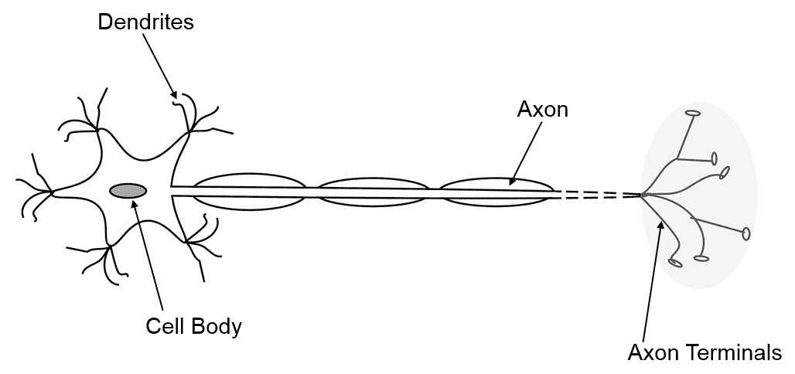

通常，一个神经元由细胞体（包含其核的细胞的一般部分）、一个可选的、被一种称为**髓鞘**的脂肪组织覆盖的轴突和树突组成。后两个组成部分（轴突和树突）特别有趣，因为它们共同形成了一个称为突触的结构。具体来说，是轴突的末端（即突触）形成了这样的突触。

哺乳动物大脑中的绝大多数突触位于轴突末端和树突之间。信号的典型流动（化学或电脉冲）从一个神经元开始，沿着轴突传播，并将其信号沉积到下一个神经元上。

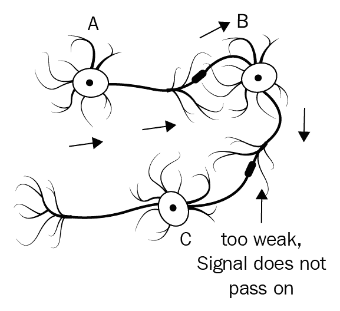

在上面的图像中，我们有三个神经元，标记为 A、B 和 C。想象一下 A 从外部来源（比如你的眼睛）接收一个信号。它接收到的信号足够强，以至于它可以通过轴突传递，通过突触接触到 B 的树突。B 接收信号并决定它不值得将信号传递给 C，所以 B 的轴突没有信号传递。

因此，我们现在将探讨如何模拟这一点。

# 模拟神经网络

让我们简化一下前面的神经网络图：

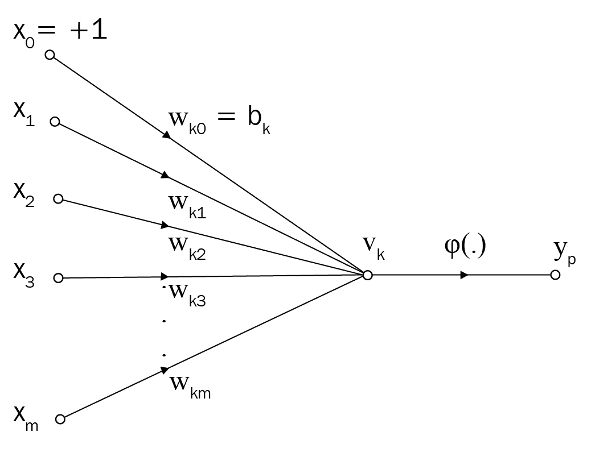

我们会用一个圆圈来代表神经元的主体，我们称之为**神经元**。神经元的“树突”接收来自其他神经元（未显示）的输入并将所有输入加起来。每个输入代表来自另一个神经元的输入；所以，如果你看到三个输入，这意味着这个神经元连接了三个其他神经元。

如果输入的总和超过一个阈值值，那么我们可以说神经元“放电”或被激活。这模拟了实际神经元的激活潜力。为了简单起见，让我们假设如果它放电，则输出将是 1；否则，将是 0。以下是它在 Go 代码中的良好模拟：

```py
func neuron(threshold int, inputs ...int) int {
  var total int
  for _, in := range inputs {
    total += in
  }
  if total > threshold {
    return 1
  }
  return 0
}
```

这通常被称为**感知器**，如果你对神经元工作原理的了解还停留在 20 世纪 40 年代和 50 年代，那么它就是对神经元工作原理的忠实模拟。

这里有一个相当有趣的故事：当我写这个部分的时候，King Princess 的 1950 开始在背景中播放，我觉得想象自己在 20 世纪 50 年代开发感知器是非常合适的。仍然存在一个问题：我们迄今为止模拟的人工网络无法学习！它是被编程去做输入告诉它做的事情。

“人工神经网络学习”究竟意味着什么？在 20 世纪 50 年代的神经科学中出现了一个想法，称为**赫布规则**，可以简要概括为：“一起放电的神经元会一起生长”。这引发了一个想法，即某些突触更厚；因此，它们有更强的连接，而其他突触更薄；因此，它们有较弱的连接。

为了模拟这一点，我们需要引入加权值的概念，其权重对应于来自另一个神经元的输入强度。以下是这个想法的一个很好的近似：

```py
func neuron(threshold, weights, inputs []int) int {
  if len(weights) != len(inputs) {
    panic("Expected length of weights to be the same as the length of inputs")
  }
  var total int 
  for i, in := range inputs {
    total += weights[i]*in
  }
  if total > threshold {
    return 1
  }
  return 0
}
```

到这一点，如果你熟悉线性代数，你可能会想到`total`本质上是一个向量积。你会完全正确。此外，如果阈值是 0，那么你只是应用了一个`heaviside`阶跃函数：

```py
func heaviside(a float64) float64 {
  if a >= 0 {
    return 1
  }
  return 0
}
```

换句话说，我们可以用以下方式总结一个单个神经元：

```py
func neuron(weights, inputs []float64) float64 {
  return heaviside(vectorDot(weights, inputs))
}
```

注意在最后两个例子中，我从`int`切换到了更标准的`float64`。要点仍然是：单个神经元只是一个应用于向量积的函数。

单个神经元并没有做什么。但是将它们堆叠起来，并按层排列，然后突然它们开始做更多的事情：

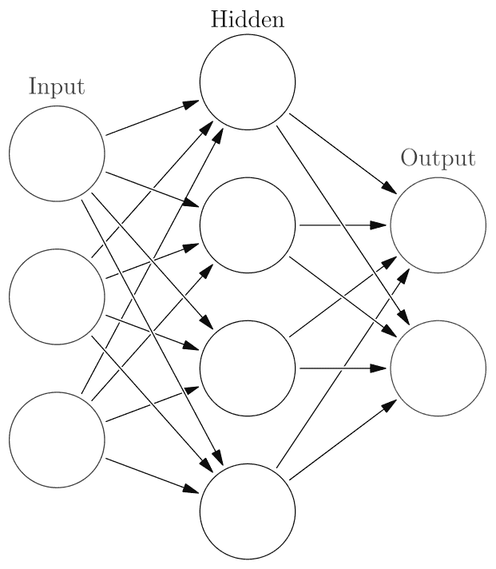

现在我们来到需要概念飞跃的部分：如果一个神经元本质上只是一个向量积，*堆叠*神经元就简单地使其成为一个矩阵！

给定一个图像可以表示为一个 `float64` 的平面切片，`vectorDot` 函数被 `matVecMul` 函数替换，这是一个将矩阵和向量相乘以返回向量的函数。我们可以这样写一个表示神经层的函数：

```py
func affine(weights [][]float64, inputs []float64) []float64 {
  return activation(matVecMul(weights, inputs))
}
```

# 线性代数 101

我想绕道谈谈线性代数。到目前为止，这本书中已经提到了很多，尽管它并没有被明确提及。事实上，线性代数是我们迄今为止所做每一章的基础。

想象你有两个方程：

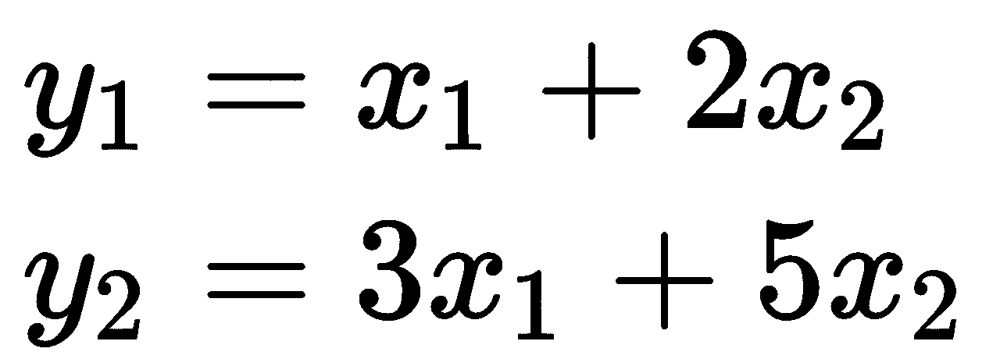

假设 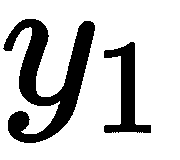 和 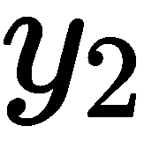 分别是 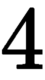 和 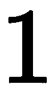，我们可以现在这样写出以下方程：

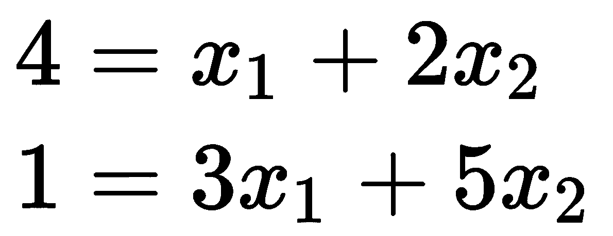

我们可以使用基本的代数来解它（请自己动手计算）：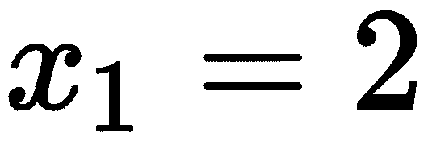 和 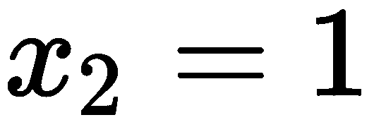。

如果你有三个、四个或五个联立方程呢？计算这些值开始变得繁琐。相反，我们发明了一种新的符号：矩阵符号，这将使我们能够更快地解联立方程。

它在没有名字的情况下使用了大约 100 年（它最初被詹姆斯·西尔维斯特称为“矩阵”），并且直到 1858 年亚瑟·凯莱将这些规则形式化之前，一直在使用正式的规则。尽管如此，将方程的一部分组合在一起作为一个整体的想法已经被长期使用。

我们首先将方程“分解”成它们的各个部分：

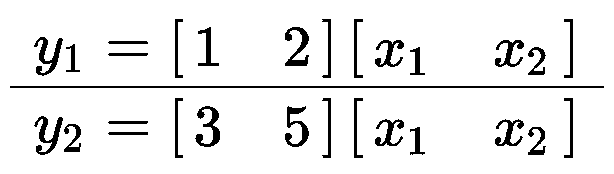

水平线表示这是两个不同的方程，而不是它们是比例关系。当然，我们意识到我们已经重复得太多了，所以我们简化了 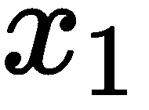 和  的矩阵。

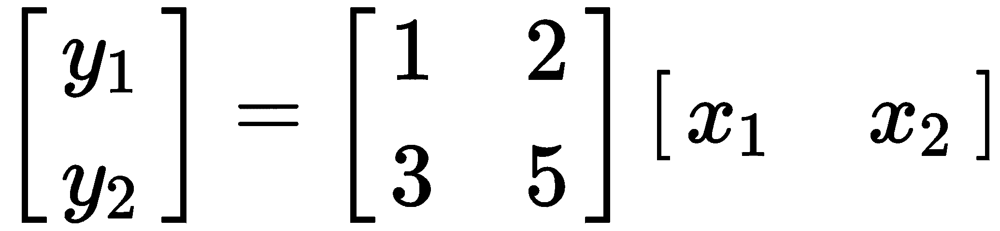

在这里，你可以看到  和 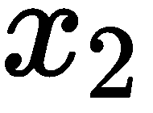 只被写了一次。我们刚才写的方式相当不整洁，所以我们用这种方式来写得更整洁：

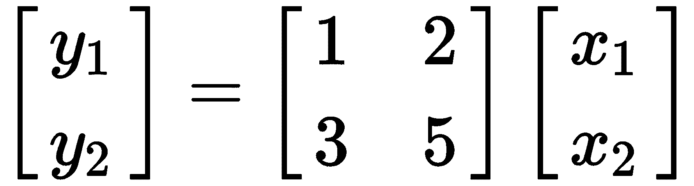

不仅我们这样写，我们还给出了如何阅读这种符号的具体规则：

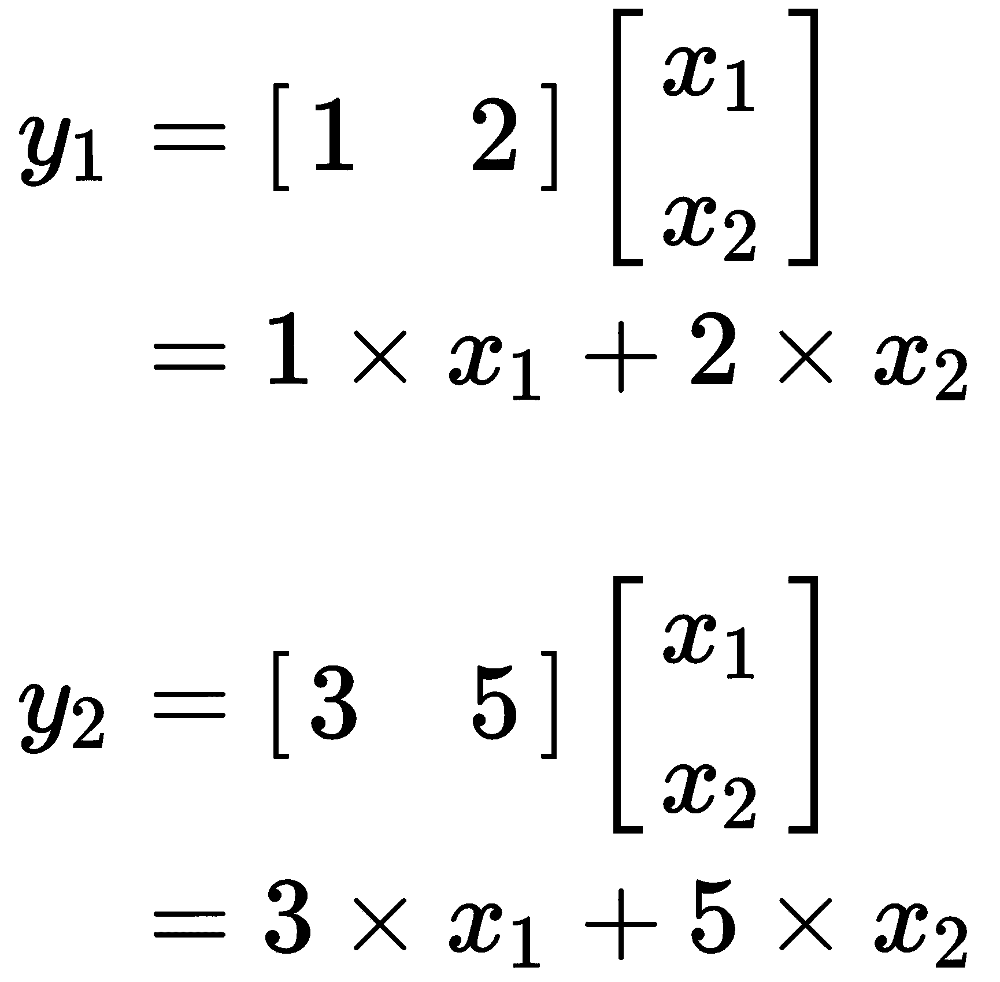

我们应该给矩阵命名，这样我们以后可以引用它们：

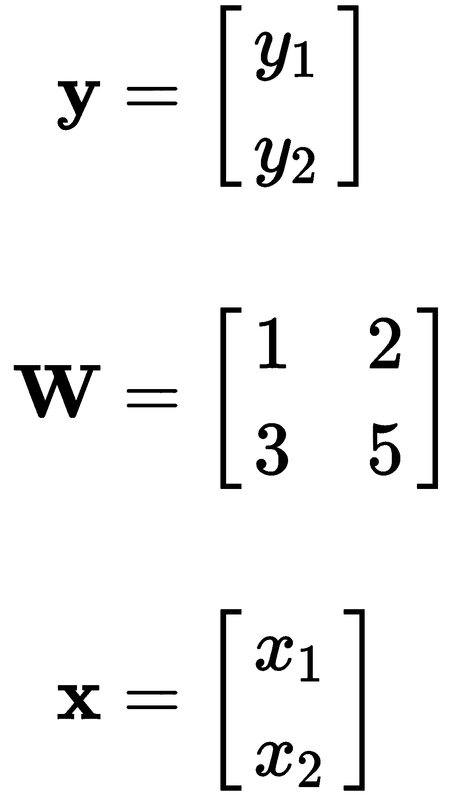

粗体表示变量持有多个值。大写表示矩阵 ()，小写表示向量 (  和 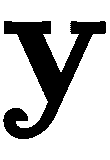)。这是为了与只持有单个值的标量变量（通常不使用粗体）区分开来（例如，  和 )。

为了解这些方程，解法很简单：

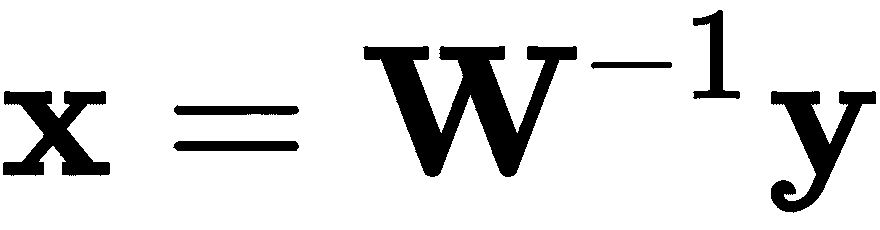

 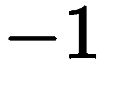 的上标表示需要取逆。这与正常的代数相当一致。

考虑一个问题 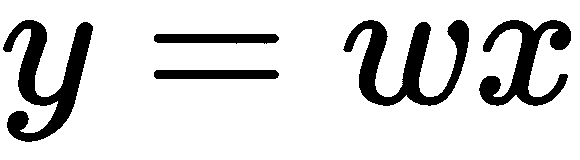，其中要求你解出 。解法很简单 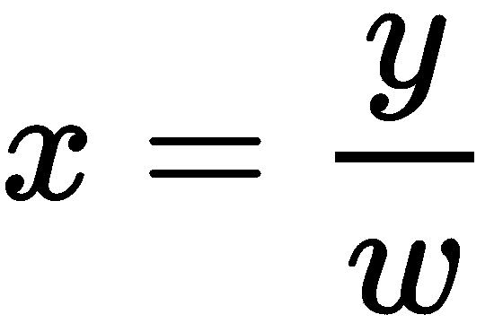。或者我们可以将其重写为一系列乘法，如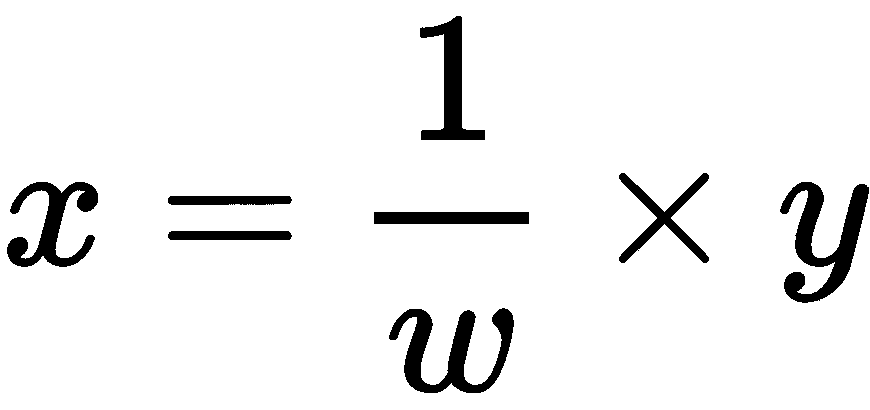。关于分数，我们知道什么？如果一个分数是分子，它可以简单地写成-1 的幂。因此，我们得到了这个解方程： 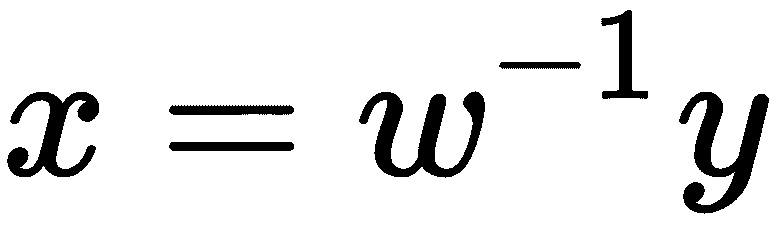

现在如果你非常仔细地眯着眼睛看，方程的标量版本看起来非常像方程的矩阵表示版本。

如何计算矩阵的逆不是这本书的目标。相反，我鼓励你找一本线性代数教科书。我强烈推荐 Sheldon Axler 的《线性代数这样做是正确的》（Springer Books）。

总结一下，以下是主要观点：

+   矩阵乘法和符号是为了解决联立方程而发明的。

+   为了解这个联立方程，我们将方程视为变量是标量变量，并使用逆来处理。

现在是有趣的部分。使用相同的两个方程，我们将问题反过来。如果我们知道  和  是什么，方程现在看起来会像这样：

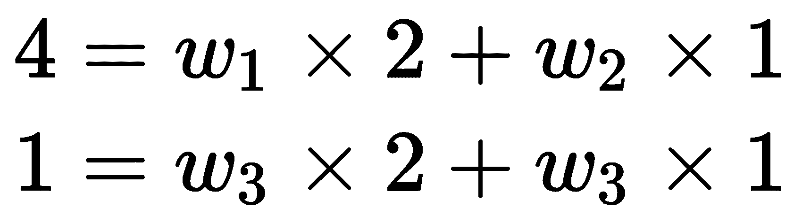

将其写成矩阵形式，我们得到以下：

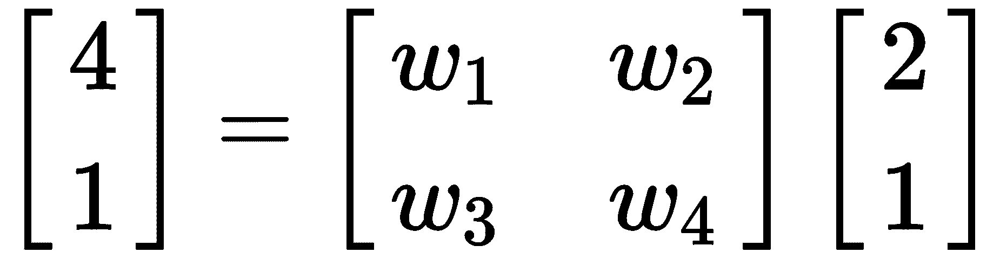

仔细的读者现在应该已经发现了错误：这里有*四个*变量 (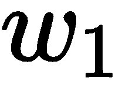, 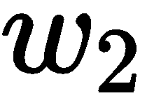, 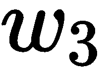, 和 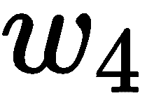)，但只有*两个*方程。从高中数学中，我们知道你不能解一个方程组，其中方程的数量少于变量的数量！

问题是，你的高中数学老师有点骗了你。某种程度上是可以解决的，你已经在第二章，*线性回归 - 房价预测*中自己做到了。

事实上，大多数机器学习问题都可以用线性代数重新表达，具体形式如下：

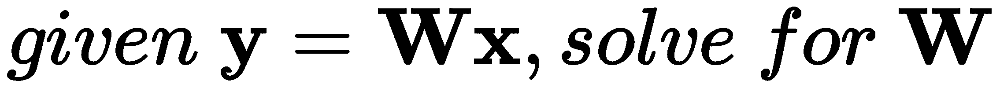

在我看来，这是正确思考人工神经网络的方式：一系列数学函数，而不是生物神经元的模拟。我们将在下一章中进一步探讨这一点。实际上，这种理解对于理解深度学习和它为什么有效至关重要。

现在，继续跟随更常见的观点，即人工神经网络在行为上类似于受生物启发的神经网络。

# 探索激活函数

线性代数的特性是它是线性的。当输出变化与输入变化成比例时，它是有用的。现实世界充满了非线性函数和方程。用大写的 H 解决非线性方程是困难的。但我们有一个技巧。我们可以取一个线性方程，然后向其中添加一个非线性。这样，函数就变得非线性了！

从这个观点出发，你可以将人工神经网络视为我们迄今为止所经历的所有章节的通用版本。

在人工神经网络的历史上，社区以一种时尚的方式青睐特定的激活函数。在早期，Heaviside 函数受到青睐。逐渐地，社区转向青睐可微分的连续函数，如 sigmoid 和 tanh。但最近，时尚的钟摆又回到了更硬、看似不连续的函数上。关键是，我们学会了如何对函数进行微分的新技巧，例如**修正线性单元**（**ReLu**）。

在历史上，一些激活函数因其流行而受到青睐：

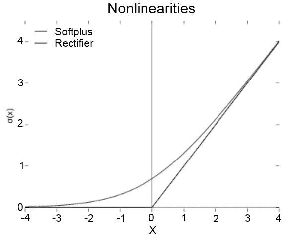

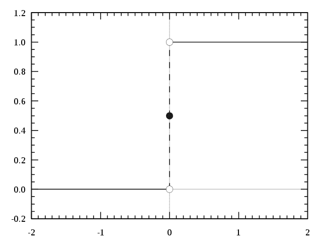

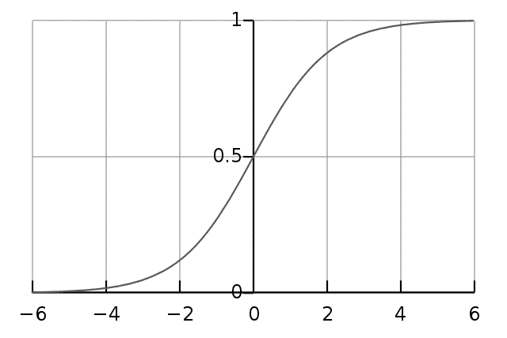

关于这些函数的一点需要注意的是，这些函数都是非线性的，它们在 y 轴上都有一个硬限制。

激活函数的垂直范围是有限的，但水平范围不是。我们可以使用偏置来调整我们的激活函数看起来如何。

应该注意的是，偏置可以是零。这也意味着我们可以省略偏置。大多数时候，对于更复杂的项目来说，这是可以的，尽管添加偏置会增加神经网络的准确性。

# 学习

我想让你思考你是如何学习的。不是学习风格，不，我想让你对你的学习过程进行深入的思考。想想你学习的各种方式。也许你曾经热的时候碰过炉子。或者如果你曾经学习过一门新语言，也许你开始时是通过记忆短语来成为流利的。想想所有先于这一章的章节。它们有什么共同点？

简而言之，学习是通过纠正来实现的。如果你在热的时候碰到了炉子，你犯了错误。纠正的方法是永远不要再在热的时候碰炉子。你已经学会了如何在热的时候不碰炉子。

类似地，神经网络的学习方式是通过纠正来实现的。如果我们想要训练一台机器学习识别手写文字，我们需要提供一些样本图像，并告诉机器哪些是正确的标签。如果机器预测标签错误，我们需要告诉它改变神经网络中的某些东西并再次尝试。

可以改变什么？当然是权重。输入不能改变；它们是输入。但我们可以尝试不同的权重。因此，学习过程可以分为两个步骤：

+   当神经网络犯错时，告诉它它是错的。

+   更新权重，以便下一次尝试能得到更好的结果。

这样分解后，我们就有了一个很好的下一步进行的方法。一种方法是通过二元决定机制：如果神经网络预测了正确答案，则不更新权重。如果它错了，则更新权重。

那么，如何更新权重呢？好吧，一种方法是用新的值完全替换权重矩阵并再次尝试。由于权重矩阵是由从随机分布中抽取的值填充的，新的权重矩阵将是一个新的随机矩阵。

很明显，这两种方法结合在一起，神经网络学会任何东西都需要非常非常长的时间；这就像我们只是在猜测正确的权重矩阵一样。

相反，现代神经网络使用**反向传播**的概念来告诉神经网络它犯了错误，并使用某种形式的**梯度下降**来更新权重。

反向传播和梯度下降的具体内容超出了本章（和本书）的范围。然而，我会通过分享一个故事来简要地介绍这些基本概念。我和几位也在机器学习领域工作的朋友一起吃午饭，那次午餐以我们争论告终。这是因为我随意提到反向传播是“发现”的，而不是“发明”的。我的朋友们坚决认为反向传播是发明的，而不是发现的。我的推理很简单：如果多个人以相同的公式偶然发现数学，那么数学是“发现”的。如果没有人平行地发现它，那么数学是“发明”的。

反向传播，以各种形式，在时间中被不断重新发现。反向传播第一次被发现是在线性回归的发明中。我应该指出，它是一种非常具体的反向传播形式，专门针对线性回归：平方误差之和可以通过对平方误差之和关于输入的导数来反向传播到其输入。

我们从一个成本开始。记住我们不得不告诉神经网络它犯了一个错误。我们通过告诉神经网络预测的成本来做这件事。这被称为成本函数。我们可以定义一个成本，使得当神经网络做出正确预测时，成本较低，而当神经网络做出错误预测时，成本较高。

现在想象一下，成本函数是 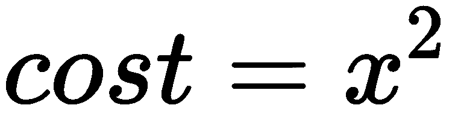。你如何知道在 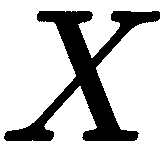 的哪些值下成本最低？从高中数学我们知道，解决方案是对 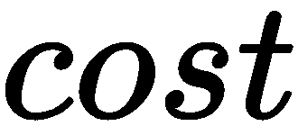 关于  求导，并求解当它为 0 时的解：

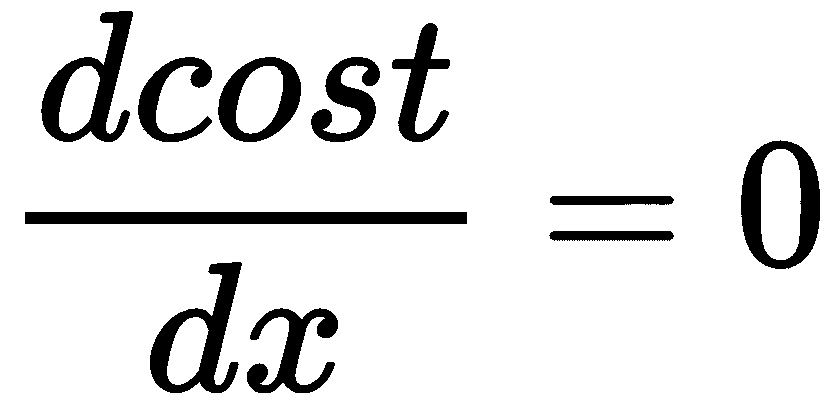

反向传播采取了同样的线索。简而言之，反向传播只是一系列关于权重的偏导数。我们的玩具示例和真实反向传播之间的主要区别在于，我们表达式的推导很容易解决。对于更复杂的数学表达式，计算解决方案可能过于昂贵。相反，我们依赖于梯度下降来找到答案。

梯度下降假设我们从某个地方开始我们的 x，并通过迭代更新 x 以趋向最低成本。在每次迭代中，我们更新权重。梯度下降的最简单形式是将权重的梯度加到权重本身上。

关键的启示是这样一个强大的概念：通过执行函数的微分并找到一个导数最小的点，你可以告诉输入已经发生了一个错误。

# 项目

我们即将开始的项目就是开头段落中提到的那个。我们将要分类的数据集是由国家标准与技术研究院最初收集的一组手写数字，后来由 Yann LeCun 的团队修改。我们的目标是将这些手写数字分类为 0、1、2... 9 中的一个。

我们将基于神经网络是应用线性代数的理解来构建一个基本的神经网络，并且我们将使用 Gorgonia 来完成这一章和下一章的内容。

要安装 Gorgonia，只需运行 `go get -u gorgonia.org/gorgonia` 和 `go get -u gorgonia.org/tensor`。

# Gorgonia

Gorgonia 是一个库，它通过在构建深度神经网络时进行高效数学运算来简化操作。它基于这样的基本理解：神经网络是数学表达式。因此，使用 Gorgonia 构建神经网络相当容易。

关于章节的说明：因为 Gorgonia 是一个相对庞大的库，所以本章将省略一些关于 Gorgonia 的内容，但将在下一章以及另一本 Packt 书籍《Hands On Deep Learning in Go》中进一步展开。

# 获取数据

MNIST 数据的数据可以在本章的存储库中找到。在其原始形式中，它不是标准的图像格式。因此，我们需要将数据解析为可接受格式。

数据集分为两部分：标签和图像。因此，这里有一些函数，用于读取和解析 MNIST 文件：

```py
// Image holds the pixel intensities of an image.
// 255 is foreground (black), 0 is background (white).
type RawImage []byte

// Label is a digit label in 0 to 9
type Label uint8

const numLabels = 10
const pixelRange = 255

const (
  imageMagic = 0x00000803
  labelMagic = 0x00000801
  Width = 28
  Height = 28
)

func readLabelFile(r io.Reader, e error) (labels []Label, err error) {
  if e != nil {
    return nil, e
  }

  var magic, n int32
  if err = binary.Read(r, binary.BigEndian, &magic); err != nil {
    return nil, err
  }
  if magic != labelMagic {
    return nil, os.ErrInvalid
  }
  if err = binary.Read(r, binary.BigEndian, &n); err != nil {
    return nil, err
  }
  labels = make([]Label, n)
  for i := 0; i < int(n); i++ {
    var l Label
    if err := binary.Read(r, binary.BigEndian, &l); err != nil {
      return nil, err
    }
    labels[i] = l
  }
  return labels, nil
}

func readImageFile(r io.Reader, e error) (imgs []RawImage, err error) {
  if e != nil {
    return nil, e
  }

  var magic, n, nrow, ncol int32
  if err = binary.Read(r, binary.BigEndian, &magic); err != nil {
    return nil, err
  }
  if magic != imageMagic {
    return nil, err /*os.ErrInvalid*/
  }
  if err = binary.Read(r, binary.BigEndian, &n); err != nil {
    return nil, err
  }
  if err = binary.Read(r, binary.BigEndian, &nrow); err != nil {
    return nil, err
  }
  if err = binary.Read(r, binary.BigEndian, &ncol); err != nil {
    return nil, err
  }
  imgs = make([]RawImage, n)
  m := int(nrow * ncol)
  for i := 0; i < int(n); i++ {
    imgs[i] = make(RawImage, m)
    m_, err := io.ReadFull(r, imgs[i])
    if err != nil {
      return nil, err
    }
    if m_ != int(m) {
      return nil, os.ErrInvalid
    }
  }
  return imgs, nil
}
```

首先，函数从 `io.Reader` 读取文件并读取一组 `int32`。这些是文件的元数据。第一个 `int32` 是一个魔术数字，用于指示文件是标签文件还是图像文件。`n` 表示文件包含的图像或标签数量。`nrow` 和 `ncol` 是文件中存在的元数据，表示每个图像中的行数/列数。

深入到 `readImageFile` 函数中，我们可以看到在读取所有元数据之后，我们知道要创建一个大小为 `n` 的 `[]RawImage`。MNIST 数据集中使用的图像格式基本上是一个 784 字节的切片（28 列和 28 行）。因此，每个字节代表图像中的一个像素。每个字节的值表示像素的亮度，范围从 0 到 255：

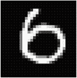

上述图像是 MNIST 图像放大的示例。在左上角，平面切片中像素的索引为 0。在右上角，平面切片中像素的索引为 27。在左下角，平面切片中像素的索引为 755。最后，在右下角，索引为 727。这是一个需要记住的重要概念：一个二维图像可以表示为一个一维切片。

# 可接受格式

什么格式是表示图像的可接受格式？字节切片对于读取和显示图像很有用，但并不特别适用于进行任何机器学习。相反，我们希望将图像表示为浮点数的切片。所以，这里有一个将字节转换为 `float64` 的函数：

```py
func pixelWeight(px byte) float64 {
  retVal := float64(px)/pixelRange*0.9 + 0.1
  if retVal == 1.0 {
    return 0.999
  }
  return retVal
}
```

这是一个基本的缩放函数，将 0-255 的范围缩放到 0.0 和 1.0 之间。还有一个额外的检查；如果值是 1.0，我们返回 0.999 而不是 1。这主要是因为当值为 1.0 时，数值不稳定性往往会发生，因为数学函数往往会表现得古怪。所以，用非常接近 1 的值来替换 1.0。

因此，现在，我们可以将一个`RawImage`转换成`[]float64`。因为我们有以`[]RawImage`形式存在的`N`个图像，我们可以将其转换成`[][]float64`，或者一个矩阵。

# 从图像到矩阵

到目前为止，我们已经确定可以将特殊格式的图像列表转换成`float64`的切片的切片。回想一下，当你堆叠神经元时，它们形成一个矩阵，神经层的激活仅仅是矩阵-向量乘法。而当输入被堆叠在一起时，它仅仅是矩阵-矩阵乘法。

我们技术上可以用`[][]float64`来构建一个神经网络。但最终结果会相当慢。作为一个物种，我们大约有 40 年的经验，专门开发用于高效线性代数运算的算法，如矩阵乘法和矩阵-向量乘法。这些算法集合通常被称为 BLAS（基本线性代数子程序）。

到目前为止，这本书中，我们一直在使用建立在提供 BLAS 函数的库之上的库，即 Gonum 的 BLAS 库。如果你一直跟随着这本书，那么它已经安装好了。否则，运行`go get -u gonum.org/v1/gonum/...`，这将安装整个 Gonum 库套件。

由于 BLAS 通常的工作方式，我们需要比`[][]float64`更好的矩阵表示方法。这里我们有两种选择：

+   Gonum 的`mat`库

+   Gorgonia 的`tensor`库

为什么 Gorgonia 的`tensor`？`tensor`的原因相当简单。它与 Gorgonia 本身配合得很好，因为 Gorgonia 需要多维数组。Gonum 的`mat`只能处理最多两个维度，而在下一章中，我们将看到四维数组的用法。

# 什么是张量？

基本上，张量非常类似于向量。这个想法是从物理学中借鉴的。想象一下在一个二维平面上推一个盒子。如果你沿着*x*轴用 1 牛顿的力推盒子，那么*y*轴上没有施加力。你会这样写向量：`[1, 0]`。如果盒子沿着*x*轴以 10 公里/小时的速度移动，沿着*y*轴以 2 公里/小时的速度移动，你会这样写向量：`[10, 2]`。注意，它们是无单位的：第一个例子是牛顿的向量，第二个例子是带有公里/小时单位的向量。

简而言之，它是对某个方向上应用的东西（一个力、一个速度，或者任何具有大小和方向的东西）的一种表示。从这个想法出发，计算机科学借鉴了向量的名字。但在 Go 语言中，它们被称为**切片**。

那么什么是张量？省略了很多细节，但不会失去一般性，张量就像向量一样。只是多维的。想象一下如果你要在平面上描述两个速度（想象一下愚蠢的橡皮泥以不同的速度在两个方向上拉伸）：`[1, 0]`和`[10, 2]`。你会这样写：

`⎡ 1 0⎤`

`⎣10 2⎦`

这也被称为矩阵（当它是二维时）。当它是三维时，称为 3-张量，当它是四维时，称为 4-张量，以此类推。注意，如果你有一个第三个速度（即愚蠢的橡皮泥在第三个方向上被拉伸），你将不会有一个 3-张量。相反，你仍然会有一个矩阵，有三个行。

为了在前面示例的基础上可视化 3-张量，想象一下，如果愚蠢的橡皮泥被拉向两个方向，这就像时间中的一个切片。然后想象另一个时间中的切片，同样的愚蠢的橡皮泥再次被拉向两个方向。现在你将有两个矩阵。当你想象将这些矩阵堆叠在一起时，就会得到一个 3-张量。

将 `[]RawImage` 转换为 `tensor.Tensor` 的代码如下：

```py
func prepareX(M []RawImage) (retVal tensor.Tensor) {
  rows := len(M)
  cols := len(M[0])

  b := make([]float64, 0, rows*cols)
  for i := 0; i < rows; i++ {
    for j := 0; j < len(M[i]); j++ {
      b = append(b, pixelWeight(M[i][j]))
    }
  }
  return tensor.New(tensor.WithShape(rows, cols), tensor.WithBacking(b))
}
```

Gorgonia 对于初学者可能有点难以理解。所以让我逐行解释这段代码。但首先，你必须意识到，与 Gonum 矩阵一样，Gorgonia 张量，无论有多少维度，在内部也以扁平切片的形式表示。Gorgonia 张量在某种程度上更加灵活，因为它们可以接受不仅仅是 `float64` 的扁平切片（它们也可以接受其他类型的切片）。这被称为后备切片或数组。这是在 Gonum 和 Gorgonia 中执行线性代数操作比使用普通的 `[][]float64` 更高效的一个基本原因。

`rows := len(M)` 和 `cols := len(M[0])` 非常直观易懂。我们想知道行数（即图像数量）和列数（图像中的像素数量）。

`b := make([]float64, 0, rows*cols)` 创建了一个容量为 `rows * cols` 的后备数组。这个后备数组被称为后备 *数组*，因为在整个 `b` 的生命周期中，其大小不会改变。我们在这里从长度 `0` 开始，因为我们想稍后使用 `append` 函数。

`a := make([]T, 0, capacity)` 是预分配切片的一个好模式。考虑以下类似的代码片段：

`a := make([]int, 0)`

`    for i := 0; i < 10; i++ {`

`        a = append(a, i)`

`}`

在第一次调用 `append` 时，Go 运行时会查看 `a` 的容量，发现它是 `0`。因此，它会分配一些内存来创建一个大小为 1 的切片。然后在第二次调用 `append` 时，Go 运行时会查看 `a` 的容量，发现它是 `1`，这显然是不够的。所以它会分配当前切片容量的两倍。在第四次迭代时，它会发现 `a` 的容量不足以追加，并再次将切片的当前容量加倍。

关于分配的问题在于，它是一个昂贵的操作。偶尔，Go 运行时可能不仅需要分配内存，还需要将内存复制到新位置。这增加了向切片追加的成本。

因此，如果我们事先知道切片的容量，最好一次性分配所有内容。我们可以指定长度，但通常会导致索引错误。因此，我的建议是使用容量和长度为`0`进行分配。这样，你可以安全地使用`append`而不用担心索引错误。

在创建底层切片后，我们只需使用之前描述的`pixelWeight`函数将像素值填充到底层切片中，将其转换为`float64`。

最后，我们调用`tensor.New(tensor.WithShape(rows, cols), tensor.WithBacking(b))`，它返回一个`*tensor.Dense`。`tensor.WithShape(rows, cols)`构造选项创建了一个具有指定形状的`*tensor.Dense`，而`tensor.WithBacking(b)`则简单地使用已经预先分配和填充的`b`作为底层切片。

`tensor`库将简单地重用整个底层数组，以便减少分配。这意味着你处理`b`时必须小心。在之后修改`b`的内容将改变`tensor.Dense`中的内容。鉴于`b`是在`prepareX`函数中创建的，一旦函数返回，就无法修改`b`的内容。这是一种防止意外修改的好方法。

# 从标签到单热向量

回想一下，在 Gorgonia 中构建的神经网络只接受`tensor.Tensor`s 作为输入。因此，标签也必须转换为`tensor.Tensor`。该函数与`prepareX`非常相似：

```py
func prepareY(N []Label) (retVal tensor.Tensor) {
  rows := len(N)
  cols := 10

  b := make([]float64, 0, rows*cols)
  for i := 0; i < rows; i++ {
    for j := 0; j < 10; j++ {
      if j == int(N[i]) {
        b = append(b, 1)
      } else {
        b = append(b, 0)
      }
    }
  }
  return tensor.New(tensor.WithShape(rows, cols), tensor.WithBacking(b))
}

```

我们在这里构建的是一个有*N*行和十个列的矩阵。为什么我们要构建`(N,10)`矩阵的具体原因将在下一章中探讨，但就现在而言，让我们聚焦到一个假设的行。想象一下第一个标签，`(int(N[i]))`是`7`。这一行看起来是这样的：

`[0, 0, 0, 0, 0, 0, 0, 1, 0, 0]`

这被称为单热向量编码。它将对我们有用，并在下一章中进一步探讨。

# 可视化

当我们处理图像数据时，可视化也是有用的。之前我们使用`pixelWeight`将图像像素从`byte`转换为`float64`。也很有必要有一个反向函数：

```py
func reversePixelWeight(px float64) byte {
  return byte(((px - 0.001) / 0.999) * pixelRange)
}
```

这是如何可视化 100 张图像的方法：

```py
// visualize visualizes the first N images given a data tensor that is made up of float64s.
// It's arranged into (rows, 10) image.
// Row counts are calculated by dividing N by 10 - we only ever want 10 columns.
// For simplicity's sake, we will truncate any remainders.
func visualize(data tensor.Tensor, rows, cols int, filename string) (err error) {
  N := rows * cols

  sliced := data
  if N > 1 {
    sliced, err = data.Slice(makeRS(0, N), nil) // data[0:N, :] in python
    if err != nil {
      return err
    }
  }

  if err = sliced.Reshape(rows, cols, 28, 28); err != nil {
    return err
  }

  imCols := 28 * cols
  imRows := 28 * rows
  rect := image.Rect(0, 0, imCols, imRows)
  canvas := image.NewGray(rect)

  for i := 0; i < cols; i++ {
    for j := 0; j < rows; j++ {
      var patch tensor.Tensor
      if patch, err = sliced.Slice(makeRS(i, i+1), makeRS(j, j+1)); err != nil {
        return err
      }

      patchData := patch.Data().([]float64)
      for k, px := range patchData {
        x := j*28 + k%28
        y := i*28 + k/28
        c := color.Gray{reversePixelWeight(px)}
        canvas.Set(x, y, c)
      }
    }
  }

  var f io.WriteCloser
  if f, err = os.Create(filename); err != nil {
    return err
  }

  if err = png.Encode(f, canvas); err != nil {
    f.Close()
    return err
  }

  if err = f.Close(); err != nil {
    return err
  }
  return nil
}
```

数据集是一大块图像。我们首先需要确定我们想要多少个；因此，`N := rows * cols`。有了我们想要的数字，我们然后使用`data.Slice(makeRS(0, N), nil)`进行切片，这将张量沿第一个轴切片。然后，切片张量通过`sliced.Reshape(rows, cols, 28,28)`重塑为一个四维数组。你可以这样理解：它是由 28x28 图像堆叠的行和列。

**切片入门**

一个`*tensor.Dense`的行为非常类似于标准的 Go 切片；就像你可以对`a[0:2]`进行切片一样，你可以在 Gorgonia 的张量上做同样的事情。所有张量的`.Slice()`方法接受一个`tensor.Slice`描述符，定义为：

`type Slice interface {`

`    Start() int`

`    End() int`

`    Step() int`

`}`

因此，我们可能需要创建自己的数据类型，以满足`Slice`接口。它在项目的`utils.go`文件中定义。`makeRS(0, N)`简单地读作如果我们正在做`data[0:N]`。关于此 API 的详细信息及其原因可以在 Gorgonia 张量 Godoc 页面上找到。

然后使用内置的`image`包创建一个灰度图像：`canvas := image.NewGray(rect)`。`image.Gray`本质上是一个字节的切片，每个字节代表一个像素。接下来我们需要做的是填充像素。简单来说，我们只需遍历每个补丁中的列和行，并用从张量中提取的正确值填充它。`reversePixelWeight`函数用于将浮点数转换为字节，然后将其转换为`color.Gray`。然后使用`canvas.Set(x, y, c)`设置画布中的像素。

随后，画布被编码为 PNG 格式。*Et voilà*，我们的可视化工作就完成了！

现在在主函数中调用`visualize`如下：

```py
func main() {
  imgs, err := readImageFile(os.Open("train-images-idx3-ubyte"))
  if err != nil {
    log.Fatal(err)
  }
  log.Printf("len imgs %d", len(imgs))

  data := prepareX(imgs)
  visualize(data, 100, "image.png")
}
```

这会产生以下图像：

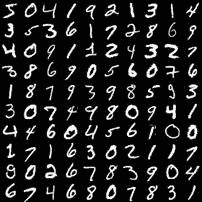

# 预处理

我们接下来要做的是使用**零相位成分分析**（**ZCA**）来“白化”我们的数据。ZCA 的定义超出了本章的范围，但简而言之，ZCA 非常类似于**主成分分析**（**PCA**）。在我们的 784 像素切片中，像素之间高度相关的可能性很大。PCA 所做的就是找到一组彼此不相关的像素。它是通过一次性查看所有图像并找出每一列如何相互关联来做到这一点的：

```py
func zca(data tensor.Tensor) (retVal tensor.Tensor, err error) {
  var dataᵀ, data2, sigma tensor.Tensor
  data2 = data.Clone().(tensor.Tensor)

  if err := minusMean(data2); err != nil {
    return nil, err
  }
  if dataᵀ, err = tensor.T(data2); err != nil {
    return nil, err
  }

  if sigma, err = tensor.MatMul(dataᵀ, data2); err != nil {
    return nil, err
  }

  cols := sigma.Shape()[1]
  if _, err = tensor.Div(sigma, float64(cols-1), tensor.UseUnsafe()); err != nil {
    return nil, err
  }

  s, u, _, err := sigma.(*tensor.Dense).SVD(true, true)
  if err != nil {
    return nil, err
  }

  var diag, uᵀ, tmp tensor.Tensor
  if diag, err = s.Apply(invSqrt(0.1), tensor.UseUnsafe()); err != nil {
    return nil, err
  }
  diag = tensor.New(tensor.AsDenseDiag(diag))

  if uᵀ, err = tensor.T(u); err != nil {
    return nil, err
  }

  if tmp, err = tensor.MatMul(u, diag); err != nil {
    return nil, err
  }

  if tmp, err = tensor.MatMul(tmp, uᵀ); err != nil {
    return nil, err
  }

  if err = tmp.T(); err != nil {
    return nil, err
  }

  return tensor.MatMul(data, tmp)
}

func invSqrt(epsilon float64) func(float64) float64 {
  return func(a float64) float64 {
    return 1 / math.Sqrt(a+epsilon)
  }
}
```

这是一段相当大的代码块。让我们来分析这段代码。但在分析实现 ZCA 的代码之前，让我们先了解 ZCA 背后的关键思想。

首先，回忆一下 PCA 做了什么：它找到一组输入（列和像素，可以互换使用）它们之间相关性最小。ZCA 所做的就是然后取找到的主成分，并将它们乘以输入，以转换输入，使它们彼此之间相关性降低。

首先，我们想要减去行均值。为此，我们首先克隆数据（我们稍后会看到原因），然后使用此函数减去均值：

```py
func minusMean(a tensor.Tensor) error {
  nat, err := native.MatrixF64(a.(*tensor.Dense))
  if err != nil {
    return err
  }
  for _, row := range nat {
    mean := avg(row)
    vecf64.Trans(row, -mean)
  }

  rows, cols := a.Shape()[0], a.Shape()[1]

  mean := make([]float64, cols)
  for j := 0; j < cols; j++ {
    var colMean float64
    for i := 0; i < rows; i++ {
      colMean += nat[i][j]
    }
    colMean /= float64(rows)
    mean[j] = colMean
  }

  for _, row := range nat {
    vecf64.Sub(row, mean)
  }

  return nil
}
```

在所有关于平面切片与`[][]float64`效率的讨论之后，我接下来要提出的建议可能会听起来有些反直觉。但请耐心听我说。`native.MatrixF64`接受一个`*tensor.Dense`并返回一个`[][]float64`，我们称之为`nat`。`nat`与张量`a`共享相同的分配。没有额外的分配，对`nat`所做的任何修改都会在`a`中显示出来。在这种情况下，我们应该将`[][]float64`视为一种轻松遍历张量中值的简单方法。这可以在下面看到：

```py
  for j := 0; j < cols; j++ {
    var colMean float64
    for i := 0; i < rows; i++ {
      colMean += nat[i][j]
    }
    colMean /= float64(rows)
    mean[j] = colMean
  }
```

就像在`visualize`函数中一样，我们首先遍历列，尽管目的不同。我们想要找到每列的平均值。然后我们将每列的平均值存储在`mean`变量中。这允许我们减去列均值：

```py
  for _, row := range nat {
    vecf64.Sub(row, mean)
  }
```

这段代码使用了 Gorgonia 附带的自定义`vecf64`包，从另一个切片中减去一个切片，逐元素进行。它与以下内容相当：

```py
  for _, row := range nat {
    for j := range row {
      row[j] -= mean[j]
    }
  }
```

使用`vecf64`的唯一真正原因是它经过优化，可以使用 SIMD 指令执行操作：而不是逐个执行`row[j] -= mean[j]`，它同时执行`row[j] -= mean[j]`、`row[j+1] -= mean[j+1]`、`row[j+2] -= mean[j+2]`和`row[j+3] -= mean[j+3]`。

在我们减去均值之后，我们找到它的转置并复制一份：

```py
  if dataᵀ, err = tensor.T(data2); err != nil {
    return nil, err
  }
```

通常，你会通过使用类似`data2.T()`的方式来找到`tensor.Tensor`的转置。但这并不返回它的一个副本。相反，`tensor.T`函数克隆了数据结构，然后对其进行转置。这样做的原因是什么？我们即将使用转置和`data2`来找到`Sigma`（关于矩阵乘法的更多内容将在下一章中解释）：

```py
  var sigma tensor.Tensor
  if sigma, err = tensor.MatMul(dataᵀ, data2); err != nil {
    return nil, err
  }
```

在我们找到`sigma`之后，我们将其除以列数减 1。这提供了一个无偏估计量。`tensor.UseUnsafe`选项用于指示结果应存储回`sigma`张量：

```py
  cols := sigma.Shape()[1]
  if _, err = tensor.Div(sigma, float64(cols-1), tensor.UseUnsafe()); err != nil {
    return nil, err
  }
```

所有这些操作都是为了我们能够在`sigma`上执行奇异值分解（SVD）：

```py
  s, u, _, err := sigma.(*tensor.Dense).SVD(true, true)
  if err != nil {
    return nil, err
  }
```

如果你不熟悉奇异值分解（Singular Value Decomposition），它是一种将矩阵分解为其组成部分的方法之一。你为什么要这样做呢？一方面，它使得某些计算的部分变得更容易。它所做的就是将一个(M, N)矩阵分解为一个(M, N)矩阵，称为![img/e8e5b0cf-7095-4d02-bcea-adf293b141b7.png]，一个(M, M)矩阵，称为![img/b3336713-7358-4b4f-81ea-59bac8d93aa8.png]，以及一个(N, N)矩阵，称为![img/2ef3a6de-2db6-47a8-9325-d4ba67b13ab6.png]。为了重建 A，公式很简单：

![img/958010d7-bc97-44b5-9afb-6f620e3879f6.png]

分解的部分将被使用。在我们的情况下，我们并不特别关注右奇异值 ![img/8cbd12c1-85b2-42bc-894d-c37cfdbe30e8.png]，所以我们现在暂时忽略它。分解的部分简单用于转换图像，这些图像可以在函数体的末尾找到。

在预处理之后，我们再次可视化前 100 多张图像：

![img/882ed7d0-2a36-45fd-a66b-45c9c5c04b30.png]

# 构建神经网络

最后，让我们构建一个神经网络！我们将构建一个简单的三层神经网络，包含一个隐藏层。三层神经网络有两个权重矩阵，因此我们可以将神经网络定义为如下：

```py
type NN struct {
  hidden, final *tensor.Dense
  b0, b1 float64
}
```

`hidden`代表输入层和隐藏层之间的权重矩阵，而`final`代表隐藏层和最终层之间的权重矩阵。

这是我们的*NN 数据结构的图形表示：


输入层是 784 个`float64`的切片，然后通过前馈（即矩阵乘法后跟激活函数）形成隐藏层。隐藏层随后通过前馈形成最终层。最终层是一个包含十个`float64`的向量，这正是我们之前讨论过的独热编码。你可以把它们看作是伪概率，因为它们的值并不正好加起来等于 1。

需要注意的关键点：`b0`和`b1`分别是隐藏层和最终层的偏置值。它们实际上并没有被主要使用，主要是因为混乱；正确求导相当困难。对读者的一个挑战是在以后结合使用`b0`和`b1`。

要创建一个新的神经网络，我们有`New`函数：

```py
func New(input, hidden, output int) (retVal *NN) {
  r := make([]float64, hidden*input)
  r2 := make([]float64, hidden*output)
  fillRandom(r, float64(len(r)))
  fillRandom(r2, float64(len(r2)))
  hiddenT := tensor.New(tensor.WithShape(hidden, input), tensor.WithBacking(r))
  finalT := tensor.New(tensor.WithShape(output, hidden), tensor.WithBacking(r2))
  return &NN{
    hidden: hiddenT,
    final: finalT,
  }
}
```

`fillRandom`函数用随机值填充一个`[]float64`。在我们的情况下，我们用从均匀分布中抽取的随机值填充它。在这里，我们使用 Gonum 的`distuv`包：

```py
func fillRandom(a []float64, v float64) {
  dist := distuv.Uniform{
    Min: -1 / math.Sqrt(v),
    Max: 1 / math.Sqrt(v),
  }
  for i := range a {
    a[i] = dist.Rand()
  }
}
```

在切片`r`和`r2`被填充后，创建了张量`hiddenT`和`finalT`，并返回了`*NN`。

# 前馈

现在我们已经对神经网络的工作原理有了概念性的了解，让我们编写前向传播函数。我们将称之为`Predict`，因为，嗯，要预测，你只需要运行函数的前向部分：

```py
func (nn *NN) Predict(a tensor.Tensor) (int, error) {
  if a.Dims() != 1 {
    return -1, errors.New("Expected a vector")
  }

  var m maybe
  hidden := m.do(func() (tensor.Tensor, error) { return nn.hidden.MatVecMul(a) })
  act0 := m.do(func() (tensor.Tensor, error) { return hidden.Apply(sigmoid, tensor.UseUnsafe()) })

  final := m.do(func() (tensor.Tensor, error) { return tensor.MatVecMul(nn.final, act0) })
  pred := m.do(func() (tensor.Tensor, error) { return final.Apply(sigmoid, tensor.UseUnsafe()) })

  if m.err != nil {
    return -1, m.err
  }
  return argmax(pred.Data().([]float64)), nil
}
```

这相当直接，除了几个控制结构。我首先应该解释的是，tensor 包的 API 在表达性方面相当强，因为它允许用户以多种方式完成相同的事情，尽管类型签名不同。简而言之，模式如下：

+   `tensor.BINARYOPERATION(a, b tensor.Tensor, opts ...tensor.FuncOpt) (tensor.Tensor, error)`

+   `tensor.UNARYOPERATION(a tensor.Tensor, opts ...tensor.FuncOpt)(tensor.Tensor, error)`

+   `(a *tensor.Dense) BINARYOPERATION (b *tensor.Dense, opts ...tensor.FuncOpt) (*tensor.Dense, error)`

+   `(a *tensor.Dense) UNARYOPERATION(opts ...tensor.FuncOpt) (*tensor.Dense, error)`

需要注意的关键点是包级操作（如`tensor.Add`、`tensor.Sub`等）接受一个或多个`tensor.Tensor`，并返回一个`tensor.Tensor`和一个`error`。有多个东西实现了`tensor.Tensor`接口，tensor 包提供了两种结构类型来实现该接口：

+   `*tensor.Dense`: 一个密集填充张量的表示

+   `*tensor.CS`: 以压缩稀疏列/行格式排列的稀疏填充张量的内存高效表示

在大多数情况下，最常用的`tensor.Tensor`类型是`*tensor.Dense`类型。`*tensor.CS`数据结构仅用于针对特定算法的特定内存受限优化。我们在此章节中不会更多讨论`*tensor.CS`类型。

除了包级别的操作之外，每个特定类型也实现了它们自己的方法。`*tensor.Dense`的方法（`.Add(...)`, `.Sub(...)`等）接受一个或多个`*tensor.Dense`并返回`*tensor.Dense`和一个错误。

# 使用 maybe 处理错误

在快速介绍完这些之后，我们现在可以谈谈`maybe`类型。

你可能已经注意到的其中一件事是，几乎所有操作都返回一个错误。事实上，很少有函数和方法不返回错误。背后的逻辑很简单：大多数错误实际上是可恢复的，并且有合适的恢复策略。

然而，对于这个项目，我们有一个错误恢复策略：将错误冒泡到`main`函数中，在那里将调用`log.Fatal`并检查错误以进行调试。

因此，我定义了`maybe`如下：

```py
type maybe struct {
  err error
}

func (m *maybe) do(fn func() (tensor.Tensor, error)) tensor.Tensor {
  if m.err != nil {
    return nil
  }

  var retVal tensor.Tensor
  if retVal, m.err = fn(); m.err == nil {
    return retVal
  }
  m.err = errors.WithStack(m.err)
  return nil
}
```

这样，它能够处理任何函数，只要它被封装在一个闭包中。

为什么这样做？我个人并不喜欢这种结构。我曾把它当作一个酷炫的小技巧教给几个学生，从那时起，他们声称生成的代码比有块状结构的代码更易于理解：

```py
if foo, err := bar(); err != nil {
  return err
}
```

我确实能理解这种观点。在我看来，它在原型设计阶段最有用，尤其是在还不清楚何时何地处理错误（在我们的例子中是提前返回）的时候。将返回错误留到函数的末尾可能是有用的。但在生产代码中，我更喜欢尽可能明确地关于错误处理策略。

这可以通过将常见的函数调用抽象成方法来进一步扩展。例如，我们在前面的代码片段中看到了这一行，`m.do(func() (tensor.Tensor, error) { return hidden.Apply(sigmoid, tensor.UseUnsafe()) })`，出现了两次。如果我们想优先考虑可读性，同时尽量保持结构不变，我们可以通过创建一个新的方法来抽象它：

```py
func (m *maybe) sigmoid(a tensor.Tensor) (retVal tensor.Tensor){
  if m.err != nil {
    return nil
  }
  if retVal, m.err = a.Apply(sigmoid); m.err == nil {
    return retVal
  }
  m.err = errors.WithStack(m.err)
  return nil
}
```

我们只需调用`m.sigmoid(hidden)`即可。这是程序员可以采用的许多错误处理策略之一。记住，你是一名程序员；你被允许，甚至被期望以编程的方式解决问题！

# 解释前向函数

在完成所有这些之后，让我们逐行分析前向函数。

首先，回想一下在*模拟神经网络*这一节中，我们可以如下定义神经网络：

```py
func affine(weights [][]float64, inputs []float64) []float64 {
  return activation(matVecMul(weights, inputs))
}
```

我们在计算第一个隐藏层时执行第一次矩阵乘法：`hidden := m.do(func() (tensor.Tensor, error) { return nn.hidden.MatVecMul(a)) })`。使用`MatVecMul`是因为我们在乘以一个向量。

然后我们执行计算层的第二部分：`act0 := m.do(func() (tensor.Tensor, error) { return hidden.Apply(sigmoid, tensor.UseUnsafe()) })`。再次使用`tensor.UseUnsafe()`函数选项来告诉函数不要分配一个新的 tensor。*哇*！我们已经成功计算了第一层。

最后一个步骤重复了相同的两个步骤，我们得到了一个类似 one-hot 的向量。请注意，在第一步中，我使用了`tensor.MatVecMul(nn.final, act0)`而不是`nn.final.MatVecMul(act0)`。这样做是为了表明这两个函数确实是相同的，它们只是接受不同的类型（方法接受具体类型，而包函数接受抽象数据类型）。它们在其他方面功能相同。

注意一下`affine`函数的阅读起来是多么简单，而其他函数则相当难以阅读？阅读关于`maybe`的部分，看看你是否能想出一个方法来编写它，使其读起来更像`affine`。

有没有一种方法可以将函数抽象成一个像`affine`一样的函数，这样你就可以只调用一个函数而不重复自己？

在我们返回结果之前，我们需要进行检查，看看前一步骤中是否有任何错误发生。想想可能发生的错误。根据我的经验，这些错误主要是形状相关的错误。在这个具体项目中，应该将形状错误视为失败，因此我们返回一个 nil 结果和错误。

我们为什么必须在这个时候检查错误，是因为我们即将使用`pred`。如果`pred`是 nil（如果之前发生了错误，它就会是 nil），尝试访问`.Data()`函数将导致恐慌。

不管怎样，检查之后，我们调用`.Data()`方法，它返回原始数据作为一个扁平的切片。它是一个`interface{}`类型，所以我们在进一步检查数据之前必须将其转换回`[]float64`。因为结果是向量，所以在数据布局上与`[]float64`没有区别，所以我们可以直接在它上面调用`argmax`。

`argmax`简单地返回切片中最大值的索引。它被定义为：

```py
func affine(weights [][]float64, inputs []float64) []float64 {
  return activation(matVecMul(weights, inputs))
}
```

因此，我们已经成功地为我们神经网络编写了一个馈送前向函数。

# 成本

在编写了一个相当直接的馈送前向函数之后，我们现在来看看如何让神经网络学习。

回想一下我们之前说过的，神经网络在学习时，你会告诉它它犯了错误？更技术地说，我们提出的问题是：我们可以使用什么样的成本函数，以便它能够准确地传达给神经网络真实值是什么。

我们想为这个项目使用的成本函数是平方误差之和。错误是什么？嗯，错误简单地是真实值和预测值之间的差异。这意味着如果真实值是`7`，而神经网络预测了`2`，成本就只是`7`-`2`吗？不。这是因为我们不应该将标签视为数字。它们是标签。

那我们应该减去什么？回想一下我们之前创建的那个单热向量？如果我们查看`Predict`函数内部，我们可以看到`pred`，最终激活的结果是十个`float64`的切片。这就是我们要减去的内容。因为它们都是十个`float64`的切片，所以我们必须逐元素相减。

仅仅减去切片是没有用的；结果可能是负数。想象一下，如果你被要求找到一个产品的最低可能成本。如果有人告诉你他们的产品成本是负数，并且他们愿意为此付钱给你使用，你不会使用它吗？所以为了防止这种情况，我们取误差的平方。

为了计算平方误差的和，我们只需将结果平方。因为我们一次训练一个图像的神经网络，所以这个和就是单个图像的平方误差。

# 反向传播

成本这一节内容相对较少，这是有充分理由的。此外，还有一个转折：我们不会完全计算完整的成本函数，主要是因为在这个特定情况下我们不需要这样做。成本与反向传播的概念紧密相关。现在我们将进行一些数学技巧的操作。

回想一下，我们的成本是平方误差的总和。我们可以写成这样：

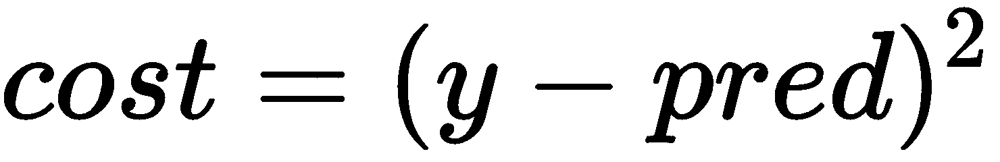

现在我将要描述的内容听起来可能非常像作弊，但这确实是一个有效的策略。关于预测的导数是这样的：

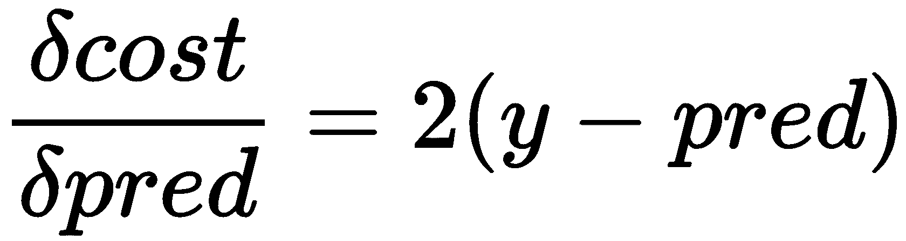

为了让我们自己更容易操作，让我们重新定义成本为这样：

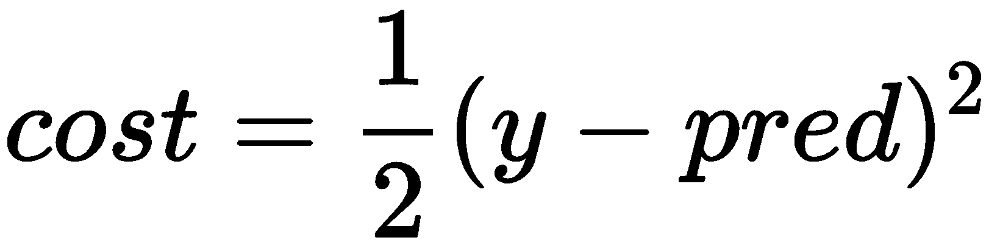

这对寻找最低成本的过程没有影响。想想看；想象一下最高成本和最低成本。如果它们前面有一个乘数，那么它们之间的差异并不会改变最低成本仍然是低于最高成本的事实。花点时间自己解决这个问题，以说服自己一个常数乘数不会改变这个过程。

`sigmoid`函数的导数是：

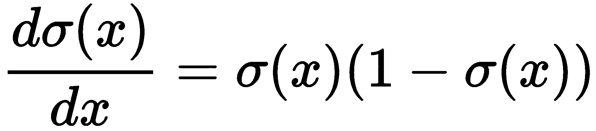

从那里，我们可以推导出关于权重矩阵的成本函数的导数。如何进行完整的反向传播将在下一章中解释。现在，这里是有代码：

```py
  // backpropagation
  outputErrors := m.do(func() (tensor.Tensor, error) { return tensor.Sub(y, pred) })
  cost = sum(outputErrors.Data().([]float64))

  hidErrs := m.do(func() (tensor.Tensor, error) {
    if err := nn.final.T(); err != nil {
      return nil, err
    }
    defer nn.final.UT()
    return tensor.MatMul(nn.final, outputErrors)
  })

  if m.err != nil {
    return 0, m.err
  }

  dpred := m.do(func() (tensor.Tensor, error) { return pred.Apply(dsigmoid, tensor.UseUnsafe()) })
  m.do(func() (tensor.Tensor, error) { return tensor.Mul(pred, outputErrors, tensor.UseUnsafe()) })
  // m.do(func() (tensor.Tensor, error) { err := act0.T(); return act0, err })
  dpred_dfinal := m.do(func() (tensor.Tensor, error) {
    if err := act0.T(); err != nil {
      return nil, err
    }
    defer act0.UT()
    return tensor.MatMul(outputErrors, act0)
  })

  dact0 := m.do(func() (tensor.Tensor, error) { return act0.Apply(dsigmoid) })
  m.do(func() (tensor.Tensor, error) { return tensor.Mul(hidErrs, dact0, tensor.UseUnsafe()) })
  m.do(func() (tensor.Tensor, error) { err := hidErrs.Reshape(hidErrs.Shape()[0], 1); return hidErrs, err })
  // m.do(func() (tensor.Tensor, error) { err := x.T(); return x, err })
  dcost_dhidden := m.do(func() (tensor.Tensor, error) {
    if err := x.T(); err != nil {
      return nil, err
    }
    defer x.UT()
    return tensor.MatMul(hidErrs, x)
  })
```

就这样，我们得到了关于输入矩阵的成本导数。

对于导数，我们可以将它们用作梯度来更新输入矩阵。要做到这一点，使用一个简单的梯度下降算法；我们只需将梯度加到值本身上。但我们不想添加梯度的完整值。如果我们这样做，并且我们的起始值非常接近最小值，我们就会超过它。所以我们需要将梯度乘以一个很小的值，这个值被称为学习率：

```py
  // gradient update
  m.do(func() (tensor.Tensor, error) { return tensor.Mul(dcost_dfinal, learnRate, tensor.UseUnsafe()) })
  m.do(func() (tensor.Tensor, error) { return tensor.Mul(dcost_dhidden, learnRate, tensor.UseUnsafe()) })
  m.do(func() (tensor.Tensor, error) { return tensor.Add(nn.final, dcost_dfinal, tensor.UseUnsafe()) })
  m.do(func() (tensor.Tensor, error) { return tensor.Add(nn.hidden, dcost_dhidden, tensor.UseUnsafe()) })
```

这就是完整的训练函数：

```py
// X is the image, Y is a one hot vector
func (nn *NN) Train(x, y tensor.Tensor, learnRate float64) (cost float64, err error) {
  // predict
  var m maybe
  m.do(func() (tensor.Tensor, error) { err := x.Reshape(x.Shape()[0], 1); return x, err })
  m.do(func() (tensor.Tensor, error) { err := y.Reshape(10, 1); return y, err })

  hidden := m.do(func() (tensor.Tensor, error) { return tensor.MatMul(nn.hidden, x) })
  act0 := m.do(func() (tensor.Tensor, error) { return hidden.Apply(sigmoid, tensor.UseUnsafe()) })

  final := m.do(func() (tensor.Tensor, error) { return tensor.MatMul(nn.final, act0) })
  pred := m.do(func() (tensor.Tensor, error) { return final.Apply(sigmoid, tensor.UseUnsafe()) })
  // log.Printf("pred %v, correct %v", argmax(pred.Data().([]float64)), argmax(y.Data().([]float64)))

  // backpropagation.
  outputErrors := m.do(func() (tensor.Tensor, error) { return tensor.Sub(y, pred) })
  cost = sum(outputErrors.Data().([]float64))

  hidErrs := m.do(func() (tensor.Tensor, error) {
    if err := nn.final.T(); err != nil {
      return nil, err
    }
    defer nn.final.UT()
    return tensor.MatMul(nn.final, outputErrors)
  })

  if m.err != nil {
    return 0, m.err
  }

  dpred := m.do(func() (tensor.Tensor, error) { return pred.Apply(dsigmoid, tensor.UseUnsafe()) })
  m.do(func() (tensor.Tensor, error) { return tensor.Mul(pred, outputErrors, tensor.UseUnsafe()) })
  // m.do(func() (tensor.Tensor, error) { err := act0.T(); return act0, err })
  dpred_dfinal := m.do(func() (tensor.Tensor, error) {
    if err := act0.T(); err != nil {
      return nil, err
    }
    defer act0.UT()
    return tensor.MatMul(outputErrors, act0)
  })

  dact0 := m.do(func() (tensor.Tensor, error) { return act0.Apply(dsigmoid) })
  m.do(func() (tensor.Tensor, error) { return tensor.Mul(hidErrs, dact0, tensor.UseUnsafe()) })
  m.do(func() (tensor.Tensor, error) { err := hidErrs.Reshape(hidErrs.Shape()[0], 1); return hidErrs, err })
  // m.do(func() (tensor.Tensor, error) { err := x.T(); return x, err })
  dcost_dhidden := m.do(func() (tensor.Tensor, error) {
    if err := x.T(); err != nil {
      return nil, err
    }
    defer x.UT()
    return tensor.MatMul(hidErrs, x)
  })

  // gradient update
  m.do(func() (tensor.Tensor, error) { return tensor.Mul(dcost_dfinal, learnRate, tensor.UseUnsafe()) })
  m.do(func() (tensor.Tensor, error) { return tensor.Mul(dcost_dhidden, learnRate, tensor.UseUnsafe()) })
  m.do(func() (tensor.Tensor, error) { return tensor.Add(nn.final, dcost_dfinal, tensor.UseUnsafe()) })
  m.do(func() (tensor.Tensor, error) { return tensor.Add(nn.hidden, dcost_dhidden, tensor.UseUnsafe()) })
  return cost, m.err
```

有几个观察点需要注意：

+   你可能会注意到`Predict`方法的部分内容在`Train`方法顶部重复。

+   `tensor.UseUnsafe()`函数选项被大量使用。

当我们开始扩展到更深层的网络时，这将成为一个痛点。因此，在下一章中，我们将探讨解决这些问题的可能方案。

# 训练神经网络

目前我们的主要结构如下：

```py
func main() {
  imgs, err := readImageFile(os.Open("train-images-idx3-ubyte"))
  if err != nil {
    log.Fatal(err)
  }
  labels, err := readLabelFile(os.Open("train-labels-idx1-ubyte"))
  if err != nil {
    log.Fatal(err)
  }

  log.Printf("len imgs %d", len(imgs))
  data := prepareX(imgs)
  lbl := prepareY(labels)
  visualize(data, 10, 10, "image.png")

  data2, err := zca(data)
  if err != nil {
    log.Fatal(err)
  }
  visualize(data2, 10, 10, "image2.png")

  nat, err := native.MatrixF64(data2.(*tensor.Dense))
  if err != nil {
    log.Fatal(err)
  }

  log.Printf("Start Training")
  nn := New(784, 100, 10)
  costs := make([]float64, 0, data2.Shape()[0])
  for e := 0; e < 5; e++ {
    data2Shape := data2.Shape()
    var oneimg, onelabel tensor.Tensor
    for i := 0; i < data2Shape[0]; i++ {
      if oneimg, err = data2.Slice(makeRS(i, i+1)); err != nil {
        log.Fatalf("Unable to slice one image %d", i)
      }
      if onelabel, err = lbl.Slice(makeRS(i, i+1)); err != nil {
        log.Fatalf("Unable to slice one label %d", i)
      }
      var cost float64
      if cost, err = nn.Train(oneimg, onelabel, 0.1); err != nil {
        log.Fatalf("Training error: %+v", err)
      }
      costs = append(costs, cost)
    }
    log.Printf("%d\t%v", e, avg(costs))
    shuffleX(nat)
    costs = costs[:0]
  }
  log.Printf("End training")
}
```

简要步骤如下：

1.  加载图像文件。

1.  加载标签文件。

1.  将图像文件转换为`*tensor.Dense.`

1.  将标签文件转换为`*tensor.Dense.`

1.  可视化 100 张图像。

1.  对图像执行 ZCA 白化。

1.  可视化白化后的图像。

1.  为数据集创建一个本地迭代器。

1.  创建一个具有 100 个单元隐藏层的神经网络。

1.  创建成本切片。这样我们可以跟踪平均成本随时间的变化。

1.  在每个 epoch 中，将输入切割成单个图像切片。

1.  在每个 epoch 中，将输出标签切割成单个切片。

1.  在每个 epoch 中，使用学习率为`0.1`的`nn.Train()`调用，并使用切割的单个图像和单个标签作为训练示例。

1.  训练五个 epoch。

我们如何知道神经网络已经学好了呢？一种方法是监控成本。如果神经网络正在学习，平均成本随时间将下降。当然，可能会有一些波动，但整体的大趋势应该是成本不会高于程序首次运行时的水平。

# 交叉验证

另一种测试神经网络学习效果的方法是交叉验证。神经网络可能在训练数据上学习得很好，本质上是在记忆哪些像素集合会导致特定的标签。然而，为了检查机器学习算法是否具有良好的泛化能力，我们需要向神经网络展示一些它从未见过的数据。

下面是执行此操作的代码：

```py
  log.Printf("Start testing")
  testImgs, err := readImageFile(os.Open("t10k-images.idx3-ubyte"))
  if err != nil {
    log.Fatal(err)
  }

  testlabels, err := readLabelFile(os.Open("t10k-labels.idx1-ubyte"))
  if err != nil {
    log.Fatal(err)
  }

  testData := prepareX(testImgs)
  testLbl := prepareY(testlabels)
  shape := testData.Shape()
  testData2, err := zca(testData)
  if err != nil {
    log.Fatal(err)
  }

  visualize(testData, 10, 10, "testData.png")
  visualize(testData2, 10, 10, "testData2.png")

  var correct, total float64
  var oneimg, onelabel tensor.Tensor
  var predicted, errcount int
  for i := 0; i < shape[0]; i++ {
    if oneimg, err = testData.Slice(makeRS(i, i+1)); err != nil {
      log.Fatalf("Unable to slice one image %d", i)
    }
    if onelabel, err = testLbl.Slice(makeRS(i, i+1)); err != nil {
      log.Fatalf("Unable to slice one label %d", i)
    }
    if predicted, err = nn.Predict(oneimg); err != nil {
      log.Fatalf("Failed to predict %d", i)
    }

    label := argmax(onelabel.Data().([]float64))
    if predicted == label {
      correct++
    } else if errcount < 5 {
      visualize(oneimg, 1, 1, fmt.Sprintf("%d_%d_%d.png", i, label, predicted))
      errcount++
    }
    total++
  }
  fmt.Printf("Correct/Totals: %v/%v = %1.3f\n", correct, total, correct/total)
```

注意，代码与之前`main`函数中的代码大致相同。唯一的例外是，我们不是调用`nn.Train`，而是调用`nn.Predict`。然后我们检查标签是否与我们预测的一致。

这里是可调整的参数：

运行后（耗时 6.5 分钟），调整各种参数后，我运行了代码并得到了以下结果：

```py
$ go build . -o chapter7
 $ ./chapter7
 Corerct/Totals: 9719/10000 = 0.972
```

一个简单的三层神经网络可以达到 97%的准确率！这当然离最先进的技术还差得远。我们将在下一章构建一个可以达到 99.xx%准确率的神经网络，但这需要思维方式的重大转变。

训练神经网络需要时间。通常明智的做法是保存神经网络的成果。`*tensor.Dense`类型实现了`gob.GobEncoder`和`gob.GobDecoder`，要将神经网络保存到磁盘，只需保存权重（`nn.hidden`和`nn.final`）。作为一个额外的挑战，为这些权重矩阵编写一个 gob 编码器并实现保存/加载功能。

此外，让我们看看一些被错误分类的事物。在先前的代码中，这个片段写出了五个错误的预测：

```py
    if predicted == label {
      correct++
    } else if errcount < 5 {
      visualize(oneimg, 1, 1, fmt.Sprintf("%d_%d_%d.png", i, label, predicted))
      errcount++
    }
```

下面就是它们：

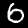 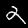 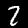

在第一张图像中，神经网络将其分类为`0`，而真实值是`6`。正如你所见，这是一个容易犯的错误。第二张图像显示了一个`2`，而神经网络将其分类为`4`。你可能倾向于认为它看起来有点像`4`。最后，如果你是一位美国读者，你很可能接触过帕尔默书写法。如果是这样，我敢打赌你可能会将最后一张图片分类为`7`，而不是`2`，这正是神经网络预测的结果。不幸的是，真实标签是它是`2`。有些人就是书写得很糟糕。

# 摘要

在本章中，我们学习了如何编写一个只有一个隐藏层的简单神经网络，它表现得非常出色。在这个过程中，我们学习了如何执行 ZCA 白化，以便清理数据。当然，这个模型有一些困难；在编码之前，你必须手动预先计算导数。

关键的收获点是，一个简单的神经网络可以做很多事情！虽然这个版本的代码非常以 Gorgonia 的 tensor 为中心，但原理是完全相同的，即使使用 Gonum 的 mat。实际上，Gorgonia 的 tensor 在底层使用了 Gonum 的出色的矩阵乘法库。

在下一章中，我们将重新审视在相同数据集上对神经网络的概念，以达到 99%的准确率，但我们的神经网络处理方法的心态必须改变。我建议重新阅读线性代数部分，以更好地掌握这些概念。
