# 第七章：卷积神经网络 - MNIST 手写识别

在上一章中，我提出了一种场景，即你是一名邮递员，试图识别手写体。在那里，我们最终构建了一个基于 Gorgonia 的神经网络。在本章中，我们将探讨相同的场景，但我们将扩展我们对神经网络的理解，并编写一个更先进的神经网络，这是一个直到最近仍然是尖端技术的神经网络。

具体来说，在本章中，我们将构建一个 **卷积神经网络**（**CNN**）。CNN 是一种近年来流行的深度学习网络。

# 你所知道的关于神经元的一切都是错误的

在上一章中，我提到关于神经网络的你知道的一切都是错误的。在这里，我重申这一说法。大多数关于神经网络的文献都是从与生物神经元的比较开始的，并以此结束。这导致读者经常假设它是。我想指出，人工神经网络与它们的生物同名物没有任何相似之处。

相反，在上一章中，我花了很多时间描述线性代数，并解释说，转折点是你可以将几乎任何 **机器学习**（**ML**）问题表达为线性代数。我将在本章继续这样做。

与其将人工神经网络视为现实生活神经网络的类比，我个人鼓励你将人工神经网络视为数学方程式。激活函数引入的非线性性与线性组合相结合，使得人工神经网络能够近似任何函数。

# 神经网络 - 重新审视

对神经网络的基本理解是它们是数学表达式，这导致了神经网络简单易行的实现。回想一下上一章，神经网络可以写成这样：

```py
func affine(weights [][]float64, inputs []float64) []float64 {
  return activation(matVecMul(weights, inputs))
}
```

如果我们将代码重写为一个数学方程式，我们可以写出如下神经网络：

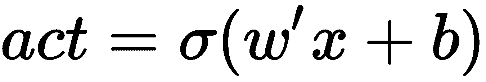

顺便提一下：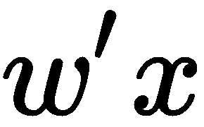与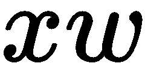相同。

我们可以使用 Gorgonia 简单地写出它，如下所示：

```py
import (
  G "gorgonia.org/gorgonia"
)

var Float tensor.Float = tensor.Float64
func main() {
  g := G.NewGraph()
  x := G.NewMatrix(g, Float, G.WithName("x"), G.WithShape(N, 728))
  w := G.NewMatrix(g, Float, G.WithName("w"), G.WithShape(728, 800), 
       G.WithInit(G.Uniform(1.0)))
  b := G.NewMatrix(g, Float, G.WithName("b"), G.WithShape(N, 800), 
       G.WithInit(G.Zeroes()))
  xw, _ := G.Mul(x, w)
  xwb, _ := G.Add(xw, b)
  act, _ := G.Sigmoid(xwb)

  w2 := G.NewMatrix(g, Float, G.WithName("w2"), G.WithShape(800, 10), 
        G.WithInit(G.Uniform(1.0)))
  b2 := G.NewMatrix(g, Float, G.WithName("b2"), G.WithShape(N, 10), 
        G.WithInit(G.Zeroes()))
  xw2, _ := G.Mul(act, w2)
  xwb2, _ := G.Add(xw2, b2)
  sm, _ := G.SoftMax(xwb2)
}
```

上一段代码是以下神经网络在图像中的表示：


中间层由 800 个隐藏单元组成。

当然，前面的代码隐藏了很多东西。你不可能在少于 20 行代码中从头开始构建一个神经网络，对吧？为了理解正在发生的事情，我们需要简要地了解一下 Gorgonia 是什么。

# Gorgonia

Gorgonia 是一个库，它提供了用于处理深度学习特定数学表达式的原语。当与机器学习相关的项目一起工作时，你将开始发现自己对世界的洞察力更强，并且总是质疑假设。这是好事。

考虑当你阅读以下数学表达式时，你心中的想法：

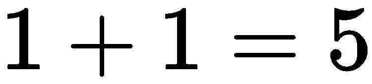

你应该立刻想到“等等，这是错误的”。为什么你的大脑会这样想？

这主要是因为你的大脑评估了数学表达式。一般来说，表达式有三个部分：左边、等号和右边。你的大脑分别评估每一部分，然后评估整个表达式为假。

当我们阅读数学表达式时，我们会自动在心中评估这些表达式，并且我们理所当然地认为这是评估。在 Gorgonia 中，我们理所当然的事情被明确化了。使用 Gorgonia 有两个一般的 *部分*：定义表达式和评估表达式。

由于你很可能是程序员，你可以把第一部分看作是编写程序，而第二部分可以看作是运行程序。

当在 Gorgonia 中描述神经网络时，想象自己用另一种编程语言编写代码通常是有益的，这种语言是专门用于构建神经网络的。这是因为 Gorgonia 中使用的模式与一种新的编程语言非常相似。事实上，Gorgonia 是从零开始构建的，其理念是它是一种没有语法前端的编程语言。因此，在本节中，我经常会要求你想象自己在另一种类似 Go 的语言中编写代码。

# 为什么？

一个好问题是“为什么？”为什么要费心分离这个过程？毕竟，前面的代码可以被重写为上一章的 `Predict` 函数：

```py
func (nn *NN) Predict(a tensor.Tensor) (int, error) {
  if a.Dims() != 1 {
    return nil, errors.New("Expected a vector")
  }

  var m maybe
  act0 := m.sigmoid(m.matVecMul(nn.hidden, a))
  pred := m.sigmoid(m.matVecMul(nn.final, act0))
  if m.err != nil {
    return -1, m.err
  }
  return argmax(pred.Data().([]float64)), nil
}
```

在这里，我们用 Go 语言定义网络，当我们运行 Go 代码时，神经网络就像定义时一样运行。我们面临的问题是什么，需要引入将神经网络定义和运行分离的想法？我们已经看到了当我们编写 `Train` 方法时的这个问题。

如果你还记得，在上一个章节中，我说过编写 `Train` 方法需要我们实际上从 `Predict` 方法中复制和粘贴代码。为了刷新你的记忆，以下是 `Train` 方法：

```py
// X is the image, Y is a one hot vector
func (nn *NN) Train(x, y tensor.Tensor, learnRate float64) (cost float64, err error) {
  // predict
  var m maybe
  m.reshape(x, s.Shape()[0], 1)
  m.reshape(y, 10, 1)
  act0 := m.sigmoid(m.matmul(nn.hidden, x))
  pred := m.sigmoid(m.matmul(nn.final, act0))

  // backpropagation.
  outputErrors := m.sub(y, pred))
  cost = sum(outputErrors.Data().([]float64))

  hidErrs := m.do(func() (tensor.Tensor, error) {
    if err := nn.final.T(); err != nil {
      return nil, err
    }
    defer nn.final.UT()
    return tensor.MatMul(nn.final, outputErrors)
  })
  dpred := m.mul(m.dsigmoid(pred), outputErrors, tensor.UseUnsafe())
  dpred_dfinal := m.dmatmul(outputErrors, act0)
    if err := act0.T(); err != nil {
      return nil, err
    }
    defer act0.UT()
    return tensor.MatMul(outputErrors, act0)
  })

  m.reshape(m.mul(hidErrs, m.dsigmoid(act0), tensor.UseUnsafe()), 
                  hidErrs.Shape()[0], 1)
  dcost_dhidden := m.do(func() (tensor.Tensor, error) {
    if err := x.T(); err != nil {
      return nil, err
    }
    defer x.UT()
    return tensor.MatMul(hidErrs, x)
  })

  // gradient update
  m.mul(dpred_dfinal, learnRate, tensor.UseUnsafe())
  m.mul(dcost_dhidden, learnRate, tensor.UseUnsafe())
  m.add(nn.final, dpred_dfinal, tensor.UseUnsafe())
  m.add(nn.hidden, dcost_dhidden, tensor.UseUnsafe())
  return cost, m.err
}
```

让我们通过重构练习来突出问题。暂时摘下我们的机器学习帽子，戴上软件工程师的帽子，看看我们如何重构 `Train` 和 `Predict`，即使是在概念上。我们在 `Train` 方法中看到，我们需要访问 `act0` 和 `pred` 来反向传播错误。在 `Predict` 中，`act0` 和 `pred` 是终端值（也就是说，函数返回后我们不再使用它们），而在 `Train` 中则不是。

那么，在这里，我们可以创建一个新的方法；让我们称它为 `fwd`：

```py
func (nn *NN) fwd(x tensor.Tensor) (act0, pred tensor.Tensor, err error) {
  var m maybe
  m.reshape(x, s.Shape()[0], 1)
  act0 := m.sigmoid(m.matmul(nn.hidden, x))
  pred := m.sigmoid(m.matmul(nn.final, act0))
  return act0, pred, m.err
}
```

我们可以将 `Predict` 重构为如下所示：

```py
func (nn *NN) Predict(a tensor.Tensor) (int, error) {
  if a.Dims() != 1 {
    return nil, errors.New("Expected a vector")
  }

  var err error
  var pred tensor.Tensor
  if _, pred, err = nn.fwd(a); err!= nil {
    return -1, err
  }
  return argmax(pred.Data().([]float64)), nil
}
```

`Train` 方法将看起来像这样：

```py
// X is the image, Y is a one hot vector
func (nn *NN) Train(x, y tensor.Tensor, learnRate float64) (cost float64, err error) {
  // predict
  var act0, pred tensor.Tensor
  if act0, pred, err = nn.fwd(); err != nil {
    return math.Inf(1), err
  }

  var m maybe
  m.reshape(y, 10, 1)
  // backpropagation.
  outputErrors := m.sub(y, pred))
  cost = sum(outputErrors.Data().([]float64))

  hidErrs := m.do(func() (tensor.Tensor, error) {
    if err := nn.final.T(); err != nil {
      return nil, err
    }
    defer nn.final.UT()
    return tensor.MatMul(nn.final, outputErrors)
  })
  dpred := m.mul(m.dsigmoid(pred), outputErrors, tensor.UseUnsafe())
  dpred_dfinal := m.dmatmul(outputErrors, act0)
    if err := act0.T(); err != nil {
      return nil, err
    }
    defer act0.UT()
    return tensor.MatMul(outputErrors, act0)
  })

  m.reshape(m.mul(hidErrs, m.dsigmoid(act0), tensor.UseUnsafe()), 
                  hidErrs.Shape()[0], 1)
  dcost_dhidden := m.do(func() (tensor.Tensor, error) {
    if err := x.T(); err != nil {
      return nil, err
    }
    defer x.UT()
    return tensor.MatMul(hidErrs, x)
  })

  // gradient update
  m.mul(dpred_dfinal, learnRate, tensor.UseUnsafe())
  m.mul(dcost_dhidden, learnRate, tensor.UseUnsafe())
  m.add(nn.final, dpred_dfinal, tensor.UseUnsafe())
  m.add(nn.hidden, dcost_dhidden, tensor.UseUnsafe())
  return cost, m.err
}
```

这个看起来更好。我们在这里到底在做什么呢？我们在编程。我们在将一种语法形式重新排列成另一种语法形式，但我们并没有改变语义，即程序的意义。重构后的程序与未重构前的程序具有完全相同的意义。

# 编程

等一下，你可能自己会想。我说的“程序的意义”是什么意思？这是一个非常深奥的话题，涉及到整个数学分支，称为**同伦**。但就本章的所有实际目的而言，让我们将程序的意义定义为程序的扩展定义。如果两个程序编译并运行，接受相同的输入，并且每次都返回相同的精确输出，那么我们说两个程序是相等的。

这两个程序将是相等的：

| **程序 A** | **程序 B** |
| --- | --- |
| `fmt.Println("Hello World")` | `fmt.Printf("Hello " + "World\n")` |

故意地，如果我们把程序可视化为一个 **抽象语法树**（**AST**），它们看起来略有不同：


两个程序的语法不同，但它们的语义是相同的。我们可以通过消除 `+` 将程序 B 重构为程序 A。

但请注意我们在这里做了什么：我们取了一个程序，并以抽象语法树（AST）的形式表示它。通过语法，我们操作了 AST。这就是编程的本质。

# 什么是张量？ – 第二部分

在上一章中，有一个信息框介绍了张量的概念。那个信息框有点简化。如果你在谷歌上搜索什么是张量，你会得到非常矛盾的结果，这些结果只会让人更加困惑。我不想增加困惑。相反，我将简要地触及张量，使其与我们项目相关，并且以一种非常类似于典型欧几里得几何教科书介绍点概念的方式：通过将其视为从用例中显而易见。

同样，我们将从用例中认为张量是显而易见的。首先，我们将看看乘法的概念：

+   首先，让我们定义一个向量：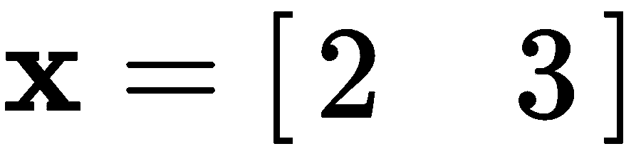。你可以把它想象成这个图：

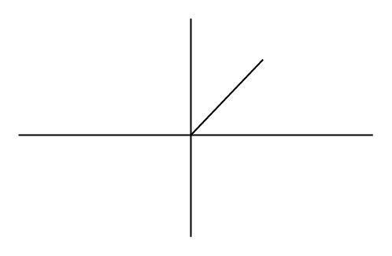

+   接下来，让我们将向量乘以一个标量值：。结果是类似这样的：

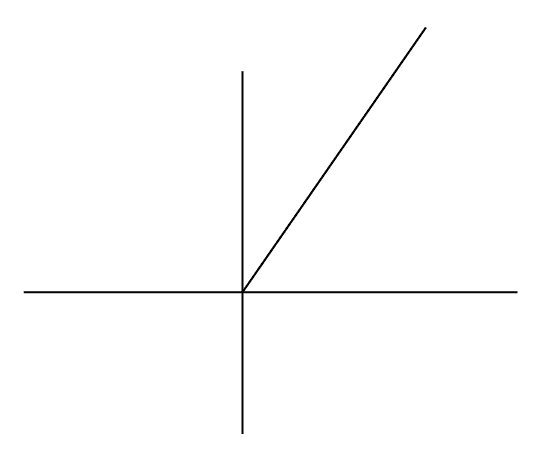

有两个观察点：

+   箭头的总体方向没有改变。

+   只有长度发生变化。在物理术语中，这被称为大小。如果向量代表行进的距离，你将沿着相同方向行进两倍的距离。

那么，你如何仅通过乘法来改变方向呢？你需要乘以什么来改变方向？让我们尝试以下矩阵，我们将称之为 *T*，用于变换：


现在如果我们用变换矩阵乘以向量，我们得到以下结果：

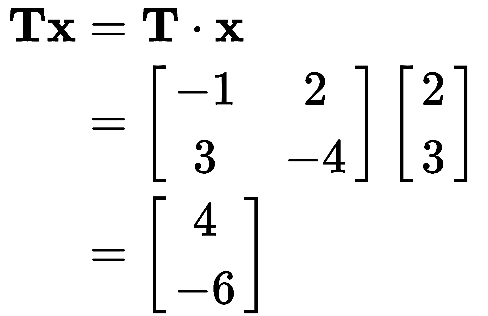

如果我们绘制起始向量和结束向量，我们得到的结果如下：

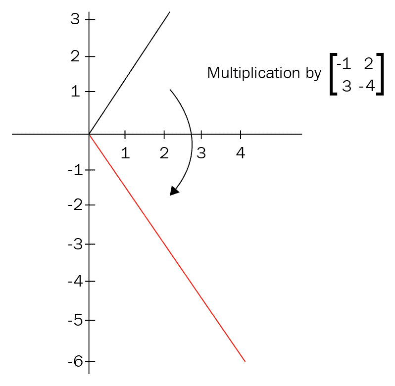

如我们所见，方向已经改变。大小也发生了变化。

现在，你可能会说，“等等，这不是线性代数 101 的内容吗？”是的，它是。但为了真正理解张量，我们必须学习如何构造它。我们刚才使用的矩阵也是一个秩为 2 的张量。秩为 2 的张量的正确名称是 **二重积**。

为什么会有命名约定的混合？这里有一点点有趣的趣闻。当我编写 Gorgonia 最早版本的时候，我在思考计算机科学糟糕的命名约定，这是 Bjarne Stroustrup 本人也曾哀叹的事实。秩为 2 的张量的标准名称是 **二重积**，但它可以表示为一个矩阵。我一直在努力给它一个合适的名字；毕竟，名字中蕴含着力量，命名就是驯服。

大约在我开发 Gorgonia 最早版本的同时，我正在追一部非常优秀的 BBC 电视系列剧 **Orphan Black**，其中 Dyad 学院是主角的主要敌人。他们相当邪恶，这显然在我的脑海中留下了深刻印象。我决定不这样命名它。回顾起来，这似乎是一个相当愚蠢的决定。

现在让我们考虑变换二重积。你可以把二重积想象成向量 *u* 乘以向量 *v*。用方程式表示出来：


到目前为止，你可能已经熟悉了上一章的线性代数概念。你可能会想：“如果两个向量相乘，那会得到一个标量值，对吗？如果是这样，你怎么乘以两个向量并得到一个矩阵呢？”

在这里，我们需要引入一种新的乘法类型：外积（相比之下，上一章中引入的乘法是内积）。我们用这个符号来表示外积：。

具体来说，外积，也称为二重积，定义为如下：

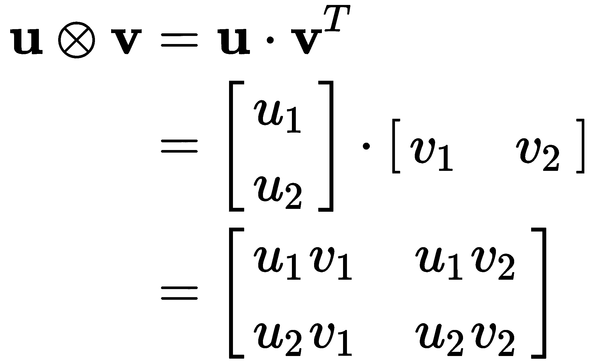

在本章中，我们不会特别关注 *u* 和 *v* 的具体细节。然而，能够从其组成向量构造二重积是张量概念的一个基本组成部分。

具体来说，我们可以将 *T* 替换为 *uv*：

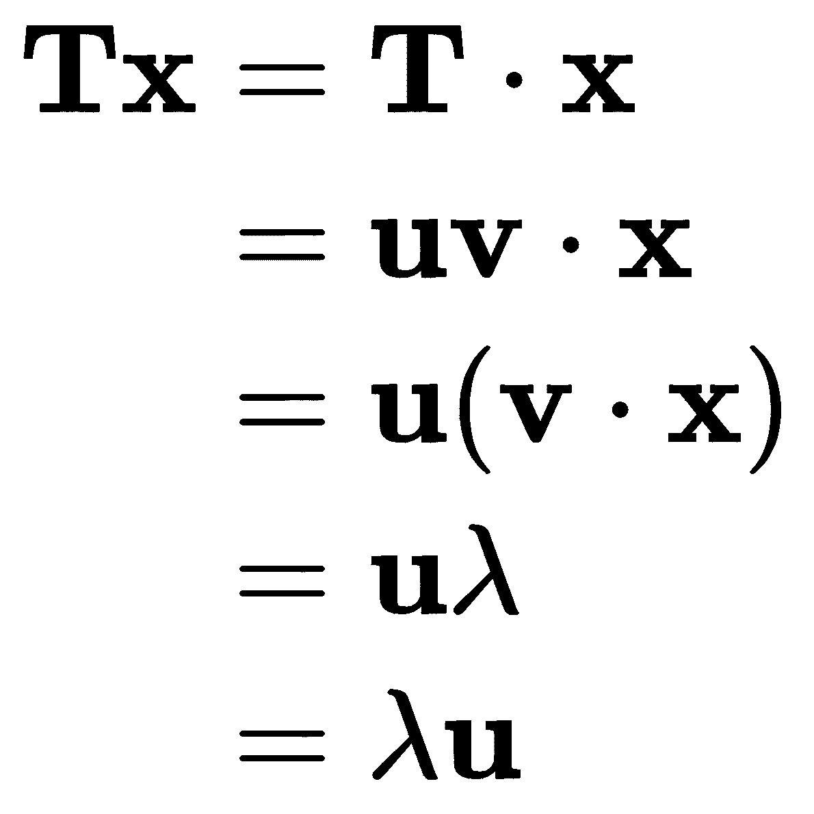

现在我们得到  作为标量大小变化，*u* 作为方向变化。

那么，张量究竟有什么大惊小怪的？我可以给出两个原因。

首先，从向量中可以形成二元的想法可以向上推广。一个三张量，或三元组，可以通过二元乘积 *uvw* 形成，一个四张量或四元组可以通过二元乘积 *uvwx* 形成，以此类推。这为我们提供了一个心理捷径，当我们看到与张量相关的形状时，这将非常有用。

将张量可以想象成什么的有用心理模型如下：一个向量就像一个事物列表，一个二元组就像一个向量列表，一个三元组就像一个二元组列表，以此类推。这在思考图像时非常有帮助，就像我们在上一章中看到的那样：

一张图像可以看作是一个 (28, 28) 矩阵。十个图像的列表将具有形状 (10, 28, 28)。如果我们想以这样的方式排列图像，使其成为十个图像的列表的列表，那么它的形状将是 (10, 10, 28, 28)。

当然，这一切都有一个前提：张量只能在变换存在的情况下定义。正如一位物理教授曾经告诉我的：“那些像张量一样变换的东西就是张量”。没有任何变换的张量只是一个 *n*- 维数据数组。数据必须变换，或者在一个方程中从张量流向张量。在这方面，我认为 TensorFlow 是一个极其恰当命名的产品。

关于张量的更多信息，我推荐相对密集的教科书，Kostrikin 的《线性代数与几何》（我未能完成这本书，但正是这本书给了我一个我认为相当强的张量理解）。关于张量流的信息可以在 Spivak 的《微分几何》中找到。

# 所有表达式都是图

现在我们终于可以回到前面的例子了。

如果你记得，我们的问题是我们必须指定神经网络两次：一次用于预测，一次用于学习目的。然后我们重构了程序，这样我们就不必两次指定网络。此外，我们必须手动编写反向传播的表达式。这很容易出错，尤其是在处理像我们在本章将要构建的这样的大型神经网络时。有没有更好的方法？答案是肯定的。

一旦我们理解和完全内化了神经网络本质上是一种数学表达式的观点，我们就可以从张量中吸取经验，并构建一个神经网络，其中整个神经网络是张量流。

回想一下，张量只能在变换存在的情况下定义；那么，任何用于变换张量（们）的操作，与持有数据的结构一起使用时，都是张量。此外，回想一下，计算机程序可以表示为抽象语法树。数学表达式可以表示为一个程序。因此，数学表达式也可以表示为抽象语法树。

然而，更准确地说，数学表达式可以表示为图；具体来说，是一个有向无环图。我们称之为**表达式图**。

这种区别很重要。树不能共享节点。图可以。让我们考虑以下数学表达式：


这里是图和树的表示：

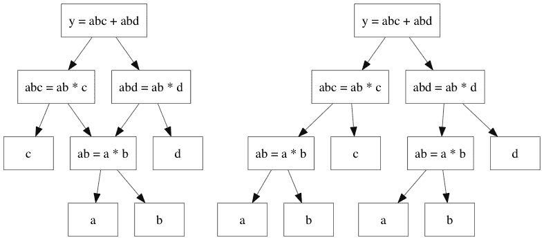

在左边，我们有一个有向无环图，在右边，我们有一个树。请注意，在数学方程的树变体中，有重复的节点。两者都以为根。箭头应该读作*依赖于*。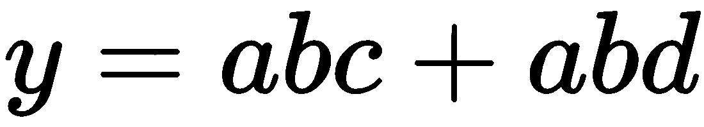依赖于两个其他节点，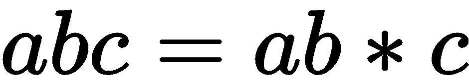和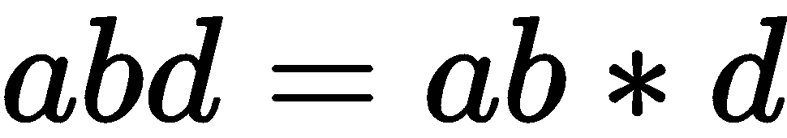，等等。

图和树都是同一数学方程的有效表示，当然。

为什么要把数学表达式表示为图或树呢？回想一下，抽象语法树表示一个计算。如果一个数学表达式，以图或树的形式表示，具有共享的计算概念，那么它也代表了一个抽象语法树。

的确，我们可以对图或树中的每个节点进行计算。如果每个节点是计算的表示，那么逻辑上就越少的节点意味着计算越快（以及更少的内存使用）。因此，我们应该更喜欢使用有向无环图表示。

现在我们来到了将数学表达式表示为图的主要好处：我们能够免费获得微分。

如果您从上一章回忆起来，反向传播本质上是对输入的成本进行微分。一旦计算了梯度，就可以用来更新权重的值。有了图结构，我们就不必编写反向传播的部分。相反，如果我们有一个执行图的虚拟机，从叶子节点开始，向根节点移动，虚拟机可以自动在遍历图从叶子到根的过程中对值进行微分。

或者，如果我们不想进行自动微分，我们也可以通过操纵图来执行符号微分，就像我们在“什么是编程”部分中操纵 AST 一样，通过添加和合并节点。

以这种方式，我们现在可以将我们对神经网络的看法转移到这个：

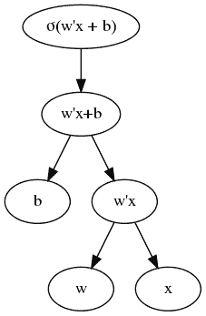

# 描述神经网络

现在我们回到编写神经网络的任务，并以图表示的数学表达式来思考它。回想一下，代码看起来像这样：

```py
import (
  G "gorgonia.org/gorgonia"
)

var Float tensor.Float = tensor.Float64
func main() {
  g := G.NewGraph()
  x := G.NewMatrix(g, Float, G.WithName("x"), G.WithShape(N, 728))
  w := G.NewMatrix(g, Float, G.WithName("w"), G.WithShape(728, 800), 
                   G.WithInit(G.Uniform(1.0)))
  b := G.NewMatrix(g, Float, G.WithName("b"), G.WithShape(N, 800), 
                   G.WithInit(G.Zeroes()))
  xw, _ := G.Mul(x, w)
  xwb, _ := G.Add(xw, b)
  act, _ := G.Sigmoid(xwb)

  w2 := G.NewMatrix(g, Float, G.WithName("w2"), G.WithShape(800, 10), 
                    G.WithInit(G.Uniform(1.0)))
  b2 := G.NewMatrix(g, Float, G.WithName("b2"), G.WithShape(N, 10),  
                    G.WithInit(G.Zeroes()))
  xw2, _ := G.Mul(act, w2)
  xwb2, _ := G.Add(xw2, b2)
  sm, _ := G.SoftMax(xwb2)
}
```

现在我们来分析这段代码。

首先，我们使用`g := G.NewGraph()`创建一个新的表达式图。表达式图是一个持有数学表达式的对象。我们为什么想要一个表达式图呢？表示神经网络的数学表达式包含在`*gorgonia.ExpressionGraph`对象中。

数学表达式只有在我们使用变量时才有意思。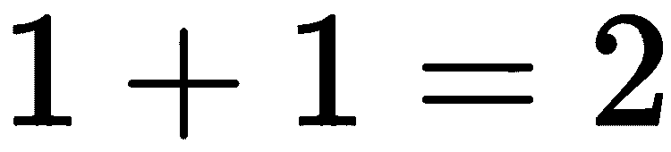是一个非常无趣的表达式，因为你无法用这个表达式做很多事情。你可以做的唯一事情是评估这个表达式，看看它返回的是真还是假。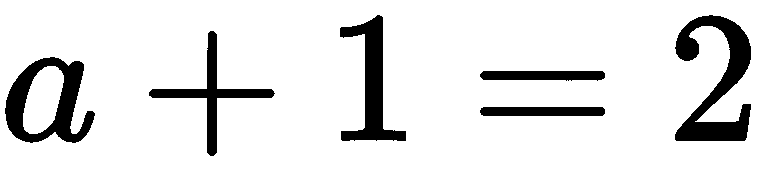稍微有趣一些。但再次强调，*a*只能为*1*。

然而，考虑一下这个表达式！[](img/f4cd11b6-41d0-4a24-bbd3-657288d1aa15.png)。有了两个变量，它突然变得更有趣。*a*和*b*可以取的值相互依赖，并且存在一系列可能的数字对可以适合到*a*和*b*中。

回想一下，神经网络中的每一层仅仅是一个类似这样的数学表达式：。在这种情况下，*w*、*x*和*b*是变量。因此，我们创建了它们。请注意，在这种情况下，Gorgonia 将变量处理得就像编程语言一样：你必须告诉系统变量代表什么。

在 Go 语言中，你会通过输入`var x Foo`来完成这个操作，这告诉 Go 编译器`x`应该是一个类型`Foo`。在 Gorgonia 中，数学变量通过使用`NewMatrix`、`NewVector`、`NewScalar`和`NewTensor`来声明。`x := G.NewMatrix(g, Float, G.WithName, G.WithShape(N, 728))`简单地说，`x`是表达式图`g`中的一个名为`x`的矩阵，其形状为`(N, 728)`。

在这里，读者可能会注意到`728`是一个熟悉的数字。实际上，这告诉我们`x`代表输入，即`N`张图像。因此，`x`是一个包含*N*行的矩阵，其中每一行代表一张单独的图像（728 个浮点数）。

留意细节的读者会注意到`w`和`b`有额外的选项，而`x`的声明没有。你看，`NewMatrix`只是声明了表达式图中的变量。它没有与之关联的值。这允许在值附加到变量时具有灵活性。然而，关于权重矩阵，我们希望方程从一些初始值开始。`G.WithInit(G.Uniform(1.0))`是一个构造选项，它使用具有增益`1.0`的均匀分布的值填充权重矩阵。如果你想象自己在另一种专门用于构建神经网络的编程语言中编码，它看起来可能像这样：`var w Matrix(728, 800) = Uniform(1.0)`。

在此之后，我们只需写出数学方程式： 简单来说，就是矩阵乘法，它是  和  之间的乘法；因此，`xw, _ := G.Mul(x, w)`. 在这一点上，应该明确的是，我们只是在描述应该发生的计算。它尚未发生。这种方式与编写程序并无太大区别；编写代码并不等同于运行程序。

`G.Mul` 和 Gorgonia 中的大多数操作实际上都会返回一个错误。为了演示的目的，我们忽略了从符号上乘以 `x` 和 `w` 可能产生的任何错误。简单的乘法可能出错吗？嗯，我们处理的是矩阵乘法，所以形状必须具有匹配的内部维度。一个 (N, 728) 矩阵只能与一个 (728, M) 矩阵相乘，这将导致一个 (N, M) 矩阵。如果第二个矩阵没有 728 行，那么将发生错误。因此，在实际的生产代码中，错误处理是**必须的**。

说到**必须**，Gorgonia 提供了一个名为 **G.Must** 的实用函数。从标准库中找到的 `text/template` 和 `html/template` 库中汲取灵感，当发生错误时，`G.Must` 函数会引发恐慌。要使用，只需编写这个：`xw := G.Must(G.Mul(x,w))`。

在将输入与权重相乘之后，我们使用 `G.Add(xw, b)` 将偏差加到上面。同样，可能会发生错误，但在这个例子中，我们省略了错误检查。

最后，我们将结果与非线性函数：sigmoid 函数，通过 `G.Sigmoid(xwb)` 进行处理。这一层现在已经完成。如果你跟着走，它的形状将是 (N, 800)。

完成的层随后被用作下一层的输入。下一层的布局与第一层相似，只是没有使用 sigmoid 非线性，而是使用了 `G.SoftMax`。这确保了结果矩阵中的每一行总和为 1。

# 单热向量

也许并非巧合，最后一层的形状是 (N, 10)。N 是输入图像的数量（我们从 `x` 中获得）；这一点相当直观。这也意味着输入到输出的映射是清晰的。不那么直观的是 10。为什么是 10？简单来说，我们想要预测 10 个可能的数字 - 0, 1, 2, 3, 4, 5, 6, 7, 8, 9：

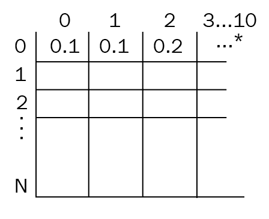

上一图是一个示例结果矩阵。回想一下，我们使用了 `G.SoftMax` 来确保每一行的总和为 1。因此，我们可以将每一行每一列的数字解释为预测特定数字的概率。要找到我们预测的数字，只需找到每一列的最高概率即可。

在上一章中，我介绍了单热向量编码的概念。为了回顾，它接受一个标签切片并返回一个矩阵。

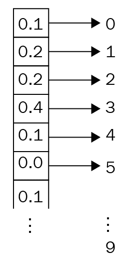

现在，这显然是一个编码问题。谁又能说列 0 必须代表 0 呢？我们当然可以想出一个完全疯狂的编码方式，比如这样，神经网络仍然可以工作：

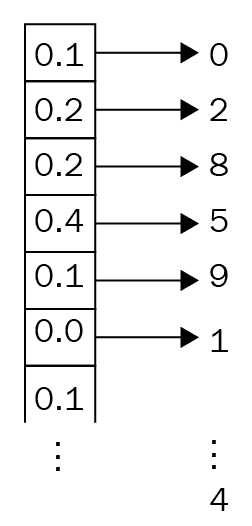

当然，我们不会使用这样的编码方案；这将是一个巨大的编程错误来源。相反，我们将采用一热向量的标准编码。

我希望这已经让你感受到了表达式图概念的力量。我们还没有涉及到的是图的执行。你该如何运行一个图呢？我们将在下一节进一步探讨这个问题。

# 项目

所有的准备工作都完成之后，是时候开始项目了！再次强调，我们将识别手写数字。但这一次，我们将构建一个 CNN 来完成这个任务。这一次，我们不仅会使用 Gorgonia 的`tensor`包，还会使用 Gorgonia 的所有功能。

再次提醒，要安装 Gorgonia，只需运行 `go get -u gorgonia.org/gorgonia` 和 `go get -u gorgonia.org/tensor`。

# 获取数据

数据与上一章相同：MNIST 数据集。它可以在本章的仓库中找到，我们将使用上一章编写的函数来获取数据：

```py
// Image holds the pixel intensities of an image.
// 255 is foreground (black), 0 is background (white).
type RawImage []byte

// Label is a digit label in 0 to 9
type Label uint8

const numLabels = 10
const pixelRange = 255

const (
  imageMagic = 0x00000803
  labelMagic = 0x00000801
  Width = 28
  Height = 28
)

func readLabelFile(r io.Reader, e error) (labels []Label, err error) {
  if e != nil {
    return nil, e
  }

  var magic, n int32
  if err = binary.Read(r, binary.BigEndian, &magic); err != nil {
    return nil, err
  }
  if magic != labelMagic {
    return nil, os.ErrInvalid
  }
  if err = binary.Read(r, binary.BigEndian, &n); err != nil {
    return nil, err
  }
  labels = make([]Label, n)
  for i := 0; i < int(n); i++ {
    var l Label
    if err := binary.Read(r, binary.BigEndian, &l); err != nil {
      return nil, err
    }
    labels[i] = l
  }
  return labels, nil
}

func readImageFile(r io.Reader, e error) (imgs []RawImage, err error) {
  if e != nil {
    return nil, e
  }

  var magic, n, nrow, ncol int32
  if err = binary.Read(r, binary.BigEndian, &magic); err != nil {
    return nil, err
  }
  if magic != imageMagic {
    return nil, err /*os.ErrInvalid*/
  }
  if err = binary.Read(r, binary.BigEndian, &n); err != nil {
    return nil, err
  }
  if err = binary.Read(r, binary.BigEndian, &nrow); err != nil {
    return nil, err
  }
  if err = binary.Read(r, binary.BigEndian, &ncol); err != nil {
    return nil, err
  }
  imgs = make([]RawImage, n)
  m := int(nrow * ncol)
  for i := 0; i < int(n); i++ {
    imgs[i] = make(RawImage, m)
    m_, err := io.ReadFull(r, imgs[i])
    if err != nil {
      return nil, err
    }
    if m_ != int(m) {
      return nil, os.ErrInvalid
    }
  }
 return imgs, nil
```

# 上一章的其他内容

显然，我们可以从上一章中重用很多内容：

+   范围归一化函数（`pixelWeight`）及其等距对应函数（`reversePixelWeight`）

+   `prepareX` 和 `prepareY`

+   `visualize` 函数

为了方便，这里再次列出：

```py
func pixelWeight(px byte) float64 {
    retVal := (float64(px) / 255 * 0.999) + 0.001
    if retVal == 1.0 {
        return 0.999
    }
    return retVal
}
func reversePixelWeight(px float64) byte {
    return byte(((px - 0.001) / 0.999) * 255)
}
func prepareX(M []RawImage) (retVal tensor.Tensor) {
    rows := len(M)
    cols := len(M[0])

    b := make([]float64, 0, rows*cols)
    for i := 0; i < rows; i++ {
        for j := 0; j < len(M[i]); j++ {
            b = append(b, pixelWeight(M[i][j]))
        }
    }
    return tensor.New(tensor.WithShape(rows, cols), tensor.WithBacking(b))
}
func prepareY(N []Label) (retVal tensor.Tensor) {
    rows := len(N)
    cols := 10

    b := make([]float64, 0, rows*cols)
    for i := 0; i < rows; i++ {
        for j := 0; j < 10; j++ {
            if j == int(N[i]) {
                b = append(b, 0.999)
            } else {
                b = append(b, 0.001)
            }
        }
    }
    return tensor.New(tensor.WithShape(rows, cols), tensor.WithBacking(b))
}
func visualize(data tensor.Tensor, rows, cols int, filename string) (err error) {
    N := rows * cols

    sliced := data
    if N > 1 {
        sliced, err = data.Slice(makeRS(0, N), nil) // data[0:N, :] in python
        if err != nil {
            return err
        }
    }

    if err = sliced.Reshape(rows, cols, 28, 28); err != nil {
        return err
    }

    imCols := 28 * cols
    imRows := 28 * rows
    rect := image.Rect(0, 0, imCols, imRows)
    canvas := image.NewGray(rect)

    for i := 0; i < cols; i++ {
        for j := 0; j < rows; j++ {
            var patch tensor.Tensor
            if patch, err = sliced.Slice(makeRS(i, i+1), makeRS(j,  
                                         j+1)); err != nil {
                return err
            }

            patchData := patch.Data().([]float64)
            for k, px := range patchData {
                x := j*28 + k%28
                y := i*28 + k/28
                c := color.Gray{reversePixelWeight(px)}
                canvas.Set(x, y, c)
            }
        }
    }

    var f io.WriteCloser
    if f, err = os.Create(filename); err != nil {
        return err
    }

    if err = png.Encode(f, canvas); err != nil {
        f.Close()
        return err
    }

    if err = f.Close(); err != nil {
        return err
    }
    return nil
}
```

# CNNs

我们将要构建的是一个 CNN。那么，什么是卷积神经网络呢？正如其名所示，它是一个神经网络，与我们之前构建的神经网络类似。所以，显然，它们有一些相似之处。也有一些不同之处，因为如果它们相似，我们就不需要这一章了。

# 什么是卷积？

与我们在上一章构建的神经网络相比，CNN 的主要区别在于卷积层。回想一下，神经网络能够学习与数字相关的特征。为了更精确，神经网络层需要学习更具体的特征。实现这一目标的一种方法就是添加更多的层；更多的层会导致学习到更多的特征，从而产生深度学习。

在 1877 年一个春天的傍晚，穿着现代人们认为是*黑色礼服*的人们聚集在伦敦的皇家学会。晚上的演讲者是弗朗西斯·高尔顿，也就是我们在第一章，*如何解决所有机器学习问题*中遇到的高尔顿。在他的演讲中，高尔顿展示了一个奇特的装置，他称之为**五点阵**。这是一个垂直的木制板，上面有木钉均匀地交错排列。前面覆盖着玻璃，顶部有一个开口。然后从顶部滴下微小的球，当它们击中木钉时，会向左或向右弹跳，并落入相应的斜槽中。这个过程一直持续到球收集到底部：

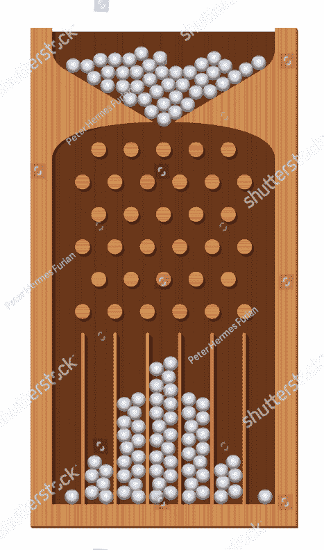

一个好奇的形状开始形成。这是现代统计学家已经认识到的二项分布的形状。大多数统计教材的故事就在这里结束。五点阵，现在被称为高尔顿板，非常清晰和坚定地说明了中心极限定理的概念。

当然，我们的故事并没有结束。回想一下第一章，*如何解决所有机器学习问题*，我提到高尔顿非常关注遗传问题。几年前，高尔顿出版了一本名为*遗传天才*的书。他收集了前几个世纪英国*杰出*人物的数据，让他非常沮丧的是，他发现*杰出*的父系往往会导致不杰出的子女。他把这称为**回归到平庸**：


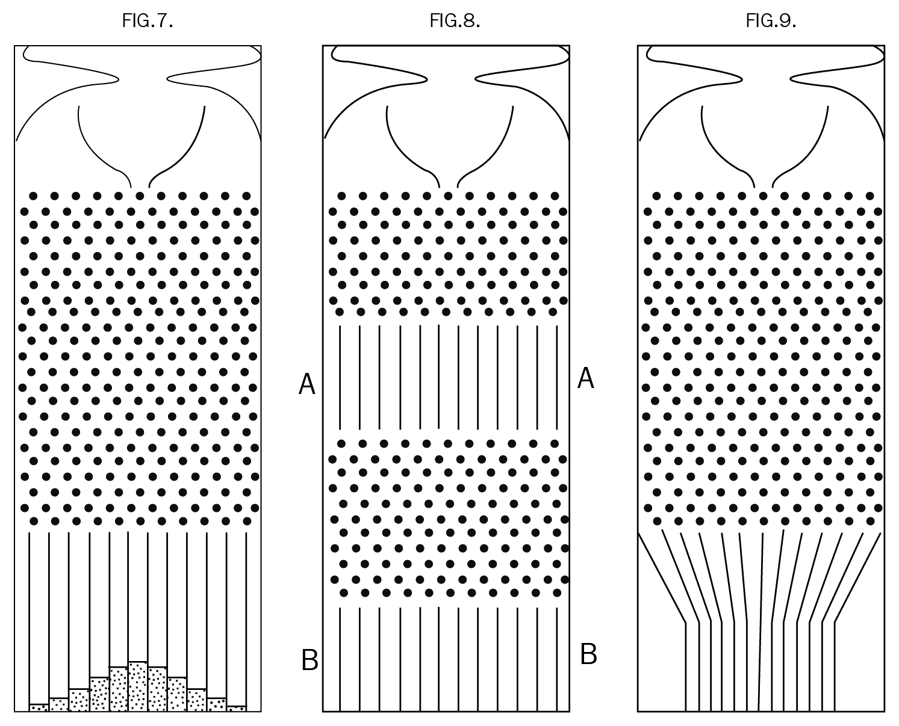

然而，他推理道，数学并没有显示出这样的事情！他通过展示一个两层结构的五点阵来解释这一点。两层结构的五点阵是代际效应的替代品。顶层基本上是特征的分布（比如说，身高）。当下降到第二层时，珠子会导致分布*扁平化*，而这并不是他所观察到的。相反，他推测必须存在另一个因素，导致回归到平均值。为了说明他的想法，他安装了斜槽作为控制因素，这会导致回归到平均值。仅仅 40 年后，孟德尔的豌豆实验的重新发现将揭示遗传是这一因素。那是一个另外的故事。

我们感兴趣的是为什么分布会*扁平化*。虽然标准的*它是物理！*可以作为一个答案，但仍然存在一些有趣的问题我们可以问。让我们看看一个简化的描述：

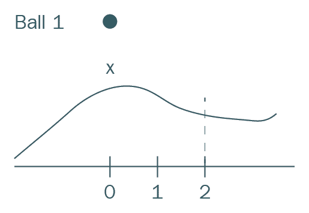

在这里，我们评估球落下并击中某个位置的概率。曲线表示球落在位置 B 的概率。现在，我们添加一个第二层：

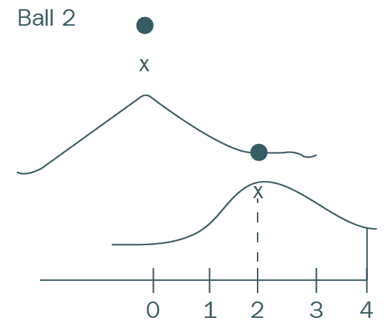

假设，从上一层，球落在位置 2。那么，球最终静止在位置 D 的概率是多少？

为了计算这个，我们需要知道球最终到达位置 D 的所有可能方式。限制我们的选项只从 A 到 D，这里它们是：

| **Level 1 Position** | **L1 Horizontal Distance** | **Level 2 position** | **L2 Horizontal Distance** |
| --- | --- | --- | --- |
| A | 0 | D | 3 |
| B | 1 | D | 2 |
| C | 2 | D | 1 |
| D | 3 | D | 0 |

现在我们可以用概率来提问。表中的水平距离是一种编码，允许我们以概率和通用的方式提问。球水平移动一个单位的概率可以表示为*P(1)*，球水平移动两个单位的概率可以表示为*P(2)*，依此类推。

要计算球在两个级别后最终落在 D 的概率，本质上就是将所有概率加起来：

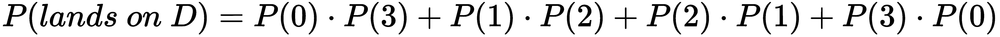。

我们可以写成这样：

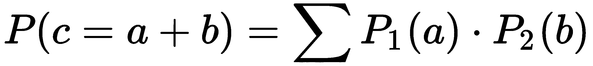

我们可以将其理解为最终距离为*$c = a+b$*的概率是*$P_1(a)$*的和，其中 1 级水平，球水平移动了*$a$*，以及*$P_2(b)$*的和，其中 2 级水平，球水平移动了*$b$*。

这就是卷积的典型定义：

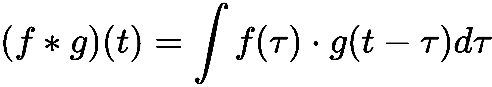

如果积分让你感到害怕，我们可以等效地将其重写为求和操作（这仅在我们考虑离散值时有效；对于连续实数值，必须使用积分）：

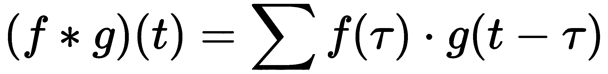

现在，如果你非常仔细地眯着眼睛看，这个方程看起来非常像前面的概率方程。用代替，我们可以将其重写为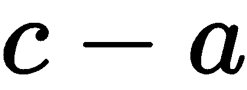：

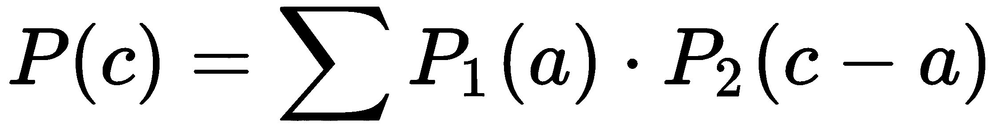

而概率是什么呢，但函数？毕竟，我们之所以用$P(a)$的格式写概率，是有原因的。我们确实可以将概率方程泛化到卷积定义。

然而，现在让我们加强我们对卷积的理解。为此，我们将保持我们讨论的函数具有概率的概念。首先，我们应该注意球最终落在特定位置的概率取决于它开始的位置。但想象一下，如果第二个平台的平台水平移动：

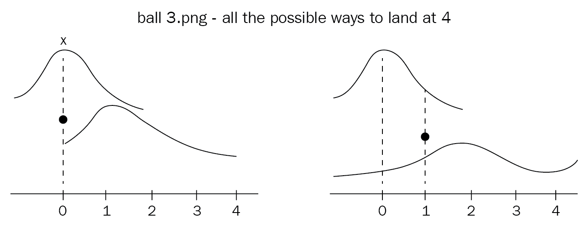

现在球的最终静止位置高度依赖于初始起始位置，以及第二层起始位置。球甚至可能不会落在底部！

因此，这里有一个关于卷积的良好心理捷径：就像一个层中的函数在另一个函数上*滑动*一样。

因此，卷积是导致高尔顿方阵*展平*的原因。本质上，这是一个在水平维度上滑动的函数，它在移动过程中将概率函数展平。这是一个一维卷积；球只沿着一个维度移动。

二维卷积与一维卷积类似。相反，对于每一层，我们考虑两个*距离*或度量：


但这个方程几乎无法理解。相反，这里有一系列如何逐步工作的方便图片：

卷积（步骤 1）：


卷积（步骤 2）：


卷积（步骤 3）：

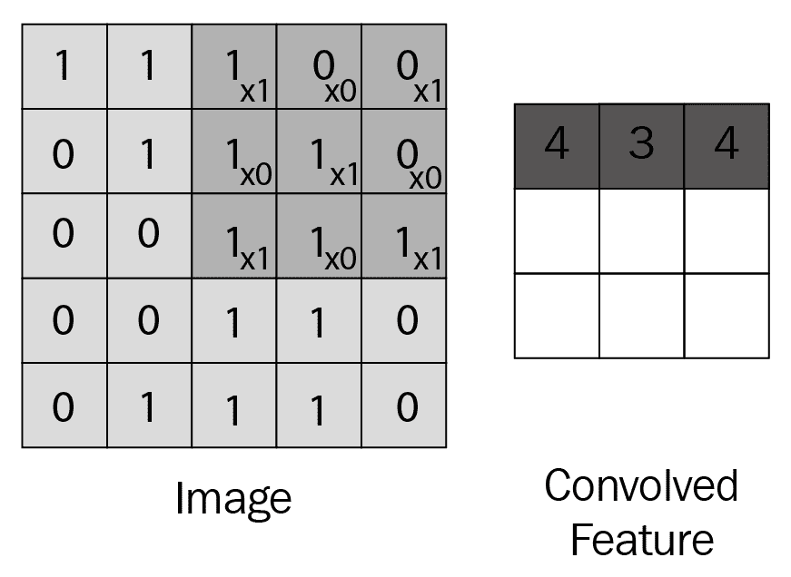

卷积（步骤 4）：

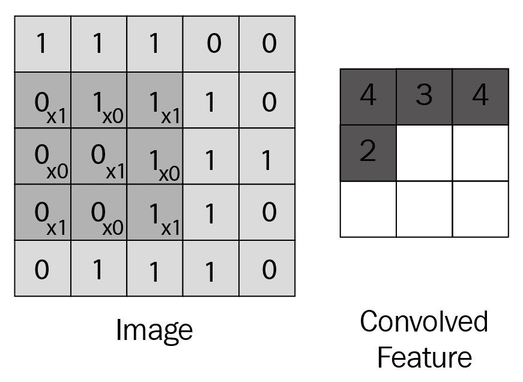

卷积（步骤 5）：

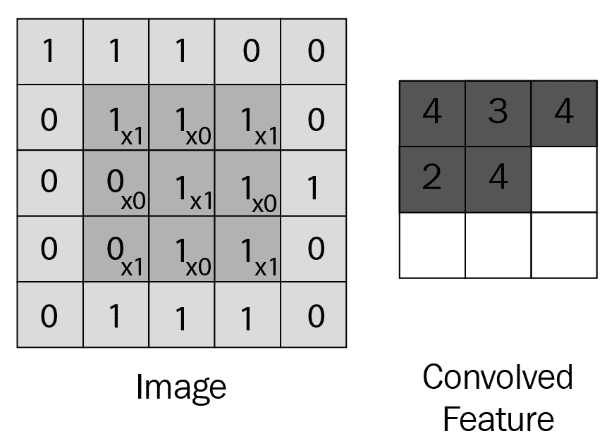

卷积（步骤 6）：

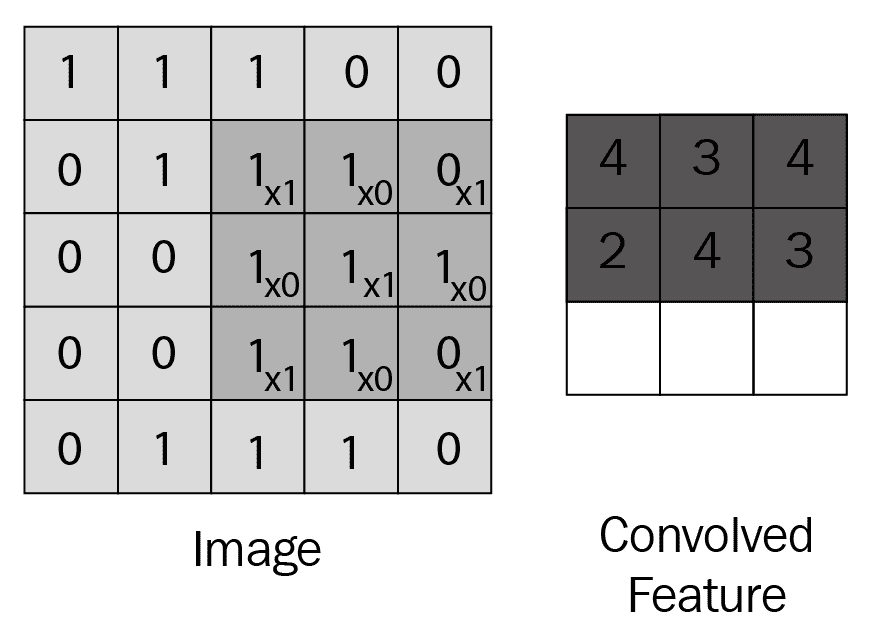

卷积（步骤 7）：

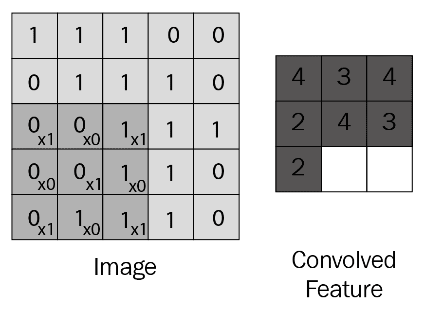

卷积（步骤 8）：

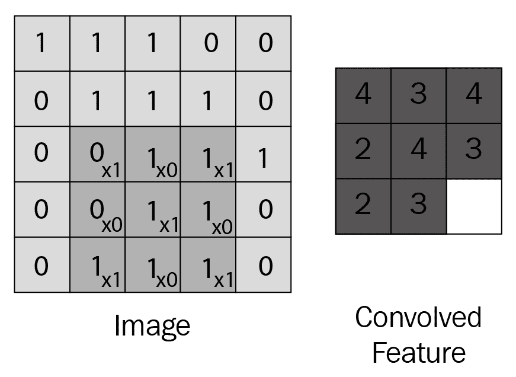

卷积（步骤 9）：


再次，你可以将这想象为在二维空间中滑动一个函数，该函数在另一个函数（输入）上滑动。滑动的函数执行标准的线性代数变换，即乘法后加法。

你可以在一个图像处理示例中看到这一点，这个示例无疑是常见的：Instagram。

# Instagram 滤镜的工作原理

我假设你熟悉 Instagram。如果不熟悉，我既羡慕又同情你；但这里是 Instagram 的要点：它是一个照片分享服务，其卖点在于允许用户对其图像应用过滤器。这些过滤器会改变图像的颜色，通常是为了增强主题。

这些过滤器是如何工作的？卷积！

例如，让我们定义一个过滤器：

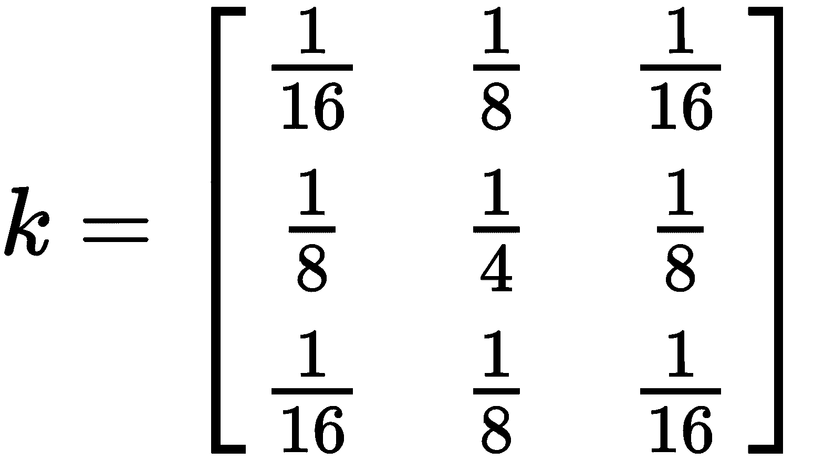

要进行卷积，我们只需将过滤器滑动到以下图中（这是一位名叫皮特·丘的艺术家的一幅非常著名的艺术品）：


应用前面的过滤器会产生如下效果：


是的，过滤器会模糊图像！

这里有一个用 Go 编写的示例，以强调这个想法：

```py
func main() {
  kb := []float64{
    1 / 16.0, 1 / 8.0, 1 / 16.0,
    1 / 8.0, 1 / 4.0, 1 / 8.0,
    1 / 16.0, 1 / 8.0, 1 / 16.0,
  }
  k := tensor.New(tensor.WithShape(3,3), tensor.WithBacking(kb))

  for _, row := range imgIt {
    for j, px := range row {
      var acc float64

      for _, krow := range kIt {
        for _, kpx := range krow {
          acc += px * kpx 
        }
      }
      row[j] = acc
    }
  }
}
```

函数当然相当慢且效率低下。Gorgonia 自带一个更复杂的算法

# 回到神经网络

好的，现在我们知道卷积在过滤器使用中很重要。但这与神经网络有什么关系呢？

回想一下，神经网络被定义为作用于其上的非线性应用（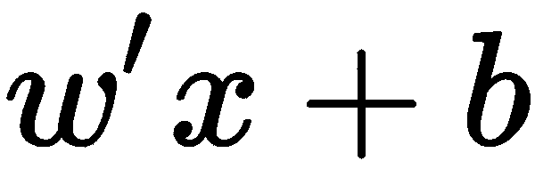）的线性变换。注意，*x*，输入图像，作为一个整体被作用。这就像在整个图像上有一个单一的过滤器。但如果我们能一次处理图像的一小部分会怎样呢？

除了这些，在前一节中，我展示了如何使用一个简单的过滤器来模糊图像。过滤器也可以用来锐化图像，突出重要的特征，同时模糊掉不重要的特征。那么，如果一台机器能够学会创建什么样的过滤器呢？

这就是为什么我们想在神经网络中使用卷积的原因：

+   卷积一次作用于图像的小部分，只留下重要的特征

+   我们可以学习特定的过滤器

这给了机器很多精细的控制。现在，我们不再需要一个同时作用于整个图像的粗糙特征检测器，我们可以构建许多过滤器，每个过滤器专门针对一个特定的特征，从而允许我们提取出对数字分类必要的特征。

# Max-pooling

现在我们心中有一个概念性的机器，它会学习它需要应用到图像上以提取特征的过滤器。但是，同时，我们不想让机器过度拟合学习。一个对训练数据过度具体的过滤器在现实生活中是没有用的。例如，如果一个过滤器学会所有的人类面孔都有两只眼睛、一个鼻子和一个嘴巴，那就结束了，它将无法分类一个半张脸被遮挡的人的图片。

因此，为了尝试教会机器学习算法更好地泛化，我们只是给它更少的信息。Max-pooling 是这样一个过程，*dropout*（见下一节）也是如此。

Max-pooling 的工作原理是将输入数据分成非重叠的区域，并简单地找到该区域的最大值：

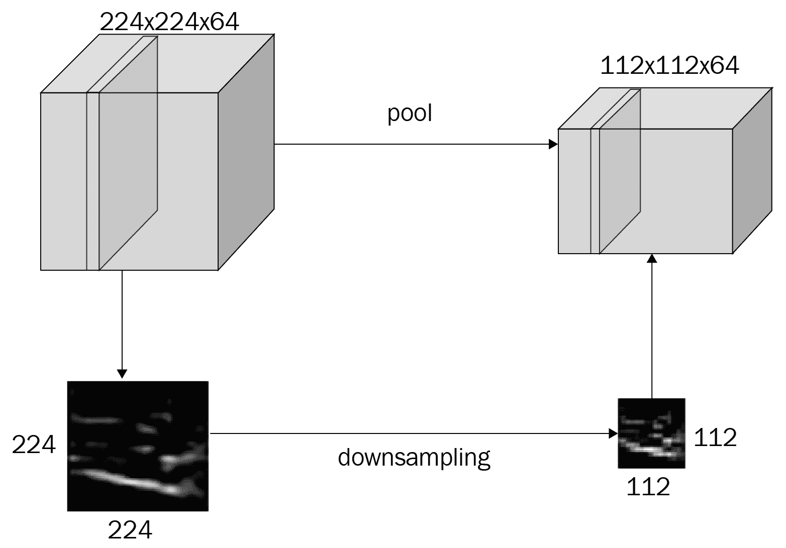

当然，有一个隐含的理解，这肯定会改变输出的形状。实际上，你会观察到它缩小了图像。

# Dropout

Max-pooling 后的结果是输出中的最小信息。但这可能仍然信息过多；机器可能仍然会过度拟合。因此，出现了一个非常有趣的问题：如果随机将一些激活置零会怎样？

这就是 Dropout 的基础。这是一个非常简单但能提高机器学习算法泛化能力的方法，它通过影响信息来达到目的。在每次迭代中，随机激活被置零。这迫使算法只学习真正重要的东西。它是如何做到这一点的涉及到结构代数，这是另一个故事。

对于这个项目来说，Gorgonia 实际上是通过使用随机生成的 1s 和 0s 矩阵进行逐元素乘法来处理 Dropout 的。

# 描述 CNN

说了这么多，构建神经网络是非常简单的。首先，我们这样定义一个神经网络：

```py
type convnet struct {
    g                  *gorgonia.ExprGraph
    w0, w1, w2, w3, w4 *gorgonia.Node // weights. the number at the back indicates which layer it's used for
    d0, d1, d2, d3     float64        // dropout probabilities

    out    *gorgonia.Node
    outVal gorgonia.Value
}
```

在这里，我们定义了一个具有四层的神经网络。卷积层在许多方面类似于线性层。例如，它可以写成方程：

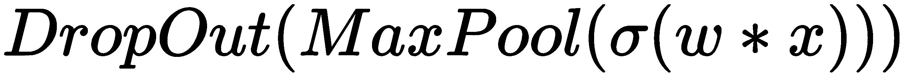

注意，在这个特定的例子中，我考虑 dropout 和 max-pool 是同一层的部分。在许多文献中，它们被认为是独立的层。

我个人认为没有必要将它们视为独立的层。毕竟，一切只是数学方程；函数的组合是自然而然的。

一个没有结构的数学方程本身是相当没有意义的。不幸的是，我们并没有足够的技术来简单地定义数据类型（类型依赖性语言，如 Idris，在这方面很有前景，但它们还没有达到深度学习所需的可用性或性能水平）。相反，我们必须通过提供一个函数来定义`convnet`来约束我们的数据结构：

```py
func newConvNet(g *gorgonia.ExprGraph) *convnet {
  w0 := gorgonia.NewTensor(g, dt, 4, gorgonia.WithShape(32, 1, 3, 3), 
                 gorgonia.WithName("w0"),    
                 gorgonia.WithInit(gorgonia.GlorotN(1.0)))
  w1 := gorgonia.NewTensor(g, dt, 4, gorgonia.WithShape(64, 32, 3, 3), 
                 gorgonia.WithName("w1"),  
                 gorgonia.WithInit(gorgonia.GlorotN(1.0)))
  w2 := gorgonia.NewTensor(g, dt, 4, gorgonia.WithShape(128, 64, 3, 3), 
                 gorgonia.WithName("w2"), 
                 gorgonia.WithInit(gorgonia.GlorotN(1.0)))
  w3 := gorgonia.NewMatrix(g, dt, gorgonia.WithShape(128*3*3, 625), 
                 gorgonia.WithName("w3"), 
                 gorgonia.WithInit(gorgonia.GlorotN(1.0)))
  w4 := gorgonia.NewMatrix(g, dt, gorgonia.WithShape(625, 10), 
                 gorgonia.WithName("w4"), 
                 gorgonia.WithInit(gorgonia.GlorotN(1.0)))
  return &convnet{
    g: g,
    w0: w0,
    w1: w1,
    w2: w2,
    w3: w3,
    w4: w4,

    d0: 0.2,
    d1: 0.2,
    d2: 0.2,
    d3: 0.55,
  }
}
```

我们将从`dt`开始。这本质上是一个全局变量，表示我们希望在哪种数据类型下工作。对于这个项目的目的，我们可以使用`var dt = tensor.Float64`来表示我们希望在项目的整个过程中使用`float64`。这允许我们立即重用上一章中的函数，而无需处理不同的数据类型。注意，如果我们确实计划使用`float32`，计算速度会立即加倍。在本书的代码库中，你可能会注意到代码使用了`float32`。

我们将从`d0`一直到最后`d3`开始。这相当简单。对于前三层，我们希望 20%的激活随机置零。但对于最后一层，我们希望 55%的激活随机置零。从非常粗略的角度来看，这会导致信息瓶颈，这将导致机器只学习真正重要的特征。

看看`w0`是如何定义的。在这里，我们说`w0`是一个名为`w0`的变量。它是一个形状为(32, 1, 3, 3)的张量。这通常被称为**批次数量、通道、高度、宽度**（**NCHW**/**BCHW**）格式。简而言之，我们说的是我们希望学习 32 个过滤器，每个过滤器的高度和宽度为(3, 3)，并且它有一个颜色通道。MNIST 毕竟只有黑白。

BCHW 不是唯一的格式！一些深度学习框架更喜欢使用 BHWC 格式。选择一种格式而不是另一种格式纯粹是出于操作上的考虑。一些卷积算法与 NCHW 配合得更好；一些与 BHWC 配合得更好。Gorgonia 中的那些只支持 BCHW。

3 x 3 滤波器的选择纯粹是无原则的，但并非没有先例。你可以选择 5 x 5 滤波器，或者 2 x 1 滤波器，或者实际上，任何形状的滤波器。然而，必须说的是，3 x 3 滤波器可能是最通用的滤波器，可以在各种图像上工作。这类正方形滤波器在图像处理算法中很常见，因此我们选择 3 x 3 是遵循这样的传统。

高层权重开始看起来更有趣。例如，`w1` 的形状为 (64, 32, 3, 3)。为什么？为了理解为什么，我们需要探索激活函数和形状之间的相互作用。以下是 `convnet` 的整个前向函数：

```py
// This function is particularly verbose for educational reasons. In reality, you'd wrap up the layers within a layer struct type and perform per-layer activations
func (m *convnet) fwd(x *gorgonia.Node) (err error) {
    var c0, c1, c2, fc *gorgonia.Node
    var a0, a1, a2, a3 *gorgonia.Node
    var p0, p1, p2 *gorgonia.Node
    var l0, l1, l2, l3 *gorgonia.Node

    // LAYER 0
    // here we convolve with stride = (1, 1) and padding = (1, 1),
    // which is your bog standard convolution for convnet
    if c0, err = gorgonia.Conv2d(x, m.w0, tensor.Shape{3, 3}, []int{1, 1}, []int{1, 1}, []int{1, 1}); err != nil {
        return errors.Wrap(err, "Layer 0 Convolution failed")
    }
    if a0, err = gorgonia.Rectify(c0); err != nil {
        return errors.Wrap(err, "Layer 0 activation failed")
    }
    if p0, err = gorgonia.MaxPool2D(a0, tensor.Shape{2, 2}, []int{0, 0}, []int{2, 2}); err != nil {
        return errors.Wrap(err, "Layer 0 Maxpooling failed")
    }
    if l0, err = gorgonia.Dropout(p0, m.d0); err != nil {
        return errors.Wrap(err, "Unable to apply a dropout")
    }

    // Layer 1
    if c1, err = gorgonia.Conv2d(l0, m.w1, tensor.Shape{3, 3}, []int{1, 1}, []int{1, 1}, []int{1, 1}); err != nil {
        return errors.Wrap(err, "Layer 1 Convolution failed")
    }
    if a1, err = gorgonia.Rectify(c1); err != nil {
        return errors.Wrap(err, "Layer 1 activation failed")
    }
    if p1, err = gorgonia.MaxPool2D(a1, tensor.Shape{2, 2}, []int{0, 0}, []int{2, 2}); err != nil {
        return errors.Wrap(err, "Layer 1 Maxpooling failed")
    }
    if l1, err = gorgonia.Dropout(p1, m.d1); err != nil {
        return errors.Wrap(err, "Unable to apply a dropout to layer 1")
    }

    // Layer 2
    if c2, err = gorgonia.Conv2d(l1, m.w2, tensor.Shape{3, 3}, []int{1, 1}, []int{1, 1}, []int{1, 1}); err != nil {
        return errors.Wrap(err, "Layer 2 Convolution failed")
    }
    if a2, err = gorgonia.Rectify(c2); err != nil {
        return errors.Wrap(err, "Layer 2 activation failed")
    }
    if p2, err = gorgonia.MaxPool2D(a2, tensor.Shape{2, 2}, []int{0, 0}, []int{2, 2}); err != nil {
        return errors.Wrap(err, "Layer 2 Maxpooling failed")
    }
    log.Printf("p2 shape %v", p2.Shape())

    var r2 *gorgonia.Node
    b, c, h, w := p2.Shape()[0], p2.Shape()[1], p2.Shape()[2], p2.Shape()[3]
    if r2, err = gorgonia.Reshape(p2, tensor.Shape{b, c * h * w}); err != nil {
        return errors.Wrap(err, "Unable to reshape layer 2")
    }
    log.Printf("r2 shape %v", r2.Shape())
    if l2, err = gorgonia.Dropout(r2, m.d2); err != nil {
        return errors.Wrap(err, "Unable to apply a dropout on layer 2")
    }

    // Layer 3
    if fc, err = gorgonia.Mul(l2, m.w3); err != nil {
        return errors.Wrapf(err, "Unable to multiply l2 and w3")
    }
    if a3, err = gorgonia.Rectify(fc); err != nil {
        return errors.Wrapf(err, "Unable to activate fc")
    }
    if l3, err = gorgonia.Dropout(a3, m.d3); err != nil {
        return errors.Wrapf(err, "Unable to apply a dropout on layer 3")
    }

    // output decode
    var out *gorgonia.Node
    if out, err = gorgonia.Mul(l3, m.w4); err != nil {
        return errors.Wrapf(err, "Unable to multiply l3 and w4")
    }
    m.out, err = gorgonia.SoftMax(out)
    gorgonia.Read(m.out, &m.outVal)
    return
}
```

应该注意的是，卷积层确实会改变输入的形状。给定一个 (N, 1, 28, 28) 的输入，`Conv2d` 函数将返回一个 (N, 32, 28, 28) 的输出，这正是因为现在有 32 个滤波器。`MaxPool2d` 将返回一个形状为 (N, 32, 14, 14) 的输出；回想一下，最大池化的目的是减少神经网络中的信息量。碰巧的是，形状为 (2, 2) 的最大池化将很好地将图像的长度和宽度减半（并将信息量减少四倍）。

第 0 层的输出形状为 (N, 32, 14, 14)。如果我们坚持我们之前对形状的解释，即格式为 (N, C, H, W)，我们可能会感到困惑。32 个通道是什么意思？为了回答这个问题，让我们看看我们是如何根据 BCHW 编码彩色图像的：

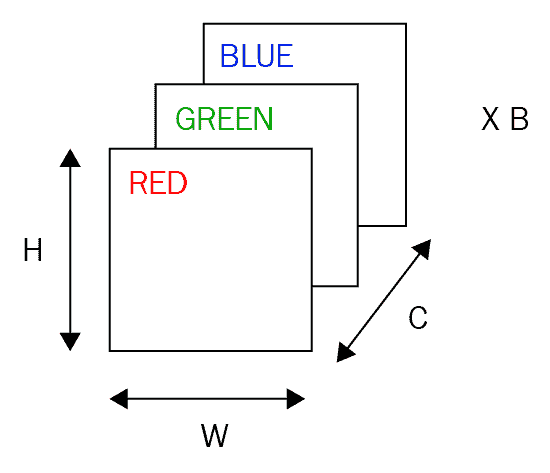

注意，我们将其编码为三个单独的层，堆叠在一起。这是关于如何思考有 32 个通道的一个线索。当然，每个 32 个通道都是应用每个 32 个滤波器的结果；可以说是提取的特征。结果当然可以以相同的方式堆叠，就像颜色通道一样。

然而，在很大程度上，仅仅进行符号推演就足以构建一个深度学习系统；不需要真正的智能。这当然反映了中国房间难题的思想实验，我对这一点有很多话要说，尽管现在并不是时候也不是地方。

更有趣的部分在于第三层的构建。第一层和第二层的构建与第 0 层非常相似，但第三层的构建略有不同。原因是第 2 层的输出是一个秩为 4 的张量，但为了执行矩阵乘法，它需要被重塑为秩为 2 的张量。

最后，解码输出的最后一层使用 softmax 激活函数来确保我们得到的结果是概率。

实际上，这就是你所看到的。一个用非常整洁的方式编写的 CNN，它并没有模糊数学定义。

# 反向传播

为了让卷积神经网络学习，所需的是反向传播，它传播误差，以及一个梯度下降函数来更新权重矩阵。在 Gorgonia 中这样做相对简单，简单到我们甚至可以在主函数中实现它而不影响可读性：

```py
func main() {
    flag.Parse()
    parseDtype()
    imgs, err := readImageFile(os.Open("train-images-idx3-ubyte"))
    if err != nil {
        log.Fatal(err)
    }
    labels, err := readLabelFile(os.Open("train-labels-idx1-ubyte"))
    if err != nil {
        log.Fatal(err)
    }

    inputs := prepareX(imgs)
    targets := prepareY(labels)

    // the data is in (numExamples, 784).
    // In order to use a convnet, we need to massage the data
    // into this format (batchsize, numberOfChannels, height, width).
    //
    // This translates into (numExamples, 1, 28, 28).
    //
    // This is because the convolution operators actually understand height and width.
    //
    // The 1 indicates that there is only one channel (MNIST data is black and white).
    numExamples := inputs.Shape()[0]
    bs := *batchsize

    if err := inputs.Reshape(numExamples, 1, 28, 28); err != nil {
        log.Fatal(err)
    }
    g := gorgonia.NewGraph()
    x := gorgonia.NewTensor(g, dt, 4, gorgonia.WithShape(bs, 1, 28, 28), gorgonia.WithName("x"))
    y := gorgonia.NewMatrix(g, dt, gorgonia.WithShape(bs, 10), gorgonia.WithName("y"))
    m := newConvNet(g)
    if err = m.fwd(x); err != nil {
        log.Fatalf("%+v", err)
    }
    losses := gorgonia.Must(gorgonia.HadamardProd(m.out, y))
    cost := gorgonia.Must(gorgonia.Mean(losses))
    cost = gorgonia.Must(gorgonia.Neg(cost))

    // we wanna track costs
    var costVal gorgonia.Value
    gorgonia.Read(cost, &costVal)

    if _, err = gorgonia.Grad(cost, m.learnables()...); err != nil {
        log.Fatal(err)
    }
```

对于误差，我们使用简单的交叉熵，通过逐元素相乘期望输出并平均，如本片段所示：

```py
    losses := gorgonia.Must(gorgonia.HadamardProd(m.out, y))
    cost := gorgonia.Must(gorgonia.Mean(losses))
    cost = gorgonia.Must(gorgonia.Neg(cost))
```

在此之后，我们只需调用`gorgonia.Grad(cost, m.learnables()...)`，它执行符号反向传播。你可能想知道`m.learnables()`是什么？它只是我们希望机器学习的变量。定义如下：

```py
func (m *convnet) learnables() gorgonia.Nodes {
    return gorgonia.Nodes{m.w0, m.w1, m.w2, m.w3, m.w4}
}
```

再次强调，这相当简单。

另一个我想让读者注意的评论是`gorgonia.Read(cost, &costVal)`。`Read`是 Gorgonia 中较为复杂的一部分。但是，当正确地构建框架时，它相当容易理解。

早期，在*描述神经网络*这一节中，我把 Gorgonia 比作用另一种编程语言进行编写。如果是这样，那么`Read`就相当于`io.WriteFile`。`gorgonia.Read(cost, &costVal)`所表达的意思是，当数学表达式被评估时，将`cost`的结果复制并存储在`costVal`中。这是由于 Gorgonia 系统中数学表达式评估的方式所必需的。

为什么叫`Read`而不是`Write`？我最初将 Gorgonia 建模为相当单调的（在 Haskell 单调的概念中），因此人们会*读取*一个值。经过三年的发展，这个名字似乎已经固定下来。

# 运行神经网络

注意，到目前为止，我们仅仅描述了我们需要执行的运算。神经网络实际上并没有运行；这只是在描述要运行的神经网络。

我们需要能够评估数学表达式。为了做到这一点，我们需要将表达式编译成一个可执行的程序。以下是实现这一点的代码：

```py
    vm := gorgonia.NewTapeMachine(g, 
        gorgonia.WithPrecompiled(prog, locMap), 
        gorgonia.BindDualValues(m.learnables()...))
    solver := gorgonia.NewRMSPropSolver(gorgonia.WithBatchSize(float64(bs)))
    defer vm.Close()
```

调用`gorgonia.Compile(g)`并不是严格必要的。这样做是为了教学目的，展示数学表达式确实可以被编译成类似汇编的程序。在生产系统中，我经常这样做：`vm := gorgonia.NewTapeMachine(g, gorgonia.BindDualValues(m.learnables()...))`。

Gorgonia 提供了两种`vm`类型，每种类型代表不同的计算模式。在这个项目中，我们仅仅使用`NewTapeMachine`来获取`*gorgonia.tapeMachine`。创建`vm`的函数有很多选项，而`BindDualValues`选项只是将模型中每个变量的梯度绑定到变量本身。这允许更便宜的梯度下降。

最后，请注意，`VM`是一种资源。你应该把`VM`想象成一个外部的 CPU，一个计算资源。在使用完外部资源后关闭它们是一个好的实践，幸运的是，Go 有一个非常方便的方式来处理清理：`defer vm.Close()`。

在我们继续讨论梯度下降之前，这是编译后的程序看起来像伪汇编：

```py

 Instructions:
 0 loadArg 0 (x) to CPU0
 1 loadArg 1 (y) to CPU1
 2 loadArg 2 (w0) to CPU2
 3 loadArg 3 (w1) to CPU3
 4 loadArg 4 (w2) to CPU4
 5 loadArg 5 (w3) to CPU5
 6 loadArg 6 (w4) to CPU6
 7 im2col<(3,3), (1, 1), (1,1) (1, 1)> [CPU0] CPU7 false false false
 8 Reshape(32, 9) [CPU2] CPU8 false false false
 9 Reshape(78400, 9) [CPU7] CPU7 false true false
 10 Alloc Matrix float64(78400, 32) CPU9
 11 A × Bᵀ [CPU7 CPU8] CPU9 true false true
 12 DoWork
 13 Reshape(100, 28, 28, 32) [CPU9] CPU9 false true false
 14 Aᵀ{0, 3, 1, 2} [CPU9] CPU9 false true false
 15 const 0 [] CPU10 false false false
 16 >= true [CPU9 CPU10] CPU11 false false false
 17 ⊙ false [CPU9 CPU11] CPU9 false true false
 18 MaxPool{100, 32, 28, 28}(kernel: (2, 2), pad: (0, 0), stride: (2, 
                             2)) [CPU9] CPU12 false false false
 19 0(0, 1) - (100, 32, 14, 14) [] CPU13 false false false
 20 const 0.2 [] CPU14 false false false
 21 > true [CPU13 CPU14] CPU15 false false false
 22 ⊙ false [CPU12 CPU15] CPU12 false true false
 23 const 5 [] CPU16 false false false
 24 ÷ false [CPU12 CPU16] CPU12 false true false
 25 im2col<(3,3), (1, 1), (1,1) (1, 1)> [CPU12] CPU17 false false false
 26 Reshape(64, 288) [CPU3] CPU18 false false false
 27 Reshape(19600, 288) [CPU17] CPU17 false true false
 28 Alloc Matrix float64(19600, 64) CPU19
 29 A × Bᵀ [CPU17 CPU18] CPU19 true false true
 30 DoWork
 31 Reshape(100, 14, 14, 64) [CPU19] CPU19 false true false
 32 Aᵀ{0, 3, 1, 2} [CPU19] CPU19 false true false
 33 >= true [CPU19 CPU10] CPU20 false false false
 34 ⊙ false [CPU19 CPU20] CPU19 false true false
 35 MaxPool{100, 64, 14, 14}(kernel: (2, 2), pad: (0, 0), stride: (2, 
                             2)) [CPU19] CPU21 false false false
 36 0(0, 1) - (100, 64, 7, 7) [] CPU22 false false false
 37 > true [CPU22 CPU14] CPU23 false false false
 38 ⊙ false [CPU21 CPU23] CPU21 false true false
 39 ÷ false [CPU21 CPU16] CPU21 false true false
 40 im2col<(3,3), (1, 1), (1,1) (1, 1)> [CPU21] CPU24 false false false
 41 Reshape(128, 576) [CPU4] CPU25 false false false
 42 Reshape(4900, 576) [CPU24] CPU24 false true false
 43 Alloc Matrix float64(4900, 128) CPU26
 44 A × Bᵀ [CPU24 CPU25] CPU26 true false true
 45 DoWork
 46 Reshape(100, 7, 7, 128) [CPU26] CPU26 false true false
 47 Aᵀ{0, 3, 1, 2} [CPU26] CPU26 false true false
 48 >= true [CPU26 CPU10] CPU27 false false false
 49 ⊙ false [CPU26 CPU27] CPU26 false true false
 50 MaxPool{100, 128, 7, 7}(kernel: (2, 2), pad: (0, 0), stride: (2, 
                            2)) [CPU26] CPU28 false false false
 51 Reshape(100, 1152) [CPU28] CPU28 false true false
 52 0(0, 1) - (100, 1152) [] CPU29 false false false
 53 > true [CPU29 CPU14] CPU30 false false false
 54 ⊙ false [CPU28 CPU30] CPU28 false true false
 55 ÷ false [CPU28 CPU16] CPU28 false true false
 56 Alloc Matrix float64(100, 625) CPU31
 57 A × B [CPU28 CPU5] CPU31 true false true
 58 DoWork
 59 >= true [CPU31 CPU10] CPU32 false false false
 60 ⊙ false [CPU31 CPU32] CPU31 false true false
 61 0(0, 1) - (100, 625) [] CPU33 false false false
 62 const 0.55 [] CPU34 false false false
 63 > true [CPU33 CPU34] CPU35 false false false
 64 ⊙ false [CPU31 CPU35] CPU31 false true false
 65 const 1.8181818181818181 [] CPU36 false false false
 66 ÷ false [CPU31 CPU36] CPU31 false true false
 67 Alloc Matrix float64(100, 10) CPU37
 68 A × B [CPU31 CPU6] CPU37 true false true
 69 DoWork
 70 exp [CPU37] CPU37 false true false
 71 Σ[1] [CPU37] CPU38 false false false
 72 SizeOf=10 [CPU37] CPU39 false false false
 73 Repeat[1] [CPU38 CPU39] CPU40 false false false
 74 ÷ false [CPU37 CPU40] CPU37 false true false
 75 ⊙ false [CPU37 CPU1] CPU37 false true false
 76 Σ[0 1] [CPU37] CPU41 false false false
 77 SizeOf=100 [CPU37] CPU42 false false false
 78 SizeOf=10 [CPU37] CPU43 false false false
 79 ⊙ false [CPU42 CPU43] CPU44 false false false
 80 ÷ false [CPU41 CPU44] CPU45 false false false
 81 neg [CPU45] CPU46 false false false
 82 DoWork
 83 Read CPU46 into 0xc43ca407d0
 84 Free CPU0
 Args: 11 | CPU Memories: 47 | GPU Memories: 0
 CPU Mem: 133594448 | GPU Mem []
 ```

```py

Printing the program allows you to actually have a feel for the complexity of the neural network. At 84 instructions, the convnet is among the simpler programs I've seen. However, there are quite a few expensive operations, which would inform us quite a bit about how long each run would take. This output also tells us roughly how many bytes of memory will be used: 133594448 bytes, or 133 megabytes.

Now it's time to talk about, gradient descent. Gorgonia comes with a number of gradient descent solvers. For this project, we'll be using the RMSProp algorithm. So, we create a solver by calling `solver := gorgonia.NewRMSPropSolver(gorgonia.WithBatchSize(float64(bs)))`. Because we are planning to perform our operations in batches, we should correct the solver by providing it the batch size, lest the solver overshoots its target.

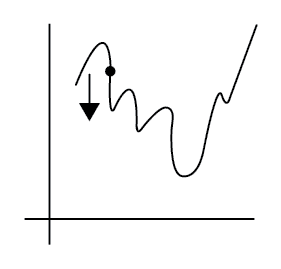

To run the neural network, we simply run it for a number of epochs (which is passed in as an argument to the program):

```

    batches := numExamples / bs

    log.Printf("批次 %d", batches)

    bar := pb.New(batches)

    bar.SetRefreshRate(time.Second)

    bar.SetMaxWidth(80)

    for i := 0; i < *epochs; i++ {

        bar.Prefix(fmt.Sprintf("第 %d 个周期", i))

        bar.Set(0)

        bar.Start()

        for b := 0; b < batches; b++ {

            start := b * bs

            end := start + bs

            if start >= numExamples {

                break

            }

            if end > numExamples {

                end = numExamples

            }

            var xVal, yVal tensor.Tensor

            if xVal, err = inputs.Slice(sli{start, end}); err != nil {

                log.Fatal("无法切片 x")

            }

            if yVal, err = targets.Slice(sli{start, end}); err != nil {

                log.Fatal("无法切片 y")

            }

            if err = xVal.(*tensor.Dense).Reshape(bs, 1, 28, 28); err != nil {

                log.Fatalf("无法重塑 %v", err)

            }

            gorgonia.Let(x, xVal)

            gorgonia.Let(y, yVal)

            if err = vm.RunAll(); err != nil {

                log.Fatalf("在第 %d 个周期失败: %v", i, err)

            }

            solver.Step(gorgonia.NodesToValueGrads(m.learnables()))

            vm.Reset()

            bar.Increment()

        }

        log.Printf("第 %d 个周期 | 成本 %v", i, costVal)

    }

```py

Because I was feeling a bit fancy, I decided to add a progress bar to track the progress. To do so, I'm using `cheggaaa/pb.v1` as the library to draw a progress bar. To install it, simply run `go get gopkg.in/cheggaaa/pb.v1` and to use it, simply add `import "gopkg.in/cheggaaa/pb.v1` in the imports.

The rest is fairly straightforward. From the training dataset, we slice out a small portion of it (specifically, we slice out `bs` rows). Because our program takes a rank-4 tensor as an input, the data has to be reshaped to `xVal.(*tensor.Dense).Reshape(bs, 1, 28, 28)`.

Finally, we feed the value into the function by using `gorgonia.Let`. Where `gorgonia.Read` reads a value out from the execution environment, `gorgonia.Let` puts a value into the execution environment. After which, `vm.RunAll()` executes the program, evaluating the mathematical function. As a programmed and intentional side-effect, each call to `vm.RunAll()` will populate the cost value into `costVal`.

Once the equation has been evaluated, this also means that the variables of the equation are now ready to be updated. As such, we use `solver.Step(gorgonia.NodesToValueGrads(m.learnables()))` to perform the actual gradient updates. After this, `vm.Reset()` is called to reset the VM state, ready for its next iteration.

Gorgonia in general, is pretty efficient. In the current version as this book was written, it managed to use all eight cores in my CPU as shown here:

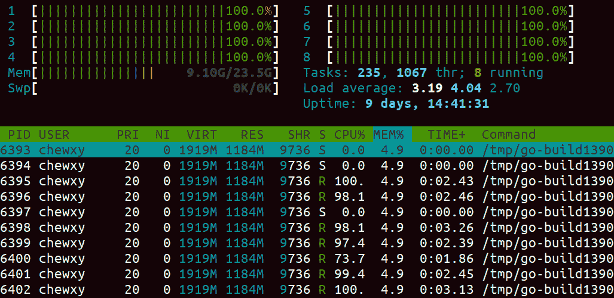

# Testing

Of course we'd have to test our neural network.

First we load up the testing data:

```

testImgs, err := readImageFile(os.Open("t10k-images.idx3-ubyte"))

if err != nil {

log.Fatal(err)

}

testlabels, err := readLabelFile(os.Open("t10k-labels.idx1-ubyte"))

if err != nil {

    log.Fatal(err)

}

testData := prepareX(testImgs)

testLbl := prepareY(testlabels)

shape := testData.Shape()

visualize(testData, 10, 10, "testData.png")

```py

In the last line, we visualize the test data to ensure that we do indeed have the correct dataset:

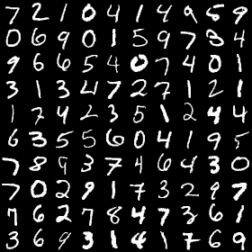

Then we have the main testing loop. Do observe that it's extremely similar to the training loop - because it's the same neural network!

```

var correct, total float32

numExamples = shape[0]

batches = numExamples / bs

for b := 0; b < batches; b++ {

    start := b * bs

    end := start + bs

    if start >= numExamples {

    break

    }

    if end > numExamples {

    end = numExamples

    }

var oneimg, onelabel tensor.Tensor

        if oneimg, err = testData.Slice(sli{start, end}); err != nil {

            log.Fatalf("无法切片图像 (%d, %d)", start, end)

        }

        if onelabel, err = testLbl.Slice(sli{start, end}); err != nil {

            log.Fatalf("无法切片标签 (%d, %d)", start, end)

        }

        if err = oneimg.(*tensor.Dense).Reshape(bs, 1, 28, 28); err != nil {

            log.Fatalf("无法重塑 %v", err)

        }

        gorgonia.Let(x, oneimg)

        gorgonia.Let(y, onelabel)

        if err = vm.RunAll(); err != nil {

            log.Fatal("预测 (%d, %d) 失败 %v", start, end, err)

        }

        label, _ := onelabel.(*tensor.Dense).Argmax(1)

        predicted, _ := m.outVal.(*tensor.Dense).Argmax(1)

        lblData := label.Data().([]int)

        for i, p := range predicted.Data().([]int) {

            if p == lblData[i] {

                correct++

            }

            total++

        }

    }

    fmt.Printf("正确/总数: %v/%v = %1.3f\n", correct, total, correct/total)

```py

One difference is in the following snippet:

```

label, _ := onelabel.(*tensor.Dense).Argmax(1)

predicted, _ := m.outVal.(*tensor.Dense).Argmax(1)

lblData := label.Data().([]int)

for i, p := range predicted.Data().([]int) {

    if p == lblData[i] {

        correct++

        }

        total++

}

```

在上一章中，我们编写了自己的 `argmax` 函数。Gorgonia 的 tensor 包实际上提供了一个方便的方法来做这件事。但为了理解发生了什么，我们首先需要查看结果。

`m.outVal`的形状是(N, 10)，其中 N 是批量大小。相同的形状也适用于`onelabel`。 (N, 10)意味着有 N 行，每行有 10 列。这 10 列可能是什么？当然，它们是编码的数字！所以我们要做的是找到每行的列中的最大值。这就是第一维。因此，当调用`.ArgMax()`时，我们指定 1 作为轴。

因此，`.Argmax()`调用的结果将具有形状(N)。对于该向量中的每个值，如果它们对于`lblData`和`predicted`是相同的，那么我们就增加`correct`计数器。这为我们提供了一种计算准确度的方法。

# 准确度

我们使用准确度是因为上一章使用了准确度。这使得我们可以进行苹果对苹果的比较。此外，你可能还会注意到缺乏交叉验证。这将被留给读者作为练习。

在对批量大小为 50 和 150 个周期的神经网络训练了两个小时后，我很高兴地说，我得到了 99.87%的准确度。这甚至还不是最先进的！

在上一章中，仅用 6.5 分钟就达到了 97%的准确度。而额外提高 2%的准确度则需要更多的时间。这在现实生活中是一个因素。通常，商业决策是选择机器学习算法的一个重要因素。

# 摘要

在本章中，我们学习了神经网络，并详细研究了 Gorgonia 库。然后我们学习了如何使用 CNN 识别手写数字。

在下一章中，我们将通过在 Go 中构建一个多面部检测系统来加强我们对计算机视觉可以做什么的直觉。
