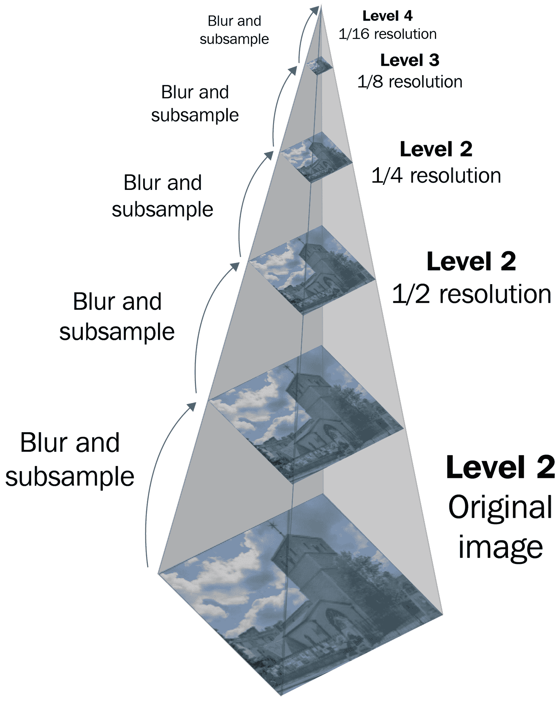

# 基本面部检测

前几章可以最好地描述为尝试读取图像。这是机器学习中的一个子领域，称为**计算机视觉（CV**）。通过卷积神经网络（第七章，*卷积神经网络 – MNIST 手写识别*），我们发现卷积层学会了如何过滤图像。

有一种普遍的误解，认为任何值得做的**机器学习（ML**）都必须来自神经网络和深度学习。这显然不是事实。相反，应该将深度学习视为实现目标的一种技术；深度学习不是终点。本章的目的是让读者了解一些关于使机器学习算法在生产环境中更好地工作的见解。本章的代码非常简单。这个主题是微不足道的，许多人认为它已经被解决了。然而，这些见解并不简单。我希望本章能促使读者更深入地思考他们面临的问题。

因此，本章将要介绍的一些算法最初起源于学术界。然而，这些算法的发明是由一个高度实际的需求驱动的，通过分析这些算法是如何被发明的，我们可以学到很多东西。

在本章中，我们将通过在 Go 语言中构建多个面部检测系统，进一步加深我们对计算机视觉可以做什么的了解。我们将使用`GoCV`和`Pigo`。我们将构建的程序能够从实时网络摄像头中检测人脸。然而，本章将与前几章有所不同，因为我们将比较两种算法。目的是让读者更多地思考实际面临的问题，而不仅仅是复制粘贴代码。

# 什么是人脸？

为了检测人脸，我们需要了解什么是人脸，特别是什么是人类人脸。想想一个典型的人类人脸。一个典型的人类人脸有两只眼睛、一个鼻子和一个嘴巴。但是拥有这些特征并不足以定义一个人脸。狗也有两只眼睛、一个鼻子和一个嘴巴。毕竟，我们是哺乳动物进化的产物。

我鼓励读者更仔细地思考是什么构成了人脸。我们本能地知道什么是人脸，但要真正量化构成人脸的确切要素需要工作。通常，这可能会导致关于本质主义的哲学沉思。

如果你看过糟糕的程序化电视剧，可能会看到当电视上的侦探在数据库中进行面部识别时，人脸是用点和线描绘出来的。这些点和线主要归功于伍德罗·布莱索、海伦·陈和查尔斯·比松在 20 世纪 60 年代的工作。他们是第一批研究自动面部检测的人之一。首先注意到的是，面部标准特征——发际线、眉毛、眼睛的凹陷程度、鼻梁的高度等等，都是可以动态定义的；也就是说，这些特征是相对于彼此来测量的。这使得自动检测特征比预期的要更具挑战性。

他们的解决方案是新颖的：使用一种类似于今天绘图板的设备，标注眼睛、鼻子、嘴巴和其他面部特征的位置。然后，这些标注之间的距离被用作面部识别的特征。今天的过程与此不同，只是自动化程度更高。布莱索、陈及其团队的工作导致了大量努力，以量化像素如何共同出现以形成面部特征。

为了理解构成人脸的特征，我们需要进行抽象。描绘人脸所需的最小点数和线数是多少？观察 kaomoji 的使用可以提供有益的启示。考虑以下 kaomoji：


很容易看出这些描绘的是人脸。将它们与描绘其他事物（鱼、蜘蛛、枪和炸弹）的 kaomoji 进行对比：


抽象的过程——即移除细节直到只剩下重要的部分——有助于人们更清晰地思考一个主题。这在艺术和数学中都是如此。在软件工程中也是如此，尽管需要对抽象进行仔细的实现。回到 kaomoji，请注意，即使在其高度抽象的形式中，它们也能够表达情感。按照显示顺序，kaomoji 展示了快乐、冷漠、爱、不满和愤怒。这些抽象描绘为我们提供了思考图片中面部特征的方法。为了确定是否存在人脸，我们只需确定那些线条是否存在。现在的问题变成了如何从照片中绘制线条？

从面部结构开始，假设在一个均匀照明的房间里。除了像格雷夫斯病这样的疾病会导致眼球突出外，眼睛通常是凹进去的。这导致眼睛区域被面部眉毛和颧骨的阴影所覆盖。在均匀照明的面部照片中，眼睛会显得在阴影中。另一方面，鼻子会显得更明亮，因为鼻子相对于面部其他部分是凸起的。同样，嘴唇有一个暗区和亮区，由一条暗线分开。这些都是在考虑检测人脸时有用的特征。

# Viola-Jones

快进到 2000 年代初。随着 Viola 和 Jones 引入了一种非常快速的对象检测方法，面部检测方法取得了飞跃。`Viola-Jones`方法虽然足够通用，可以检测任何对象，但主要是为了检测面部。Viola-Jones 方法的关键天才之处在于它使用了多个小分类器以分阶段的方式对图像区域进行分类。这被称为**级联分类器**。

为了使解释更清晰，每当在 Viola-Jones 方法中提到*分类器*时，我指的是级联分类器中的小分类器。当提到级联分类器时，将明确指出这一点。

级联分类器由许多小分类器组成。每个分类器由多个过滤器组成。关于过滤器的简要介绍，请参阅上一章（Instagram 滤镜是如何工作的）。为了检测面部，首先从图像的一个小部分（称为**窗口**）开始。依次运行分类器。如果将分类器中所有过滤器应用的结果之和超过分类器的预定义阈值，则认为它是面部的一部分。然后，级联分类器继续到下一个分类器。这是级联分类器的*级联*部分。一旦所有分类器都完成，窗口滑动到下一个像素，过程重新开始。如果级联分类器中的某个分类器未能识别出面部的一部分，则整个区域被拒绝，滑动窗口继续滑动。

过滤器通过检测面部上提到的明暗区域来工作。例如，眼睛周围区域通常是凹的，因此有阴影。如果我们要在某个区域应用过滤器，我们只会突出眼睛：


用于眼睛的分类器会有多个过滤器，配置为测试眼睛的可能配置。用于鼻子的分类器会有多个针对鼻子的特定过滤器。在级联分类器中，我们可以安排重要性；也许我们将眼睛定义为面部最重要的部分（毕竟，它们是灵魂之窗）。我们可以这样安排，使得级联分类器首先对眼睛区域进行分类。如果有眼睛，我们接着寻找鼻子，然后是嘴巴。如果没有，滑动窗口应该继续滑动：


Viola-Jones 的另一个创新点是该方法被设计用于在图像金字塔上工作。什么是图像金字塔？想象一下你有一个大型的 1024 x 768 像素的图像。这个图像具有多个不同尺度的两个面。有一个人站在相机非常近的位置，另一个人站在较远的位置。任何对相机光学有所了解的人都会立刻意识到，站在相机近处的人的脸在图像中会比站在远处的人的脸大得多。问题是，我们如何能够检测到不同尺度的两个脸？

一个可能的答案是设计多个过滤器，每个可能的尺度一个。但这留下了很多错误的空间。而不是设计多个过滤器，如果图像被多次调整大小，相同的过滤器可以被重复使用：



非常靠近相机的脸不会被设计用于检测小脸的过滤器检测到。相反，在原始分辨率下，分类器会检测到较小的脸。然后，图像被调整大小，使得分辨率现在更小，比如说 640 x 480 像素。大脸现在变成了小脸，小脸现在变成了单独的点。分类器现在能够检测到大脸而不是小脸。但总的来说，分类器已经检测到了图像中的所有脸。因为图像是直接调整大小的，所以在较小图像中的坐标可以很容易地转换成原始图像中的坐标。这允许在较小尺度上的检测直接转换成原始尺度上的检测。

到目前为止，如果你已经阅读了上一章，这开始感觉有些熟悉。**卷积神经网络**（**CNNs**）以非常相似的方式工作。在 CNN 中，多个过滤器被应用于子区域，生成一个过滤后的图像。然后，过滤后的图像通过一个减少层（最大池化或其他减少方法）。CNN 中的关键是学习过滤器会是什么样子。实际上，每个 CNN 的第一层学习到的过滤器与 Viola-Jones 方法中使用的过滤器非常相似。

主要的相似之处在于 Viola-Jones 基本上相当于有一个滑动窗口并将过滤器应用于图像的某个部分。这类似于 CNN 中的卷积。CNN 的优势在于它们能够学习这些过滤器，而 Viola-Jones 方法中的过滤器是手动创建的。另一方面，Viola-Jones 方法的好处是级联：如果其中一个分类器失败，它可能会提前终止搜索某个区域的搜索。这节省了很多计算。事实上，Viola-Jones 方法的影响如此之大，以至于它启发了 2016 年由 Zhang 等人撰写的*使用多任务级联卷积网络的联合人脸检测与对齐*，该方法使用了三个神经网络以级联方式识别人脸。

很容易将图像金字塔与 CNN 中的池化层所做的工作等同起来。这并不正确。Viola-Jones 方法中的多尺度检测是一个巧妙的方法，而 CNN 中的池化层则导致学习到更高阶的特征。CNN 学习到更高阶的特征，如眼睛、鼻子和嘴巴，而 Viola-Jones 方法则没有。

考虑到这一点，人们可能会想知道 CNN 是否可能更好。它们确实以人类的方式检测人脸——通过识别眼睛、鼻子和嘴巴作为特征，而不是过滤像素上的模式。仍然有理由在今天使用 Viola-Jones。到目前为止，Viola-Jones 方法在库中得到了很好的理解和优化。它内置在 GoCV 中，这是我们将会使用的。该方法也比基于深度学习的模型更快，但牺牲了一些灵活性。大多数 Viola-Jones 模型只检测正面的人脸。此外，Viola-Jones 方法可能无法检测旋转的人脸（如果你想要检测一个转头恶魔的脸作为驱魔者的证据，那就太糟糕了）。

根据用例，可能根本不需要基于深度学习的系统来执行人脸检测！

# PICO

我们将要使用的一种另一种技术是**基于像素强度比较的对象检测**（**PICO**），它最初由 Markus、Frljak 等人于 2014 年开发。它使用与 Viola-Jones 方法相同的广泛原则，即存在级联分类器。它有两个不同之处。首先，不使用滑动窗口。这是由于后者的差异。其次，级联分类器的分类器与 Viola-Jones 的不同。在 Viola-Jones 中，使用重复应用滤波器然后求和的结果作为分类器的方法。相比之下，在 PICO 中，使用决策树。

决策树是一种树，其中每个节点都是一个特征，特征的分支由一个阈值定义。在 PICO 的情况下，决策树应用于照片中的每个像素。对于每个考虑到的像素，其强度将与另一个位置另一个像素的强度进行比较。这些位置由均匀分布生成，从而消除了滑动窗口的需要。

PICO 方法也消除了需要图像金字塔和积分图像的需求。分类器能够直接从图像中检测人脸。这使得它非常快。

尽管如此，Viola-Jones 的遗产是显而易见的。分类器是分阶段应用的。首先，使用简单的分类器。这将消除存在人脸概率较低的区域。接下来，在减少的搜索区域上使用更复杂的分类器。这会重复进行，直到达到最后阶段。每个分类器的结果都会保留以供后续使用。

读者可能会意识到，在图片中肯定有脸的区域将被更多的分类器搜索。正是基于这种直觉，作者在 PICO 分类器中引入了一个最终的聚类步骤。规则很简单：如果分类器搜索的区域有重叠，并且重叠百分比大于 30%，则认为它们是同一个簇的一部分。因此，最终结果对小的变化具有鲁棒性。

# 关于学习的笔记

你可能已经注意到，在之前描述算法时，我故意没有提到这些模型的训练过程。这种省略是有意为之的。因为我们不会训练任何模型，所以 Viola-Jones 方法和 PICO 方法是如何训练以产生模型的，将留给读者作为练习。

相反，在本章中，我们希望使用已经创建的模型。这些模型在实践中被广泛使用。然后我们将比较和对比这些方法，以找出它们的优缺点。

# GoCV

在本章中，我们将使用 GoCV。GoCV 是 OpenCV 的一个绑定，并附带了一组可以从 OpenCV 使用的功能。OpenCV 的一个功能是 Viola-Jones 分类器，我们将利用这个分类器。

安装 GoCV 有点棘手，然而。它需要先安装 OpenCV。在撰写本文时，GoCV 支持的版本是 OpenCV 3.4.2。安装 OpenCV 可能是一个相当痛苦的过程。也许最好的地方去了解**如何**安装 OpenCV 是一个叫做**Learn OpenCV**的网站。他们提供了关于在所有平台上安装 OpenCV 的出色指南：

+   在 Ubuntu 上安装 OpenCV: [`www.learnopencv.com/install-opencv3-on-ubuntu/`](https://www.learnopencv.com/install-opencv3-on-ubuntu/)

+   在 Windows 上安装 OpenCV: [`www.learnopencv.com/install-opencv3-on-windows/`](https://www.learnopencv.com/install-opencv3-on-windows/)

+   在 MacOS 上安装 OpenCV: [`www.learnopencv.com/install-opencv3-on-macos/`](https://www.learnopencv.com/install-opencv3-on-macos/)

在完成令人敬畏的 OpenCV 安装过程之后，安装 GoCV 就像小菜一碟。只需运行`go get -u gocv.io.x.gocv`，然后 Bob 就是你的叔叔。

# API

GoCV 的 API 与 OpenCV 的 API 非常匹配。一个特别好的 API 展示是显示窗口。有了显示窗口，人们能够显示摄像头实时接收到的图像。它也是一个非常有用的调试工具，在可能需要编写新分类器的情况下。

我已经开发了多年的程序。可以说，我见过很多设计模式和包。对于几乎所有编程语言来说，最棘手的问题之一就是外函数接口（FFI），当程序需要调用用另一种语言编写的库时。做得好的不多。大多数都做得粗糙，好像是在底层的**外函数接口**（**FFI**）上贴了些东西。在 Go 语言中，FFI 是通过 cgo 来处理的。

很常见，库的作者（包括我自己）会变得过于聪明，并试图代表用户管理资源。虽然乍一看这似乎是好的用户体验，甚至是好的客户服务，但最终这会导致很多痛苦。在撰写本文时，Gorgonia 本身刚刚经历了一系列重构，以使资源隐喻更加清晰，特别是关于 CUDA 的使用。

说了这么多，GoCV 可能是关于 cgo 使用方面最一致的 Go 库之一。GoCV 一致的部分在于其对外部对象的处理。一切都被视为资源；因此，大多数类型都有 `.Close()` 方法。GoCV 确实还有其他优点，包括 `customenv` 构建标签，它允许库用户定义 OpenCV 的安装位置，但我对 GoCV 的主要赞扬在于其在将 OpenCV 对象视为外部资源方面的连贯性。

使用资源隐喻处理对象指导我们在 GoCV API 中的使用。所有对象在使用后都必须关闭，这是一个简单的规则要遵守。

# Pigo

Pigo 是一个使用 PICO 算法检测人脸的 Go 库。与 Viola-Jones 方法相比，PICO 很快。自然地，PIGO 也很快。考虑到 GoCV 使用 cgo，这会带来速度上的惩罚，PIGO 可能看起来是一个更好的整体选择。然而，必须注意的是，PICO 算法比原始的 Viola-Jones 方法更容易产生误报。

使用 PIGO 库很简单。提供的文档很清晰。然而，PIGO 是设计在作者的工作流程中运行的。与该工作流程不同将需要一些额外的工作。具体来说，作者使用外部助手如 `github.com/fogleman/gg` 绘制图像。我们不会这样做。但是，工作量并不大。

要安装 `pigo`，只需运行 `go get -u github.com/esimov/pigo/...`。

# 人脸检测程序

我们想要做的是编写一个程序，从摄像头读取图像，将图像传递给人脸检测器，然后在图像上绘制矩形。最后，我们想要显示带有绘制矩形的图像。

# 从摄像头捕获图像

首先，我们将打开与摄像头的连接：

```py
```

func main() {

// 打开摄像头

webcam, err := gocv.VideoCaptureDevice(0)

if err != nil {

log.Fatal(err)

}

defer webcam.Close()

}

```py
```

在这里，我使用了 `VideoCaptureDevice(0)`，因为在我的电脑上，它运行的是 Ubuntu 系统，摄像头是设备 `0`。您的摄像头可能在不同设备编号上。另外，请注意 `defer webcam.Close()`。这是 GoCV 非常坚持的资源隐喻。摄像头（特别是 `VideoCaptureDevice`）是一种资源，就像文件一样。实际上，在 Linux 中，这是真的；我的电脑上的摄像头挂载在 `/dev/video0` 目录下，我可以通过使用 `cat` 的变体来访问它的原始字节。但我不打算深入。重点是，必须在资源上调用 `.Close()` 以释放使用。

关于关闭资源以释放使用的讨论自然引发了一个问题，鉴于我们是用 Go 编程。通道是一个资源吗？答案是，不是。通道的 `close(ch)` 只会通知每个发送者这个通道不再接收数据。

能够访问摄像头很棒，但我们还希望能够从它那里抓取图像。我提到过可以从摄像头的文件中读取原始流。我们也可以用 GoCV 做同样的事情：

```py
```

img := gocv.NewMat()

defer img.Close()

width := int(webcam.Get(gocv.VideoCaptureFrameWidth))

height := int(webcam.Get(gocv.VideoCaptureFrameHeight))

fmt.Printf("Webcam resolution: %v, %v", width, height)

if ok := webcam.Read(&amp;img); !ok {

log.Fatal("cannot read device 0")

}

```py
```

首先，我们创建一个新的矩阵，代表一个图像。同样，矩阵被当作一个资源来处理，因为它是由外部函数接口拥有的。因此，我们写下了 `defer img.Close()`。接下来，我们查询摄像头的分辨率信息。现在这并不那么重要，但以后会很重要。尽管如此，知道摄像头运行在什么分辨率上还是相当不错的。最后，我们将摄像头的图像读入矩阵。

在这个阶段，如果你已经熟悉 Gorgonia 的张量库，这个模式可能看起来很熟悉，但感觉有点奇怪。`img := gocv.NewMat()` 并没有定义一个大小。GoCV 是如何知道为矩阵分配多少空间的呢？答案是，这个魔法发生在 `webcam.Read` 中。底层的矩阵将由 OpenCV 根据需要调整大小。这样，程序的 Go 部分实际上并没有进行真正的内存分配。

# 显示图像

所以，图像已经神奇地读入矩阵。我们如何从中获取任何内容呢？

答案是我们必须将 OpenCV 控制的从数据结构中的数据复制到一个 Go 原生数据结构中。幸运的是，GoCV 也处理了这一点。在这里，我们将它写入文件：

```py
 goImg, err := img.ToImage()
 if err != nil {
 log.Fatal(err)
 }
 outFile, err := os.OpenFile("first.png", os.O_WRONLY|os.O_TRUNC|os.O_CREATE, 0644)
 if err != nil {
 log.Fatal(err)
 }
 png.Encode(outFile, goImg)
```

首先，矩阵必须转换为 `image.Image`。为此，调用 `img.ToImage()`。然后，使用 `png.Encode` 将其编码为 PNG 格式。

你将得到一个测试图像。这是我用的：


在图片中，我拿着一个装着拉尔夫·瓦尔多·爱默生照片的盒子，他是著名的美国作家。熟悉书写工具的读者可能会注意到，这实际上是我写作时使用的墨水品牌。

因此，现在我们已经有了从摄像头获取图像并将其写入文件的基本流程。摄像头持续捕捉图像，但我们只将一个图像读入矩阵，然后将矩阵写入文件。如果我们将其放入循环中，我们就有能力连续从摄像头读取图像并将其写入文件。

类似于有一个文件，我们可以将其写入屏幕。GoCV 与 OpenCV 的集成如此完整，以至于这很简单。我们不是写入文件，而是显示一个窗口。

为了做到这一点，我们首先需要创建一个窗口对象，标题为 `Face Detection Window`：

```py
 window := gocv.NewWindow("Face Detection Window")
 defer window.Close()
```

然后，要显示图像在窗口中，只需替换我们写入文件的代码部分为以下内容：

```py
 window.IMShow(img)
```

当程序运行时，将弹出一个窗口，显示由网络摄像头捕获的图像。

# 在图像上涂鸦

在某个时候，我们可能还想在图像上绘制，最好是在输出到显示或文件之前。GoCV 在这方面表现得非常好。在本章的用途中，我们只需绘制矩形来表示可能存在面部的地方。GoCV 与标准库的 `Rectangle` 类型配合良好。

要使用 GoCV 在图像上绘制矩形，我们首先定义一个矩形：

```py
 r := image.Rect(50, 50, 100, 100)
```

这里，我定义了一个从位置（`50, 50`）开始，宽度为 100 像素，高度为 100 像素的矩形。

然后，需要定义一个颜色。同样，GoCV 与标准库中的 `image`/`color` 结合得非常好。所以，这是颜色 `blue` 的定义：

```py
 blue := color.RGBA{0, 0, 255, 0}
```

现在，让我们继续在图像上绘制矩形！：

```py
 gocv.Rectangle(&amp;img, r, blue, 3)
```

这是在图像中绘制一个以矩形左上角为（50, 50）的蓝色矩形。

到目前为止，我们已经有了构建两个不同管道所需的组件。一个将图像写入文件。另一个创建一个窗口来显示图像。处理来自网络摄像头的输入有两种方式：一次性或持续进行。此外，我们还可以在输出之前修改图像矩阵。这为我们提供了在构建程序过程中的大量灵活性。

# 面部检测 1

我们想要使用的第一个面部检测算法是 Viola-Jones 方法。这个方法内置在 GoCV 中，因此我们可以直接使用它。GoCV 的一致性给我们提供了下一步要做什么的提示。我们需要一个分类器对象（并且记得要关闭它！）

这就是创建分类器对象的方法：

```py
```

classifier := gocv.NewCascadeClassifier()

if !classifier.Load(haarCascadeFile) {

log.Fatalf("Error reading cascade file: %v\n", haarCascadeFile)

}

defer classifier.Close()

```py
```

注意，在这个阶段，仅仅创建一个分类器是不够的。我们需要用模型来加载它。所使用的模型非常成熟。它最初由 Rainer Lienhart 在 2000 年代初创建。像大多数 2000 年代的产品一样，该模型被序列化为 XML 文件。

该文件可以从 GoCV GitHub 仓库下载：[`github.com/hybridgroup/gocv/blob/master/data/haarcascade_frontalface_default.xml`](https://github.com/hybridgroup/gocv/blob/master/data/haarcascade_frontalface_default.xml)

在前面的代码中，`haarCascadeFile` 是一个表示文件路径的字符串。GoCV 处理其余部分。

要检测面部，这是一个简单的单行代码：

```py
```

rects := classifier.DetectMultiScale(img)

```py
```

在这一行代码中，我们告诉 OpenCV 使用 Viola-Jones 的多尺度检测来检测人脸。内部，OpenCV 构建了一个积分图像的图像金字塔，并在图像金字塔上运行分类器。在每一阶段，算法认为人脸所在位置的矩形被生成。这些矩形就是返回的内容。它们可以在输出到文件或窗口之前绘制到图像上。

这里展示了一个完整的窗口化管道的示例：

```py
```

var haarCascadeFile = "Path/To/CascadeFile.xml"

var blue = color.RGBA{0, 0, 255, 0}

func main() {

// 打开摄像头

webcam, err := gocv.VideoCaptureDevice(0)

if err != nil {

log.Fatal(err)

}

defer webcam.Close()

var err error

// 打开显示窗口

window := gocv.NewWindow("人脸检测")

defer window.Close()

// 准备图像矩阵

img := gocv.NewMat()

defer img.Close()

// 当检测到人脸时的人脸矩形颜色

// 加载分类器以识别人脸

classifier := gocv.NewCascadeClassifier()

if !classifier.Load(haarCascadeFile) {

log.Fatalf("读取级联文件时出错: %v\n", haarCascadeFile)

}

defer classifier.Close()

for {

if ok := webcam.Read(&img); !ok {

fmt.Printf("无法读取设备 %d\n", deviceID)

return

}

if img.Empty() {

continue

}

rects := classifier.DetectMultiScale(img)

for _, r := range rects {

gocv.Rectangle(&img, r, blue, 3)

}

window.IMShow(img)

if window.WaitKey(1) >= 0 {

break

}

}

}

```py
```

程序现在能够从摄像头获取图像，检测人脸，在人脸周围绘制矩形，然后显示图像。你可能注意到，它在这方面做得相当快。

# 人脸检测 2

一举一动，GoCV 为我们提供了进行实时人脸检测所需的一切。但是，它与其他人脸检测算法一起使用容易吗？答案是肯定的，但需要一些工作。

我们想要使用的算法是 PICO 算法。回想一下，GoCV 中的图像是`gocv.Mat`类型。为了使 PIGO 能够使用它，我们需要将其转换为 PICO 可读的格式。顺便说一句，这种共享格式是标准库中的`image.Image`。

再次提醒，`gocv.Mat`类型有一个`.ToImage()`方法，它返回一个`image.Image`。这就是我们的桥梁！

在穿过它之前，让我们看看如何创建一个 PIGO 分类器。这里有一个创建它的函数：

```py
```

func pigoSetup(width, height int) (*image.NRGBA, []uint8, *pigo.Pigo,

            pigo.CascadeParams, pigo.ImageParams) {

goImg := image.NewNRGBA(image.Rect(0, 0, width, height))

grayGoImg := make([]uint8, width*height)

cParams := pigo.CascadeParams{

                            MinSize: 20,

                            MaxSize: 1000,

                            ShiftFactor: 0.1,

                            ScaleFactor: 1.1,

}

imgParams := pigo.ImageParams{

                            Pixels: grayGoImg,

                            Rows: height,

                            Cols: width,

                            Dim: width,

}

classifier := pigo.NewPigo()

var err error

if classifier, err = classifier.Unpack(pigoCascadeFile); err != nil {

                log.Fatalf("读取级联文件时出错: %s", err)

}

return goImg, grayGoImg, classifier, cParams, imgParams

}

```py
```

此函数相当密集。让我们来分解它。我们将以逻辑方式而不是自顶向下的线性方式来执行。

首先，使用 `classifier := pigo.NewPigo()` 创建一个 `pigo.Pigo` 对象。这创建了一个新的分类器。与 Viola-Jones 方法一样，需要一个模型来提供。

与 GoCV 不同，模型是二进制格式，需要解包。此外，`classifier.Unpack` 接受一个 `[]byte`，而不是表示文件路径的字符串。提供的模型可以在 GitHub 上获取：`https://github.com/esimov/pigo/blob/master/data/facefinder`。

一旦获取了文件，就需要像下面片段所示的那样以 `[]byte` 格式读取它（该片段被 `init` 函数包裹）：

```py
```

pigoCascadeFile, err = ioutil.ReadFile("path/to/facefinder")

if err != nil {

    log.Fatalf("Error reading the cascade file: %v", err)

}

```py
```

一旦 `pigoCascadeFile` 可用，我们可以使用 `classifier.Unpack(pigoCascadeFile)` 将其解包到分类器中。通常的错误处理适用。

但这一节前面的部分呢？为什么这是必要的？

为了理解这一点，让我们看看 PIGO 是如何进行分类的。它大致如下：

```py
dets := pigoClass.RunCascade(imgParams, cParams)
dets = pigoClass.ClusterDetections(dets, 0.3)
```

当 PIGO 运行分类器时，它接受两个参数，这些参数决定了其行为：`ImageParam` 和 `CascadeParams`。特别是，`ImageParam` 的细节对我们理解过程很有启发。它被定义为：

```py
// ImageParams is a struct for image related settings.
// Pixels: contains the grayscale converted image pixel data.
// Rows: the number of image rows.
// Cols: the number of image columns.
// Dim: the image dimension.
type ImageParams struct {
  Pixels []uint8
  Rows int
  Cols int
  Dim int
}

```

在这种情况下，`pigoSetup` 函数具有额外的功能。`goImg` 不是严格必需的，但在考虑 GoCV 和 PIGO 之间的桥梁时很有用。

PIGO 需要图像以 `[]uint8` 格式存在，表示灰度图像。GoCV 将网络摄像头图像读取到 `gocv.Mat` 中，该对象具有 `.ToImage()` 方法。该方法返回一个 `image.Image` 对象。大多数网络摄像头捕获的是彩色图像。以下是将 GoCV 和 PIGO 结合使用的步骤：

1.  从网络摄像头捕获图像。

1.  将图像转换为 `image.Image`。

1.  将该图像转换为灰度图像。

1.  从灰度图像中提取 `[]uint8`。

1.  在 `[]uint8` 上执行人脸检测。

对于我们前面的管道，图像参数和级联参数基本上是静态的。图像处理以线性方式进行。直到完成人脸检测、绘制矩形和最终在窗口中显示图像之前，网络摄像头的帧不会捕获。

因此，一次分配一个图像，然后在每个循环中覆盖图像是完全正确的。`.ToImage()` 方法每次调用时都会分配一个新的图像。相反，我们可以有一个“顽皮”版本，其中已分配的图像被重复使用。

下面是如何做到这一点：

```py
func naughtyToImage(m *gocv.Mat, imge image.Image) error {
                    typ := m.Type()
  if typ != gocv.MatTypeCV8UC1 &amp;&amp; typ != gocv.MatTypeCV8UC3 &amp;&amp; typ != 
            gocv.MatTypeCV8UC4 {
    return errors.New("ToImage supports only MatType CV8UC1, CV8UC3 and 
                       CV8UC4")
  }

  width := m.Cols()
  height := m.Rows()
  step := m.Step()
  data := m.ToBytes()
  channels := m.Channels()

  switch img := imge.(type) {
  case *image.NRGBA:
    c := color.NRGBA{
      R: uint8(0),
      G: uint8(0),
      B: uint8(0),
      A: uint8(255),
    }
    for y := 0; y &lt; height; y++ {
      for x := 0; x &lt; step; x = x + channels {
        c.B = uint8(data[y*step+x])
        c.G = uint8(data[y*step+x+1])
        c.R = uint8(data[y*step+x+2])
        if channels == 4 {
          c.A = uint8(data[y*step+x+3])
        }
        img.SetNRGBA(int(x/channels), y, c)
      }
    }

  case *image.Gray:
    c := color.Gray{Y: uint8(0)}
    for y := 0; y &lt; height; y++ {
      for x := 0; x &lt; width; x++ {
        c.Y = uint8(data[y*step+x])
        img.SetGray(x, y, c)
      }
    }
  }
  return nil
}

```

此函数允许用户重用现有的图像。我们只需遍历 `gocv.Mat` 的字节，并覆盖图像的底层字节。

使用相同的逻辑，我们还可以创建一个将图像转换为灰度的“顽皮”版本的函数：

```py
func naughtyGrayscale(dst []uint8, src *image.NRGBA) []uint8 {
  rows, cols := src.Bounds().Dx(), src.Bounds().Dy()
  if dst == nil || len(dst) != rows*cols {
    dst = make([]uint8, rows*cols)
  }
  for r := 0; r &lt; rows; r++ {
    for c := 0; c &lt; cols; c++ {
      dst[r*cols+c] = uint8(
        0.299*float64(src.Pix[r*4*cols+4*c+0]) +
          0.587*float64(src.Pix[r*4*cols+4*c+1]) +
          0.114*float64(src.Pix[r*4*cols+4*c+2]),
      )
    }
  }
  return dst
}
```

函数签名之间的差异是风格上的。后者签名更好——最好返回类型。这允许进行错误纠正，如下所示：

```py
if dst == nil || len(dst) != rows*cols {
    dst = make([]uint8, rows*cols)
  }
```

因此，我们的流程看起来像这样：

```py
var haarCascadeFile = "Path/To/CascadeFile.xml"
var blue = color.RGBA{0, 0, 255, 0}
var green = color.RGBA{0, 255, 0, 0}
func main() {
var err error
  // open webcam
  if webcam, err = gocv.VideoCaptureDevice(0); err != nil {
    log.Fatal(err)
  }
  defer webcam.Close()
  width := int(webcam.Get(gocv.VideoCaptureFrameWidth))
  height := int(webcam.Get(gocv.VideoCaptureFrameHeight))

  // open display window
  window := gocv.NewWindow("Face Detect")
  defer window.Close()

  // prepare image matrix
  img := gocv.NewMat()
  defer img.Close()

  // set up pigo
  goImg, grayGoImg, pigoClass, cParams, imgParams := pigoSetup(width, 
                                                     height)

  for {
    if ok := webcam.Read(&amp;img); !ok {
      fmt.Printf("cannot read device %d\n", deviceID)
      return
    }
    if img.Empty() {
      continue
    }
    if err = naughtyToImage(&amp;img, goImg); err != nil {
      log.Fatal(err)
    }
    grayGoImg = naughtyGrayscale(grayGoImg, goImg)
    imgParams.Pixels = grayGoImg
    dets := pigoClass.RunCascade(imgParams, cParams)
    dets = pigoClass.ClusterDetections(dets, 0.3)

    for _, det := range dets {
      if det.Q &lt; 5 {
        continue
      }
      x := det.Col - det.Scale/2
      y := det.Row - det.Scale/2
      r := image.Rect(x, y, x+det.Scale, y+det.Scale)
      gocv.Rectangle(&amp;img, r, green, 3)
    }

    window.IMShow(img)
    if window.WaitKey(1) &gt;= 0 {
      break
    }
  }
}

```

这里有一些需要注意的事情。如果你遵循逻辑，你会注意到真正改变的是 `imgParams.Pixels` 中的数据。其余的东西并没有真正改变很多。

回想一下之前对 PICO 算法的解释——检测中可能存在重叠。需要最终聚类步骤来完成最终检测。这解释了以下两行代码：

```py
dets := pigoClass.RunCascade(imgParams, cParams)
dets = pigoClass.ClusterDetections(dets, 0.3)
```

`0.3` 这个值是基于原始论文选择的。在 PIGO 的文档中，建议的值是 `0.2`。

另一个不同之处在于，PIGO 不返回矩形作为检测结果。相反，它返回自己的 `pigo.Detection` 类型。将这些转换为标准的 `image.Rectangle` 只需以下几行代码：

```py
x := det.Col - det.Scale/2
y := det.Row - det.Scale/2
r := image.Rect(x, y, x+det.Scale, y+det.Scale)
```

运行程序会弹出一个窗口，显示带有脸部周围绿色矩形的网络摄像头图像。

# 将所有这些放在一起

现在我们有了两种不同的算法来检测人脸的不同应用。

这里有一些观察结果：

+   使用 PIGO 的图像更平滑——跳跃和延迟更少。

+   PIGO 算法比标准的 Viola-Jones 方法抖动得更多。

+   PIGO 算法对旋转更鲁棒——我可以倾斜我的头部更多，仍然能够检测到我的脸部，与标准的 Viola-Jones 方法相比。

我们当然可以将它们放在一起：

```py
var haarCascadeFile = "Path/To/CascadeFile.xml"
var blue = color.RGBA{0, 0, 255, 0}
var green = color.RGBA{0, 255, 0, 0}
func main() {
var err error
  // open webcam
  if webcam, err = gocv.VideoCaptureDevice(0); err != nil {
    log.Fatal(err)
  }
  defer webcam.Close()
  width := int(webcam.Get(gocv.VideoCaptureFrameWidth))
  height := int(webcam.Get(gocv.VideoCaptureFrameHeight))

  // open display window
  window := gocv.NewWindow("Face Detect")
  defer window.Close()

  // prepare image matrix
  img := gocv.NewMat()
  defer img.Close()

  // set up pigo
  goImg, grayGoImg, pigoClass, cParams, imgParams := pigoSetup(width, 
                                                       height)

  // create classifier and load model
  classifier := gocv.NewCascadeClassifier()
  if !classifier.Load(haarCascadeFile) {
    log.Fatalf("Error reading cascade file: %v\n", haarCascadeFile)
  }
  defer classifier.Close()

  for {
    if ok := webcam.Read(&amp;img); !ok {
      fmt.Printf("cannot read device %d\n", deviceID)
      return
    }
    if img.Empty() {
      continue
    }
    // use PIGO
    if err = naughtyToImage(&amp;img, goImg); err != nil {
      log.Fatal(err)
    }

    grayGoImg = naughtyGrayscale(grayGoImg, goImg)
    imgParams.Pixels = grayGoImg
    dets := pigoClass.RunCascade(imgParams, cParams)
    dets = pigoClass.ClusterDetections(dets, 0.3)

    for _, det := range dets {
      if det.Q &lt; 5 {
        continue
      }
      x := det.Col - det.Scale/2
      y := det.Row - det.Scale/2
      r := image.Rect(x, y, x+det.Scale, y+det.Scale)
      gocv.Rectangle(&amp;img, r, green, 3)
    }

    // use GoCV
    rects := classifier.DetectMultiScale(img)
    for _, r := range rects {
      gocv.Rectangle(&amp;img, r, blue, 3)
    }

    window.IMShow(img)
    if window.WaitKey(1) &gt;= 0 {
      break
    }
  }
}
```

在这里，我们看到 PIGO 和 GoCV 都能够相当准确地检测到它们，并且它们之间相当一致。

此外，我们还可以看到现在动作和动作在屏幕上显示之间有一个相当明显的延迟。这是因为还有更多的工作要做。

# 评估算法

我们可以从很多维度来评估算法。本节探讨了如何评估算法。

假设我们想要快速的人脸检测——哪个算法会更好？

理解算法性能的唯一方法就是测量它。幸运的是，Go 内置了基准测试功能。这正是我们即将要做的事情。

要构建基准测试，我们必须非常小心我们正在测试的内容。在这种情况下，我们想要测试检测算法的性能。这意味着比较 `classifier.DetectMultiScale` 与 `pigoClass.RunCascade` 和 `pigoClass.ClusterDetections`。

此外，我们必须比较苹果和苹果——如果我们用一个 3840 x 2160 的图像和一个 640 x 480 的图像来比较一个算法，而另一个算法，这将是不公平的。前者比后者有更多的像素：

```py
func BenchmarkGoCV(b *testing.B) {
  img := gocv.IMRead("test.png", gocv.IMReadUnchanged)
  if img.Cols() == 0 || img.Rows() == 0 {
    b.Fatalf("Unable to read image into file")
  }

  classifier := gocv.NewCascadeClassifier()
  if !classifier.Load(haarCascadeFile) {
    b.Fatalf("Error reading cascade file: %v\n", haarCascadeFile)
  }

  var rects []image.Rectangle
  b.ResetTimer()

  for i := 0; i &lt; b.N; i++ {
    rects = classifier.DetectMultiScale(img)
  }
  _ = rects
}
```

有几点需要注意——设置是在函数的早期完成的。然后调用`b.ResetTimer()`。这样做是为了重置计时器，使得设置不被计入基准测试。第二点需要注意的是，分类器被设置为在相同的图像上反复检测人脸。这样做是为了我们可以准确地了解算法的性能。最后一点需要注意的是结尾的相当奇怪的`_ = rects`行。这样做是为了防止 Go 优化掉这些调用。从技术上讲，这并不是必需的，因为我相当确信`DetectMultiScale`函数已经复杂到从未被优化掉，但那行只是为了保险。

对于 PIGO 也可以进行类似的设置：

```py
func BenchmarkPIGO(b *testing.B) {
  img := gocv.IMRead("test.png", gocv.IMReadUnchanged)
  if img.Cols() == 0 || img.Rows() == 0 {
    b.Fatalf("Unable to read image into file")
  }
  width := img.Cols()
  height := img.Rows()
  goImg, grayGoImg, pigoClass, cParams, imgParams := pigoSetup(width, 
                                                     height)

  var dets []pigo.Detection
  b.ResetTimer()

  for i := 0; i &lt; b.N; i++ {
    grayGoImg = naughtyGrayscale(grayGoImg, goImg)
    imgParams.Pixels = grayGoImg
    dets = pigoClass.RunCascade(imgParams, cParams)
    dets = pigoClass.ClusterDetections(dets, 0.3)
  }
  _ = dets
}
```

这次设置比 GoCV 基准测试更复杂。可能会觉得这两个函数正在基准测试不同的事情——GoCV 基准测试使用`gocv.Mat`，而 PIGO 基准测试使用`[]uint8`。但记住，我们感兴趣的是算法在图像上的性能。

将灰度化也添加到基准测试中的主要原因是因为，尽管 GoCV 接受彩色图像，但实际的 Viola-Jones 方法使用的是灰度图像。在内部，OpenCV 在检测之前将图像转换为灰度。因为我们无法单独分离检测部分，唯一的替代方案是将转换为灰度作为检测过程的一部分来考虑。

要运行基准测试，需要将这两个函数添加到`algorithms_test.go`中。然后运行`go test -run=^$ -bench=. -benchmem`。结果如下：

```py
goos: darwin
goarch: amd64
pkg: chapter9
BenchmarkGoCV-4 20 66794328 ns/op 32 B/op 1 allocs/op
BenchmarkPIGO-4 30 47739076 ns/op 0 B/op 0 allocs/op
PASS
ok chapter9 3.093s
```

在这里我们可以看到 GoCV 比 PIGO 慢大约 1/3。这其中的一个关键原因是由于与 OpenCV 接口而进行的 cgo 调用。然而，也应该注意的是，PICO 算法比原始的 Viola-Jones 算法更快。PIGO 能够超越 OpenCV 中找到的经过高度调整和优化的 Viola-Jones 算法的性能，这相当令人印象深刻。

然而，速度并不是唯一需要考虑的因素。还有其他维度也很重要。以下是在考虑人脸检测算法时需要注意的事项。对这些事项的测试被建议，但留作读者的练习：

```py
| Consideration | Test |
|:---:          |:---:|
| Performance in detecting many faces | Benchmark with image of crowd |
| Correctness in detecting many faces | Test with image of crowd, with  
                                        known numbers |
| No racial discrimination | Test with images of multi-ethnic peoples  
                             with different facial features |
```

最后一个特别有趣。多年来，机器学习算法并没有很好地服务于有色人种。我自己在使用 Viola-Jones 模型（与存储库中的模型不同）检测眼睛时遇到了一些问题。在大约五年前的一个面部特征检测项目中，我试图在脸上检测眼睛。

所说的**亚洲**眼睛由两个主要特征组成——从鼻子向外侧的脸上有一个向上的斜坡；以及有内眦褶的眼睑，给人一种**单层**眼睑的错觉——也就是说，没有褶皱的眼睑。我正在工作的模型有时无法检测到我的眼睛位置，因为过滤器寻找的是眼睑的褶皱，而我眼睑上的褶皱并不明显。

在这方面，一些算法和模型可能意外地具有排他性。为了明确，我并不是说这些算法和模型的创造者是种族主义者。然而，在设计这些算法时，确实存在一些假设，它们没有考虑所有可能的情况——而且永远也不能。例如，任何基于对比度的面部特征检测在肤色较深的人身上表现都会很差。另一方面，基于对比度的检测系统通常非常快，因为所需的计算量最小。在这里，我们需要做出权衡——你需要检测每个人，还是你需要速度快？

本章旨在鼓励读者更多地思考机器学习算法的应用场景以及使用算法所需的权衡。这本书主要关于权衡的思考。我强烈建议读者深入思考机器学习算法的应用场景。理解所有所需的权衡。一旦理解了适当的权衡，实现通常就是小菜一碟。

# 摘要

在本章中，我们学习了使用 GoCV 和 PIGO，并构建了一个从实时网络摄像头检测人脸的程序。在本章结束时，我们实现了一个可用的面部识别系统，熟悉了面部特征哈希的概念，并了解了如何使用 Gorgonia 库系列以及 GoCV（OpenCV 的绑定）来快速进行推理。

话虽如此，在下一章中，我们将探讨没有自己构建算法的一些影响。
