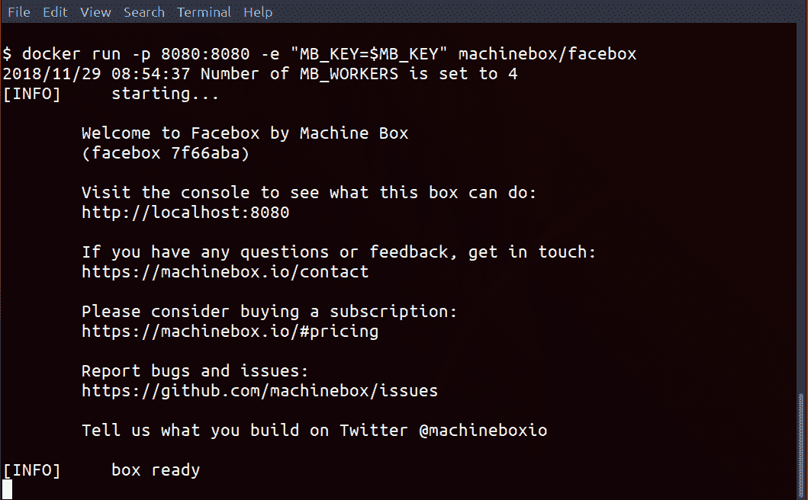
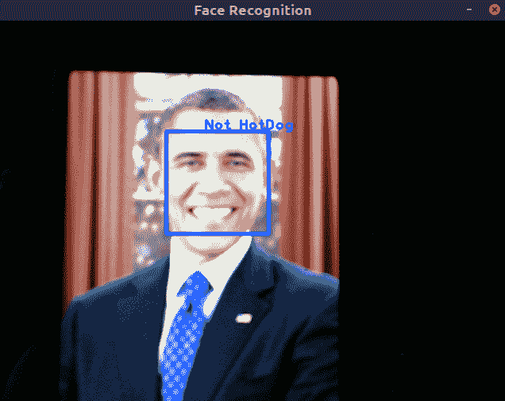
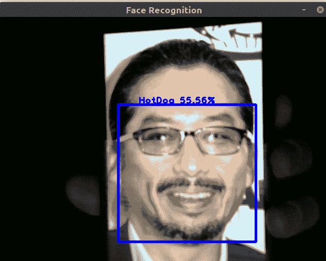
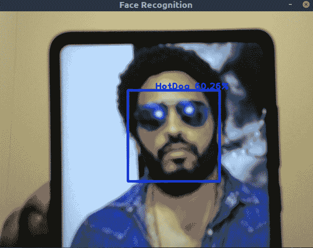

# 热狗还是不是热狗 - 使用外部服务

在之前的章节中，我强调了理解算法背后的数学的重要性。这里是一个回顾。我们从线性回归开始，然后是朴素贝叶斯分类器。然后，话题转向数据科学中更复杂的话题之一：时间序列。然后，我们偏离了主题，讨论了 K-means 聚类。这之后是关于神经网络的两个章节。在这些章节中，我解释了这些算法背后的数学，并展示了令人惊讶的是，生成的程序既短又简单。

这本书的目的是在数学和实现之间走一条微妙的路线。我希望我已经提供了足够的信息，以便你理解数学及其可能的有用之处。项目是真实的项目，但通常它们以各种形式存在，简化且相当学术。因此，本章不会包含很多数学解释可能会让你感到有些意外。相反，本章旨在引导读者通过更多现实世界的场景。

在上一章中，我们讨论了人脸检测。给定一张图片，我们想要找到人脸。但他们是谁呢？为了知道这些人脸属于谁，我们需要进行人脸识别。

# MachineBox

如前所述，我们不会关注人脸检测背后发生的数学运算。相反，我们将使用外部服务来为我们执行识别任务。这个外部服务是 MachineBox。它所做的事情相当聪明。你不需要编写自己的深度学习算法，MachineBox 将常用的深度学习功能打包成容器，你只需直接使用它们即可。我所说的常用深度学习功能是指什么？如今，人们越来越依赖深度学习来完成诸如人脸识别等任务。

就像 2000 年代初的 Viola-Jones 一样，只有少数常用的模型——我们使用了 Rainer Lienhart 在 2002 年生成的 Haar-like 级联模型。同样的情况也正在深度学习模型中发生，我将在下一章中更多地讨论这一点。所谓模型，是指深度学习网络的实际权重（对于更深入的介绍，请参阅第七章，*卷积神经网络 – MNIST 手写识别*，关于深度神经网络）。这些常用模型由 MachineBox 打包，你可以直接使用它们。

必须记住的一点是，MachineBox 是一项付费服务。他们确实提供免费层，这对于本章的需求是足够的。我与 MachineBox 没有任何关联。我只是认为他们是一家很酷的公司，他们所做的工作值得认可。此外，他们不做一些可疑的事情，比如秘密扣费你的信用卡，所以这也是我加分的地方。

# 什么是 MachineBox？

MachineBox 首先是一个服务。机器学习算法被包装成云服务。此外，由于 MachineBox 关注开发者体验，他们为你提供了 SDK 和本地实例，以便你进行开发。这以容器的形式出现。设置 Docker，运行 MachineBox 网站上的命令，你就完成了！

在这个项目中，我们希望使用面部识别系统来识别面部。MachineBox 提供了一个名为 facebox 的服务。

# 注册和登录

首先，我们需要登录 MachineBox。访问[`machinebox.io`](https://machinebox.io)并点击注册。方便的是，登录页面也是一样的。MachineBox 会随后给你发送一个链接。点击链接应该会带你到这个页面：


点击**显示你的密钥**。复制密钥。如果你使用的是基于 UNIX 的操作系统，例如 Linux 或 MacOS，在你的终端中运行以下命令：

```py
export MB_KEY="YOUR KEY HERE"
```

或者，如果你想持久化这个环境变量，只需编辑你的终端配置文件（我在 Linux 和 MacOS 上使用 bash，所以我编辑的文件是`.bash_profile`或`.bashrc`，具体取决于我使用的操作系统）。

在 Windows 中：

1.  前往**系统** | **控制面板**

1.  点击**高级系统设置**

1.  点击**环境变量**

1.  在**系统变量**部分，点击**新建**

1.  将`MB_KEY`作为密钥，变量就是密钥。

MachineBox 依赖于另一项基于 Go 语言构建的技术：Docker。大多数现代软件开发者已经在他们的机器上安装了 Docker。如果你还没有安装，可以通过访问[`docs.docker.com/install/`](https://docs.docker.com/install/)并安装 Docker 社区版来安装 Docker。

# Docker 安装和设置

一切都准备好了，我们可以使用以下命令来启动 MachineBox：

```py
 docker run -p 8080:8080 -e "MB_KEY=$MB_KEY" machinebox/facebox
```



# 在 Go 中使用 MachineBox

要与 MachineBox 交互，只需访问`http://localhost:8080`。在那里，你会看到箱子上的一组选项。但我们的目标是程序化地与服务交互。为此，MachineBox 提供了一个 SDK。要安装它，运行`go get github.com/machinebox/sdk-go/facebox`。这将为我们安装 SDK 以与 facebox 交互。

# 项目

这是本书的最后一个项目。所以，为了有点乐趣，让我们基于上一章的项目进行构建，但给它一个转折。有一个亚洲说唱歌手叫**MC Hot Dog**。所以让我们构建一个面部识别系统来判定一个脸是不是 HotDog。

我们想要做的是从网络摄像头读取一张图片，并使用 MachineBox 来确定图片中是否有 MC Hot Dog。我们再次将使用 GoCV 从网络摄像头读取图片，但这次，图片将被发送到 MachineBox 进行分类。

# 训练

MachineBox 是一个机器学习即服务系统。它可能在某个后端有一个通用模型——比如说，一个经过许多面孔训练的卷积神经网络，这样它就知道什么是面孔。它不提供你可能需要的特定模型。因此，我们需要通过提供训练数据来微调 MachineBox 提供的模型。按照 MachineBox 的术语，这被称为**教学**。作为好奇心收集的一部分，我已经收集了一些适合教学 MachineBox 识别 MC Hot Dog 外观的小但可用的图像。

对于这个项目，图像存储在`hotdog.zip`文件中。将文件解压到名为`HotDog`的文件夹中。这个文件夹应该与这个项目的`main.go`文件处于同一级别。

使用提供的 SDK，训练 MachineBox 模型很简单。以下代码展示了程序：

```py
 import "github.com/machinebox/sdk-go/facebox"

 func train(box *facebox.Client) error {
     files, err := filepath.Glob("HotDog/*")
     if err != nil {
          return err
     }
     for _, filename := range files {
         f , err := os.Open(filename)
         if err != nil {
             return err
         }

         if err := box.Teach(f, filename, "HotDog"); err != nil {
             return err
         }
         if err := f.Close(); err != nil {
             return err
         }
     }
     return nil
 }

 func main(){
     box := facebox.New("http://localhost:8080")
     if err := train(box); err !=nil {
         log.Fatal(err)
     }
 }
```

由此，你就有了一个完整的教程，介绍了如何教会 MachineBox 如何识别 MC Hot Dog。MachineBox 使这个过程变得简单——简单到你不需要了解深度学习系统背后的数学知识。

# 从 Web 摄像头读取

到目前为止，我希望你已经阅读了上一章，并且安装了 GoCV。如果你还没有，那么请阅读上一章中的*GoCV*部分以开始。

要从 Web 摄像头读取，我们只需将以下几行添加到主文件中。你可能认识它们作为上一章的片段：

```py
     // open webcam
     webcam, err := gocv.VideoCaptureDevice(0)
     if err != nil {
         log.Fatal(err)
     }
     defer webcam.Close()

     // prepare image matrix
     img := gocv.NewMat()
     defer img.Close()

     if ok := webcam.Read(&img); !ok {
         log.Fatal("Failed to read image")
     }
```

当然，令人困惑的部分是如何将`img`传递给 MachineBox，其中`img`是`gocv.Mat`类型。MachineBox 客户端存在一个`Check`方法，它接受`io.Reader`。`img`有一个`ToBytes`方法，它返回一个字节数组；结合`bytes.NewReader`，应该能够轻松地将`io.Reader`传递给`Check`。

但如果你尝试这样做，它不会工作。

原因如下：MachineBox 期望输入的格式为 JPEG 或 PNG。如果不是，你将收到一个 400 Bad Request 错误。格式不佳的图片也会导致这类问题，这就是为什么在上一行中`box.Teach()`返回的错误被故意未处理的。在实际应用中，人们可能真的想检查是否返回了一个 400 Bad Request 错误。

`img`中的图像原始字节数据不是以已知图像格式编码的。相反，我们必须将`img`中的图像编码为 JPEG 或 PNG，然后按照以下方式传递给 MachineBox：

```py
     var buf bytes.Buffer
     prop, _ := img.ToImage()
     if err = jpeg.Encode(&buf, prop, nil); err != nil {
         log.Fatal("Failed to encode image as JPG %v", err)
     }

     faces, err := box.Check(&buf)
     fmt.Printf("Error: %v\n", err)
     fmt.Printf("%#v", faces)
```

在这里，我们利用了`*bytes.Buffer`既作为`io.Reader`也作为`io.Writer`的事实。这样，我们就不需要直接写入文件——相反，所有内容都保持在内存中。

# 美化结果

程序打印结果。看起来如下：

```py
 Error: <nil>
 []facebox.Face{facebox.Face{Rect:facebox.Rect{Top:221, Left:303, Width:75, Height:75}, ID:"", Name:"", Matched:false, Confidence:0, Faceprint:""}}
```

这是在终端输出上打印的一个相当无聊的结果。我们现在生活在图形用户界面（GUIs）的时代！所以让我们绘制我们的结果。

因此，我们希望窗口显示摄像头所显示的内容。然后，当按下键时，图像被捕获，并由 MachineBox 进行处理。如果发现人脸，则应在其周围绘制一个矩形。如果人脸被识别为 MC Hot Dog，则标签为`HotDog`，并跟随着置信度。否则，该框应标记为`Not HotDog`。这段代码看起来有点复杂：

```py
     // open webcam
     webcam, err := gocv.VideoCaptureDevice(0)
     if err != nil {
         log.Fatal(err)
     }
     defer webcam.Close()

     // prepare image matrix
     img := gocv.NewMat()
     defer img.Close()

     // open display window
     window := gocv.NewWindow("Face Recognition")
     defer window.Close()

     var recognized bool
     for {
         if !recognized {
             if ok := webcam.Read(&img); !ok {
                 log.Fatal("Failed to read image")
             }
         }

         window.IMShow(img)
         if window.WaitKey(1) >= 0 {
             if !recognized {
                 recognize(&img, box)
                 recognized = true
                 continue
             } else {
                 break
             }
         }
     }
```

但如果我们将其分解，我们可以看到主函数中的代码可以分为两部分。第一部分处理打开摄像头并创建一个窗口来显示图像。关于这一点的更完整说明可以在前面的章节中找到。

特别是，让我们将注意力转向无限循环：

```py
     for {
         if !recognized {
             if ok := webcam.Read(&img); !ok {
                 log.Fatal("Failed to read image")
             }
         }

         window.IMShow(img)
         if window.WaitKey(1) >= 0 {
             if !recognized {
                 recognize(&img, box)
                 recognized = true
             } else {
                 break
             }
         }
     }
```

这句话的意思很简单：首先检查识别过程是否已完成。如果没有，从摄像头获取图像，然后使用`window.IMShow(img)`显示图像。这构成了主循环——摄像头将连续捕获图像，然后立即在窗口中显示它。

但当按下键时会发生什么？接下来的代码块指示等待 1 毫秒的键盘事件。如果有事件，任何事件都可以，我们检查图像是否之前已被识别。如果没有，调用`recognize`，传入从矩阵捕获的图像和 MachineBox 客户端。然后我们将`recognized`标志设置为 true。因此，在下次按键时，我们将退出程序。

`recognize`是绘制的主要内容所在。如果你已经阅读了前面的章节，这应该对你来说已经很熟悉了。否则，这里是如何看起来`recognize`：

```py

 var blue = color.RGBA{0, 0, 255, 0}

 func recognize(img *gocv.Mat, box *facebox.Client) (err error) {
     var buf bytes.Buffer
     prop, _ := img.ToImage()
     if err = jpeg.Encode(&buf, prop, nil); err != nil {
         log.Fatal("Failed to encode image as JPG %v", err)
     }

     // rd := bytes.NewReader(prop.(*image.RGBA).Pix)
     faces, err := box.Check(&buf)
     // fmt.Println(err)
     // fmt.Printf("%#v\n", faces)

     for _, face := range faces {
         // draw a rectangle
         r := rect2rect(face.Rect)
         gocv.Rectangle(img, r, blue, 3)

         lbl := "Not HotDog"
         if face.Matched {
             lbl = fmt.Sprintf("%v %1.2f%%", face.Name, face.Confidence*100)
         }
         size := gocv.GetTextSize(lbl, gocv.FontHersheyPlain, 1.2, 2)
         pt := image.Pt(r.Min.X+(r.Min.X/2)-(size.X/2), r.Min.Y-2)
         gocv.PutText(img, lbl, pt, gocv.FontHersheyPlain, 1.2, blue, 2)
     }
     return nil
 }
```

在这里，我们看到用于首先将图像编码为 JPEG，然后将其发送到 MachineBox 客户端进行分类的熟悉代码。然后，对于每个找到的人脸，我们围绕它绘制一个蓝色矩形。`facebox.Face`定义如下：

```py
 type Face struct {
     Rect       Rect
     ID         string
     Name       string
     Matched    bool
     Confidence float64
     Faceprint  string
 }
```

`facebox.Face`允许我们识别人脸，如果它们匹配，以及置信度水平。所以如果找到一个`face`，这些字段将可供程序员访问。

但首先，我们必须解决矩形的问题。MachineBox 不使用与标准库中`image.Rectangle`相同的矩形定义。

因此，需要一个辅助函数将`facebox.Rect`转换为`image.Rectangle`：

```py
 func rect2rect(a facebox.Rect) image.Rectangle {
     return image.Rect(a.Left, a.Top, a.Left+a.Width, a.Top+a.Height)
 }
```

定义矩形的只有几种方法。在这两种不同类型之间的转换是微不足道的。

在绘制矩形之后，写入一个标签。如果人脸被识别为 MC Hot Dog，我们将将其标记为`HotDog`。MachineBox 还提供了一个置信度分数，这是一个介于 0 和 1 之间的数字，表示人脸是`HotDog`还是`Not HotDog`。因此，我们也将这个分数绘制到标签中。

# 结果

你可能对结果很好奇。以下是一些结果：我的脸被以 57%的置信度分类为 HotDog。实际上，使用我的手机和几张其他人的照片，我发现有些人比其他人更像 HotDog，如下面的图片所示：





# 这本书没有涵盖什么？

在 Go 中，我们可以探索许多事情。以下是一些你可能想要探索的非详尽列表：

+   随机树和随机森林

+   支持向量机

+   梯度提升方法

+   最大熵方法

+   图形方法

+   局部异常因子

如果这本书有第二版，我可能会涵盖它们。如果你熟悉机器学习方法，你可能会注意到，这些方法，尤其是前三种，可能是与这本书中写的内容相比性能最高的机器学习方法之一。你可能会想知道为什么它们没有被包括在内。这些方法所属的思想流派可能提供一些线索。

例如，随机树和随机森林可以被认为是伪符号主义——它们是符号主义思想的一个远亲，起源于决策树。支持向量机是类比器。最大熵和图形方法属于贝叶斯学派。

这本书偏向于连接主义思想，有很好的理由：深度学习现在很流行。如果风向不同，这本书会有很大的不同。还有可解释性的问题。我可以很好地解释支持向量机，但这将包括页面的数学类比。另一方面，选择不解释 SVMs 的工作原理，会导致一个非常薄的章节——SVMs 的标准实现是使用 libsvm 或 svmlight。只需调用库提供的函数，工作就完成了！因此，对 SVMs 的解释是必要的。

# 这一切意味着什么？

这是否意味着 MachineBox 的算法不好？简短的回答是不：我们不能说 MachineBox 算法不好。更长的回答需要更细腻的理解，这需要结合工程理解和机器学习的理解。至于 facebox 的算法，关于 facebox 由什么组成，没有确切细节。但我们可以推断出发生了什么。

首先，请注意，具有匹配的图像的置信度都在 50%以上。然后我们可以假设，如果置信度水平大于 50%，facebox 才会认为找到了匹配。我通过在一个包含 1000 多张人脸图片的目录上运行识别器来验证了这一点。只有匹配的图片才有超过 50%的置信度。程序如下：

```py
 func testFacebox() error {
     files, err := filepath.Glob("OtherFaces/*")
     if err != nil {
          return err
     }
     var count, lt50 int
     for _, filename := range files {
         f , err := os.Open(filename)
         if err != nil {
             return err
         }
         faces, err := box.Check(f)
         if err != nill {
             return err
         }
         for _, face := range faces {
             if face.Matched && face.Confidence < 0.5 {
                 lt50++
             }
         }
         if err := f.Close(); err != nil {
             return err
         }
         count++
     }
     fmt.Printf("%d/%d has Matched HotDog but Confidence < 0.5\n", lt50, count)
     return nil
 }
```

在这种情况下，这也意味着我们无法直接使用`facebox`的`.Matched`字段作为真实值，除非是非常基础的使用场景。相反，我们必须考虑返回结果的可信度。

例如，我们可以将匹配的阈值设置得更高，以便被认为是 HotDog。将其设置为 0.8 表明只有 MC Hot Dog 的图像被识别为 HotDog。

在这里学到的教训是，由其他人创建的 API 需要一些理解。本章提供的代码非常简短。这是 MachineBox 对开发者友好性的证明。但这并不能免除开发者至少对事物有最基本的了解。

# 为什么选择 MachineBox？

我个人更喜欢开发自己的机器学习解决方案。当然，有人可能会把这归因于自负。然而，在第一章中，我介绍了不同类型问题的概念。其中一些问题可能可以通过机器学习算法来解决。有些问题可能只需要通用的机器学习算法，而有些则需要从通用算法派生出的专用算法。在这本书的大部分内容中，我展示了通用算法，读者可以自由地将这些算法应用到他们自己的具体问题上。

我也认识到，将通用机器学习算法作为解决方案的一部分是有价值的。想象一下，你正在开发一个程序来重新组织你电脑上的个人照片。没有必要花费大量时间在一个包含面部语料库的卷积神经网络上进行训练。主要任务是组织照片，而不是人脸识别！相反，可以使用已经训练好的模型。这类现成的解决方案适合那些现成解决方案只是其中一小部分的问题。对这类解决方案的需求日益增长。

因此，现在许多机器学习算法都作为服务提供。亚马逊网络服务有自己的产品，谷歌云和微软 Azure 也是如此。为什么我没有选择在本章介绍它们？关于我，你应该知道的另一件事是：我喜欢离线工作。我发现工作时连接到互联网只会分散我的注意力——Slack 消息、电子邮件和各种其他网站争夺我有限的注意力。不，我更喜欢离线工作和思考。

云服务公司确实提供机器学习作为服务，并且它们都要求有互联网接入。MachineBox 值得称赞的是，它提供了一个 Docker 镜像。只需要执行一次 Docker pull 操作。下载文件需要一次性的互联网连接。但一旦完成，整个工作流程就可以离线开发——或者，正如本章所有代码的情况，在飞机上开发。

这是 MachineBox 的主要优势：你不需要依赖一个要求始终连接到其云服务的公司实体。但当然，这还不是全部。MachineBox 因其对开发者的友好而闻名。我能够在飞行中编写本章大部分代码的事实就是对他们开发者友好性的证明。公平地说，即使作为一个经验丰富的机器学习库作者，人脸识别仍然相当神奇。

# 摘要

在结束之前，公正地说，MachineBox 对于其免费层确实存在一些限制；但根据我的经验，在个人项目中，你不太会遇到这些问题。尽管我对现有的各种机器学习即服务系统持有个人保留意见，但我确实认为它们提供了价值。我时不时地使用过它们，但通常我不需要它们。尽管如此，我强烈建议读者去了解一下。

本章与上一章结合，展示了机器学习在行业中的广泛性。如果你的主要问题不需要，并非所有机器学习算法都必须从头开始手写。我很幸运，能够从事我热爱的工作：构建定制的机器学习算法。这可能会影响我对这个问题的看法。你可能是一名工程师，需要在截止日期前解决一些更大的商业问题。为此，这两章是为你准备的。

下一章将列出 Go 中机器学习的更多途径。
