# 第一章：图形入门

图是用于描述实体之间关系的数学结构，几乎无处不在都被使用。例如，社交网络是图，用户根据是否一个用户"*关注*"另一个用户的更新而相互连接。它们可以用来表示地图，城市通过街道相互连接。图可以描述生物结构、网页，甚至神经退行性疾病的进展。

**图论**，对图的研究，多年来一直受到广泛关注，促使人们开发算法、识别属性和定义数学模型，以更好地理解复杂行为。

本章将回顾图形结构数据背后的某些概念。将介绍理论概念，并辅以示例，帮助您理解一些更普遍的概念并将它们付诸实践。在本章中，我们将介绍并使用一些最广泛使用的库来创建、操作和研究复杂网络的结构动态和功能，特别是关注 Python 的`networkx`库。

本章将涵盖以下主题：

+   使用`networkx`介绍图

+   绘制图

+   图的性质

+   基准和仓库

+   处理大型图

# 技术要求

我们将使用带有*Python 3.8*的 Jupyter Notebooks 进行所有练习。在以下代码片段中，我们展示了使用`pip`为本章安装的 Python 库列表（例如，在命令行中运行`pip install networkx==2.5`，等等）：

```py
Jupyter==1.0.0
networkx==2.5
snap-stanford==5.0.0
matplotlib==3.2.2
pandas==1.1.3
scipy==1.6.2
```

在本书中，以下 Python 命令将被提及：

+   `import networkx as nx`

+   `import pandas as pd`

+   `import numpy as np`

对于更复杂的数据可视化任务，还需要 Gephi ([`gephi.org/`](https://gephi.org/))。安装手册在此处可用：[`gephi.org/users/install/`](https://gephi.org/users/install/)。所有与本章节相关的代码文件均可在[`github.com/PacktPublishing/Graph-Machine-Learning/tree/main/Chapter01`](https://github.com/PacktPublishing/Graph-Machine-Learning/tree/main/Chapter01)找到。

# 使用`networkx`介绍图

在本节中，我们将对图论进行一般介绍。此外，为了将理论概念与其实际应用相结合，我们将通过 Python 代码片段丰富我们的解释，使用`networkx`。

**简单无向图**（或简称图）*G*被定义为对*G=(V,E)*的二元组，其中*V={*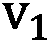*, ..,* *}*是一个节点集合（也称为**顶点**），而*E={{**,*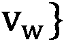 *.., {**,**}}*是边的两元素集合（也称为**链接**）的集合，表示属于*V*的两个节点之间的连接。

需要强调的是，由于 *E* 的每个元素都是一个两集合，因此每条边之间没有顺序。为了提供更多细节，*{**,* 和 *{**,*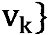 代表同一条边。

我们现在提供一些基本图和节点属性的定义，如下所示：

+   图的**阶**是其顶点的数量 *|V|*。图的**大小**是其边的数量 *|E|*。

+   顶点的**度**是与它相邻的边的数量。图 *G* 中顶点 *v* 的**邻居**是由所有与 *v* 相邻的顶点诱导的顶点子集 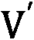。

+   图中顶点 *v* 的**邻域图**（也称为自我图）是 *G* 的一个子图，由与 *v* 相邻的顶点和连接这些顶点的所有边组成。

图的示例可以在以下屏幕截图中看到：

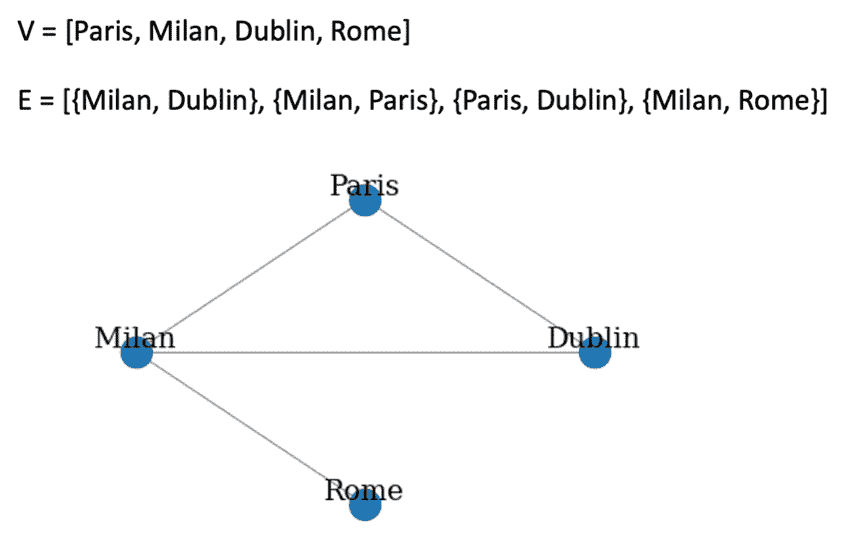

图 1.1 – 图的示例

根据这种表示，由于没有方向，从 `4`（总共有四个顶点和四个边）。到 `2`、`3` 和 `1`。每个节点的邻居如下所示：

+   `Paris` = {`Milan`, `Dublin`}

+   `Milan` = {`Paris`, `Dublin`, `Rome`} 

+   `Dublin` = {`Paris`, `Milan`} 

+   `Rome` = {`Milan`} 

同样的图可以用 `networkx` 表示，如下所示：

```py
import networkx as nx
G = nx.Graph()
V = {'Dublin', 'Paris', 'Milan', 'Rome'}
E = [('Milan','Dublin'), ('Milan','Paris'), ('Paris','Dublin'), ('Milan','Rome')]
G.add_nodes_from(V)
G.add_edges_from(E)
```

由于默认情况下，`nx.Graph()` 命令生成一个无向图，我们不需要指定每条边的两个方向。在 `networkx` 中，节点可以是任何可哈希的对象：字符串、类，甚至是其他 `networkx` 图。现在让我们计算之前生成的图的某些属性。

可以通过运行以下代码来获取图的所有节点和边：

```py
print(f"V = {G.nodes}")
print(f"E = {G.edges}")
```

这是前面命令的输出：

```py
V = ['Rome', 'Dublin', 'Milan', 'Paris']
E = [('Rome', 'Milan'), ('Dublin', 'Milan'), ('Dublin', 'Paris'), ('Milan', 'Paris')]
```

我们还可以使用以下命令计算图阶、图大小以及每个节点的度数和邻居： 

```py
print(f"Graph Order: {G.number_of_nodes()}")
print(f"Graph Size: {G.number_of_edges()}")
print(f"Degree for nodes: { {v: G.degree(v) for v in G.nodes} }")
print(f"Neighbors for nodes: { {v: list(G.neighbors(v)) for v in G.nodes} }") 
```

结果如下：

```py
Graph Order: 4
Graph Size: 4
Degree for nodes: {'Rome': 1, 'Paris': 2, 'Dublin':2, 'Milan': 3}
Neighbors for nodes: {'Rome': ['Milan'], 'Paris': ['Milan', 'Dublin'], 'Dublin': ['Milan', 'Paris'], 'Milan': ['Dublin', 'Paris', 'Rome']}
```

最后，我们还可以计算图 `G` 中特定节点的自我图，如下所示：

```py
ego_graph_milan = nx.ego_graph(G, "Milan")
print(f"Nodes: {ego_graph_milan.nodes}")
print(f"Edges: {ego_graph_milan.edges}")
```

结果将是以下内容：

```py
Nodes: ['Paris', 'Milan', 'Dublin', 'Rome']
Edges: [('Paris', 'Milan'), ('Paris', 'Dublin'), ('Milan', 'Dublin'), ('Milan', 'Rome')]
```

可以通过添加新的节点和/或边来修改原始图，如下所示：

```py
#Add new nodes and edges
new_nodes = {'London', 'Madrid'}
new_edges = [('London','Rome'), ('Madrid','Paris')]
G.add_nodes_from(new_nodes)
G.add_edges_from(new_edges)
print(f"V = {G.nodes}")
print(f"E = {G.edges}")
```

这将输出以下行：

```py
V = ['Rome', 'Dublin', 'Milan', 'Paris', 'London', 'Madrid']
E = [('Rome', 'Milan'), ('Rome', 'London'), ('Dublin', 'Milan'), ('Dublin', 'Paris'), ('Milan', 'Paris'), ('Paris', 'Madrid')]
```

可以通过运行以下代码来删除节点：

```py
node_remove = {'London', 'Madrid'}
G.remove_nodes_from(node_remove)
print(f"V = {G.nodes}")
print(f"E = {G.edges}")
```

这是前面命令的结果：

```py
V = ['Rome', 'Dublin', 'Milan', 'Paris']
E = [('Rome', 'Milan'), ('Dublin', 'Milan'), ('Dublin', 'Paris'), ('Milan', 'Paris')]
```

如预期，所有包含已删除节点的边都会自动从边列表中删除。

此外，可以通过运行以下代码来删除边：

```py
node_edges = [('Milan','Dublin'), ('Milan','Paris')]
G.remove_edges_from(node_edges)
print(f"V = {G.nodes}")
print(f"E = {G.edges}")
```

最终结果如下：

```py
V = ['Dublin', 'Paris', 'Milan', 'Rome']
E = [('Dublin', 'Paris'), ('Milan', 'Rome')]
```

`networkx` 库还允许我们使用以下命令从图 `G` 中删除单个节点或单个边：`G.remove_node('Dublin')` 和 `G.remove_edge('Dublin', 'Paris')`。

## 图的类型

在上一节中，我们描述了如何创建和修改简单的无向图。在这里，我们将展示如何通过引入 **有向图**（**有向图**）、加权图和多重图来扩展这种基本数据结构，以封装更多信息。

### 有向图

有向图 *G* 定义为一个对 *G=(V, E)*，其中 *V={**, ..,* *}* 是节点集合，*E={(**,* *.., (**,**)}* 是表示属于 *V* 的两个节点之间连接的有序对集合。

由于 *E* 的每个元素都是一个有序对，它强制了连接的方向。边 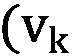*,* 表示 *节点*  *进入* 。这与 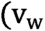*,*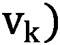 不同，因为它表示 *节点*  *到达* 。起始节点  被称为 *头节点*，而结束节点被称为 *尾节点*。

由于存在边方向，节点度数的定义需要扩展。

入度和出度

对于一个顶点 *v*，与 *v* 相邻的头节点数量称为 **入度**（用 *v* 的 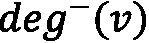 表示），而与 *v* 相邻的尾节点数量称为其 **出度**（用  表示）。

以下截图展示了有向图的一个示例：

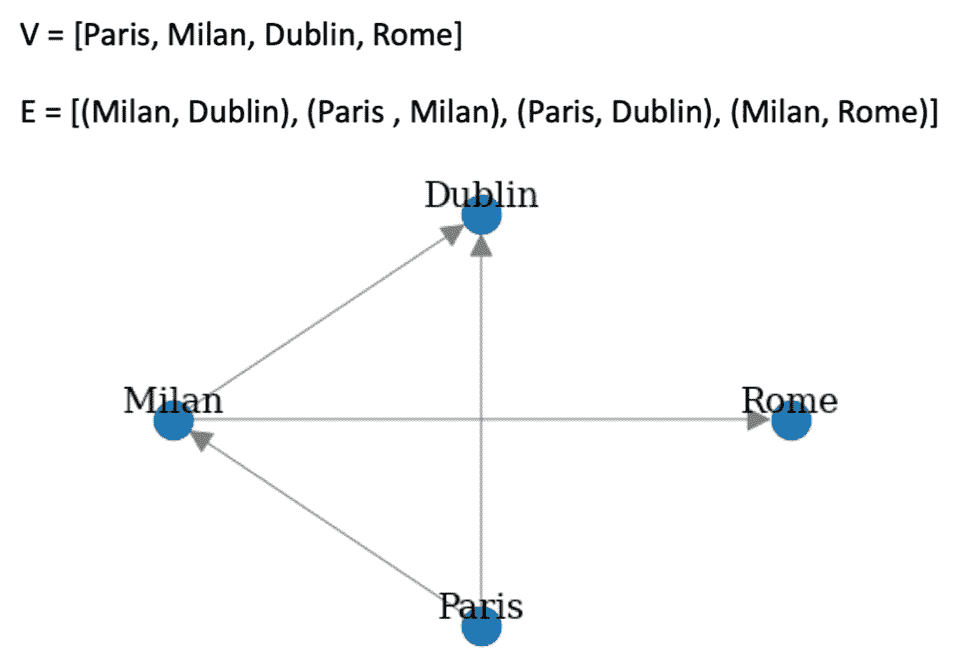

图 1.2 – 有向图的示例

边的方向从箭头中可见——例如，**米兰** -> **都柏林**表示从 **米兰** 到 **都柏林**。**都柏林**有 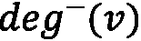 *= 2* 和 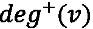 *= 0*，**巴黎**有 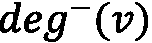 *= 0* 和  *= 2*，**米兰**有 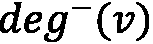 *= 1* 和 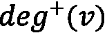 *= 2*，而 **罗马**有 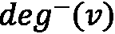 *= 1* 和 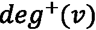 *= 0*。

同一个图可以用 `networkx` 表示，如下所示：

```py
G = nx.DiGraph()
V = {'Dublin', 'Paris', 'Milan', 'Rome'}
E = [('Milan','Dublin'), ('Paris','Milan'), ('Paris','Dublin'), ('Milan','Rome')]
G.add_nodes_from(V)
G.add_edges_from(E)
```

定义与用于简单无向图的定义相同；唯一的区别在于用于实例化对象的 `networkx` 类。对于有向图，使用 `nx.DiGraph()` 类。

可以使用以下命令计算 **入度** 和 **出度**：

```py
print(f"Indegree for nodes: { {v: G.in_degree(v) for v in G.nodes} }")
print(f"Outdegree for nodes: { {v: G.out_degree(v) for v in G.nodes} }")
```

结果将如下所示：

```py
Indegree for nodes: {'Rome': 1, 'Paris': 0, 'Dublin': 2, 'Milan': 1}
Outdegree for nodes: {'Rome': 0, 'Paris': 2, 'Dublin': 0, 'Milan': 2}
```

对于无向图，可以使用 `G.add_nodes_from()`、`G.add_edges_from()`、`G.remove_nodes_from()` 和 `G.remove_edges_from()` 函数来修改给定的图 `G`。

### 多重图

现在我们将介绍多重图对象，它是图定义的推广，允许有多个边具有相同的起始和结束节点对。

**多重图 G** 定义为 *G=(V, E)* ，其中 *V* 是节点集，*E* 是边的多重集（允许其元素有多个实例的集合）。

如果 *E* 是有序对的有序多重集，则多重图被称为**有向多重图**；否则，如果 *E* 是两个集合的有序多重集，则称为**无向多重图**。

以下截图展示了有向多重图的示例：

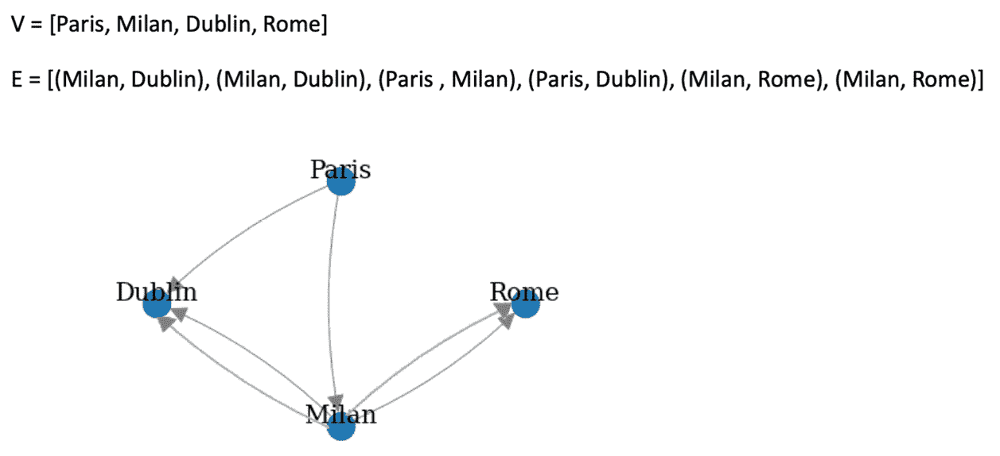

图 1.3 – 多重图的示例

在以下代码片段中，我们展示了如何使用`networkx`来创建有向或无向多重图：

```py
directed_multi_graph = nx.MultiDiGraph()
undirected_multi_graph = nx.MultiGraph()
V = {'Dublin', 'Paris', 'Milan', 'Rome'}
E = [('Milan','Dublin'), ('Milan','Dublin'), ('Paris','Milan'), ('Paris','Dublin'), ('Milan','Rome'), ('Milan','Rome')]
directed_multi_graph.add_nodes_from(V)
undirected_multi_graph.add_nodes_from(V)
directed_multi_graph.add_edges_from(E)
undirected_multi_graph.add_edges_from(E)
```

有向多重图和无向多重图之间的唯一区别在于前两行，其中创建了两个不同的对象：使用`nx.MultiDiGraph()`创建有向多重图，而使用`nx.MultiGraph()`构建无向多重图。添加节点和边所使用的函数对这两个对象都是相同的。

### 加权图

现在我们将介绍有向、无向和多权重图。

**边加权图**（或简称为加权图） *G* 定义为 *G=(V, E ,w)* ，其中 *V* 是节点集，*E* 是边集，而  是将权重函数分配给每个边  的权重，该权重以实数表示。

**节点加权图** *G* 定义为 *G=*(*V, E ,w*) ，其中 *V* 是节点集，*E* 是边集，而  是将权重函数分配给每个节点  的权重，该权重以实数表示。

请注意以下要点：

+   如果 *E* 是有序对的集合，则我们称之为**有向加权图**。

+   如果 *E* 是两个集合的集合，则我们称之为**无向加权图**。

+   如果 *E* 是多重集，我们将称之为**加权多重图**（**有向加权多重图**）。

+   如果*E*是有序对的有序多重集，则它是一个**无向加权多重图**。

以下截图展示了有向边加权图的示例：

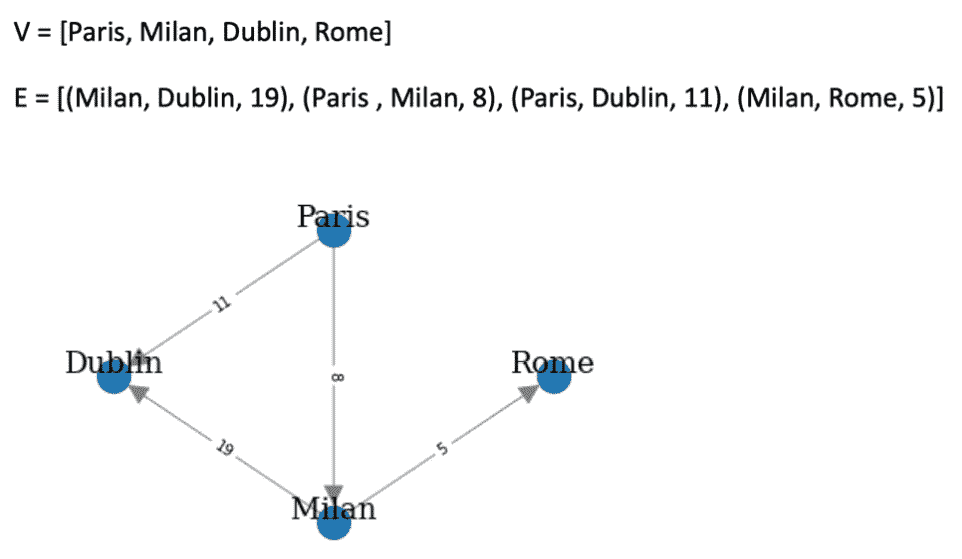

图 1.4 – 有向边加权图的示例

从 *图 1.4* 中，很容易看出图上权重的存在如何有助于向数据结构添加有用的信息。确实，我们可以将边权重想象为从一个节点到达另一个节点的“成本”。例如，到达`19`，而到达`11`。

在`networkx`中，可以通过以下方式生成有向加权图：

```py
G = nx.DiGraph()
V = {'Dublin', 'Paris', 'Milan', 'Rome'}
E = [('Milan','Dublin', 19), ('Paris','Milan', 8), ('Paris','Dublin', 11), ('Milan','Rome', 5)]
G.add_nodes_from(V)
G.add_weighted_edges_from(E)
```

### 二部图

我们现在将介绍本节中将使用的一种图形类型：多部分图。二部分图和三分图——以及更一般地，第 k 部分图——是顶点可以被划分为两个、三个或更多 k 个节点集合的图的统称。边只允许在不同集合之间，不允许在同一集合内的节点之间。在大多数情况下，属于不同集合的节点也由特定的节点类型来表征。在*第七章，使用图形进行文本分析和自然语言处理*和*第八章*，*信用卡交易图分析*中，我们将处理一些基于图形应用的实际例子，你将看到多部分图确实可以在几个场景中产生——例如，在以下场景中：

+   当处理文档并将文档中出现的实体信息以二部分图的形式结构化时

+   当处理交易数据时，为了编码买家和商家之间的关系

在`networkx`中，可以使用以下代码轻松创建一个二部分图：

```py
import pandas as pd
import numpy as np
n_nodes = 10
n_edges = 12
bottom_nodes = [ith for ith in range(n_nodes) if ith % 2 ==0]
 top_nodes = [ith for ith in range(n_nodes) if ith % 2 ==1]
iter_edges = zip(
    np.random.choice(bottom_nodes, n_edges),  
    np.random.choice(top_nodes, n_edges))
edges = pd.DataFrame([
    {"source": a, "target": b} for a, b in iter_edges])
B = nx.Graph()
B.add_nodes_from(bottom_nodes, bipartite=0)
 B.add_nodes_from(top_nodes, bipartite=1)
 B.add_edges_from([tuple(x) for x in edges.values])
```

该网络也可以方便地使用`networkx`的`bipartite_layout`实用函数绘制，如下面的代码片段所示：

```py
from networkx.drawing.layout import bipartite_layout
pos = bipartite_layout(B, bottom_nodes)
 nx.draw_networkx(B, pos=pos)
```

`bipatite_layout`函数生成一个图，如下面的屏幕截图所示：

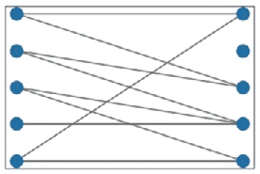

Figure 1.5 – 二部分图的示例

## 图表示

如前几节所述，使用`networkx`，我们实际上可以通过使用节点和边对象来定义和操作一个图。在不同的用例中，这种表示可能不太容易处理。在本节中，我们将展示两种执行图数据结构紧凑表示的方法——即邻接矩阵和边列表。

### 邻接矩阵

图 G=(V,E)的**邻接矩阵**M 是一个方阵(|V| × |V|)，其元素在节点 i 到节点 j 之间存在边时为 1，不存在边时为 0。在下面的屏幕截图中，我们展示了不同类型图的邻接矩阵的简单示例：

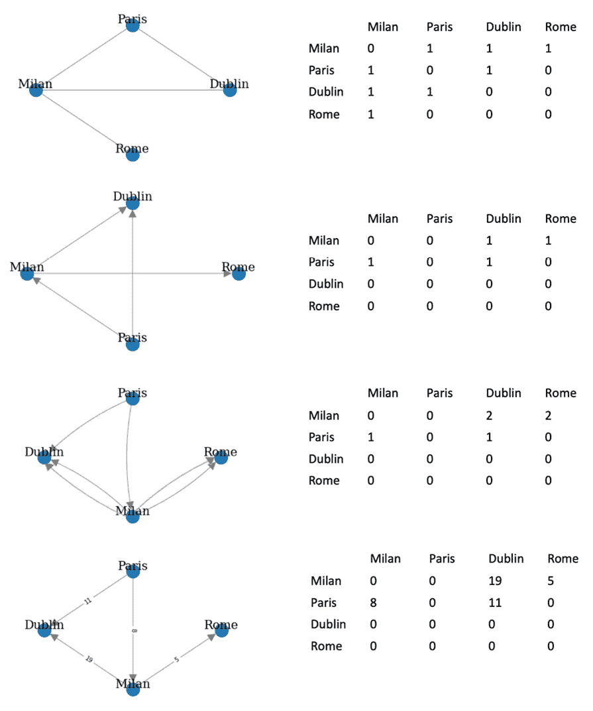

Figure 1.6 – 无向图、有向图、多重图和加权图的邻接矩阵

很容易看出，无向图的邻接矩阵总是对称的，因为边没有定义方向。由于边方向的约束存在，有向图的邻接矩阵的对称性不能保证。对于多重图，我们可以有大于 1 的值，因为可以使用多条边连接相同的节点对。对于加权图，特定单元格的值等于连接两个节点的边的权重。

在 `networkx` 中，给定图的邻接矩阵可以通过两种不同的方式计算。如果 `G` 是 *图 1.6* 中的 `networkx`，我们可以按照以下方式计算其邻接矩阵：

```py
nx.to_pandas_adjacency(G) #adjacency matrix as pd DataFrame
nt.to_numpy_matrix(G) #adjacency matrix as numpy matrix
```

对于第一行和第二行，我们分别得到以下结果：

```py
          Rome  Dublin  Milan  Paris
Rome     0.0     0.0    0.0    0.0
Dublin   0.0     0.0    0.0    0.0
Milan    1.0     1.0    0.0    0.0
Paris    0.0     1.0    1.0    0.0
[[0\. 0\. 0\. 0.]
 [0\. 0\. 0\. 0.]
 [1\. 1\. 0\. 0.]
 [0\. 1\. 1\. 0.]]
```

由于 `numpy` 矩阵不能表示节点的名称，邻接矩阵中元素的位置是 `G.nodes` 列表中定义的。

### 边列表

除了邻接矩阵之外，边列表也是表示图的一种紧凑方式。这种格式的思想是将图表示为边的列表。

图 *G=(V,E)* 的 **边列表** *L* 是一个大小为 *|E|* 的矩阵，其元素  是一个表示边 *i* 的尾节点和终节点的对。每种类型图的边列表的示例可以在以下屏幕截图找到：

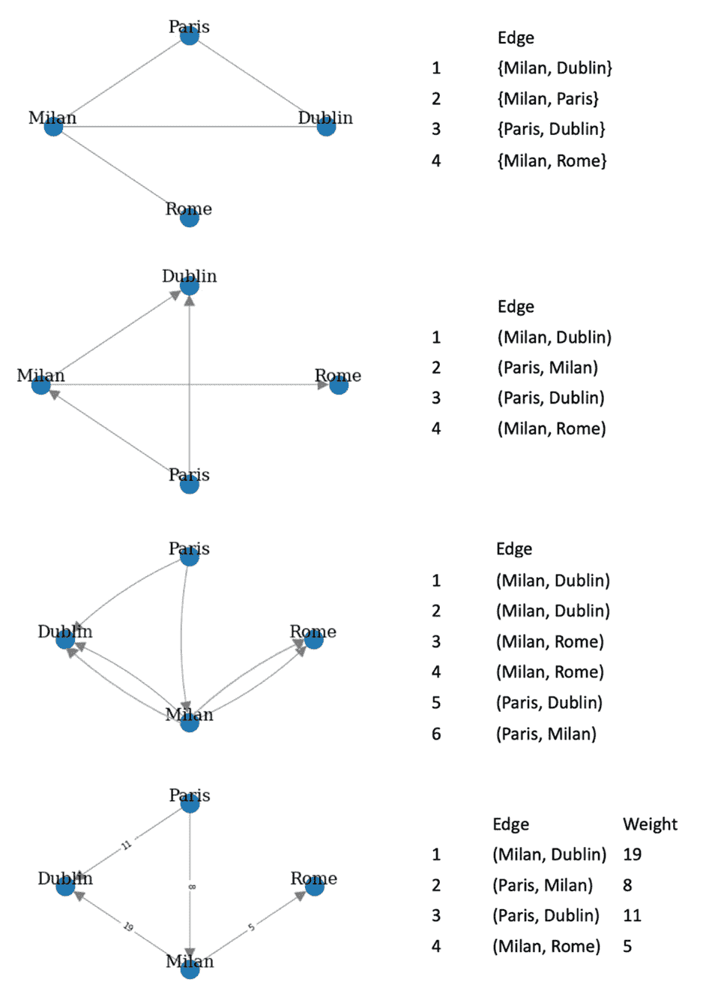

图 1.7 – 无向图、有向图、多重图和加权图的边列表

在以下代码片段中，我们展示了如何在 `networkx` 中计算 *图 1.7* 中可用的简单无向图 *G* 的边列表：

```py
print(nx.to_pandas_edgelist(G))
```

通过运行前面的命令，我们得到以下结果：

```py
  source  target
0  Milan  Dublin
1  Milan    Rome
2  Paris   Milan
3  Paris  Dublin
```

`networkx` 中还有其他一些我们不会详细讨论的表示方法。其中一些例子包括 `nx.to_dict_of_dicts(G)` 和 `nx.to_numpy_array(G)` 等。

# 绘制图形

正如我们在前面的章节中看到的，图是直观的图形数据结构。节点可以绘制为简单的圆圈，而边是连接两个节点的线条。

尽管它们很简单，但当边和节点的数量增加时，可能很难清楚地表示。这种复杂性的来源主要是与在最终绘图中将每个节点分配到位置（空间/笛卡尔坐标）有关。实际上，手动将数百个节点的特定位置分配到最终绘图可能是不可行的。

在本节中，我们将看到如何在不指定每个节点的坐标的情况下绘制图形。我们将利用两种不同的解决方案：`networkx` 和 Gephi。

## networkx

`networkx` 通过 `nx.draw` 库提供了一个简单的接口来绘制图形对象。在以下代码片段中，我们展示了如何使用该库来绘制图形：

```py
def draw_graph(G, nodes_position, weight):
      nx.draw(G, pos_ position, with_labels=True, font_size=15, node_size=400, edge_color='gray', arrowsize=30)
             if plot_weight:
             edge_labels=nx.get_edge_attributes(G,'weight')
         nx.draw_networkx_edge_labels(G, pos_ position, edge_labels=edge_labels)
```

在这里，`nodes_position` 是一个字典，其键是节点，分配给每个键的值是一个长度为 2 的数组，用于绘制特定节点的笛卡尔坐标。

`nx.draw` 函数将通过将节点放置在给定的位置来绘制整个图。`with_labels` 选项将在每个节点上方绘制其名称，并使用特定的 `font_size` 值。`node_size` 和 `edge_color` 分别指定表示节点的圆的大小和边的颜色。最后，`arrowsize` 将定义有向边的箭头大小。当要绘制的图是一个有向图时，将使用此选项。

在以下代码示例中，我们展示了如何使用之前定义的 `draw_graph` 函数来绘制一个图：

```py
G = nx.Graph()
V = {'Paris', 'Dublin','Milan', 'Rome'}
E = [('Paris','Dublin', 11), ('Paris','Milan', 8),
     ('Milan','Rome', 5), ('Milan','Dublin', 19)]
G.add_nodes_from(V)
G.add_weighted_edges_from(E)
node_position = {"Paris": [0,0], "Dublin": [0,1], "Milan": [1,0], "Rome": [1,1]}
draw_graph(G, node_position, True)
```

绘图的结果可在以下截图查看：

![Figure 1.8 – 绘图函数的结果]


Figure 1.8 – 绘图函数的结果

之前描述的方法简单，但在实际场景中不可行，因为 `node_position` 的值可能难以决定。为了解决这个问题，`networkx` 提供了一个不同的函数来自动根据不同的布局计算每个节点的位置。在 *图 1.9* 中，我们展示了一系列使用 `networkx` 中可用的不同布局得到的无向图绘制。为了在所提出的函数中使用它们，我们只需将 `node_position` 分配给我们要使用的布局的结果——例如，`node_position = nx.circular_layout(G)`。以下截图显示了这些绘制：

![Figure 1.9 – 使用不同布局绘制的相同无向图]

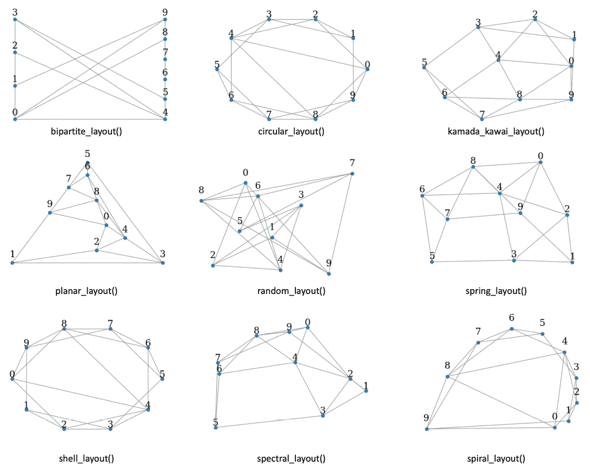

Figure 1.9 – 使用不同布局绘制的相同无向图

`networkx` 是一个易于操作和分析图的优秀工具，但它不提供良好的功能来执行复杂且美观的图绘制。在下一节中，我们将探讨另一个用于执行复杂图可视化的工具：Gephi。

## Gephi

在本节中，我们将展示如何使用 `Les Miserables.gexf` 样本（一个加权无向图），在应用程序启动时可以在 **欢迎** 窗口中选择。

Gephi 的主界面如 *图 1.10* 所示。它可以分为四个主要区域，如下所述：

1.  **图**：此部分显示图的最终绘制结果。每次应用过滤器或特定的布局时，图像都会自动更新。

1.  **外观**：在此，可以指定节点和边的外观。

1.  `networkx`) 来调整图中的节点位置。不同的算法，从简单的随机位置生成器到更复杂的 Yifan Hu 算法，都是可用的。

1.  **过滤器 & 统计**：在此区域，有两个主要功能可用，概述如下：

    a. **过滤器**：在此选项卡中，可以根据使用 **统计信息** 选项卡计算的一组属性过滤和可视化图形的特定子区域。

    b. **统计信息**：此选项卡包含可以在图形上使用 **运行** 按钮计算的可用图形度量。一旦计算了度量，它们可以用作属性来指定边和节点的外观（例如节点和边的大小和颜色）或用于过滤图形的特定子区域。

    您可以在下面的屏幕截图中看到 Gephi 的主界面：


Figure 1.10 – Gephi 主窗口

我们对 Gephi 的探索从将不同的布局应用于图形开始。如前所述，在 `networkx` 中，布局允许我们为每个节点在最终绘制中分配一个特定的位置。在 Gephi 1.2 中，有多个布局可供选择。为了应用特定的布局，我们必须从 **布局** 区域中选择一个可用的布局，然后点击选择后出现的 **运行** 按钮。

可在 **图形** 区域中看到的图形表示，将根据布局定义的新坐标自动更新。需要注意的是，某些布局是参数化的，因此最终的图形绘制可以根据所使用的参数显著改变。在下面的屏幕截图中，我们提出了三个不同布局的应用示例：

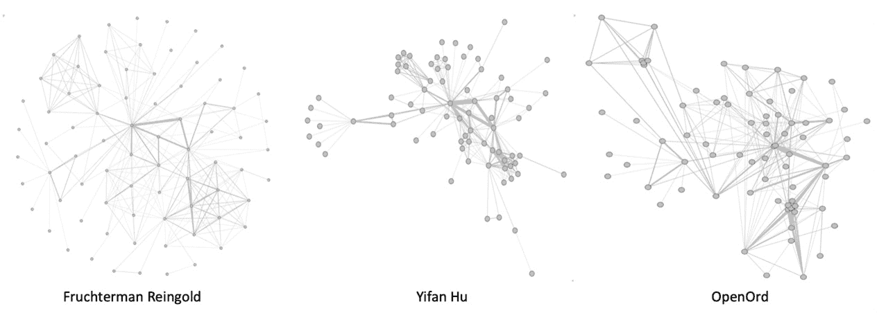

图 1.11 – 不同布局下的同一图形

现在我们将介绍在 *图 1.10* 中可见的 **外观** 菜单中的可用选项。在本节中，可以指定要应用于边和节点的样式。要应用的样式可以是静态的，也可以由节点/边的特定属性动态定义。我们可以通过在菜单中选择 **节点** 选项来更改节点的大小和颜色。

为了更改颜色，我们必须选择调色板图标，并使用特定的按钮决定我们想要分配一个 **唯一** 的颜色、一个 **分区**（离散值）或一个 **排名**（值范围）。对于 **分区** 和 **排名**，可以从下拉菜单中选择一个特定的 **图形** 属性作为颜色范围的参考。只有通过在 **统计信息** 区域中点击 **运行** 计算的属性才在下拉菜单中可用。相同的程序可以用来设置节点的大小。通过选择同心圆图标，可以设置所有节点的 **唯一** 大小或根据特定属性指定大小的一个 **排名**。

对于节点，用户也可以通过在菜单中选择**边**选项来更改边的样式。然后我们可以选择分配**唯一**颜色、**分区**（离散值）或**排名**（值范围）的颜色。对于**分区**和**排名**，构建颜色刻度的参考值由一个特定的**图形**属性定义，该属性可以从下拉菜单中选择。

重要的是要记住，为了应用特定的样式到图形，应该点击**应用**按钮。结果，图形绘制将根据定义的样式更新。在下述屏幕截图中，我们展示了节点颜色由**模块化类**值给出，每个节点的尺寸由其度数给出，而每条边的颜色由边权重定义的示例：


图 1.12 – 图形绘制示例，改变节点和边的外观

另一个需要描述的重要部分是**过滤器和统计**。在此菜单中，可以根据图形度量计算一些统计数据。

最后，我们通过介绍**统计**菜单中的功能来结束对 Gephi 的讨论，该菜单在*图 1.10*的右侧面板中可见。通过此菜单，可以计算输入图中不同的统计数据。这些统计数据可以轻松地用于设置最终图表的一些属性，例如节点/边的颜色和大小，或者过滤原始图以仅绘制其特定子集。为了计算特定的统计数据，用户需要明确选择菜单中可用的一个度量标准，然后点击**运行**按钮（*图 1.10*，右侧面板）。

此外，用户可以使用**统计**菜单的**过滤器**选项卡中的选项选择图形的子区域，该菜单在*图 1.10*的右侧面板中可见。*图 1.13*中可以看到过滤图形的示例。为了提供更多细节，我们构建并应用一个**度数**属性过滤器到图形上。过滤器的结果是原始图形的一个子集，其中只有具有特定度数属性值范围的节点（及其边）是可见的。

这在下述屏幕截图中有说明：

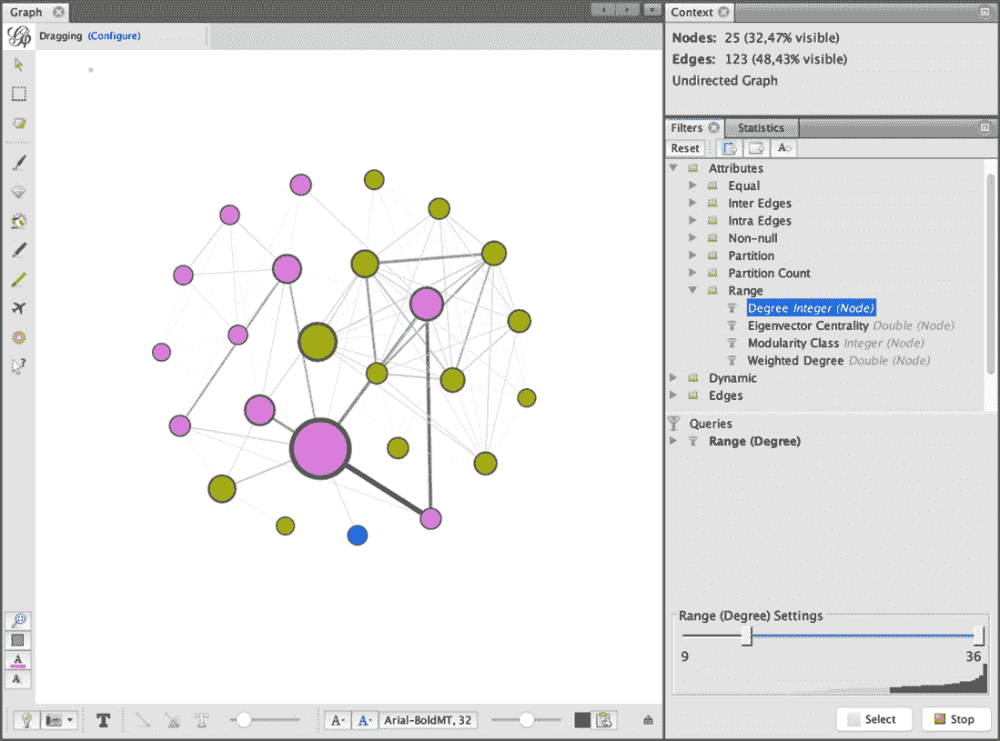

图 1.13 – 根据度数范围过滤的图形示例

当然，Gephi 允许我们执行更复杂的可视化任务，并包含许多本书无法完全涵盖的功能。一些更好的参考资料以更好地调查 Gephi 中所有可用的功能是官方的 Gephi 指南([`gephi.org/users/`](https://gephi.org/users/))或 Packt 出版社的*Gephi 食谱*书籍。

# 图形属性

正如我们已经学到的，**图**是一个用于描述实体之间关系的数学模型。然而，每个复杂网络都表现出固有的属性。这些属性可以通过特定的指标来衡量，每个指标可能表征图的一个或多个局部和全局方面。

例如，在 Twitter 这样的社交网络图中，用户（由图的**节点**表示）相互连接。然而，有些用户比其他用户更连接（影响者）。在 Reddit 社交图中，具有相似特征的用户倾向于组成社区。

我们已经提到了一些图的**基本特征**，例如图中**节点和边的数量**，这些构成了图本身的大小。这些属性已经很好地描述了网络的结构。例如，考虑 Facebook 图：它可以由节点和边的数量来描述。这些数字很容易将其与一个远小的网络（例如，办公室的社会结构）区分开来，但无法表征更复杂的动态（例如，节点之间的**相似性**）。为此，可以考虑更高级的图衍生**指标**，这些指标可以分为以下四个主要类别，如下概述：

+   **整合度指标**：这些指标衡量节点之间相互连接的倾向。

+   **隔离度指标**：这些指标量化了网络中存在的一些相互连接的节点群，称为社区或模块。

+   **中心度指标**：这些指标评估网络中单个节点的重要性。

+   **弹性度指标**：这些指标可以被视为衡量网络在面对故障或其他不利条件时能够维持和适应其操作性能的程度。

这些指标在表达整体网络的度量时被定义为**全局**的。另一方面，**局部**指标衡量单个网络元素（节点或边）的值。在加权图中，每个属性可能或可能不考虑到**边权重**，导致**加权和无权重指标**。

在下一节中，我们将描述一些最常用的衡量全局和局部属性的指标。为了简单起见，除非文本中另有说明，我们将展示该指标的全球无权重版本。在几个案例中，这是通过平均节点的局部无权重属性获得的。

## 整合度指标

在本节中，我们将描述一些最常用的整合度指标。

### 距离、路径和最短路径

图中的**距离**概念通常与从给定的源节点到达目标节点所需跨越的边的数量相关。

尤其是考虑一个源节点和一个目标节点。连接节点到节点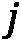的边集被称为**路径**。在研究复杂网络时，我们通常对在两个节点之间找到**最短路径**感兴趣。源节点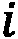和目标节点之间的最短路径是与所有可能的路径相比具有最少边的路径。网络的**直径**是所有可能最短路径中最长最短路径中包含的边的数量。

看一下下面的截图。从**都柏林**到**东京**有不同路径可走。然而，其中有一条是最短的（最短路径上的边被突出显示）：

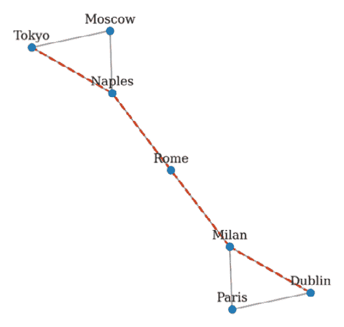

图 1.14 – 两个节点之间的最短路径

`networkx` Python 库的`shortest_path`函数允许用户快速计算图中两个节点之间的最短路径。考虑以下代码，其中使用`networkx`创建了一个包含七个节点的图：

```py
G = nx.Graph()
nodes = {1:'Dublin',2:'Paris',3:'Milan',4:'Rome',5:'Naples',
         6:'Moscow',7:'Tokyo'}
G.add_nodes_from(nodes.keys())
G.add_edges_from([(1,2),(1,3),(2,3),(3,4),(4,5),(5,6),(6,7),(7,5)])
```

可以通过以下方式获得源节点（例如，`'Dublin'`，由键 1 标识）和目标节点（例如，`'Tokyo'`，由键 7 标识）之间的最短路径：

```py
path = nx.shortest_path(G,source=1,target=7)
```

这应该输出以下内容：

```py
[1,3,4,5,6]
```

这里，`[1,3,4,5,7]`是`'Tokyo'`和`'Dublin'`之间最短路径中包含的节点。

### 特征路径长度

**特征路径长度**定义为所有可能节点对之间最短路径长度的平均值。如果是节点与所有其他节点之间的平均路径长度，则特征路径长度计算如下：

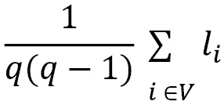

这里，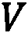是图中的节点集，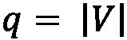代表其*阶数*。这是衡量信息在网络中传播效率的最常用指标之一。具有较短特征路径长度的网络促进了信息的快速传输并降低了成本。特征路径长度可以通过`networkx`使用以下函数计算：

```py
nx.average_shortest_path_length(G)
```

这应该给出以下结果：

```py
2.1904761904761907
```

然而，这个指标并不总是可以定义的，因为在*断开连接的图*中无法计算所有节点之间的路径。因此，**网络效率**也被广泛使用。

### 全局和局部效率

**全局效率**是所有节点对之间最短路径长度的倒数平均值。这样的指标可以被视为衡量信息在网络中交换效率的度量。考虑  是节点 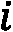 和节点  之间的最短路径。网络效率定义为以下：

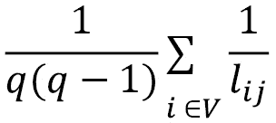

当图完全连接时，效率达到最大，而对于完全断开的图，效率最小。直观上，路径越短，度量值越低。

使用以下命令的 `networkx`：

```py
nx.global_efficiency(G)
```

输出应该是以下内容：

```py
0.6111111111111109
```

平均局部效率在 `networkx` 中使用以下命令计算：

```py
nx.local_efficiency(G)
```

输出应该是以下内容：

```py
0.6666666666666667
```

在以下截图中，展示了两个图的示例。如观察到的，左边的完全连接图比右边的环形图具有更高的效率。在完全连接图中，图中的每个节点都可以从任何其他节点访问，信息在网络中快速交换。然而，在环形图中，需要遍历多个节点才能到达目标节点，这使得其效率较低：

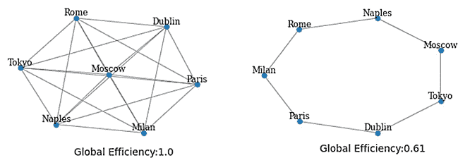

图 1.15 – 完全连接图（左）和环形图（右）的全局效率

集成指标很好地描述了节点之间的连接。然而，通过考虑隔离度指标，可以提取更多关于群体存在的信息。

## 隔离度指标

在本节中，将描述一些最常见的隔离度指标。

### 聚类系数

使用以下命令的 `networkx`：

```py
nx.average_clustering(G)
```

这应该输出以下内容：

```py
0.6666666666666667
```

局部聚类系数在 `networkx` 中使用以下命令计算：

```py
nx.clustering(G)
```

这应该输出以下内容：

```py
{1: 1.0,
 2: 1.0,
 3: 0.3333333333333333,
 4: 0,
 5: 0.3333333333333333,
 6: 1.0,
 7: 1.0}
```

输出是一个 Python 字典，其中包含每个节点（由相应的键标识）的对应值。在 *图 1.16* 所示的图中，可以轻松地识别出两个节点簇。通过计算每个单独节点的聚类系数，可以观察到 **罗马** 具有最低的值。**东京**、**莫斯科**以及**巴黎**和**都柏林**在其各自群体内连接得非常好（注意每个节点的大小是按每个节点的聚类系数成比例绘制的）。以下截图显示了该图：

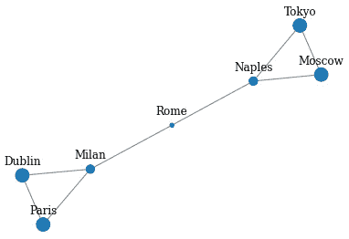

图 1.16 – 局部聚类系数表示

### 传递性

聚类系数的一个常见变体被称为 `networkx`，如下所示：

```py
nx.transitivity(G)
```

输出应该是以下内容：

```py
0.5454545454545454
```

### 模块度

**模块度**被设计用来量化网络在高度互连的节点聚合集合中的划分，通常称为 **模块**、**社区**、**群体**、**簇** 或 **集群**。主要思想是，具有高模块度的网络将在模块内显示密集的连接，而在模块之间显示稀疏的连接。

考虑一个像 Reddit 这样的社交网络：与视频游戏相关的社区成员往往与其他社区成员互动更多，谈论最新新闻、最喜欢的游戏机等等。然而，他们可能不会与谈论时尚的用户互动很多。与许多其他图度量不同，模块度通常通过优化算法计算。

在 `networkx` 中，使用 `networkx.algorithms.community` 模块的 `modularity` 函数计算模块度，如下所示：

```py
import networkx.algorithms.community as nx_comm
nx_comm.modularity(G, communities=[{1,2,3}, {4,5,6,7}])
```

在这里，第二个参数—`communities`—是一个集合列表，每个集合代表图的某个划分。输出应如下所示：

```py
0.3671875
```

分隔度量标准有助于理解群组的存在。然而，图中的每个节点都有其自身的 *重要性*。为了量化它，我们可以使用中心性度量。

## 中心性度量

在本节中，将描述一些最常见的中心性度量。

### 度中心性

最常见且简单的中心性度量之一是 **度中心性**度量。这与节点的 *度* 直接相关，测量某个节点 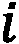 上的 *入边* 数量。

直观地说，一个节点与其他节点连接得越多，其度中心性就会越高。请注意，如果图是 *有向的*，则 `networkx` 使用以下命令：

```py
nx.degree_centrality(G)
```

输出应如下所示：

```py
{1: 0.3333333333333333, 2: 0.3333333333333333, 3: 0.5, 4: 0.3333333333333333, 5: 0.5, 6: 0.3333333333333333, 7: 0.3333333333333333}
```

### 接近中心性

**接近中心性**度量试图量化一个节点与其他节点有多接近（连接良好）。更正式地说，它指的是节点 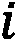 到网络中所有其他节点的平均距离。如果 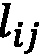 是节点  和节点  之间的最短路径，则接近中心性定义为以下：

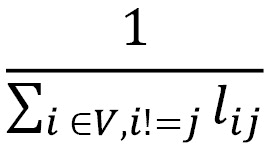

在这里，*V* 是图中节点的集合。接近中心性可以使用 `networkx` 中的以下命令计算：

```py
nx.closeness_centrality(G)
```

输出应如下所示：

```py
{1: 0.4, 2: 0.4, 3: 0.5454545454545454, 4: 0.6, 5: 0.5454545454545454, 6: 0.4, 7: 0.4}
```

### 介数中心性

**介数中心性**度量评估一个节点作为其他节点之间 **桥梁** 的作用程度。即使连接性较差，一个节点也可以通过战略性地连接，帮助保持整个网络的连接。

如果  是节点  和节点  之间最短路径的总数，而 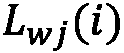 是通过节点 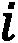 连接  和 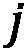 的最短路径的总数，那么介数中心性定义为以下：

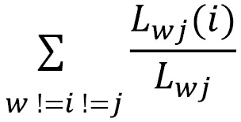

如果我们观察公式，我们可以注意到，通过节点经过的最短路径数量越多，中介中心性的值就越高。中介中心性在`networkx`中通过以下命令计算：

```py
nx.betweenness_centrality(G)
```

输出应如下所示：

```py
{1: 0.0, 2: 0.0, 3: 0.5333333333333333, 4: 0.6, 5: 0.5333333333333333, 6: 0.0, 7: 0.0}
```

在*图 1.17*中，我们展示了*度中心性*、*接近中心性*和*中介中心性*之间的差异。**米兰**和**那不勒斯**具有最高的度中心性。**罗马**具有最高的接近中心性，因为它与其他任何节点距离最近。它还显示出最高的中介中心性，因为其在连接两个可见集群并保持整个网络连通方面发挥着关键作用。

你可以在这里看到差异：

![图 1.17 – 度中心性（左），接近中心性（中），和中介中心性（右）]

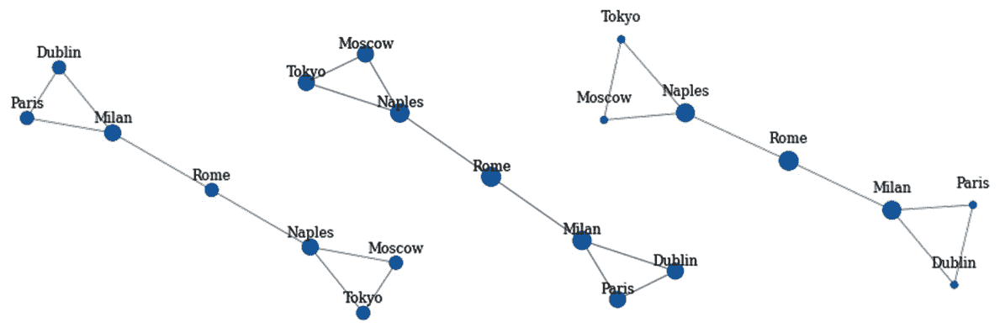

图 1.17 – 度中心性（左），接近中心性（中），和中介中心性（右）

中心性度量允许我们衡量网络中节点的相对重要性。最后，我们将提到弹性度量，它使我们能够衡量图的脆弱性。

## 弹性度量

有几种度量指标可以衡量网络的弹性。配对性是最常用的之一。

### 配对系数

使用以下命令：

```py
nx.degree_pearson_correlation_coefficient(G)
```

输出应如下所示：

```py
-0.6
```

社交网络大多是配对的。然而，所谓的*影响者*（著名歌手、足球运动员、时尚博主）往往被几个标准用户*跟随*（入边），同时倾向于相互连接并表现出去配对行为。

重要的一点是指出，之前提出的性质是描述图的所有可能度量指标的一个子集。更广泛的度量指标和算法可以在[`networkx.org/documentation/stable/reference/algorithms/`](https://networkx.org/documentation/stable/reference/algorithms/)找到。

# 基准和存储库

现在我们已经理解了关于图和网络分析的基本概念和概念，现在是时候深入一些实际例子，这些例子将帮助我们开始将我们迄今为止学到的通用概念付诸实践。在本节中，我们将展示一些通常用于研究网络性质、基准性能和网络算法有效性的示例和玩具问题。我们还将提供一些有用的链接，其中可以找到并下载网络数据集，以及一些关于如何解析和处理它们的技巧。

## 简单图的示例

我们首先查看一些非常简单的网络示例。幸运的是，`networkx`已经包含了一些已经实现好的图，可以用来使用和玩耍。让我们首先创建一个**完全连接的无向图**，如下所示：

```py
complete = nx.complete_graph(n=7)
```

这有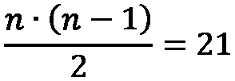条边和一个聚类系数*C=1*。虽然完全连接的图本身可能不太有趣，但它们代表了一个基本构建块，可能在更大的图中出现。在更大的图中，*n*个节点的完全连接子图通常被称为大小为*n*的**团**。

定义

在无向图中的一个**团**，记为*C*，定义为它的顶点的一个子集，*C**V*，使得子集中的每两个不同的顶点都是相邻的。这等价于条件，即由*C*诱导的*G*的子图是一个完全连接的图。

团是图论中的基本概念之一，也常用于需要编码关系的数学问题中。此外，它们也代表构建更复杂图时的最简单单元。另一方面，在更大的图中找到给定大小*n*的团的任务（团问题）非常有趣，并且可以证明它是一个在计算机科学中经常研究的**非确定性多项式时间完备**（**NP-完备**）问题。

以下截图显示了`networkx`图的简单示例：

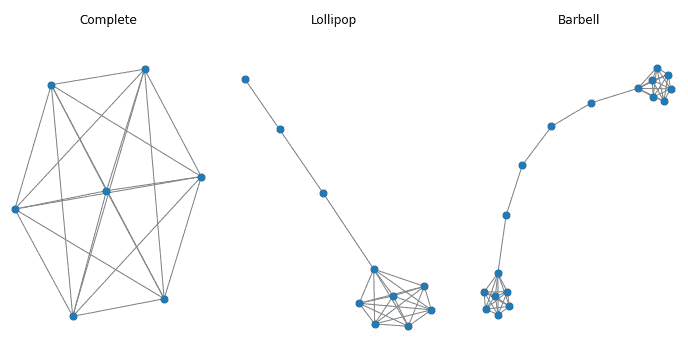

图 1.18 – 使用 networkx 的图简单示例：（左）完全连接图；（中）棒棒糖图；（右）哑铃图

在*图 1.18*中，我们展示了一个完整的图以及两个其他包含可以通过`networkx`轻松生成的团的其他简单示例，如下所述：

+   由大小为*n*的团和*m*个节点的分支组成的**棒棒糖图**，如下代码片段所示：

    ```py
    lollipop = nx.lollipop_graph(m=7, n=3)
    ```

+   由两个大小为*m1*和*m2*的团通过节点分支连接而成的**哑铃图**，这与我们之前用来描述一些全局和局部属性的样本图相似。生成此图的代码如下所示：

    ```py
    barbell = nx.barbell_graph(m1=7, m2=4)
    ```

这类简单图是基本构建块，可以通过组合它们来生成更复杂的网络。使用`networkx`合并子图非常容易，只需几行代码即可完成，如下代码片段所示，其中三个图合并成一个图，并放置了一些随机边来连接它们：

```py
def get_random_node(graph):
    return np.random.choice(graph.nodes)
allGraphs = nx.compose_all([complete, barbell, lollipop])
allGraphs.add_edge(get_random_node(lollipop), get_random_node(lollipop))
allGraphs.add_edge(get_random_node(complete), get_random_node(barbell))
```

其他非常简单的图（然后可以合并并加以利用）可以在[`networkx.org/documentation/stable/reference/generators.html#module-networkx.generators.classic`](https://networkx.org/documentation/stable/reference/generators.html#module-networkx.generators.classic)找到。

## 生成图模型

尽管通过创建简单的子图并将它们合并是生成越来越复杂的新图的一种方法，但网络也可以通过**概率模型**和/或**生成模型**来生成，这些模型允许图自行增长。这类图通常与真实网络共享有趣的属性，并且长期以来一直被用来创建基准和合成图，尤其是在数据量不像今天这样庞大的时代。在这里，我们展示了随机生成的图的示例，并简要描述了它们背后的模型。

### Watts 和 Strogatz（1998）

作者使用此模型研究了**小世界网络**的行为——也就是说，在某种程度上类似于常见社交网络的网络。首先将*n*个节点放置在环中，然后连接每个节点与其*k*个邻居。然后，此类图的每条边都有一个概率*p*，可能会重新布线到随机选择的节点。通过调整*p*，Watts 和 Strogatz 模型允许从规则网络（*p=0*）过渡到完全随机网络（*p=1*）。在此之间，图表现出小世界特征；也就是说，它们倾向于使此模型更接近社交网络图。这些类型的图可以通过以下命令轻松创建：

```py
graph = nx.watts_strogatz_graph(n=20, k=5, p=0.2)
```

### 巴巴什-阿尔伯特（1999）

阿尔伯特和巴巴什提出的模型基于一个生成模型，该模型通过使用**优先连接**方案允许通过创建随机无标度网络，其中网络是通过逐步添加新节点并将它们连接到已存在的节点来创建的，优先连接到具有更多邻居的节点。从数学上讲，该模型的基本思想是，新节点连接到现有节点*i*的概率取决于*i*节点度，根据以下公式：


因此，具有大量边（枢纽）的节点倾向于发展更多的边，而具有少量链接的节点则不会发展其他链接（边缘）。由该模型生成的网络在节点之间的连接度（即度）上表现出**幂律分布**。这种行为也存在于真实网络中（例如，`networkx`），也允许新边的优先连接或现有边的重新布线。

下面的截图展示了巴巴什-阿尔伯特模型：

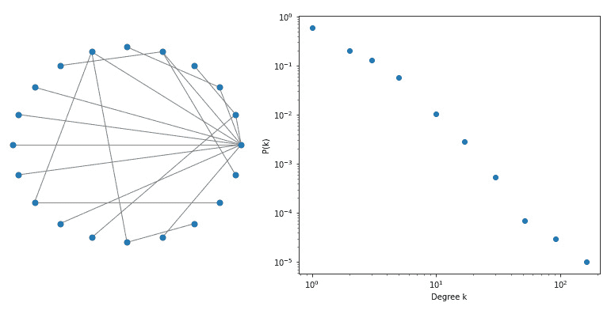

图 1.19 – 巴巴什-阿尔伯特模型（左）具有 20 个节点（右）的连接度分布，n=100,000 个节点，显示了无标度幂律分布

在**图 1.19**中，我们展示了小网络的 Barabási-Albert 模型的一个示例，您已经可以观察到中心节点的出现（在左侧），以及节点的度数概率分布，它表现出无标度幂律行为（在右侧）。前面的分布可以很容易地在`networkx`中复制，如下所示：

```py
ba_model = nx.extended_barabasi_albert_graph(n,m=1,p=0,q=0)
degree = dict(nx.degree(ba_model)).values()
bins = np.round(np.logspace(np.log10(min(degree)), np.log10(max(degree)), 10))
cnt = Counter(np.digitize(np.array(list(degree)), bins))
```

## 基准测试

数字化深刻地改变了我们的生活，如今，任何活动、个人或过程都会产生数据，提供了大量需要挖掘、分析和用于促进数据驱动决策的信息。几十年前，很难找到可用于开发或测试新算法的数据集。另一方面，现在有大量的存储库为我们提供了数据集，甚至是一些相当大的数据集，可以下载和分析。这些允许人们共享数据集的存储库，还提供了一个基准，算法可以在其中应用、验证和相互比较。

在本节中，我们将简要介绍网络科学中使用的某些主要存储库和文件格式，以便为您提供所有必要的工具来导入不同大小的数据集，以便分析和实验。

在这些存储库中，您将找到来自网络科学的一些常见领域的网络数据集，例如社交网络、生物化学、动态网络、文档、共同作者和引用网络，以及由金融交易产生的网络。在**第三部分**，**图机器学习的先进应用**中，我们将讨论一些最常见的网络类型（社交网络、处理语料库文档时产生的图和金融网络），并通过应用在第二部分**图上的机器学习**中描述的技术和算法，对这些网络进行更深入的分析。

此外，`networkx`已经包含了一些基本（且非常小）的网络，通常用于解释算法和基本度量，这些可以在[`networkx.org/documentation/stable/reference/generators.html#module-networkx.generators.social`](https://networkx.org/documentation/stable/reference/generators.html#module-networkx.generators.social)找到。然而，这些数据集通常相当小。对于更大的数据集，请参考我们接下来介绍的存储库。

### 网络数据存储库

**网络数据仓库**无疑是最大的网络数据仓库之一（[`networkrepository.com/`](http://networkrepository.com/)），拥有数千个不同的网络，包括来自世界各地和顶级学术机构的用户和捐赠。如果一个网络数据集是免费提供的，那么你很可能在那里找到它。数据集被分为大约**30 个领域**，包括生物学、经济学、引用、社交网络数据、工业应用（能源、道路）等。除了提供数据外，该网站还提供了一种用于交互式可视化、探索和比较数据集的工具，我们建议您查看并探索它。

网络数据仓库中的数据通常以**矩阵市场交换格式**（**MTX**）文件格式提供。MTX 文件格式基本上是一种通过可读文本文件（美国信息交换标准代码，或**ASCII**）指定密集或稀疏矩阵、实数或复数的文件格式。有关更多详细信息，请参阅[`math.nist.gov/MatrixMarket/formats.html#MMformat`](http://math.nist.gov/MatrixMarket/formats.html#MMformat)。

使用`scipy`可以轻松地在 Python 中读取 MTX 格式的文件。我们从网络数据仓库下载的一些文件似乎略有损坏，并在 10.15.2 的 OSX 系统上需要最小的修复。为了修复它们，只需确保文件的标题与格式规范一致；即，行首有一个双`%`符号且没有空格，如下面的行所示：

```py
%%MatrixMarket matrix coordinate pattern symmetric 
```

矩阵应以坐标格式表示。在这种情况下，规范也指向一个无权、无向图（由`pattern`和`symmetric`理解）。一些文件在第一行标题之后有一些注释，这些注释由单个`%`符号开头。

例如，我们考虑**天体物理学**（**ASTRO-PH**）合作网络。该图是通过使用从 1993 年 1 月到 2003 年 4 月期间在*arXiv*存档中发布的*天体物理学*类别下的所有科学论文生成的。该网络是通过连接（通过无向边）共同撰写出版物的所有作者来构建的，从而形成一个包括给定论文所有作者的团。生成图的代码可以在以下位置查看：

```py
from scipy.io import mmread
adj_matrix = mmread("ca-AstroPh.mtx")
graph = nx.from_scipy_sparse_matrix(adj_matrix)
```

该数据集有 17,903 个节点，通过 196,072 条边连接。可视化如此多的节点并不容易，即使我们尝试这样做，也可能不太有用，因为如此多的信息下，理解底层结构可能并不容易。然而，我们可以通过查看特定的子图来获得一些见解，正如我们接下来将要做的。

首先，我们可以从计算我们之前描述的一些基本属性开始，并将它们放入 pandas `DataFrame`中以方便我们稍后使用、排序和分析。完成此操作的代码如下所示：

```py
stats = pd.DataFrame({
    "centrality": nx.centrality.betweenness_centrality(graph), 
    "C_i": nx.clustering(graph), 
    "degree": nx.degree(graph)
})
```

我们可以很容易地发现具有最大 `6933` 的节点，它有 503 个邻居（肯定是一位在天体物理学中非常受欢迎和重要的科学家！），如下面的代码片段所示：

```py
neighbors = [n for n in nx.neighbors(graph, 6933)]
```

当然，也可以绘制其 `C_i` 值。完成此操作的代码如下所示：

```py
nTop = round(len(neighbors)*sampling)
idx = {
    "random": stats.loc[neighbors].sort_index().index[:nTop], 
    "centrality": stats.loc[neighbors]\
         .sort_values("centrality", ascending=False)\
         .index[:nTop],
    "C_i": stats.loc[neighbors]\
         .sort_values("C_i", ascending=False)\
         .index[:nTop]
}
```

然后，我们可以定义一个简单的函数来提取和绘制只包含与某些索引相关的节点的子图，如下面的代码片段所示：

```py
def plotSubgraph(graph, indices, center = 6933):
    nx.draw_kamada_kawai(
        nx.subgraph(graph, list(indices) + [center])
    )
```

使用前面的函数，我们可以绘制出通过使用随机抽样、中心性和我们之前提到的聚类系数这三个不同标准过滤自我网络所获得的不同子图。这里提供了一个示例：

```py
plotSubgraph(graph, idx["random"]) 
```

在 *图 1.20* 中，我们比较了这些结果，其中其他网络是通过将键值更改为 `centrality` 和 `C_i` 获得的。随机表示似乎显示出一些分离的社区结构。具有最多中心节点的图显然是一个几乎完全连接的网络，可能由所有全职教授和天体物理学科学界有影响力的人物组成，他们在多个主题上出版并频繁合作。最后，另一种表示方式通过选择具有更高聚类系数的节点来突出显示一些特定的社区，这些社区可能与特定主题相关。这些节点可能没有很大的中心度，但它们很好地代表了特定主题。您可以在以下位置看到自我子图的示例：

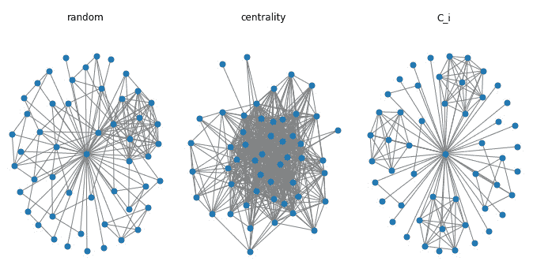

图 1.20 – ASTRO-PH 数据集中度最大的节点的自我子图示例。邻居以比率=0.1 进行抽样。（左）随机抽样；（中）具有最大介数中心性的节点；（右）具有最大聚类系数的节点

另一种在 `networkx` 中可视化的选项是使用允许快速过滤和图形可视化的 *Gephi* 软件。为了做到这一点，我们首先需要将数据导出为 **Graph Exchange XML Format** （**GEXF**）（这是一种可以导入 Gephi 的文件格式），如下所示：

```py
nx.write_gext(graph, "ca-AstroPh.gext")
```

一旦数据被导入 Gephi，通过少量过滤器（如中心性或度）和一些计算（如模块度），你可以轻松地绘制出如图 *图 1.21* 所示的漂亮图表，其中节点已根据模块度着色，以突出显示聚类。着色还使我们能够轻松地识别连接不同社区并因此具有较大介数的节点。

网络数据存储库中的某些数据集也可能在 `networkx` 中可用，通过简单地重写其标题即可转换。例如，**数字文献和图书馆**（**DBLP**）引用网络。

下面的屏幕截图可以看到一个示例图表：

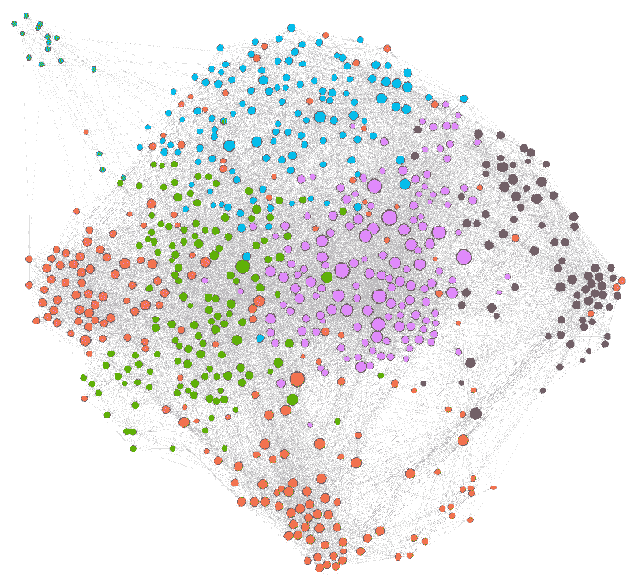

图 1.21 – 使用 Gephi 可视化 ASTRO-PH 数据集的示例。节点通过度中心性进行筛选，并按模块化类别着色；节点大小与度值成比例

这是文件标题的代码：

```py
% asym unweighted
% 49743 12591 12591 
```

这可以通过用以下代码替换这些行来轻松地转换为符合 MTX 文件格式：

```py
%%MatrixMarket matrix coordinate pattern general
12591 12591 49743 
```

然后，你可以使用之前描述的导入函数。

### 斯坦福大型网络数据集集合

另一个网络数据集的有价值来源是 **斯坦福网络分析平台**（**SNAP**）([`snap.stanford.edu/index.html`](https://snap.stanford.edu/index.html)) 的网站，这是一个通用网络分析库，旨在处理甚至相当大的图，拥有数亿个节点和数十亿条边。它用 *C++* 编写以实现顶级计算性能，但它还提供了与 Python 的接口，以便在原生 Python 应用程序中导入和使用。

虽然 `networkx` 目前是研究 `networkx` 的主要库，但 SNAP 或其他库（稍后将有更多介绍）可能比 `networkx` 快几个数量级，并且可以在需要更高性能的任务中替代 `networkx`。在 SNAP 网站上，你可以找到一个专门的网页用于 **生物医学网络数据集** ([`snap.stanford.edu/biodata/index.html`](https://snap.stanford.edu/biodata/index.html))，除了其他更通用的网络 ([`snap.stanford.edu/data/index.html`](https://snap.stanford.edu/data/index.html))，覆盖了与之前描述的网络数据存储库类似的领域和数据集。

数据通常在一行代码中提供 `networkx`，使用以下命令：

```py
g = nx.read_edgelist("amazon0302.txt")
```

一些图可能包含关于边之外的信息。这些额外信息包含在数据集的存档中，作为一个单独的文件——例如，提供了节点的某些元数据，并且通过 *id* 节点与图相关联。

图可以直接使用 SNAP 库及其通过 Python 的接口读取。如果你在本地机器上有一个可工作的 SNAP 版本，你可以轻松地按以下方式读取数据：

```py
from snap import LoadEdgeList, PNGraph
graph = LoadEdgeList(PNGraph, "amazon0302.txt", 0, 1, '\t')
```

请记住，在此阶段，你将有一个 SNAP 库中的`PNGraph`对象的实例，并且你不能直接在这个对象上使用`networkx`的功能。如果你想使用一些`networkx`函数，你首先需要将`PNGraph`对象转换为`networkx`对象。为了使这个过程更简单，在这本书的补充材料（可在[`github.com/PacktPublishing/Graph-Machine-Learning`](https://github.com/PacktPublishing/Graph-Machine-Learning)找到）中，我们编写了一些函数，允许你在`networkx`和 SNAP 之间无缝切换，如下面的代码片段所示：

```py
networkx_graph = snap2networkx(snap_graph)
snap_graph = networkx2snap(networkx_graph) 
```

### 开放图基准

这是最新的图基准更新（日期为 2020 年 5 月），并且预计在未来几年中，这个仓库将获得越来越重要和广泛的支持。**开放图基准**（**OGB**）的创建是为了解决一个特定问题：与实际应用相比，当前的基准实际上太小，无法为**机器学习**（**ML**）的进步提供帮助。一方面，一些在小数据集上开发的模型最终无法扩展到大数据集，证明它们在现实世界应用中不适用。另一方面，大数据集也允许我们增加在 ML 任务中使用的模型的容量（复杂性），并探索新的算法解决方案（如神经网络），这些解决方案可以从大量样本中受益，以便有效地训练，从而实现非常高的性能。数据集属于不同的领域，并且它们已经在三个不同的数据集大小（小、中、大）上进行了排名，其中小尺寸图，尽管名称如此，已经拥有超过 10 万个节点和/或超过 100 万个边。另一方面，大型图具有超过 1 亿个节点和超过 10 亿个边的网络，这有助于可扩展模型的开发。

除了数据集之外，OGB 还以**Kaggle**风格提供了一套端到端的 ML 流程，该流程标准化了数据加载、实验设置和模型评估。OGB 创建了一个平台，用于比较和评估模型之间的性能，发布了一个**排行榜**，允许跟踪特定任务（节点、边和图属性预测）的性能演变和进步。有关数据集和 OGB 项目的更多详细信息，请参阅[`arxiv.org/pdf/2005.00687.pdf`](https://arxiv.org/pdf/2005.00687.pdf)。

# 处理大型图

当接近一个用例或分析时，了解我们关注的数据的大小或未来将有多大非常重要，因为数据集的维度可能会极大地影响我们使用的技术和我们能够进行的分析。如前所述，一些在小数据集上开发的方法几乎无法扩展到现实世界应用和更大的数据集，这使得它们在实践中无用。

当处理（可能）大型图时，理解我们所使用的工具、技术和/或算法的潜在瓶颈和限制至关重要，评估在增加节点或边数时，我们应用程序/分析的哪一部分可能无法扩展。更重要的是，无论数据驱动应用程序多么简单，或处于早期**概念验证**（**POC**）阶段，都需要以允许其未来在数据/用户增加时扩展的方式构建，而无需重写整个应用程序。

创建一个依赖于图形表示/建模的数据驱动应用程序是一项具有挑战性的任务，其设计和实现比简单地导入`networkx`要复杂得多。特别是，将处理图的组件（称为**图处理引擎**）与允许查询和遍历图的组件（**图存储层**）解耦通常很有用。我们将在*第九章*《构建数据驱动应用程序》中进一步讨论这些概念。然而，鉴于本书的重点是机器学习和分析技术，更多地关注图处理引擎而不是图存储层是有意义的。因此，我们认为在当前阶段向您提供一些用于处理大型图的图处理引擎技术是有用的，这对于扩展应用程序至关重要。

在这方面，根据图是否可以适应**共享内存机器**或需要**分布式架构**来处理和分析，将图处理引擎分为两类（这会影响要使用的工具/库/算法）是很重要的。

注意，没有关于大型和小型图的绝对定义，这还取决于所选的架构。如今，得益于基础设施的垂直扩展，你可以找到具有大于 1 **TB**（通常称为*胖节点*）的**随机存取内存**（**RAM**）的服务器，以及大多数云服务提供商提供的具有数万个**中央处理单元**（**CPUs**）用于多线程的基础设施，尽管这些基础设施可能在经济上不可行。即使没有扩展到这种极端的架构，具有数百万个节点和数千万条边的图也可以在具有约 100 **GB**（**GB**）的 RAM 和约 50 个 CPU 的单个服务器上轻松处理。

虽然`networkx`是一个非常受欢迎、用户友好且直观的库，但当扩展到这样合理的大型图时，它可能不是最佳选择。`networkx`是纯 Python 编写的，Python 是一种解释型语言，在性能上可能远不如完全或部分用性能更好的编程语言（如 C++和 Julia）编写的其他图引擎，并且使用了多线程，如下所示：

+   **SNAP** ([`snap.stanford.edu/`](http://snap.stanford.edu/))，我们在上一节中已经见过，是斯坦福大学开发的一个图引擎，是用 C++ 编写的，并且提供了 Python 的绑定。

+   **igraph** ([`igraph.org/`](https://igraph.org/)) 是一个 C 库，并且提供了 Python、R 和 Mathematica 的绑定。

+   **graph-tool** ([`graph-tool.skewed.de/`](https://graph-tool.skewed.de/))，尽管是一个 Python 模块，但其核心算法和数据结构是用 C++ 编写的，并使用 OpenMP 并行化以在多核架构上扩展。

+   **NetworKit** ([`networkit.github.io/`](https://networkit.github.io/)) 也是用 C++ 编写的，其核心功能集集成了 OpenMP 并行化，并集成在 Python 模块中。

+   在一个性能更优且更健壮的库中实现 `networkx` 的功能。

所有的上述库在需要提高性能时都是 `networkx` 的有效替代品。改进可能非常显著，速度提升从 30 到 300 倍不等，最佳性能通常由 LightGraphs 实现。

在接下来的章节中，我们将主要关注 `networkx`，以提供一致性的展示，并为用户提供网络分析的基本概念。我们希望您知道还有其他选项可用，因为从性能角度来看，这变得极其相关。

# 摘要

在本章中，我们回顾了诸如图、节点和边等概念。我们回顾了图的 *表示* 方法，并探讨了如何 *可视化* 图。我们还定义了用于表征网络或其部分 *属性*。

我们通过一个著名的 Python 图库 `networkx` 来处理图，并学习了如何将其应用于实践中的理论概念。

我们随后运行了通常用于研究网络特性的示例和玩具问题，以及网络算法的性能和有效性基准测试。我们还为您提供了可以找到和下载网络数据集的存储库的一些有用链接，以及一些解析和处理它们的技巧。

在下一章中，我们将超越在图上定义机器学习（ML）的概念。我们将学习如何通过特定的 ML 算法自动找到更高级和潜在的特性。
