# 第三章：无监督图学习

无监督机器学习指的是机器学习算法的一个子集，在训练过程中不利用任何目标信息。相反，它们独立工作以找到聚类、发现模式、检测异常，并解决许多其他问题，对于这些问题没有教师和事先已知的正确答案。

正如许多其他机器学习算法一样，无监督模型在图表示学习领域得到了广泛的应用。事实上，它们是解决各种下游任务（如节点分类和社区检测等）的极其有用的工具。

在本章中，将提供最近无监督图嵌入方法的概述。给定一个图，这些技术的目标是自动学习其潜在表示，其中关键的结构组件以某种方式得到保留。

本章将涵盖以下主题：

+   无监督图嵌入路线图

+   浅层嵌入方法

+   自动编码器

+   图神经网络

# 技术要求

我们将使用 Python 3.9 的 Jupyter 笔记本来进行所有练习。以下是需要使用 `pip` 安装此章节所需的 Python 库的列表。例如，在命令行中运行 `pip install networkx==2.5`，等等：

```py
Jupyter==1.0.0
networkx==2.5
matplotlib==3.2.2
karateclub==1.0.19
node2vec==0.3.3
tensorflow==2.4.0
scikit-learn==0.24.0
git+https://github.com/palash1992/GEM.git
git+https://github.com/stellargraph/stellargraph.git
```

在本书的其余部分，除非明确说明，否则我们将引用 Python 命令 `import networkx` 作为 `nx`。

所有与本章相关的代码文件均可在[`github.com/PacktPublishing/Graph-Machine-Learning/tree/main/Chapter03`](https://github.com/PacktPublishing/Graph-Machine-Learning/tree/main/Chapter03)找到。

# 无监督图嵌入路线图

图是非欧几里得空间中定义的复杂数学结构。粗略地说，这意味着并不总是容易定义什么是接近什么；甚至可能很难说“接近”这个词究竟是什么意思。想象一下社交网络图：两个用户可能分别连接，但共享非常不同的特征——一个可能对时尚和服装感兴趣，而另一个可能对体育和电子游戏感兴趣。我们能认为他们是“接近”的吗？

因此，无监督机器学习算法在图分析中得到了广泛的应用。无监督机器学习是机器学习算法的一个类别，可以在没有手动标注数据的情况下进行训练。这些模型中的大多数实际上只使用邻接矩阵和节点特征中的信息，而不了解下游机器学习任务。

这怎么可能呢？最常用的解决方案之一是学习保留图结构的嵌入。学习到的表示通常被优化，以便它可以用来重建成对节点相似度，例如，**邻接矩阵**。这些技术带来一个重要特性：学习到的表示可以编码节点或图之间的潜在关系，使我们能够发现隐藏和复杂的新的模式。

与无监督图机器学习技术相关联的许多算法已经被开发出来。然而，如不同科学论文先前所报告的（[`arxiv.org/abs/2005.03675`](https://arxiv.org/abs/2005.03675)），这些算法可以被分为几个宏观组：浅层嵌入方法、自动编码器和**图神经网络**（**GNNs**），如下面的图表所示：

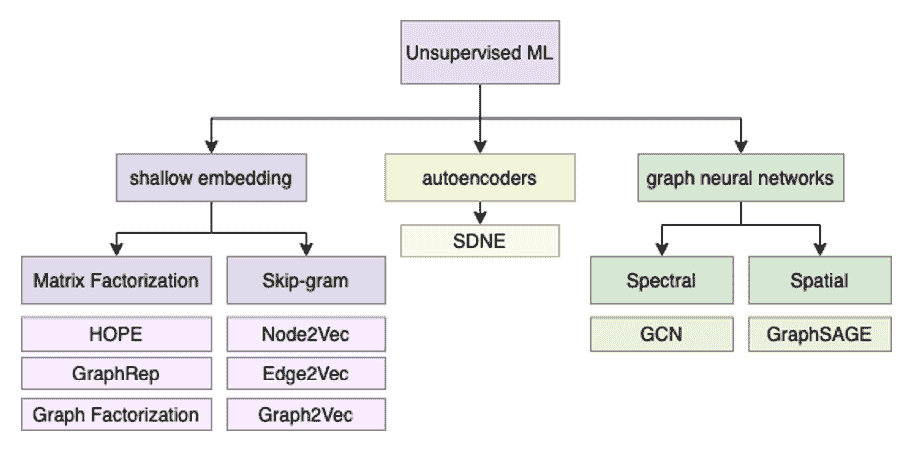

图 3.1 – 本书所述的不同无监督嵌入算法的层次结构

在接下来的章节中，你将了解每组算法背后的主要原理。我们将尝试提供该领域最著名算法背后的想法以及它们如何用于解决实际问题。

# 浅层嵌入方法

如已在*第二章*中介绍，*图机器学习*，使用浅层嵌入方法，我们识别出一组能够学习和仅返回学习输入数据的嵌入值的算法。

在本节中，我们将详细解释其中的一些算法。此外，我们将通过提供几个如何在 Python 中使用这些算法的示例来丰富描述。本节中描述的所有算法，我们将使用以下库中提供的实现：**图嵌入方法**（**GEM**）、**节点到向量**（**Node2Vec**）和 Karate Club。

## 矩阵分解

矩阵分解是一种在多个领域广泛使用的通用分解技术。许多图嵌入算法使用这种技术来计算图的节点嵌入。

我们将首先提供一个关于矩阵分解问题的通用介绍。在介绍基本原理之后，我们将描述两个算法，即**图分解**（**GF**）和**高阶邻近保持嵌入**（**HOPE**），它们使用矩阵分解来构建图的节点嵌入。

设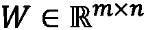为输入数据。矩阵分解将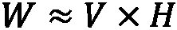分解为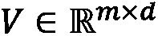和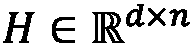，分别称为**源**和**丰度**矩阵，而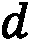是生成的嵌入空间的维度数。矩阵分解算法通过最小化一个损失函数来学习*V*和*H*矩阵，该损失函数可以根据我们想要解决的问题的具体情况而变化。在其一般公式中，损失函数通过计算使用 Frobenius 范数（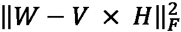）的重构误差来定义。

一般而言，所有基于矩阵分解的无监督嵌入算法都使用相同的原则。它们都将表示为矩阵的输入图分解为不同的组件。每种方法之间的主要区别在于优化过程中使用的损失函数。确实，不同的损失函数允许创建一个嵌入空间，该空间强调输入图的具体属性。

### 图分解

GF 算法是第一个在执行给定图的节点嵌入时达到良好计算性能的模型之一。通过遵循我们之前描述的矩阵分解原理，GF 算法分解给定图的邻接矩阵。

形式上，设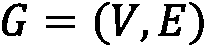为我们想要计算节点嵌入的图，设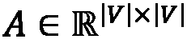为其邻接矩阵。在此矩阵分解问题中使用的损失函数（*L*）如下：

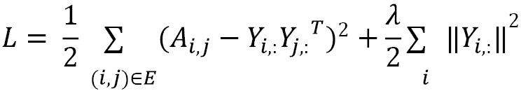

在前面的方程中，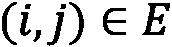代表*G*中的一条边，而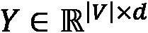是包含*d*-维嵌入的矩阵。矩阵的每一行代表一个给定节点的嵌入。此外，嵌入矩阵的正则化项（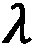）用于确保即使在缺乏足够数据的情况下，问题仍然是有良好定义的。

在此方法中使用的损失函数主要是为了提高 GF 的性能和可扩展性。实际上，此方法生成的解决方案可能会有噪声。此外，需要注意的是，通过观察其矩阵分解公式，GF 执行了强对称分解。这一特性特别适合无向图，其中邻接矩阵是对称的，但可能对无向图构成潜在的限制。

在下面的代码中，我们将展示如何使用 Python 和 GEM 库对给定的`networkx`图执行节点嵌入：

```py
import networkx as nx
from gem.embedding.gf import GraphFactorization
G = nx.barbell_graph(m1=10, m2=4)
gf = GraphFactorization(d=2, data_set=None, max_iter=10000, eta=1*10**-4, regu=1.0)
gf.learn_embedding(G)
embeddings = gf.get_embedding()
```

在前面的例子中，以下操作已经完成：

1.  `networkx`用于生成一个**双环图**（*G*），作为 GF 分解算法的输入。

1.  使用`GraphFactorization`类生成一个`d=2`维度的嵌入空间。

1.  使用 `gf.learn_embedding(G)` 执行输入图的节点嵌入计算。

1.  通过调用`gf.get_embedding()`方法提取计算出的嵌入。

上一段代码的结果显示在以下图中：

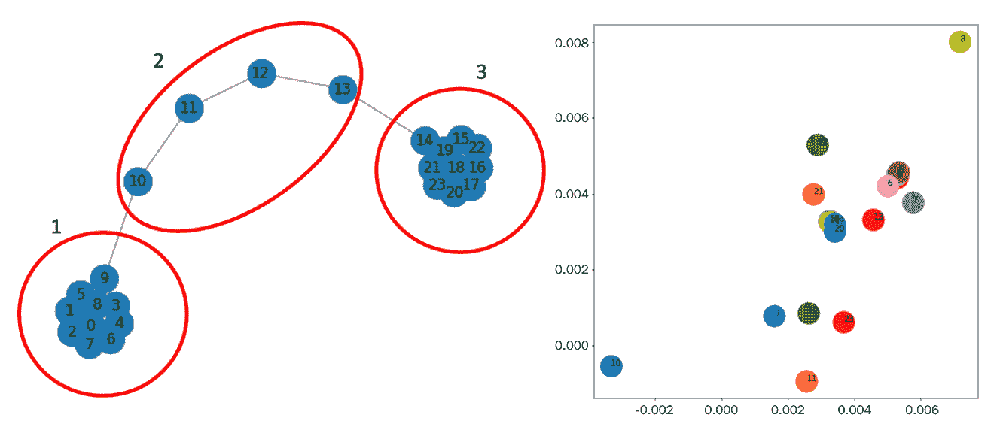

图 3.2 – 将 GF 算法应用于图（左）以生成其节点嵌入向量（右）

从 *图 3.2* 中，我们可以看到属于组 1 和 3 的节点如何在同一空间区域中映射在一起。这些点被属于组 2 的节点所分隔。这种映射使我们能够很好地将组 1 和 3 与组 2 分离。不幸的是，组 1 和 3 之间没有明显的分离。

### 高阶邻近保持嵌入

HOPE 是另一种基于矩阵分解原理的图嵌入技术。这种方法允许保持高阶邻近，并且不强制其嵌入具有任何对称性质。在开始描述该方法之前，让我们了解一阶邻近和高阶邻近的含义：

+   **一阶邻近**：给定一个图 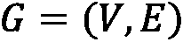，其中边具有权重 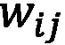，对于每个顶点对 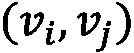，如果边 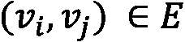，则我们说它们具有等于 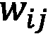 的一阶邻近。否则，两个节点之间的一阶邻近为 0。

+   **二阶及高阶邻近**：使用二阶邻近，我们可以捕捉每对顶点之间的两步关系。对于每个顶点对 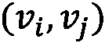，我们可以将二阶邻近视为从 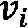 到 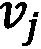 的两步转换。高阶邻近泛化了这个概念，并允许我们捕捉更全局的结构。因此，高阶邻近可以被视为从 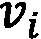 到 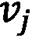 的 k 步（*k* ≥ 3）转换。

给定邻近的定义，我们现在可以描述 HOPE 方法。形式上，设 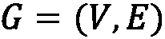 为我们想要计算嵌入的图，设 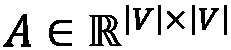 为其邻接矩阵。此问题使用的损失函数（*L*）如下：

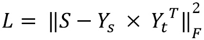

在前面的方程中，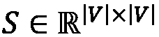 是由图 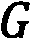 和 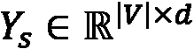 以及 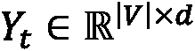 生成的相似性矩阵。更详细地说，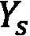 代表源嵌入，而 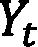 代表目标嵌入。

HOPE 使用这两个矩阵来捕捉有向网络中的非对称邻近性，其中存在从源节点到目标节点的方向。最终的嵌入矩阵，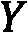，通过简单地按列连接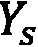和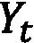矩阵获得。由于这个操作，由 HOPE 生成的最终嵌入空间将具有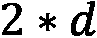维。

正如我们之前所述，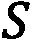矩阵是从原始图*G*中获得的相似度矩阵。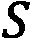的目标是获得高阶邻近信息。形式上，它被计算为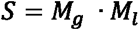，其中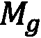和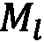都是矩阵的多项式。

在其原始公式中，HOPE 的作者建议了不同的方法来计算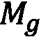和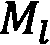。在这里，我们报告了一种常见且简单的方法来计算这些矩阵，**Adamic-Adar**（**AA**）。在这个公式中，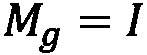（单位矩阵）而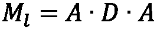，其中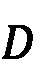是一个对角矩阵，其计算方式为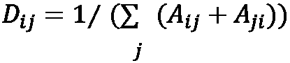。计算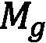和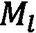的其他公式包括**Katz 指数**、**根 PageRank**（**RPR**）和**共同邻居**（**CN**）。

在以下代码中，我们将展示如何使用 Python 和 GEM 库对给定的`networkx`图执行节点嵌入：

```py
import networkx as nx
from gem.embedding.hope import HOPE
G = nx.barbell_graph(m1=10, m2=4)
gf = HOPE(d=4, beta=0.01)
gf.learn_embedding(G)
embeddings = gf.get_embedding()
```

上述代码与用于 GF 的代码类似。唯一的区别在于类初始化，因为在这里我们使用`HOPE`。根据 GEM 提供的实现，`d`参数，表示嵌入空间的维度，将定义最终嵌入矩阵的列数，该矩阵是在按列连接和之后获得的。

因此，和的列数由`d`分配的值的整数除法（Python 中的`//`运算符）定义。代码的结果在以下图表中显示：


图 3.3 – 将 HOPE 算法应用于图（左）以生成其节点的嵌入向量（右）

在这种情况下，图是无向的，因此源节点和目标节点之间没有区别。*图 3.3*显示了表示的`embeddings`矩阵的前两个维度。可以看到，HOPE 生成的嵌入空间在这种情况下提供了不同节点之间更好的分离。

### 带有全局结构信息的图表示

具有全局结构信息的图表示（GraphRep），如 HOPE，允许我们保留高阶邻近度，而不强迫其嵌入具有对称属性。形式上，设为我们想要计算节点嵌入的图，设为其邻接矩阵。此问题使用的损失函数（*L*）如下：


在前一个方程中，是从图*G*生成的矩阵，用于获取节点之间的*k*阶邻近度。

和是两个嵌入矩阵，分别表示源节点和目标节点的*k*阶邻近度的*d*-维嵌入空间。

根据以下方程计算矩阵：。在这里，是使用以下方程计算出的称为**度矩阵**的对角矩阵：


代表（一步）概率转移矩阵，其中是在一步内从到顶点的转移概率。一般来说，对于通用的*k*值，代表在*k*步内从到顶点的转移概率。

对于每个邻近度阶数*k*，拟合一个独立的优化问题。然后，所有生成的*k*嵌入矩阵按列连接，以获得最终的源嵌入矩阵。

在以下代码中，我们将展示如何使用 Python 和`karateclub`库对给定的`networkx`图执行节点嵌入：

```py
import networkx as nx
from karateclub.node_embedding.neighbourhood.grarep import GraRep
G = nx.barbell_graph(m1=10, m2=4)
gr = GraRep(dimensions=2, order=3)
gr.fit(G)
embeddings = gr.get_embedding()
```

我们从`karateclub`库初始化`GraRep`类。在这个实现中，`dimension`参数表示嵌入空间的维度，而`order`参数定义了节点之间最大邻近度阶数。最终嵌入矩阵的列数（例如，在示例中存储在`embeddings`变量中）是`dimension*order`，因为，正如我们所说的，对于每个邻近度阶数，都会计算并连接到最终的嵌入矩阵中。

具体来说，由于示例中计算了两个维度，`embeddings[:,:2]`表示对于*k*=1 获得的嵌入，`embeddings[:,2:4]`表示*k*=2，而`embeddings[:,4:]`表示*k*=3。代码的结果如下所示：

.f


图 3.4 – 将 GraphRep 算法应用于图（顶部）以生成其节点嵌入向量（底部）的不同 k 值

从前面的图中，很容易看出不同的邻近顺序如何使我们得到不同的嵌入。由于输入图相当简单，在这种情况下，即使*k*=1，也能获得一个很好地分离的嵌入空间。具体来说，所有邻近顺序中属于第 1 组和第 3 组的节点具有相同的嵌入值（它们在散点图中是重叠的）。

在本节中，我们描述了一些无监督图嵌入的矩阵分解方法。在下一节中，我们将介绍使用跳字图模型进行无监督图嵌入的不同方法。

## 跳字图

在本节中，我们将简要描述跳字图模型。由于它在不同的嵌入算法中广泛使用，因此需要一个高级描述来更好地理解不同的方法。在深入详细描述之前，我们首先给出一个简要概述。

跳字图模型是一个简单的神经网络，包含一个隐藏层，用于在输入词存在时预测给定词出现的概率。该神经网络通过使用文本语料库作为参考来构建训练数据来训练。这个过程在以下图表中描述：


图 3.5 – 从给定语料库生成训练数据的例子。在填充的框中是目标词。在虚线框中，是长度为 2 的窗口大小识别出的上下文词

*图 3.5*中描述的例子展示了生成训练数据的算法是如何工作的。选择一个*目标词*，并围绕该词构建一个固定大小的滚动窗口*w*。滚动窗口内的词被称为*上下文词*。然后根据滚动窗口内的词构建多个*(目标词，上下文词)*对。

一旦从整个语料库中生成了训练数据，跳字图模型就被训练来预测给定目标词的上下文词的概率。在其训练过程中，神经网络学习输入词的紧凑表示。这就是为什么跳字图模型也被称为**词到向量**（**Word2Vec**）。

跳字图模型表示的神经网络结构在以下图表中描述：


图 3.6 – 跳字图模型的神经网络结构。隐藏层中 d 神经元的数量表示嵌入空间的最终大小

神经网络的输入是一个大小为 *m* 的二进制向量。向量的每个元素代表我们想要嵌入的单词语言字典中的一个单词。当在训练过程中给出一个 *(目标词，上下文词)* 对时，输入数组在其所有条目中都将为 0，除了表示“目标”词的条目，它将等于 1。隐藏层有 *d* 个神经元。隐藏层将学习每个单词的嵌入表示，创建一个 *d*-维嵌入空间。

最后，神经网络的输出层是一个包含 *m* 个神经元（与输入向量大小相同）的密集层，并使用 *softmax* 激活函数。每个神经元代表字典中的一个单词。神经元分配的值对应于该单词与输入单词“相关”的概率。由于当 *m* 的大小增加时 softmax 可能难以计算，因此通常使用**层次 softmax**方法。

skip-gram 模型最终的目标不是真正学习我们之前描述的任务，而是构建输入单词的紧凑 *d*-维表示。得益于这种表示，可以很容易地使用隐藏层的权重提取单词的嵌入空间。另一种常见的创建 skip-gram 模型的方法（这里将不描述），是基于**连续词袋**（**CBOW**）。

在介绍了 skip-gram 模型背后的基本概念之后，我们可以开始描述一系列基于此模型构建的无监督图嵌入算法。一般来说，所有基于 skip-gram 模型的无监督嵌入算法都使用相同的原理。

从一个输入图开始，他们从中提取出一组路径。这些路径可以看作是一个文本语料库，其中每个节点代表一个单词。在路径中通过边连接的两个单词（代表节点）在文本中彼此靠近。每种方法之间的主要区别在于计算这些路径的方式。实际上，正如我们将看到的，不同的路径生成算法可以强调图的特殊局部或全局结构。

### DeepWalk

DeepWalk 算法使用 skip-gram 模型生成给定图的节点嵌入。为了更好地解释这个模型，我们需要介绍**随机游走**的概念。

形式上，设为一个图，设为一个选定的起始点。我们随机选择的一个邻居并向其移动。从这个点开始，我们随机选择另一个点进行移动。这个过程重复次。以这种方式选出的个顶点的随机序列是一个长度为的随机游走。值得一提的是，用于生成随机游走的算法不对它们的构建方式施加任何约束。因此，不能保证节点的局部邻域得到很好的保留。

使用随机游走的概念，DeepWalk 算法为每个节点生成一个最大长度为*t*的随机游走。这些随机游走将被作为 skip-gram 模型的输入。使用 skip-gram 生成的嵌入将被用作最终的节点嵌入。在下面的图（*图 3.7*）中，我们可以看到算法的逐步图形表示：


图 3.7 – DeepWalk 算法生成给定图节点嵌入的所有步骤

下面是对前面图表中图形描述的算法的逐步解释：

1.  **随机游走生成**：对于输入图*G*的每个节点，计算一组具有固定最大长度(*t*)的随机游走。需要注意的是，长度*t*是一个上限。没有约束强制所有路径具有相同的长度。

1.  **Skip-Gram 训练**：使用之前步骤中生成的所有随机游走，训练一个 skip-gram 模型。正如我们之前所描述的，skip-gram 模型在单词和句子上工作。当将一个图作为 skip-gram 模型的输入时，如*图 3.7*所示，一个图可以看作是一个输入文本语料库，而图中的单个节点可以看作是语料库中的一个单词。

    随机游走可以看作是一系列单词（一个句子）。然后使用随机游走中节点生成的“假”句子来训练 skip-gram。在此步骤中使用了之前描述的 skip-gram 模型的参数（窗口大小，*w*，和嵌入大小，*d*）。

1.  **嵌入生成**：使用训练好的 skip-gram 模型的隐藏层中的信息来提取每个节点的嵌入。

在下面的代码中，我们将展示如何使用 Python 和`karateclub`库对给定的`networkx`图执行节点嵌入：

```py
import networkx as nx
from karateclub.node_embedding.neighbourhood.deepwalk import DeepWalk
G = nx.barbell_graph(m1=10, m2=4)
dw = DeepWalk(dimensions=2)
dw.fit(G)
embeddings = dw.get_embedding()
```

代码相当简单。我们从`karateclub`库初始化`DeepWalk`类。在这个实现中，`dimensions`参数表示嵌入空间的维度。`DeepWalk`类接受的其它值得注意的参数如下：

+   `walk_number`：为每个节点生成随机游走的数量

+   `walk_length`：生成的随机游走的长度

+   `window_size`：跳字模型的窗口大小参数

最后，使用`dw.fit(G)`在图*G*上拟合模型，并使用`dw.get_embedding()`提取嵌入。

以下图显示了代码的结果：


图 3.8 – 将 DeepWalk 算法应用于图（左）以生成其节点的嵌入向量（右）

从前面的图中，我们可以看到 DeepWalk 如何将区域 1 和区域 3 分开。这两个组受到属于区域 2 的节点的影响。确实，对于这些节点，在嵌入空间中无法看到明显的区分。

### Node2Vec

**Node2Vec**算法可以看作是 DeepWalk 的扩展。确实，与 DeepWalk 一样，Node2Vec 也生成一组随机游走，作为跳字模型的输入。一旦训练完成，跳字模型的隐藏层被用来生成图中节点的嵌入。这两个算法之间的主要区别在于随机游走的生成方式。

事实上，如果 DeepWalk 在不使用任何偏差的情况下生成随机游走，那么在 Node2Vec 中引入了一种生成有偏随机游走的新技术。生成随机游走的算法通过合并**广度优先搜索**（**BFS**）和**深度优先搜索**（**DFS**）来进行图探索。这两种算法在随机游走生成中的结合方式由两个参数进行正则化，和。定义了随机游走返回前一个节点的概率，而定义了随机游走通过之前未见过的图部分的概率。

由于这种组合，Node2Vec 可以通过保留图中的局部结构和全局社区结构来保留高阶邻近性。这种新的随机游走生成方法允许解决 DeepWalk 保留节点局部邻域属性的限制。

在以下代码中，我们将展示如何使用 Python 和`node2vec`库对给定的`networkx`图进行节点嵌入：

```py
import networkx as nx
from node2vec import Node2Vec
G = nx.barbell_graph(m1=10, m2=4)
draw_graph(G)
node2vec = Node2Vec(G, dimensions=2)
model = node2vec.fit(window=10)
embeddings = model.wv
```

此外，对于 Node2Vec，代码非常直接。我们从`node2vec`库中初始化`Node2Vec`类。在这个实现中，`dimensions`参数表示嵌入空间的维度。然后使用`node2vec.fit(window=10)`进行模型拟合。最后，使用`model.wv`获取嵌入。

应注意，`model.wv` 是 `Word2VecKeyedVectors` 类的对象。为了获取具有 `nodeid` 作为 ID 的特定节点的嵌入向量，我们可以使用训练好的模型，如下所示：`model.wv[str(nodeId)]`。`Node2Vec` 类接受的其它参数也值得提及，如下：

+   `num_walks`: 为每个节点生成的随机游走的数量

+   `walk_length`: 生成的随机游走的长度

+   `p, q`: 随机游走生成算法的 *p* 和 *q* 参数

代码的结果显示在 *图 3.9* 中：


图 3.9 – 将 Node2Vec 算法应用于图（左）以生成其节点的嵌入向量（右）

如 *图 3.9* 所示，Node2Vec 允许我们在嵌入空间中获得比 DeepWalk 更好的节点分离。具体来说，区域 1 和 3 在空间中的两个区域中很好地聚集。而区域 2 则位于两组中间，没有任何重叠。

### Edge2Vec

与其他嵌入函数不同，**边到向量**（**Edge2Vec**）算法在边而不是节点上生成嵌入空间。该算法是使用 Node2Vec 生成的嵌入的简单副作用。主要思想是使用两个相邻节点的节点嵌入来执行一些基本的数学运算，以提取连接它们的边的嵌入。

形式上，令  和  为两个相邻节点，令  和  为它们使用 Node2Vec 计算的嵌入。*表 3.1* 中描述的算子可以用来计算它们的边的嵌入：


表 3.1 – Node2Vec 库中的边嵌入算子及其方程和类名

在以下代码中，我们将展示如何使用 Python 和 Node2Vec 库对给定的 `networkx` 图执行节点嵌入：

```py
from node2vec.edges import HadamardEmbedder
embedding = HadamardEmbedder(keyed_vectors=model.wv)
```

代码相当简单。`HadamardEmbedder` 类仅使用 `keyed_vectors` 参数实例化。此参数的值是 Node2Vec 生成的嵌入模型。为了使用其他技术生成边嵌入，我们只需更改类并从 *表 3.1* 中选择一个即可。以下图示展示了该算法的应用示例：


图 3.11 – 将 Edge2Vec 算法应用于图（顶部）以生成其节点的嵌入向量（底部）的不同方法

从[*图 3.11*]中，我们可以看到不同的嵌入方法如何生成完全不同的嵌入空间。在本例中，`AverageEmbedder`和`HadamardEmbedder`为区域 1、2 和 3 生成了良好的分离嵌入。

然而，对于`WeightedL1Embedder`和`WeightedL2Embedder`，由于边嵌入集中在单个区域而没有显示出清晰的聚类，因此嵌入空间没有很好地分离。

### Graph2Vec

我们之前描述的方法为给定图上的每个节点或边生成了嵌入空间。**图到向量**（**Graph2Vec**）泛化了这个概念，并为整个图生成嵌入。

具体来说，给定一组图，Graph2Vec 算法生成一个嵌入空间，其中每个点代表一个图。该算法使用 Word2Vec skip-gram 模型的演变来生成其嵌入，这种演变被称为**文档到向量**（**Doc2Vec**）。我们可以在[*图 3.12*]中直观地看到该模型的简化：


图 3.12 – Doc2Vec skip-gram 模型的简化图形表示。隐藏层中 d 神经元的数量表示嵌入空间的最终大小

与简单的 Word2Vec 相比，Doc2Vec 还接受表示包含输入单词的文档的另一个二进制数组。给定一个“目标”文档和一个“目标”单词，该模型随后尝试预测与输入“目标”单词和文档相关的最可能的“上下文”单词。

随着 Doc2Vec 模型的引入，我们现在可以描述 Graph2Vec 算法。这种方法背后的主要思想是将整个图视为一个文档，并将每个节点生成的作为 ego 图（参见*第一章*，*Graphs 入门*）的每个子图，视为构成文档的单词。

换句话说，图由子图组成，就像文档由句子组成一样。根据这种描述，算法可以总结为以下步骤：

1.  **子图生成**：围绕每个节点生成一组根子图。

1.  **Doc2Vec 训练**：使用前一步骤生成的子图对 Doc2Vec skip-gram 进行训练。

1.  **嵌入生成**：使用训练好的 Doc2Vec 模型的隐藏层中的信息来提取每个节点的嵌入。

在以下代码中，正如我们在*第二章*，*Graph Machine Learning*中所做的那样，我们将展示如何使用 Python 和`karateclub`库对一组`networkx`图执行节点嵌入：

```py
import matplotlib.pyplot as plt
from karateclub import Graph2Vec
n_graphs = 20
def generate_random():
    n = random.randint(5, 20)
    k = random.randint(5, n)
    p = random.uniform(0, 1)
    return nx.watts_strogatz_graph(n,k,p)
Gs = [generate_random() for x in range(n_graphs)]
model = Graph2Vec(dimensions=2)
model.fit(Gs)
embeddings = model.get_embedding()
```

在本例中，以下工作已经完成：

1.  已生成 20 个具有随机参数的 Watts-Strogatz 图。

1.  然后，我们使用 `karateclub` 库中的 `Graph2Vec` 类初始化两个维度。在这个实现中，`dimensions` 参数表示嵌入空间的维度。

1.  然后使用 `model.fit(Gs)` 在输入数据上拟合模型。

1.  使用 `model.get_embedding()` 提取包含嵌入的向量。

    代码的结果显示在下图中：


图 3.13 – 将 Graph2Vec 算法应用于图（左）以生成其节点的嵌入向量（右）的不同方法

从 *图 3.13* 中，可以看到为不同图生成的嵌入空间。

在本节中，我们描述了基于矩阵分解和 skip-gram 模型的不同浅层嵌入方法。然而，在科学文献中，存在许多无监督嵌入算法，如拉普拉斯方法。我们建议对那些感兴趣探索这些方法的读者查阅可用的论文 *Machine Learning on Graphs: A Model and Comprehensive Taxonomy*，链接为 [`arxiv.org/pdf/2005.03675.pdf`](https://arxiv.org/pdf/2005.03675.pdf)。

我们将在下一节继续描述无监督图嵌入方法。我们将描述基于自动编码器的更复杂的图嵌入算法。

# 自动编码器

自动编码器是一种极其强大的工具，可以有效帮助数据科学家处理高维数据集。尽管它最初是在大约 30 年前提出的，但在最近几年，随着基于神经网络的算法的普遍兴起，自动编码器变得越来越普及。除了允许我们进行紧凑的稀疏表示外，它们还可以作为生成模型的基础，代表着著名的**生成对抗网络**（**GAN**）的首次出现，正如杰弗里·辛顿所说：

*"过去 10 年中最有趣的机器学习思想"*

自动编码器是一种神经网络，其中输入和输出基本上是相同的，但特征在于隐藏层中的单元数量很少。简单来说，它是一种经过训练以使用显著较少的变量和/或自由度来重建其输入的神经网络。

由于自动编码器不需要标记的数据集，它可以被视为无监督学习的一个例子和降维技术。然而，与**主成分分析**（**PCA**）和矩阵分解等其他技术不同，自动编码器可以通过其神经元的非线性激活函数学习非线性变换：


图 3.14 – 自动编码器结构图。输入层和输出层中的颜色表示值应该尽可能相似。实际上，网络的训练是为了匹配这些值并最小化重建误差

*图 3.14*展示了自动编码器的一个简单示例。您可以看到自动编码器通常可以看作由两部分组成：

+   一个编码器网络，它通过一个或多个单元处理输入，并将其映射到一个编码表示，该表示减少了输入的维度（欠完备自动编码器）和/或约束其稀疏性（过完备正则化自动编码器）

+   一个解码器网络，它从中间层的编码表示中重建输入信号

然后训练编码器-解码器结构以最小化整个网络重建输入的能力。为了完全指定一个自动编码器，我们需要一个损失函数。输入和输出之间的误差可以使用不同的度量标准来计算，并且确实，选择“重建”误差的正确形式是构建自动编码器时的一个关键点。

用于衡量重建误差的一些常见损失函数选择是**均方误差**、**平均绝对误差**、**交叉熵**和**KL 散度**。

在接下来的章节中，我们将向您展示如何从一些基本概念开始构建自动编码器，然后将这些概念应用于图结构。但在深入之前，我们感到有必要给您一个非常简短的介绍，这些框架将使我们能够做到这一点：TensorFlow 和 Keras。

## TensorFlow 和 Keras – 强力组合

Google 于 2017 年开源的 TensorFlow 现在已成为标准、事实上的框架，允许符号计算和微分编程。它基本上允许您构建一个符号结构，描述输入如何组合以产生输出，定义通常称为**计算图**或**有状态数据流图**的内容。在这个图中，节点是变量（标量、数组、张量），边代表连接输入（边源）到单个操作的输出（边目标）的操作。

在 TensorFlow 中，这样的图是静态的（这确实是与这个环境中另一个非常流行的框架相比的一个主要区别：`torch`），可以通过向其中输入数据作为输入，清除之前提到的“数据流”属性来执行。

通过抽象计算，TensorFlow 是一个非常通用的工具，可以在多个后端上运行：在由 CPU、GPU 或甚至专门设计的处理单元（如 TPU）驱动的机器上。此外，由 TensorFlow 驱动的应用程序也可以部署在不同的设备上，从单机和分布式服务器到移动设备。

除了抽象计算之外，TensorFlow 还允许你针对其任何变量符号化地微分你的计算图，从而生成一个新的计算图，该图也可以微分以产生高阶导数。这种方法通常被称为符号到符号的导数，它确实非常强大，尤其是在通用损失函数优化的背景下，这需要梯度估计（例如梯度下降技术）。

如你所知，相对于许多参数优化损失函数的问题，是任何神经网络通过反向传播训练的核心。这无疑是 TensorFlow 在过去几年中变得非常流行的主要原因，也是它最初由谷歌设计和生产的原因。

深入探讨 TensorFlow 的使用超出了本书的范围，实际上你可以通过在专门的书籍中的描述了解更多信息。在接下来的章节中，我们将使用其一些主要功能，并为你提供构建神经网络的基本工具。

自从其上一个主要版本 2.x 以来，使用 TensorFlow 构建模型的标准方式是使用 Keras API。Keras 最初是 TensorFlow 的一个外部项目，旨在提供一个通用且简单的 API 来使用几个微分编程框架，例如 TensorFlow、Teano 和 CNTK，以实现神经网络模型。它通常抽象了计算图的底层实现，并为你提供了构建神经网络时最常用的层（尽管也可以轻松实现自定义层），如下所示：

+   卷积层

+   循环层

+   正则化层

+   损失函数

Keras 还公开了与 scikit-learn 非常相似的 API，scikit-learn 是 Python 生态系统中最受欢迎的机器学习库，这使得数据科学家在他们的应用程序中构建、训练和集成基于神经网络的模型变得非常容易。

在下一节中，我们将向您展示如何使用 Keras 构建和训练自动编码器。我们将开始将这些技术应用于图像，以便逐步将关键概念应用于图结构。

## 我们的第一种自动编码器

我们将从实现最简单的自动编码器开始，即一个简单的前馈网络，该网络被训练以重建其输入。我们将将其应用于 Fashion-MNIST 数据集，这是一个类似于著名 MNIST 数据集的数据集，它包含黑白图像上的手写数字。

MNIST 有 10 个类别，由 60k + 10k（训练数据集 + 测试数据集）28x28 像素的灰度图像组成，代表一件服装（`T-shirt`、`Trouser`、`Pullover`、`Dress`、`Coat`、`Sandal`、`Shirt`、`Sneaker`、`Bag` 和 `Ankle boot`）。Fashion-MNIST 数据集比原始 MNIST 数据集更具挑战性，通常用于算法的基准测试。

数据集已经集成在 Keras 库中，可以使用以下代码轻松导入：

```py
from tensorflow.keras.datasets import fashion_mnist
(x_train, y_train), (x_test, y_test) = fashion_mnist.load_data() 
```

通常，将输入按数量级约 1（对于激活函数来说效率最高）进行缩放，并确保数值数据以单精度（32 位）而不是双精度（64 位）的形式存在。这是因为当训练神经网络时，通常更希望提高速度而不是精度，这是一个计算密集型的过程。在某些情况下，精度甚至可以降低到半精度（16 位）。我们使用以下方式转换输入：

```py
x_train = x_train.astype('float32') / 255.
x_test = x_test.astype('float32') / 255.
```

我们可以通过使用以下代码绘制训练集中的某些样本来了解我们正在处理哪种类型的输入：

```py
n = 10
plt.figure(figsize=(20, 4))
for i in range(n):
    ax = plt.subplot(1, n, i + 1)
    plt.imshow(x_train[i])
    plt.title(classes[y_train[i]])
    plt.gray()
    ax.get_xaxis().set_visible(False)
    ax.get_yaxis().set_visible(False)
plt.show()
```

在前面的代码中，`classes` 表示整数和类名之间的映射，例如，`T-shirt`、`Trouser`、`Pullover`、`Dress`、`Coat`、`Sandal`、`Shirt`、`Sneaker`、`Bag` 和 `Ankle boot`：


图 3.15 – 从 Fashion-MNIST 数据集的训练集中取出的某些样本

现在我们已经导入了输入，我们可以通过创建编码器和解码器来构建我们的自动编码器网络。我们将使用 Keras 功能 API 来完成这项工作，与所谓的顺序 API 相比，它提供了更多的通用性和灵活性。我们首先定义编码器网络：

```py
from tensorflow.keras.layers import Conv2D, Dropout, MaxPooling2D, UpSampling2D, Input
input_img = Input(shape=(28, 28, 1))
x = Conv2D(16, (3, 3), activation='relu', padding='same')(input_img)
x = MaxPooling2D((2, 2), padding='same')(x)
x = Conv2D(8, (3, 3), activation='relu', padding='same')(x)
x = MaxPooling2D((2, 2), padding='same')(x)
x = Conv2D(8, (3, 3), activation='relu', padding='same')(x)
encoded = MaxPooling2D((2, 2), padding='same')(x)
```

我们的网络由三个相同模式的堆叠组成，每个模式由相同的两层构建块组成：

+   `Conv2D` 是一个二维卷积核，应用于输入，并且实际上对应于在整个输入神经元之间共享权重。在应用卷积核后，使用 ReLU 激活函数转换输出。这种结构在 *n* 个隐藏平面中重复，其中 *n* 在第一个堆叠层中为 16，在第二个和第三个堆叠层中为 8。

+   `MaxPooling2D` 通过在指定的窗口（在这种情况下为 2x2）上取最大值来对输入进行下采样。

使用 Keras API，我们还可以使用 `Model` 类来概述层如何转换输入，该类将张量转换为用户友好的模型，以便使用和探索：

```py
Model(input_img, encoded).summary()
```

这提供了 *图 3.16* 中可见的编码器网络的概览：


图 3.16 – 编码器网络概览

如所示，在编码阶段结束时，我们得到了一个(4, 4, 8)的张量，这比我们原始的初始输入(28x28)小六倍以上。我们现在可以构建解码器网络。请注意，编码器和解码器不需要具有相同的结构以及/或共享权重：

```py
x = Conv2D(8, (3, 3), activation='relu', padding='same')(encoded)
x = UpSampling2D((2, 2))(x)
x = Conv2D(8, (3, 3), activation='relu', padding='same')(x)
x = UpSampling2D((2, 2))(x)
x = Conv2D(16, (3, 3), activation='relu')(x)
x = UpSampling2D((2, 2))(x)
decoded = Conv2D(1, (3, 3), activation='sigmoid', padding='same')(x) 
```

在这种情况下，解码器网络类似于编码器结构，其中使用`MaxPooling2D`层实现的输入下采样已被`UpSampling2D`层替换，该层基本上在指定的窗口（在这种情况下为 2x2）上重复输入，从而在每个方向上有效地将张量加倍。

我们现在已经完全定义了网络结构，包括编码器和解码器层。为了完全指定我们的自动编码器，我们还需要指定一个损失函数。此外，为了构建计算图，Keras 还需要知道应该使用哪些算法来优化网络权重。这两项信息，即损失函数和要使用的优化器，通常在*编译*模型时提供给 Keras：

```py
autoencoder = Model(input_img, decoded)
autoencoder.compile(optimizer='adam', loss='binary_crossentropy')
```

我们现在可以最终训练我们的自动编码器。Keras `Model`类提供了与 scikit-learn 类似的 API，使用`fit`方法来训练神经网络。请注意，由于自动编码器的性质，我们正在使用与网络输入和输出相同的信息：

```py
autoencoder.fit(x_train, x_train,
                epochs=50,
                batch_size=128,
                shuffle=True,
                validation_data=(x_test, x_test))
```

一旦训练完成，我们可以通过比较输入图像与其重建版本来检验网络重建输入的能力。这可以通过使用 Keras `Model`类的`predict`方法轻松计算，如下所示：

```py
decoded_imgs = autoencoder.predict(x_test)
```

在*图 3.17*中，我们展示了重建的图像。如您所见，网络在重建未见过的图像方面相当出色，尤其是在考虑大规模特征时。在压缩过程中可能会丢失细节（例如，T 恤上的标志），但网络确实捕捉到了整体的相关信息：


Figure 3.17 – 训练的自动编码器在测试集上完成的重建示例

使用 T-SNE 在二维平面上表示图像的编码版本也非常有趣：

```py
from tensorflow.keras.layers import Flatten
embed_layer = Flatten()(encoded)
embeddings = Model(input_img, embed_layer).predict(x_test)
tsne = TSNE(n_components=2)
emb2d = tsne.fit_transform(embeddings)
x, y = np.squeeze(emb2d[:, 0]), np.squeeze(emb2d[:, 1])
```

T-SNE 提供的坐标显示在*图 3.18*中，根据样本所属的类别进行着色。不同服装的聚类可以清楚地看到，尤其是对于一些与其他类别非常分离的类别：


图 3.18 – 从测试集中提取的嵌入的 T-SNE 转换，根据样本所属的类别着色

然而，自动编码器很容易过拟合，因为它们倾向于精确地重新创建训练图像，而不是很好地泛化。在下一小节中，我们将看到如何防止过拟合，以构建更稳健和可靠的密集表示。

## 去噪自动编码器

除了允许我们将稀疏表示压缩到更密集的向量中，自动编码器还被广泛用于处理信号，以过滤噪声并提取仅相关的（特征）信号。这在许多应用中非常有用，尤其是在识别异常值和离群值时。

去噪自动编码器是对之前实现的小幅修改。如前所述，基本自动编码器使用相同的图像作为输入和输出进行训练。去噪自动编码器使用各种强度的噪声来损坏输入，同时保持相同的无噪声目标。这可以通过简单地向输入添加一些高斯噪声来实现：

```py
noise_factor = 0.1
x_train_noisy = x_train + noise_factor * np.random.normal(loc=0.0, scale=1.0, size=x_train.shape) 
x_test_noisy = x_test + noise_factor * np.random.normal(loc=0.0, scale=1.0, size=x_test.shape) 
x_train_noisy = np.clip(x_train_noisy, 0., 1.)
x_test_noisy = np.clip(x_test_noisy, 0., 1.)
```

网络可以使用损坏的输入进行训练，而对于输出，则使用无噪声图像：

```py
noisy_autoencoder.fit(x_train_noisy, x_train,
                epochs=50,
                batch_size=128,
                shuffle=True,
                validation_data=(x_test_noisy, x_test))
```

当数据集较大且过拟合噪声的风险相对较小时，这种方法通常是有效的。当数据集较小时，为了避免网络“学习”噪声（从而学习从静态噪声图像到其无噪声版本的映射），可以通过添加一个 `GaussianNoise` 层来使用训练随机噪声作为替代。

注意，这样，噪声可能在各个时期之间变化，从而防止网络学习叠加到我们的训练集上的静态损坏。为了做到这一点，我们以下列方式更改我们网络的顶层：

```py
input_img = Input(shape=(28, 28, 1))
noisy_input = GaussianNoise(0.1)(input_img)
x = Conv2D(16, (3, 3), activation='relu', padding='same')(noisy_input)
```

差别在于，不是静态损坏的样本（随时间不变），噪声输入现在在各个时期之间不断变化，从而避免网络学习噪声。

`GaussianNoise` 层是正则化层的一个例子，即一个通过在网络中插入随机部分来帮助减少神经网络过拟合的层。`GaussianNoise` 层使模型更稳健，能够更好地泛化，避免自动编码器学习恒等函数。

另一个常见的正则化层示例是 dropout 层，它有效地将某些输入（以概率随机）设置为 0，并通过一个  因子重新缩放其他输入，以（统计上）保持所有单元的总和恒定，无论是带有还是不带 dropout。

Dropout 对应于随机杀死层之间的一些连接，以减少输出对特定神经元的依赖。你需要记住，正则化层仅在训练时活跃，而在测试时它们仅仅对应于恒等层。

在*图 3.19*中，我们比较了先前未正则化训练的网络和具有`GaussianNoise`层的网络的噪声输入（输入）的网络重建。如图所示（例如，比较裤子图像），具有正则化的模型倾向于发展更强的鲁棒性，并重建无噪声的输出：


图 3.19 – 与噪声样本重建的比较。第一行：噪声输入；第二行：使用普通自编码器重建的输出；第三行：使用降噪自编码器重建的输出

当处理容易过拟合的深度神经网络，并且能够为自编码器学习身份函数时，通常会使用正则化层。通常，会引入 dropout 或`GaussianNoise`层，重复一个由正则化和可学习层组成的类似模式，我们通常将其称为**堆叠降噪层**。

## 图自编码器

一旦理解了自编码器的基本概念，我们现在可以转向将这个框架应用于图结构。一方面，网络结构，分解为一个编码器-解码器结构，其中间有一个低维表示，仍然适用，但在处理网络时，需要优化损失函数的定义时需要小心。首先，我们需要将重建误差适应到一个有意义的公式，使其能够适应图结构的特殊性。但要做到这一点，让我们首先介绍一阶和更高阶邻近度的概念。

当将自编码器应用于图结构时，网络的输入和输出应该是一个图表示，例如邻接矩阵。然后，重建损失可以定义为输入和输出矩阵之间的 Frobenius 范数的差。然而，当将自编码器应用于此类图结构和邻接矩阵时，会出现两个关键问题：

+   虽然链接的存在表明两个顶点之间存在关系或相似性，但它们的缺失通常并不表明顶点之间存在不相似性。

+   邻接矩阵非常稀疏，因此模型自然会倾向于预测 0 而不是正值。

为了解决图结构的这种特殊性，在定义重建损失时，我们需要对非零元素所做的错误进行惩罚，而不是对零元素进行惩罚。这可以通过以下损失函数来实现：


在这里，是哈达玛逐元素乘积，其中如果节点和之间存在边，否则为 0。前面的损失保证了共享邻域（即它们的邻接向量相似）的顶点在嵌入空间中也会很接近。因此，前面的公式将自然地保留重建图的二阶邻近性。

另一方面，你还可以在重建图中促进第一阶邻近性，从而强制连接的节点在嵌入空间中靠近。可以通过以下损失来实现这一条件：


在这里，和是嵌入空间中和的两个表示。这个损失函数强制相邻节点在嵌入空间中靠近。实际上，如果两个节点紧密连接，将很大。因此，它们在嵌入空间中的差异，应该受到限制（表示两个节点在嵌入空间中靠近），以保持损失函数较小。这两个损失也可以组合成一个单一的损失函数，其中，为了防止过拟合，可以添加一个正比于权重系数范数的正则化损失：


在前面的方程中，*W*代表网络中使用的所有权重。前面的公式由 Wang 等人于 2016 年提出，现在被称为**结构深度网络嵌入**（**SDNE**）。

尽管前面的损失也可以直接使用 TensorFlow 和 Keras 实现，但你已经可以在我们之前提到的 GEM 包中找到这个网络集成。和之前一样，提取节点嵌入可以通过几行代码完成，如下所示：

```py
G=nx.karate_club_graph()
sdne=SDNE(d=2, beta=5, alpha=1e-5, nu1=1e-6, nu2=1e-6,
          K=3,n_units=[50, 15,], rho=0.3, n_iter=10, 
          xeta=0.01,n_batch=100,
          modelfile=['enc_model.json','dec_model.json'],
          weightfile=['enc_weights.hdf5','dec_weights.hdf5'])
sdne.learn_embedding(G)
embeddings = m1.get_embedding()
```

尽管非常强大，但这些图自动编码器在处理大型图时遇到一些问题。对于这些情况，我们的自动编码器的输入是邻接矩阵的一行，其元素数量与网络中的节点数量相同。在大网络中，这个大小可以很容易地达到数百万或数千万。

在下一节中，我们描述了一种不同的编码网络信息策略，在某些情况下，它可能仅迭代地聚合局部邻域的嵌入，使其可扩展到大型图。

# 图神经网络

**GNNs**是针对图结构数据工作的深度学习方法。这个方法族也被称为**几何深度学习**，在包括社交网络分析和计算机图形学在内的各种应用中越来越受到关注。

根据在*第二章*中定义的分类法，*图机器学习*，编码器部分将图结构和节点特征作为输入。这些算法可以带监督或不带监督地进行训练。在本章中，我们将关注无监督训练，而监督设置将在*第四章*的*监督图学习*中探讨。

如果你熟悉**卷积神经网络**（**CNN**）的概念，你可能已经知道，当处理规则欧几里得空间（如文本（一维）、图像（二维）和视频（三维））时，它们能够取得令人印象深刻的成果。一个经典的 CNN 由一系列层组成，每一层提取多尺度局部化的空间特征。这些特征被深层层利用，以构建更复杂和高度表达性的表示。

近年来，观察到多层和局部性等概念也适用于处理图结构数据。然而，图是在一个*非欧几里得空间*上定义的，正如*图 3.20*中所述，找到一个适用于图的 CNN 泛化并不简单：


图 3.20 – 欧几里得和非欧几里得邻域之间的视觉差异

GNN 的原始公式由 Scarselli 等人于 2009 年提出。它依赖于每个节点可以通过其特征和其邻域来描述的事实。来自邻域的信息（在图域中代表局部性概念）可以被聚合并用于计算更复杂和高级的特征。让我们更详细地了解它是如何实现的。

在开始时，每个节点，，都与一个状态相关联。让我们从一个随机的嵌入开始，（为了简单起见，忽略节点属性）。在算法的每次迭代中，节点通过一个简单的神经网络层从其邻居那里积累输入：


在这里，和是可训练的参数（其中*d*是嵌入的维度），是一个非线性函数，*t*代表算法的第*t*次迭代。该方程递归应用，直到达到特定的目标。请注意，在每次迭代中，*前一个状态*（前一次迭代计算的状态）被利用，以便通过*循环神经网络*计算新的状态是否发生。

## GNN 的变体

从这个最初的想法出发，近年来已经尝试了多种方法来重新审视从图数据中学习的问题。特别是，提出了之前描述的 GNN 的变体，目的是提高其表示学习能力。其中一些是专门设计来处理特定类型的图（直接、间接、加权、无权、静态、动态等）。

此外，还提出了几种对传播步骤（卷积、门机制、注意力机制和跳跃连接等）的修改，目的是在不同层次上提高表示能力。同时，还提出了不同的训练方法来提高学习效果。

在处理无监督表示学习时，最常见的方法之一是使用编码器将图嵌入（编码器被表述为 GNN 的一种变体）然后使用一个简单的解码器来重建邻接矩阵。损失函数通常被表述为原始邻接矩阵与重建矩阵之间的相似度。形式上，它可以定义为以下：


在这里，是邻接矩阵表示，是节点属性矩阵。这种方法的一种常见变体，尤其是在处理图分类/表示学习时，是对**目标距离**进行训练。其思路是同时嵌入两对图以获得一个组合表示。然后，模型被训练以使这种表示与距离相匹配。在处理节点分类/表示学习时，也可以采用类似的策略，通过使用节点相似度函数。

**基于图卷积神经网络**（**GCN**）的编码器是用于无监督学习中最广泛使用的 GNN 变体之一。GCN 是受到许多 CNN 基本思想启发的 GNN 模型。滤波参数通常在图的所有位置共享，并且通过连接多层形成一个深度网络。

对于图数据，本质上存在两种类型的卷积操作，即**光谱方法**和**非光谱**（**空间**）方法。第一种，正如其名所示，在频谱域中定义卷积（即将图分解为更简单的元素组合）。空间卷积将卷积表述为从邻居聚合特征信息。

## 光谱图卷积

频谱方法与频谱图论相关，频谱图论是研究图的特征与关联矩阵的特征多项式、特征值和特征向量之间的关系。卷积操作定义为信号（节点特征）与核的乘积。更详细地说，它在傅里叶域中通过确定图的拉普拉斯算子的**特征分解**（将图拉普拉斯算子视为以特殊方式归一化的邻接矩阵）来定义。

虽然频谱卷积的定义有很强的数学基础，但该操作在计算上很昂贵。因此，已经进行了许多工作来以有效的方式近似它。例如，Defferrard 等人提出的 ChebNet 是频谱图卷积的最早开创性工作之一。在这里，操作通过使用 *K* 阶切比雪夫多项式的概念来近似（一种用于有效近似函数的特殊多项式）。

在这里，*K* 是一个非常有用的参数，因为它决定了滤波器的局部性。直观地说，对于 *K*=1，只有节点特征被输入到网络中。对于 *K*=2，我们平均两个跳邻居（邻居的邻居）等等。

设  为节点特征矩阵。在经典神经网络处理中，这个信号将由以下形式的层组成：


在这里， 是层权重， 代表某种非线性激活函数。这个操作的缺点是它独立处理每个节点信号，而没有考虑到节点之间的连接。为了克服这个局限性，可以进行以下简单（但有效）的修改：


通过引入邻接矩阵 ，在每个节点及其对应邻居之间添加了一个新的线性组合。这样，信息只依赖于邻域，参数同时应用于所有节点。

值得注意的是，这个操作可以连续重复多次，从而创建一个深度网络。在每一层，节点描述符 *X* 将被替换为前一层的输出，。

然而，前面提出的方程有一些局限性，不能直接应用。第一个局限性是，通过乘以 *A*，我们考虑了节点的所有邻居，但没有考虑节点本身。这个问题可以通过在图中添加自环（即添加  单位矩阵）来轻松克服。

第二个限制与邻接矩阵本身有关。由于它通常没有归一化，我们将在高度节点的特征表示中观察到较大的值，在低度节点的特征表示中观察到较小的值。这将在训练期间导致几个问题，因为优化算法通常对特征尺度敏感。已经提出了几种用于归一化 *A* 的方法。

例如，在 Kipf 和 Welling，2017 年（一个著名的 GCN 模型）中，归一化是通过将 *A* 乘以 *对角节点度矩阵* *D* 来实现的，使得所有行的和为 1：。更具体地说，他们使用了对称归一化 ，使得提出的传播规则如下：


这里， 是  的对角节点度矩阵。

在下面的例子中，我们将创建一个如 Kipf 和 Welling 所定义的 GCN，并将应用此传播规则来嵌入一个著名的网络：Zachary 的空手道俱乐部图：

1.  首先，有必要导入所有 Python 模块。我们将使用 `networkx` 来加载 *barbell 图*：

    ```py
    import networkx as nx
    import numpy as np
    G = nx.barbell_graph(m1=10,m2=4)
    ```

1.  要实现 GC 传播规则，我们需要一个表示 `G` 的邻接矩阵。由于这个网络没有节点特征，我们将使用  单位矩阵作为节点描述符：

    ```py
    A = nx.to_numpy_matrix(G)
     I = np.eye(G.number_of_nodes())
    ```

1.  我们现在添加自环并准备对角节点度矩阵：

    ```py
    from scipy.linalg import sqrtm
    A_hat = A + I
    D_hat = np.array(np.sum(A_hat, axis=0))[0]
     D_hat = np.array(np.diag(D_hat))
     D_hat = np.linalg.inv(sqrtm(D_hat))
     A_norm = D_hat @ A_hat @ D_hat
    ```

1.  我们的 GCN 将由两层组成。让我们定义层的权重和传播规则。层权重，*W*，将使用 *Glorot 均匀初始化* 来初始化（即使也可以使用其他初始化方法，例如，从高斯或均匀分布中采样）：

    ```py
    def glorot_init(nin, nout):
         sd = np.sqrt(6.0 / (nin + nout))
         return np.random.uniform(-sd, sd, size=(nin, nout))
    class GCNLayer():
      def __init__(self, n_inputs, n_outputs):
          self.n_inputs = n_inputs
          self.n_outputs = n_outputs
          self.W = glorot_init(self.n_outputs, self.n_inputs)
          self.activation = np.tanh
      def forward(self, A, X):
          self._X = (A @ X).T
          H = self.W @ self._X 
          H = self.activation(H)
          return H.T # (n_outputs, N)
    ```

1.  最后，让我们创建我们的网络并计算前向传递，即通过网络传播信号：

    ```py
    gcn1 = GCNLayer(G.number_of_nodes(), 8)
     gcn2 = GCNLayer(8, 4)
     gcn3 = GCNLayer(4, 2)
    H1 = gcn1.forward(A_norm, I)
     H2 = gcn2.forward(A_norm, H1)
    H3 = gcn3.forward(A_norm, H2)
    ```

`H3` 现在包含了使用 GCN 传播规则计算出的嵌入。注意，我们选择了 `2` 作为输出数量，这意味着嵌入是二维的，可以很容易地可视化。在 *图 3.21* 中，你可以看到输出：


图 3.21 – 应用图卷积层到图（左）以生成其节点的嵌入向量（右）

你可以观察到存在两个相当分离的社区。考虑到我们还没有训练网络，这是一个很好的结果！

谱图卷积方法在许多领域都取得了显著成果。然而，它们也有一些缺点。例如，考虑一个非常大的图，包含数十亿个节点：谱方法需要同时处理整个图，这在计算上可能是不切实际的。

此外，频谱卷积通常假设一个固定的图，导致在新、不同的图上泛化能力较差。为了克服这些问题，空间图卷积代表了一个有趣的替代方案。

## 空间图卷积

空间图卷积网络通过直接在图上操作，并聚合空间上接近的邻居的信息来执行操作。空间卷积有许多优点：权重可以轻松地在图的不同位置共享，从而在不同图上具有良好的泛化能力。此外，可以通过考虑节点子集而不是整个图来进行计算，这可能会提高计算效率。

GraphSAGE 是实现空间卷积的算法之一。其主要特点之一是它能够扩展到各种类型的网络。我们可以将 GraphSAGE 视为由三个步骤组成：

1.  **邻域采样**：对于图中的每个节点，第一步是找到其 k-邻域，其中*k*由用户定义，以确定要考虑多少跳（邻居的邻居）。

1.  **聚合**：第二步是为每个节点聚合描述相应邻域的节点特征。可以执行各种类型的聚合，包括平均、池化（例如，根据某些标准选择最佳特征）或更复杂的操作，例如使用循环单元（如 LSTM）。

1.  **预测**：每个节点都配备了一个简单的神经网络，该网络学习如何根据邻居的聚合特征进行预测。

GraphSAGE 通常用于监督学习场景，正如我们将在*第四章*“监督图学习”中看到的。然而，通过采用诸如使用相似度函数作为目标距离等策略，它也可以在没有明确监督任务的情况下进行嵌入学习。

## 实际中的图卷积

在实践中，GNNs 已经在许多机器学习和深度学习框架中得到实现，包括 TensorFlow、Keras 和 PyTorch。在下一个例子中，我们将使用 StellarGraph，这是一个用于图上机器学习的 Python 库。

在以下示例中，我们将以无监督的方式了解嵌入向量，没有目标变量。该方法受 Bai 等人 2019 年的启发，并基于图对的同步嵌入。这种嵌入应匹配图之间的真实距离：

1.  首先，让我们加载所需的 Python 模块：

    ```py
    import numpy as np
    import stellargraph as sg
    from stellargraph.mapper import FullBatchNodeGenerator
    from stellargraph.layer import GCN
    import tensorflow as tf
    from tensorflow.keras import layers, optimizers, losses, metrics, Model
    ```

1.  我们将使用`PROTEINS`数据集进行此示例，该数据集在 StellarGraph 中可用，包含 1,114 个图，每个图平均有 39 个节点和 73 条边。每个节点由四个属性描述，并属于两个类别之一：

    ```py
    dataset = sg.datasets.PROTEINS()
    graphs, graph_labels = dataset.load()
    ```

1.  下一步是创建模型。它将由两个具有 64 和 32 个输出维度的 GC 层组成，随后是 ReLU 激活，分别。输出将被计算为两个嵌入之间的欧几里得距离：

    ```py
    generator = sg.mapper.PaddedGraphGenerator(graphs)

    # define a GCN model containing 2 layers of size 64 and 32, respectively. 
    # ReLU activation function is used to add non-linearity between layers
    gc_model = sg.layer.GCNSupervisedGraphClassification(
     [64, 32], ["relu", "relu"], generator, pool_all_layers=True)
    # retrieve the input and the output tensor of the GC layer such that they can be connected to the next layer
    inp1, out1 = gc_model.in_out_tensors()
    inp2, out2 = gc_model.in_out_tensors()
    vec_distance = tf.norm(out1 - out2, axis=1)

    # create the model. It is also useful to create a specular model in order to easily retrieve the embeddings
    pair_model = Model(inp1 + inp2, vec_distance)
     embedding_model = Model(inp1, out1)
    ```

1.  现在，是时候准备用于训练的数据集了。对于每一对输入图，我们将分配一个相似度分数。请注意，在这种情况下可以使用任何图相似度的概念，包括图编辑距离。为了简单起见，我们将使用图的拉普拉斯谱之间的距离：

    ```py
    def graph_distance(graph1, graph2):
       spec1 = nx.laplacian_spectrum(graph1.to_networkx(feature_attr=None))
       spec2 = nx.laplacian_spectrum(graph2.to_networkx(feature_attr=None))
       k = min(len(spec1), len(spec2))
       return np.linalg.norm(spec1[:k] - spec2[:k])
    graph_idx = np.random.RandomState(0).randint(len(graphs), size=(100, 2))
    targets = [graph_distance(graphs[left], graphs[right]) for left, right in graph_idx]
    train_gen = generator.flow(graph_idx, batch_size=10, targets=targets)
    ```

1.  最后，让我们编译和训练模型。我们将使用自适应矩估计优化器（Adam），学习率参数设置为`1e-2`。我们将使用的损失函数定义为预测与先前计算的真实距离之间的最小平方误差。模型将训练 500 个周期：

    ```py
    pair_model.compile(optimizers.Adam(1e-2), loss="mse")
    pair_model.fit(train_gen, epochs=500, verbose=0)
    ```

1.  训练完成后，我们现在可以检查和可视化学习到的表示。由于输出是 32 维的，我们需要一种方法来定性评估嵌入，例如，通过在二维空间中绘制它们。我们将为此目的使用 T-SNE：

    ```py
    # retrieve the embeddings
    embeddings = embedding_model.predict(generator.flow(graphs))
    # TSNE is used for dimensionality reduction
    from sklearn.manifold import TSNE
    tsne = TSNE(2)
     two_d = tsne.fit_transform(embeddings)
    ```

让我们绘制嵌入。在图中，每个点（嵌入图）的颜色根据相应的标签（蓝色=0，红色=1）进行着色。结果在*图 3.22*中可见：

![图 3.22 – 使用 GCNs 的 PROTEINS 数据集嵌入]


图 3.22 – 使用 GCNs 的 PROTEINS 数据集嵌入

这只是学习图嵌入的可能方法之一。可以尝试更高级的解决方案，以更好地适应感兴趣的问题。

# 摘要

在本章中，我们学习了如何将无监督机器学习有效地应用于图来解决实际问题，例如节点和图表示学习。

尤其是首先分析了浅层嵌入方法，这是一组能够学习并仅返回学习输入数据的嵌入值的算法。

然后，我们学习了如何使用自动编码器算法通过在低维空间中保留重要信息来编码输入。我们还看到了如何通过学习允许我们重建成对节点/图相似度的嵌入来将这个想法应用于图。

最后，我们介绍了 GNN 背后的主要概念。我们看到了如何将诸如卷积等众所周知的概念应用于图。

在下一章中，我们将以监督设置修订这些概念。在那里，将提供一个目标标签，目标是学习输入和输出之间的映射。
