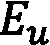
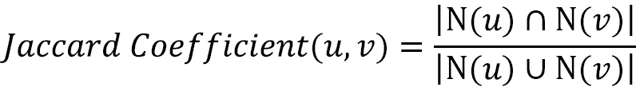
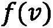
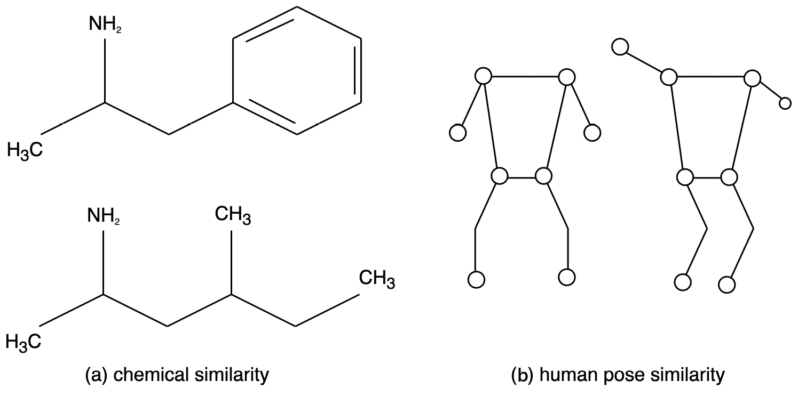

# 第五章：图上机器学习的问题

图**机器学习**（**ML**）方法可以用于广泛的任务，其应用范围从药物设计到社交网络中的推荐系统。此外，鉴于这些方法的设计是*通用的*（这意味着它们不是针对特定问题定制的），相同的算法可以用来解决不同的问题。

有一些常见问题可以使用基于图的学习技术来解决。在本章中，我们将通过提供关于如何使用我们已经在*第三章*“无监督图学习”和*第四章*“监督图学习”中已经学习到的特定算法来解决一个任务的细节，来介绍这些问题中最被广泛研究的一些。阅读本章后，你将了解在处理图时可能遇到的一些常见问题的形式化定义。此外，你还将学习到有用的机器学习管道，你可以在未来处理的真实世界问题中重复使用。

更精确地说，本章将涵盖以下主题：

+   预测图中的缺失链接

+   检测有意义的结构，如社区

+   检测图相似性和图匹配

# 技术要求

我们将使用 Python 3.8 的*Jupyter*笔记本来完成所有练习。在下面的代码块中，你可以看到使用`pip`为本章安装的 Python 库列表（例如，在命令行中运行`pip install networkx==2.5`）：

```py
Jupyter==1.0.0
networkx==2.5
karateclub==1.0.19
scikit-learn==0.24.0
pandas==1.1.3
node2vec==0.3.3
numpy==1.19.2
tensorflow==2.4.1
stellargraph==1.2.1
communities==2.2.0
git+https://github.com/palash1992/GEM.git 
```

本章相关的所有代码文件均可在[`github.com/PacktPublishing/Graph-Machine-Learning/tree/main/Chapter05`](https://github.com/PacktPublishing/Graph-Machine-Learning/tree/main/Chapter05)找到。

# 预测图中的缺失链接

**链接预测**，也称为**图补全**，是处理图时遇到的一个常见问题。更确切地说，从一个部分观察到的图——在这种图中，对于某些节点对，无法确切知道它们之间是否存在（或不存在）边——我们想要预测未知状态节点对之间是否存在边，如图*图 5.1*所示。形式上，设为一个图，其中是其节点集，是其边集。边集被称为*观测链接*，而边集被称为*未知链接*。链接预测问题的目标是利用和的信息来估计。当处理时间图数据时，这个问题也很常见。在这种情况下，设为在给定时间点观察到的图，我们想要预测该图在给定时间点的边。部分观察到的图如下所示：


图 5.1 – 具有观测链接（实线）和未知链接（虚线）的部分观察图

链接预测问题在多个领域得到广泛应用，例如在推荐系统中提出社交网络中的友谊或电子商务网站上的购买项目。它还用于犯罪网络调查，以找到犯罪集群之间的隐藏联系，以及在生物信息学中用于蛋白质-蛋白质相互作用的分析。在接下来的几节中，我们将讨论解决链接预测问题的两种方法族——即**基于相似度**和**基于嵌入**的方法。

## 基于相似度的方法

在本子节中，我们展示了几个解决标签预测问题的简单算法。所有这些算法背后的主要共同思想是在图中的每对节点之间估计一个相似度函数。如果根据该函数，节点*看起来相似*，它们将有很高的概率通过边连接。我们将将这些算法分为两个子类：`networkx`库中的`networkx.algorithms.link_prediction`包。

### 基于索引的方法

在本节中，我们将展示`networkx`中可用于计算两个不连接节点之间边概率的一些算法。这些算法基于通过分析两个不连接节点的邻居获得的信息来计算一个简单的指标。

#### 资源分配指标

资源分配索引方法通过估计所有节点对根据以下公式计算的资源分配索引来估计两个节点和之间连接的概率：


在给定的公式中，函数计算节点的邻居，正如公式中所示，是同时是和邻居的节点。这个索引可以使用以下代码在`networkx`中计算：

```py
import networkx as nx
edges = [[1,3],[2,3],[2,4],[4,5],[5,6],[5,7]]
 G = nx.from_edgelist(edges)
 preds = nx.resource_allocation_index(G,[(1,2),(2,5),(3,4)])
```

`resource_allocation_index`函数的第一个参数是输入图，第二个参数是可能边的列表。我们想要计算连接的概率。因此，我们得到以下输出：

```py
[(1, 2, 0.5), (2, 5, 0.5), (3, 4, 0.5)]
```

输出是一个包含节点对如`(1,2)`、`(2,5)`和`(3,4)`的列表，这些节点对构成了资源分配索引。根据这个输出，这些节点对之间存在边的概率是`0.5`。

#### Jaccard 系数

该算法根据*Jaccard 系数*计算两个节点和之间的连接概率，计算方法如下：



这里，用于计算节点的邻居。该函数可以使用以下代码在`networkx`中使用：

```py
import networkx as nx
edges = [[1,3],[2,3],[2,4],[4,5],[5,6],[5,7]]
 G = nx.from_edgelist(edges)
 preds = nx.resource_allocation_index(G,[(1,2),(2,5),(3,4)])
```

`resource_allocation_index`函数与之前的函数具有相同的参数。代码的结果如下：

```py
[(1, 2, 0.5), (2, 5, 0.25), (3, 4, 0.3333333333333333)]
```

根据这个输出，节点`(1,2)`之间存在边的概率是`0.5`，而节点`(2,5)`之间是`0.25`，节点`(3,4)`之间是`0.333`。

在`networkx`中，其他基于相似度分数计算两个节点之间连接概率的方法是`nx.adamic_adar_index`和`nx.preferential_attachment`，分别基于*Adamic/Adar 指数*和*优先连接指数*的计算。这些函数具有与其他函数相同的参数，并接受一个图和一个节点对的列表，其中我们想要计算分数。在下一节中，我们将展示另一系列基于社区检测的算法。

### 基于社区的方法

与基于索引的方法一样，属于这个家族的算法也计算一个表示断开节点连接概率的索引。基于索引和基于社区的方法之间的主要区别在于它们的逻辑。实际上，基于社区的方法在生成索引之前，需要计算那些节点所属社区的信息。在本小节中，我们将展示一些常见的基于社区的方法，并提供几个示例。

#### 社区常见邻居

为了估计两个节点连接的概率，此算法计算共同邻居的数量，并将属于同一社区的共同邻居数量添加到这个值中。形式上，对于两个节点  和 ，社区共同邻居值的计算如下：


在这个公式中， 用于计算节点  的邻居，而  如果  属于  和  的同一社区，否则，这个值为 0。该函数可以使用以下代码在 `networkx` 中计算：

```py
import networkx as nx
edges = [[1,3],[2,3],[2,4],[4,5],[5,6],[5,7]]
 G = nx.from_edgelist(edges)

G.nodes[1]["community"] = 0
G.nodes[2]["community"] = 0
G.nodes[3]["community"] = 0
G.nodes[4]["community"] = 1
G.nodes[5]["community"] = 1
G.nodes[6]["community"] = 1
G.nodes[7]["community"] = 1
preds = nx.cn_soundarajan_hopcroft(G,[(1,2),(2,5),(3,4)])
```

从前面的代码片段中，我们可以看到我们需要如何将 `community` 属性分配给图中的每个节点。这个属性用于在计算之前方程中定义的函数  时识别属于同一社区的两个节点。正如我们将在下一节中看到的，社区值也可以使用特定的算法自动计算。正如我们已经看到的，`cn_soundarajan_hopcroft` 函数接受输入图和一对我们想要计算分数的节点。因此，我们得到以下输出：

```py
[(1, 2, 2), (2, 5, 1), (3, 4, 1)]
```

与之前函数的主要区别在于索引值。实际上，我们可以很容易地看到输出不在 `(0,1)` 范围内。

#### 社区资源分配

与之前的方法一样，社区资源分配算法将来自节点邻居和社区的信息合并，如下公式所示：


在这里， 用于计算节点  的邻居，而  如果  属于  和  的同一社区，否则，这个值为 0。该函数可以使用以下代码在 `networkx` 中计算：

```py
import networkx as nx
edges = [[1,3],[2,3],[2,4],[4,5],[5,6],[5,7]]
 G = nx.from_edgelist(edges)

G.nodes[1]["community"] = 0
G.nodes[2]["community"] = 0
G.nodes[3]["community"] = 0
G.nodes[4]["community"] = 1
G.nodes[5]["community"] = 1
G.nodes[6]["community"] = 1
G.nodes[7]["community"] = 1
preds = nx. ra_index_soundarajan_hopcroft(G,[(1,2),(2,5),(3,4)])
```

从前面的代码片段中，我们可以看到我们需要如何将 `community` 属性分配给图中的每个节点。这个属性用于在计算之前方程中定义的函数  时识别属于同一社区的两个节点。正如我们将在下一节中看到的，社区值也可以使用特定的算法自动计算。正如我们已经看到的，`ra_index_soundarajan_hopcroft` 函数接受输入图和一对我们想要计算分数的节点。因此，我们得到以下输出：

```py
[(1, 2, 0.5), (2, 5, 0), (3, 4, 0)]
```

从前面的输出中，我们可以看到社区在索引计算中的影响。由于节点 `1` 和 `2` 属于同一社区，它们在索引中的值更高。相反，边 `(2,5)` 和 `(3,4)` 由于它们属于不同的社区，其值为 0。

在`networkx`中，有两种基于节点相似度分数合并社区信息来计算两个节点之间连接概率的方法，分别是`nx.a.within_inter_cluster`和`nx.common_neighbor_centrality`。

在下一节中，我们将描述一种基于机器学习和边缘嵌入的更复杂的技术，用于预测未知边。

## 基于嵌入的方法

在本节中，我们描述了一种更高级的进行链接预测的方法。这种方法背后的思想是将链接预测问题作为一个监督分类任务来解决。更确切地说，对于给定的图，每对节点用一个特征向量（）表示，并为每对节点分配一个类别标签（）。形式上，设为一个图，对于每对节点，我们构建以下公式：


这里，是表示节点对的*特征向量*，而是它们的*标签*。的值定义为：如果图`G`中存在连接节点的边，则为；否则为。使用特征向量和标签，我们可以训练一个机器学习算法，以预测给定的节点对是否构成给定图的合理边。

如果为每对节点构建标签向量很容易，那么构建特征空间就不那么直接了。为了为每对节点生成特征向量，我们将使用一些嵌入技术，例如已在*第三章*“无监督图学习”中讨论过的`node2vec`和`edge2vec`。使用这些嵌入算法，特征空间的生成将大大简化。实际上，整个过程可以总结为以下两个主要步骤，概述如下：

1.  对于图`G`中的每个节点，其嵌入向量是通过使用`node2vec`算法计算得到的。

1.  对于图中所有可能的节点对，嵌入是通过使用`edge2vec`算法计算得到的。

我们现在可以将通用的机器学习算法应用于生成的特征向量，以解决分类问题。

为了给您提供一个关于此过程的实际解释，我们将在下面的代码片段中提供一个示例。更确切地说，我们将使用`networkx`、`stellargraph`和`node2vec`库来描述整个流程（从图到链接预测）。我们将整个过程分成不同的步骤，以便简化我们对不同部分的理解。链接预测问题被应用于在*第一章*“Python 中的图入门”中描述的引用网络数据集，可通过以下链接获取：[`linqs-data.soe.ucsc.edu/public/lbc/cora.tgz`](https://linqs-data.soe.ucsc.edu/public/lbc/cora.tgz)。

作为第一步，我们将使用引用数据集构建一个`networkx`图，如下所示：

```py
import networkx as nx
import pandas as pd
edgelist = pd.read_csv("cora.cites", sep='\t', header=None, names=["target", "source"])
G = nx.from_pandas_edgelist(edgelist)
```

由于数据集以边列表的形式表示（参见*第一章*“Python 中的图入门”），我们使用了`from_pandas_edgelist`函数来构建图。

作为第二步，我们需要从图`G`创建训练集和测试集。更确切地说，我们的训练集和测试集应包含图`G`的真实边的子集，以及不表示`G`中真实边的节点对。代表真实边的节点对将是*正实例*（类别标签 1），而那些不表示真实边的节点对将是*负实例*（类别标签 0）。这个过程可以很容易地执行，如下所示：

```py
from stellargraph.data import EdgeSplitter
edgeSplitter = EdgeSplitter(G)
 graph_test, samples_test, labels_test = edgeSplitter.train_test_split(p=0.1, method="global")
```

我们使用了`stellargraph`中可用的`EdgeSplitter`类。`EdgeSplitter`类的主要构造参数是我们想要用于执行分割的图（`G`）。实际的分割是通过`train_test_split`函数执行的，该函数将生成以下输出：

+   `graph_test`是原始图的一个子集 ，包含所有节点，但只包含选定的边子集。

+   `samples_test`是一个向量，在每个位置包含一对节点。这个向量将包含代表真实边（正实例）的节点对，但也会包含不表示真实边的节点对（负实例）。

+   `labels_test`是一个与`samples_test`长度相同的向量，它只包含 0 或 1。0 的值出现在代表`samples_test`向量中负实例的位置，而 1 的值出现在代表`samples_test`中正实例的位置。

通过遵循用于生成测试集的相同程序，可以生成训练集，如下面的代码片段所示：

```py
edgeSplitter = EdgeSplitter(graph_test, G)
 graph_train, samples_train, labels_train = edgeSplitter.train_test_split(p=0.1, method="global")
```

这部分代码的主要区别与`EdgeSplitter`的初始化有关。在这种情况下，我们还提供了`graph_test`，以避免为测试集重复生成正负实例。

到目前为止，我们有了包含正负实例的训练和测试数据集。对于这些实例中的每一个，我们现在需要生成它们的特征向量。在这个例子中，我们使用了`node2vec`库来生成节点嵌入。一般来说，任何节点嵌入算法都可以用来执行这项任务。因此，对于训练集，我们可以使用以下代码生成特征向量：

```py
from node2vec import Node2Vec
from node2vec.edges import HadamardEmbedder
node2vec = Node2Vec(graph_train)
 model = node2vec.fit()
edges_embs = HadamardEmbedder(keyed_vectors=model.wv)
 train_embeddings = [edges_embs[str(x[0]),str(x[1])] for x in samples_train]
```

从前面的代码片段中，我们可以看到以下内容：

+   我们使用`node2vec`库为训练图中的每个节点生成嵌入。

+   我们使用`HadamardEmbedder`类来生成训练集中包含的每对节点的嵌入。这些值将被用作特征向量以执行我们模型的训练。

在这个例子中，我们使用了`HadamardEmbedder`算法，但一般来说，可以使用其他嵌入算法，例如在*第三章*中描述的，*无监督图学习*。

上一步也需要对测试集执行，以下代码所示：

```py
edges_embs = HadamardEmbedder(keyed_vectors=model.wv)
 test_embeddings = [edges_embs[str(x[0]),str(x[1])] for x in samples_test]
```

这里的唯一区别是由用于计算边嵌入的`samples_test`数组给出的。实际上，在这种情况下，我们使用了为测试集生成的数据。此外，应注意`node2vec`算法并未为测试集重新计算。确实，鉴于`node2vec`的随机性，无法保证两次学习到的嵌入是“可比较”的，因此`node2vec`嵌入会在运行之间发生变化。

现在一切已设置完毕。我们最终可以使用`train_embeddings`特征空间和`train_labels`标签分配来训练一个机器学习算法以解决标签预测问题，如下所示：

```py
from sklearn.ensemble import RandomForestClassifier
rf = RandomForestClassifier(n_estimators=1000)
 rf.fit(train_embeddings, labels_train);
```

在这个例子中，我们使用了一个简单的`RandomForestClassifier`类，但任何机器学习算法都可以用来解决这个任务。然后我们可以将训练好的模型应用于`test_embeddings`特征空间，以量化分类的质量，如下所示：

```py
from sklearn import metrics
y_pred = rf.predict(test_embeddings)
 print('Precision:', metrics.precision_score(labels_test, y_pred))
 print('Recall:', metrics.recall_score(labels_test, y_pred))
 print('F1-Score:', metrics.f1_score(labels_test, y_pred))
```

因此，我们得到以下输出：

```py
Precision: 0.8557114228456913
Recall: 0.8102466793168881
F1-Score: 0.8323586744639375
```

正如我们之前提到的，我们刚才描述的方法只是一个通用方案；管道中的每一部分——如训练/测试分割、节点/边嵌入和机器学习算法——都可以根据我们面临的具体问题进行更改。

这种方法在处理时间图中的链接预测时特别有用。在这种情况下，用于训练模型的时间点获得的信息可以用来预测时间点的边。

在本节中，我们介绍了标签预测问题。我们通过提供描述和几个示例，丰富了我们的解释，展示了用于找到链接预测问题解决方案的不同技术。我们展示了处理问题的不同方法，从简单的基于索引的技术到更复杂的基于嵌入的技术。然而，科学文献中充满了用于解决链接预测任务的算法，并且存在不同的算法来解决此问题。在论文《关于学习与提取链接预测图特征的综述》（[`arxiv.org/pdf/1901.03425.pdf`](https://arxiv.org/pdf/1901.03425.pdf)）中，可以找到解决链接预测问题所使用不同技术的良好概述。在下一节中，我们将研究社区检测问题。

# 检测有意义的结构，如社区

数据科学家在处理网络时面临的一个常见问题是如何在图中识别集群和社区。这种情况通常出现在从社交网络和已知存在社区中导出的图中。然而，这些底层算法和方法也可以在其他环境中使用，代表了一种执行聚类和分割的另一种选择。例如，这些方法可以有效地用于文本挖掘，以识别新兴主题和将引用单个事件/主题的文档进行聚类。社区检测任务包括将图划分为几个部分，使得属于同一社区的节点之间紧密相连，而与其他社区的节点之间则弱连接。存在几种识别社区的策略。一般来说，我们可以将它们定义为属于以下两个类别之一，如下所述：

+   **非重叠**社区检测算法，提供节点与社区之间的一对一关联，因此社区之间没有重叠节点

+   **重叠**社区检测算法，允许一个节点被包含在多个社区中——例如，反映社交网络自然发展重叠社区的趋势（例如，来自同一所学校的朋友、邻居、玩伴、在同一足球队的人等等），或者在生物学中，一个单一的蛋白质可以参与多个过程和生物反应

在以下部分，我们将回顾社区检测中最常用的技术。

## 基于嵌入的社区检测

一类允许我们将节点划分为社区的方法可以通过在节点嵌入上应用标准浅层聚类技术简单获得，这些嵌入是通过*第三章*，*无监督图学习*中描述的方法计算的。实际上，嵌入方法允许我们将节点投影到向量空间中，在该空间中可以定义表示节点之间相似性的距离度量。正如我们在*第三章*，*无监督图学习*中所示，嵌入算法在分离具有相似邻域和/或连接属性节点方面非常有效。然后，可以使用标准聚类技术，例如基于距离的聚类（K-means）、基于连接的聚类（层次聚类）、基于分布的聚类（高斯混合）和基于密度的聚类（`networkx`实用函数，如下所示：

```py
import networkx as nx 
G = nx.barbell_graph(m1=10, m2=4) 
```

然后，我们可以首先使用我们之前看到的嵌入算法之一（例如，`HOPE`）获取减少的密集节点表示，如下所示：

```py
from gem.embedding.hope import HOPE 
gf = HOPE(d=4, beta=0.01) 
gf.learn_embedding(G) 
 embeddings = gf.get_embedding() 
```

我们最终可以在节点嵌入提供的向量表示上运行聚类算法，如下所示：

```py
from sklearn.mixture import GaussianMixture
gm = GaussianMixture(n_components=3, random_state=0)
 labels = gm.fit_predict(embeddings)
```

我们可以用不同的颜色突出显示计算出的社区，并绘制出网络图，如下所示：

```py
colors = ["blue", "green", "red"]
nx.draw_spring(G, node_color=[colors[label] for label in labels])
```

通过这样做，你应该会获得以下屏幕截图所示的输出：


图 5.2 – 使用基于嵌入的方法应用社区检测算法的哑铃图

这两个簇以及连接的节点已经被正确地分成了三个不同的社区，反映了图的内部结构。

## 谱方法和矩阵分解

另一种实现图划分的方法是处理表示图连接属性邻接矩阵或拉普拉斯矩阵。例如，可以通过在拉普拉斯矩阵的特征向量上应用标准聚类算法来获得谱聚类。在某种意义上，谱聚类也可以被视为一种基于嵌入的社区检测算法的特殊情况，其中嵌入技术被称为谱嵌入，通过考虑拉普拉斯矩阵的前 k 个特征向量获得。通过考虑拉普拉斯的不同定义以及不同的相似性矩阵，可以得到该方法的不同变体。此方法的方便实现可以在`communities` Python 库中找到，并且可以轻松地应用于从`networkx`图中获得的邻接矩阵表示，如下面的代码片段所示：

```py
from communities.algorithms import spectral_clustering
adj=np.array(nx.adjacency_matrix(G).todense())
communities = spectral_clustering(adj, k=2)
```

此外，邻接矩阵（或拉普拉斯矩阵）也可以使用除了**奇异值分解**（**SVD**）技术之外的矩阵分解技术进行分解——例如**非负矩阵分解**（**NMF**）——允许类似的描述，如下面的代码片段所示：

```py
from sklearn.decomposition import NMF
nmf = NMF(n_components=2)
 score = nmf.fit_transform(adj)
communities = [set(np.where(score [:,ith]>0)[0])
               for ith in range(2)]
```

在这个例子中，社区归属的阈值被设置为 0，尽管也可以使用其他值来仅保留社区核心。请注意，这些方法是重叠的社区检测算法，节点可能属于多个社区。

## 概率模型

社区检测方法也可以通过拟合生成概率图模型的参数来推导。例如，在*第一章*“Python 中图形入门”中已经描述了生成模型。然而，它们并没有假设存在任何潜在的社区，与所谓的**随机块模型**（**SBM**）不同。事实上，这个模型基于这样的假设：节点可以被划分为*K*个不相交的社区，并且每个社区都有一个定义的概率，可以连接到另一个社区。对于一个包含*n*个节点和*K*个社区的图，生成模型因此由以下参数来定义：

+   **隶属矩阵**：*M*，这是一个*n x K*矩阵，表示给定节点属于某个特定类别*k*的概率

+   **概率矩阵**：*B*，这是一个*K x K*矩阵，表示属于社区*i*的节点与属于社区*j*的节点之间的边概率

邻接矩阵随后通过以下公式生成：


在这里，和代表社区，它们可以通过从概率和的多项分布中进行抽样来获得。

在 SBM 中，我们可以基本上逆转公式，将社区检测问题简化为从矩阵*A*中通过最大似然估计对隶属矩阵*M*的后验估计。最近，这种方法与随机谱聚类一起使用，以在非常大的图中进行社区检测。请注意，在恒定概率矩阵的极限下（即，），SBM 模型对应于 Erdős-Rényi 模型。这些模型的优势在于它们还描述了社区之间的关系，确定了社区间的联系。

## 成本函数最小化

在图中检测社区的另一种可能方法是优化一个表示图结构的给定成本函数，并惩罚社区间的边相对于社区内的边。这基本上包括构建一个衡量社区质量（如我们很快将看到的，其模块度）的度量，然后优化节点到社区的关联，以最大化整体划分的质量。

在二元关联社区结构的背景下，社区关联可以通过一个二分变量  来描述，其值为 -1 或 1，具体取决于节点是否属于两个社区中的任何一个。在这种情况下，我们可以定义以下数量，它确实可以用来有效地表示两个不同社区节点之间链接的成本：


事实上，当两个相连的节点  属于不同的社区  时，边的贡献是正的。另一方面，当两个节点没有连接 () 或者两个相连的节点属于同一社区 () 时，贡献为 0。因此，问题是要找到最佳的社区分配 ( 和 ) 以最小化前面的函数。然而，这种方法仅适用于二元社区检测，因此在应用上相当有限。

属于这一类别的另一个非常流行的算法是 Louvain 方法，该算法的名字来源于它被发明的那所大学。这个算法的目标是最大化模块度，其定义如下：


在这里， 表示边的数量， 和  分别表示第 i 个和第 j 个节点的度，而  是克罗内克δ函数，当  和  有相同的值时为 1，否则为 0。模块度基本上代表了一个与随机重新布线节点相比，社区识别性能提升的度量。因此，它创建了一个具有相同数量边和度分布的随机网络。

为了有效地最大化这个模块度，Louvain 方法迭代地计算以下步骤：

1.  **模块度优化**：节点被迭代地移动，并且对于每个节点，我们计算如果该节点被分配给其邻居的每个社区，模块度*Q*会有多大的变化。一旦计算了所有值，节点就会被分配到提供最大增加的社区。如果将节点放置在任何其他社区中都不会获得增加，则节点将保留在其原始社区中。此优化过程会一直持续到不再引起变化。

1.  **节点聚合**：在第二步中，我们通过将同一社区中的所有节点分组并使用连接两个社区的所有边的总和形成的边来构建一个新的网络。社区内的边也通过自环来计算，这些自环的权重是社区中所有边权重总和的结果。

在`communities`库中可以找到 Louvain 实现的示例，如下代码片段所示：

```py
from communities.algorithms import louvain_method
communities = louvain_method(adj) 
```

另一种最大化模块度的方法是 Girvan-Newman 算法，该算法基于迭代移除具有最高中介中心性的边（因此连接两个分离的节点簇）以创建连通组件社区。以下是相关的代码：

```py
from communities.algorithms import girvan_newman
communities = girvan_newman(adj, n=2)
```

注意

后者算法需要计算所有边的介数中心性以移除边。在大型图中，此类计算可能非常昂贵。实际上，Girvan-Newman 算法的扩展性为，其中是边的数量，是节点的数量，并且当处理大型数据集时不应使用。

# 检测图相似性和图匹配

学习图中相似性的量化度量被认为是关键问题。事实上，这是网络分析的关键步骤，也可以促进许多机器学习问题，例如分类、聚类和排序。例如，许多聚类算法使用相似性概念来确定一个对象是否应该是某个组的成员。

在图域中，找到一个有效的相似度度量对于许多应用来说是一个关键问题。例如，考虑图内一个节点的*角色*。这个节点可能对于在网络中传播信息或保证网络鲁棒性非常重要：例如，它可能是星形图的中心，或者它可能是团的一部分。在这种情况下，有一个强大的方法来根据节点的角色比较节点将非常有用。例如，你可能对寻找表现出相似角色或呈现类似异常行为的个人感兴趣。你也可以用它来搜索相似的子图或确定网络的兼容性以进行*知识迁移*。例如，如果你找到一个提高网络鲁棒性的方法，并且你知道这样的网络与另一个网络非常相似，你可以直接将适用于第一个网络的同一种解决方案应用于第二个网络：


图 5.3 – 两个图之间差异的示例

可以使用几种度量来衡量两个对象之间的相似度（距离）。一些例子包括*欧几里得距离*、*曼哈顿距离*、*余弦相似度*等等。然而，这些度量可能无法捕捉到正在研究的数据的特定特征，尤其是在非欧几里得结构如图上。看看*图 5.3*：**G1**和**G2**看起来有多“远”？它们看起来相当相似。但是，如果**G2**中红色社区缺失的连接导致严重的信息损失，情况会怎样？它们仍然看起来相似吗？

已经提出了几种基于数学概念如*图同构*、*编辑距离*和*公共子图*的算法方法和启发式方法（我们建议阅读[`link.springer.com/article/10.1007/s10044-012-0284-8`](https://link.springer.com/article/10.1007/s10044-012-0284-8)以获取详细综述）。许多这些方法目前在实际应用中被使用，即使它们通常需要指数级高的计算时间来解决一般**NP 完全**问题（其中**NP**代表**非确定性多项式时间**）。因此，找到或学习一个用于测量特定任务中涉及的数据点相似度的度量标准是至关重要的。正是在这里，机器学习（ML）为我们提供了帮助。

在我们之前已经看到的*第三章*，“无监督图学习”，和*第四章*，“监督图学习”中的许多算法可能对学习有效的相似度度量很有用。根据它们的使用方式，可以定义一个精确的分类法。在这里，我们提供了一个关于图相似性技术的简单概述。更全面的列表可以在论文《深度图相似性学习：综述》([`arxiv.org/pdf/1912.11615.pdf`](https://arxiv.org/pdf/1912.11615.pdf))中找到。它们基本上可以分为三个主要类别，尽管也可以开发出复杂的组合。**基于图嵌入的方法**使用嵌入技术来获取图的嵌入表示，并利用这种表示来学习相似度函数；**基于图核的方法**通过测量构成子结构的相似度来定义图之间的相似度；**基于图神经网络的方法**使用**图神经网络**（**GNNs**）来联合学习嵌入表示和相似度函数。让我们更详细地看看它们。

## 基于图嵌入的方法

这些技术试图将图嵌入技术应用于获取节点级或图级表示，并进一步使用这些表示进行相似度学习。例如，*DeepWalk*和*Node2Vec*可以用来提取有意义的嵌入，然后可以用来定义相似度函数或预测相似度分数。例如，在 Tixier 等人（2015）的研究中，`node2vec`被用来编码节点嵌入。然后，从这些节点嵌入中获得的**二维**（**2D**）直方图被传递到一个为图像设计的经典二维**卷积神经网络**（**CNN**）架构。这种简单而强大的方法使得从许多基准数据集中得出良好的结果成为可能。

## 基于图核的方法

**基于图核的方法**在捕捉图之间的相似度方面引起了很大兴趣。这些方法将两个图之间的相似度计算为它们某些子结构相似度的函数。根据它们使用的子结构，存在不同的图核，包括随机游走、最短路径和子图。例如，一种称为**深度图核**（**DGK**）的方法（Yanardag 等人，2015）将图分解为被视为“单词”的子结构。然后，使用**自然语言处理**（**NLP**）方法，如**连续词袋**（**CBOW**）和**跳字模型**（**skip-gram**）来学习子结构的潜在表示。这样，两个图之间的核基于子结构空间的相似度来定义。

## GNN-based methods

随着深度学习（**DL**）技术的出现，图神经网络（GNNs）已成为学习图上表示的强大新工具。这些强大的模型可以轻松地适应各种任务，包括图相似性学习。此外，它们相对于其他传统图嵌入方法具有关键优势。确实，后者通常在独立阶段学习表示，而在这种类型的方法中，表示学习和目标学习任务是一起进行的。因此，GNN 深度模型可以更好地利用图特征来执行特定的学习任务。我们已经在*第三章*的“无监督图学习”中看到了使用 GNNs 进行相似性学习的例子，其中训练了一个双分支网络来估计两个图之间的邻近距离。

## 应用

在许多领域，图上的相似性学习已经取得了有希望的结果。在化学和生物信息学中可能找到重要的应用，例如，用于寻找与查询化合物最相似的化学物质，如图中左侧所示。在神经科学中，相似性学习方法已经开始应用于测量多个受试者之间脑网络的相似性，从而允许进行新颖的临床研究，以研究脑部疾病。



图 5.4 – 图如何有助于表示各种对象的示例：（a）两种化学物质的差异；（b）两种人类姿态的差异

图相似性学习在计算机安全领域也得到了探索，其中已经提出了新颖的方法来检测软件系统中的漏洞以及硬件安全问题。最近，观察到一种趋势，即应用此类解决方案来解决计算机视觉问题。一旦将图像转换为图数据的挑战性问题得到解决，确实可以提出一些有趣的方法来解决视频序列中的人类动作识别和场景中的物体匹配等问题（如图 5.4 的右侧所示）。

# 摘要

在本章中，我们学习了如何使用基于图的机器学习技术来解决许多不同的问题。

尤其是我们可以看到，相同的算法（或其略微修改的版本）可以适应解决看似非常不同的任务，例如链接预测、社区检测和图相似性学习。我们也看到，每个问题都有其独特的特点，研究人员已经利用这些特点来设计更复杂的解决方案。

在下一章中，我们将探讨使用机器学习解决的问题的实际问题。
