# 第七章：使用图进行文本分析和自然语言处理

现在，大量的信息以自然书面语言的形式以文本的形式存在。你现在正在阅读的这本书就是一个例子。你每天早上阅读的新闻，你之前发送/阅读的推文或 Facebook 帖子，你为学校作业撰写的报告，我们持续撰写的电子邮件——这些都是我们通过书面文档和文本交换信息的例子。这无疑是间接互动中最常见的方式，与直接互动如谈话或手势相反。因此，能够利用这类信息并从文档和文本中提取见解至关重要。

现今以这种形式存在的海量信息决定了自然语言处理（**NLP**）领域的大发展和近期进步。

在本章中，我们将向您展示如何处理自然语言文本，并回顾一些基本模型，这些模型使我们能够结构化文本信息。使用从文档语料库中提取的信息，我们将向您展示如何创建可以使用我们在前几章中看到的一些技术进行分析的网络。特别是，使用标记语料库，我们将向您展示如何开发监督（用于将文档分类到预定的主题的分类模型）和无监督（社区检测以发现新主题）算法。

本章涵盖以下主题：

+   快速概述数据集

+   理解 NLP 中使用的主要概念和工具

+   从文档语料库创建图

+   构建文档主题分类器

# 技术要求

我们将在所有练习中使用*Python 3.8*。以下是在本章中必须使用 pip 安装的 Python 库列表。例如，在命令行上运行`pip install networkx==2.4`等。

```py
networkx==2.4 
scikit-learn==0.24.0
stellargraph==1.2.1
spacy==3.0.3
pandas==1.1.3
numpy==1.19.2
node2vec==0.3.3
Keras==2.0.2
tensorflow==2.4.1
communities==2.2.0
gensim==3.8.3
matplotlib==3.3.4
nltk==3.5
fasttext==0.9.2
```

与本章相关的所有代码文件均可在[`github.com/PacktPublishing/Graph-Machine-Learning/tree/main/Chapter07`](https://github.com/PacktPublishing/Graph-Machine-Learning/tree/main/Chapter07)找到。

# 快速概述数据集

为了向您展示如何处理文档语料库以提取相关信息，我们将使用一个来自 NLP 领域知名基准的数据集：所谓的**路透社-21578**。原始数据集包括一组在 1987 年发布的 21,578 篇金融路透社新闻稿，这些新闻稿被汇编并按类别索引。原始数据集具有非常倾斜的分布，一些类别仅在训练集或测试集中出现。因此，我们将使用一个修改后的版本，称为**ApteMod**，也称为*路透社-21578 分布 1.0*，它具有较小的倾斜分布，并且在训练集和测试数据集之间具有一致的标签。

尽管这些文章有些过时，但该数据集已被用于大量关于 NLP 的论文中，并且仍然代表了一个常用于算法基准的数据集。

事实上，Reuters-21578 包含足够多的文档，可以进行有趣的后期处理和洞察。如今可以轻易找到包含更多文档的语料库（例如，查看[`github.com/niderhoff/nlp-datasets`](https://github.com/niderhoff/nlp-datasets)以了解最常见的语料库概述），但它们可能需要更大的存储和计算能力，以便进行处理。在*第九章**，构建数据驱动、图增强应用程序*中，我们将向您展示一些可以用来扩展您的应用程序和分析的工具和库。

Reuters-21578 数据集中的每个文档都提供了一组标签，代表其内容。这使得它成为测试监督和无监督算法的完美基准。可以使用`nltk`库轻松下载 Reuters-21578 数据集（这是一个非常有用的库，用于文档的后期处理）：

```py
from nltk.corpus import reuters
corpus = pd.DataFrame([
    {"id": _id,
     "text": reuters.raw(_id).replace("\n", ""), 
     "label": reuters.categories(_id)}
    for _id in reuters.fileids()
])
```

如您从检查`corpus`数据框中可以看到的，ID 的格式为`training/{ID}`和`test/{ID}`，这使得很清楚哪些文档应该用于训练和测试。首先，让我们列出所有主题，并使用以下代码查看每个主题有多少文档：

```py
from collections import Counter
Counter([label for document_labels in corpus["label"] for label in document_labels]).most_common()
```

Reuters-21578 数据集包含 90 个不同的主题，类别之间存在着显著的不平衡，其中`最常见`类别中有近 37%的文档，而在五个`最少见`类别中每个类别只有 0.01%。正如您从检查文本中可以看到的，一些文档中嵌入了一些换行符，这些换行符在第一次文本清理阶段可以很容易地被移除：

```py
corpus["clean_text"] = corpus["text"].apply(
    lambda x: x.replace("\n", "")
)
```

现在我们已经将数据加载到内存中，我们可以开始分析它了。在下一小节中，我们将向您展示一些可以用来处理非结构化文本数据的主要工具。它们将帮助您提取结构化信息，以便可以轻松使用。

# 理解 NLP 中使用的主要概念和工具

在处理文档时，第一个分析步骤无疑是推断文档语言。实际上，用于自然语言处理任务的大多数分析引擎都是在特定语言的文档上训练的，并且应该仅用于这种语言。最近，一些构建跨语言模型的尝试（例如，多语言嵌入[`fasttext.cc/docs/en/aligned-vectors.html`](https://fasttext.cc/docs/en/aligned-vectors.html)和[`github.com/google-research/bert/blob/master/multilingual.md`](https://github.com/google-research/bert/blob/master/multilingual.md)）越来越受欢迎，尽管它们在自然语言处理模型中仍然只占一小部分。因此，首先推断语言以便使用正确的下游分析自然语言处理管道是非常常见的。

您可以使用不同的方法来推断语言。一种非常简单但有效的方法是查找语言中最常见的单词（所谓的`停用词`，如`the`、`and`、`be`、`to`、`of`等）并根据它们的频率构建一个分数。然而，它的精确度往往局限于短文本，并且没有利用单词的位置和上下文。另一方面，Python 有许多使用更复杂逻辑的库，允许我们以更精确的方式推断语言。这些库中的一些是`fasttext`、`polyglot`和`langdetect`，仅举几个例子。

例如，在下面的代码中，我们将使用`fasttext`，它可以通过很少的代码行进行集成，并支持超过 150 种语言。可以使用以下代码片段推断所有文档的语言：

```py
from langdetect import detect
import numpy as np
def getLanguage(text: str):
    try:
        return langdetect.detect(text)
    except:
        return np.nan
corpus["language"] = corpus["text"].apply(langdetect.detect)
```

正如您将在输出中看到的那样，似乎有一些非英语语言的文档。事实上，这些文档通常要么非常短，要么结构奇特，这意味着它们不是真正的新闻文章。当文档代表人类阅读并标记为新闻的文本时，模型通常非常精确和准确。

现在我们已经推断出了语言，我们可以继续分析管道的语言相关步骤。对于以下任务，我们将使用`spaCy`，这是一个极其强大的库，它允许我们用很少的代码行嵌入最先进的自然语言处理模型。在用`pip install spaCy`安装库之后，可以通过使用`spaCy`下载工具简单地安装它们来集成特定语言模型。例如，以下命令可以用来下载和安装英语模型：

```py
python -m spacy download en_core_web_sm
```

现在，我们应该已经准备好了可以使用的英语语言模型。让我们看看它能够提供哪些信息。使用 spaCy 非常简单，只需一行代码就可以将计算嵌入为一个非常丰富的信息集。让我们首先将模型应用于路透社语料库中的一个文档：

SUBROTO 表示印度尼西亚支持锡协议延期

能源和矿业部长 Subroto 确认印度尼西亚支持第六次**国际锡协定**（**ITA**）的延长，但表示新的协议并非必要。应路透社要求，Subroto 在周一澄清了他的声明，称该协议应被允许失效，他表示印度尼西亚准备支持 ITA 的延长。“我们可以支持第六次协议的延长，”他说。“但我们认为第七次协议是不必要的。”除非三分之二的大多数成员投票支持延长，否则第六次 ITA 将于六月底到期。

只需加载模型并将其应用于文本，`spacy` 就可以轻松应用。

```py
nlp = spacy.load('en_core_web_md')
parsed = nlp(text)
```

由于许多模型被组合到一个单独的管道中，`parsed` 对象返回时具有几个字段。这些提供了不同级别的文本结构化。让我们逐一检查它们：

+   `spacy` 通常工作得相当好。然而，请注意，根据上下文，可能需要进行一些模型调整或规则修改。例如，当您处理包含俚语、表情符号、链接和标签的短文本时，对于文本分割和标记化，更好的选择可能是 `TweetTokenizer`，它包含在 `nltk` 库中。根据上下文，我们鼓励您探索其他可能的分割方式。

    在 `spacy` 返回的文档中，句子分割可以在 `parsed` 对象的 `sents` 属性中找到。可以通过以下代码简单地遍历每个句子的标记：

    ```py
    for sent in parsed.sents:
        for token in sent:
            print(token)
    ```

    每个标记都是一个 spaCy `Span` 对象，它具有指定标记类型和由其他模型引入的进一步特征化的属性。

+   (`DET`) 通常后面跟着一个名词，等等。当使用 spaCy 时，关于词性标注的信息通常存储在 `Span` 对象的 `label_` 属性中。可用的标签类型可以在 [`spacy.io/models/en`](https://spacy.io/models/en) 找到。相反，您可以使用 `spacy.explain` 函数为给定类型获取一个可读的值。

+   `parsed` 对象的 `ents` 属性。spaCy 还提供了一些通过 `displacy` 模块可视化文本中实体的实用工具：

    ```py
    displacy.render(parsed, style='ent', jupyter=True)
    ```

    这导致了以下输出：

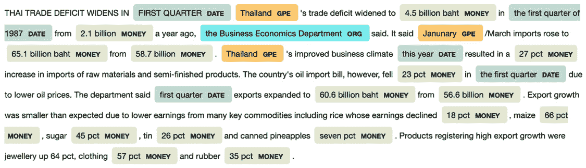

图 7.1 – spaCy NER 引擎输出的示例

+   `spacy` 可以用来构建一个可以导航以识别标记之间关系的句法树。正如我们很快就会看到的，当构建知识图谱时，这些信息可能是至关重要的：

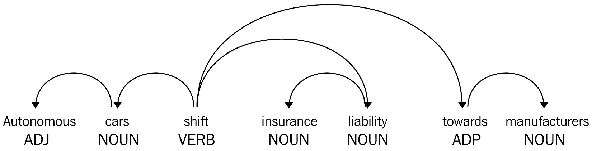

图 7.2 – spaCy 提供的句法依存树示例

+   通过 `lemma_` 属性访问 `Span` 对象。

    如前图所示，spaCy 管道可以轻松集成以处理整个语料库并将结果存储在我们的 `corpus` DataFrame 中：

    ```py
    nlp = spacy.load('en_core_web_md')
    sample_corpus["parsed"] = sample_corpus["clean_text"]\
        .apply(nlp)
    ```

这个数据框代表了文档的结构化信息。这将是所有后续分析的基础。在下一节中，我们将展示如何使用此类信息构建图。

# 从文档语料库中创建图

在本节中，我们将使用上一节中通过不同的文本引擎提取的信息来构建关联不同信息的网络。特别是，我们将关注两种类型的图：

+   **基于知识的图**，我们将使用句子的语义意义来推断不同实体之间的关系。

+   **二分图**，我们将连接文档和文本中出现的实体。然后，我们将二分图投影到一个同质图中，该图只由文档或实体节点组成。

## 知识图谱

知识图谱非常有趣，因为它们不仅关联实体，还提供了关系的方向和意义。例如，让我们看看以下关系：

我 (->) 买 (->) 一本书

这与以下关系有显著不同：

我 (->) 卖 (->) 一本书

除了关系类型（购买或销售）之外，还有一个方向也很重要，即主语和宾语不是对称处理的，而是存在执行动作的人和动作的目标之间的差异。

因此，要创建一个知识图谱，我们需要一个能够识别每个句子的**主语-谓语-宾语**（**SVO**）三元组的函数。这个函数可以应用于语料库中的所有句子；然后，所有三元组可以汇总生成相应的图。

SVO 提取器可以建立在 spaCy 模型提供的丰富之上。确实，依赖树解析器提供的标记对于区分主句及其从句以及识别 SOV 三元组非常有帮助。业务逻辑可能需要考虑一些特殊情况（如并列连词、否定和介词处理），但这可以通过一组规则来编码。此外，这些规则也可能根据具体用例而变化，用户可以根据需要进行微调。此类规则的基础实现可以在[`github.com/NSchrading/intro-spacy-nlp/blob/master/subject_object_extraction.py`](https://github.com/NSchrading/intro-spacy-nlp/blob/master/subject_object_extraction.py)找到。这些规则已经稍作修改，并包含在这本书提供的 GitHub 仓库中。使用这个辅助函数，我们可以计算语料库中的所有三元组并将它们存储在我们的`corpus`数据框中：

```py
from subject_object_extraction import findSVOs
corpus["triplets"] = corpus["parsed"].apply(
    lambda x: findSVOs(x, output="obj")
)
edge_list = pd.DataFrame([
    {
        "id": _id,
        "source": source.lemma_.lower(),
        "target": target.lemma_.lower(),
        "edge": edge.lemma_.lower()
    }
    for _id, triplets in corpus["triplets"].iteritems()
    for (source, (edge, neg), target) in triplets
])
```

连接的类型（由句子的主要谓语决定）存储在`edge`列中。可以使用以下命令显示前 10 个最常见的关联关系：

```py
edges["edge"].value_counts().head(10)
```

最常见的边类型对应于非常基本的谓词。确实，除了非常一般的动词（如 be、have、tell 和 give）之外，我们还可以找到更多与金融背景相关的谓词（如 buy、sell 和 make）。使用所有这些边，我们现在可以使用`networkx`实用函数创建我们的基于知识的图：

```py
G = nx.from_pandas_edgelist(
    edges, "source", "target", 
    edge_attr=True, create_using=nx.MultiDiGraph()
)
```

通过过滤边数据框并使用此信息创建子网络，我们可以分析特定关系类型，例如`lend`边：

```py
G=nx.from_pandas_edgelist(
    edges[edges["edge"]=="lend"], "source", "target",
    edge_attr=True, create_using=nx.MultiDiGraph()
)
```

下面的图显示了基于*贷款*关系的子图。正如我们所见，它已经提供了有趣的经济洞察，例如国家之间的经济关系，如委内瑞拉-厄瓜多尔和美苏关系：

![图 7.3 – 与贷款关系相关的知识图的一部分示例]

![图片 B16069_07_03.jpg]

图 7.3 – 与贷款关系相关的知识图的一部分示例

您可以通过根据其他关系过滤图来玩弄前面的代码。我们确实鼓励您这样做，以便从我们刚刚创建的知识图中揭示更多有趣的见解。在下一节中，我们将向您展示另一种方法，允许我们将从文本中提取的信息编码到图结构中。这样做时，我们还将利用我们在*第一章**,* *二分图*中介绍的一种特定类型的图。

## 文档/实体二分图

知识图可以揭示和查询实体上的聚合信息。然而，其他图表示也是可能的，并且在其他情况下可能很有用。例如，当您想要在语义上对文档进行聚类时，知识图可能不是最佳的数据结构来使用和分析。知识图在寻找间接关系方面也不是非常有效，例如识别竞争对手、类似产品等，这些关系通常不会出现在同一句话中，但经常出现在同一文档中。

为了解决这些限制，我们将以**二分图**的形式对文档中存在的信息进行编码。对于每个文档，我们将提取最相关的实体，并将代表文档的节点与该文档中代表相关实体的所有节点连接起来。每个节点可能有多个关系：根据定义，每个文档连接多个实体。相反，一个实体可以在多个文档中被引用。正如我们将看到的，交叉引用可以用来创建实体和文档之间的相似度度量。这种相似度也可以用来将二分图投影到特定的节点集——要么是文档节点，要么是实体节点。

为了达到这个目的，构建我们的二分图，我们需要提取文档的相关实体。术语“相关实体”显然是模糊和广泛的。在当前上下文中，我们将相关实体视为命名实体（如由 NER 引擎识别的组织、人或地点）或关键词；即一个词（或词的组合），它可以识别并通常描述文档及其内容。例如，这本书的合适关键词可能是“图”、“网络”、“机器学习”、“监督模型”和“无监督模型”。存在许多从文档中提取关键词的算法。一种非常简单的方法是基于所谓的 TF-IDF 分数，它为每个标记（或标记组，通常称为“词组”）构建一个分数，该分数与文档中的词频（**词频**，或 **TF**）成正比，并与该词在给定语料库中的频率的倒数（**逆文档频率**，或 **IDF**）成正比：

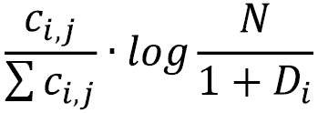

这里， 代表文档  中词 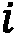 的计数， 代表语料库中的文档数量，而  是出现词  的文档。因此，TF-IDF 分数促进了在文档中多次重复的词，惩罚了常见且可能不是文档非常有代表性的词。也存在更复杂的算法。

在本书的上下文中，确实有一种非常强大且值得提及的方法是 `gensim`，它可以以直接的方式使用：

```py
from gensim.summarization import keywords
text = corpus["clean_text"][0]
 keywords(text, words=10, split=True, scores=True,
         pos_filter=('NN', 'JJ'), lemmatize=True)
```

这会产生以下输出：

```py
[('trading', 0.4615130639538529),
 ('said', 0.3159855693494515),
 ('export', 0.2691553824958079),
 ('import', 0.17462010006456888),
 ('japanese electronics', 0.1360932626379031),
 ('industry', 0.1286043740379779),
 ('minister', 0.12229815662000462),
 ('japan', 0.11434500812642447),
 ('year', 0.10483992409352465)]
```

在这里，分数代表中心性，它代表一个给定标记的重要性。正如你所看到的，一些复合标记也可能出现，例如“日本电子产品”。可以通过实现关键词提取来计算整个语料库的关键词，从而将信息存储在我们的 `corpus` DataFrame 中：

```py
corpus["keywords"] = corpus["clean_text"].apply(
    lambda text: keywords(
       text, words=10, split=True, scores=True,
       pos_filter=('NN', 'JJ'), lemmatize=True)
)
```

除了关键词之外，为了构建二分图，我们还需要解析由 NER 引擎提取的命名实体，然后将信息编码成与关键词使用类似的数据格式。这可以通过使用几个实用函数来完成：

```py
def extractEntities(ents, minValue=1, 
                    typeFilters=["GPE", "ORG", "PERSON"]):
    entities = pd.DataFrame([
       {
          "lemma": e.lemma_, 
          "lower": e.lemma_.lower(),
          "type": e.label_
       } for e in ents if hasattr(e, "label_")
    ])
    if len(entities)==0:
        return pd.DataFrame()
    g = entities.groupby(["type", "lower"])
    summary = pd.concat({
        "alias": g.apply(lambda x: x["lemma"].unique()),
        "count": g["lower"].count()
    }, axis=1)
    return summary[summary["count"]>1]\
             .loc[pd.IndexSlice[typeFilters, :, :]]

def getOrEmpty(parsed, _type):
    try:  
        return list(parsed.loc[_type]["count"]\
           .sort_values(ascending=False).to_dict().items())
    except:
        return []
def toField(ents):
    typeFilters=["GPE", "ORG", "PERSON"]
    parsed = extractEntities(ents, 1, typeFilters)
    return pd.Series({_type: getOrEmpty(parsed, _type)
                      for _type in typeFilters})
```

使用这些函数，可以通过以下代码解析 `spacy` 标签：

```py
entities = corpus["parsed"].apply(lambda x: toField(x.ents))
```

可以使用 `pd.concat` 函数轻松地将 `entities` DataFrame 与 `corpus` DataFrame 合并，从而将所有信息放置在单一的数据结构中：

```py
merged = pd.concat([corpus, entities], axis=1)
```

现在我们已经拥有了构建二分图的所有成分，我们可以通过遍历所有文档-实体或文档-关键词对来创建边列表：

```py
edges = pd.DataFrame([
    {"source": _id, "target": keyword, "weight": score, "type": _type}
    for _id, row in merged.iterrows()
    for _type in ["keywords", "GPE", "ORG", "PERSON"] 
    for (keyword, score) in row[_type]
])
```

一旦创建了边列表，我们就可以使用 `networkx` API 生成二分图：

```py
G = nx.Graph()
G.add_nodes_from(edges["source"].unique(), bipartite=0)
 G.add_nodes_from(edges["target"].unique(), bipartite=1)
 G.add_edges_from([
    (row["source"], row["target"])
    for _, row in edges.iterrows()
])
```

现在，我们可以使用 `nx.info` 来查看我们图的概述：

```py
Type: Graph
Number of nodes: 25752
Number of edges: 100311
Average degree:   7.7905
```

在下一小节中，我们将对两个节点集之一（实体或文档）中的二分图进行投影。这将使我们能够探索两个图之间的差异，并使用在第*第四章**，监督图学习*中描述的无监督技术对术语和文档进行聚类。然后，我们将回到二分图，展示监督分类的一个例子，我们将通过利用二分图的网络信息来完成这项工作。

### 实体-实体图

我们将首先将我们的图投影到实体节点集。`networkx`提供了一个专门用于处理二分图的子模块，`networkx.algorithms.bipartite`，其中已经实现了许多算法。特别是，`networkx.algorithms.bipartite.projection`子模块提供了一些实用函数，用于将二分图投影到节点子集。在执行投影之前，我们必须使用我们在生成图时创建的“二分”属性提取与特定集合（文档或实体）相关的节点：

```py
document_nodes = {n 
                  for n, d in G.nodes(data=True)
                  if d["bipartite"] == 0}
entity_nodes = {n 
                for n, d in G.nodes(data=True)
                if d["bipartite"] == 1}
```

图投影基本上是通过选择节点集创建一个新的图。边是节点之间的位置，基于两个节点是否有共同的邻居。基本的`projected_graph`函数创建了一个无权边的网络。然而，基于共同邻居数量的边权重通常更有信息量。`projection`模块提供了基于权重计算方式的不同函数。在下一节中，我们将使用`overlap_weighted_projected_graph`，其中边权重是通过基于共同邻居的 Jaccard 相似度来计算的。然而，我们也鼓励您探索其他选项，这些选项根据您的用例和上下文，可能最适合您的目标。

#### 注意维度 - 过滤图

在处理投影时，你应该注意的另一个问题是投影图的维度。在某些情况下，例如我们在这里考虑的情况，投影可能会创建极其大量的边，这使得图难以分析。在我们的用例中，根据我们创建网络的逻辑，一个文档节点至少连接到 10 个关键词，以及一些实体。在生成的实体-实体图中，所有这些实体都会因为至少有一个共同邻居（包含它们的文档）而相互连接。因此，对于一篇文档，我们只会生成大约![img/B16067_07_008.png]条边。如果我们把这个数字乘以文档的数量，![img/B16067_07_009.png]，最终会得到大量边，尽管用例规模较小，但这些边已经几乎无法处理，因为有几百万条边。尽管这无疑是一个保守的上限（因为实体之间的共现可能在许多文档中是共同的，因此不会重复），但它提供了一个可能预期的复杂性的量级。因此，我们鼓励你在投影你的二分图之前谨慎行事，这取决于底层网络的拓扑结构和你的图的大小。减少这种复杂性和使投影可行的一个技巧是只考虑具有一定度的实体节点。大部分复杂性来自于只出现一次或几次的实体，但它们在图中仍然生成*完全图*。这样的实体对于捕捉模式和提供洞察力并不很有信息量。此外，它们可能受到统计变异性的强烈影响。另一方面，我们应该关注由较大出现频率支持的强相关性，并提供更可靠的统计结果。

因此，我们只会考虑具有一定度的实体节点。为此，我们将生成过滤后的二分子图，排除度值较低的节点，即小于 5 的节点：

```py
nodes_with_low_degree = {n 
    for n, d in nx.degree(G, nbunch=entity_nodes) if d<5}
subGraph = G.subgraph(set(G.nodes) - nodes_with_low_degree)
```

现在可以投影这个子图，而不会生成一个包含过多边的图：

```py
entityGraph = overlap_weighted_projected_graph(
    subGraph,
    {n for n in subGraph.nodes() if n in entity_nodes}
)
```

我们可以使用`networkx`的`nx.info`函数来检查图的维度：

```py
Number of nodes: 2386
Number of edges: 120198
Average degree: 100.7527
```

尽管我们已应用了过滤器，边的数量和平均节点度数仍然相当大。以下图表显示了度分布和边权重的分布，我们可以观察到在较低的度值分布中有一个峰值，并向大度值方向有较宽的尾部。同样，边权重也表现出类似的行为，在较低值处有一个峰值，并且右侧尾部较宽。这些分布表明存在几个小型社区，即完全图，它们通过一些中心节点相互连接：

![图 7.4 – 实体-实体网络的度分布和权重分布]

![img/B16069_07_04(Merged).jpg]

图 7.4 – 实体-实体网络的度和权重分布

边权重的分布还表明可以应用第二个过滤器。我们在二分图上之前应用的实体度过滤器允许我们过滤掉仅出现在少数文档中的罕见实体。然而，得到的图也可能受到相反问题的困扰：流行的实体可能只是因为它们倾向于经常出现在文档中而连接在一起，即使它们之间没有有趣的因果联系。考虑美国和微软。它们几乎肯定连接在一起，因为它们同时出现在至少一份或几份文档中的可能性极高。然而，如果它们之间没有强大且直接的因果联系，Jaccard 相似度很大是不太可能的。仅考虑具有最大权重的边可以使你专注于最相关且可能稳定的联系。前面图表中显示的边权重分布表明，合适的阈值可能是`0.05`：

```py
filteredEntityGraph = entityGraph.edge_subgraph(
    [edge 
     for edge in entityGraph.edges
     if entityGraph.edges[edge]["weight"]>0.05])
```

这样的阈值可以显著减少边的数量，使得分析网络成为可能：

```py
Number of nodes: 2265
Number of edges: 8082
Average degree:   7.1364   
```

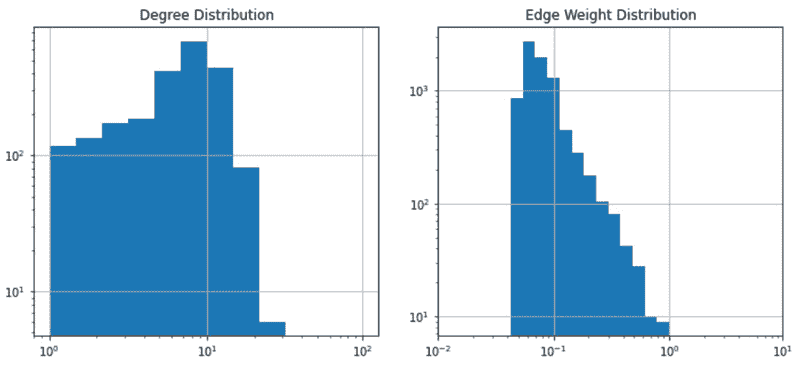

图 7.5 – 经过基于边权重的过滤后得到的图的度分布（左）和边权重分布（右）

前面的图表显示了过滤图的节点度和边权重的分布。边权重的分布对应于*图 7.4*中显示的分布的右尾。度分布与*图 7.4*的关系不太明显，它显示了度数约为 10 的节点的峰值，而*图 7.4*中观察到的峰值在低范围内，约为 100。

#### 分析图

使用 Gephi，我们可以提供整体网络的概述，如图*图 7.6*所示。

图如下：

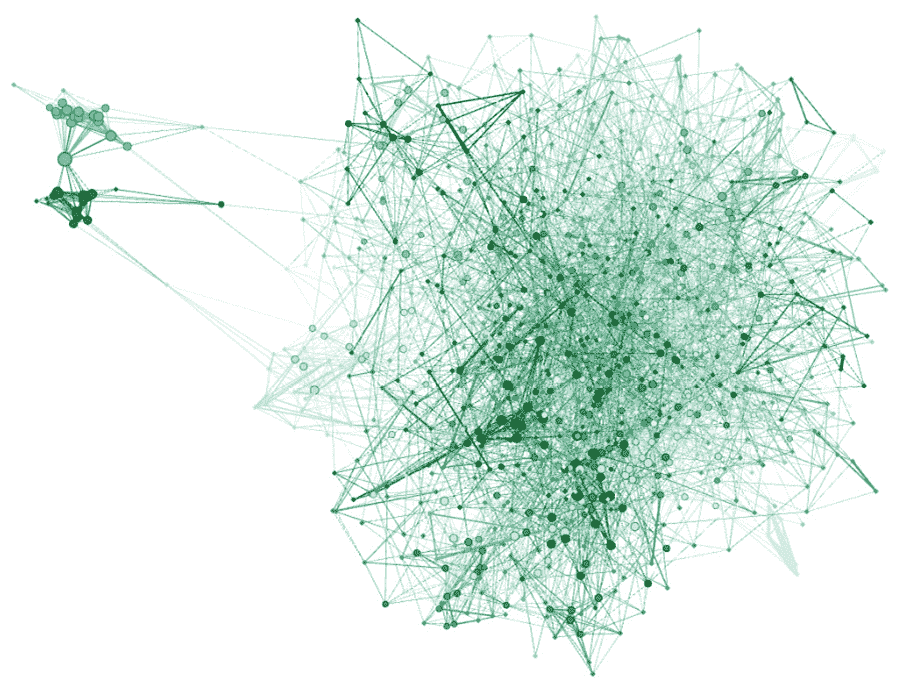

图 7.6 – 突出显示存在多个小型子社区的实体-实体网络

为了对网络的拓扑结构有更深入的了解，我们还将计算一些全局度量，例如平均最短路径、聚类系数和全局效率。尽管该图有五个不同的连通组件，但最大的一个几乎完全占用了整个图，包括 2,254 个节点中的 2,265 个：

```py
components = nx.connected_components(filteredEntityGraph)
 pd.Series([len(c) for c in components])
```

使用以下代码可以找到最大组件的全局属性：

```py
comp = components[0] 
global_metrics = pd.Series({
    "shortest_path": nx.average_shortest_path_length(comp),
    "clustering_coefficient": nx.average_clustering(comp),
    "global_efficiency": nx.global_efficiency(comp)
 })
```

最短路径和全局效率可能需要几分钟的计算时间。这导致以下输出：

```py
{
    'shortest_path': 4.715073779178782,
    'clustering_coefficient': 0.21156314975836915,
    'global_efficiency': 0.22735551077454275
}
```

基于这些指标的大小（最短路径约为 5，聚类系数约为 0.2），结合之前显示的度分布，我们可以看出该网络具有多个有限大小的社区。以下图表显示了其他有趣的局部属性，如度、页面排名和介数中心性分布，展示了所有这些指标如何相互关联和连接：

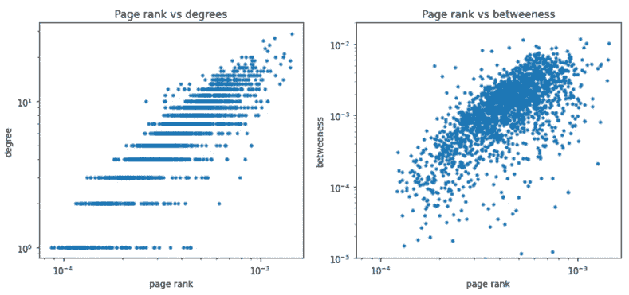

图 7.7 – 度、页面排名和介数中心性度量之间的关系和分布

在提供局部/全局度量描述以及网络的一般可视化之后，我们将应用之前章节中看到的一些技术来识别网络中的见解和信息。我们将使用第*4 章**，监督图学习*中描述的无监督技术来完成这项工作。

我们将首先使用 Louvain 社区检测算法，通过优化其模块度，旨在识别节点在不相交社区中的最佳分区：

```py
import community
communities = community.best_partition(filteredEntityGraph)
```

注意，由于随机种子，结果可能在不同运行之间有所不同。然而，应该会出现一个类似的分区，其聚类成员的分布类似于以下图表中所示。我们通常观察到大约 30 个社区，其中较大的社区包含大约 130-150 个文档。

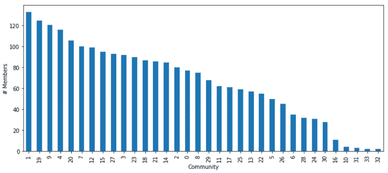

图 7.8 – 检测到的社区大小的分布

*图 7.9*显示了其中一个社区的一个局部放大图，我们可以识别出一个特定的主题/论点。在左侧，实体节点旁边，我们还可以看到文档节点，从而揭示相关二分图的结构：

.jpg)

图 7.9 – 我们已识别的一个社区的一个局部放大图

如*第四章*中所示，*监督图学习*，我们可以通过使用节点嵌入来提取有关实体拓扑和相似性的有见解的信息。特别是，我们可以使用 Node2Vec，通过向 skip-gram 模型提供随机生成的随机游走，可以将节点投影到向量空间中，其中相邻节点被映射到附近的点：

```py
from node2vec import Node2Vec
node2vec = Node2Vec(filteredEntityGraph, dimensions=5) 
model = node2vec.fit(window=10) 
embeddings = model.wv
```

在嵌入空间的向量空间中，我们可以应用传统的聚类算法，如*高斯混合*、*K 均值*和*DB-scan*。正如我们在前面的章节中所做的那样，我们还可以使用 t-SNE 将嵌入投影到二维平面上，以可视化集群和社区。除了给我们提供另一种在图中识别集群/社区的方法之外，Node2Vec 还可以用来提供词语之间的相似性，就像传统上由`turkey`所做的那样，它提供语义上相似的词语：

```py
[('turkish', 0.9975333213806152),
 ('lira', 0.9903393983840942),
 ('rubber', 0.9884852170944214),
 ('statoil', 0.9871745109558105),
 ('greek', 0.9846569299697876),
 ('xuto', 0.9830175042152405),
 ('stanley', 0.9809650182723999),
 ('conference', 0.9799597263336182),
 ('released', 0.9793018102645874),
 ('inra', 0.9775203466415405)]
```

虽然这两种方法，Node2Vec 和 Word2Vec，在方法论上有些相似之处，但两种嵌入方案来自不同类型的信息：Word2Vec 直接从文本中构建，并在句子级别包含关系，而 Node2Vec 编码的描述在文档级别上起作用，因为它来自双边实体-文档图。

### 文档-文档图

现在，让我们将双边图投影到文档节点集合中，以创建一个我们可以分析的文档-文档网络。以我们创建实体-实体网络的方式，我们将使用`overlap_weighted_projected_graph`函数来获取一个加权图，可以过滤以减少显著边的数量。实际上，网络的拓扑结构和构建双边图所使用的业务逻辑并不利于团的形成，正如我们在实体-实体图中看到的那样：只有当两个节点至少共享一个关键词、组织、地点或人物时，它们才会连接起来。这当然是有可能的，但在 10-15 个节点的组内，这种情况并不极端可能，正如我们观察到的实体那样。

正如我们之前所做的那样，我们可以轻松地使用以下几行代码构建我们的网络：

```py
documentGraph = overlap_weighted_projected_graph(
    G,
    document_nodes
)
```

以下图表显示了度数和边权重的分布。这可以帮助我们决定用于过滤边的阈值值。有趣的是，与观察到的实体-实体图中的度数分布相比，节点度数分布显示出向大值方向的明显峰值。这表明存在一些*超级节点*（即具有相当大度数的节点）高度连接。此外，边权重分布显示了 Jaccard 指数趋向于接近 1 的值，这些值远大于我们在实体-实体图中观察到的值。这两个观察结果突出了两个网络之间的深刻差异：而实体-实体图以许多紧密连接的社区（即团）为特征，文档-文档图则以具有大度数的节点（构成核心）之间相对紧密的连接为特征，而外围则是弱连接或未连接的节点：

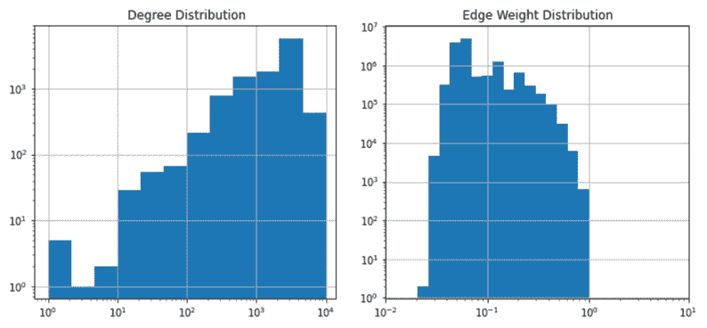

图 7.10 – 双边图投影到文档-文档网络中的度分布和边权重分布

将所有边存储在 DataFrame 中可能很方便，这样我们就可以绘制它们，然后使用它们进行过滤，从而创建子图：

```py
allEdgesWeights = pd.Series({
    (d[0], d[1]): d[2]["weight"] 
    for d in documentGraph.edges(data=True)
})
```

通过查看前面的图表，设置边权重阈值为`0.6`似乎是合理的，这样我们可以使用`networkx`的`edge_subgraph`函数生成一个更易于处理的网络：

```py
filteredDocumentGraph = documentGraph.edge_subgraph(
    allEdgesWeights[(allEdgesWeights>0.6)].index.tolist()
)
```

下面的图显示了缩减图的度分布和边权重的分布：

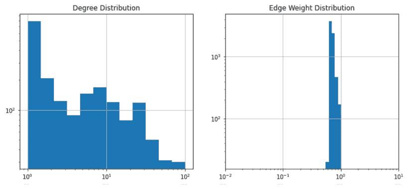

图 7.11 – 文档-文档过滤网络的度分布和边权重分布

文档-文档图与实体-实体图在拓扑结构上的显著差异也可以在以下图表中清楚地看到，该图表显示了完整的网络可视化。正如分布所预期的，文档-文档网络以核心网络和几个不经常连接的卫星为特征。这些卫星代表所有没有或只有少数关键词或实体共同出现的文档。不连通文档的数量相当大，占总数的近 50%：

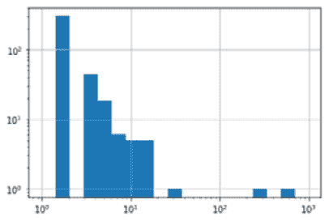

.jpg)

图 7.12 – (左) 文档-文档过滤网络的表示，突出显示核心和外围的存在。(右) 核心的特写，其中嵌入了一些子社区。节点大小与节点度成正比

使用以下命令提取此网络的连通组件可能是值得的：

```py
components = pd.Series({
    ith: component 
    for ith, component in enumerate(
        nx.connected_components(filteredDocumentGraph)
    )
})
```

在下面的图中，我们可以看到连通组件大小的分布。在这里，我们可以清楚地看到存在一些非常大的簇（核心），以及大量不连通或非常小的组件（外围或卫星）。这种结构与我们所观察到的实体-实体图的结构截然不同，在实体-实体图中，所有节点都是由一个非常大的、连通的簇生成的：

图 7.13 – 连通组件大小的分布，突出显示了许多小型社区（代表外围）和少数大型社区（代表核心）

.jpg)

图 7.13 – 连通组件大小的分布，突出显示了许多小型社区（代表外围）和少数大型社区（代表核心）

进一步研究核心组件的结构可能很有趣。我们可以使用以下代码从完整图中提取由网络的最大组件组成的子图：

```py
coreDocumentGraph = nx.subgraph(
    filteredDocumentGraph,
    [node 
     for nodes in components[components.apply(len)>8].values
     for node in nodes]
)
```

我们可以使用 `nx.info` 检查核心网络的属性：

```py
Type: Graph
Number of nodes: 1050
Number of edges: 7112
Average degree:  13.5467
```

*图 7.12* 的左侧面板显示了核心的 Gephi 可视化。正如我们所见，核心由几个社区组成，以及一些相互之间有相当大度数且强连接的节点。

正如我们在实体-实体网络中所做的那样，我们可以处理网络以识别图中嵌入的社区。然而，与之前所做不同的是，文档-文档图现在提供了一个使用文档标签来判断聚类的手段。确实，我们期望属于同一主题的文档彼此靠近并相互连接。此外，正如我们很快将看到的，这还将使我们能够识别主题之间的相似性。

首先，让我们先提取候选社区：

```py
import community
communities = pd.Series(
    community.best_partition(filteredDocumentGraph)
)
```

然后，我们将提取每个社区内的主题混合，以查看是否存在同质性（所有文档都属于同一类别）或主题之间的一些相关性：

```py
from collections import Counter
def getTopicRatio(df):
    return Counter([label 
                    for labels in df["label"] 
                    for label in labels])

communityTopics = pd.DataFrame.from_dict({
    cid: getTopicRatio(corpus.loc[comm.index])
    for cid, comm in communities.groupby(communities)
 }, orient="index")
normalizedCommunityTopics = (
    communityTopics.T / communityTopics.sum(axis=1)
).T
```

`normalizedCommunityTopics` 是一个 DataFrame，对于 DataFrame 中的每个社区（行），它提供了不同主题（沿列轴）的主题混合（百分比）。为了量化集群/社区内主题混合的异质性，我们必须计算每个社区的 Shannon 散度：


这里， 代表集群的熵，，而 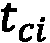 对应于主题  在社区  中的百分比。我们必须计算所有社区的实证 Shannon 散度：

```py
normalizedCommunityTopics.apply(
    lambda x: np.sum(-np.log(x)), axis=1)
```

下面的图显示了所有社区中的熵分布。大多数社区具有零或非常低的熵，这表明属于同一类别（标签）的文档往往聚集在一起：


图 7.14 – 每个社区主题混合的熵分布

即使大多数社区在主题周围表现出零或低变异性，研究社区表现出一些异质性时主题之间的关系也是有趣的。具体来说，我们计算主题分布之间的相关性：

```py
topicsCorrelation = normalizedCommunityTopics.corr().fillna(0)
```

然后，我们可以使用主题-主题网络来表示和可视化这些属性：

```py
topicsCorrelation[topicsCorrelation<0.8]=0
topicsGraph = nx.from_pandas_adjacency(topicsCorrelation)
```

以下图的左侧显示了主题网络的完整图表示。正如在文档-文档网络中观察到的，主题-主题图显示了一个由不连接的节点外围和一个强连接的核心组织起来的结构。以下图的右侧显示了核心网络的特写。这表明了一个由语义意义支持的关联，与商品相关的主题紧密相连：

.jpg)

图 7.15 – (左) 主题-主题相关性图，采用外围-核心结构组织。(右) 网络核心的特写

在本节中，我们分析了在分析文档以及更一般性的文本来源时出现的不同类型的网络。为此，我们使用了全局和局部属性来统计描述网络，以及一些无监督算法，这些算法使我们能够揭示图中的某些结构。在下一节中，我们将向您展示如何利用这些图结构来构建机器学习模型。

# 构建文档主题分类器

为了向您展示如何利用图结构，我们将专注于使用二分实体-文档图提供的拓扑信息和实体之间的连接来训练多标签分类器。这将帮助我们预测文档主题。为此，我们将分析两种不同的方法：

+   **一种浅层机器学习方法**，我们将使用从二分网络中提取的嵌入来训练*传统*分类器，例如 RandomForest 分类器。

+   **一种更集成和可微分的基于使用图形神经网络的方法**，该方法已应用于异构图（如二分图）。

让我们考虑前 10 个主题，我们对这些主题有足够的文档来训练和评估我们的模型：

```py
from collections import Counter
topics = Counter(
    [label 
     for document_labels in corpus["label"] 
     for label in document_labels]
).most_common(10)
```

以下代码块生成了以下输出。这显示了主题的名称，在以下分析中，我们都会关注这些主题：

```py
[('earn', 3964), ('acq', 2369), ('money-fx', 717), 
('grain', 582), ('crude', 578), ('trade', 485), 
('interest', 478), ('ship', 286), ('wheat', 283), 
('corn', 237)]
```

在训练主题分类器时，我们必须将我们的重点限制在仅属于此类标签的文档上。可以通过以下代码块轻松获得过滤后的语料库：

```py
topicsList = [topic[0] for topic in topics]
 topicsSet = set(topicsList)
dataset = corpus[corpus["label"].apply(
    lambda x: len(topicsSet.intersection(x))>0
)]
```

现在我们已经提取并结构化了数据集，我们准备开始训练我们的主题模型并评估其性能。在下一节中，我们将首先创建一个简单的模型，使用浅层学习方法，这样我们就可以通过使用图神经网络来增加模型的复杂性。

## 浅层学习方法

我们将首先通过利用网络信息来实现一个浅层方法，用于主题分类任务。我们将向您展示如何做到这一点，以便您可以根据您的用例进一步定制：

1.  首先，我们将使用`Node2Vec`在二分图上计算嵌入。过滤后的文档-文档网络具有许多未连接的节点，因此它们不会从拓扑信息中受益。另一方面，未过滤的文档-文档网络将具有许多边，这使得方法的可扩展性成为一个问题。因此，使用二分图对于有效地利用拓扑信息和实体与文档之间的连接至关重要：

    ```py
    from node2vec import Node2Vec
    node2vec = Node2Vec(G, dimensions=10) 
    model = node2vec.fit(window=20) 
    embeddings = model.wv 
    ```

    在这里，`dimension`嵌入以及用于生成游走的`window`都是必须通过交叉验证进行优化的超参数。

1.  为了提高计算效率，可以事先计算一组嵌入，将其保存到磁盘，然后在优化过程中使用。这基于我们处于一个*半监督*设置或一个*归纳*任务，在训练时间我们有关于整个数据集的连接信息，除了它们的标签。在本章的后面部分，我们将概述另一种基于图神经网络的方法，它为在训练分类器时集成拓扑提供了一个归纳框架。让我们将嵌入存储在文件中：

    ```py
    pd.DataFrame(embeddings.vectors,
                 index=embeddings.index2word
    ).to_pickle(f"graphEmbeddings_{dimension}_{window}.p")
    ```

    在这里，我们可以选择并循环不同的`dimension`和`window`值。对于这两个变量，一些可能的选择是 10、20 和 30。

1.  这些嵌入可以集成到 scikit-learn 的`transformer`中，以便在网格搜索交叉验证过程中使用：

    ```py
    from sklearn.base import BaseEstimator
    class EmbeddingsTransformer(BaseEstimator):
        def __init__(self, embeddings_file):
            self.embeddings_file = embeddings_file        
        def fit(self, *args, **kwargs):
            self.embeddings = pd.read_pickle(
                self.embeddings_file)
            return self        
        def transform(self, X):
            return self.embeddings.loc[X.index]    
        def fit_transform(self, X, y):
            return self.fit().transform(X)
    ```

1.  为了构建建模训练管道，我们将我们的语料库分为训练集和测试集：

    ```py
    def train_test_split(corpus):
        indices = [index for index in corpus.index]
        train_idx = [idx 
                     for idx in indices 
                     if "training/" in idx]
        test_idx = [idx 
                    for idx in indices 
                    if "test/" in idx]
        return corpus.loc[train_idx], corpus.loc[test_idx]
    train, test = train_test_split(dataset)
    ```

    我们还将构建函数以方便地提取特征和标签：

    ```py
    def get_features(corpus):
        return corpus["parsed"]
    def get_labels(corpus, topicsList=topicsList):
        return corpus["label"].apply(
            lambda labels: pd.Series(
               {label: 1 for label in labels}
            ).reindex(topicsList).fillna(0)
        )[topicsList]
    def get_features_and_labels(corpus):
        return get_features(corpus), get_labels(corpus)
    features, labels = get_features_and_labels(train)
    ```

1.  现在，我们可以实例化建模管道：

    ```py
    from sklearn.pipeline import Pipeline
    from sklearn.ensemble import RandomForestClassifier 
    from sklearn.multioutput import MultiOutputClassifier
    pipeline = Pipeline([
        ("embeddings", EmbeddingsTransformer(
            "my-place-holder")
        ),
        ("model", MultiOutputClassifier(
            RandomForestClassifier())
        )
    ])
    ```

1.  让我们定义交叉验证网格搜索的参数空间以及配置：

    ```py
    from glob import glob
    param_grid = {
        "embeddings__embeddings_file": glob("graphEmbeddings_*"),
        "model__estimator__n_estimators": [50, 100],
        "model__estimator__max_features": [0.2,0.3, "auto"], 
    }
    grid_search = GridSearchCV(
        pipeline, param_grid=param_grid, cv=5, n_jobs=-1)
    ```

1.  最后，让我们使用 sklearn API 的`fit`方法来训练我们的主题模型：

    ```py
    model = grid_search.fit(features, labels)
    ```

太好了！你刚刚创建了一个利用图信息的话题模型。一旦确定了最佳模型，我们就可以使用这个模型在测试数据集上评估其性能。为此，我们必须定义以下辅助函数，它允许我们获得一组预测：

```py
def get_predictions(model, features):
    return pd.DataFrame(
        model.predict(features),
        columns=topicsList, index=features.index)
preds = get_predictions(model, get_features(test))
 labels = get_labels(test)
```

使用`sklearn`功能，我们可以迅速查看训练分类器的性能：

```py
from sklearn.metrics import classification_report
print(classification_report(labels, preds))
```

这提供了以下输出，显示了通过 F1 分数获得的总体性能指标。这大约在 0.6 – 0.8 之间，具体取决于如何处理不平衡的类别：

```py
              precision    recall  f1-score   support
           0       0.97      0.94      0.95      1087
           1       0.93      0.74      0.83       719
           2       0.79      0.45      0.57       179
           3       0.96      0.64      0.77       149
           4       0.95      0.59      0.73       189
           5       0.95      0.45      0.61       117
           6       0.87      0.41      0.56       131
           7       0.83      0.21      0.34        89
           8       0.69      0.34      0.45        71
           9       0.61      0.25      0.35        56
   micro avg       0.94      0.72      0.81      2787
   macro avg       0.85      0.50      0.62      2787
weighted avg       0.92      0.72      0.79      2787
 samples avg       0.76      0.75      0.75      2787
```

您可以尝试不同的分析管道类型和超参数，改变模型，并在编码嵌入时尝试不同的值。正如我们之前提到的，前面的方法显然是归纳的，因为它使用了一个在整个数据集上训练的嵌入。这在半监督任务中是一个常见的情况，其中标记信息仅存在于一小部分点上，任务是从所有未知样本中推断标签。在下一个小节中，我们将概述如何使用图神经网络构建一个归纳分类器。这些可以在测试样本在训练时未知的情况下使用。

## 图神经网络

现在，让我们描述一种基于神经网络的、原生集成并利用图结构的方法。图神经网络在第三章中介绍，*无监督图学习*，以及第四章中介绍，*监督图学习*。然而，在这里，我们将向您展示如何将此框架应用于异构图；即，存在多种节点类型的图。每种节点类型可能有一组不同的特征，训练可能只针对一种特定的节点类型而不是其他。

我们在这里将要展示的方法将利用`stellargraph`和`GraphSAGE`算法，这些算法我们在之前已经描述过。这些方法也支持为每个节点使用特征，而不仅仅是依赖于图的拓扑结构。如果你没有任何节点特征，可以使用一热节点表示法来代替，如第六章中所示，*社交网络图*。然而，在这里，为了使事情更加通用，我们将基于每个实体和关键词的 TF-IDF 分数（我们之前已经看到过）生成一组节点特征。在这里，我们将向您展示一个逐步指南，这将帮助您基于图神经网络训练和评估一个模型，用于预测文档主题分类：

1.  让我们先计算每个文档的 TF-IDF 分数。`sklearn`已经提供了一些功能，允许我们轻松地从文档语料库中计算 TF-IDF 分数。`TfidfVectorizer` `sklearn`类已经内置了一个`tokenizer`。然而，由于我们已经有了一个使用`spacy`提取的标记化和词元化的版本，我们也可以提供一个自定义的`tokenizer`实现，该实现利用 spaCy 处理：

    ```py
    def my_spacy_tokenizer(pos_filter=["NOUN", "VERB", "PROPN"]):
        def tokenizer(doc):
            return [token.lemma_ 
                    for token in doc 
                    if (pos_filter is None) or 
                       (token.pos_ in pos_filter)] 
        return tokenizer 
    ```

    这可以在`TfidfVectorizer`中使用：

    ```py
    cntVectorizer = TfidfVectorizer(
        analyzer=my_spacy_tokenizer(),
        max_df = 0.25, min_df = 2, max_features = 10000
    )
    ```

    为了使这种方法真正具有归纳性，我们只对训练集进行 TF-IDF 训练。这仅适用于测试集：

    ```py
    trainFeatures, trainLabels = get_features_and_labels(train)
    testFeatures, testLabels = get_features_and_labels(test)
    trainedIDF = cntVectorizer.fit_transform(trainFeatures)
    testIDF = cntVectorizer.transform(testFeatures)
    ```

    为了方便起见，现在可以将两个 TF-IDF 表示（训练集和测试集）堆叠成一个单一的数据结构，表示整个图中文档节点的特征：

    ```py
    documentFeatures = pd.concat([trainedIDF, testIDF])
    ```

1.  除了文档节点的特征信息外，我们还将为实体构建一个简单的特征向量，基于实体类型的 one-hot 编码表示：

    ```py
    entityTypes = {
        entity: ith 
        for ith, entity in enumerate(edges["type"].unique())
    }
    entities = edges\
        .groupby(["target", "type"])["source"]\
        .count()\
        .groupby(level=0).apply(
            lambda s: s.droplevel(0)\
                       .reindex(entityTypes.keys())\
                       .fillna(0))\
        .unstack(level=1)
    entityFeatures = (entities.T / entities.sum(axis=1))
    ```

1.  我们现在拥有了创建`StellarGraph`实例所需的所有信息。我们将通过合并节点特征的信息，包括文档和实体的信息，以及由`edges`数据框提供的连接来完成此操作。我们应该仅过滤掉一些边/节点，以便只包括属于目标主题的文档：

    ```py
    from stellargraph import StellarGraph
    _edges = edges[edges["source"].isin(documentFeatures.index)]
    nodes = {«entity»: entityFeatures, 
             «document»: documentFeatures}
    stellarGraph = StellarGraph(
        nodes, _edges,
        target_column=»target», edge_type_column=»type»
    )
    ```

    这样，我们就创建了我们的`StellarGraph`。我们可以使用以下命令检查网络，类似于我们对`networkx`所做的那样：

    ```py
    print(stellarGraph.info())
    ```

    这产生了以下概述：

    ```py
    StellarGraph: Undirected multigraph
     Nodes: 23998, Edges: 86849
    Node types:
      entity: [14964]
        Features: float32 vector, length 6
        Edge types: entity-GPE->document, entity-ORG->document, entity-PERSON->document, entity-keywords->document
      document: [9034]
        Features: float32 vector, length 10000
        Edge types: document-GPE->entity, document-ORG->entity,
     document-PERSON->entity, document-keywords->entity
    Edge types:
        document-keywords->entity: [78838]
            Weights: range=[0.0827011, 1], mean=0.258464,
     std=0.0898612
            Features: none
        document-ORG->entity: [4129]
            Weights: range=[2, 22], mean=3.24122, std=2.30508
            Features: none
        document-GPE->entity: [2943]
            Weights: range=[2, 25], mean=3.25926, std=2.07008
            Features: none
        document-PERSON->entity: [939]
            Weights: range=[2, 14], mean=2.97444, std=1.65956
            Features: none
    ```

    `StellarGraph`的描述实际上非常详尽。此外，`StellarGraph`还原生支持不同类型的节点和边，并为每种节点/边类型提供即插即用的分段统计数据。

1.  你可能已经注意到我们刚刚创建的图既包含训练数据又包含测试数据。为了真正测试归纳方法的性能并避免训练集和测试集之间的信息链接，我们需要创建一个仅包含训练时可用数据的子图：

    ```py
    targets = labels.reindex(documentFeatures.index).fillna(0)
     sampled, hold_out = train_test_split(targets)
    allNeighbors = np.unique([n 
        for node in sampled.index 
        for n in stellarGraph.neighbors(node)
    ])
    subgraph = stellarGraph.subgraph(
        set(sampled.index).union(allNeighbors)
    )
    ```

    考虑的子图包含 16,927 个节点和 62,454 条边，与整个图中的 23,998 个节点和 86,849 条边相比。

1.  现在我们只有训练时可用数据和网络，我们可以在其上构建我们的机器学习模型。为此，我们将数据分为训练、验证和测试数据。对于训练，我们只使用 10%的数据，这类似于半监督任务：

    ```py
    from sklearn.model_selection import train_test_split
    train, leftOut = train_test_split(
        sampled,
        train_size=0.1,
        test_size=None,
        random_state=42
    )
    validation, test = train_test_split(
        leftOut, train_size=0.2, test_size=None, random_state=100,
    ) 
    ```

1.  现在，我们可以开始使用`stellargraph`和`keras` API 构建我们的图神经网络模型。首先，我们将创建一个生成器，能够生成将输入神经网络的样本。请注意，由于我们处理的是一个异构图，我们需要一个生成器，它将只从属于特定类的节点中采样示例。在这里，我们将使用`HinSAGENodeGenerator`类，它将用于同构图中的节点生成器推广到异构图，允许我们指定我们想要的目标节点类型：

    ```py
    from stellargraph.mapper import HinSAGENodeGenerator
    batch_size = 50
    num_samples = [10, 5]
    generator = HinSAGENodeGenerator(
        subgraph, batch_size, num_samples,
        head_node_type="document"
    )
    ```

    使用此对象，我们可以为训练和验证数据集创建生成器：

    ```py
    train_gen = generator.flow(train.index, train, shuffle=True)
     val_gen = generator.flow(validation.index, validation)
    ```

1.  现在，我们可以创建我们的 GraphSAGE 模型。像生成器一样，我们需要使用一个可以处理异构图的模式。在这里，我们将使用`HinSAGE`代替`GraphSAGE`：

    ```py
    from stellargraph.layer import HinSAGE
    from tensorflow.keras import layers
    graphsage_model = HinSAGE(
        layer_sizes=[32, 32], generator=generator,
        bias=True, dropout=0.5
    )
    x_inp, x_out = graphsage_model.in_out_tensors()
    prediction = layers.Dense(
        units=train.shape[1], activation="sigmoid"
    )(x_out)
    ```

    注意，在最终的密集层中，我们使用的是*sigmoid*激活函数而不是*softmax*激活函数，因为当前的问题是一个多类、多标签任务。因此，一个文档可能属于多个类别，在这种情况下，sigmoid 激活函数似乎是一个更合理的选择。像往常一样，我们将编译我们的 Keras 模型：

    ```py
    from tensorflow.keras import optimizers, losses, Model
    model = Model(inputs=x_inp, outputs=prediction)
    model.compile(
        optimizer=optimizers.Adam(lr=0.005),
        loss=losses.binary_crossentropy,
        metrics=["acc"]
    )
    ```

1.  最后，我们将训练神经网络模型：

    ```py
    history = model.fit(
        train_gen, epochs=50, validation_data=val_gen,
        verbose=1, shuffle=False
    )
    ```

    这将产生以下输出：

    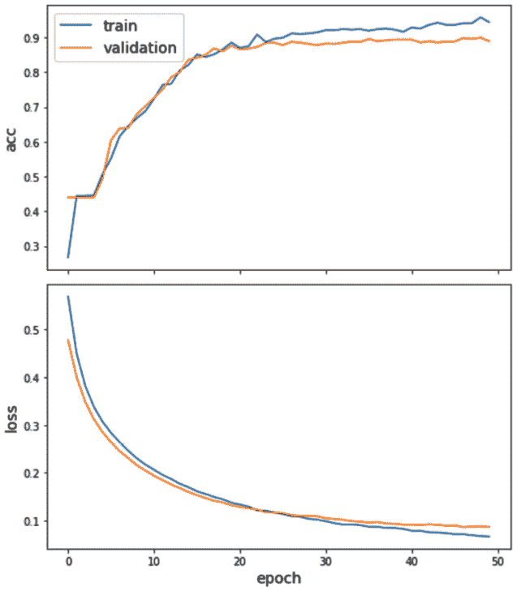

    图.7.16 – （顶部）训练和验证准确率与训练轮数的关系。（底部）训练和验证数据集的二进制交叉熵损失与训练轮数的关系

    上一张图显示了训练和验证损失以及准确率随训练轮数变化的曲线。如图所示，训练和验证准确率持续上升，直到大约 30 轮。在这里，验证集的准确率达到了一个*平台期*，而训练准确率仍在上升，表明有过度拟合的趋势。因此，在约 50 轮时停止训练似乎是一个相当合理的选择。

1.  一旦模型训练完成，我们就可以在测试集上测试其性能：

    ```py
    test_gen = generator.flow(test.index, test)
     test_metrics = model.evaluate(test_gen)
    ```

    这应该提供以下值：

    ```py
    loss: 0.0933
    accuracy: 0.8795
    ```

    注意，由于标签分布不平衡，准确率可能不是评估性能的最佳选择。此外，通常使用 0.5 作为阈值，因此在不平衡设置中提供标签分配也可能不是最优的。

1.  为了确定用于分类文档的最佳阈值，我们将对所有测试样本进行预测：

    ```py
    test_predictions = pd.DataFrame(
        model.predict(test_gen), index=test.index,
        columns=test.columns)
    test_results = pd.concat({
        "target": test,
        "preds": test_predictions
    }, axis=1)
    ```

    然后，我们将计算不同阈值选择的宏平均 F1 分数：

    ```py
    thresholds = [0.01,0.05,0.1,0.2,0.3,0.4,0.5] 
    f1s = {}
    for th in thresholds:
        y_true = test_results["target"]
        y_pred = 1.0*(test_results["preds"]>th)
        f1s[th] = f1_score(y_true, y_pred, average="macro")    
    pd.Series(f1s).plot()
    ```

    如以下图表所示，0.2 的阈值似乎是最好的选择，因为它实现了最佳的性能：

    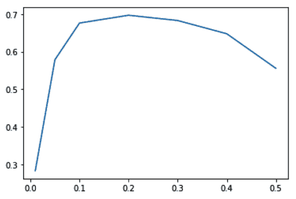

    图 7.17 – 使用标签的阈值与宏平均 F1 分数的关系

1.  使用 0.2 的阈值，我们可以提取测试集的分类报告：

    ```py
    print(classification_report(
        test_results["target"], 1.0*(test_results["preds"]>0.2))
    )
    ```

    这给出了以下输出：

    ```py
                  precision    recall  f1-score   support
               0       0.92      0.97      0.94      2075
               1       0.85      0.96      0.90      1200
               2       0.65      0.90      0.75       364
               3       0.83      0.95      0.89       305
               4       0.86      0.68      0.76       296
               5       0.74      0.56      0.63       269
               6       0.60      0.80      0.69       245
               7       0.62      0.10      0.17       150
               8       0.49      0.95      0.65       149
               9       0.44      0.88      0.58       129
       micro avg       0.80      0.89      0.84      5182
       macro avg       0.70      0.78      0.70      5182
    weighted avg       0.82      0.89      0.84      5182
     samples avg       0.83      0.90      0.85      5182
    ```

1.  到目前为止，我们已经训练了一个图神经网络模型并评估了其性能。现在，让我们将此模型应用于一组未观察到的数据——我们在一开始就留下的数据——并在归纳设置中表示真实的测试数据。为此，我们需要实例化一个新的生成器：

    ```py
    generator = HinSAGENodeGenerator(
        stellarGraph, batch_size, num_samples,
        head_node_type="document")
    ```

    注意，我们从`HinSAGENodeGenerator`获取的图形现在是一个完整的图形（代替我们之前使用的过滤图形），它包含训练和测试文档。使用这个类，我们可以创建一个生成器，它只从测试节点中采样，过滤掉不属于我们主要选择主题之一的节点：

    ```py
    hold_out = hold_out[hold_out.sum(axis=1) > 0]
    hold_out_gen = generator.flow(hold_out.index, hold_out)
    ```

1.  该模型可以在这些样本上评估，并使用我们之前确定的阈值来预测标签；即，0.2：

    ```py
    hold_out_predictions = model.predict(hold_out_gen)
    preds = pd.DataFrame(1.0*(hold_out_predictions > 0.2),
                         index = hold_out.index,
                         columns = hold_out.columns)
    results = pd.concat(
        {"target": hold_out,"preds": preds}, axis=1
    )
    ```

    最后，我们可以提取归纳测试数据集的性能：

    ```py
    print(classification_report(
        results["target"], results["preds"])
    )
    ```

    这会产生以下表格：

    ```py
                  precision    recall  f1-score   support
               0       0.93      0.99      0.96      1087
               1       0.90      0.97      0.93       719
               2       0.64      0.92      0.76       179
               3       0.82      0.95      0.88       149
               4       0.85      0.62      0.72       189
               5       0.74      0.50      0.59       117
               6       0.60      0.79      0.68       131
               7       0.43      0.03      0.06        89
               8       0.50      0.96      0.66        71
               9       0.39      0.86      0.54        56
       micro avg       0.82      0.89      0.85      2787
       macro avg       0.68      0.76      0.68      2787
    weighted avg       0.83      0.89      0.84      2787
    samples avg       0.84      0.90      0.86      2787
    ```

与浅层学习方法相比，我们可以看到我们在性能上取得了显著的提升，介于 5-10%之间。

# 摘要

在本章中，您学习了如何处理非结构化信息，以及如何使用图来表示此类信息。从众所周知的基准数据集，即路透社-21578 数据集开始，我们应用了标准的 NLP 引擎来标记和结构化文本信息。然后，我们使用这些高级特征来创建不同类型的网络：基于知识的网络、二分网络、以及节点子集的投影，以及与数据集主题相关的网络。这些不同的图也使我们能够使用我们在前几章中介绍的工具从网络表示中提取见解。

我们使用局部和全局属性向您展示了这些数量如何表示和描述结构上不同的网络类型。然后，我们使用无监督技术来识别语义社区并对属于相似主题/主题的文档进行聚类。最后，我们使用数据集中提供的标记信息来训练监督多类多标签分类器，这些分类器也利用了网络的拓扑结构。

然后，我们将监督技术应用于一个异构图，其中存在两种不同的节点类型：文档和实体。在这个设置中，我们向您展示了如何通过使用浅层学习和图神经网络，分别实现归纳和演绎方法。

在下一章中，我们将探讨另一个领域，其中图分析可以有效地用于提取见解和/或创建利用网络拓扑的机器学习模型：交易数据。下一个用例也将允许您将本章中引入的二分图概念推广到另一个层次：三分图。
