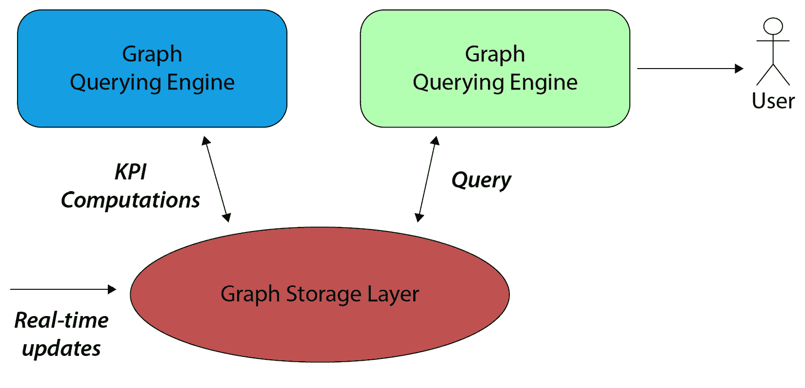
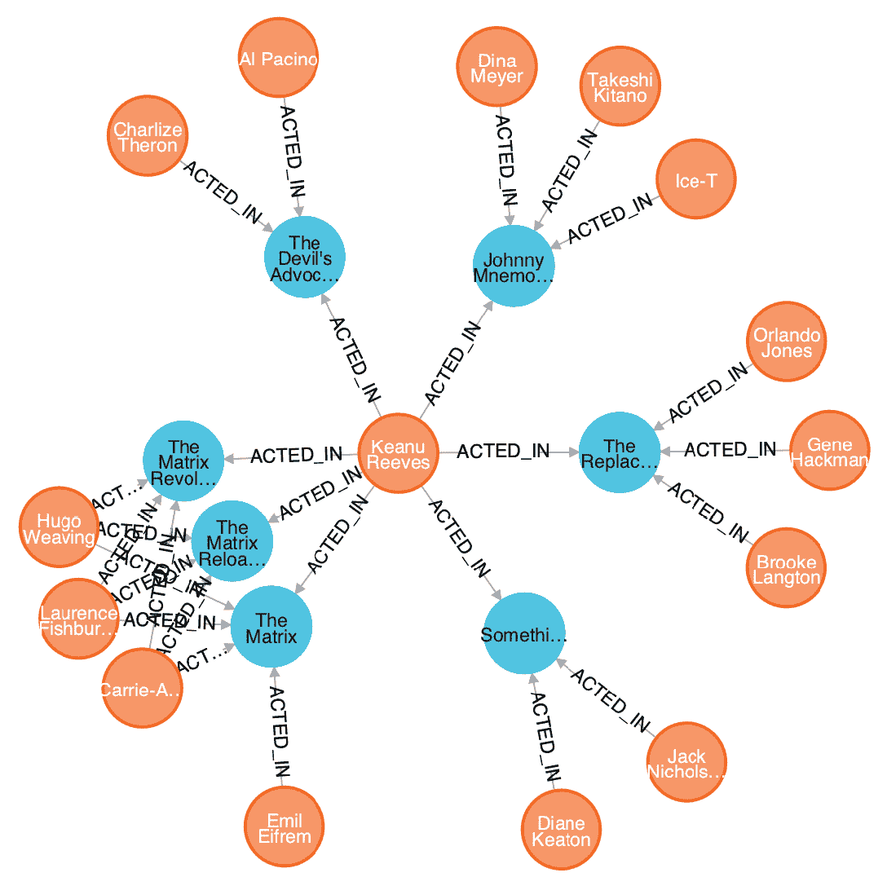

# 第九章：构建数据驱动的图驱动应用

到目前为止，我们已经向您提供了理论和实践上的想法，以便您设计并实现利用图结构进行机器学习模型的构建。除了设计算法之外，将建模/分析流程嵌入到一个强大且可靠的全端到端应用中通常也非常重要。这在工业应用中尤其如此，因为最终目标通常是设计和实现支持数据驱动决策和/或为用户提供及时信息的生产系统。然而，创建一个依赖图表示/建模的数据驱动应用确实是一项具有挑战性的任务，它需要适当的设计，这比简单地导入`networkx`要复杂得多。本章旨在向您提供构建基于图、可扩展、数据驱动的应用时所使用的核心概念和框架的一般概述。

我们将首先概述所谓的**Lambda 架构**，它提供了一个框架来构建需要大规模处理和实时更新的可扩展应用。然后，我们将继续在*图驱动应用*的背景下应用这个框架，即利用本书中描述的技术等利用图结构的应用。我们将描述其两个主要分析组件：**图处理引擎**和**图查询引擎**。我们将介绍一些在共享内存机器和分布式内存机器上使用的技术，概述相似之处和不同之处。本章将涵盖以下主题：

+   Lambda 架构概述

+   用于图驱动应用的 Lambda 架构

+   图处理引擎的技术和示例

+   图查询引擎和图数据库

# 技术要求

我们将在所有练习中使用 Python 3.8。在下面的代码块中，您可以使用`pip`找到本章需要安装的 Python 库列表。例如，在命令行中运行`pip install networkx==2.5`，等等：

```py
networkx==2.5 
neo4j==4.2.0 
gremlinpython==3.4.6
```

所有与本章相关的代码文件可在[`github.com/PacktPublishing/Graph-Machine-Learning/tree/main/Chapter09`](https://github.com/PacktPublishing/Graph-Machine-Learning/tree/main/Chapter09)找到。

# Lambda 架构概述

近年来，人们高度重视设计可扩展的架构，一方面可以处理大量数据，另一方面可以实时提供答案/警报/操作，使用最新可用的信息。

此外，这些系统还需要能够通过水平扩展（添加更多服务器）或垂直扩展（使用更强大的服务器）无缝地扩展到更多用户或更多数据。**Lambda 架构**是一种特定的数据处理架构，旨在以非常高效的方式处理大量数据，并确保高吞吐量，同时保持低延迟并确保容错性和可忽略的错误。

Lambda 架构由三个不同的层组成：

+   **批量层**：这一层位于（可能分布式和可扩展的）存储系统之上，可以处理和存储所有历史数据，并在整个数据集上执行**在线分析处理**（**OLAP**）计算。新数据会持续被摄取和存储，就像在传统数据仓库系统中那样。大规模处理通常通过大规模并行作业实现，旨在生成相关信息的汇总、结构和计算。在机器学习的背景下，依赖于历史信息的模型训练通常在这一层进行，从而产生一个用于批量预测作业或实时执行的训练模型。

+   **速度层**：这是一个低延迟层，允许实时处理信息，以提供及时更新和信息。它通常由流处理过程提供数据，通常涉及快速计算，不需要长时间的计算时间或负载。它产生的输出与批量层生成的数据（在（近）实时中）集成，为**在线事务处理**（**OLTP**）操作提供支持。速度层也可能很好地使用 OLAP 计算的一些输出，例如训练模型。通常，使用实时机器学习建模的应用程序（例如，在信用卡交易中使用的欺诈检测引擎）在其速度层中嵌入训练模型，以提供及时的预测并触发潜在的欺诈实时警报。库可以在事件级别（如 Apache Storm）或微型批次（如 Spark Streaming）上运行，根据用例，对延迟、容错性和计算速度有不同的要求。

+   `flask`、`fastapi`或`turbogear`），它们通过专门设计的端点提供数据：

![图 9.1 – 基于 Lambda 架构的应用功能图

![img/B16069_09_01.jpg]

图 9.1 – 基于 Lambda 架构的应用功能图

Lambda 架构具有几个优点，这些优点推动了其使用，尤其是在**大数据**应用场景中。以下是一些 Lambda 架构的主要优点：

+   **无需服务器管理**：因为 Lambda 架构设计模式通常抽象了功能层，不需要安装、维护或管理任何软件/基础设施

+   **灵活扩展**：因为应用程序可以是自动扩展的，也可以通过控制批量层（例如计算节点）和/或在速度层（例如 Kafka 代理）中使用的处理单元的数量来扩展

+   **自动高可用性**：由于它代表了一种无服务器设计，我们已经有内置的可用性和容错性

+   **业务敏捷性**：实时响应不断变化的业务/市场场景

尽管非常强大和灵活，但 Lambda 架构也存在一些限制，这主要归因于存在两个相互关联的处理流程：**批量层**和**速度层**。这可能要求开发人员为批量处理和流处理构建和维护单独的代码库，从而导致更多的复杂性和代码开销，这可能导致更困难的调试、可能的偏差和错误升级。

在这里，我们提供了一个 Lambda 架构及其基本构建块的简要概述。有关如何设计可扩展架构和最常用的架构模式的更多详细信息，请参阅 Tomcy John 和 Pankaj Misra 于 2017 年出版的书籍《企业数据湖》。

在下一节中，我们将向您展示如何实现图驱动应用程序的 Lambda 架构。特别是，我们将描述主要组件并回顾最常用的技术。

# 图驱动应用程序的 Lambda 架构

当处理可扩展的、基于图的数据驱动应用程序时，Lambda 架构的设计也体现在分析管道两个关键组件之间的功能分离上，如图*9.2*所示：

+   **图处理引擎**在图结构上执行计算以提取特征（例如嵌入），计算统计数据（例如度分布、边的数量和团），计算指标和**关键性能指标**（**KPIs**）（例如中心性度量聚类系数），并识别通常需要 OLAP 的相关子图（例如社区）。

+   **图查询引擎**使我们能够持久化网络数据（通常通过图数据库完成）并提供了快速的信息检索和高效的查询以及图遍历（通常通过图查询语言完成）。所有信息都已持久化在某些数据存储中（可能或可能不在内存中），除了（可能）一些最终的聚合结果之外，不需要进一步的计算，对于这些结果，索引对于实现高性能和低延迟至关重要：



图 9.2 – 基于图的架构，主要组件也反映在 Lambda 架构模式中

图处理引擎位于批处理层之上，并生成可能存储和索引在适当图数据库中的输出。这些数据库是图查询引擎的后端，允许相关信息的轻松快速检索，代表服务层使用的操作视图。根据用例和/或图的大小，通常在相同的基础设施上同时运行图处理引擎和图查询引擎是有意义的。

与在低级存储层（例如，文件系统、HDFS 或 S3）上存储图不同，有一些图数据库选项可以同时支持 OLAP 和 OLTP。这些提供，同时，一个后端持久化层，其中存储了批处理层处理的历史信息，以及来自速度层的实时更新，并且信息可以被服务层高效查询。

与其他用例相比，这种条件对于基于图、数据驱动的应用确实相当独特。历史数据通常提供了一种拓扑结构，新的实时更新和 OLAP 输出（KPI、数据聚合、嵌入、社区等）可以存储在其上。这种数据结构还代表了服务层随后查询的丰富图中的信息。

## 图处理引擎

要选择合适的**图处理引擎**技术，估计网络在内存中的大小与目标架构的容量相比至关重要。你可以从使用更简单的框架开始，这些框架在项目的早期阶段允许快速原型设计，当时的目标是快速构建**最小可行产品**（**MVP**）。

这些框架可以在性能和可扩展性变得更为关键时，由更先进的工具所取代。微服务模块化方法和这些组件的正确结构将允许独立于应用程序的其他部分切换技术/库，以针对特定问题，这也会指导后端堆栈的选择。

图处理引擎需要快速访问整个图的信息，即所有图都在内存中，并且根据上下文，你可能需要或不需要*分布式架构*。正如我们在*第一章*，“开始使用图”中看到的，`networkx`是一个在处理相对较小的数据集时构建图处理引擎的优秀库示例。当数据集变大，但仍可以适应单个服务器或共享内存机器时，其他库可能有助于减少计算时间。正如在*第一章*，“开始使用图”中看到的，使用除了`networkx`之外的其他库，其中图算法是用性能更好的语言（如 C++或 Julia）实现的，可能会将计算速度提高两个数量级以上。

然而，在某些情况下，数据集增长如此之大，以至于使用不断增加容量的共享内存机器（胖节点）在技术上或经济上不再可行。在这种情况下，将数据分布到由数十或数百个计算节点组成的集群上，实现水平扩展，变得更为必要。在这些情况下，可以支持图处理引擎的两个最流行的框架如下：

+   **Apache Spark GraphX**，这是 Spark 库中处理图结构的模块（[`spark.apache.org/graphx`](https://spark.apache.org/graphx)）。它涉及使用**弹性分布式数据集**（**RDDs**）对顶点和边进行分布式表示。图在整个计算节点上的重新分区可以通过*边切割*策略来完成，这在逻辑上相当于将节点分配到多台机器上，或者通过*顶点切割*策略，这在逻辑上相当于将边分配到不同的机器上，并允许顶点跨越多台机器。尽管是用 Scala 编写的，但 GraphX 提供了 R 和 Python 的包装器。GraphX 已经内置了一些算法实现，例如*PageRank*、*连通分量*和*三角形计数*。还有其他库可以在 GraphX 之上使用，用于其他算法，例如**SparklingGraph**，它实现了更多的中心性度量。

+   **Apache Giraph**，这是一个为高可扩展性而构建的迭代图处理系统（[`giraph.apache.org/`](https://giraph.apache.org/)）。它由 Facebook 开发和目前使用，用于分析由用户及其连接形成的社会图，并建立在 Hadoop 生态系统之上，以释放大规模结构化数据集的潜力。Giraph 是用 Java 原生编写的，类似于 GraphX，也提供了一些基本图算法的可扩展实现，例如*PageRank*和*最短路径*。

当我们考虑扩展到分布式生态系统时，我们应该始终牢记，可用的算法选择比在共享机器环境中要少得多。这通常有两个原因：

+   首先，由于节点之间的通信，以分布式方式实现算法比在共享机器上要复杂得多，这也降低了整体效率。

+   其次，更重要的是，大数据分析的一个基本信条是，只有那些（几乎）与数据点数量成线性关系的算法才应该被实现，以确保解决方案的水平可扩展性，即随着数据集的增加而增加计算节点。

在这方面，Giraph 和 GraphX 都允许你使用基于**Pregel**的标准接口定义可扩展的、以顶点为中心的迭代算法，这可以被视为图（实际上，应用于三元组节点-边-节点实例的迭代 map-reduce 操作）的某种迭代 map-reduce 操作的等价物。Pregel 计算由一系列迭代组成，每个迭代称为**超级步**，每个迭代都涉及一个节点及其邻居。

在超级步 S 期间，对每个顶点 V 应用一个用户定义的函数。这个函数将超级步 S-1 中发送到 V 的消息作为输入，并修改 V 及其出度边的状态。这个函数代表映射阶段，可以很容易地进行并行化。除了计算 V 的新状态外，该函数还将消息发送到与 V 连接的其他顶点，这些顶点将在超级步 S+1 接收到这些信息。消息通常沿着出度边发送，但可以向任何已知标识符的顶点发送消息。在图 9.3 中，我们展示了 Pregel 算法在计算网络上的最大值时的草图。有关此算法的更多详细信息，请参阅 Malewicz 等人于 2010 年撰写的原始论文《Pregel：一个用于大规模图处理的系统》：

![图 9.3 – 使用 Pregel 计算节点属性最大值的示例]

![img/B16069_09_03.jpg]

图 9.3 – 使用 Pregel 计算节点属性最大值的示例

通过使用 Pregel，你可以轻松地以非常高效和通用的方式实现其他算法，例如*PageRank*或*连通分量*，甚至可以并行实现节点嵌入的变体（例如，请参阅 Riazi 和 Norris 于 2020 年撰写的《用于大规模图的分布式内存顶点中心网络嵌入》，Riazi 和 Norris，2020）。

## 图查询层

在过去十年中，由于非结构化数据的大量扩散，NoSQL 数据库开始获得相当大的关注和重要性。其中，**图数据库**确实非常强大，可以基于实体之间的关系存储信息。实际上，在许多应用中，数据可以自然地被视为实体，通过具有属性的边连接，这些边也具有进一步描述实体之间关系的属性。

图数据库的例子包括 Neo4j、OrientDB、ArangoDB、Amazon Neptune、Cassandra 和 JanusGraph（之前称为 TitanDB）。在接下来的章节中，我们将简要介绍其中的一些，以及允许我们查询和遍历底层图的语言，这些语言被称为**图查询语言**。

### Neo4j

在撰写本文时，**Neo4J** ([`neo4j.com/`](https://neo4j.com/))无疑是周围最常见的图数据库，拥有一个支持其使用和采用的庞大社区。它有两个版本：

+   *社区版*，在 GPL v3 许可下发布，允许用户/开发者公开将 Neo4j 包含在其应用程序中

+   *企业版*，专为需要规模和可用性的商业部署设计

Neo4j 可以通过**分片**扩展到相当大的数据集，即通过将数据分布到多个节点并在数据库的多个实例上并行查询和聚合来并行化查询。此外，Neo4j 联邦还允许查询较小的分离图（有时甚至具有不同的模式），就像它们是一个大图一样。

Neo4j 的一些优点是其灵活性（允许模式演变）和用户友好性。特别是，Neo4j 中的许多操作都可以通过其查询语言完成，该语言非常直观且易于学习：**Cypher**。Cypher 可以被视为图数据库的 SQL 对应物。

测试 Neo4j 和 Cypher 非常容易。您可以通过 Docker 安装社区版（见下一节）或尝试在线沙盒版本（[`neo4j.com/sandbox/`](https://neo4j.com/sandbox/))。

通过使用后者，您可以导入一些内置的数据集，例如电影数据集，并开始使用 Cypher 查询语言对其进行查询。电影数据集由 38 部电影和 133 位参与表演、导演、编写、评论和制作这些电影的人组成。无论是在场版本还是在线版本，都配备了用户友好的 UI，允许用户查询和可视化数据（见*图 9.4*）。我们首先列出电影数据集中的 10 位演员，只需查询以下内容：

```py
MATCH (p: Person) RETURN p LIMIT 10
```

但现在让我们利用数据点之间关系的信息。我们看到数据库中出现的一个演员是基努·里维斯。我们可能会想知道他在列出的电影中与哪些演员合作过。此信息可以通过以下查询轻松检索：

```py
MATCH (k: Person {name:"Keanu Reeves"})-[:ACTED_IN]-(m: Movie)-[:ACTED_IN]-(a: Person) RETURN k, m, a
```

如以下图所示，查询通过声明我们感兴趣的路径，直观地以语法形式指示如何遍历图：



图 9.4 – Neo4j UI 的示例，使用 Cypher 查询检索电影数据集中基努·里维斯的合作演员

除了 Cypher，数据也可以使用 Gremlin 进行查询。这将在描述图数据库的通用接口时简要介绍。

Neo4j 还提供了与多种编程语言的绑定，例如 Python、JavaScript、Java、Go、Spring 和.NET。特别是对于 Python，有几个库实现了与 Neo4j 的连接，如`neo4j`、`py2neo`和`neomodel`，其中`neo4j`是官方和支持的，通过二进制协议直接连接到数据库。创建数据库连接并运行查询只需几行代码：

```py
from neo4j import GraphDatabase
driver = GraphDatabase("bolt://localhost:7687", "my-user", "my-password")
def run_query(tx, query):
    return tx.run(query)
with driver.session() as session:
    session.write_transaction(run_query, query)
```

查询可以是任何 Cypher 查询，例如，之前编写的用于检索基努·里维斯合作演员的查询。

### JanusGraph – 一个可扩展的图数据库，可扩展到非常大的数据集

Neo4j 是一款非常出色的软件，当你想要快速完成任务时，凭借其直观的界面和查询语言，无与伦比。Neo4j 确实是一个适合生产的图数据库，但在敏捷性至关重要的 MVP 中尤其出色。然而，随着数据量的增加，基于分片和将大型图分解成较小子图的扩展性可能不是最佳选择。

当数据量显著增加时，你可能需要开始考虑其他图数据库选项。再次强调，这应该只在用例需求开始触及 Neo4j 的可扩展性限制时进行，因为需求从 MVP 的初始要求演变而来。

在这种情况下，有几种选择。其中一些是商业产品，例如 Amazon Neptune 或 Cassandra。然而，开源选项也是可用的。其中，我们认为值得提及的是**JanusGraph** ([`janusgraph.org/`](https://janusgraph.org/))，这是一款特别有趣的软件。JanusGraph 是之前名为**TitanDB**的开放源代码项目的演变，现在是 Linux 基金会的官方项目，同时也得到了技术领域顶级玩家的支持，如 IBM、Google、Hortonworks、Amazon、Expero 和 Grakn Labs。

JanusGraph 是一个可扩展的图数据库，专为存储和查询跨多机集群分布的图而设计，具有数百亿个顶点和边。实际上，JanusGraph 本身没有存储层，而是一个组件，用 Java 编写，位于其他数据存储层之上，如下所示：

+   **Google Cloud Bigtable** ([`cloud.google.com/bigtable`](https://cloud.google.com/bigtable))，这是基于 Google 文件系统构建的专有数据存储系统的云版本，旨在扩展数据中心间分布的大量数据（*《Bigtable: A Distributed Storage System for Structured Data》，Fay Chang 等人，2006 年）。

+   **Apache HBase** ([`hbase.apache.org/`](https://hbase.apache.org/))，这是一个非关系型数据库，它基于 Hadoop 和 HDFS 提供了 Bigtable 功能，从而确保了类似的可扩展性和容错性。

+   **Apache Cassandra** ([`cassandra.apache.org/`](https://cassandra.apache.org/))，这是一个开源的分布式 NoSQL 数据库，允许处理大量数据，跨越多个数据中心。

+   **ScyllaDB** ([`www.scylladb.com/`](https://www.scylladb.com/))，这是一种专门为实时应用设计的数据库，与 Apache Cassandra 兼容，同时实现了显著更高的吞吐量和更低的延迟。

因此，JanusGraph 继承了可扩展解决方案的所有良好特性，如可扩展性、高可用性和容错性，并在其之上抽象出一个图视图。

通过与 ScyllaDB 的集成，JanusGraph 可以处理极快、可扩展和高吞吐量的应用。此外，JanusGraph 还集成了基于 Apache Lucene、Apache Solr 和 Elasticsearch 的索引层，以便在图中实现更快的信息检索和搜索功能。

与索引层一起使用高度分布的后端，允许 JanusGraph 扩展到巨大的图，拥有数百亿个节点和边，有效地处理所谓的**超节点**——换句话说，具有极端大度数的节点，这些节点通常出现在现实世界应用中（记住，一个非常著名的真实网络模型是*Barabasi-Albert*模型，基于优先连接，这使得中心节点自然地出现在图中）。

在大型图中，超节点往往是应用的潜在瓶颈，尤其是在业务逻辑需要通过它们遍历图时。具有在图遍历期间快速过滤相关边的属性可以帮助显著加快处理过程并提高性能。

JanusGraph 通过**Apache TinkerPop**库（[`tinkerpop.apache.org/`](https://tinkerpop.apache.org/)）提供了一个标准的 API 来查询和遍历图，这是一个开源的、供应商无关的图计算框架。TinkerPop 提供了一个标准接口，用于使用**Gremlin**图遍历语言查询和分析底层图。因此，所有 TinkerPop 兼容的图数据库系统都可以无缝地相互集成。因此，TinkerPop 允许你构建“标准”的服务层，这些服务层不依赖于后端技术，从而给你自由选择/更改适合你应用的实际需要的图技术。实际上，大多数图数据库（甚至包括我们之前提到的 Neo4j）现在都具备与 TinkerPop 的集成功能，这使得在后台图数据库之间切换变得无缝，并避免了任何供应商锁定。

除了 Java 连接器之外，Gremlin 还通过`gremlinpython`库提供了直接的 Python 绑定，这使得 Python 应用能够连接和遍历图。为了查询图结构，我们首先需要连接到数据库，使用以下方法：

```py
from gremlin_python.driver.driver_remote_connection import DriverRemoteConnection
connection = DriverRemoteConnection(
    'ws://localhost:8182/gremlin', 'g'
)
```

一旦建立了连接，我们就可以实例化`GraphTraversalSource`，这是所有 Gremlin 遍历的基础，并将其绑定到我们刚刚创建的连接：

```py
from gremlin_python.structure.graph import Graph
from gremlin_python.process.graph_traversal import __ 
graph = Graph()
g = graph.traversal().withRemote(connection)
```

一旦实例化了`GraphTraversalSource`，我们就可以在整个应用中重用它来查询图数据库。想象一下，我们将之前描述的 Movie 图数据库导入到 JanusGraph 中；我们可以重新编写之前用来查找基努·里维斯所有合演者的 Cypher 查询，使用 Gremlin：

```py
co_actors = g.V().has('Person', 'name', 'Keanu Reeves').out("ACTED_IN").in("ACTED_IN").values("name")
```

如前述代码行所示，Gremlin 是一种函数式语言，其中操作符被分组在一起形成类似路径的表达式。

## 选择 Neo4j 和 GraphX

Neo4j 或 GraphX？这是一个经常被问到的问题。然而，正如我们简要描述的，这两款软件并不是真正的竞争对手，而是针对不同的需求。Neo4j 允许我们以图结构存储信息并查询数据，而 GraphX 使得分析图（特别是对于大型图维度）成为可能。虽然你也可以将 Neo4j 用作处理引擎（实际上 Neo4j 生态系统包含一个图数据科学库，它实际上是一个处理引擎），GraphX 也可以用作内存存储的图，但应避免这种做法。

图处理引擎通常计算 KPI，这些 KPI 存储在图数据库层（可能被索引，以便查询和排序变得高效）以供以后使用。因此，像 GraphX 这样的技术并不与像 Neo4j 这样的图数据库竞争，它们可以在同一应用程序中很好地共存，以服务于不同的目的。正如我们在引言中所强调的，即使在 MVP 和早期阶段，最好是将两个组件——图处理引擎和图查询引擎——分开，并为每个组件使用适当的技术。

在这两种情况下，都存在简单易用的库和工具，我们强烈建议你明智地使用它们，以构建一个坚实可靠的应用程序，它可以无缝扩展。

# 摘要

在本节中，我们向您提供了如何设计、实现和部署依赖图建模并利用图结构的数据驱动应用程序的基本概念。我们强调了模块化方法的重要性，这通常是任何数据驱动用例从早期 MVP 到可以处理大量数据和大量计算性能的生产系统的无缝扩展的关键。

我们概述了主要的架构模式，这应该在你设计数据驱动应用程序的主干结构时为你提供指导。然后我们继续描述了构成基于图的应用程序基础的主要组件：*图处理引擎*、*图数据库*和*图查询语言*。对于每个组件，我们都提供了最常见工具和库的概述，以及实用的示例，这将帮助你构建和实施你的解决方案。因此，你现在应该对目前的主要技术和它们的应用有了很好的了解。

在下一章中，我们将转向一些最近的发展和最新研究，这些研究将机器学习的趋势应用于图。特别是，我们将描述科学文献中可用的最新技术（如生成型神经网络）和应用程序（如神经科学中应用的图论），并提供一些实用示例和可能的应用。
