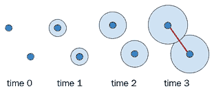
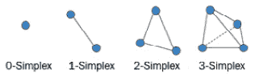
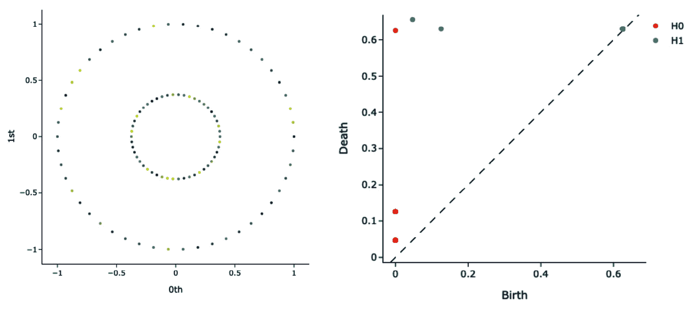
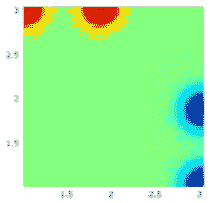
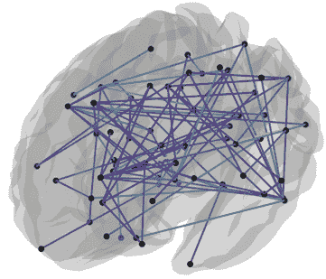

# 第十章：图上的新颖趋势

在前面的章节中，我们描述了不同类型的监督和非监督算法，这些算法可以用于涉及图数据结构的广泛问题。然而，关于图机器学习的科学文献浩如烟海，并且不断演变，每个月都有新的算法发表。在本章中，我们将提供一些关于图机器学习的新技术和应用的高级描述。

本章将分为两个主要部分——高级算法和应用。第一部分主要致力于描述图机器学习领域的一些有趣的新技术。你将了解基于随机游走和生成神经网络的图数据采样和数据增强技术。然后，你将了解拓扑数据分析，这是一种相对新颖的工具，用于分析高维数据。在第二部分，我们将向你提供图机器学习在不同领域的一些有趣应用，从生物学到几何分析。阅读本章后，你将意识到如何观察数据之间的关系为新颖迷人的解决方案打开了大门。

具体来说，本章将涵盖以下主题：

+   学习关于图数据增强

+   学习关于拓扑数据分析

+   在新领域应用图论

在我们开始之前，让我们确保我们已经具备了以下章节中提到的先决条件。

# 技术要求

我们将使用 Python 3.6.9 进行所有练习。以下是你必须使用`pip`安装的 Python 库列表，以便本章使用：例如，你可以在命令行上运行`pip install networkx==2.5`，等等：

```py
networkx==2.5 
littleballoffur==2.1.8
```

与本章相关的所有代码文件都可在`待定 URL`找到。

# 学习关于图数据增强

在第八章《信用卡交易图分析》中，我们描述了如何使用图机器学习来研究和自动检测欺诈信用卡交易。在描述用例时，我们遇到了两个主要障碍：

+   原始数据集中节点太多，难以处理。因此，计算成本过高，无法进行计算。这就是我们只选择数据集的 20%的原因。

+   从原始数据集中，我们发现不到 1%的数据被标记为欺诈交易，而数据集的其余 99%包含真实交易。这就是为什么在边缘分类任务中，我们随机对数据集进行子采样。

我们用来解决这两个障碍的技术，总的来说，并不是最优的。对于图数据，需要更复杂和创新的技术来解决任务。此外，当数据集高度不平衡时，正如我们在*第八章*中提到的，*信用卡交易图分析*，我们可以使用异常检测算法来解决这个问题。

在本节中，我们将描述一些技术和算法，我们可以使用它们来解决上述问题。我们将从描述图采样问题开始，然后描述一些图数据增强技术。我们将分享一些有用的参考文献和 Python 库，用于这两个方面。

## 样本策略

在*第八章*中，*信用卡交易图分析*，为了执行边分类任务，我们最初只对整个数据集的 20%进行了采样。不幸的是，这种策略，总的来说，并不是一个最优的方案。实际上，使用这种简单策略选择的节点子集可能会生成一个子图，这个子图并不能代表整个图的拓扑结构。因此，我们需要定义一个策略，通过采样正确的节点来构建给定图的子图。从给定的大图中通过最小化*拓扑*信息损失来构建（小）子图的过程被称为**图采样**。

为了让我们对图采样算法有一个全面的了解，可以在论文《Little Ball of Fur: A Python Library for Graph Sampling》中找到好的起点，该论文可以从以下 URL 下载：[`arxiv.org/pdf/2006.04311.pdf`](https://arxiv.org/pdf/2006.04311.pdf)。他们使用`networkx`库的 Python 实现可以在以下 URL 找到：[`github.com/benedekrozemberczki/littleballoffur`](https://github.com/benedekrozemberczki/littleballoffur)。这个库中可用的算法可以分为节点采样算法和边采样算法。这些算法分别对图中的节点和边进行采样。结果，我们从原始图中得到一个节点或边诱导的子图。我们将让您使用`littleballoffur` Python 包中可用的不同图采样策略来执行*第八章*中提出的分析，*信用卡交易图分析*。

## 探索数据增强技术

数据增强是在处理不平衡数据时的一种常见技术。在不平衡问题中，我们通常有两个或更多类的标记数据。数据集中只有一个或多个类的样本很少。包含少量样本的类也称为*少数*类，而包含大量样本的类称为*多数*类。例如，在*第八章*中描述的用例，“信用卡交易图分析”中，我们有一个不平衡数据集的明显例子。在输入数据集中，只有 1% 的所有交易被标记为欺诈（少数类），而其他 99% 是真实交易（多数类）。在处理*经典*数据集时，问题通常通过随机下采样或上采样或使用如*SMOTE*之类的数据生成算法来解决。然而，对于图数据，这个过程可能并不那么简单，因为生成新节点或图不是一个简单的过程。这是由于复杂的拓扑关系存在。在过去十年中，已经开发出大量数据增强图算法。在这里，我们将介绍两种最新可用的算法，即 *GAug* 和 *GRAN*。

GAug 算法是一种基于节点的数据增强算法。它在论文《用于图神经网络的图数据增强》中进行了描述，该论文可在以下网址找到：[`arxiv.org/pdf/2006.06830.pdf`](https://arxiv.org/pdf/2006.06830.pdf)。该库的 Python 代码可在以下网址找到：[`github.com/zhao-tong/GAug`](https://github.com/zhao-tong/GAug)。此算法在需要边缘或节点分类的场景中可能很有用，例如在*第八章*中提供的用例，“信用卡交易图分析”，其中可以使用该算法对属于少数类的节点进行增强。作为一个练习，你可以扩展我们在*第八章*中提出的分析，“信用卡交易图分析”，使用 GAug 算法。

GRAN 算法是一种基于图的图数据增强算法。它在论文《使用图循环注意力网络的高效图生成》中进行了描述，该论文可在以下网址找到：[`arxiv.org/pdf/1910.00760.pdf`](https://arxiv.org/pdf/1910.00760.pdf)。该库的 Python 代码可在以下网址找到：[`github.com/lrjconan/GRAN`](https://github.com/lrjconan/GRAN)。此算法在处理图分类/聚类问题时生成新图时很有用。例如，如果我们处理一个不平衡的图分类问题，使用 GRAN 算法为数据集创建平衡步骤然后执行分类任务可能很有用。

# 了解拓扑数据分析

**拓扑数据分析**（**TDA**）是一种相当新颖的技术，用于提取量化数据“形状”的特征。这种方法的想法是，通过观察数据点在某个空间中的组织方式，我们可以揭示有关生成该数据的过程的一些重要信息。

应用 TDA 的主要工具是**持久同调**。这种方法背后的数学相当高级，所以让我们通过一个例子来介绍这个概念。假设你有一组分布在空间中的数据点，让我们假设你正在“观察”它们随时间的变化。点保持静止（它们不会在空间中移动）；因此，你将永远观察这些独立点。然而，让我们想象我们可以通过一些定义良好的规则将这些数据点连接起来，从而在这些数据点之间建立关联。特别是，让我们想象一个从这些点随时间扩展的球体。每个点都将有一个自己的扩展球体，一旦两个球体碰撞，这两个点就可以放置一个“边”。这可以用以下图例来表示：



图 10.1 – 点之间关系创建的示例

碰撞的球体越多，创建的关联就越多，放置的边也就越多。这发生在多个球体与更复杂的几何结构（如三角形、四面体等）相交时：



图 10.2 – 点之间连接生成几何结构的示例

当一个新的几何结构出现时，我们可以记录其“诞生”时间。另一方面，当现有的几何结构消失（例如，它成为更复杂几何结构的一部分）时，我们可以记录其“死亡”时间。在模拟过程中观察到的每个几何结构的生存时间（从诞生到死亡的时间）可以用作分析原始数据集的新特征。

我们还可以通过将每个结构的对应对（诞生，死亡）放置在二维坐标系中来定义所谓的**持久图**。靠近对角线的点通常反映噪声，而远离对角线的点代表持久特征。以下是一个持久图的示例。请注意，我们通过使用扩展的“球体”作为示例来描述整个过程。在实践中，我们可以改变这个扩展形状的维度（例如，使用二维圆），从而为每个维度生成一组特征（通常用字母*H*表示）：



图 10.3 – 2D 点云（右）及其对应持久图（左）的示例

一个用于执行拓扑数据分析的优秀的 Python 库是`giotto-tda`，可在以下网址找到：[`github.com/giotto-ai/giotto-tda`](https://github.com/giotto-ai/giotto-tda)。使用 giotto-tda 库，可以轻松构建单纯复形及其相关的持久图，如图像所示。

## 拓扑机器学习

现在我们已经了解了 TDA 背后的基础知识，让我们看看它如何被用于机器学习。通过向机器学习算法提供拓扑数据（例如持久特征），我们可以捕捉到其他传统方法可能错过的模式。

在上一节中，我们看到了持久图在描述数据方面的有用性。然而，使用它们来喂养机器学习算法（如`RandomForest`）并不是一个好的选择。例如，不同的持久图可能有不同数量的点，基本代数运算可能没有很好地定义。

一种克服这种限制的常见方法是将图表转换为更合适的表示。可以使用嵌入或核方法来获得图表的“*向量化*”表示。此外，如“*持久图像*”，“*持久景观*”和“*贝蒂曲线*”等高级表示方法已被证明在实用应用中非常有用。例如，“*持久图像*”（图 10.4）是持久图的二维表示，可以轻松地输入到卷积神经网络中。

从这个理论中产生了几个可能性，并且发现与深度学习之间仍然存在联系。正在提出一些新想法，使这个主题既热门又迷人：



图 10.4 – 持久图像的示例

拓扑数据分析是一个快速发展的领域，尤其是在它可以与机器学习技术相结合的情况下。每年都会发表关于这个主题的几篇科学论文，我们预计在不久的将来会有新颖而令人兴奋的应用。

# 在新领域中应用图论

近年来，由于对图机器学习有了更坚实的理论理解，以及可用存储空间和计算能力的增加，我们可以确定许多领域，在这些领域中，这种学习理论正在传播。只要稍加想象，你就可以开始将周围的世界看作是一组“*节点*”和“*链接*”。我们的工作或学习场所，我们每天使用的科技设备，甚至我们的大脑都可以表示为网络。在本节中，我们将探讨一些图论（以及图机器学习）如何被应用于看似无关的领域的例子。

## 图机器学习和神经科学

使用图论研究大脑是一个繁荣且不断发展的领域。已经研究了多种表示**大脑作为网络**的方法，目的是了解大脑的不同部分（节点）是如何相互**功能上**或**结构上**连接的。

通过使用如**磁共振成像**（**MRI**）等医疗技术，可以获得大脑的三维表示。这样的图像可以通过不同的算法进行处理，以获得大脑的不同分区（分区）。

我们可以根据是否对分析这些区域的功能性或结构性连通性感兴趣，以不同的方式定义这些区域之间的连接：

+   **功能性磁共振成像**（**fMRI**）是一种测量大脑某个部分是否“活跃”的技术。具体来说，它测量每个区域的**血氧水平依赖性**（**BOLD**）信号（表示在特定时间内血液和氧气水平的变化的信号）。然后，可以计算两个感兴趣大脑区域的 BOLD 序列之间的**皮尔逊相关系数**。高相关性意味着这两个部分“功能上连接”，可以在它们之间放置一条边。一篇关于图形分析 fMRI 数据的有趣论文是*基于图的静息态功能性 MRI 网络分析*，可在[`www.frontiersin.org/articles/10.3389/fnsys.2010.00016/full`](https://www.frontiersin.org/articles/10.3389/fnsys.2010.00016/full)找到。

+   另一方面，通过使用如**扩散张量成像**（**DTI**）等高级 MRI 技术，我们还可以测量两个感兴趣大脑区域之间物理连接的白质纤维束的强度。因此，我们可以获得表示大脑结构连通性的图表。一篇将神经网络与从 DTI 数据生成的图表结合使用的论文称为*通过图卷积神经网络的多发性硬化症临床特征*，可在[`www.frontiersin.org/articles/10.3389/fnins.2019.00594/full`](https://www.frontiersin.org/articles/10.3389/fnins.2019.00594/full)找到。

+   功能性和结构连通性可以使用图论进行分析。有几项研究增强了与神经退行性疾病相关的此类网络的显著变化，例如阿尔茨海默病、多发性硬化症和帕金森病等。

最终结果是描述不同大脑区域之间连接的图表，如图所示：



图 10.5 – 作为图表的大脑区域连接

在这里，我们可以看到如何将不同的大脑区域视为图的节点，而那些区域之间的连接则是边。

图机器学习已被证明对于这种分析非常有用。不同的研究已经进行，基于大脑网络自动诊断特定的病理，从而预测网络的演变（例如，识别未来可能受到病理影响的潜在脆弱区域）。

网络神经科学是一个有希望的领域，在未来，我们将从这些网络中收集越来越多的见解，以便我们能够理解病理改变并预测疾病的演变。

## 图论和化学与生物学

图机器学习可以应用于化学。例如，通过将原子视为图的节点，将键视为它们的连接，图提供了一种自然的方法来描述**分子结构**。这种方法已被用于研究化学系统的不同方面，包括表示反应、学习化学指纹（指示化学特征或子结构的存在或不存在）等。

在生物学中也可以找到一些应用，其中许多不同的元素可以表示为图。例如，**蛋白质-蛋白质相互作用**（**PPI**）是研究最广泛的主题之一。在这里，构建了一个图，其中节点代表蛋白质，边代表它们的相互作用。这种方法使我们能够利用 PPI 网络的结构信息，这在 PPI 预测中已被证明是有信息的。

## 图机器学习和计算机视觉

深度学习的兴起，特别是**卷积神经网络**（**CNN**）技术，在计算机视觉研究中取得了惊人的成果。对于广泛的任务，如图像分类、目标检测和语义分割，CNNs 可以被认为是当前最先进的。然而，最近，计算机视觉中的核心挑战已经开始使用图机器学习技术来解决——特别是**几何深度学习**。正如我们在本书中学到的，图像表示的二维欧几里得域与更复杂对象（如三维形状和点云）之间存在基本差异。从二维和三维视觉数据中恢复世界的三维几何形状、场景理解、立体匹配和深度估计只是可以做到的几个例子。

### 图像分类和场景理解

图像分类，作为计算机视觉中最广泛研究的一项任务，如今主要由基于 CNN 的算法主导，已经开始从不同的角度被处理。图神经网络模型已经显示出吸引人的结果，尤其是在大量标记数据不可用的情况下。特别是，有一种趋势是将这些模型与*零样本和少样本学习技术*相结合。在这里，目标是分类模型在训练期间从未见过的类别。例如，这可以通过利用未见对象与已见对象“语义”相关性的知识来实现。

类似的方法也已被用于场景理解。使用场景中检测到的对象之间的关系图提供了图像的可解释结构化表示。这可以用于支持各种任务的高级推理，包括标题生成和视觉问答等。

### 形状分析

与二维像素网格表示的图像不同，有几种方法可以表示 3D 形状，例如*多视图图像*、*深度图*、*体素*、*点云*、*网格*和*隐式表面*等。然而，在应用机器和深度学习算法时，这些表示可以被利用来学习特定的几何特征，这对于设计更好的分析是有用的。

在这个背景下，几何深度学习技术已经显示出有希望的结果。例如，GNN 技术已被成功应用于寻找可变形形状之间的对应关系，这是一个经典问题，导致了许多应用，包括纹理动画和映射，以及场景理解。对于那些对此感兴趣的人，一些有助于理解图机器学习应用的资源可以在[`arxiv.org/pdf/1611.08097.pdf`](https://arxiv.org/pdf/1611.08097.pdf)和[`geometricdeeplearning.com/`](http://geometricdeeplearning.com/)找到。

## 推荐系统

图机器学习的另一个有趣应用是在推荐系统中，我们可以用它来预测用户会对一个项目分配的“评分”或“偏好”。在*第六章* *社交网络图*中，我们提供了一个例子，说明了如何使用链接预测来构建为特定用户和/或客户提供推荐的自动算法。在可从[`arxiv.org/pdf/2011.02260.pdf`](https://arxiv.org/pdf/2011.02260.pdf)获取的论文*推荐系统中的图神经网络：综述*中，作者提供了一份关于图机器学习如何应用于构建推荐系统的广泛调查。更具体地说，作者描述了不同的图机器学习算法及其应用。

# 总结

在本章中，我们提供了关于一些新兴图机器学习算法及其在新领域应用的高级概述。在本章开头，我们以*第八章*中提供的示例“信用卡交易图分析”为例，描述了一些图数据的采样和增强算法。我们还提供了一些可以用于处理图采样和图数据增强任务的 Python 库。

我们继续通过提供拓扑数据分析的一般描述以及这项技术最近在不同领域中的应用情况。

最后，我们提供了关于新应用领域的几个描述，例如神经科学、化学和生物学。我们还描述了机器学习算法如何被用来解决其他任务，例如图像分类、形状分析和推荐系统。

就到这里！在这本书中，我们概述了最重要的图机器学习技术和算法。你现在应该能够处理图数据并构建机器学习算法。我们希望你现在工具箱中拥有更多工具，并且你会使用它们来开发令人兴奋的应用。我们还邀请你检查本书中提供的参考文献，并应对我们在不同章节中提出的挑战。

图机器学习的世界令人着迷且发展迅速。每天都有新的研究论文发表，其中包含令人难以置信的发现。像往常一样，持续回顾科学文献是发现新算法的最佳方式，而 arXiv ([`arxiv.org/`](https://arxiv.org/)) 是搜索免费科学论文的最佳场所。
