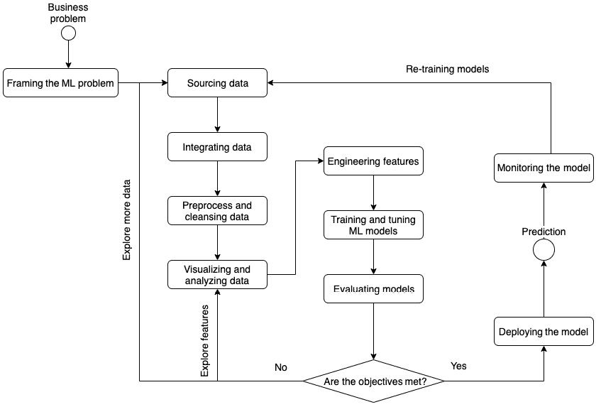
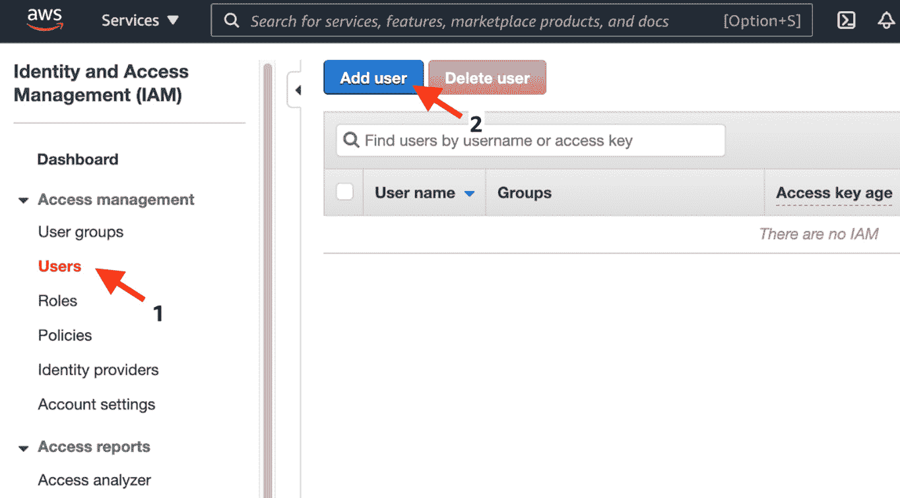
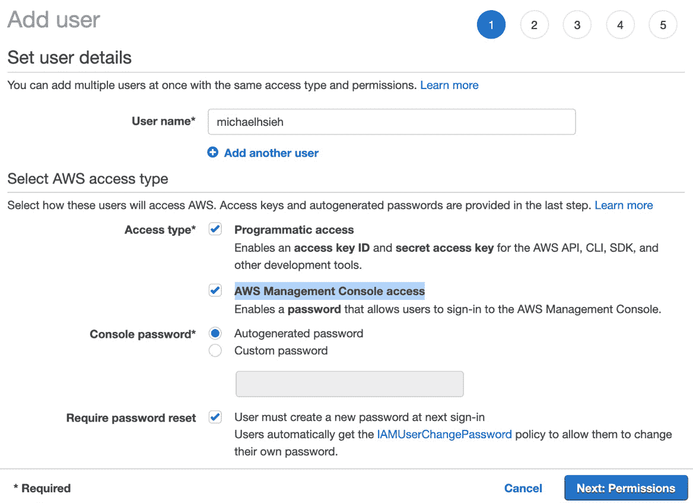
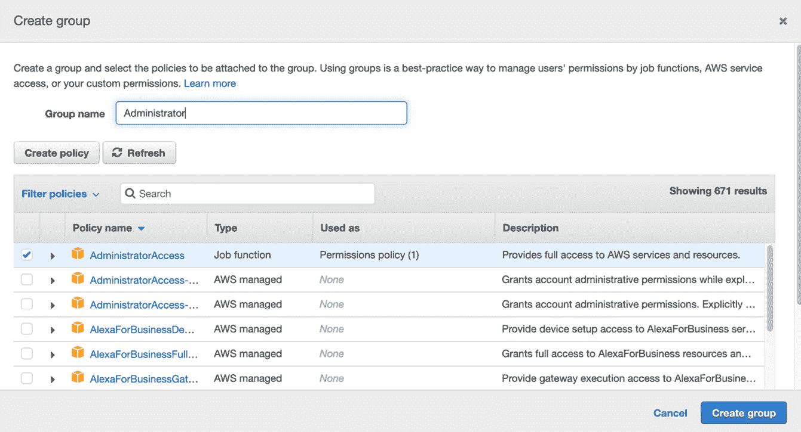
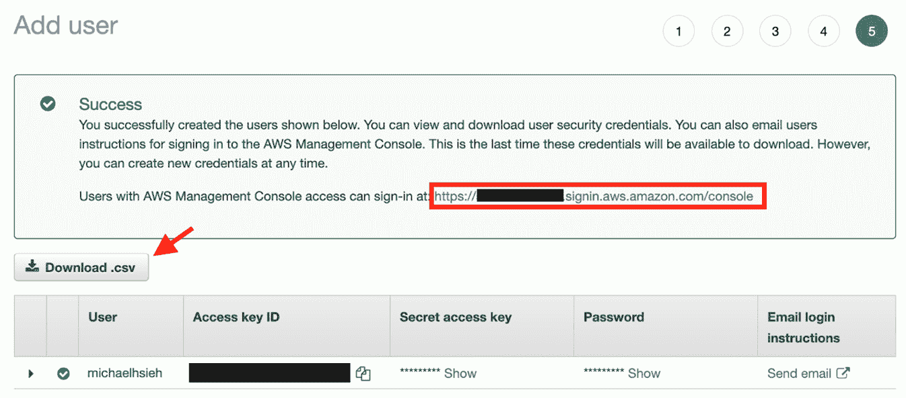
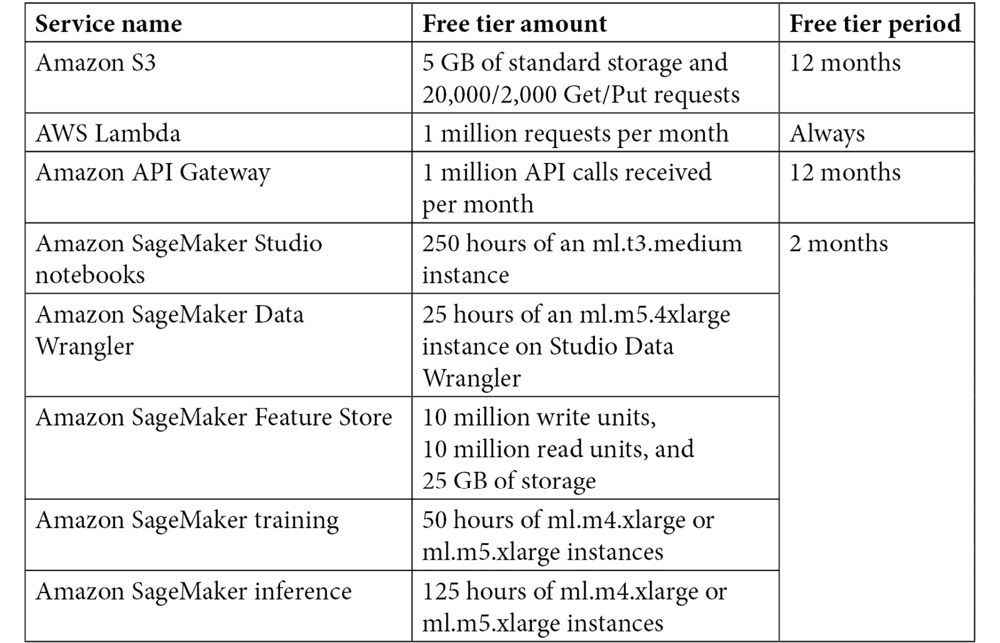

# 第一章: 云中的机器学习及其生命周期

**机器学习**（**ML**）是一种存在了几十年的技术。难以相信 ML 现在在我们的日常生活中如此普遍。ML 领域成为主流也经历了一段坎坷的道路，直到最近计算机技术的重大飞跃。今天的计算机硬件更快、更小、更智能。互联网速度更快、更方便。存储更便宜、更小。现在，使用我们现在的技术，收集、存储和处理大量数据变得相当容易。我们能够创建以前无法创建的大量数据集，使用以前不可用的计算资源训练机器学习模型，并在我们生活的每个角落使用机器学习模型。

例如，媒体流媒体公司现在可以利用其网站上的标题集合和客户活动数据，在全球范围内构建机器学习推荐引擎，以实时提供最相关的内容，从而优化客户体验。标题和客户偏好及活动数据的大小，在 20 年前是无法想象的，考虑到我们中有多少人正在使用流媒体服务。

在这个规模上训练机器学习模型，使用越来越复杂的机器学习算法，需要一个强大且可扩展的解决方案。模型训练完成后，公司能够在全球范围内提供服务，数百万用户同时从网页和移动设备访问应用程序。

公司还在为每个客户细分市场或甚至为单个客户创建越来越多的模型。还有一个维度——公司正在以没有自动训练、评估、测试和部署新模型的管道就无法管理的速度推出新模型。云计算为流媒体服务提供商提供了一个完美的基础，以执行这些机器学习活动，提高客户满意度。

如果机器学习是您感兴趣的事情，或者您已经在任何形式上从事机器学习领域的工作，这本书就是您正确的选择。您将学习所有关于机器学习的内容，以及如何与我一起在书中使用实际案例和数据集构建、训练、托管和管理机器学习模型。我假设您对机器学习和云计算有很好的理解。本章的目的是设定两种技术的概念和术语水平，定义本书的核心——机器学习生命周期，并提供关于亚马逊网络服务和其核心服务的快速课程，这些将在本书中提及。

在本章中，我们将涵盖以下内容：

+   理解机器学习及其生命周期

+   在云中构建机器学习

+   探索 AWS 机器学习基础知识

+   设置 AWS 环境

# 技术要求

为了本章，你需要一台连接到互联网的计算机和浏览器来执行以下章节中 Amazon SageMaker 设置和代码样本的基本 AWS 账户设置。

# 理解机器学习及其生命周期

在其核心，机器学习是一个使用计算机算法自动发现数据集（这是一个包含具有**特征**的**观察**集合，也称为**变量**）中的潜在模式和趋势的过程，进行预测，获取与真实值（如果提供）的错误度量，并通过**优化**过程从错误中“学习”，以便下次做出预测。在过程的最后，一个**机器学习模型**被拟合或训练，以便它可以被用来应用其学到的知识，根据新观察的特征做出决策。这个过程的第一部分，生成模型，被称为**训练**，而第二部分被称为**预测**或**推理**。

基于训练过程的方式，机器学习算法主要有三种基本类型——监督学习、无监督学习和强化学习。**监督学习**算法被提供一组带有过去真实值的观察数据。真实值是训练监督学习算法的关键成分，因为它决定了模型如何学习和做出未来的预测——因此，名称中的“监督”一词，意味着学习是在真实值的监督下进行的。另一方面，**无监督学习**不需要真实值来学习如何应用预测。它仅根据观察的特征来寻找模式和关系。然而，如果存在真实值，它仍然可以帮助我们验证和理解无监督学习情况下模型的准确性。**强化学习**，通常缩写为**RL**，与前面两种相比，具有相当不同的学习范式。强化学习由一个**代理**与一组**动作**、相应的**奖励**和**状态**的**环境**进行交互。学习不是由真实值引导的，而是通过优化累积奖励与动作来进行的。最终训练好的模型将能够在环境中自主执行动作以实现最佳奖励。

## 机器学习生命周期

现在我们对机器学习有了基本的了解，我们可以更广泛地看看典型的机器学习生命周期是什么样的，如下面的图所示：

图 1.1 – 机器学习生命周期

### 问题界定

成功的机器学习生命周期中的第一步是将业务问题框架化为机器学习问题。业务问题形形色色。例如，*"我们如何增加新产品的销售额？"* 和 *"我们如何提高装配线上的 QA 质量评估（QA）吞吐量？"* 这样的业务问题通常是定性的，不是机器学习可以直接应用的问题。但是，在审视业务问题陈述时，我们应该考虑如何将其转化为机器学习问题。我们应该提出以下问题：

+   *"产品销售成功的关键因素是什么？"*

+   *"哪些人最有可能购买该产品？"*

+   *"装配线中的吞吐量瓶颈在哪里？"*

+   *"我们如何知道一个项目是否有缺陷？一个有缺陷的项目与一个正常的项目有什么区别？"*

通过提出这些问题，我们开始深入到**模式识别**的领域，这是一个从现有数据中识别模式的过程。有了可以形成模式识别的正确问题，我们就更接近于框架化机器学习问题。然后，我们还需要了解衡量方法成功的关键指标是什么，无论我们使用机器学习还是其他方法。例如，衡量每日产品销售额是非常直接的。我们还可以通过针对最有可能转化的受众投放广告来提高销售额。然后，我们得到以下问题：

+   *"我们如何衡量转化率？"*

+   *"购买过该产品的消费者有哪些共同特征？"*

更重要的是，我们需要弄清楚是否甚至有一个目标指标供我们进行预测！如果有目标，我们可以将问题框架化为一个机器学习问题，例如预测未来的销售额（监督学习和回归）、预测一个客户是否会购买某个产品（监督学习和分类），或者识别有缺陷的项目（监督学习和分类）。没有明确预测目标的问题将落入无监督学习任务中，以便将发现的数据模式应用于未来的数据点。目标动态且高度不确定的用例，如自动驾驶、机器人控制和股价预测，是强化学习的良好候选。

### 数据探索和工程

获取数据是成功机器学习建模之旅的第一步。一旦我们清楚地定义了业务问题和机器学习问题，并对问题的范围有一个基本了解——即，什么是指标，什么是因素——我们就可以开始收集机器学习所需的数据。数据科学家探索数据源，以找出可能支持建模的相关信息。有时，组织内部捕获和收集的数据很容易获取。有时，数据在组织外部可用，可能需要你伸出援手并请求数据共享许可。

有时，数据集可以从公共互联网和专注于为机器学习目的创建和共享标准化数据集的机构中获取，这在计算机视觉和自然语言理解用例中尤其如此。此外，数据可以通过网站和应用程序的流式传输到达。需要设置与数据库、数据湖、数据仓库和流源的联系。在训练机器学习模型之前，需要将数据集成到机器学习平台中进行处理和工程。

管理数据不规则性和异质性是机器学习生命周期的第二步。需要处理数据以消除不规则性，例如缺失值、错误的数据输入和异常值，因为许多机器学习算法都有统计假设，这些不规则性会违反假设并使建模无效（如果不合法）。例如，线性回归模型假设误差或残差是正态分布的，因此检查是否存在可能导致此类违规的异常值非常重要。如果是这样，我们必须执行必要的预处理任务来纠正它。常见的预处理方法包括但不限于删除无效条目、删除极端数据点（也称为异常值）和填充缺失值。数据还需要进行处理，以消除特征之间的异质性并将它们归一化到相同的尺度，因为某些机器学习算法对特征的尺度敏感，并可能对尺度较大的特征产生偏差。常见的方法包括**最小-最大缩放**和**z 标准化**（**z 分数**）。

可视化和数据分析是机器学习生命周期的第三步。数据可视化使数据科学家能够轻松地从视觉上理解数据的分布和数据的趋势。**探索性数据分析**（**EDA**）使数据科学家能够理解手头数据的统计行为，找出具有预测力的信息并将其包含在建模过程中，并消除数据中的任何冗余，例如重复条目、多重共线性和不重要的特征。

特征工程是机器学习生命周期的第四步。即使我们从各种来源收集数据，机器学习模型通常也受益于从现有特征计算出的工程化特征。例如，**体质指数**（**BMI**）是一个众所周知的工程化特征，它是通过计算一个人的身高和体重得出的，并且也是一个已确立的特征（或临床术语中的风险因素），它预测某些疾病而不是仅仅身高或体重。特征工程通常需要在该领域有丰富的经验并进行实验，以找出哪些配方能为建模增加预测能力。

### 建模和评估

对于数据科学家来说，机器学习建模是生命周期中最激动人心的部分（我认为是这样；希望你也同意）。你已经用机器学习的语言表述了问题。你已经收集、处理了数据，并观察到了那些能给你足够提示以构建机器学习模型的基本趋势。现在，是时候为数据集构建你的第一个模型了，但是等等——我们使用什么模型、什么算法以及什么指标来评估性能呢？嗯，这就是建模和评估的核心。

目标是探索并从所有可能的算法、特征集和超参数中找到一个令人满意的机器学习模型，并使用客观指标。这绝对不是一项容易的任务，需要丰富的经验。根据问题类型（无论是分类、回归还是强化学习）、数据类型（如表格、文本或图像数据）、数据分布（是否存在类别不平衡或异常值？）以及领域（医疗、金融或工业），你可以将算法的选择缩小到几个。对于这些算法中的每一个，都有控制算法在提供的数据上的行为和性能的超参数。还需要定义一个符合业务要求的客观指标和阈值，使用该指标来指导你找到最佳模型。你可能会盲目地为你项目选择一两个算法-超参数组合，但你可能无法在仅仅一两次尝试中就达到最优解。数据科学家尝试数百甚至数千种组合是很常见的。这是如何实现的呢？

这就是为什么建立一个简化的模型训练和评估流程在过程中是一个如此关键的步骤。一旦模型训练和评估自动化，你就可以简单地启动一个过程，帮助你自动迭代算法和超参数之间的实验，并比较指标性能以找到最优解。这个过程被称为**超参数调整**或**超参数优化**。如果多个算法是调整的对象，它也可以被称为**多算法超参数调整**。

### 生产 - 预测、监控和再训练

机器学习模型需要投入使用才能对业务产生影响。然而，其生产过程与典型软件应用的生产过程不同。与其他软件应用不同，业务逻辑可以在生产前预先编写并彻底测试边缘情况，而一旦模型被训练和评估，并不能保证其在生产环境中的表现与测试环境中的表现相同。这是因为机器学习模型使用概率、统计和模糊逻辑来推断每个输入数据点的结果，而测试，即模型评估，通常是在对生产数据没有真正先验知识的情况下进行的。数据科学家在生产前能做的最好的事情是从一个紧密代表现实世界数据的样本中创建训练数据，并使用样本外策略评估模型，以获得模型在未见数据上表现的无偏看法。在生产中，模型完全看不到输入数据；如何评估实时模型性能，以及如何根据评估采取行动，是生产化机器学习模型的关键话题。

模型性能可以通过两种方法进行监控。一种更直接的方法是捕获未见数据的真实情况，并将预测与真实情况进行比较。第二种方法是使用数据的漂移作为代理来确定模型是否将以预期的方式表现。在某些用例中，第一种方法不可行，因为真实结果（真实情况）可能落后于事件很长时间。例如，在疾病预测用例中，机器学习建模的目的是帮助医疗保健提供者在当前健康指标下找到未来三个月内可能的结果，在这种情况下，不可能在不到三个月或更晚的时候收集到真实情况，这取决于疾病的发作时间。因此，仅在生产后修复模型是不切实际的，如果证明其无效。

第二种方法基于这样一个前提：机器学习模型从训练数据中统计和概率性地学习，当提供具有不同统计特征的新数据集时，其行为可能会有所不同。当数据不是来自相同的统计分布时，模型会返回无意义的输出。因此，通过检测数据的漂移，它提供了对模型将如何表现的一个更实时的估计。以疾病预测用例为例：当关于 30 多岁患者群体的数据被发送到一个在平均年龄为 65 岁的数据上训练的机器学习模型进行预测时，该模型很可能对这些新患者一无所知。因此，我们需要采取行动。

重新训练和更新模型确保它在未来的数据中保持性能。能够捕捉到真实情况和检测数据漂移有助于在正确的时间制定重新训练策略。漂移的数据和真实情况是重新训练过程中的重要输入，因为它们将帮助模型覆盖更广泛的统计分布。

现在我们已经清楚地了解了机器学习开发的基本用途和生命周期，让我们进一步探讨它如何与云协同工作。

# 在云端构建机器学习

云计算是一种技术，它提供按需 IT 资源，可以根据需要随时增长和缩小。不再需要购买和维护计算机服务器或数据中心。这就像您家里的公用事业一样，比如水，当你打开水龙头时它就在那里。如果你完全打开，你会得到高压水流。如果你调低，你会节约用水。如果你不再需要它，你可以完全关闭。使用这种模式，开发者和团队可以从按需云计算中获得以下好处：

+   **敏捷性**：根据需要快速启动资源。快速开发并推出新应用，尝试新想法，快速失败而无需承担风险。

+   **弹性**：根据需要扩展您的资源。云计算消除了“无差别的繁重劳动”——堆叠额外的服务器和为未来规划容量。这些都是不能帮助解决您核心业务问题的东西。

+   **全球可用性**：只需点击一下按钮，您就可以启动位于您客户/用户附近的最接近的资源，而无需重新安置您的物理计算资源。

*这对机器学习领域有何影响？* 随着计算资源获取变得更加容易，信息交换变得更加频繁。当这种情况发生时，会产生和存储更多的数据。更多的数据意味着有更多机会训练更准确的机器学习模型。云计算提供的灵活性、弹性和可扩展性加速了机器学习模型从几周到几个月的开发和应用周期，缩短到更短的周期，这样开发者现在可以比以往任何时候都更快地生成和改进机器学习模型。开发者不再受限于他们可用的物理计算资源。有了更好的机器学习模型，企业可以做出更好的决策，并为顾客提供更好的产品体验。

在本书中，我们将使用亚马逊网络服务（Amazon Web Services）作为云计算提供商，它是亚马逊 SageMaker Studio 的提供者。

# 探索 AWS 机器学习基础

**亚马逊网络服务**（**AWS**）为各种开发者提供云计算资源，以创建他们业务的应用程序和解决方案。AWS 在一个安全的环境中并以可扩展的方式管理技术和基础设施，从而从开发者手中移除了基础设施管理的繁重工作。AWS 提供了广泛的服务，包括机器学习、人工智能、物联网、分析和应用程序开发工具。这些服务建立在以下关键领域之上——**计算**、**存储**、**数据库**和**安全**。在我们开始使用亚马逊 SageMaker Studio 的旅程之前，这是 AWS 提供的机器学习服务之一，了解在亚马逊 SageMaker Studio 开发机器学习项目时常用的核心服务非常重要。

## 计算

对于云中的机器学习，开发者需要在生命周期的各个方面都需要计算资源。**亚马逊弹性计算云**（**Amazon EC2**）是开发者处理、训练和托管机器学习模型的最基本的云计算环境。Amazon EC2 提供了多种计算实例类型，适用于各种目的，如计算密集型工作的计算优化实例、具有大内存占用应用程序的内存优化实例，以及用于深度学习训练的**图形处理单元**（**GPU**）加速实例。

亚马逊 SageMaker 也为机器学习开发者提供按需计算资源，以便运行处理、训练和模型托管。亚马逊 SageMaker 的机器学习实例建立在亚马逊 EC2 实例之上，并为实例配备了完全管理的、优化的流行机器学习框架版本，如 TensorFlow、PyTorch、MXNet 和 scikit-learn，这些框架针对亚马逊 EC2 计算实例进行了优化。开发者无需管理机器学习实例的配置和修补，因此可以专注于机器学习生命周期。

## 存储

在进行机器学习项目时，开发者需要能够访问文件、存储代码和存储工件。可靠的存储对于机器学习项目至关重要。AWS 为机器学习开发提供了多种存储选项。**亚马逊简单存储服务**（**Amazon S3**）和**亚马逊弹性文件系统**（**Amazon EFS**）是亚马逊 SageMaker Studio 中开发机器学习项目最相关的两种。

Amazon S3 是一种对象存储服务，允许开发者以高安全性、可用性和可扩展性存储任何数量的数据。机器学习开发者可以在 Amazon S3 上存储结构化和非结构化数据，以及带有版本控制的机器学习模型。Amazon S3 还可用于构建用于分析的数据库湖和存储备份和归档。

Amazon EFS 提供了一种完全托管、无服务器的文件系统，允许开发者在文件系统中存储和共享文件，无需进行任何存储配置，因为当您添加或删除文件时，文件系统会自动增加或减少其容量。它通常用于**高性能集群**（**HPC**）设置以及需要跨线程、处理任务、计算实例和用户进行并行或同时数据访问且具有高吞吐量的应用程序。由于 Amazon SageMaker Studio 集成了 Amazon EFS 文件系统，因此 Amazon SageMaker Studio 上的每个用户都有一个用于存储和访问数据、代码和笔记本的本地目录。

## 数据库和数据分析

除了存储选项，数据作为文件或对象保存之外，AWS 用户可以使用数据库服务如**Amazon 关系数据库服务**（**Amazon RDS**）和**Amazon DynamoDB**在数据点级别存储和访问数据。AWS 分析服务如**AWS Glue**和**Amazon Athena**在机器学习生命周期的早期阶段提供了存储、查询和数据处理的必要功能。

对于机器学习项目，关系数据库是建模的常见数据来源。Amazon RDS 是云中的一种成本效益高且可扩展的关系数据库服务。它提供包括开源的 PostgreSQL、MySQL 和 MariaDB 以及 Oracle 和 SQL Server 商业数据库在内的六种数据库引擎。使用 Amazon RDS 可以简化基础设施的配置和管理。

另一个流行的数据库是 NoSQL，它使用键值对作为数据结构。与关系数据库不同，NoSQL 数据库不需要对表有严格的模式要求。用户可以为每一行数据输入具有灵活模式的资料，而无需更改模式。Amazon DynamoDB 是一个完全托管、无服务器且高度可扩展的键值和文档数据库。

AWS Glue 是一种数据集成服务，具有帮助开发者从源数据中发现和转换数据以进行分析和机器学习的几个功能。AWS Glue 数据目录提供了一个持久元数据存储，作为所有数据源的中心存储库，例如 Amazon S3、Amazon RDS 和 Amazon DynamoDB 中的表。开发者可以在一个地方查看所有他们的表和元数据，如模式和时间更新——AWS Glue 数据目录。AWS Glue 的 ETL 服务有助于在 AWS Glue 数据目录中发现和编目数据后，立即简化提取、转换和加载步骤。

Amazon Athena 是一种分析服务，为开发者提供了一种交互式和无服务器的查询体验。作为一个无服务器服务，开发者不需要考虑底层的基础设施，而是专注于他们的数据查询。您可以通过一个模式定义轻松地将 Amazon Athena 指向 Amazon S3 中的数据，以开始查询。Amazon Athena 与 AWS Glue 数据目录无缝集成，允许您快速轻松地查询来自所有来源和服务的您的数据。Amazon Athena 还与 Amazon SageMaker Studio 的多个方面高度集成，我们将在本书的后续章节中详细介绍。

## 安全性

在 AWS 上开发应用程序、访问数据和训练 ML 模型时，安全性是首要任务。安全性的访问和身份控制方面由 **AWS 身份和访问管理**（**IAM**）服务管理。AWS IAM 可以对服务、云资源、身份验证和授权进行细粒度管理。

IAM 的关键概念包括 IAM 用户、组、角色和策略。每个登录 AWS 的人都会假定一个 IAM 用户。每个 IAM 用户都有一系列 IAM 策略附加，这些策略控制着 AWS 中该 IAM 用户可以命令和访问的资源及操作。IAM 用户还可以从具有相似责任的 IAM 组继承 IAM 策略。IAM 角色与 IAM 用户类似，因为它有一组权限来访问资源和执行操作。IAM 角色与 IAM 用户的不同之处在于，角色可以被用户、应用程序或服务假定。例如，您可以为云中的应用程序创建并分配一个 AWS 服务角色，以允许应用程序访问哪些服务和资源。拥有访问应用程序权限的 IAM 用户可以安全地执行应用程序，无需担心应用程序会访问未经授权的资源。更多信息请参阅：[`docs.aws.amazon.com/IAM/latest/UserGuide/id_roles.html`](https://docs.aws.amazon.com/IAM/latest/UserGuide/id_roles.html)。

# 设置 AWS 环境

让我们设置一个 AWS 账户，开始我们的云计算之旅。如果您已经有了 AWS 账户，您可以跳过这一部分，继续下一章。

请访问 [`portal.aws.amazon.com/billing/signup`](https://portal.aws.amazon.com/billing/signup) 并按照说明进行操作以注册账户。您将接到电话，作为流程的一部分，您需要在电话键盘上输入验证码。

当您首次创建新的 AWS 账户并使用您的电子邮件和密码登录时，您将以账户 root 用户登录。然而，在以 root 用户登录的情况下，最好创建一个具有`AdministratorAccess`策略的新 IAM 用户，然后迅速注销并再次以您刚刚创建的 IAM 用户登录。root 用户凭据应仅用于执行有限的账户和服务管理任务，不应用于开发您的云应用程序。您应安全地存储 root 用户凭据，并将其锁起来，防止其他人员访问。

下面是创建 IAM 用户的步骤：

1.  前往 IAM 控制台，在左侧面板中选择**用户**，然后点击**添加用户**按钮：

图 1.2 – 在 IAM 控制台中添加 IAM 用户

1.  接下来，在**用户名**中输入一个名称，并勾选**程序访问**和**AWS 管理控制台访问**的复选框。对于密码字段，您可以保留默认选项。点击**下一步：权限**按钮继续：

图 1.3 – 为 IAM 用户创建用户名和密码

1.  在下一页，选择**设置权限**下的**将用户添加到组**。在新的账户中，您没有任何组。您应该点击**创建组**。

1.  在弹出对话框中，在策略列表中的`AdministratorAccess`下输入`Administrator`，然后点击**创建组**按钮：

图 1.4 – 使用管理员访问权限创建 IAM 组

1.  对话框将关闭。确保已选择新的管理员，并点击**下一步：标签**。您可以可选地为 IAM 用户添加键值对标签。点击**下一步：审查**以审查配置。当一切正确时，点击**创建用户**。

您将看到以下信息。请记下登录 URL 以便于控制台访问，**访问密钥 ID**和**秘密访问密钥**用于程序访问，以及一次性密码。您还可以通过点击**下载.csv**按钮将凭据作为 CSV 文件下载：

图 1.5 – 创建一个新的 IAM 用户

1.  IAM 用户创建后，您可以使用登录 URL 和 IAM 用户登录您的 AWS 账户。当您首次登录时，您需要提供自动生成的密码，然后设置一个新的密码。现在，您应该在右上角注意到您是以新创建的 IAM 用户而不是 root 用户登录的：

图 1.6 – 确认您新创建的凭据

如果你刚开始接触 AWS，不必担心尝试 AWS 的成本。AWS 提供了一个基于服务消耗和/或 12 个月内的免费层，超过 100 个服务。本书中我们将使用的服务，如 S3 存储桶和 Amazon SageMaker，都提供了免费层，让你学习技能而无需花费大量资金。以下表格是对本书将要涵盖的服务免费层的总结：

图 1.7 – AWS 中的显著免费试用优惠

让我们通过回顾本章所涵盖的内容来结束本章。

# 摘要

在本章中，我们描述了机器学习的概念、机器学习生命周期中的步骤，以及如何用机器学习思维来处理商业问题。我们还讨论了云计算的基础知识、它在机器学习开发中的作用以及 Amazon Web Services 上的核心服务。最后，我们创建了一个 AWS 账户，并设置了一个用户，以便我们在本书的愉快旅程中使用。

在下一章中，我们将从高层次的角度学习 Amazon SageMaker Studio 及其组件。我们将看到每个组件是如何映射到本章所学的机器学习生命周期，并一起设置我们的 Amazon SageMaker Studio 环境。
