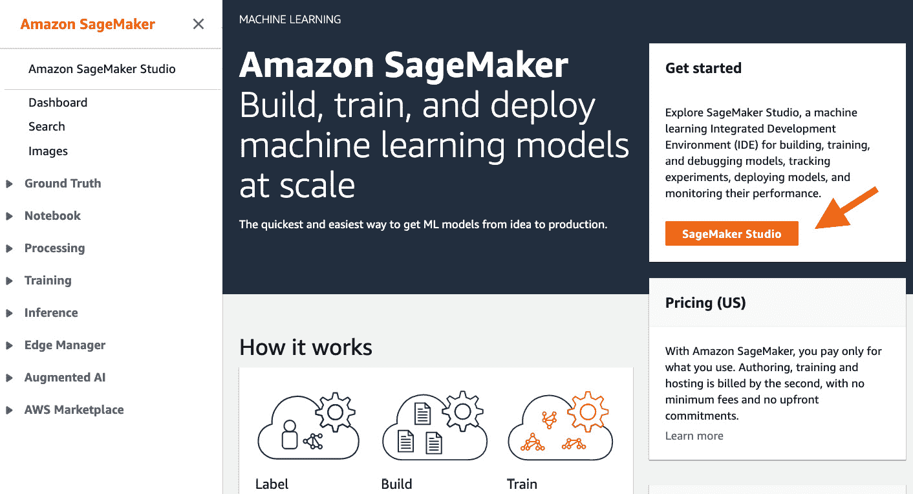
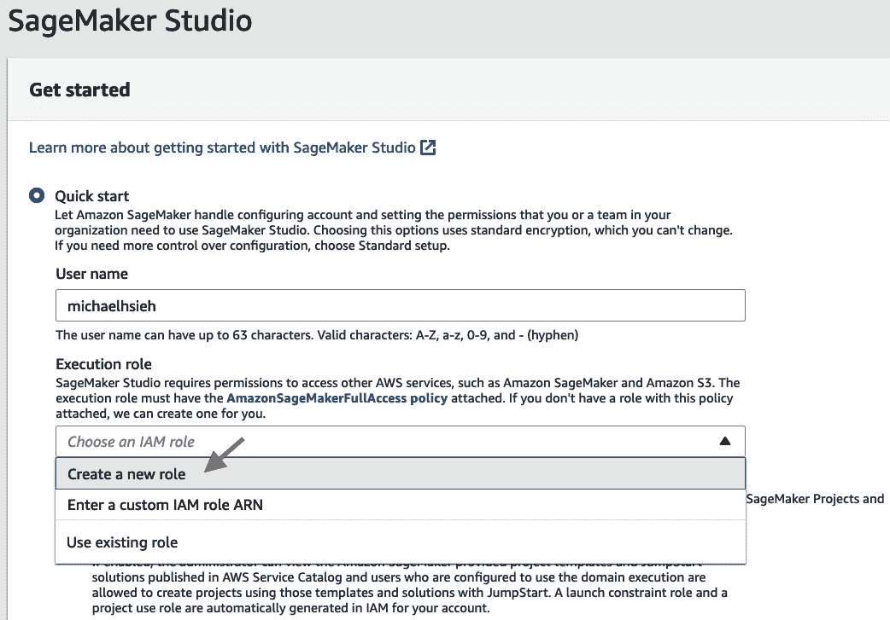
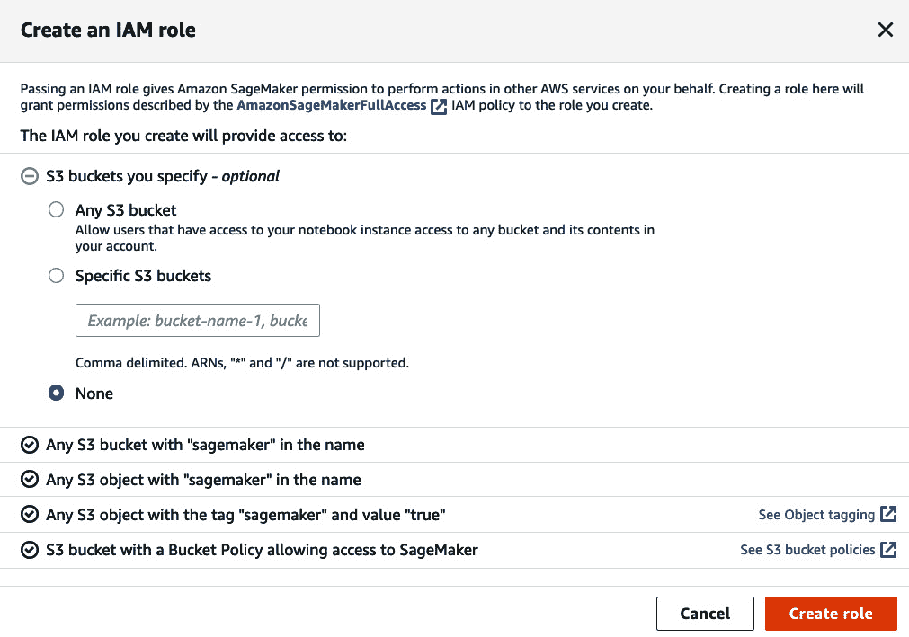
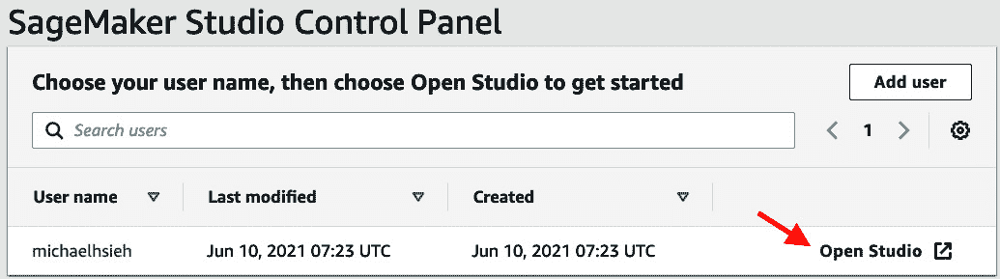
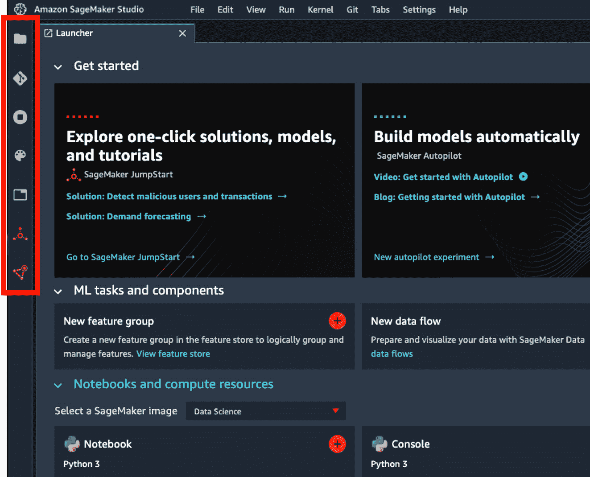
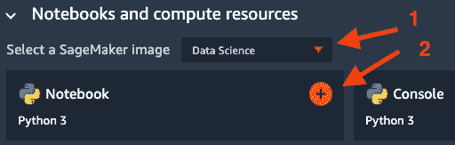
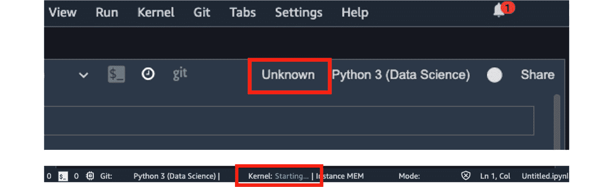
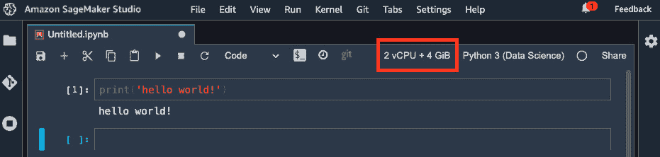

# 第二章：介绍 Amazon SageMaker Studio

正如我们刚刚在*第一章*，“云中的机器学习及其生命周期”中学习的，机器学习生命周期是复杂且迭代的。尽管大多数事情都是通过编码完成的，但步骤可能相当手动。对于机器学习项目来说，拥有合适的工具对于你在云中成功交付机器学习模型至关重要。通过本章，你将处于正确的位置！Amazon SageMaker Studio 是一个专为机器学习设计的**集成开发环境**（**IDE**），它提供了覆盖端到端机器学习生命周期的功能，使开发人员和数据科学家在 AWS 云中的工作变得容易。

在本章中，我们将涵盖以下内容：

+   介绍 SageMaker Studio 及其组件

+   设置 SageMaker Studio

+   漫步 SageMaker Studio 用户界面

+   揭秘 SageMaker Studio 笔记本、实例和内核

+   使用 SageMaker Python SDK

# 技术要求

对于本章，您需要一个 AWS 账户。如果您还没有，请回顾*第一章*，“云中的机器学习及其生命周期”中的*设置 AWS 环境*部分。

# 介绍 SageMaker Studio 及其组件

Amazon SageMaker 是 AWS 提供的机器学习服务，具有针对我们在*第一章*，“云中的机器学习及其生命周期”中讨论的机器学习生命周期每个阶段的专用功能。Amazon SageMaker Studio 是一个专为使用 Amazon SageMaker 进行端到端机器学习开发设计的机器学习 IDE。您可以使用 SageMaker Studio IDE 或使用 SageMaker Python SDK 访问 Amazon SageMaker 功能，正如我们将在*使用 SageMaker Python SDK*部分讨论的那样。以下图表提供了一个概述：

![图 2.1 – Amazon SageMaker Studio 概览 – 四个支柱代表机器学习生命周期的四个阶段]

![img/B17447_02_01.jpg]

图 2.1 – Amazon SageMaker Studio 概览 – 四个支柱代表机器学习生命周期的四个阶段

本图表突出了书中涵盖的 SageMaker 组件。让我们首先从本章对每个组件在机器学习生命周期各个阶段的概述开始。然后，我将提供指向后续章节的指南。

## 准备

Amazon SageMaker Studio 帮助数据科学家和开发者快速构建高质量的机器学习数据集。您可以使用以下功能来探索、处理、转换数据，并将处理后的数据或机器学习特征存储在中央存储库中。

### SageMaker 数据整理器

**Amazon SageMaker Data Wrangler** 帮助开发者以快速、简便和可重复的方式探索和构建机器学习（ML）的数据集。SageMaker Data Wrangler 将数据准备工作流程——从各种云存储和数据仓库导入、聚合多个表、理解数据偏差和目标泄露，以及使用可视化探索数据模式——集成在一个易于使用的图形界面中，您只需简单地点击即可创建可重复和可移植的数据配方。易于使用的图形界面仅限于 SageMaker Studio。SageMaker Data Wrangler 拥有超过 300 个内置数据转换，因此您无需在机器学习的典型数据处理步骤中重新发明轮子。除了内置转换外，SageMaker Data Wrangler 还支持使用 Python、SQL 和 PySpark 编写的自定义转换，以丰富您的数据工程步骤。我们将在 *第三章* 中深入了解 SageMaker Data Wrangler，即 *使用 SageMaker Data Wrangler 进行数据准备*。

### SageMaker Clarify

**Amazon SageMaker Clarify** 帮助开发者发现训练数据中的潜在偏差，并从模型预测中解释特征重要性。**数据偏差**是指由于抽样错误或其他复杂原因导致的不同群体和类别（如年龄和教育水平）在训练数据中的不平衡。数据偏差通常直到训练模型对某个群体做出错误或不公平的预测时才会被忽视。众所周知，模型将学习数据中存在的内容，包括任何偏差，并将其复制到其推断中。能够早期发现数据中的固有偏差并采取行动解决它们比以往任何时候都更加重要。SageMaker Clarify 计算各种指标来衡量数据中的偏差，这样您就不必成为机器学习偏差科学的专家。SageMaker Clarify 与 Amazon SageMaker Data Wrangler 集成，以便您可以在准备阶段检测偏差。SageMaker Clarify 还与 **Amazon SageMaker Experiments** 和 **Amazon SageMaker Model Monitor** 集成，以便您可以在训练模型和推理数据中识别偏差和特征重要性。我们将在 *第六章* 中了解更多关于 SageMaker Clarify 的信息，即 *使用 SageMaker Clarify 检测机器学习偏差和解释模型*。

### SageMaker Processing

**Amazon SageMaker Processing** 是一个功能，它可以在 SageMaker 的完全托管计算实例中运行您的脚本和容器，而不是您的有限本地计算资源。它旨在使数据处理和模型评估变得简单且可扩展。它具有灵活性，因此开发人员可以在 ML 生命周期的任何时间运行任何代码。SageMaker Processing 还与几个 SageMaker 功能集成，作为计算骨干。SageMaker Data Wrangler 使用 SageMaker Processing 来执行您的 SageMaker Data Wrangler 数据配方，并将处理后的特征保存到存储中。SageMaker Clarify 使用 SageMaker Processing 来计算偏差指标和特征重要性。将在本章后面的 *部署* 部分讨论的 SageMaker Model Monitor 使用 SageMaker Processing 来计算数据漂移。将在接下来的 *构建* 部分讨论的 SageMaker Autopilot 使用 SageMaker Processing 进行数据探索和特征工程。

### SageMaker 特征存储

**Amazon SageMaker Feature Store** 是一个完全托管的 ML 特征存储库，允许 ML 开发人员存储、更新、查询和与其他 ML 开发人员共享 ML 特征，并具有治理功能。在许多团队协作进行特征工程但继续创建他们自己的模型组织中，拥有一个中央特征存储库作为特征的单一来源，可以加快模型开发的速度，因为现在特征可以在团队之间以及用于训练和推理的应用程序中共享和重用。它减少了团队的特征开发时间和努力浪费。SageMaker Feature Store 提供了 **在线** 和 **离线特征存储**，分别用于实时、低延迟的 ML 推理和查询用于模型训练的批量数据。SageMaker Feature Store 还具有版本控制和时间旅行功能，允许开发人员重用特征并审计过去模型训练和推理。我们将在 *第四章**，使用 SageMaker Feature Store 构建特征存储库* 中进一步探讨 SageMaker Feature Store。

## 构建

作为 ML IDE 的 Amazon SageMaker Studio 具有许多功能和功能，可以帮助您根据您的用例和项目复杂度构建 ML 模型。听说过 ML 算法但不确定如何实现它？Amazon SageMaker Studio 提供了 **低到无代码选项** – 自动 ML（**autoML**）、预构建的 ML 解决方案和内置训练算法 – 通过简单地插入您的数据，帮助您构建复杂的 ML 模型和解决方案。SageMaker Studio 笔记本重新发明了您使用 Jupyter 笔记本开发 ML 模型的方式。

### SageMaker 自动驾驶

**Amazon SageMaker Autopilot** 自动探索、转换数据，并为您输入的数据集自动训练和调整机器学习模型。您只需选择数据集位置和目标，SageMaker Autopilot 就可以通过简单易用的图形界面进行学习和预测。然后，它就会开始工作。SageMaker Autopilot 提供了对模型构建过程的全面控制和可见性。同时，还提供了带有代码和探索性数据分析的 Jupyter 笔记本，以便您了解 SageMaker Autopilot 在底层是如何工作的。有了可用的代码，您还可以改进过程中的任何步骤，并重新运行作业以获得更好的结果。当模型训练完成后，SageMaker Studio 用户界面使得浏览和选择最佳模型变得简单。您可以在 SageMaker Studio 中查看排行榜，比较所选机器学习算法和其他超参数之间的性能，并只需点击几个按钮即可部署最佳模型。我们将在*第八章*，“使用 SageMaker JumpStart 和 Autopilot 快速启动机器学习”中继续探索 SageMaker Autopilot。

### SageMaker JumpStart

**Amazon SageMaker JumpStart** 通过提供针对行业中最常见用例精心构建的解决方案集合，以及超过 150 个流行的开源深度学习模型库，用于计算机视觉和自然语言处理用例，使得开始使用机器学习变得简单。SageMaker JumpStart 中的解决方案由一个端到端系统的参考架构组成，不仅限于机器学习建模，还可以部署到您的 AWS 账户。您只需在 SageMaker Studio IDE 内部浏览目录，找到合适的解决方案，一键部署，就可以在云中看到系统如何作为一个生产系统协同工作。至于 SageMaker JumpStart 的机器学习模型库，您也可以轻松地从目录中选择满足您用例的模型，一键部署以对您的数据进行推理或在您的应用程序中执行。您还可以使用自己的数据集微调模型，SageMaker JumpStart 完全管理训练过程，无需任何编码。我们将在*第八章*，“使用 SageMaker JumpStart 和 Autopilot 快速启动机器学习”中了解更多关于如何使用 SageMaker JumpStart 的信息。

### SageMaker Studio 笔记本

在构建机器学习模型的话题上，开发者们通常会在 Jupyter 笔记本中编写代码，因为它的简洁性和可读性，它能捕捉代码。Amazon SageMaker Studio 界面建立在 JupyterLab 之上，并集成了许多旨在增强用户体验的额外功能。与 JupyterLab 中的常规笔记本相比，SageMaker Studio 笔记本提供了一种弹性且可扩展的方式来编写代码和构建机器学习模型。对于每个笔记本，开发者不仅可以选择运行笔记本的笔记本内核，还可以选择支持笔记本的计算实例。因此，对于数据探索笔记本，你可以为处理适量数据而配置一个具有 2 个 vCPU 和 4 GiB RAM 的实例进行绘图和数据处理。如果你需要加载更多数据或需要 GPU 进行快速实验，你可以创建一个新的笔记本并使用不同的计算实例，或者切换到现有笔记本上的不同实例。你可以在 https://aws.amazon.com/sagemaker/pricing/的**Studio 笔记本**选项卡中找到支持的 SageMaker 实例列表。我们将在本章后面的*揭秘 SageMaker Studio 笔记本、实例和内核*部分，以及*第六章*，*使用 SageMaker Clarify 检测机器学习偏差和解释模型*中，更多地讨论 SageMaker Studio 笔记本背后的基础设施。 

### 训练算法

构建机器学习模型并不意味着你需要编写大量的代码。Amazon SageMaker 提供了 17 种可扩展、基础设施优化的内置算法，用于监督学习和无监督学习问题类型，以及表格、计算机视觉和自然语言处理（NLP）用例。**内置算法**旨在与 Amazon SageMaker 的完全托管计算一起使用。使用内置算法进行训练时，你将算法和超参数指向 S3 存储桶上的数据集，SageMaker 在幕后提供训练实例，将你的数据和算法作为 Docker 容器带到训练实例上，并执行训练。通过可扩展和基础设施优化，我们指的是这些算法背后的代码库针对 AWS 计算基础设施进行了优化，并且能够使用多个实例进行分布式训练。内置算法的最好之处在于，你不需要编写大量的代码。我们将在*第五章**，使用 SageMaker Studio IDE 构建和训练机器学习模型*中了解更多关于内置算法以及如何使用它们训练模型的信息。

## 训练和调整

训练和调整机器学习模型可能消耗数据科学家最多的时间和精力。为了帮助数据科学家专注于建模而不是基础设施，拥有一个完全托管、可靠且可扩展的计算环境对他们来说至关重要，这样他们才能发挥最佳水平。Amazon SageMaker Studio 通过以下功能使机器学习训练变得简单且可扩展。

### 管理训练

SageMaker 管理的训练使机器学习开发者能够从任何地方访问按需计算资源，并使模型训练成为一种几乎无服务器的体验。您可以使用来自广泛的 SageMaker ML 实例的最佳计算资源启动模型训练作业。您可以在[`aws.amazon.com/sagemaker/pricing/`](https://aws.amazon.com/sagemaker/pricing/)的**训练**选项卡下找到训练实例列表。对于需要强大 GPU 实例的深度学习模型，您可以轻松指定配备 GPU 设备（s）的**加速计算**实例。如果您手头有一个使用 CPU 而不是 GPU 的线性回归模型，您可以根据 CPU 和内存需求选择**标准**或**计算优化**实例。作为一个 SageMaker 管理的功能，您根本不需要进行服务器配置和管理。您提交一个训练作业，SageMaker 将处理服务器配置，并在训练作业完成后关闭。监控训练作业非常简单，因为训练指标和日志被推送到**Amazon CloudWatch**。这种体验使您能够专注于模型构建和训练，而不是基础设施。我们将在*第五章**，使用 SageMaker Studio IDE 构建和训练 ML 模型*中了解更多关于 SageMaker 管理的训练和用 TensorFlow 和 PyTorch 等流行 ML 框架训练 ML 模型的示例。SageMaker 管理的训练还支持 spot 实例，这样您可以在按需实例上节省高达 90%的费用。我们将在*第九章**，*在 SageMaker Studio 中大规模训练 ML 模型*中了解更多关于 SageMaker 管理的 spot 训练。

### 分布式训练库

随着深度学习模型变得越来越大并需要更多数据，训练大型神经网络推动了将 GPU 需求扩展到单个计算实例之外的需求。您需要找到一种方法将训练数据和大型神经网络模型分布到多个实例上。**Amazon SageMaker 的分布式训练库**使您能够以分布式方式开发您的机器学习训练代码。SageMaker 分布式训练库有两种扩展技术——**数据并行**和**模型并行**。数据并行将大型数据集分布到实例上以并行训练。模型并行将太大而无法适应单个 GPU 的模型分割成多个 GPU 上的多个部分以进行训练。SageMaker 的分布式训练库还优化了分布框架和分区算法，以便在 SageMaker 的 GPU 实例上快速训练，实现接近线性的扩展效率。通过在您的训练代码基础上添加几行代码，您可以将模型训练转变为分布式训练，以有效地利用多个实例上的多个 GPU 设备。我们将在*第九章*，“在 SageMaker Studio 中大规模训练机器学习模型”中通过示例深入了解分布式训练库的工作方式。

### SageMaker Debugger

在模型训练工作中，了解训练过程中是否存在问题以及您的训练代码如何利用计算资源至关重要。这些反馈信息使您能够调整网络架构、更改超参数以及修改其他参数，以便您能够训练出更好的模型，避免在浪费更多时间和资源的情况下停止训练工作。**Amazon SageMaker Debugger**使优化机器学习模型和训练实例利用率变得简单。SageMaker Debugger 旨在实时捕获训练指标和计算资源利用率，并在出现问题时报告可操作的见解和问题。SageMaker Debugger 在 SageMaker Studio 中创建了一个交互式仪表板，您可以在训练过程中实时可视化。这对于训练复杂的神经网络模型尤其有帮助。当您在 SageMaker Studio 中大规模训练模型时，我们将在*第九章*，“在 SageMaker Studio 中大规模训练机器学习模型”中进一步讨论并展示如何使用 SageMaker Debugger。

### SageMaker Experiments

Amazon SageMaker Experiments 是一个功能，可以帮助您在机器学习生命周期中组织和跟踪您的作业。当您开始一个机器学习项目时，您处理数据，应用带有参数的转换，并从各种算法和超参数中训练机器学习模型。您将意识到当试验和实验的数量迅速增长并变得难以管理时。开发者可以使用 SageMaker Experiments Python SDK 设置跟踪器来跟踪数据源、处理步骤和参数。SageMaker Studio IDE 使得搜索实验和试验、比较参数和模型性能以及创建图表以可视化进度变得容易。我们将在*第五章**，使用 SageMaker Studio IDE 构建和训练机器学习模型*中更深入地探讨 SageMaker Experiments。

## 部署

一个机器学习模型被创建出来用于服务和进行预测。部署机器学习模型是利用模型的第一步。如何可靠、大规模且成本效益地提供服务以进行推理，同时为您的机器学习应用创建反馈循环，这是机器学习生命周期中最重要方面之一，正如我们所学，通常 90%或更多的机器学习成本都花在为推理托管模型上。

### 管理部署

SageMaker 管理的模型部署消除了管理、配置和扩展模型推理计算实例的繁重工作。机器学习模型可以在 SageMaker 上进行实时推理和批量推理。如果机器学习推理是在线应用的一部分，通常需要实时推理。部署的模型还预期以低延迟的方式返回推理结果。只需几行代码，**Amazon SageMaker 模型托管**功能就将您的模型部署到完全管理的 ML 实例（s）作为端点，以实现低延迟的实时推理。您还可以设置端点的自动扩展，以便当模型流量增加时，SageMaker 将自动启动更多实例来处理额外的负载，以免压倒现有实例。

如果您的机器学习项目需要您为每个地理区域创建多个模型以获得更高的准确性，那么**SageMaker 的多模型端点**是您部署模型的经济有效选择。您不需要在 50 个端点上托管 50 个模型，当您知道某些州的流量与其他州相比会更稀疏时，您只需将 50 个模型合并为 1 个多模型端点，以充分利用端点的计算能力并降低托管成本。

对于批量推理，**SageMaker 批量转换**是一种经济有效且可扩展的方法，可以对大量数据集中的模型进行批量推理。SageMaker 批量转换高效地处理数据摄入，这样您就不必担心数据量会压倒计算实例。

模型部署和托管是一个大主题，我们将在*第七章*“在云中托管机器学习模型的最佳实践”中进一步讨论。

### SageMaker Model Monitor

如*第一章*中所述，“机器学习及其在云中的生命周期”，关闭机器学习反馈循环是一个确保模型质量并允许开发者在为时已晚之前采取行动的步骤。**Amazon SageMaker Model Monitor**功能通过设置数据捕获、计算输入数据的统计信息作为基线，并按计划监控 SageMaker 上托管的真实端点的**数据漂移**来关闭反馈循环。SageMaker Model Monitor 使用一系列统计和指标来确定新传入的数据是否符合基线训练数据的统计和结构。您还可以定义自己的指标并在 SageMaker Model Monitor 中使用它们。一旦设置了端点的模型监控，您就可以在 SageMaker Studio IDE 中的仪表板上可视化数据漂移和任何数据问题随时间的变化。您还可以使用其他 AWS 服务设置警报和触发器，以便根据数据漂移或模型性能漂移采取行动。我们将在*第十章*“使用 SageMaker Model Monitor 在生产中监控机器学习模型”中了解更多内容，并展示如何设置 SageMaker 模型监控。

## MLOps

数据科学家过去常常花费大量时间和精力维护和手动管理机器学习（ML）管道，这个过程从数据处理开始，经过模型训练和评估，最终以模型托管和持续维护结束。SageMaker Studio 提供了一些功能，旨在通过**持续集成（CI**）和**持续交付（CD**）作为最佳实践来简化这一操作。

### SageMaker Pipelines

**Amazon SageMaker Pipelines**是一个编排层，允许您为机器学习生命周期构建可以在生产系统中自动化的工作流程。您可以在一个管道中自动化包括数据处理、模型训练、调优、评估和部署在内的步骤。您可以将业务条件和逻辑应用到管道中，以维护模型的质量。SageMaker Pipelines 为模型创建了一个审计跟踪，因为它将管道中每个步骤的信息保存在一个地方。SageMaker Pipelines 中的机器学习管道可以随时执行，按计划执行或在响应触发事件时执行。我们将在*第十一章*“使用 SageMaker 项目、管道和模型注册表实现机器学习项目的运营”中讨论并运行 SageMaker Pipelines 的示例。

### SageMaker 项目和模型注册表

**Amazon SageMaker 项目**是一个功能，它帮助您将所有机器学习工件集中在一个地方，并使用 CI/CD 最佳实践来确保生产中的模型具有可重复性、可审计性和治理。

SageMaker 项目将 ML 代码库、管道、实验、模型注册和已部署端点收集到一个单一的视图中。SageMaker 为您提供了 MLOps 模板，以便您在 AWS 中轻松开始使用 MLOps。您可以选择内置模板或根据您的用例创建自己的模板，部署模板，并开始填写您的 ML 工作流程，以使您的 ML 工作流程具备 CI/CD 最佳实践。以下包括以下内容：

+   版本控制的代码仓库

+   自动化模型训练的 ML 管道

+   验证代码提交是否工作的代码构建流程

+   模型部署质量控制门和版本控制的模型注册

+   自动化模型部署流程

我们将在*第十一章*中介绍功能和 MLOps 最佳实践，*使用 SageMaker Projects、Pipelines 和模型注册实现 ML 项目的运营化*。

现在我们已经简要介绍了 SageMaker Studio 的许多组件，让我们准备好您的 AWS 账户，并学习如何设置 SageMaker Studio。

# 设置 SageMaker Studio

在核心功能准备就绪后，让我们开始使用 Amazon SageMaker Studio。请使用您的 IAM 用户登录到您的 AWS 账户，并从**服务**下拉菜单转到 Amazon SageMaker 控制台页面。您应该会看到*图 2.2*所示的页面：



图 2.2 – Amazon SageMaker 控制台页面

点击**SageMaker Studio**按钮。

## 设置域名

因为这是我们第一次使用 Amazon SageMaker Studio，我们需要设置一个 SageMaker 域名和用户配置文件。有快速入门设置和标准设置 – 您应该使用哪一个？嗯，这取决于您的需求。使用快速入门完成本书中的所有练习以及您的大多数个人项目是足够的。另一方面，标准设置提供了额外的选项，以自定义您的计算环境以满足企业中常见的特定安全要求，如网络和认证方法。

使用标准设置，您可以配置以下内容：

+   *认证方法*：**单点登录**（**SSO**）或**AWS 身份和访问管理**（**IAM**）。SSO 是企业团队中流行的认证方法，允许您使用单一登录凭证从任何位置登录到门户中的软件和云资源。在这种情况下，您不需要访问 AWS 控制台。然而，它要求您首先设置一个 SSO 账户。IAM 方法允许您更快、更简单地设置域名。这也是快速入门设置中使用的该方法。您需要首先使用 IAM 角色登录 AWS 控制台，以便访问 Studio。

+   *权限*：一个默认执行角色，定义了诸如您允许访问哪些 S3 存储桶以及您可以在 SageMaker Studio 中执行哪些操作等权限。请注意，每个添加到 SageMaker Studio 域的新用户都可以继承此默认执行角色，或者可以拥有具有不同权限的另一个执行角色。

+   *笔记本共享配置*：当涉及到协作时，笔记本共享是一个关键特性。如果您想加密可共享的笔记本并具有共享单元格输出的能力，可以配置笔记本共享元数据在 S3 上的存储位置，或者您可以选择禁用笔记本共享。

+   *SageMaker 项目和 JumpStart*：您是否希望为账户和/或用户启用 SageMaker 项目模板和 JumpStart。

+   *网络和存储*：作为云资源，SageMaker Studio 可以在 **虚拟私有云**（**VPC**）内部启动，这是一个逻辑虚拟网络，您可以在其中控制路由表、网络网关、公共互联网访问、可用区以及更多网络安全方面。这些选项允许对云安全至关重要的企业安全地运行云中的机器学习工作负载。您在这里可以选择将 SageMaker Studio 部署在 AWS 账户中创建的默认 VPC 中，或者您的 VPC 中。您可以选择一个或多个子网以实现高可用性。

许多组织在云中需要良好的互联网访问策略。您可以选择是否允许使用公共互联网，以及应该强制执行哪些安全组，这些安全组控制着入站和出站规则。最后但同样重要的是，您可以选择加密在 SageMaker Studio 中使用的存储，即 EFS 文件系统。

+   *标签*：您可以在 Studio 域中添加键值对形式的标签。这允许您或管理员根据附加的标签对资源进行分组，并了解云中的支出。

在查看标准选项后，让我们回到**快速入门**，因为在本书的上下文中，这足够简单直接：

1.  填写您的用户名。

1.  对于**执行角色**，我们创建一个新的角色。



图 2.3 – 使用快速入门设置 SageMaker Studio 域

1.  您可以选择允许访问任何 S3 存储桶、特定存储桶或除以下图中列出的四个其他规则之外的无额外存储桶。让我们选择**无**以练习最小权限访问。我们将使用稍后创建的 SageMaker 默认存储桶，它符合现有规则。点击**创建角色**：



图 2.4 – 创建 IAM 角色

1.  在您点击**提交**之前，请确保启用 Amazon SageMaker 项目模板和 JumpStart。选择**提交**。启动域名和用户配置文件可能需要几分钟时间。您可以随时休息一下，稍后再回来：



图 2.5 – SageMaker Studio 控制面板

1.  准备就绪后，点击 **打开 Studio**。

当您第一次打开它时，将创建一个 Jupyter 服务器应用程序，这需要几分钟时间。

接下来，让我们探索 SageMaker Studio UI。

# 漫步 SageMaker Studio UI

*图 2.6* 是 SageMaker Studio UI 和 Studio **启动器**页面的截图。您可能会发现界面与 JupyterLab 界面非常相似。SageMaker Studio 确实建立在 JupyterLab 之上，并为其添加了许多附加功能，以在 IDE 内提供端到端的机器学习体验：



图 2.6 – SageMaker Studio UI – 左侧边栏用红色框标出

让我们谈谈 Studio UI 中的关键组件。

## 主要工作区域

主要工作区域是 **启动器**页面、笔记本、代码编辑器、终端和控制台所在的地方。除了来自 JupyterLab 的这些基本功能外，正如您将在本书中了解到的那样，SageMaker Studio 的自身功能，如 Data Wrangler、AutoPilot、JumpStart、特征存储、管道、模型监控和实验，也在主要工作区域中提供了丰富的用户体验。**启动器**页面是通往您可能希望创建的所有新资源的门户，例如新的 JumpStart 解决方案、新的特征存储、新的 MLOps 项目、新的笔记本和新的终端。

## 侧边栏

左侧带有七个图标（当您打开笔记本时为八个）的侧边栏是一个门户，通往您拥有或可能需要的所有资源，如 *图 2.6* 所示。从上到下，它们如下所示：

+   **文件浏览器**是您访问 EFS 文件系统上主目录中的文件并上传新文件的地方。

+   **Git** 是您可以连接到 Git 仓库并交互式地对代码库执行 Git 操作的地方。

+   **正在运行的终端和内核**标签允许您查看、访问和关闭笔记本、内核和实例等计算资源。

+   **命令**显示了您可以在 Studio UI 中执行的命令和操作列表。

+   **网络工具**允许您访问笔记本的元数据。仅在笔记本在主要工作区域打开时显示。

+   **打开标签**显示打开标签的列表。

+   **SageMaker JumpStart** 图标显示了启动的解决方案以及相关的训练作业和端点。

+   **SageMaker 组件和注册表**列出了您可以查看和访问的项目、Data Wrangler 文件、管道、实验、模型、端点和特征存储。每个组件中还有一个搜索栏，方便您轻松找到资源。

主要工作区域右侧的侧边栏是 **设置**面板，允许您在从实验或模型监控作业创建可视化分析时编辑表格和图表属性，这是 SageMaker Studio 的一个出色功能。

## 在 SageMaker Studio 中运行 "hello world!"

让我们从一个非常基础的任务开始 – 打开一个笔记本，并运行一个每个编程书籍都会使用的非常简单的 Python 程序 – “*hello world!*”。



图 2.7 – 创建 SageMaker Studio 笔记本

1.  前往 **笔记本和计算资源**，**选择 SageMaker 镜像**（目前是可选的 – **数据科学** 默认镜像就很好，但你也可以选择另一个镜像），然后在 **笔记本** | **Python 3** 框中的 **+** 图标上点击。一个新的笔记本将会弹出。

1.  如果你注意到右上角紧挨着 **Python 3** （**数据科学**）旁边有一个 **未知**，并且在底部状态栏中显示 **内核：启动中...**，如图 2.8 所示，这意味着笔记本仍在连接到计算资源。这应该需要大约一分钟。我们将在下一节 *揭秘 SageMaker Studio 笔记本、实例和内核* 中更深入地讨论幕后发生的事情。



图 2.8 – 为新的 SageMaker Studio 笔记本启动内核

1.  如果你看到 **Python 3 (数据科学)** 内核镜像旁边有 **2 vCPU + 4 GiB**，这意味着笔记本已经连接到了拥有 2 个虚拟 CPU（**vCPU**）和 4 GiB RAM 的实例。让我们在笔记本的第一个单元中写下我们的第一行代码：

    ```py
    print('hello world!')
    ```

现在让我们执行，如图下所示截图：



图 2.9 – 笔记本已连接到内核，我们的 "hello world!" 程序正在运行

太好了！我们刚刚在 SageMaker Studio 中启动了一个弹性笔记本并执行了我们的 "hello world!" 示例。然而，如果你执行代码时底部状态栏仍然显示 **内核：启动中…**，你可能会遇到以下错误：

```py
Note: The kernel is still starting. Please execute this cell again after the kernel is started. 
```

这里发生了什么？让我们转换话题，来谈谈 SageMaker Studio 背后的基础设施。

# 揭秘 SageMaker Studio 笔记本、实例和内核

*图 2.10* 是 SageMaker Studio 域的架构图以及笔记本内核如何与其他组件相关联。这里有四个实体我们需要理解：

+   **EC2 实例**：笔记本运行的硬件。你可以根据 vCPU、GPU 和内存量选择要使用的实例类型。实例类型决定了定价率，可以在 [`aws.amazon.com/sagemaker/pricing/`](https://aws.amazon.com/sagemaker/pricing/) 找到。

+   **SageMaker 镜像**：一个可以在 SageMaker Studio 上运行的容器镜像。它包含运行笔记本所需的语言包和其他文件。你可以在一个 EC2 实例上运行多个镜像。

+   **KernelGateway 应用程序**：SageMaker 图像作为 KernelGateway 应用程序运行。SageMaker 图像与 KernelGateway 应用程序之间存在一对一的关系。

+   **内核**：在笔记本中运行代码的过程。SageMaker 图像中可以有多个内核。

到目前为止，我们作为 `ipynb` 文件将在 **User1** 主目录下的 **Amazon EFS 文件系统** 中创建。SageMaker Studio 将尝试将笔记本（前端）连接到一个满足要求的后端计算资源，即内核镜像和 EC2 实例类型。在 SageMaker Studio 中，我们还将启动的内核镜像称为 KernelGateway 应用程序。

![图 2.10 – SageMaker Studio IDE 背后的基础设施

![图片 B17447_02_10.jpg]

图 2.10 – SageMaker Studio IDE 背后的基础设施

重要提示

图片由以下链接提供：[`docs.aws.amazon.com/sagemaker/latest/dg/notebooks.html`](https://docs.aws.amazon.com/sagemaker/latest/dg/notebooks.html)。

如果请求的计算资源可用，笔记本将立即连接并准备好进行编码。如果没有可用资源，就像我们在这个案例中，因为我们刚刚在该域中启动了我们第一个笔记本，SageMaker Studio 将启动一个计算实例（默认为 `ml.t3.medium`）并将内核镜像（我们选择的数据科学镜像）作为容器附加到计算实例中。

因此，我们看到 `datascience-1-0-ml-t3-medium-xxxx` KernelGateway 应用程序处于挂起状态。

![图 2.11 – SageMaker Studio 中 KernelGateway 应用程序正在启动

![图片 B17447_02_11.jpg]

图 2.11 – SageMaker Studio 中 KernelGateway 应用程序正在启动

一旦 KernelGateway 应用程序准备就绪，我们的笔记本也就准备好了。SageMaker Studio 中笔记本背后的这种创新机制允许用户（多租户）为我们在同一屋檐下运行的每个笔记本使用正确的计算资源。如果您点击 **2 vCPU + 4 GiB**，您将能够看到您正在使用的实例类型以及可供您使用的资源，如下所示：

![图 2.12 – 为笔记本选择实例

![图片 B17447_02_12.jpg]

图 2.12 – 为笔记本选择实例

有四种常用的不同类别的**快速启动**实例类型，即设计在 2 分钟内启动的实例。如果你取消选择**仅快速启动**复选框，你将看到 SageMaker Studio 中可用于笔记本的所有实例类型，包括非快速启动类型的实例。你可以自由切换到其他实例类型和内核镜像进行实验。你可以在左侧边栏的**运行终端和内核**中查看所有正在运行的实例、应用程序和实时笔记本会话。你应该使用电源按钮关闭你不再需要的**正在运行的应用程序**和**内核会话**，如以下截图所示，以终止和回收正在运行的实例上的资源。此外，你应该关闭你不再需要的**正在运行的实例**，以停止产生费用。

![Figure 2.13 – Viewing Running Terminals and Kernels from the left sidebar]

![img/B17447_02_13.jpg]

图 2.13 – 从左侧边栏查看正在运行的终端和内核

现在我们已经很好地理解了笔记本如何与实例和内核镜像协同工作，让我们进一步探索另一个我们将贯穿整本书以及你在 SageMaker Studio 的机器学习开发生命周期中会使用的重大资源。

# 使用 SageMaker Python SDK

SageMaker Studio 不仅仅是一个在笔记本中运行代码的地方。是的，SageMaker Studio 是一个开始编码和训练机器学习模型在弹性笔记本中的绝佳地方，但正如我们在本章的“介绍 SageMaker Studio 及其组件”部分所讨论的，它还有许多其他功能。

与 SageMaker 功能进行通信和工作的主要有两种方式。一种是通过具有 UI 前端组件的方式，例如 SageMaker Data Wrangler；另一种是通过**软件开发工具包**（**SDK**）。SDK 使开发者能够超越界面与 Amazon SageMaker 的世界进行交互。你可以访问 SageMaker 的可扩展、内置算法来处理你的数据。你可以通过编程方式运行 SageMaker Autopilot 作业。如果你使用 TensorFlow、PyTorch 或 MXNet 开发深度学习模型，你可以使用 SDK 与 SageMaker 的计算基础设施进行交互，以训练、处理和托管这些模型。你可以使用 SDK 创建特征存储。还有更多功能。我不会在本节中列举所有功能，因为我们将在未来的章节中主要使用和学习 SDK 来处理 SageMaker 功能，那时我们需要进行编码。

AWS 提供了几个使用 SageMaker 功能的 SDK，例如以下这些：

+   **SageMaker Python SDK**，它提供了一个数据科学家熟悉的高级 API

+   **AWS SDK for Python (Boto3)**，它提供了对 SageMaker API 和其他 AWS 服务的低级访问

+   AWS SDK 支持其他编程语言（[`aws.amazon.com/sagemaker/resources/`](https://aws.amazon.com/sagemaker/resources/)），取决于你的应用程序

对于许多数据科学家来说，由于其 API 设计，SageMaker Python SDK 是一个更自然的选择。在这本书中，我们将使用 SageMaker Python SDK。

SageMaker Python SDK 在所有完全管理的 SageMaker 内核映像中都是标准配置，因此您无需安装和管理不同版本。您只需在代码和笔记本中运行`import sagemaker`即可使用该库。您还可以在 SageMaker Studio 之外的地方使用 SageMaker Python SDK，例如在您的笔记本电脑或 AWS Lambda 上的无服务器应用程序中，前提是您有正确的 IAM 权限配置。

由于 SageMaker 是 AWS 中的云服务，在使用服务之前，您需要关注一些方面。以下代码是在给定环境中设置 SageMaker Python SDK 的典型方法。您将在本书中看到更多示例：

```py
import sagemaker
session = sagemaker.Session()
bucket = session.default_bucket()
role = sagemaker.get_execution_role()
```

此代码片段执行以下操作：

1.  将 SageMaker Python SDK 导入到运行时。

1.  创建一个**会话**，允许您与 Amazon SageMaker API 和任何其他 AWS 服务进行交互。

1.  创建一个默认存储桶以供使用，并返回存储桶的名称。存储桶的格式为`sagemaker-{region}-{AWS account ID}`。

1.  获取本地可用的执行角色。在 SageMaker Studio 中，它是创建用户配置文件时分配的执行角色。一个角色应该有选择 S3 存储桶和执行与 SageMaker 相关操作权限，以便正确使用 SDK。我们的角色附带了`AmazonSageMakerFullAccess`策略，所以我们是有保障的。如果您在 PC 上使用 SDK，请确保您有一个 AWS 凭证，并且有一个 IAM 用户允许您执行与 SageMaker 相关的操作。

您可以打印出`bucket`和`role`以查看它们是什么。它们分别是 S3 存储桶和 IAM 角色的字符串值。`role`值是所有与云进行交互并执行操作的 API 所必需的。这很重要，因为在云中，安全性是首要任务。正如我们在*第一章*，“机器学习及其在云中的生命周期”中讨论的那样，在 AWS 中，您需要拥有有效和适当的权限才能执行和访问任何云资源。在执行具有 SageMaker 功能的操作时，`role`将用于在继续之前验证您是否有足够的权限。

作为开源库，您可以在[`github.com/aws/sagemaker-python-sdk`](https://github.com/aws/sagemaker-python-sdk)处访问源代码，并在[`sagemaker.readthedocs.io/en/stable/index.html`](https://sagemaker.readthedocs.io/en/stable/index.html)处查看文档。

# 摘要

在本章中，我们以高层次的视角介绍了 SageMaker Studio 的功能。我们将这些功能映射到典型机器学习生命周期的各个阶段，并讨论了为什么以及如何使用 SageMaker 在机器学习生命周期中。我们设置了 SageMaker Studio 域，并在 SageMaker Studio 中执行了我们第一个笔记本。我们学习了 SageMaker Studio 的基础设施以及如何为笔记本选择合适的内核镜像和计算实例。最后，我们讨论了关键工具 SageMaker Python SDK 背后的基本概念，以及它是如何与云和 SageMaker 交互的，因为这是我们在 SageMaker Studio 内进行许多未来活动的基础。

在下一章中，我们将通过使用 SageMaker Data Wrangler 准备一个用于机器学习用例的数据集来启动我们的机器学习之旅。你将了解到在 SageMaker Studio 中准备和处理数据是多么简单。
