# *第三章*：使用 SageMaker 数据整理进行数据准备

使用 SageMaker 数据整理，你可以通过点击和点击的方式执行数据探索分析和数据预处理，以便进行机器学习建模。你将能够快速迭代数据转换和快速建模，以查看你的转换配方是否提高了模型性能，学习数据中是否存在对敏感群体的隐含偏见，并清楚地记录对处理数据的转换。

在本章中，我们将学习以下部分如何使用**SageMaker 数据整理**：

+   开始使用 SageMaker 数据整理进行客户流失预测

+   从源导入数据

+   使用可视化探索数据

+   应用转换

+   导出数据以进行机器学习训练

# 技术要求

对于本章，你需要访问[`github.com/PacktPublishing/Getting-Started-with-Amazon-SageMaker-Studio/tree/main/chapter03`](https://github.com/PacktPublishing/Getting-Started-with-Amazon-SageMaker-Studio/tree/main/chapter03)中的材料。你需要确保你的 IAM 执行角色具有 AmazonAthenaFullAccess 策略。

# 开始使用 SageMaker 数据整理进行客户流失预测

客户流失对企业来说是一个严重的问题。如果你是业务所有者，失去客户绝对不是你希望看到的。你希望你的客户对你的产品或服务感到满意，并且永远继续使用它们。客户流失总是会发生，但能够理解客户为何离开服务或为何不再购买你的产品是至关重要的，提前预测会更好。

在本章中，我们将使用 SageMaker 数据整理进行数据探索分析和数据转换，并在本章结束时，我们将使用**XGBoost 算法**在整理后的数据上训练一个机器学习模型。

## 准备用例

我们将使用一个合成的`chapter03/1-prepare_data.ipynb`笔记本并执行它。你将获得数据副本，然后执行以下步骤：

1.  将数据分为三个数据框，`customer_info`、`account_info`和`utility`，以便我们可以在 SageMaker 数据整理中演示连接。

1.  随机屏蔽值以在数据中创建缺失值，以便我们可以演示 SageMaker 数据整理的功能。

1.  将三个数据框保存到 S3 存储桶中，并在 Amazon Athena 中使`utility`可用，以便我们可以模拟从多个来源导入数据。

## 启动 SageMaker 数据整理

你可以通过以下任何一种方式访问 SageMaker 数据整理：

+   点击**文件** | **新建** | **数据整理流程** (*图 3.1*).

+   从启动器中，点击**新建数据流** (*图 3.1*).

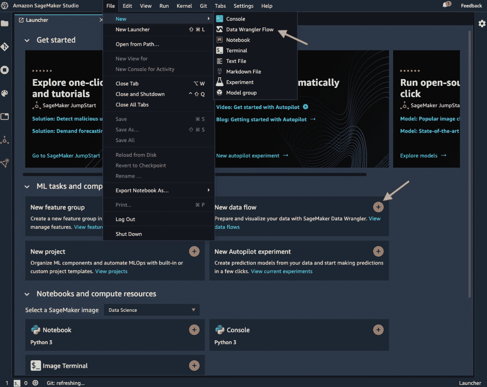

图 3.1 – 创建新的数据整理流程

+   从左侧侧边栏，**SageMaker 资源**，在下拉菜单中选择数据整理器，并点击 **新建流程** (*图 3.2*)。

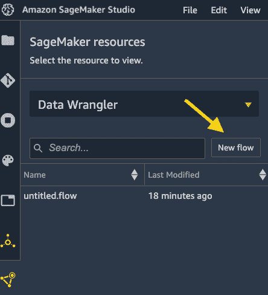

图 3.2 – 从注册表中创建新的数据整理流程文件。您也可以在这里找到您所有的流程文件

显然，从当前工作目录中创建的 `untitled.flow`。一个 *数据流文件*，扩展名为 `.flow`，是一个记录您使用 SageMaker 数据整理器从 UI 执行的所有步骤的文件。它是一个基于 JSON 的文件，可以轻松传输和重用。SageMaker Studio 和数据整理器可以解释 JSON 文件的内容，并呈现您为数据集执行的转换和分析。在此等待期间幕后发生的事情是 SageMaker Studio 正在启动一个数据整理器 *KernelGateway* 应用程序，并使用一个专门的 *ml.m5.4xlarge* 实例来支持我们在 SageMaker 数据整理器内部要执行的活动，以避免与其他笔记本内核的冲突。一旦准备就绪，您应该会看到 *图 3.3* 中展示的视图。

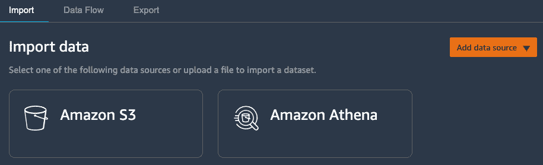

图 3.3 – 使用 SageMaker 数据整理器开始数据整理之旅

在我们继续之前，让我们通过在文件资源管理器中右键单击文件并选择 **重命名** 来将流程文件重命名为 `wrangling-customer-churn.flow` 或您喜欢的名称。

现在让我们开始使用 SageMaker 数据整理器。

# 从源导入数据

数据准备之旅的第一步是从源（s）导入数据。有四个选项可以从其中导入数据：`chapter03/1-prepare_data.ipynb` 笔记本。

## 从 S3 导入

请按照以下步骤将 CSV 文件导入到 S3 存储桶。我们希望加载 `customer_info` 和 `account_info` 表：

1.  从 *图 3.3* 中的视图选择 **Amazon S3** 作为源。您应该会看到一个 S3 存储桶列表。

1.  定位到具有命名约定 `sagemaker-<region>-<accountid>` 的 SageMaker 默认存储桶的路径。然后进入 `sagemaker-studio-book/chapter03/data/` 文件夹以找到 CSV 文件。

1.  选择 `telco_churn_customer_info.csv` 并检查数据。确保文件类型是 CSV，并使用具有 16 个 vCPU 和 64 GiB RAM 的 `ml.m5.4xlarge` 实例。采样可以帮助确保在大数据集时数据集适合内存。点击 **导入**。

1.  对 `telco_churn_account_info.csv` 重复步骤 1–3。

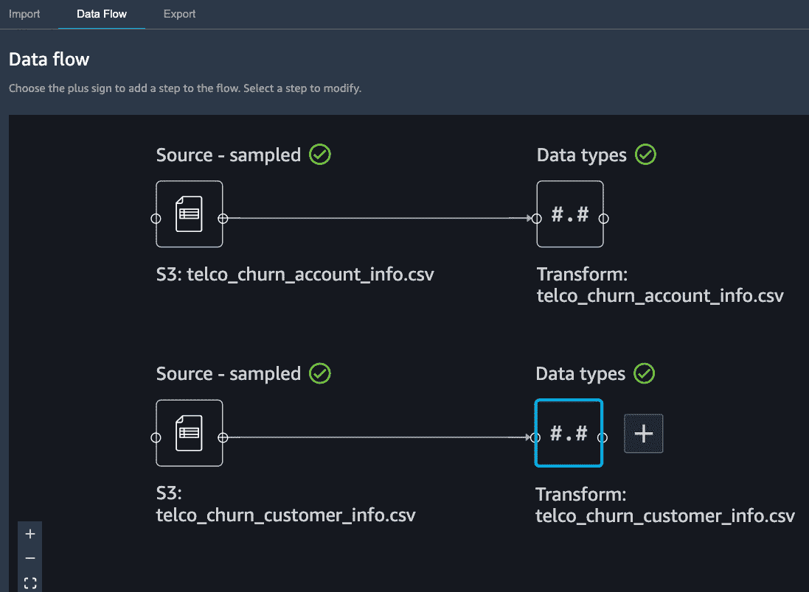

图 3.4 – 导入两个 CSV 文件后的数据流

两个 CSV 文件加载完成后，您应该在 `utility` 中的 *图 3.4* 中看到视图。

## 从 Athena 导入

由于我们的`utility`表正在注册为 Amazon Athena 表，我们可以按照以下步骤从 Athena 导入它：

1.  点击**导入**选项卡，并选择**Amazon Athena**作为源。你应该能看到*图 3.5*中显示的视图。

1.  对于两个下拉选项，选择**AwsDataCatalog**作为**数据目录**，并选择**telco_db**作为**数据库**。对于**高级配置**，你可以勾选/取消勾选**启用采样**。如**查询结果位置**所示，你可以在该位置找到查询的输出。

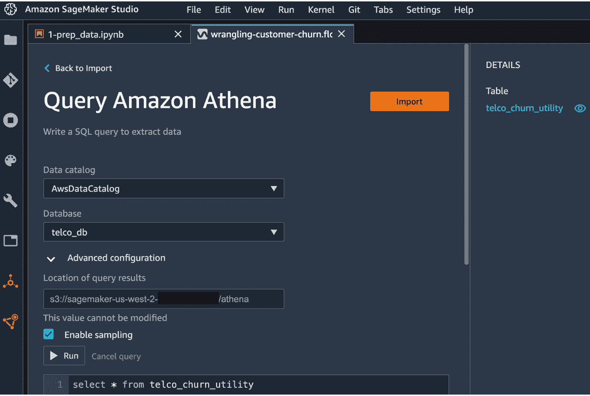

图 3.5 – 从 Amazon Athena 导入数据

1.  选择数据库后，你将在我们的 Amazon Athena 数据库中的`telco_churn_utility`表右侧看到可用的表。你可以点击眼睛图标来预览表格，以便我们知道表格的外观，如*图 3.6*所示，以及如何形成一个更复杂的查询。

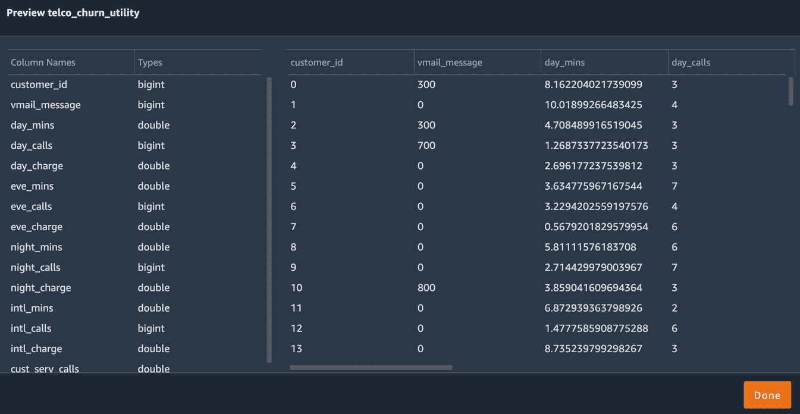

图 3.6 – 预览表格

1.  让我们通过查询获取所有数据。请将以下查询语句放入查询框中。然后点击**运行**：

    ```py
    select * from telco_churn_utility
    ```

1.  你将在查询框下方找到查询结果。我们通过前面的语句获取了所有行和列。检查数据并点击顶部上的**导入**按钮。

1.  提供一个数据集名称，例如`telco_churn_utility`。

]你应该在**数据流**选项卡中看到所有三个表被加载到数据流中。当你悬停在任何一个最右侧的节点上并点击加号时，你会看到可以对这样的表执行的操作，如*图 3.7*所示。

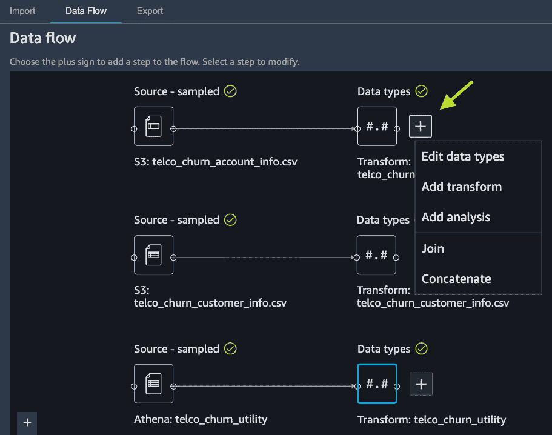

图 3.7 – 表格导入后的操作

接下来，我们应该检查数据类型，或表的模式，以确保在导入过程中正确推断。

## 编辑数据类型

数据类型决定了数据整理器如何读取每个数据列以及如何处理它。数据整理器中有**Long**、**Float**、**Boolean**、**String**和**Date**类型。**Long**用于存储整数形式的数据。**Float**允许数据中有浮点数。**Boolean**表示二进制值，如*0/1*和*是/否*。**String**使数据成为基于文本的条目。**Date**以文本形式（*dd-MM-yyyy*）存储数据，但被解释为日期而不是字符串，并允许进行日期相关操作和比较。

可以应用于数据上的转换类型取决于数据类型。例如，你只能在`Long`和`Float`类型的列上应用数值运算。因此，在继续之前正确定义数据类型非常重要，即使数据整理器在导入时也会推断数据类型。

因此，让我们检查并编辑在数据整理器中导入的表的数据类型：

1.  从如图 *3.7* 所示的视图中，点击 `telco_churn_account_info.csv` 旁边的加号，并选择 **Edit data types**。

1.  如 *图 3.8* 所示，`Long` 整数类型。要更改它，在右侧面板的 **CONFIGURE TYPES** 中，点击 **Account Length** 列的 **Type**，然后选择 **Long**。

1.  `String`。但它们应该是布尔类型以节省内存。通过在 **CONFIGURE TYPES** 中选择 `Boolean` 来将它们更改为 `Boolean`。

1.  点击 **Preview** 以查看数据类型更改后的数据外观。见图 *3.8*。

![Figure 3.8 – Editing data types in Data Wrangler]

![img/B17447_03_08.jpg]

图 3.8 – 在 Data Wrangler 中编辑数据类型

我们可以看到，**Account Length** 现在是 **Long** 类型，整数值保持不变，而 **Int'l Plan** 和 **Vmail Plan** 是 **Boolean** 类型，将是/否转换为 true/false，如表中所示。数据类型转换不会导致数据丢失或类似情况，因此我们可以继续应用编辑。

1.  点击 `String` 类型以将其更改为 `Boolean` 类型。这是因为值中的点 **.** 会使转换无效。你可以尝试更改它并预览更改。你会看到整个列被删除。我们将在稍后处理此列的转换。

我们已更改并确认了第一个表的数据类型。我们应该对其他两个表做同样的事情：

1.  点击 **Back to data flow** 返回数据流。

1.  点击 `telco_churn_customer_info.csv` 旁边的加号，并选择 **Edit data types**。

1.  将 `Long` 更改为 `String`。尽管此列包含整数值，但它们应被视为 `locality` 而不是数值特征。

1.  点击 **Preview**，然后 **Apply**。

1.  点击 **Back to data flow** 返回数据流。

1.  点击最后一个表 `telco_churn_utility` 旁边的加号，然后选择 **Edit data types**。

1.  将 `cust_serv_calls` 从 `Float` 更改为 `Long`。

1.  点击 **Preview**，然后 **Apply**。

1.  点击 **Back to data flow** 返回数据流。

我们已验证并修复了三个表的数据类型。现在是时候将它们合并为一个表了。

## 连接表

连接表是在处理多个数据源时最常见的一步，也是你在构建机器学习模型时丰富特征最重要的步骤。从关系数据库的角度思考。你的表保持某种关系，这允许你将它们全部放在一起以获得整体视图。我们将通过 `customerID` 列使用 Data Wrangler 将三个表连接起来。请按照以下步骤操作：

1.  点击 `telco_churn_account_info.csv` 旁边的加号，并选择 **Join**。你应该能看到如图 *3.9* 所示的视图。

![Figure 3.9 – Joining tables in SageMaker Data Wrangler]

![img/B17447_03_09.jpg]

图 3.9 – 在 SageMaker Data Wrangler 中连接表

1.  `telco_churn_account_info.csv` 被选为 `telco_churn_customer_info.csv` 的 **Right**。你应该能看到两个表之间的链接，如图 *3.10* 所示。

![Figure 3.10 – Joining tables]

![img/B17447_03_10.jpg]

Figure 3.10 – 连接表

1.  点击**配置**以继续。

1.  如*图 3.11*所示，选择**连接**类型，因为我们希望获取所有数据，然后选择**左侧**和**右侧**的**CustomerID**作为连接的键。

![Figure 3.11 – 使用全外连接和选择键连接表

![img/B17447_03_11.jpg]

Figure 3.11 – 使用全外连接和选择键连接表

1.  点击`CustomerID_0`和`CustomerID_1`。我们将在*应用转换*部分稍后处理这个问题。

1.  在右上角点击**添加**以完成连接。

1.  现在我们需要连接最后一个表。点击连接表旁边的加号，并选择**连接**。

1.  选择**右侧**的`telco_churn_utility`，然后点击**配置**。

1.  再次，为**右侧**的`customer_id`选择`CustomerID_0`以进行连接。

1.  点击**应用**以预览合并后的数据集。是的，表已经合并，但键被重复了，这可以在*应用转换*部分稍后解决。不用担心。

1.  在右上角点击**添加**以完成连接。您将被带回到数据流。您应该看到如图*图 3.12*所示的数据流。

![Figure 3.12 – 连接三个表后的数据流

![img/B17447_03_12.jpg]

Figure 3.12 – 连接三个表后的数据流

注意

如果您发现有任何错误，请不要担心，只需点击有错误的节点旁边的加号，并选择**删除**以删除该节点。但请记住，如果您删除的不是最后一个节点，所有下游节点也将被删除。

我们已经准备好进入下一阶段：探索数据集！

# 使用可视化探索数据

**探索性数据分析**（**EDA**）为我们手头的数据提供洞察力，并帮助我们制定数据转换策略，以便机器学习建模可以表现得最好。使用编程分析并可视化数据是强大且可扩展的，但它需要大量的编码和开发。使用 SageMaker Data Wrangler，您可以在 UI 中轻松创建图表和图形。目前，SageMaker Data Wrangler 支持以下类型的图表和分析，无需编码：**直方图**、**散点图**、**偏差报告**、**多重共线性**、**快速模型**、**目标泄露**和**表格摘要**。让我们逐一看看它们是如何工作的。

## 使用直方图理解频率分布

直方图帮助我们理解一个变量的频率分布，该变量的值被分桶到离散的区间，并用条形图表示。我们可以使用 SageMaker Data Wrangler 中的直方图功能来查看，例如，白天通话者通话多长时间。为此，请按照以下步骤操作：

1.  点击**2nd Join**节点旁边的加号，并选择**添加分析**。您应该看到如图*图 3.13*所示的视图。

![Figure 3.13 – 在 SageMaker Data Wrangler 中添加分析

![img/B17447_03_13.jpg]

Figure 3.13 – 在 SageMaker Data Wrangler 中添加分析

1.  在`day_mins_histogram`中填写分析的名称。

1.  选择**X 轴**为**day_mins**。

1.  点击**预览**以查看图表，如图*图 3.14*所示。

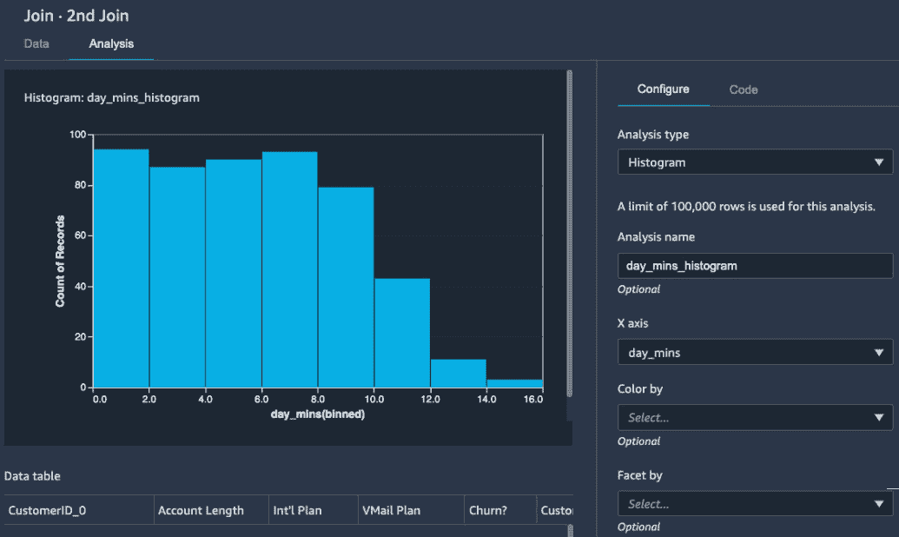

图 3.14 – 白天通话时间的分钟数直方图

这太棒了！你在 SageMaker Data Wrangler 中创建了第一个可视化，以查看所有客户白天通话时间的频率分布。我们看到大多数客户的通话时间短于 8 分钟，很少有通话时间超过 12 分钟。但这只是一个总体视图。作为一名数据科学家，你可能想知道离开服务的客户与继续使用服务的客户的行为有何不同。我们应该根据目标状态：**Churn?**来切片和切块数据。我们可以通过**按**选项来完成。我们将继续修改图表，而不是保存当前的图表。

1.  选择**按**和点击**预览**。你应该看到更新后的图表，如图*图 3.15*所示。

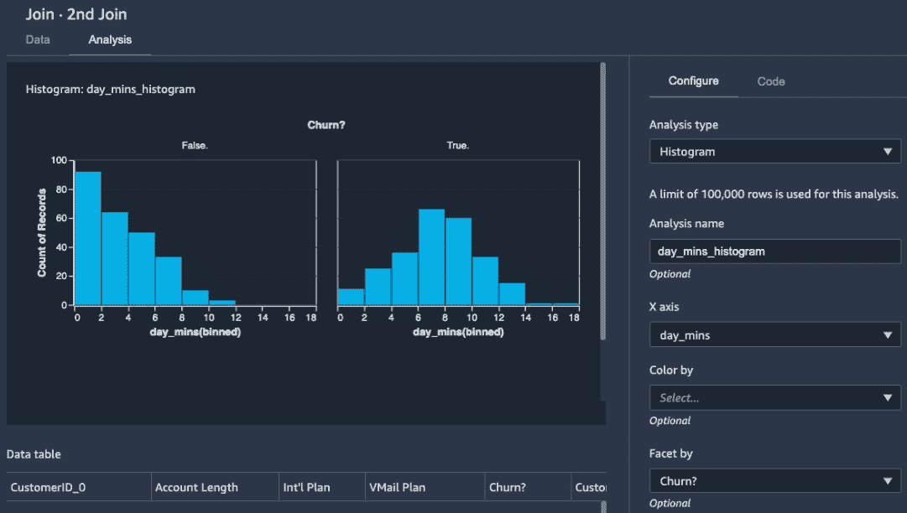

图 3.15 – 按目标变量 day_mins 的直方图

我们可以得出结论，离开服务的客户（**True**图表）最频繁的通话时间约为 6-10 分钟，而继续使用服务的客户（**False**图表）通话时间较短。多么有趣的观察。让我们保存这个分析。

1.  点击**保存**以保存并返回保存所有分析的页面。

在**所有分析**视图中，你可以看到在任何给定状态下为每个节点创建的图表和分析。我们已经创建了一个直方图。让我们继续创建另一个图表。

## 散点图

数据科学家可能会想知道白天通话较多的客户是否在晚上也经常通话。或者你可能好奇客户的账户长度和通话时间之间是否存在任何相关性。你可以使用**散点图**来可视化这个特征。让我们为数据创建一个散点图：

1.  在**分析**页面，点击右上角的**创建新分析**。

1.  选择`AccountLength_CallTime_Scatter`。

1.  选择**X 轴**为**账户长度**和**Y 轴**为**day_mins**。

1.  点击**预览**。你应该看到一个图表，如图*图 3.16*所示。

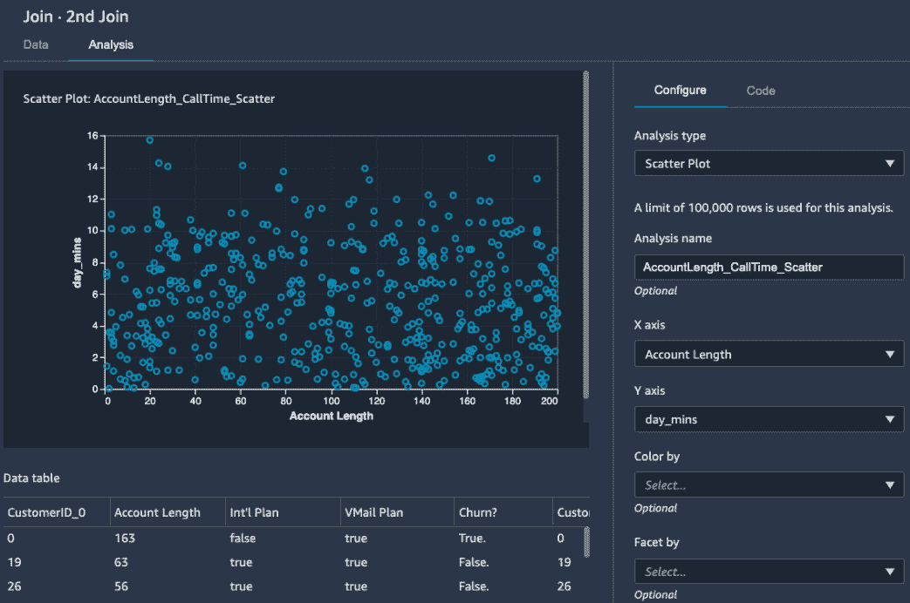

图 3.16 – 账户长度与 day_mins 的散点图

从视觉上看，这两个变量之间似乎没有相关性。

直方图和散点图是 EDA 中最常用的两种工具，你可能很熟悉。使用 SageMaker Data Wrangler，你可以使用面向 ML 的分析，如 Quick Model，帮助你确定数据转换策略。

## 使用 Quick Model 预览 ML 模型性能

快速模型是另一个帮助你快速了解数据是否提供了任何预测能力的工具。这个工具很有用，可以经常使用。让我们看看它是如何工作的：

1.  在**分析**页面上，点击右上角的**创建新分析**。

1.  选择**快速模型**作为**分析类型**。

1.  在`first_quickmodel`中添加一个名称。

1.  选择**流失？**作为**标签**并点击**预览**。

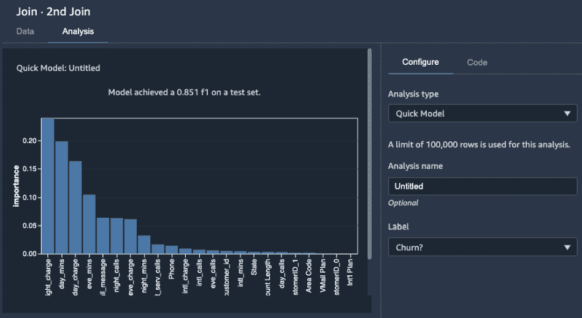

图 3.17 – 快速模型结果，显示了测试集上模型性能的 F1 分数和特征重要性

SageMaker Data Wrangler 需要一分钟左右的时间，并返回一个条形图，如图*图 3.17*所示，显示了特征重要性和从给定数据集中随机分割的测试集上的 F1 分数。正如您在以下数据表中看到的那样，我们没有应用任何转换或数据清理。SageMaker Data Wrangler 使用一个流行的算法**随机森林分类**来训练模型并在一个保留的测试集上测试它。我们可以看到一个初步的 0.851 F1 分数，其中**night_charge**是预测客户流失状态的最重要特征。我们还可以看到有一些特征没有提供太多的预测能力，例如**国际套餐**和**VMail 套餐**。还有一些冗余的特征，如**CustomerID_***，这些特征不应该包含在建模中。这给我们提供了提示，确保在真正的建模中包括**night_charge**和其他高重要性特征，如果我们受限于可以使用的特征数量，我们可以排除**国际套餐**和**VMail 套餐**。让我们在纸上记录分析结果。

1.  点击**保存**以保存分析。

正如我们刚刚进行了第一次快速建模，为了了解我们得到的模型性能，测试我们是否遇到了任何数据泄漏或目标泄漏问题也是一个好主意。

## 揭示目标泄漏

目标泄漏意味着数据中存在与目标变量高度相关或基本上是目标变量的代理表示的特征。例如，如果我们的数据集包含一个记录每个流失客户终止日期的列，那么这个列将包含流失的客户，如果我们将其包含在建模中，将导致建模精度极高。在这个例子中的问题是，在现实世界的预测时间，当模型的任务是预测未来的流失时，几乎不可能有终止日期。让我们看看我们的数据集中是否包含任何目标泄漏：

1.  在**分析**页面上，点击右上角的**创建新分析**。

1.  选择**目标泄漏**作为**分析类型**。

1.  在`churn_target_leakage`中添加一个名称。

1.  为**最大特征数**输入`25`，因为我们有 24 列在表中。

1.  选择**分类**作为**问题类型**。

1.  选择 **Churn?** 作为 **Target** 并点击 **Preview**。

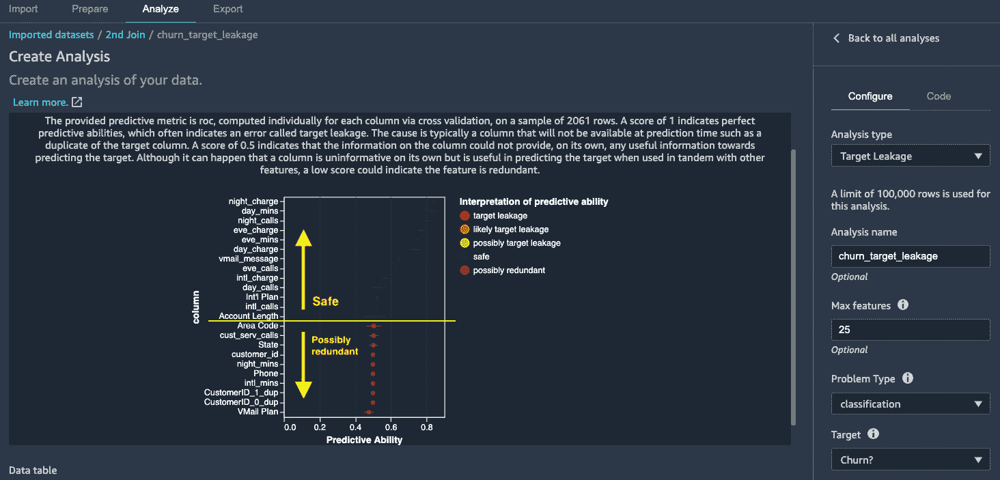

图 3.18 – 显示安全特征和可能冗余特征的**目标泄漏结果**（图表右侧带有图例着色）

目标泄漏分析计算每个特征相对于目标的交叉验证 ROC 曲线下面积，如 *图 3.18* 上方的文本所述。此分析表明没有特征被确定为潜在的目标泄漏，这是一个好兆头。结果还证实了我们从快速建模练习中学到的结论：

a) `night_charge` 在预测流失方面很重要，并提供高水平的预测能力。

b) `VMail Plan` 提供的预测能力很小。

c) `CustomerID_*` 在数据集中是多余的。

让我们保存分析。

1.  点击 **Save** 保存分析。

我们通过最后两个分析了解了特征预测能力。我们还应该看看如何使用 SageMaker Data Wrangler 创建自定义可视化。

## 创建自定义可视化

SageMaker Data Wrangler 使用 **Altair** ([`altair-viz.github.io/`](https://altair-viz.github.io/)) 以编程方式创建可视化。我们还可以在 SageMaker Data Wrangler 中使用代码创建任何自定义可视化，以获得更大的灵活性。例如，我们可以通过 `Churn?` 状态创建 `night_charge` 的箱线图，以了解两组的统计分布：

1.  在 **All Analyses** 页面上，点击右上角的 **Create new analysis**。

1.  点击紧挨着 **Configure** 的 **Code** 选项卡。

1.  添加一个名称，例如 `boxplot_night_charge_by_churn`。

1.  在编码区域输入以下代码。请确保导入 `altair` 库：

    ```py
    # Table is available as variable 'df' of pandas dataframe
    # Output Altair chart is available as variable 'chart'
    import altair as alt
    chart=alt.Chart(df).mark_boxplot().encode(
        x='Churn?',
        y='night_charge')
    ```

1.  点击 **Preview**。

你应该看到一个表示 `Churn?` 状态分布的箱线图，如图 *图 3.19* 所示。如果你悬停在箱线图上，你可以看到数据的描述性统计。

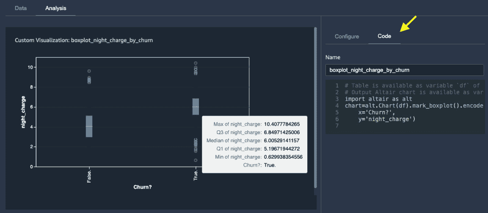

图 3.19 – 使用 Altair 库创建自定义箱线图

1.  点击 **Save** 保存自定义可视化。

值得注意的是，这些分析和可视化作为流程文件的一部分保存，这样你可以全面了解你如何处理数据。

通过这些分析，我们现在对如何转换和处理数据有了很好的理解。

# 应用转换

你可以轻松地使用 SageMaker Data Wrangler 应用数据转换，因为有许多内置的转换可以直接使用，无需任何编码。到目前为止，我们已经从需要处理以构建 ML 数据集的分析中观察到以下内容：

+   一些特征存在缺失数据。

+   `Churn?` 列现在以字符串格式存储，值为 `True.` 和 `False.`。

+   连接后冗余的`CustomerID_*`列。

+   不提供预测能力的特征，包括但不限于`Phone`、`VMail Plan`和`Int'l Plan`。

我们还希望为了机器学习目的执行以下转换，因为我们想训练一个 XGBoost 模型来预测随后的`Churn?`状态。

+   对分类变量进行编码，即`State`和`Area Code`特征。

让我们开始吧：

1.  在**数据流**选项卡中，点击**2nd Join**节点旁边的加号，选择**添加转换**。您应该看到如图*图 3.20*所示的视图，左侧有一个表格，右侧有一系列转换列表。

![图 3.20 – 一个转换数据的工作空间。您可以在右侧展开每个转换以查看选项

![图片 B17447_03_20.jpg]

![图 3.20 – 一个转换数据的工作空间。您可以在右侧展开每个转换以查看选项

1.  要删除**CustomerID_***，点击**管理列**以展开转换，在**转换**中选择**删除列**，并选择**CustomerID_0**作为**要删除的列**。

1.  如*图 3.21*所示，现在`CustomerID_0`已消失。

![图 3.21 – 在 SageMaker Data Wrangler 中删除列

![图片 B17447_03_21.jpg]

![图 3.21 – 在 SageMaker Data Wrangler 中删除列]

1.  点击**添加**以使转换生效。

1.  重复步骤 2-4 以删除`CustomerID_1`和`customer_id`。

如果操作正确，您应该在右侧的**上一步**选项卡上看到四个步骤，如图*图 3.22*所示。

![图 3.22 – 在“上一步”选项卡中查看之前的步骤

![图片 B17447_03_22.jpg]

![图 3.22 – 在“上一步”选项卡中查看之前的步骤

注意

如果您意识到您做了任何错误的事情并想恢复到之前的转换，您可以像*图 3.22*所示的那样，一次删除最后一步，直到恢复。

1.  继续处理`cust_serv_calls`中的缺失数据，展开**输入列**中的`Account Length`，以及**近似中位数**作为**插补策略**。我们可以留空**输出列**以指示 SageMaker Data Wrangler 覆盖现有列。

1.  点击`102`，如图*图 3.23*所示。

![图 3.23 – 账户长度填充了中位数，102

![图片 B17447_03_23.jpg]

![图 3.23 – 账户长度填充了中位数，102

1.  点击**添加**以使转换生效。

1.  对`cust_serv_calls`重复步骤 6-8。

有一些特征根据快速模型和目标泄漏分析没有提供太多预测能力，值得删除。`Phone` 是那些显示包含很少或没有有用信息的特征之一。另外，众所周知，当你注册一项服务时，电话号码大多是随机分配的。另一方面，尽管 `VMail Plan` 和 `Int'l Plan` 提供了没有预测信息，但它们是简单的 `布尔` 类型，确实有实际意义。将这些特征带入建模可能不会造成太大伤害。所以，让我们删除 `Phone` 特征。

1.  重复步骤 2–4 删除 `Phone`。

继续转换分类特征，我们有 `State` 和 `Area Code`，它们代表客户的地理位置。我们可以应用独热编码来转换它们。然而，我们可能会冒险删除 `Area Code`，下一个最好的行动是删除它。让我们对 `State` 进行独热编码并删除 `Area Code`。

1.  展开 **编码分类**，选择 **独热编码** 作为 **转换**，选择 **状态** 作为 **输入列**，选择 **列** 作为 **输出样式**，并保留其他选项为默认值。

1.  点击 `状态` 列被替换为 `State_*` 稀疏特征，每个特征代表客户是否处于特定状态（0 为假，1 为真）。

1.  点击 **添加** 使转换生效。

1.  重复步骤 2–4 删除 `Area Code`。

最后但同样重要的是，目标特征 `Churn?` 需要进行一些处理。它有一个奇怪的句号，这之前破坏了数据类型转换。此外，我们将要使用的 SageMaker 内置 XGBoost 算法要求目标特征位于第一列。让我们应用一个文本操作并移动该列。

1.  展开 `Churn?` 为 `.`（一个句号）作为 **符号**。

1.  点击 `Churn?` 已被移除，如 *图 3.24* 所示。点击 **添加** 使转换生效。

![图 3.24 – Churn? 列中移除了结束句号

![图片 B17447_03_24.jpg]

图 3.24 – Churn? 列中移除了结束句号

1.  我们现在可以使用数据类型解析器将 True/False 转换为布尔表示。展开 **解析列类型**，选择 **Churn?** 作为 **列**，并在 **到** 下拉菜单中选择 **布尔**。

1.  点击 `布尔` 类型。点击 **添加** 使转换生效。

1.  要将 **Churn?** 移到前面，展开 **管理列**，选择 **移动列** 作为 **转换**，选择 **移动到开始** 作为 **移动类型**，并选择 **Churn?** 作为 **要移动的列**。

1.  点击 **预览** 以查看转换。现在 **Churn?** 列成为第一个特征。点击 **添加** 使转换生效。

我们刚刚对数据集应用了十一个转换。我们可以运行一个快速建模分析，以确保我们在建模方面处于正确的轨道。

## 在处理数据时探索性能

在使用 SageMaker Data Wrangler 整理数据时，您可以在任何时间点添加分析。这允许您在关键转换后分析数据，并使用 Quick Model 验证预测能力。让我们为整理后的数据添加一个分析：

1.  点击**分析**选项卡。

1.  选择**快速模型**作为**分析类型**，在**分析名称**中添加一个名称，并选择**流失？**作为**标签**。

1.  点击**预览**以查看建模结果，如图*图 3.25*所示。模型的 F1 分数已从*0.851*提升到*0.871*。我们正走在正确的道路上。

![图 3.25 – 所有转换后的快速建模

![img/B17447_03_25.jpg]

图 3.25 – 所有转换后的快速建模

1.  点击**添加**将分析放置在画布上。

到目前为止，我们已经使用 SageMaker Data Wrangler 深入分析了电信客户流失数据集，并根据分析结果整理了数据。Quick Model 在预测客户流失方面显示出改进的 F1 分数。我们应该继续看看这项工作中我们有哪些选择。

# 导出数据用于机器学习训练

SageMaker Data Wrangler 支持以下导出选项：**保存到 S3**、**管道**、**Python 代码**和**特征存储**。我们迄今为止应用的数据转换尚未真正应用于数据。需要执行转换步骤以获取最终转换后的数据。当我们使用前面的选项导出我们的流程文件时，SageMaker Data Wrangler 会自动生成代码和笔记本，以指导您完成执行过程，这样我们就不必编写任何代码，但它为我们留下了自定义代码的灵活性。

四种导出选项满足了许多用例。**保存到 S3**是一个明显的选项，并且提供了很多灵活性。如果您希望将转换后的数据保存在 S3 桶中以便在 Amazon SageMaker 中训练机器学习模型，您也可以从 S3 本地下载它，并在需要时将其导入到其他工具中。**管道**选项创建了一个可以轻松重复调用的 SageMaker 管道。此类工作流程可以配置为事件触发或时间触发，以便您可以自动化数据转换作为管道。我们将在*第十章*中了解更多关于 SageMaker 管道的内容，*使用 SageMaker Model Monitor 监控生产中的机器学习模型*。**Python 代码**提供了最大的可见性和灵活性。您可以看到 Amazon SageMaker 如何实现每个转换，在 Spark 环境中运行代码，并获取处理后的数据。使用**特征存储**选项，您将获得一个自动生成的 Jupyter 笔记本，该笔记本将处理数据并在 SageMaker Feature Store 中创建一个特征组。我们将在*第五章*中了解更多关于 SageMaker Feature Store 的内容，*使用 SageMaker Studio IDE 构建和训练机器学习模型*。

对于这个示例，我想向您展示 **保存到 S3** 的选项，它包括在自动生成的笔记本中的机器学习训练：

1.  首先，保存流文件，以便导出的资源可以获取最新的更改。在菜单栏中，选择 **文件**->**保存数据 Wrangler 流**。

1.  点击 **导出** 选项卡，点击 **步骤** 节点，并在转换列表中选择最后一个步骤，**移动列**。通过点击一个步骤，将选择到所选步骤的所有步骤。

1.  在右上角点击 **导出步骤**，然后点击 **保存到 S3**。

应该会弹出一个新的 Python Jupyter 笔记本。这个笔记本包含使用 SageMaker Processing 处理 SageMaker Data Wrangler 流文件并保存处理后的数据到 S3 的代码。这是我们第一次遇到 SageMaker Processing 的实际应用。简而言之，它允许我们使用适当的计算资源来执行数据处理、模型评估和统计分析。使用 SageMaker Processing，您不再受 Studio 笔记本环境中本地可用的计算资源限制；相反，处理脚本和 Data Wrangler 流文件可以在适当大小的计算实例（s）上运行。您可以在以下步骤中看到实际操作。

1.  在 **（可选）下一步** 部分之前，请执行所有单元格。

    注意

    您可以在看到 💡 **可配置设置** 的部分配置笔记本。

SageMaker 处理作业可能需要几分钟。在处理作业结束时，处理后的数据将可用在 S3 桶中。您应该从单元格中看到以下输出：

```py
Job results are saved to S3 path: s3://sagemaker-us-west-2-<account-id>/export-flow-04-01-52-59-xxxxxx/output/data-wrangler-flow-processing-04-01-52-59-xxxxxx
```

以下可选部分是有趣的建模部分。让我们运行这些步骤来训练一个使用 SageMaker 内置的 XGBoost 算法预测客户流失的机器学习模型。

1.  将 `run_optional_steps` 的值重新分配为 `True`：

    ```py
    run_optional_steps = True
    ```

1.  XGBoost 的默认目标指标 `reg:squarederror` 用于回归用例。由于我们有一个二分类用例，请将其更改为 `binary:logistic`：

    ```py
    hyperparameters = {
        "max_depth":"5",
        "objective": "binary:logistic",
        "num_round": "10",
    }
    ```

1.  执行笔记本中所有剩余的单元格以启动训练作业。

训练作业可能需要一分钟左右的时间来完成。您可以在最后一个单元格中看到幕后操作的动作输出。我们将在 *第五章**，使用 SageMaker Studio IDE 构建和训练机器学习模型* 中了解更多关于 SageMaker 训练和训练算法的内容。一旦完成，模型也会保存在 S3 中，可用于在 Amazon SageMaker 中托管，或者模型也可以在本地使用。我们将在 *第七章*，*云中托管机器学习模型：最佳实践* 中了解更多关于托管选项的内容。

# 摘要

在本章中，我们展示了如何使用 SageMaker Data Wrangler 通过电信客户流失数据集进行操作。我们学习了如何从各种来源导入数据，合并表格，使用基于高级机器学习的分析进行数据分析，以及使用 SageMaker Data Wrangler 创建可视化。然后，我们无需编写任何代码，就可以轻松地使用 SageMaker Data Wrangler 内置的转换功能进行转换。在章节的最后，我们展示了如何将转换后的数据导出到 S3 桶，以及如何使用自动生成的笔记本轻松训练机器学习模型。

在下一章中，我们将学习机器学习项目中特征存储的概念，以及如何使用 **SageMaker Feature Store** 来设置特征存储。SageMaker Feature Store 统一了团队之间的特征，以便团队可以移除冗余的特征工程管道。由于其独特的设计模式，它还充当模型训练和模型服务用例的中央存储库，因为它具有离线存储以方便查询选择训练数据集，以及在线存储以支持模型服务环境中所需的低延迟事务。
