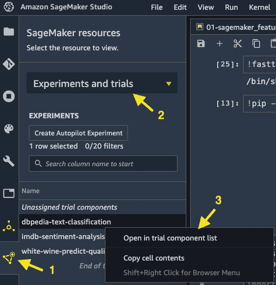
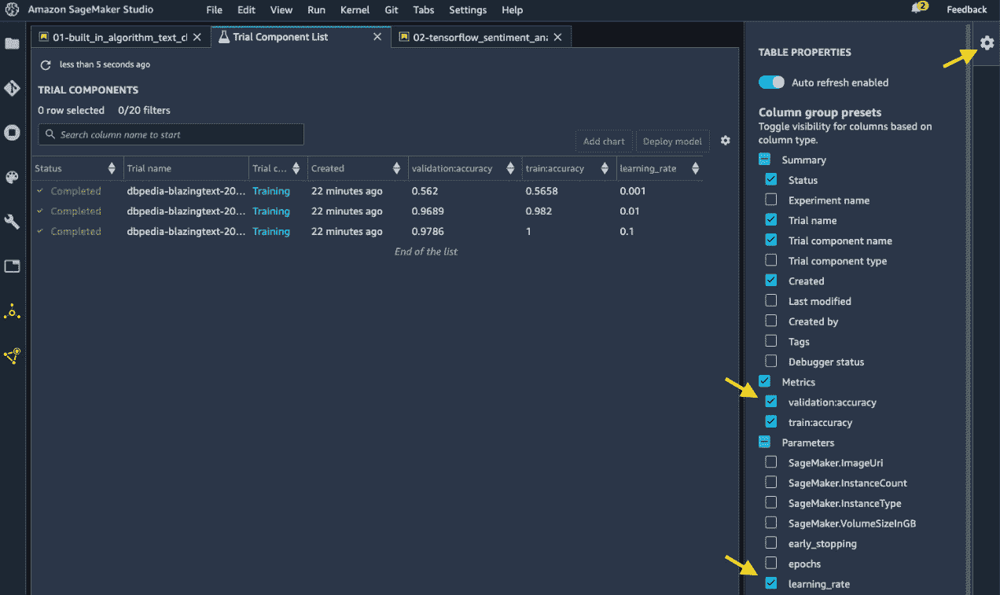
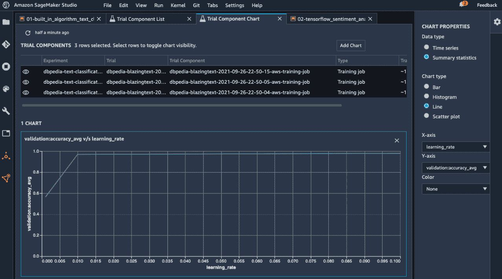

# *第五章*: 使用 SageMaker Studio IDE 构建和训练 ML 模型

使用 SageMaker Studio 构建和训练一个 **机器学习**（**ML**）模型可以变得简单。它是一个 **集成开发环境**（**IDE**），专为 ML 开发者设计，用于大规模和高效地构建和训练 ML 模型。为了训练一个 ML 模型，你可能之前已经处理过自己或团队管理计算基础设施的繁琐开销，以正确地训练 ML 模型。你也可能经历过计算资源限制，无论是在桌面机器上还是在云资源中，你被分配了一个固定大小的实例。当你使用 SageMaker Studio 进行开发时，不再有配置和管理计算基础设施的挫折，因为你可以轻松地利用 SageMaker Studio 中的弹性计算以及其对复杂 ML 算法和框架的广泛支持，以满足你的 ML 用例。

在本章中，我们将涵盖以下主题：

+   使用 SageMaker 内置算法训练模型

+   使用流行框架编写的代码进行训练

+   使用 SageMaker Notebook 进行开发和协作

# 技术要求

对于本章，你需要访问提供的代码，代码位于 [`github.com/PacktPublishing/Getting-Started-with-Amazon-SageMaker-Studio/tree/main/chapter05`](https://github.com/PacktPublishing/Getting-Started-with-Amazon-SageMaker-Studio/tree/main/chapter05)。

# 使用 SageMaker 内置算法训练模型

当你想要在 SageMaker Studio 的笔记本中构建一个针对你的 ML 用例和数据的 ML 模型时，最简单的方法之一是使用 SageMaker 的内置算法。使用内置算法有两个优点：

+   内置算法不需要你编写任何复杂的 ML 代码。你只需要提供你的数据，确保数据格式符合算法的要求，并指定超参数和计算资源。

+   内置算法针对 AWS 计算基础设施进行了优化，并且开箱即用即可扩展。轻松地在多个计算实例上执行分布式训练，并/或启用 GPU 支持，以加快训练时间。

SageMaker 内置算法套件提供了适用于最常见机器学习用例的算法。以下类别中都有算法：**监督学习**、**无监督学习**、**图像分析**和**文本分析**。最值得注意的是，对于监督学习和无监督学习，分别有**XGBoost**和**k-means**用于表格数据，以及用于图像分析的**图像分类**、**目标检测**和**语义分割**。对于文本分析，我们有**word2vec**、**文本分类**和**序列到序列**算法。这些只是我们提到的每个类别的示例算法。还有更多有用的算法可供选择，但我不一一列举。您可以访问[`docs.aws.amazon.com/sagemaker/latest/dg/algos.html`](https://docs.aws.amazon.com/sagemaker/latest/dg/algos.html)查看完整列表和更多详细信息。

注意

算法的 GPU 支持和分布式训练能力各不相同。请访问[`docs.aws.amazon.com/sagemaker/latest/dg/common-info-all-im-models.html`](https://docs.aws.amazon.com/sagemaker/latest/dg/common-info-all-im-models.html)以了解每个算法的 GPU 和分布式训练支持。

让我们通过一个用例和一个算法来展示如何使用 SageMaker 的内置算法。

## 简易训练 NLP 模型

使用 SageMaker 的内置算法训练 ML 模型不需要编写任何 ML 代码。我们将通过一个 NLP 用例来查看如何使用来自*DBpedia*（[`www.dbpedia.org/`](https://www.dbpedia.org/)）的 DBpedia 本体数据集将句子分类到类别中，该数据集包含 560,000 个训练样本和 70,000 个测试样本的维基百科文章的标题和摘要。请使用**Python 3 (Data Science**)内核和**ml.t3.medium**实例打开存储库中的`chapter05/01-built_in_algorithm_text_classification.ipynb`笔记本。

在笔记本中，我们首先下载数据集并检查它，以了解我们需要如何处理数据，如下面的代码片段所示：

```py
!wget -q https://github.com/le-scientifique/torchDatasets/raw/master/dbpedia_csv.tar.gz
!tar -xzf dbpedia_csv.tar.gz
!head dbpedia_csv/train.csv -n 3
!cat dbpedia_csv/classes.txt
```

我们看到数据，`dbpedia_csv/train.csv`，格式为`<类别索引>,<标题>,<摘要>`。还有一个名为`dbpedia_csv/classes.txt`的文件，记录了类别，其顺序与`dbpedia_csv/train.csv`中看到的类别索引相对应。

这是一个文本分类问题：给定一篇文章的摘要，我们想要构建一个模型来预测和分类这个摘要所属的类别。当处理大量文本文档时，这是一个常见的用例，例如来自维基百科网站的数据集，其中包含来自维基百科文章的标题和摘要。几乎不可能使用人工审查来组织所有文档。

对于此类用例，一个合适的内置算法是**BlazingText**。BlazingText 对 Word2vec（无监督）和文本分类（监督）都有高度优化的实现。Word2vec 算法可以将文本转换为向量表示，或**词嵌入**，适用于任何下游 NLP 应用，如情感分析或命名实体识别。文本分类可以将文档分类到类别中。这对于我们的用例和数据集来说非常合适。

在使用 SageMaker 的内置算法时，准备训练数据是关键。使用 BlazingText 进行文本分类需要将每个数据点格式化为`__label__<class> text…`。以下是一个示例：

```py
__label__latin Lorem ipsum dolor sit amet , consectetur adipiscing elit , sed do eiusmod tempor incididunt ut labore et dolore magna aliqua . 
```

我们使用一个`preprocess`函数，该函数调用`transform_text`函数来标记化摘要的每一行。在`transform_text`函数中，我们使用`nltk`库中的`sentence tokenizer`，即`punkt`。我们预处理训练和测试文件。为了保持处理时间可控，我们只使用 20%的训练数据，如下面的代码片段所示：

```py
preprocess("dbpedia_csv/train.csv", "dbpedia.train", keep=0.2)
preprocess("dbpedia_csv/test.csv", "dbpedia.validation")
!head -n 1 dbpedia.train 
__label__Company automatic electric automatic electric company ( ae ) was the largest of the manufacturing units of the automatic electric group . it was a telephone equipment supplier for independent telephone companies in north america and also had a world-wide presence . with its line of automatic telephone exchanges it was also a long-term supplier of switching equipment to the bell system starting in 1919.
```

我们可以看到，现在我们已经有了预期的数据格式。请随意使用`preprocess`中的`keep`参数将训练集扩展到更高的百分比。预处理后，我们就可以调用内置算法了。

SageMaker 的内置算法是完全管理的容器，可以通过简单的 SDK 调用访问。以下代码允许我们使用 BlazingText 算法进行文本分类：

```py
image=sagemaker.image_uris.retrieve(framework='blazingtext', 
                                    region=region, 
                                    version='1')
print(image)
433757028032.dkr.ecr.us-west-2.amazonaws.com/blazingtext:1
```

执行后，我们得到一个名为`image`的变量中的字符串。你可能想知道，这个看起来像 URL 路径的字符串是什么？这如何是一个模型训练算法？

**容器技术**是 SageMaker 托管训练的核心。容器技术允许 SageMaker 具有与任何框架和任何运行时要求的工作灵活性。SageMaker 不是使用笔记本中的运行时设置和使用笔记本背后的计算资源进行模型训练，而是将您提供的数据和一个包含运行时设置和代码库的容器镜像带到 SageMaker 托管的计算基础设施中进行模型训练。

在`image`路径中指向一个存储在**Amazon Elastic Container Registry**（**ECR**）中的容器镜像，其中包含 BlazingText ML 算法。我们可以使用它通过 SageMaker 估计器启动一个模型训练作业。

SageMaker 估计器是托管模型训练的关键构建块，它使我们能够通过简单的 API 命令模型训练作业的各个方面。以下是如何使用 SageMaker 的 BlazingText 算法设置训练作业的代码片段：

```py
estimator = sagemaker.estimator.estimator(
            image,
            role,
            instance_count=1,
            instance_type='ml.c5.2xlarge',
            volume_size=30,
            max_run=360000,
            input_mode='File',
            enable_sagemaker_metrics=True,
            output_path=s3_output_location,
            hyperparameters={
                'mode': 'supervised',
                'epochs': 20,
                'min_count': 2,
                'learning_rate': 0.05,
                'vector_dim': 10,
                'early_stopping': True,
                'patience': 4,
                'min_epochs': 5,
                'word_ngrams': 2,
            },
)
```

最值得注意的是，输入到估计器的参数如下：

+   作为容器的算法，`image`

+   训练作业的`hyperparameters`

+   作业所需的计算资源，`instance_type`、`instance_count`和`volume_size`

+   IAM 执行角色，`role`

如您所见，我们不仅指定了算法选项，还指导 SageMaker 我们需要哪些云计算资源来完成这次模型训练。我们请求一个 `ml.c5.2xlarge` 实例，这是一个具有高性能处理器的计算优化实例，为此次训练作业提供 30 GB 的存储空间。它允许我们在原型设计期间使用轻量级、廉价的实例类型（`ml.t3.medium`）进行笔记本环境，并在更强大的实例类型上完成全规模训练以更快地完成任务。

我们已经设置了算法和计算资源；接下来，我们需要将估计器与训练数据关联起来。在准备完数据后，我们需要将数据上传到 S3 桶中，以便 SageMaker 训练作业可以访问 `ml.c5.4xlarge` 实例。我们通过简单地调用 `estimator.fit()` 并传入数据来启动训练：

```py
train_channel = prefix + '/train'
validation_channel = prefix + '/validation'
sess.upload_data(path='dbpedia_csv/dbpedia.train', bucket=bucket, key_prefix=train_channel)
sess.upload_data(path='dbpedia_csv/dbpedia.validation', bucket=bucket, key_prefix=validation_channel)
s3_train_data = f's3://{bucket}/{train_channel}'
s3_validation_data = f's3://{bucket}/{validation_channel}'
print(s3_train_data)
print(s3_validation_data)
data_channels = {'train': s3_train_data, 
                 'validation': s3_validation_data}
exp_datetime = strftime('%Y-%m-%d-%H-%M-%S', gmtime())
jobname = f'dbpedia-blazingtext-{exp_datetime}'
estimator.fit(inputs=data_channels,
              job_name=jobname,
              logs=True)
```

您可以在笔记本中查看作业日志并观察以下内容：

+   SageMaker 为此训练作业启动一个 `ml.c5.2xlarge` 实例。

+   SageMaker 从 S3 下载数据，并从 ECR 下载 BlazingText 容器镜像。

+   SageMaker 运行模型训练，并将训练和验证准确率记录在下面的单元格输出中：

    ```py
    #train_accuracy: 0.9961
    Number of train examples: 112000
    #validation_accuracy: 0.9766
    Number of validation examples: 70000
    ```

训练作业的单元格输出也存在于 `estimator(…, enable_sagemaker_metrics=True)` 中，并自动发送到 **Amazon CloudWatch Metrics**。即使笔记本意外删除，这也为我们提供了对训练作业的治理。

一旦训练作业完成，您可以在 `estimator.model_data` 中访问训练好的模型，该模型可以用于后续的托管和推理，无论是在云中，这是我们在下一章将深入探讨的主题，还是在安装了 `fastText` 程序的计算机上。您可以使用以下代码块访问模型：

```py
!aws s3 cp {estimator.model_data} ./dbpedia_csv/
%%sh
cd dbpedia_csv/
tar -zxf model.tar.gz
# Use the model archive with fastText
# eg. fasttext predict ./model.bin test.txt
```

注意

BlazingText 是 FastText 的 GPU 加速版本。FastText ([`fasttext.cc/`](https://fasttext.cc/)) 是一个开源库，可以执行词嵌入生成（无监督）和文本分类（监督）。BlazingText 和 FastText 创建的模型是兼容的。

我们刚刚创建了一个复杂的文本分类模型，该模型能够在验证数据上以 0.9766 的准确率对 DBpedia 中的文档类别进行分类，且使用的 ML 代码量最少。

让我们再设置一个机器学习实验管理框架，**SageMaker Experiments**，以跟踪我们在本章中启动的作业。

## 使用 SageMaker Experiments 管理训练作业

作为数据科学家，我们可能都遇到过一种棘手的情况，即模型训练运行的次数可以非常快地增长到难以追踪最佳模型的各种实验设置的程度，例如数据集版本、超参数和算法。在 SageMaker Studio 中，您可以使用**SageMaker Experiments**轻松跟踪训练运行中的实验，并在实验和试验组件 UI 中可视化它们。SageMaker Experiments 是一个开源项目([`github.com/aws/sagemaker-experiments`](https://github.com/aws/sagemaker-experiments))，可以通过 Python SDK 编程访问。

在 SageMaker Experiments 中，**实验**是一系列**试验**运行集合，这些运行是 ML 工作流的执行，可能包含**试验组件**，如数据处理和模型训练。

让我们继续使用`chapter05/01-built_in_algorithm_text_classification.ipynb`笔记本，看看我们如何使用 SageMaker Experiments 设置实验和试验，以跟踪具有不同学习率的训练作业，以便我们可以在 SageMaker Studio 中轻松比较试验的性能，以下是一个片段：

1.  首先，我们在笔记本内核中安装`sagemaker-experiments` SDK：

    ```py
    !pip install -q sagemaker-experiments
    ```

1.  然后，我们创建一个名为`dbpedia-text-classification`的实验，我们可以使用`smexperiments`库来存储与此模型训练用例相关的所有作业：

    ```py
    from smexperiments.experiment import Experiment
    from smexperiments.trial import Trial
    from botocore.exceptions import ClientError
    from time import gmtime, strftime
    import time
    experiment_name = 'dbpedia-text-classification'
    try:
        experiment = Experiment.create(
            experiment_name=experiment_name, 
            description='Training a text classification model using dbpedia dataset.')
    except ClientError as e:
        print(f'{experiment_name} experiment already exists! Reusing the existing experiment.')
    ```

1.  然后，我们创建一个名为`create_estimator()`的实用函数，它有一个输入参数`learning_rate`，以便在以后迭代各种学习率时使用方便：

    ```py
    def create_estimator(learning_rate):
        hyperparameters={'mode': 'supervised',
                         'epochs': 40,
                         'min_count': 2,
                         'learning_rate': learning_rate,
                         'vector_dim': 10,
                         'early_stopping': True,
                         'patience': 4,
                         'min_epochs': 5,
                         'word_ngrams': 2}
        estimator = sagemaker.estimator.estimator(
                        image,
                        role,
                        instance_count=1,
                        instance_type='ml.c4.4xlarge',
                        volume_size=30,
                        max_run=360000,
                        input_mode='File',
                        enable_sagemaker_metrics=True,
                        output_path=s3_output_location,
                        hyperparameters=hyperparameters)
        return estimator
    ```

1.  让我们在`for`循环中运行三个具有不同学习率的训练作业，以便了解准确率如何变化：

    ```py
    for lr in [0.1, 0.01, 0.001]:
        exp_datetime = strftime('%Y-%m-%d-%H-%M-%S', gmtime())
        jobname = f'dbpedia-blazingtext-{exp_datetime}'
        exp_trial = Trial.create(
            experiment_name=experiment_name, 
            trial_name=jobname)
        experiment_config={
            'ExperimentName': experiment_name,
            'TrialName': exp_trial.trial_name,
            'TrialComponentDisplayName': 'Training'}
        estimator = create_estimator(learning_rate=lr)    
        estimator.fit(inputs=data_channels,
                 job_name=jobname,
                 experiment_config=experiment_config,
                 wait=False)
    ```

在`for`循环中，我们创建唯一的训练作业名称`dbpedia-blazingtext-{exp_datetime}`，将其与一个试验`exp_trial`和一个实验配置`experiment_config`相关联，以存储信息。然后我们将`experiment_config`传递给`estimator.fit()`函数，SageMaker 将自动为我们跟踪实验。

注意

我们在`estimator.fit()`调用中放置`wait=False`。这允许训练作业异步运行，这意味着单元格会立即返回，而不是被进程持有直到训练完成。实际上，我们的具有不同学习率的作业是并行运行的，每个作业都使用自己的 SageMaker 管理的实例进行训练。

在 SageMaker Studio 中，您可以使用 SageMaker Experiments 轻松比较这些训练作业的结果。我们可以在 SageMaker Studio UI 中创建一个图表来比较三个作业在不同学习率下的准确率：

1.  如*图 5.1*所示，点击左侧边栏中的**SageMaker 组件和注册表**：



图 5.1 – 从左侧边栏查看实验和试验

1.  在下拉菜单中选择**实验和试验**，如图*图 5.1*所示。

1.  右键单击**dbpedia-text-classification**实验条目并选择**在试验组件列表中打开**。

1.  主工作区域将弹出一个新视图。您可以配置列以显示准确率和学习率，如图*图 5.2*所示。我们可以看到**验证:准确率**和**训练:准确率**与三个**学习率**设置相关。当**学习率**设置为**0.01**时，训练和验证准确率最为平衡。学习率为 0.1 时过拟合，而学习率为 0.001 时欠拟合。



图 5.2 – 查看和比较训练作业

1.  我们可以创建一个**验证:准确率**与**学习率**的折线图。多选三个试验组件，然后在右上角点击**添加图表**。将弹出一个新视图。按照*图 5.3*所示配置图表属性。您将得到一个显示**验证:准确率**与**学习率**之间关系的图表。



图 5.3 – 比较和图表化验证准确率与学习率

SageMaker Experiments 在您开始在 SageMaker Studio 中以规模构建机器学习项目时管理作业和资源以及比较性能非常有用。

注意

没有设置`experiment_config`的训练和处理作业将被放置在**未分配的试验组件**中。

更多的时候，您已经有一些使用流行框架（如 TensorFlow 和 PyTorch）来训练模型的机器学习项目。您也可以使用 SageMaker 的完全托管训练功能来运行它们。

# 使用流行框架编写的代码进行训练

由于我们之前提到的容器技术，SageMaker 的完全托管训练与您喜欢的 ML 框架也兼容。您可能一直在使用 `Tensorflow`、`PyTorch`、`Hugging Face`、`MXNet`、`scikit-learn` 以及更多。您可以使用 SageMaker 轻松使用它们，以便您可以使用其完全托管的训练功能，并从配置适当规模的计算基础设施的便利性中受益。SageMaker 允许您使用自己的训练脚本为自定义模型，并在为流行框架预构建的容器上运行它们。这被称为**脚本模式**。对于未覆盖的预构建容器框架，您也可以使用自己的容器为几乎任何您选择的框架。

让我们以用 TensorFlow 编写的情感分析模型为例，向您展示如何在 SageMaker 中使用自己的脚本运行 SageMaker 预构建的 TensorFlow 容器。然后我们将描述其他框架的类似过程。

## TensorFlow

TensorFlow 是一个开源的机器学习框架，专门用于深度神经网络。您可以使用 SageMaker 预构建的 TensorFlow 训练和推理容器运行 TensorFlow 代码，这些容器通过 SageMaker SDK 的`sagemaker.tensorflow`提供。请使用`ml.t3.medium`实例打开存储库中的`chapter05/02-tensorflow_sentiment_analysis.ipynb`笔记本。在这个例子中，目标是使用 TensorFlow 层构建的神经网络从 IMDb 电影数据库中的电影评论中训练和预测情感（正面/负面）。您可以在笔记本中运行神经网络训练，但这将需要您始终拥有一个能够训练大量数据的深度神经网络的计算实例，即使您只是在探索数据和编写代码时也是如此。但是，使用 SageMaker，您可以通过使用较小的实例进行代码构建，仅使用 GPU 实例进行大规模训练来优化计算使用。

在`chapter06/02-tensorflow_sentiment_analysis.ipynb`中，我们首先安装所需的库并设置 Sagemaker 会话。然后，我们从`tensorflow.python.keras.datasets`加载 IMDb 数据集，进行最小数据预处理，并将训练和测试分割保存到本地文件系统，然后保存到 S3 桶中。

假设我们之前已经开发了一个适用于此 IMDb 数据集的神经网络架构，如下面的代码块所示，我们可以轻松地将它带入 SageMaker 进行训练。

```py
embedding_layer = tf.keras.layers.Embedding(max_features,
                                            embedding_dims,
                                            input_length=maxlen)
sequence_input = tf.keras.Input(shape=(maxlen,), dtype='int32')
embedded_sequences = embedding_layer(sequence_input)
x = tf.keras.layers.Dropout(args.drop_out_rate)(embedded_sequences)
x = tf.keras.layers.Conv1D(filters, kernel_size, padding='valid', activation='relu', strides=1)(x)
x = tf.keras.layers.MaxPooling1D()(x)
x = tf.keras.layers.GlobalMaxPooling1D()(x)
x = tf.keras.layers.Dense(hidden_dims, activation='relu')(x)
x = tf.keras.layers.Dropout(drop_out_rate)(x)
preds = tf.keras.layers.Dense(1, activation='sigmoid')(x)
model = tf.keras.Model(sequence_input, preds)
optimizer = tf.keras.optimizers.Adam(learning_rate)
model.compile(loss='binary_crossentropy', optimizer=optimizer, metrics=['accuracy'])
```

SageMaker 可以将 TensorFlow 脚本放入 Docker 容器中，并使用数据训练脚本。为此，SageMaker 需要脚本了解容器中设置的环境变量、计算基础设施，并且可选地，脚本需要能够从执行中获取输入，例如超参数。以下是步骤：

1.  创建一个脚本，用于输入模型架构和数据加载函数（`get_model`、`get_train_data`、`get_test_data`等）。

1.  创建一个参数解析器，从脚本执行中获取参数，例如超参数和训练数据位置。SageMaker 将作为容器中的可执行文件运行脚本，并通过 SDK 调用指定参数。训练数据位置通过容器中 SageMaker 设置的环境变量（`SM_CHANNEL_*`）传递给脚本。参数解析器在`parse_arg()`函数中定义，如下所示：

    ```py
    def parse_args():
        parser = argparse.ArgumentParser()
        # hyperparameters sent by the client are passed as command-line arguments to the script
        parser.add_argument('--epochs', type=int, default=1)
        parser.add_argument('--batch_size', type=int, default=64)
        parser.add_argument('--learning_rate', type=float, default=0.01)
        parser.add_argument('--drop_out_rate', type=float, default=0.2)
        # data directories
        parser.add_argument('--train', type=str, default=os.environ.get('SM_CHANNEL_TRAIN'))
        parser.add_argument('--test', type=str, default=os.environ.get('SM_CHANNEL_TEST'))
        # model directory /opt/ml/model default set by SageMaker
        parser.add_argument('--model_dir', type=str, default=os.environ.get('SM_MODEL_DIR'))
        return parser.parse_known_args()
    ```

    注意

    `SM_CHANNEL_*`环境变量中的`TRAIN`或`TEST`后缀必须与`estimator.fit()`调用中输入数据通道提供的字典键匹配。因此，当我们指定数据通道时，我们需要创建一个键为`TRAIN`和`TEST`的字典，不区分大小写。

1.  将训练步骤作为`if __name__ == "__main__":`部分的一部分：

    ```py
    if __name__ == "__main__":
        args, _ = parse_args()
        x_train, y_train = get_train_data(args.train)
        x_test, y_test = get_test_data(args.test)
        model = get_model(args)
        history = model.fit(x_train, y_train,
                  batch_size=args.batch_size,
                  epochs=args.epochs,
                  validation_data=(x_test, y_test))
        save_history(args.model_dir + "/history.p", history)
        # create a TensorFlow SavedModel for deployment to a SageMaker endpoint with TensorFlow Serving
        model.save(args.model_dir + '/1')
    ```

1.  确保将网络中的变量替换为从参数解析器中获取的变量。例如，将`tf.keras.optimizers.Adam(learning_rate)`更改为`tf.keras.optimizers.Adam(args.learning_rate)`。

1.  在我们的笔记本中，我们将脚本写入到`code/tensorflow_sentiment.py`。

1.  使用`sagemaker.tensorflow.TensorFlow`创建一个 TensorFlow 估计器，它是我们之前用于专门与 TensorFlow 编写的 ML 训练一起使用的`estimator`类的扩展：

    ```py
    from sagemaker.tensorflow import TensorFlow
    exp_datetime = strftime('%Y-%m-%d-%H-%M-%S', gmtime())
    jobname = f'imdb-tf-{exp_datetime}'
    model_dir = f's3://{bucket}/{prefix}/{jobname}'
    code_dir = f's3://{bucket}/{prefix}/{jobname}'
    train_instance_type = 'ml.p3.2xlarge'
    hyperparameters = {'epochs': 10, 'batch_size': 256, 'learning_rate': 0.01 , 'drop_out_rate': 0.2 }
    estimator = TensorFlow(source_dir='code',
                           entry_point='tensorflow_sentiment.py',
                           model_dir=model_dir,
                           code_location=code_dir,
                           instance_type=train_instance_type,
                           instance_count=1,
                           enable_sagemaker_metrics=True,
                           hyperparameters=hyperparameters,
                           role=role,
                           framework_version='2.1',
                           py_version='py3')
    ```

在 TensorFlow 估计器中，一些关键的参数包括`source_dir`、`entry_point`、`code_location`、`framework_version`和`py_version`。`source_dir`和`entry_point`是我们指定训练脚本在 EFS 文件系统上的位置（`code/tensorflow_sentiment.py`）。如果您需要使用任何额外的 Python 库，可以将库包含在一个`requirements.txt`文件中，并将该文本文件放置在`source_dir`参数指定的目录中。SageMaker 将首先安装`requirements.txt`中列出的库，然后再执行训练脚本。`code_location`是脚本将在 S3 上放置的位置。`framework_version`和`py_version`允许我们指定训练脚本开发的 TensorFlow 版本和 Python 版本。

注意

您可以在[`github.com/aws/deep-learning-containers/blob/master/available_images.md`](https://github.com/aws/deep-learning-containers/blob/master/available_images.md)找到支持的 TensorFlow 版本。您可以在[`sagemaker.readthedocs.io/en/stable/frameworks/tensorflow/sagemaker.tensorflow.html`](https://sagemaker.readthedocs.io/en/stable/frameworks/tensorflow/sagemaker.tensorflow.html)找到 TensorFlow 估计器 API。

1.  创建数据通道字典：

    ```py
    data_channels = {'train':train_s3, 'test': test_s3}
    ```

1.  在 SageMaker Experiments 中创建一个新的实验：

    ```py
    experiment_name = 'imdb-sentiment-analysis'
    try:
        experiment = Experiment.create(
            experiment_name=experiment_name, 
            description='Training a sentiment classification model using imdb dataset.')
    except ClientError as e:
        print(f'{experiment_name} experiment already exists! Reusing the existing experiment.')
    # Creating a new trial for the experiment
    exp_trial = Trial.create(
        experiment_name=experiment_name, 
        trial_name=jobname)
    experiment_config={
        'ExperimentName': experiment_name,
        'TrialName': exp_trial.trial_name,
        'TrialComponentDisplayName': 'Training'}
    ```

1.  使用数据和实验配置调用`estimator.fit()`函数：

    ```py
    estimator.fit(inputs=data_channels,
                  job_name=jobname,
                  experiment_config=experiment_config,
                  logs=True)
    ```

在一个配备一个高性能 NVIDIA® V100 Tensor Core GPU 的 ml.p3.2xlarge 实例上进行的训练大约需要 3 分钟。一旦训练作业完成，您可以从 S3 上的`model_dir`访问训练好的模型。这个模型是一个 Keras 模型，可以通过 Keras 的`load_model` API 加载。然后，您可以以与在 TensorFlow 中相同的方式评估模型：

```py
!mkdir ./imdb_data/model -p
!aws s3 cp {estimator.model_data} ./imdb_data/model.tar.gz
!tar -xzf ./imdb_data/model.tar.gz -C ./imdb_data/model/
my_model=tf.keras.models.load_model('./imdb_data/model/1/')
my_model.summary()
loss, acc=my_model.evaluate(x_test, y_test, verbose=2)
print('Restored model, accuracy: {:5.2f}%'.format(100 * acc))
782/782 - 55s - loss: 0.7448 - accuracy: 0.8713
Restored model, accuracy: 87.13%
```

我们已经成功使用 SageMaker 的全托管训练基础设施训练了一个自定义 TensorFlow 模型来预测 IMDb 评论的情感。对于其他框架，采用自定义脚本的 SageMaker 过程相当类似。我们将查看 PyTorch、Hugging Face、MXNet 和 scikit-learn 的估计器 API，它们共享相同的基类：`sagemaker.estimator.Framework`。

## PyTorch

PyTorch 是一个流行的开源深度学习框架，与 TensorFlow 类似。类似于 SageMaker 支持 TensorFlow，SageMaker 也有一个针对 PyTorch 的估计器。您可以使用 `sagemaker.pytorch.PyTorch` 类访问它。该 API 的文档可在 [`sagemaker.readthedocs.io/en/stable/frameworks/pytorch/sagemaker.pytorch.html`](https://sagemaker.readthedocs.io/en/stable/frameworks/pytorch/sagemaker.pytorch.html) 查阅。按照 *步骤* *1-9* 在 *TensorFlow* 部分说明使用您的 PyTorch 训练脚本，但需要指定 PyTorch 版本以访问特定的 SageMaker 管理的 PyTorch 训练容器镜像。

## Hugging Face

Hugging Face 是一个专注于自然语言处理用例的机器学习框架。它帮助您通过预构建的架构和预训练模型轻松训练复杂的 NLP 模型。它与 TensorFlow 和 PyTorch 都兼容，因此您可以使用您最熟悉的框架进行训练。您可以使用 `sagemaker.huggingface.HuggingFace` 类访问估计器。该 API 的文档可在 [`sagemaker.readthedocs.io/en/stable/frameworks/huggingface/sagemaker.huggingface.html`](https://sagemaker.readthedocs.io/en/stable/frameworks/huggingface/sagemaker.huggingface.html) 查阅。按照 *步骤* *1-9* 在 *TensorFlow* 部分说明使用您的脚本。与 TensorFlow/PyTorch 估计器相比，主要区别是有一个额外的参数 `transformers_version`，用于 `pytorch_version` 或 `tensorflow_version`，而不是 `framework_version`。

## MXNet

MXNet 是一个流行的开源深度学习框架，与 TensorFlow 类似。您可以使用 `sagemaker.mxnet.MXNet` 类访问 MXNet 估计器。API 文档可在 [`sagemaker.readthedocs.io/en/stable/frameworks/mxnet/sagemaker.mxnet.html`](https://sagemaker.readthedocs.io/en/stable/frameworks/mxnet/sagemaker.mxnet.html) 查阅。按照 *步骤* *1-9* 在 *TensorFlow* 部分说明使用您的 MXNet 训练脚本，但需要指定 MXNet 版本以访问特定的 SageMaker 管理的容器镜像。

## Scikit-learn

`sagemaker.sklearn.SKLearn` 类。该 API 的文档可在 https://sagemaker.readthedocs.io/en/stable/frameworks/sklearn/sagemaker.sklearn.html 查阅。按照 *步骤* *1-9* 在 *TensorFlow* 部分说明使用您的 sklearn 训练脚本，但需要指定 sklearn 版本以访问特定的 SageMaker 管理的容器镜像，而不是使用 `framework_version`。

在 SageMaker Studio 中开发时，您通常需要能够与同事协作，并能够使用各种 Python 库运行机器学习和数据科学代码。让我们看看我们如何在 SageMaker Studio 中丰富我们的模型构建体验。

# 使用 SageMaker Notebook 进行开发和协作

SageMaker Studio IDE 使协作和定制变得容易。除了可以选择支持 SageMaker 笔记本的内核和实例之外，您还可以管理 Git 仓库、比较笔记本和共享笔记本。

用户可以在 SageMaker Studio 中轻松地与 Git 仓库进行交互，您可能已经为此书从 GitHub 克隆了示例仓库。您不仅可以从系统终端克隆仓库，还可以使用 UI 左侧栏中的 Git 集成以图形方式与您的代码库进行交互，如图 *图 5.4* 所示。您可以使用 UI 执行您通常在 Git 中执行的操作：切换分支、拉取、提交和推送。

![图 5.4 – SageMaker Studio IDE 中 Git 集成的图形界面

![图片 B17447_06_04.jpg]

图 5.4 – SageMaker Studio IDE 中 Git 集成的图形界面

您也可以通过在更改的文件上右键单击并选择 `$ git diff` 来对更改的文件执行 *notebook diff*。例如，在 *图 5.5* 中，我们可以清楚地看到 `instance_type` 自上次提交以来已经发生了变化：

![图 5.5 – 在 Git 中可视化笔记本中的更改

![图片 B17447_06_05.jpg]

图 5.5 – 在 Git 中可视化笔记本中的更改

SageMaker Studio 中的另一个强大协作功能是与您的同事共享笔记本，以便他们可以直接在您创建的笔记本上工作。您可以通过笔记本右上角的 **分享** 按钮轻松地与输出和 Git 仓库信息共享笔记本，如图 *图 5.6* 所示：

![图 5.6 – 在 SageMaker Studio 中与另一用户共享笔记本

![图片 B17447_06_06.jpg]

图 5.6 – 在 SageMaker Studio 中与另一用户共享笔记本

您将被提示选择要包含的信息级别，并将提供一个类似 https://<sm-domain-id>.studio.<region>.sagemaker.aws/jupyter/default/lab?sagemaker-share-id=xxxxxxxxxxxxxxxxxxx 的 URL，任何人只要在相同的 SageMaker Studio 域中有用户配置文件，就可以访问。一旦您的同事打开此 URL，他们将看到只读笔记本、快照详情以及创建副本以便编辑笔记本的选项，如图 *图 5.7* 所示：

![图 5.7 – 共享笔记本的另一个用户的视图

![图片 B17447_06_07.jpg]

图 5.7 – 共享笔记本的另一个用户的视图

注意

当创建域时，笔记本共享功能需要配置。如果您使用 *快速入门* 设置域，如 *第二章* 中所述，*介绍 Amazon SageMaker Studio*，则笔记本共享被启用。如果您使用标准设置，则需要明确启用笔记本共享。

# 摘要

在本章中，我们解释了您如何在 SageMaker Studio 的笔记本中训练机器学习模型。我们运行了两个示例，一个示例使用 SageMaker 内置的 BlazingText 算法来训练文本分类模型，另一个示例使用 TensorFlow 作为深度学习框架来构建网络架构，以训练情感分析模型来预测电影评论数据中的情感。我们学习了 SageMaker 的完全托管训练功能是如何工作的，以及如何从 SageMaker SDK 为您的训练脚本配置正确的计算资源。

我们展示了 SageMaker Experiments 在 SageMaker Studio 的 UI 中管理并比较机器学习训练运行的能力。除了使用 TensorFlow 脚本进行训练外，我们还解释了 SageMaker 在处理各种机器学习框架（如 PyTorch、MXNet、Hugging Face 和 scikit-learn）时的灵活性。最后但同样重要的是，我们向您展示了 SageMaker 的 Git 集成和笔记本共享功能如何帮助提高您的生产力。

在下一章中，我们将学习关于**SageMaker Clarify**以及如何将 SageMaker Clarify 应用于检测数据集和机器学习模型中的偏差，并解释模型是如何做出决策的。理解偏差和模型可解释性对于创建公平的机器学习模型至关重要。我们将深入探讨 SageMaker Clarify 使用的测量偏差的方法、指标，以及 Clarify 如何解释模型。
