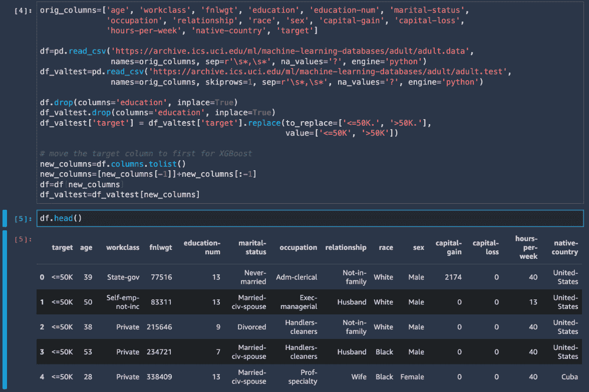
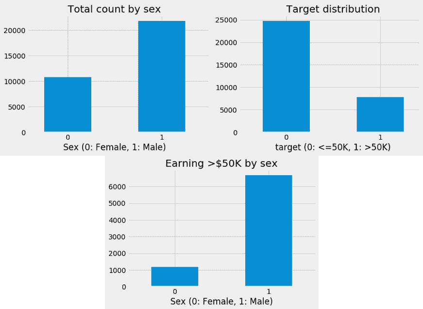
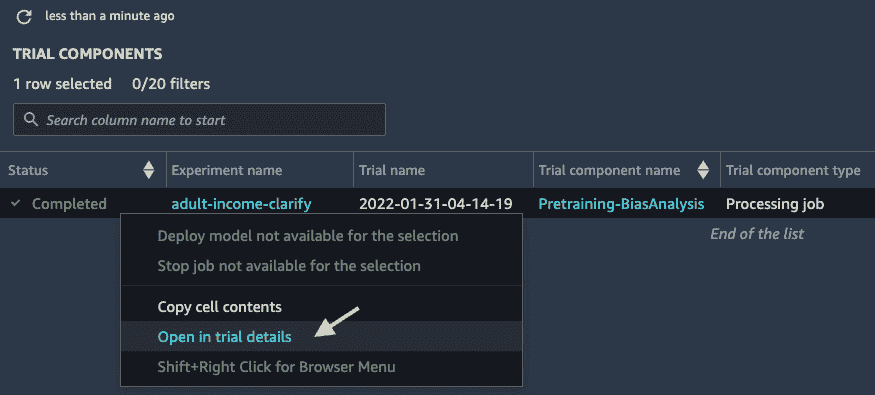
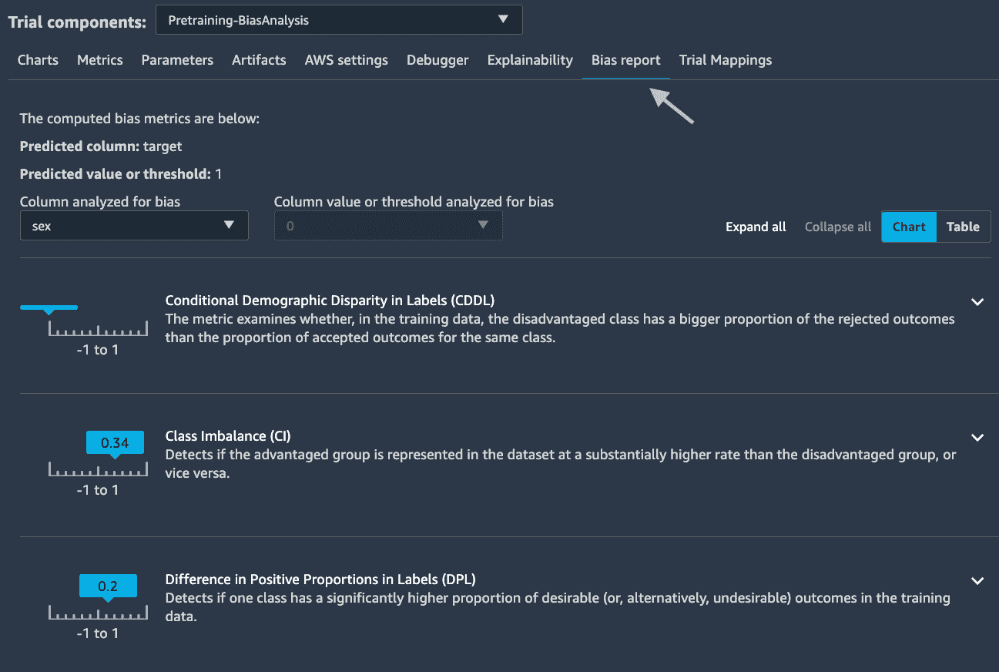
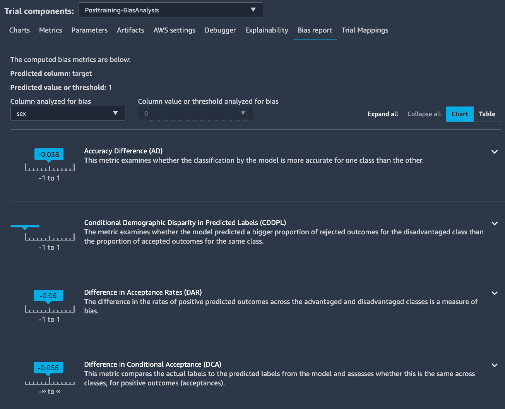
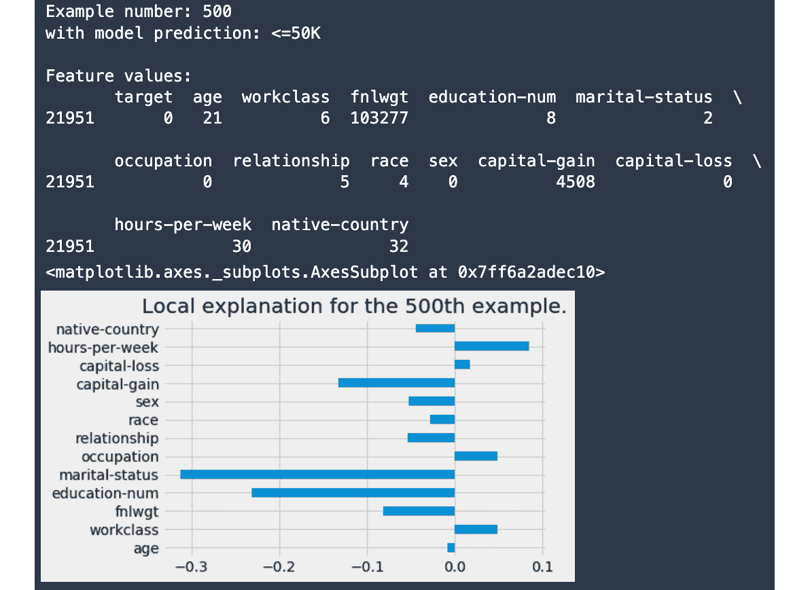

# *第六章*：使用 SageMaker Clarify 检测 ML 偏差和解释模型

**机器学习**（**ML**）模型正越来越多地被用于帮助各行各业做出商业决策，例如在金融服务、医疗保健、教育和人力资源（HR）等领域，这得益于 ML 提供的自动化，其准确性超过了人类。然而，ML 模型从不完美。它们可能会做出糟糕的决策——如果不仔细训练和评估，甚至可能是不公平的决策。ML 模型可能会以伤害弱势群体的方式产生偏差。在 ML 生命周期中能够理解数据和 ML 模型中的偏差对于创建一个社会公平的 ML 模型至关重要。**SageMaker Clarify** 在数据集和 ML 模型中计算 ML 偏差，以帮助您了解 ML 模型的局限性，从而您可以采取适当的行动来减轻这些偏差。

ML 模型长期以来一直被视为黑盒操作，因为很难看到预测是如何做出的。SageMaker Clarify 通过计算特征归因来帮助您解释 ML 模型是如何做出决策的，这样它就不再是我们的黑盒了。SageMaker Clarify 与 SageMaker Studio 集成，以便您在构建 ML 模型时可以轻松地审查结果。使用 SageMaker Clarify，您将能够更多地了解您的 ML 模型，提高您在 ML 用例中的公平性和可解释性，并在需要时满足监管要求。

在本章中，我们将学习以下主题：

+   理解 ML 中的偏差、公平性和 ML 可解释性

+   检测 ML 中的偏差

+   使用 **SHapley Additive exPlanations** （**SHAP**）值解释 ML 模型

# 技术要求

对于本章，您需要访问提供的代码，请参阅[`github.com/PacktPublishing/Getting-Started-with-Amazon-SageMaker-Studio/tree/main/chapter06`](https://github.com/PacktPublishing/Getting-Started-with-Amazon-SageMaker-Studio/tree/main/chapter06)。

# 理解 ML 中的偏差、公平性和 ML 可解释性

在机器学习中，我们可以分析和缓解两种类型的偏差以确保公平性——**数据偏差**和**模型偏差**。**数据偏差**是指在不同群体和类别之间训练数据的不平衡，这可能是由于采样错误简单地引入到机器学习解决方案中，或者由于不幸地根植于社会中的固有原因而复杂地引入。如果忽视数据偏差，可能会在训练模型中对某个群体产生不公平的预测，并导致整体准确率下降。能够尽早发现数据中的固有偏差并采取措施解决它们比以往任何时候都更加关键。另一方面，**模型偏差**是指由模型预测引入的偏差，例如分类和错误在优势群体和劣势群体之间的分布。如果模型在特定结果上偏向优势群体，或者不成比例地错误预测劣势群体，导致在现实世界的机器学习应用（如贷款批准预测系统）中产生不良后果，我们作为数据科学家需要采取措施来了解为什么会发生这种情况并缓解这种行为。

确保机器学习中的公平性始于理解数据并检测其中的偏差。数据偏差可能导致模型偏差，因为众所周知，模型将学习数据中呈现的内容，包括任何偏差，并将其在推理中复制。使用由机器学习社区开发和接受的指标来量化偏差对于检测和选择缓解方法至关重要。

能够解释模型如何做出决策是确保机器学习模型公平性的另一个关键因素。人们长期以来认为机器学习是一个神秘的黑盒——它预测事物比人类更好，但没有人知道为什么或如何。但是，机器学习研究人员已经开发了框架来帮助打开这个黑盒，其中最著名的一个是 SHAP。SHAP 计算并为特定预测的每个特征分配一个重要性分数。这个重要性分数被称为**Shapley 值**，它是合作博弈论的一种实现，用于在模型的输入特征之间分配模型输出的信用。对于预测中每个特征的 Shapley 值，我们可以描述模型如何以及为什么做出这样的预测，以及哪个特征对此贡献最大。如果存在对模型预测有显著贡献的敏感特征，我们需要采取措施来解决这个问题的影响。

**Amazon SageMaker Clarify** 帮助开发者发现训练数据和模型预测中的潜在偏差，并为机器学习模型解释特征重要性。SageMaker Clarify 计算各种指标来衡量数据中的偏差，这样你就不必成为机器学习偏差科学的专家。你可以使用 SageMaker Clarify 与 SageMaker **软件开发工具包** (**SDK**) 结合，从笔记本中分析数据和模型，这是我们本章将重点关注的。SageMaker Clarify 还与 Amazon SageMaker Data Wrangler 集成，这样你可以使用简单的图形界面检测偏差。SageMaker Clarify 还进一步与 **Amazon SageMaker Experiments** 集成，为每个实验提供图形结果，并与 **Amazon SageMaker Model Monitor** 集成，这样你可以在训练模型和在生产中的推理数据中识别偏差和特征重要性。

让我们从机器学习的一个例子开始，看看我们如何使用 SageMaker Clarify 来检测偏差。

# 检测机器学习中的偏差

对于本章，我想使用来自 **加州大学欧文分校** （**UCI**） 机器学习存储库的机器学习成人人口普查收入数据集（[`archive.ics.uci.edu/ml/datasets/adult`](https://archive.ics.uci.edu/ml/datasets/adult)）。这个数据集包含来自人口普查数据的人口统计信息以及作为预测目标的收入水平。数据集的目标是根据人口普查信息预测一个人是否每年收入超过或低于 **美元** （**USD**） **$50,000** （**$50K**）。这是一个很好的例子，并且是包含如性别和种族等社会敏感类别的机器学习用例，在生成机器学习模型时受到最严格的审查和监管，以确保公平性。

在本节中，我们将分析数据集以检测训练数据中的数据偏差，如果存在任何偏差，我们将减轻它，训练一个机器学习模型，并分析是否存在针对特定群体的模型偏差。

## 检测预训练偏差

请打开笔记本 `在 Amazon SageMaker Studio 中入门``/chapter06/01-ml_fairness_clarify.ipynb` 并按照以下步骤操作：

1.  我们将使用 SageMaker Experiments 来组织分析和训练工作。因此，我们在第一个单元中安装 `sagemaker-experiments`，并在接下来的两个单元中设置 SageMaker 会话并导入所需的库。

1.  在第四个单元格中，我们从 UCI ML 仓库加载训练和测试数据集。`orig_columns`值是从[`archive.ics.uci.edu/ml/machine-learning-databases/adult/adult.names`](https://archive.ics.uci.edu/ml/machine-learning-databases/adult/adult.names)解析出来的。原始数据集在`education`和`education-num`特征中既有字符串表示也有序数表示的教育水平。我们只保留序数表示并删除`education`列。我们还把`target`列移到第一列，因为我们将会使用 SageMaker 的内置`XGBoost`算法来训练一个机器学习模型以预测目标。`target`列包含收入大于$50K（`>50K`）和小于等于$50K（`<=50K`）的标签。你可以在以下截图看到这个说明：



图 6.1 – 第 2 步后的 DataFrame 截图

1.  我们使用`sklearn`中的`OrdinalEncoder`将训练数据（`df`）和测试数据（`df_valtest`）中的分类特征进行编码，以便使数据集与 XGBoost 算法兼容。编码后，值大于`50K`和小于等于`50K`的`target`变量分别编码为`1`和`0`；存在一个可能敏感的`sex`类别，其中`Male`和`Female`值分别编码为`1`和`0`。我们进一步将测试数据集的 10%作为验证数据集用于模型训练。

1.  使用这个数据集，我们可以从许多角度分析数据以寻找偏差和公平性。直观上，收入中的性别平等可能是一个我们可以从其开始的视角。让我们进行一些可视化来定性理解它，如下所示：

    ```py
    df['sex'].value_counts(sort=False).plot(kind='bar', title='Total count by sex', rot=0)
    plt.xlabel('Sex (0: Female, 1: Male)')
    df['target'].value_counts(sort=False).plot(kind='bar', title='Target distribution', rot=0)
    plt.xlabel('target (0: <=50K, 1: >50K)')
    df[df['target']==1]['sex'].value_counts(sort=False).plot(kind='bar', title='Earning >$50K by sex', rot=0)
    plt.xlabel('Sex (0: Female, 1: Male)')
    ```

在下一张截图，我们可以观察到以下内容：

+   女性的总数大约是男性的半数。

+   有更多的人的收入低于$50K。

+   在收入超过$50K 的人群中，男性比女性多。

你可以在这里看到输出：



图 6.2 – 绘图输出，显示性别和收入水平的分布；在性别和收入水平上可以观察到不平衡的分布

这种分布可能反映了社会不平等，但我们如何量化这些偏斜的分布，以便我们可以自动和程序化地更了解数据集中的偏差？这正是 SageMaker Clarify 发挥作用的地方。

SageMaker Clarify 来自 SageMaker SDK（`sagemaker.clarify`）使用专用容器和 SageMaker Processing 来计算机器学习偏差和解释机器学习预测。我们可以通过以下方式实例化`sagemaker.clarify.SageMakerClarifyProcessor`，选择适合数据集的计算资源类型：

```py
from sagemaker import clarify
clarify_processor = clarify.SageMakerClarifyProcessor(
         role=role, 
         instance_count=1, 
         instance_type='ml.m5.xlarge', 
         sagemaker_session=sess)
```

1.  我们将专门使用`SageMakerClarifyProcessor.run_pre_training_bias()`来计算在训练 ML 模型之前的数据偏见。它返回的指标允许我们根据我们选择的目标和方面量化数据偏见，并允许我们采取措施减轻偏见。但是，首先`run_pre_training_bias()`需要两个配置：一个`clarify.DataConfig()`，如下面的代码块所示：

    ```py
    pretraining_bias_report_output_path = f's3://{bucket}/{prefix}/{experiment_name}-{exp_trial_1.trial_name}/clarify-pretraining-bias'
    bias_data_config = clarify.DataConfig(
        s3_data_input_path=train_s3_uri,
        s3_output_path=pretraining_bias_report_output_path,
        label='target',
        headers=df.columns.tolist(),
        dataset_type='text/csv')
    ```

因为`train_s3_uri`中的训练数据不包含列标题，所以特征列通过`headers`参数提供。在`label`参数中，我们指定数据集中的目标变量，它必须是`headers`参数中输入的列名之一。

在偏见配置中，我们指定方面——即我们希望使用`clarify.BiasConfig()`分析的敏感类别，如下所示：

```py
bias_config = clarify.BiasConfig(
    label_values_or_threshold=[1], 
    facet_name=['sex', 'race'], 
    facet_values_or_threshold=[[0], None])
```

我们希望分析数据集中存在多少性别偏见（`sex`列），特别是结果（`target`列）如何受到性别的影响。为此，我们从目标中指定一个正类（`>50K`或`1`）到`label_values_or_threshold`参数的列表中。我们指定要分析的方面为`sex`和`race`。尽管在这个例子中我们主要关注性别偏见，但我们添加了一个`race`特征来展示您可以使用多个特征作为方面，并且 SageMaker Clarify 会同时分析所有方面的偏见。最后一个必需的参数`facet_values_or_threshold`用于指定 SageMaker Clarify 在量化偏见时关注的敏感类别。`facet_values_or_threshold=[[0], None]`对应于`facet_name=['sex', 'race']`。这意味着我们要求 Clarify 只计算`sex`中类`0`的偏见指标，即女性，而对于`race`没有指定一个类（`None`），这将迫使 Clarify 计算`race`中所有类的偏见指标。

1.  一旦设置完成，我们可以使用配置运行处理作业，如下所示：

    ```py
    clarify_processor.run_pre_training_bias(
        data_config=bias_data_config,
        data_bias_config=bias_config,
        methods='all',
        job_name=jobname,
        experiment_config=experiment_config)
    ```

我们要求 Clarify 计算所有可能的预训练偏见，使用`methods='all'`。SageMaker Clarify 与 SageMaker Experiments 集成，因此我们为此作业提供了实验和试验配置。在笔记本中，我们命名实验为`experiment_name = 'adult-income-clarify'`。

1.  我们可以在`adult-income-clarify`条目中可视化 Clarify 结果，并右键单击名为时间戳的新试验条目以选择**在试验组件列表中打开**，如下面的截图所示：

![图 6.3 – 选择试验以查看 SageMaker Clarify 结果

![图片/B17447_04_03.jpg]

图 6.3 – 选择试验以查看 SageMaker Clarify 结果

在主工作区域将显示一个包含**试验组件**列表的新页面。我们可以通过右键单击条目并选择**在试验详情中打开**来打开**试验详情**页面查看结果，如下面的截图所示：



图 6.4 – 选择试验组件以查看 SageMaker Clarify 结果

1.  在**试验组件**页面，切换到**偏差报告**选项卡以找到分析结果，如下面的截图所示。在这里，您可以找到 SageMaker Clarify 计算的指标：



图 6.5 – 在 SageMaker Studio 的试验详情页上审查预训练偏差报告

对于每个指标，您都可以看到一个描述来了解它的含义。如需更多信息，您可以展开一项内容以了解指标是如何计算的，包括示例和解释。此外，您可以在详细描述中找到更多关于所有指标数学定义的论文。

备注

为了方便起见，此**统一资源定位符**（**URL**）将带您到技术白皮书：[`pages.awscloud.com/rs/112-TZM-766/images/Amazon.AI.Fairness.and.Explainability.Whitepaper.pdf`](https://pages.awscloud.com/rs/112-TZM-766/images/Amazon.AI.Fairness.and.Explainability.Whitepaper.pdf)。如果您对指标背后的数学感兴趣，这是一份很好的阅读材料。

让我们回顾数据中的偏差。最值得注意的是，报告指出存在`sex`特征（因为女性比男性少 0.34 或 34%），在`>50K`方面，男性比女性多 0.2 或 20%。在数据集中，收入超过 50K 的男性比女性多，这两个指标单独不仅证实了我们之前在笔记本中绘制的图表中看到的失衡，而且量化了这种失衡。

备注

对于`clarify.BiasConfig(group_name=None)`没有有效的结果。

您可以通过切换**分析偏差的列**和**分析偏差的列值或阈值**下拉列表来查看`clarify.BiasConfig()`中指定的其他方面和类别（例如，`race`）的分析——通过切换**分析偏差的列**和**分析偏差的列值或阈值**下拉列表。

SageMaker Clarify 还会在`pretraining_bias_report_output_path`变量中保存分析副本。

如果不缓解这种数据失衡，它很可能在训练后嵌入到 ML 模型中，并开始重复从偏差数据中学到的内容。让我们看看如何缓解它。

## 缓解偏差和训练模型

有几种数据科学方法可以缓解数据不平衡，例如匹配、过采样和欠采样。在这个例子中，让我们尝试基于性别和目标结果进行简单的匹配，以平衡男性和女性样本以及正结果（`>50K`）的比例。我们将按以下步骤进行：

1.  回到笔记本，我们继续使用数据来处理偏差，如下所示：

    ```py
    max_female_sample=df.groupby(['sex', 'target'], 
               group_keys=False).count().loc[(0, 1)]['age']
    df_sampled=df.groupby(['sex', 'target'], 
    group_keys=False).apply(lambda x: x.sample(max_female_sample))
    ```

这生成了一个具有相等性别数量和相等目标结果比例的采样和匹配数据集。

1.  我们可以通过绘制相同的图表并使用 SageMaker Clarify 对此样本和匹配的数据集创建另一个预训练偏差分析来验证这种方法的有效性。请注意，我们正在 SageMaker Experiments 中创建另一个试验来跟踪此运行并将输出直接发送到不同的输出 S3 位置。以下代码片段展示了这个过程：

    ```py
    pretraining_bias_report_output_path = f's3://{bucket}/{prefix}/{experiment_name}-{exp_trial_2.trial_name}/clarify-pretraining-bias'
    bias_data_config = clarify.DataConfig(
        s3_data_input_path=train_sampled_s3_uri,
        s3_output_path=pretraining_bias_report_output_path,
        label='target',
        headers=df_sampled.columns.tolist(),
        dataset_type='text/csv')
    ```

然后，我们使用相同的 `bias_config` 并调用之前使用的 `clarify_processor.run_pre_training_bias()` 方法来在偏差缓解后运行预训练偏差分析作业。

1.  SageMaker Clarify 作业完成后，我们可以在新预训练偏差分析作业的试验详情页上打开**偏差报告**功能。您可以看到，**类别不平衡（CI）**和**标签中正例比例差异（DPL）**现在都是零。实际上，所有偏差指标都是零。

1.  我们已经成功消除了之前观察到的数据偏差。让我们使用 SageMaker 内置的 `XGBoost` 算法开始模型训练，这是一个非常适合我们这种结构化数据的优秀工具。我们将此训练作业作为第二个试验 `exp_trial_2` 中的新试验组件运行。对于超参数，我们选择二分类的 `binary:logistic` 目标，`error` 作为评估指标，以及 `50` 轮优化。以下代码片段展示了这个过程：

    ```py
    experiment_config={'ExperimentName': experiment_name,
                       'TrialName': exp_trial_2.trial_name,
                       'TrialComponentDisplayName': 'Training'}
    ...
    xgb = sagemaker.estimator.Estimator(
            image,
            role,
            instance_type='ml.m5.xlarge',
            instance_count=1,
            output_path=train_s3_output,
            enable_sagemaker_metrics=True,
            sagemaker_session=sess)
    xgb.set_hyperparameters(objective='binary:logistic',
                            eval_metric='error',
                            num_round=50)
    ...
    data_channels={'train': train_input, 'validation': val_input}
    xgb.fit(inputs=data_channels, 
            job_name=jobname, 
            experiment_config=experiment_config, 
            wait=True)
    ```

训练作业包括基础设施配置，大约需要 5 分钟。

1.  我们从训练作业中创建一个 SageMaker 模型，以便以后可以在 SageMaker Clarify 作业中使用它来分析模型偏差。以下是执行此操作的代码：

    ```py
    model = xgb.create_model(name=model_name)
    container_def = model.prepare_container_def()
    sess.create_model(model_name, role, container_def)
    ```

模型训练完成后，我们可以使用 SageMaker Clarify 来检测和测量预测中出现的偏差。

## 检测训练后偏差

以下步骤分析模型训练后的预测和数据的偏差。要使用 SageMaker Clarify 运行训练后的偏差分析，我们需要准备三个配置：一个**数据配置**、一个**偏差配置**和一个**模型配置**。按照以下步骤进行：

1.  创建一个新的 `clarify.DataConfig()` 实例来分析匹配的训练数据，并将输出直接发送到不同的输出 S3 位置，如下所示：

    ```py
    posttraining_bias_report_output_path = f's3://{bucket}/{prefix}/{experiment_name}-{exp_trial_2.trial_name}/clarify-posttraining-bias' 
    bias_data_config = clarify.DataConfig(
        s3_data_input_path=train_sampled_s3_uri,
        s3_output_path=posttraining_bias_report_output_path,
        label='target',
        headers=df_sampled.columns.tolist(),
        dataset_type='text/csv')
    ```

1.  偏差配置与我们在预训练偏差分析中使用的配置相同。我们继续分析模型预测如何受到 `sex`、`race` 和 `target` 分布的影响。

1.  当开始训练后分析作业时，会创建一个 SageMaker 实时端点，带有 ML 模型，用于在短时间内对输入数据进行预测，以避免对生产端点产生额外的流量（如果有的话）。此端点也称为影子端点，一旦分析作业完成，将取消配置。对于模型配置，我们指定一个模型并配置端点。`accept_type` 表示端点响应的有效负载格式，而 `content_type` 表示对端点的请求的有效负载格式。

我们还指定了 0.5 的概率阈值，将 XGBoost 模型的概率输出转换为二进制硬标签，如下所示：

```py
model_config = clarify.ModelConfig(
    model_name=model_name,
    instance_type='ml.m5.xlarge',
    instance_count=1,
    accept_type='text/csv',
    content_type='text/csv')
predictions_config = clarify.ModelPredictedLabelConfig(probability_threshold=0.5)
```

预测值大于 0.5 的被预测为 1 (`>50K`)；否则，为 0 (`<=50K`)。

1.  最后，我们使用配置运行作业。我们请求计算所有有效的训练后偏差指标，如下所示：

    ```py
    clarify_processor.run_post_training_bias(
        data_config=bias_data_config,
        data_bias_config=bias_config,
        model_config=model_config,
        model_predicted_label_config=predictions_config,
        methods='all',    
        job_name=jobname,
        experiment_config=experiment_config)
    ```

1.  我们还可以在第二个试验的试验详情页上查看结果 (`exp_trial_2.trial_name`)，如下所示截图。与预训练偏差分析相比，我们看到显示的指标集不同。训练后偏差作业专注于分析预测标签或比较预测与数据中具有不同属性组的观察到的目标值：



图 6.6 – 在 SageMaker Studio 的试验详情页上查看训练后偏差报告

大多数指标，如 **准确度差异 (AD)**，偏差非常低，这意味着模型在预测男女收入水平时具有相同的准确性。然而，有一个指标具有相当高的偏差：**处理平等 (TE)**。这衡量的是 *Type 1* 错误（假阳性）和 *Type 2* 错误（假阴性）是否以相同的方式影响两个性别。这是男性和女性组中假阴性与假阳性的比率差异。正值表示女性具有更低的假阴性与假阳性比率。这意味着模型更频繁地错误地将女性预测为高收入者，而实际上她们并不是；相反，情况正好相反。与男性相比，女性的假阳性率更高，这可能会引起一些担忧，并可能导致模型产生不公平的后果。

注意

在 *检测预训练偏差* 部分中分享的技术白皮书也包含了许多关于训练后指标的更多细节。您可以在以下链接找到该论文：[`pages.awscloud.com/rs/112-TZM-766/images/Amazon.AI.Fairness.and.Explainability.Whitepaper.pdf`](https://pages.awscloud.com/rs/112-TZM-766/images/Amazon.AI.Fairness.and.Explainability.Whitepaper.pdf)。

在理解了如何测量偏差，包括预训练和训练后，我们还应该探索 ML 模型是如何像使用 SageMaker Clarify 那样做出决策的。

# 使用 SHAP 值解释 ML 模型

SageMaker Clarify 还根据 Shapley 值的概念计算模型无关的特征归因。Shapley 值可以用来确定每个特征对模型预测的贡献。特征归因有助于解释模型是如何做出决策的。拥有一种可量化的方法来描述模型是如何做出决策的，使我们能够信任满足监管要求并支持人类决策过程的 ML 模型。

与使用 SageMaker Clarify 设置运行偏差分析作业的配置类似，设置模型可解释性作业需要三个配置：一个**数据配置**、一个**模型配置**和一个**可解释性配置**。让我们按照以下步骤从同一个笔记本开始：

1.  使用训练数据集（匹配）创建一个数据配置。这与我们之前创建的数据配置类似。以下代码片段展示了代码：

    ```py
    explainability_data_config = clarify.DataConfig(
        s3_data_input_path=train_sampled_s3_uri,
        s3_output_path=explainability_output_path,
        label='target',
        headers=df_sampled.columns.tolist(),
        dataset_type='text/csv')
    ```

1.  创建或重用之前为训练后偏差分析作业创建的 `model_config` 参数。

1.  创建一个带有基线的 `clarify.SHAPConfig()` 实例。基线是一个数据点的实例，将用于与输入数据一起计算 Shapley 值。对于相同的模型，你可以预期根据不同的基线得到不同的解释，因此基线的选择至关重要。选择一个具有非常低信息含量的通用基线是可取的，例如平均值或中值特征向量。在这种情况下，在我们的示例中，我们将解释模型归因为什么预测某个人为高收入者，而不是一个普通人。或者，你也可以选择根据特定类型的数据来解释模型。例如，我们可以从代表推理中人群的类似人口中选择基线。以下代码片段展示了代码：

    ```py
    baseline = df_sampled.query('target == 1').mode().iloc[0, 1:].astype(int).tolist()
    shap_config = clarify.SHAPConfig(
        baseline=[baseline],
        num_samples=15,
        agg_method='mean_abs')
    ```

在我们的示例中，让我们使用 `mode` 为基线模拟训练数据中的一个“平均”高收入（`>50K`）的人。`num_samples` 参数用于确定生成合成数据集的大小以计算 SHAP 值。你也可以留空，让 Clarify 自动选择一个数字。`agg_method='mean_abs'` 表示如何聚合全局 SHAP 值。

1.  之后，我们使用配置开始分析作业，如下所示：

    ```py
    clarify_processor.run_explainability(
        data_config=explainability_data_config,
        model_config=model_config,
        explainability_config=shap_config,
        job_name=jobname,
        experiment_config=experiment_config,
        wait=False,
        logs=False)
    ```

1.  一旦处理作业完成，我们可以在 SageMaker Experiments 下的 `education-num` 特征的试验详情页上查看结果，该特征代表最高的教育水平，对预测收入水平（`>50K` 或 `<=50K`）的贡献最大：

![图 6.7 – 在 SageMaker Studio 中查看模型可解释性结果 SHAP 值]

![img/B17447_04_07.jpg]

图 6.7 – 在 SageMaker Studio 中查看模型可解释性结果（SHAP 值）

1.  除了全局 SHAP 值之外，我们还可以审查任何给定数据点的局部 SHAP 解释，以解释模型是如何针对这个特定数据点进行预测的。SageMaker Clarify 计算并保存整个数据集的局部解释，该数据集在`clarify.DataConfig()`中提供，并在`explainability_output_path`中保存。我们可以使用以下代码绘制特定数据点（第 500 行）的每个特征的局部 SHAP 值：

    ```py
    S3Downloader.download(f'{explainability_output_path}/explanations_shap/out.csv', './', sagemaker_session=sess)
    local_explanations_out = pd.read_csv('out.csv')
    feature_names = [str.replace(c, '_label0', '') for c in local_explanations_out.columns.to_series()]
    local_explanations_out.columns = feature_names
    selected_example = 500
    print(f'Example number: {selected_example}')
    print(f'with model prediction: {sum(local_explanations_out.iloc[selected_example]) > 0}')
    print()
    print(f'Feature values: \n{df_sampled.iloc[selected_example].to_frame().T}')
    local_explanations_out.iloc[selected_example].plot(
        kind='barh', 
        title=f'Local explanation for the {selected_example}th example.', 
        rot=0)
    ```

如*图 6.8*所示，我们可以看到 XGBoost 模型如何预测这个数据点为<=50K。`marital-status`、`education-num`和`capital-gain`因素是模型认为这个人是低收入者的前三个因素。多亏了 SageMaker Clarify 计算出的 SHAP 值，我们还可以理解和解释模型是如何针对个体进行预测的。



图 6.8 – 解释单个预测

在您完成示例之后，让我们总结本章内容

# 摘要

在本章中，我们通过成人收入示例探讨了机器学习中的偏差和机器学习可解释性。我们了解到数据可能包含对数据集中某个特定群体或类别的不公平偏差，这可能导致机器学习模型做出不公平的预测。我们在 SageMaker Studio 中通过一个成人收入水平预测示例进行分析和计算，在模型训练之前使用**SageMaker Clarify**来识别任何偏差。Clarify 生成指标来量化数据集中的不平衡，这可能导致不公平的偏差。我们通过采样和匹配技术来减轻不平衡，然后继续训练机器学习模型。我们进一步使用 SageMaker Clarify 分析了结果机器学习模型在预测中的潜在偏差。最后，我们回顾了如何使用 SageMaker Clarify 和 SHAP 值来了解机器学习模型是如何做出决策的。

在下一章中，我们将学习在 SageMaker 中训练机器学习模型之后的下一步。在云中托管机器学习模型对于大多数机器学习用例至关重要，能够从 SageMaker 中选择合适的工具进行模型托管对于您组织成功采用机器学习至关重要。我们将了解托管机器学习模型的多种选项以及如何使用 SageMaker 的托管功能来优化计算资源和成本。
