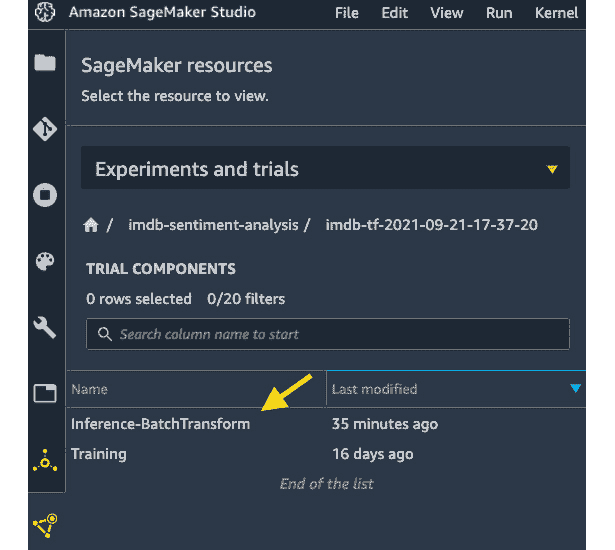
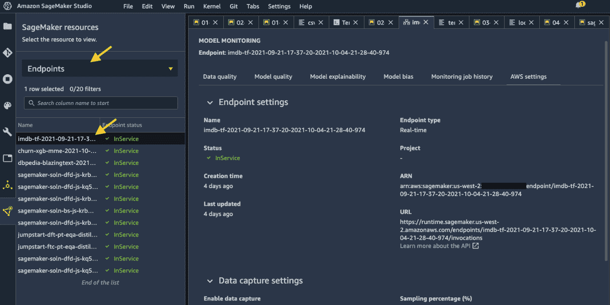
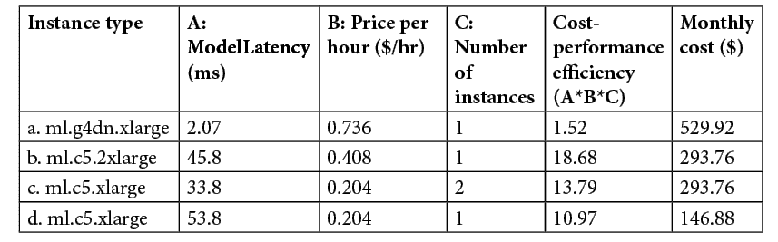

# *第七章*：云中托管机器学习模型：最佳实践

在您成功训练了一个模型之后，您希望使模型可用于推理，不是吗？机器学习模型通常是 ML 驱动型企业的产品。您的客户消费的是您模型中的 ML 预测，而不是您的训练作业或处理后的数据。您如何提供令人满意的客户体验，从您 ML 模型的良好体验开始？

根据您的用例，SageMaker 提供了多种机器学习托管和推理选项。在生活的许多方面，选项都是受欢迎的，但找到最佳选项可能很困难。本章将帮助您了解如何托管用于批量推理和在线实时推理的模型，如何使用多模型端点来节省成本，以及如何针对您的推理需求进行资源优化。

在本章中，我们将涵盖以下主题：

+   训练后云中部署模型

+   批量转换中的推理

+   托管实时端点

+   优化您的模型部署

# 技术要求

对于本章，您需要访问[`github.com/PacktPublishing/Getting-Started-with-Amazon-SageMaker-Studio/tree/main/chapter07`](https://github.com/PacktPublishing/Getting-Started-with-Amazon-SageMaker-Studio/tree/main/chapter07)中的代码。如果您在上一章中没有运行笔记本，请在继续之前，从存储库中运行[chapter05/02-tensorflow_sentiment_analysis.ipynb](http://chapter05/02-tensorflow_sentiment_analysis.ipynb)文件。

# 训练后云中部署模型

机器学习模型主要可以通过两种方式在云中消费，**批量推理**和**实时推理**。批量推理指的是对批量数据进行模型推理，通常是大型批量，并且具有异步性质。它适合那些收集数据不频繁、关注群体统计而不是个体推理、并且不需要立即获得推理结果用于下游流程的场景。例如，研究导向的项目不需要立即返回数据点的模型推理。研究人员通常为了测试和评估目的收集数据块，他们更关注整体统计和性能，而不是个体预测。他们可以在批量中进行推理，并在整个批次的预测完成之前继续进行。

另一方面，实时推理指的是在实时进行的模型推理。预期对于传入的数据点的推理结果将立即返回，以便用于后续的决策过程。例如，一个交互式聊天机器人需要实时推理能力来支持此类服务。没有人愿意等到对话结束时才从聊天机器人模型那里得到回应，人们也不愿意等待超过几秒钟。希望提供最佳客户体验的公司希望推理和结果能够立即返回给客户。

由于有不同的要求，批量推理和实时推理之间的架构和部署选择也有所不同。Amazon SageMaker 提供了各种完全管理的选项来满足您的推理用例。**SageMaker 批量转换**旨在进行大规模的批量推理，并且由于计算基础设施是完全管理的，因此在推理作业完成后会自动取消分配，因此具有成本效益。**SageMaker 实时端点**旨在为您的机器学习用例提供强大的实时托管选项。SageMaker 的这两种托管选项都是完全管理的，这意味着您不必过多担心云基础设施。

让我们先看看 SageMaker 批量转换，它是如何工作的，以及在什么情况下使用它。

# 批量转换的推理

SageMaker 批量转换旨在为大型数据集提供离线推理。根据您如何组织数据，SageMaker 批量转换可以将单个大文本文件在 S3 中按行分割成小而可管理的尺寸（迷你批次），以便在针对模型进行推理之前放入内存中；它还可以通过 S3 键将文件分配到计算实例中进行高效计算。例如，它可以将 `test1.csv` 发送到实例 1，将 `test2.csv` 发送到实例 2。

为了演示 SageMaker 批量转换，我们可以从上一章的训练示例开始。在 *第六章*，“使用 SageMaker Clarify 检测机器学习偏差和解释模型”，我们向您展示了如何使用 SageMaker 管理训练在 `Getting-Started-with-Amazon-SageMaker-Studio/chapter05/02-tensorflow_sentiment_analysis.ipynb.` 中对电影评论情感预测用例进行 TensorFlow 模型的训练。我们可以按照以下步骤将训练好的模型部署到 SageMaker 批量转换中进行批量推理：

1.  请打开 `Getting-Started-with-Amazon-SageMaker-Studio/chapter07/01-tensorflow_sentiment_analysis_batch_transform.ipynb` 笔记本，并使用 **Python 3** （**TensorFlow 2.3 Python 3.7 CPU 优化**） 内核。

1.  运行前三个单元格以设置 SageMaker SDK，导入库，并准备测试数据集。测试数据集中有 25,000 个文档。我们将测试数据保存为 CSV 文件，并将 CSV 文件上传到我们的 S3 桶中。文件大小为 27 MB。

    注意

    SageMaker 批量转换期望输入 CSV 文件不包含标题。也就是说，CSV 的第一行应该是第一个数据点。

1.  我们从*第六章*中提到的训练作业中检索了训练 TensorFlow 估计器，该作业是关于*检测机器学习偏差和用 SageMaker Clarify 解释模型*。我们需要获取用于 `TensorFlow.attach()` 方法的训练作业名称。您可以在左侧侧边栏的**实验和试验**中找到它，如图*图 7.1*所示，这是由于我们在训练时使用的实验。在**实验和试验**中，左键单击**imdb-sentiment-analysis**，您应该会在列表中看到您的训练作业作为一个试验。

![Figure 7.1 – 在实验和试验中获取训练作业名称

![img/B17447_07_01.jpg]

Figure 7.1 – 在实验和试验中获取训练作业名称

您应该在以下代码中将 `training_job_name` 替换为您自己的：

```py
from sagemaker.tensorflow import TensorFlow
training_job_name='<your-training-job-name>'
estimator = TensorFlow.attach(training_job_name)
```

一旦您替换了 `training_job_name` 并将其附加到重新加载 `estimator`，您应该会在输出中看到作业的历史记录。

1.  要运行 SageMaker 批量转换，您只需要两行 SageMaker API 代码：

    ```py
    transformer = estimator.transformer(instance_count=1, 
                                        instance_type='ml.c5.xlarge',
                                        max_payload = 2, # MB
                                        accept = 'application/jsonlines',
                                        output_path = s3_output_location,
                                        assemble_with = 'Line')
    transformer.transform(test_data_s3, 
                          content_type='text/csv', 
                          split_type = 'Line', 
                          job_name = jobname,
                          experiment_config = experiment_config)
    ```

`estimator.transformer()` 方法创建一个具有所需推理计算资源的 `Transformer` 对象。在这里，我们请求一个 `ml.c5.xlarge` 实例来预测 25,000 部电影评论。`max_payload` 参数允许我们控制 SageMaker 批量转换分割的每个 mini-batch 的大小。`accept` 参数确定输出类型。SageMaker 管理的 Tensorflow serving 容器支持 '`application/json`' 和 'a`pplication/jsonlines`'。`assemble_with` 控制如何组装 mini-batch 中的推理结果。然后我们在 `transformer.transform()` 中提供测试数据的 S3 位置（`test_data_s3`），并指示输入内容类型为 '`text/csv`'，因为文件是 CSV 格式。`split_type` 确定 SageMaker 批量转换如何将输入文件分割成 mini-batch。我们输入一个唯一的作业名称和 SageMaker Experiments 配置，以便我们可以跟踪推理到同一试验中相关的训练作业。批量转换作业大约需要 5 分钟才能完成。像训练作业一样，一旦作业完成，SageMaker 会管理实例的配置、计算和取消配置。

1.  作业完成后，我们应该查看结果。SageMaker 批量转换在组装后将结果保存到指定的 S3 位置，并在输入文件名后附加 `.out`。您可以在 `transformer.output_path` 属性中访问完整的 S3 路径。SageMaker 使用 TensorFlow Serving，这是一个由 TensorFlow 开发的模型服务框架，用于模型服务，模型输出以 JSON 格式编写。输出包含一个数组，其中包含预测作为 JSON 键的情感概率。我们可以使用以下代码检查批量转换结果：

    ```py
    output = transformer.output_path
    output_prefix = 'imdb_data/test_output'
    !mkdir -p {output_prefix}
    !aws s3 cp --recursive {output} {output_prefix}
    !head {output_prefix}/{csv_test_filename}.out
    {    "predictions": [[0.00371244829], [1.0], [1.0], [0.400452465], [1.0], [1.0], [0.163813606], [0.10115058], [0.793149233], [1.0], [1.0], [6.37737814e-14], [2.10463966e-08], [0.400452465], [1.0], [0.0], [1.0], [0.400452465], [2.65155926e-29], [4.04420768e-11], ……]}
    ```

然后，我们将所有 25,000 个预测收集到一个`results`变量中：

```py
results=[]
with open(f'{output_prefix}/{csv_test_filename}.out', 'r') as f:
    lines = f.readlines()
    for line in lines:
        print(line)
        json_output = json.loads(line)
        result = [float('%.3f'%(item)) for sublist in json_output['predictions'] 
                                       for item in sublist]
        results += result
print(results)
```

1.  笔记本本的其余部分显示了一篇原始电影评论、预测的情感和相应的真实情感。模型返回评论为正面或负面的概率。我们采用`0.5`阈值，将超过阈值的概率标记为正面，低于`0.5`的标记为负面。

1.  由于我们在与训练作业相同的试验中记录了批转换作业，我们可以在左侧侧边栏的**实验和试验**中轻松找到它，如图 7.2 所示。您可以在本条目中查看有关此批转换作业的更多信息。

图 7.2 – 批转换作业作为试验组件与训练组件一起记录

这就是使用 SageMaker 批转换在大型数据集上生成推理是多么容易。您可能会想，为什么我不能直接使用笔记本进行推理？使用 SageMaker 批转换的好处是什么？是的，您可以使用笔记本进行快速分析。SageMaker 批转换的优势如下：

+   完全管理的迷你批处理有助于高效地对大数据集进行推理。

+   您可以使用一个独立的 SageMaker 管理的计算基础设施，这与您的笔记本实例不同。您可以使用实例集群轻松运行预测，以实现更快的预测。

+   即使使用更大的计算集群，您也只需为批转换作业的运行时间付费。

+   您可以使用 SageMaker 批转换在云中独立安排和启动模型预测。无需在 SageMaker Studio 中使用 Python 笔记本启动预测作业。

接下来，让我们看看我们如何在云中托管 ML 模型以用于实时用例。

# 托管实时端点

SageMaker 实时推理是一个完全管理的功能，用于在计算实例上托管您的模型（或多个模型）以实现实时低延迟推理。部署过程包括以下步骤：

1.  在 SageMaker 中创建一个模型、容器和相关的推理代码。模型指的是训练工件，`model.tar.gz`。容器是代码和模型的运行时环境。

1.  创建一个 HTTPS 端点配置。此配置包含有关计算实例类型和数量、模型和流量模式到模型变体的信息。

1.  创建 ML 实例和 HTTPS 端点。SageMaker 创建了一支 ML 实例和 HTTPS 端点，用于处理流量和身份验证。最后一步是将所有内容组合起来，以创建一个可以与客户端请求交互的工作 HTTPS 端点。

运行实时端点面临的一个特定挑战是，当你的端点流量激增时，这通常在托管网站或 Web 应用程序时很常见：你可能在一小时内每分钟有 1,000 名客户访问你的网站，而在下一小时有 10 万名客户。如果你只在端点后面部署一个能够每分钟处理 5,000 个请求的实例，那么在第一个小时内它会运行良好，但在下一个小时内会陷入困境。自动扩展是云中的一种技术，可以帮助你在满足某些条件时自动扩展实例，以便你的应用程序在任何时候都能处理负载。

让我们通过一个 SageMaker 实时端点示例来了解一下。就像批量转换示例一样，我们继续在*第五章**，使用 SageMaker Studio IDE 构建和训练 ML 模型*和 05/02-tensorflow_sentiment_analysis.ipynb 中继续 ML 用例。请打开`Getting-Started-with-Amazon-SageMaker-Studio/chapter07/02-tensorflow_sentiment_analysis_inference.ipynb`中的笔记本，并使用**Python 3**（**TensorFlow 2.3 Python 3.7 CPU Optimized**）内核。我们将部署一个训练好的模型到 SageMaker 作为一个实时端点，进行一些预测作为示例，并最终应用自动扩展策略来帮助扩展端点后面的计算实例。请按照以下步骤操作：

1.  在前四个单元格中，我们设置了 SageMaker 会话，加载 Python 库，加载我们在`01-tensorflow_sentiment_analysis_batch_transform.ipynb`中创建的测试数据，并使用其名称检索我们之前训练的训练作业。

1.  然后，我们将模型部署到端点：

    ```py
    predictor = estimator.deploy(
                     instance_type='ml.c5.xlarge',
                     initial_instance_count=1)
    ```

在这里，我们选择`ml.c5.xlarge`作为`instance_type`参数。`initial_instance_count`参数指的是我们调用此参数时端点后面的 ML 实例数量。稍后，我们将向您展示如何使用自动扩展功能，该功能旨在帮助我们扩展实例群，当初始设置不足时。部署过程大约需要 5 分钟。

1.  我们可以用一些样本数据测试端点。容器中的 TensorFlow Serving 框架处理数据接口，并接受 NumPy 数组作为输入，因此我们可以直接将条目传递给模型。我们可以从端点获得 JSON 格式的响应，该响应在 Python 中的`prediction`变量中被转换为字典：

    ```py
    prediction=predictor.predict(x_test[data_index])
    print(prediction)
    {'predictions': [[1.80986511e-11]]}
    ```

接下来的两个单元格检索文本评论，并打印出带有 0.5 阈值的真实情感和预测情感，就像在批量转换示例中一样。

1.  (可选) 你可能想知道：我能否让端点预测 25,000 个数据点的整个`x_test`？为了找到答案，请随意尝试以下行：

    ```py
    predictor.predict(x_test)
    ```

这行代码将运行几秒钟，最终失败。这是因为 SageMaker 端点设计为一次处理 6 MB 大小的请求。例如，您可以请求多个数据点的推理，例如 `x_test[:100]`，但不能在一次调用中请求 25,000 个。相比之下，批量转换会自动进行数据拆分（迷你批处理），更适合处理大型数据集。

1.  接下来，我们可以使用 `boto3` SDK 中的 `application-autoscaling` 客户端将 SageMaker 的自动缩放功能应用于此端点：

    ```py
    sagemaker_client = sess.boto_session.client('sagemaker')
    autoscaling_client = sess.boto_session.client('application-autoscaling')
    ```

1.  在 AWS 中为计算实例配置自动缩放是一个两步过程。首先，我们运行 `autoscaling_client.register_scalable_target()` 以将目标与我们的 SageMaker 端点所需的期望最小/最大容量注册：

    ```py
    resource_id=f'endpoint/{endpoint_name}/variant/AllTraffic' 
    response = autoscaling_client.register_scalable_target(
       ServiceNamespace='sagemaker',
       ResourceId=resource_id,
    ScalableDimension='sagemaker:variant:DesiredInstanceCount',
       MinCapacity=1,
       MaxCapacity=4)
    ```

我们的目标，SageMaker 实时端点，用 `resource_id` 表示。我们将最小容量设置为 `1`，最大容量设置为 `4`，这意味着当负载最低时，至少有一个实例在端点后面运行。我们的端点最多可以扩展到四个实例。

1.  然后我们运行 `autoscaling_client.put_scaling_policy()` 来指示我们想要如何自动缩放：

    ```py
    response = autoscaling_client.put_scaling_policy(
       PolicyName='Invocations-ScalingPolicy',
       ServiceNamespace='sagemaker',
       ResourceId=resource_id, 
       ScalableDimension='sagemaker:variant:DesiredInstanceCount', 
       PolicyType='TargetTrackingScaling', 
       TargetTrackingScalingPolicyConfiguration={
           'TargetValue': 4000.0, 
           'PredefinedMetricSpecification': {
              'PredefinedMetricType': 
                 'SageMakerVariantInvocationsPerInstance'},
            'ScaleInCooldown': 600, 
            'ScaleOutCooldown': 300})
    ```

在此示例中，我们采用了一种名为 `SageMakerVariantInvocationsPerInstance` 的缩放策略，在此配置中确保每个实例在扩展另一个实例之前可以每分钟共享 4,000 个请求。`ScaleInCooldown` 和 `ScaleOutCooldown` 指的是在自动缩放可以再次进行缩放之前，最后一次缩放活动后的秒数。根据我们的配置，SageMaker 不会在最后一次缩放活动后的 600 秒内进行缩放（移除实例），也不会在最后一次缩放活动后的 300 秒内进行扩展（添加实例）。

注意

对于 `PolicyType`，有两种常用的高级缩放策略：**步进缩放**和**计划缩放**。在步进缩放中，您可以根据某个指标的警报越界大小定义要缩放/缩出的实例数量。有关步进缩放的更多信息，请参阅 [`docs.aws.amazon.com/autoscaling/ec2/userguide/as-scaling-simple-step.html`](https://docs.aws.amazon.com/autoscaling/ec2/userguide/as-scaling-simple-step.html)。在计划缩放中，您可以根据计划设置缩放。如果流量可预测或具有某种季节性，这特别有用。有关计划缩放的更多信息，请参阅 [`docs.aws.amazon.com/autoscaling/ec2/userguide/schedule_time.html`](https://docs.aws.amazon.com/autoscaling/ec2/userguide/schedule_time.html)。

1.  我们可以使用以下代码验证自动缩放策略的配置：

    ```py
    response = autoscaling_client.describe_scaling_policies(
             ServiceNamespace='sagemaker')
    for i in response['ScalingPolicies']:
        print('')
        print(i['PolicyName'])
        print('')
        if('TargetTrackingScalingPolicyConfiguration' in i):
            print(i['TargetTrackingS calingPolicyConfiguration']) 
        else:
            print(i['StepScalingPolicyConfiguration'])
        print('')
    Invocations-ScalingPolicy
    {'TargetValue': 4000.0, 'PredefinedMetricSpecification': {'PredefinedMetricType': 'SageMakerVariantInvocationsPerInstance'}, 'ScaleOutCooldown': 300, 'ScaleInCooldown': 600}
    ```

1.  在 **Amazon SageMaker Studio** 中，您可以在左侧侧边栏的 **Endpoints** 注册表中轻松找到端点的详细信息，如图 *图 7.3* 所示。如果您双击一个端点，您可以在主工作区域看到更多信息：



图 7.3 – 在 SageMaker Studio 中查找端点

运行端点的目的是在云中提供机器学习模型，以便您可以将机器学习作为微服务集成到您的应用程序或网站上。只要您的核心产品或服务可用，您的模型就必须始终可用。您可以想象，优化部署以最小化成本同时保持性能，这对您来说是一个巨大的机会和激励。我们刚刚学习了如何在云中部署机器学习模型；我们也应该学习如何优化部署。

# 优化您的模型部署

优化模型部署是企业的一个关键话题。没有人愿意多花一分钱。因为部署的端点正在持续使用，并且持续产生费用，确保部署在成本和运行时性能方面得到优化可以为您节省大量资金。SageMaker 有几个选项可以帮助您在优化运行时性能的同时降低成本。在本节中，我们将讨论多模型端点部署以及如何为您的用例选择实例类型和自动扩展策略。

## 运行多模型端点以节省成本

多模型端点是 SageMaker 中的一种实时端点，允许在同一个端点后面部署多个模型。有许多用例，您会为每个客户或每个地理区域构建模型，并且根据传入数据点的特征，您将应用相应的机器学习模型。以我们在*第三章*中解决的电信流失预测用例为例，*使用 SageMaker Data Wrangler 进行数据准备*。如果我们按州训练它们，可能会得到更准确的机器学习模型，因为当地电信提供商之间的竞争可能存在地区差异。如果我们为每个美国州训练机器学习模型，您也可以很容易地想象到每个模型的利用率可能并不完全相等。实际上，恰恰相反。

模型利用率不可避免地与每个州的居民人数成比例。您的纽约模型将比您的阿拉斯加模型使用得更频繁。在这种情况下，如果您为每个州运行一个端点，您将不得不为最少使用的端点付费。使用多模型端点，SageMaker 可以帮助您通过减少您用例所需的端点数量来降低成本。让我们看看它是如何与电信流失预测用例一起工作的。请使用 Python 3（数据科学）内核打开`Getting-Started-with-Amazon-SageMaker-Studio/chapter07/03-multimodel-endpoint.ipynb`笔记本，并按照以下步骤操作：

1.  我们定义了 SageMaker 会话，在前三个单元中加载 Python 库，并加载流失数据集。

1.  我们进行最小化预处理，将二进制列从字符串转换为`0`和`1`：

    ```py
    df[["Int'l Plan", "VMail Plan"]] = df[["Int'l Plan", "VMail Plan"]].replace(to_replace=['yes', 'no'], value=[1, 0])
    df['Churn?'] = df['Churn?'].replace(to_replace=['True.', 'False.'], value=[1, 0])
    ```

1.  我们为后续的 ML 推理留出了 10% 的数据：

    ```py
    from sklearn.model_selection import train_test_split
    df_train, df_test = train_test_split(df_processed,
             test_size=0.1, random_state=42, shuffle=True, 
             stratify=df_processed['State'])
    ```

1.  数据准备完成后，我们使用 SageMaker Experiments 集成在函数 `launch_training_job()` 中设置我们的状态模型训练过程。我们使用的训练算法是 SageMaker 内置的 XGBoost 算法，对于这种结构化数据来说，它既快又准确。对于二元分类，我们使用 `binary:logtistic` 目标，并将 `num_round` 设置为 `20`：

    ```py
    def launch_training_job(state, train_data_s3, val_data_s3):
        ...
        xgb = sagemaker.estimator.Estimator(image, role,
              instance_count=train_instance_count,
              instance_type=train_instance_type,
              output_path=s3_output,
              enable_sagemaker_metrics=True,
              sagemaker_session=sess)
        xgb.set_hyperparameters(
              objective='binary:logistic',
              num_round=20)

        ...    
        xgb.fit(inputs=data_channels, 
                job_name=jobname, 
                experiment_config=experiment_config, 
                wait=False)
        return xgb
    ```

1.  使用 `launch_training_job()`，我们可以通过 `for` 循环轻松地为状态创建多个训练作业。为了演示目的，我们在这个例子中只训练了五个状态：

    ```py
    dict_estimator = {}
    for state in df_processed.State.unique()[:5]:
        print(state)
        output_dir = f's3://{bucket}/{prefix}/{local_prefix}/by_state'
        df_state = df_train[df_train['State']==state].drop(labels='State', axis=1)
        df_state_train, df_state_val = train_test_split(df_state, test_size=0.1, random_state=42, 
                                                        shuffle=True, stratify=df_state['Churn?'])

        df_state_train.to_csv(f'{local_prefix}/churn_{state}_train.csv', index=False)
        df_state_val.to_csv(f'{local_prefix}/churn_{state}_val.csv', index=False)
        sagemaker.s3.S3Uploader.upload(f'{local_prefix}/churn_{state}_train.csv', output_dir)
        sagemaker.s3.S3Uploader.upload(f'{local_prefix}/churn_{state}_val.csv', output_dir)

        dict_estimator[state] = launch_training_job(state, out_train_csv_s3, out_val_csv_s3)
        time.sleep(2)
    ```

每个训练作业不应超过 5 分钟。我们将在使用 `wait_for_training_job_to_complete()` 函数之前等待所有作业完成。

1.  训练完成后，我们最终部署我们的多模型端点。与从训练估计器对象部署单个模型到端点相比，这有点不同。我们使用 `sagemaker.multidatamodel.MultiDataModel` 类进行部署：

    ```py
    model_PA = dict_estimator['PA'].create_model(
           role=role, image_uri=image)
    mme = MultiDataModel(name=model_name,               
           model_data_prefix=model_data_prefix,
           model=model_PA,
           sagemaker_session=sess)
    ```

`MultiDataModel` 初始化需要了解常见的模型配置，例如容器镜像和网络配置，以配置端点配置。我们传递模型给 `PA`。之后，我们将模型部署到一个 `ml.c5.xlarge` 实例上，并配置 `serializer` 和 `deserializer` 分别以 CSV 作为输入，以 JSON 作为输出：

```py
predictor = mme.deploy(
       initial_instance_count=hosting_instance_count, 
       instance_type=hosting_instance_type, 
       endpoint_name=endpoint_name,
       serializer = CSVSerializer(),
       deserializer = JSONDeserializer())
```

1.  然后，我们可以动态地向端点添加模型。请注意，在此时刻，端点后面还没有部署任何模型：

    ```py
    for state, est in dict_estimator.items():
        artifact_path = est.latest_training_job.describe()['ModelArtifacts']['S3ModelArtifacts']
        model_name = f'{state}.tar.gz'
        mme.add_model(model_data_source=artifact_path, 
                      model_data_path=model_name)
    ```

就这样。我们可以验证与该端点关联有五个模型：

```py
list(mme.list_models())
['MO.tar.gz', 'PA.tar.gz', 'SC.tar.gz', 'VA.tar.gz', 'WY.tar.gz']
```

1.  我们可以使用每个状态的一些数据点来测试端点。您可以使用 `predictor.predict()` 中的 `target_model` 参数指定要用于推理的模型：

    ```py
    state='PA'
    test_data=sample_test_data(state)
    prediction = predictor.predict(data=test_data[0], 
                                   target_model=f'{state}.tar.gz')
    ```

在这个单元格以及之后，我们还设置了一个计时器来测量其他状态模型响应所需的时间，以便说明模型从 S3 到端点的动态加载特性。当端点首次创建时，端点后面没有模型。使用 `add_model()`，它仅仅将模型上传到 S3 位置，`model_data_prefix`。当首次请求模型时，SageMaker 会动态地从 S3 下载请求的模型到 ML 实例，并将其加载到推理容器中。当我们首次为每个状态模型进行预测时，这个过程有较长的响应时间，高达 1,000 毫秒。但一旦模型被加载到端点后面的容器内存中，响应时间会大大减少，大约为 20 毫秒。当模型被加载时，它会被保存在容器中，直到实例的内存因一次性加载太多模型而被耗尽。然后 SageMaker 会从内存中卸载不再使用的模型，同时在实例的磁盘上保留 `model.tar.gz`，以便下次请求避免从 S3 下载。

在本例中，我们展示了如何托管一个灵活且经济的 SageMaker 多模型端点，因为它大大减少了您用例所需的端点数量。因此，我们不会托管和支付五个端点的费用，而只需托管和支付一个端点的费用。这将节省 80% 的成本。在 1 个端点中托管为 50 个美国州训练的模型，而不是 50 个，这将节省 98% 的成本！

使用 SageMaker 多模型端点，您可以在 S3 存储桶位置托管尽可能多的模型。您可以在端点中加载的模型数量取决于您模型的内存占用和计算实例上的 RAM 量。多模型端点适用于您有在相同框架（本例中为 XGBoost）中构建的模型，并且可以容忍较少使用模型的延迟的情况。

注意

如果您有由不同的机器学习框架构建的模型，例如 TensorFlow、PyTorch 和 XGBoost 模型的混合，您可以使用多容器端点，这允许托管多达 15 个不同的框架容器。多容器端点的另一个好处是，由于所有容器同时运行，它们没有延迟惩罚。更多信息请参阅[`docs.aws.amazon.com/sagemaker/latest/dg/multi-container-endpoints.html`](https://docs.aws.amazon.com/sagemaker/latest/dg/multi-container-endpoints.html)。

另一种优化方法是使用称为压力测试的技术来帮助我们选择实例和自动扩展策略。

## 使用压力测试优化实例类型和自动扩展

压力测试是一种技术，它使我们能够了解我们的机器学习模型在具有计算资源配置的端点上如何响应在线流量。模型大小、机器学习框架、CPU 数量、RAM 量、自动扩展策略和流量大小等因素会影响您的机器学习模型在云中的表现。显然，预测一段时间内可以到达端点的请求数量并不容易。理解模型和端点在这种复杂情况下的行为是明智的。压力测试为您的端点创建人工流量和请求，并测试模型和端点在模型延迟、实例 CPU 利用率、内存占用等方面的响应。

在本节中，我们将对在 `chapter07/02-tensorflow_sentiment_analysis_inference.ipynb` 中创建的端点进行一些场景的压力测试。在示例中，我们将一个基于 TensorFlow 的模型托管到具有 4 个 vCPU 和 8 GiB 内存 `ml.c5.xlarge` 实例上。

首先，我们需要在端点不可用之前理解模型的延迟和容量作为实例类型和实例数量的函数。然后我们调整实例配置和自动扩展配置，直到达到所需的延迟和流量容量。

请使用 `ml.t3.xlarge` 实例打开 `Getting-Started-with-Amazon-SageMaker-Studio/chapter07/04-load_testing.ipynb` 笔记本，并按照以下步骤操作：

1.  我们在 SageMaker Studio 中使用一个名为 **locust** 的 Python 压力测试框架来进行负载测试。首先在笔记本中下载这个库。你可以在 [`docs.locust.io/en/stable/index.html`](https://docs.locust.io/en/stable/index.html) 上了解更多关于这个库的信息。

1.  如同往常，我们在第二个单元中设置 SageMaker 会话。

1.  创建一个负载测试配置脚本，`load_testing/locustfile.py`，这是 locust 所必需的。该脚本也包含在存储库中。这个单元会覆盖文件。在这个配置中，我们指示 locust 创建模拟用户（`SMLoadTestUser` 类）来对 SageMaker 端点（由环境变量提供的 `test_endpoint` 类函数）进行模型推理，数据点从 `imdb_data/test/test.csv` 加载。在这里，响应时间 `total_time` 以 **毫秒**（**ms**）为单位进行测量。

1.  在下一个单元中，我们使用 `ml.c5.xlarge` 实例在我们已经部署的 SageMaker 端点上进行第一次负载测试工作。记得我们在 `chapter07/02-tensorflow_sentiment_analysis_inference` 中应用了自动扩展策略吗？让我们首先通过将 `MaxCapacity` 设置为 `1` 来反转策略，以确保在第一次测试期间端点不会扩展到多个实例：

    ```py
    sagemaker_client = sess.boto_session.client('sagemaker')
    autoscaling_client = sess.boto_session.client('application-autoscaling')
    endpoint_name = '<endpoint-with-ml.c5-xlarge-instance>'
    resource_id = f'endpoint/{endpoint_name}/variant/AllTraffic' 
    response = autoscaling_client.register_scalable_target(
       ServiceNamespace='sagemaker',
       ResourceId=resource_id,
       ScalableDimension='sagemaker:variant:   DesiredInstanceCount',
       MinCapacity=1,
       MaxCapacity=1)
    ```

1.  然后我们使用 locust 测试端点。在下面的代码片段中，我们设置了在两个 CPU 核心上进行的两个工作者的分布式负载测试。我们指示 `locust` 每秒创建 10 个用户（`-r 10` 参数），最多 500 个在线用户（`-u 500`），每个用户对端点进行 60 秒（`-t 60s`）的调用。请将 `ENDPOINT_NAME` 字符串替换为你的 SageMaker 端点名称。你可以在 **Endpoints** 注册表中找到端点名称，如图 7.3 所示：

    ```py
    %%sh --bg
    export ENDPOINT_NAME='<endpoint-with-ml.c5-xlarge-instance>'
    bind_port=5557
    locust -f load_testing/locustfile.py --worker --loglevel ERROR --autostart --autoquit 10 --master-port ${bind_port} & 
    locust -f load_testing/locustfile.py --worker --loglevel ERROR --autostart --autoquit 10 --master-port ${bind_port} &
    locust -f load_testing/locustfile.py --headless -u 500 -r 10 -t 60s \
           --print-stats --only-summary --loglevel ERROR \
           --autostart --autoquit 10 --master --expect-workers 2 --master-bind-port ${bind_port}
    ```

当它正在运行时，让我们导航到 `<endpoint-with-ml.c5-xlarge-instance>` 并用你的端点名称替换它，如果你使用的是除 us-west-2 之外的区域：
`https://us-west-2.console.aws.amazon.com/cloudwatch/home?region=us-west-2#metricsV2:graph=~(metrics~(~(~'AWS*2fSageMaker~'InvocationsPerInstance~'EndpointName~'<endpoint-with-ml.c5-xlarge-instance>~'VariantName~'AllTraffic)~(~'.~'ModelLatency~'.~'.~'.~'.~(stat~'Average'))~(~'.~'Invocations~'.~'.~'.~'.)~(~``'.~'OverheadLatency~'.~'.~'.~'.~(stat~'Average'))~(~'.~'Invoca tion5XXErrors~'.~'.~'.~'.)~(~'.~'Invocation4XXErrors~'.~'.~'.~'.))~view~'timeSeries~stacked~false~region~'us-west-2~stat~'Sum~period~60~start~'-PT3H~end~'P0D );query=~'*7bAWS*2fSageMaker*2cEndpointName*2cVariantName*7d*20<endpoint-with-ml.c5-xlarge-instance>`

你可以在*图 7.4*中看到一个仪表板。仪表板捕获了我们 SageMaker 端点健康和状态的最重要指标。**Invocations**和**InvocationsPerInstance**显示了总的调用次数和每个实例的计数。**Invocation5XXErrors**和**Invocation4XXErrors**分别表示带有 HTTP 代码 5XX 和 4XX 的错误计数。**ModelLatency**（以微秒为单位）是 SageMaker 端点后面容器中的模型返回响应所需的时间。**OverheadLatency**（以微秒为单位）是我们 SageMaker 端点传输请求和响应所需的时间。请求的总延迟是**ModelLatency**加上**OverheadLatency**。这些指标是由我们的 SageMaker 端点发送到 Amazon CloudWatch 的。

![Figure 7.4 – 在 Amazon CloudWatch 中查看单个 ml.c5.xlarge 实例的负载测试结果

![img/B17447_07_04.jpg]

图 7.4 – 在 Amazon CloudWatch 中查看单个 ml.c5.xlarge 实例的负载测试结果

在第一次负载测试（*图 7.4*）中，我们可以看到每分钟大约有 8,221 次调用，0 个错误，平均**ModelLatency**为**53,825**微秒，即 53.8 毫秒。

在这些数字作为基准的情况下，让我们扩展实例，也就是说，让我们使用更大的实例。

1.  我们加载了之前的 IMDb 情感分析训练作业，并将 TensorFlow 模型部署到另一个端点，该端点有一个`ml.c5.2xlarge`实例，该实例有 8 个 vCPU 和 16 GiB 的内存，是`ml.c5.xlarge`的两倍：

    ```py
    from sagemaker.tensorflow import TensorFlow
    training_job_name='<your-training-job-name>'
    estimator = TensorFlow.attach(training_job_name)
    predictor_c5_2xl = estimator.deploy(
              initial_instance_count=1, 
              instance_type='ml.c5.2xlarge')
    ```

部署过程需要几分钟。然后我们使用下一个单元格`predictor_c5_2xl.endpoint_name`检索端点名称。

1.  将`ENDPOINT_NAME`替换为`predictor_c5_2xl.endpoint_name`的输出，并运行单元格以启动针对新端点的另一个负载测试：

    ```py
    export ENDPOINT_NAME='<endpoint-with-ml.c5-2xlarge-instance>'
    ```

1.  在 Amazon CloudWatch（在*步骤 4*中的长 URL 中替换`<endpoint-with-ml.c5-xlarge-instance>`或点击笔记本中下一个单元格生成的超链接），我们可以在*图 7.5*中看到端点对流量的响应：

![Figure 7.5 – 在 Amazon CloudWatch 中查看单个 ml.c5.2xlarge 实例的负载测试结果

![img/B17447_07_05.jpg]

图 7.5 – 在 Amazon CloudWatch 中查看单个 ml.c5.2xlarge 实例的负载测试结果

同样，locust 能够生成的流量大约是每分钟 8,000 次调用（`ml.c5.xlarge`实例）。

1.  接下来，我们将相同的模型部署到`ml.g4dn.xlarge`实例上，这是一个专门用于模型推理用例的 GPU 实例。G4dn 实例配备了 NVIDIA T4 GPU，对于 ML 推理和小型神经网络训练作业来说性价比很高：

    ```py
    predictor_g4dn_xl = estimator.deploy(
             initial_instance_count=1,        
             instance_type='ml.g4dn.xlarge')
    ```

1.  我们设置了一个类似于之前的负载测试任务。结果也可以在 Amazon CloudWatch 仪表板上找到，只需在*步骤 4*中将长 URL 中的`<endpoint-with-ml.c5-xlarge-instance>`替换，或者点击笔记本中下一个单元格生成的超链接。如图*图 7.6*所示，每分钟大约有 6,000 次调用，平均的`ml.g4dn.xlarge`实例进行推理的速度更快。

![Figure 7.6 – 在 Amazon CloudWatch 中查看单个 ml.g4dn.xlarge 实例的负载测试结果

![img/B17447_07_06.jpg]

Figure 7.6 – 在 Amazon CloudWatch 中查看单个 ml.g4dn.xlarge 实例的负载测试结果

1.  我们应该尝试的最后一种方法是自动扩展。自动扩展允许我们将负载分散到实例上，这反过来有助于提高 CPU 利用率和模型延迟。我们再次将自动扩展设置为`MaxCapacity=4`，如下单元格所示：

    ```py
    endpoint_name = '<endpoint-with-ml.c5-xlarge-instance>'
    resource_id=f'endpoint/{endpoint_name}/variant/AllTraffic'
    response = autoscaling_client.register_scalable_target(
       ServiceNamespace='sagemaker',
       ResourceId=resource_id,
       ScalableDimension='sagemaker:variant:DesiredInstanceCount',
       MinCapacity=1,
       MaxCapacity=4)
    ```

您可以通过笔记本中下一个单元格附加的扩展策略来确认。

1.  我们准备进行最后的负载测试实验。将`ENDPOINT_NAME`替换为`<endpoint-with-ml.c5-xlarge-instance>`，并运行下一个单元格以启动针对现在能够扩展到四个实例的端点的负载测试。这个负载测试需要运行更长的时间，以便看到自动扩展的效果。这是因为 SageMaker 首先需要观察调用次数，然后根据我们的目标指标`SageMakerVariantInvocationsPerInstance=4000`来决定需要多少新实例。在我们的流量大约每分钟 8,000 次调用的情况下，SageMaker 将启动一个额外的实例，以实现每个实例的调用次数达到期望值，即 4,000。启动新实例需要大约 5 分钟才能完成。

![Figure 7.7 – 在 Amazon CloudWatch 中查看具有自动扩展的 ml.c5.xlarge 实例的负载测试结果

![img/B17447_07_07.jpg]

Figure 7.7 – 在 Amazon CloudWatch 中查看具有自动扩展的 ml.c5.xlarge 实例的负载测试结果

我们可以在 Amazon CloudWatch 仪表板上看到负载测试结果，如图*图 7.7*所示。我们可以在图表中看到有趣的模式。我们可以清楚地看到在`18:48`和`18:49`之间发生了某些事情。`33,839`微秒（33.8 毫秒）。并且`SageMakerVariantInvocationsPerInstance=4000`将流量分成两个实例。较低的**模型延迟**是多个实例分担负载的理想结果。

经过四次负载测试实验后，我们可以得出结论，在每分钟大约 6,000 到 8,000 次调用的负载下，以下情况发生：

+   单实例性能是通过平均`ml.g4dn.xlarge`（1 个 GPU 和 4 个 vCPU）来衡量的，它给出了最小的`ml.c5.2xlarge`实例（8 个 vCPU）在 45.8 毫秒。最后是`ml.c5.xlarge`实例（4 个 vCPU）在 53.8 毫秒。

+   使用自动扩展，两个具有 8 个 vCPU 的`ml.c5.xlarge`实例实现了与相同数量的 vCPU 的`ml.c5.2xlarge`在 33.8 毫秒的`ml.c5.2xlarge`。

如果我们考虑另一个维度，即实例的成本，我们可以遇到一个更有趣的情况，如图*图 7.8*所示。在表中，我们创建了一个简单的复合指标，通过将**模型延迟**乘以实例配置的每小时价格来衡量配置的成本性能效率。



图 7.8 – 成本性能比较

如果我们受限于成本，我们应该考虑使用最后一个配置（行 d），其中月度成本最低，同时牺牲一些模型延迟，但成本性能效率位居第二。如果我们需要大约 40 毫秒或更低的模型延迟，通过支付相同的月度成本，我们使用第三个配置（行 c）比第二个配置（行 b）可以获得更多的性价比和更低的延迟。第一个配置（行 a）提供最佳的模型延迟和最佳的成本性能效率。但这也是最昂贵的选项。除非有严格的个位数模型延迟要求，我们可能不想使用这个选项。

为了降低成本，当你完成示例后，确保取消注释并运行`02-tensorflow_sentiment_analysis_inference.ipynb`、`03-multimodel-endpoint.ipynb`和`04-load_testing.ipynb`中的最后几个单元格，以删除端点，从而停止向您的 AWS 账户收取费用。

这场讨论基于我们使用的示例，它假设了许多因素，例如模型框架、流量模式和实例类型。你应该遵循我们为你的用例介绍的最佳实践，并测试更多实例类型和自动扩展策略，以找到最适合你用例的解决方案。你可以在[`aws.amazon.com/sagemaker/pricing/`](https://aws.amazon.com/sagemaker/pricing/)的**实时推理**标签页中找到完整的实例列表、规格和每小时价格，以进行你自己的成本性能效率分析。

SageMaker 中还有其他优化功能可以帮助您降低延迟，例如 Amazon Elastic Inference、SageMaker Neo 和 Amazon EC2 Inf1 实例。**弹性推理（Elastic Inference**）([`docs.aws.amazon.com/sagemaker/latest/dg/ei-endpoints.html`](https://docs.aws.amazon.com/sagemaker/latest/dg/ei-endpoints.html)) 将部分 GPU 连接到 SageMaker 托管端点。它增加了深度学习模型的推理吞吐量并降低了模型延迟，这些模型可以从 GPU 加速中受益。**SageMaker Neo** ([`docs.aws.amazon.com/sagemaker/latest/dg/neo.html`](https://docs.aws.amazon.com/sagemaker/latest/dg/neo.html)) 在云和边缘支持的设备上优化机器学习模型进行推理，而不会损失精度。SageMaker Neo 通过在 SageMaker 托管端点中使用编译的模型和优化的容器来加速预测并降低成本。**Amazon EC2 Inf1 实例**([`aws.amazon.com/ec2/instance-types/inf1/`](https://aws.amazon.com/ec2/instance-types/inf1/)) 在云中提供高性能和低成本，使用的是 AWS 为机器学习推理目的设计和构建的 **AWS Inferentia** 芯片。您可以使用 SageMaker Neo 编译支持的机器学习模型，并选择 Inf1 实例在 SageMaker 托管端点中部署编译后的模型。

# 摘要

在本章中，我们学习了如何使用 Amazon SageMaker 在云中高效地进行机器学习推理。我们接着学习了上一章中训练的内容——IMDb 电影评论情感预测，以展示 SageMaker 的批量转换和实时托管。更重要的是，我们学习了如何通过负载测试来优化成本和模型延迟。我们还了解了通过使用 SageMaker 多模型端点在单个端点托管多个机器学习模型来节省成本的机会。一旦您为您的用例选择了最佳推理选项和实例类型，SageMaker 就会使模型部署变得简单直接。有了这些逐步说明和讨论，您将能够将所学知识应用到您自己的机器学习用例中。

在下一章中，我们将采取不同的路径来学习如何使用 SageMaker 的 JumpStart 和 Autopilot 快速启动您的机器学习之旅。SageMaker JumpStart 提供解决方案，帮助您了解如何应对最佳实践和机器学习用例。JumpStart 模型动物园收集了众多预训练的深度学习模型，用于自然语言处理和计算机视觉用例。SageMaker Autopilot 是一个自动机器学习（autoML）功能，它可以处理数据并训练性能良好的模型，而无需您担心数据、编码或建模。在我们学习了 SageMaker 的基础知识——完全托管模型训练和模型托管之后，我们可以更好地理解 SageMaker JumpStart 和 Autopilot 的工作原理。
