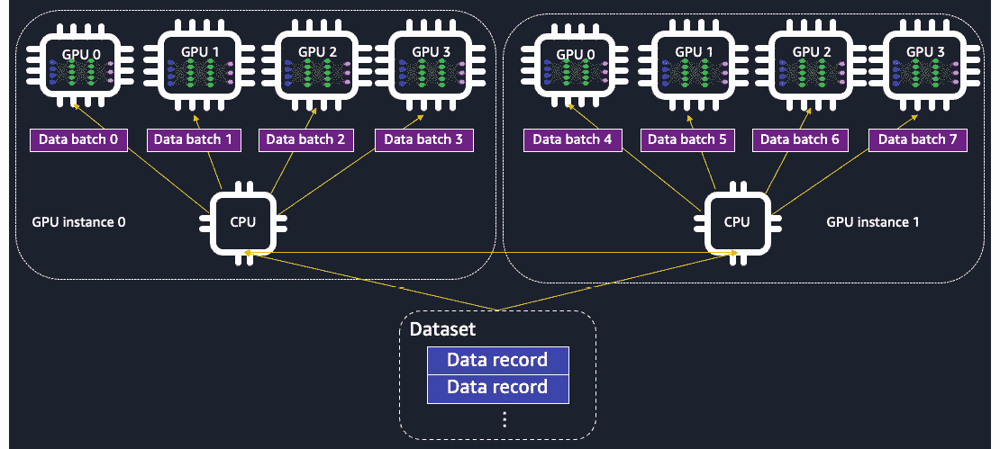
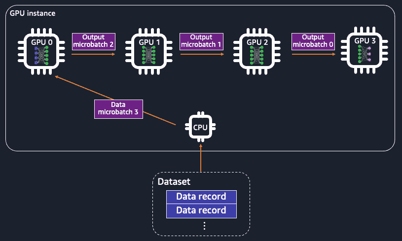
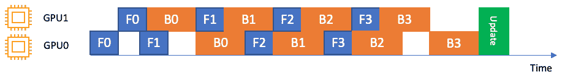
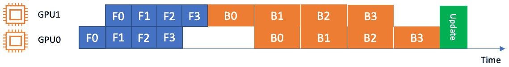
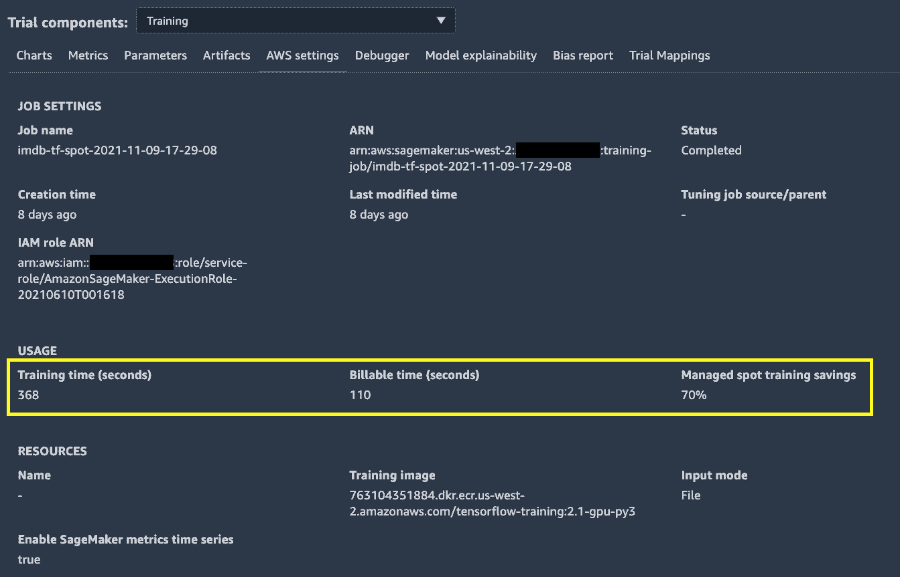

# *第九章*：在 SageMaker Studio 中大规模训练机器学习模型

一个典型的机器学习生命周期从原型设计开始，将过渡到生产规模，数据量增大，模型变得更加复杂，运行环境也更加复杂。完成训练作业需要正确的一套工具。使用多台计算机进行分布式训练以分担负载，可以解决涉及大量数据集和大型模型的情况。然而，随着复杂的机器学习训练作业使用更多的计算资源，以及更昂贵的硬件基础设施（如**图形处理单元**（**GPU**）），对于数据科学家和机器学习工程师来说，能够在大量数据上有效地训练复杂的机器学习模型非常重要。能够查看和监控训练脚本如何与数据和计算实例交互，对于优化训练脚本中的模型训练策略，使其既节省时间又节省成本至关重要。当在大规模训练时谈到成本，您知道您可以在 SageMaker 中轻松地节省超过 70%的费用吗？SageMaker Studio 使得大规模训练机器学习模型变得更加容易且成本效益更高。

在本章中，我们将学习以下内容：

+   在 SageMaker Studio 中执行分布式训练

+   使用 SageMaker Debugger 监控模型训练和计算资源

+   使用检查点和 spot 训练管理长时间运行的作业

# 技术要求

对于本章，您需要访问提供的代码，链接为[`github.com/PacktPublishing/Getting-Started-with-Amazon-SageMaker-Studio/tree/main/chapter09`](https://github.com/PacktPublishing/Getting-Started-with-Amazon-SageMaker-Studio/tree/main/chapter09)。

# 在 SageMaker Studio 中执行分布式训练

随着深度学习领域的进步，机器学习模型和训练数据增长到一个点，单个设备已不再足以进行有效的模型训练。神经网络变得越来越深，训练参数也越来越多：

+   **LeNet-5**，这是 1989 年提出的第一个**卷积神经网络**（**CNN**）模型之一，使用了 2 个卷积层和 3 个密集层，大约有 6 万个可训练参数。

+   **AlexNet**，这是一种在 2012 年提出的具有 5 层卷积层和 3 个密集层的更深层 CNN 架构，大约有 6200 万个可训练参数。

+   **双向 Transformer 语言理解模型**（**BERT**），这是一种在 2018 年提出的基于 transformer 的语言表示模型，其基础模型和大模型分别有 1.1 亿和 3.4 亿可训练参数。

+   **生成式预训练 Transformer 2**（**GPT-2**），这是一种在 2019 年提出的基于大型 transformer 的生成模型，拥有 15 亿可训练参数。

+   **GPT-3**是下一个版本，于 2020 年提出，其可训练参数达到 1750 亿。

有更多参数需要训练意味着在训练期间有更大的内存占用。此外，适应复杂模型所需训练数据的大小也显著增加。对于计算机视觉，最常用的训练数据集之一 ImageNet 有 120 万张图片。例如，对于**自然语言处理**（**NLP**），GPT-3 的训练使用了 4990 亿个标记。

然而，最新的最强大的 GPU 设备在满足这样的训练需求时仍会感到吃力。来自 NVIDIA 的最新 GPU 设备，AWS P4d.24xlarge 实例上的 A100 Tensor Core GPU，有 40GB 的 GPU 内存，但它不足以容纳拥有 1750 亿个参数的 GPT-3 模型，因为这样的网络在使用*FP32*精度时需要*175 x 10⁹ x 4 bytes = 700GB*。因此，开发者正在超越单 GPU 设备训练，并求助于分布式训练——即使用多个 GPU 设备和多个计算实例进行训练。

让我们了解为什么以及如何分布式训练有助于。

## 理解分布式训练的概念

在机器学习模型训练中，训练数据被输入到损失优化过程中，以计算下一步的梯度和权重。当数据和相关参数很大，如深度学习的情况时，由于设备上的 GPU 内存限制，拥有一个适合优化的完整数据集变得不太可行。通常使用**随机梯度下降优化**方法，该方法在每一步中用完整训练数据集的子集（**批大小**）估计梯度，以克服 GPU 内存限制。然而，当模型或每个数据点太大，以至于无法为模型训练提供一个有意义的批大小时，我们无法在合理的时间内收敛到一个最优、准确的模型。

分布式训练是一种将计算的部分分布到多个 GPU 设备和多个计算实例（也称为节点）的实践，并在进行下一次迭代之前同步所有设备的计算。分布式训练中有两种策略：**数据并行**和**模型并行**。

数据并行在训练周期中将训练数据集从磁盘分布到多个设备和实例，每个设备包含数据的一部分和模型的*完整副本*。每个节点使用不同的数据批次执行正向和反向传播，并在传播结束时与其他节点共享可训练权重的更新以进行同步。使用数据并行，你可以将批大小增加*n*倍，其中*n*是节点间 GPU 设备的数量。一个适当大的批大小在估计梯度期间允许更好的泛化，并且也减少了运行整个传播（**一个周期**）所需的步骤数量。

注意

实践中观察到，过大的批次大小会损害模型的质量和泛化能力。这取决于模型和数据集，需要实验和调整来找到合适的批次大小。

数据并行在*图 9.1*中展示：



![img/B17447_09_001.jpg]

图 9.1 – 在数据并行中，训练数据被分布到 GPU 设备上。模型的完整副本放置在每个 GPU 设备上

另一方面，模型并行将大型模型分布到节点上。模型的分割在层和权重级别上进行。每个节点拥有模型的一部分。前向和反向传播作为一个流水线进行，数据批次在所有节点上的模型分割中通过，然后在权重更新之前。更具体地说，每个数据批次被分成微批次，并输入到每个模型部分，这些部分位于用于前向和反向传播的设备上。使用模型并行，你可以更有效地训练需要比单个 GPU 设备更高的 GPU 内存占用的大型模型，通过从多个 GPU 设备中集体使用内存。模型并行在*图 9.2*中展示：



![img/B17447_09_002.jpg]

图 9.2 – 在模型并行中，模型被分割到多个 GPU 设备上。训练数据被分成微批次并输入到 GPU 中，每个 GPU 拥有模型的一部分作为流水线

*我们应该在什么情况下使用数据并行或模型并行？* 这取决于训练中的数据大小、批次和模型大小。当单个数据点太大，在训练期间无法达到期望的批次大小时，数据并行是合适的。小批次大小的直接权衡是完成一个 epoch 需要更长的时间。你可能希望增加批次大小，以便在合理的时间内完成一个 epoch。你可以使用数据并行将更大的批次大小分布到多个 GPU 设备上。然而，如果你的模型很大，并且在一个设备上占据了大部分 GPU 内存，你将不会从数据并行中获得太多的规模效益。这是因为，在数据并行中，ML 模型被完全复制到每个 GPU 设备上，留给数据的空间很少。当你的模型相对于 GPU 内存很大时，你应该使用模型并行。

SageMaker 使得在云中运行大型数据集和大型模型的分布式训练变得简单。当在 SageMaker 中使用时，SageMaker 的 **分布式训练库** 支持数据并行和模型并行，适用于最流行的两个深度学习框架，**TensorFlow** 和 **PyTorch**。SageMaker 的 **分布式数据并行库** 以接近线性的扩展效率扩展您的模型训练，这意味着与节点数量相关的训练时间减少接近线性。SageMaker 的 **分布式模型并行库** 自动分析您的神经网络架构，并将模型分割到 GPU 设备上，并高效地编排管道执行。

在以下章节中，我们将学习如何在 SageMaker Studio 中实现数据并行和模型并行，适用于我们用 TensorFlow 和 PyTorch 编写的训练脚本。

注意

TensorFlow 和 PyTorch 都由两个分布式训练库支持。这两个深度学习框架之间的分布式训练概念是相同的。我们将重点关注 TensorFlow 的数据并行库和 PyTorch 的模型并行库。

## TensorFlow 的数据并行库

SageMaker 的分布式数据并行库实现了类似于 TensorFlow 以分布式方式执行模型训练的简单 API，但进行了针对 AWS 计算基础设施优化的分布式训练。这意味着您可以在不修改现有用 TensorFlow 编写的分布式训练代码的情况下轻松采用 SageMaker 的 API。如果您这是第一次进行分布式模型训练，我们将演示如何修改以适应 SageMaker 的分布式数据并行库到现有的模型训练脚本。

让我们去 SageMaker Studio 并开始使用 `Getting-Started-with-Amazon-SageMaker-Studio/chapter09/01-smdp_tensorflow_sentiment_analysis.ipynb` 笔记本。这个示例是基于我们在 *第五章*，*使用 SageMaker Studio IDE 构建和训练 ML 模型*中走过的训练示例构建的，在那里我们使用 TensorFlow Keras API 在 IMDB 评论数据集上训练了一个深度学习模型。回到 *第五章*，*使用 SageMaker Studio IDE 构建和训练 ML 模型*，我们在一个 `ml.p3.2xlarge` 实例上运行了训练脚本，该实例只有一个 NVIDIA Tesla V100 GPU。现在，在本章中，我们将使用 SageMaker 的分布式数据并行库来扩展代码，使其能够与多个 GPU 设备一起工作，无论是来自单个实例还是多个实例。记住，我们总可以在 `sagemaker.tensorflow.TensorFlow` 估算器中轻松指定实例数量和实例类型。让我们打开笔记本，选择 `%%writefile code/smdp_tensorflow_sentiment.py`，这是修改以采用分布式训练脚本的地方。按照以下步骤查看需要进行的更改，以启用分布式数据并行库：

1.  首先，导入数据并行库的 TensorFlow 模块：

    ```py
    import smdistributed.dataparallel.tensorflow as sdp
    ```

1.  在导入库之后，我们需要初始化 SageMaker 分布式数据并行库以便在运行时使用。我们可以在 `import` 语句之后或 `main` 函数（`if __name__ == "__main__"`）中实现它：

    ```py
    sdp.init()
    ```

1.  然后，我们发现了计算实例集群中所有可用的 GPU 设备，并配置了 GPU，使它们了解实例内的排名。如果一个实例有八个 GPU 设备，每个设备都将被分配一个从零到七的排名。可以这样理解：每个 GPU 设备都会建立一个进程来运行脚本，并通过 `sdp.local_rank()` 获得一个唯一的排名：

    ```py
    gpus = tf.config.experimental.list_physical_devices('GPU')
    if gpus:
        local_gpu = gpus[sdp.local_rank()]
        tf.config.experimental.set_visible_devices(local_gpu, 'GPU')
    ```

1.  我们还配置了 GPU 以允许内存增长。这是在运行 TensorFlow 与 SageMaker 分布式数据并行库时特有的：

    ```py
    for gpu in gpus:
        tf.config.experimental.set_memory_growth(gpu, True)
    ```

计算环境现在已准备好执行分布式训练。

1.  我们通过设备数量来缩放学习率。由于数据并行，我们将能够适应更大的批量大小。随着批量大小的增加，建议按比例缩放学习率：

    ```py
    args.learning_rate = args.learning_rate * sdp.size()
    ```

1.  在之前的*第五章*，“使用 SageMaker Studio IDE 构建和训练 ML 模型”中，我们使用 Keras 的`model.fit()` API 训练了模型，但我们必须对模型训练做一些修改。SageMaker 的分布式数据并行库尚不支持 Keras 的`.fit()` API，只与 TensorFlow 核心模块一起工作。要使用 SageMaker 的分布式数据并行库，我们可以使用 TensorFlow 2.x 的自动微分（`tf.GradientTape`）和急切执行。在`get_model()`函数中使用 Keras 层定义模型后，我们不再用优化器编译它，而是用`loss`函数、优化器和显式定义的准确率度量来明确编写正向和反向传递：

    ```py
    model = get_model(args)
    loss = tf.losses.BinaryCrossentropy(name = 'binary_crossentropy')
    acc = tf.metrics.BinaryAccuracy(name = 'accuracy')
    optimizer = tf.optimizers.Adam(learning_rate = args.learning_rate)
    with tf.GradientTape() as tape:
        probs = model(x_train, training=True)
        loss_value = loss(y_train, probs)
        acc_value = acc(y_train, probs)
    ```

然后，我们将`tf.GradientTape`包装在 SMDataParallel 的`DistributedGradientTape`中，以优化多 GPU 训练期间的`AllReduce`操作。`AllReduce`是一个将所有分布式进程的矩阵进行归约的操作：

```py
tape = sdp.DistributedGradientTape(tape, sparse_as_dense = True)
```

注意，`sparse_as_dense`参数设置为`True`，因为我们模型中有一个嵌入层，它将生成稀疏矩阵。

1.  在训练开始时，从主节点（`rank 0`）广播初始模型变量到所有其他工作节点（`rank 1`及以后）。我们使用`first_batch`变量表示训练 epoch 的开始：

    ```py
    if first_batch:
        sdp.broadcast_variables(model.variables, root_rank=0)
        sdp.broadcast_variables(optimizer.variables(), root_rank=0)
    ```

1.  在设备间平均损失和准确率；这个过程称为**all-reduce**：

    ```py
    loss_value = sdp.oob_allreduce(loss_value)
    acc_value = sdp.oob_allreduce(acc_value)
    ```

1.  将这些步骤放入`training_step()`函数中，以执行正向和反向传递，并用`@tf.function`装饰。在嵌套的`for`循环中运行此训练步骤，遍历训练数据的 epoch 和批次。我们需要确保在传递过程中所有 GPU 设备都获得相等的数据量。我们通过在内层`for`循环中取可被 GPU 设备总数整除的数据来实现这一点：

    ```py
    train_dataset.take(len(train_dataset)//sdp.size())
    ```

1.  在训练`epoch`循环之后，我们只使用主设备保存模型：

    ```py
    if sdp.rank() == 0:
        model.save(os.path.join(args.model_dir, '1'))
    ```

1.  在训练脚本中，最后但同样重要的是，我们将训练数据转换为`tf.data.Dataset`对象，并在`get_train_data()`函数中设置批处理，以便与我们的急切执行实现一起工作。请注意，我们需要`drop_remainder`来防止数据集在设备间具有相等的批处理大小：

    ```py
    dataset = tf.data.Dataset.from_tensor_slices((x_train, y_train))
    dataset = dataset.batch(batch_size, drop_remainder=True)
    ```

1.  然后，我们转向 SageMaker 的 TensorFlow 估算器构建。为了在训练作业中启用 SageMaker 分布式数据并行库，我们需要提供一个字典：

    ```py
    distribution = {'smdistributed': {'dataparallel': {'enabled': True}}}
    ```

这被分配给估算器，如下所示。

```py
train_instance_type = 'ml.p3.16xlarge'
estimator = TensorFlow(source_dir='code',
     entry_point='smdp_tensorflow_sentiment.py',
     ...
     distribution=distribution)
```

此外，我们还需要从以下实例类型中选择一个支持 SageMaker 分布式数据并行库的 SageMaker 实例：**ml.p4d.24xlarge**、**ml.p3dn.24xlarge**和**ml.p3.16xlarge**：

1.  `ml.p4d.24xlarge`实例配备了 8 个 NVIDIA A100 Tensor Core GPU，每个 GPU 拥有 40 GB 的 GPU 内存。

1.  `ml.p3dn.24xlarge`实例配备了 8 个 NVIDIA Tesla V100 GPU，每个 GPU 拥有 32 GB 的 GPU 内存。

1.  `ml.p3.16xlarge`实例还配备了 8 个 NVIDIA Tesla V100 GPU，每个 GPU 具有 16 GB 的 GPU 内存。

为了演示目的，我们将选择 ml.p3.16xlarge，这是三种选项中最便宜的一个。一个单独的 ml.p3.16xlarge 就足以在 SageMaker 中运行分布式数据并行训练，因为将有 8 个 GPU 设备来执行训练。

由于有更多的 GPU 设备和 GPU 内存可以在一个 epoch 中进行批处理，我们现在可以增加`batch_size`。我们将`batch_size`从我们在*第五章*中使用的值扩大了 8 倍，即*64 x 8 = 512*。

1.  使用估计器，我们可以继续调用`estimator.fit()`来开始训练。

要验证训练是否在多个 GPU 设备上运行，最简单的方法是查看标准输出。您可以看到添加了前缀`[x, y]<stdout>: message`，以指示产生消息的进程等级，如图*9.3*所示。我们将在*使用 SageMaker Debugger 监控模型训练和计算资源*部分中了解更多关于这个主题的内容：

![图 9.3 – 单元的标准输出，显示从进程等级[1,0]到[1,7]打印的消息。在我们的示例中，我们使用了一个具有八个 GPU 设备的 ml.p3.16xlarge 实例

](img/B17447_09_003.jpg)

图 9.3 – 单元的标准输出，显示从进程等级[1,0]到[1,7]打印的消息。在我们的示例中，我们使用了一个具有八个 GPU 设备的 ml.p3.16xlarge 实例

尽管在这里我没有使用 PyTorch 来演示 SageMaker 的分布式数据并行库，但 PyTorch 确实在`smdistributed.dataparallel.torch`模块下得到了库的支持。此模块提供了一套与 PyTorch 原生分布式数据并行库相似的 API。这意味着您不需要进行很多编码更改，就可以将 SageMaker 的分布式数据并行库用于 PyTorch，该库针对使用 SageMaker 基础设施的训练进行了优化。您可以在[`docs.aws.amazon.com/sagemaker/latest/dg/data-parallel-modify-sdp-pt.html`](https://docs.aws.amazon.com/sagemaker/latest/dg/data-parallel-modify-sdp-pt.html)上找到有关如何在 PyTorch 脚本中采用它的更多详细信息。

在下一节中，我们将运行一个 PyTorch 示例并采用模型并行性。

## PyTorch 的模型并行性

模型并行性在您有一个大型网络模型且无法适应单个 GPU 设备内存时特别有用。SageMaker 的分布式模型并行库实现了两个功能，这些功能使得对大型模型的训练变得高效，因此您可以轻松地将库适配到现有的训练脚本中：

+   **自动模型分区**，这最大化了 GPU 利用率，平衡了内存占用，并最小化了 GPU 设备之间的通信。相比之下，您也可以使用库手动分区模型。

+   **流水线执行**，它决定了不同 GPU 设备上的模型不同部分之间的计算和数据移动的顺序。有两种流水线实现：**交错**和**简单**。交错流水线尽可能优先处理反向传递。它更有效地使用 GPU 内存，并最小化整个 GPU 设备队列中任何 GPU 设备的空闲时间，无需等待前向传递完成就开始反向传递，如图 9.4 所示：



图 9.4 – 在两个 GPU（GPU0 和 GPU1）上的交错流水线。F0 代表第一个微批次的正向传递，B1 代表第二个微批次的反向传递。尽可能优先处理反向传递

另一方面，简单的流水线会在开始反向传递之前等待前向传递完成，从而产生一个更简单的执行计划，如图 9.5 所示：



图 9.5 – 在两个 GPU 上的简单流水线。只有在前向传递完成后才会运行反向传递

注意

*图 9.4*和*9.5*中的图像来自：[`docs.aws.amazon.com/sagemaker/latest/dg/model-parallel-core-features.html`](https://docs.aws.amazon.com/sagemaker/latest/dg/model-parallel-core-features.html)

让我们从`chapter09/02-smmp-pytorch_mnist.ipynb`中的笔记本开始一个示例，我们将应用 SageMaker 的分布式模型并行库来训练一个 PyTorch 模型，使用著名的 MNIST 数字数据集对数字手写体进行分类。在 SageMaker Studio 中打开笔记本并使用`ml.t3.medium`实例：

1.  如同往常，在第一个单元中设置 SageMaker 会话并导入依赖项。

1.  然后，创建一个用 PyTorch 编写的模型训练脚本。这是一个新的训练脚本。本质上，它是在`torchvision`库的 MNIST 手写数字数据集上训练卷积神经网络模型。模型使用`torch.nn`模块定义。使用的优化器是 AdamW 优化算法。我们实现了训练周期和批处理，因为它允许我们最大限度地灵活地采用 SageMaker 的分布式模型并行库。

1.  SageMaker 的 PyTorch 分布式模型并行库可以从`smdistributed.modelparallel.torch`导入：

    ```py
    import smdistributed.modelparallel.torch as smp
    ```

1.  导入库后，初始化 SageMaker 分布式模型并行库以便在运行时使用。我们可以在导入语句之后或`main`（`if __name__ == "__main__"`）中实现它：

    ```py
    smp.init()
    ```

1.  我们将 ping 并设置 GPU 设备及其本地排名：

    ```py
    torch.cuda.set_device(smp.local_rank())
    device = torch.device('cuda')
    ```

1.  从`torchvision`下载数据的过程应该只在主节点（`local_rank` = `0`）上进行，而所有其他进程（在其他 GPU 上）应该等待主节点完成下载：

    ```py
    if smp.local_rank() == 0:
        dataset1 = datasets.MNIST('../data', train=True, 
                      download=True, transform=transform)        
    smp.barrier() # Wait for all processes to be ready
    ```

1.  然后，使用 SageMaker 的分布式模型并行库的实现来包装模型和优化器：

    ```py
    model = smp.DistributedModel(model)
    optimizer = smp.DistributedOptimizer(optimizer)
    ```

到目前为止，SageMaker 的分布式数据并行库和模型并行库之间的实现相当相似。以下是在模型并行库中有所不同之处。

1.  我们为函数的前向和反向传递创建一个`train_step()`，并用`@smp.step`装饰它：

    ```py
    @smp.step
    def train_step(model, data, target):
        output = model(data)
        loss = F.nll_loss(output, target, reduction='mean')
        model.backward(loss)
        return output, loss
    ```

创建另一个`train()`函数以在 epoch 内实现批处理。这是我们调用`train_step()`以对一批数据进行前向和反向传递的地方。重要的是，需要在`train_step()`之前放置与数据相关的`to.(device)`调用，而通常不需要`model.to(device)`。将模型放置到设备上是由库自动完成的。

在进入下一个批次之前，我们需要使用`.reduce_mean()`对微批次中的损失进行平均。此外，请注意`optimizer.step()`需要在`train_step()`外部执行：

```py
def train(model, device, train_loader, optimizer, epoch):
    model.train()
    for batch_idx, (data, target) in enumerate(train_loader):
        data, target = data.to(device), target.to(device)
        optimizer.zero_grad()
        _, loss_mb = train_step(model, data, target)
        # Average the loss across microbatches.
        loss = loss_mb.reduce_mean()
        optimizer.step()
```

1.  实现`test_step()`，用`@smp.step`装饰，并类似地为模型评估实现`test()`。这允许在模型评估中也实现模型并行。

1.  在 epochs 循环之后，使用`smp.dp_rank()==0`保存模型以避免数据竞争并确保正确收集。注意，如果我们想以后能够加载模型并进一步训练它，我们需要设置`partial=True`：

    ```py
    if smp.dp_rank() == 0:
        model_dict = model.local_state_dict()
        opt_dict = optimizer.local_state_dict()
        model = {'model_state_dict': model_dict, 'optimizer_state_dict': opt_dict}
        model_output_path = f'{args.model_dir}/pt_mnist_checkpoint.pt'
        smp.save(model, model_output_path, partial=True)
    ```

1.  然后，我们继续到 SageMaker PyTorch 估计器构建。为了在训练作业中启用 SageMaker 的分布式模型并行库，我们需要提供一个配置 SageMaker 的分布式模型并行库的字典，以及`'partitions': 2`以优化模型分区速度，`'optimize': 'speed'`，使用包含四个样本的微批处理`'microbatches': 4`，采用交错流水线调度（`'pipeline': 'interleaved'`），并禁用分布式数据并行`'ddp': False`。MPI 通过每个主机四个进程启用`'mpi':{'enabled': True, 'processes_per_host': 2}}`，这应该小于或等于 GPU 设备数量：

    ```py
    distribution = {'smdistributed': {
                        'modelparallel': {
                            'enabled': True,
                            'parameters': {
                                'partitions': 2,
                                 'optimize': 'speed',
                                'microbatches': 4,
                                'pipeline': 'interleaved',
                                'ddp': False
                            }
                        }
                    },
                    'mpi': {
                        'enabled': True,
                        'processes_per_host': 2
                    }
                }
    ```

你可以在[`sagemaker.readthedocs.io/en/stable/api/training/smd_model_parallel_general.html#smdistributed-parameters`](https://sagemaker.readthedocs.io/en/stable/api/training/smd_model_parallel_general.html#smdistributed-parameters)找到`distribution`的完整参数列表。

1.  然后，将`distribution`字典应用于 PyTorch 估计器，并使用一个 ml.p3.8xlarge 实例，该实例具有四个 NVIDIA Tesla V100 GPU。与 SageMaker 的分布式数据并行库不同，SageMaker 的分布式模型并行库支持所有具有多个 GPU 设备的实例。

1.  然后，我们可以继续调用`estimator.fit()`以开始训练。

采用 SageMaker 的分布式模型并行库的 TensorFlow 训练脚本采用了类似的概念，我们可以轻松地了解这些概念。你可以在[`docs.aws.amazon.com/sagemaker/latest/dg/model-parallel-customize-training-script-tf.html#model-parallel-customize-training-script-tf-23`](https://docs.aws.amazon.com/sagemaker/latest/dg/model-parallel-customize-training-script-tf.html#model-parallel-customize-training-script-tf-23)了解更多关于如何使用`smdistributed.modelparallel.tensorflow`模块的信息。

当使用多个 GPU 设备进行训练时，主要挑战之一是理解 GPU 资源是如何被利用的。在下一节中，我们将讨论 SageMaker Debugger，这是一个帮助我们分析 SageMaker 训练作业期间计算资源利用情况的特性。

# 使用 SageMaker Debugger 监控模型训练和计算资源

使用`sagemaker.estimator.Estimator`和相关类，如`sagemaker.pytorch.estimator.PyTorch`和`sagemaker.tensorflow.estimator.TensorFlow`进行 ML 模型训练，为我们提供了在 SageMaker Studio 中开发所需的灵活性和可扩展性。然而，由于使用了远程计算资源，与在本地机器或单个 EC2 机器上调试和监控训练作业相比，SageMaker Studio 笔记本上的调试和监控训练作业有很大的不同。作为一个 ML IDE，SageMaker Studio 通过**SageMaker Debugger**提供了对托管训练作业的全面视图。SageMaker Debugger 帮助开发者监控计算资源利用率，检测建模相关的问题，分析深度学习操作，并在训练作业运行时识别瓶颈。

SageMaker Debugger 支持 TensorFlow、PyTorch、MXNet 和 XGBoost。默认情况下，SageMaker Debugger 在每一个 SageMaker 估计器中都是启用的。它每 500 毫秒收集实例指标，如 GPU、CPU 和内存利用率，每 500 步收集基本的张量输出，如损失和准确率。数据保存在你的 S3 桶中。你可以在 SageMaker Studio IDE 中实时检查监控结果或作业完成后进行检查。你还可以将监控结果从 S3 检索到笔记本中，并运行额外的分析和自定义可视化。如果默认设置不够用，你可以通过编程方式配置 SageMaker Debugger，为你的`Estimator`获取所需的信息级别。

要开始，我们可以首先检查我们在`Machine-Learning-Development-with-Amazon-SageMaker-Studio/chapter09/01-smdp_tensorflow_sentiment_analysis.ipynb`中运行的作业的默认 Debugger 配置信息：

1.  找到你已运行的作业名称。它在`jobname`变量中，形式为`imdb-smdp-tf-YYYY-mm-DD-HH-MM-SS`。你也可以在最后一个单元的输出中找到它。

1.  导航到`jobname`；双击条目。您将看到一个名为**训练**的试验组件，如图*图 9.6*所示。右键单击条目并选择**打开调试器以获取洞察**：

![图 9.6 – 从实验和试验中打开 SageMaker 调试器 UI

![img/B17447_09_006.jpg]

图 9.6 – 从实验和试验中打开 SageMaker 调试器 UI

1.  在主工作区域将弹出一个新窗口。该窗口将在几分钟内可用，因为 SageMaker Studio 正在启动一个专用实例来处理和渲染 UI 中的数据。这被称为**SageMaker 调试器洞察仪表板**。一旦可用，您可以在**概览**和**节点**选项卡中查看结果，如图*图 9.7*所示：

![图 9.7 – 显示训练过程中 CPU 和网络利用率的 SageMaker 调试器洞察仪表板

![img/B17447_09_007.jpg]

图 9.7 – 显示训练过程中 CPU 和网络利用率的 SageMaker 调试器洞察仪表板

在**节点**选项卡中，图表显示了 CPU、网络、GPU 和 GPU 内存的平均利用率。您可以将图表缩小到特定的 CPU 或 GPU，以查看设备之间是否存在不均匀的利用率，如图*图 9.8*所示。从这些图表中，我们可以得出以下结论：

+   平均 CPU 利用率在作业开始后大约 3 分钟达到峰值，约为 60%。这表明训练正在进行，CPU 端有大量活动来读取数据批次并将其输入到 GPU 设备中。

+   在八台设备上的平均 GPU 利用率在作业开始后大约 3 分钟达到峰值，约为 25%。同时，平均使用了大约 5%的 GPU 内存。这被认为是低 GPU 利用率，可能是由于与现在更大的计算能力相比，批次大小较小。

+   另一方面，在前 3 分钟内有一些网络利用率。这是 SageMaker 的完全管理训练从 S3 存储桶下载训练数据的时期：

![图 9.8 – 显示训练过程中 GPU 利用率的 SageMaker 调试器洞察仪表板

![img/B17447_09_008.jpg]

图 9.8 – 显示训练过程中 GPU 利用率的 SageMaker 调试器洞察仪表板

在页面底部，显示了一个 CPU/GPU 利用率的整体热图。作为练习，您可以随意打开在`Getting-Started-with-Amazon-SageMaker-Studio/chapter06/02-tensorflow_sentiment_analysis.ipynb`提交的训练作业的调试器，并比较单设备训练和分布式训练之间 CPU/GPU 利用率的差异。

接下来，我们将学习如何在 SageMaker Studio 中使用完全管理的 spot 训练降低训练 ML 模型的成本，以及如何为长时间运行的工作和 spot 工作创建检查点。

# 使用检查点和 spot 训练管理长时间运行的任务

在大规模上训练机器学习模型可能会很昂贵。即使在 SageMaker 的按需付费定价模型下，进行长时间运行的深度学习训练和使用多个昂贵的实例也会迅速增加成本。SageMaker 的完全托管式 spot 训练和检查点功能使我们能够轻松管理和恢复长时间运行的任务，帮助我们将训练实例的成本降低高达 90%，与按需实例相比。

SageMaker 管理的 Spot 训练使用了 Amazon EC2 的 spot 实例概念。EC2 的 spot 实例允许你以比常规按需实例低得多的成本利用 AWS 区域中任何未使用的实例容量。spot 实例更便宜，但可以在 AWS 上其他用户对实例有更高需求时被中断。SageMaker 管理的 spot 训练管理 spot 实例的使用，包括在 spot 实例再次可用时安全中断和及时恢复你的训练。

除了 spot 训练功能外，托管式检查点也是管理长时间运行任务的关键。在机器学习中，检查点是指在训练过程中保存的中间机器学习模型。数据科学家通常会创建检查点并跟踪每个时期内的最佳准确率。他们在进展过程中将准确率与最佳值进行比较，并使用具有最高准确率的检查点模型，而不是最后一个时期的模型。

如果数据科学家想要微调模型，他们也可以从任何特定的检查点恢复并继续训练。由于 SageMaker 使用容器在远程计算实例上训练模型，检查点被保存在容器中的本地目录中。SageMaker 会自动将检查点从本地存储桶上传到你的 S3 存储桶。你可以通过指定它们在 S3 中的位置轻松地在另一个训练作业中重用这些检查点。在 SageMaker 管理的 spot 训练的上下文中，你不需要担心在训练作业的中断和恢复时上传和下载检查点文件。SageMaker 会为我们处理这些。

让我们运行一个示例来看看事情是如何工作的。使用 **Python 3 (TensorFlow 2.3 Python 3.7 CPU Optimized**) 内核和 **ml.t3.medium** 实例打开 `Getting-Started-with-Amazon-SageMaker-Studio/chapter09/03-spot_training_checkpointing.ipynb`。在这个笔记本中，我们将重用我们在 *第五章* 中为 IMDB 评论数据集进行的 TensorFlow 模型训练，即 *使用 SageMaker Studio IDE 构建和训练机器学习模型*，并对代码进行一些修改以展示如何使用 SageMaker 启用检查点和托管式 spot 训练：

1.  运行前五个单元格以设置 SageMaker 会话，并准备数据集。如果你已经运行了第一个 `chapter09/01-smdp_tensorflow_sentiment_analysis.ipynb` 笔记本，数据集应该已经可用。

1.  在 `%%writefile code/tensorflow_sentiment_with_checkpoint.py` 这一行代码中，我们将对 TensorFlow/Keras 代码进行修改。首先，我们在 `parse_args()` 函数中添加了一个新的 `--checkpoint_dir` 参数，用于指定由 SageMaker 设置的默认 `/opt/ml/checkpoints` 位置。

1.  在 `__name__ == '__main__'` 中，我们将添加一个检查，以查看 `checkpoint_dir` 是否在容器中本地存在。如果存在，列出目录以查看是否存在任何现有的检查点文件：

    ```py
    if not os.listdir(args.checkpoint_dir):
        model = get_model(args)
        initial_epoch_number = 0
    else:    
        model, initial_epoch_number = load_model_from_checkpoints(args.checkpoint_dir)
    ```

如果 `checkpoint_dir` 不包含有效的检查点文件，这意味着没有先前的训练作业和附加到容器中的检查点，并且 `checkpoint_dir` 是为新模型训练而新创建的。如果它包含文件，这意味着之前的检查点文件被插入到这个训练作业中，并且应该作为 `load_model_from_checkpoints()` 函数中训练的起点。

1.  实现 `load_model_from_checkpoints()` 函数以列出给定目录中所有以 `.h5` 结尾的检查点文件，因为这是 Keras 保存模型的方式。使用 `re` 库中的 `regex` 来过滤文件名中的 epoch 数。然后我们可以识别出最新的检查点来加载，并使用这样的模型继续训练。我们假设在正则表达式操作中，epoch 数的范围是 `0` 到 `999`。

1.  在模型加载后，无论是新模型还是从检查点加载，在 Keras 中实现一个 `tf.keras.callbacks.ModelCheckpoint` 回调，以便在每个 epoch 后将模型检查点保存到 `args.checkpoint_dir`。

1.  在设置 `sagemaker.tensorflow.TensorFlow` 估算器时，向估算器提供以下附加参数：

    1.  `use_spot_instances`：一个布尔值，用于选择是否在训练中使用 SageMaker Spot 实例。

    1.  `max_wait`：当 `use_spot_instances` 为 `True` 时是必需的参数。这是一个等待 Spot 训练作业的超时时间（以秒为单位）。在此超时后，作业将被停止。

    1.  `checkpoint_s3_uri`：用于持久保存检查点文件的 S3 存储桶位置。如果你传递一个已经包含检查点模型的 S3 存储桶位置，并传递一个更高的 epoch 数，脚本将选择最新的检查点并继续训练。例如，通过提供 `checkpoint_s3_uri`，它包含来自之前 50 个 epoch 运行的检查点，以及一个 `epochs` 超参数为 60，我们的脚本将从第五十个检查点继续训练，再进行另外 10 个 epoch。

    1.  `max_run`：允许训练的最大运行时间（以秒为单位）。在此超时后，作业将被停止。此值需要小于或等于 `max_wait`。

下面的代码片段将构建一个估算器，用于使用托管 Spot 实例和检查点来训练模型：

```py
use_spot_instances = True
max_run = 3600
max_wait = 3600
checkpoint_suffix = str(uuid.uuid4())[:8]
checkpoint_s3_uri = f's3://{bucket}/{prefix}/checkpoint-{checkpoint_suffix}'
estimator = TensorFlow(use_spot_instances=use_spot_instances,
                       checkpoint_s3_uri=checkpoint_s3_uri,
                       max_run=max_run,
                       max_wait=max_wait,
                       ...)
```

1.  其余步骤保持不变。我们在调用 `.fit()` 开始训练作业之前，指定超参数、数据输入和实验配置。

1.  想知道使用即时实例能节省多少吗？从左侧边栏的**实验和试验**中，我们可以调出试验的 AWS 设置详情，如图*图 9.9*所示，仅通过使用托管即时训练实例就能看到**70%**的节省：



图 9.9 – 使用托管即时训练节省 70%，如试验详情所示

节省 70%是非常显著的。这对于需要昂贵的计算实例且具有长时间训练的大型模型训练用例特别有益。只需向估计器添加四个额外的参数以及在训练脚本中做一些更改，我们就能节省 70%。

# 摘要

在本章中，我们介绍了如何使用 SageMaker 分布式训练库来训练深度学习模型：数据并行和模型并行。我们运行了一个 TensorFlow 示例，展示了如何修改脚本以使用 SageMaker 的分布式数据并行库，使用八个 GPU 设备，而不是之前我们所学的一个。这使得我们能够增加批量大小并减少在整个数据集上迭代所需的迭代次数，从而提高模型训练的运行时间。然后我们展示了如何将 SageMaker 的分布式模型并行库适配到用 PyTorch 编写的模型训练中。这使得我们能够通过将大型模型分割到所有 GPU 设备上来训练一个更大的神经网络模型。我们还展示了如何使用 SageMaker Debugger 轻松监控训练作业中的计算资源利用率，并在 SageMaker Debugger 洞察仪表板中可视化指标。最后，我们解释了如何调整训练脚本以使用完全托管的即时训练和检查点来在 SageMaker 中训练模型时节省成本。

在下一章中，我们将转换方向，学习如何监控生产中的 ML 模型。在生产中，ML 模型对未见过的推理数据进行推理可能或可能不会产生预期的质量预测，这些预测是在部署之前进行的评估中得出的。在 ML 生命周期中设置监控策略以确保模型在令人满意的水平上运行是至关重要的。SageMaker Studio 具有帮助您轻松设置模型监控功能，以监控生产中的 ML 模型。我们将学习如何配置 SageMaker Model Monitor 以及如何将其作为我们 ML 生命周期的一部分来使用。
