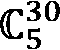

# *第一章*：评估机器学习模型

**机器学习**（**ML**）模型需要彻底评估以确保它们在生产环境中能够工作。我们必须确保模型不是在**记忆**训练数据，同时也确保模型从给定的训练数据中学习到足够的信息。当我们希望在以后阶段进行超参数调整时，选择合适的评估方法也是至关重要的。

在本章中，我们将了解评估机器学习模型时需要了解的所有重要事项。首先，我们需要理解过拟合的概念。然后，我们将探讨将数据拆分为训练集、验证集和测试集的想法。此外，我们还将了解随机拆分和分层拆分的区别以及何时使用每种拆分方法。

我们将讨论交叉验证的概念及其多种策略变体：k 折重复 k 折、**留一法**（**LOO**）、**留 P 法**（**LPO**），以及处理时间序列数据时的特定策略，称为时间序列交叉验证。我们还将学习如何使用 Scikit-Learn 包实现每种评估策略。

到本章结束时，你将很好地理解为什么选择合适的评估策略在机器学习模型开发生命周期中至关重要。此外，你将了解多种评估策略，并能够根据你的情况选择最合适的一种。此外，你还将能够使用 Scikit-Learn 包实现每种评估策略。

本章我们将涵盖以下主要内容：

+   理解过拟合的概念

+   创建训练集、验证集和测试集

+   探索随机和分层拆分

+   发现 k 折交叉验证

+   发现重复 k 折交叉验证

+   发现 LOO 交叉验证

+   发现 LPO 交叉验证

+   发现时间序列交叉验证

# 技术要求

我们将学习如何使用 Scikit-Learn 包实现每种评估策略。为了确保你能重现本章中的代码示例，你需要以下内容：

+   Python 3（版本 3.7 或以上）

+   安装 pandas 包（版本 1.3.4 或以上）

+   安装 Scikit-Learn 包（版本 1.0.1 或以上）

本章的所有代码示例都可以在 GitHub 上找到，链接为[`github.com/PacktPublishing/Hyperparameter-Tuning-with-Python/blob/main/01_Evaluating-Machine-Learning-Models.ipynb`](https://github.com/PacktPublishing/Hyperparameter-Tuning-with-Python/blob/main/01_Evaluating-Machine-Learning-Models.ipynb)。

# 理解过拟合的概念

**过拟合**发生在训练的机器学习模型从给定的训练数据中学习过多时。在这种情况下，训练模型在训练数据上成功获得高评估分数，但在新的、未见过的数据上分数远低。换句话说，训练的机器学习模型未能将训练数据中学习到的知识泛化到未见过的数据。

那么，训练的机器学习模型如何在训练数据上获得良好的性能，但在未见数据上却无法给出合理的性能呢？嗯，这发生在模型*过于努力*地试图在训练数据上获得高绩效，并吸收了仅适用于特定训练数据的知识。当然，这会负面影响模型的泛化能力，导致模型在未见数据上的评估表现不佳。

为了检测我们的训练机器学习模型是否面临过拟合问题，我们可以监控模型在训练数据与未见数据上的性能。性能可以定义为我们的模型损失值或我们关心的指标，例如准确率、精确度和平均绝对误差。如果训练数据的性能持续改善，而未见数据的性能开始变得停滞甚至变差，那么这就是过拟合问题的迹象（参见*图 1.1*）：


图 1.1 – 模型在训练数据与未见数据（过拟合）上的性能

注意

前面的图表图像是根据指定的许可证复制的：[`commons.wikimedia.org/wiki/File:Overfitting_svg.svg`](https://commons.wikimedia.org/wiki/File:Overfitting_svg.svg).

现在你已经了解了过拟合问题，我们需要学习如何在我们的机器学习开发生命周期中防止这种情况发生。我们将在接下来的章节中讨论这个问题。

# 创建训练、验证和测试集

我们知道可以通过监控模型在训练数据与未见数据上的性能来检测过拟合，但未见数据究竟是什么？它仅仅是模型在训练阶段尚未见过的随机数据吗？

未见数据是我们原始完整数据的一部分，在训练阶段模型没有看到这部分数据。我们通常将这部分未见数据称为**测试集**。让我们假设你一开始有 100,000 个数据样本；你可以取出其中的一部分，比如说 10%，作为测试集。因此，现在我们有 90,000 个样本作为训练集，10,000 个样本作为测试集。

然而，仅仅将我们的原始数据拆分为训练集和测试集还不够，还需要拆分为一个**验证集**，尤其是当我们想要对模型进行超参数调整时。假设我们有 100,000 个原始样本，我们将其中的 10%保留为验证集，另外 10%作为测试集。因此，我们将有 80,000 个样本作为训练集，10,000 个样本作为验证集，10,000 个样本作为测试集。

你可能想知道为什么我们除了测试集之外还需要验证集。实际上，如果我们不想进行超参数调整或其他**以模型为中心**的方法，我们不需要它。这是因为拥有验证集的目的是使用训练模型的最终版本对测试集进行无偏评估。

验证集可以帮助我们获得对测试集的无偏评估，因为我们只在超参数调整阶段包含验证集。一旦我们完成超参数调整阶段并得到最终的模型配置，我们就可以在纯未见过的新数据上评估我们的模型，这被称为测试集。

重要提示

如果你打算执行任何数据预处理步骤（例如，缺失值填充、特征工程、标准化、标签编码等），你必须基于训练集构建函数，然后将其应用于验证集和测试集。**不要**在数据拆分之前对完整原始数据进行数据预处理（即，在数据拆分之前）。这是因为这可能会导致**数据泄露**问题。

在选择训练集、验证集和测试集的比例时，并没有特定的规则。你必须根据你所面临的情况自行选择拆分比例。然而，数据科学社区常用的拆分比例是训练集 8:2 或 9:1，验证集和测试集分别为 8:2 或 9:1。通常，验证集和测试集的比例为 1:1。因此，常用的拆分比例是训练集 8:1:1 或 9:0.5:0.5，分别对应训练集、验证集和测试集。

既然我们已经了解了训练集、验证集和测试集的概念，我们需要学习如何构建这些集合。我们只是随机地将原始数据拆分为三个集合吗？或者我们也可以应用一些预定义的规则？在下一节中，我们将更详细地探讨这个话题。

# 探索随机和分层拆分

将我们的原始完整数据直接拆分为训练集、验证集和测试集的最直接方法（但并非完全正确的方法）是选择每个集合的比例，然后根据索引的顺序直接将它们拆分为三个集合。

例如，原始完整数据有 100,000 个样本，我们希望将其按 8:1:1 的比例分割成训练集、验证集和测试集。那么，训练集将是索引从 1 到 80,000 的样本。验证集和测试集将分别是索引从 81,000 到 90,000 和 91,000 到 100,000。

那么，这种方法有什么问题吗？只要原始完整数据被随机打乱，这种方法就没有问题。如果样本索引之间存在某种模式，可能会引起问题。

例如，我们拥有包含 10,000 个样本和 3 列的数据。第一列和第二列分别包含体重和身高信息。第三列包含“体重状态”类别（例如，体重不足、正常体重、超重和肥胖）。我们的任务是构建一个机器学习分类器模型，根据一个人的体重和身高预测其“体重状态”类别。如果数据是按照第三列排序给出的，这种情况并非不可能。因此，前 80,000 行只包含体重不足和正常体重类别。相比之下，超重和肥胖类别仅位于最后 20,000 行。如果这种情况发生，并且我们应用之前的数据分割逻辑，那么我们的分类器将无法预测一个新的人具有超重或肥胖的“体重状态”类别。为什么？因为我们的分类器在训练阶段从未见过这些类别！

因此，确保原始完整数据首先被随机打乱是非常重要的，本质上，这就是我们所说的随机分割。**随机分割**的工作原理是首先打乱原始完整数据，然后根据索引顺序将其分割成训练集、验证集和测试集。

还有一种称为**分层分割**的分割逻辑。这种逻辑确保训练集、验证集和测试集将获得与原始完整数据中每个目标类别相似的样本比例。

以相同的“体重状态”类别预测案例为例，假设我们发现全原始数据中每个类别的比例分别是体重不足 3:5:1.5:0.5、正常体重、超重和肥胖。分层分割逻辑将确保我们可以在训练集、验证集和测试集中找到这些类别的相似比例。因此，在 80,000 个训练样本中，大约有 24,000 个样本属于体重不足类别，大约有 40,000 个样本属于正常体重类别，大约有 12,000 个样本属于超重，大约有 4,000 个样本属于肥胖类别。这也会应用到验证集和测试集。

剩下的问题是理解 *何时是使用随机分割/分层分割逻辑的正确时机*。通常，当面临不平衡类别问题时，我们会使用分层分割逻辑。然而，当我们要确保基于特定变量（不一定必须是目标类别）具有相似样本比例时，分层分割也经常被使用。如果你没有遇到这种情况，那么随机分割就是你可以始终选择的逻辑。

要实现这两种数据分割逻辑，你可以从头开始编写代码，或者利用名为 **Scikit-Learn** 的知名包。以下是一个以 8:1:1 的比例执行随机分割的示例：

```py
from sklearn.model_selection import train_test_split
```

```py
df_train, df_unseen = train_test_split(df, test_size=0.2, random_state=0)
```

```py
df_val, df_test = train_test_split(df_unseen, test_size=0.5, random_state=0)
```

`df` 变量是我们存储在 Pandas DataFrame 对象中的完整原始数据。`train_test_split` 函数将 Pandas DataFrame、数组或矩阵分割成打乱的训练集和测试集。在第 2-3 行中，首先，我们根据 `test_size` 参数指定的比例 8:2 将原始完整数据分割成 `df_train` 和 `df_unseen`。然后，我们将 `df_unseen` 按比例 1:1 分割成 `df_val` 和 `df_test`。

要执行 *分层分割* 逻辑，你只需将 `stratify` 参数添加到 `train_test_split` 函数中，并用目标数组填充它：

```py
df_train, df_unseen = train_test_split(df, test_size=0.2, random_state=0, stratify=df['class'])
```

```py
df_val, df_test = train_test_split(df_unseen, test_size=0.5, random_state=0, stratify=df_unseen['class'])
```

`stratify` 参数将确保数据根据给定的目标数组以分层的方式进行分割。

在本节中，我们学习了在执行数据分割之前对原始完整数据进行洗牌的重要性，也理解了随机分割和分层分割之间的区别，以及何时使用每种分割。在下一节中，我们将开始学习数据分割策略的变体，以及如何使用 Scikit-learn 包实现每种策略。

探索 k 折交叉验证

**交叉验证**是一种通过在原始完整数据上执行多次评估来评估我们的机器学习模型的方法。这与我们在前几节中学到的标准训练-验证-测试分割有所不同。此外，随机分割和分层分割的概念也可以应用于交叉验证。

在交叉验证中，我们对训练集和验证集执行多次分割，其中每个分割通常被称为 **折**。那么测试集呢？嗯，它仍然作为纯未见过数据存在，我们可以用它来测试最终的模型配置。因此，在开始时，它只从训练集和验证集中分离一次。

交叉验证策略有几种变体。第一种被称为 **k 折交叉验证**。它通过在每个折中执行 k 次训练和评估，分别以 (k-1):1 的比例对训练集和验证集进行训练和评估来实现。为了更清楚地理解 k 折交叉验证，请参考 *图 1.2*：


图 1.2 – K 折交叉验证

注意

以下图表是根据指定的许可证复制的：[`commons.wikimedia.org/wiki/File:K-fold_cross_validation.jpg`](https://commons.wikimedia.org/wiki/File:K-fold_cross_validation.jpg)。

例如，让我们选择 k = 4 来匹配 *图 1.2* 中的插图。绿色和红色球对应于目标类别，在这种情况下，我们只有两个目标类别。数据在之前已经被打乱，这可以从绿色和红色球没有模式中看出。也值得提到的是，*打乱之前只进行了一次*。这就是为什么绿色和红色球的顺序在每次迭代（折）中总是相同的。每个折中的黑色框对应于验证集（测试数据在插图上）。

如您在 *图 1.2* 中所见，训练集与验证集的比例是 (k-1):1，或者在这个例子中，3:1。在每一折中，模型将在训练集上训练并在验证集上评估。请注意，训练集和验证集在每个折中都是 *不同的*。最终评估分数可以通过取所有折的平均分数来计算。

总结来说，k 折交叉验证的工作原理如下：

1.  打乱原始完整数据。

1.  保留测试数据

1.  在原始完整数据集的其余部分执行 k 折多次评估策略。

1.  通过取所有折的平均分数来计算最终评估分数。

1.  使用最终模型配置评估测试数据。

您可能会问，为什么我们最初需要进行交叉验证？为什么传统的训练-验证-测试分割策略不够用？我们需要应用交叉验证策略有几个原因：

+   只有少量训练数据。

+   为了从评估性能中获得更自信的结论。

+   为了更清晰地了解我们模型的学习能力以及/或给定数据的复杂性。

前两个原因是相当直接的。第三个原因更有趣，应该进行讨论。交叉验证如何帮助我们更好地了解模型的学习能力以及/或数据复杂性？好吧，这发生在每个折的评估分数变化相当大的时候。例如，在 4 个折中，我们得到了准确率分数 45%、82%、64% 和 98%。这种情况应该激发我们的好奇心：我们的模型和数据有什么问题？可能是数据太难学习，或者我们的模型不能正确学习。

以下是通过 Scikit-Learn 包执行 k 折交叉验证的语法：

```py
From sklearn.model_selection import train_test_split, Kfold
```

```py
df_cv, df_test = train_test_split(df, test_size=0.2, random_state=0)
```

```py
kf = Kfold(n_splits=4)
```

```py
for train_index, val_index in kf.split(df_cv):
```

```py
df_train, df_val = df_cv.iloc[train_index], df_cv.iloc[val_index]
```

```py
#perform training or hyperparameter tuning here
```

注意，首先，我们在进行 k 折交叉验证时保留测试集，并且只使用`df_cv`。默认情况下，`Kfold`函数将禁用洗牌过程。然而，这对我们来说不是问题，因为我们调用`train_test_split`函数时数据已经预先洗牌了。如果你想再次运行洗牌过程，可以在`Kfold`函数中传递`shuffle=True`。

如果你感兴趣学习如何在 k 折交叉验证中应用分层分割的概念，这里有一个例子：

```py
From sklearn.model_selection import train_test_split, StratifiedKFold
```

```py
df_cv, df_test = train_test_split(df, test_size=0.2, random_state=0, stratify=df['class'])
```

```py
skf = StratifiedKFold(n_splits=4)
```

```py
for train_index, val_index in skf.split(df_cv, df_cv['class']):
```

```py
df_train, df_val = df_cv.iloc[train_index], df_cv.iloc[val_index]
```

```py
#perform training or hyperparameter tuning here
```

唯一的区别是导入`StratifiedKFold`而不是`Kfold`函数，并添加目标变量的数组，这将用于以分层的方式分割数据。

在本节中，你学习了什么是交叉验证，何时是进行交叉验证的正确时机，以及第一个（也是*最广泛使用*）的交叉验证策略变体，即 k 折交叉验证。在随后的章节中，我们还将学习其他交叉验证的变体以及如何使用 Scikit-Learn 包实现它们。

# 发现重复 k 折交叉验证

**重复 k 折交叉验证**涉及简单地重复执行 k 折交叉验证，*N*次，每次重复都有不同的随机化。最终的评估分数是所有重复中所有折的分数的平均值。这种策略将增加我们对模型自信。

那么，为什么重复 k 折交叉验证呢？为什么我们不直接增加 k 的值呢？当然，增加 k 的值将减少模型估计性能的偏差。然而，增加 k 的值会增加变异，尤其是在样本数量较少的情况下。因此，通常重复 k 折是获得对模型估计性能更高自信的更好方法。当然，这也伴随着一个缺点，那就是计算时间的增加。

要实现这一策略，我们可以简单地执行一个手动循环，在每次循环中应用 k 折交叉验证策略。幸运的是，Scikit-Learn 包为我们提供了一个特定的函数来实现这一策略：

```py
from sklearn.model_selection import train_test_split, RepeatedKFold
```

```py
df_cv, df_test = train_test_split(df, test_size=0.2, random_state=0)
```

```py
rkf = RepeatedKFold(n_splits=4, n_repeats=3, random_state=0)
```

```py
for train_index, val_index in rkf.split(df_cv):
```

```py
df_train, df_val = df_cv.iloc[train_index], df_cv.iloc[val_index]
```

```py
#perform training or hyperparameter tuning here
```

选择`n_splits=4`和`n_repeats=3`意味着我们将有 12 个不同的训练和验证集。最终的评估分数就是这 12 个分数的平均值。正如你所预期的，也有一个专门的功能来实现分层重复 k 折：

```py
from sklearn.model_selection import train_test_split, RepeatedStratifiedKFold
```

```py
df_cv, df_test = train_test_split(df, test_size=0.2, random_state=0, stratify=df['class'])
```

```py
rskf = RepeatedStratifiedKFold(n_splits=4, n_repeats=3, random_state=0)
```

```py
for train_index, val_index in rskf.split(df_cv, df_cv['class']):
```

```py
df_train, df_val = df_cv.iloc[train_index], df_cv.iloc[val_index]
```

```py
#perform training or hyperparameter tuning here
```

`RepeatedStratifiedKFold`函数将重复执行分层 k 折交叉验证，`n_repeats`次。

现在你已经学习了另一种交叉验证策略的变体，称为重复 k 折交叉验证，接下来让我们了解其他变体。

# 发现留一法交叉验证

实际上，**Leave One Out (LOO)交叉验证**只是 k-fold 交叉验证，其中 k = n，n 是样本数量。这意味着每个折叠中有 n-1 个样本用于训练集，1 个样本用于验证集（见*图 1.3*）。毫无疑问，这是一个非常*计算密集型*的策略，并将导致*非常高的方差*评估分数估计器：


图 1.3 – LOO 交叉验证

因此，何时选择 LOO 而不是 k-fold 交叉验证？嗯，当数据集非常小的时候，LOO 效果最好。如果你更倾向于模型性能估计的高置信度而不是计算成本的限制，那么选择 LOO 比 k-fold 更好。

从头开始实现这种策略实际上非常简单。我们只需要遍历数据的每个索引并进行一些数据处理。然而，Scikit-Learn 包也提供了 LOO 的实现，我们可以使用它：

```py
from sklearn.model_selection import train_test_split, LeaveOneOut
```

```py
df_cv, df_test = train_test_split(df, test_size=0.2, random_state=0)
```

```py
loo = LeaveOneOut()
```

```py
for train_index, val_index in loo.split(df_cv):
```

```py
df_train, df_val = df_cv.iloc[train_index], df_cv.iloc[val_index]
```

```py
#perform training or hyperparameter tuning here
```

注意，在`LeaveOneOut`函数中没有提供任何参数，因为这种策略非常直接，不涉及任何随机过程。也没有 LPO 的分层版本，因为验证集将始终包含一个样本。

既然你已经了解了 LOO 的概念，在下一节中，我们将学习 LOO 的轻微变化。

# 发现 LPO 交叉验证

**LPO 交叉验证**是 LOO 交叉验证策略的一种变体，其中每个折叠的验证集包含*p*个样本，而不是仅包含 1 个样本。类似于 LOO，这种策略将确保我们得到所有可能的训练-验证对组合。更精确地说，如果有*n*个样本在我们的数据中，将会有个折叠。例如，如果我们想在有 50 个样本的数据上执行 Leave-5-Out 交叉验证，将会有或 142,506 个折叠。

当样本数量较少且希望比 LOO 方法获得更高的模型估计性能置信度时，LPO 是合适的。当样本数量较多时，LPO 将导致折叠数量激增。

这种策略在验证集之间的重叠方面与 k-fold 或 LOO 略有不同。对于 P > 1，LPO 将导致重叠的验证集，而 k-fold 和 LOO 将始终导致非重叠的验证集。此外，请注意，LPO 与 k-fold 不同，因为当 K = N // P 时，k-fold 将始终创建非重叠的验证集，但 LPO 策略则不是这样：

```py
from sklearn.model_selection import train_test_split, LeavePOut
```

```py
df_cv, df_test = train_test_split(df, test_size=0.2, random_state=0)
```

```py
lpo = LeavePOut(p=2)
```

```py
for train_index, val_index in lpo.split(df_cv):
```

```py
df_train, df_val = df_cv.iloc[train_index], df_cv.iloc[val_index]
```

```py
#perform training or hyperparameter tuning here
```

与 LOO 不同，我们必须为 LPO 提供`p`参数，它指的是 LPO 中的 p 值。

在本节中，我们学习了 LOO 交叉验证策略的变体。在下一节中，我们将学习如何在时间序列数据上执行交叉验证。

# 发现时间序列交叉验证

**时间序列**数据在本质上具有独特的特征。与假设为**独立同分布**（**IID**）的“正常”数据不同，时间序列数据不遵循这一假设。实际上，每个样本都依赖于前面的样本，这意味着改变样本的顺序会导致不同的数据解释。

以下列出了几个时间序列数据的示例：

+   每日股市价格

+   每小时温度数据

+   每分钟网页点击次数

如果我们将之前的交叉验证策略（例如，k-fold、随机或分层拆分）应用于时间序列数据，将会出现**前瞻偏差**。前瞻偏差发生在我们使用数据当前模拟时间点后未来的值时。

例如，我们正在处理每小时温度数据。我们想要预测 2 小时后的温度，但我们使用的是下一小时或下一 3 小时的温度值，这本来应该是不可用的。如果我们应用之前的交叉验证策略，这种偏差很容易发生，因为那些策略仅设计在 IID 分布上良好工作。

**时间序列交叉验证**是一种专门为处理时间序列数据而设计的交叉验证策略。它在接受折叠的预定义值方面与 k-fold 类似，然后生成 k 个测试集。不同之处在于，*数据*在最初*并未打乱*，下一个迭代的训练集是前一个迭代的*超集*，这意味着训练集在迭代次数增加的过程中会不断变大。一旦我们完成了交叉验证并获得了最终的模型配置，我们就可以在测试数据上测试我们的最终模型（见*图 1.4*）：


图 1.4 – 时间序列交叉验证

此外，Scikit-Learn 包为我们提供了一个很好的策略实现：

```py
from sklearn.model_selection import train_test_split, TimeSeriesSplit
```

```py
df_cv, df_test = train_test_split(df, test_size=0.2, random_state=0, shuffle=False)
```

```py
tscv = TimeSeriesSplit(n_splits=5)
```

```py
for train_index, val_index in tscv.split(df_cv):
```

```py
df_train, df_val = df_cv.iloc[train_index], df_cv.iloc[val_index]
```

```py
#perform training or hyperparameter tuning here
```

提供 n_splits=5 将确保生成五个测试集。值得注意的是，默认情况下，训练集将为第 i 个折叠的大小为，而测试集将为的大小。

然而，您可以通过`TimeSeriesSplit`函数的`max_train_size`和`test_size`参数来更改训练集和测试集的大小。此外，还有一个`gap`参数可以被利用来排除每个训练集末尾的 G 个样本，其中 G 是开发者需要指定的值。

您需要意识到，Scikit-Learn 的实现将始终确保*测试集之间没有重叠*，这实际上并不是必要的。目前，使用 Scikit-Learn 实现无法启用测试集之间的重叠。您需要*从头编写代码*来执行这种策略。

在本节中，我们学习了时间序列数据的独特特征以及如何对其执行交叉验证策略。本书中未涵盖交叉验证策略的其他变体。如果您感兴趣，您可能会在*进一步阅读*部分找到一些线索。

# 摘要

在本章中，我们学习了许多关于如何正确评估机器学习模型的重要知识。从过拟合的概念出发，探讨了多种数据拆分策略，以及如何根据具体情况选择最佳的数据拆分策略，以及如何使用 Scikit-Learn 包实现这些策略。理解这些概念非常重要，因为如果不应用适当的数据拆分策略，您无法进行良好的超参数调整过程。

在下一章中，我们将讨论超参数调整。我们将不仅讨论定义，还会讨论一些误解和超参数分布的类型。

# 进一步阅读

在本章中，我们涵盖了众多主题。然而，由于本书的范畴限制，仍有许多与交叉验证相关的有趣算法未被涉及。如果您想了解更多关于这些算法以及每个算法的实现细节，可以参考 Scikit-Learn 作者创建的这篇精彩的页面：[`scikit-learn.org/stable/modules/cross_validation.html`](https://scikit-learn.org/stable/modules/cross_validation.html)。
