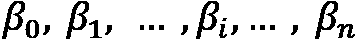
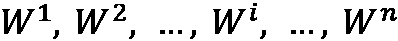

# 第二章：*第二章：介绍超参数调整*

每个机器学习（**ML**）项目都应该有一个明确的目标和成功指标。成功指标可以是商业和/或技术指标。评估商业指标很困难，通常只能在 ML 模型投入生产后才能进行评估。另一方面，评估技术指标更为直接，可以在开发阶段进行。作为 ML 开发者，我们希望实现*我们能得到的最佳技术指标*，因为这是我们能够优化的。

在本章中，我们将学习优化所选技术指标（称为**超参数调整**）的几种方法之一。我们将从理解超参数调整是什么以及其目标开始本章。然后，我们将讨论超参数与参数之间的区别。我们还将学习超参数空间以及你可能在实践中遇到的超参数值的可能分布。

到本章结束时，你将理解超参数调整的概念以及超参数本身。理解这些概念对于你获得对下一章将要讨论的内容的更全面了解至关重要。

在本章中，我们将涵盖以下主要主题：

+   什么是超参数调整？

+   揭秘超参数与参数的区别

+   理解超参数空间和分布

# 什么是超参数调整？

**超参数调整**是一个过程，通过这个过程，我们从所有候选集中搜索 ML 模型的最佳超参数集。它是优化我们关心的技术指标的过程。超参数调整的目标仅仅是确保在验证集上获得*最大的评估分数*，而不引起过拟合问题。

超参数调整是优化模型性能的*以模型为中心*方法之一。在实践中，当涉及到优化模型性能时，建议优先考虑以数据为中心的方法而不是以模型为中心的方法。以数据为中心意味着我们专注于清理、采样、增强或修改数据，而以模型为中心意味着我们专注于模型及其配置。

为了理解为什么以数据为中心比以模型为中心更重要，让我们假设你是一家餐厅的厨师。当涉及到烹饪时，无论你的厨房设备多么昂贵和复杂，如果原料状况不佳，你就无法为顾客提供高质量的食品。在这个类比中，原料指的是数据，而厨房设备指的是模型及其配置。无论我们的模型多么复杂和花哨，如果我们最初没有良好的数据或特征，我们就无法实现最大的评估分数。这可以用著名的说法来表达，**垃圾输入，垃圾输出**（**GIGO**）。

在以模型为中心的方法中，我们在找到最合适的模型框架或架构之后进行超参数调整。因此，可以说*超参数调整是优化模型性能的最终步骤*。

既然你已经了解了超参数调整及其目的，让我们来讨论超参数本身。究竟什么是超参数？超参数和参数之间的区别是什么？我们将在下一节中讨论这个问题。

# 揭秘超参数与参数的区别

超参数和参数之间的*关键区别*在于其值的生成方式。**参数**的值是在模型训练阶段由模型生成的。换句话说，其值是从给定的数据中*学习得到的*，而不是由开发者提供的。另一方面，**超参数**的值是由开发者*提供的*，因为它不能从数据中估计出来。

参数就像是模型的“心脏”。参数估计不准确会导致模型表现不佳。实际上，当我们说我们在训练一个模型时，实际上意味着我们在向模型提供数据，以便模型可以估计其参数的值，这通常是通过执行某种优化算法来完成的。以下是机器学习（ML）中参数的几个例子：

+   线性回归中的系数（）

+   多层感知器（**MLP**）中的权重（）

另一方面，超参数是一组支持模型训练过程的值。它们由开发者定义，而不了解它们对模型性能的确切影响。这就是为什么我们需要进行超参数调整，以从我们的模型中获得最佳效果。搜索过程可以通过穷举搜索、启发式搜索、贝叶斯优化或多保真优化来完成，这些将在接下来的章节中讨论。以下是超参数的几个例子：

+   神经网络（**NN**）中的 dropout 率、epoch 数和批量大小

+   决策树中的最大深度和分割标准

+   随机森林中的估计器数量

你还需要意识到，有些模型既没有超参数也没有参数，但两者都不具备。例如，线性回归模型是一个只有参数但没有超参数的模型。另一方面，**K-最近邻**（**KNN**）是一个不包含任何参数但有一个*k*超参数的模型实例。

当我们开始编写代码并开发机器学习模型时，可能会出现更多的混淆。在编程中，特定函数或类中的参数也经常被称为参数。如果我们使用实现机器学习模型的类，比如决策树模型，我们应该如何称呼需要传递给类的最大深度或分裂标准参数？它们是参数还是超参数？正确的答案是*两者都是*！它们是*类的参数*，同时也是*决策树模型的超参数*。这只是一个视角问题！

在本节中，我们学习了超参数和参数的概念，以及它们之间的区别。在下一节中，我们将更深入地探讨超参数的领域。

# 理解超参数空间和分布

**超参数空间**被定义为所有可能的超参数值组合的集合——换句话说，它是包含所有可能用作超参数调整阶段搜索空间的超参数值的集合。这就是为什么它也经常被称为超参数调整的**搜索空间**。这个空间在超参数调整阶段之前是**预定义的**，以便搜索只在这个空间内进行。

例如，我们想在神经网络上执行超参数调整。假设我们想搜索 dropout 率、epoch 数和批大小超参数的最佳值。

dropout 率在本质上是有界的。它的值只能在`0`和`1`之间，而对于 epoch 数和批大小超参数，从理论上讲，我们可以指定任何正整数值。然而，我们还需要考虑其他因素。通常，较大的批大小会产生更好的模型性能，但它将受到我们物理计算机内存大小的限制。至于 epoch 数，如果我们选择过高的值，我们更有可能遇到过拟合问题。这就是为什么我们需要为可能超参数的值设置边界，我们称之为超参数空间。

超参数可以是*离散或连续*值的形式。离散超参数可以是整数或字符串数据类型，而连续超参数将始终是实数或浮点数据类型。

在定义超参数空间时，对于**某些超参数调整方法**，仅指定我们关心的每个超参数的可能值是不够的。我们还需要定义每个超参数的潜在**分布**。在这里，分布充当某种*策略*，决定了在超参数调整阶段测试特定值的可能性。如果是一个均匀分布，那么所有可能的值都有相同的选择概率。

可以使用的概率分布类型有很多：均匀分布、对数均匀分布、正态分布、对数正态分布等等。在选择合适的分布时没有最佳实践；您只需将其视为另一个超参数。值得注意的是，有一些分布专门用于连续超参数，也有一些用于离散超参数。对于离散超参数分布，有些分布专门设计用于离散值——例如，整数均匀分布——但也有从连续分布调整而来的分布。后一种类型的离散分布通常在其名称上带有*离散化*或*量化*前缀——例如，量化均匀分布。

还值得注意的是，并非所有超参数对模型性能的影响都是同等重要的——这就是为什么建议您优先考虑。我们不必对模型的所有超参数进行超参数调优——只需*关注更重要的超参数*。

在本节中，我们学习了超参数空间以及超参数分布的概念，并探讨了实践中可能遇到的超参数分布的例子。

# 摘要

在本章中，我们学习了关于超参数调优所需了解的所有内容，从它是什么、其目标是什么以及何时应该进行超参数调优开始。我们还讨论了超参数与参数之间的区别、超参数空间的概念以及超参数分布的概念。对超参数调优的概念和超参数本身有一个清晰的了解将极大地帮助您在接下来的章节中。

如前所述，本书将讨论所有四种超参数调优方法的类别。在*第三章*《探索穷举搜索》中，我们将开始讨论第一组，也是实践中最广泛使用的超参数调优方法。这里将提供高级和详细的解释，以帮助您更容易地理解每种方法。
