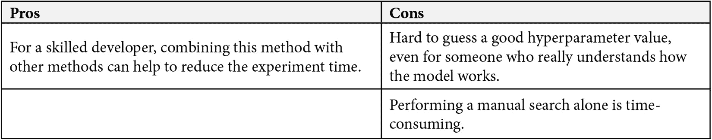
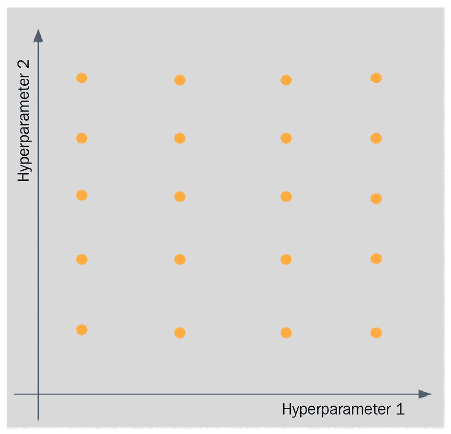
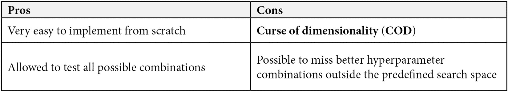
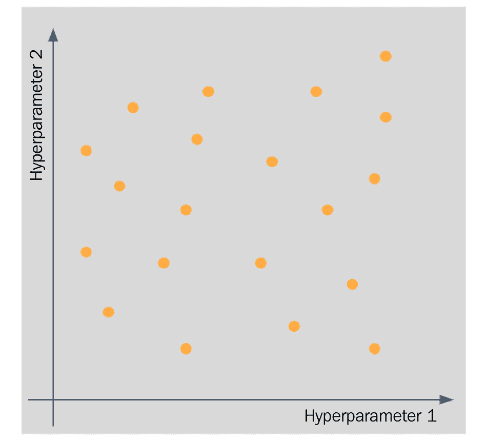

# 第三章：*第三章*：探索穷举搜索

超参数调整并不总是对应于复杂和花哨的搜索算法。实际上，一个简单的`for`循环或基于开发者直觉的手动搜索也可以用来实现超参数调整的目标，即在验证分数上获得最大评估分数，同时不引起过拟合问题。

在本章中，我们将讨论四个超参数调整组中的第一个，称为**穷举搜索**。这是实践中*最广泛使用*和*最直接*的超参数调整组。正如其名称所解释的，属于这一组超参数调整方法通过*穷举搜索*超参数空间来工作。除了一个方法外，这一组中的所有方法都被归类为**无信息搜索**算法，这意味着它们不会从之前的迭代中学习以在未来获得更好的搜索空间。本章将讨论三种方法：手动搜索、网格搜索和随机搜索。

到本章结束时，你将理解属于穷举搜索组的每种超参数调整方法的概念。当有人问你关于这些方法时，你将能够自信地解释这些方法，无论是从高层次还是详细的角度，包括它们的优缺点。更重要的是，你将能够以高信心将所有这些方法应用于实践中。你还将能够理解如果出现错误或意外结果时会发生什么，并理解如何设置方法配置以匹配你的具体问题。

本章将涵盖以下主要主题：

+   理解手动搜索

+   理解网格搜索

+   理解随机搜索

# 理解手动搜索

**手动搜索**是穷举搜索组中最直接的超参数调整方法。实际上，它甚至不是一个算法！没有明确的规则来执行这种方法。正如其名称所暗示的，手动搜索是基于你的直觉进行的。你只需调整超参数，直到你对结果满意为止。

这种方法是本章介绍中提到的*一个例外*。除了这种方法外，穷举搜索组中的其他方法都被归类为**无信息搜索方法**。你可能已经知道为什么这个方法是例外的原因。这是因为开发者自己学习到在每次迭代中改变特定或一组超参数的影响。换句话说，他们从之前的迭代中学习，以便在下一个迭代中获得（希望是）更好的“超参数空间”。

要进行手动搜索，请执行以下操作：

1.  将原始完整数据分割成训练集和测试集（参见*第一章**，评估机器学习模型*)。

1.  指定初始超参数值。

1.  在训练集上执行交叉验证（见 *第一章**，评估机器学习模型*）。

1.  获取交叉验证分数。

1.  指定新的超参数值。

1.  重复 *步骤 3-5* 直到您满意为止。

1.  使用最终超参数值在完整训练集上训练。

1.  在测试集上评估最终训练好的模型。

虽然这种方法看起来非常直接且容易操作，但实际上对于初学者来说却是 *相反的*。这是因为你需要真正理解模型的工作原理以及每个超参数的用法。还值得注意的是，当涉及到手动搜索时，*没有超参数空间的明确定义*。超参数空间可能非常狭窄或非常广泛，这取决于开发者愿意和主动进行实验的意愿。

这是手动搜索超参数调整方法的优缺点列表：



图 3.1 – 手动搜索：优缺点

现在您已经了解了手动搜索的工作原理，以及其优缺点，我们将学习最简单的自动超参数调整策略，这将在下一节中讨论。

# 理解网格搜索

`for` 循环测试搜索空间中所有可能超参数值。尽管许多包将网格搜索作为它们超参数调整方法实现之一，但从头开始编写自己的代码来实现这种方法非常简单。名称 *grid* 来自于我们必须像创建网格一样测试整个超参数空间，如下面的图示所示。



图 3.2 – 网格搜索示意图

例如，假设我们想使用网格搜索方法对随机森林进行超参数调整。我们决定只关注估计器的数量、分割标准和最大树深度超参数。然后，我们可以为每个超参数指定可能值的列表。假设我们定义超参数空间如下：

+   估计器数量：`n_estimators = [25, 50, 100, 150, 200]`

+   分割标准：`criterion = ["gini", "entropy"]`

+   最大深度：`max_depth = [3, 5, 10, 15, 20, None]`

注意到对于网格搜索方法，我们不需要指定超参数的潜在分布。我们只需为每个超参数创建一个包含我们想要测试的所有值的列表。然后，我们可以从我们喜欢的包中调用网格搜索实现，或者像下面的代码片段所示，自己编写网格搜索的代码：

```py
for n_est in n_estimators:
```

```py
          for crit in criterion:
```

```py
          for m_depth in max_depth:
```

```py
          #perform cross-validation here
```

在这个例子中，我们创建了一个包含三个层次的嵌套 `for` 循环，每个层次对应于搜索空间中的一个超参数。要进行一般的网格搜索，请执行以下操作：

1.  将原始完整数据分割成训练集和测试集。

1.  定义超参数空间。

1.  构建一个 H 层的嵌套循环，其中 H 是空间中超参数的数量。

1.  在每个循环中，执行以下操作：

    +   在训练集上执行交叉验证

    +   将交叉验证分数与超参数组合一起存储在数据结构中——例如，一个字典

1.  使用最佳超参数组合在完整训练集上进行训练。

1.  在测试集上评估最终训练好的模型。

如您从如何执行网格搜索的详细步骤中可以看到，这种方法实际上是一种*暴力搜索*方法，因为我们必须测试所有预定义的超参数空间的所有可能组合。这就是为什么拥有一个适当或*明确定义的超参数空间*非常重要。如果没有，那么我们将浪费大量时间测试所有组合。

下面是网格搜索超参数调整方法的优缺点列表：



图 3.3 – 网格搜索：优点和缺点

*表 3.2*中的*COD*表示向超参数空间添加另一个值将*指数级增加*实验时间。让我们用前面的例子来说明，我们在随机森林上执行了超参数调整。在我们的初始超参数空间中，有种组合我们必须测试。如果我们只是向我们的空间添加另一个值——比如说我们向`max_depth`列表添加`30`——那么将有种组合，或者额外的`10`种组合我们必须测试。这种指数行为在我们拥有更大的超参数空间时将变得更加明显！遗憾的是，也有可能在我们定义了一个大的超参数空间并花费了大量时间进行超参数调整之后，我们仍然可能*错过更好的超参数值*，因为它们位于预定义空间之外！

在本节中，我们学习了什么是网格搜索，它是如何工作的，以及它的优缺点。在下一节中，我们将讨论最后一种被归类为穷举搜索组的超参数调整方法：随机搜索方法。

# 理解随机搜索

**随机搜索**是穷举搜索组中的第三种也是最后一种超参数调整方法。它是一种*简单但实际效果出奇的好*的方法。正如其名称所暗示的，随机搜索通过*在每次迭代中随机选择超参数值*来工作。除此之外没有其他内容。前一次迭代中选择的超参数集不会影响该方法在下一次迭代中选择另一组超参数的方式。这就是为什么随机搜索也被归类为*无信息搜索*方法。

你可以在以下图表中看到随机搜索方法的示意图：



图 3.4 – 随机搜索示意图

当我们对我们的案例合适的超参数空间知之甚少或一无所知时，随机搜索通常比网格搜索更有效，这在大多数情况下都适用。与网格搜索相比，随机搜索在计算成本和寻找最佳超参数集方面也更有效率。这是因为我们不必测试每个超参数组合；我们只需让它随机运行——或者用通俗的话说，我们只需*让运气发挥作用*。

你可能会想知道，随机选择一组超参数如何比网格搜索在大多数情况下产生更好的调整结果。如果预定义的超参数空间与我们提供给网格搜索方法的完全相同，实际上并不是这样。我们必须提供一个*更大的超参数空间*，以便支持随机搜索发挥作用。更大的搜索空间并不意味着我们必须*增加维度性*，无论是通过扩大现有超参数的范围还是添加新的超参数。我们也可以通过*增加粒度*来创建更大的超参数空间。

值得注意的是，与网格搜索不同，在定义搜索空间时不需要定义超参数的分布，在随机搜索中，建议*定义每个超参数的分布*。在一些包的实现中，如果您没有指定分布，它将默认为均匀分布。我们将在*第七章**，通过 Scikit 进行超参数调整*到*第十章**，使用 DEAP 和 Microsoft NNI 进行高级超参数调整*中进一步讨论实现部分。

让我们用一个与我们在*理解网格搜索*部分看到的类似例子来更好地理解随机搜索的工作原理。除了关注估计器的数量、分割准则和最大树深度外，我们还将添加一个最小样本分割超参数到我们的空间中。与网格搜索不同，在定义搜索空间时，我们必须提供每个超参数的分布。让我们假设我们定义的超参数空间如下：

+   估计器数量：`n_estimators = randint(25,200)`

+   分割准则：`criterion = ["gini", "entropy"]`

+   最大深度：`max_depth = [3, 5, 10, 15, 20, None]`

+   最小样本分割：`min_samples_split = truncnorm(a=1, b=5, loc=2, scale=0.5)`

如您所见，与*理解网格搜索*部分中的搜索空间相比，我们通过添加粒度和添加新的超参数来*增加空间的大小*。我们通过利用`randint`均匀随机整数分布，将`n_estimators`超参数的粒度添加到其中，范围从`25`到`200`。这意味着我们可以测试`25`到`200`之间的任何值，其中所有这些值都有相同的被测试概率。

除了通过增加粒度来增加搜索空间的大小外，我们还添加了一个新的超参数，称为`min_samples_split`。这个超参数具有`truncnorm`分布或`a=1`和`b=5`，均值为`loc=2`，标准差为`scale=0.5`。

对于`criterion`和`max_depth`，我们仍然使用与之前搜索空间相同的配置。请注意，**未指定任何分布**意味着我们对超参数应用均匀分布，其中所有值都有相同的概率被测试。目前，你不必担心有哪些可用的分布以及如何实现它们，因为我们将从*第七章*“通过 Scikit 进行超参数调整”到*第十章*“使用 DEAP 和 Microsoft NNI 进行高级超参数调整”进行讨论。

在随机搜索中，除了需要定义超参数空间外，我们还需要为该方法本身定义一个超参数，称为**试验次数**。这个超参数将**控制我们希望在预定义的搜索空间上执行多少次试验或迭代**。由于我们**不是旨在测试空间中所有可能的组合**，因此需要这个超参数；如果我们这样做，那么它将与网格搜索方法相同。还值得注意的是，由于这种方法具有随机性，我们还需要指定一个**随机种子**，以确保每次运行代码时都能得到完全相同的结果。

与网格搜索不同，从头实现这种方法相当繁琐，尽管这是可能的。因此，许多包支持随机搜索方法的实现。无论实现方式如何，一般来说，随机搜索的工作方式如下：

1.  将原始完整数据分割成训练集和测试集。

1.  定义试验次数和随机种子。

1.  定义一个带有伴随分布的超参数空间。

1.  生成一个迭代器，包含随机超参数组合，元素数量等于步骤 2 中定义的试验次数。

1.  遍历迭代器，在每次循环中执行以下操作：

    +   从迭代器中获取本次试验的超参数组合

    +   在训练集上执行交叉验证

    +   将交叉验证分数与超参数组合一起存储在数据结构中——例如，字典

1.  使用最佳超参数组合在完整训练集上进行训练。

1.  在测试集上评估最终训练好的模型。

请注意，在步骤 4 中生成的超参数组合中**保证没有重复**。

这里是随机搜索超参数调整方法的优缺点列表：

![Figure 3.5 – Random search: pros and cons

![img/B18753_03_005.jpg]

图 3.5 – 随机搜索：优点和缺点

由于*无信息搜索*方法的特性，随机搜索在过程中会产生高方差。随机搜索无法从过去的经验中学习，以便在下一轮迭代中更好地学习和更有效地工作。在*第六章**，探索多保真优化*中，我们将学习其他被归类为信息搜索方法的*网格搜索和随机搜索的变体*。

在本节中，我们学习了关于随机搜索所需了解的所有内容，从它是什么，如何工作，它与网格搜索的不同之处，以及这种方法的优势和劣势。

# 摘要

在本章中，我们讨论了四组超参数调整方法中的第一组，称为穷举搜索组。我们讨论了手动搜索、网格搜索和随机搜索。我们不仅讨论了这些方法的定义，还讨论了这些方法在高级和专业技术层面的工作原理，以及它们各自的优缺点。从现在起，当有人向你询问这些穷举搜索方法时，你应该能够自信地解释它们，并在实践中充满信心地应用所有穷举搜索方法。

在下一章中，我们将开始讨论贝叶斯优化，这是超参数调整方法的第二组。下一章的目标与本章类似，即更好地理解属于贝叶斯优化组的方法，以便你在实践中能够充满信心地利用这些方法。
