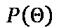
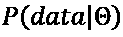
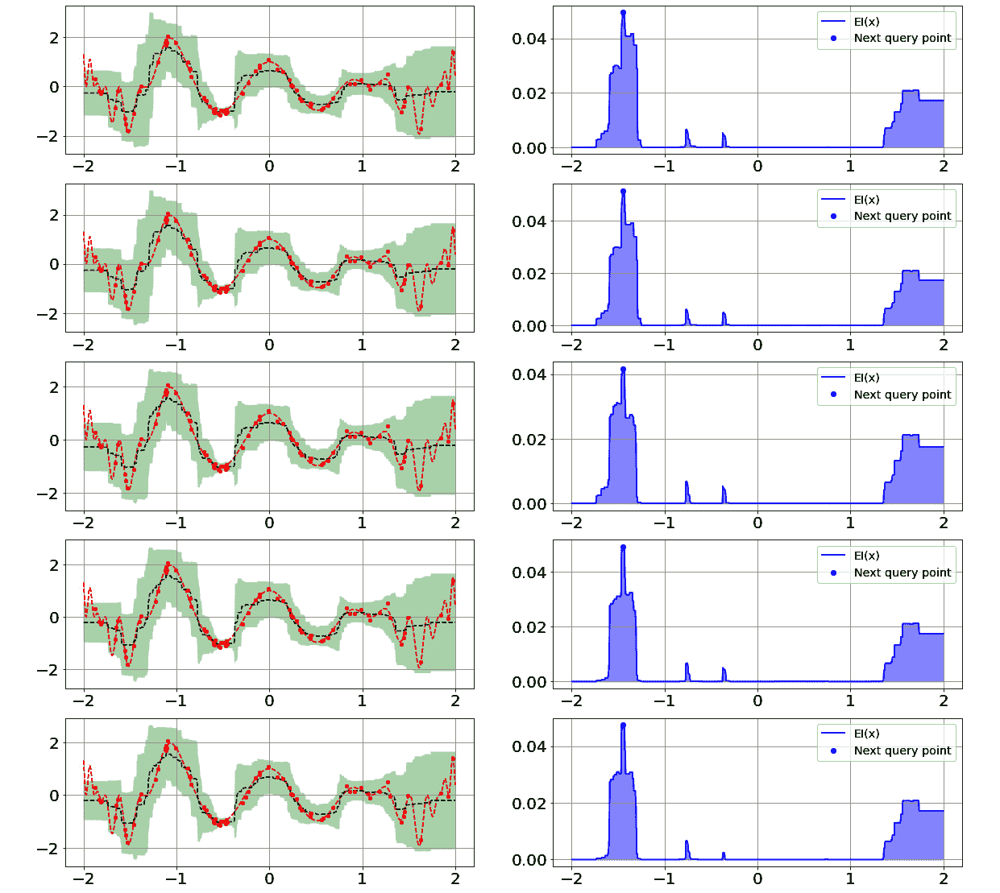

# *第四章*：探索贝叶斯优化

**贝叶斯优化**（**BO**）是四种超参数调整方法组中的第二种。与被归类为无信息搜索方法的网格搜索和随机搜索不同，属于 BO 组的所有方法都被归类为**信息搜索**方法，这意味着它们是从之前的迭代中学习的，以便（希望）在将来提供一个更好的搜索空间。

在本章中，我们将讨论属于 BO 组的几种方法，包括**高斯过程**（**GP**）、**基于模型的算法配置序列**（**SMAC**）、**树结构帕尔森估计器**（**TPE**）和 Metis。与第三章 *探索穷举搜索*类似，我们将讨论每种方法的定义、它们之间的区别、它们的工作原理以及每种方法的优缺点。

到本章结束时，你将能够解释 BO 及其变体，当有人问你时。你不仅能够解释它们是什么，而且能够以高级和技术的角度解释它们是如何工作的。你还将能够说出它们之间的区别，以及每种方法的优缺点。此外，一旦你理解了每种方法的来龙去脉，你将体验到一项关键的好处；那就是，你将能够理解如果出现错误或意外结果时发生了什么，并理解如何设置方法配置以匹配你的特定问题。

本章将涵盖以下主要内容：

+   介绍 BO

+   理解 BO GP

+   理解 SMAC

+   理解 TPE

+   理解 Metis

# 介绍 BO

BO 被归类为一种基于信息的搜索超参数调整方法，这意味着搜索是从之前的迭代中学习的，以便在下一个迭代中有一个（希望）更好的子空间。它也被归类为**基于模型的序列优化**（**SMBO**）组。所有 SMBO 方法都是通过顺序更新概率模型来估计一组超参数对其性能的影响，基于历史观察数据，并在接下来的试验中建议要测试的新超参数。

由于其*数据高效*的特性，BO 是一种流行的超参数调整方法，这意味着它需要相对较少的样本就能达到最优解。你可能想知道，BO 是如何获得这种开创性的数据高效特性的？这种特性得益于 BO 从之前的迭代中学习的能力。BO 可以通过利用**概率回归模型**（作为昂贵的目标函数的*廉价克隆版本*）和**获取函数**（它控制下一个迭代中应该测试哪组超参数）来学习和预测未来值得访问的子空间。

目标函数只是一个函数，它接受超参数值作为输入并返回交叉验证分数（参见*第一章*，*评估机器学习模型*）。我们不知道目标函数对所有可能超参数值的输出是什么。如果我们知道，就没有必要进行超参数调整。我们可以直接使用该函数来获取超参数值，这将导致获得最高的交叉验证分数。这就是为什么我们需要一个概率回归模型，通过拟合一组已知的超参数和交叉验证分数值对来近似目标函数（参见*图 4.1*）。近似的概念与基于机器学习的回归器模型的概念类似，例如随机森林、线性回归等。首先，我们将回归器拟合到独立变量和依赖变量的样本；然后，模型将尝试*学习*数据，最终可以用来预测新的给定数据。概率回归模型也常被称为**代理模型**：

图 4.1 – 概率回归模型，M 的示意图

获取函数*控制我们在下一次迭代中应该搜索哪个子空间*。多亏了这个函数，贝叶斯优化（BO）使我们能够从过去的经验中学习，并且与随机搜索相比，通常需要更少的超参数调整迭代。

重要提示

记住，为了获得交叉验证分数，我们需要执行多次训练和评估过程（参见*第一章**，*评估机器学习模型*）。当你有一个大型的、复杂的模型以及大量的训练数据时，这是一个*昂贵的流程*。这就是为什么获取函数在这里扮演着重要角色。

通常情况下，贝叶斯优化（BO）的工作原理如下：

1.  将原始完整数据集分为训练集和测试集。（参见*第一章**，*评估机器学习模型*）

1.  定义超参数空间，*H*及其伴随的分布。

1.  根据训练集定义目标函数，*f*。

1.  定义停止标准。通常，使用试验次数。然而，也可以使用时间或收敛性作为停止标准。

1.  初始化一个空集合，*D*，该集合将用于存储初始的超参数值对和交叉验证分数，以及由获取函数，*A*建议的结果值对。

1.  初始化几个超参数值对和交叉验证分数，并将它们存储在*D*中。

1.  使用*D*中的值对拟合概率回归模型/代理模型，*M*。

1.  通过利用获取函数，*A*，采样下一组超参数：

    1.  在代理模型*M*的帮助下，对获取函数*A*进行优化，以采样哪些超参数应该传递给获取函数。

    1.  根据获取函数*A*，获取预期的最佳超参数集。

1.  使用基于*步骤 8*输出的目标函数*f*计算交叉验证得分。

1.  将*步骤 8*和*步骤 9*中的超参数和交叉验证得分对添加到设置*D*中。

1.  重复*步骤 7*到*步骤 10*，直到满足停止标准。

1.  使用最终的超参数值在完整训练集上进行训练。

1.  在测试集上评估最终训练好的模型。

你可以使用几种采样策略来初始化超参数值和交叉验证得分，如*步骤 6*所示。在实践中，最直接和常用的方法是进行**随机采样**。然而，在实验过程中，你也可以考虑其他方法，例如**准随机**或**拉丁超立方体**采样方法。

与随机搜索类似，在贝叶斯优化（BO）中，我们还需要定义每个超参数的分布。你可能想知道 BO 是否也可以用于非数值类型的超参数。答案是*基于你使用的概率回归模型*。你可以选择几种代理模型。这些选项将在本章接下来的三个部分中讨论，包括**高斯过程**（**GP**）、**树结构帕累托估计器**（**TPE**）、随机森林、额外树或其他基于机器学习的回归器。在这本书中，我们将讨论 SMAC 模型中实现的随机森林回归器。

值得注意的是，*步骤 8*中的优化过程可以被*随机搜索*所替代。因此，我们不必执行某种二阶优化方法，而是可以从搜索空间中随机采样一组超参数，并将它们传递给获取函数。然后，我们可以根据获取函数的输出获取最佳超参数集。当在此步骤中使用随机搜索时，我们仍然利用获取函数来指导我们在下一次迭代中应该搜索哪个子空间，但我们添加了一些随机行为，希望可以逃离局部最优并收敛到全局最优。

最先且最受欢迎的获取函数是**期望改进**（**EI**），其定义如下：

当时，。

当时，。

在这里，、和分别表示标准正态分布的累积分布函数和概率密度函数。和分别代表由代理模型捕捉到的预期性能和不确定性。最后，代表目标函数的当前最佳值。

暗示地，EI 获取函数使得 BO 方法具有*探索与利用的权衡特性*。这种特性可以通过公式内的两个术语之间的竞争来实现。当第一个术语的值很高时，意味着预期性能高于当前最佳值，EI 将倾向于利用过程。另一方面，当不确定性非常高时，意味着我们有一个高值，EI 将倾向于探索过程。通过利用，这意味着获取函数将推荐可能获得目标函数*f*更高值的超参数集。至于探索，这意味着获取函数将推荐来自我们尚未探索的子空间的超参数集。

你可以将这种探索与利用的权衡想象成当你渴望食物的时候。比如说，你今天想和你的兄弟一起吃午饭。想象以下两种情况：

+   “嘿，兄弟，我们今天就去我们最喜欢的餐厅吃午饭吧！”

+   “嘿，兄弟，你听说过那里的新餐厅吗？我们为什么不去那里吃午饭呢？”

在第一种情况下，你选择在你最喜欢的餐厅用餐，因为你确信食物没有问题，更重要的是，你对这家餐厅的食物和整体用餐体验*非常有信心*。这个第一种情况最好地解释了我们所说的利用过程。在第二种情况下，你对那家新餐厅的整体用餐体验*一无所知*。它可能比你最喜欢的餐厅差，但也可能成为你新的最爱！这就是我们所说的探索过程。

重要提示

在某些实现中，例如在**Scikit-optimize**包中，有一个超参数可以让我们控制相对于探索，我们有多大的倾向于利用。在 Scikit-optimize 中，EI 函数的符号是负的。这是因为该包默认将优化问题视为最小化问题。

在我们之前的解释中，我们将优化问题视为最大化问题，因为我们想要得到尽可能高的交叉验证分数。不要将这个问题与最小化与最大化问题混淆——只需选择最能描述您在实践中将面临的问题即可！

以下是在 Scikit-optimize 包中实现的 EI 获取函数：

如您在第一项中看到的，的值将控制我们向利用倾斜的程度与探索相比。的值越小，我们越倾向于利用。我们将从*第七章**，通过 Scikit 进行超参数调整*到*第十章**，使用 DEAP 和 Microsoft NNI 进行高级超参数调整*中学习更多关于使用 Scikit 或其他包实现 BO 的细节。

为了更好地理解在超参数调整阶段探索与利用权衡是如何发生的，让我们看一个例子。比如说，我们正在使用 GP 代理模型来估计以下目标函数。现在不需要担心 GP 是如何工作的，我们将在下一节中详细讨论：

在这里， 是遵循标准正态分布的噪声。以下是在范围内的该函数的绘图。请注意，在这个例子中，我们假设我们知道真正的目标函数是什么。然而，在实践中，这个函数是未知的：

图 4.2 – 目标函数 f(x)的绘图

假设我们正在使用 EI 作为获取函数，将试验次数设置为`15`，将初始点数设置为`5`，将的值设置为`0.01`。您可以在以下图中看到前五次试验的拟合过程：

图 4.3 – GP 和 EI 说明，δ = 0.01

前图中每一行对应第一次到第五次试验。左侧列包含关于目标函数（**红色虚线**）、目标函数的 GP 代理模型近似（**绿色虚线**）、近似的确信度（**绿色透明区域**）以及到每次试验为止的观测点（**红色点**）。右侧列包含关于 EI 获取函数值（**蓝色线**）和下一个要包含在下次试验中的点（**蓝色点**）的信息。

让我们逐行分析*图 4.3*中的每一行，以便您了解它是如何工作的。在第一次试验中（*参见左列顶部的第一行*），我们初始化五个随机样本点——或者说是超参数调整中的超参数值，然后基于这五个点拟合 GP 模型。请记住，GP 模型不知道实际的目标函数；它所拥有的唯一信息就是那五个随机点。然后（*参见右列顶部的第一行*），基于拟合的 GP 模型，我们在整个空间中获取 EI 获取函数的值。在这种情况下，空间只是一个范围——也就是说，。我们还得到了下一个试验要包含的点，在这个例子中大约是点`0.5`。

在第二次试验中，我们利用 EI 获取函数建议的点，并基于我们已有的六个样本点再次拟合 GP 模型（*参见左列顶部的第二行*）。如果您比较第二次试验的 GP 近似和第一次试验，您会看到它更接近真实的目标函数。接下来（*参见右列顶部的第二行*），我们重复同样的过程，即在整个空间中生成 EI 函数值和下一个试验要包含的点。在这个步骤中建议的点大约是`0.7`。

我们会重复进行同样的过程，直到满足停止标准，在这个例子中是 15 次试验。下面的图表显示了 15 次试验后的结果。这比第一次试验的近似要好得多（*参见绿色虚线*）！您还可以看到，在的一些范围内，高斯过程近似的置信度很高，例如在点`-1.5`和`1.6`附近：

图 4.4 – 15 次试验后的结果，δ = 0.01

根据前面的图表，最终建议的点，或者说超参数值，是`-1.5218`，这导致目标函数的值为`-1.9765`。让我们也看看从第一次试验到最后一次试验的收敛图。从下面的收敛图中，我们可以看到我们的代理模型和获取函数是如何帮助我们根据所有试验得到目标函数的最小值的：

图 4.5 – 收敛图

现在，让我们尝试将的值改为比我们之前更低的值，以看看 EI 获取函数将如何更多地偏向利用而不是探索。让我们将的值设置为比之前低 1000 倍。请注意，我们只改变了的值，其他设置保持不变：

图 4.6 – GP 和 EI 说明，δ = 0.00001

如您所见，EI 获取函数建议了介于 **0.5** 和 **1.4** 之间的大多数点。获取函数不建议探索  范围，尽管我们可以在该范围内获得更低的目标函数值。这是因为该范围内没有初始随机点，在这个例子中，我们非常倾向于利用。以下图表显示了 15 次试验后的最终结果。在这种情况下，当我们更倾向于利用而不是探索时，我们得到了更差的结果。然而，这并不总是如此。*您必须进行实验*，因为不同的数据、不同的目标函数、不同的超参数空间和不同的实现可能会导致不同的结论：

图 4.7 – 15 次试验后的结果，δ = 0.00001

现在，让我们看看如果我们将  值设置为 `100`，这在这种情况下意味着我们更倾向于探索而不是利用，会产生什么影响。与之前的试验相似，运行 15 次试验后，我们得到了以下结果：

图 4.8 – 15 次试验后的结果，δ = 100

如您所见，由获取函数（*红色点*）建议的点遍布各处。这是因为我们设置了如此高的  值。这意味着获取函数的输出将建议空间中尚未观察到的点。我们将在 *第七章*，*通过 Scikit 进行超参数调整* 中学习如何生成这里显示的图表。

除了 EI 获取函数之外，还有其他一些流行的获取函数可以考虑使用，包括 **改进概率**（**PI**）和 **上置信界**（**UCB**）。

PI 是在 EI 之前存在的获取函数。它比 EI 简单 – 事实上， 的公式是根据以下简单的 *改进* 定义推导出来的：

 的想法是返回改进的大小，如果预期性能和当前最佳性能之间存在改进，则返回改进的大小；如果没有改进，则返回零。基于 ，我们可以定义 PI 如下：

 当 

 当 

PI 的问题在于，只要与当前最佳值  相比有所改进，它就会为所有超参数集提供相同的奖励，无论改进有多大。在实践中，这种行为并不太可取，因为它可能会 *引导我们走向局部最小值并使我们陷入其中*。如果你熟悉微积分和统计学，你会意识到 EI 只是  的期望，如这里所示：

在这里， 是标准正态分布的概率密度函数。与 PI 不同，*EI 收敛函数会考虑改进的大小*。

对于 UCB 来说，与其他方法相比，它非常直接。我们通过  参数有权力自己控制探索和利用之间的权衡。这个收敛函数可以定义为以下：

正如你所见，UCB 并没有考虑目标函数的当前最佳值。它只考虑了代理模型的预期性能和不确定性。你可以通过改变  的值来控制探索和利用之间的权衡。如果你想偏向于探索搜索空间，那么你可以增加  的值。然而，如果你想更多地关注那些预期表现良好的超参数集，那么你可以减少  的值。

除了代理模型和收敛函数的变体之外，还有基于修改算法本身的 BO 方法变体，包括 Metis 和 **贝叶斯优化和 HyperBand** (**BOHB**)。我们将在 *理解 Metis* 部分讨论 Metis，并在 *第六章* *探索多保真优化* 中讨论 BOHB。

以下是与其他超参数调整方法相比，BO 超参数调整的优缺点：

](img/B18753_04_009.jpg)

图 4.9 – BO 的优缺点

BO 可以处理昂贵的目标函数，并且当有良好的初始点时，比随机搜索更数据高效，可以说是更好的。你可以利用我们在本节开头提到的流程中从 *步骤 6* 开始使用的超参数集。然而，如果你没有这种特权访问，BO 仍然可以通过给你更多时间来超越随机搜索，因为它必须首先从头开始构建一个好的代理模型，特别是如果你有一个巨大的超参数空间。一旦 BO 构建了一个好的代理模型，它往往比随机搜索更快地找到最优的超参数集。

还有另一种方法可以加速 BO 相对较慢的预热过程。这个想法是采用**元学习**程序，通过从其他类似数据集的元特征中学习来初始化初始超参数集。

加速 BO 的预热过程

有关更多信息，请参阅以下论文：*高效且鲁棒的自动机器学习*，作者 Matthias Feurer，Aaron Klein，Katharina Eggensperger，Jost Springenberg，Manuel Blum，Frank Hutter ([`papers.nips.cc/paper/2015/hash/11d0e6287202fced83f79975ec59a3a6-Abstract.html`](https://papers.nips.cc/paper/2015/hash/11d0e6287202fced83f79975ec59a3a6-Abstract.html))。

BO 还有一个随机搜索没有的不错特性——能够控制探索和利用之间的权衡，如本节之前所述。这个特性使得 BO 不仅仅像随机搜索那样不断探索。

既然你已经了解了什么是 BO（贝叶斯优化），它是如何工作的，它的重要组件是什么，以及这种方法的优势和劣势，我们将在接下来的章节中深入探讨 BO 的变体。

# 理解 BO GP

**贝叶斯优化高斯过程**（**BOGP**）是 BO 超参数调整方法的一种变体。它因其良好的描述目标函数的能力而闻名。这种变体因其代理模型的独特**可分析性**和即使只有少量观测点也能产生相对准确的近似而非常受欢迎。

然而，BOGP（贝叶斯优化高斯过程）有其局限性。它**仅适用于连续超参数**，不适用于离散或分类类型的超参数。当你需要大量迭代来获得最佳超参数集时，不建议使用 BOGP，尤其是当你有大量样本时。这是因为 BOGP 的运行时间，其中是样本数量。如果你有**超过 10 个需要优化的超参数**，普遍认为 BOGP 不是适合你的超参数调整方法。

以 GP（高斯过程）作为代理模型意味着我们利用 GP 作为目标函数的**先验**。然后，我们可以利用先验和**似然模型**来计算我们关心的**后验**。如果我们熟悉著名的**贝叶斯定理**，所有这些复杂的术语都可以很容易地理解。

贝叶斯定理允许我们通过利用我们已有的知识或普遍信念来计算在特定条件下事件发生的概率。形式上，贝叶斯定理定义为如下：

在这里，是我们想要知道概率的事件，而指的是我们之前提到的特定条件。方程的左边，，就是我们所说的后验。是先验，是我们所说的似然模型。最后，只是一个常数，以确保这个公式的结果被限制在的范围内。

要理解贝叶斯定理，让我们通过一个例子来解释。假设我们想知道在今天是晴天的情况下，你吃你最喜欢的餐厅的概率。在这个例子中，你吃你最喜欢的餐厅是我们感兴趣的事件。这在方程中是。今天是晴天这一信息指的是方程中的。

假设你中有 40 天在你的最喜欢的餐厅吃饭，这意味着在知道今天的天气之前，你的等于。让我们再假设在 100 天中，有 30 天是晴天。那么，的值等于。根据你在你最喜欢的餐厅吃饭的经验，你已经意识到在晴天条件下你吃了 40 次中的 20 次。因此，似然，，等于。使用所有这些信息，我们可以计算出在今天是晴天的情况下，你吃你餐厅的概率，如所示。

现在，我们准备重新审视 GP。BOGP 利用 GP 作为代理模型。GP 作为代理模型意味着我们将其作为目标函数的先验，这意味着*后验分布也是一个 GP*。你可以把 GP 看作是你熟悉的高斯分布的推广。与描述随机变量分布的高斯分布不同，*GP 描述的是函数的分布*。与伴随随机变量均值和方差的 Gaussian 分布类似，GP 也伴随函数的*均值和协方差*。至于*似然*，我们假设目标函数*f*遵循带有噪声的正态似然：

然后，我们可以描述，即所有*n*个样本的目标函数的值，作为一个具有均值函数和协方差核的 GP，大小为*n x n*，其定义如下：

GP 的预测分布也遵循高斯分布，可以定义为以下：

在这里，和的值可以从核，，中解析地推导出来。

总结来说，*GP 通过遵循正态分布假设来近似目标函数*。在实践中，即使我们没有零均值过程，也可以使用 GP，正如我们之前的假设。然而，我们需要对目标函数的值进行一些预处理，以便将其中心化到零。选择 *合适的协方差核*，，也是至关重要的。它极大地影响了我们的超参数调整过程。在实践中最常用的核是 *Matern 核*。然而，我们必须为我们的案例选择合适的核，因为每个核都有可能或可能不适合我们的目标函数。我们将在 *第七章*，*通过 Scikit 进行超参数调整*中讨论 Scikit 包中可用的核。

以下表格显示了 BOGP 与其他 BO 超参数调整方法变体相比的优缺点列表：

图 4.10 – BOGP 的优缺点

在上一节中，我们看到了 GP 在实际中的应用，其中我们讨论了探索与利用的权衡。你可以回顾那个例子，通过可视化更好地理解 GP 在实际中的应用。

在本节中，我们学习了在 BO 中使用 GP 作为代理模型，以及与其他 BO 变体相比的优缺点。在下一节中，我们将学习另一种使用随机森林作为代理模型的 BO 变体。

# 理解 SMAC

**SMAC** 是 BO 超参数调整方法组的一部分，并使用随机森林作为代理模型。这种方法经过优化以处理离散或分类超参数。如果你的超参数空间很大，且主要由离散超参数主导，那么 SMAC 是你的一个不错的选择。

与 BOGP 类似，SMAC 也通过建模目标函数来工作。具体来说，它使用随机森林作为代理模型来创建对真实目标函数的估计，然后可以将该估计传递给获取函数（有关更多详细信息，请参阅 *介绍 BO* 部分）。

随机森林是一种**机器学习**（**ML**）算法，可用于分类或回归任务。它基于一系列决策树，已知在处理分类类型特征时表现良好。随机森林这个名字来源于它是由多个决策树构建而成的。我们将在*第十一章*《理解流行算法的超参数》中更详细地讨论随机森林及其超参数。

SMAC 与 BOGP 之间的主要区别在于每种方法中使用的代理模型类型。虽然 BOGP 使用高斯过程（GP）作为代理模型，但 SMAC 使用随机森林作为代理模型。在 SMAC 的原论文中使用的获取函数是经过一些修改的*EI 函数*，这些修改涉及在*介绍 BO*部分的*步骤 8*中的优化过程，这也可以在下面的截图中看到：

图 4.11 – 获取函数的优化过程

在 SMAC 中，类似于 BOGP，我们也假设我们的代理模型的*预测分布遵循高斯分布*，如下所示：

在这里，和的值分别来自随机森林预测的均值和方差。

我们还可以*利用随机森林对一个随机森林模型进行超参数调整*！这是如何实现的？一个模型如何被用来提高同类型另一个模型的表现？

这是因为我们将一个模型作为代理模型处理，而另一个模型是实际模型，它被拟合到独立变量以预测因变量。作为代理模型，随机森林将充当回归器，其目标是学习超参数空间与相应目标函数之间的关系。因此，当我们说我们在随机森林模型上使用随机森林进行超参数调整时，存在两个具有不同目标和不同输入输出对的随机森林模型！

查看以下步骤以更好地理解这个概念。请注意，以下程序替换了*介绍 BO*部分的*步骤 7*到*11*：

6. (最初几步与之前看到的一样)。

7. 使用*D*中的值对拟合第一个随机森林模型，该模型作为代理模型*M*。记住，*D*由超参数值和交叉验证分数的成对值组成。

8. 通过使用获取函数*A*采样下一组超参数：

1.  在代理模型*M*的帮助下对获取函数进行优化，以采样要传递给获取函数的超参数。

1.  根据获取函数获取最佳超参数集。

9\. 使用 *步骤 8* 的输出，根据目标函数 *f* 计算交叉验证分数。请注意，交叉验证分数是基于 *第二个随机森林模型* 计算的，其目标是学习原始问题中自变量和因变量之间的关系。

10\. 将 *步骤 8* 和 *步骤 9* 中的超参数和交叉验证分数对添加到设置 *D*。

11\. 重复 *步骤 7* 到 *10*，直到满足停止标准。

12\. （最后几步与之前看到的是相同的）。

您可能想知道，为什么还要使用与代理模型相同的机器学习算法？为什么我们不直接进行网格搜索或随机搜索呢？记住，代理模型只是全局优化算法的一部分。还有获取函数和其他优化步骤可以帮助我们更快地获得最佳超参数集。值得注意的是，*我们可以利用除了随机森林之外的任何机器学习模型*。当涉及到基于树的机器学习模型时，XGBoost、CatBoost 和 LightGBM 在数据科学家中也同样受欢迎，因为它们在实际应用中表现良好。

在 *介绍全局优化（BO）* 部分，我们看到了 GP 如何与 EI 获取函数一起估计虚拟目标函数。让我们使用这里定义的相同虚拟目标函数，并查看使用随机森林（不一定是 SMAC 算法）作为代理模型而不是 GP 的结果。在这个例子中，我们仍然将 EI 作为获取函数，并使用 Scikit-optimize 包作为实现：

在这里， 是一个遵循标准正态分布的噪声。请参见 *图 4.2* 以查看此虚拟目标函数的可视化。

让我们使用 Scikit-optimize 包为随机森林代理模型提供的默认值来设置试验次数和探索与利用权衡控制器，，分别是 `100` 和 `0.01`。您可以在以下图中看到随机森林代理模型拟合过程在前五次试验中的工作情况：

图 4.12 – 随机森林和 EI 插图；δ = 0.01；试验 1 – 5

如您所见，在前五次试验中并没有发生太多事情。即使是随机森林给出的目标函数近似（见绿色虚线）仍然非常糟糕，因为它仅仅是一条直线！让我们看看在试验 71 到 75 期间的条件是什么：

图 4.13 – 随机森林和 EI 插图；δ = 0.01；试验 71- 75

在这里，我们可以看到我们的随机森林代理模型在估计真实目标函数方面有了很大的改进。一个有趣的观点是，获取函数曲线看起来与我们使用 GP 作为代理模型时看到的非常不同。在这里，获取函数看起来更锋利，就像我们通常从可视化随机森林中看到的那样。最后，让我们看看近似函数的最终形式：

图 4.14 – 100 次试验后的结果；δ = 0.01

在这里，我们可以看到随机森林通常无法拟合真实的目标函数，但它成功地关注了目标函数的局部最小值。这是因为 *随机森林需要大量的数据*，或者在这种情况下，观察到的点（*见红色圆点*），以对目标函数进行良好的近似。您还可以在以下图中看到拟合过程的收敛图，从第一次到最后的试验。如果我们比较 *图 4.15* 和 *图 4.5*，我们可以很容易地看出，在这个例子中，当有 EI 获取函数的支持时，随机森林的学习速度比 EI 支持的 GP 慢得多：

图 4.15 – 收敛图

从 *图 4.14* 我们还可以看到，目前我们只关注几个范围，而忽略了虚拟目标函数的全局最小值，它位于  范围附近。让我们看看将  的值更改为 `100` 是否可以解决这个问题。预期 EI 获取函数可以帮助随机森林代理模型在其他值范围内 *探索更多*。您可以在以下图中看到前五次试验的结果：

图 4.16 – 随机森林和 EI 插图；δ = 100；试验 1 – 5

与默认值的前五次试验类似，我们仍然看不到太多学习过程。让我们看看试验 71 到 75 期间的条件：

图 4.17 – 随机森林和 EI 插图；δ = 100；试验 71 – 75

在这里，我们可以看到 *图 4.17* 和 *图 4.13* 之间有很大的差异。最后，让我们看看近似函数的最终形式：

图 4.18 – 100 次试验后的结果；δ = 100

通过将的值改为`100`，似乎我们的期望已经实现。随机森林代理模型的近似（*见绿色虚线*）现在更多地关注特定范围之外。此外，我们甚至比 GP（*见*图 4.4*）得到了更好的结果。再次强调，这并不总是如此——你必须自己大量实验，因为不同的数据、不同的目标函数、不同的超参数空间和不同的实现可能会导致不同的结论。我们将在*第七章*中学习如何实现随机森林作为代理模型以及如何生成这些图表，*通过 Scikit 进行超参数调整*。

另有一种方法，称为**Grove 内的贝叶斯优化**（**BOinG**），其目标是利用随机森林和 GP 作为代理模型，从两个世界中获取最佳效果。

Grove 内的贝叶斯优化

有关更多信息，请参阅以下论文：*在森林中搜索局部贝叶斯优化*，作者为 Difan Deng 和 Marius Lindauer ([`arxiv.org/abs/2111.05834`](https://arxiv.org/abs/2111.05834))。

BOinG 通过使用*两阶段优化*来工作，利用全局和局部模型来降低计算成本并更多地关注有希望的子空间。在 BOinG 中，随机森林被用作全局模型，GP 作为局部模型。全局模型负责搜索局部模型的有希望子空间。因此，全局模型应该足够灵活，能够处理具有不同类型超参数的复杂问题。由于局部模型只在有希望的子空间中搜索，因此可以使用更准确但更昂贵的模型，例如 GP。

以下表格列出了利用随机森林作为代理模型与其他 BO 超参数调整方法变体的优缺点：

图 4.19 – 利用随机森林作为代理模型的优缺点

条件超参数是指在满足特定条件时才会被利用的超参数。随机森林的树结构非常适合这种情况，因为它可以添加另一个树枝来检查条件是否满足。条件通常只是空间中其他超参数的特定值或范围。

既然你已经了解了 SMAC 以及一般性地利用随机森林作为代理模型，在下一节中，我们将讨论 BO 的另一种变体，它在近似目标函数方面有不同的方法。

# 理解 TPE

**TPE** 是 BO 的另一种变体，在一般情况下表现良好，可以用于分类和连续类型的超参数。与具有立方体时间复杂度的 BOGP 不同，TPE 以线性时间运行。如果你有一个非常大的超参数空间，并且对评估交叉验证分数的预算非常紧张，建议使用 TPE。

TPE 与 BOGP 或 SMAC 之间的主要区别在于它建模超参数与交叉验证分数之间的关系。与 BOGP 或 SMAC 不同，它们近似目标函数的值或后验概率 ，*TPE 采用相反的方式*。它试图根据目标函数的条件或似然概率 （参见 *理解 BO GP* 部分的贝叶斯定理解释）来获取最佳超参数。

换句话说，与构建在目标函数上的预测分布的 BOGP 或 SMAC 不同，TPE 尝试利用目标函数的信息来 *建模超参数分布*。更准确地说，当优化问题以 *最小化问题* 的形式出现时， 定义如下：

在这里，当目标函数的值低于或高于阈值时，分别使用  和 。如何选择阈值  没有具体的规则。然而，在 **Hyperopt** 和 **Microsoft NNI** 的实现中，这个阈值是基于 TPE 的超参数  和当前试验中观察到的 *D* 中的点的数量来选择的。 的定义告诉我们，TPE 有两个模型，根据目标函数的值作为学习算法，由阈值  控制。

当超参数的 *分布是连续的* 时，TPE 将利用高斯混合模型（**GMMs**）以及 EI 收集函数，来建议下一组要测试的超参数。如果连续分布不是高斯分布，那么 TPE 将将其转换为模拟高斯分布。例如，如果指定的超参数分布是均匀分布，那么它将被转换为截断高斯分布。

GMM 内部多项式分布的不同可能结果的概率，以及 GMM 内部正态分布的均值和方差，是由 **自适应 Parzen 估计器** 生成的。此估计器负责根据正态超参数分布的均值和方差，以及 *D* 中所有观察到的点的超参数值，构建两个概率分布  和 。

当 *分布是分类或离散的* 时，TPE 将将分类分布转换为重新加权的分类分布，并使用 *加权随机采样* 以及 EI 收集函数来建议预期的最佳超参数集。随机采样过程中的权重是基于历史超参数值计数生成的。

TPE 中的 EI 收集函数定义与我们在 *介绍 BO* 部分中学到的定义略有不同。在 TPE 中，我们在推导 EI 公式时使用贝叶斯定理。TPE 中 EI 收集函数的简单公式定义如下：

这里定义的成比例关系告诉我们，为了获得高 EI 值，我们需要获得高的  比率。换句话说，当优化问题是 *最小化问题* 形式时，EI 收集函数必须从  中建议比从  中更多的超参数。当优化问题是 *最大化问题* 形式时，情况则相反。例如，当我们使用准确率来衡量我们分类模型的性能时，那么我们应该从  中采样更多的超参数，而不是从  中采样。

总结来说，TPE 的工作原理如下。请注意，以下过程描述了 TPE 在 *最小化问题* 中的工作方式。这个过程替换了 *介绍 BO* 部分中的 *步骤 7* 到 *11*：

6. （前几个步骤与之前看到的一样）。

7. 将超参数值和交叉验证分数的成对数据在 *D* 中根据阈值  分为两组，即 *低于* 和 *高于* 组（参见 *图 4.19*）。

8. 通过使用 EI 收集函数来采样下一组超参数：

1.  对于每个组，使用自适应 Parzen 估计器（如果它是连续类型）或随机采样的权重（如果它是分类类型）来计算 GMM 的概率、均值和方差。

1.  对于每个组，如果它是连续类型，则拟合 GMM（高斯混合模型），如果它是分类类型，则进行随机采样，以采样哪些超参数将传递给 EI 收集函数。

1.  对于每个组，计算这些样本成为好样本（对于下面的组）或坏样本（对于上面的组）的概率。

1.  根据 EI 获取函数，获取预期的最佳超参数集。

9. 使用第 8 步的输出，根据目标函数*f*计算交叉验证分数。

10. 将第 8 步和第 9 步中的超参数和交叉验证分数对添加到设置*D*。

11. 重复*步骤 7*到*10*，直到满足停止标准。

12. （最后几步与我们之前看到的是一样的）：

图 4.20 – TPE 中分组划分的示意图

根据所述程序和前面的图，我们可以看到，与构建在目标函数上的预测分布的 BOGP 或 SMAC 不同，TPE 试图利用目标函数的信息来建模超参数分布。这样，我们不仅关注试验期间观察到的最佳点——我们关注的是*观察到的最佳点的分布*。

你可能想知道为什么“树结构”这个词在 TPE 方法的名字中。这个词指的是我们在上一节中讨论的条件超参数。这意味着在空间中有一些超参数只有在满足一定条件时才会被使用。我们将在*第八章*“通过 Hyperopt 进行超参数调整”和*第九章*“通过 Optuna 进行超参数调整”中看到树结构或条件超参数空间的样子。

TPE 的一个缺点是，由于 Parzen 估计器是单变量工作的，它可能在某个空间中忽略超参数之间的相互依赖性。然而，对于 BOGP 或 SMAC 来说并非如此，因为代理模型是基于超参数空间中的配置构建的。因此，它们可以考虑到超参数之间的相互依赖性。幸运的是，有一种 TPE 的实现可以克服这个缺点。**Optuna**包提供了**多元 TPE**实现，它可以考虑到超参数之间的相互依赖性。

以下表格列出了与其他 BO 超参数调整方法的变体相比，利用 TPE 的优缺点：

图 4.21 – TPE 的优缺点

重要提示

一些实现支持并行调整，但需要在建议的超参数质量和墙时间之间做出权衡。Microsoft NNI 包通过`constant_liar_type`参数支持此功能，这将在*第十章*“使用 DEAP 和 Microsoft NNI 进行高级超参数调整”中更详细地讨论。

在本节中，我们了解了 TPE，以及与其他 BO 变体的优缺点。在下一节中，我们将了解另一种 BO 变体，其算法与一般的 BO 方法略有不同。

# 理解 Metis

与一般的 BO 方法相比，Metis 是具有几个算法修改的 BO 变体之一。Metis 在其算法中利用 GP 和 GMM。GP 用作代理模型和异常值检测器，而 GMM 用作获取函数的一部分，类似于 TPE。

与其他一般的 BO 方法相比，Metis 的不同之处在于它可以比 EI 获取函数更 *数据高效地平衡探索和利用*。它还可以 *处理不遵循高斯分布的数据噪声*，这种情况在大多数情况下都是如此。与大多数执行随机采样以初始化超参数集和交叉验证分数的方法不同，*D*，Metis 利用 **拉丁超立方抽样**（**LHS**），这是一种基于每个超参数等间隔的分层抽样过程。这种方法被认为比随机采样更数据高效，可以达到相同的探索覆盖率。

那么，Metis 如何在观察点的需求方面比 EI 获取函数更有效地平衡探索和利用？这是通过 Metis 拥有的 *自定义获取函数* 实现的，该函数由三个子获取函数组成，如下所示：

+   **最低置信度**（**LC**）：此子获取函数的目标是采样具有最高不确定性的超参数。换句话说，此子获取函数的目标是 *最大化探索*。此函数定义如下：

+   **Parzen 估计器**：此子获取函数受到 TPE 方法的启发，该方法利用 GMM 估计采样超参数是 *低于* 或 *高于* 组的可能性（有关更多详细信息，请参阅 *理解 TPE* 部分）。此子获取函数的目标是采样具有最高概率成为最佳超参数的超参数。换句话说，它是 *针对利用进行优化的*。

+   `2.326`。

基于这三个子获取函数建议的候选人，Metis 将计算他们的 *信息增益* 以选择最终候选者，并将其包含在下一个试验中。此选择过程是通过利用 GP 估计置信区间的下限来完成的。Metis 将测量区间下限与 GP 预期均值之间的差异。具有最高改进的候选者将被选为最终候选者。

值得注意的是，由于诊断模型，Metis 可以处理数据中的非高斯噪声。检测到的异常值使得 Metis 能够重新采样之前测试的超参数，从而使其对非高斯噪声也具有鲁棒性。这样，Metis 可以在超参数调整过程中*平衡探索、利用和重新采样*。

为了更好地理解 Metis 的工作原理，请查看以下过程。请注意，以下过程替换了*介绍 BO*部分中的*步骤 6*到*11*。

5. （前几步与之前看到的一样）。

6. 使用 LHS 方法初始化几组超参数值和交叉验证分数，并将它们存储在*D*中。

7. 使用*D*中的值对拟合一个作为代理模型的 GP，即*M*。

8. 通过使用*自定义获取函数*来采样下一组超参数，该函数由三个子获取函数组成：

1.  获取当前最佳的超参数最优集。

1.  通过 LC 子获取函数获取*探索*建议的超参数。

1.  通过 Parzen 估计器获取*利用*建议的超参数。

1.  根据诊断模型检测到的*异常值*获取建议的重新采样的超参数。

1.  计算每个建议候选者的*信息增益*。

1.  选择具有最高信息增益的候选者。

1.  如果没有建议的候选者，则随机选择一个。

9. 使用*步骤 8*的输出，根据目标函数*f*计算交叉验证分数。请注意，交叉验证分数是基于*第二个随机森林模型*计算的，其目标是学习原始问题中因变量和自变量之间的关系。

10. 将*步骤 8*和*步骤 9*中的超参数和交叉验证分数对添加到集合*D*中。

11. 重复*步骤 7*到*10*，直到满足停止标准。

12. （最后几步与之前看到的一样）。

以下表格列出了与其他 BO 超参数调整方法的变体相比，利用 Metis 的优点和缺点：

图 4.22 – Metis 的优缺点

还值得注意的是，与其他 BO 变体不同，只有一个包实现了 Metis 超参数调整方法，即**Microsoft NNI**。正如你可能已经注意到的，本章讨论的所有 BO 变体都有无法利用并行计算资源的缺点。那么，为什么我们没有在第一部分就提到这个缺点呢？因为有一种 BO 变体，即 BOHB，可以利用并行计算资源。我们将在*第六章*中更详细地讨论 BOHB，*探索多保真优化*。

在本节中，我们详细介绍了 Metis，包括它是什么，它是如何工作的，它与其他 BO 变体有什么不同，以及它的优缺点。

# 摘要

在本章中，我们讨论了四组超参数调整方法中的第二组，称为 BO 组。我们不仅讨论了 BO 的一般情况，还讨论了其几个变体，包括 BOGP、SMAC、TPE 和 Metis。我们看到了每个变体之间有什么不同，以及每个变体的优缺点。到这一点，当有人问你时，你应该能够自信地解释 BO，并且能够轻松地应用这一组中的超参数调整方法。

在下一章中，我们将开始讨论启发式搜索，这是超参数调整方法的第三组。下一章的目标与本章类似：提供对属于启发式搜索组的各种方法的更好理解。
