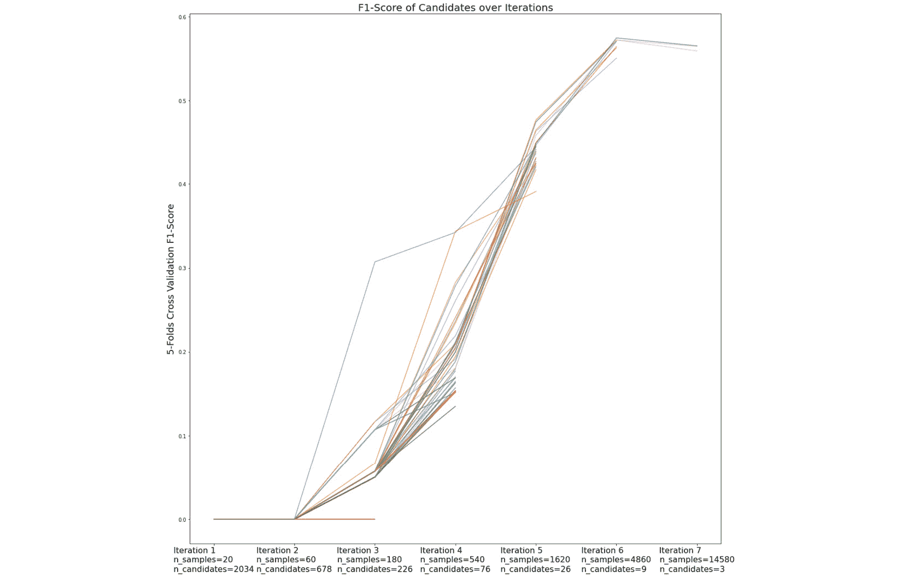

# *第七章*：通过 Scikit 进行超参数调整

`scikit-learn`是数据科学家使用最多的 Python 包之一。此包提供了一系列的`scikit-learn`功能，还有其他针对超参数调整任务的包，这些包建立在`scikit-learn`之上或模仿其接口，例如`scikit-optimize`和`scikit-hyperband`。

在本章中，我们将学习与`scikit-learn`、`scikit-optimize`和`scikit-hyperband`相关的所有重要事项，以及如何利用它们来实现我们在前几章中学到的超参数调整方法。我们将从介绍如何安装每个包开始。然后，我们将学习如何利用这些包的默认配置，并讨论可用的配置及其使用方法。此外，我们还将讨论超参数调整方法的实现与我们在前几章中学到的理论之间的关系，因为在实现过程中可能会有一些细微的差异或调整。

最后，凭借前几章的知识，您还将能够理解如果出现错误或意外结果时会发生什么，并了解如何设置方法配置以匹配您特定的问题。

在本章中，我们将涵盖以下主要主题：

+   介绍 scikit

+   实现 Grid Search

+   实现 Random Search

+   实现 Coarse-to-Fine Search

+   实现 Successive Halving

+   实现 Hyper Band

+   实现 Bayesian Optimization Gaussian Process

+   实现 Bayesian Optimization Random Forest

+   实现 Bayesian Optimization Gradient Boosted Trees

# 技术要求

我们将学习如何使用`scikit-learn`、`scikit-optimize`和`scikit-hyperband`实现各种超参数调整方法。为了确保您能够复制本章中的代码示例，您需要以下要求：

+   Python 3（版本 3.7 或更高）

+   安装的`Pandas`包（版本 1.3.4 或更高）

+   安装的`NumPy`包（版本 1.21.2 或更高）

+   安装的`Scipy`包（版本 1.7.3 或更高）

+   安装的`Matplotlib`包（版本 3.5.0 或更高）

+   安装的`scikit-learn`包（版本 1.0.1 或更高）

+   安装的`scikit-optimize`包（版本 0.9.0 或更高）

+   安装的`scikit-hyperband`包（直接从 GitHub 仓库克隆）

本章的所有代码示例都可以在 GitHub 上找到：[`github.com/PacktPublishing/Hyperparameter-Tuning-with-Python`](https://github.com/PacktPublishing/Hyperparameter-Tuning-with-Python)。

# 介绍 Scikit

`scikit-learn`，通常称为`sklearn`包，其接口在许多实现类中保持一致性。

例如，所有实现的 ML 模型或`sklearn`都有相同的`fit()`和`predict()`方法，分别用于在训练数据上拟合模型和在测试数据上评估拟合的模型。当与数据预处理程序或`sklearn`一起工作时，每个预处理程序都有典型的`fit()`、`transform()`和`fit_transform()`方法，分别用于拟合预处理程序、使用拟合的预处理程序转换新数据以及直接拟合和转换用于拟合预处理程序的数据。

在*第一章**，评估机器学习模型*中，我们学习了如何通过交叉验证的概念利用`sklearn`来评估 ML 模型的性能，其中完整的数据被分成几个部分，如训练数据、验证数据和测试数据。在*第三章至第六章*中，我们始终使用交叉验证分数作为我们的目标函数。虽然我们可以手动执行超参数调整并基于分割数据计算交叉验证分数，但`sklearn`提供了专门用于超参数调整的类，这些类在调整过程中使用交叉验证分数作为目标函数。`sklearn`中实现了几个超参数调整类，例如`GridSearchCV`、`RandomizedSearchCV`、`HalvingGridSearchCV`和`HalvingRandomSearchCV`。

此外，`sklearn`中实现的所有超参数调整类都有一个一致的接口。我们可以使用`fit()`方法在给定数据上执行超参数调整，其中交叉验证分数用作目标函数。然后，我们可以使用`best_params_`属性来获取最佳的超参数集，使用`best_score_`属性来获取从最佳超参数集中得到的平均交叉验证分数，以及使用`cv_results_`属性来获取超参数调整过程的详细信息，包括但不限于每个折中测试的超参数集的目标函数分数。

为了防止在执行数据预处理步骤时（参见*第一章**，评估机器学习模型*），数据泄露，`sklearn`也提供了一个`Pipeline`对象，可以与超参数调整类一起使用。这个`Pipeline`对象将确保任何数据预处理步骤仅在交叉验证期间基于训练集进行拟合。本质上，这个对象只是一个由几个`sklearn` *转换器和估计器*组成的*链*，它具有相同的`fit()`和`predict()`方法，就像一个普通的`sklearn`估计器一样。

虽然`sklearn`可以用于许多与机器学习相关的任务，但通常被称为`sklearn`的`scikit-optimize`，可以用于实现`skopt`，它与`sklearn`具有非常相似的接口，因此一旦你已经熟悉了`sklearn`本身，你将很容易熟悉`skopt`。在`skopt`中实现的主要超参数调整类是`BayesSearchCV`类。

`skopt`在`BayesSearchCV`类中提供了四种优化器的实现，即用作优化器的`sklearn`。请注意，在这里，优化器指的是`skopt`提供了各种**获取函数**的实现，即**期望改进**（**EI**）、**改进概率**（**PI**）和**下置信界**（**LCB**）函数。

最后但同样重要的是，`scikit-hyperband`包。此外，这个包建立在`sklearn`之上，专门为 HB 实现设计。在这个包中实现的超参数调整类是`HyperbandSearchCV`。它也具有与`sklearn`非常相似的接口。

对于`sklearn`和`skopt`，你可以像通常安装其他包一样通过`pip install`轻松安装它们。至于`scikit-hyperband`，该包的作者没有将其放在`sklearn`上。幸运的是，有一个分支版本（[`github.com/louisowen6/scikit-hyperband`](https://github.com/louisowen6/scikit-hyperband)）的原始仓库，它与较新版本的`sklearn`（`1.0.1`或更高版本）配合得很好。要安装`scikit-hyperband`，请按照以下步骤操作：

1.  将[`github.com/louisowen6/scikit-hyperband`](https://github.com/louisowen6/scikit-hyperband)克隆到你的本地机器：

    ```py
    git clone https://github.com/louisowen6/scikit-hyperband
    ```

1.  打开克隆的仓库：

    ```py
    cd scikit-hyperband
    ```

1.  将`hyperband`文件夹移动到你的工作目录：

    ```py
    mv hyperband "path/to/your/working/directory"
    ```

现在你已经了解了`scikit-learn`、`scikit-optimize`和`scikit-hyperband`包，在接下来的章节中，我们将学习如何利用它们来实现各种超参数调整方法。

# 实现网格搜索

要实现一个`for loop`，测试搜索空间中所有可能的超参数值。然而，通过使用`sklearn`的网格搜索实现`GridSearchCV`，我们可以得到更简洁的代码，因为我们只需要调用一行代码来实例化类。

让我们通过一个例子来看看我们如何利用`GridSearchCV`来执行网格搜索。请注意，在这个例子中，我们正在对一个 RF 模型进行超参数调整。我们将使用`sklearn`对 RF 的实现，即`RandomForestClassifier`。在这个例子中使用的数据集是 Kaggle 上提供的*银行数据集 – 营销目标*（[`www.kaggle.com/datasets/prakharrathi25/banking-dataset-marketing-targets`](https://www.kaggle.com/datasets/prakharrathi25/banking-dataset-marketing-targets)）。

原始数据来源

这份数据最初发表在 Sérgio Moro、Paulo Cortez 和 Paulo Rita 合著的《A Data-Driven Approach to Predict the Success of Bank Telemarketing》一文中，该文发表于《Decision Support Systems》，Elsevier 出版社，第 62 卷第 22-31 页，2014 年 6 月([`doi.org/10.1016/j.dss.2014.03.001`](https://doi.org/10.1016/j.dss.2014.03.001))。

这是一个二元分类数据集，包含与银行机构进行的营销活动相关的 16 个特征。目标变量由两个类别组成，*是*或*否*，表示银行客户的存款是否已订阅定期存款。因此，在这个数据集上训练机器学习模型的目的是确定客户是否可能想要订阅定期存款。更多详情，请参考 Kaggle 页面上的描述：

1.  提供了两个数据集，即`train.csv`数据集和`test.csv`数据集。然而，我们不会使用提供的`test.csv`数据集，因为它直接从训练数据中采样。我们将使用`sklearn`中的`train_test_split`函数手动将`train.csv`分割成两个子集，即训练集和测试集（见*第一章**，评估机器学习模型*）。我们将`test_size`参数设置为`0.1`，这意味着训练集将有`40,689`行，测试集将有`4,522`行。以下代码展示了如何加载数据并执行训练集和测试集的分割：

    ```py
    import pandas as pd
    from sklearn.model_selection import train_test_split
    df = pd.read_csv("train.csv",sep=";")
    df_train, df_test = train_test_split(df, test_size=0.1, random_state=0)
    ```

在提供的数据中的 16 个特征中，有 7 个是数值特征，9 个是分类特征。至于目标类别的分布，训练和测试数据集中都有 12%是*是*，88%是*否*。这意味着我们不能使用准确率作为我们的指标，因为我们有一个不平衡的类别问题——目标类别分布非常倾斜的情况。因此，在这个例子中，我们将使用 F1 分数。

1.  在执行网格搜索之前，让我们看看使用默认超参数值的*RandomForestClassifier*是如何工作的。此外，我们现在也尝试仅使用这七个数值特征来训练我们的模型。以下代码展示了如何获取仅数值特征，在训练集上使用这些特征训练模型，并最终在测试集上评估模型：

    ```py
    import numpy as np
    from sklearn.ensemble import RandomForestClassifier
    from sklearn.metrics import f1_score
    ```

`X_train_numerical`变量仅存储训练数据中的数值特征：

```py
X_train_numerical = df_train.select_dtypes(include=np.number).drop(columns=['y'])
y_train = df_train['y']
```

`X_test_numerical`变量仅存储测试数据中的数值特征：

```py
X_test_numerical = df_test.select_dtypes(include=np.number).drop(columns=['y'])
y_test = df_test['y']
```

在训练数据上拟合模型：

```py
model = RandomForestClassifier(random_state=0)
model.fit(X_train_numerical,y_train)
```

在测试数据上评估模型：

```py
y_pred = model.predict(X_test_numerical)
print(f1_score(y_test, y_pred))
```

基于前面的代码，我们在测试集上对训练好的 RF 模型进行测试时，F1-Score 大约为`0.436`。请记住，这个结果仅使用了数值特征和`RandomForestClassifier`的默认超参数。

1.  在执行网格搜索之前，我们必须以列表字典格式定义超参数空间，其中键指的是超参数的名称，而列表包含我们想要为每个超参数测试的所有值。比如说，我们为`RandomForestClassifier`定义超参数空间如下：

    ```py
    hyperparameter_space = {
    "n_estimators": [25,50,100,150,200],
    "criterion": ["gini", "entropy"],
    "max_depth": [3, 5, 10, 15, 20, None],
    "class_weight": ["balanced","balanced_subsample"],
    "min_samples_split": [0.01,0.1,0.25,0.5,0.75,1.0],
    }
    ```

1.  一旦我们定义了超参数空间，我们就可以将`GridSearchCV`类应用于训练数据，使用最佳的超参数集在全部训练数据上训练一个新的模型，然后在该最终训练模型上评估测试数据，正如我们在*第 3-6 章*中学到的那样。以下代码展示了如何进行：

    ```py
    from sklearn.model_selection import GridSearchCV
    ```

初始化模型：

```py
model = RandomForestClassifier(random_state=0)
```

初始化`GridSearchCV`类：

```py
clf = GridSearchCV(model, hyperparameter_space, 
                   scoring='f1', cv=5, 
                   n_jobs=-1, refit = True)
```

运行`GridSearchCV`类：

```py
clf.fit(X_train_numerical, y_train)
```

打印最佳的超参数集：

```py
print(clf.best_params_,clf.best_score_)
```

在测试数据上评估最终训练模型：

```py
print(clf.score(X_test_numerical,y_test))
```

通过利用`sklearn`对网格搜索的实现而不是从头编写代码，看看我们的代码是多么的整洁！注意，我们只需要将`sklearn`的估计器和超参数空间字典传递给`GridSearchCV`类，其余的将由`sklearn`处理。在这个例子中，我们还向类传递了几个额外的参数，例如`scoring='f1'`、`cv=5`、`n_jobs=-1`和`refit=True`。

如其名所示，`scoring`参数控制我们在交叉验证期间想要使用的评分策略。虽然我们的目标函数始终是交叉验证分数，但此参数控制我们想要用作度量标准的分数类型。在这个例子中，我们使用 F1 分数作为度量标准。然而，您也可以传递一个自定义的可调用函数作为评分策略。

Sklearn 中可用的评分策略

您可以参考[`scikit-learn.org/stable/modules/model_evaluation.html#scoring-parameter`](https://scikit-learn.org/stable/modules/model_evaluation.html#scoring-parameter)了解`sklearn`实现的所有评分策略，如果您想实现自己的自定义评分策略，请参考[`scikit-learn.org/stable/modules/model_evaluation.html#scoring`](https://scikit-learn.org/stable/modules/model_evaluation.html#scoring)。

`cv`参数表示您想要执行多少个交叉验证折。`n_jobs`参数控制您想要并行运行多少个作业。如果您决定使用所有处理器，您只需将`n_jobs`设置为`-1`即可，就像我们在例子中所做的那样。

最后但同样重要的是，我们有`refit`参数。这个布尔参数负责决定在超参数调整过程结束后，我们是否想要使用最佳的超参数集在完整的训练集上重新拟合我们的模型。在这个例子中，我们设置`refit=True`，这意味着`sklearn`将自动使用最佳的超参数集在完整的训练集上重新拟合我们的随机森林模型。在执行超参数调整后重新在完整的训练集上重新训练我们的模型非常重要，因为我们只利用了训练集的子集。当初始化`GridSearchCV`类时，你可以控制的其他参数有几个。更多详情，你可以参考`sklearn`的官方页面（[`scikit-learn.org/stable/modules/generated/sklearn.model_selection.GridSearchCV.html`](https://scikit-learn.org/stable/modules/generated/sklearn.model_selection.GridSearchCV.html)）。

让我们回到我们的例子。通过在预定义的超参数空间中执行网格搜索，我们在测试集上的评估中得到了`0.495`的 F1 分数。最佳的超参数集是`{'class_weight': 'balanced', 'criterion': 'entropy', 'min_samples_split': 0.01, 'n_estimators': 150}`，其目标函数分数为`0.493`。请注意，我们可以通过`best_params_`和`best_score_`属性分别获取最佳的超参数集及其目标函数分数。还不错！我们在 F1 分数上获得了大约`0.06`的改进。然而，请注意，我们仍然只使用了数值特征。

接下来，我们将尝试利用不仅数值特征，还包括数据中的分类特征。为了能够利用这些分类特征，我们需要执行**分类编码**预处理步骤。为什么？因为机器学习模型无法理解非数值特征。因此，我们需要将这些非数值特征转换为数值，以便机器学习模型能够利用这些特征。

记住，当我们想要执行任何数据预处理步骤时，我们必须非常小心，以防止出现数据泄露问题，我们可能会将部分测试数据引入训练数据（参见*第一章**，评估机器学习模型*）。为了防止这个问题，我们可以利用`sklearn`中的`Pipeline`对象。因此，我们不仅可以将估计器传递给`GridSearchCV`类，还可以传递一个由一系列数据预处理器和估计器组成的`Pipeline`对象：

1.  由于在这个例子中，并非所有我们的特征都是分类的，我们只想对那些非数值特征执行分类编码，我们可以利用`ColumnTransformer`类来指定我们想要应用分类编码步骤的特征。假设我们还想对数值特征执行归一化预处理步骤。我们还可以将这些数值特征传递给`ColumnTransformer`类，以及归一化转换器。然后，它将自动仅对那些数值特征应用归一化步骤。以下代码展示了如何使用`ColumnTransformer`创建这样的`Pipeline`对象，其中我们使用`StandardScaler`进行归一化步骤，使用`OneHotEncoder`进行分类编码步骤：

    ```py
    from sklearn.preprocessing import StandardScaler, OneHotEncoder
    from sklearn.compose import ColumnTransformer
    from sklearn.pipeline import Pipeline
    ```

获取数值特征和分类特征的列表：

```py
numerical_feats = list(df_train.drop(columns='y').select_dtypes(include=np.number).columns)
categorical_feats = list(df_train.drop(columns='y').select_dtypes(exclude=np.number).columns)
```

初始化数值特征和分类特征的预处理程序：

```py
numeric_preprocessor = StandardScaler()
categorical_preprocessor = OneHotEncoder(handle_unknown="ignore")
```

将每个预处理程序委托给相应的特征：

```py
preprocessor = ColumnTransformer(
    transformers=[
        ("num", numeric_preprocessor, numerical_feats),
        ("cat", categorical_preprocessor, categorical_feats),
    ])
```

创建预处理程序和模型的管道。在这个例子中，我们将预处理步骤命名为*“preprocessor”*，建模步骤命名为*“model”*：

```py
pipe = Pipeline(
    steps=[("preprocessor", preprocessor), 
           ("model", RandomForestClassifier(random_state=0))])
```

如前述代码块所示，`ColumnTransformer`类负责将每个预处理程序委托给相应的特征。然后，我们只需通过单个预处理程序变量重复使用它，以执行所有预处理步骤。最后，我们可以创建一个由预处理程序变量和`RandomForestClassifier`组成的管道。请注意，在`ColumnTransformer`类和`Pipeline`类中，我们还需要分别提供每个预处理程序和管道步骤的名称。

1.  现在我们已经定义了管道，我们可以通过利用管道中定义的所有特征和预处理程序来查看我们的模型在测试集上的表现（不进行超参数调整）。以下代码展示了我们如何直接使用管道执行与之前相同的`fit()`和`predict()`方法：

    ```py
    pipe.fit(X_train_full,y_train)
    y_pred = pipe.predict(X_test_full)
    print(f1_score(y_test, y_pred))
    ```

根据前面的代码，我们在测试训练好的管道时，F1 分数大约为`0.516`。

1.  接下来，我们也可以开始对管道执行网格搜索。然而，在我们能够这样做之前，我们需要重新定义超参数空间。我们需要更改字典中的键，格式为`<estimator_name_in_pipeline>__<hyperparameter_name>`。以下是我们重新定义的超参数空间：

    ```py
    hyperparameter_space = { 
    "model__n_estimators": [25,50,100,150,200], 
    "model__criterion": ["gini", "entropy"], 
    "model__class_weight": ["balanced", "balanced_subsample"],
    "model__min_samples_split": [0.01,0.1,0.25,0.5,0.75,1.0], 
    }
    ```

1.  以下代码展示了如何对管道而不是估计器本身执行网格搜索。本质上，代码与上一个版本相同。唯一的区别是我们正在对管道和数据中的所有特征而不是仅数值特征执行网格搜索。

初始化`GridSearchCV`类：

```py
clf = GridSearchCV(pipe, hyperparameter_space, 
                   scoring = 'f1', cv=5, 
                   n_jobs=-1, refit = True
```

运行`GridSearchCV`类：

```py
clf.fit(X_train_full, y_train)
```

打印最佳超参数集：

```py
print(clf.best_params_, clf.best_score_)
```

在测试数据上评估最终训练好的模型：

```py
print(clf.score(X_test_full, y_test))
```

根据前面的代码，我们在测试最终训练好的 RF 模型时，在测试集上使用最佳超参数集得到了大约`0.549`的 F1 分数。最佳超参数集是`{‘model__class_weight’: ‘balanced_subsample’, ‘model__criterion’: ‘gini’, ‘model__min_samples_split’: 0.01, ‘model__n_estimators’: 100}`，其目标函数分数为`0.549`。

值得注意的是，我们还可以*在管道中创建管道*。例如，我们可以创建一个由缺失值插补和归一化模块组成的`numeric_preprocessor`管道。以下代码展示了我们如何创建这样的管道。`SimpleImputer`类是来自`sklearn`的缺失值插补转换器，它可以帮助我们在存在缺失值时执行均值、中位数、众数或常数插补策略：

```py
from sklearn.impute import SimpleImputer
```

```py
numeric_preprocessor = Pipeline(
```

```py
steps=[("missing_value_imputation", SimpleImputer(strategy="mean")),     ("normalization", StandardScaler())]
```

```py
)
```

在本节中，我们学习了如何在`sklearn`中通过`GridSearchCV`类实现网格搜索，从定义超参数空间开始，设置`GridSearchCV`类的每个重要参数，学习如何利用`Pipeline`和`ColumnTransformer`类来防止数据泄露问题，以及学习如何在管道中创建管道。

在下一节中，我们将学习如何在`sklearn`中通过`RandomizedSearchCV`实现随机搜索。

# 实现`sklearn`的随机搜索

实现`sklearn`与实现网格搜索非常相似。主要区别是我们必须提供试验次数或迭代次数，因为随机搜索不会尝试超参数空间中的所有可能组合。此外，在定义搜索空间时，我们必须为每个超参数提供相应的分布。在`sklearn`中，随机搜索是通过`RandomizedSearchCV`类实现的。

为了理解我们如何在`sklearn`中实现随机搜索，让我们使用*实现网格搜索*部分中的相同示例。让我们直接尝试使用数据集中可用的所有特征。所有管道创建过程都是完全相同的，所以我们将直接跳转到如何定义超参数空间和`RandomizedSearchCV`类的过程中。以下代码展示了如何为空间中的每个超参数定义相应的分布：

```py
from scipy.stats import randint, truncnorm
```

```py
hyperparameter_space = { 
```

```py
"model__n_estimators": randint(5, 200), 
```

```py
"model__criterion": ["gini", "entropy"],
```

```py
"model__class_weight": ["balanced","balanced_subsample"],
```

```py
"model__min_samples_split": truncnorm(a=0,b=0.5,loc=0.005, scale=0.01),
```

```py
}
```

如您所见，超参数空间与我们之前在*实现网格搜索*部分中定义的相当不同。在这里，我们还在每个超参数上指定了分布，其中`randint`和`truncnorm`用于`n_estimators`和`min_samples_split`超参数。至于`criterion`和`class_weight`，我们仍然使用与之前搜索空间相同的配置。请注意，*不指定任何分布*意味着我们对超参数应用了*均匀分布*，其中所有值都有相同的机会被测试。

本质上，`randint`分布是对离散变量的均匀分布，而`truncnorm`代表截断正态分布，正如其名称所暗示的，它是一个在特定范围内有界的修改后的正态分布。在这个例子中，范围被限制在`a=0`和`b=0.5`之间，均值为`loc=0.005`，标准差为`scale=0.01`。

超参数分布：

有许多其他可用的分布，您可以使用。`sklearn`接受所有具有`rvs`方法的分布，就像`Scipy`中的分布实现一样。本质上，这个方法只是一个从指定分布中采样值的方法。有关更多详细信息，请参阅`Scipy`的官方文档页面（[`docs.scipy.org/doc/scipy/reference/stats.html#probability-distributions`](https://docs.scipy.org/doc/scipy/reference/stats.html#probability-distributions)）。

当初始化`RandomizedSearchCV`类时，我们还需要定义`n_iter`和`random_state`参数，分别代表迭代次数和随机种子。以下代码展示了如何执行与*实现网格搜索*部分中定义的相同管道的随机搜索。与*实现网格搜索*部分中的示例相比，该示例仅执行`120`次网格搜索迭代，而在这里，我们执行`200`次随机搜索，因为我们设置了`n_iter=200`。此外，我们有一个更大的超参数空间，因为我们增加了`n_estimators`和`min_samples_split`超参数值的粒度：

```py
from sklearn.model_selection import RandomizedSearchCV
```

初始化`RandomizedSearchCV`类：

```py
clf = RandomizedSearchCV(pipe, hyperparameter_space, 
```

```py
                         n_iter = 200, random_state = 0,
```

```py
                         scoring = 'f1', cv=5, 
```

```py
                         n_jobs=-1, refit = True)
```

运行`RandomizedSearchCV`类：

```py
clf.fit(X_train_full, y_train)
```

打印最佳超参数集：

```py
print(clf.best_params_, clf.best_score_)
```

在测试数据上评估最终训练的模型：

```py
print(clf.score(X_test_full, y_test))
```

根据前面的代码，我们在测试集上使用最佳超参数集测试最终训练的 RF 模型时，F1 分数大约为`0.563`。最佳超参数集是`{‘model__class_weight’: ‘balanced_subsample’, ‘model__criterion’: ‘entropy’, ‘model__min_samples_split’: 0.005155815445940717, ‘model__n_estimators’: 187}`，目标函数得分为`0.562`。

在本节中，我们学习了如何通过`RandomizedSearchCV`类在`sklearn`中实现随机搜索，从定义超参数空间到设置`RandomizedSearchCV`类的每个重要参数。在下一节中，我们将学习如何使用`sklearn`执行 CFS（粗到细搜索）。

# 实现粗到细搜索：

在*技术要求*部分提到的仓库中，您可以在`sklearn`包中找到实现的自定义类`CoarseToFineSearchCV`。

让我们使用与 *实现随机搜索* 部分相同的示例和超参数空间，以了解 `CoarseToFineSearchCV` 在实际中的应用。请注意，此实现中的 CFS 仅利用随机搜索，并使用前 *N* 百分位方案来定义每一轮中的有希望子空间，类似于在 *第六章* 中显示的示例。然而，*你可以根据自己的偏好编辑代码*，因为 CFS 是一个非常简单的可自定义模块的方法。

以下代码展示了如何使用 `CoarseToFineSearchCV` 类执行 CFS。值得注意的是，此类具有与 `RandomizedSearchCV` 类非常相似的参数，但有几个额外的参数。`random_iters` 参数控制每个随机搜索试验的迭代次数，`top_n_percentile` 控制在定义有希望子空间的前 N 百分位中的 *N* 值（参见 *第六章*），`n_iter` 定义要执行的 CFS 迭代次数，而 `continuous_hyperparams` 存储预定义空间中的连续超参数列表。

初始化 `CoarseToFineSearchCV` 类：

```py
clf = CoarseToFineSearchCV(pipe, hyperparameter_space,
```

```py
random_iters=25, top_n_percentile=50, n_iter=10, 
```

```py
continuous_hyperparams=['model__min_samples_split'],
```

```py
random_state=0, scoring='f1', cv=5, 
```

```py
n_jobs=-1, refit=True)
```

运行 `CoarseToFineSearchCV` 类：

```py
clf.fit(X_train_full, y_train)
```

打印最佳超参数集：

```py
print(clf.best_params_, clf.best_score_)
```

在测试数据上评估最终训练好的模型：

```py
y_pred = clf.predict(X_test_full)
```

```py
print(f1_score(y_test, y_pred))
```

根据前面的代码，我们在使用最佳超参数集在测试集上测试最终训练好的 RF 模型时，F1 分数大约为 `0.561`。最佳超参数集是 `{‘model__class_weight’: ‘balanced_subsample’，‘model__criterion’: ‘entropy’，‘model__min_samples_split’: 0.005867409821769845，‘model__n_estimators’: 106}`，目标函数得分为 `0.560`。

在本节中，我们学习了如何通过 `CoarseToFineSearchCV` 类在 `sklearn` 上实现 CFS。在下一节中，我们将学习如何使用 `sklearn` 执行 SH。

# 实现连续减半法

与 CFS 类似，`sklearn` 中有 `HalvingGridSearchCV` 和 `HalvingRandomSearchCV`。正如它们的名称所暗示的，前者是 SH 的实现，在每个 SH 迭代中使用网格搜索，而后者使用随机搜索。

默认情况下，`sklearn` 中的 SH 实现使用样本数量，即 *n_samples*，作为 SH 中预算或资源的定义。然而，也可以使用其他定义来定义预算。例如，我们可以使用 RF 中的 `n_estimators` 作为预算，而不是使用样本数量。值得注意的是，如果它是超参数空间的一部分，则不能使用 `n_estimators` 或任何其他超参数来定义预算。

`HalvingGridSearchCV`和`HalvingRandomSearchCV`都有类似的标准 SH 参数来控制 SH 迭代的工作方式，例如`factor`参数，它指的是 SH 的乘数因子，`resource`指的是我们想要使用的预算定义，`max_resources`指的是最大预算或资源，而`min_resources`指的是第一次迭代中要使用的最小资源数量。默认情况下，`max_resources`参数设置为*auto*，这意味着当`resource=’n_samples’`时，它将使用我们拥有的总样本数。另一方面，`sklearn`实现了一个启发式方法来定义`min_resources`参数的默认值，称为*smallest*。这个启发式方法将确保我们有一个小的`min_resources`值。

对于`HalvingRandomSearchCV`来说，还有一个`n_candidates`参数，它指的是第一次迭代中要评估的初始候选者数量。请注意，这个参数在`HalvingGridSearchCV`中不可用，因为它将自动评估预定义空间中的所有超参数候选者。值得注意的是，`sklearn`实现了一个名为*exhaust*的策略来定义`n_candidates`参数的默认值。这个策略确保我们在第一次迭代中评估足够的候选者，以便在最后的 SH 迭代中尽可能多地利用资源。

除了那些标准 SH 参数之外，这两个类也都有`aggressive_elimination`参数，当资源较少时可以利用。如果这个布尔参数设置为`True`，`sklearn`将自动重新运行第一次 SH 迭代几次，直到候选者数量足够小。这个参数的目标是确保我们只在最后的 SH 迭代中评估最多`factor`个候选者。请注意，这个参数只在`sklearn`中实现，原始 SH 没有将这个策略作为调整方法的一部分（参见*第六章*）。

与`GridSearchCV`和`RandomizedSearchCV`类似，`HalvingGridSearchCV`和`HalvingRandomSearchCV`也有用于超参数调整的常用`sklearn`参数，例如`cv`、`scoring`、`refit`、`random_state`和`n_jobs`。

sklearn 中 SH 的实验特性

值得注意的是，根据`sklearn`的`1.0.2`版本，SH 的实现仍然处于实验阶段。这意味着类的实现或接口可能会有变化，而无需任何降级周期。

以下代码展示了`HalvingRandomSearchCV`如何使用其默认的 SH 参数进行工作。请注意，我们仍然使用与*实现随机搜索*部分相同的示例和超参数空间。也值得注意，在这个例子中我们只使用了`HalvingRandomSearchCV`类，因为`HalvingGridSearchCV`有一个非常相似的接口：

```py
from sklearn.experimental import enable_halving_search_cv
```

```py
from sklearn.model_selection import HalvingRandomSearchCV
```

初始化`HalvingRandomSearchCV`类：

```py
clf = HalvingRandomSearchCV(pipe, hyperparameter_space, 
```

```py
                            factor=3,
```

```py
 aggressive_elimination=False,
```

```py
                            random_state = 0,
```

```py
                            scoring = 'f1', cv=5, 
```

```py
                            n_jobs=-1, refit = True)
```

运行`HalvingRandomSearchCV`类：

```py
clf.fit(X_train_full, y_train)
```

打印最佳超参数集：

```py
print(clf.best_params_, clf.best_score_)
```

在测试数据上评估最终训练的模型：

```py
print(clf.score(X_test_full, y_test))
```

基于前面的代码，我们在测试集上使用最佳超参数集测试最终训练好的 RF 模型时，F1 分数大约为`0.556`。最佳超参数集为`{‘model__class_weight’: ‘balanced_subsample’, ‘model__criterion’: ‘entropy’, ‘model__min_samples_split’: 0.007286406330027324, ‘model__n_estimators’: 42}`，其目标函数得分为`0.565`。

1.  以下代码展示了如何生成一个显示每个 SH 迭代中调整过程的图：

    ```py
    import matplotlib.pyplot as plt
    ```

获取每个试验的拟合历史：

```py
results = pd.DataFrame(clf.cv_results_)
results["params_str"] = results.params.apply(str)
results.drop_duplicates(subset=("params_str", "iter"), inplace=True)
mean_scores = results.pivot(
index="iter", columns="params_str", values="mean_test_score")
```

绘制每个试验的拟合历史图：

```py
fig, ax = plt.subplots(figsize=(16,16))
ax = mean_scores.plot(legend=False, alpha=0.6, ax=ax)
labels = [
    f"Iteration {i+1}\nn_samples={clf.n_resources_[i]}\nn_candidates={clf.n_candidates_[i]}"
    for i in range(clf.n_iterations_)]
ax.set_xticks(range(clf.n_iterations_))
ax.set_xticklabels(labels, rotation=0, multialignment="left",size=16)
ax.set_title("F1-Score of Candidates over Iterations",size=20)
ax.set_ylabel("5-Folds Cross Validation F1-Score", fontsize=18)
ax.set_xlabel("")
plt.tight_layout()
plt.show()
```

1.  基于前面的代码，我们得到以下图：



图 7.1 – SH 超参数调整过程

根据*图 7.1*，我们可以看到在最后一次迭代中，我们只使用了大约 14,000 个样本，而我们的训练数据中有大约 40,000 个样本。实际上，这并不是一个理想的情况，因为在最后一次 SH 迭代中，有太多的样本没有被利用。我们可以通过`min_resources`和`n_candidates`参数更改`sklearn`设置的 SH 参数的默认值，以确保在最后一次迭代中尽可能多地利用资源。

在本节中，我们学习了如何通过`HalvingRandomSearchCV`和`HalvingGridSearchCV`类在`sklearn`中实现 SH。我们还学习了这两个类中所有重要的参数。在下一节中，我们将学习如何使用`scikit-hyperband`执行 HB。

# 实现 Hyper Band

Successive Halving 的扩展，`scikit-hyperband`包。这个包建立在`sklearn`之上，这意味着它也为`GridSearchCV`、`RandomizedSearchCV`、`HalvingGridSearchCV`和`HalvingRandomSearchCV`提供了非常相似的接口。

与`sklearn`实现中默认的 SH 预算定义相比，*Scikit-Hyperband 将预算定义为*树集成中的估计器数量，即*n_estimators*，或者使用随机梯度下降训练的估计器的迭代次数，例如 XGBoost 算法。此外，我们还可以使用估计器中存在的任何其他超参数作为预算定义。然而，`scikit-hyperband`*不允许我们将样本数量作为预算定义*。

让我们使用与*实现 Successive Halving*部分相同的示例，但使用不同的超参数空间。在这里，我们使用估计器数量，即*n_estimators*，作为资源，这意味着我们必须从搜索空间中移除这个超参数。请注意，当您将其用作资源定义时，您还必须从空间中移除任何其他超参数，就像在`sklearn`的 SH 实现中一样。

以下代码展示了 `HyperbandSearchCV` 的工作原理。`resource_param` 参数指的是用作预算定义的超参数。`eta` 参数实际上与 `HalvingRandomSearchCV` 或 `HalvingGridSearchCV` 类中的因子参数相同，它指的是每个 SH 运行的乘数因子。`min_iter` 和 `max_iter` 参数指的是所有括号的最小和最大资源。请注意，与 `sklearn` 实现的 SH 相比，这里没有自动策略来设置 `min_iter` 和 `max_iter` 参数的值。

剩余的 `HyperbandSearchCV` 参数与其他任何 `sklearn` 实现的超参数调整方法类似。值得注意的是，本书中使用的 HB 实现是 `scikit-hyperband` 包的修改版。请检查本书 GitHub 仓库中的以下文件夹（[`github.com/PacktPublishing/Hyperparameter-Tuning-with-Python/tree/main/hyperband`](https://github.com/PacktPublishing/Hyperparameter-Tuning-with-Python/tree/main/hyperband)）：

```py
from hyperband import HyperbandSearchCV
```

初始化 `HyperbandSearchCV` 类：

```py
clf = HyperbandSearchCV(pipe, hyperparameter_space,
```

```py
                        resource_param='model__n_estimators',
```

```py
                        eta=3, min_iter=1, max_iter=100,
```

```py
                        random_state = 0,
```

```py
                        scoring = 'f1', cv=5, 
```

```py
                        n_jobs=-1, refit = True)
```

运行 `HyperbandSearchCV` 类：

```py
clf.fit(X_train_full, y_train)
```

打印最佳超参数集：

```py
print(clf.best_params_, clf.best_score_)
```

在测试数据上评估最终训练好的模型：

```py
print(clf.score(X_test_full, y_test))
```

根据前面的代码，我们在测试集上使用最佳超参数集测试最终训练好的 RF 模型时，F1 分数大约为 `0.569`。最佳超参数集为 `{‘model__class_weight’: ‘balanced’, ‘model__criterion’: ‘entropy’, ‘model__min_samples_split’: 0.0055643644642829684, `model__n_estimators`: 33}`，目标函数得分为 `0.560`。请注意，尽管我们从搜索空间中移除了 `model__n_estimators`，但 `HyperbandSearchCV` 仍然通过从最佳括号中选择来输出此超参数的最佳值。

在本节中，我们学习了如何借助 `scikit-hyperband` 包以及 `HyperbandSearchCV` 类的所有重要参数来实现 HB。在下一节中，我们将学习如何使用 `scikit-optimize` 进行贝叶斯优化。

# 实现贝叶斯优化高斯过程

`skopt` 包。与 `scikit-hyperband` 类似，此包也是建立在 `sklearn` 包之上，这意味着实现的贝叶斯优化调整类的接口与 `GridSearchCV`、`RandomizedSearchCV`、`HalvingGridSearchCV`、`HalvingRandomSearchCV` 和 `HyperbandSearchCV` 非常相似。

然而，与 `sklearn` 或 `scikit-hyperband` 不同，后者可以直接与 `scipy` 中实现的分布一起工作，在 `skopt` 中，我们只能在定义超参数空间时使用该包提供的包装器。包装器是在 `skopt.space.Dimension` 实例中定义的，包括三种类型的维度，如 `Real`、`Integer` 和 `Categorical`。在每个维度包装器内部，`skopt` 实际上使用与 `scipy` 包中相同的分布。

默认情况下，`Real` 维度仅支持 `uniform` 和 `log-uniform` 分布，并可以接受任何实数/数值作为输入。至于 `Categorical` 维度，这个包装器只能接受分类值作为输入，正如其名称所暗示的。它将自动将分类值转换为整数甚至实数值，这意味着我们也可以利用分类超参数进行 BOGP！虽然我们可以这样做，但请记住，BOGP 只在真实变量方面表现最佳（见*第四章**，探索贝叶斯优化*）。最后，我们有 `Integer` 维度包装器。默认情况下，此包装器仅支持用于整数格式的 `uniform` 和 `log-uniform` 分布。`uniform` 分布将使用 `scipy` 中的 `randint` 分布，而 `log-uniform` 分布与 `Real` 包装器中使用的完全相同。

值得注意的是，我们也可以为其他分布编写自己的包装器；例如，我们在所有早期示例中都使用的 `truncnorm` 分布。实际上，你可以在*技术要求*部分提到的仓库中找到包含 `truncnorm`、`uniform` 和 `log-uniform` 分布的自定义 `Real` 包装器。以下代码展示了我们如何为 `BayesSearchCV` 定义超参数空间。请注意，我们仍在使用与*实现随机搜索*部分相同的示例和超参数空间。在这里，`Integer` 和 `Categorical` 是 `skopt` 提供的原始包装器，而 `Real` 包装器是包含 `truncnorm` 分布的自定义包装器：

```py
from skopt.space import *
```

```py
hyperparameter_space = {
```

```py
"model__n_estimators": Integer(low=5, high=200),
```

```py
"model__criterion": Categorical(["gini", "entropy"]),
```

```py
"model__class_weight": Categorical(["balanced","balanced_subsample"]),
```

```py
"model__min_samples_split": Real(low=0,high=0.5,prior="truncnorm",
```

```py
                                 **{"loc":0.005,"scale":0.01})
```

```py
}
```

`BayesSearchCV` 类的所有参数都与 `GridSearchCV`、`RandomizedSearchCV`、`HalvingGridSearchCV`、`HalvingRandomSearchCV` 或 `HyperbandSearchCV` 非常相似。`BayesSearchCV` 的唯一特定参数是 `n_iter` 和 `optimizer_kwargs`，分别表示要执行的总试验次数和包含 `Optimizer` 所有相关参数的参数。在这里，`Optimizer` 是一个表示每个贝叶斯优化步骤的类，从初始化初始点、拟合代理模型、使用获取函数的帮助来采样下一组超参数，以及优化获取函数（见*第四章*）。

有几个参数可以传递给`optimizer_kwargs`字典。`base_estimator`参数指的是要使用的代理模型类型。`skopt`已经准备了几个具有默认设置的代理模型，包括高斯过程或*GP*。`n_initial_points`参数指的是在开始实际贝叶斯优化步骤之前的随机初始点的数量。`initial_point_generator`参数指的是要使用的初始化方法。默认情况下，`skopt`将它们随机初始化。然而，您也可以将初始化方法更改为*lhs*、*sobol*、*halton*、*hammersly*或*grid*。

关于要使用的获取函数类型，默认情况下，`skopt`将使用`gp_hedge`，这是一个会自动选择`acq_func`参数中的`LCB`、`EI`和`PI`之一的获取函数。如*第四章*中所述，除了选择需要使用的获取函数外，我们还需要定义用于获取函数本身的优化器类型。`skopt`提供了两种获取函数优化器的选项，即随机采样（*sampling*）和*lbfgs*，或者*第四章*中提到的二阶优化策略类型。默认情况下，`skopt`将`acq_optimizer`参数设置为*auto*，这将自动选择何时使用*sampling*或*lbfgs*优化方法。

最后，我们还可以在`optimizer_kwargs`参数中传递`acq_func_kwargs`参数。我们可以将所有与获取函数相关的参数传递给这个`acq_func_kwargs`参数；例如，控制 BOGP 的探索和利用行为的`xi`参数，如*第四章*中所述。虽然`xi`参数负责控制 EI 和 PI 获取函数的探索与利用权衡，但还有一个名为`kappa`的参数，它负责与 LCB 获取函数相同的任务。`xi`或`kappa`的值越高，意味着我们更倾向于探索而非利用，反之亦然。有关`BayesSearchCV`类中所有可用参数的更多信息，您可以参考`skopt`包的官方 API 参考（[`scikit-optimize.github.io/stable/modules/classes.html`](https://scikit-optimize.github.io/stable/modules/classes.html))。

以下代码展示了我们如何利用`BayesSearchCV`在*实现随机搜索*部分相同的示例上执行 BOGP：

```py
from skopt import BayesSearchCV
```

初始化`BayesSearchCV`类：

```py
clf = BayesSearchCV(pipe, hyperparameter_space, n_iter=50,
```

```py
optimizer_kwargs={"base_estimator":"GP",
```

```py
                  "n_initial_points":10,
```

```py
                  "initial_point_generator":"random",
```

```py
                  "acq_func":"EI",
```

```py
                  "acq_optimizer":"auto",
```

```py
                  "n_jobs":-1,
```

```py
                  "random_state":0,
```

```py
                  "acq_func_kwargs": {"xi":0.01}
```

```py
                  },
```

```py
random_state = 0,
```

```py
scoring = 'f1', cv=5, 
```

```py
n_jobs=-1, refit = True)
```

运行`BayesSearchCV`类：

```py
clf.fit(X_train_full, y_train)
```

打印最佳超参数集：

```py
print(clf.best_params_, clf.best_score_)
```

在测试数据上评估最终训练好的模型：

```py
print(clf.score(X_test_full, y_test))
```

根据前面的代码，我们在测试集上使用最佳超参数集测试最终训练好的 RF 模型时，F1 分数大约为`0.539`。最佳超参数集为`{‘model__class_weight’: ‘balanced’, ‘model__criterion’: ‘entropy’, ‘model__min_samples_split’: 0.02363008892366518, ‘model__n_estimators’: 94}`，目标函数得分为`0.530`。

在本节中，我们学习了如何在`skopt`中实现 BOGP，以及`BayesSearchCV`类中所有重要的参数。值得注意的是，`skopt`还具有实验跟踪模块，包括几个用于绘制结果的本地支持。我们将在*第十三章*，*跟踪超参数调整实验*中了解更多关于这些模块的内容。在下一节中，我们将学习如何执行贝叶斯优化的另一种变体，该变体使用 RF 作为其代理模型，并通过`skopt`实现。

# 实现贝叶斯优化随机森林

**贝叶斯优化随机森林（BORF）**是贝叶斯优化超参数调整方法的另一种变体，它使用 RF 作为代理模型。请注意，虽然这个变体与**顺序模型算法配置（SMAC）**不同，尽管两者都使用 RF 作为代理模型（参见*第四章**，探索贝叶斯优化*）。

使用`skopt`实现 BORF 实际上与上一节中讨论的实现 BOGP 非常相似。我们只需要在`optimizer_kwargs`中将`base_estimator`参数更改为*RF*。让我们使用与*实现贝叶斯优化高斯过程*节中相同的示例，但将获取函数从*EI*更改为*LCB*。此外，我们将`acq_func_kwargs`中的`xi`参数更改为*kappa*，因为我们使用*LCB*作为获取函数。请注意，我们仍然可以使用相同的获取函数。这里所做的更改只是为了展示如何与`BayesSearchCV`类的接口交互：

```py
from skopt import BayesSearchCV
```

初始化`BayesSearchCV`类：

```py
clf = BayesSearchCV(pipe, hyperparameter_space, n_iter=50,
```

```py
optimizer_kwargs={"base_estimator":"RF",
```

```py
                  "n_initial_points":10,
```

```py
                  "initial_point_generator":"random",
```

```py
                  "acq_func":"LCB",
```

```py
                  "acq_optimizer":"auto",
```

```py
                  "n_jobs":-1,
```

```py
                  "random_state":0,
```

```py
                  "acq_func_kwargs": {"kappa":1.96}
```

```py
                  },
```

```py
random_state = 0,
```

```py
scoring = 'f1', cv=5, 
```

```py
n_jobs=-1, refit = True)
```

运行`BayesSearchCV`类：

```py
clf.fit(X_train_full, y_train)
```

打印最佳超参数集：

```py
print(clf.best_params_, clf.best_score_)
```

在测试数据上评估最终训练好的模型。

```py
print(clf.score(X_test_full, y_test))
```

根据前面的代码，我们在测试集上使用最佳超参数集测试最终训练好的 RF 模型时，F1 分数大约为`0.617`。最佳超参数集为`{‘model__class_weight’: ‘balanced_subsample’, ‘model__criterion’: ‘gini’, ‘model__min_samples_split’: 0.00043534042560206855, ‘model__n_estimators’: 85}`，目标函数得分为`0.616`。

在本节中，我们学习了如何在`skopt`中通过`BayesSearchCV`类实现 BORF。在下一节中，我们将学习如何执行贝叶斯优化的另一种变体，该变体使用梯度提升树作为其代理模型，并通过`skopt`实现。

# 实现贝叶斯优化梯度提升树

`skopt`允许我们传递任何其他来自`sklearn`的回归器作为`base_estimator`参数。然而，*GBRT*是`skopt`包中默认的代理模型的一部分，具有预定义的默认超参数值。

与*实现贝叶斯优化随机森林*部分类似，我们只需在`optimizer_kwargs`中将`base_estimator`参数更改为*GBRT*。以下代码展示了如何在`skopt`中实现 BOGBRT：

```py
from skopt import BayesSearchCV
```

初始化`BayesSearchCV`类：

```py
clf = BayesSearchCV(pipe, hyperparameter_space, n_iter=50,
```

```py
optimizer_kwargs={"base_estimator":"GBRT",
```

```py
                  "n_initial_points":10,
```

```py
                  "initial_point_generator":"random",
```

```py
                  "acq_func":"LCB",
```

```py
                  "acq_optimizer":"auto",
```

```py
                  "n_jobs":-1,
```

```py
                  "random_state":0,
```

```py
                  "acq_func_kwargs": {"kappa":1.96}
```

```py
                  },
```

```py
random_state = 0,
```

```py
scoring = 'f1', cv=5, 
```

```py
n_jobs=-1, refit = True)
```

运行`BayesSearchCV`类：

```py
clf.fit(X_train_full, y_train)
```

打印最佳超参数集：

```py
print(clf.best_params_, clf.best_score_)
```

在测试数据上评估最终训练好的模型：

```py
print(clf.score(X_test_full, y_test))
```

根据前面的代码，我们在测试集上使用最佳超参数集测试最终训练好的 RF 模型时，F1-Score 大约为`0.611`。最佳超参数集为`{‘model__class_weight’: ‘balanced_subsample’, ‘model__criterion’: ‘gini’, ‘model__min_samples_split’: 0.0005745541104096049, ‘model__n_estimators’: 143}`，其目标函数评分为`0.618`。

在本节中，我们通过使用与*实现贝叶斯优化随机森林*部分相同的示例，学习了如何在`skopt`中通过`BayesSearchCV`类实现 BOGBRT。

# 摘要

在本章中，我们学习了关于`scikit-learn`、`scikit-optimize`和`scikit-hyperband`包在超参数调整方面的所有重要内容。此外，我们还学习了如何使用这些包实现各种超参数调整方法，并理解每个类的重要参数以及它们如何与我们在前几章中学到的理论相关。从现在开始，你应该能够利用这些包来实现你选择的超参数调整方法，并最终提高你的 ML 模型的性能。凭借第 3 至 6 章的知识，你还将能够理解如果出现错误或意外结果时会发生什么，以及如何设置方法配置以匹配你的特定问题。

在下一章中，我们将学习 Hyperopt 包及其如何用于执行各种超参数调整方法。下一章的目标与本章节类似，即能够利用该包进行超参数调整，并理解实现类中的每个参数。
