# *第十二章*：介绍超参数调整决策图

获取过多信息有时会导致困惑，这反过来又可能导致采取最简单的选项。在前几章中，我们学习了众多超参数调整方法。尽管我们已经讨论了每种方法的细节，但拥有一个单一的真实来源，可以帮助我们决定在哪种情况下使用哪种方法，将非常有用。

在本章中，您将介绍**超参数调整决策图**（**HTDM**），它将所有讨论的超参数调整方法总结成一个简单的决策图，基于许多方面，包括超参数空间属性、目标函数的复杂性、训练数据大小、计算资源可用性、先验知识可用性以及我们正在处理的机器学习算法类型。还将有三个案例研究，展示如何在实际中利用 HTDM。

到本章结束时，您将能够利用 HTDM 在实际中帮助您决定在您特定情况下应采用哪种超参数调整方法。

在本章中，我们将涵盖以下主要内容：

+   熟悉 HTDM

+   案例研究 1 – 使用 HTDM 和 CatBoost 分类器

+   案例研究 2 – 使用 HTDM 和条件超参数空间

+   案例研究 3 – 使用 HTDM 和先验的超参数值知识

# 熟悉 HTDM

HTDM 旨在帮助您决定在特定情况下应采用哪种超参数调整方法（见*图 12.1*）。在这里，情况是根据六个方面定义的：

+   超参数空间属性，包括空间的大小、超参数值的类型（仅数值或混合）以及是否包含条件超参数

+   目标函数复杂性：它是一个便宜的还是昂贵的目标函数

+   计算资源可用性：您是否有足够的并行计算资源

+   训练数据大小：您是否有少量、适中或大量训练样本

+   先验知识可用性：您是否具有关于良好超参数值范围的先验知识

+   机器学习算法类型：您是处理小型、中型还是大型模型，以及您是处理传统机器学习还是深度学习类型的算法

这可以在以下图表中看到：

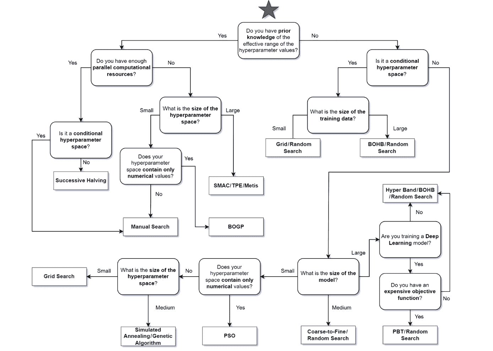

图 12.1 – HTDM

在 HTDM 中，“小”、“中”和“大”的定义非常主观。然而，您可以参考以下表格作为经验法则：

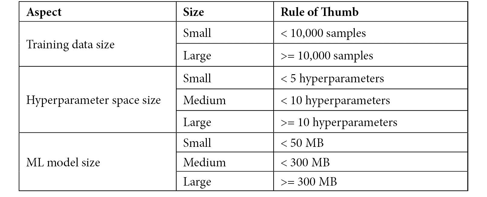

图 12.2 – 大小定义的经验法则

以下重要注意事项也可能帮助我们决定在特定情况下应采用哪种超参数调整方法：

.jpg).jpg)

图 12.3 – 每个超参数调整方法的注意事项

在本节中，我们讨论了 HTDM，以及一些额外的注意事项，以帮助您决定在特定情况下应该采用哪种超参数调整方法。在接下来的几节中，我们将通过几个有趣的研究案例学习如何在实际中利用 HTDM。

# 案例研究 1 – 使用 HTDM 与 CatBoost 分类器

假设我们正在基于第七章中介绍的营销活动数据训练一个分类器*第七章**，通过 scikit 进行超参数调整。在这里，我们使用 CatBoost（见*第十一章**，了解流行算法的超参数）作为分类器。这是我们第一次处理给定数据。我们使用的笔记本电脑只有单核 CPU，超参数空间定义如下。请注意，我们不是在处理条件超参数空间：

+   `iterations`: `randint(5,200)`

+   `depth`: `randint(3,10)`

+   `learning_rate`: `np.linspace(1e-5,1e-3,20)`

+   `l2_leaf_reg`: `np.linspace(1,30,30)`

+   `one_hot_max_size`: `randint(2,15)`

根据给定的案例描述，我们可以尝试利用 HTDM 来帮助我们选择最适合条件的超参数调整方法。首先，我们知道我们没有关于给定数据中良好超参数值的先验知识或元学习结果。这意味着我们只会关注 HTDM 中第一个节点右侧的分支，如图所示：

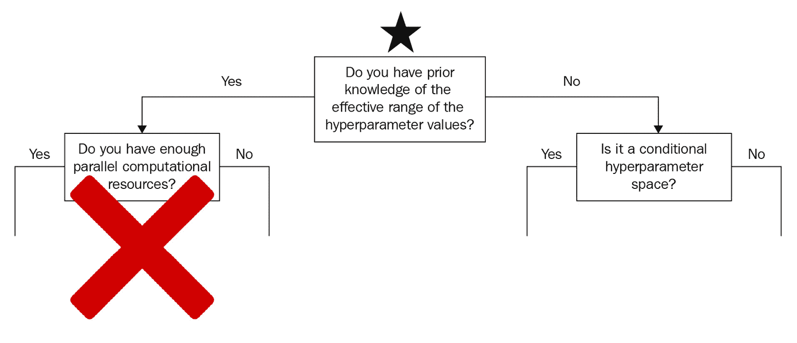

图 12.4 – 案例研究 1，无先验知识

我们知道我们不是在处理条件超参数空间。这意味着我们只会关注第二个节点右侧的分支，如图所示：

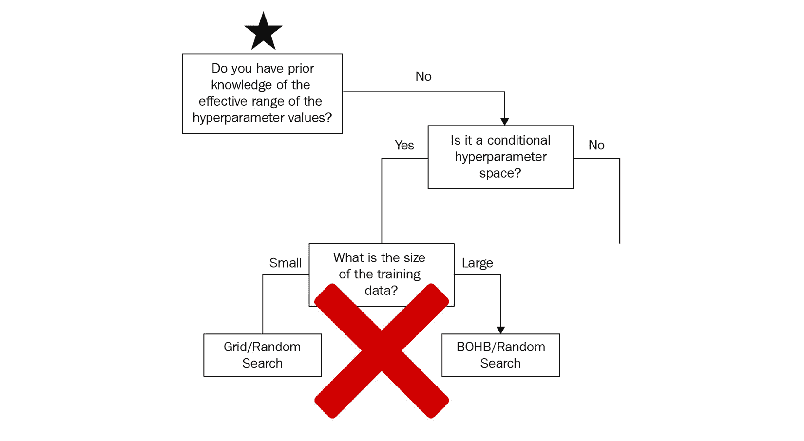

图 12.5 – 案例研究 1，非条件超参数空间

根据粗略估计，我们的 CatBoost 模型的大小应该在小型到中型范围内。这意味着我们只会关注第三个节点的左侧和底部分支，如图所示：

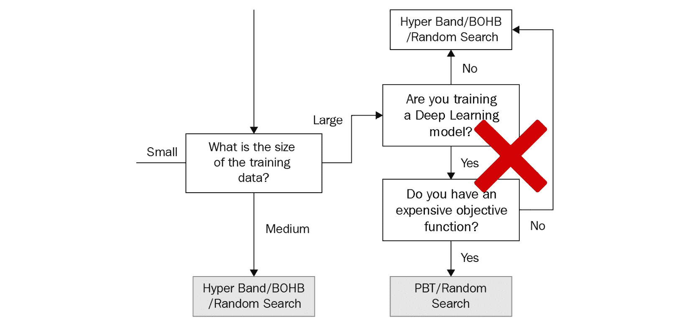

图 12.6 – 案例研究 1，小到中等模型大小

我们还有一个仅由数值组成的中等大小的超参数空间。这意味着我们的选项是粗到细搜索、随机搜索、PSO、模拟退火和遗传算法。值得注意的是，尽管我们的超参数空间仅由数值组成，我们仍然可以利用适用于混合类型值的超参数调整方法：

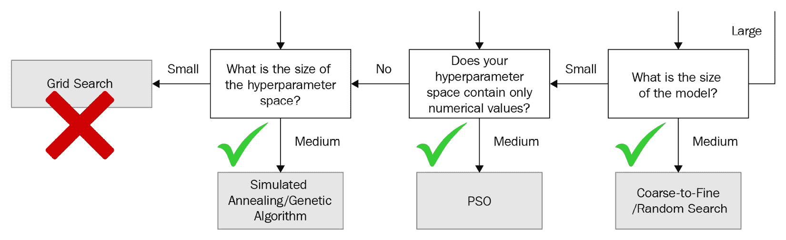

图 12.7 – 案例研究 1，中等大小的超参数空间，仅包含数值

那么，我们如何从所选选项中选择一个超参数调整方法呢？首先，我们知道 PSO 只在连续类型的超参数值上表现良好，而我们的超参数空间中也有整数。因此，我们可以从我们的选项中移除 PSO。这让我们剩下四个选项。选择最佳超参数调整方法的一个简单而有效的方法是选择最简单的方法，即随机搜索方法。

在本节中，我们讨论了如何在实际中利用 HTDM 的第一个案例研究。在下一节中，我们将使用另一个有趣的案例研究进行同样的操作。

# 案例研究 2 – 使用 HTDM 和条件超参数空间

假设我们面临与上一节类似的情况，但现在我们正在处理一个条件超参数空间，如下定义：

```py
one_hot_max_size = randint(2,15)
```

```py
iterations = randint(5,200)
```

```py
If iterations < 50:
```

```py
   depth = randint(3,10)
```

```py
   learning_rate = np.linspace(5e-4,1e-3,10)
```

```py
   l2_leaf_reg = np.linspace(1,15,20)
```

```py
elif iterations < 100:
```

```py
   depth = randint(3,7)
```

```py
   learning_rate = np.linspace(1e-5,5e-4,10)
```

```py
l2_leaf_reg = np.linspace(5,20,20)
```

```py
else:
```

```py
     depth = randint(3,5)
```

```py
     learning_rate = np.linspace(1e-6,5e-5,10)
```

```py
l2_leaf_reg = np.linspace(5,30,20)
```

根据给定的案例描述，我们可以再次尝试利用 HTDM 来帮助我们选择哪种超参数调整方法最适合条件。在这里，与先前的案例研究类似，我们知道我们没有关于给定数据中良好超参数值的先验知识或元学习结果。这意味着我们只会关注 HTDM 中第一个节点右侧的分支（参见*图 12.4*）。然而，在这个案例中，我们现在正在处理一个条件超参数空间。这意味着我们只会关注第二个节点左侧的分支，如下所示：

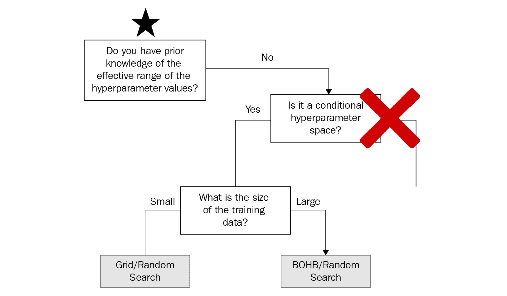

图 12.8 – 案例研究 2，一个条件超参数空间

由于我们有超过 10,000 个训练数据样本（参见*第七章**，通过 scikit 进行超参数调整*），根据 HTDM，我们只有两种超参数调整方法可供选择，即 BOHB 或随机搜索方法（参见*图 12.9*）。如果我们只从实现简单性的角度比较它们，那么选择随机搜索而不是 BOHB 肯定是一个明智的选择，因为我们需要安装 Microsoft NNI 包才能采用 BOHB 方法（参见*图 12.3*）。

然而，我们知道我们正在处理一个不是非常小的模型，BOHB 可以根据以往的经验决定需要搜索哪个子空间，而不是基于运气。因此，从理论上讲，BOHB 将是一个更好的选择，可以节省我们寻找最佳超参数集的时间。那么，我们应该选择哪种方法呢？这取决于您的判断：

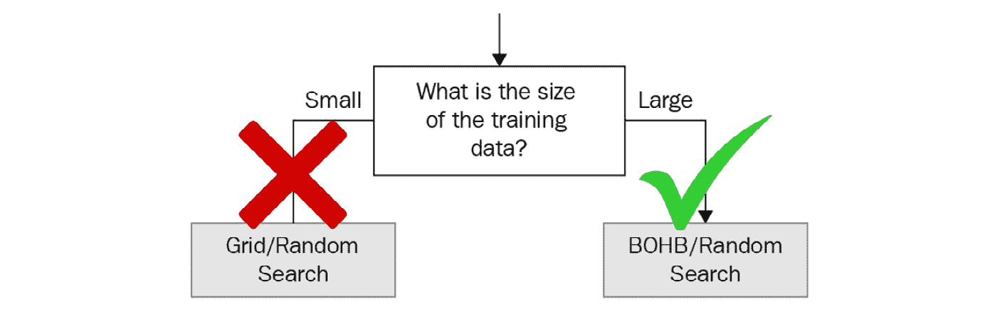

图 12.9 – 案例研究 2，大量训练数据

在本节中，我们讨论了如何在实际中利用 HTDM 的第二个案例研究。在下一节中，我们将使用另一个有趣的案例研究进行同样的操作。

# 案例研究 3 – 使用 HTDM 和超参数值的先验知识

假设在这种情况下，我们面临与之前案例研究类似的情况，但这次，我们由于我们团队中的数据科学家之前处理过相同的数据，因此对给定数据的良好超参数值有先验知识。这意味着我们只需关注 HTDM 中第一个节点左侧的分支，如图所示：

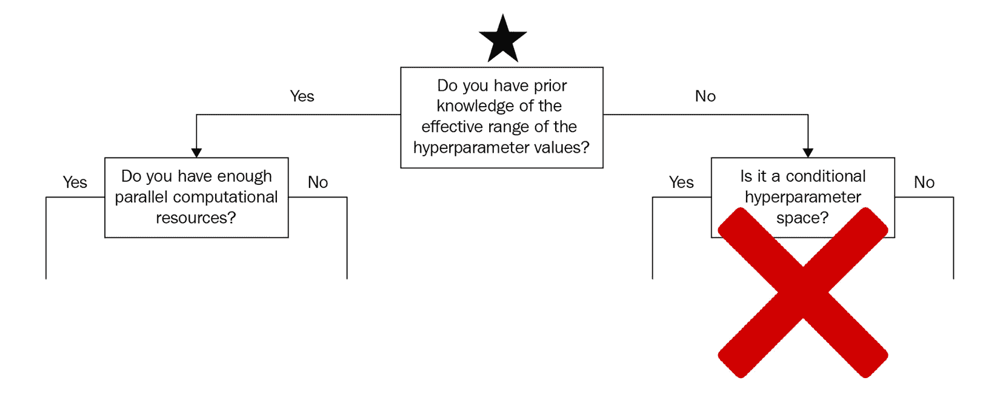

图 12.10 – 案例研究 3，具备先验知识

根据给定的案例描述，我们知道我们缺乏足够的并行计算资源，因为我们只有一个单核 CPU。这意味着我们只需关注第二个节点右侧的分支，如图所示：

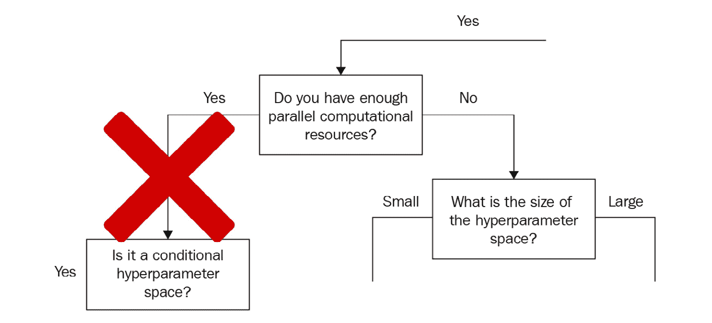

图 12.11 – 案例研究 3，缺乏并行计算资源

我们还知道我们有一个中等大小的超参数空间，它只包含数值类型的值。这意味着我们的选项是 SMAC、TPE 和 Metis：

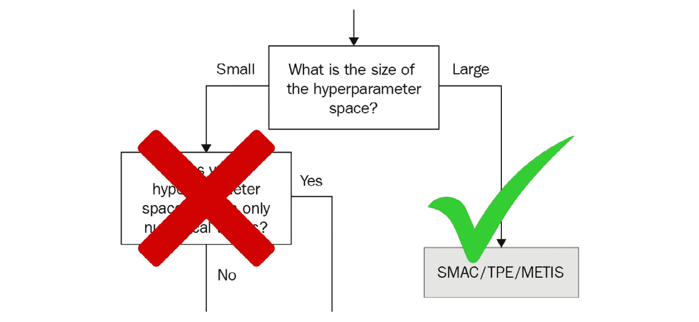

图 12.12 – 案例研究 3，中等大小的超参数空间，仅包含数值

根据前面的图表，我们知道当超参数空间主要由分类超参数主导时，SMAC 表现最佳，但这里并非如此。因此，我们可以从我们的选项中移除 SMAC。如果我们试图根据实现流行度来决定，那么 TPE 是我们应该选择的一个，因为它在 Hyperopt、Optuna 和 NNI 中都有实现，而 Metis 只在 NNI 中实现。然而，Metis 的一个主要卖点是其能够建议我们在下一次试验中应该测试的超参数集合。那么，我们应该选择哪种方法呢？这取决于你。

在本节中，我们讨论了如何在实践中利用 HTDM 的第三个案例研究。现在，让我们总结本章内容。

# 摘要

在本章中，我们将迄今为止讨论的所有超参数调整方法总结在一个简单的决策图 HTDM 中。这可以帮助你选择最适合你特定问题的方法。我们还讨论了每种超参数调整方法的重要注意事项，并展示了如何在实践中利用 HTDM。从现在起，你将能够在实践中利用 HTDM 来帮助你决定在特定情况下采用哪种超参数调整方法。

在下一章中，我们将讨论跟踪超参数调整实验的必要性，并学习如何使用几个开源软件包来做到这一点。
