# 第十三章：*第十三章*：跟踪超参数调优实验

与大量实验一起工作时，有时可能会感到不知所措。需要执行许多实验迭代。当我们尝试许多机器学习模型时，这将会变得更加复杂。

在本章中，您将了解到跟踪超参数调优实验的重要性，以及常规实践。您还将了解到一些可用的开源包，并学习如何在实践中利用它们。

到本章结束时，您将能够利用您喜欢的包来跟踪您的超参数调优实验。能够跟踪您的超参数调优实验将提高您工作流程的有效性。

在本章中，我们将涵盖以下主题：

+   重温常规实践

+   探索 Neptune

+   探索 Scikit-Optimize

+   探索 Optuna

+   探索 Microsoft NNI

+   探索 MLflow

# 技术要求

在本章中，我们将学习如何使用各种包跟踪超参数调优实验。为了确保您能够复现本章中的代码示例，您将需要以下内容：

+   Python 3（版本 3.7 或更高）

+   `pandas` 包（版本 1.3.4 或更高）

+   `NumPy` 包（版本 1.21.2 或更高）

+   `scikit-learn` 包（版本 1.0.1 或更高）

+   `matplotlib` 包（版本 3.5.0 或更高）

+   `Plotly` 包（版本 4.0.0 或更高）

+   `Neptune-client` 包（版本 0.16.3 或更高）

+   `Neptune-optuna` 包（版本 0.9.14 或更高）

+   Scikit-Optimize 包（版本 0.9.0 或更高）

+   `TensorFlow` 包（版本 2.4.1 或更高）

+   `Optuna` 包（版本 2.10.0 或更高）

+   `MLflow` 包（版本 1.27.0 或更高）

本章的所有代码示例都可以在 GitHub 上找到：[`github.com/PacktPublishing/Hyperparameter-Tuning-with-Python`](https://github.com/PacktPublishing/Hyperparameter-Tuning-with-Python)。

# 重温常规实践

在一个小规模项目中执行超参数调优实验可能看起来很简单。我们可以轻松地进行多次实验迭代，并将所有结果写入一个单独的文档中。我们可以在每个实验迭代中记录最佳超参数值集（或如果我们执行手动搜索方法，如*第三章**，穷举搜索*）的详细信息，以及评估指标。通过拥有实验日志，我们可以从历史中学习，并在实验的下一轮迭代中定义更好的超参数空间。

当我们采用自动超参数调整方法（除了手动搜索方法之外的所有我们之前讨论过的方法）时，我们可以直接获得最终的最佳超参数值集合。然而，当我们采用手动搜索方法时并非如此。我们需要手动测试大量的超参数集合。社区在执行手动搜索时采用了几种实践。让我们来看看。

## 使用内置的 Python 字典

这是最直接的方法，因为我们只需要创建一个 Python 字典来存储所有需要测试的超参数值。尽管这种做法非常简单，但它也有缺点。例如，我们可能没有注意到覆盖了一些超参数值，并且忘记记录正确的超参数值集合。以下示例展示了如何使用内置的 Python 字典来存储所有需要测试的超参数值，需要在特定的手动搜索迭代中进行测试：

```py
hyperparameters = {
```

```py
'n_estimators': 30,
```

```py
'max_features': 10,
```

```py
'criterion': 'gini',
```

```py
'max_depth': 5,
```

```py
'min_samples_split': 0.03,
```

```py
'min_samples_leaf': 1,
```

```py
}
```

接下来，让我们看看配置文件。

## 使用配置文件

不论是 JSON、YAML 还是 CFG 文件，配置文件都是另一种选择。我们可以在配置文件中放置所有超参数的详细信息，以及其他附加信息，包括（但不限于）项目名称、作者名称和数据预处理管道方法。一旦创建了配置文件，你就可以将其加载到你的 Python 脚本或 Jupyter 笔记本中，并像处理标准的 Python 字典一样处理它。使用配置文件的主要优势是所有重要参数都位于单个文件中，因此将非常容易重用之前保存的配置文件，并提高代码的可读性。然而，在处理大型项目或庞大的代码库时，有时使用配置文件可能会让我们感到困惑，因为我们不得不维护多个配置文件。

## 使用额外的模块

如果你想要通过命令行界面（CLI）指定超参数值或其他任何训练参数，`argparse` 和 `Click` 模块会很有用。这些模块可以在我们用 Python 脚本编写代码时使用，而不是在 Jupyter 笔记本中。

### 使用 argparse

以下代码展示了如何在 Python 脚本中利用 `argparse`：

```py
import argparse
```

```py
parser = argparse.ArgumentParser(description='Hyperparameter Tuning')
```

```py
parser.add_argument('--n_estimators, type=int, default=30, help='number of estimators')
```

```py
parser.add_argument('--max_features, type=int, default=20, help='number of randomly sampled features for choosing the best splitting point')
```

```py
parser.add_argument('--criterion, type=str, default='gini', help='homogeneity measurement method')
```

```py
parser.add_argument('--max_depth, type=int, default=5, help='maximum tree depth')
```

```py
parser.add_argument('--min_samples_split, type=float, default=0.03, help='minimum samples to split internal node')
```

```py
parser.add_argument('--min_samples_leaf, type=int, default=1, help='minimum number of samples in a leaf node')
```

```py
parser.add_argument('--data_dir, type=str, required=True, help='maximum tree depth')
```

以下代码展示了如何从命令行界面（CLI）访问值：

```py
args = parser.parse_args()
```

```py
print(args.n_estimators)
```

```py
print(args.max_features)
```

```py
print(args.criterion)
```

```py
print(args.max_depth)
```

```py
print(args.min_samples_split)
```

```py
print(args.min_samples_leaf)
```

```py
print(args.data_dir)
```

你可以按照以下方式使用指定的参数运行 Python 脚本：

```py
python main.py --n_estimators 35 -–criterion "entropy" -–data_dir "/path/to/my/data"
```

值得注意的是，如果你在调用 Python 脚本时没有指定超参数，将使用默认的超参数值。

### 使用 click

以下代码展示了如何在 Python 脚本中利用 `click`。请注意，`click` 与 `argparse` 非常相似，但实现更简单。我们只需要在特定函数上添加装饰器：

```py
import click
```

```py
@click.command()
```

```py
@click.option("--n_estimators, type=int, default=30, help='number of estimators")
```

```py
@click.option("--max_features, type=int, default=20, help='number of randomly sampled features for choosing the best splitting point")
```

```py
@click.option("--criterion, type=str, default='gini', help='homogeneity measurement method")
```

```py
@click.option("--max_depth, type=int, default=5, help='maximum tree depth")
```

```py
@click.option("--min_samples_split, type=float, default=0.03, help='minimum samples to split internal node")
```

```py
@click.option("--data_dir, type=str, required=True, help='maximum tree depth")
```

```py
def hyperparameter_tuning(n_estimators, max_features, criterion, max_depth, min_samples_split, data_dir):
```

```py
#write your code here
```

与 `argparse` 类似，你可以使用指定的参数运行 Python 脚本，如下所示。如果你在调用 Python 脚本时没有指定它们，将使用默认的超参数值：

```py
python main.py --n_estimators 35 -–criterion "entropy" -–data_dir "/path/to/my/data"
```

尽管使用 `argparse` 或 `click` 进行实验非常容易，但值得注意的是，它们都不会保存任何值。因此，在每次试验中记录所有实验的超参数值需要额外的努力。

无论我们采用手动搜索还是其他自动化超参数调整方法，如果需要手动记录实验结果详情，这将需要大量的工作。特别是当我们处理更大规模的实验时，我们必须测试几个不同的机器学习模型、数据预处理管道和其他实验设置，这可能会让人感到不知所措。这就是为什么在接下来的章节中，您将了解到几个可以帮助您跟踪超参数调整实验的包，以便您拥有更有效的流程。

# 探索 Neptune

**Neptune** 是一个 Python（和 R）包，充当 MLOps 的元数据存储。此包支持许多用于处理模型构建元数据的特性。我们可以利用 Neptune 来跟踪我们的实验，不仅限于超参数调整实验，还包括其他与模型构建相关的实验。我们只需使用一个包就可以记录、可视化、组织和管理工作。此外，它还支持模型注册并实时监控我们的机器学习作业。

安装 Neptune 非常简单 – 您可以使用 `pip install neptune-client` 或 `conda install -c conda-forge neptune-client`。一旦安装完成，您需要注册一个账户以获取 API 令牌。Neptune 在个人计划配额限制内是免费的，但如果您想为商业团队使用 Neptune，则需要付费。有关注册 Neptune 的更多信息，请访问他们的官方网站：https://neptune.ai/register。

使用 Neptune 来帮助跟踪您的超参数调整实验非常简单，如下面的步骤所示：

1.  从您的 Neptune 账户主页创建一个新的项目：

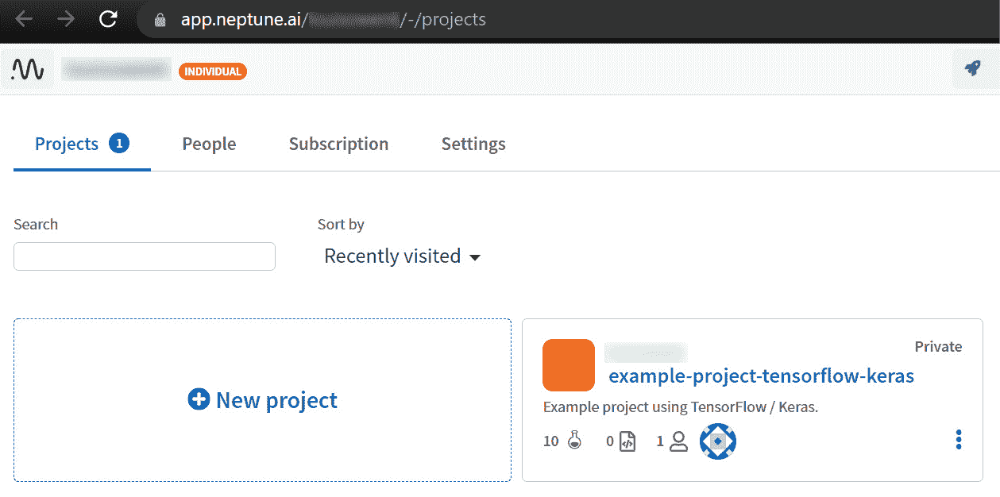

图 13.1 – 创建一个新的 Neptune 项目

1.  为您的项目输入一个名称和描述：

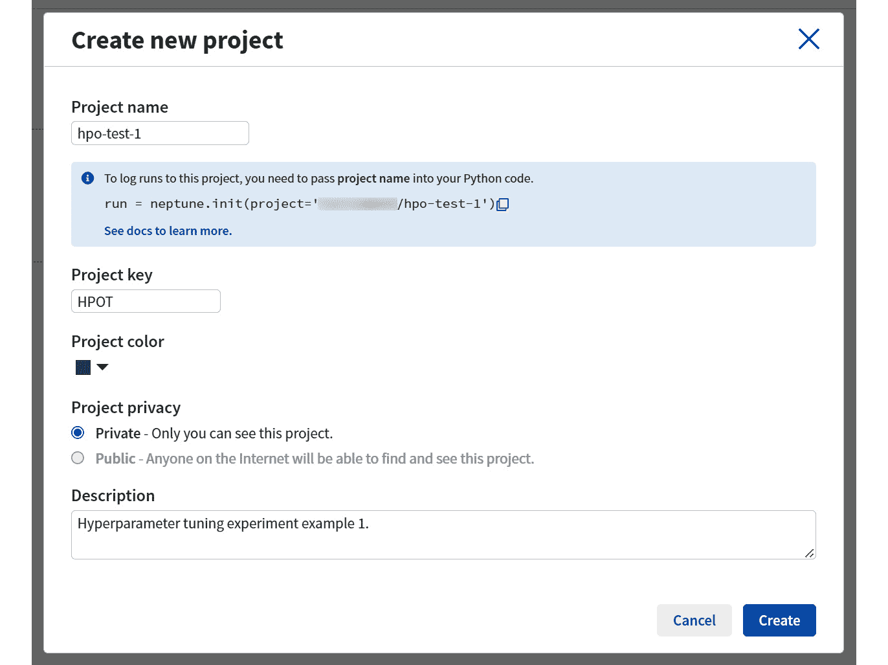

图 13.2 – 输入项目详情

1.  编写超参数调整实验脚本。Neptune 提供了基于您想要使用的框架的模板代码选项，包括但不限于 Optuna、PyTorch、Keras、TensorFlow、scikit-learn 和 XGBoost。您可以直接复制提供的模板代码并根据您的需求进行定制。例如，让我们使用提供的模板代码为 Optuna（见 *图 13.3*）并保存训练脚本为 `train_optuna.py`。请参阅本书 GitHub 仓库中的完整代码，该代码在 *技术要求* 部分提供：

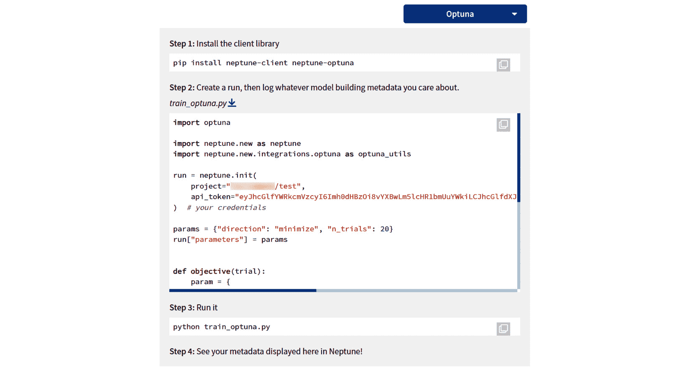

图 13.3 – 创建超参数调整实验脚本

1.  运行超参数调整脚本（`python train_optuna.py`）并查看 Neptune 项目页面上的实验元数据。每个运行都将存储为 Neptune 中的一个新实验 ID，因此您不必担心实验版本控制，因为 Neptune 会自动为您处理：


图 13.4 – Neptune 的实验运行表

您还可以看到每个实验运行的全部元数据，包括（但不限于）测试的超参数、源代码、CPU/GPU 使用情况、指标图表、工件（数据、模型或任何其他相关文件）和图表（例如，混淆矩阵），如下面的截图所示：

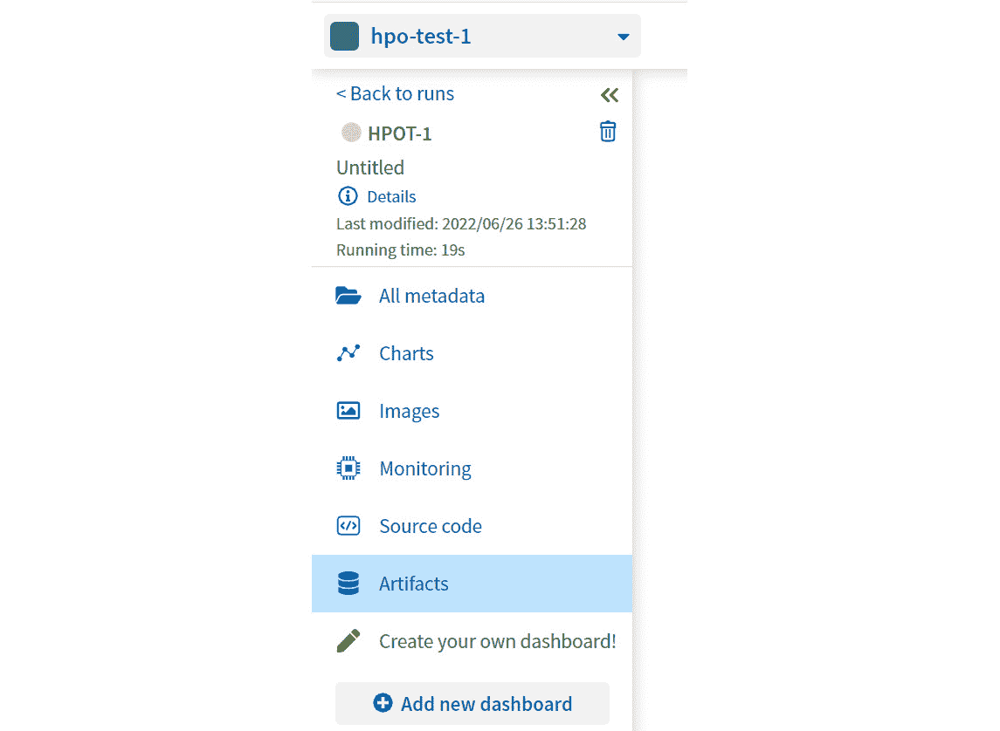

图 13.5 – 存储在 Neptune 中的元数据

1.  分析实验结果。Neptune 不仅可以帮助您记录每个实验运行的全部元数据，还可以使用多种比较策略比较几个不同的运行。您可以通过并行图或折线图查看超参数值比较。您还可以通过**并排比较**策略比较所有实验细节（见图 13.6）。此外，Neptune 还使我们能够比较每个运行之间记录的图像或工件：


图 13.6 – 比较实验运行及其结果

有关在 Neptune 中可以记录和显示的信息的更多信息，请参阅官方文档页面：https://docs.neptune.ai/you-should-know/what-can-you-log-and-display。

Neptune 的集成

Neptune 为机器学习相关实验以及特定超参数调整任务提供了许多集成。Neptune 支持三种超参数调整任务的集成：Optuna、Keras 和 Scikit-Optimize。有关更多信息，请参阅官方文档页面：https://docs.neptune.ai/integrations-and-supported-tools/intro。

更多示例

Neptune 是一个非常强大的包，可以用于其他机器学习实验相关任务。有关如何一般使用 Neptune 的更多示例，请参阅官方文档页面：https://docs.neptune.ai/getting-started/examples。

在本节中，您已了解 Neptune 及其如何帮助您跟踪超参数调整实验。在下一节中，您将学习如何利用著名的 Scikit-Optimize 包进行超参数调整实验跟踪。

# 探索 scikit-optimize

您在*第七章*中介绍了**Scikit-Optimize**包，*通过 Scikit 进行超参数调整*，以进行超参数调整实验。在本节中，我们将学习如何利用此包跟踪使用此包进行的所有超参数调整实验。

Scikit-Optimize 提供了非常棒的可视化图表，这些图表总结了测试的超参数值、目标函数分数以及它们之间的关系。本包中有三个图表可用，如上图所示。更多详细信息，请参阅本书 GitHub 仓库中的完整代码。以下图表是基于在 *第七章* 中提供的相同实验设置生成的，*通过 Scikit 进行超参数调整*，用于 BOGP 超参数调整方法：

+   `plot_convergence`：这个用于可视化每个迭代的超参数调整优化进度：

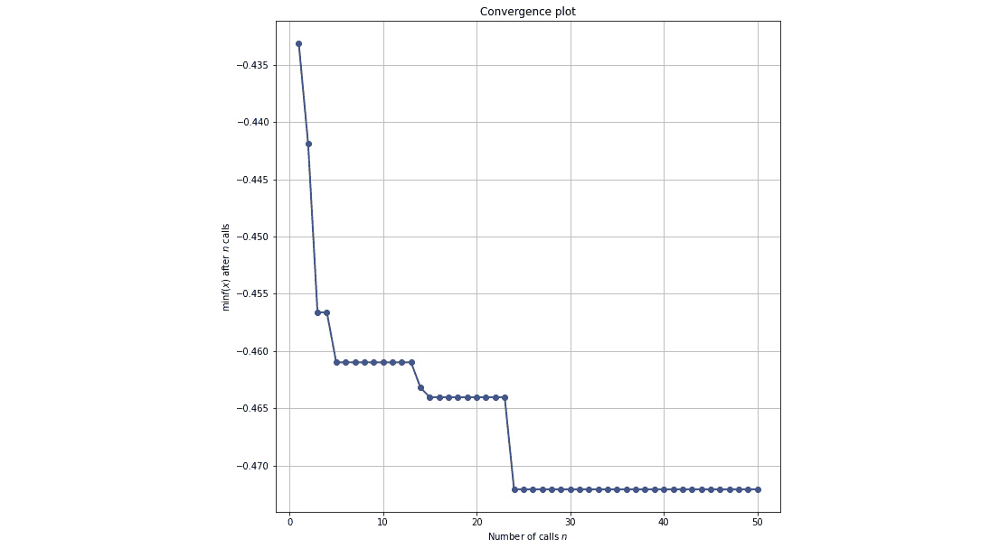

图 13.7 – 收敛图

+   `plot_evaluations`：这个用于可视化优化进化的历史过程。换句话说，它显示了在优化过程中超参数值被采样的顺序。对于每个超参数，都会生成一个探索的超参数值的直方图。对于每个超参数对，都会可视化测试的超参数值的散点图，并配备颜色作为进化历史的图例（从蓝色到黄色）：

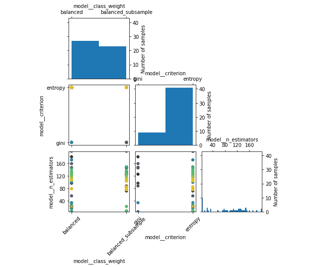

图 13.8 – 评估图

+   `plot_objective`：这个用于可视化目标函数的对应依赖图。这种可视化有助于我们了解测试的超参数值与目标函数分数之间的关系。从这张图中，你可以看到哪个子空间需要更多的关注，以及哪个子空间，甚至哪个超参数，需要在下一次试验中从原始空间中移除：

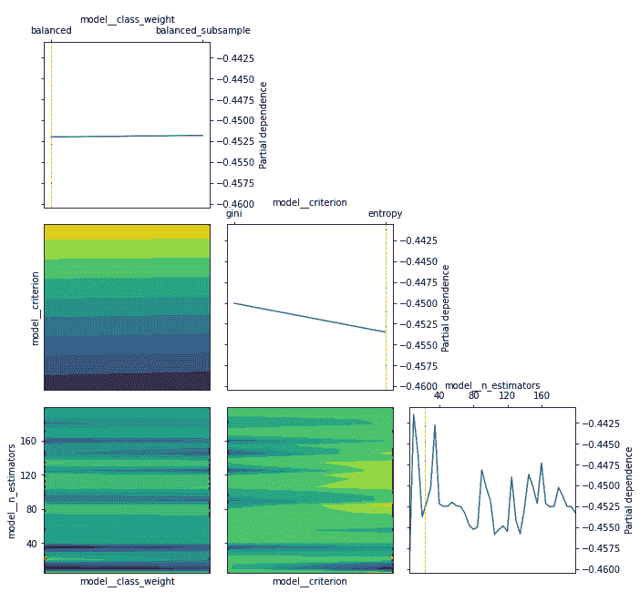

图 13.9 – 对应依赖图

与 Neptune 集成

Scikit-Optimize 提供了非常信息丰富的可视化模块。然而，它不像 Neptune 包那样支持任何实验版本化功能。为了取长补短，我们可以通过其集成模块将 Scikit-Optimize 与 Neptune 集成。有关更多信息，请参阅官方文档页面：https://docs-legacy.neptune.ai/integrations/skopt.html。

在本节中，你学习了如何利用 Scikit-Optimize 包来帮助你跟踪你的超参数调整实验。在下一节中，你将学习如何利用 Optuna 包进行超参数调整实验跟踪。

# 探索 Optuna

**Optuna** 是一个 Python 超参数调整包，它提供了几种超参数调整方法。我们在 *第九章* 中讨论了如何利用 Optuna 进行超参数调整实验，*通过 Optuna 进行超参数调整*。在这里，我们将讨论如何利用这个包来跟踪这些实验。

与 Scikit-Optimize 类似，Optuna 提供了非常优秀的可视化模块，帮助我们跟踪超参数调优实验，并作为我们决定下一次试验中搜索哪个子空间的指南。这里展示了四个可利用的可视化模块。所有这些模块都期望以`study`对象（见*第九章*，*通过 Optuna 进行超参数调优*）作为输入。请参阅本书 GitHub 仓库中的完整代码：

+   `plot_contour`：这个用于以等高线图的形式可视化超参数（以及目标函数分数）之间的关系：

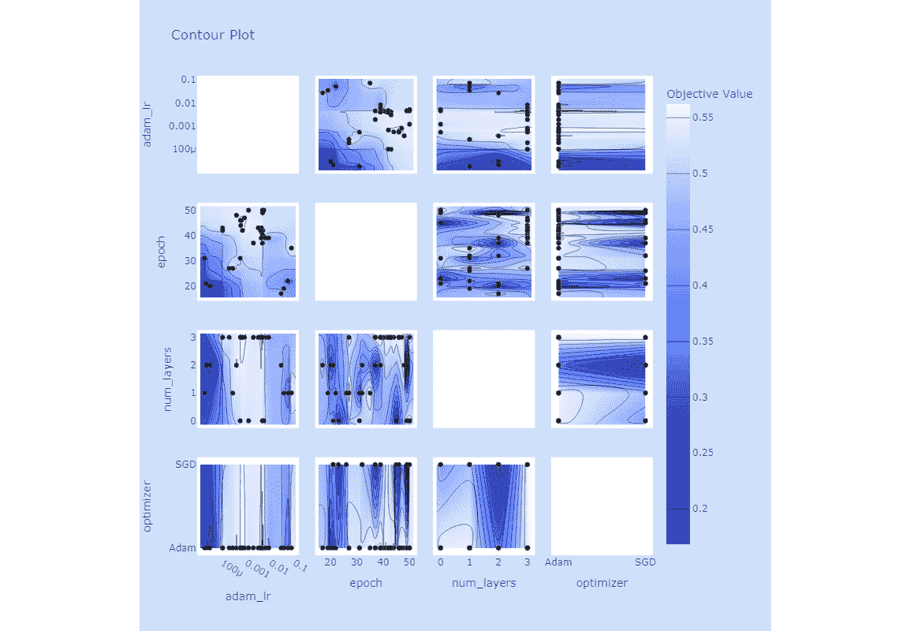

图 13.10 – 等高线图

+   `plot_optimization_history`：这个用于可视化每个迭代的超参数调优优化进度：

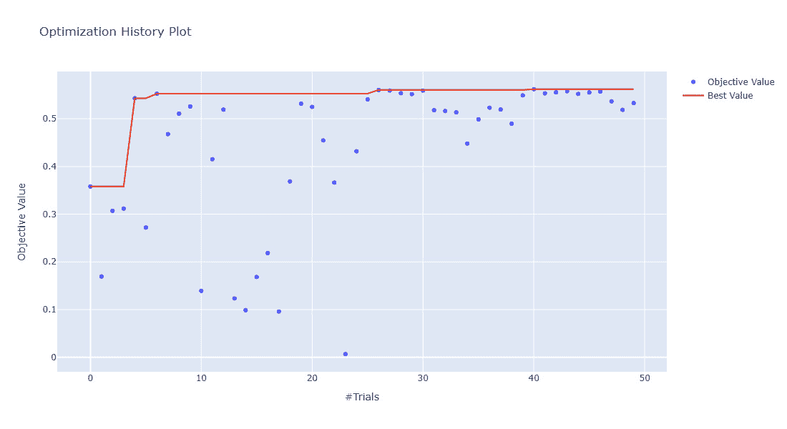

图 13.11 – 优化历史图

+   `plot_parallel_coordinate`：这个用于以平行坐标图的形式可视化超参数（以及目标函数分数）之间的关系：

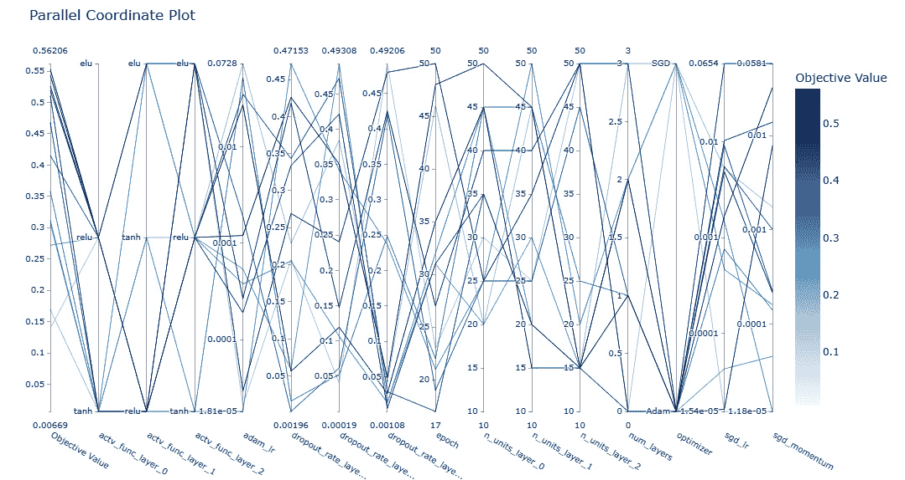

图 13.12 – 平行坐标图

+   `plot_slice`：这个用于可视化超参数调优方法搜索进化的过程。你可以看到实验中测试过的超参数值，以及搜索过程中哪个子空间受到了更多关注：

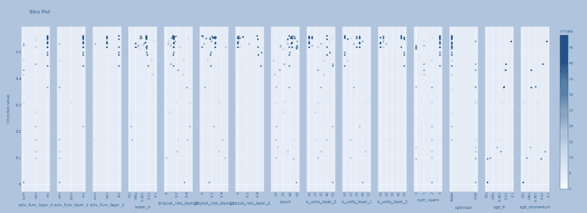

图 13.13 – 切片图

Optuna 中所有可视化模块的优点在于它们都是交互式图表，因为它们是使用`Plotly`可视化包创建的。你可以在图表中放大特定区域，并使用其他交互式功能。

与 Neptune 集成

与 Scikit-Optimize 类似，Optuna 提供了非常丰富的可视化模块。然而，它不像 Neptune 包那样支持任何实验版本化功能。我们可以通过其集成模块将 Optuna 与 Neptune 集成。有关更多信息，请参阅官方文档页面：https://docs-legacy.neptune.ai/integrations/optuna.html。

在本节中，你学习了如何利用 Optuna 包来跟踪你的超参数调优实验。在下一节中，你将学习如何利用 Microsoft NNI 包进行超参数调优实验跟踪。

# 探索 Microsoft NNI

**神经网络智能**（**NNI**）是一个由微软开发的包，不仅可以用于超参数调优任务，还可以用于神经架构搜索、模型压缩和特征工程。我们在*第十章*，*使用 DEAP 和 Microsoft NNI 进行高级超参数调优*中讨论了如何利用 NNI 进行超参数调优实验。

在本节中，我们将讨论如何利用此包来跟踪这些实验。NNI 提供的所有实验跟踪模块都位于*门户网站*。您在*第十章*中学习了关于*门户网站*的内容，*使用 DEAP 和 Microsoft NNI 进行高级超参数调整*。然而，我们还没有深入讨论，还有很多有用的功能您应该了解。

门户网站可以用来可视化所有超参数调整实验的元数据，包括但不限于调整和训练进度、评估指标和错误日志。它还可以用来更新实验的并发性和持续时间，以及重试失败的试验。以下是在 NNI 门户网站中可以用来帮助我们跟踪超参数调整实验的所有重要模块列表。以下图表是基于*第十章*中所述的相同实验设置生成的，*使用 DEAP 和 Microsoft NNI 进行高级超参数调整*，针对随机搜索方法。请参阅本书 GitHub 仓库中的完整代码：

+   **概览**页面显示了我们的超参数调整实验的概览，包括其名称和 ID、状态、开始和结束时间、最佳指标、已过持续时间、按状态分面的试验数量，以及实验路径、训练平台和调整器详情。在这里，您还可以更改最大持续时间、最大试验数量和实验的并发性。还有一个专门的模块显示表现最佳的试验：

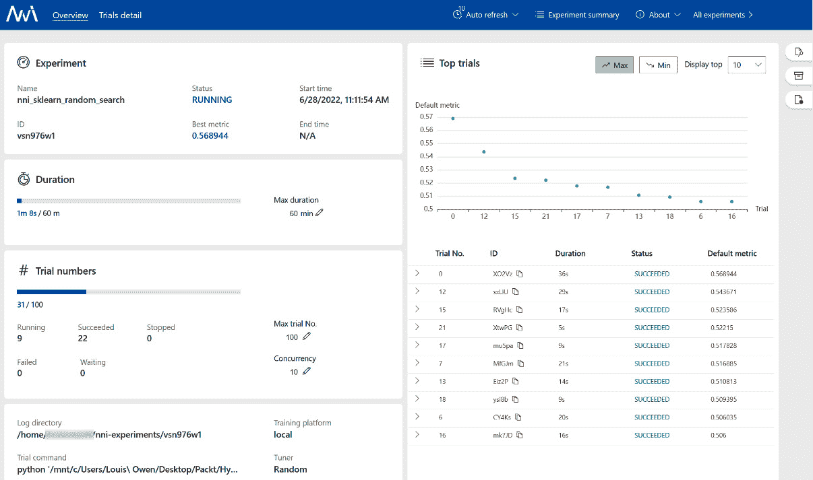

图 13.14 – 概览页面

+   **试验详情**页面显示了关于实验试验的每一个细节，包括所有指标的可视化（见 *图 13.15*），超参数值的平行图（见 *图 13.16*），所有试验持续时间的条形图（见 *图 13.17*），以及显示每个试验在中间步骤趋势的所有中间结果的折线图。我们还可以通过**试验作业**模块查看每个试验的详细信息，包括但不限于试验的 ID、持续时间、状态、指标、超参数值详情和日志文件（见 *图 13.18*）：

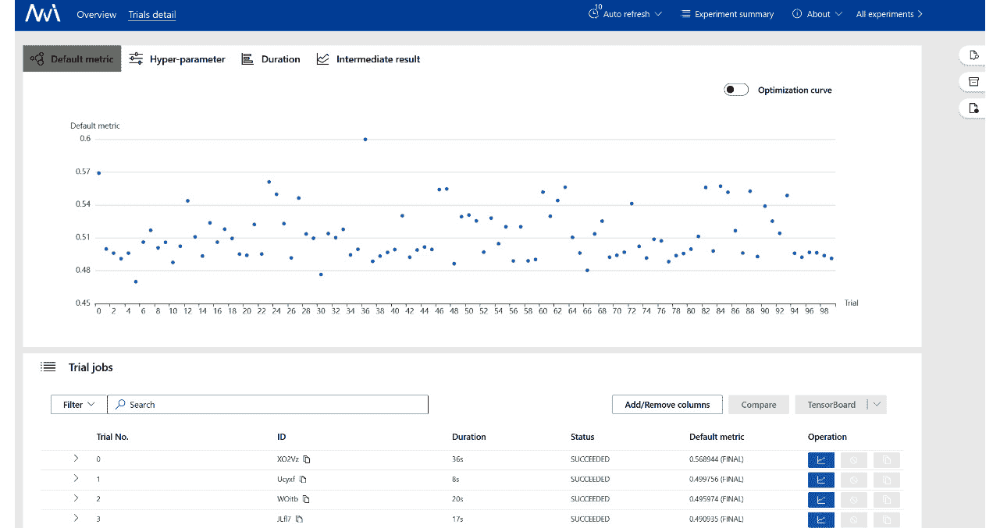

图 13.15 – 试验详情页面

下面的平行图显示了实验中测试过的不同超参数值：

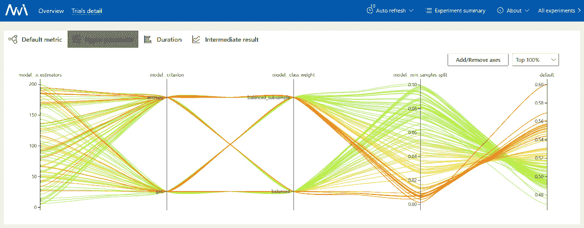

图 13.16 – 超参数值平行图

下面的条形图包含了关于实验中所有试验持续时间的详细信息：

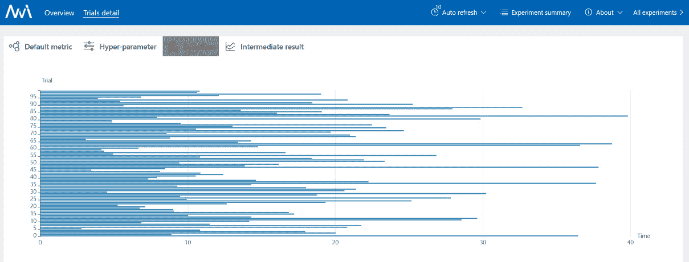

图 13.17 – 试验持续时间条形图

最后，还有**试验作业**模块：


图 13.18 – 试验作业模块

试验作业模块包括以下内容：

+   **侧边栏**：我们可以在侧边栏中访问与搜索空间、配置和日志文件相关的所有信息：

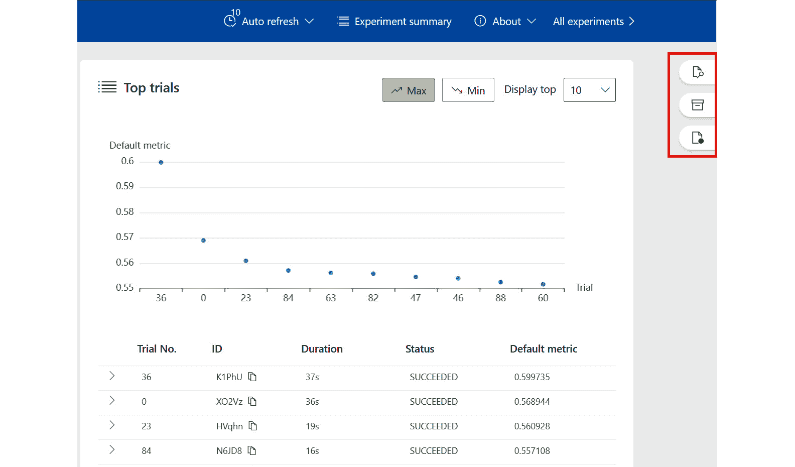

图 13.19 – 侧边栏

+   **自动刷新**按钮：我们还可以通过使用**自动刷新**按钮来更改 Web 门户的刷新间隔：


图 13.20 – 自动刷新按钮

+   **实验摘要**按钮：通过点击此按钮，你可以查看当前实验的所有摘要：


图 13.21 – 实验摘要按钮

在本节中，你学习了如何利用 Microsoft NNI 包来跟踪你的超参数调整实验。在下一节中，你将学习如何利用 MLflow 包进行超参数调整实验跟踪。

# 探索 MLflow

`pip install mlflow`命令。

要使用 MLflow 跟踪我们的超参数调整实验，我们只需在我们的代码库中添加几个日志函数。一旦我们添加了所需的日志函数，我们只需在命令行中输入`mlflow ui`命令并打开它，就可以进入提供的 UI 界面[`localhost:5000`](http://localhost:5000)。MLflow 提供了许多日志函数，以下是一些你需要了解的主要重要日志函数。请参阅完整的示例代码。

本书 GitHub 仓库中的 ode：

+   `create_experiment()`: 此函数用于创建一个新的实验。你可以指定实验的名称、标签以及存储实验工件的路由。

+   `set_experiment()`: 此函数用于将给定的实验名称或 ID 设置为当前活动实验。

+   `start_run()`: 此函数用于在当前活动实验下启动一个新的 MLflow 运行。建议在`with`块中使用此函数作为上下文管理器。

+   `log_metric()`: 此函数用于在当前活动运行中记录单个指标。如果你想进行批量记录，你也可以通过传递指标字典来使用`log_metrics()`函数。

+   `log_param()`: 此函数用于在当前活动运行中记录参数或超参数。如果你想进行批量记录，你也可以通过传递指标字典来使用`log_params()`函数。

+   `log_artifact()`: 此函数用于将文件或目录记录为当前活动运行的工件。如果你想记录本地目录的所有内容，你也可以使用`log_artifacts()`函数。

+   `set_tag()`: 此函数用于为当前活动运行设置一个标签。你必须提供标签的键和值。例如，你可以将键设置为`“release_version”`，值设置为`“1.0.0”`。

+   `log_figure()`: 此函数用于将图形作为当前活动运行的工件进行记录。此函数支持`matplotlib`和`pyplot`图形对象类型。

+   `log_image()`: 此函数用于将图像作为当前活动运行的工件进行记录。此函数支持`numpy.ndarray`和`PIL.image.image`对象类型。

MLflow 记录函数

有关 MLfLow 中所有可用记录函数的更多信息，请参阅官方文档页面：https://www.mlflow.org/docs/latest/tracking.html#logging-functions。

MLflow 集成

MLflow 还支持与许多知名开源包的集成，包括但不限于 scikit-learn、TensorFlow、XGBoost、PyTorch 和 Spark。你可以通过利用提供的集成来进行自动记录。有关更多信息，请参阅官方文档页面：https://www.mlflow.org/docs/latest/tracking.html#automatic-logging。

超参数调优用例示例

MLflow 的作者为超参数调优用例提供了示例代码。有关更多信息，请参阅官方 GitHub 仓库：https://github.com/mlflow/mlflow/tree/master/examples/hyperparam。

在本节中，你学习了如何利用 MLflow 包来跟踪你的超参数调优实验。你可以自己开始探索这个包，以更好地理解这个包的工作方式和它的强大功能。

# 摘要

在本章中，我们讨论了跟踪超参数调优实验的重要性以及常规做法。你还介绍了几个可用的开源包，并学习了如何在实践中利用它们，包括 Neptune、Scikit-Optimize、Optuna、Microsoft NNI 和 MLflow。此时，你应该能够利用你喜欢的包来跟踪你的超参数调优实验，这将提高你工作流程的有效性。

在下一章中，我们将总结本书中讨论的所有主题。我们还将讨论你可以采取的下一步来扩展你的超参数调优知识。
